# Opinion Poll by Ipsos MMI for Dagbladet, 14–16 December 2020

<a href="#voting-intentions">Voting Intentions</a> | <a href="#seats">Seats</a> | <a href="#coalitions">Coalitions</a> | <a href="#technical-information">Technical Information</a>

## Voting Intentions

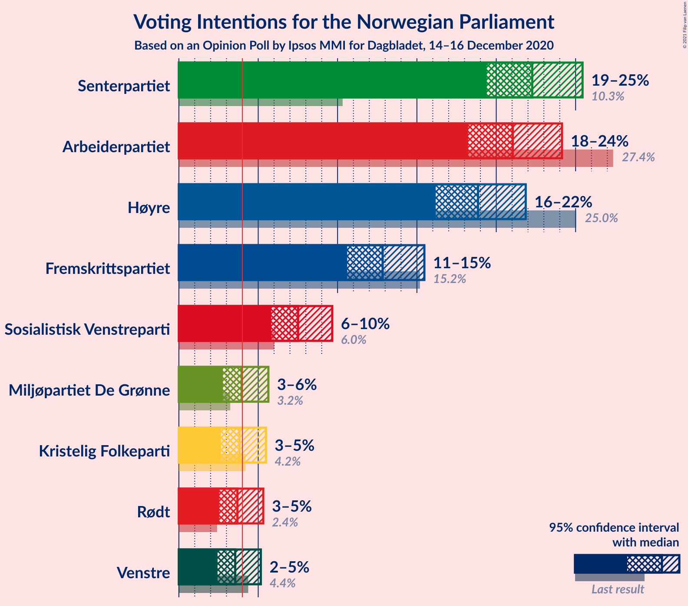

### Confidence Intervals

| Party | Last Result | Poll Result | 80% Confidence Interval | 90% Confidence Interval | 95% Confidence Interval | 99% Confidence Interval |
|:-----:|:-----------:|:-----------:|:-----------------------:|:-----------------------:|:-----------------------:|:-----------------------:|
| Senterpartiet | 10.3% | 22.3% | 20.4–24.3% |19.8–24.9% |19.4–25.4% |18.5–26.4% |
| Arbeiderpartiet | 27.4% | 21.0% | 19.2–23.1% |18.7–23.6% |18.2–24.1% |17.4–25.1% |
| Høyre | 25.0% | 18.9% | 17.1–20.8% |16.6–21.4% |16.2–21.9% |15.4–22.8% |
| Fremskrittspartiet | 15.2% | 12.8% | 11.4–14.6% |11.0–15.0% |10.6–15.5% |9.9–16.3% |
| Sosialistisk Venstreparti | 6.0% | 7.5% | 6.4–8.9% |6.1–9.3% |5.8–9.7% |5.3–10.4% |
| Miljøpartiet De Grønne | 3.2% | 4.0% | 3.2–5.1% |3.0–5.4% |2.8–5.6% |2.4–6.2% |
| Kristelig Folkeparti | 4.2% | 3.8% | 3.0–4.9% |2.8–5.2% |2.7–5.5% |2.3–6.0% |
| Rødt | 2.4% | 3.7% | 2.9–4.8% |2.7–5.0% |2.5–5.3% |2.2–5.9% |
| Venstre | 4.4% | 3.6% | 2.8–4.6% |2.6–4.9% |2.4–5.2% |2.1–5.7% |

*Note:* The poll result column reflects the actual value used in the calculations. Published results may vary slightly, and in addition be rounded to fewer digits.

## Seats

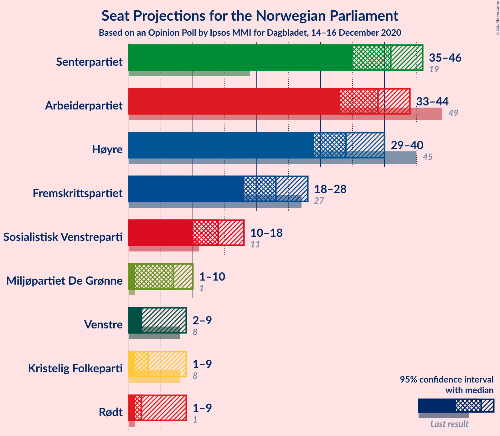

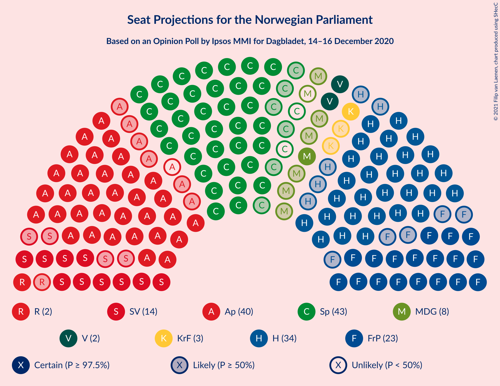

### Confidence Intervals

| Party | Last Result | Median | 80% Confidence Interval | 90% Confidence Interval | 95% Confidence Interval | 99% Confidence Interval |
|:-----:|:-----------:|:------:|:-----------------------:|:-----------------------:|:-----------------------:|:-----------------------:|
| <a href="#senterpartiet">Senterpartiet</a> | 19 | 41 | 37–45 |36–46 |35–46 |34–49 |
| <a href="#arbeiderpartiet">Arbeiderpartiet</a> | 49 | 39 | 34–42 |33–44 |33–44 |30–46 |
| <a href="#høyre">Høyre</a> | 45 | 34 | 30–39 |30–40 |29–40 |26–42 |
| <a href="#fremskrittspartiet">Fremskrittspartiet</a> | 27 | 23 | 20–26 |19–27 |18–28 |17–30 |
| <a href="#sosialistisk-venstreparti">Sosialistisk Venstreparti</a> | 11 | 14 | 11–16 |11–17 |10–18 |9–19 |
| <a href="#miljøpartiet-de-grønne">Miljøpartiet De Grønne</a> | 1 | 7 | 2–9 |2–10 |1–10 |1–11 |
| <a href="#kristelig-folkeparti">Kristelig Folkeparti</a> | 8 | 3 | 1–9 |1–9 |1–9 |1–11 |
| <a href="#rødt">Rødt</a> | 1 | 2 | 2–8 |1–9 |1–9 |1–10 |
| <a href="#venstre">Venstre</a> | 8 | 2 | 2–8 |2–9 |2–9 |1–10 |

### Senterpartiet

*For a full overview of the results for this party, see the [Senterpartiet](party-senterpartiet.html) page.*

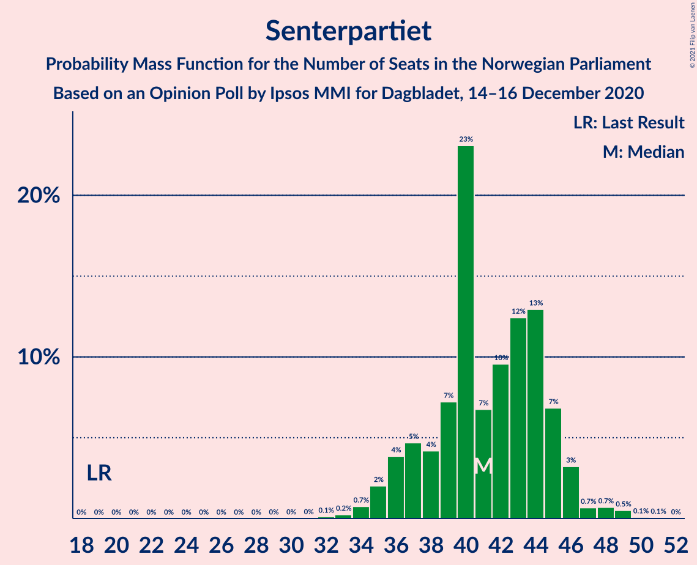

| Number of Seats | Probability | Accumulated | Special Marks |
|:---------------:|:-----------:|:-----------:|:-------------:|
| 19 | 0% | 100% | Last Result |
| 20 | 0% | 100% |  |
| 21 | 0% | 100% |  |
| 22 | 0% | 100% |  |
| 23 | 0% | 100% |  |
| 24 | 0% | 100% |  |
| 25 | 0% | 100% |  |
| 26 | 0% | 100% |  |
| 27 | 0% | 100% |  |
| 28 | 0% | 100% |  |
| 29 | 0% | 100% |  |
| 30 | 0% | 100% |  |
| 31 | 0% | 100% |  |
| 32 | 0.1% | 100% |  |
| 33 | 0.2% | 99.8% |  |
| 34 | 0.7% | 99.6% |  |
| 35 | 2% | 98.8% |  |
| 36 | 4% | 97% |  |
| 37 | 5% | 93% |  |
| 38 | 4% | 88% |  |
| 39 | 7% | 84% |  |
| 40 | 23% | 77% |  |
| 41 | 7% | 54% | Median |
| 42 | 10% | 47% |  |
| 43 | 12% | 37% |  |
| 44 | 13% | 25% |  |
| 45 | 7% | 12% |  |
| 46 | 3% | 5% |  |
| 47 | 0.7% | 2% |  |
| 48 | 0.7% | 1.4% |  |
| 49 | 0.5% | 0.7% |  |
| 50 | 0.1% | 0.2% |  |
| 51 | 0.1% | 0.1% |  |
| 52 | 0% | 0% |  |

### Arbeiderpartiet

*For a full overview of the results for this party, see the [Arbeiderpartiet](party-arbeiderpartiet.html) page.*

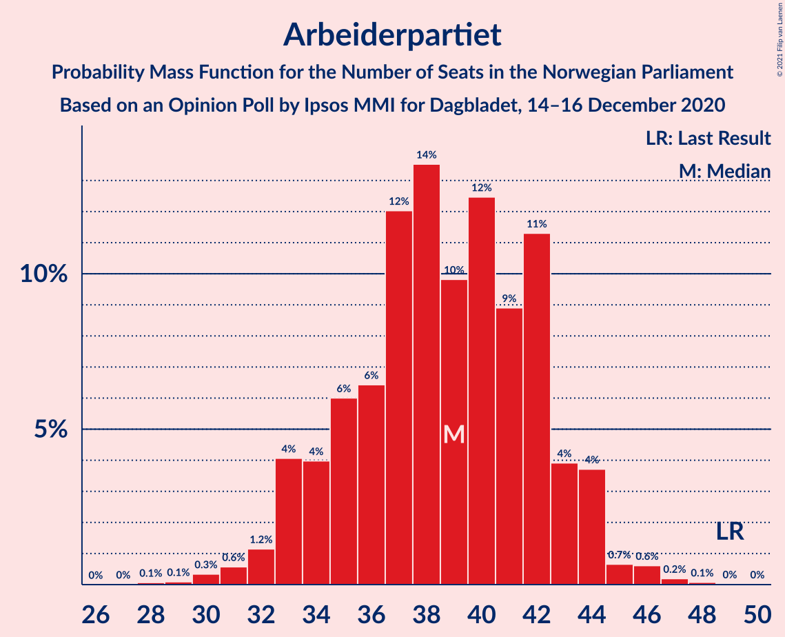

| Number of Seats | Probability | Accumulated | Special Marks |
|:---------------:|:-----------:|:-----------:|:-------------:|
| 28 | 0.1% | 100% |  |
| 29 | 0.1% | 99.9% |  |
| 30 | 0.3% | 99.8% |  |
| 31 | 0.6% | 99.5% |  |
| 32 | 1.2% | 98.9% |  |
| 33 | 4% | 98% |  |
| 34 | 4% | 94% |  |
| 35 | 6% | 90% |  |
| 36 | 6% | 84% |  |
| 37 | 12% | 77% |  |
| 38 | 14% | 65% |  |
| 39 | 10% | 52% | Median |
| 40 | 12% | 42% |  |
| 41 | 9% | 29% |  |
| 42 | 11% | 21% |  |
| 43 | 4% | 9% |  |
| 44 | 4% | 5% |  |
| 45 | 0.7% | 2% |  |
| 46 | 0.6% | 0.9% |  |
| 47 | 0.2% | 0.3% |  |
| 48 | 0.1% | 0.1% |  |
| 49 | 0% | 0% | Last Result |

### Høyre

*For a full overview of the results for this party, see the [Høyre](party-høyre.html) page.*

| Number of Seats | Probability | Accumulated | Special Marks |
|:---------------:|:-----------:|:-----------:|:-------------:|
| 25 | 0.1% | 100% |  |
| 26 | 0.4% | 99.9% |  |
| 27 | 0.8% | 99.5% |  |
| 28 | 1.2% | 98.7% |  |
| 29 | 2% | 98% |  |
| 30 | 8% | 95% |  |
| 31 | 10% | 88% |  |
| 32 | 8% | 78% |  |
| 33 | 13% | 70% |  |
| 34 | 12% | 57% | Median |
| 35 | 12% | 44% |  |
| 36 | 14% | 32% |  |
| 37 | 3% | 18% |  |
| 38 | 4% | 15% |  |
| 39 | 4% | 10% |  |
| 40 | 5% | 7% |  |
| 41 | 0.9% | 2% |  |
| 42 | 0.8% | 1.2% |  |
| 43 | 0.2% | 0.4% |  |
| 44 | 0.1% | 0.2% |  |
| 45 | 0.1% | 0.1% | Last Result |
| 46 | 0% | 0% |  |

### Fremskrittspartiet

*For a full overview of the results for this party, see the [Fremskrittspartiet](party-fremskrittspartiet.html) page.*

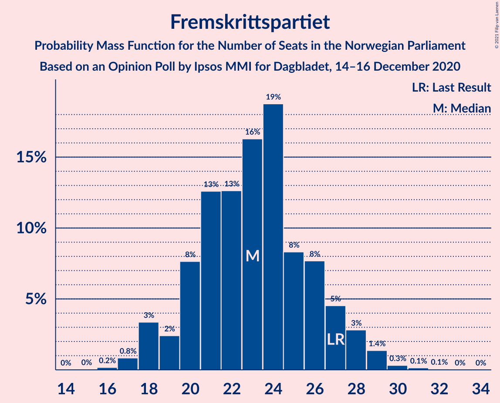

| Number of Seats | Probability | Accumulated | Special Marks |
|:---------------:|:-----------:|:-----------:|:-------------:|
| 16 | 0.2% | 100% |  |
| 17 | 0.8% | 99.8% |  |
| 18 | 3% | 98.9% |  |
| 19 | 2% | 96% |  |
| 20 | 8% | 93% |  |
| 21 | 13% | 86% |  |
| 22 | 13% | 73% |  |
| 23 | 16% | 60% | Median |
| 24 | 19% | 44% |  |
| 25 | 8% | 25% |  |
| 26 | 8% | 17% |  |
| 27 | 5% | 9% | Last Result |
| 28 | 3% | 5% |  |
| 29 | 1.4% | 2% |  |
| 30 | 0.3% | 0.5% |  |
| 31 | 0.1% | 0.2% |  |
| 32 | 0.1% | 0.1% |  |
| 33 | 0% | 0% |  |

### Sosialistisk Venstreparti

*For a full overview of the results for this party, see the [Sosialistisk Venstreparti](party-sosialistiskvenstreparti.html) page.*

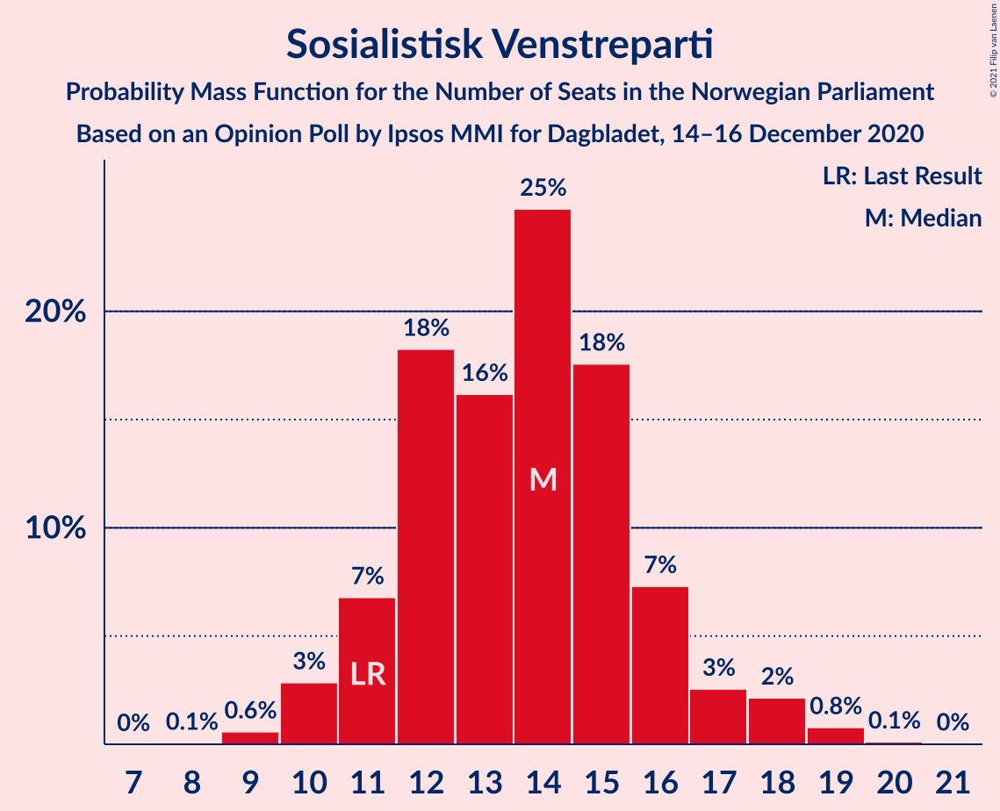

| Number of Seats | Probability | Accumulated | Special Marks |
|:---------------:|:-----------:|:-----------:|:-------------:|
| 8 | 0.1% | 100% |  |
| 9 | 0.6% | 99.9% |  |
| 10 | 3% | 99.3% |  |
| 11 | 7% | 96% | Last Result |
| 12 | 18% | 90% |  |
| 13 | 16% | 71% |  |
| 14 | 25% | 55% | Median |
| 15 | 18% | 31% |  |
| 16 | 7% | 13% |  |
| 17 | 3% | 6% |  |
| 18 | 2% | 3% |  |
| 19 | 0.8% | 0.9% |  |
| 20 | 0.1% | 0.2% |  |
| 21 | 0% | 0% |  |

### Miljøpartiet De Grønne

*For a full overview of the results for this party, see the [Miljøpartiet De Grønne](party-miljøpartietdegrønne.html) page.*

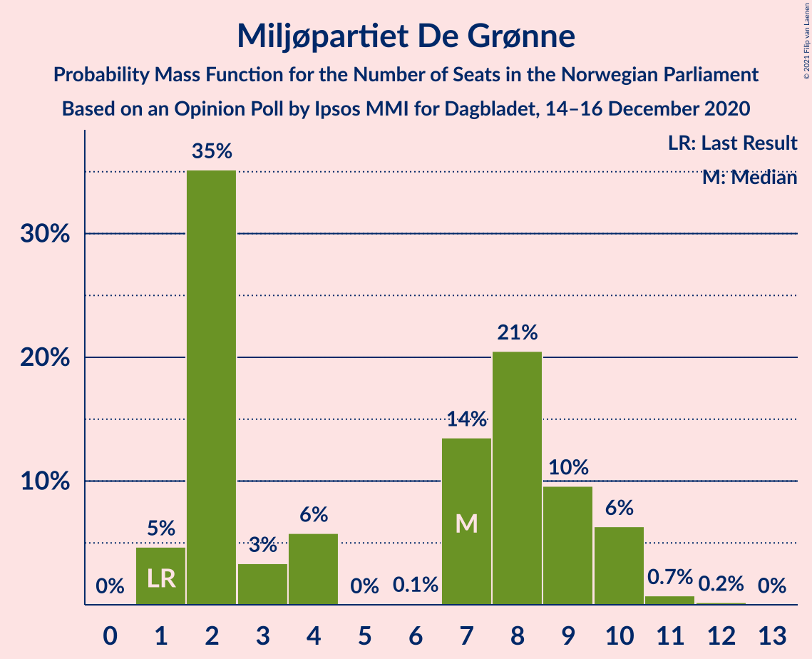

| Number of Seats | Probability | Accumulated | Special Marks |
|:---------------:|:-----------:|:-----------:|:-------------:|
| 1 | 5% | 100% | Last Result |
| 2 | 35% | 95% |  |
| 3 | 3% | 60% |  |
| 4 | 6% | 57% |  |
| 5 | 0% | 51% |  |
| 6 | 0.1% | 51% |  |
| 7 | 14% | 51% | Median |
| 8 | 21% | 37% |  |
| 9 | 10% | 17% |  |
| 10 | 6% | 7% |  |
| 11 | 0.7% | 1.0% |  |
| 12 | 0.2% | 0.2% |  |
| 13 | 0% | 0% |  |

### Kristelig Folkeparti

*For a full overview of the results for this party, see the [Kristelig Folkeparti](party-kristeligfolkeparti.html) page.*

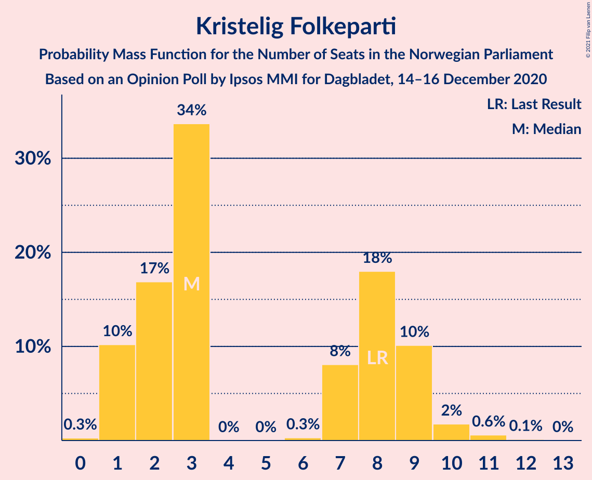

| Number of Seats | Probability | Accumulated | Special Marks |
|:---------------:|:-----------:|:-----------:|:-------------:|
| 0 | 0.3% | 100% |  |
| 1 | 10% | 99.7% |  |
| 2 | 17% | 90% |  |
| 3 | 34% | 73% | Median |
| 4 | 0% | 39% |  |
| 5 | 0% | 39% |  |
| 6 | 0.3% | 39% |  |
| 7 | 8% | 39% |  |
| 8 | 18% | 31% | Last Result |
| 9 | 10% | 13% |  |
| 10 | 2% | 2% |  |
| 11 | 0.6% | 0.7% |  |
| 12 | 0.1% | 0.1% |  |
| 13 | 0% | 0% |  |

### Rødt

*For a full overview of the results for this party, see the [Rødt](party-rødt.html) page.*

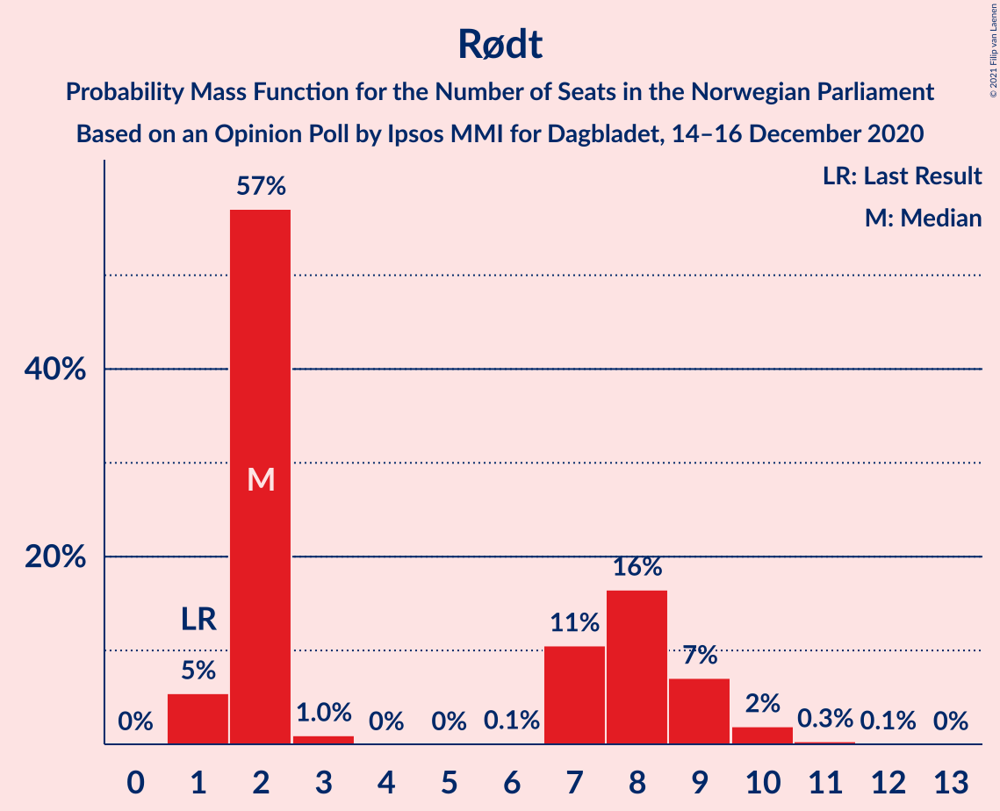

| Number of Seats | Probability | Accumulated | Special Marks |
|:---------------:|:-----------:|:-----------:|:-------------:|
| 1 | 5% | 100% | Last Result |
| 2 | 57% | 95% | Median |
| 3 | 1.0% | 37% |  |
| 4 | 0% | 37% |  |
| 5 | 0% | 37% |  |
| 6 | 0.1% | 37% |  |
| 7 | 11% | 36% |  |
| 8 | 16% | 26% |  |
| 9 | 7% | 9% |  |
| 10 | 2% | 2% |  |
| 11 | 0.3% | 0.4% |  |
| 12 | 0.1% | 0.1% |  |
| 13 | 0% | 0% |  |

### Venstre

*For a full overview of the results for this party, see the [Venstre](party-venstre.html) page.*

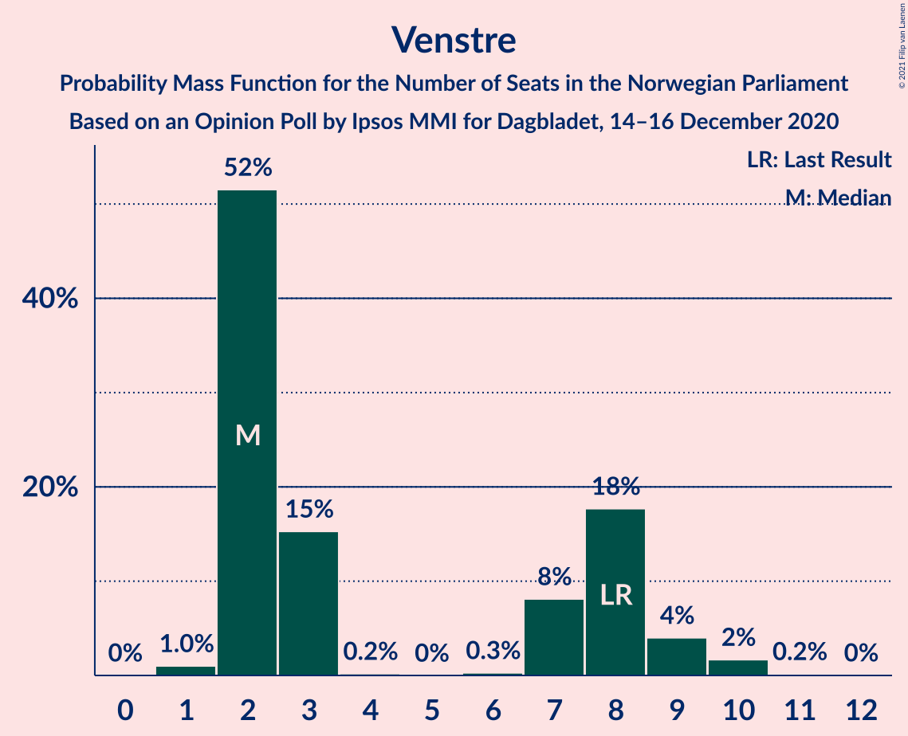

| Number of Seats | Probability | Accumulated | Special Marks |
|:---------------:|:-----------:|:-----------:|:-------------:|
| 1 | 1.0% | 100% |  |
| 2 | 52% | 99.0% | Median |
| 3 | 15% | 47% |  |
| 4 | 0.2% | 32% |  |
| 5 | 0% | 32% |  |
| 6 | 0.3% | 32% |  |
| 7 | 8% | 32% |  |
| 8 | 18% | 24% | Last Result |
| 9 | 4% | 6% |  |
| 10 | 2% | 2% |  |
| 11 | 0.2% | 0.2% |  |
| 12 | 0% | 0% |  |

## Coalitions

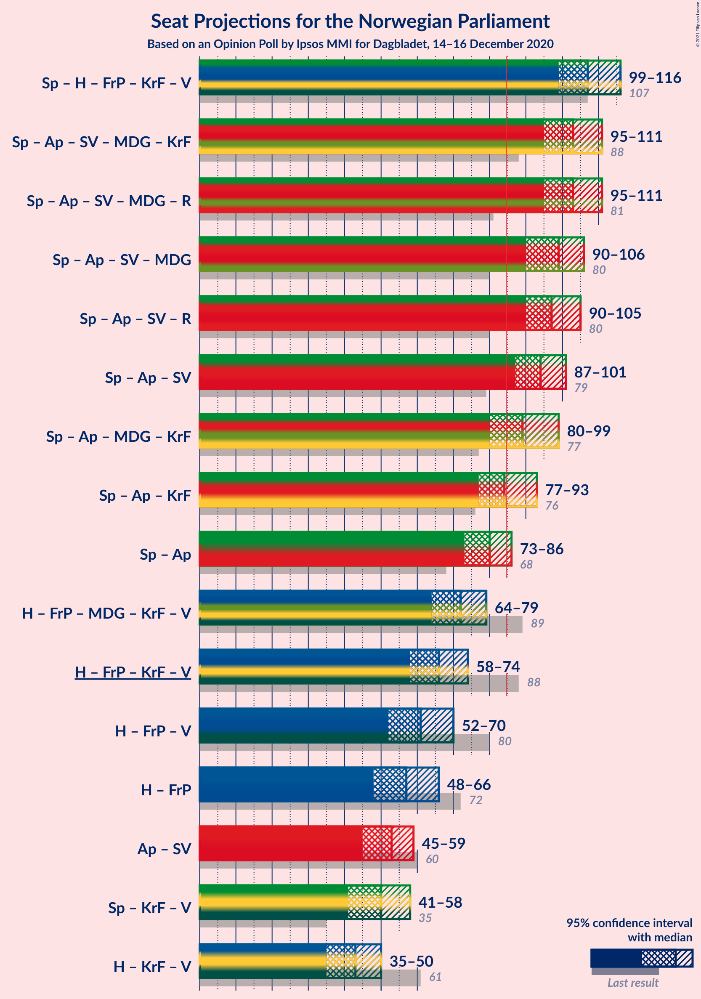

### Confidence Intervals

| Coalition | Last Result | Median | Majority? | 80% Confidence Interval | 90% Confidence Interval | 95% Confidence Interval | 99% Confidence Interval |
|:---------:|:-----------:|:------:|:---------:|:-----------------------:|:-----------------------:|:-----------------------:|:-----------------------:|
| Senterpartiet – Høyre – Fremskrittspartiet – Kristelig Folkeparti – Venstre | 107 | 107 | 100% | 101–112 | 100–114 | 99–116 | 97–118 |
| Senterpartiet – Arbeiderpartiet – Sosialistisk Venstreparti – Miljøpartiet De Grønne – Kristelig Folkeparti | 88 | 103 | 100% | 98–110 | 97–111 | 95–111 | 91–114 |
| Senterpartiet – Arbeiderpartiet – Sosialistisk Venstreparti – Miljøpartiet De Grønne – Rødt | 81 | 103 | 100% | 98–109 | 96–110 | 95–111 | 92–113 |
| Senterpartiet – Arbeiderpartiet – Sosialistisk Venstreparti – Miljøpartiet De Grønne | 80 | 99 | 100% | 94–104 | 92–106 | 90–106 | 88–109 |
| Senterpartiet – Arbeiderpartiet – Sosialistisk Venstreparti – Rødt | 80 | 97 | 100% | 93–103 | 91–104 | 90–105 | 88–108 |
| Senterpartiet – Arbeiderpartiet – Sosialistisk Venstreparti | 79 | 94 | 99.1% | 88–98 | 88–100 | 87–101 | 83–103 |
| Senterpartiet – Arbeiderpartiet – Miljøpartiet De Grønne – Kristelig Folkeparti | 77 | 89 | 89% | 84–96 | 82–97 | 80–99 | 78–100 |
| Senterpartiet – Arbeiderpartiet – Kristelig Folkeparti | 76 | 84 | 46% | 79–90 | 78–92 | 77–93 | 75–95 |
| Senterpartiet – Arbeiderpartiet | 68 | 80 | 9% | 75–84 | 74–86 | 73–86 | 71–90 |
| Høyre – Fremskrittspartiet – Miljøpartiet De Grønne – Kristelig Folkeparti – Venstre | 89 | 72 | 0% | 66–76 | 65–78 | 64–79 | 61–81 |
| Høyre – Fremskrittspartiet – Kristelig Folkeparti – Venstre | 88 | 66 | 0% | 60–71 | 59–73 | 58–74 | 56–77 |
| Høyre – Fremskrittspartiet – Venstre | 80 | 61 | 0% | 56–68 | 53–68 | 52–70 | 51–74 |
| Høyre – Fremskrittspartiet | 72 | 57 | 0% | 52–63 | 50–64 | 48–66 | 48–67 |
| Arbeiderpartiet – Sosialistisk Venstreparti | 60 | 53 | 0% | 48–57 | 46–58 | 45–59 | 43–61 |
| Senterpartiet – Kristelig Folkeparti – Venstre | 35 | 50 | 0% | 44–55 | 43–57 | 41–58 | 40–61 |
| Høyre – Kristelig Folkeparti – Venstre | 61 | 43 | 0% | 38–48 | 36–50 | 35–50 | 34–53 |

### Senterpartiet – Høyre – Fremskrittspartiet – Kristelig Folkeparti – Venstre

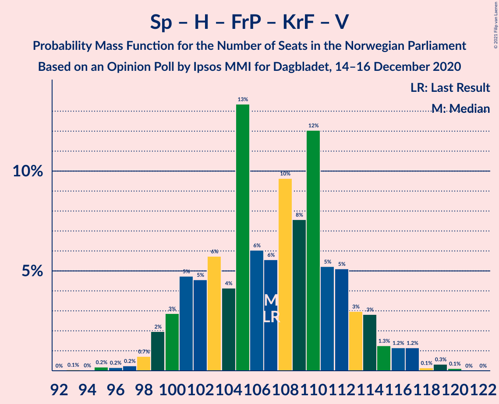

| Number of Seats | Probability | Accumulated | Special Marks |
|:---------------:|:-----------:|:-----------:|:-------------:|
| 93 | 0.1% | 100% |  |
| 94 | 0% | 99.9% |  |
| 95 | 0.2% | 99.9% |  |
| 96 | 0.2% | 99.7% |  |
| 97 | 0.2% | 99.5% |  |
| 98 | 0.7% | 99.3% |  |
| 99 | 2% | 98.6% |  |
| 100 | 3% | 97% |  |
| 101 | 5% | 94% |  |
| 102 | 5% | 89% |  |
| 103 | 6% | 84% | Median |
| 104 | 4% | 79% |  |
| 105 | 13% | 75% |  |
| 106 | 6% | 61% |  |
| 107 | 6% | 55% | Last Result |
| 108 | 10% | 50% |  |
| 109 | 8% | 40% |  |
| 110 | 12% | 32% |  |
| 111 | 5% | 20% |  |
| 112 | 5% | 15% |  |
| 113 | 3% | 10% |  |
| 114 | 3% | 7% |  |
| 115 | 1.3% | 4% |  |
| 116 | 1.2% | 3% |  |
| 117 | 1.2% | 2% |  |
| 118 | 0.1% | 0.6% |  |
| 119 | 0.3% | 0.5% |  |
| 120 | 0.1% | 0.1% |  |
| 121 | 0% | 0% |  |

### Senterpartiet – Arbeiderpartiet – Sosialistisk Venstreparti – Miljøpartiet De Grønne – Kristelig Folkeparti

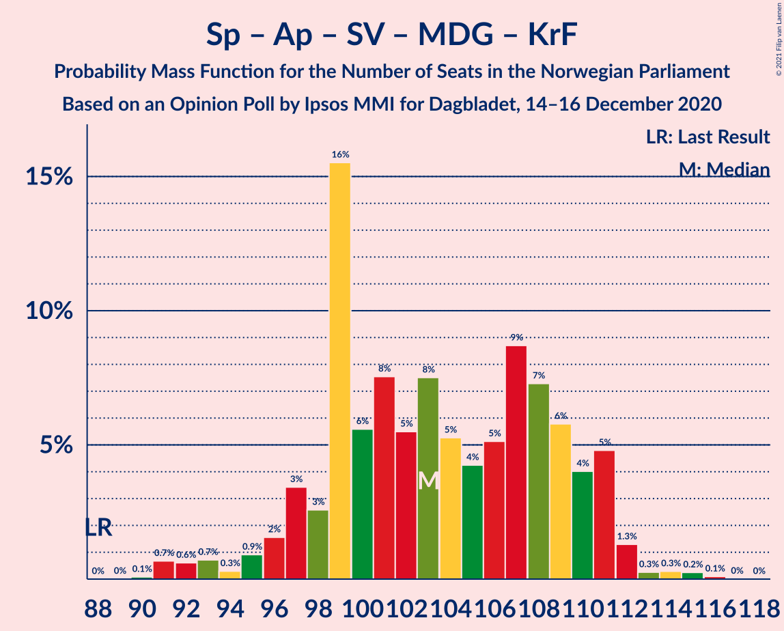

| Number of Seats | Probability | Accumulated | Special Marks |
|:---------------:|:-----------:|:-----------:|:-------------:|
| 88 | 0% | 100% | Last Result |
| 89 | 0% | 100% |  |
| 90 | 0.1% | 100% |  |
| 91 | 0.7% | 99.9% |  |
| 92 | 0.6% | 99.2% |  |
| 93 | 0.7% | 98.6% |  |
| 94 | 0.3% | 98% |  |
| 95 | 0.9% | 98% |  |
| 96 | 2% | 97% |  |
| 97 | 3% | 95% |  |
| 98 | 3% | 92% |  |
| 99 | 16% | 89% |  |
| 100 | 6% | 74% |  |
| 101 | 8% | 68% |  |
| 102 | 5% | 60% |  |
| 103 | 8% | 55% |  |
| 104 | 5% | 47% | Median |
| 105 | 4% | 42% |  |
| 106 | 5% | 38% |  |
| 107 | 9% | 33% |  |
| 108 | 7% | 24% |  |
| 109 | 6% | 17% |  |
| 110 | 4% | 11% |  |
| 111 | 5% | 7% |  |
| 112 | 1.3% | 2% |  |
| 113 | 0.3% | 0.9% |  |
| 114 | 0.3% | 0.7% |  |
| 115 | 0.2% | 0.4% |  |
| 116 | 0.1% | 0.1% |  |
| 117 | 0% | 0% |  |

### Senterpartiet – Arbeiderpartiet – Sosialistisk Venstreparti – Miljøpartiet De Grønne – Rødt

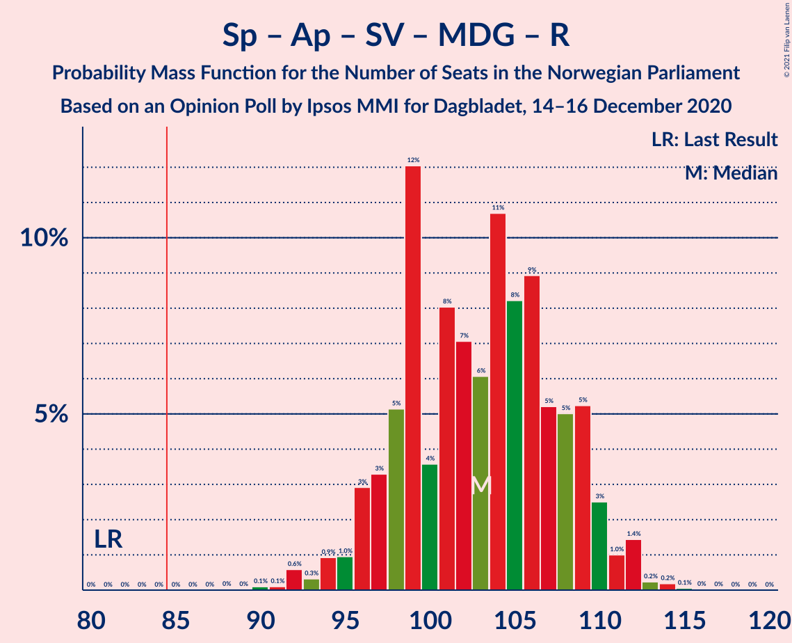

| Number of Seats | Probability | Accumulated | Special Marks |
|:---------------:|:-----------:|:-----------:|:-------------:|
| 81 | 0% | 100% | Last Result |
| 82 | 0% | 100% |  |
| 83 | 0% | 100% |  |
| 84 | 0% | 100% |  |
| 85 | 0% | 100% | Majority |
| 86 | 0% | 100% |  |
| 87 | 0% | 100% |  |
| 88 | 0% | 100% |  |
| 89 | 0% | 100% |  |
| 90 | 0.1% | 100% |  |
| 91 | 0.1% | 99.9% |  |
| 92 | 0.6% | 99.7% |  |
| 93 | 0.3% | 99.2% |  |
| 94 | 0.9% | 98.8% |  |
| 95 | 1.0% | 98% |  |
| 96 | 3% | 97% |  |
| 97 | 3% | 94% |  |
| 98 | 5% | 91% |  |
| 99 | 12% | 86% |  |
| 100 | 4% | 74% |  |
| 101 | 8% | 70% |  |
| 102 | 7% | 62% |  |
| 103 | 6% | 55% | Median |
| 104 | 11% | 49% |  |
| 105 | 8% | 38% |  |
| 106 | 9% | 30% |  |
| 107 | 5% | 21% |  |
| 108 | 5% | 16% |  |
| 109 | 5% | 11% |  |
| 110 | 3% | 5% |  |
| 111 | 1.0% | 3% |  |
| 112 | 1.4% | 2% |  |
| 113 | 0.2% | 0.5% |  |
| 114 | 0.2% | 0.3% |  |
| 115 | 0.1% | 0.1% |  |
| 116 | 0% | 0% |  |

### Senterpartiet – Arbeiderpartiet – Sosialistisk Venstreparti – Miljøpartiet De Grønne

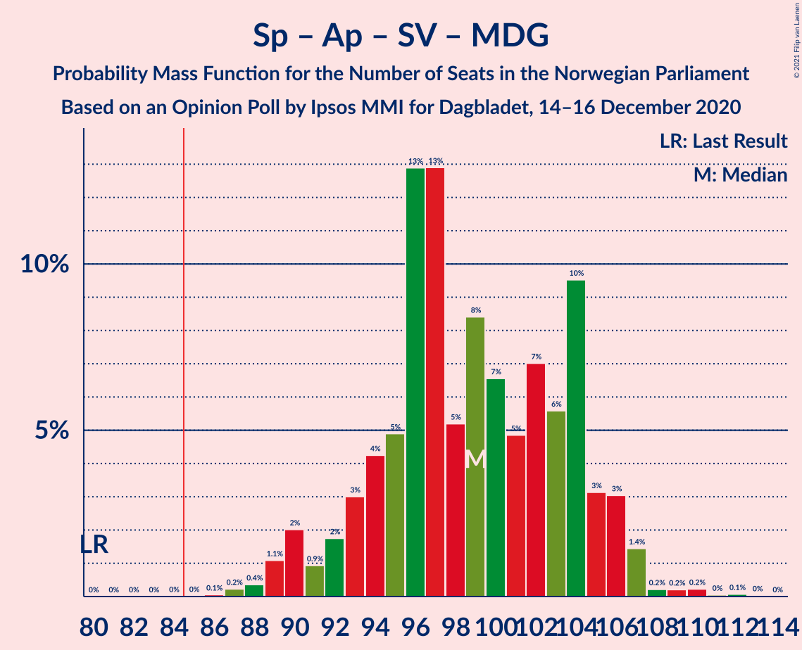

| Number of Seats | Probability | Accumulated | Special Marks |
|:---------------:|:-----------:|:-----------:|:-------------:|
| 80 | 0% | 100% | Last Result |
| 81 | 0% | 100% |  |
| 82 | 0% | 100% |  |
| 83 | 0% | 100% |  |
| 84 | 0% | 100% |  |
| 85 | 0% | 100% | Majority |
| 86 | 0.1% | 100% |  |
| 87 | 0.2% | 99.9% |  |
| 88 | 0.4% | 99.7% |  |
| 89 | 1.1% | 99.3% |  |
| 90 | 2% | 98% |  |
| 91 | 0.9% | 96% |  |
| 92 | 2% | 95% |  |
| 93 | 3% | 94% |  |
| 94 | 4% | 91% |  |
| 95 | 5% | 86% |  |
| 96 | 13% | 81% |  |
| 97 | 13% | 68% |  |
| 98 | 5% | 56% |  |
| 99 | 8% | 50% |  |
| 100 | 7% | 42% |  |
| 101 | 5% | 35% | Median |
| 102 | 7% | 31% |  |
| 103 | 6% | 24% |  |
| 104 | 10% | 18% |  |
| 105 | 3% | 8% |  |
| 106 | 3% | 5% |  |
| 107 | 1.4% | 2% |  |
| 108 | 0.2% | 0.8% |  |
| 109 | 0.2% | 0.6% |  |
| 110 | 0.2% | 0.4% |  |
| 111 | 0% | 0.2% |  |
| 112 | 0.1% | 0.1% |  |
| 113 | 0% | 0% |  |

### Senterpartiet – Arbeiderpartiet – Sosialistisk Venstreparti – Rødt

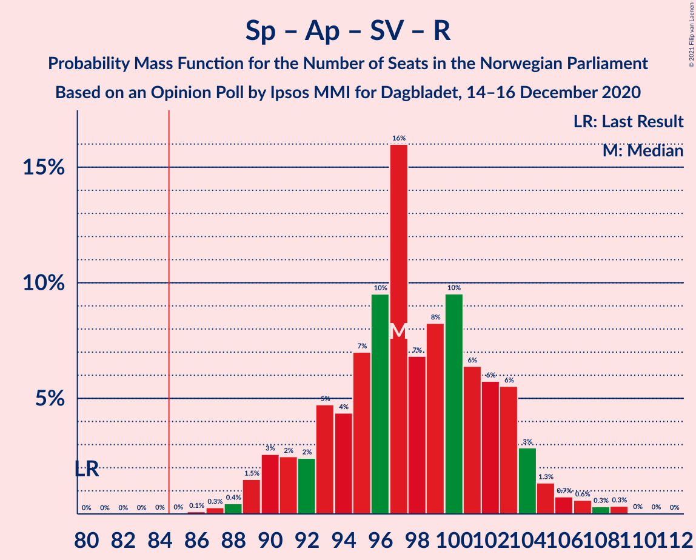

| Number of Seats | Probability | Accumulated | Special Marks |
|:---------------:|:-----------:|:-----------:|:-------------:|
| 80 | 0% | 100% | Last Result |
| 81 | 0% | 100% |  |
| 82 | 0% | 100% |  |
| 83 | 0% | 100% |  |
| 84 | 0% | 100% |  |
| 85 | 0% | 100% | Majority |
| 86 | 0.1% | 99.9% |  |
| 87 | 0.3% | 99.8% |  |
| 88 | 0.4% | 99.6% |  |
| 89 | 1.5% | 99.1% |  |
| 90 | 3% | 98% |  |
| 91 | 2% | 95% |  |
| 92 | 2% | 93% |  |
| 93 | 5% | 90% |  |
| 94 | 4% | 85% |  |
| 95 | 7% | 81% |  |
| 96 | 10% | 74% | Median |
| 97 | 16% | 65% |  |
| 98 | 7% | 49% |  |
| 99 | 8% | 42% |  |
| 100 | 10% | 33% |  |
| 101 | 6% | 24% |  |
| 102 | 6% | 18% |  |
| 103 | 6% | 12% |  |
| 104 | 3% | 6% |  |
| 105 | 1.3% | 3% |  |
| 106 | 0.7% | 2% |  |
| 107 | 0.6% | 1.4% |  |
| 108 | 0.3% | 0.8% |  |
| 109 | 0.3% | 0.4% |  |
| 110 | 0% | 0.1% |  |
| 111 | 0% | 0.1% |  |
| 112 | 0% | 0% |  |

### Senterpartiet – Arbeiderpartiet – Sosialistisk Venstreparti

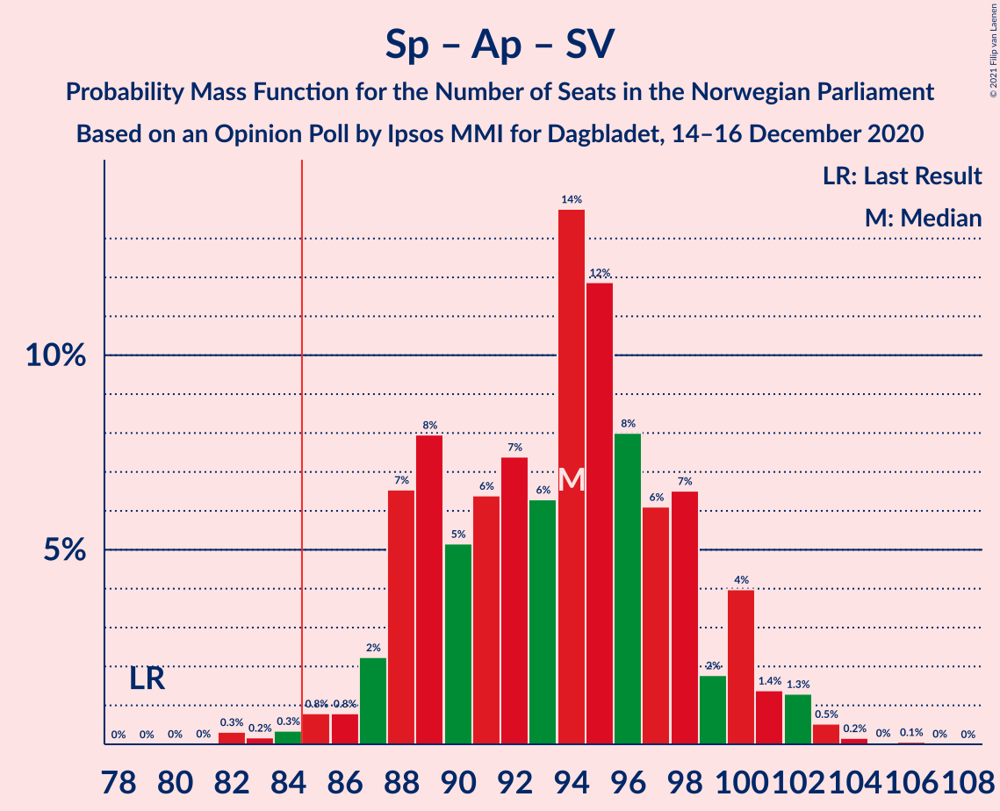

| Number of Seats | Probability | Accumulated | Special Marks |
|:---------------:|:-----------:|:-----------:|:-------------:|
| 79 | 0% | 100% | Last Result |
| 80 | 0% | 100% |  |
| 81 | 0% | 100% |  |
| 82 | 0.3% | 100% |  |
| 83 | 0.2% | 99.6% |  |
| 84 | 0.3% | 99.5% |  |
| 85 | 0.8% | 99.1% | Majority |
| 86 | 0.8% | 98% |  |
| 87 | 2% | 98% |  |
| 88 | 7% | 95% |  |
| 89 | 8% | 89% |  |
| 90 | 5% | 81% |  |
| 91 | 6% | 76% |  |
| 92 | 7% | 69% |  |
| 93 | 6% | 62% |  |
| 94 | 14% | 56% | Median |
| 95 | 12% | 42% |  |
| 96 | 8% | 30% |  |
| 97 | 6% | 22% |  |
| 98 | 7% | 16% |  |
| 99 | 2% | 9% |  |
| 100 | 4% | 8% |  |
| 101 | 1.4% | 4% |  |
| 102 | 1.3% | 2% |  |
| 103 | 0.5% | 0.8% |  |
| 104 | 0.2% | 0.3% |  |
| 105 | 0% | 0.1% |  |
| 106 | 0.1% | 0.1% |  |
| 107 | 0% | 0% |  |

### Senterpartiet – Arbeiderpartiet – Miljøpartiet De Grønne – Kristelig Folkeparti

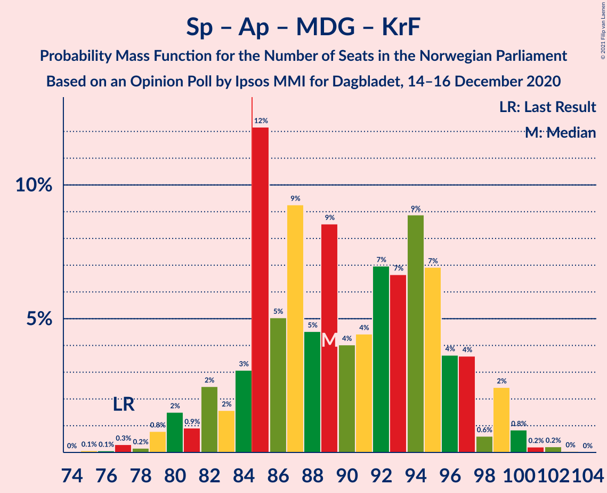

| Number of Seats | Probability | Accumulated | Special Marks |
|:---------------:|:-----------:|:-----------:|:-------------:|
| 75 | 0.1% | 100% |  |
| 76 | 0.1% | 99.9% |  |
| 77 | 0.3% | 99.8% | Last Result |
| 78 | 0.2% | 99.5% |  |
| 79 | 0.8% | 99.4% |  |
| 80 | 2% | 98.6% |  |
| 81 | 0.9% | 97% |  |
| 82 | 2% | 96% |  |
| 83 | 2% | 94% |  |
| 84 | 3% | 92% |  |
| 85 | 12% | 89% | Majority |
| 86 | 5% | 77% |  |
| 87 | 9% | 72% |  |
| 88 | 5% | 63% |  |
| 89 | 9% | 58% |  |
| 90 | 4% | 50% | Median |
| 91 | 4% | 45% |  |
| 92 | 7% | 41% |  |
| 93 | 7% | 34% |  |
| 94 | 9% | 27% |  |
| 95 | 7% | 19% |  |
| 96 | 4% | 12% |  |
| 97 | 4% | 8% |  |
| 98 | 0.6% | 4% |  |
| 99 | 2% | 4% |  |
| 100 | 0.8% | 1.3% |  |
| 101 | 0.2% | 0.5% |  |
| 102 | 0.2% | 0.3% |  |
| 103 | 0% | 0.1% |  |
| 104 | 0% | 0% |  |

### Senterpartiet – Arbeiderpartiet – Kristelig Folkeparti

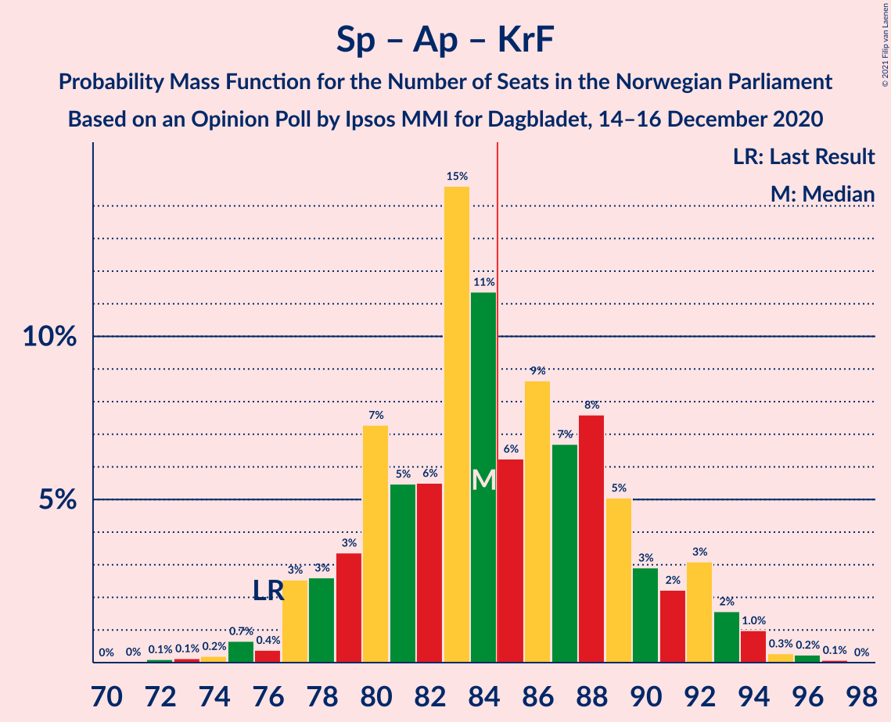

| Number of Seats | Probability | Accumulated | Special Marks |
|:---------------:|:-----------:|:-----------:|:-------------:|
| 72 | 0.1% | 100% |  |
| 73 | 0.1% | 99.8% |  |
| 74 | 0.2% | 99.7% |  |
| 75 | 0.7% | 99.5% |  |
| 76 | 0.4% | 98.9% | Last Result |
| 77 | 3% | 98% |  |
| 78 | 3% | 96% |  |
| 79 | 3% | 93% |  |
| 80 | 7% | 90% |  |
| 81 | 5% | 83% |  |
| 82 | 6% | 77% |  |
| 83 | 15% | 72% | Median |
| 84 | 11% | 57% |  |
| 85 | 6% | 46% | Majority |
| 86 | 9% | 39% |  |
| 87 | 7% | 31% |  |
| 88 | 8% | 24% |  |
| 89 | 5% | 16% |  |
| 90 | 3% | 11% |  |
| 91 | 2% | 9% |  |
| 92 | 3% | 6% |  |
| 93 | 2% | 3% |  |
| 94 | 1.0% | 2% |  |
| 95 | 0.3% | 0.6% |  |
| 96 | 0.2% | 0.4% |  |
| 97 | 0.1% | 0.1% |  |
| 98 | 0% | 0% |  |

### Senterpartiet – Arbeiderpartiet

| Number of Seats | Probability | Accumulated | Special Marks |
|:---------------:|:-----------:|:-----------:|:-------------:|
| 68 | 0% | 100% | Last Result |
| 69 | 0.1% | 99.9% |  |
| 70 | 0.2% | 99.8% |  |
| 71 | 0.7% | 99.7% |  |
| 72 | 0.8% | 99.0% |  |
| 73 | 2% | 98% |  |
| 74 | 3% | 96% |  |
| 75 | 4% | 93% |  |
| 76 | 6% | 90% |  |
| 77 | 12% | 84% |  |
| 78 | 5% | 71% |  |
| 79 | 12% | 66% |  |
| 80 | 8% | 54% | Median |
| 81 | 14% | 46% |  |
| 82 | 10% | 32% |  |
| 83 | 5% | 22% |  |
| 84 | 7% | 17% |  |
| 85 | 3% | 9% | Majority |
| 86 | 4% | 6% |  |
| 87 | 0.7% | 2% |  |
| 88 | 0.6% | 2% |  |
| 89 | 0.4% | 1.1% |  |
| 90 | 0.5% | 0.7% |  |
| 91 | 0.2% | 0.3% |  |
| 92 | 0% | 0.1% |  |
| 93 | 0% | 0% |  |

### Høyre – Fremskrittspartiet – Miljøpartiet De Grønne – Kristelig Folkeparti – Venstre

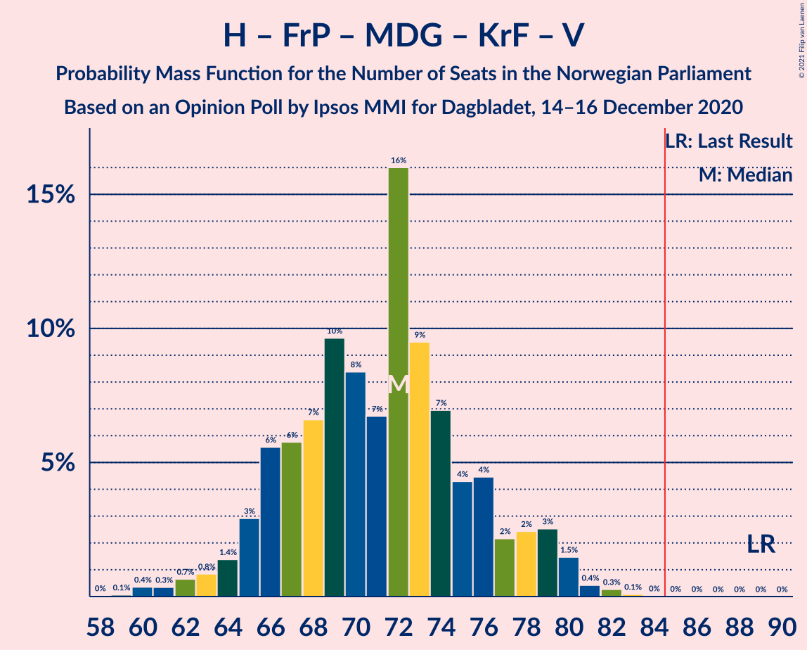

| Number of Seats | Probability | Accumulated | Special Marks |
|:---------------:|:-----------:|:-----------:|:-------------:|
| 58 | 0% | 100% |  |
| 59 | 0.1% | 99.9% |  |
| 60 | 0.4% | 99.9% |  |
| 61 | 0.3% | 99.5% |  |
| 62 | 0.7% | 99.2% |  |
| 63 | 0.8% | 98.5% |  |
| 64 | 1.4% | 98% |  |
| 65 | 3% | 96% |  |
| 66 | 6% | 93% |  |
| 67 | 6% | 88% |  |
| 68 | 7% | 82% |  |
| 69 | 10% | 75% | Median |
| 70 | 8% | 66% |  |
| 71 | 7% | 57% |  |
| 72 | 16% | 51% |  |
| 73 | 9% | 35% |  |
| 74 | 7% | 25% |  |
| 75 | 4% | 18% |  |
| 76 | 4% | 14% |  |
| 77 | 2% | 9% |  |
| 78 | 2% | 7% |  |
| 79 | 3% | 5% |  |
| 80 | 1.5% | 2% |  |
| 81 | 0.4% | 0.8% |  |
| 82 | 0.3% | 0.4% |  |
| 83 | 0.1% | 0.1% |  |
| 84 | 0% | 0.1% |  |
| 85 | 0% | 0% | Majority |
| 86 | 0% | 0% |  |
| 87 | 0% | 0% |  |
| 88 | 0% | 0% |  |
| 89 | 0% | 0% | Last Result |

### Høyre – Fremskrittspartiet – Kristelig Folkeparti – Venstre

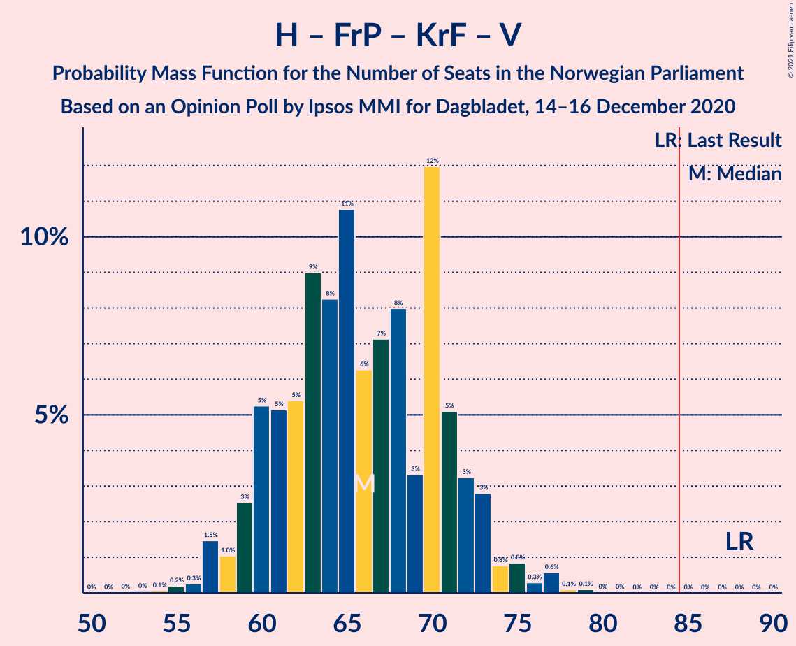

| Number of Seats | Probability | Accumulated | Special Marks |
|:---------------:|:-----------:|:-----------:|:-------------:|
| 53 | 0% | 100% |  |
| 54 | 0.1% | 99.9% |  |
| 55 | 0.2% | 99.9% |  |
| 56 | 0.3% | 99.7% |  |
| 57 | 1.5% | 99.4% |  |
| 58 | 1.0% | 98% |  |
| 59 | 3% | 97% |  |
| 60 | 5% | 94% |  |
| 61 | 5% | 89% |  |
| 62 | 5% | 84% | Median |
| 63 | 9% | 79% |  |
| 64 | 8% | 70% |  |
| 65 | 11% | 61% |  |
| 66 | 6% | 51% |  |
| 67 | 7% | 44% |  |
| 68 | 8% | 37% |  |
| 69 | 3% | 29% |  |
| 70 | 12% | 26% |  |
| 71 | 5% | 14% |  |
| 72 | 3% | 9% |  |
| 73 | 3% | 6% |  |
| 74 | 0.8% | 3% |  |
| 75 | 0.8% | 2% |  |
| 76 | 0.3% | 1.1% |  |
| 77 | 0.6% | 0.8% |  |
| 78 | 0.1% | 0.2% |  |
| 79 | 0.1% | 0.1% |  |
| 80 | 0% | 0% |  |
| 81 | 0% | 0% |  |
| 82 | 0% | 0% |  |
| 83 | 0% | 0% |  |
| 84 | 0% | 0% |  |
| 85 | 0% | 0% | Majority |
| 86 | 0% | 0% |  |
| 87 | 0% | 0% |  |
| 88 | 0% | 0% | Last Result |

### Høyre – Fremskrittspartiet – Venstre

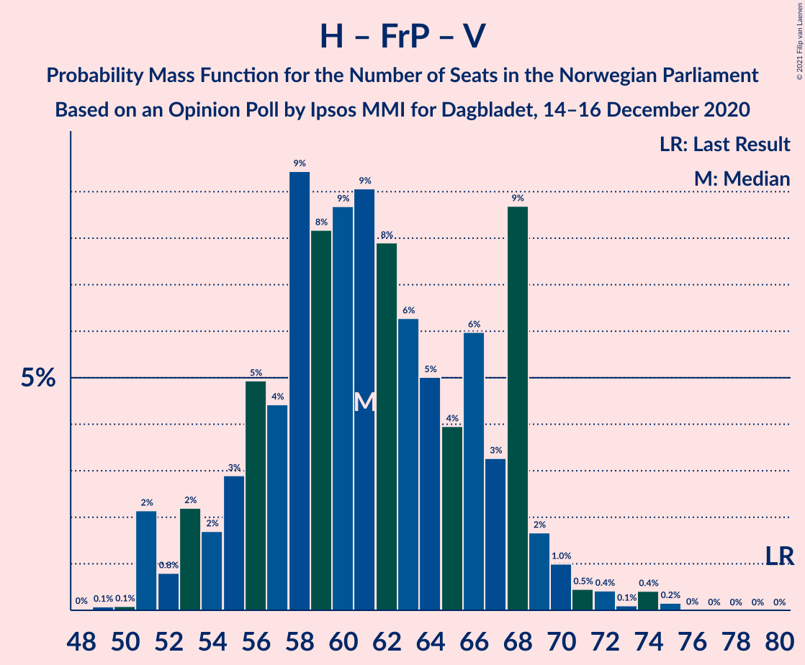

| Number of Seats | Probability | Accumulated | Special Marks |
|:---------------:|:-----------:|:-----------:|:-------------:|
| 49 | 0.1% | 100% |  |
| 50 | 0.1% | 99.9% |  |
| 51 | 2% | 99.8% |  |
| 52 | 0.8% | 98% |  |
| 53 | 2% | 97% |  |
| 54 | 2% | 95% |  |
| 55 | 3% | 93% |  |
| 56 | 5% | 90% |  |
| 57 | 4% | 85% |  |
| 58 | 9% | 81% |  |
| 59 | 8% | 71% | Median |
| 60 | 9% | 63% |  |
| 61 | 9% | 54% |  |
| 62 | 8% | 45% |  |
| 63 | 6% | 37% |  |
| 64 | 5% | 31% |  |
| 65 | 4% | 26% |  |
| 66 | 6% | 22% |  |
| 67 | 3% | 16% |  |
| 68 | 9% | 13% |  |
| 69 | 2% | 4% |  |
| 70 | 1.0% | 3% |  |
| 71 | 0.5% | 2% |  |
| 72 | 0.4% | 1.1% |  |
| 73 | 0.1% | 0.7% |  |
| 74 | 0.4% | 0.6% |  |
| 75 | 0.2% | 0.2% |  |
| 76 | 0% | 0% |  |
| 77 | 0% | 0% |  |
| 78 | 0% | 0% |  |
| 79 | 0% | 0% |  |
| 80 | 0% | 0% | Last Result |

### Høyre – Fremskrittspartiet

| Number of Seats | Probability | Accumulated | Special Marks |
|:---------------:|:-----------:|:-----------:|:-------------:|
| 44 | 0% | 100% |  |
| 45 | 0% | 99.9% |  |
| 46 | 0.1% | 99.9% |  |
| 47 | 0.2% | 99.8% |  |
| 48 | 2% | 99.5% |  |
| 49 | 1.0% | 97% |  |
| 50 | 2% | 96% |  |
| 51 | 3% | 95% |  |
| 52 | 3% | 92% |  |
| 53 | 7% | 89% |  |
| 54 | 9% | 82% |  |
| 55 | 7% | 73% |  |
| 56 | 12% | 66% |  |
| 57 | 8% | 54% | Median |
| 58 | 8% | 46% |  |
| 59 | 8% | 38% |  |
| 60 | 10% | 30% |  |
| 61 | 5% | 20% |  |
| 62 | 5% | 15% |  |
| 63 | 2% | 11% |  |
| 64 | 5% | 9% |  |
| 65 | 0.6% | 4% |  |
| 66 | 2% | 3% |  |
| 67 | 1.4% | 2% |  |
| 68 | 0.1% | 0.3% |  |
| 69 | 0.1% | 0.3% |  |
| 70 | 0.1% | 0.2% |  |
| 71 | 0% | 0.1% |  |
| 72 | 0% | 0% | Last Result |

### Arbeiderpartiet – Sosialistisk Venstreparti

| Number of Seats | Probability | Accumulated | Special Marks |
|:---------------:|:-----------:|:-----------:|:-------------:|
| 40 | 0.1% | 100% |  |
| 41 | 0.1% | 99.9% |  |
| 42 | 0.2% | 99.8% |  |
| 43 | 0.3% | 99.6% |  |
| 44 | 1.3% | 99.3% |  |
| 45 | 2% | 98% |  |
| 46 | 2% | 96% |  |
| 47 | 3% | 94% |  |
| 48 | 6% | 91% |  |
| 49 | 11% | 85% |  |
| 50 | 8% | 74% |  |
| 51 | 7% | 67% |  |
| 52 | 10% | 60% |  |
| 53 | 12% | 50% | Median |
| 54 | 7% | 38% |  |
| 55 | 10% | 31% |  |
| 56 | 6% | 21% |  |
| 57 | 8% | 15% |  |
| 58 | 4% | 7% |  |
| 59 | 1.2% | 3% |  |
| 60 | 1.1% | 2% | Last Result |
| 61 | 0.4% | 0.6% |  |
| 62 | 0.1% | 0.2% |  |
| 63 | 0% | 0.1% |  |
| 64 | 0% | 0.1% |  |
| 65 | 0% | 0% |  |

### Senterpartiet – Kristelig Folkeparti – Venstre

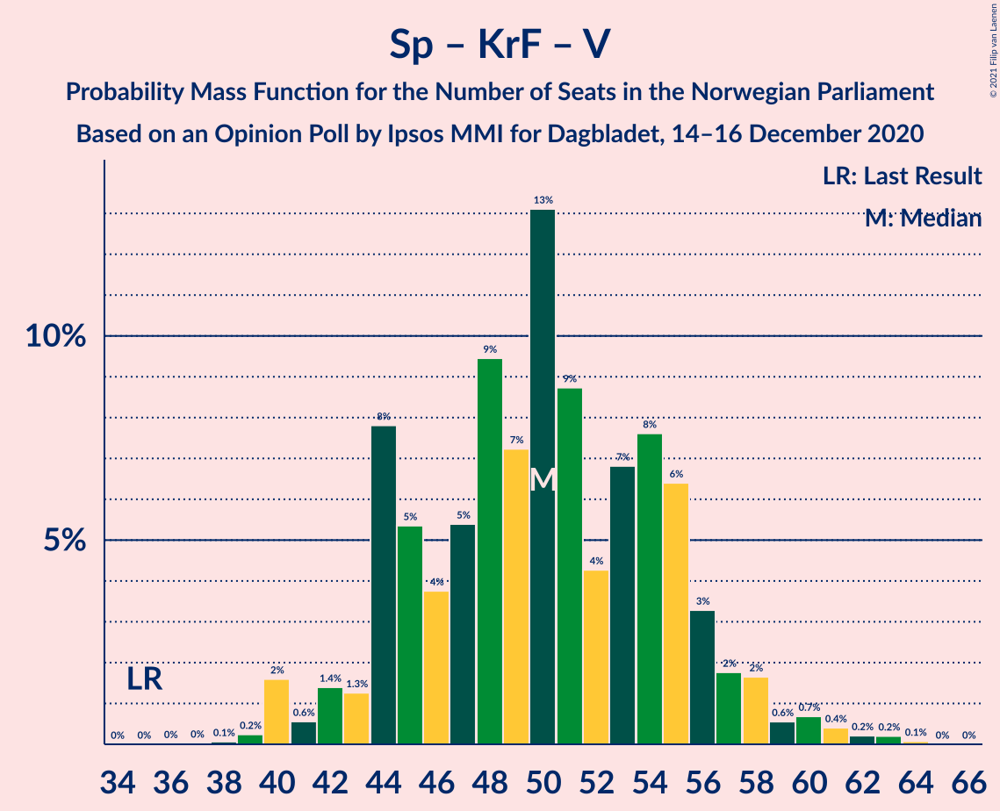

| Number of Seats | Probability | Accumulated | Special Marks |
|:---------------:|:-----------:|:-----------:|:-------------:|
| 35 | 0% | 100% | Last Result |
| 36 | 0% | 100% |  |
| 37 | 0% | 100% |  |
| 38 | 0.1% | 99.9% |  |
| 39 | 0.2% | 99.9% |  |
| 40 | 2% | 99.6% |  |
| 41 | 0.6% | 98% |  |
| 42 | 1.4% | 97% |  |
| 43 | 1.3% | 96% |  |
| 44 | 8% | 95% |  |
| 45 | 5% | 87% |  |
| 46 | 4% | 82% | Median |
| 47 | 5% | 78% |  |
| 48 | 9% | 72% |  |
| 49 | 7% | 63% |  |
| 50 | 13% | 56% |  |
| 51 | 9% | 43% |  |
| 52 | 4% | 34% |  |
| 53 | 7% | 30% |  |
| 54 | 8% | 23% |  |
| 55 | 6% | 15% |  |
| 56 | 3% | 9% |  |
| 57 | 2% | 6% |  |
| 58 | 2% | 4% |  |
| 59 | 0.6% | 2% |  |
| 60 | 0.7% | 2% |  |
| 61 | 0.4% | 0.9% |  |
| 62 | 0.2% | 0.5% |  |
| 63 | 0.2% | 0.3% |  |
| 64 | 0.1% | 0.1% |  |
| 65 | 0% | 0% |  |

### Høyre – Kristelig Folkeparti – Venstre

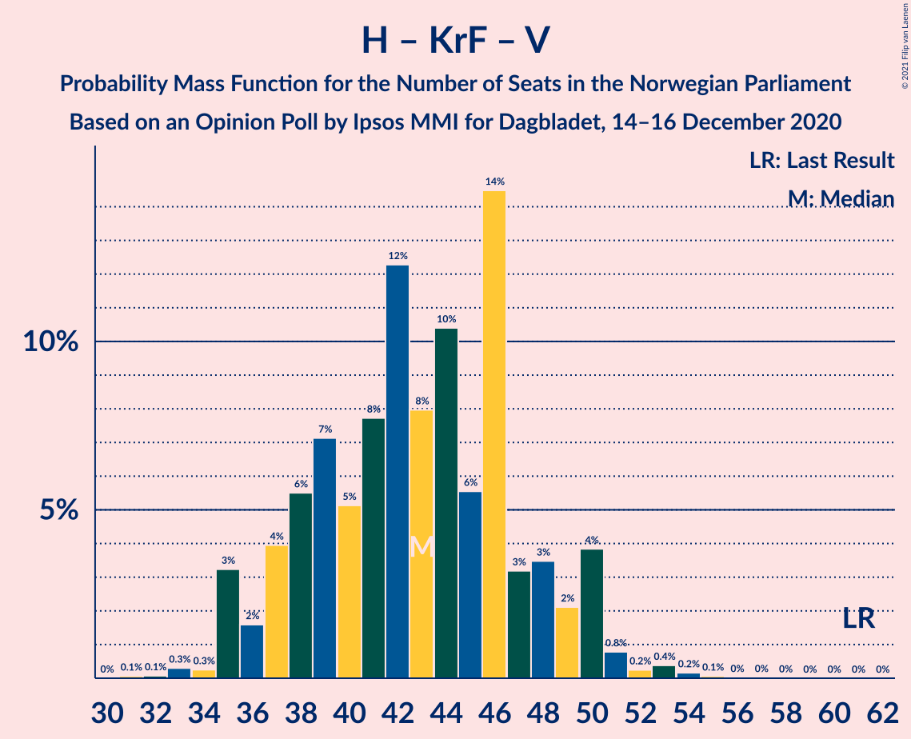

| Number of Seats | Probability | Accumulated | Special Marks |
|:---------------:|:-----------:|:-----------:|:-------------:|
| 31 | 0.1% | 100% |  |
| 32 | 0.1% | 99.9% |  |
| 33 | 0.3% | 99.9% |  |
| 34 | 0.3% | 99.6% |  |
| 35 | 3% | 99.3% |  |
| 36 | 2% | 96% |  |
| 37 | 4% | 94% |  |
| 38 | 6% | 91% |  |
| 39 | 7% | 85% | Median |
| 40 | 5% | 78% |  |
| 41 | 8% | 73% |  |
| 42 | 12% | 65% |  |
| 43 | 8% | 53% |  |
| 44 | 10% | 45% |  |
| 45 | 6% | 34% |  |
| 46 | 14% | 29% |  |
| 47 | 3% | 14% |  |
| 48 | 3% | 11% |  |
| 49 | 2% | 8% |  |
| 50 | 4% | 6% |  |
| 51 | 0.8% | 2% |  |
| 52 | 0.2% | 0.9% |  |
| 53 | 0.4% | 0.7% |  |
| 54 | 0.2% | 0.3% |  |
| 55 | 0.1% | 0.1% |  |
| 56 | 0% | 0.1% |  |
| 57 | 0% | 0% |  |
| 58 | 0% | 0% |  |
| 59 | 0% | 0% |  |
| 60 | 0% | 0% |  |
| 61 | 0% | 0% | Last Result |

## Technical Information

### Opinion Poll

+ **Polling firm:** Ipsos MMI
+ **Commissioner(s):** Dagbladet
+ **Fieldwork period:** 14–16 December 2020

### Calculations

+ **Sample size:** 732
+ **Simulations done:** 1,048,576
+ **Error estimate:** 1.20%

