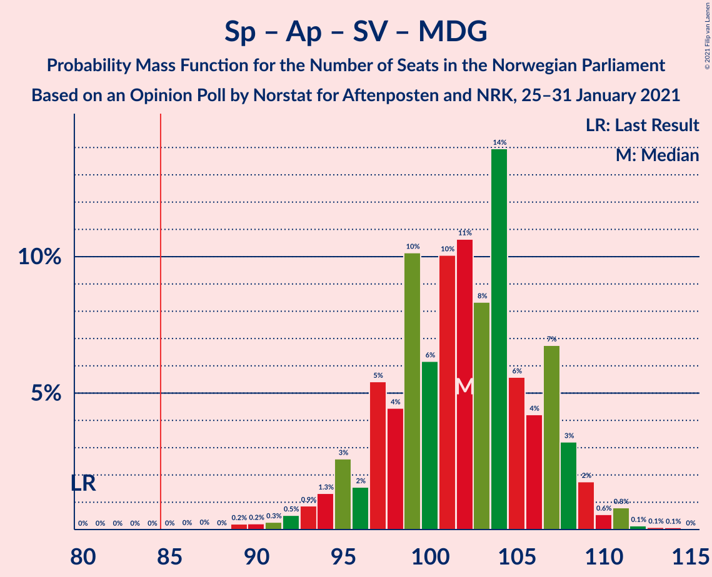

# Opinion Poll by Norstat for Aftenposten and NRK, 25–31 January 2021

<a href="#voting-intentions">Voting Intentions</a> | <a href="#seats">Seats</a> | <a href="#coalitions">Coalitions</a> | <a href="#technical-information">Technical Information</a>

## Voting Intentions

### Confidence Intervals

| Party | Last Result | Poll Result | 80% Confidence Interval | 90% Confidence Interval | 95% Confidence Interval | 99% Confidence Interval |
|:-----:|:-----------:|:-----------:|:-----------------------:|:-----------------------:|:-----------------------:|:-----------------------:|
| Høyre | 25.0% | 22.8% | 20.9–24.9% |20.3–25.5% |19.9–26.0% |19.0–27.1% |
| Senterpartiet | 10.3% | 22.0% | 20.0–24.1% |19.5–24.6% |19.1–25.2% |18.2–26.2% |
| Arbeiderpartiet | 27.4% | 20.7% | 18.8–22.7% |18.3–23.3% |17.8–23.8% |17.0–24.8% |
| Sosialistisk Venstreparti | 6.0% | 8.4% | 7.1–9.8% |6.8–10.3% |6.5–10.6% |6.0–11.4% |
| Fremskrittspartiet | 15.2% | 8.4% | 7.1–9.8% |6.8–10.3% |6.5–10.6% |6.0–11.4% |
| Miljøpartiet De Grønne | 3.2% | 4.8% | 3.9–6.0% |3.7–6.4% |3.5–6.7% |3.1–7.3% |
| Rødt | 2.4% | 4.0% | 3.2–5.1% |2.9–5.4% |2.8–5.7% |2.4–6.3% |
| Kristelig Folkeparti | 4.2% | 3.5% | 2.8–4.6% |2.6–4.9% |2.4–5.2% |2.1–5.7% |
| Venstre | 4.4% | 2.4% | 1.8–3.3% |1.6–3.6% |1.5–3.8% |1.3–4.3% |

*Note:* The poll result column reflects the actual value used in the calculations. Published results may vary slightly, and in addition be rounded to fewer digits.

## Seats

### Confidence Intervals

| Party | Last Result | Median | 80% Confidence Interval | 90% Confidence Interval | 95% Confidence Interval | 99% Confidence Interval |
|:-----:|:-----------:|:------:|:-----------------------:|:-----------------------:|:-----------------------:|:-----------------------:|
| <a href="#høyre">Høyre</a> | 45 | 40 | 36–46 |35–47 |35–48 |33–50 |
| <a href="#senterpartiet">Senterpartiet</a> | 19 | 41 | 37–44 |36–45 |36–45 |35–48 |
| <a href="#arbeiderpartiet">Arbeiderpartiet</a> | 49 | 38 | 34–41 |33–42 |33–43 |30–45 |
| <a href="#sosialistisk-venstreparti">Sosialistisk Venstreparti</a> | 11 | 15 | 12–17 |12–18 |11–19 |10–20 |
| <a href="#fremskrittspartiet">Fremskrittspartiet</a> | 27 | 15 | 12–18 |12–18 |11–19 |10–21 |
| <a href="#miljøpartiet-de-grønne">Miljøpartiet De Grønne</a> | 1 | 9 | 3–11 |2–11 |2–12 |2–13 |
| <a href="#rødt">Rødt</a> | 1 | 7 | 2–9 |2–9 |1–10 |1–11 |
| <a href="#kristelig-folkeparti">Kristelig Folkeparti</a> | 8 | 3 | 1–8 |1–8 |1–9 |0–10 |
| <a href="#venstre">Venstre</a> | 8 | 2 | 1–2 |0–2 |0–3 |0–7 |

### Høyre

*For a full overview of the results for this party, see the [Høyre](party-høyre.html) page.*

| Number of Seats | Probability | Accumulated | Special Marks |
|:---------------:|:-----------:|:-----------:|:-------------:|
| 31 | 0.1% | 100% |  |
| 32 | 0.1% | 99.9% |  |
| 33 | 0.5% | 99.9% |  |
| 34 | 0.5% | 99.3% |  |
| 35 | 5% | 98.8% |  |
| 36 | 5% | 94% |  |
| 37 | 6% | 89% |  |
| 38 | 14% | 83% |  |
| 39 | 12% | 69% |  |
| 40 | 14% | 57% | Median |
| 41 | 9% | 42% |  |
| 42 | 7% | 33% |  |
| 43 | 5% | 27% |  |
| 44 | 7% | 22% |  |
| 45 | 4% | 15% | Last Result |
| 46 | 5% | 11% |  |
| 47 | 1.4% | 5% |  |
| 48 | 2% | 4% |  |
| 49 | 2% | 2% |  |
| 50 | 0.4% | 0.6% |  |
| 51 | 0.2% | 0.2% |  |
| 52 | 0.1% | 0.1% |  |
| 53 | 0% | 0% |  |

### Senterpartiet

*For a full overview of the results for this party, see the [Senterpartiet](party-senterpartiet.html) page.*

| Number of Seats | Probability | Accumulated | Special Marks |
|:---------------:|:-----------:|:-----------:|:-------------:|
| 19 | 0% | 100% | Last Result |
| 20 | 0% | 100% |  |
| 21 | 0% | 100% |  |
| 22 | 0% | 100% |  |
| 23 | 0% | 100% |  |
| 24 | 0% | 100% |  |
| 25 | 0% | 100% |  |
| 26 | 0% | 100% |  |
| 27 | 0% | 100% |  |
| 28 | 0% | 100% |  |
| 29 | 0% | 100% |  |
| 30 | 0% | 100% |  |
| 31 | 0% | 100% |  |
| 32 | 0% | 100% |  |
| 33 | 0.1% | 99.9% |  |
| 34 | 0.3% | 99.9% |  |
| 35 | 2% | 99.6% |  |
| 36 | 4% | 98% |  |
| 37 | 4% | 94% |  |
| 38 | 8% | 90% |  |
| 39 | 11% | 82% |  |
| 40 | 16% | 71% |  |
| 41 | 15% | 55% | Median |
| 42 | 10% | 40% |  |
| 43 | 13% | 29% |  |
| 44 | 7% | 16% |  |
| 45 | 7% | 9% |  |
| 46 | 1.1% | 2% |  |
| 47 | 0.8% | 1.4% |  |
| 48 | 0.2% | 0.6% |  |
| 49 | 0.2% | 0.3% |  |
| 50 | 0.1% | 0.1% |  |
| 51 | 0% | 0% |  |

### Arbeiderpartiet

*For a full overview of the results for this party, see the [Arbeiderpartiet](party-arbeiderpartiet.html) page.*

| Number of Seats | Probability | Accumulated | Special Marks |
|:---------------:|:-----------:|:-----------:|:-------------:|
| 28 | 0.1% | 100% |  |
| 29 | 0.1% | 99.9% |  |
| 30 | 0.3% | 99.8% |  |
| 31 | 0.8% | 99.4% |  |
| 32 | 1.1% | 98.7% |  |
| 33 | 4% | 98% |  |
| 34 | 7% | 94% |  |
| 35 | 5% | 87% |  |
| 36 | 6% | 82% |  |
| 37 | 16% | 76% |  |
| 38 | 16% | 61% | Median |
| 39 | 14% | 45% |  |
| 40 | 12% | 31% |  |
| 41 | 11% | 20% |  |
| 42 | 5% | 9% |  |
| 43 | 2% | 4% |  |
| 44 | 1.0% | 2% |  |
| 45 | 0.9% | 1.4% |  |
| 46 | 0.2% | 0.4% |  |
| 47 | 0.2% | 0.2% |  |
| 48 | 0% | 0% |  |
| 49 | 0% | 0% | Last Result |

### Sosialistisk Venstreparti

*For a full overview of the results for this party, see the [Sosialistisk Venstreparti](party-sosialistiskvenstreparti.html) page.*

| Number of Seats | Probability | Accumulated | Special Marks |
|:---------------:|:-----------:|:-----------:|:-------------:|
| 8 | 0% | 100% |  |
| 9 | 0.1% | 99.9% |  |
| 10 | 1.2% | 99.8% |  |
| 11 | 2% | 98.6% | Last Result |
| 12 | 10% | 97% |  |
| 13 | 14% | 87% |  |
| 14 | 17% | 73% |  |
| 15 | 20% | 56% | Median |
| 16 | 14% | 37% |  |
| 17 | 15% | 23% |  |
| 18 | 4% | 8% |  |
| 19 | 2% | 4% |  |
| 20 | 1.3% | 2% |  |
| 21 | 0.2% | 0.4% |  |
| 22 | 0.1% | 0.1% |  |
| 23 | 0% | 0% |  |

### Fremskrittspartiet

*For a full overview of the results for this party, see the [Fremskrittspartiet](party-fremskrittspartiet.html) page.*

| Number of Seats | Probability | Accumulated | Special Marks |
|:---------------:|:-----------:|:-----------:|:-------------:|
| 9 | 0.2% | 100% |  |
| 10 | 0.7% | 99.8% |  |
| 11 | 3% | 99.1% |  |
| 12 | 11% | 96% |  |
| 13 | 11% | 85% |  |
| 14 | 17% | 75% |  |
| 15 | 22% | 57% | Median |
| 16 | 13% | 36% |  |
| 17 | 11% | 23% |  |
| 18 | 8% | 12% |  |
| 19 | 2% | 4% |  |
| 20 | 1.3% | 2% |  |
| 21 | 0.4% | 0.7% |  |
| 22 | 0.2% | 0.2% |  |
| 23 | 0% | 0% |  |
| 24 | 0% | 0% |  |
| 25 | 0% | 0% |  |
| 26 | 0% | 0% |  |
| 27 | 0% | 0% | Last Result |

### Miljøpartiet De Grønne

*For a full overview of the results for this party, see the [Miljøpartiet De Grønne](party-miljøpartietdegrønne.html) page.*

| Number of Seats | Probability | Accumulated | Special Marks |
|:---------------:|:-----------:|:-----------:|:-------------:|
| 1 | 0.3% | 100% | Last Result |
| 2 | 9% | 99.7% |  |
| 3 | 3% | 91% |  |
| 4 | 0.9% | 87% |  |
| 5 | 0% | 86% |  |
| 6 | 1.0% | 86% |  |
| 7 | 10% | 85% |  |
| 8 | 22% | 75% |  |
| 9 | 24% | 53% | Median |
| 10 | 18% | 30% |  |
| 11 | 8% | 11% |  |
| 12 | 3% | 4% |  |
| 13 | 0.6% | 0.7% |  |
| 14 | 0.1% | 0.1% |  |
| 15 | 0% | 0% |  |

### Rødt

*For a full overview of the results for this party, see the [Rødt](party-rødt.html) page.*

| Number of Seats | Probability | Accumulated | Special Marks |
|:---------------:|:-----------:|:-----------:|:-------------:|
| 1 | 3% | 100% | Last Result |
| 2 | 43% | 97% |  |
| 3 | 0% | 54% |  |
| 4 | 0% | 54% |  |
| 5 | 0% | 54% |  |
| 6 | 1.1% | 54% |  |
| 7 | 13% | 53% | Median |
| 8 | 25% | 40% |  |
| 9 | 11% | 15% |  |
| 10 | 3% | 4% |  |
| 11 | 1.3% | 1.4% |  |
| 12 | 0.1% | 0.1% |  |
| 13 | 0% | 0% |  |

### Kristelig Folkeparti

*For a full overview of the results for this party, see the [Kristelig Folkeparti](party-kristeligfolkeparti.html) page.*

| Number of Seats | Probability | Accumulated | Special Marks |
|:---------------:|:-----------:|:-----------:|:-------------:|
| 0 | 2% | 100% |  |
| 1 | 24% | 98% |  |
| 2 | 11% | 74% |  |
| 3 | 34% | 62% | Median |
| 4 | 0% | 28% |  |
| 5 | 0% | 28% |  |
| 6 | 2% | 28% |  |
| 7 | 11% | 26% |  |
| 8 | 11% | 16% | Last Result |
| 9 | 4% | 5% |  |
| 10 | 0.9% | 1.0% |  |
| 11 | 0.1% | 0.2% |  |
| 12 | 0.1% | 0.1% |  |
| 13 | 0% | 0% |  |

### Venstre

*For a full overview of the results for this party, see the [Venstre](party-venstre.html) page.*

| Number of Seats | Probability | Accumulated | Special Marks |
|:---------------:|:-----------:|:-----------:|:-------------:|
| 0 | 7% | 100% |  |
| 1 | 20% | 93% |  |
| 2 | 70% | 73% | Median |
| 3 | 1.0% | 3% |  |
| 4 | 0% | 2% |  |
| 5 | 0% | 2% |  |
| 6 | 0.1% | 2% |  |
| 7 | 1.3% | 2% |  |
| 8 | 0.4% | 0.4% | Last Result |
| 9 | 0% | 0% |  |

## Coalitions

### Confidence Intervals

| Coalition | Last Result | Median | Majority? | 80% Confidence Interval | 90% Confidence Interval | 95% Confidence Interval | 99% Confidence Interval |
|:---------:|:-----------:|:------:|:---------:|:-----------------------:|:-----------------------:|:-----------------------:|:-----------------------:|
| Senterpartiet – Arbeiderpartiet – Sosialistisk Venstreparti – Miljøpartiet De Grønne – Rødt | 81 | 107 | 100% | 102–113 | 100–113 | 99–115 | 96–116 |
| Senterpartiet – Arbeiderpartiet – Sosialistisk Venstreparti – Miljøpartiet De Grønne – Kristelig Folkeparti | 88 | 106 | 100% | 100–110 | 98–112 | 97–113 | 94–115 |
| Høyre – Senterpartiet – Fremskrittspartiet – Kristelig Folkeparti – Venstre | 107 | 102 | 100% | 97–107 | 95–108 | 93–110 | 92–113 |
| Senterpartiet – Arbeiderpartiet – Sosialistisk Venstreparti – Miljøpartiet De Grønne | 80 | 102 | 100% | 97–107 | 95–108 | 94–109 | 90–111 |
| Senterpartiet – Arbeiderpartiet – Sosialistisk Venstreparti – Rødt | 80 | 99 | 99.9% | 94–105 | 93–106 | 91–108 | 88–108 |
| Senterpartiet – Arbeiderpartiet – Sosialistisk Venstreparti | 79 | 94 | 99.4% | 89–98 | 87–100 | 86–101 | 84–104 |
| Senterpartiet – Arbeiderpartiet – Miljøpartiet De Grønne – Kristelig Folkeparti | 77 | 91 | 91% | 85–96 | 83–97 | 82–98 | 79–100 |
| Senterpartiet – Arbeiderpartiet – Kristelig Folkeparti | 76 | 83 | 35% | 77–88 | 75–89 | 74–90 | 72–92 |
| Senterpartiet – Arbeiderpartiet | 68 | 79 | 6% | 74–84 | 72–85 | 72–85 | 70–89 |
| Høyre – Fremskrittspartiet – Miljøpartiet De Grønne – Kristelig Folkeparti – Venstre | 89 | 69 | 0% | 63–74 | 61–76 | 61–77 | 59–80 |
| Høyre – Fremskrittspartiet – Kristelig Folkeparti – Venstre | 88 | 61 | 0% | 56–66 | 54–68 | 53–69 | 52–72 |
| Høyre – Fremskrittspartiet – Venstre | 80 | 57 | 0% | 52–63 | 51–65 | 50–66 | 48–69 |
| Høyre – Fremskrittspartiet | 72 | 55 | 0% | 51–61 | 49–63 | 48–64 | 47–67 |
| Arbeiderpartiet – Sosialistisk Venstreparti | 60 | 53 | 0% | 48–58 | 47–59 | 46–60 | 43–62 |
| Høyre – Kristelig Folkeparti – Venstre | 61 | 46 | 0% | 41–51 | 40–53 | 38–55 | 38–56 |
| Senterpartiet – Kristelig Folkeparti – Venstre | 35 | 46 | 0% | 42–51 | 41–52 | 40–53 | 38–56 |

### Senterpartiet – Arbeiderpartiet – Sosialistisk Venstreparti – Miljøpartiet De Grønne – Rødt

| Number of Seats | Probability | Accumulated | Special Marks |
|:---------------:|:-----------:|:-----------:|:-------------:|
| 81 | 0% | 100% | Last Result |
| 82 | 0% | 100% |  |
| 83 | 0% | 100% |  |
| 84 | 0% | 100% |  |
| 85 | 0% | 100% | Majority |
| 86 | 0% | 100% |  |
| 87 | 0% | 100% |  |
| 88 | 0% | 100% |  |
| 89 | 0% | 100% |  |
| 90 | 0% | 100% |  |
| 91 | 0% | 100% |  |
| 92 | 0% | 100% |  |
| 93 | 0.1% | 100% |  |
| 94 | 0% | 99.9% |  |
| 95 | 0.2% | 99.9% |  |
| 96 | 0.4% | 99.7% |  |
| 97 | 0.9% | 99.3% |  |
| 98 | 0.5% | 98% |  |
| 99 | 2% | 98% |  |
| 100 | 2% | 96% |  |
| 101 | 3% | 94% |  |
| 102 | 3% | 91% |  |
| 103 | 7% | 88% |  |
| 104 | 5% | 81% |  |
| 105 | 7% | 77% |  |
| 106 | 12% | 70% |  |
| 107 | 10% | 58% |  |
| 108 | 7% | 47% |  |
| 109 | 12% | 40% |  |
| 110 | 6% | 28% | Median |
| 111 | 8% | 22% |  |
| 112 | 3% | 14% |  |
| 113 | 6% | 10% |  |
| 114 | 1.0% | 4% |  |
| 115 | 2% | 3% |  |
| 116 | 0.8% | 1.0% |  |
| 117 | 0.2% | 0.3% |  |
| 118 | 0.1% | 0.1% |  |
| 119 | 0% | 0% |  |

### Senterpartiet – Arbeiderpartiet – Sosialistisk Venstreparti – Miljøpartiet De Grønne – Kristelig Folkeparti

| Number of Seats | Probability | Accumulated | Special Marks |
|:---------------:|:-----------:|:-----------:|:-------------:|
| 88 | 0% | 100% | Last Result |
| 89 | 0% | 100% |  |
| 90 | 0% | 100% |  |
| 91 | 0% | 99.9% |  |
| 92 | 0.1% | 99.9% |  |
| 93 | 0.3% | 99.9% |  |
| 94 | 0.2% | 99.6% |  |
| 95 | 0.5% | 99.4% |  |
| 96 | 0.9% | 99.0% |  |
| 97 | 0.8% | 98% |  |
| 98 | 4% | 97% |  |
| 99 | 1.4% | 93% |  |
| 100 | 2% | 92% |  |
| 101 | 5% | 90% |  |
| 102 | 7% | 85% |  |
| 103 | 10% | 78% |  |
| 104 | 4% | 68% |  |
| 105 | 9% | 65% |  |
| 106 | 15% | 56% | Median |
| 107 | 10% | 40% |  |
| 108 | 5% | 31% |  |
| 109 | 7% | 25% |  |
| 110 | 8% | 18% |  |
| 111 | 3% | 10% |  |
| 112 | 3% | 7% |  |
| 113 | 1.2% | 4% |  |
| 114 | 2% | 2% |  |
| 115 | 0.3% | 0.7% |  |
| 116 | 0.2% | 0.3% |  |
| 117 | 0.1% | 0.2% |  |
| 118 | 0% | 0.1% |  |
| 119 | 0% | 0% |  |

### Høyre – Senterpartiet – Fremskrittspartiet – Kristelig Folkeparti – Venstre

| Number of Seats | Probability | Accumulated | Special Marks |
|:---------------:|:-----------:|:-----------:|:-------------:|
| 89 | 0.1% | 100% |  |
| 90 | 0.2% | 99.9% |  |
| 91 | 0.2% | 99.7% |  |
| 92 | 0.4% | 99.5% |  |
| 93 | 3% | 99.2% |  |
| 94 | 0.9% | 97% |  |
| 95 | 2% | 96% |  |
| 96 | 3% | 93% |  |
| 97 | 4% | 91% |  |
| 98 | 8% | 87% |  |
| 99 | 8% | 78% |  |
| 100 | 8% | 71% |  |
| 101 | 7% | 63% | Median |
| 102 | 14% | 56% |  |
| 103 | 8% | 42% |  |
| 104 | 10% | 33% |  |
| 105 | 8% | 24% |  |
| 106 | 6% | 16% |  |
| 107 | 4% | 10% | Last Result |
| 108 | 2% | 6% |  |
| 109 | 2% | 5% |  |
| 110 | 2% | 3% |  |
| 111 | 0.5% | 1.3% |  |
| 112 | 0.2% | 0.8% |  |
| 113 | 0.3% | 0.5% |  |
| 114 | 0.1% | 0.3% |  |
| 115 | 0.1% | 0.2% |  |
| 116 | 0% | 0.1% |  |
| 117 | 0% | 0% |  |

### Senterpartiet – Arbeiderpartiet – Sosialistisk Venstreparti – Miljøpartiet De Grønne

| Number of Seats | Probability | Accumulated | Special Marks |
|:---------------:|:-----------:|:-----------:|:-------------:|
| 80 | 0% | 100% | Last Result |
| 81 | 0% | 100% |  |
| 82 | 0% | 100% |  |
| 83 | 0% | 100% |  |
| 84 | 0% | 100% |  |
| 85 | 0% | 100% | Majority |
| 86 | 0% | 100% |  |
| 87 | 0% | 100% |  |
| 88 | 0% | 99.9% |  |
| 89 | 0.2% | 99.9% |  |
| 90 | 0.2% | 99.7% |  |
| 91 | 0.3% | 99.5% |  |
| 92 | 0.5% | 99.2% |  |
| 93 | 0.9% | 98.7% |  |
| 94 | 1.3% | 98% |  |
| 95 | 3% | 97% |  |
| 96 | 2% | 94% |  |
| 97 | 5% | 92% |  |
| 98 | 4% | 87% |  |
| 99 | 10% | 82% |  |
| 100 | 6% | 72% |  |
| 101 | 10% | 66% |  |
| 102 | 11% | 56% |  |
| 103 | 8% | 45% | Median |
| 104 | 14% | 37% |  |
| 105 | 6% | 23% |  |
| 106 | 4% | 18% |  |
| 107 | 7% | 13% |  |
| 108 | 3% | 7% |  |
| 109 | 2% | 3% |  |
| 110 | 0.6% | 2% |  |
| 111 | 0.8% | 1.1% |  |
| 112 | 0.1% | 0.3% |  |
| 113 | 0.1% | 0.2% |  |
| 114 | 0.1% | 0.1% |  |
| 115 | 0% | 0% |  |

### Senterpartiet – Arbeiderpartiet – Sosialistisk Venstreparti – Rødt

| Number of Seats | Probability | Accumulated | Special Marks |
|:---------------:|:-----------:|:-----------:|:-------------:|
| 80 | 0% | 100% | Last Result |
| 81 | 0% | 100% |  |
| 82 | 0% | 100% |  |
| 83 | 0% | 100% |  |
| 84 | 0% | 100% |  |
| 85 | 0% | 99.9% | Majority |
| 86 | 0.1% | 99.9% |  |
| 87 | 0.2% | 99.8% |  |
| 88 | 0.5% | 99.6% |  |
| 89 | 0.4% | 99.1% |  |
| 90 | 0.7% | 98.7% |  |
| 91 | 0.7% | 98% |  |
| 92 | 2% | 97% |  |
| 93 | 4% | 95% |  |
| 94 | 4% | 91% |  |
| 95 | 9% | 88% |  |
| 96 | 8% | 79% |  |
| 97 | 9% | 71% |  |
| 98 | 6% | 62% |  |
| 99 | 9% | 56% |  |
| 100 | 11% | 47% |  |
| 101 | 7% | 36% | Median |
| 102 | 9% | 29% |  |
| 103 | 4% | 20% |  |
| 104 | 3% | 16% |  |
| 105 | 7% | 13% |  |
| 106 | 3% | 7% |  |
| 107 | 0.6% | 4% |  |
| 108 | 3% | 3% |  |
| 109 | 0.3% | 0.5% |  |
| 110 | 0.1% | 0.2% |  |
| 111 | 0.1% | 0.1% |  |
| 112 | 0% | 0% |  |

### Senterpartiet – Arbeiderpartiet – Sosialistisk Venstreparti

| Number of Seats | Probability | Accumulated | Special Marks |
|:---------------:|:-----------:|:-----------:|:-------------:|
| 79 | 0% | 100% | Last Result |
| 80 | 0% | 100% |  |
| 81 | 0.1% | 99.9% |  |
| 82 | 0.1% | 99.9% |  |
| 83 | 0.1% | 99.8% |  |
| 84 | 0.3% | 99.7% |  |
| 85 | 1.4% | 99.4% | Majority |
| 86 | 2% | 98% |  |
| 87 | 2% | 96% |  |
| 88 | 2% | 94% |  |
| 89 | 4% | 92% |  |
| 90 | 4% | 88% |  |
| 91 | 9% | 83% |  |
| 92 | 7% | 74% |  |
| 93 | 14% | 68% |  |
| 94 | 11% | 54% | Median |
| 95 | 11% | 42% |  |
| 96 | 8% | 31% |  |
| 97 | 7% | 23% |  |
| 98 | 7% | 16% |  |
| 99 | 1.2% | 9% |  |
| 100 | 5% | 8% |  |
| 101 | 1.2% | 3% |  |
| 102 | 0.5% | 2% |  |
| 103 | 0.2% | 1.3% |  |
| 104 | 0.7% | 1.1% |  |
| 105 | 0.1% | 0.4% |  |
| 106 | 0.2% | 0.3% |  |
| 107 | 0% | 0% |  |

### Senterpartiet – Arbeiderpartiet – Miljøpartiet De Grønne – Kristelig Folkeparti

| Number of Seats | Probability | Accumulated | Special Marks |
|:---------------:|:-----------:|:-----------:|:-------------:|
| 76 | 0% | 100% |  |
| 77 | 0.2% | 99.9% | Last Result |
| 78 | 0.2% | 99.8% |  |
| 79 | 0.2% | 99.6% |  |
| 80 | 0.4% | 99.3% |  |
| 81 | 0.6% | 98.9% |  |
| 82 | 2% | 98% |  |
| 83 | 2% | 96% |  |
| 84 | 3% | 94% |  |
| 85 | 5% | 91% | Majority |
| 86 | 6% | 86% |  |
| 87 | 4% | 81% |  |
| 88 | 5% | 77% |  |
| 89 | 11% | 72% |  |
| 90 | 5% | 61% |  |
| 91 | 9% | 56% | Median |
| 92 | 9% | 47% |  |
| 93 | 11% | 38% |  |
| 94 | 7% | 27% |  |
| 95 | 6% | 20% |  |
| 96 | 5% | 14% |  |
| 97 | 6% | 10% |  |
| 98 | 2% | 4% |  |
| 99 | 0.7% | 1.4% |  |
| 100 | 0.3% | 0.7% |  |
| 101 | 0.2% | 0.4% |  |
| 102 | 0.1% | 0.2% |  |
| 103 | 0.1% | 0.1% |  |
| 104 | 0% | 0% |  |

### Senterpartiet – Arbeiderpartiet – Kristelig Folkeparti

| Number of Seats | Probability | Accumulated | Special Marks |
|:---------------:|:-----------:|:-----------:|:-------------:|
| 69 | 0% | 100% |  |
| 70 | 0.1% | 99.9% |  |
| 71 | 0.1% | 99.8% |  |
| 72 | 0.4% | 99.6% |  |
| 73 | 2% | 99.3% |  |
| 74 | 2% | 98% |  |
| 75 | 2% | 96% |  |
| 76 | 2% | 93% | Last Result |
| 77 | 4% | 91% |  |
| 78 | 5% | 87% |  |
| 79 | 4% | 82% |  |
| 80 | 9% | 78% |  |
| 81 | 6% | 68% |  |
| 82 | 6% | 62% | Median |
| 83 | 11% | 57% |  |
| 84 | 11% | 46% |  |
| 85 | 10% | 35% | Majority |
| 86 | 5% | 25% |  |
| 87 | 7% | 19% |  |
| 88 | 7% | 12% |  |
| 89 | 2% | 6% |  |
| 90 | 2% | 4% |  |
| 91 | 1.0% | 2% |  |
| 92 | 0.5% | 0.9% |  |
| 93 | 0.2% | 0.4% |  |
| 94 | 0.1% | 0.2% |  |
| 95 | 0% | 0.1% |  |
| 96 | 0% | 0% |  |

### Senterpartiet – Arbeiderpartiet

| Number of Seats | Probability | Accumulated | Special Marks |
|:---------------:|:-----------:|:-----------:|:-------------:|
| 67 | 0.1% | 100% |  |
| 68 | 0.2% | 99.9% | Last Result |
| 69 | 0.2% | 99.7% |  |
| 70 | 0.5% | 99.5% |  |
| 71 | 1.4% | 99.0% |  |
| 72 | 3% | 98% |  |
| 73 | 2% | 95% |  |
| 74 | 4% | 93% |  |
| 75 | 4% | 89% |  |
| 76 | 7% | 85% |  |
| 77 | 10% | 78% |  |
| 78 | 11% | 68% |  |
| 79 | 13% | 57% | Median |
| 80 | 9% | 44% |  |
| 81 | 12% | 35% |  |
| 82 | 9% | 23% |  |
| 83 | 4% | 14% |  |
| 84 | 4% | 10% |  |
| 85 | 5% | 6% | Majority |
| 86 | 0.7% | 2% |  |
| 87 | 0.2% | 1.0% |  |
| 88 | 0.2% | 0.7% |  |
| 89 | 0.2% | 0.5% |  |
| 90 | 0.3% | 0.3% |  |
| 91 | 0% | 0% |  |

### Høyre – Fremskrittspartiet – Miljøpartiet De Grønne – Kristelig Folkeparti – Venstre

| Number of Seats | Probability | Accumulated | Special Marks |
|:---------------:|:-----------:|:-----------:|:-------------:|
| 56 | 0.1% | 100% |  |
| 57 | 0.2% | 99.9% |  |
| 58 | 0.2% | 99.7% |  |
| 59 | 0.2% | 99.6% |  |
| 60 | 0.7% | 99.4% |  |
| 61 | 6% | 98.7% |  |
| 62 | 0.9% | 93% |  |
| 63 | 4% | 92% |  |
| 64 | 8% | 88% |  |
| 65 | 4% | 80% |  |
| 66 | 5% | 76% |  |
| 67 | 9% | 71% |  |
| 68 | 5% | 62% |  |
| 69 | 11% | 57% | Median |
| 70 | 8% | 46% |  |
| 71 | 5% | 37% |  |
| 72 | 8% | 32% |  |
| 73 | 6% | 24% |  |
| 74 | 9% | 18% |  |
| 75 | 3% | 9% |  |
| 76 | 3% | 6% |  |
| 77 | 2% | 3% |  |
| 78 | 0.4% | 2% |  |
| 79 | 0.4% | 1.2% |  |
| 80 | 0.4% | 0.8% |  |
| 81 | 0.2% | 0.4% |  |
| 82 | 0.2% | 0.3% |  |
| 83 | 0% | 0.1% |  |
| 84 | 0% | 0% |  |
| 85 | 0% | 0% | Majority |
| 86 | 0% | 0% |  |
| 87 | 0% | 0% |  |
| 88 | 0% | 0% |  |
| 89 | 0% | 0% | Last Result |

### Høyre – Fremskrittspartiet – Kristelig Folkeparti – Venstre

| Number of Seats | Probability | Accumulated | Special Marks |
|:---------------:|:-----------:|:-----------:|:-------------:|
| 50 | 0.1% | 100% |  |
| 51 | 0.2% | 99.9% |  |
| 52 | 2% | 99.6% |  |
| 53 | 1.2% | 98% |  |
| 54 | 3% | 96% |  |
| 55 | 3% | 93% |  |
| 56 | 8% | 90% |  |
| 57 | 4% | 82% |  |
| 58 | 9% | 78% |  |
| 59 | 5% | 70% |  |
| 60 | 12% | 65% | Median |
| 61 | 7% | 52% |  |
| 62 | 10% | 45% |  |
| 63 | 11% | 35% |  |
| 64 | 6% | 25% |  |
| 65 | 5% | 19% |  |
| 66 | 6% | 14% |  |
| 67 | 2% | 8% |  |
| 68 | 3% | 6% |  |
| 69 | 1.2% | 3% |  |
| 70 | 1.2% | 2% |  |
| 71 | 0.2% | 1.0% |  |
| 72 | 0.4% | 0.7% |  |
| 73 | 0.2% | 0.4% |  |
| 74 | 0.1% | 0.1% |  |
| 75 | 0% | 0% |  |
| 76 | 0% | 0% |  |
| 77 | 0% | 0% |  |
| 78 | 0% | 0% |  |
| 79 | 0% | 0% |  |
| 80 | 0% | 0% |  |
| 81 | 0% | 0% |  |
| 82 | 0% | 0% |  |
| 83 | 0% | 0% |  |
| 84 | 0% | 0% |  |
| 85 | 0% | 0% | Majority |
| 86 | 0% | 0% |  |
| 87 | 0% | 0% |  |
| 88 | 0% | 0% | Last Result |

### Høyre – Fremskrittspartiet – Venstre

| Number of Seats | Probability | Accumulated | Special Marks |
|:---------------:|:-----------:|:-----------:|:-------------:|
| 46 | 0.1% | 100% |  |
| 47 | 0.2% | 99.9% |  |
| 48 | 0.3% | 99.7% |  |
| 49 | 0.8% | 99.4% |  |
| 50 | 2% | 98.7% |  |
| 51 | 3% | 97% |  |
| 52 | 5% | 94% |  |
| 53 | 10% | 89% |  |
| 54 | 6% | 79% |  |
| 55 | 13% | 73% |  |
| 56 | 7% | 59% |  |
| 57 | 9% | 52% | Median |
| 58 | 9% | 44% |  |
| 59 | 8% | 35% |  |
| 60 | 6% | 26% |  |
| 61 | 2% | 21% |  |
| 62 | 5% | 18% |  |
| 63 | 5% | 13% |  |
| 64 | 2% | 8% |  |
| 65 | 3% | 6% |  |
| 66 | 1.1% | 3% |  |
| 67 | 0.5% | 2% |  |
| 68 | 0.3% | 1.3% |  |
| 69 | 0.9% | 1.0% |  |
| 70 | 0.1% | 0.2% |  |
| 71 | 0% | 0% |  |
| 72 | 0% | 0% |  |
| 73 | 0% | 0% |  |
| 74 | 0% | 0% |  |
| 75 | 0% | 0% |  |
| 76 | 0% | 0% |  |
| 77 | 0% | 0% |  |
| 78 | 0% | 0% |  |
| 79 | 0% | 0% |  |
| 80 | 0% | 0% | Last Result |

### Høyre – Fremskrittspartiet

| Number of Seats | Probability | Accumulated | Special Marks |
|:---------------:|:-----------:|:-----------:|:-------------:|
| 44 | 0.1% | 100% |  |
| 45 | 0.1% | 99.9% |  |
| 46 | 0.2% | 99.8% |  |
| 47 | 0.8% | 99.6% |  |
| 48 | 1.4% | 98.8% |  |
| 49 | 3% | 97% |  |
| 50 | 4% | 94% |  |
| 51 | 6% | 90% |  |
| 52 | 8% | 84% |  |
| 53 | 15% | 76% |  |
| 54 | 8% | 61% |  |
| 55 | 9% | 53% | Median |
| 56 | 9% | 44% |  |
| 57 | 6% | 35% |  |
| 58 | 8% | 29% |  |
| 59 | 3% | 21% |  |
| 60 | 2% | 18% |  |
| 61 | 7% | 16% |  |
| 62 | 3% | 9% |  |
| 63 | 2% | 6% |  |
| 64 | 2% | 4% |  |
| 65 | 0.7% | 2% |  |
| 66 | 0.3% | 1.4% |  |
| 67 | 0.9% | 1.1% |  |
| 68 | 0.1% | 0.2% |  |
| 69 | 0% | 0% |  |
| 70 | 0% | 0% |  |
| 71 | 0% | 0% |  |
| 72 | 0% | 0% | Last Result |

### Arbeiderpartiet – Sosialistisk Venstreparti

| Number of Seats | Probability | Accumulated | Special Marks |
|:---------------:|:-----------:|:-----------:|:-------------:|
| 42 | 0.1% | 100% |  |
| 43 | 0.4% | 99.8% |  |
| 44 | 0.3% | 99.5% |  |
| 45 | 0.8% | 99.2% |  |
| 46 | 3% | 98% |  |
| 47 | 2% | 95% |  |
| 48 | 4% | 93% |  |
| 49 | 8% | 89% |  |
| 50 | 5% | 81% |  |
| 51 | 8% | 76% |  |
| 52 | 9% | 68% |  |
| 53 | 17% | 59% | Median |
| 54 | 11% | 41% |  |
| 55 | 8% | 30% |  |
| 56 | 4% | 22% |  |
| 57 | 6% | 18% |  |
| 58 | 6% | 12% |  |
| 59 | 3% | 6% |  |
| 60 | 2% | 3% | Last Result |
| 61 | 0.8% | 2% |  |
| 62 | 0.7% | 1.1% |  |
| 63 | 0.3% | 0.3% |  |
| 64 | 0% | 0.1% |  |
| 65 | 0% | 0% |  |

### Høyre – Kristelig Folkeparti – Venstre

| Number of Seats | Probability | Accumulated | Special Marks |
|:---------------:|:-----------:|:-----------:|:-------------:|
| 36 | 0.1% | 100% |  |
| 37 | 0.2% | 99.9% |  |
| 38 | 2% | 99.7% |  |
| 39 | 2% | 97% |  |
| 40 | 4% | 96% |  |
| 41 | 3% | 92% |  |
| 42 | 6% | 89% |  |
| 43 | 8% | 83% |  |
| 44 | 13% | 75% |  |
| 45 | 8% | 62% | Median |
| 46 | 8% | 53% |  |
| 47 | 12% | 45% |  |
| 48 | 12% | 33% |  |
| 49 | 4% | 22% |  |
| 50 | 6% | 17% |  |
| 51 | 3% | 11% |  |
| 52 | 2% | 8% |  |
| 53 | 2% | 5% |  |
| 54 | 1.2% | 4% |  |
| 55 | 2% | 3% |  |
| 56 | 0.5% | 0.9% |  |
| 57 | 0.3% | 0.4% |  |
| 58 | 0.1% | 0.1% |  |
| 59 | 0% | 0.1% |  |
| 60 | 0% | 0% |  |
| 61 | 0% | 0% | Last Result |

### Senterpartiet – Kristelig Folkeparti – Venstre

| Number of Seats | Probability | Accumulated | Special Marks |
|:---------------:|:-----------:|:-----------:|:-------------:|
| 35 | 0% | 100% | Last Result |
| 36 | 0.1% | 99.9% |  |
| 37 | 0.1% | 99.9% |  |
| 38 | 0.7% | 99.7% |  |
| 39 | 2% | 99.1% |  |
| 40 | 2% | 98% |  |
| 41 | 5% | 96% |  |
| 42 | 7% | 90% |  |
| 43 | 6% | 83% |  |
| 44 | 10% | 77% |  |
| 45 | 9% | 67% |  |
| 46 | 9% | 58% | Median |
| 47 | 11% | 49% |  |
| 48 | 10% | 38% |  |
| 49 | 10% | 28% |  |
| 50 | 7% | 19% |  |
| 51 | 3% | 12% |  |
| 52 | 5% | 9% |  |
| 53 | 2% | 4% |  |
| 54 | 0.7% | 2% |  |
| 55 | 0.5% | 1.1% |  |
| 56 | 0.3% | 0.6% |  |
| 57 | 0.2% | 0.3% |  |
| 58 | 0.1% | 0.2% |  |
| 59 | 0.1% | 0.1% |  |
| 60 | 0% | 0% |  |

## Technical Information

### Opinion Poll

+ **Polling firm:** Norstat
+ **Commissioner(s):** Aftenposten and NRK
+ **Fieldwork period:** 25–31 January 2021

### Calculations

+ **Sample size:** 706
+ **Simulations done:** 1,048,576
+ **Error estimate:** 2.26%

