# Opinion Poll by Norstat for Aftenposten and NRK, 15–21 February 2021

<a href="#voting-intentions">Voting Intentions</a> | <a href="#seats">Seats</a> | <a href="#coalitions">Coalitions</a> | <a href="#technical-information">Technical Information</a>

## Voting Intentions

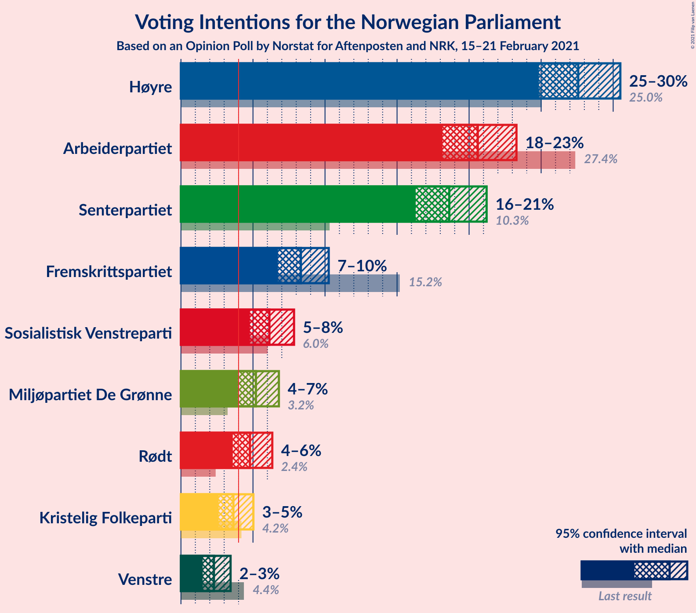

### Confidence Intervals

| Party | Last Result | Poll Result | 80% Confidence Interval | 90% Confidence Interval | 95% Confidence Interval | 99% Confidence Interval |
|:-----:|:-----------:|:-----------:|:-----------------------:|:-----------------------:|:-----------------------:|:-----------------------:|
| Høyre | 25.0% | 27.6% | 25.8–29.5% |25.3–30.0% |24.8–30.5% |24.0–31.4% |
| Arbeiderpartiet | 27.4% | 20.6% | 19.0–22.4% |18.5–22.8% |18.2–23.3% |17.4–24.1% |
| Senterpartiet | 10.3% | 18.6% | 17.1–20.3% |16.7–20.8% |16.3–21.2% |15.6–22.1% |
| Fremskrittspartiet | 15.2% | 8.3% | 7.3–9.6% |7.0–9.9% |6.7–10.3% |6.3–10.9% |
| Sosialistisk Venstreparti | 6.0% | 6.1% | 5.2–7.3% |5.0–7.6% |4.8–7.8% |4.4–8.4% |
| Miljøpartiet De Grønne | 3.2% | 5.2% | 4.4–6.2% |4.2–6.5% |4.0–6.8% |3.6–7.3% |
| Rødt | 2.4% | 4.8% | 4.0–5.8% |3.8–6.1% |3.6–6.3% |3.3–6.8% |
| Kristelig Folkeparti | 4.2% | 3.6% | 3.0–4.5% |2.8–4.8% |2.6–5.0% |2.3–5.5% |
| Venstre | 4.4% | 2.3% | 1.8–3.0% |1.6–3.3% |1.5–3.4% |1.3–3.8% |

*Note:* The poll result column reflects the actual value used in the calculations. Published results may vary slightly, and in addition be rounded to fewer digits.

## Seats

### Confidence Intervals

| Party | Last Result | Median | 80% Confidence Interval | 90% Confidence Interval | 95% Confidence Interval | 99% Confidence Interval |
|:-----:|:-----------:|:------:|:-----------------------:|:-----------------------:|:-----------------------:|:-----------------------:|
| <a href="#høyre">Høyre</a> | 45 | 49 | 45–53 |43–54 |43–55 |41–57 |
| <a href="#arbeiderpartiet">Arbeiderpartiet</a> | 49 | 38 | 34–41 |33–42 |32–42 |30–43 |
| <a href="#senterpartiet">Senterpartiet</a> | 19 | 36 | 32–37 |31–38 |30–39 |28–40 |
| <a href="#fremskrittspartiet">Fremskrittspartiet</a> | 27 | 14 | 12–17 |12–18 |11–18 |10–19 |
| <a href="#sosialistisk-venstreparti">Sosialistisk Venstreparti</a> | 11 | 10 | 9–12 |8–13 |8–14 |7–15 |
| <a href="#miljøpartiet-de-grønne">Miljøpartiet De Grønne</a> | 1 | 9 | 8–11 |7–11 |3–12 |2–13 |
| <a href="#rødt">Rødt</a> | 1 | 8 | 2–10 |2–11 |2–11 |2–12 |
| <a href="#kristelig-folkeparti">Kristelig Folkeparti</a> | 8 | 3 | 1–7 |1–8 |1–8 |1–9 |
| <a href="#venstre">Venstre</a> | 8 | 1 | 0–2 |0–2 |0–2 |0–2 |

### Høyre

*For a full overview of the results for this party, see the [Høyre](party-høyre.html) page.*

| Number of Seats | Probability | Accumulated | Special Marks |
|:---------------:|:-----------:|:-----------:|:-------------:|
| 40 | 0.1% | 100% |  |
| 41 | 0.5% | 99.9% |  |
| 42 | 2% | 99.3% |  |
| 43 | 3% | 98% |  |
| 44 | 2% | 95% |  |
| 45 | 8% | 93% | Last Result |
| 46 | 6% | 85% |  |
| 47 | 15% | 79% |  |
| 48 | 9% | 64% |  |
| 49 | 10% | 55% | Median |
| 50 | 12% | 45% |  |
| 51 | 10% | 33% |  |
| 52 | 10% | 24% |  |
| 53 | 7% | 14% |  |
| 54 | 4% | 7% |  |
| 55 | 1.2% | 3% |  |
| 56 | 0.8% | 1.5% |  |
| 57 | 0.4% | 0.6% |  |
| 58 | 0.1% | 0.3% |  |
| 59 | 0.1% | 0.1% |  |
| 60 | 0% | 0% |  |

### Arbeiderpartiet

*For a full overview of the results for this party, see the [Arbeiderpartiet](party-arbeiderpartiet.html) page.*

| Number of Seats | Probability | Accumulated | Special Marks |
|:---------------:|:-----------:|:-----------:|:-------------:|
| 28 | 0.1% | 100% |  |
| 29 | 0.3% | 99.9% |  |
| 30 | 0.3% | 99.6% |  |
| 31 | 1.5% | 99.3% |  |
| 32 | 1.2% | 98% |  |
| 33 | 3% | 97% |  |
| 34 | 4% | 93% |  |
| 35 | 9% | 89% |  |
| 36 | 9% | 80% |  |
| 37 | 18% | 71% |  |
| 38 | 23% | 53% | Median |
| 39 | 12% | 31% |  |
| 40 | 6% | 19% |  |
| 41 | 7% | 13% |  |
| 42 | 4% | 6% |  |
| 43 | 1.4% | 2% |  |
| 44 | 0.4% | 0.5% |  |
| 45 | 0.1% | 0.1% |  |
| 46 | 0% | 0% |  |
| 47 | 0% | 0% |  |
| 48 | 0% | 0% |  |
| 49 | 0% | 0% | Last Result |

### Senterpartiet

*For a full overview of the results for this party, see the [Senterpartiet](party-senterpartiet.html) page.*

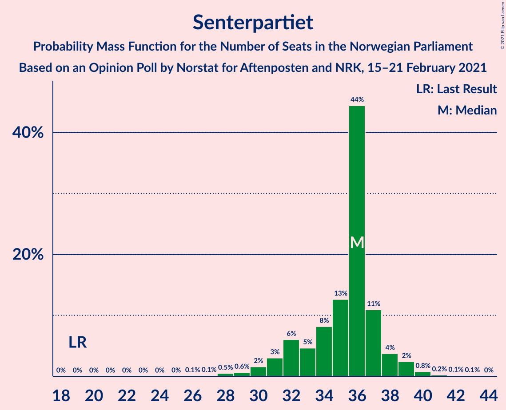

| Number of Seats | Probability | Accumulated | Special Marks |
|:---------------:|:-----------:|:-----------:|:-------------:|
| 19 | 0% | 100% | Last Result |
| 20 | 0% | 100% |  |
| 21 | 0% | 100% |  |
| 22 | 0% | 100% |  |
| 23 | 0% | 100% |  |
| 24 | 0% | 100% |  |
| 25 | 0% | 100% |  |
| 26 | 0.1% | 100% |  |
| 27 | 0.1% | 99.9% |  |
| 28 | 0.5% | 99.8% |  |
| 29 | 0.6% | 99.3% |  |
| 30 | 2% | 98.7% |  |
| 31 | 3% | 97% |  |
| 32 | 6% | 94% |  |
| 33 | 5% | 88% |  |
| 34 | 8% | 83% |  |
| 35 | 13% | 75% |  |
| 36 | 44% | 63% | Median |
| 37 | 11% | 18% |  |
| 38 | 4% | 7% |  |
| 39 | 2% | 4% |  |
| 40 | 0.8% | 1.2% |  |
| 41 | 0.2% | 0.4% |  |
| 42 | 0.1% | 0.2% |  |
| 43 | 0.1% | 0.1% |  |
| 44 | 0% | 0% |  |

### Fremskrittspartiet

*For a full overview of the results for this party, see the [Fremskrittspartiet](party-fremskrittspartiet.html) page.*

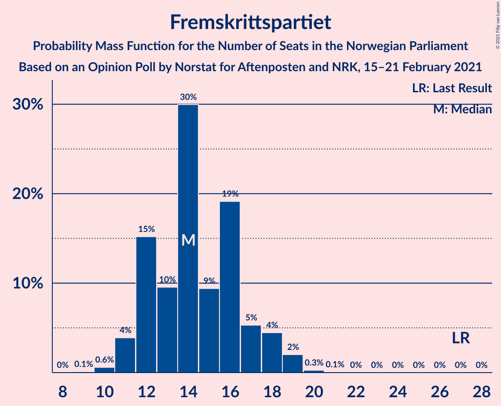

| Number of Seats | Probability | Accumulated | Special Marks |
|:---------------:|:-----------:|:-----------:|:-------------:|
| 9 | 0.1% | 100% |  |
| 10 | 0.6% | 99.9% |  |
| 11 | 4% | 99.3% |  |
| 12 | 15% | 95% |  |
| 13 | 10% | 80% |  |
| 14 | 30% | 71% | Median |
| 15 | 9% | 41% |  |
| 16 | 19% | 31% |  |
| 17 | 5% | 12% |  |
| 18 | 4% | 7% |  |
| 19 | 2% | 2% |  |
| 20 | 0.3% | 0.3% |  |
| 21 | 0.1% | 0.1% |  |
| 22 | 0% | 0% |  |
| 23 | 0% | 0% |  |
| 24 | 0% | 0% |  |
| 25 | 0% | 0% |  |
| 26 | 0% | 0% |  |
| 27 | 0% | 0% | Last Result |

### Sosialistisk Venstreparti

*For a full overview of the results for this party, see the [Sosialistisk Venstreparti](party-sosialistiskvenstreparti.html) page.*

| Number of Seats | Probability | Accumulated | Special Marks |
|:---------------:|:-----------:|:-----------:|:-------------:|
| 2 | 0.1% | 100% |  |
| 3 | 0% | 99.9% |  |
| 4 | 0% | 99.9% |  |
| 5 | 0% | 99.9% |  |
| 6 | 0% | 99.9% |  |
| 7 | 0.4% | 99.9% |  |
| 8 | 5% | 99.5% |  |
| 9 | 17% | 95% |  |
| 10 | 30% | 78% | Median |
| 11 | 28% | 48% | Last Result |
| 12 | 12% | 20% |  |
| 13 | 5% | 8% |  |
| 14 | 2% | 3% |  |
| 15 | 0.9% | 1.0% |  |
| 16 | 0.1% | 0.1% |  |
| 17 | 0% | 0% |  |

### Miljøpartiet De Grønne

*For a full overview of the results for this party, see the [Miljøpartiet De Grønne](party-miljøpartietdegrønne.html) page.*

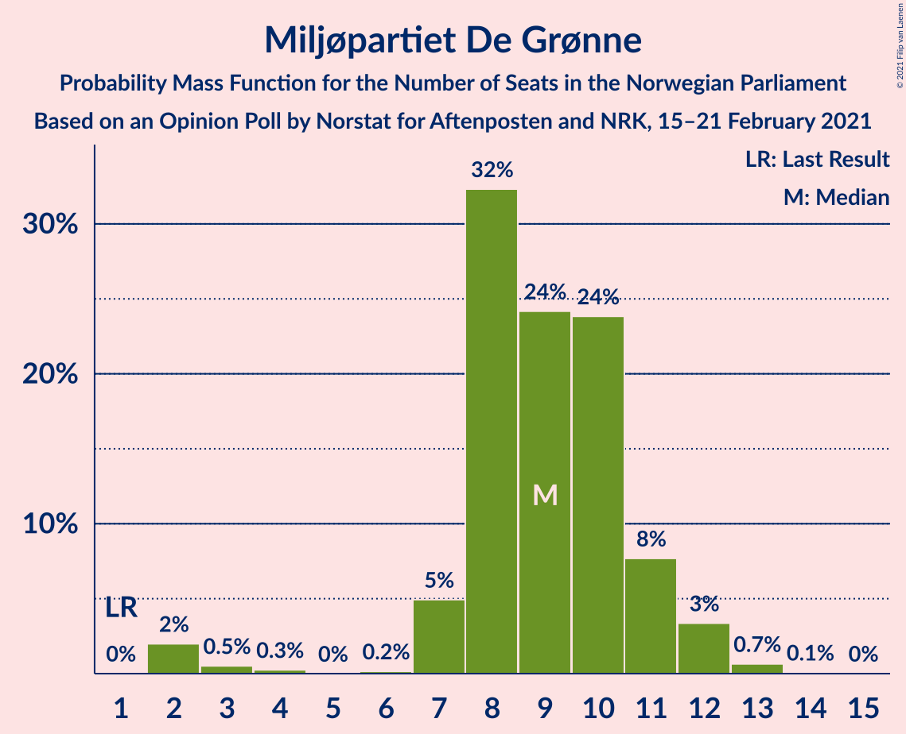

| Number of Seats | Probability | Accumulated | Special Marks |
|:---------------:|:-----------:|:-----------:|:-------------:|
| 1 | 0% | 100% | Last Result |
| 2 | 2% | 100% |  |
| 3 | 0.5% | 98% |  |
| 4 | 0.3% | 97% |  |
| 5 | 0% | 97% |  |
| 6 | 0.2% | 97% |  |
| 7 | 5% | 97% |  |
| 8 | 32% | 92% |  |
| 9 | 24% | 60% | Median |
| 10 | 24% | 36% |  |
| 11 | 8% | 12% |  |
| 12 | 3% | 4% |  |
| 13 | 0.7% | 0.7% |  |
| 14 | 0.1% | 0.1% |  |
| 15 | 0% | 0% |  |

### Rødt

*For a full overview of the results for this party, see the [Rødt](party-rødt.html) page.*

| Number of Seats | Probability | Accumulated | Special Marks |
|:---------------:|:-----------:|:-----------:|:-------------:|
| 1 | 0.1% | 100% | Last Result |
| 2 | 14% | 99.9% |  |
| 3 | 0% | 86% |  |
| 4 | 0% | 86% |  |
| 5 | 0% | 86% |  |
| 6 | 0.7% | 86% |  |
| 7 | 17% | 86% |  |
| 8 | 30% | 68% | Median |
| 9 | 20% | 38% |  |
| 10 | 11% | 17% |  |
| 11 | 6% | 7% |  |
| 12 | 0.5% | 0.6% |  |
| 13 | 0.1% | 0.1% |  |
| 14 | 0% | 0% |  |

### Kristelig Folkeparti

*For a full overview of the results for this party, see the [Kristelig Folkeparti](party-kristeligfolkeparti.html) page.*

| Number of Seats | Probability | Accumulated | Special Marks |
|:---------------:|:-----------:|:-----------:|:-------------:|
| 0 | 0.2% | 100% |  |
| 1 | 16% | 99.8% |  |
| 2 | 8% | 84% |  |
| 3 | 36% | 76% | Median |
| 4 | 0% | 40% |  |
| 5 | 0% | 40% |  |
| 6 | 4% | 40% |  |
| 7 | 28% | 36% |  |
| 8 | 6% | 9% | Last Result |
| 9 | 2% | 2% |  |
| 10 | 0.2% | 0.2% |  |
| 11 | 0% | 0% |  |

### Venstre

*For a full overview of the results for this party, see the [Venstre](party-venstre.html) page.*

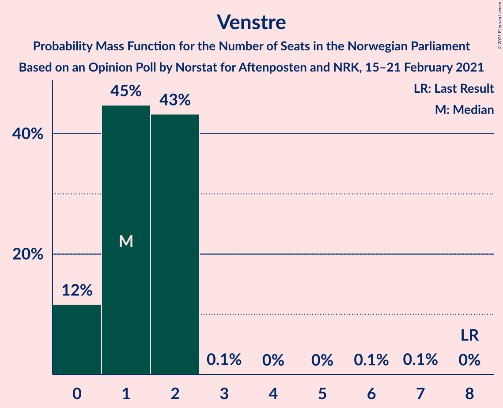

| Number of Seats | Probability | Accumulated | Special Marks |
|:---------------:|:-----------:|:-----------:|:-------------:|
| 0 | 12% | 100% |  |
| 1 | 45% | 88% | Median |
| 2 | 43% | 44% |  |
| 3 | 0.1% | 0.3% |  |
| 4 | 0% | 0.2% |  |
| 5 | 0% | 0.2% |  |
| 6 | 0.1% | 0.2% |  |
| 7 | 0.1% | 0.2% |  |
| 8 | 0% | 0% | Last Result |

## Coalitions

### Confidence Intervals

| Coalition | Last Result | Median | Majority? | 80% Confidence Interval | 90% Confidence Interval | 95% Confidence Interval | 99% Confidence Interval |
|:---------:|:-----------:|:------:|:---------:|:-----------------------:|:-----------------------:|:-----------------------:|:-----------------------:|
| Høyre – Senterpartiet – Fremskrittspartiet – Kristelig Folkeparti – Venstre | 107 | 104 | 100% | 99–108 | 98–110 | 97–111 | 95–115 |
| Arbeiderpartiet – Senterpartiet – Sosialistisk Venstreparti – Miljøpartiet De Grønne – Rødt | 81 | 100 | 100% | 96–104 | 94–106 | 92–107 | 90–108 |
| Arbeiderpartiet – Senterpartiet – Sosialistisk Venstreparti – Miljøpartiet De Grønne – Kristelig Folkeparti | 88 | 97 | 99.9% | 92–101 | 90–102 | 89–104 | 87–106 |
| Arbeiderpartiet – Senterpartiet – Sosialistisk Venstreparti – Miljøpartiet De Grønne | 80 | 92 | 98% | 88–97 | 87–98 | 85–99 | 83–101 |
| Arbeiderpartiet – Senterpartiet – Sosialistisk Venstreparti – Rødt | 80 | 91 | 95% | 87–95 | 85–97 | 84–97 | 81–99 |
| Arbeiderpartiet – Senterpartiet – Miljøpartiet De Grønne – Kristelig Folkeparti | 77 | 86 | 66% | 81–90 | 80–92 | 78–93 | 76–95 |
| Arbeiderpartiet – Senterpartiet – Sosialistisk Venstreparti | 79 | 83 | 30% | 80–87 | 78–88 | 77–89 | 75–91 |
| Høyre – Fremskrittspartiet – Miljøpartiet De Grønne – Kristelig Folkeparti – Venstre | 89 | 78 | 4% | 73–82 | 72–84 | 71–85 | 69–88 |
| Arbeiderpartiet – Senterpartiet – Kristelig Folkeparti | 76 | 77 | 1.4% | 72–81 | 71–83 | 70–84 | 67–85 |
| Arbeiderpartiet – Senterpartiet | 68 | 73 | 0% | 69–76 | 68–77 | 67–78 | 64–79 |
| Høyre – Fremskrittspartiet – Kristelig Folkeparti – Venstre | 88 | 69 | 0% | 64–73 | 63–75 | 62–76 | 60–79 |
| Høyre – Fremskrittspartiet – Venstre | 80 | 65 | 0% | 60–69 | 59–71 | 58–72 | 56–75 |
| Høyre – Fremskrittspartiet | 72 | 63 | 0% | 59–68 | 58–69 | 57–71 | 55–73 |
| Høyre – Kristelig Folkeparti – Venstre | 61 | 55 | 0% | 50–60 | 48–60 | 47–62 | 46–64 |
| Arbeiderpartiet – Sosialistisk Venstreparti | 60 | 48 | 0% | 45–52 | 43–53 | 42–54 | 40–55 |
| Senterpartiet – Kristelig Folkeparti – Venstre | 35 | 41 | 0% | 37–45 | 35–46 | 34–47 | 32–48 |

### Høyre – Senterpartiet – Fremskrittspartiet – Kristelig Folkeparti – Venstre

| Number of Seats | Probability | Accumulated | Special Marks |
|:---------------:|:-----------:|:-----------:|:-------------:|
| 93 | 0% | 100% |  |
| 94 | 0.3% | 99.9% |  |
| 95 | 0.5% | 99.6% |  |
| 96 | 0.9% | 99.1% |  |
| 97 | 0.9% | 98% |  |
| 98 | 4% | 97% |  |
| 99 | 4% | 94% |  |
| 100 | 4% | 90% |  |
| 101 | 7% | 86% |  |
| 102 | 9% | 79% |  |
| 103 | 12% | 70% | Median |
| 104 | 9% | 58% |  |
| 105 | 14% | 49% |  |
| 106 | 6% | 35% |  |
| 107 | 11% | 29% | Last Result |
| 108 | 9% | 17% |  |
| 109 | 3% | 8% |  |
| 110 | 2% | 6% |  |
| 111 | 2% | 4% |  |
| 112 | 0.6% | 2% |  |
| 113 | 0.8% | 2% |  |
| 114 | 0.2% | 0.7% |  |
| 115 | 0.2% | 0.5% |  |
| 116 | 0.2% | 0.3% |  |
| 117 | 0% | 0.1% |  |
| 118 | 0.1% | 0.1% |  |
| 119 | 0% | 0% |  |

### Arbeiderpartiet – Senterpartiet – Sosialistisk Venstreparti – Miljøpartiet De Grønne – Rødt

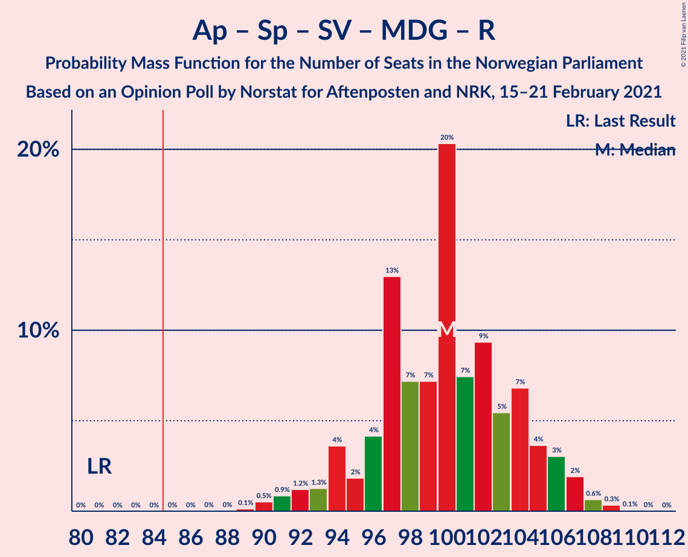

| Number of Seats | Probability | Accumulated | Special Marks |
|:---------------:|:-----------:|:-----------:|:-------------:|
| 81 | 0% | 100% | Last Result |
| 82 | 0% | 100% |  |
| 83 | 0% | 100% |  |
| 84 | 0% | 100% |  |
| 85 | 0% | 100% | Majority |
| 86 | 0% | 100% |  |
| 87 | 0% | 100% |  |
| 88 | 0% | 100% |  |
| 89 | 0.1% | 99.9% |  |
| 90 | 0.5% | 99.8% |  |
| 91 | 0.9% | 99.3% |  |
| 92 | 1.2% | 98% |  |
| 93 | 1.3% | 97% |  |
| 94 | 4% | 96% |  |
| 95 | 2% | 92% |  |
| 96 | 4% | 91% |  |
| 97 | 13% | 86% |  |
| 98 | 7% | 73% |  |
| 99 | 7% | 66% |  |
| 100 | 20% | 59% |  |
| 101 | 7% | 39% | Median |
| 102 | 9% | 31% |  |
| 103 | 5% | 22% |  |
| 104 | 7% | 16% |  |
| 105 | 4% | 10% |  |
| 106 | 3% | 6% |  |
| 107 | 2% | 3% |  |
| 108 | 0.6% | 1.1% |  |
| 109 | 0.3% | 0.4% |  |
| 110 | 0.1% | 0.1% |  |
| 111 | 0% | 0% |  |

### Arbeiderpartiet – Senterpartiet – Sosialistisk Venstreparti – Miljøpartiet De Grønne – Kristelig Folkeparti

| Number of Seats | Probability | Accumulated | Special Marks |
|:---------------:|:-----------:|:-----------:|:-------------:|
| 84 | 0.1% | 100% |  |
| 85 | 0% | 99.9% | Majority |
| 86 | 0.2% | 99.8% |  |
| 87 | 0.6% | 99.7% |  |
| 88 | 0.6% | 99.1% | Last Result |
| 89 | 2% | 98.5% |  |
| 90 | 3% | 97% |  |
| 91 | 2% | 94% |  |
| 92 | 3% | 92% |  |
| 93 | 8% | 88% |  |
| 94 | 5% | 81% |  |
| 95 | 15% | 76% |  |
| 96 | 10% | 61% | Median |
| 97 | 14% | 51% |  |
| 98 | 7% | 37% |  |
| 99 | 9% | 29% |  |
| 100 | 7% | 20% |  |
| 101 | 6% | 13% |  |
| 102 | 3% | 7% |  |
| 103 | 2% | 4% |  |
| 104 | 1.0% | 3% |  |
| 105 | 0.8% | 2% |  |
| 106 | 0.5% | 0.8% |  |
| 107 | 0.2% | 0.3% |  |
| 108 | 0.1% | 0.1% |  |
| 109 | 0% | 0% |  |

### Arbeiderpartiet – Senterpartiet – Sosialistisk Venstreparti – Miljøpartiet De Grønne

| Number of Seats | Probability | Accumulated | Special Marks |
|:---------------:|:-----------:|:-----------:|:-------------:|
| 80 | 0% | 100% | Last Result |
| 81 | 0.2% | 99.9% |  |
| 82 | 0.2% | 99.8% |  |
| 83 | 0.4% | 99.5% |  |
| 84 | 0.8% | 99.1% |  |
| 85 | 1.1% | 98% | Majority |
| 86 | 2% | 97% |  |
| 87 | 2% | 95% |  |
| 88 | 3% | 93% |  |
| 89 | 8% | 90% |  |
| 90 | 12% | 82% |  |
| 91 | 6% | 70% |  |
| 92 | 21% | 64% |  |
| 93 | 11% | 44% | Median |
| 94 | 10% | 33% |  |
| 95 | 9% | 23% |  |
| 96 | 4% | 14% |  |
| 97 | 3% | 11% |  |
| 98 | 4% | 7% |  |
| 99 | 2% | 3% |  |
| 100 | 0.5% | 1.0% |  |
| 101 | 0.3% | 0.5% |  |
| 102 | 0.1% | 0.2% |  |
| 103 | 0% | 0.1% |  |
| 104 | 0% | 0% |  |

### Arbeiderpartiet – Senterpartiet – Sosialistisk Venstreparti – Rødt

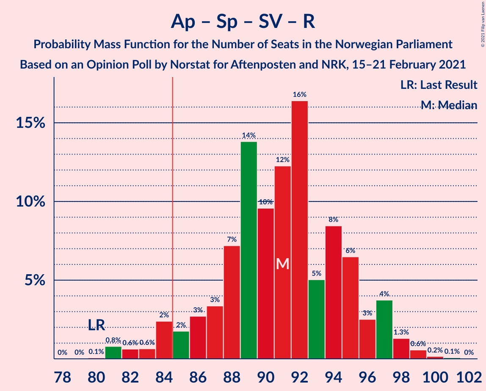

| Number of Seats | Probability | Accumulated | Special Marks |
|:---------------:|:-----------:|:-----------:|:-------------:|
| 80 | 0.1% | 100% | Last Result |
| 81 | 0.8% | 99.9% |  |
| 82 | 0.6% | 99.1% |  |
| 83 | 0.6% | 98% |  |
| 84 | 2% | 98% |  |
| 85 | 2% | 95% | Majority |
| 86 | 3% | 94% |  |
| 87 | 3% | 91% |  |
| 88 | 7% | 88% |  |
| 89 | 14% | 80% |  |
| 90 | 10% | 67% |  |
| 91 | 12% | 57% |  |
| 92 | 16% | 45% | Median |
| 93 | 5% | 28% |  |
| 94 | 8% | 23% |  |
| 95 | 6% | 15% |  |
| 96 | 3% | 8% |  |
| 97 | 4% | 6% |  |
| 98 | 1.3% | 2% |  |
| 99 | 0.6% | 0.8% |  |
| 100 | 0.2% | 0.3% |  |
| 101 | 0.1% | 0.1% |  |
| 102 | 0% | 0% |  |

### Arbeiderpartiet – Senterpartiet – Miljøpartiet De Grønne – Kristelig Folkeparti

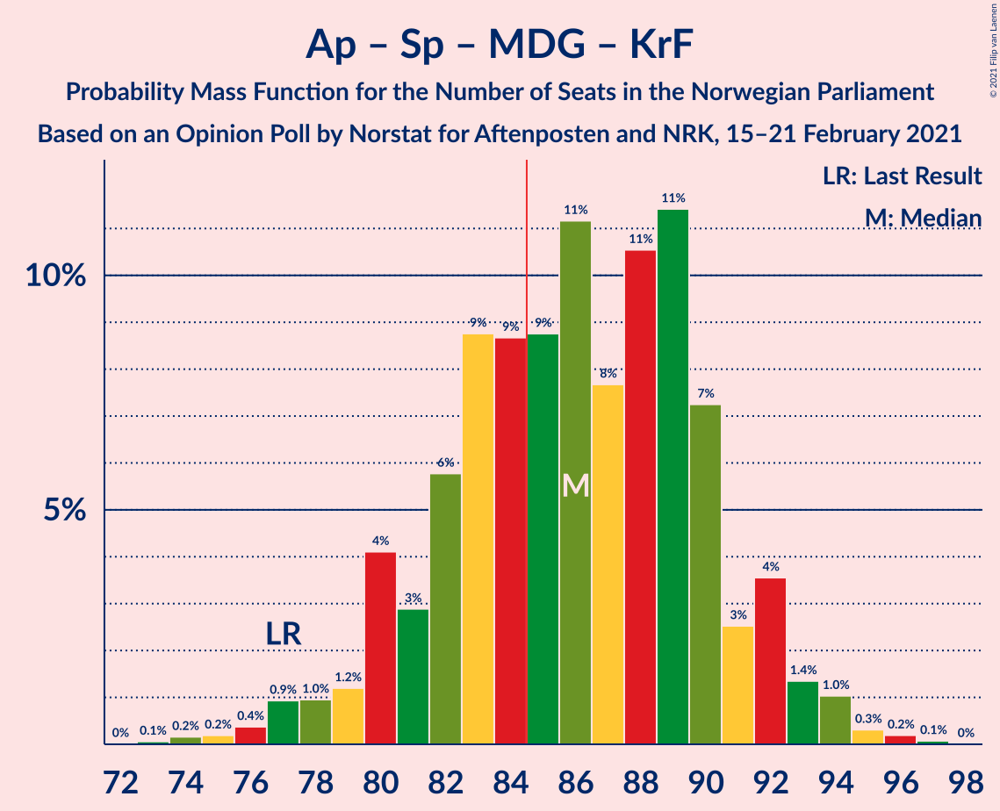

| Number of Seats | Probability | Accumulated | Special Marks |
|:---------------:|:-----------:|:-----------:|:-------------:|
| 73 | 0.1% | 100% |  |
| 74 | 0.2% | 99.9% |  |
| 75 | 0.2% | 99.8% |  |
| 76 | 0.4% | 99.6% |  |
| 77 | 0.9% | 99.2% | Last Result |
| 78 | 1.0% | 98% |  |
| 79 | 1.2% | 97% |  |
| 80 | 4% | 96% |  |
| 81 | 3% | 92% |  |
| 82 | 6% | 89% |  |
| 83 | 9% | 83% |  |
| 84 | 9% | 75% |  |
| 85 | 9% | 66% | Majority |
| 86 | 11% | 57% | Median |
| 87 | 8% | 46% |  |
| 88 | 11% | 38% |  |
| 89 | 11% | 28% |  |
| 90 | 7% | 16% |  |
| 91 | 3% | 9% |  |
| 92 | 4% | 7% |  |
| 93 | 1.4% | 3% |  |
| 94 | 1.0% | 2% |  |
| 95 | 0.3% | 0.6% |  |
| 96 | 0.2% | 0.3% |  |
| 97 | 0.1% | 0.1% |  |
| 98 | 0% | 0% |  |

### Arbeiderpartiet – Senterpartiet – Sosialistisk Venstreparti

| Number of Seats | Probability | Accumulated | Special Marks |
|:---------------:|:-----------:|:-----------:|:-------------:|
| 73 | 0.3% | 100% |  |
| 74 | 0.2% | 99.7% |  |
| 75 | 0.7% | 99.5% |  |
| 76 | 0.4% | 98.9% |  |
| 77 | 2% | 98% |  |
| 78 | 2% | 96% |  |
| 79 | 3% | 95% | Last Result |
| 80 | 7% | 92% |  |
| 81 | 6% | 85% |  |
| 82 | 18% | 79% |  |
| 83 | 12% | 61% |  |
| 84 | 19% | 49% | Median |
| 85 | 7% | 30% | Majority |
| 86 | 8% | 23% |  |
| 87 | 7% | 14% |  |
| 88 | 3% | 7% |  |
| 89 | 2% | 4% |  |
| 90 | 0.7% | 2% |  |
| 91 | 0.5% | 0.9% |  |
| 92 | 0.2% | 0.4% |  |
| 93 | 0.1% | 0.1% |  |
| 94 | 0% | 0% |  |

### Høyre – Fremskrittspartiet – Miljøpartiet De Grønne – Kristelig Folkeparti – Venstre

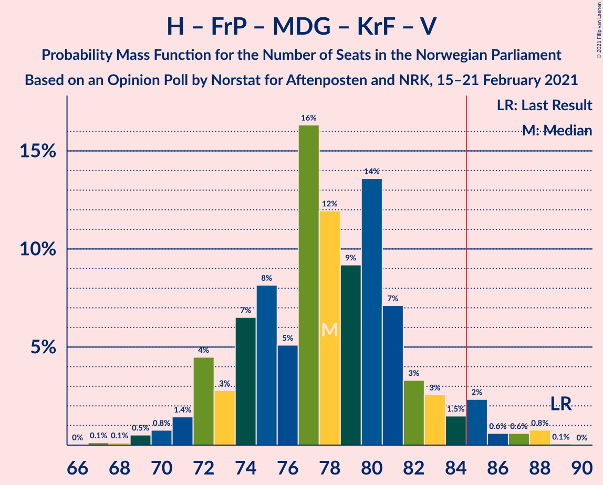

| Number of Seats | Probability | Accumulated | Special Marks |
|:---------------:|:-----------:|:-----------:|:-------------:|
| 66 | 0% | 100% |  |
| 67 | 0.1% | 99.9% |  |
| 68 | 0.1% | 99.8% |  |
| 69 | 0.5% | 99.7% |  |
| 70 | 0.8% | 99.2% |  |
| 71 | 1.4% | 98% |  |
| 72 | 4% | 97% |  |
| 73 | 3% | 92% |  |
| 74 | 7% | 90% |  |
| 75 | 8% | 83% |  |
| 76 | 5% | 75% | Median |
| 77 | 16% | 70% |  |
| 78 | 12% | 54% |  |
| 79 | 9% | 42% |  |
| 80 | 14% | 32% |  |
| 81 | 7% | 19% |  |
| 82 | 3% | 12% |  |
| 83 | 3% | 8% |  |
| 84 | 1.5% | 6% |  |
| 85 | 2% | 4% | Majority |
| 86 | 0.6% | 2% |  |
| 87 | 0.6% | 1.5% |  |
| 88 | 0.8% | 0.9% |  |
| 89 | 0.1% | 0.1% | Last Result |
| 90 | 0% | 0% |  |

### Arbeiderpartiet – Senterpartiet – Kristelig Folkeparti

| Number of Seats | Probability | Accumulated | Special Marks |
|:---------------:|:-----------:|:-----------:|:-------------:|
| 64 | 0% | 100% |  |
| 65 | 0% | 99.9% |  |
| 66 | 0.3% | 99.9% |  |
| 67 | 0.3% | 99.6% |  |
| 68 | 0.5% | 99.3% |  |
| 69 | 0.8% | 98.8% |  |
| 70 | 2% | 98% |  |
| 71 | 3% | 96% |  |
| 72 | 7% | 93% |  |
| 73 | 4% | 86% |  |
| 74 | 5% | 82% |  |
| 75 | 8% | 77% |  |
| 76 | 14% | 69% | Last Result |
| 77 | 10% | 55% | Median |
| 78 | 8% | 45% |  |
| 79 | 6% | 37% |  |
| 80 | 12% | 31% |  |
| 81 | 11% | 20% |  |
| 82 | 3% | 9% |  |
| 83 | 2% | 6% |  |
| 84 | 3% | 5% |  |
| 85 | 1.0% | 1.4% | Majority |
| 86 | 0.1% | 0.4% |  |
| 87 | 0.3% | 0.3% |  |
| 88 | 0% | 0% |  |

### Arbeiderpartiet – Senterpartiet

| Number of Seats | Probability | Accumulated | Special Marks |
|:---------------:|:-----------:|:-----------:|:-------------:|
| 62 | 0.1% | 100% |  |
| 63 | 0.3% | 99.9% |  |
| 64 | 0.3% | 99.6% |  |
| 65 | 0.8% | 99.4% |  |
| 66 | 0.8% | 98.6% |  |
| 67 | 2% | 98% |  |
| 68 | 3% | 96% | Last Result |
| 69 | 3% | 93% |  |
| 70 | 7% | 90% |  |
| 71 | 13% | 83% |  |
| 72 | 9% | 70% |  |
| 73 | 22% | 61% |  |
| 74 | 16% | 40% | Median |
| 75 | 8% | 23% |  |
| 76 | 6% | 15% |  |
| 77 | 6% | 10% |  |
| 78 | 2% | 4% |  |
| 79 | 0.8% | 1.3% |  |
| 80 | 0.4% | 0.5% |  |
| 81 | 0.1% | 0.1% |  |
| 82 | 0% | 0.1% |  |
| 83 | 0% | 0% |  |

### Høyre – Fremskrittspartiet – Kristelig Folkeparti – Venstre

| Number of Seats | Probability | Accumulated | Special Marks |
|:---------------:|:-----------:|:-----------:|:-------------:|
| 58 | 0.1% | 100% |  |
| 59 | 0.2% | 99.9% |  |
| 60 | 0.5% | 99.7% |  |
| 61 | 0.9% | 99.2% |  |
| 62 | 2% | 98% |  |
| 63 | 3% | 96% |  |
| 64 | 4% | 93% |  |
| 65 | 7% | 89% |  |
| 66 | 6% | 82% |  |
| 67 | 9% | 76% | Median |
| 68 | 8% | 67% |  |
| 69 | 20% | 60% |  |
| 70 | 7% | 39% |  |
| 71 | 7% | 33% |  |
| 72 | 13% | 26% |  |
| 73 | 4% | 13% |  |
| 74 | 2% | 9% |  |
| 75 | 3% | 7% |  |
| 76 | 1.1% | 4% |  |
| 77 | 1.0% | 2% |  |
| 78 | 0.8% | 1.4% |  |
| 79 | 0.5% | 0.6% |  |
| 80 | 0.1% | 0.1% |  |
| 81 | 0% | 0% |  |
| 82 | 0% | 0% |  |
| 83 | 0% | 0% |  |
| 84 | 0% | 0% |  |
| 85 | 0% | 0% | Majority |
| 86 | 0% | 0% |  |
| 87 | 0% | 0% |  |
| 88 | 0% | 0% | Last Result |

### Høyre – Fremskrittspartiet – Venstre

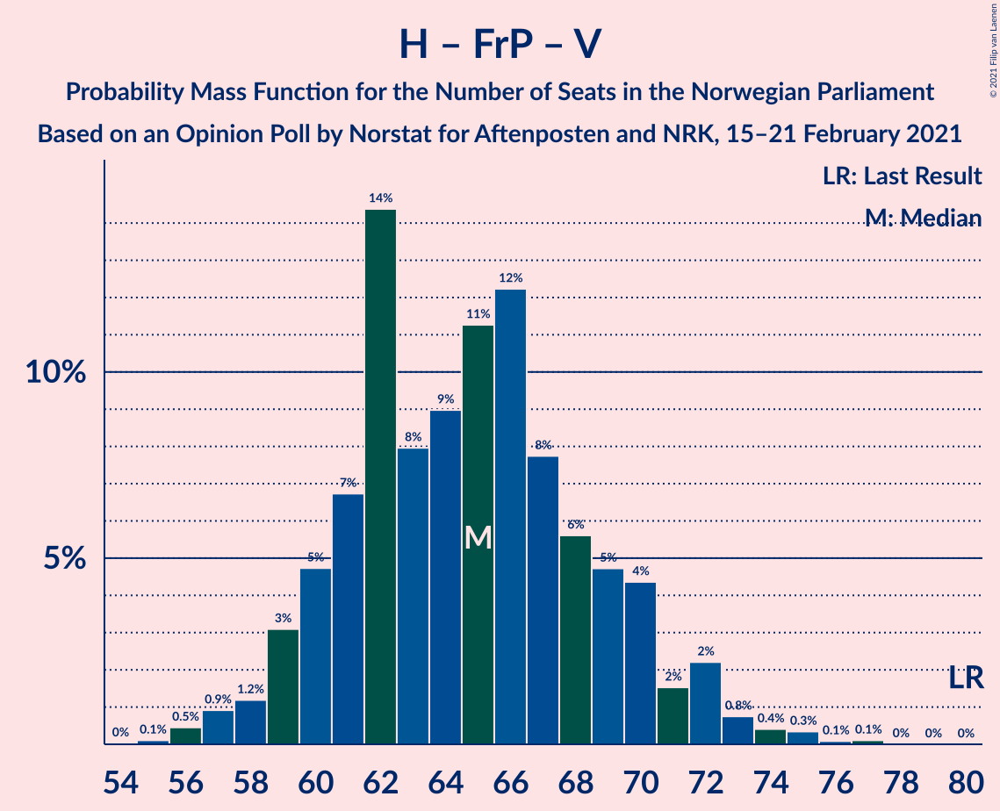

| Number of Seats | Probability | Accumulated | Special Marks |
|:---------------:|:-----------:|:-----------:|:-------------:|
| 55 | 0.1% | 100% |  |
| 56 | 0.5% | 99.9% |  |
| 57 | 0.9% | 99.4% |  |
| 58 | 1.2% | 98% |  |
| 59 | 3% | 97% |  |
| 60 | 5% | 94% |  |
| 61 | 7% | 89% |  |
| 62 | 14% | 83% |  |
| 63 | 8% | 68% |  |
| 64 | 9% | 60% | Median |
| 65 | 11% | 51% |  |
| 66 | 12% | 40% |  |
| 67 | 8% | 28% |  |
| 68 | 6% | 20% |  |
| 69 | 5% | 15% |  |
| 70 | 4% | 10% |  |
| 71 | 2% | 5% |  |
| 72 | 2% | 4% |  |
| 73 | 0.8% | 2% |  |
| 74 | 0.4% | 1.0% |  |
| 75 | 0.3% | 0.6% |  |
| 76 | 0.1% | 0.2% |  |
| 77 | 0.1% | 0.1% |  |
| 78 | 0% | 0% |  |
| 79 | 0% | 0% |  |
| 80 | 0% | 0% | Last Result |

### Høyre – Fremskrittspartiet

| Number of Seats | Probability | Accumulated | Special Marks |
|:---------------:|:-----------:|:-----------:|:-------------:|
| 54 | 0.3% | 100% |  |
| 55 | 0.7% | 99.7% |  |
| 56 | 1.2% | 98.9% |  |
| 57 | 2% | 98% |  |
| 58 | 3% | 96% |  |
| 59 | 7% | 93% |  |
| 60 | 5% | 86% |  |
| 61 | 15% | 82% |  |
| 62 | 9% | 67% |  |
| 63 | 12% | 58% | Median |
| 64 | 10% | 45% |  |
| 65 | 10% | 36% |  |
| 66 | 8% | 25% |  |
| 67 | 4% | 18% |  |
| 68 | 6% | 13% |  |
| 69 | 3% | 8% |  |
| 70 | 2% | 5% |  |
| 71 | 2% | 3% |  |
| 72 | 0.3% | 1.1% | Last Result |
| 73 | 0.6% | 0.8% |  |
| 74 | 0.1% | 0.3% |  |
| 75 | 0.1% | 0.2% |  |
| 76 | 0% | 0.1% |  |
| 77 | 0% | 0% |  |

### Høyre – Kristelig Folkeparti – Venstre

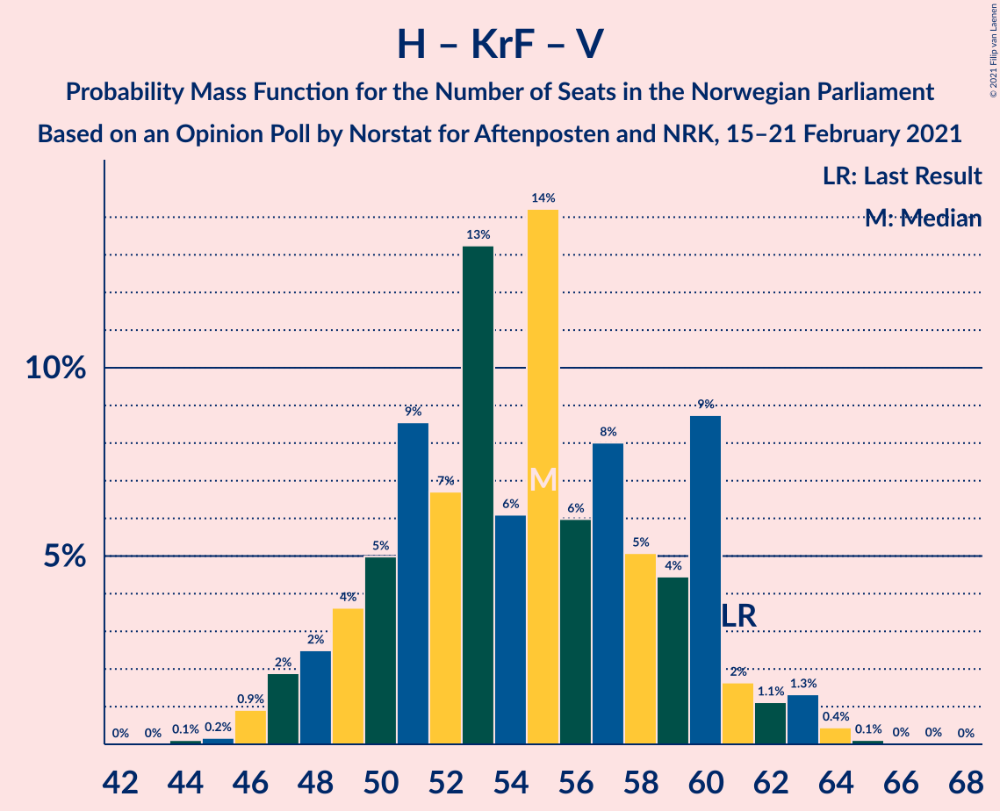

| Number of Seats | Probability | Accumulated | Special Marks |
|:---------------:|:-----------:|:-----------:|:-------------:|
| 44 | 0.1% | 100% |  |
| 45 | 0.2% | 99.9% |  |
| 46 | 0.9% | 99.7% |  |
| 47 | 2% | 98.8% |  |
| 48 | 2% | 97% |  |
| 49 | 4% | 94% |  |
| 50 | 5% | 91% |  |
| 51 | 9% | 86% |  |
| 52 | 7% | 77% |  |
| 53 | 13% | 71% | Median |
| 54 | 6% | 57% |  |
| 55 | 14% | 51% |  |
| 56 | 6% | 37% |  |
| 57 | 8% | 31% |  |
| 58 | 5% | 23% |  |
| 59 | 4% | 18% |  |
| 60 | 9% | 13% |  |
| 61 | 2% | 5% | Last Result |
| 62 | 1.1% | 3% |  |
| 63 | 1.3% | 2% |  |
| 64 | 0.4% | 0.6% |  |
| 65 | 0.1% | 0.2% |  |
| 66 | 0% | 0.1% |  |
| 67 | 0% | 0% |  |

### Arbeiderpartiet – Sosialistisk Venstreparti

| Number of Seats | Probability | Accumulated | Special Marks |
|:---------------:|:-----------:|:-----------:|:-------------:|
| 37 | 0.1% | 100% |  |
| 38 | 0.1% | 99.9% |  |
| 39 | 0.1% | 99.8% |  |
| 40 | 0.3% | 99.7% |  |
| 41 | 0.8% | 99.4% |  |
| 42 | 1.5% | 98.6% |  |
| 43 | 3% | 97% |  |
| 44 | 3% | 95% |  |
| 45 | 6% | 91% |  |
| 46 | 14% | 86% |  |
| 47 | 17% | 71% |  |
| 48 | 14% | 54% | Median |
| 49 | 8% | 40% |  |
| 50 | 15% | 32% |  |
| 51 | 5% | 17% |  |
| 52 | 4% | 11% |  |
| 53 | 4% | 7% |  |
| 54 | 2% | 3% |  |
| 55 | 1.0% | 1.4% |  |
| 56 | 0.2% | 0.3% |  |
| 57 | 0.1% | 0.2% |  |
| 58 | 0% | 0% |  |
| 59 | 0% | 0% |  |
| 60 | 0% | 0% | Last Result |

### Senterpartiet – Kristelig Folkeparti – Venstre

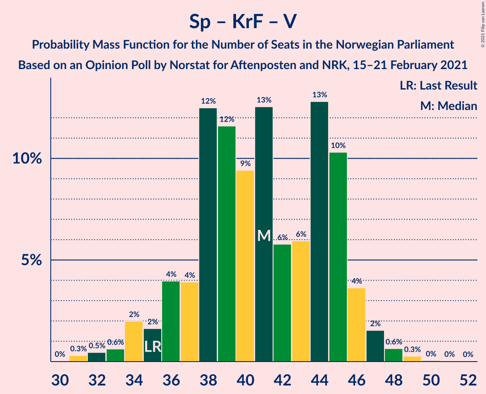

| Number of Seats | Probability | Accumulated | Special Marks |
|:---------------:|:-----------:|:-----------:|:-------------:|
| 30 | 0% | 100% |  |
| 31 | 0.3% | 99.9% |  |
| 32 | 0.5% | 99.6% |  |
| 33 | 0.6% | 99.2% |  |
| 34 | 2% | 98.6% |  |
| 35 | 2% | 97% | Last Result |
| 36 | 4% | 95% |  |
| 37 | 4% | 91% |  |
| 38 | 12% | 87% |  |
| 39 | 12% | 75% |  |
| 40 | 9% | 63% | Median |
| 41 | 13% | 54% |  |
| 42 | 6% | 41% |  |
| 43 | 6% | 35% |  |
| 44 | 13% | 29% |  |
| 45 | 10% | 16% |  |
| 46 | 4% | 6% |  |
| 47 | 2% | 3% |  |
| 48 | 0.6% | 1.0% |  |
| 49 | 0.3% | 0.4% |  |
| 50 | 0% | 0.1% |  |
| 51 | 0% | 0.1% |  |
| 52 | 0% | 0% |  |

## Technical Information

### Opinion Poll

+ **Polling firm:** Norstat
+ **Commissioner(s):** Aftenposten and NRK
+ **Fieldwork period:** 15–21 February 2021

### Calculations

+ **Sample size:** 961
+ **Simulations done:** 1,048,576
+ **Error estimate:** 0.59%

