# Opinion Poll by Ipsos MMI for Dagbladet, 22–24 February 2021

<a href="#voting-intentions">Voting Intentions</a> | <a href="#seats">Seats</a> | <a href="#coalitions">Coalitions</a> | <a href="#technical-information">Technical Information</a>

## Voting Intentions

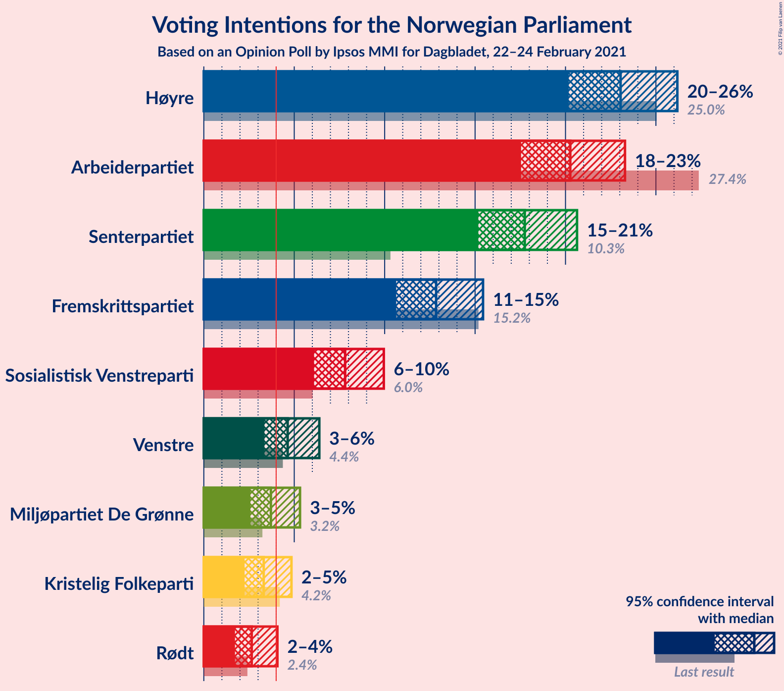

### Confidence Intervals

| Party | Last Result | Poll Result | 80% Confidence Interval | 90% Confidence Interval | 95% Confidence Interval | 99% Confidence Interval |
|:-----:|:-----------:|:-----------:|:-----------------------:|:-----------------------:|:-----------------------:|:-----------------------:|
| Høyre | 25.0% | 23.0% | 21.2–25.1% |20.6–25.7% |20.2–26.2% |19.3–27.2% |
| Arbeiderpartiet | 27.4% | 20.3% | 18.5–22.2% |18.0–22.8% |17.5–23.3% |16.7–24.3% |
| Senterpartiet | 10.3% | 17.7% | 16.1–19.6% |15.6–20.2% |15.2–20.6% |14.4–21.6% |
| Fremskrittspartiet | 15.2% | 12.8% | 11.4–14.5% |11.0–15.0% |10.6–15.4% |10.0–16.3% |
| Sosialistisk Venstreparti | 6.0% | 7.8% | 6.7–9.2% |6.4–9.6% |6.1–10.0% |5.6–10.7% |
| Venstre | 4.4% | 4.6% | 3.8–5.8% |3.6–6.1% |3.4–6.4% |3.0–7.0% |
| Miljøpartiet De Grønne | 3.2% | 3.7% | 3.0–4.8% |2.7–5.0% |2.6–5.3% |2.3–5.9% |
| Kristelig Folkeparti | 4.2% | 3.3% | 2.6–4.3% |2.4–4.6% |2.3–4.8% |2.0–5.4% |
| Rødt | 2.4% | 2.6% | 2.0–3.6% |1.9–3.8% |1.7–4.1% |1.5–4.5% |

*Note:* The poll result column reflects the actual value used in the calculations. Published results may vary slightly, and in addition be rounded to fewer digits.

## Seats

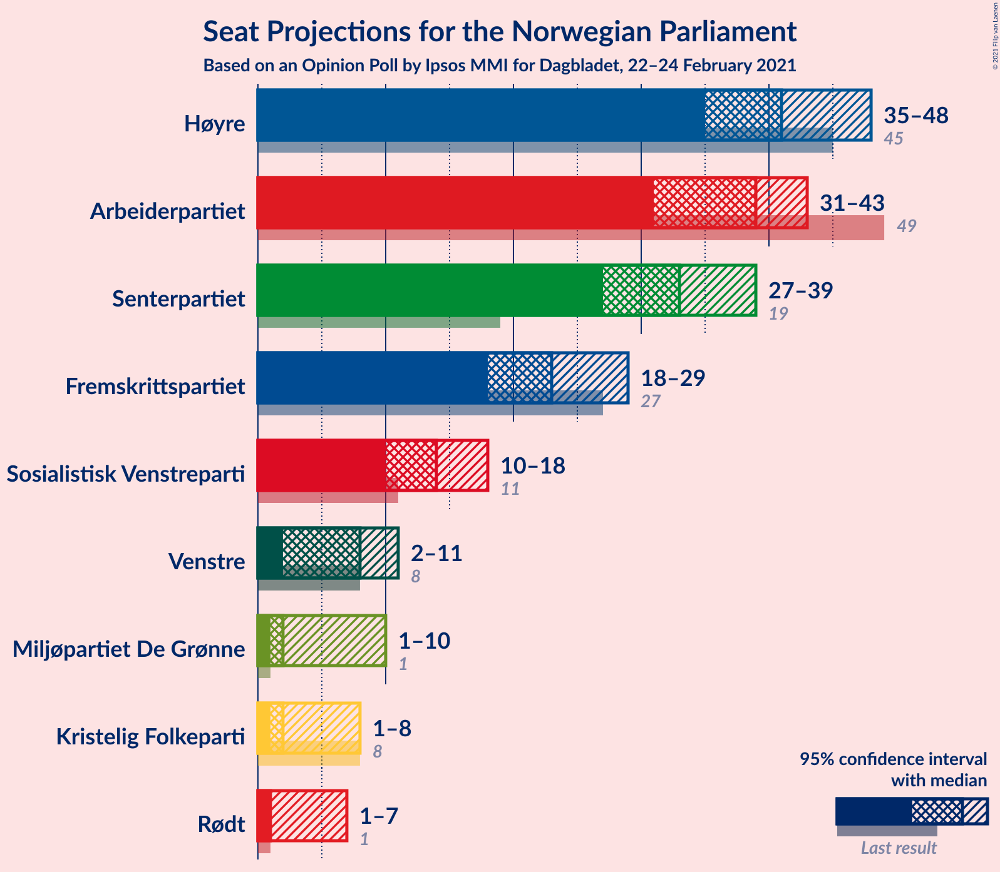

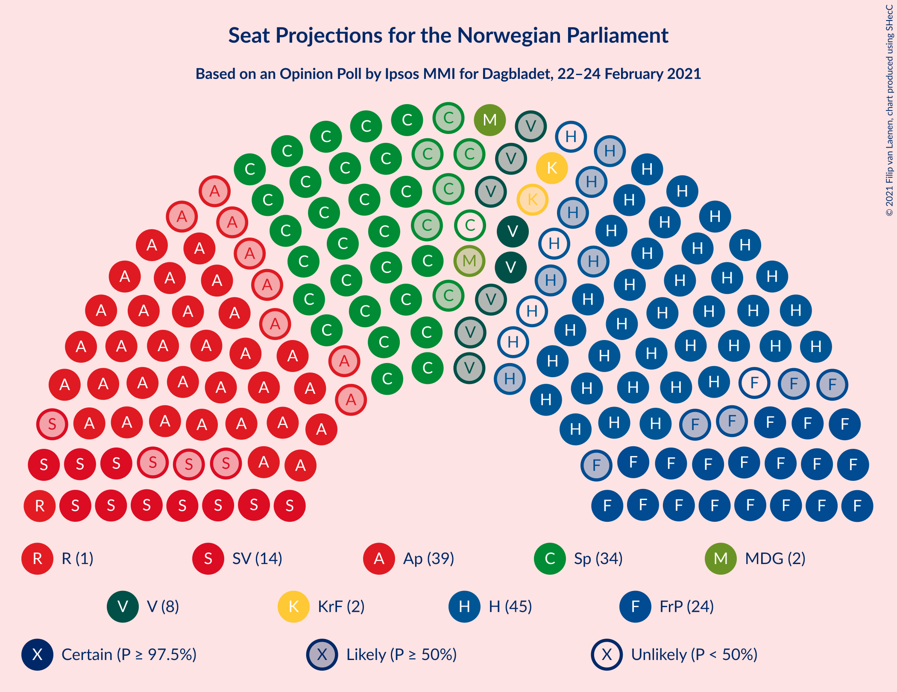

### Confidence Intervals

| Party | Last Result | Median | 80% Confidence Interval | 90% Confidence Interval | 95% Confidence Interval | 99% Confidence Interval |
|:-----:|:-----------:|:------:|:-----------------------:|:-----------------------:|:-----------------------:|:-----------------------:|
| <a href="#høyre">Høyre</a> | 45 | 41 | 37–45 |36–47 |35–48 |33–50 |
| <a href="#arbeiderpartiet">Arbeiderpartiet</a> | 49 | 39 | 34–41 |33–42 |31–43 |29–45 |
| <a href="#senterpartiet">Senterpartiet</a> | 19 | 33 | 28–36 |27–38 |27–39 |26–42 |
| <a href="#fremskrittspartiet">Fremskrittspartiet</a> | 27 | 23 | 20–27 |18–28 |18–29 |17–30 |
| <a href="#sosialistisk-venstreparti">Sosialistisk Venstreparti</a> | 11 | 14 | 11–17 |11–17 |10–18 |9–19 |
| <a href="#venstre">Venstre</a> | 8 | 8 | 2–10 |2–11 |2–11 |2–13 |
| <a href="#miljøpartiet-de-grønne">Miljøpartiet De Grønne</a> | 1 | 2 | 1–8 |1–9 |1–10 |1–10 |
| <a href="#kristelig-folkeparti">Kristelig Folkeparti</a> | 8 | 2 | 1–7 |1–8 |1–8 |0–9 |
| <a href="#rødt">Rødt</a> | 1 | 1 | 1–2 |1–2 |1–7 |1–8 |

### Høyre

*For a full overview of the results for this party, see the [Høyre](party-høyre.html) page.*

| Number of Seats | Probability | Accumulated | Special Marks |
|:---------------:|:-----------:|:-----------:|:-------------:|
| 32 | 0.1% | 100% |  |
| 33 | 0.6% | 99.9% |  |
| 34 | 0.9% | 99.4% |  |
| 35 | 2% | 98% |  |
| 36 | 5% | 97% |  |
| 37 | 6% | 92% |  |
| 38 | 4% | 86% |  |
| 39 | 9% | 82% |  |
| 40 | 16% | 73% |  |
| 41 | 12% | 56% | Median |
| 42 | 12% | 44% |  |
| 43 | 11% | 32% |  |
| 44 | 4% | 21% |  |
| 45 | 9% | 17% | Last Result |
| 46 | 2% | 8% |  |
| 47 | 2% | 6% |  |
| 48 | 2% | 4% |  |
| 49 | 0.6% | 2% |  |
| 50 | 0.5% | 0.9% |  |
| 51 | 0.2% | 0.4% |  |
| 52 | 0.2% | 0.2% |  |
| 53 | 0% | 0.1% |  |
| 54 | 0% | 0% |  |

### Arbeiderpartiet

*For a full overview of the results for this party, see the [Arbeiderpartiet](party-arbeiderpartiet.html) page.*

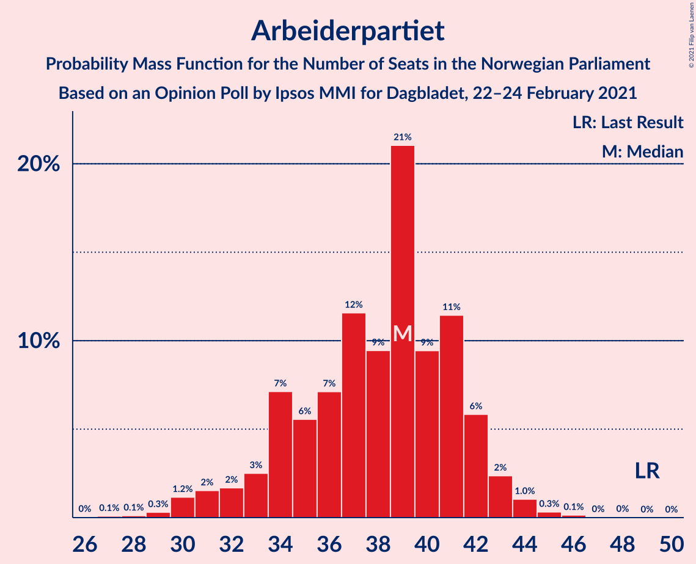

| Number of Seats | Probability | Accumulated | Special Marks |
|:---------------:|:-----------:|:-----------:|:-------------:|
| 27 | 0.1% | 100% |  |
| 28 | 0.1% | 99.9% |  |
| 29 | 0.3% | 99.8% |  |
| 30 | 1.2% | 99.4% |  |
| 31 | 2% | 98% |  |
| 32 | 2% | 97% |  |
| 33 | 3% | 95% |  |
| 34 | 7% | 93% |  |
| 35 | 6% | 85% |  |
| 36 | 7% | 80% |  |
| 37 | 12% | 73% |  |
| 38 | 9% | 61% |  |
| 39 | 21% | 52% | Median |
| 40 | 9% | 31% |  |
| 41 | 11% | 21% |  |
| 42 | 6% | 10% |  |
| 43 | 2% | 4% |  |
| 44 | 1.0% | 2% |  |
| 45 | 0.3% | 0.5% |  |
| 46 | 0.1% | 0.2% |  |
| 47 | 0% | 0.1% |  |
| 48 | 0% | 0% |  |
| 49 | 0% | 0% | Last Result |

### Senterpartiet

*For a full overview of the results for this party, see the [Senterpartiet](party-senterpartiet.html) page.*

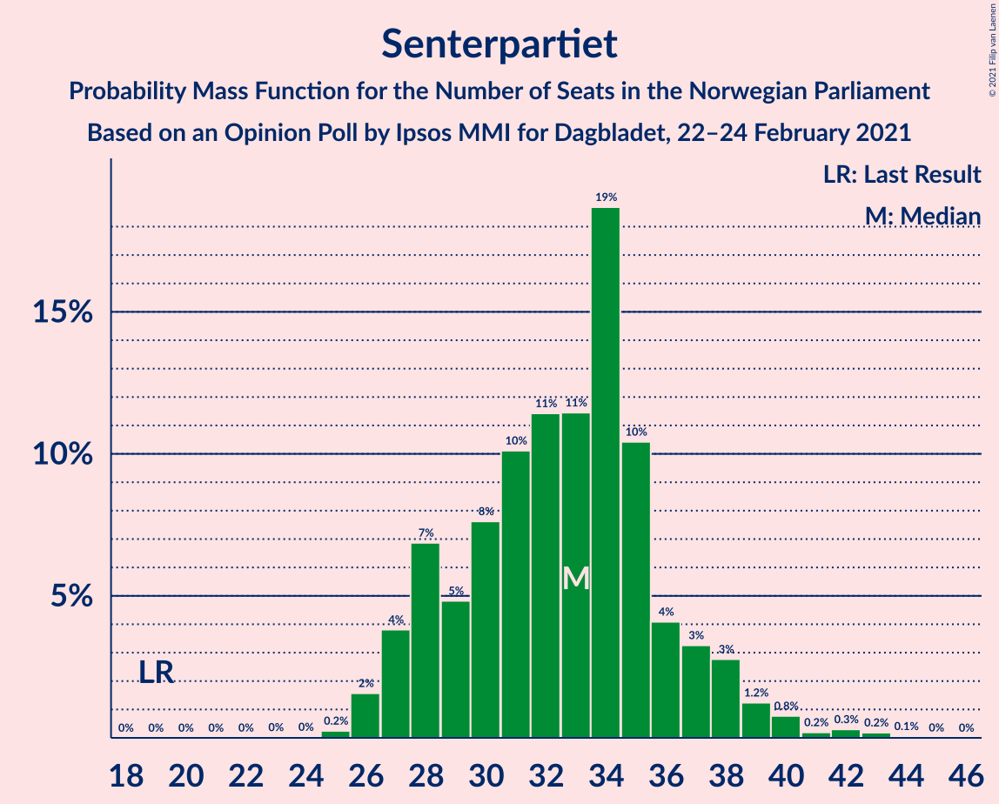

| Number of Seats | Probability | Accumulated | Special Marks |
|:---------------:|:-----------:|:-----------:|:-------------:|
| 19 | 0% | 100% | Last Result |
| 20 | 0% | 100% |  |
| 21 | 0% | 100% |  |
| 22 | 0% | 100% |  |
| 23 | 0% | 100% |  |
| 24 | 0% | 100% |  |
| 25 | 0.2% | 99.9% |  |
| 26 | 2% | 99.7% |  |
| 27 | 4% | 98% |  |
| 28 | 7% | 94% |  |
| 29 | 5% | 87% |  |
| 30 | 8% | 83% |  |
| 31 | 10% | 75% |  |
| 32 | 11% | 65% |  |
| 33 | 11% | 53% | Median |
| 34 | 19% | 42% |  |
| 35 | 10% | 23% |  |
| 36 | 4% | 13% |  |
| 37 | 3% | 9% |  |
| 38 | 3% | 6% |  |
| 39 | 1.2% | 3% |  |
| 40 | 0.8% | 2% |  |
| 41 | 0.2% | 0.7% |  |
| 42 | 0.3% | 0.6% |  |
| 43 | 0.2% | 0.3% |  |
| 44 | 0.1% | 0.1% |  |
| 45 | 0% | 0% |  |

### Fremskrittspartiet

*For a full overview of the results for this party, see the [Fremskrittspartiet](party-fremskrittspartiet.html) page.*

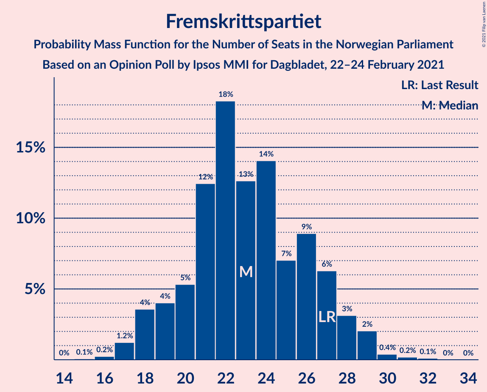

| Number of Seats | Probability | Accumulated | Special Marks |
|:---------------:|:-----------:|:-----------:|:-------------:|
| 15 | 0.1% | 100% |  |
| 16 | 0.2% | 99.9% |  |
| 17 | 1.2% | 99.7% |  |
| 18 | 4% | 98% |  |
| 19 | 4% | 95% |  |
| 20 | 5% | 91% |  |
| 21 | 12% | 86% |  |
| 22 | 18% | 73% |  |
| 23 | 13% | 55% | Median |
| 24 | 14% | 42% |  |
| 25 | 7% | 28% |  |
| 26 | 9% | 21% |  |
| 27 | 6% | 12% | Last Result |
| 28 | 3% | 6% |  |
| 29 | 2% | 3% |  |
| 30 | 0.4% | 0.7% |  |
| 31 | 0.2% | 0.3% |  |
| 32 | 0.1% | 0.1% |  |
| 33 | 0% | 0% |  |

### Sosialistisk Venstreparti

*For a full overview of the results for this party, see the [Sosialistisk Venstreparti](party-sosialistiskvenstreparti.html) page.*

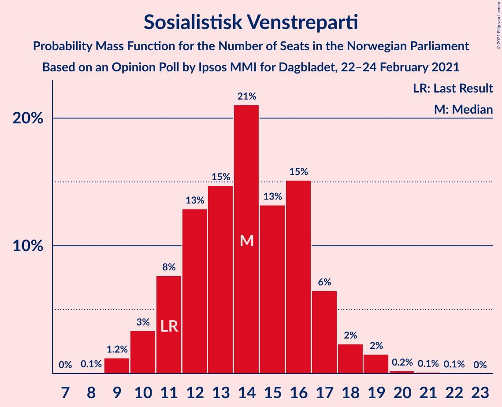

| Number of Seats | Probability | Accumulated | Special Marks |
|:---------------:|:-----------:|:-----------:|:-------------:|
| 8 | 0.1% | 100% |  |
| 9 | 1.2% | 99.9% |  |
| 10 | 3% | 98.7% |  |
| 11 | 8% | 95% | Last Result |
| 12 | 13% | 88% |  |
| 13 | 15% | 75% |  |
| 14 | 21% | 60% | Median |
| 15 | 13% | 39% |  |
| 16 | 15% | 26% |  |
| 17 | 6% | 11% |  |
| 18 | 2% | 4% |  |
| 19 | 2% | 2% |  |
| 20 | 0.2% | 0.4% |  |
| 21 | 0.1% | 0.2% |  |
| 22 | 0.1% | 0.1% |  |
| 23 | 0% | 0% |  |

### Venstre

*For a full overview of the results for this party, see the [Venstre](party-venstre.html) page.*

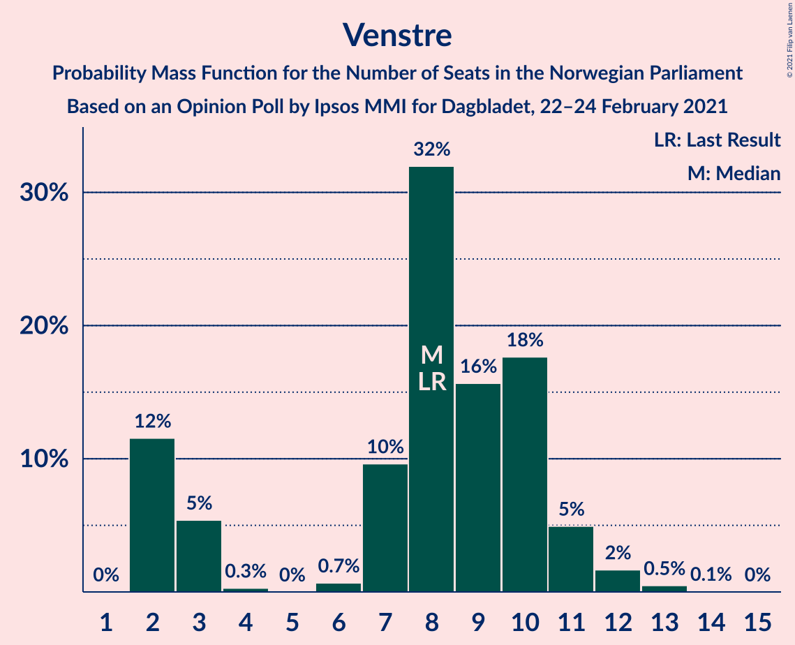

| Number of Seats | Probability | Accumulated | Special Marks |
|:---------------:|:-----------:|:-----------:|:-------------:|
| 2 | 12% | 100% |  |
| 3 | 5% | 88% |  |
| 4 | 0.3% | 83% |  |
| 5 | 0% | 83% |  |
| 6 | 0.7% | 83% |  |
| 7 | 10% | 82% |  |
| 8 | 32% | 72% | Last Result, Median |
| 9 | 16% | 40% |  |
| 10 | 18% | 25% |  |
| 11 | 5% | 7% |  |
| 12 | 2% | 2% |  |
| 13 | 0.5% | 0.5% |  |
| 14 | 0.1% | 0.1% |  |
| 15 | 0% | 0% |  |

### Miljøpartiet De Grønne

*For a full overview of the results for this party, see the [Miljøpartiet De Grønne](party-miljøpartietdegrønne.html) page.*

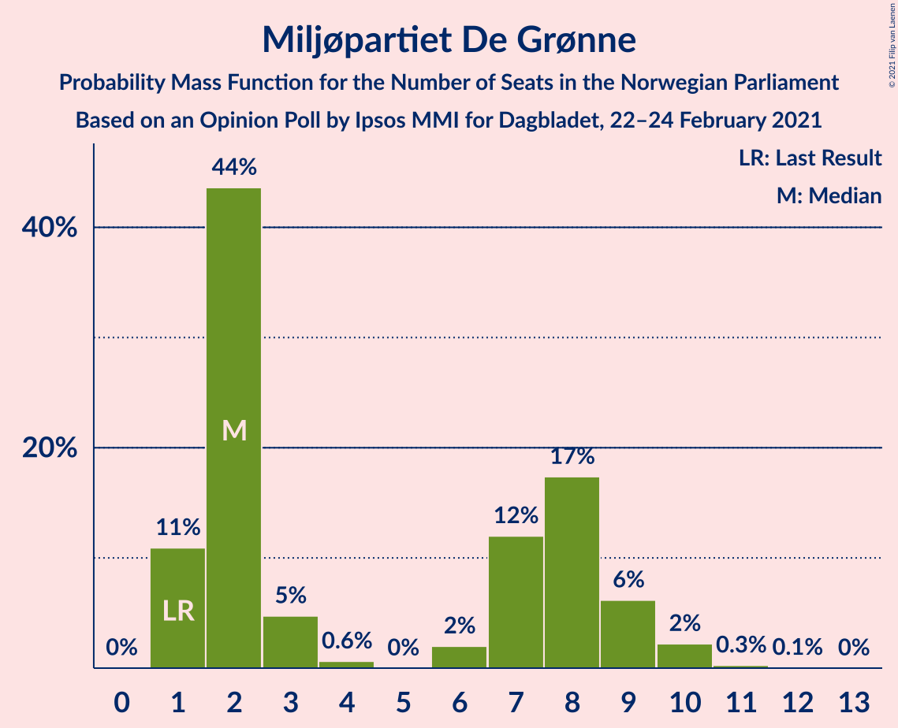

| Number of Seats | Probability | Accumulated | Special Marks |
|:---------------:|:-----------:|:-----------:|:-------------:|
| 1 | 11% | 100% | Last Result |
| 2 | 44% | 89% | Median |
| 3 | 5% | 45% |  |
| 4 | 0.6% | 41% |  |
| 5 | 0% | 40% |  |
| 6 | 2% | 40% |  |
| 7 | 12% | 38% |  |
| 8 | 17% | 26% |  |
| 9 | 6% | 9% |  |
| 10 | 2% | 3% |  |
| 11 | 0.3% | 0.3% |  |
| 12 | 0.1% | 0.1% |  |
| 13 | 0% | 0% |  |

### Kristelig Folkeparti

*For a full overview of the results for this party, see the [Kristelig Folkeparti](party-kristeligfolkeparti.html) page.*

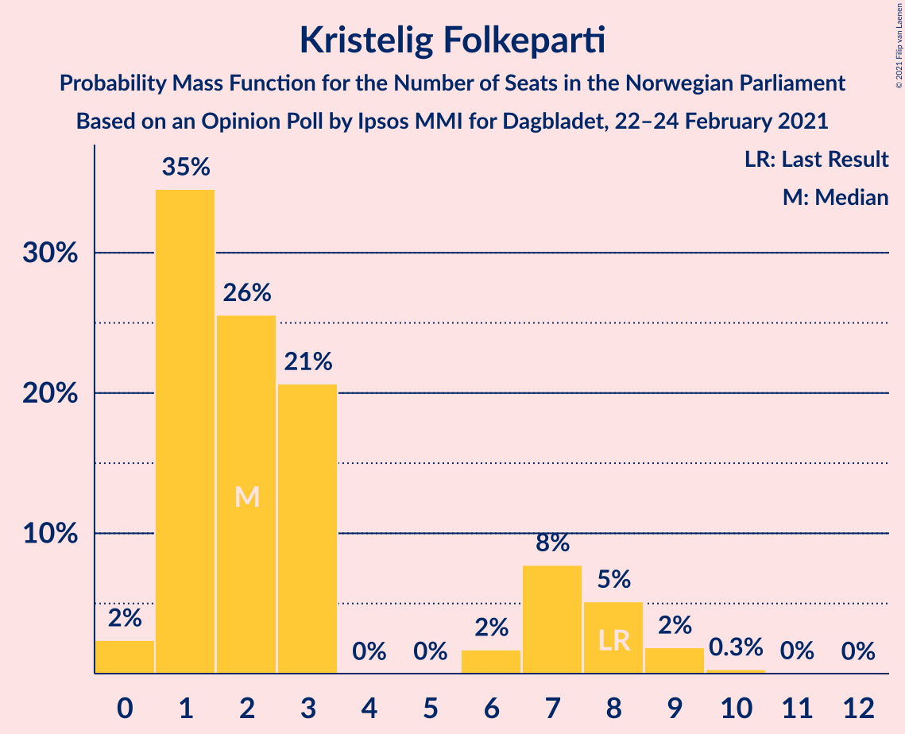

| Number of Seats | Probability | Accumulated | Special Marks |
|:---------------:|:-----------:|:-----------:|:-------------:|
| 0 | 2% | 100% |  |
| 1 | 35% | 98% |  |
| 2 | 26% | 63% | Median |
| 3 | 21% | 37% |  |
| 4 | 0% | 17% |  |
| 5 | 0% | 17% |  |
| 6 | 2% | 17% |  |
| 7 | 8% | 15% |  |
| 8 | 5% | 7% | Last Result |
| 9 | 2% | 2% |  |
| 10 | 0.3% | 0.4% |  |
| 11 | 0% | 0.1% |  |
| 12 | 0% | 0% |  |

### Rødt

*For a full overview of the results for this party, see the [Rødt](party-rødt.html) page.*

| Number of Seats | Probability | Accumulated | Special Marks |
|:---------------:|:-----------:|:-----------:|:-------------:|
| 0 | 0.1% | 100% |  |
| 1 | 55% | 99.9% | Last Result, Median |
| 2 | 41% | 45% |  |
| 3 | 0% | 4% |  |
| 4 | 0% | 4% |  |
| 5 | 0% | 4% |  |
| 6 | 0.4% | 4% |  |
| 7 | 2% | 3% |  |
| 8 | 0.7% | 0.9% |  |
| 9 | 0.2% | 0.3% |  |
| 10 | 0% | 0% |  |

## Coalitions

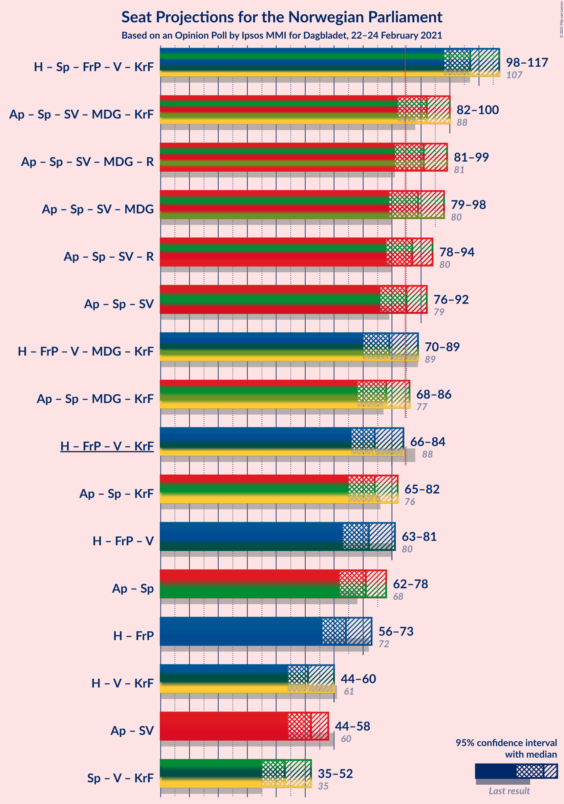

### Confidence Intervals

| Coalition | Last Result | Median | Majority? | 80% Confidence Interval | 90% Confidence Interval | 95% Confidence Interval | 99% Confidence Interval |
|:---------:|:-----------:|:------:|:---------:|:-----------------------:|:-----------------------:|:-----------------------:|:-----------------------:|
| Høyre – Senterpartiet – Fremskrittspartiet – Venstre – Kristelig Folkeparti | 107 | 107 | 100% | 101–114 | 100–116 | 98–117 | 96–119 |
| Arbeiderpartiet – Senterpartiet – Sosialistisk Venstreparti – Miljøpartiet De Grønne – Kristelig Folkeparti | 88 | 92 | 93% | 85–98 | 83–99 | 82–100 | 80–103 |
| Arbeiderpartiet – Senterpartiet – Sosialistisk Venstreparti – Miljøpartiet De Grønne – Rødt | 81 | 91 | 89% | 84–97 | 82–98 | 81–99 | 79–101 |
| Arbeiderpartiet – Senterpartiet – Sosialistisk Venstreparti – Miljøpartiet De Grønne | 80 | 89 | 83% | 82–95 | 81–96 | 79–98 | 77–98 |
| Arbeiderpartiet – Senterpartiet – Sosialistisk Venstreparti – Rødt | 80 | 87 | 68% | 80–91 | 79–93 | 78–94 | 73–96 |
| Arbeiderpartiet – Senterpartiet – Sosialistisk Venstreparti | 79 | 85 | 53% | 79–90 | 78–91 | 76–92 | 72–94 |
| Høyre – Fremskrittspartiet – Venstre – Miljøpartiet De Grønne – Kristelig Folkeparti | 89 | 79 | 13% | 73–85 | 71–88 | 70–89 | 67–91 |
| Arbeiderpartiet – Senterpartiet – Miljøpartiet De Grønne – Kristelig Folkeparti | 77 | 78 | 5% | 71–84 | 69–84 | 68–86 | 66–88 |
| Høyre – Fremskrittspartiet – Venstre – Kristelig Folkeparti | 88 | 74 | 2% | 69–81 | 67–82 | 66–84 | 63–87 |
| Arbeiderpartiet – Senterpartiet – Kristelig Folkeparti | 76 | 74 | 0.5% | 68–79 | 66–81 | 65–82 | 61–85 |
| Høyre – Fremskrittspartiet – Venstre | 80 | 72 | 0.2% | 66–79 | 64–80 | 63–81 | 61–84 |
| Arbeiderpartiet – Senterpartiet | 68 | 71 | 0% | 65–75 | 64–77 | 62–78 | 59–79 |
| Høyre – Fremskrittspartiet | 72 | 64 | 0% | 59–70 | 58–72 | 56–73 | 54–76 |
| Høyre – Venstre – Kristelig Folkeparti | 61 | 51 | 0% | 46–57 | 44–59 | 44–60 | 41–63 |
| Arbeiderpartiet – Sosialistisk Venstreparti | 60 | 52 | 0% | 47–57 | 46–58 | 44–58 | 42–60 |
| Senterpartiet – Venstre – Kristelig Folkeparti | 35 | 43 | 0% | 38–48 | 36–50 | 35–52 | 32–54 |

### Høyre – Senterpartiet – Fremskrittspartiet – Venstre – Kristelig Folkeparti

| Number of Seats | Probability | Accumulated | Special Marks |
|:---------------:|:-----------:|:-----------:|:-------------:|
| 94 | 0.2% | 100% |  |
| 95 | 0.1% | 99.7% |  |
| 96 | 0.3% | 99.6% |  |
| 97 | 1.1% | 99.3% |  |
| 98 | 1.3% | 98% |  |
| 99 | 2% | 97% |  |
| 100 | 5% | 95% |  |
| 101 | 3% | 90% |  |
| 102 | 5% | 87% |  |
| 103 | 7% | 82% |  |
| 104 | 6% | 75% |  |
| 105 | 6% | 69% |  |
| 106 | 5% | 64% |  |
| 107 | 13% | 59% | Last Result, Median |
| 108 | 9% | 46% |  |
| 109 | 4% | 37% |  |
| 110 | 7% | 33% |  |
| 111 | 6% | 26% |  |
| 112 | 4% | 19% |  |
| 113 | 4% | 15% |  |
| 114 | 3% | 11% |  |
| 115 | 2% | 8% |  |
| 116 | 2% | 5% |  |
| 117 | 2% | 4% |  |
| 118 | 0.7% | 2% |  |
| 119 | 0.8% | 1.3% |  |
| 120 | 0.2% | 0.5% |  |
| 121 | 0.2% | 0.3% |  |
| 122 | 0.1% | 0.1% |  |
| 123 | 0% | 0% |  |

### Arbeiderpartiet – Senterpartiet – Sosialistisk Venstreparti – Miljøpartiet De Grønne – Kristelig Folkeparti

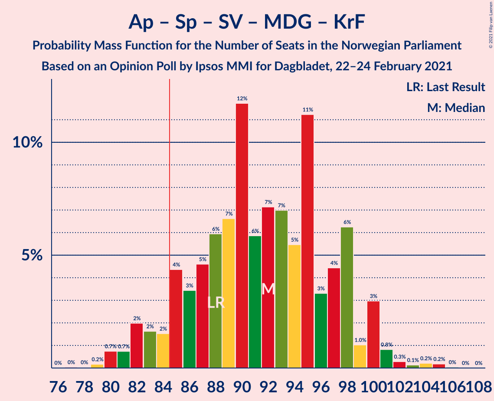

| Number of Seats | Probability | Accumulated | Special Marks |
|:---------------:|:-----------:|:-----------:|:-------------:|
| 77 | 0% | 100% |  |
| 78 | 0% | 99.9% |  |
| 79 | 0.2% | 99.9% |  |
| 80 | 0.7% | 99.7% |  |
| 81 | 0.7% | 99.0% |  |
| 82 | 2% | 98% |  |
| 83 | 2% | 96% |  |
| 84 | 2% | 95% |  |
| 85 | 4% | 93% | Majority |
| 86 | 3% | 89% |  |
| 87 | 5% | 85% |  |
| 88 | 6% | 81% | Last Result |
| 89 | 7% | 75% |  |
| 90 | 12% | 68% | Median |
| 91 | 6% | 56% |  |
| 92 | 7% | 51% |  |
| 93 | 7% | 43% |  |
| 94 | 5% | 36% |  |
| 95 | 11% | 31% |  |
| 96 | 3% | 20% |  |
| 97 | 4% | 16% |  |
| 98 | 6% | 12% |  |
| 99 | 1.0% | 6% |  |
| 100 | 3% | 5% |  |
| 101 | 0.8% | 2% |  |
| 102 | 0.3% | 0.9% |  |
| 103 | 0.1% | 0.6% |  |
| 104 | 0.2% | 0.5% |  |
| 105 | 0.2% | 0.2% |  |
| 106 | 0% | 0.1% |  |
| 107 | 0% | 0% |  |

### Arbeiderpartiet – Senterpartiet – Sosialistisk Venstreparti – Miljøpartiet De Grønne – Rødt

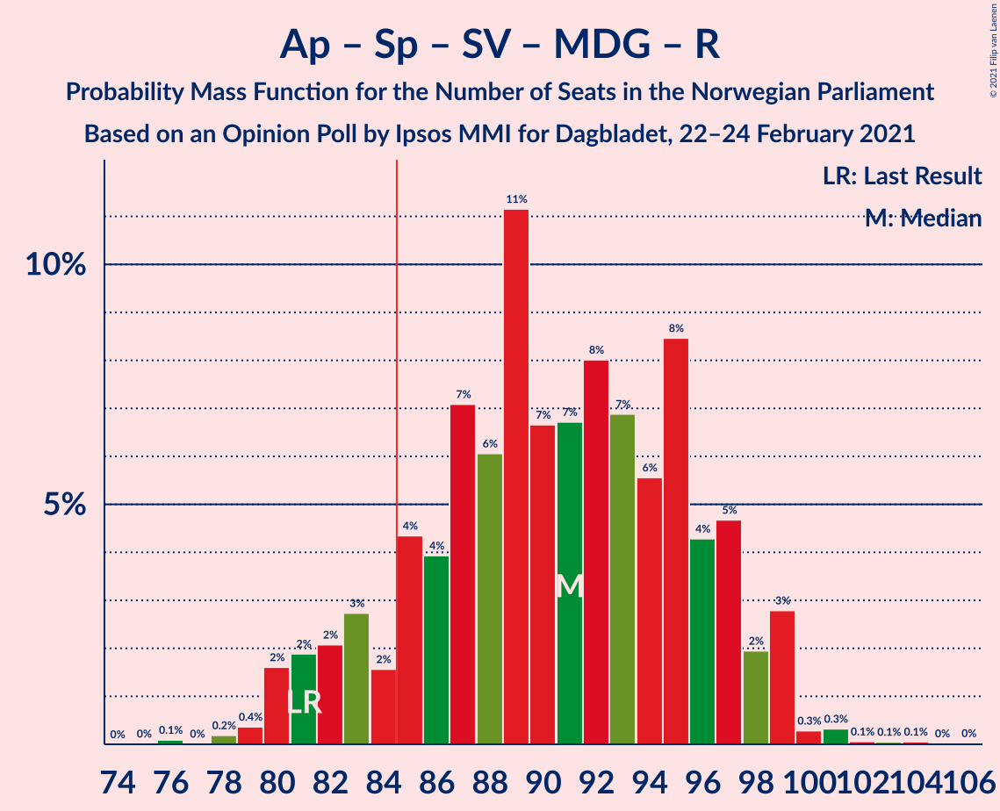

| Number of Seats | Probability | Accumulated | Special Marks |
|:---------------:|:-----------:|:-----------:|:-------------:|
| 76 | 0.1% | 100% |  |
| 77 | 0% | 99.9% |  |
| 78 | 0.2% | 99.9% |  |
| 79 | 0.4% | 99.7% |  |
| 80 | 2% | 99.3% |  |
| 81 | 2% | 98% | Last Result |
| 82 | 2% | 96% |  |
| 83 | 3% | 94% |  |
| 84 | 2% | 91% |  |
| 85 | 4% | 89% | Majority |
| 86 | 4% | 85% |  |
| 87 | 7% | 81% |  |
| 88 | 6% | 74% |  |
| 89 | 11% | 68% | Median |
| 90 | 7% | 57% |  |
| 91 | 7% | 50% |  |
| 92 | 8% | 43% |  |
| 93 | 7% | 35% |  |
| 94 | 6% | 29% |  |
| 95 | 8% | 23% |  |
| 96 | 4% | 15% |  |
| 97 | 5% | 10% |  |
| 98 | 2% | 6% |  |
| 99 | 3% | 4% |  |
| 100 | 0.3% | 0.8% |  |
| 101 | 0.3% | 0.5% |  |
| 102 | 0.1% | 0.2% |  |
| 103 | 0.1% | 0.2% |  |
| 104 | 0.1% | 0.1% |  |
| 105 | 0% | 0.1% |  |
| 106 | 0% | 0% |  |

### Arbeiderpartiet – Senterpartiet – Sosialistisk Venstreparti – Miljøpartiet De Grønne

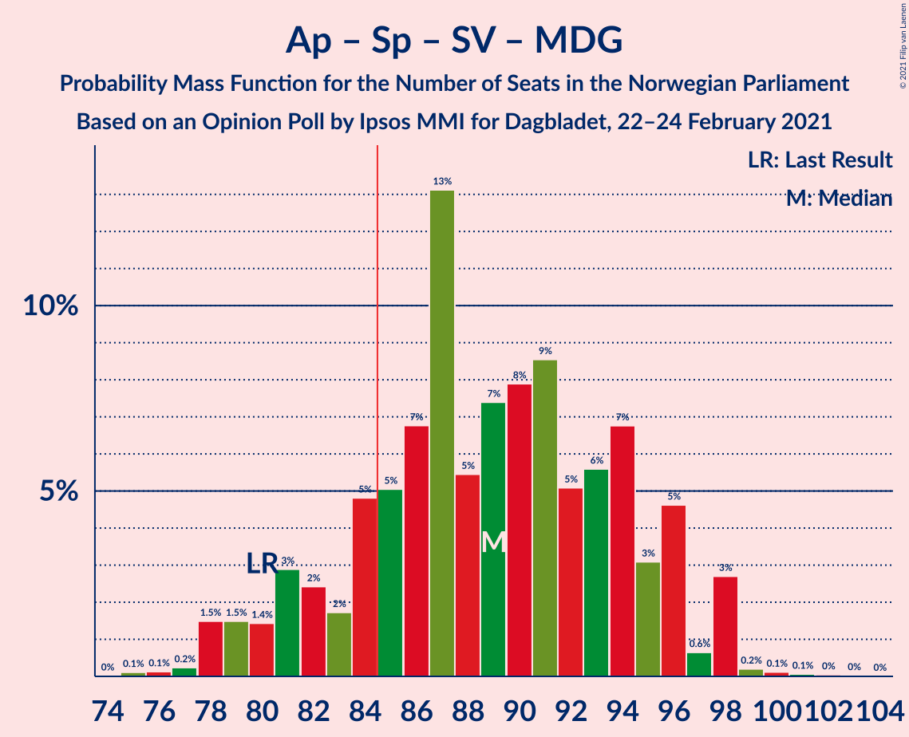

| Number of Seats | Probability | Accumulated | Special Marks |
|:---------------:|:-----------:|:-----------:|:-------------:|
| 75 | 0.1% | 100% |  |
| 76 | 0.1% | 99.8% |  |
| 77 | 0.2% | 99.7% |  |
| 78 | 1.5% | 99.5% |  |
| 79 | 1.5% | 98% |  |
| 80 | 1.4% | 96% | Last Result |
| 81 | 3% | 95% |  |
| 82 | 2% | 92% |  |
| 83 | 2% | 90% |  |
| 84 | 5% | 88% |  |
| 85 | 5% | 83% | Majority |
| 86 | 7% | 78% |  |
| 87 | 13% | 71% |  |
| 88 | 5% | 58% | Median |
| 89 | 7% | 53% |  |
| 90 | 8% | 45% |  |
| 91 | 9% | 38% |  |
| 92 | 5% | 29% |  |
| 93 | 6% | 24% |  |
| 94 | 7% | 18% |  |
| 95 | 3% | 12% |  |
| 96 | 5% | 8% |  |
| 97 | 0.6% | 4% |  |
| 98 | 3% | 3% |  |
| 99 | 0.2% | 0.5% |  |
| 100 | 0.1% | 0.3% |  |
| 101 | 0.1% | 0.2% |  |
| 102 | 0% | 0.1% |  |
| 103 | 0% | 0% |  |

### Arbeiderpartiet – Senterpartiet – Sosialistisk Venstreparti – Rødt

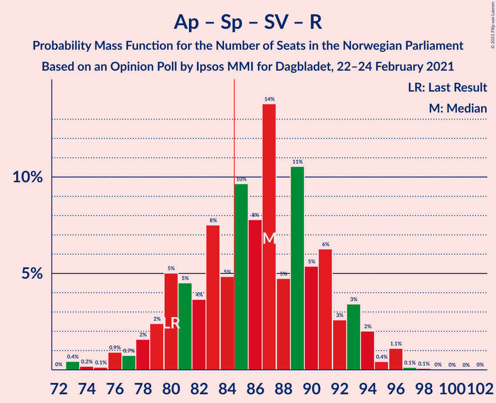

| Number of Seats | Probability | Accumulated | Special Marks |
|:---------------:|:-----------:|:-----------:|:-------------:|
| 72 | 0% | 100% |  |
| 73 | 0.4% | 99.9% |  |
| 74 | 0.2% | 99.5% |  |
| 75 | 0.1% | 99.3% |  |
| 76 | 0.9% | 99.2% |  |
| 77 | 0.7% | 98% |  |
| 78 | 2% | 98% |  |
| 79 | 2% | 96% |  |
| 80 | 5% | 94% | Last Result |
| 81 | 5% | 89% |  |
| 82 | 4% | 84% |  |
| 83 | 8% | 80% |  |
| 84 | 5% | 73% |  |
| 85 | 10% | 68% | Majority |
| 86 | 8% | 58% |  |
| 87 | 14% | 51% | Median |
| 88 | 5% | 37% |  |
| 89 | 11% | 32% |  |
| 90 | 5% | 21% |  |
| 91 | 6% | 16% |  |
| 92 | 3% | 10% |  |
| 93 | 3% | 7% |  |
| 94 | 2% | 4% |  |
| 95 | 0.4% | 2% |  |
| 96 | 1.1% | 1.4% |  |
| 97 | 0.1% | 0.3% |  |
| 98 | 0.1% | 0.2% |  |
| 99 | 0% | 0.1% |  |
| 100 | 0% | 0.1% |  |
| 101 | 0% | 0% |  |

### Arbeiderpartiet – Senterpartiet – Sosialistisk Venstreparti

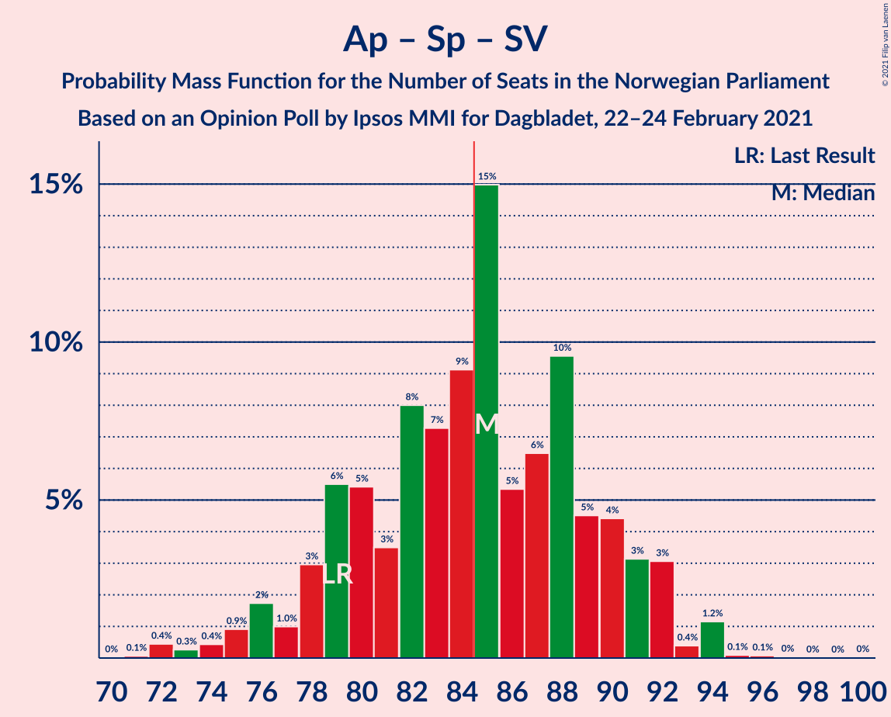

| Number of Seats | Probability | Accumulated | Special Marks |
|:---------------:|:-----------:|:-----------:|:-------------:|
| 71 | 0.1% | 100% |  |
| 72 | 0.4% | 99.9% |  |
| 73 | 0.3% | 99.4% |  |
| 74 | 0.4% | 99.2% |  |
| 75 | 0.9% | 98.7% |  |
| 76 | 2% | 98% |  |
| 77 | 1.0% | 96% |  |
| 78 | 3% | 95% |  |
| 79 | 6% | 92% | Last Result |
| 80 | 5% | 87% |  |
| 81 | 3% | 81% |  |
| 82 | 8% | 78% |  |
| 83 | 7% | 70% |  |
| 84 | 9% | 62% |  |
| 85 | 15% | 53% | Majority |
| 86 | 5% | 38% | Median |
| 87 | 6% | 33% |  |
| 88 | 10% | 27% |  |
| 89 | 5% | 17% |  |
| 90 | 4% | 12% |  |
| 91 | 3% | 8% |  |
| 92 | 3% | 5% |  |
| 93 | 0.4% | 2% |  |
| 94 | 1.2% | 1.4% |  |
| 95 | 0.1% | 0.3% |  |
| 96 | 0.1% | 0.2% |  |
| 97 | 0% | 0.1% |  |
| 98 | 0% | 0.1% |  |
| 99 | 0% | 0% |  |

### Høyre – Fremskrittspartiet – Venstre – Miljøpartiet De Grønne – Kristelig Folkeparti

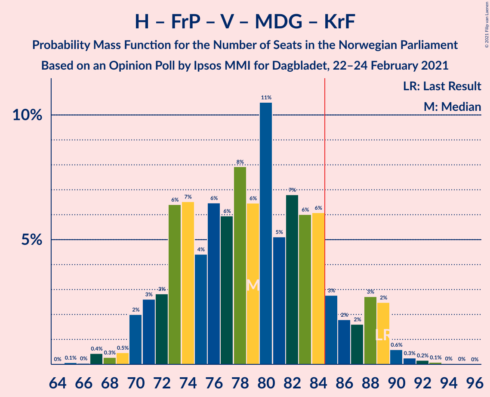

| Number of Seats | Probability | Accumulated | Special Marks |
|:---------------:|:-----------:|:-----------:|:-------------:|
| 65 | 0.1% | 100% |  |
| 66 | 0% | 99.9% |  |
| 67 | 0.4% | 99.9% |  |
| 68 | 0.3% | 99.4% |  |
| 69 | 0.5% | 99.1% |  |
| 70 | 2% | 98.7% |  |
| 71 | 3% | 97% |  |
| 72 | 3% | 94% |  |
| 73 | 6% | 91% |  |
| 74 | 7% | 85% |  |
| 75 | 4% | 78% |  |
| 76 | 6% | 74% | Median |
| 77 | 6% | 67% |  |
| 78 | 8% | 61% |  |
| 79 | 6% | 54% |  |
| 80 | 11% | 47% |  |
| 81 | 5% | 37% |  |
| 82 | 7% | 31% |  |
| 83 | 6% | 25% |  |
| 84 | 6% | 19% |  |
| 85 | 3% | 13% | Majority |
| 86 | 2% | 10% |  |
| 87 | 2% | 8% |  |
| 88 | 3% | 6% |  |
| 89 | 2% | 4% | Last Result |
| 90 | 0.6% | 1.2% |  |
| 91 | 0.3% | 0.6% |  |
| 92 | 0.2% | 0.3% |  |
| 93 | 0.1% | 0.2% |  |
| 94 | 0% | 0.1% |  |
| 95 | 0% | 0% |  |

### Arbeiderpartiet – Senterpartiet – Miljøpartiet De Grønne – Kristelig Folkeparti

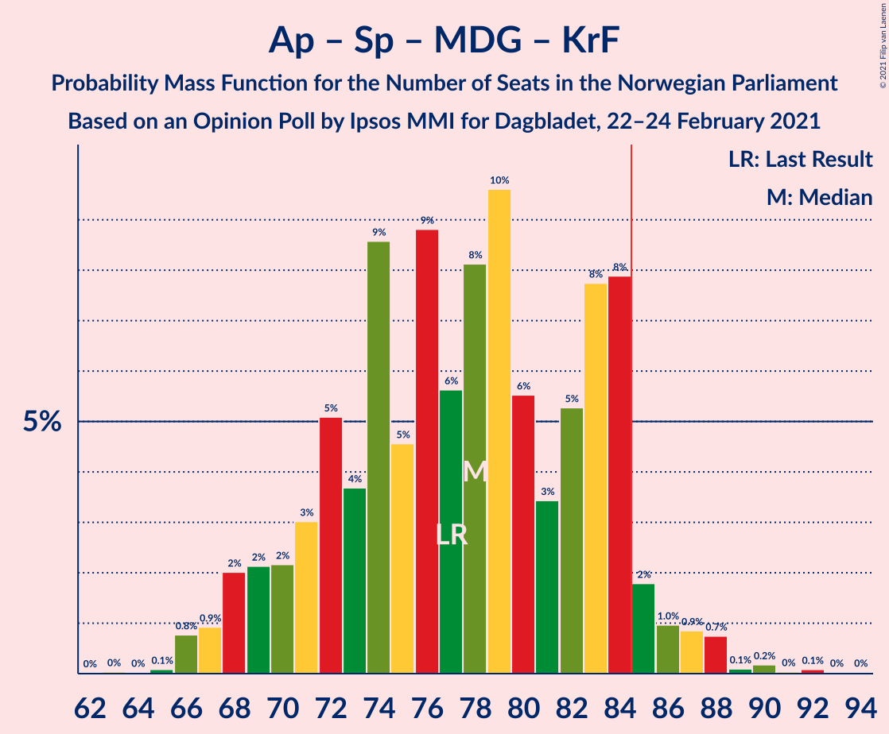

| Number of Seats | Probability | Accumulated | Special Marks |
|:---------------:|:-----------:|:-----------:|:-------------:|
| 63 | 0% | 100% |  |
| 64 | 0% | 99.9% |  |
| 65 | 0.1% | 99.9% |  |
| 66 | 0.8% | 99.8% |  |
| 67 | 0.9% | 99.1% |  |
| 68 | 2% | 98% |  |
| 69 | 2% | 96% |  |
| 70 | 2% | 94% |  |
| 71 | 3% | 92% |  |
| 72 | 5% | 89% |  |
| 73 | 4% | 84% |  |
| 74 | 9% | 80% |  |
| 75 | 5% | 71% |  |
| 76 | 9% | 67% | Median |
| 77 | 6% | 58% | Last Result |
| 78 | 8% | 52% |  |
| 79 | 10% | 44% |  |
| 80 | 6% | 35% |  |
| 81 | 3% | 29% |  |
| 82 | 5% | 26% |  |
| 83 | 8% | 20% |  |
| 84 | 8% | 13% |  |
| 85 | 2% | 5% | Majority |
| 86 | 1.0% | 3% |  |
| 87 | 0.9% | 2% |  |
| 88 | 0.7% | 1.2% |  |
| 89 | 0.1% | 0.5% |  |
| 90 | 0.2% | 0.4% |  |
| 91 | 0% | 0.2% |  |
| 92 | 0.1% | 0.1% |  |
| 93 | 0% | 0.1% |  |
| 94 | 0% | 0% |  |

### Høyre – Fremskrittspartiet – Venstre – Kristelig Folkeparti

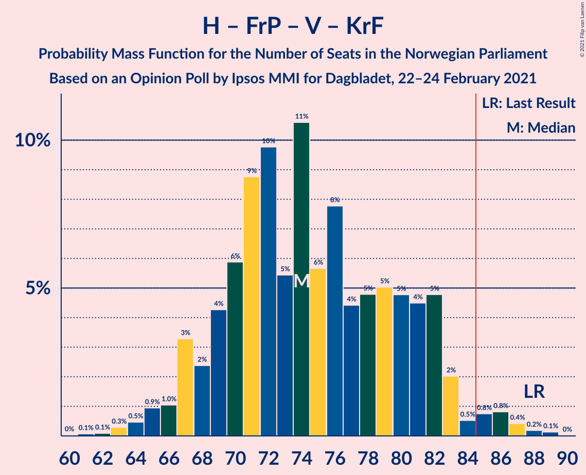

| Number of Seats | Probability | Accumulated | Special Marks |
|:---------------:|:-----------:|:-----------:|:-------------:|
| 60 | 0% | 100% |  |
| 61 | 0.1% | 99.9% |  |
| 62 | 0.1% | 99.9% |  |
| 63 | 0.3% | 99.8% |  |
| 64 | 0.5% | 99.5% |  |
| 65 | 0.9% | 99.0% |  |
| 66 | 1.0% | 98% |  |
| 67 | 3% | 97% |  |
| 68 | 2% | 94% |  |
| 69 | 4% | 91% |  |
| 70 | 6% | 87% |  |
| 71 | 9% | 81% |  |
| 72 | 10% | 72% |  |
| 73 | 5% | 63% |  |
| 74 | 11% | 57% | Median |
| 75 | 6% | 47% |  |
| 76 | 8% | 41% |  |
| 77 | 4% | 33% |  |
| 78 | 5% | 29% |  |
| 79 | 5% | 24% |  |
| 80 | 5% | 19% |  |
| 81 | 4% | 14% |  |
| 82 | 5% | 10% |  |
| 83 | 2% | 5% |  |
| 84 | 0.5% | 3% |  |
| 85 | 0.8% | 2% | Majority |
| 86 | 0.8% | 2% |  |
| 87 | 0.4% | 0.8% |  |
| 88 | 0.2% | 0.3% | Last Result |
| 89 | 0.1% | 0.2% |  |
| 90 | 0% | 0% |  |

### Arbeiderpartiet – Senterpartiet – Kristelig Folkeparti

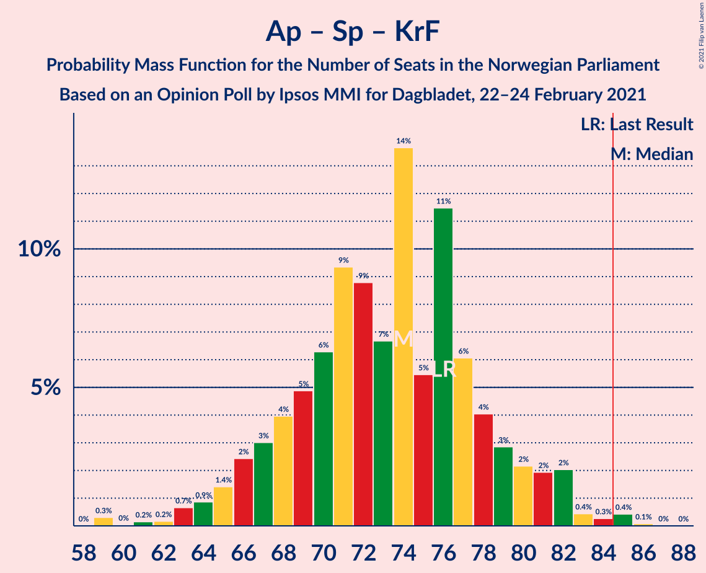

| Number of Seats | Probability | Accumulated | Special Marks |
|:---------------:|:-----------:|:-----------:|:-------------:|
| 59 | 0.3% | 100% |  |
| 60 | 0% | 99.7% |  |
| 61 | 0.2% | 99.6% |  |
| 62 | 0.2% | 99.5% |  |
| 63 | 0.7% | 99.3% |  |
| 64 | 0.9% | 98.7% |  |
| 65 | 1.4% | 98% |  |
| 66 | 2% | 96% |  |
| 67 | 3% | 94% |  |
| 68 | 4% | 91% |  |
| 69 | 5% | 87% |  |
| 70 | 6% | 82% |  |
| 71 | 9% | 76% |  |
| 72 | 9% | 66% |  |
| 73 | 7% | 58% |  |
| 74 | 14% | 51% | Median |
| 75 | 5% | 37% |  |
| 76 | 11% | 32% | Last Result |
| 77 | 6% | 20% |  |
| 78 | 4% | 14% |  |
| 79 | 3% | 10% |  |
| 80 | 2% | 7% |  |
| 81 | 2% | 5% |  |
| 82 | 2% | 3% |  |
| 83 | 0.4% | 1.3% |  |
| 84 | 0.3% | 0.8% |  |
| 85 | 0.4% | 0.5% | Majority |
| 86 | 0.1% | 0.1% |  |
| 87 | 0% | 0% |  |

### Høyre – Fremskrittspartiet – Venstre

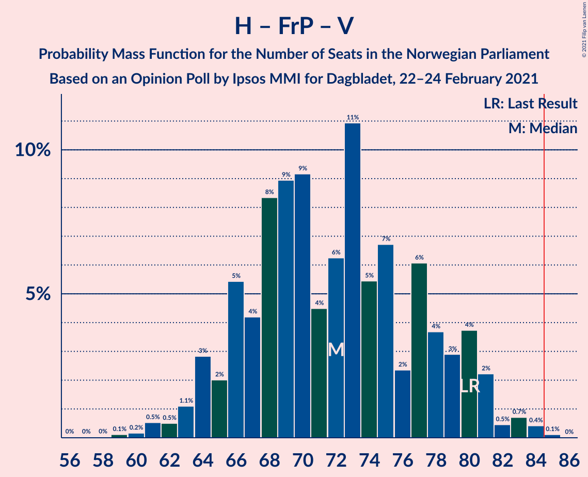

| Number of Seats | Probability | Accumulated | Special Marks |
|:---------------:|:-----------:|:-----------:|:-------------:|
| 57 | 0% | 100% |  |
| 58 | 0% | 99.9% |  |
| 59 | 0.1% | 99.9% |  |
| 60 | 0.2% | 99.8% |  |
| 61 | 0.5% | 99.6% |  |
| 62 | 0.5% | 99.1% |  |
| 63 | 1.1% | 98.6% |  |
| 64 | 3% | 97% |  |
| 65 | 2% | 95% |  |
| 66 | 5% | 93% |  |
| 67 | 4% | 87% |  |
| 68 | 8% | 83% |  |
| 69 | 9% | 75% |  |
| 70 | 9% | 66% |  |
| 71 | 4% | 57% |  |
| 72 | 6% | 52% | Median |
| 73 | 11% | 46% |  |
| 74 | 5% | 35% |  |
| 75 | 7% | 29% |  |
| 76 | 2% | 23% |  |
| 77 | 6% | 20% |  |
| 78 | 4% | 14% |  |
| 79 | 3% | 11% |  |
| 80 | 4% | 8% | Last Result |
| 81 | 2% | 4% |  |
| 82 | 0.5% | 2% |  |
| 83 | 0.7% | 1.3% |  |
| 84 | 0.4% | 0.6% |  |
| 85 | 0.1% | 0.2% | Majority |
| 86 | 0% | 0% |  |

### Arbeiderpartiet – Senterpartiet

| Number of Seats | Probability | Accumulated | Special Marks |
|:---------------:|:-----------:|:-----------:|:-------------:|
| 58 | 0.3% | 100% |  |
| 59 | 0.1% | 99.6% |  |
| 60 | 0.3% | 99.5% |  |
| 61 | 0.9% | 99.1% |  |
| 62 | 1.2% | 98% |  |
| 63 | 2% | 97% |  |
| 64 | 3% | 95% |  |
| 65 | 4% | 92% |  |
| 66 | 4% | 88% |  |
| 67 | 7% | 85% |  |
| 68 | 4% | 77% | Last Result |
| 69 | 9% | 73% |  |
| 70 | 10% | 64% |  |
| 71 | 12% | 54% |  |
| 72 | 7% | 42% | Median |
| 73 | 10% | 35% |  |
| 74 | 10% | 25% |  |
| 75 | 6% | 14% |  |
| 76 | 3% | 8% |  |
| 77 | 3% | 5% |  |
| 78 | 2% | 3% |  |
| 79 | 0.5% | 0.7% |  |
| 80 | 0.1% | 0.2% |  |
| 81 | 0.1% | 0.1% |  |
| 82 | 0% | 0.1% |  |
| 83 | 0.1% | 0.1% |  |
| 84 | 0% | 0% |  |

### Høyre – Fremskrittspartiet

| Number of Seats | Probability | Accumulated | Special Marks |
|:---------------:|:-----------:|:-----------:|:-------------:|
| 51 | 0% | 100% |  |
| 52 | 0.1% | 99.9% |  |
| 53 | 0.1% | 99.9% |  |
| 54 | 0.5% | 99.8% |  |
| 55 | 0.7% | 99.2% |  |
| 56 | 2% | 98.6% |  |
| 57 | 2% | 97% |  |
| 58 | 4% | 95% |  |
| 59 | 5% | 91% |  |
| 60 | 7% | 86% |  |
| 61 | 6% | 79% |  |
| 62 | 9% | 73% |  |
| 63 | 10% | 64% |  |
| 64 | 6% | 54% | Median |
| 65 | 8% | 48% |  |
| 66 | 7% | 39% |  |
| 67 | 11% | 32% |  |
| 68 | 5% | 21% |  |
| 69 | 4% | 16% |  |
| 70 | 4% | 13% |  |
| 71 | 2% | 8% |  |
| 72 | 2% | 6% | Last Result |
| 73 | 2% | 4% |  |
| 74 | 0.7% | 2% |  |
| 75 | 0.4% | 1.0% |  |
| 76 | 0.3% | 0.6% |  |
| 77 | 0.1% | 0.3% |  |
| 78 | 0.2% | 0.2% |  |
| 79 | 0% | 0% |  |

### Høyre – Venstre – Kristelig Folkeparti

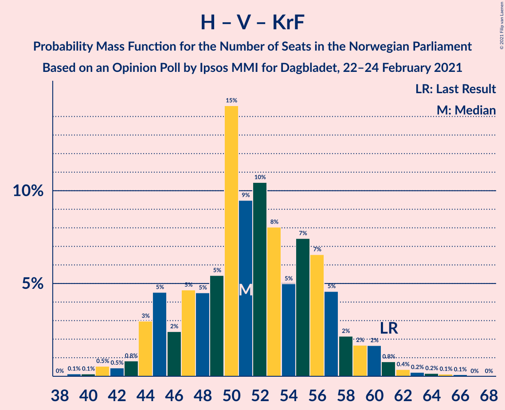

| Number of Seats | Probability | Accumulated | Special Marks |
|:---------------:|:-----------:|:-----------:|:-------------:|
| 39 | 0.1% | 100% |  |
| 40 | 0.1% | 99.8% |  |
| 41 | 0.5% | 99.7% |  |
| 42 | 0.5% | 99.2% |  |
| 43 | 0.8% | 98.7% |  |
| 44 | 3% | 98% |  |
| 45 | 5% | 95% |  |
| 46 | 2% | 90% |  |
| 47 | 5% | 88% |  |
| 48 | 5% | 83% |  |
| 49 | 5% | 79% |  |
| 50 | 15% | 73% |  |
| 51 | 9% | 59% | Median |
| 52 | 10% | 49% |  |
| 53 | 8% | 39% |  |
| 54 | 5% | 31% |  |
| 55 | 7% | 26% |  |
| 56 | 7% | 18% |  |
| 57 | 5% | 12% |  |
| 58 | 2% | 7% |  |
| 59 | 2% | 5% |  |
| 60 | 2% | 3% |  |
| 61 | 0.8% | 2% | Last Result |
| 62 | 0.4% | 1.0% |  |
| 63 | 0.2% | 0.6% |  |
| 64 | 0.2% | 0.4% |  |
| 65 | 0.1% | 0.2% |  |
| 66 | 0.1% | 0.1% |  |
| 67 | 0% | 0% |  |

### Arbeiderpartiet – Sosialistisk Venstreparti

| Number of Seats | Probability | Accumulated | Special Marks |
|:---------------:|:-----------:|:-----------:|:-------------:|
| 38 | 0% | 100% |  |
| 39 | 0% | 99.9% |  |
| 40 | 0.1% | 99.9% |  |
| 41 | 0.2% | 99.8% |  |
| 42 | 0.2% | 99.7% |  |
| 43 | 1.0% | 99.4% |  |
| 44 | 2% | 98% |  |
| 45 | 1.3% | 97% |  |
| 46 | 2% | 95% |  |
| 47 | 4% | 93% |  |
| 48 | 6% | 89% |  |
| 49 | 7% | 84% |  |
| 50 | 7% | 77% |  |
| 51 | 12% | 70% |  |
| 52 | 11% | 59% |  |
| 53 | 15% | 47% | Median |
| 54 | 9% | 33% |  |
| 55 | 9% | 24% |  |
| 56 | 4% | 15% |  |
| 57 | 5% | 11% |  |
| 58 | 3% | 6% |  |
| 59 | 1.5% | 2% |  |
| 60 | 0.3% | 0.8% | Last Result |
| 61 | 0.3% | 0.5% |  |
| 62 | 0.1% | 0.2% |  |
| 63 | 0.1% | 0.1% |  |
| 64 | 0% | 0% |  |

### Senterpartiet – Venstre – Kristelig Folkeparti

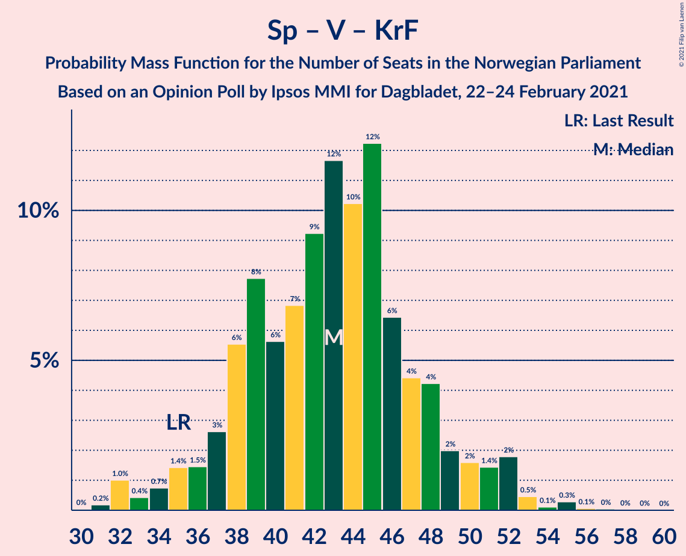

| Number of Seats | Probability | Accumulated | Special Marks |
|:---------------:|:-----------:|:-----------:|:-------------:|
| 30 | 0% | 100% |  |
| 31 | 0.2% | 99.9% |  |
| 32 | 1.0% | 99.8% |  |
| 33 | 0.4% | 98.8% |  |
| 34 | 0.7% | 98% |  |
| 35 | 1.4% | 98% | Last Result |
| 36 | 1.5% | 96% |  |
| 37 | 3% | 95% |  |
| 38 | 6% | 92% |  |
| 39 | 8% | 87% |  |
| 40 | 6% | 79% |  |
| 41 | 7% | 73% |  |
| 42 | 9% | 66% |  |
| 43 | 12% | 57% | Median |
| 44 | 10% | 45% |  |
| 45 | 12% | 35% |  |
| 46 | 6% | 23% |  |
| 47 | 4% | 16% |  |
| 48 | 4% | 12% |  |
| 49 | 2% | 8% |  |
| 50 | 2% | 6% |  |
| 51 | 1.4% | 4% |  |
| 52 | 2% | 3% |  |
| 53 | 0.5% | 1.0% |  |
| 54 | 0.1% | 0.6% |  |
| 55 | 0.3% | 0.5% |  |
| 56 | 0.1% | 0.2% |  |
| 57 | 0% | 0.1% |  |
| 58 | 0% | 0.1% |  |
| 59 | 0% | 0% |  |

## Technical Information

### Opinion Poll

+ **Polling firm:** Ipsos MMI
+ **Commissioner(s):** Dagbladet
+ **Fieldwork period:** 22–24 February 2021

### Calculations

+ **Sample size:** 755
+ **Simulations done:** 1,048,576
+ **Error estimate:** 1.91%

