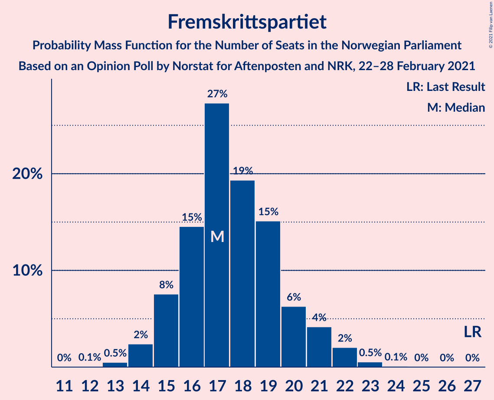
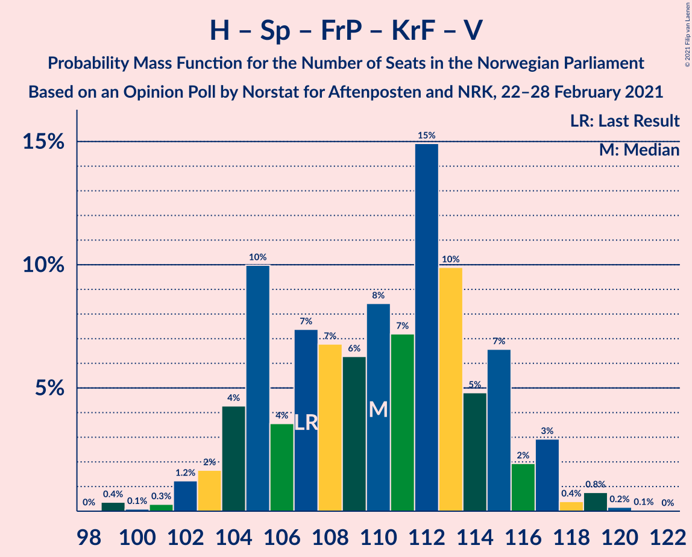
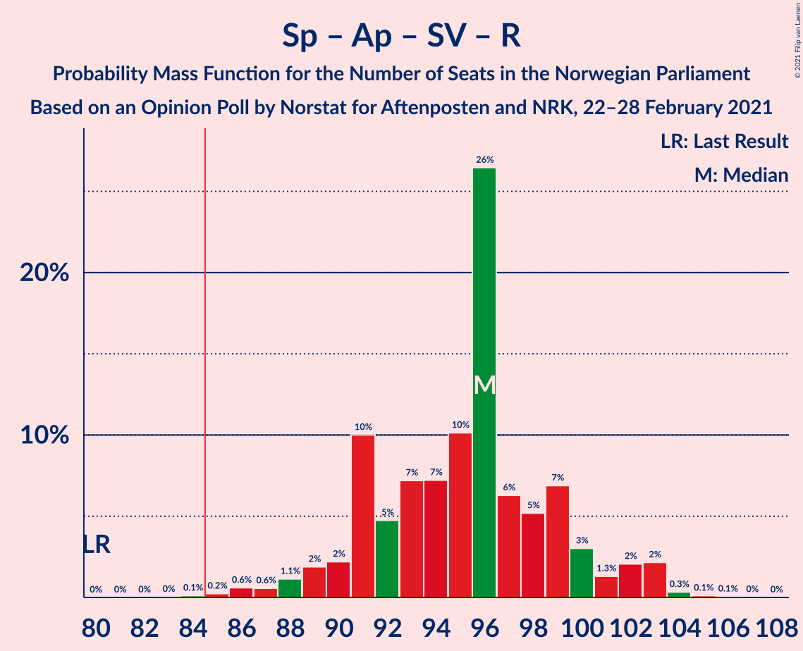
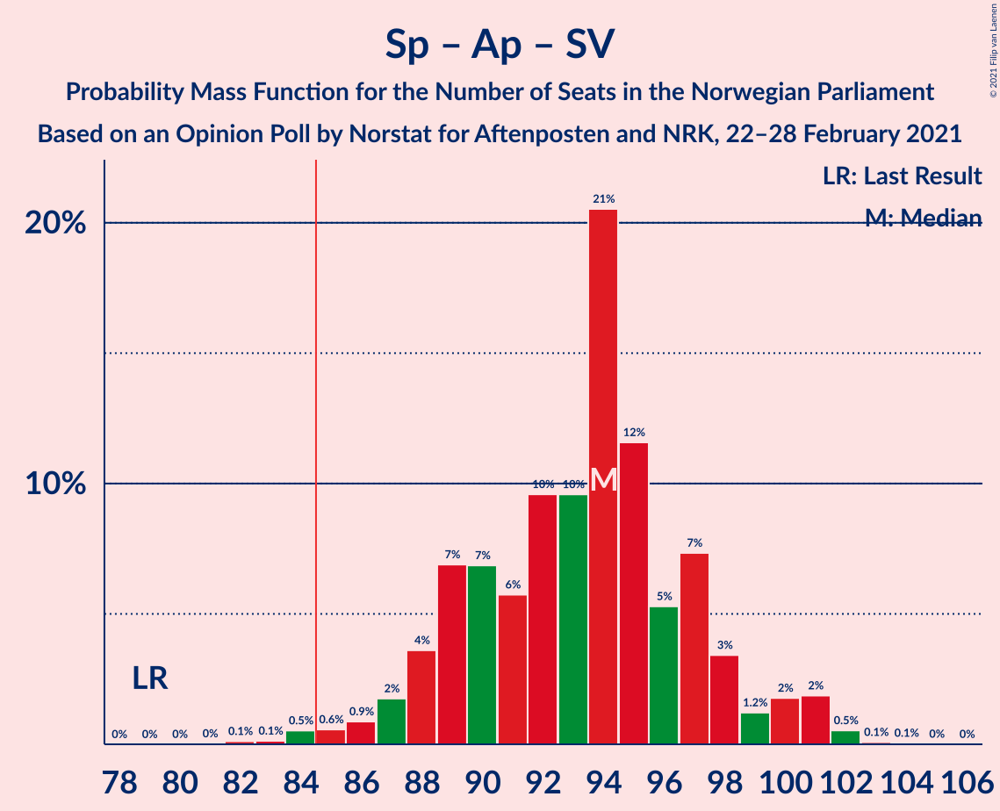

# Opinion Poll by Norstat for Aftenposten and NRK, 22–28 February 2021

<a href="#voting-intentions">Voting Intentions</a> | <a href="#seats">Seats</a> | <a href="#coalitions">Coalitions</a> | <a href="#technical-information">Technical Information</a>

## Voting Intentions

### Confidence Intervals

| Party | Last Result | Poll Result | 80% Confidence Interval | 90% Confidence Interval | 95% Confidence Interval | 99% Confidence Interval |
|:-----:|:-----------:|:-----------:|:-----------------------:|:-----------------------:|:-----------------------:|:-----------------------:|
| Høyre | 25.0% | 24.7% | 22.9–26.5% |22.5–27.0% |22.0–27.5% |21.2–28.4% |
| Senterpartiet | 10.3% | 22.3% | 20.6–24.1% |20.1–24.6% |19.7–25.0% |19.0–25.9% |
| Arbeiderpartiet | 27.4% | 21.0% | 19.4–22.8% |18.9–23.3% |18.5–23.7% |17.8–24.6% |
| Fremskrittspartiet | 15.2% | 9.7% | 8.6–11.1% |8.3–11.4% |8.0–11.8% |7.5–12.4% |
| Sosialistisk Venstreparti | 6.0% | 7.4% | 6.4–8.6% |6.2–9.0% |5.9–9.3% |5.5–9.9% |
| Miljøpartiet De Grønne | 3.2% | 3.9% | 3.2–4.8% |3.0–5.1% |2.8–5.3% |2.5–5.8% |
| Kristelig Folkeparti | 4.2% | 3.9% | 3.2–4.8% |3.0–5.1% |2.8–5.3% |2.5–5.8% |
| Rødt | 2.4% | 2.8% | 2.2–3.6% |2.1–3.9% |1.9–4.1% |1.7–4.5% |
| Venstre | 4.4% | 2.8% | 2.2–3.6% |2.1–3.9% |1.9–4.1% |1.7–4.5% |

*Note:* The poll result column reflects the actual value used in the calculations. Published results may vary slightly, and in addition be rounded to fewer digits.

## Seats

### Confidence Intervals

| Party | Last Result | Median | 80% Confidence Interval | 90% Confidence Interval | 95% Confidence Interval | 99% Confidence Interval |
|:-----:|:-----------:|:------:|:-----------------------:|:-----------------------:|:-----------------------:|:-----------------------:|
| <a href="#høyre">Høyre</a> | 45 | 44 | 41–48 |40–49 |40–50 |38–52 |
| <a href="#senterpartiet">Senterpartiet</a> | 19 | 41 | 37–44 |36–45 |36–46 |35–48 |
| <a href="#arbeiderpartiet">Arbeiderpartiet</a> | 49 | 39 | 35–42 |34–43 |33–43 |32–45 |
| <a href="#fremskrittspartiet">Fremskrittspartiet</a> | 27 | 17 | 15–20 |15–21 |14–22 |13–23 |
| <a href="#sosialistisk-venstreparti">Sosialistisk Venstreparti</a> | 11 | 14 | 11–16 |11–17 |11–17 |10–18 |
| <a href="#miljøpartiet-de-grønne">Miljøpartiet De Grønne</a> | 1 | 3 | 2–8 |2–9 |1–9 |1–10 |
| <a href="#kristelig-folkeparti">Kristelig Folkeparti</a> | 8 | 3 | 1–8 |1–9 |1–10 |1–10 |
| <a href="#rødt">Rødt</a> | 1 | 2 | 1–2 |1–2 |1–7 |1–8 |
| <a href="#venstre">Venstre</a> | 8 | 2 | 1–2 |1–3 |1–7 |1–8 |

### Høyre

*For a full overview of the results for this party, see the [Høyre](party-høyre.html) page.*

| Number of Seats | Probability | Accumulated | Special Marks |
|:---------------:|:-----------:|:-----------:|:-------------:|
| 36 | 0.1% | 100% |  |
| 37 | 0.2% | 99.9% |  |
| 38 | 0.7% | 99.7% |  |
| 39 | 1.3% | 99.1% |  |
| 40 | 4% | 98% |  |
| 41 | 7% | 94% |  |
| 42 | 10% | 87% |  |
| 43 | 10% | 77% |  |
| 44 | 20% | 66% | Median |
| 45 | 14% | 46% | Last Result |
| 46 | 10% | 32% |  |
| 47 | 10% | 22% |  |
| 48 | 4% | 12% |  |
| 49 | 4% | 8% |  |
| 50 | 2% | 3% |  |
| 51 | 0.7% | 1.3% |  |
| 52 | 0.3% | 0.6% |  |
| 53 | 0.3% | 0.4% |  |
| 54 | 0.1% | 0.1% |  |
| 55 | 0% | 0% |  |

### Senterpartiet

*For a full overview of the results for this party, see the [Senterpartiet](party-senterpartiet.html) page.*

| Number of Seats | Probability | Accumulated | Special Marks |
|:---------------:|:-----------:|:-----------:|:-------------:|
| 19 | 0% | 100% | Last Result |
| 20 | 0% | 100% |  |
| 21 | 0% | 100% |  |
| 22 | 0% | 100% |  |
| 23 | 0% | 100% |  |
| 24 | 0% | 100% |  |
| 25 | 0% | 100% |  |
| 26 | 0% | 100% |  |
| 27 | 0% | 100% |  |
| 28 | 0% | 100% |  |
| 29 | 0% | 100% |  |
| 30 | 0% | 100% |  |
| 31 | 0% | 100% |  |
| 32 | 0% | 100% |  |
| 33 | 0.1% | 100% |  |
| 34 | 0.2% | 99.8% |  |
| 35 | 0.6% | 99.6% |  |
| 36 | 5% | 99.0% |  |
| 37 | 6% | 94% |  |
| 38 | 7% | 89% |  |
| 39 | 9% | 82% |  |
| 40 | 14% | 73% |  |
| 41 | 15% | 58% | Median |
| 42 | 12% | 43% |  |
| 43 | 10% | 31% |  |
| 44 | 12% | 21% |  |
| 45 | 5% | 9% |  |
| 46 | 2% | 4% |  |
| 47 | 0.8% | 1.5% |  |
| 48 | 0.6% | 0.7% |  |
| 49 | 0.1% | 0.1% |  |
| 50 | 0% | 0.1% |  |
| 51 | 0% | 0% |  |

### Arbeiderpartiet

*For a full overview of the results for this party, see the [Arbeiderpartiet](party-arbeiderpartiet.html) page.*

| Number of Seats | Probability | Accumulated | Special Marks |
|:---------------:|:-----------:|:-----------:|:-------------:|
| 30 | 0.1% | 100% |  |
| 31 | 0.3% | 99.9% |  |
| 32 | 1.0% | 99.6% |  |
| 33 | 2% | 98.6% |  |
| 34 | 5% | 97% |  |
| 35 | 5% | 92% |  |
| 36 | 7% | 87% |  |
| 37 | 11% | 80% |  |
| 38 | 8% | 69% |  |
| 39 | 23% | 62% | Median |
| 40 | 6% | 39% |  |
| 41 | 22% | 33% |  |
| 42 | 5% | 11% |  |
| 43 | 4% | 6% |  |
| 44 | 1.1% | 2% |  |
| 45 | 0.6% | 1.0% |  |
| 46 | 0.3% | 0.4% |  |
| 47 | 0% | 0% |  |
| 48 | 0% | 0% |  |
| 49 | 0% | 0% | Last Result |

### Fremskrittspartiet

*For a full overview of the results for this party, see the [Fremskrittspartiet](party-fremskrittspartiet.html) page.*

| Number of Seats | Probability | Accumulated | Special Marks |
|:---------------:|:-----------:|:-----------:|:-------------:|
| 12 | 0.1% | 100% |  |
| 13 | 0.5% | 99.9% |  |
| 14 | 2% | 99.4% |  |
| 15 | 8% | 97% |  |
| 16 | 15% | 89% |  |
| 17 | 27% | 75% | Median |
| 18 | 19% | 48% |  |
| 19 | 15% | 28% |  |
| 20 | 6% | 13% |  |
| 21 | 4% | 7% |  |
| 22 | 2% | 3% |  |
| 23 | 0.5% | 0.7% |  |
| 24 | 0.1% | 0.1% |  |
| 25 | 0% | 0% |  |
| 26 | 0% | 0% |  |
| 27 | 0% | 0% | Last Result |

### Sosialistisk Venstreparti

*For a full overview of the results for this party, see the [Sosialistisk Venstreparti](party-sosialistiskvenstreparti.html) page.*

| Number of Seats | Probability | Accumulated | Special Marks |
|:---------------:|:-----------:|:-----------:|:-------------:|
| 9 | 0.1% | 100% |  |
| 10 | 2% | 99.8% |  |
| 11 | 11% | 98% | Last Result |
| 12 | 15% | 87% |  |
| 13 | 22% | 72% |  |
| 14 | 26% | 50% | Median |
| 15 | 11% | 24% |  |
| 16 | 7% | 13% |  |
| 17 | 5% | 5% |  |
| 18 | 0.8% | 0.9% |  |
| 19 | 0.1% | 0.1% |  |
| 20 | 0% | 0% |  |

### Miljøpartiet De Grønne

*For a full overview of the results for this party, see the [Miljøpartiet De Grønne](party-miljøpartietdegrønne.html) page.*

| Number of Seats | Probability | Accumulated | Special Marks |
|:---------------:|:-----------:|:-----------:|:-------------:|
| 1 | 3% | 100% | Last Result |
| 2 | 41% | 97% |  |
| 3 | 9% | 56% | Median |
| 4 | 2% | 47% |  |
| 5 | 0% | 45% |  |
| 6 | 0% | 45% |  |
| 7 | 11% | 45% |  |
| 8 | 27% | 35% |  |
| 9 | 6% | 7% |  |
| 10 | 1.2% | 1.4% |  |
| 11 | 0.2% | 0.3% |  |
| 12 | 0% | 0% |  |

### Kristelig Folkeparti

*For a full overview of the results for this party, see the [Kristelig Folkeparti](party-kristeligfolkeparti.html) page.*

| Number of Seats | Probability | Accumulated | Special Marks |
|:---------------:|:-----------:|:-----------:|:-------------:|
| 0 | 0.1% | 100% |  |
| 1 | 12% | 99.9% |  |
| 2 | 19% | 88% |  |
| 3 | 23% | 69% | Median |
| 4 | 0% | 46% |  |
| 5 | 0% | 46% |  |
| 6 | 0% | 46% |  |
| 7 | 17% | 46% |  |
| 8 | 21% | 29% | Last Result |
| 9 | 6% | 8% |  |
| 10 | 2% | 3% |  |
| 11 | 0.3% | 0.3% |  |
| 12 | 0% | 0% |  |

### Rødt

*For a full overview of the results for this party, see the [Rødt](party-rødt.html) page.*

| Number of Seats | Probability | Accumulated | Special Marks |
|:---------------:|:-----------:|:-----------:|:-------------:|
| 1 | 32% | 100% | Last Result |
| 2 | 64% | 68% | Median |
| 3 | 0% | 4% |  |
| 4 | 0% | 4% |  |
| 5 | 0% | 4% |  |
| 6 | 0.1% | 4% |  |
| 7 | 2% | 4% |  |
| 8 | 2% | 2% |  |
| 9 | 0.1% | 0.1% |  |
| 10 | 0% | 0% |  |

### Venstre

*For a full overview of the results for this party, see the [Venstre](party-venstre.html) page.*

| Number of Seats | Probability | Accumulated | Special Marks |
|:---------------:|:-----------:|:-----------:|:-------------:|
| 0 | 0.5% | 100% |  |
| 1 | 12% | 99.5% |  |
| 2 | 79% | 87% | Median |
| 3 | 4% | 8% |  |
| 4 | 0% | 3% |  |
| 5 | 0% | 3% |  |
| 6 | 0% | 3% |  |
| 7 | 2% | 3% |  |
| 8 | 1.4% | 2% | Last Result |
| 9 | 0.1% | 0.1% |  |
| 10 | 0% | 0% |  |

## Coalitions

### Confidence Intervals

| Coalition | Last Result | Median | Majority? | 80% Confidence Interval | 90% Confidence Interval | 95% Confidence Interval | 99% Confidence Interval |
|:---------:|:-----------:|:------:|:---------:|:-----------------------:|:-----------------------:|:-----------------------:|:-----------------------:|
| Høyre – Senterpartiet – Fremskrittspartiet – Kristelig Folkeparti – Venstre | 107 | 110 | 100% | 105–115 | 104–116 | 103–117 | 101–119 |
| Senterpartiet – Arbeiderpartiet – Sosialistisk Venstreparti – Kristelig Folkeparti – Miljøpartiet De Grønne | 88 | 103 | 100% | 98–107 | 97–108 | 96–109 | 94–111 |
| Senterpartiet – Arbeiderpartiet – Sosialistisk Venstreparti – Miljøpartiet De Grønne – Rødt | 81 | 100 | 100% | 96–104 | 94–106 | 93–106 | 91–107 |
| Senterpartiet – Arbeiderpartiet – Sosialistisk Venstreparti – Miljøpartiet De Grønne | 80 | 98 | 100% | 94–103 | 92–104 | 91–105 | 89–106 |
| Senterpartiet – Arbeiderpartiet – Sosialistisk Venstreparti – Rødt | 80 | 96 | 99.8% | 91–99 | 90–101 | 88–103 | 86–104 |
| Senterpartiet – Arbeiderpartiet – Sosialistisk Venstreparti | 79 | 94 | 99.2% | 89–97 | 88–99 | 87–101 | 84–102 |
| Senterpartiet – Arbeiderpartiet – Kristelig Folkeparti – Miljøpartiet De Grønne | 77 | 90 | 88% | 84–94 | 83–96 | 82–96 | 80–98 |
| Senterpartiet – Arbeiderpartiet – Kristelig Folkeparti | 76 | 85 | 51% | 80–89 | 78–90 | 76–91 | 75–93 |
| Senterpartiet – Arbeiderpartiet | 68 | 80 | 8% | 76–84 | 75–85 | 73–86 | 71–88 |
| Høyre – Fremskrittspartiet – Kristelig Folkeparti – Miljøpartiet De Grønne – Venstre | 89 | 73 | 0.2% | 70–78 | 68–79 | 66–81 | 65–83 |
| Høyre – Fremskrittspartiet – Kristelig Folkeparti – Venstre | 88 | 69 | 0% | 65–73 | 63–75 | 63–76 | 62–78 |
| Høyre – Fremskrittspartiet – Venstre | 80 | 64 | 0% | 60–69 | 59–70 | 58–71 | 56–74 |
| Høyre – Fremskrittspartiet | 72 | 62 | 0% | 58–66 | 57–68 | 56–69 | 54–71 |
| Arbeiderpartiet – Sosialistisk Venstreparti | 60 | 53 | 0% | 48–56 | 47–57 | 46–58 | 44–60 |
| Høyre – Kristelig Folkeparti – Venstre | 61 | 51 | 0% | 47–55 | 46–57 | 45–58 | 44–60 |
| Senterpartiet – Kristelig Folkeparti – Venstre | 35 | 48 | 0% | 43–53 | 42–54 | 41–55 | 39–57 |

### Høyre – Senterpartiet – Fremskrittspartiet – Kristelig Folkeparti – Venstre

| Number of Seats | Probability | Accumulated | Special Marks |
|:---------------:|:-----------:|:-----------:|:-------------:|
| 99 | 0.4% | 100% |  |
| 100 | 0.1% | 99.6% |  |
| 101 | 0.3% | 99.5% |  |
| 102 | 1.2% | 99.2% |  |
| 103 | 2% | 98% |  |
| 104 | 4% | 96% |  |
| 105 | 10% | 92% |  |
| 106 | 4% | 82% |  |
| 107 | 7% | 79% | Last Result, Median |
| 108 | 7% | 71% |  |
| 109 | 6% | 64% |  |
| 110 | 8% | 58% |  |
| 111 | 7% | 50% |  |
| 112 | 15% | 42% |  |
| 113 | 10% | 28% |  |
| 114 | 5% | 18% |  |
| 115 | 7% | 13% |  |
| 116 | 2% | 6% |  |
| 117 | 3% | 4% |  |
| 118 | 0.4% | 1.4% |  |
| 119 | 0.8% | 1.0% |  |
| 120 | 0.2% | 0.2% |  |
| 121 | 0.1% | 0.1% |  |
| 122 | 0% | 0% |  |

### Senterpartiet – Arbeiderpartiet – Sosialistisk Venstreparti – Kristelig Folkeparti – Miljøpartiet De Grønne

| Number of Seats | Probability | Accumulated | Special Marks |
|:---------------:|:-----------:|:-----------:|:-------------:|
| 88 | 0% | 100% | Last Result |
| 89 | 0% | 100% |  |
| 90 | 0% | 100% |  |
| 91 | 0% | 100% |  |
| 92 | 0.1% | 99.9% |  |
| 93 | 0.3% | 99.8% |  |
| 94 | 1.2% | 99.6% |  |
| 95 | 0.6% | 98% |  |
| 96 | 1.1% | 98% |  |
| 97 | 4% | 97% |  |
| 98 | 5% | 93% |  |
| 99 | 6% | 88% |  |
| 100 | 6% | 82% | Median |
| 101 | 10% | 76% |  |
| 102 | 6% | 67% |  |
| 103 | 17% | 61% |  |
| 104 | 13% | 44% |  |
| 105 | 4% | 31% |  |
| 106 | 11% | 27% |  |
| 107 | 7% | 16% |  |
| 108 | 5% | 9% |  |
| 109 | 2% | 4% |  |
| 110 | 1.2% | 2% |  |
| 111 | 0.4% | 0.7% |  |
| 112 | 0.2% | 0.3% |  |
| 113 | 0.1% | 0.1% |  |
| 114 | 0% | 0% |  |

### Senterpartiet – Arbeiderpartiet – Sosialistisk Venstreparti – Miljøpartiet De Grønne – Rødt

| Number of Seats | Probability | Accumulated | Special Marks |
|:---------------:|:-----------:|:-----------:|:-------------:|
| 81 | 0% | 100% | Last Result |
| 82 | 0% | 100% |  |
| 83 | 0% | 100% |  |
| 84 | 0% | 100% |  |
| 85 | 0% | 100% | Majority |
| 86 | 0% | 100% |  |
| 87 | 0% | 100% |  |
| 88 | 0% | 100% |  |
| 89 | 0.1% | 100% |  |
| 90 | 0.3% | 99.9% |  |
| 91 | 0.7% | 99.6% |  |
| 92 | 0.5% | 99.0% |  |
| 93 | 3% | 98% |  |
| 94 | 2% | 96% |  |
| 95 | 3% | 93% |  |
| 96 | 4% | 91% |  |
| 97 | 5% | 86% |  |
| 98 | 20% | 81% |  |
| 99 | 9% | 61% | Median |
| 100 | 8% | 52% |  |
| 101 | 10% | 44% |  |
| 102 | 6% | 34% |  |
| 103 | 7% | 28% |  |
| 104 | 12% | 21% |  |
| 105 | 4% | 9% |  |
| 106 | 4% | 5% |  |
| 107 | 1.3% | 2% |  |
| 108 | 0.2% | 0.5% |  |
| 109 | 0.2% | 0.3% |  |
| 110 | 0.1% | 0.1% |  |
| 111 | 0% | 0.1% |  |
| 112 | 0% | 0% |  |

### Senterpartiet – Arbeiderpartiet – Sosialistisk Venstreparti – Miljøpartiet De Grønne

| Number of Seats | Probability | Accumulated | Special Marks |
|:---------------:|:-----------:|:-----------:|:-------------:|
| 80 | 0% | 100% | Last Result |
| 81 | 0% | 100% |  |
| 82 | 0% | 100% |  |
| 83 | 0% | 100% |  |
| 84 | 0% | 100% |  |
| 85 | 0% | 100% | Majority |
| 86 | 0% | 100% |  |
| 87 | 0.1% | 100% |  |
| 88 | 0.1% | 99.9% |  |
| 89 | 0.6% | 99.8% |  |
| 90 | 0.6% | 99.1% |  |
| 91 | 2% | 98% |  |
| 92 | 3% | 96% |  |
| 93 | 3% | 93% |  |
| 94 | 4% | 91% |  |
| 95 | 6% | 87% |  |
| 96 | 21% | 81% |  |
| 97 | 7% | 60% | Median |
| 98 | 8% | 53% |  |
| 99 | 11% | 46% |  |
| 100 | 8% | 35% |  |
| 101 | 7% | 27% |  |
| 102 | 5% | 21% |  |
| 103 | 10% | 15% |  |
| 104 | 3% | 5% |  |
| 105 | 2% | 3% |  |
| 106 | 0.5% | 0.7% |  |
| 107 | 0.1% | 0.2% |  |
| 108 | 0% | 0.1% |  |
| 109 | 0% | 0% |  |

### Senterpartiet – Arbeiderpartiet – Sosialistisk Venstreparti – Rødt

| Number of Seats | Probability | Accumulated | Special Marks |
|:---------------:|:-----------:|:-----------:|:-------------:|
| 80 | 0% | 100% | Last Result |
| 81 | 0% | 100% |  |
| 82 | 0% | 100% |  |
| 83 | 0% | 100% |  |
| 84 | 0.1% | 99.9% |  |
| 85 | 0.2% | 99.8% | Majority |
| 86 | 0.6% | 99.6% |  |
| 87 | 0.6% | 99.0% |  |
| 88 | 1.1% | 98% |  |
| 89 | 2% | 97% |  |
| 90 | 2% | 95% |  |
| 91 | 10% | 93% |  |
| 92 | 5% | 83% |  |
| 93 | 7% | 78% |  |
| 94 | 7% | 71% |  |
| 95 | 10% | 64% |  |
| 96 | 26% | 54% | Median |
| 97 | 6% | 27% |  |
| 98 | 5% | 21% |  |
| 99 | 7% | 16% |  |
| 100 | 3% | 9% |  |
| 101 | 1.3% | 6% |  |
| 102 | 2% | 5% |  |
| 103 | 2% | 3% |  |
| 104 | 0.3% | 0.5% |  |
| 105 | 0.1% | 0.2% |  |
| 106 | 0.1% | 0.1% |  |
| 107 | 0% | 0% |  |

### Senterpartiet – Arbeiderpartiet – Sosialistisk Venstreparti

| Number of Seats | Probability | Accumulated | Special Marks |
|:---------------:|:-----------:|:-----------:|:-------------:|
| 79 | 0% | 100% | Last Result |
| 80 | 0% | 100% |  |
| 81 | 0% | 100% |  |
| 82 | 0.1% | 100% |  |
| 83 | 0.1% | 99.8% |  |
| 84 | 0.5% | 99.7% |  |
| 85 | 0.6% | 99.2% | Majority |
| 86 | 0.9% | 98.6% |  |
| 87 | 2% | 98% |  |
| 88 | 4% | 96% |  |
| 89 | 7% | 92% |  |
| 90 | 7% | 85% |  |
| 91 | 6% | 79% |  |
| 92 | 10% | 73% |  |
| 93 | 10% | 63% |  |
| 94 | 21% | 54% | Median |
| 95 | 12% | 33% |  |
| 96 | 5% | 22% |  |
| 97 | 7% | 16% |  |
| 98 | 3% | 9% |  |
| 99 | 1.2% | 6% |  |
| 100 | 2% | 4% |  |
| 101 | 2% | 3% |  |
| 102 | 0.5% | 0.7% |  |
| 103 | 0.1% | 0.2% |  |
| 104 | 0.1% | 0.1% |  |
| 105 | 0% | 0% |  |

### Senterpartiet – Arbeiderpartiet – Kristelig Folkeparti – Miljøpartiet De Grønne

| Number of Seats | Probability | Accumulated | Special Marks |
|:---------------:|:-----------:|:-----------:|:-------------:|
| 77 | 0% | 100% | Last Result |
| 78 | 0.1% | 99.9% |  |
| 79 | 0.1% | 99.8% |  |
| 80 | 0.4% | 99.7% |  |
| 81 | 1.5% | 99.3% |  |
| 82 | 2% | 98% |  |
| 83 | 2% | 95% |  |
| 84 | 6% | 94% |  |
| 85 | 7% | 88% | Majority |
| 86 | 4% | 81% | Median |
| 87 | 4% | 77% |  |
| 88 | 8% | 73% |  |
| 89 | 15% | 66% |  |
| 90 | 8% | 51% |  |
| 91 | 12% | 43% |  |
| 92 | 12% | 31% |  |
| 93 | 6% | 18% |  |
| 94 | 3% | 12% |  |
| 95 | 2% | 9% |  |
| 96 | 5% | 6% |  |
| 97 | 0.9% | 2% |  |
| 98 | 0.6% | 0.8% |  |
| 99 | 0.1% | 0.2% |  |
| 100 | 0.1% | 0.1% |  |
| 101 | 0% | 0% |  |

### Senterpartiet – Arbeiderpartiet – Kristelig Folkeparti

| Number of Seats | Probability | Accumulated | Special Marks |
|:---------------:|:-----------:|:-----------:|:-------------:|
| 73 | 0.1% | 100% |  |
| 74 | 0.2% | 99.8% |  |
| 75 | 0.7% | 99.6% |  |
| 76 | 2% | 99.0% | Last Result |
| 77 | 0.9% | 97% |  |
| 78 | 2% | 96% |  |
| 79 | 3% | 94% |  |
| 80 | 7% | 91% |  |
| 81 | 5% | 85% |  |
| 82 | 8% | 80% |  |
| 83 | 10% | 71% | Median |
| 84 | 10% | 62% |  |
| 85 | 7% | 51% | Majority |
| 86 | 7% | 45% |  |
| 87 | 12% | 37% |  |
| 88 | 5% | 25% |  |
| 89 | 14% | 19% |  |
| 90 | 3% | 6% |  |
| 91 | 0.9% | 3% |  |
| 92 | 0.9% | 2% |  |
| 93 | 0.6% | 0.7% |  |
| 94 | 0.1% | 0.2% |  |
| 95 | 0% | 0.1% |  |
| 96 | 0% | 0% |  |

### Senterpartiet – Arbeiderpartiet

| Number of Seats | Probability | Accumulated | Special Marks |
|:---------------:|:-----------:|:-----------:|:-------------:|
| 68 | 0% | 100% | Last Result |
| 69 | 0% | 99.9% |  |
| 70 | 0.3% | 99.9% |  |
| 71 | 0.3% | 99.6% |  |
| 72 | 0.8% | 99.3% |  |
| 73 | 1.5% | 98% |  |
| 74 | 2% | 97% |  |
| 75 | 3% | 95% |  |
| 76 | 4% | 92% |  |
| 77 | 9% | 88% |  |
| 78 | 10% | 79% |  |
| 79 | 8% | 69% |  |
| 80 | 18% | 61% | Median |
| 81 | 22% | 43% |  |
| 82 | 7% | 21% |  |
| 83 | 4% | 14% |  |
| 84 | 3% | 11% |  |
| 85 | 3% | 8% | Majority |
| 86 | 4% | 5% |  |
| 87 | 0.7% | 1.2% |  |
| 88 | 0.4% | 0.6% |  |
| 89 | 0.1% | 0.2% |  |
| 90 | 0.1% | 0.1% |  |
| 91 | 0% | 0% |  |

### Høyre – Fremskrittspartiet – Kristelig Folkeparti – Miljøpartiet De Grønne – Venstre

| Number of Seats | Probability | Accumulated | Special Marks |
|:---------------:|:-----------:|:-----------:|:-------------:|
| 63 | 0.1% | 100% |  |
| 64 | 0.1% | 99.9% |  |
| 65 | 0.3% | 99.8% |  |
| 66 | 2% | 99.5% |  |
| 67 | 2% | 97% |  |
| 68 | 1.3% | 95% |  |
| 69 | 3% | 94% | Median |
| 70 | 7% | 91% |  |
| 71 | 5% | 84% |  |
| 72 | 6% | 79% |  |
| 73 | 26% | 73% |  |
| 74 | 10% | 46% |  |
| 75 | 7% | 36% |  |
| 76 | 7% | 29% |  |
| 77 | 5% | 22% |  |
| 78 | 10% | 17% |  |
| 79 | 2% | 7% |  |
| 80 | 2% | 5% |  |
| 81 | 1.1% | 3% |  |
| 82 | 0.6% | 2% |  |
| 83 | 0.6% | 1.0% |  |
| 84 | 0.2% | 0.4% |  |
| 85 | 0.1% | 0.2% | Majority |
| 86 | 0% | 0.1% |  |
| 87 | 0% | 0% |  |
| 88 | 0% | 0% |  |
| 89 | 0% | 0% | Last Result |

### Høyre – Fremskrittspartiet – Kristelig Folkeparti – Venstre

| Number of Seats | Probability | Accumulated | Special Marks |
|:---------------:|:-----------:|:-----------:|:-------------:|
| 58 | 0% | 100% |  |
| 59 | 0.1% | 99.9% |  |
| 60 | 0.2% | 99.9% |  |
| 61 | 0.2% | 99.7% |  |
| 62 | 1.3% | 99.5% |  |
| 63 | 4% | 98% |  |
| 64 | 4% | 95% |  |
| 65 | 12% | 91% |  |
| 66 | 7% | 79% | Median |
| 67 | 6% | 72% |  |
| 68 | 10% | 66% |  |
| 69 | 8% | 56% |  |
| 70 | 9% | 48% |  |
| 71 | 20% | 39% |  |
| 72 | 5% | 19% |  |
| 73 | 4% | 14% |  |
| 74 | 3% | 9% |  |
| 75 | 2% | 7% |  |
| 76 | 3% | 4% |  |
| 77 | 0.5% | 2% |  |
| 78 | 0.7% | 1.0% |  |
| 79 | 0.3% | 0.4% |  |
| 80 | 0.1% | 0.1% |  |
| 81 | 0% | 0% |  |
| 82 | 0% | 0% |  |
| 83 | 0% | 0% |  |
| 84 | 0% | 0% |  |
| 85 | 0% | 0% | Majority |
| 86 | 0% | 0% |  |
| 87 | 0% | 0% |  |
| 88 | 0% | 0% | Last Result |

### Høyre – Fremskrittspartiet – Venstre

| Number of Seats | Probability | Accumulated | Special Marks |
|:---------------:|:-----------:|:-----------:|:-------------:|
| 54 | 0% | 100% |  |
| 55 | 0.2% | 99.9% |  |
| 56 | 0.5% | 99.8% |  |
| 57 | 0.9% | 99.3% |  |
| 58 | 2% | 98% |  |
| 59 | 3% | 96% |  |
| 60 | 7% | 93% |  |
| 61 | 7% | 87% |  |
| 62 | 10% | 79% |  |
| 63 | 13% | 69% | Median |
| 64 | 17% | 56% |  |
| 65 | 7% | 39% |  |
| 66 | 7% | 32% |  |
| 67 | 7% | 25% |  |
| 68 | 8% | 18% |  |
| 69 | 3% | 10% |  |
| 70 | 4% | 7% |  |
| 71 | 1.1% | 3% |  |
| 72 | 0.7% | 2% |  |
| 73 | 0.8% | 1.5% |  |
| 74 | 0.5% | 0.7% |  |
| 75 | 0.1% | 0.1% |  |
| 76 | 0% | 0.1% |  |
| 77 | 0% | 0% |  |
| 78 | 0% | 0% |  |
| 79 | 0% | 0% |  |
| 80 | 0% | 0% | Last Result |

### Høyre – Fremskrittspartiet

| Number of Seats | Probability | Accumulated | Special Marks |
|:---------------:|:-----------:|:-----------:|:-------------:|
| 52 | 0% | 100% |  |
| 53 | 0.2% | 99.9% |  |
| 54 | 0.4% | 99.8% |  |
| 55 | 1.0% | 99.3% |  |
| 56 | 2% | 98% |  |
| 57 | 4% | 97% |  |
| 58 | 6% | 93% |  |
| 59 | 8% | 86% |  |
| 60 | 11% | 79% |  |
| 61 | 13% | 68% | Median |
| 62 | 15% | 54% |  |
| 63 | 8% | 39% |  |
| 64 | 7% | 31% |  |
| 65 | 7% | 24% |  |
| 66 | 7% | 16% |  |
| 67 | 4% | 10% |  |
| 68 | 3% | 6% |  |
| 69 | 0.9% | 3% |  |
| 70 | 0.8% | 2% |  |
| 71 | 0.7% | 1.1% |  |
| 72 | 0.3% | 0.4% | Last Result |
| 73 | 0.1% | 0.1% |  |
| 74 | 0% | 0% |  |

### Arbeiderpartiet – Sosialistisk Venstreparti

| Number of Seats | Probability | Accumulated | Special Marks |
|:---------------:|:-----------:|:-----------:|:-------------:|
| 42 | 0% | 100% |  |
| 43 | 0.2% | 99.9% |  |
| 44 | 0.3% | 99.7% |  |
| 45 | 0.6% | 99.4% |  |
| 46 | 2% | 98.8% |  |
| 47 | 5% | 97% |  |
| 48 | 5% | 92% |  |
| 49 | 4% | 87% |  |
| 50 | 12% | 83% |  |
| 51 | 11% | 71% |  |
| 52 | 10% | 60% |  |
| 53 | 16% | 50% | Median |
| 54 | 6% | 34% |  |
| 55 | 13% | 28% |  |
| 56 | 8% | 14% |  |
| 57 | 3% | 7% |  |
| 58 | 2% | 3% |  |
| 59 | 0.5% | 1.2% |  |
| 60 | 0.5% | 0.7% | Last Result |
| 61 | 0.1% | 0.2% |  |
| 62 | 0.1% | 0.1% |  |
| 63 | 0% | 0% |  |

### Høyre – Kristelig Folkeparti – Venstre

| Number of Seats | Probability | Accumulated | Special Marks |
|:---------------:|:-----------:|:-----------:|:-------------:|
| 42 | 0.1% | 100% |  |
| 43 | 0.2% | 99.9% |  |
| 44 | 1.0% | 99.7% |  |
| 45 | 2% | 98.7% |  |
| 46 | 4% | 97% |  |
| 47 | 4% | 93% |  |
| 48 | 9% | 89% |  |
| 49 | 12% | 80% | Median |
| 50 | 10% | 68% |  |
| 51 | 11% | 58% |  |
| 52 | 9% | 47% |  |
| 53 | 6% | 38% |  |
| 54 | 17% | 32% |  |
| 55 | 6% | 15% |  |
| 56 | 3% | 9% |  |
| 57 | 4% | 7% |  |
| 58 | 2% | 3% |  |
| 59 | 1.0% | 2% |  |
| 60 | 0.4% | 0.7% |  |
| 61 | 0.2% | 0.3% | Last Result |
| 62 | 0.1% | 0.1% |  |
| 63 | 0.1% | 0.1% |  |
| 64 | 0% | 0% |  |

### Senterpartiet – Kristelig Folkeparti – Venstre

| Number of Seats | Probability | Accumulated | Special Marks |
|:---------------:|:-----------:|:-----------:|:-------------:|
| 35 | 0% | 100% | Last Result |
| 36 | 0% | 100% |  |
| 37 | 0.1% | 100% |  |
| 38 | 0.1% | 99.9% |  |
| 39 | 0.5% | 99.9% |  |
| 40 | 1.2% | 99.4% |  |
| 41 | 2% | 98% |  |
| 42 | 3% | 96% |  |
| 43 | 5% | 93% |  |
| 44 | 6% | 88% |  |
| 45 | 14% | 82% |  |
| 46 | 8% | 69% | Median |
| 47 | 5% | 60% |  |
| 48 | 12% | 56% |  |
| 49 | 6% | 43% |  |
| 50 | 13% | 37% |  |
| 51 | 3% | 24% |  |
| 52 | 9% | 21% |  |
| 53 | 3% | 12% |  |
| 54 | 7% | 9% |  |
| 55 | 1.0% | 3% |  |
| 56 | 1.0% | 2% |  |
| 57 | 0.3% | 0.7% |  |
| 58 | 0.2% | 0.3% |  |
| 59 | 0.1% | 0.2% |  |
| 60 | 0% | 0% |  |

## Technical Information

### Opinion Poll

+ **Polling firm:** Norstat
+ **Commissioner(s):** Aftenposten and NRK
+ **Fieldwork period:** 22–28 February 2021

### Calculations

+ **Sample size:** 957
+ **Simulations done:** 1,048,576
+ **Error estimate:** 1.28%

