# Opinion Poll by Norfakta for Klassekampen and Nationen, 2–3 March 2021

<a href="#voting-intentions">Voting Intentions</a> | <a href="#seats">Seats</a> | <a href="#coalitions">Coalitions</a> | <a href="#technical-information">Technical Information</a>

## Voting Intentions

### Confidence Intervals

| Party | Last Result | Poll Result | 80% Confidence Interval | 90% Confidence Interval | 95% Confidence Interval | 99% Confidence Interval |
|:-----:|:-----------:|:-----------:|:-----------------------:|:-----------------------:|:-----------------------:|:-----------------------:|
| Arbeiderpartiet | 27.4% | 24.3% | 22.6–26.1% |22.1–26.6% |21.7–27.1% |21.0–27.9% |
| Høyre | 25.0% | 23.9% | 22.2–25.7% |21.8–26.2% |21.4–26.6% |20.6–27.5% |
| Senterpartiet | 10.3% | 17.7% | 16.2–19.3% |15.8–19.8% |15.5–20.2% |14.8–21.0% |
| Fremskrittspartiet | 15.2% | 10.0% | 8.9–11.3% |8.6–11.7% |8.3–12.0% |7.8–12.7% |
| Sosialistisk Venstreparti | 6.0% | 7.5% | 6.5–8.7% |6.2–9.0% |6.0–9.3% |5.6–9.9% |
| Venstre | 4.4% | 3.9% | 3.2–4.8% |3.0–5.1% |2.9–5.3% |2.6–5.8% |
| Rødt | 2.4% | 3.8% | 3.1–4.7% |2.9–5.0% |2.8–5.2% |2.5–5.6% |
| Miljøpartiet De Grønne | 3.2% | 3.5% | 2.9–4.4% |2.7–4.6% |2.5–4.8% |2.2–5.3% |
| Kristelig Folkeparti | 4.2% | 2.7% | 2.1–3.5% |2.0–3.7% |1.9–3.9% |1.6–4.3% |

*Note:* The poll result column reflects the actual value used in the calculations. Published results may vary slightly, and in addition be rounded to fewer digits.

## Seats

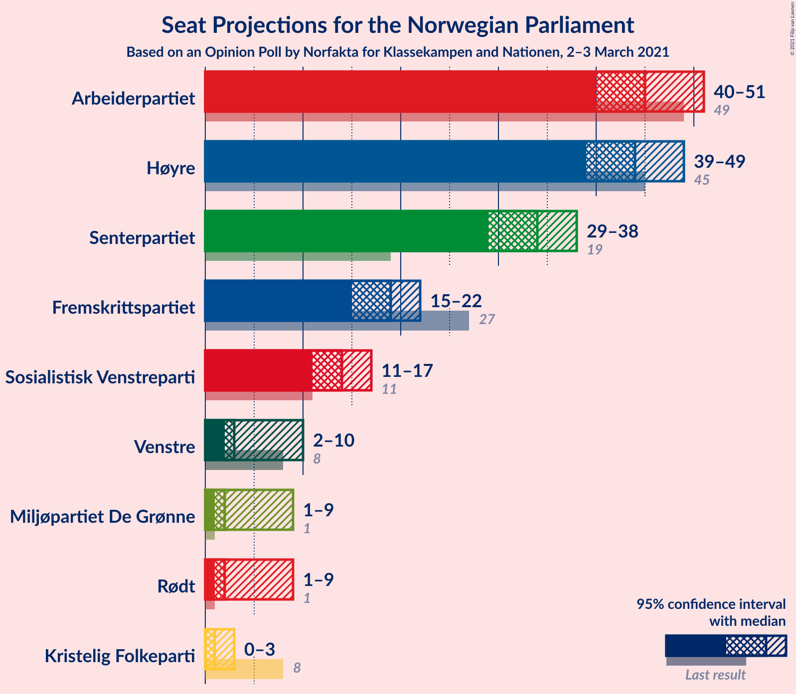

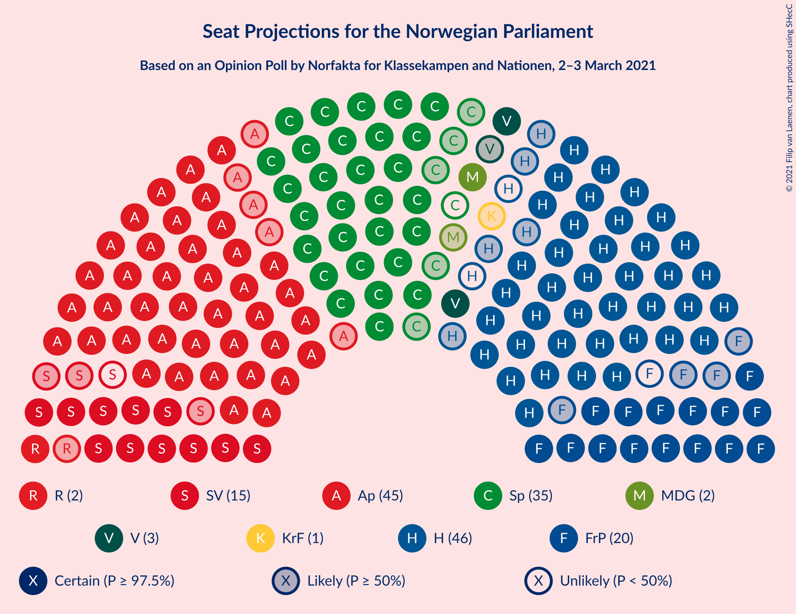

### Confidence Intervals

| Party | Last Result | Median | 80% Confidence Interval | 90% Confidence Interval | 95% Confidence Interval | 99% Confidence Interval |
|:-----:|:-----------:|:------:|:-----------------------:|:-----------------------:|:-----------------------:|:-----------------------:|
| <a href="#arbeiderpartiet">Arbeiderpartiet</a> | 49 | 45 | 42–48 |41–49 |40–51 |39–52 |
| <a href="#høyre">Høyre</a> | 45 | 44 | 40–48 |39–49 |39–49 |37–51 |
| <a href="#senterpartiet">Senterpartiet</a> | 19 | 34 | 31–36 |30–37 |29–38 |27–39 |
| <a href="#fremskrittspartiet">Fremskrittspartiet</a> | 27 | 19 | 16–21 |16–21 |15–22 |14–24 |
| <a href="#sosialistisk-venstreparti">Sosialistisk Venstreparti</a> | 11 | 14 | 12–16 |12–17 |11–17 |10–18 |
| <a href="#venstre">Venstre</a> | 8 | 3 | 2–9 |2–9 |2–10 |2–11 |
| <a href="#rødt">Rødt</a> | 1 | 2 | 2–8 |2–9 |1–9 |1–10 |
| <a href="#miljøpartiet-de-grønne">Miljøpartiet De Grønne</a> | 1 | 2 | 1–8 |1–8 |1–9 |1–10 |
| <a href="#kristelig-folkeparti">Kristelig Folkeparti</a> | 8 | 1 | 0–3 |0–3 |0–3 |0–7 |

### Arbeiderpartiet

*For a full overview of the results for this party, see the [Arbeiderpartiet](party-arbeiderpartiet.html) page.*

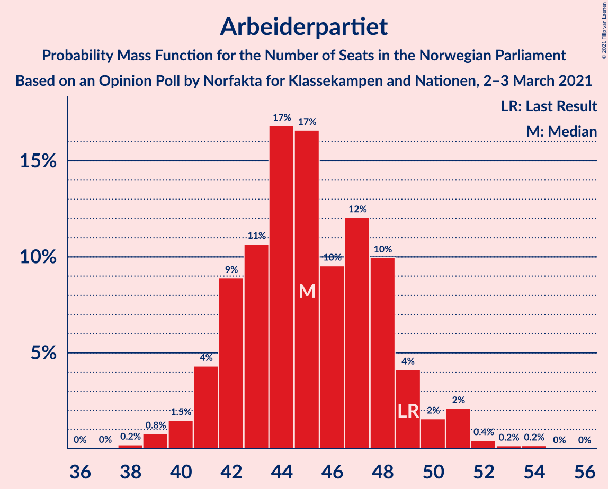

| Number of Seats | Probability | Accumulated | Special Marks |
|:---------------:|:-----------:|:-----------:|:-------------:|
| 37 | 0% | 100% |  |
| 38 | 0.2% | 99.9% |  |
| 39 | 0.8% | 99.7% |  |
| 40 | 1.5% | 98.9% |  |
| 41 | 4% | 97% |  |
| 42 | 9% | 93% |  |
| 43 | 11% | 84% |  |
| 44 | 17% | 74% |  |
| 45 | 17% | 57% | Median |
| 46 | 10% | 40% |  |
| 47 | 12% | 31% |  |
| 48 | 10% | 19% |  |
| 49 | 4% | 9% | Last Result |
| 50 | 2% | 4% |  |
| 51 | 2% | 3% |  |
| 52 | 0.4% | 0.8% |  |
| 53 | 0.2% | 0.4% |  |
| 54 | 0.2% | 0.2% |  |
| 55 | 0% | 0% |  |

### Høyre

*For a full overview of the results for this party, see the [Høyre](party-høyre.html) page.*

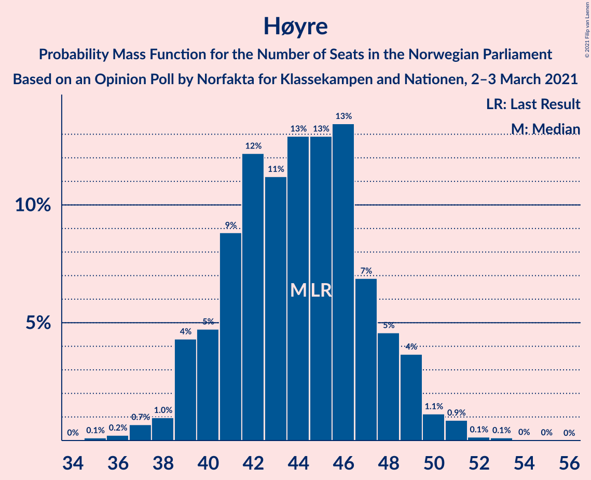

| Number of Seats | Probability | Accumulated | Special Marks |
|:---------------:|:-----------:|:-----------:|:-------------:|
| 35 | 0.1% | 100% |  |
| 36 | 0.2% | 99.9% |  |
| 37 | 0.7% | 99.6% |  |
| 38 | 1.0% | 99.0% |  |
| 39 | 4% | 98% |  |
| 40 | 5% | 94% |  |
| 41 | 9% | 89% |  |
| 42 | 12% | 80% |  |
| 43 | 11% | 68% |  |
| 44 | 13% | 57% | Median |
| 45 | 13% | 44% | Last Result |
| 46 | 13% | 31% |  |
| 47 | 7% | 17% |  |
| 48 | 5% | 11% |  |
| 49 | 4% | 6% |  |
| 50 | 1.1% | 2% |  |
| 51 | 0.9% | 1.2% |  |
| 52 | 0.1% | 0.3% |  |
| 53 | 0.1% | 0.2% |  |
| 54 | 0% | 0.1% |  |
| 55 | 0% | 0% |  |

### Senterpartiet

*For a full overview of the results for this party, see the [Senterpartiet](party-senterpartiet.html) page.*

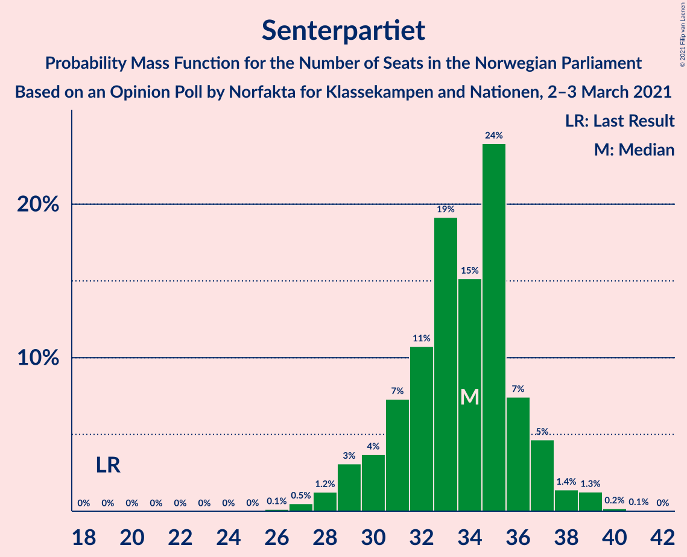

| Number of Seats | Probability | Accumulated | Special Marks |
|:---------------:|:-----------:|:-----------:|:-------------:|
| 19 | 0% | 100% | Last Result |
| 20 | 0% | 100% |  |
| 21 | 0% | 100% |  |
| 22 | 0% | 100% |  |
| 23 | 0% | 100% |  |
| 24 | 0% | 100% |  |
| 25 | 0% | 100% |  |
| 26 | 0.1% | 100% |  |
| 27 | 0.5% | 99.8% |  |
| 28 | 1.2% | 99.3% |  |
| 29 | 3% | 98% |  |
| 30 | 4% | 95% |  |
| 31 | 7% | 91% |  |
| 32 | 11% | 84% |  |
| 33 | 19% | 73% |  |
| 34 | 15% | 54% | Median |
| 35 | 24% | 39% |  |
| 36 | 7% | 15% |  |
| 37 | 5% | 8% |  |
| 38 | 1.4% | 3% |  |
| 39 | 1.3% | 2% |  |
| 40 | 0.2% | 0.3% |  |
| 41 | 0.1% | 0.1% |  |
| 42 | 0% | 0% |  |

### Fremskrittspartiet

*For a full overview of the results for this party, see the [Fremskrittspartiet](party-fremskrittspartiet.html) page.*

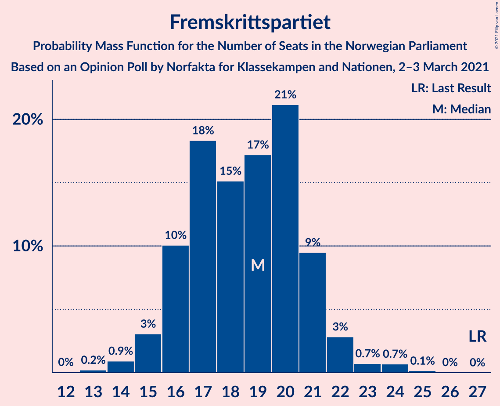

| Number of Seats | Probability | Accumulated | Special Marks |
|:---------------:|:-----------:|:-----------:|:-------------:|
| 13 | 0.2% | 100% |  |
| 14 | 0.9% | 99.8% |  |
| 15 | 3% | 98.8% |  |
| 16 | 10% | 96% |  |
| 17 | 18% | 86% |  |
| 18 | 15% | 67% |  |
| 19 | 17% | 52% | Median |
| 20 | 21% | 35% |  |
| 21 | 9% | 14% |  |
| 22 | 3% | 4% |  |
| 23 | 0.7% | 2% |  |
| 24 | 0.7% | 0.9% |  |
| 25 | 0.1% | 0.2% |  |
| 26 | 0% | 0% |  |
| 27 | 0% | 0% | Last Result |

### Sosialistisk Venstreparti

*For a full overview of the results for this party, see the [Sosialistisk Venstreparti](party-sosialistiskvenstreparti.html) page.*

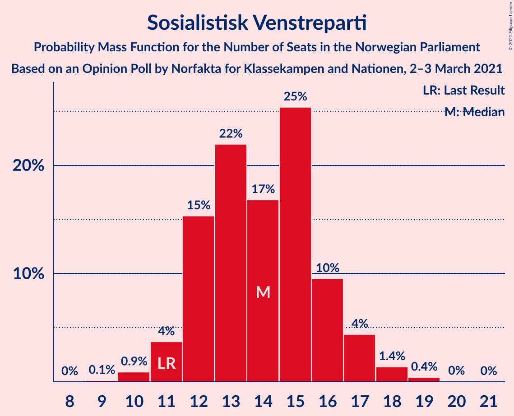

| Number of Seats | Probability | Accumulated | Special Marks |
|:---------------:|:-----------:|:-----------:|:-------------:|
| 9 | 0.1% | 100% |  |
| 10 | 0.9% | 99.9% |  |
| 11 | 4% | 99.0% | Last Result |
| 12 | 15% | 95% |  |
| 13 | 22% | 80% |  |
| 14 | 17% | 58% | Median |
| 15 | 25% | 41% |  |
| 16 | 10% | 16% |  |
| 17 | 4% | 6% |  |
| 18 | 1.4% | 2% |  |
| 19 | 0.4% | 0.5% |  |
| 20 | 0% | 0.1% |  |
| 21 | 0% | 0% |  |

### Venstre

*For a full overview of the results for this party, see the [Venstre](party-venstre.html) page.*

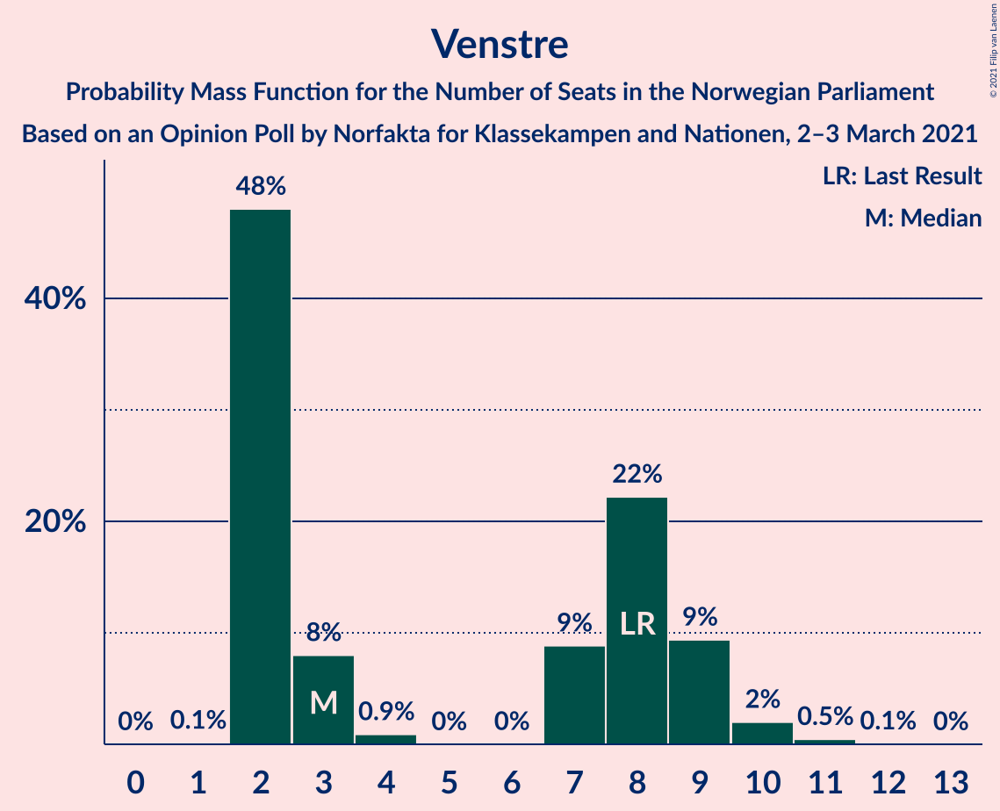

| Number of Seats | Probability | Accumulated | Special Marks |
|:---------------:|:-----------:|:-----------:|:-------------:|
| 1 | 0.1% | 100% |  |
| 2 | 48% | 99.9% |  |
| 3 | 8% | 52% | Median |
| 4 | 0.9% | 44% |  |
| 5 | 0% | 43% |  |
| 6 | 0% | 43% |  |
| 7 | 9% | 43% |  |
| 8 | 22% | 34% | Last Result |
| 9 | 9% | 12% |  |
| 10 | 2% | 3% |  |
| 11 | 0.5% | 0.5% |  |
| 12 | 0.1% | 0.1% |  |
| 13 | 0% | 0% |  |

### Rødt

*For a full overview of the results for this party, see the [Rødt](party-rødt.html) page.*

| Number of Seats | Probability | Accumulated | Special Marks |
|:---------------:|:-----------:|:-----------:|:-------------:|
| 1 | 3% | 100% | Last Result |
| 2 | 58% | 97% | Median |
| 3 | 0% | 39% |  |
| 4 | 0% | 39% |  |
| 5 | 0% | 39% |  |
| 6 | 0% | 39% |  |
| 7 | 9% | 39% |  |
| 8 | 21% | 30% |  |
| 9 | 8% | 9% |  |
| 10 | 2% | 2% |  |
| 11 | 0.2% | 0.2% |  |
| 12 | 0% | 0% |  |

### Miljøpartiet De Grønne

*For a full overview of the results for this party, see the [Miljøpartiet De Grønne](party-miljøpartietdegrønne.html) page.*

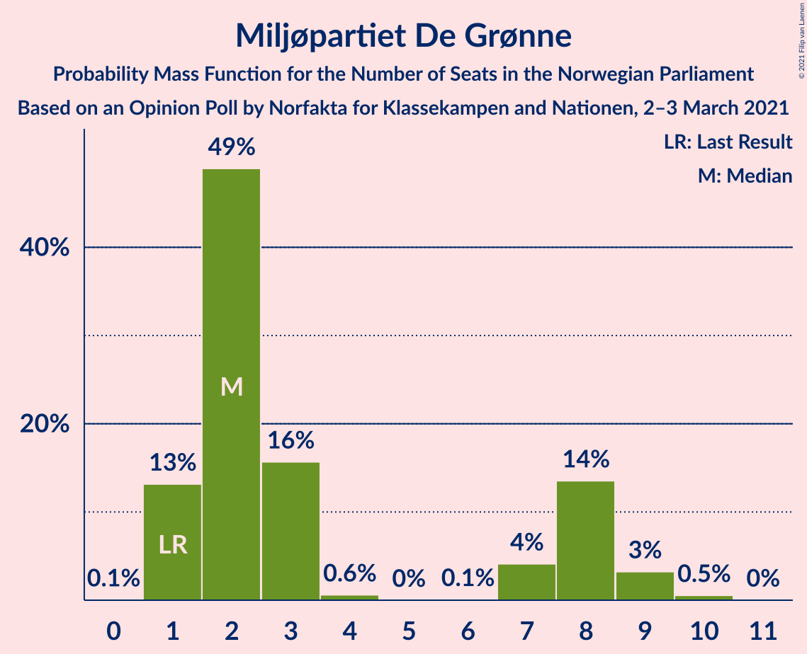

| Number of Seats | Probability | Accumulated | Special Marks |
|:---------------:|:-----------:|:-----------:|:-------------:|
| 0 | 0.1% | 100% |  |
| 1 | 13% | 99.9% | Last Result |
| 2 | 49% | 87% | Median |
| 3 | 16% | 38% |  |
| 4 | 0.6% | 22% |  |
| 5 | 0% | 22% |  |
| 6 | 0.1% | 22% |  |
| 7 | 4% | 21% |  |
| 8 | 14% | 17% |  |
| 9 | 3% | 4% |  |
| 10 | 0.5% | 0.6% |  |
| 11 | 0% | 0% |  |

### Kristelig Folkeparti

*For a full overview of the results for this party, see the [Kristelig Folkeparti](party-kristeligfolkeparti.html) page.*

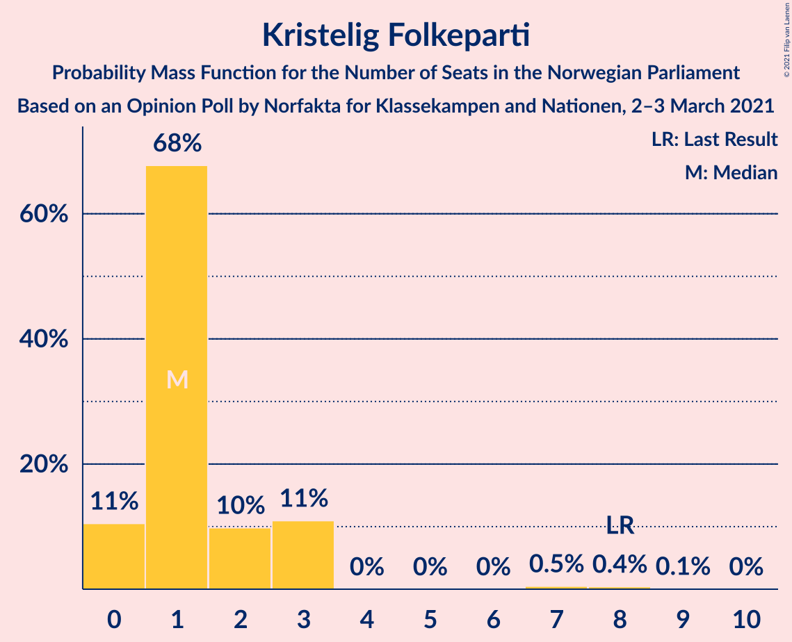

| Number of Seats | Probability | Accumulated | Special Marks |
|:---------------:|:-----------:|:-----------:|:-------------:|
| 0 | 11% | 100% |  |
| 1 | 68% | 89% | Median |
| 2 | 10% | 22% |  |
| 3 | 11% | 12% |  |
| 4 | 0% | 1.0% |  |
| 5 | 0% | 1.0% |  |
| 6 | 0% | 1.0% |  |
| 7 | 0.5% | 1.0% |  |
| 8 | 0.4% | 0.5% | Last Result |
| 9 | 0.1% | 0.1% |  |
| 10 | 0% | 0% |  |

## Coalitions

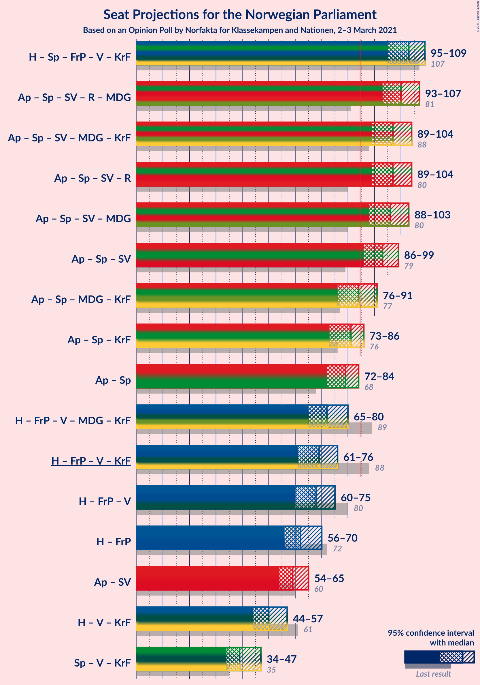

### Confidence Intervals

| Coalition | Last Result | Median | Majority? | 80% Confidence Interval | 90% Confidence Interval | 95% Confidence Interval | 99% Confidence Interval |
|:---------:|:-----------:|:------:|:---------:|:-----------------------:|:-----------------------:|:-----------------------:|:-----------------------:|
| Høyre – Senterpartiet – Fremskrittspartiet – Venstre – Kristelig Folkeparti | 107 | 103 | 100% | 97–107 | 96–108 | 95–109 | 93–112 |
| Arbeiderpartiet – Senterpartiet – Sosialistisk Venstreparti – Rødt – Miljøpartiet De Grønne | 81 | 100 | 100% | 96–106 | 94–106 | 93–107 | 90–110 |
| Arbeiderpartiet – Senterpartiet – Sosialistisk Venstreparti – Miljøpartiet De Grønne – Kristelig Folkeparti | 88 | 97 | 99.9% | 93–102 | 91–103 | 89–104 | 88–107 |
| Arbeiderpartiet – Senterpartiet – Sosialistisk Venstreparti – Rødt | 80 | 97 | 100% | 92–102 | 91–104 | 89–104 | 87–107 |
| Arbeiderpartiet – Senterpartiet – Sosialistisk Venstreparti – Miljøpartiet De Grønne | 80 | 96 | 99.9% | 91–100 | 90–101 | 88–103 | 87–105 |
| Arbeiderpartiet – Senterpartiet – Sosialistisk Venstreparti | 79 | 93 | 99.2% | 88–97 | 87–98 | 86–99 | 84–102 |
| Arbeiderpartiet – Senterpartiet – Miljøpartiet De Grønne – Kristelig Folkeparti | 77 | 84 | 33% | 79–88 | 77–90 | 76–91 | 74–92 |
| Arbeiderpartiet – Senterpartiet – Kristelig Folkeparti | 76 | 81 | 5% | 76–84 | 74–85 | 73–86 | 71–89 |
| Arbeiderpartiet – Senterpartiet | 68 | 79 | 2% | 75–82 | 73–83 | 72–84 | 70–87 |
| Høyre – Fremskrittspartiet – Venstre – Miljøpartiet De Grønne – Kristelig Folkeparti | 89 | 72 | 0% | 67–77 | 65–78 | 65–80 | 62–82 |
| Høyre – Fremskrittspartiet – Venstre – Kristelig Folkeparti | 88 | 69 | 0% | 63–73 | 63–74 | 61–76 | 59–79 |
| Høyre – Fremskrittspartiet – Venstre | 80 | 68 | 0% | 62–72 | 61–74 | 60–75 | 58–77 |
| Høyre – Fremskrittspartiet | 72 | 62 | 0% | 58–67 | 57–68 | 56–70 | 54–71 |
| Arbeiderpartiet – Sosialistisk Venstreparti | 60 | 59 | 0% | 55–63 | 54–64 | 54–65 | 52–67 |
| Høyre – Venstre – Kristelig Folkeparti | 61 | 50 | 0% | 46–55 | 44–56 | 44–57 | 42–59 |
| Senterpartiet – Venstre – Kristelig Folkeparti | 35 | 39 | 0% | 35–45 | 35–46 | 34–47 | 32–48 |

### Høyre – Senterpartiet – Fremskrittspartiet – Venstre – Kristelig Folkeparti

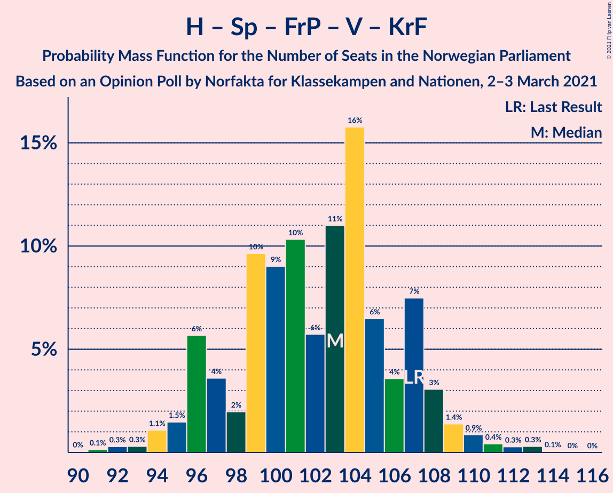

| Number of Seats | Probability | Accumulated | Special Marks |
|:---------------:|:-----------:|:-----------:|:-------------:|
| 90 | 0% | 100% |  |
| 91 | 0.1% | 99.9% |  |
| 92 | 0.3% | 99.8% |  |
| 93 | 0.3% | 99.5% |  |
| 94 | 1.1% | 99.2% |  |
| 95 | 1.5% | 98% |  |
| 96 | 6% | 97% |  |
| 97 | 4% | 91% |  |
| 98 | 2% | 87% |  |
| 99 | 10% | 85% |  |
| 100 | 9% | 76% |  |
| 101 | 10% | 67% | Median |
| 102 | 6% | 56% |  |
| 103 | 11% | 51% |  |
| 104 | 16% | 40% |  |
| 105 | 6% | 24% |  |
| 106 | 4% | 17% |  |
| 107 | 7% | 14% | Last Result |
| 108 | 3% | 6% |  |
| 109 | 1.4% | 3% |  |
| 110 | 0.9% | 2% |  |
| 111 | 0.4% | 1.1% |  |
| 112 | 0.3% | 0.6% |  |
| 113 | 0.3% | 0.4% |  |
| 114 | 0.1% | 0.1% |  |
| 115 | 0% | 0% |  |

### Arbeiderpartiet – Senterpartiet – Sosialistisk Venstreparti – Rødt – Miljøpartiet De Grønne

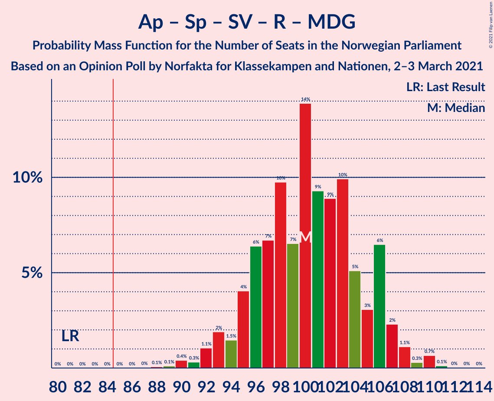

| Number of Seats | Probability | Accumulated | Special Marks |
|:---------------:|:-----------:|:-----------:|:-------------:|
| 81 | 0% | 100% | Last Result |
| 82 | 0% | 100% |  |
| 83 | 0% | 100% |  |
| 84 | 0% | 100% |  |
| 85 | 0% | 100% | Majority |
| 86 | 0% | 100% |  |
| 87 | 0% | 100% |  |
| 88 | 0.1% | 100% |  |
| 89 | 0.1% | 99.9% |  |
| 90 | 0.4% | 99.8% |  |
| 91 | 0.3% | 99.4% |  |
| 92 | 1.1% | 99.1% |  |
| 93 | 2% | 98% |  |
| 94 | 1.5% | 96% |  |
| 95 | 4% | 95% |  |
| 96 | 6% | 91% |  |
| 97 | 7% | 84% | Median |
| 98 | 10% | 77% |  |
| 99 | 7% | 68% |  |
| 100 | 14% | 61% |  |
| 101 | 9% | 47% |  |
| 102 | 9% | 38% |  |
| 103 | 10% | 29% |  |
| 104 | 5% | 19% |  |
| 105 | 3% | 14% |  |
| 106 | 6% | 11% |  |
| 107 | 2% | 5% |  |
| 108 | 1.1% | 2% |  |
| 109 | 0.3% | 1.1% |  |
| 110 | 0.7% | 0.8% |  |
| 111 | 0.1% | 0.2% |  |
| 112 | 0% | 0.1% |  |
| 113 | 0% | 0% |  |

### Arbeiderpartiet – Senterpartiet – Sosialistisk Venstreparti – Miljøpartiet De Grønne – Kristelig Folkeparti

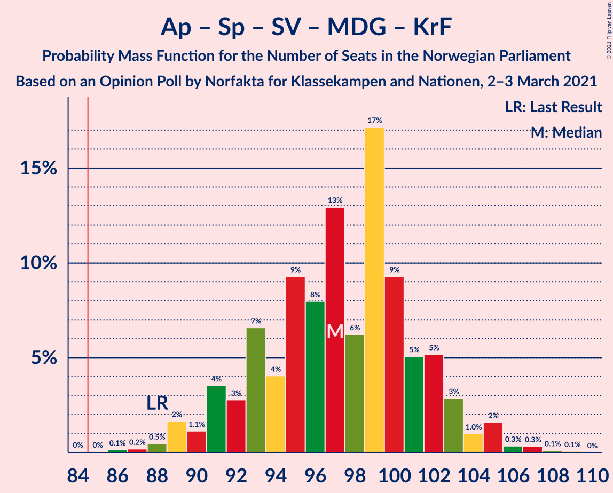

| Number of Seats | Probability | Accumulated | Special Marks |
|:---------------:|:-----------:|:-----------:|:-------------:|
| 84 | 0% | 100% |  |
| 85 | 0% | 99.9% | Majority |
| 86 | 0.1% | 99.9% |  |
| 87 | 0.2% | 99.8% |  |
| 88 | 0.5% | 99.6% | Last Result |
| 89 | 2% | 99.1% |  |
| 90 | 1.1% | 97% |  |
| 91 | 4% | 96% |  |
| 92 | 3% | 93% |  |
| 93 | 7% | 90% |  |
| 94 | 4% | 83% |  |
| 95 | 9% | 79% |  |
| 96 | 8% | 70% | Median |
| 97 | 13% | 62% |  |
| 98 | 6% | 49% |  |
| 99 | 17% | 43% |  |
| 100 | 9% | 26% |  |
| 101 | 5% | 17% |  |
| 102 | 5% | 11% |  |
| 103 | 3% | 6% |  |
| 104 | 1.0% | 3% |  |
| 105 | 2% | 2% |  |
| 106 | 0.3% | 0.9% |  |
| 107 | 0.3% | 0.5% |  |
| 108 | 0.1% | 0.2% |  |
| 109 | 0.1% | 0.1% |  |
| 110 | 0% | 0% |  |

### Arbeiderpartiet – Senterpartiet – Sosialistisk Venstreparti – Rødt

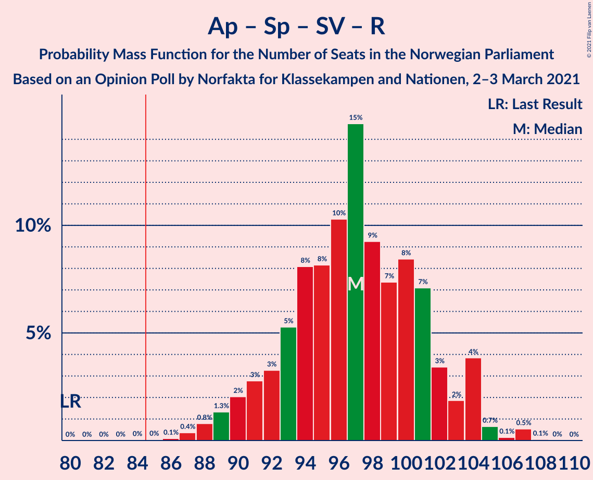

| Number of Seats | Probability | Accumulated | Special Marks |
|:---------------:|:-----------:|:-----------:|:-------------:|
| 80 | 0% | 100% | Last Result |
| 81 | 0% | 100% |  |
| 82 | 0% | 100% |  |
| 83 | 0% | 100% |  |
| 84 | 0% | 100% |  |
| 85 | 0% | 100% | Majority |
| 86 | 0.1% | 99.9% |  |
| 87 | 0.4% | 99.8% |  |
| 88 | 0.8% | 99.4% |  |
| 89 | 1.3% | 98.7% |  |
| 90 | 2% | 97% |  |
| 91 | 3% | 95% |  |
| 92 | 3% | 93% |  |
| 93 | 5% | 89% |  |
| 94 | 8% | 84% |  |
| 95 | 8% | 76% | Median |
| 96 | 10% | 68% |  |
| 97 | 15% | 57% |  |
| 98 | 9% | 43% |  |
| 99 | 7% | 33% |  |
| 100 | 8% | 26% |  |
| 101 | 7% | 18% |  |
| 102 | 3% | 11% |  |
| 103 | 2% | 7% |  |
| 104 | 4% | 5% |  |
| 105 | 0.7% | 1.4% |  |
| 106 | 0.1% | 0.8% |  |
| 107 | 0.5% | 0.6% |  |
| 108 | 0.1% | 0.1% |  |
| 109 | 0% | 0% |  |

### Arbeiderpartiet – Senterpartiet – Sosialistisk Venstreparti – Miljøpartiet De Grønne

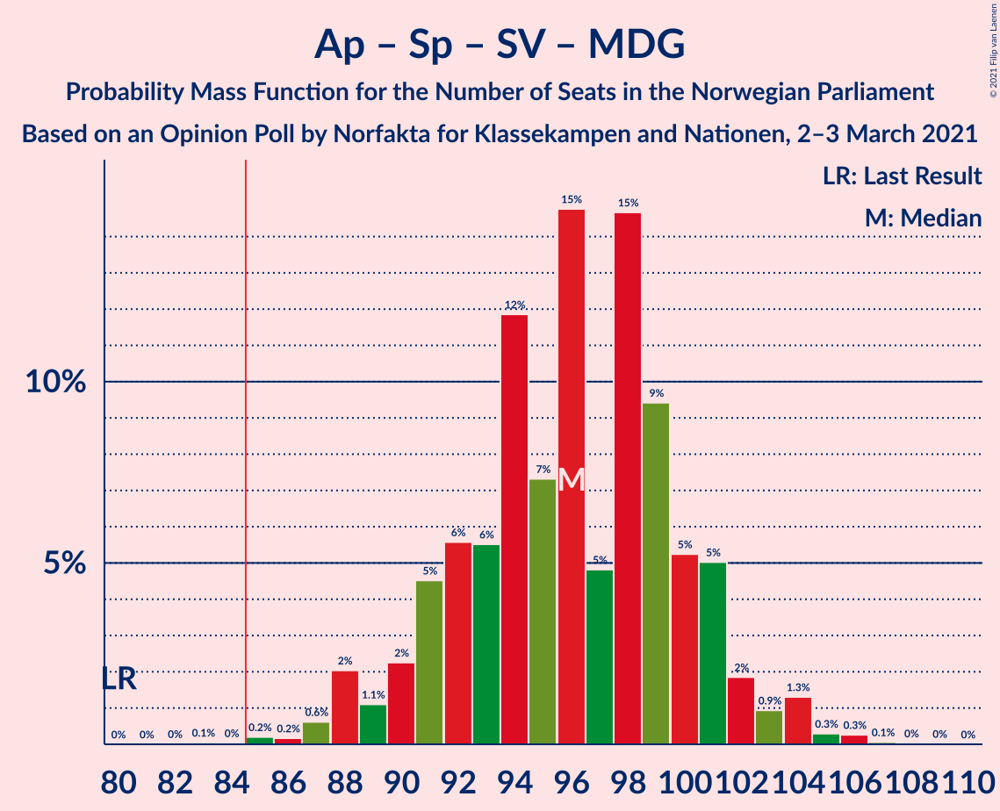

| Number of Seats | Probability | Accumulated | Special Marks |
|:---------------:|:-----------:|:-----------:|:-------------:|
| 80 | 0% | 100% | Last Result |
| 81 | 0% | 100% |  |
| 82 | 0% | 100% |  |
| 83 | 0.1% | 100% |  |
| 84 | 0% | 99.9% |  |
| 85 | 0.2% | 99.9% | Majority |
| 86 | 0.2% | 99.7% |  |
| 87 | 0.6% | 99.5% |  |
| 88 | 2% | 98.9% |  |
| 89 | 1.1% | 97% |  |
| 90 | 2% | 96% |  |
| 91 | 5% | 94% |  |
| 92 | 6% | 89% |  |
| 93 | 6% | 83% |  |
| 94 | 12% | 78% |  |
| 95 | 7% | 66% | Median |
| 96 | 15% | 59% |  |
| 97 | 5% | 44% |  |
| 98 | 15% | 39% |  |
| 99 | 9% | 24% |  |
| 100 | 5% | 15% |  |
| 101 | 5% | 10% |  |
| 102 | 2% | 5% |  |
| 103 | 0.9% | 3% |  |
| 104 | 1.3% | 2% |  |
| 105 | 0.3% | 0.7% |  |
| 106 | 0.3% | 0.4% |  |
| 107 | 0.1% | 0.1% |  |
| 108 | 0% | 0.1% |  |
| 109 | 0% | 0% |  |

### Arbeiderpartiet – Senterpartiet – Sosialistisk Venstreparti

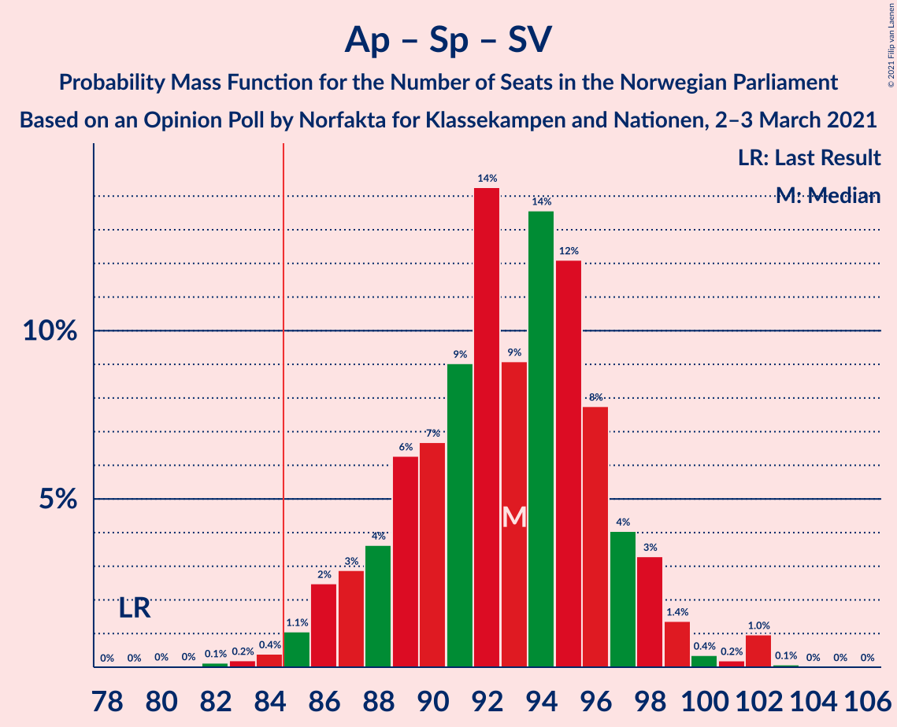

| Number of Seats | Probability | Accumulated | Special Marks |
|:---------------:|:-----------:|:-----------:|:-------------:|
| 79 | 0% | 100% | Last Result |
| 80 | 0% | 100% |  |
| 81 | 0% | 100% |  |
| 82 | 0.1% | 99.9% |  |
| 83 | 0.2% | 99.8% |  |
| 84 | 0.4% | 99.6% |  |
| 85 | 1.1% | 99.2% | Majority |
| 86 | 2% | 98% |  |
| 87 | 3% | 96% |  |
| 88 | 4% | 93% |  |
| 89 | 6% | 89% |  |
| 90 | 7% | 83% |  |
| 91 | 9% | 76% |  |
| 92 | 14% | 67% |  |
| 93 | 9% | 53% | Median |
| 94 | 14% | 44% |  |
| 95 | 12% | 30% |  |
| 96 | 8% | 18% |  |
| 97 | 4% | 10% |  |
| 98 | 3% | 6% |  |
| 99 | 1.4% | 3% |  |
| 100 | 0.4% | 2% |  |
| 101 | 0.2% | 1.3% |  |
| 102 | 1.0% | 1.1% |  |
| 103 | 0.1% | 0.1% |  |
| 104 | 0% | 0.1% |  |
| 105 | 0% | 0% |  |

### Arbeiderpartiet – Senterpartiet – Miljøpartiet De Grønne – Kristelig Folkeparti

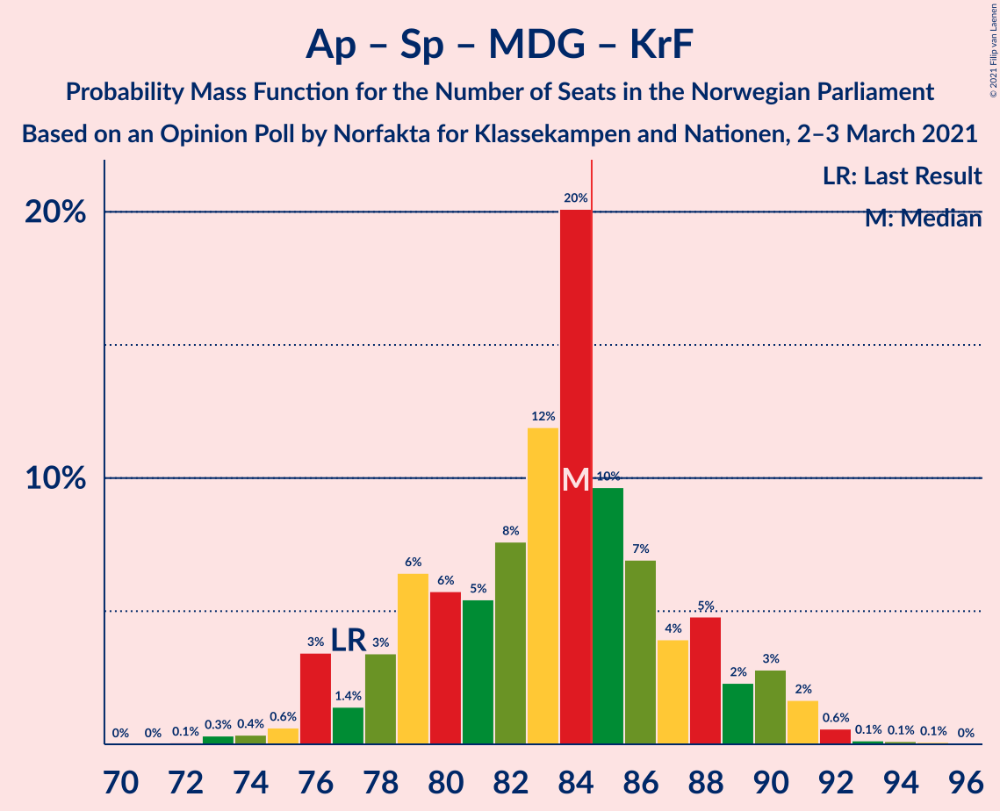

| Number of Seats | Probability | Accumulated | Special Marks |
|:---------------:|:-----------:|:-----------:|:-------------:|
| 72 | 0.1% | 100% |  |
| 73 | 0.3% | 99.9% |  |
| 74 | 0.4% | 99.6% |  |
| 75 | 0.6% | 99.2% |  |
| 76 | 3% | 98.6% |  |
| 77 | 1.4% | 95% | Last Result |
| 78 | 3% | 94% |  |
| 79 | 6% | 90% |  |
| 80 | 6% | 84% |  |
| 81 | 5% | 78% |  |
| 82 | 8% | 73% | Median |
| 83 | 12% | 65% |  |
| 84 | 20% | 53% |  |
| 85 | 10% | 33% | Majority |
| 86 | 7% | 23% |  |
| 87 | 4% | 16% |  |
| 88 | 5% | 13% |  |
| 89 | 2% | 8% |  |
| 90 | 3% | 5% |  |
| 91 | 2% | 3% |  |
| 92 | 0.6% | 1.0% |  |
| 93 | 0.1% | 0.4% |  |
| 94 | 0.1% | 0.2% |  |
| 95 | 0.1% | 0.1% |  |
| 96 | 0% | 0% |  |

### Arbeiderpartiet – Senterpartiet – Kristelig Folkeparti

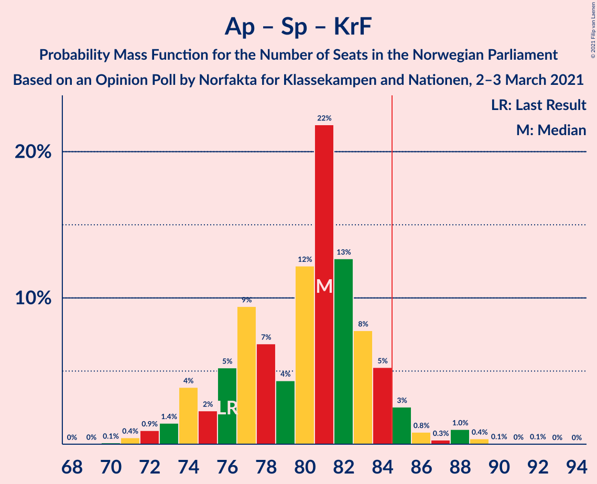

| Number of Seats | Probability | Accumulated | Special Marks |
|:---------------:|:-----------:|:-----------:|:-------------:|
| 69 | 0% | 100% |  |
| 70 | 0.1% | 99.9% |  |
| 71 | 0.4% | 99.8% |  |
| 72 | 0.9% | 99.4% |  |
| 73 | 1.4% | 98% |  |
| 74 | 4% | 97% |  |
| 75 | 2% | 93% |  |
| 76 | 5% | 91% | Last Result |
| 77 | 9% | 86% |  |
| 78 | 7% | 76% |  |
| 79 | 4% | 69% |  |
| 80 | 12% | 65% | Median |
| 81 | 22% | 53% |  |
| 82 | 13% | 31% |  |
| 83 | 8% | 18% |  |
| 84 | 5% | 10% |  |
| 85 | 3% | 5% | Majority |
| 86 | 0.8% | 3% |  |
| 87 | 0.3% | 2% |  |
| 88 | 1.0% | 2% |  |
| 89 | 0.4% | 0.5% |  |
| 90 | 0.1% | 0.2% |  |
| 91 | 0% | 0.1% |  |
| 92 | 0.1% | 0.1% |  |
| 93 | 0% | 0% |  |

### Arbeiderpartiet – Senterpartiet

| Number of Seats | Probability | Accumulated | Special Marks |
|:---------------:|:-----------:|:-----------:|:-------------:|
| 68 | 0.1% | 100% | Last Result |
| 69 | 0.1% | 99.9% |  |
| 70 | 0.3% | 99.8% |  |
| 71 | 1.2% | 99.5% |  |
| 72 | 1.3% | 98% |  |
| 73 | 4% | 97% |  |
| 74 | 2% | 93% |  |
| 75 | 5% | 90% |  |
| 76 | 9% | 85% |  |
| 77 | 8% | 76% |  |
| 78 | 11% | 68% |  |
| 79 | 11% | 57% | Median |
| 80 | 18% | 46% |  |
| 81 | 11% | 27% |  |
| 82 | 8% | 17% |  |
| 83 | 5% | 9% |  |
| 84 | 2% | 4% |  |
| 85 | 0.6% | 2% | Majority |
| 86 | 0.5% | 2% |  |
| 87 | 1.0% | 1.2% |  |
| 88 | 0.1% | 0.2% |  |
| 89 | 0.1% | 0.1% |  |
| 90 | 0% | 0% |  |

### Høyre – Fremskrittspartiet – Venstre – Miljøpartiet De Grønne – Kristelig Folkeparti

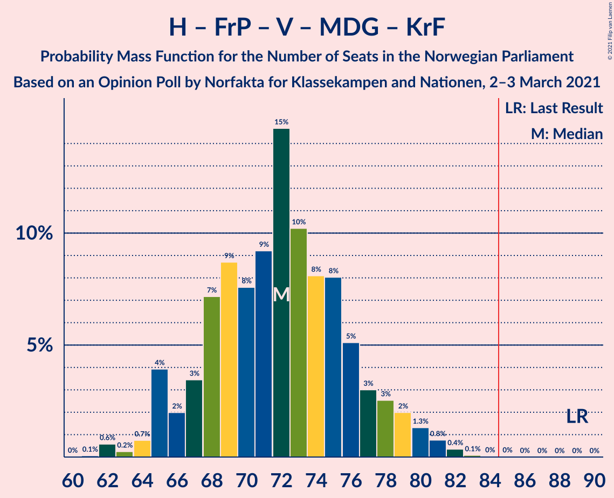

| Number of Seats | Probability | Accumulated | Special Marks |
|:---------------:|:-----------:|:-----------:|:-------------:|
| 60 | 0% | 100% |  |
| 61 | 0.1% | 99.9% |  |
| 62 | 0.6% | 99.9% |  |
| 63 | 0.2% | 99.3% |  |
| 64 | 0.7% | 99.1% |  |
| 65 | 4% | 98% |  |
| 66 | 2% | 94% |  |
| 67 | 3% | 92% |  |
| 68 | 7% | 89% |  |
| 69 | 9% | 82% | Median |
| 70 | 8% | 73% |  |
| 71 | 9% | 65% |  |
| 72 | 15% | 56% |  |
| 73 | 10% | 42% |  |
| 74 | 8% | 31% |  |
| 75 | 8% | 23% |  |
| 76 | 5% | 15% |  |
| 77 | 3% | 10% |  |
| 78 | 3% | 7% |  |
| 79 | 2% | 5% |  |
| 80 | 1.3% | 3% |  |
| 81 | 0.8% | 1.3% |  |
| 82 | 0.4% | 0.5% |  |
| 83 | 0.1% | 0.2% |  |
| 84 | 0% | 0.1% |  |
| 85 | 0% | 0% | Majority |
| 86 | 0% | 0% |  |
| 87 | 0% | 0% |  |
| 88 | 0% | 0% |  |
| 89 | 0% | 0% | Last Result |

### Høyre – Fremskrittspartiet – Venstre – Kristelig Folkeparti

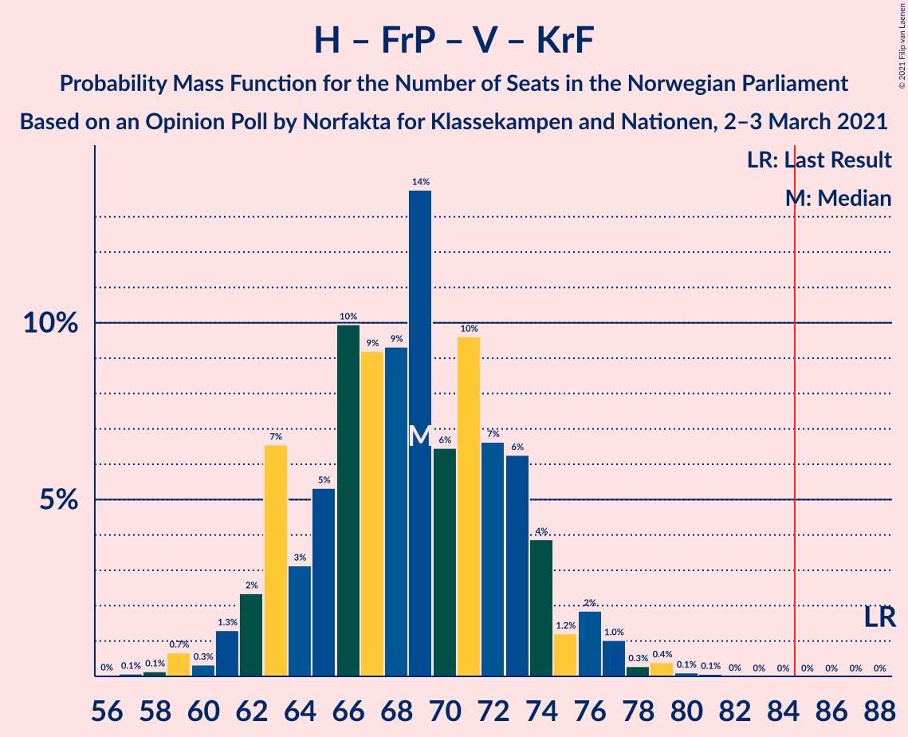

| Number of Seats | Probability | Accumulated | Special Marks |
|:---------------:|:-----------:|:-----------:|:-------------:|
| 56 | 0% | 100% |  |
| 57 | 0.1% | 99.9% |  |
| 58 | 0.1% | 99.9% |  |
| 59 | 0.7% | 99.7% |  |
| 60 | 0.3% | 99.1% |  |
| 61 | 1.3% | 98.7% |  |
| 62 | 2% | 97% |  |
| 63 | 7% | 95% |  |
| 64 | 3% | 89% |  |
| 65 | 5% | 85% |  |
| 66 | 10% | 80% |  |
| 67 | 9% | 70% | Median |
| 68 | 9% | 61% |  |
| 69 | 14% | 52% |  |
| 70 | 6% | 38% |  |
| 71 | 10% | 31% |  |
| 72 | 7% | 22% |  |
| 73 | 6% | 15% |  |
| 74 | 4% | 9% |  |
| 75 | 1.2% | 5% |  |
| 76 | 2% | 4% |  |
| 77 | 1.0% | 2% |  |
| 78 | 0.3% | 0.9% |  |
| 79 | 0.4% | 0.6% |  |
| 80 | 0.1% | 0.2% |  |
| 81 | 0.1% | 0.1% |  |
| 82 | 0% | 0% |  |
| 83 | 0% | 0% |  |
| 84 | 0% | 0% |  |
| 85 | 0% | 0% | Majority |
| 86 | 0% | 0% |  |
| 87 | 0% | 0% |  |
| 88 | 0% | 0% | Last Result |

### Høyre – Fremskrittspartiet – Venstre

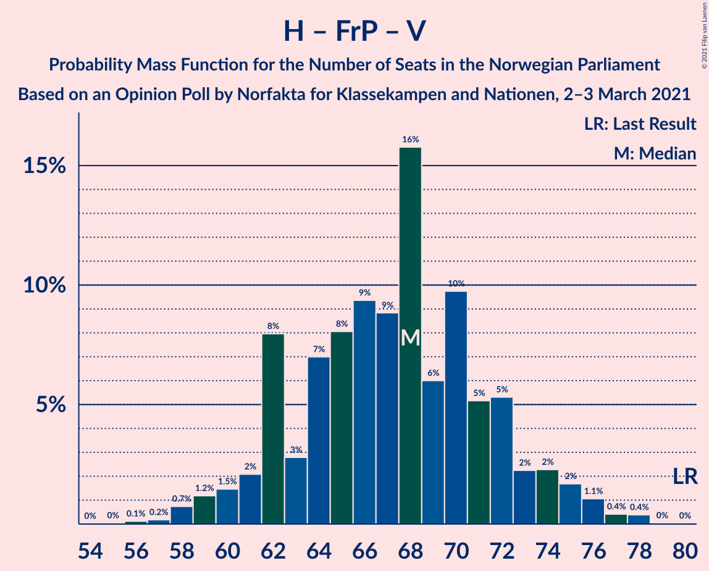

| Number of Seats | Probability | Accumulated | Special Marks |
|:---------------:|:-----------:|:-----------:|:-------------:|
| 55 | 0% | 100% |  |
| 56 | 0.1% | 99.9% |  |
| 57 | 0.2% | 99.8% |  |
| 58 | 0.7% | 99.6% |  |
| 59 | 1.2% | 98.9% |  |
| 60 | 1.5% | 98% |  |
| 61 | 2% | 96% |  |
| 62 | 8% | 94% |  |
| 63 | 3% | 86% |  |
| 64 | 7% | 83% |  |
| 65 | 8% | 76% |  |
| 66 | 9% | 68% | Median |
| 67 | 9% | 59% |  |
| 68 | 16% | 50% |  |
| 69 | 6% | 34% |  |
| 70 | 10% | 28% |  |
| 71 | 5% | 19% |  |
| 72 | 5% | 13% |  |
| 73 | 2% | 8% |  |
| 74 | 2% | 6% |  |
| 75 | 2% | 4% |  |
| 76 | 1.1% | 2% |  |
| 77 | 0.4% | 0.9% |  |
| 78 | 0.4% | 0.5% |  |
| 79 | 0% | 0.1% |  |
| 80 | 0% | 0% | Last Result |

### Høyre – Fremskrittspartiet

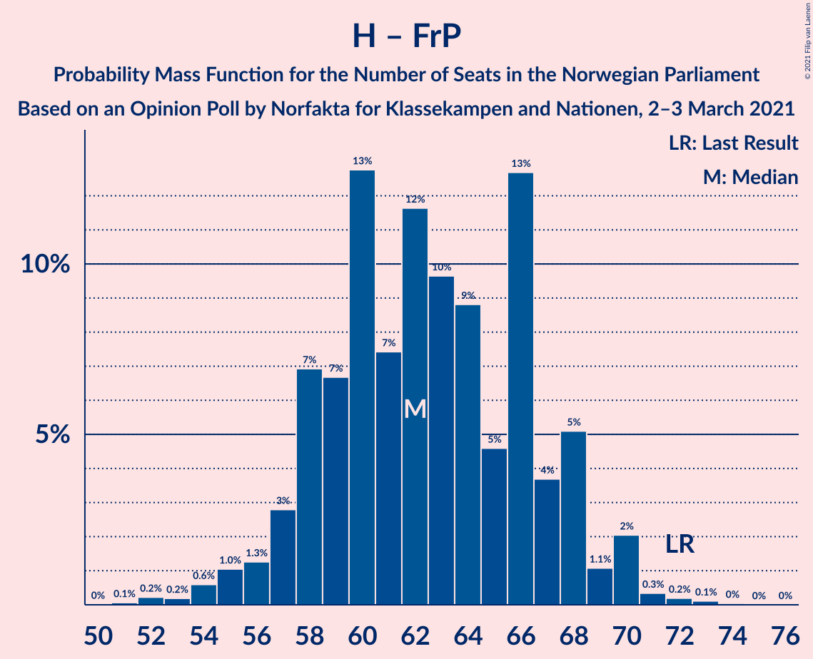

| Number of Seats | Probability | Accumulated | Special Marks |
|:---------------:|:-----------:|:-----------:|:-------------:|
| 51 | 0.1% | 100% |  |
| 52 | 0.2% | 99.9% |  |
| 53 | 0.2% | 99.7% |  |
| 54 | 0.6% | 99.5% |  |
| 55 | 1.0% | 98.9% |  |
| 56 | 1.3% | 98% |  |
| 57 | 3% | 97% |  |
| 58 | 7% | 94% |  |
| 59 | 7% | 87% |  |
| 60 | 13% | 80% |  |
| 61 | 7% | 67% |  |
| 62 | 12% | 60% |  |
| 63 | 10% | 48% | Median |
| 64 | 9% | 39% |  |
| 65 | 5% | 30% |  |
| 66 | 13% | 25% |  |
| 67 | 4% | 13% |  |
| 68 | 5% | 9% |  |
| 69 | 1.1% | 4% |  |
| 70 | 2% | 3% |  |
| 71 | 0.3% | 0.7% |  |
| 72 | 0.2% | 0.4% | Last Result |
| 73 | 0.1% | 0.2% |  |
| 74 | 0% | 0.1% |  |
| 75 | 0% | 0% |  |

### Arbeiderpartiet – Sosialistisk Venstreparti

| Number of Seats | Probability | Accumulated | Special Marks |
|:---------------:|:-----------:|:-----------:|:-------------:|
| 50 | 0.1% | 100% |  |
| 51 | 0.4% | 99.9% |  |
| 52 | 0.8% | 99.5% |  |
| 53 | 0.9% | 98.7% |  |
| 54 | 3% | 98% |  |
| 55 | 8% | 95% |  |
| 56 | 5% | 87% |  |
| 57 | 9% | 82% |  |
| 58 | 15% | 73% |  |
| 59 | 13% | 57% | Median |
| 60 | 15% | 44% | Last Result |
| 61 | 10% | 29% |  |
| 62 | 5% | 19% |  |
| 63 | 8% | 14% |  |
| 64 | 0.9% | 5% |  |
| 65 | 3% | 4% |  |
| 66 | 0.5% | 1.1% |  |
| 67 | 0.3% | 0.6% |  |
| 68 | 0.1% | 0.3% |  |
| 69 | 0% | 0.2% |  |
| 70 | 0.1% | 0.2% |  |
| 71 | 0% | 0% |  |

### Høyre – Venstre – Kristelig Folkeparti

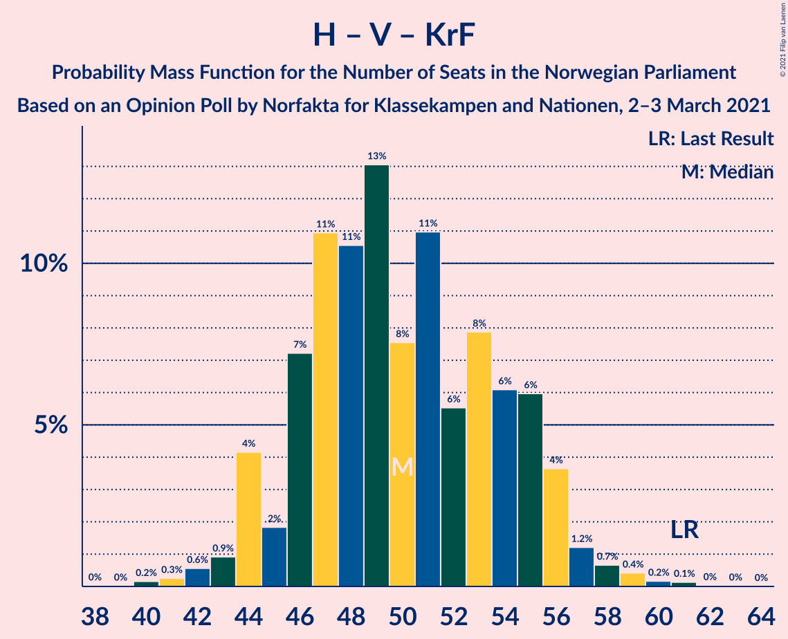

| Number of Seats | Probability | Accumulated | Special Marks |
|:---------------:|:-----------:|:-----------:|:-------------:|
| 40 | 0.2% | 100% |  |
| 41 | 0.3% | 99.8% |  |
| 42 | 0.6% | 99.6% |  |
| 43 | 0.9% | 99.0% |  |
| 44 | 4% | 98% |  |
| 45 | 2% | 94% |  |
| 46 | 7% | 92% |  |
| 47 | 11% | 85% |  |
| 48 | 11% | 74% | Median |
| 49 | 13% | 63% |  |
| 50 | 8% | 50% |  |
| 51 | 11% | 43% |  |
| 52 | 6% | 32% |  |
| 53 | 8% | 26% |  |
| 54 | 6% | 18% |  |
| 55 | 6% | 12% |  |
| 56 | 4% | 6% |  |
| 57 | 1.2% | 3% |  |
| 58 | 0.7% | 1.4% |  |
| 59 | 0.4% | 0.8% |  |
| 60 | 0.2% | 0.4% |  |
| 61 | 0.1% | 0.2% | Last Result |
| 62 | 0% | 0.1% |  |
| 63 | 0% | 0% |  |

### Senterpartiet – Venstre – Kristelig Folkeparti

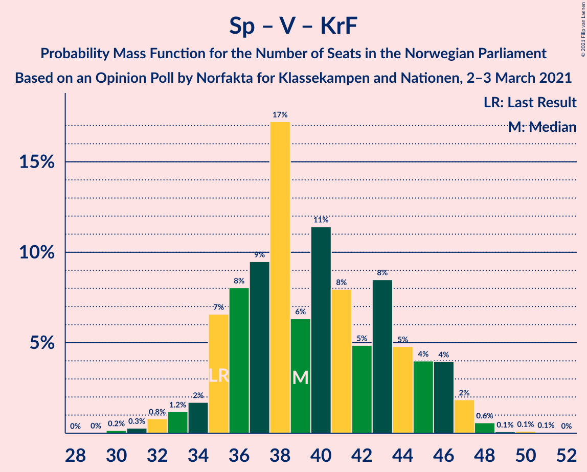

| Number of Seats | Probability | Accumulated | Special Marks |
|:---------------:|:-----------:|:-----------:|:-------------:|
| 30 | 0.2% | 100% |  |
| 31 | 0.3% | 99.8% |  |
| 32 | 0.8% | 99.5% |  |
| 33 | 1.2% | 98.7% |  |
| 34 | 2% | 98% |  |
| 35 | 7% | 96% | Last Result |
| 36 | 8% | 89% |  |
| 37 | 9% | 81% |  |
| 38 | 17% | 72% | Median |
| 39 | 6% | 55% |  |
| 40 | 11% | 48% |  |
| 41 | 8% | 37% |  |
| 42 | 5% | 29% |  |
| 43 | 8% | 24% |  |
| 44 | 5% | 15% |  |
| 45 | 4% | 11% |  |
| 46 | 4% | 7% |  |
| 47 | 2% | 3% |  |
| 48 | 0.6% | 0.8% |  |
| 49 | 0.1% | 0.3% |  |
| 50 | 0.1% | 0.2% |  |
| 51 | 0.1% | 0.1% |  |
| 52 | 0% | 0% |  |

## Technical Information

### Opinion Poll

+ **Polling firm:** Norfakta
+ **Commissioner(s):** Klassekampen and Nationen
+ **Fieldwork period:** 2–3 March 2021

### Calculations

+ **Sample size:** 1000
+ **Simulations done:** 1,048,576
+ **Error estimate:** 1.54%

