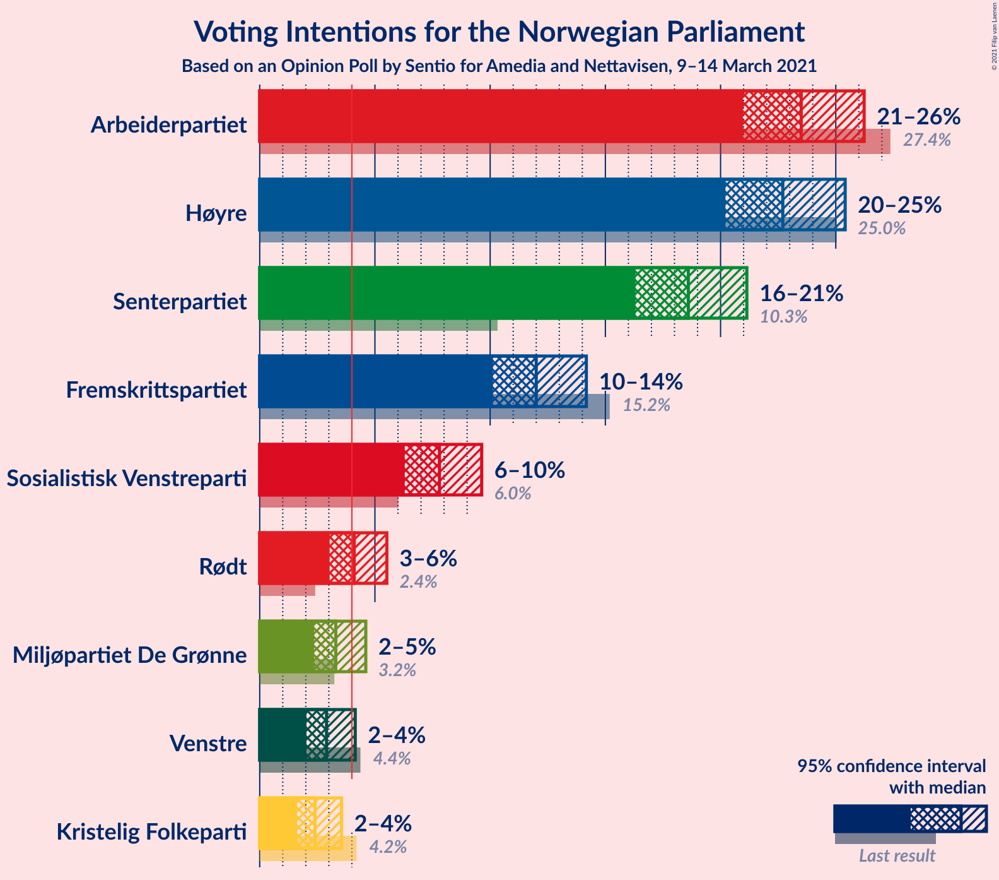
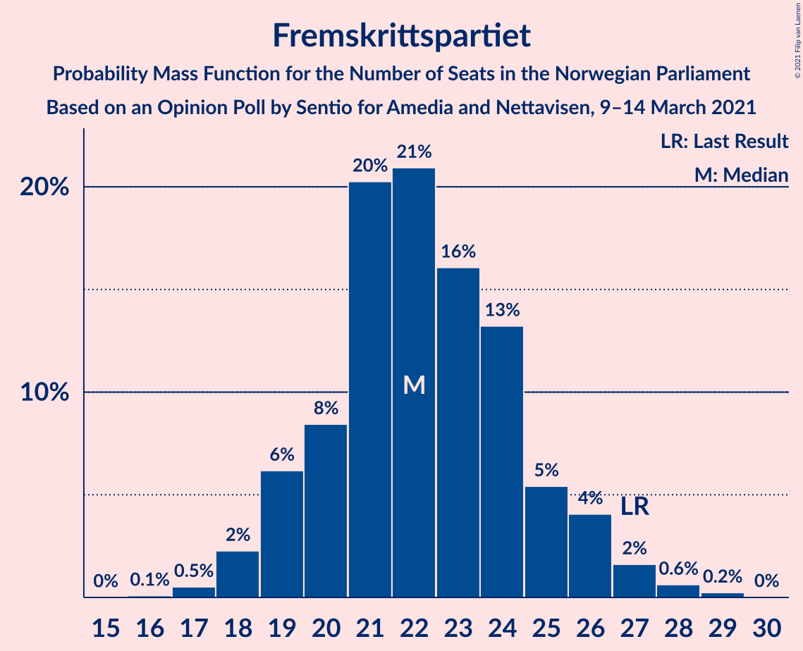
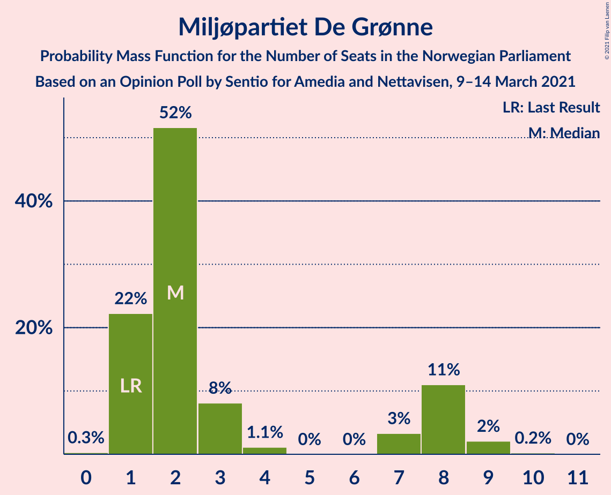
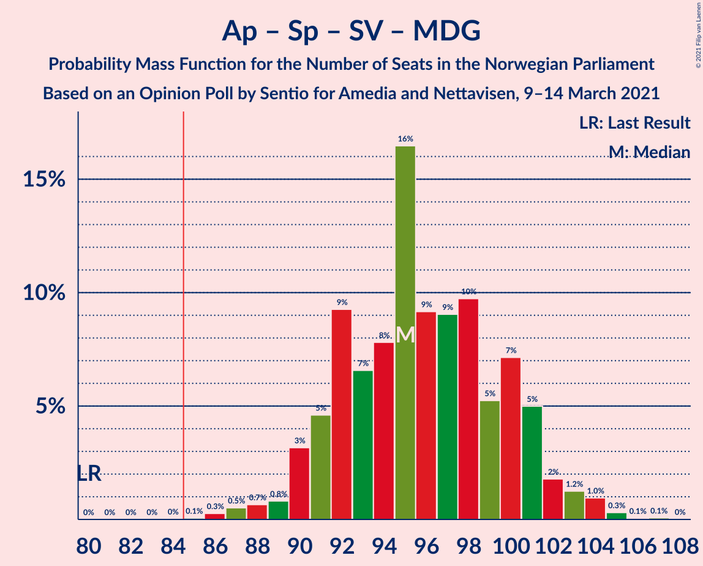

# Opinion Poll by Sentio for Amedia and Nettavisen, 9–14 March 2021

<a href="#voting-intentions">Voting Intentions</a> | <a href="#seats">Seats</a> | <a href="#coalitions">Coalitions</a> | <a href="#technical-information">Technical Information</a>

## Voting Intentions

### Confidence Intervals

| Party | Last Result | Poll Result | 80% Confidence Interval | 90% Confidence Interval | 95% Confidence Interval | 99% Confidence Interval |
|:-----:|:-----------:|:-----------:|:-----------------------:|:-----------------------:|:-----------------------:|:-----------------------:|
| Arbeiderpartiet | 27.4% | 23.5% | 21.8–25.3% |21.4–25.8% |21.0–26.2% |20.2–27.1% |
| Høyre | 25.0% | 22.7% | 21.1–24.5% |20.6–25.0% |20.2–25.4% |19.4–26.3% |
| Senterpartiet | 10.3% | 18.6% | 17.1–20.3% |16.7–20.7% |16.3–21.1% |15.6–21.9% |
| Fremskrittspartiet | 15.2% | 12.0% | 10.8–13.4% |10.4–13.8% |10.1–14.2% |9.6–14.9% |
| Sosialistisk Venstreparti | 6.0% | 7.8% | 6.8–9.0% |6.5–9.3% |6.3–9.6% |5.8–10.2% |
| Rødt | 2.4% | 4.1% | 3.4–5.0% |3.2–5.3% |3.0–5.5% |2.7–6.0% |
| Miljøpartiet De Grønne | 3.2% | 3.3% | 2.7–4.1% |2.5–4.4% |2.4–4.6% |2.1–5.0% |
| Venstre | 4.4% | 2.9% | 2.3–3.7% |2.2–3.9% |2.0–4.1% |1.8–4.6% |
| Kristelig Folkeparti | 4.2% | 2.4% | 1.9–3.2% |1.7–3.4% |1.6–3.6% |1.4–3.9% |

*Note:* The poll result column reflects the actual value used in the calculations. Published results may vary slightly, and in addition be rounded to fewer digits.

## Seats

### Confidence Intervals

| Party | Last Result | Median | 80% Confidence Interval | 90% Confidence Interval | 95% Confidence Interval | 99% Confidence Interval |
|:-----:|:-----------:|:------:|:-----------------------:|:-----------------------:|:-----------------------:|:-----------------------:|
| <a href="#arbeiderpartiet">Arbeiderpartiet</a> | 49 | 43 | 40–47 |39–48 |39–49 |37–51 |
| <a href="#høyre">Høyre</a> | 45 | 42 | 39–46 |38–47 |37–47 |35–49 |
| <a href="#senterpartiet">Senterpartiet</a> | 19 | 35 | 31–39 |31–40 |30–40 |28–41 |
| <a href="#fremskrittspartiet">Fremskrittspartiet</a> | 27 | 22 | 20–25 |19–26 |18–27 |17–28 |
| <a href="#sosialistisk-venstreparti">Sosialistisk Venstreparti</a> | 11 | 15 | 13–17 |12–18 |12–18 |11–19 |
| <a href="#rødt">Rødt</a> | 1 | 8 | 2–9 |2–10 |2–10 |1–11 |
| <a href="#miljøpartiet-de-grønne">Miljøpartiet De Grønne</a> | 1 | 2 | 1–8 |1–8 |1–8 |1–9 |
| <a href="#venstre">Venstre</a> | 8 | 2 | 1–2 |1–3 |1–8 |0–8 |
| <a href="#kristelig-folkeparti">Kristelig Folkeparti</a> | 8 | 1 | 0–2 |0–2 |0–2 |0–3 |

### Arbeiderpartiet

*For a full overview of the results for this party, see the [Arbeiderpartiet](party-arbeiderpartiet.html) page.*

| Number of Seats | Probability | Accumulated | Special Marks |
|:---------------:|:-----------:|:-----------:|:-------------:|
| 35 | 0% | 100% |  |
| 36 | 0.1% | 99.9% |  |
| 37 | 0.3% | 99.8% |  |
| 38 | 1.2% | 99.5% |  |
| 39 | 5% | 98% |  |
| 40 | 7% | 93% |  |
| 41 | 15% | 87% |  |
| 42 | 17% | 72% |  |
| 43 | 16% | 55% | Median |
| 44 | 10% | 39% |  |
| 45 | 7% | 28% |  |
| 46 | 6% | 21% |  |
| 47 | 6% | 15% |  |
| 48 | 4% | 9% |  |
| 49 | 3% | 5% | Last Result |
| 50 | 1.2% | 2% |  |
| 51 | 0.6% | 0.7% |  |
| 52 | 0.1% | 0.2% |  |
| 53 | 0% | 0.1% |  |
| 54 | 0% | 0% |  |

### Høyre

*For a full overview of the results for this party, see the [Høyre](party-høyre.html) page.*

| Number of Seats | Probability | Accumulated | Special Marks |
|:---------------:|:-----------:|:-----------:|:-------------:|
| 34 | 0.1% | 100% |  |
| 35 | 0.4% | 99.9% |  |
| 36 | 0.9% | 99.5% |  |
| 37 | 2% | 98.6% |  |
| 38 | 6% | 97% |  |
| 39 | 9% | 91% |  |
| 40 | 13% | 82% |  |
| 41 | 11% | 69% |  |
| 42 | 16% | 58% | Median |
| 43 | 10% | 42% |  |
| 44 | 12% | 32% |  |
| 45 | 7% | 20% | Last Result |
| 46 | 4% | 13% |  |
| 47 | 7% | 8% |  |
| 48 | 0.8% | 2% |  |
| 49 | 0.6% | 0.8% |  |
| 50 | 0.1% | 0.2% |  |
| 51 | 0.1% | 0.1% |  |
| 52 | 0% | 0% |  |

### Senterpartiet

*For a full overview of the results for this party, see the [Senterpartiet](party-senterpartiet.html) page.*

| Number of Seats | Probability | Accumulated | Special Marks |
|:---------------:|:-----------:|:-----------:|:-------------:|
| 19 | 0% | 100% | Last Result |
| 20 | 0% | 100% |  |
| 21 | 0% | 100% |  |
| 22 | 0% | 100% |  |
| 23 | 0% | 100% |  |
| 24 | 0% | 100% |  |
| 25 | 0% | 100% |  |
| 26 | 0% | 100% |  |
| 27 | 0.1% | 100% |  |
| 28 | 0.5% | 99.8% |  |
| 29 | 1.4% | 99.3% |  |
| 30 | 2% | 98% |  |
| 31 | 6% | 95% |  |
| 32 | 6% | 89% |  |
| 33 | 15% | 84% |  |
| 34 | 14% | 69% |  |
| 35 | 12% | 55% | Median |
| 36 | 14% | 43% |  |
| 37 | 7% | 29% |  |
| 38 | 11% | 22% |  |
| 39 | 5% | 11% |  |
| 40 | 4% | 6% |  |
| 41 | 2% | 2% |  |
| 42 | 0.3% | 0.4% |  |
| 43 | 0.1% | 0.1% |  |
| 44 | 0% | 0% |  |

### Fremskrittspartiet

*For a full overview of the results for this party, see the [Fremskrittspartiet](party-fremskrittspartiet.html) page.*

| Number of Seats | Probability | Accumulated | Special Marks |
|:---------------:|:-----------:|:-----------:|:-------------:|
| 16 | 0.1% | 100% |  |
| 17 | 0.5% | 99.9% |  |
| 18 | 2% | 99.4% |  |
| 19 | 6% | 97% |  |
| 20 | 8% | 91% |  |
| 21 | 20% | 82% |  |
| 22 | 21% | 62% | Median |
| 23 | 16% | 41% |  |
| 24 | 13% | 25% |  |
| 25 | 5% | 12% |  |
| 26 | 4% | 7% |  |
| 27 | 2% | 3% | Last Result |
| 28 | 0.6% | 0.9% |  |
| 29 | 0.2% | 0.3% |  |
| 30 | 0% | 0% |  |

### Sosialistisk Venstreparti

*For a full overview of the results for this party, see the [Sosialistisk Venstreparti](party-sosialistiskvenstreparti.html) page.*

| Number of Seats | Probability | Accumulated | Special Marks |
|:---------------:|:-----------:|:-----------:|:-------------:|
| 10 | 0.4% | 100% |  |
| 11 | 2% | 99.6% | Last Result |
| 12 | 6% | 98% |  |
| 13 | 14% | 91% |  |
| 14 | 24% | 77% |  |
| 15 | 24% | 53% | Median |
| 16 | 18% | 29% |  |
| 17 | 5% | 11% |  |
| 18 | 4% | 5% |  |
| 19 | 1.1% | 1.3% |  |
| 20 | 0.2% | 0.3% |  |
| 21 | 0.1% | 0.1% |  |
| 22 | 0% | 0% |  |

### Rødt

*For a full overview of the results for this party, see the [Rødt](party-rødt.html) page.*

| Number of Seats | Probability | Accumulated | Special Marks |
|:---------------:|:-----------:|:-----------:|:-------------:|
| 1 | 1.1% | 100% | Last Result |
| 2 | 40% | 98.9% |  |
| 3 | 0% | 59% |  |
| 4 | 0% | 58% |  |
| 5 | 0% | 58% |  |
| 6 | 0% | 58% |  |
| 7 | 4% | 58% |  |
| 8 | 32% | 55% | Median |
| 9 | 16% | 23% |  |
| 10 | 6% | 7% |  |
| 11 | 0.7% | 0.9% |  |
| 12 | 0.2% | 0.2% |  |
| 13 | 0% | 0% |  |

### Miljøpartiet De Grønne

*For a full overview of the results for this party, see the [Miljøpartiet De Grønne](party-miljøpartietdegrønne.html) page.*

| Number of Seats | Probability | Accumulated | Special Marks |
|:---------------:|:-----------:|:-----------:|:-------------:|
| 0 | 0.3% | 100% |  |
| 1 | 22% | 99.7% | Last Result |
| 2 | 52% | 77% | Median |
| 3 | 8% | 26% |  |
| 4 | 1.1% | 18% |  |
| 5 | 0% | 17% |  |
| 6 | 0% | 17% |  |
| 7 | 3% | 17% |  |
| 8 | 11% | 13% |  |
| 9 | 2% | 2% |  |
| 10 | 0.2% | 0.2% |  |
| 11 | 0% | 0% |  |

### Venstre

*For a full overview of the results for this party, see the [Venstre](party-venstre.html) page.*

| Number of Seats | Probability | Accumulated | Special Marks |
|:---------------:|:-----------:|:-----------:|:-------------:|
| 0 | 0.6% | 100% |  |
| 1 | 10% | 99.4% |  |
| 2 | 84% | 90% | Median |
| 3 | 2% | 6% |  |
| 4 | 0.2% | 4% |  |
| 5 | 0% | 4% |  |
| 6 | 0% | 4% |  |
| 7 | 1.3% | 4% |  |
| 8 | 2% | 3% | Last Result |
| 9 | 0.2% | 0.2% |  |
| 10 | 0% | 0% |  |

### Kristelig Folkeparti

*For a full overview of the results for this party, see the [Kristelig Folkeparti](party-kristeligfolkeparti.html) page.*

| Number of Seats | Probability | Accumulated | Special Marks |
|:---------------:|:-----------:|:-----------:|:-------------:|
| 0 | 34% | 100% |  |
| 1 | 51% | 66% | Median |
| 2 | 12% | 15% |  |
| 3 | 2% | 2% |  |
| 4 | 0% | 0.4% |  |
| 5 | 0% | 0.4% |  |
| 6 | 0% | 0.4% |  |
| 7 | 0.1% | 0.4% |  |
| 8 | 0.3% | 0.3% | Last Result |
| 9 | 0% | 0% |  |

## Coalitions

### Confidence Intervals

| Coalition | Last Result | Median | Majority? | 80% Confidence Interval | 90% Confidence Interval | 95% Confidence Interval | 99% Confidence Interval |
|:---------:|:-----------:|:------:|:---------:|:-----------------------:|:-----------------------:|:-----------------------:|:-----------------------:|
| Høyre – Senterpartiet – Fremskrittspartiet – Venstre – Kristelig Folkeparti | 107 | 102 | 100% | 97–108 | 96–109 | 95–110 | 93–112 |
| Arbeiderpartiet – Senterpartiet – Sosialistisk Venstreparti – Rødt – Miljøpartiet De Grønne | 81 | 102 | 100% | 97–106 | 96–107 | 95–108 | 92–110 |
| Arbeiderpartiet – Senterpartiet – Sosialistisk Venstreparti – Rødt | 80 | 99 | 100% | 94–103 | 93–104 | 91–105 | 89–107 |
| Arbeiderpartiet – Senterpartiet – Sosialistisk Venstreparti – Miljøpartiet De Grønne – Kristelig Folkeparti | 88 | 96 | 100% | 92–101 | 91–102 | 90–103 | 88–105 |
| Arbeiderpartiet – Senterpartiet – Sosialistisk Venstreparti – Miljøpartiet De Grønne | 80 | 95 | 100% | 91–100 | 90–101 | 90–103 | 87–104 |
| Arbeiderpartiet – Senterpartiet – Sosialistisk Venstreparti | 79 | 93 | 99.1% | 88–98 | 87–99 | 86–100 | 84–102 |
| Arbeiderpartiet – Senterpartiet – Miljøpartiet De Grønne – Kristelig Folkeparti | 77 | 82 | 23% | 78–86 | 76–88 | 75–89 | 74–91 |
| Arbeiderpartiet – Senterpartiet – Kristelig Folkeparti | 76 | 79 | 6% | 75–83 | 73–85 | 73–86 | 71–88 |
| Arbeiderpartiet – Senterpartiet | 68 | 78 | 3% | 74–83 | 72–84 | 72–85 | 70–87 |
| Høyre – Fremskrittspartiet – Miljøpartiet De Grønne – Venstre – Kristelig Folkeparti | 89 | 70 | 0% | 66–75 | 65–76 | 64–78 | 61–80 |
| Høyre – Fremskrittspartiet – Venstre – Kristelig Folkeparti | 88 | 67 | 0% | 63–72 | 62–73 | 61–74 | 59–76 |
| Høyre – Fremskrittspartiet – Venstre | 80 | 66 | 0% | 62–71 | 61–72 | 60–73 | 58–75 |
| Høyre – Fremskrittspartiet | 72 | 64 | 0% | 60–69 | 59–69 | 58–71 | 56–73 |
| Arbeiderpartiet – Sosialistisk Venstreparti | 60 | 57 | 0% | 54–62 | 53–63 | 52–64 | 51–67 |
| Høyre – Venstre – Kristelig Folkeparti | 61 | 45 | 0% | 41–50 | 41–50 | 40–51 | 38–55 |
| Senterpartiet – Venstre – Kristelig Folkeparti | 35 | 38 | 0% | 34–42 | 33–43 | 32–43 | 31–45 |

### Høyre – Senterpartiet – Fremskrittspartiet – Venstre – Kristelig Folkeparti

| Number of Seats | Probability | Accumulated | Special Marks |
|:---------------:|:-----------:|:-----------:|:-------------:|
| 90 | 0% | 100% |  |
| 91 | 0.1% | 99.9% |  |
| 92 | 0.2% | 99.9% |  |
| 93 | 0.6% | 99.6% |  |
| 94 | 0.6% | 99.0% |  |
| 95 | 3% | 98% |  |
| 96 | 2% | 96% |  |
| 97 | 5% | 93% |  |
| 98 | 5% | 88% |  |
| 99 | 5% | 83% |  |
| 100 | 8% | 78% |  |
| 101 | 7% | 70% |  |
| 102 | 19% | 63% | Median |
| 103 | 6% | 44% |  |
| 104 | 11% | 37% |  |
| 105 | 4% | 26% |  |
| 106 | 8% | 22% |  |
| 107 | 3% | 15% | Last Result |
| 108 | 6% | 12% |  |
| 109 | 2% | 5% |  |
| 110 | 2% | 3% |  |
| 111 | 0.5% | 1.0% |  |
| 112 | 0.3% | 0.5% |  |
| 113 | 0.2% | 0.2% |  |
| 114 | 0% | 0.1% |  |
| 115 | 0% | 0% |  |

### Arbeiderpartiet – Senterpartiet – Sosialistisk Venstreparti – Rødt – Miljøpartiet De Grønne

| Number of Seats | Probability | Accumulated | Special Marks |
|:---------------:|:-----------:|:-----------:|:-------------:|
| 81 | 0% | 100% | Last Result |
| 82 | 0% | 100% |  |
| 83 | 0% | 100% |  |
| 84 | 0% | 100% |  |
| 85 | 0% | 100% | Majority |
| 86 | 0% | 100% |  |
| 87 | 0% | 100% |  |
| 88 | 0% | 100% |  |
| 89 | 0% | 100% |  |
| 90 | 0% | 100% |  |
| 91 | 0.2% | 99.9% |  |
| 92 | 0.3% | 99.8% |  |
| 93 | 0.4% | 99.4% |  |
| 94 | 1.5% | 99.1% |  |
| 95 | 2% | 98% |  |
| 96 | 2% | 95% |  |
| 97 | 6% | 94% |  |
| 98 | 5% | 87% |  |
| 99 | 8% | 83% |  |
| 100 | 15% | 75% |  |
| 101 | 6% | 60% |  |
| 102 | 12% | 54% |  |
| 103 | 14% | 42% | Median |
| 104 | 9% | 28% |  |
| 105 | 8% | 19% |  |
| 106 | 5% | 11% |  |
| 107 | 4% | 7% |  |
| 108 | 1.5% | 3% |  |
| 109 | 1.0% | 2% |  |
| 110 | 0.3% | 0.5% |  |
| 111 | 0.1% | 0.2% |  |
| 112 | 0.1% | 0.1% |  |
| 113 | 0% | 0% |  |

### Arbeiderpartiet – Senterpartiet – Sosialistisk Venstreparti – Rødt

| Number of Seats | Probability | Accumulated | Special Marks |
|:---------------:|:-----------:|:-----------:|:-------------:|
| 80 | 0% | 100% | Last Result |
| 81 | 0% | 100% |  |
| 82 | 0% | 100% |  |
| 83 | 0% | 100% |  |
| 84 | 0% | 100% |  |
| 85 | 0% | 100% | Majority |
| 86 | 0% | 100% |  |
| 87 | 0.1% | 100% |  |
| 88 | 0.3% | 99.9% |  |
| 89 | 0.3% | 99.5% |  |
| 90 | 0.5% | 99.2% |  |
| 91 | 2% | 98.8% |  |
| 92 | 2% | 97% |  |
| 93 | 3% | 95% |  |
| 94 | 5% | 92% |  |
| 95 | 7% | 86% |  |
| 96 | 6% | 79% |  |
| 97 | 7% | 73% |  |
| 98 | 13% | 66% |  |
| 99 | 9% | 53% |  |
| 100 | 8% | 43% |  |
| 101 | 12% | 35% | Median |
| 102 | 9% | 23% |  |
| 103 | 6% | 14% |  |
| 104 | 3% | 8% |  |
| 105 | 3% | 4% |  |
| 106 | 0.9% | 2% |  |
| 107 | 0.4% | 0.8% |  |
| 108 | 0.3% | 0.4% |  |
| 109 | 0.1% | 0.1% |  |
| 110 | 0% | 0.1% |  |
| 111 | 0% | 0% |  |

### Arbeiderpartiet – Senterpartiet – Sosialistisk Venstreparti – Miljøpartiet De Grønne – Kristelig Folkeparti

| Number of Seats | Probability | Accumulated | Special Marks |
|:---------------:|:-----------:|:-----------:|:-------------:|
| 86 | 0.1% | 100% |  |
| 87 | 0.3% | 99.8% |  |
| 88 | 0.4% | 99.5% | Last Result |
| 89 | 0.9% | 99.1% |  |
| 90 | 1.2% | 98% |  |
| 91 | 3% | 97% |  |
| 92 | 5% | 94% |  |
| 93 | 5% | 89% |  |
| 94 | 11% | 84% |  |
| 95 | 10% | 73% |  |
| 96 | 14% | 63% | Median |
| 97 | 10% | 48% |  |
| 98 | 9% | 38% |  |
| 99 | 8% | 30% |  |
| 100 | 7% | 21% |  |
| 101 | 8% | 15% |  |
| 102 | 2% | 7% |  |
| 103 | 2% | 5% |  |
| 104 | 1.2% | 2% |  |
| 105 | 0.5% | 1.0% |  |
| 106 | 0.3% | 0.5% |  |
| 107 | 0% | 0.1% |  |
| 108 | 0.1% | 0.1% |  |
| 109 | 0% | 0% |  |

### Arbeiderpartiet – Senterpartiet – Sosialistisk Venstreparti – Miljøpartiet De Grønne

| Number of Seats | Probability | Accumulated | Special Marks |
|:---------------:|:-----------:|:-----------:|:-------------:|
| 80 | 0% | 100% | Last Result |
| 81 | 0% | 100% |  |
| 82 | 0% | 100% |  |
| 83 | 0% | 100% |  |
| 84 | 0% | 100% |  |
| 85 | 0.1% | 100% | Majority |
| 86 | 0.3% | 99.9% |  |
| 87 | 0.5% | 99.6% |  |
| 88 | 0.7% | 99.1% |  |
| 89 | 0.8% | 98% |  |
| 90 | 3% | 98% |  |
| 91 | 5% | 94% |  |
| 92 | 9% | 90% |  |
| 93 | 7% | 81% |  |
| 94 | 8% | 74% |  |
| 95 | 16% | 66% | Median |
| 96 | 9% | 50% |  |
| 97 | 9% | 41% |  |
| 98 | 10% | 32% |  |
| 99 | 5% | 22% |  |
| 100 | 7% | 17% |  |
| 101 | 5% | 9% |  |
| 102 | 2% | 4% |  |
| 103 | 1.2% | 3% |  |
| 104 | 1.0% | 1.4% |  |
| 105 | 0.3% | 0.4% |  |
| 106 | 0.1% | 0.1% |  |
| 107 | 0.1% | 0.1% |  |
| 108 | 0% | 0% |  |

### Arbeiderpartiet – Senterpartiet – Sosialistisk Venstreparti

| Number of Seats | Probability | Accumulated | Special Marks |
|:---------------:|:-----------:|:-----------:|:-------------:|
| 79 | 0% | 100% | Last Result |
| 80 | 0% | 100% |  |
| 81 | 0% | 100% |  |
| 82 | 0.1% | 100% |  |
| 83 | 0.1% | 99.9% |  |
| 84 | 0.7% | 99.8% |  |
| 85 | 1.4% | 99.1% | Majority |
| 86 | 2% | 98% |  |
| 87 | 3% | 95% |  |
| 88 | 3% | 92% |  |
| 89 | 6% | 89% |  |
| 90 | 8% | 83% |  |
| 91 | 9% | 75% |  |
| 92 | 9% | 66% |  |
| 93 | 16% | 57% | Median |
| 94 | 7% | 41% |  |
| 95 | 8% | 34% |  |
| 96 | 9% | 25% |  |
| 97 | 5% | 16% |  |
| 98 | 4% | 11% |  |
| 99 | 4% | 7% |  |
| 100 | 1.3% | 3% |  |
| 101 | 1.0% | 2% |  |
| 102 | 0.4% | 0.6% |  |
| 103 | 0.2% | 0.3% |  |
| 104 | 0% | 0.1% |  |
| 105 | 0% | 0% |  |

### Arbeiderpartiet – Senterpartiet – Miljøpartiet De Grønne – Kristelig Folkeparti

| Number of Seats | Probability | Accumulated | Special Marks |
|:---------------:|:-----------:|:-----------:|:-------------:|
| 71 | 0% | 100% |  |
| 72 | 0.1% | 99.9% |  |
| 73 | 0.2% | 99.8% |  |
| 74 | 0.7% | 99.6% |  |
| 75 | 2% | 98.9% |  |
| 76 | 2% | 97% |  |
| 77 | 4% | 95% | Last Result |
| 78 | 5% | 91% |  |
| 79 | 9% | 86% |  |
| 80 | 7% | 77% |  |
| 81 | 16% | 70% | Median |
| 82 | 12% | 54% |  |
| 83 | 11% | 42% |  |
| 84 | 8% | 31% |  |
| 85 | 9% | 23% | Majority |
| 86 | 4% | 14% |  |
| 87 | 4% | 9% |  |
| 88 | 3% | 6% |  |
| 89 | 1.4% | 3% |  |
| 90 | 0.7% | 1.3% |  |
| 91 | 0.2% | 0.6% |  |
| 92 | 0.3% | 0.4% |  |
| 93 | 0.1% | 0.1% |  |
| 94 | 0.1% | 0.1% |  |
| 95 | 0% | 0% |  |

### Arbeiderpartiet – Senterpartiet – Kristelig Folkeparti

| Number of Seats | Probability | Accumulated | Special Marks |
|:---------------:|:-----------:|:-----------:|:-------------:|
| 69 | 0.1% | 100% |  |
| 70 | 0.2% | 99.9% |  |
| 71 | 0.6% | 99.7% |  |
| 72 | 1.2% | 99.1% |  |
| 73 | 5% | 98% |  |
| 74 | 3% | 93% |  |
| 75 | 5% | 90% |  |
| 76 | 7% | 85% | Last Result |
| 77 | 9% | 78% |  |
| 78 | 10% | 69% |  |
| 79 | 12% | 59% | Median |
| 80 | 14% | 47% |  |
| 81 | 10% | 33% |  |
| 82 | 6% | 23% |  |
| 83 | 8% | 17% |  |
| 84 | 3% | 9% |  |
| 85 | 2% | 6% | Majority |
| 86 | 2% | 4% |  |
| 87 | 0.6% | 2% |  |
| 88 | 0.7% | 0.9% |  |
| 89 | 0.1% | 0.2% |  |
| 90 | 0.1% | 0.1% |  |
| 91 | 0% | 0% |  |

### Arbeiderpartiet – Senterpartiet

| Number of Seats | Probability | Accumulated | Special Marks |
|:---------------:|:-----------:|:-----------:|:-------------:|
| 68 | 0.1% | 100% | Last Result |
| 69 | 0.2% | 99.9% |  |
| 70 | 0.5% | 99.8% |  |
| 71 | 1.0% | 99.3% |  |
| 72 | 3% | 98% |  |
| 73 | 4% | 95% |  |
| 74 | 3% | 91% |  |
| 75 | 11% | 88% |  |
| 76 | 5% | 76% |  |
| 77 | 10% | 71% |  |
| 78 | 13% | 61% | Median |
| 79 | 14% | 48% |  |
| 80 | 8% | 34% |  |
| 81 | 8% | 25% |  |
| 82 | 6% | 17% |  |
| 83 | 6% | 11% |  |
| 84 | 2% | 5% |  |
| 85 | 1.2% | 3% | Majority |
| 86 | 1.4% | 2% |  |
| 87 | 0.4% | 0.7% |  |
| 88 | 0.2% | 0.3% |  |
| 89 | 0.1% | 0.1% |  |
| 90 | 0% | 0% |  |

### Høyre – Fremskrittspartiet – Miljøpartiet De Grønne – Venstre – Kristelig Folkeparti

| Number of Seats | Probability | Accumulated | Special Marks |
|:---------------:|:-----------:|:-----------:|:-------------:|
| 59 | 0.1% | 100% |  |
| 60 | 0.1% | 99.9% |  |
| 61 | 0.4% | 99.8% |  |
| 62 | 0.4% | 99.4% |  |
| 63 | 1.0% | 99.0% |  |
| 64 | 3% | 98% |  |
| 65 | 4% | 95% |  |
| 66 | 6% | 91% |  |
| 67 | 9% | 85% |  |
| 68 | 12% | 76% |  |
| 69 | 8% | 64% | Median |
| 70 | 9% | 56% |  |
| 71 | 13% | 46% |  |
| 72 | 7% | 33% |  |
| 73 | 6% | 26% |  |
| 74 | 7% | 20% |  |
| 75 | 5% | 13% |  |
| 76 | 3% | 8% |  |
| 77 | 2% | 4% |  |
| 78 | 2% | 3% |  |
| 79 | 0.3% | 1.0% |  |
| 80 | 0.3% | 0.7% |  |
| 81 | 0.3% | 0.4% |  |
| 82 | 0.1% | 0.1% |  |
| 83 | 0% | 0% |  |
| 84 | 0% | 0% |  |
| 85 | 0% | 0% | Majority |
| 86 | 0% | 0% |  |
| 87 | 0% | 0% |  |
| 88 | 0% | 0% |  |
| 89 | 0% | 0% | Last Result |

### Høyre – Fremskrittspartiet – Venstre – Kristelig Folkeparti

| Number of Seats | Probability | Accumulated | Special Marks |
|:---------------:|:-----------:|:-----------:|:-------------:|
| 57 | 0.1% | 100% |  |
| 58 | 0.1% | 99.9% |  |
| 59 | 0.3% | 99.7% |  |
| 60 | 1.2% | 99.4% |  |
| 61 | 2% | 98% |  |
| 62 | 4% | 97% |  |
| 63 | 5% | 93% |  |
| 64 | 8% | 88% |  |
| 65 | 9% | 80% |  |
| 66 | 14% | 71% |  |
| 67 | 11% | 56% | Median |
| 68 | 6% | 45% |  |
| 69 | 15% | 39% |  |
| 70 | 8% | 24% |  |
| 71 | 4% | 16% |  |
| 72 | 6% | 12% |  |
| 73 | 2% | 6% |  |
| 74 | 2% | 4% |  |
| 75 | 1.5% | 2% |  |
| 76 | 0.2% | 0.6% |  |
| 77 | 0.2% | 0.4% |  |
| 78 | 0.2% | 0.2% |  |
| 79 | 0% | 0.1% |  |
| 80 | 0% | 0% |  |
| 81 | 0% | 0% |  |
| 82 | 0% | 0% |  |
| 83 | 0% | 0% |  |
| 84 | 0% | 0% |  |
| 85 | 0% | 0% | Majority |
| 86 | 0% | 0% |  |
| 87 | 0% | 0% |  |
| 88 | 0% | 0% | Last Result |

### Høyre – Fremskrittspartiet – Venstre

| Number of Seats | Probability | Accumulated | Special Marks |
|:---------------:|:-----------:|:-----------:|:-------------:|
| 56 | 0.1% | 100% |  |
| 57 | 0.1% | 99.9% |  |
| 58 | 0.4% | 99.8% |  |
| 59 | 1.2% | 99.4% |  |
| 60 | 2% | 98% |  |
| 61 | 3% | 97% |  |
| 62 | 4% | 94% |  |
| 63 | 7% | 89% |  |
| 64 | 11% | 83% |  |
| 65 | 10% | 72% |  |
| 66 | 14% | 62% | Median |
| 67 | 13% | 48% |  |
| 68 | 8% | 35% |  |
| 69 | 9% | 27% |  |
| 70 | 5% | 18% |  |
| 71 | 6% | 12% |  |
| 72 | 2% | 6% |  |
| 73 | 3% | 4% |  |
| 74 | 1.0% | 2% |  |
| 75 | 0.5% | 0.9% |  |
| 76 | 0.2% | 0.4% |  |
| 77 | 0.1% | 0.2% |  |
| 78 | 0.1% | 0.1% |  |
| 79 | 0% | 0% |  |
| 80 | 0% | 0% | Last Result |

### Høyre – Fremskrittspartiet

| Number of Seats | Probability | Accumulated | Special Marks |
|:---------------:|:-----------:|:-----------:|:-------------:|
| 54 | 0.1% | 100% |  |
| 55 | 0.2% | 99.9% |  |
| 56 | 0.4% | 99.7% |  |
| 57 | 1.2% | 99.3% |  |
| 58 | 2% | 98% |  |
| 59 | 3% | 96% |  |
| 60 | 4% | 93% |  |
| 61 | 8% | 89% |  |
| 62 | 10% | 82% |  |
| 63 | 11% | 71% |  |
| 64 | 12% | 60% | Median |
| 65 | 14% | 48% |  |
| 66 | 8% | 33% |  |
| 67 | 9% | 26% |  |
| 68 | 6% | 17% |  |
| 69 | 6% | 11% |  |
| 70 | 1.2% | 5% |  |
| 71 | 2% | 3% |  |
| 72 | 0.8% | 1.5% | Last Result |
| 73 | 0.5% | 0.7% |  |
| 74 | 0.1% | 0.2% |  |
| 75 | 0.1% | 0.1% |  |
| 76 | 0% | 0% |  |

### Arbeiderpartiet – Sosialistisk Venstreparti

| Number of Seats | Probability | Accumulated | Special Marks |
|:---------------:|:-----------:|:-----------:|:-------------:|
| 49 | 0.1% | 100% |  |
| 50 | 0.2% | 99.9% |  |
| 51 | 0.7% | 99.7% |  |
| 52 | 2% | 99.0% |  |
| 53 | 5% | 97% |  |
| 54 | 4% | 92% |  |
| 55 | 10% | 88% |  |
| 56 | 7% | 78% |  |
| 57 | 22% | 70% |  |
| 58 | 10% | 49% | Median |
| 59 | 9% | 39% |  |
| 60 | 8% | 29% | Last Result |
| 61 | 8% | 22% |  |
| 62 | 5% | 13% |  |
| 63 | 4% | 8% |  |
| 64 | 1.5% | 4% |  |
| 65 | 1.1% | 2% |  |
| 66 | 0.4% | 0.9% |  |
| 67 | 0.4% | 0.5% |  |
| 68 | 0.1% | 0.1% |  |
| 69 | 0% | 0.1% |  |
| 70 | 0% | 0% |  |

### Høyre – Venstre – Kristelig Folkeparti

| Number of Seats | Probability | Accumulated | Special Marks |
|:---------------:|:-----------:|:-----------:|:-------------:|
| 37 | 0.1% | 100% |  |
| 38 | 0.5% | 99.8% |  |
| 39 | 1.4% | 99.4% |  |
| 40 | 2% | 98% |  |
| 41 | 8% | 96% |  |
| 42 | 9% | 88% |  |
| 43 | 12% | 79% |  |
| 44 | 11% | 67% |  |
| 45 | 13% | 56% | Median |
| 46 | 12% | 43% |  |
| 47 | 9% | 31% |  |
| 48 | 9% | 22% |  |
| 49 | 3% | 14% |  |
| 50 | 7% | 10% |  |
| 51 | 1.4% | 3% |  |
| 52 | 0.5% | 2% |  |
| 53 | 0.3% | 1.3% |  |
| 54 | 0.4% | 1.0% |  |
| 55 | 0.5% | 0.6% |  |
| 56 | 0.1% | 0.1% |  |
| 57 | 0% | 0% |  |
| 58 | 0% | 0% |  |
| 59 | 0% | 0% |  |
| 60 | 0% | 0% |  |
| 61 | 0% | 0% | Last Result |

### Senterpartiet – Venstre – Kristelig Folkeparti

| Number of Seats | Probability | Accumulated | Special Marks |
|:---------------:|:-----------:|:-----------:|:-------------:|
| 29 | 0.1% | 100% |  |
| 30 | 0.2% | 99.9% |  |
| 31 | 1.1% | 99.7% |  |
| 32 | 1.2% | 98.6% |  |
| 33 | 4% | 97% |  |
| 34 | 5% | 93% |  |
| 35 | 8% | 89% | Last Result |
| 36 | 14% | 81% |  |
| 37 | 12% | 67% |  |
| 38 | 10% | 55% | Median |
| 39 | 14% | 45% |  |
| 40 | 8% | 31% |  |
| 41 | 11% | 23% |  |
| 42 | 6% | 12% |  |
| 43 | 3% | 6% |  |
| 44 | 1.2% | 2% |  |
| 45 | 0.8% | 1.2% |  |
| 46 | 0.2% | 0.4% |  |
| 47 | 0.1% | 0.2% |  |
| 48 | 0.1% | 0.1% |  |
| 49 | 0% | 0.1% |  |
| 50 | 0% | 0% |  |

## Technical Information

### Opinion Poll

+ **Polling firm:** Sentio
+ **Commissioner(s):** Amedia and Nettavisen
+ **Fieldwork period:** 9–14 March 2021

### Calculations

+ **Sample size:** 1000
+ **Simulations done:** 1,048,576
+ **Error estimate:** 3.29%

