# Opinion Poll by Norstat for Aftenposten and NRK, 23–28 March 2021

<a href="#voting-intentions">Voting Intentions</a> | <a href="#seats">Seats</a> | <a href="#coalitions">Coalitions</a> | <a href="#technical-information">Technical Information</a>

## Voting Intentions

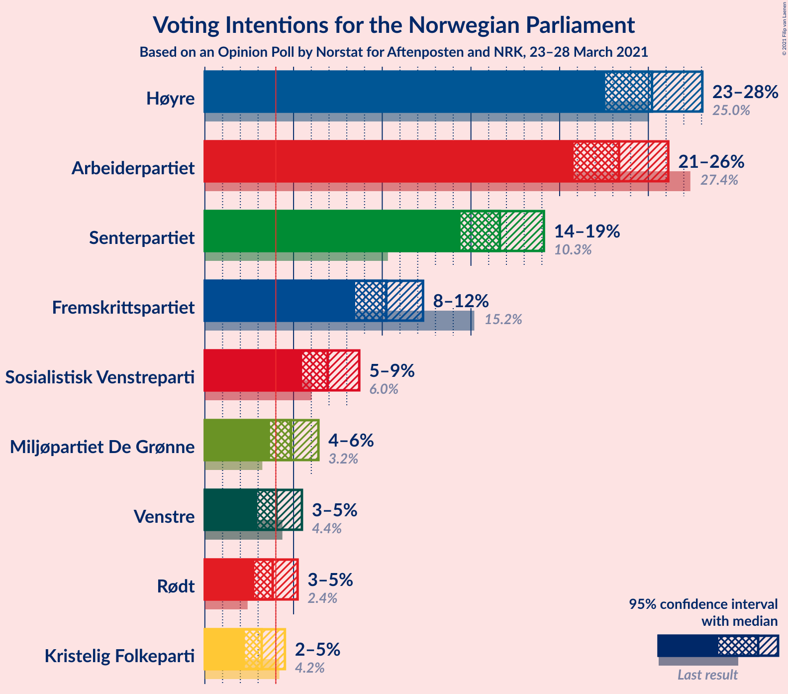

### Confidence Intervals

| Party | Last Result | Poll Result | 80% Confidence Interval | 90% Confidence Interval | 95% Confidence Interval | 99% Confidence Interval |
|:-----:|:-----------:|:-----------:|:-----------------------:|:-----------------------:|:-----------------------:|:-----------------------:|
| Høyre | 25.0% | 25.2% | 23.5–27.1% |23.0–27.6% |22.6–28.0% |21.8–28.9% |
| Arbeiderpartiet | 27.4% | 23.3% | 21.7–25.2% |21.2–25.7% |20.8–26.1% |20.0–27.0% |
| Senterpartiet | 10.3% | 16.6% | 15.2–18.3% |14.8–18.7% |14.4–19.1% |13.7–19.9% |
| Fremskrittspartiet | 15.2% | 10.2% | 9.1–11.6% |8.7–12.0% |8.5–12.3% |7.9–13.0% |
| Sosialistisk Venstreparti | 6.0% | 6.9% | 6.0–8.1% |5.7–8.4% |5.5–8.7% |5.1–9.3% |
| Miljøpartiet De Grønne | 3.2% | 4.9% | 4.1–5.9% |3.9–6.2% |3.7–6.4% |3.3–6.9% |
| Venstre | 4.4% | 4.0% | 3.3–5.0% |3.1–5.2% |3.0–5.5% |2.7–5.9% |
| Rødt | 2.4% | 3.8% | 3.1–4.7% |2.9–5.0% |2.8–5.2% |2.5–5.7% |
| Kristelig Folkeparti | 4.2% | 3.2% | 2.6–4.1% |2.4–4.3% |2.3–4.5% |2.0–5.0% |

*Note:* The poll result column reflects the actual value used in the calculations. Published results may vary slightly, and in addition be rounded to fewer digits.

## Seats

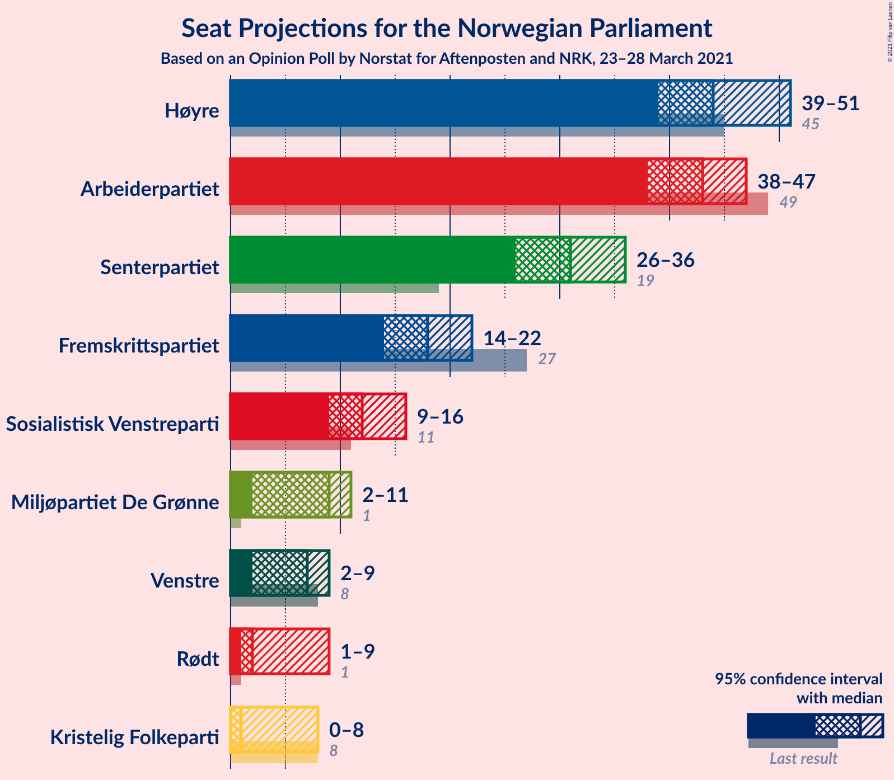

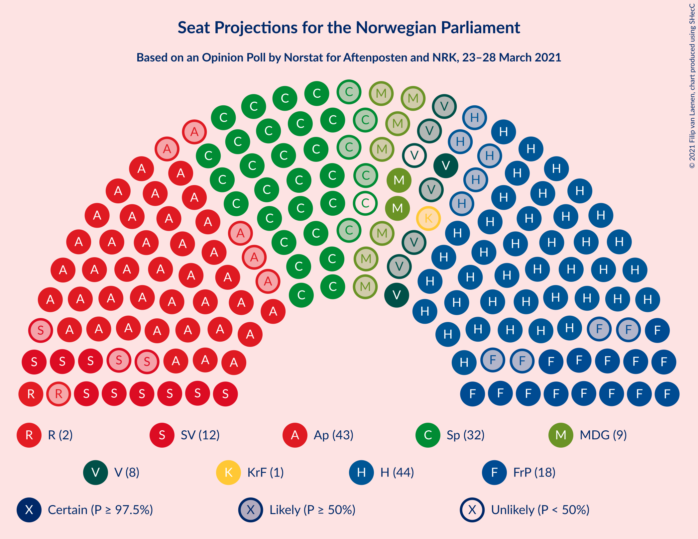

### Confidence Intervals

| Party | Last Result | Median | 80% Confidence Interval | 90% Confidence Interval | 95% Confidence Interval | 99% Confidence Interval |
|:-----:|:-----------:|:------:|:-----------------------:|:-----------------------:|:-----------------------:|:-----------------------:|
| <a href="#høyre">Høyre</a> | 45 | 44 | 41–49 |40–50 |39–51 |37–53 |
| <a href="#arbeiderpartiet">Arbeiderpartiet</a> | 49 | 43 | 40–46 |39–46 |38–47 |36–49 |
| <a href="#senterpartiet">Senterpartiet</a> | 19 | 31 | 28–35 |27–36 |26–36 |24–36 |
| <a href="#fremskrittspartiet">Fremskrittspartiet</a> | 27 | 18 | 16–20 |15–21 |14–22 |13–24 |
| <a href="#sosialistisk-venstreparti">Sosialistisk Venstreparti</a> | 11 | 12 | 10–15 |10–15 |9–16 |9–17 |
| <a href="#miljøpartiet-de-grønne">Miljøpartiet De Grønne</a> | 1 | 9 | 4–10 |3–11 |2–11 |2–12 |
| <a href="#venstre">Venstre</a> | 8 | 7 | 2–8 |2–9 |2–9 |2–10 |
| <a href="#rødt">Rødt</a> | 1 | 2 | 2–8 |2–9 |1–9 |1–10 |
| <a href="#kristelig-folkeparti">Kristelig Folkeparti</a> | 8 | 1 | 1–7 |1–7 |0–8 |0–8 |

### Høyre

*For a full overview of the results for this party, see the [Høyre](party-høyre.html) page.*

| Number of Seats | Probability | Accumulated | Special Marks |
|:---------------:|:-----------:|:-----------:|:-------------:|
| 35 | 0% | 100% |  |
| 36 | 0.1% | 99.9% |  |
| 37 | 0.5% | 99.9% |  |
| 38 | 0.6% | 99.4% |  |
| 39 | 2% | 98.7% |  |
| 40 | 2% | 97% |  |
| 41 | 5% | 95% |  |
| 42 | 10% | 90% |  |
| 43 | 14% | 79% |  |
| 44 | 16% | 65% | Median |
| 45 | 10% | 49% | Last Result |
| 46 | 10% | 39% |  |
| 47 | 6% | 29% |  |
| 48 | 9% | 23% |  |
| 49 | 9% | 14% |  |
| 50 | 2% | 5% |  |
| 51 | 2% | 3% |  |
| 52 | 0.3% | 1.2% |  |
| 53 | 0.5% | 0.8% |  |
| 54 | 0.3% | 0.4% |  |
| 55 | 0% | 0.1% |  |
| 56 | 0% | 0% |  |

### Arbeiderpartiet

*For a full overview of the results for this party, see the [Arbeiderpartiet](party-arbeiderpartiet.html) page.*

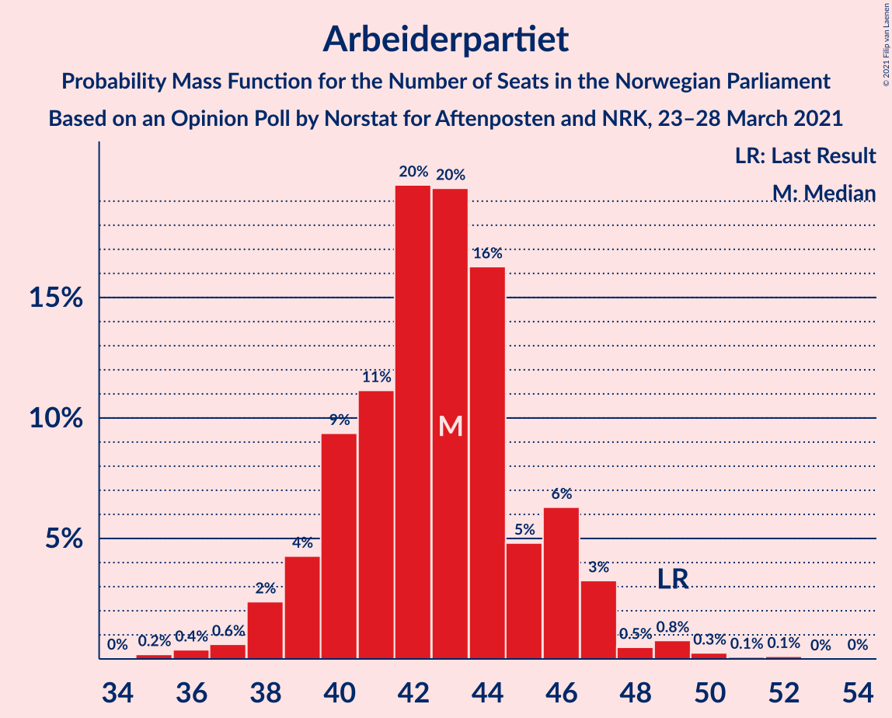

| Number of Seats | Probability | Accumulated | Special Marks |
|:---------------:|:-----------:|:-----------:|:-------------:|
| 34 | 0% | 100% |  |
| 35 | 0.2% | 99.9% |  |
| 36 | 0.4% | 99.7% |  |
| 37 | 0.6% | 99.4% |  |
| 38 | 2% | 98.8% |  |
| 39 | 4% | 96% |  |
| 40 | 9% | 92% |  |
| 41 | 11% | 83% |  |
| 42 | 20% | 72% |  |
| 43 | 20% | 52% | Median |
| 44 | 16% | 32% |  |
| 45 | 5% | 16% |  |
| 46 | 6% | 11% |  |
| 47 | 3% | 5% |  |
| 48 | 0.5% | 2% |  |
| 49 | 0.8% | 1.3% | Last Result |
| 50 | 0.3% | 0.5% |  |
| 51 | 0.1% | 0.2% |  |
| 52 | 0.1% | 0.2% |  |
| 53 | 0% | 0% |  |

### Senterpartiet

*For a full overview of the results for this party, see the [Senterpartiet](party-senterpartiet.html) page.*

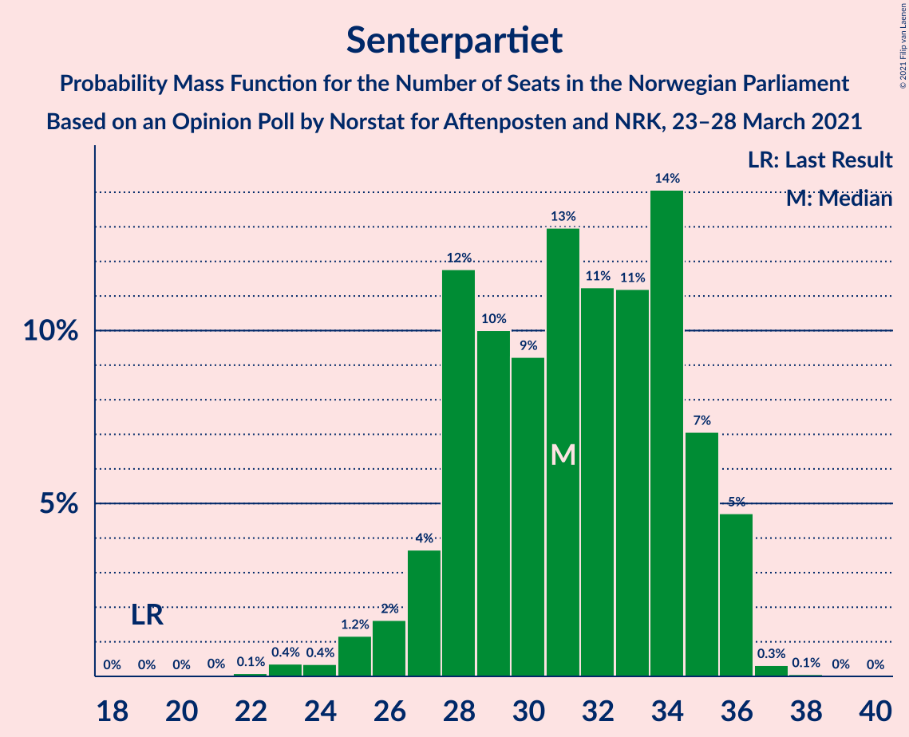

| Number of Seats | Probability | Accumulated | Special Marks |
|:---------------:|:-----------:|:-----------:|:-------------:|
| 19 | 0% | 100% | Last Result |
| 20 | 0% | 100% |  |
| 21 | 0% | 100% |  |
| 22 | 0.1% | 100% |  |
| 23 | 0.4% | 99.9% |  |
| 24 | 0.4% | 99.5% |  |
| 25 | 1.2% | 99.2% |  |
| 26 | 2% | 98% |  |
| 27 | 4% | 96% |  |
| 28 | 12% | 93% |  |
| 29 | 10% | 81% |  |
| 30 | 9% | 71% |  |
| 31 | 13% | 62% | Median |
| 32 | 11% | 49% |  |
| 33 | 11% | 37% |  |
| 34 | 14% | 26% |  |
| 35 | 7% | 12% |  |
| 36 | 5% | 5% |  |
| 37 | 0.3% | 0.4% |  |
| 38 | 0.1% | 0.1% |  |
| 39 | 0% | 0% |  |

### Fremskrittspartiet

*For a full overview of the results for this party, see the [Fremskrittspartiet](party-fremskrittspartiet.html) page.*

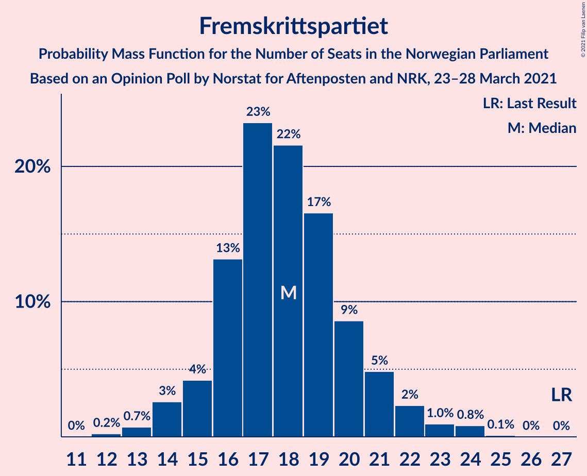

| Number of Seats | Probability | Accumulated | Special Marks |
|:---------------:|:-----------:|:-----------:|:-------------:|
| 12 | 0.2% | 100% |  |
| 13 | 0.7% | 99.7% |  |
| 14 | 3% | 99.0% |  |
| 15 | 4% | 96% |  |
| 16 | 13% | 92% |  |
| 17 | 23% | 79% |  |
| 18 | 22% | 56% | Median |
| 19 | 17% | 34% |  |
| 20 | 9% | 18% |  |
| 21 | 5% | 9% |  |
| 22 | 2% | 4% |  |
| 23 | 1.0% | 2% |  |
| 24 | 0.8% | 1.0% |  |
| 25 | 0.1% | 0.1% |  |
| 26 | 0% | 0% |  |
| 27 | 0% | 0% | Last Result |

### Sosialistisk Venstreparti

*For a full overview of the results for this party, see the [Sosialistisk Venstreparti](party-sosialistiskvenstreparti.html) page.*

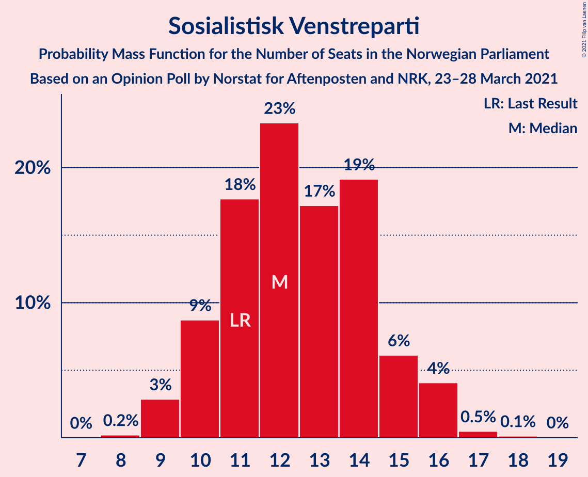

| Number of Seats | Probability | Accumulated | Special Marks |
|:---------------:|:-----------:|:-----------:|:-------------:|
| 8 | 0.2% | 100% |  |
| 9 | 3% | 99.8% |  |
| 10 | 9% | 97% |  |
| 11 | 18% | 88% | Last Result |
| 12 | 23% | 71% | Median |
| 13 | 17% | 47% |  |
| 14 | 19% | 30% |  |
| 15 | 6% | 11% |  |
| 16 | 4% | 5% |  |
| 17 | 0.5% | 0.6% |  |
| 18 | 0.1% | 0.2% |  |
| 19 | 0% | 0% |  |

### Miljøpartiet De Grønne

*For a full overview of the results for this party, see the [Miljøpartiet De Grønne](party-miljøpartietdegrønne.html) page.*

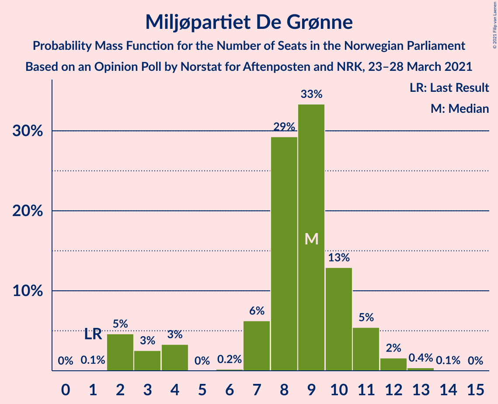

| Number of Seats | Probability | Accumulated | Special Marks |
|:---------------:|:-----------:|:-----------:|:-------------:|
| 1 | 0.1% | 100% | Last Result |
| 2 | 5% | 99.9% |  |
| 3 | 3% | 95% |  |
| 4 | 3% | 93% |  |
| 5 | 0% | 89% |  |
| 6 | 0.2% | 89% |  |
| 7 | 6% | 89% |  |
| 8 | 29% | 83% |  |
| 9 | 33% | 54% | Median |
| 10 | 13% | 20% |  |
| 11 | 5% | 7% |  |
| 12 | 2% | 2% |  |
| 13 | 0.4% | 0.4% |  |
| 14 | 0.1% | 0.1% |  |
| 15 | 0% | 0% |  |

### Venstre

*For a full overview of the results for this party, see the [Venstre](party-venstre.html) page.*

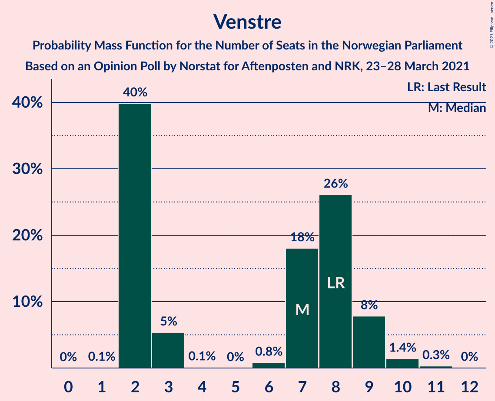

| Number of Seats | Probability | Accumulated | Special Marks |
|:---------------:|:-----------:|:-----------:|:-------------:|
| 1 | 0.1% | 100% |  |
| 2 | 40% | 99.9% |  |
| 3 | 5% | 60% |  |
| 4 | 0.1% | 55% |  |
| 5 | 0% | 55% |  |
| 6 | 0.8% | 55% |  |
| 7 | 18% | 54% | Median |
| 8 | 26% | 36% | Last Result |
| 9 | 8% | 10% |  |
| 10 | 1.4% | 2% |  |
| 11 | 0.3% | 0.4% |  |
| 12 | 0% | 0% |  |

### Rødt

*For a full overview of the results for this party, see the [Rødt](party-rødt.html) page.*

| Number of Seats | Probability | Accumulated | Special Marks |
|:---------------:|:-----------:|:-----------:|:-------------:|
| 1 | 4% | 100% | Last Result |
| 2 | 60% | 96% | Median |
| 3 | 0% | 36% |  |
| 4 | 0% | 36% |  |
| 5 | 0% | 36% |  |
| 6 | 1.4% | 36% |  |
| 7 | 13% | 35% |  |
| 8 | 15% | 22% |  |
| 9 | 5% | 6% |  |
| 10 | 1.2% | 1.3% |  |
| 11 | 0.1% | 0.1% |  |
| 12 | 0% | 0% |  |

### Kristelig Folkeparti

*For a full overview of the results for this party, see the [Kristelig Folkeparti](party-kristeligfolkeparti.html) page.*

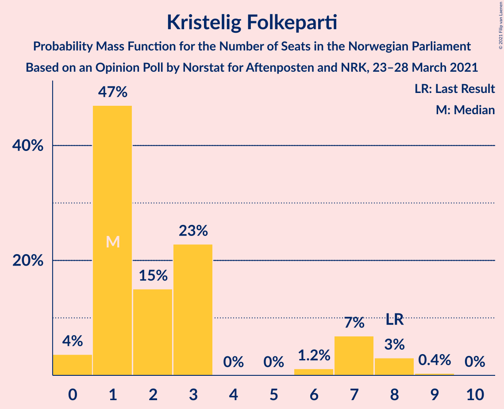

| Number of Seats | Probability | Accumulated | Special Marks |
|:---------------:|:-----------:|:-----------:|:-------------:|
| 0 | 4% | 100% |  |
| 1 | 47% | 96% | Median |
| 2 | 15% | 49% |  |
| 3 | 23% | 34% |  |
| 4 | 0% | 11% |  |
| 5 | 0% | 11% |  |
| 6 | 1.2% | 11% |  |
| 7 | 7% | 10% |  |
| 8 | 3% | 3% | Last Result |
| 9 | 0.4% | 0.4% |  |
| 10 | 0% | 0% |  |

## Coalitions

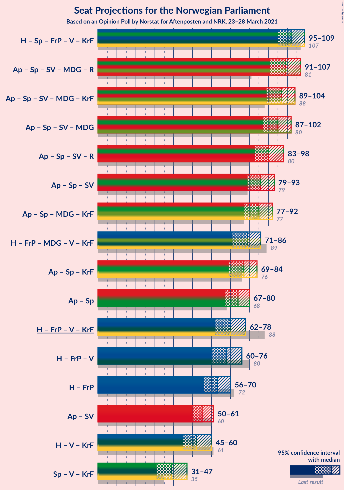

### Confidence Intervals

| Coalition | Last Result | Median | Majority? | 80% Confidence Interval | 90% Confidence Interval | 95% Confidence Interval | 99% Confidence Interval |
|:---------:|:-----------:|:------:|:---------:|:-----------------------:|:-----------------------:|:-----------------------:|:-----------------------:|
| Høyre – Senterpartiet – Fremskrittspartiet – Venstre – Kristelig Folkeparti | 107 | 102 | 100% | 97–106 | 96–108 | 95–109 | 93–112 |
| Arbeiderpartiet – Senterpartiet – Sosialistisk Venstreparti – Miljøpartiet De Grønne – Rødt | 81 | 99 | 100% | 94–104 | 92–106 | 91–107 | 89–109 |
| Arbeiderpartiet – Senterpartiet – Sosialistisk Venstreparti – Miljøpartiet De Grønne – Kristelig Folkeparti | 88 | 97 | 99.9% | 92–102 | 90–103 | 89–104 | 87–106 |
| Arbeiderpartiet – Senterpartiet – Sosialistisk Venstreparti – Miljøpartiet De Grønne | 80 | 95 | 99.4% | 90–99 | 88–101 | 87–102 | 84–103 |
| Arbeiderpartiet – Senterpartiet – Sosialistisk Venstreparti – Rødt | 80 | 90 | 94% | 86–95 | 84–97 | 83–98 | 81–100 |
| Arbeiderpartiet – Senterpartiet – Sosialistisk Venstreparti | 79 | 86 | 68% | 82–91 | 80–92 | 79–93 | 77–94 |
| Arbeiderpartiet – Senterpartiet – Miljøpartiet De Grønne – Kristelig Folkeparti | 77 | 85 | 51% | 80–90 | 78–91 | 77–92 | 75–93 |
| Høyre – Fremskrittspartiet – Miljøpartiet De Grønne – Venstre – Kristelig Folkeparti | 89 | 79 | 6% | 74–83 | 72–85 | 71–86 | 69–88 |
| Arbeiderpartiet – Senterpartiet – Kristelig Folkeparti | 76 | 77 | 1.0% | 71–81 | 70–82 | 69–84 | 67–86 |
| Arbeiderpartiet – Senterpartiet | 68 | 74 | 0.1% | 70–78 | 68–79 | 67–80 | 65–81 |
| Høyre – Fremskrittspartiet – Venstre – Kristelig Folkeparti | 88 | 70 | 0% | 65–75 | 63–77 | 62–78 | 60–80 |
| Høyre – Fremskrittspartiet – Venstre | 80 | 68 | 0% | 63–73 | 61–74 | 60–76 | 58–77 |
| Høyre – Fremskrittspartiet | 72 | 63 | 0% | 58–67 | 57–68 | 56–70 | 53–72 |
| Arbeiderpartiet – Sosialistisk Venstreparti | 60 | 55 | 0% | 51–59 | 50–60 | 50–61 | 48–63 |
| Høyre – Venstre – Kristelig Folkeparti | 61 | 52 | 0% | 47–57 | 46–58 | 45–60 | 43–63 |
| Senterpartiet – Venstre – Kristelig Folkeparti | 35 | 39 | 0% | 34–44 | 32–45 | 31–47 | 30–49 |

### Høyre – Senterpartiet – Fremskrittspartiet – Venstre – Kristelig Folkeparti

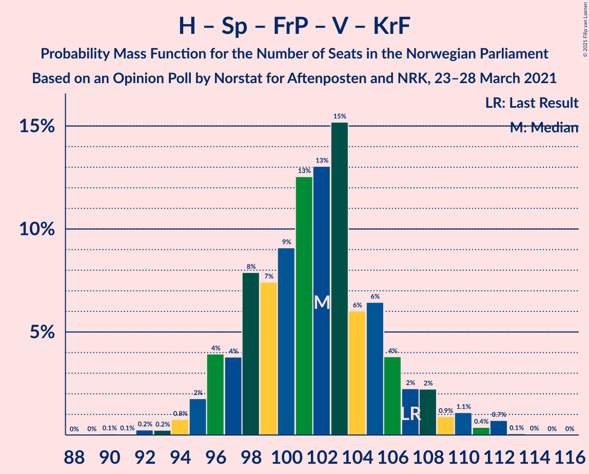

| Number of Seats | Probability | Accumulated | Special Marks |
|:---------------:|:-----------:|:-----------:|:-------------:|
| 90 | 0.1% | 100% |  |
| 91 | 0.1% | 99.9% |  |
| 92 | 0.2% | 99.9% |  |
| 93 | 0.2% | 99.6% |  |
| 94 | 0.8% | 99.4% |  |
| 95 | 2% | 98.6% |  |
| 96 | 4% | 97% |  |
| 97 | 4% | 93% |  |
| 98 | 8% | 89% |  |
| 99 | 7% | 81% |  |
| 100 | 9% | 74% |  |
| 101 | 13% | 65% | Median |
| 102 | 13% | 52% |  |
| 103 | 15% | 39% |  |
| 104 | 6% | 24% |  |
| 105 | 6% | 18% |  |
| 106 | 4% | 11% |  |
| 107 | 2% | 8% | Last Result |
| 108 | 2% | 5% |  |
| 109 | 0.9% | 3% |  |
| 110 | 1.1% | 2% |  |
| 111 | 0.4% | 1.2% |  |
| 112 | 0.7% | 0.8% |  |
| 113 | 0.1% | 0.1% |  |
| 114 | 0% | 0.1% |  |
| 115 | 0% | 0% |  |

### Arbeiderpartiet – Senterpartiet – Sosialistisk Venstreparti – Miljøpartiet De Grønne – Rødt

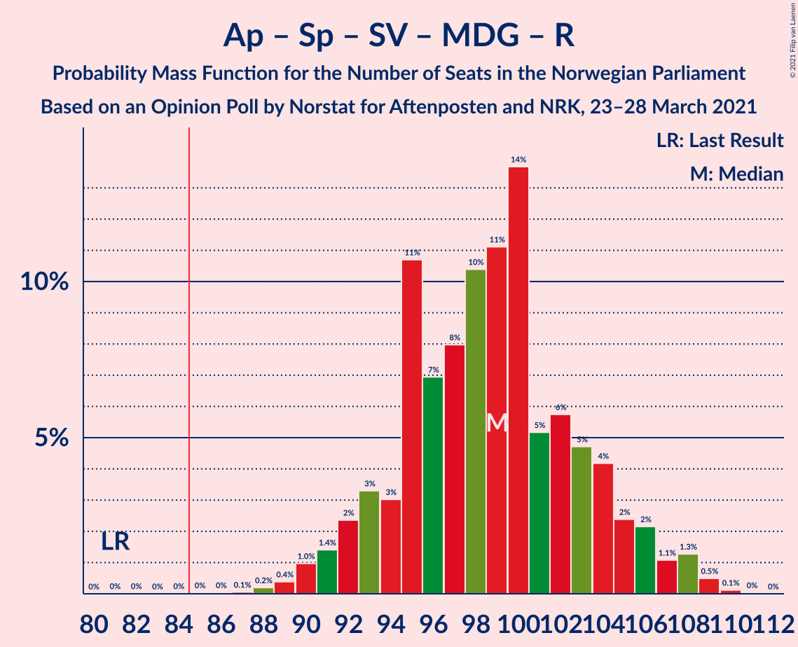

| Number of Seats | Probability | Accumulated | Special Marks |
|:---------------:|:-----------:|:-----------:|:-------------:|
| 81 | 0% | 100% | Last Result |
| 82 | 0% | 100% |  |
| 83 | 0% | 100% |  |
| 84 | 0% | 100% |  |
| 85 | 0% | 100% | Majority |
| 86 | 0% | 99.9% |  |
| 87 | 0.1% | 99.9% |  |
| 88 | 0.2% | 99.8% |  |
| 89 | 0.4% | 99.6% |  |
| 90 | 1.0% | 99.2% |  |
| 91 | 1.4% | 98% |  |
| 92 | 2% | 97% |  |
| 93 | 3% | 95% |  |
| 94 | 3% | 91% |  |
| 95 | 11% | 88% |  |
| 96 | 7% | 77% |  |
| 97 | 8% | 71% | Median |
| 98 | 10% | 63% |  |
| 99 | 11% | 52% |  |
| 100 | 14% | 41% |  |
| 101 | 5% | 27% |  |
| 102 | 6% | 22% |  |
| 103 | 5% | 16% |  |
| 104 | 4% | 12% |  |
| 105 | 2% | 8% |  |
| 106 | 2% | 5% |  |
| 107 | 1.1% | 3% |  |
| 108 | 1.3% | 2% |  |
| 109 | 0.5% | 0.7% |  |
| 110 | 0.1% | 0.2% |  |
| 111 | 0% | 0% |  |

### Arbeiderpartiet – Senterpartiet – Sosialistisk Venstreparti – Miljøpartiet De Grønne – Kristelig Folkeparti

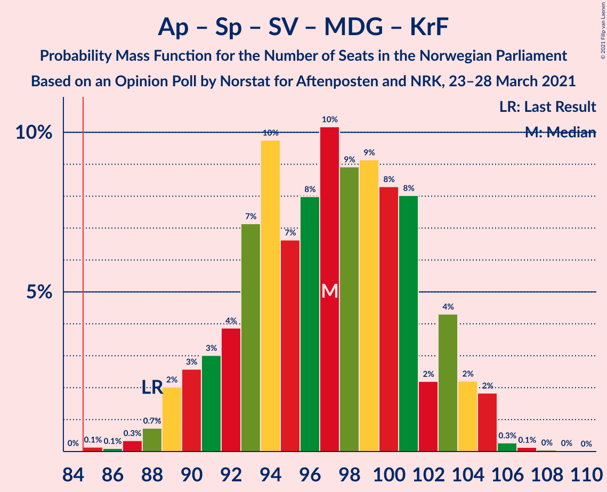

| Number of Seats | Probability | Accumulated | Special Marks |
|:---------------:|:-----------:|:-----------:|:-------------:|
| 84 | 0% | 100% |  |
| 85 | 0.1% | 99.9% | Majority |
| 86 | 0.1% | 99.8% |  |
| 87 | 0.3% | 99.7% |  |
| 88 | 0.7% | 99.3% | Last Result |
| 89 | 2% | 98.6% |  |
| 90 | 3% | 97% |  |
| 91 | 3% | 94% |  |
| 92 | 4% | 91% |  |
| 93 | 7% | 87% |  |
| 94 | 10% | 80% |  |
| 95 | 7% | 70% |  |
| 96 | 8% | 64% | Median |
| 97 | 10% | 56% |  |
| 98 | 9% | 45% |  |
| 99 | 9% | 37% |  |
| 100 | 8% | 27% |  |
| 101 | 8% | 19% |  |
| 102 | 2% | 11% |  |
| 103 | 4% | 9% |  |
| 104 | 2% | 5% |  |
| 105 | 2% | 2% |  |
| 106 | 0.3% | 0.5% |  |
| 107 | 0.1% | 0.2% |  |
| 108 | 0% | 0.1% |  |
| 109 | 0% | 0% |  |

### Arbeiderpartiet – Senterpartiet – Sosialistisk Venstreparti – Miljøpartiet De Grønne

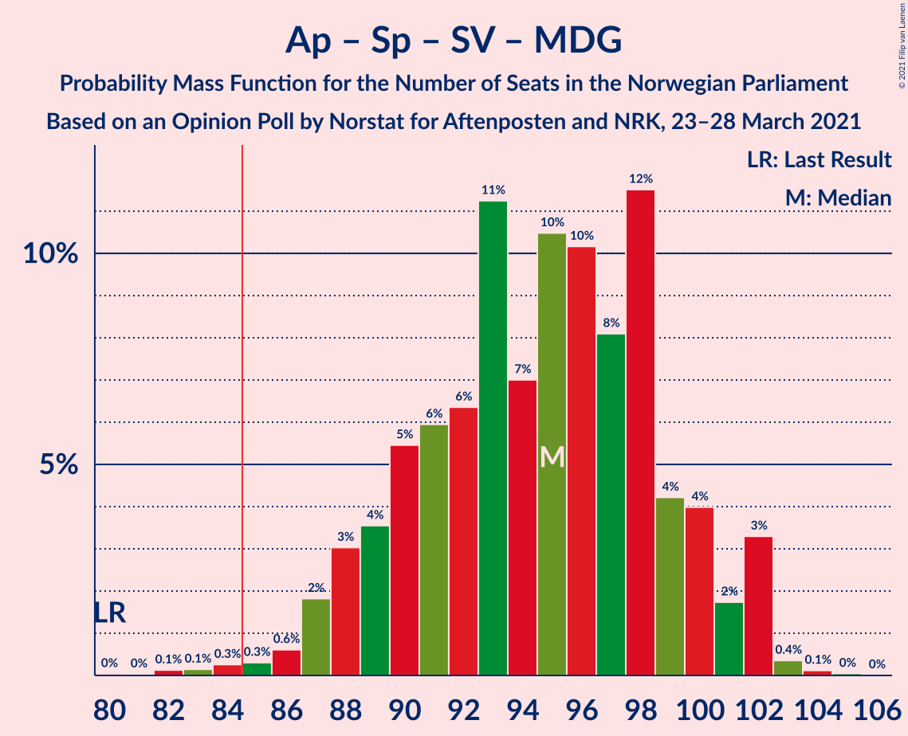

| Number of Seats | Probability | Accumulated | Special Marks |
|:---------------:|:-----------:|:-----------:|:-------------:|
| 80 | 0% | 100% | Last Result |
| 81 | 0% | 99.9% |  |
| 82 | 0.1% | 99.9% |  |
| 83 | 0.1% | 99.8% |  |
| 84 | 0.3% | 99.6% |  |
| 85 | 0.3% | 99.4% | Majority |
| 86 | 0.6% | 99.1% |  |
| 87 | 2% | 98% |  |
| 88 | 3% | 97% |  |
| 89 | 4% | 94% |  |
| 90 | 5% | 90% |  |
| 91 | 6% | 85% |  |
| 92 | 6% | 79% |  |
| 93 | 11% | 72% |  |
| 94 | 7% | 61% |  |
| 95 | 10% | 54% | Median |
| 96 | 10% | 44% |  |
| 97 | 8% | 33% |  |
| 98 | 12% | 25% |  |
| 99 | 4% | 14% |  |
| 100 | 4% | 10% |  |
| 101 | 2% | 6% |  |
| 102 | 3% | 4% |  |
| 103 | 0.4% | 0.5% |  |
| 104 | 0.1% | 0.2% |  |
| 105 | 0% | 0.1% |  |
| 106 | 0% | 0% |  |

### Arbeiderpartiet – Senterpartiet – Sosialistisk Venstreparti – Rødt

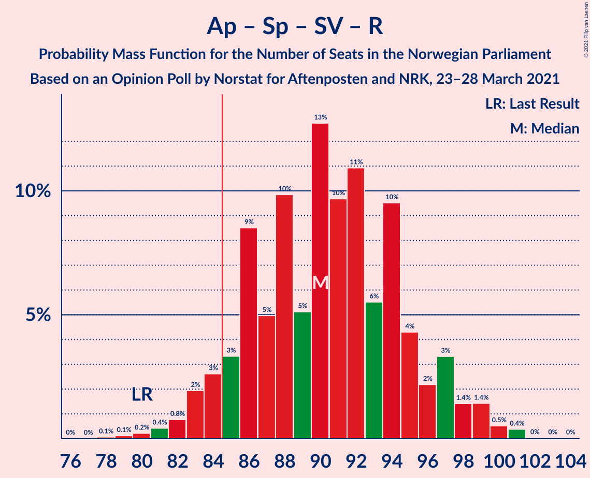

| Number of Seats | Probability | Accumulated | Special Marks |
|:---------------:|:-----------:|:-----------:|:-------------:|
| 78 | 0.1% | 100% |  |
| 79 | 0.1% | 99.9% |  |
| 80 | 0.2% | 99.8% | Last Result |
| 81 | 0.4% | 99.6% |  |
| 82 | 0.8% | 99.1% |  |
| 83 | 2% | 98% |  |
| 84 | 3% | 96% |  |
| 85 | 3% | 94% | Majority |
| 86 | 9% | 90% |  |
| 87 | 5% | 82% |  |
| 88 | 10% | 77% | Median |
| 89 | 5% | 67% |  |
| 90 | 13% | 62% |  |
| 91 | 10% | 49% |  |
| 92 | 11% | 40% |  |
| 93 | 6% | 29% |  |
| 94 | 10% | 23% |  |
| 95 | 4% | 14% |  |
| 96 | 2% | 9% |  |
| 97 | 3% | 7% |  |
| 98 | 1.4% | 4% |  |
| 99 | 1.4% | 2% |  |
| 100 | 0.5% | 1.0% |  |
| 101 | 0.4% | 0.5% |  |
| 102 | 0% | 0.1% |  |
| 103 | 0% | 0.1% |  |
| 104 | 0% | 0% |  |

### Arbeiderpartiet – Senterpartiet – Sosialistisk Venstreparti

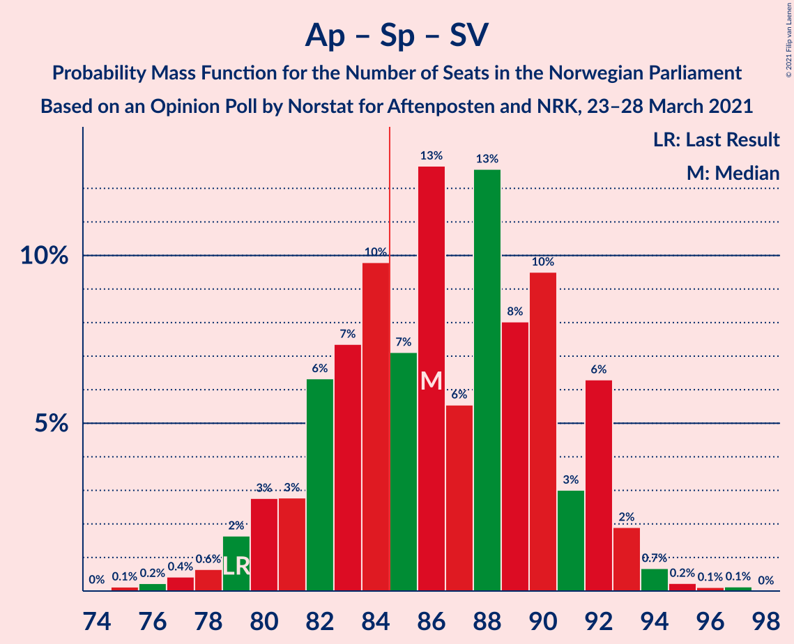

| Number of Seats | Probability | Accumulated | Special Marks |
|:---------------:|:-----------:|:-----------:|:-------------:|
| 74 | 0% | 100% |  |
| 75 | 0.1% | 99.9% |  |
| 76 | 0.2% | 99.8% |  |
| 77 | 0.4% | 99.6% |  |
| 78 | 0.6% | 99.2% |  |
| 79 | 2% | 98.5% | Last Result |
| 80 | 3% | 97% |  |
| 81 | 3% | 94% |  |
| 82 | 6% | 91% |  |
| 83 | 7% | 85% |  |
| 84 | 10% | 78% |  |
| 85 | 7% | 68% | Majority |
| 86 | 13% | 61% | Median |
| 87 | 6% | 48% |  |
| 88 | 13% | 42% |  |
| 89 | 8% | 30% |  |
| 90 | 10% | 22% |  |
| 91 | 3% | 12% |  |
| 92 | 6% | 9% |  |
| 93 | 2% | 3% |  |
| 94 | 0.7% | 1.2% |  |
| 95 | 0.2% | 0.5% |  |
| 96 | 0.1% | 0.3% |  |
| 97 | 0.1% | 0.2% |  |
| 98 | 0% | 0% |  |

### Arbeiderpartiet – Senterpartiet – Miljøpartiet De Grønne – Kristelig Folkeparti

| Number of Seats | Probability | Accumulated | Special Marks |
|:---------------:|:-----------:|:-----------:|:-------------:|
| 71 | 0% | 100% |  |
| 72 | 0.1% | 99.9% |  |
| 73 | 0.1% | 99.9% |  |
| 74 | 0.1% | 99.8% |  |
| 75 | 0.4% | 99.6% |  |
| 76 | 0.6% | 99.3% |  |
| 77 | 3% | 98.7% | Last Result |
| 78 | 2% | 95% |  |
| 79 | 3% | 94% |  |
| 80 | 12% | 90% |  |
| 81 | 6% | 78% |  |
| 82 | 5% | 72% |  |
| 83 | 9% | 67% |  |
| 84 | 6% | 58% | Median |
| 85 | 10% | 51% | Majority |
| 86 | 7% | 41% |  |
| 87 | 12% | 35% |  |
| 88 | 6% | 23% |  |
| 89 | 6% | 17% |  |
| 90 | 4% | 11% |  |
| 91 | 3% | 7% |  |
| 92 | 3% | 4% |  |
| 93 | 0.5% | 0.9% |  |
| 94 | 0.2% | 0.4% |  |
| 95 | 0.1% | 0.2% |  |
| 96 | 0.1% | 0.1% |  |
| 97 | 0% | 0% |  |

### Høyre – Fremskrittspartiet – Miljøpartiet De Grønne – Venstre – Kristelig Folkeparti

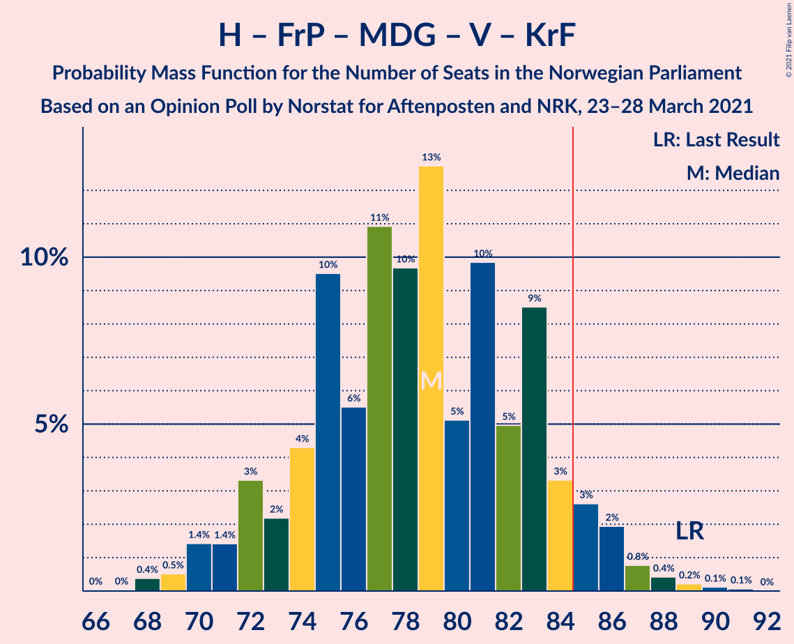

| Number of Seats | Probability | Accumulated | Special Marks |
|:---------------:|:-----------:|:-----------:|:-------------:|
| 66 | 0% | 100% |  |
| 67 | 0% | 99.9% |  |
| 68 | 0.4% | 99.9% |  |
| 69 | 0.5% | 99.5% |  |
| 70 | 1.4% | 99.0% |  |
| 71 | 1.4% | 98% |  |
| 72 | 3% | 96% |  |
| 73 | 2% | 93% |  |
| 74 | 4% | 91% |  |
| 75 | 10% | 86% |  |
| 76 | 6% | 77% |  |
| 77 | 11% | 71% |  |
| 78 | 10% | 60% |  |
| 79 | 13% | 51% | Median |
| 80 | 5% | 38% |  |
| 81 | 10% | 33% |  |
| 82 | 5% | 23% |  |
| 83 | 9% | 18% |  |
| 84 | 3% | 10% |  |
| 85 | 3% | 6% | Majority |
| 86 | 2% | 4% |  |
| 87 | 0.8% | 2% |  |
| 88 | 0.4% | 0.9% |  |
| 89 | 0.2% | 0.4% | Last Result |
| 90 | 0.1% | 0.2% |  |
| 91 | 0.1% | 0.1% |  |
| 92 | 0% | 0% |  |

### Arbeiderpartiet – Senterpartiet – Kristelig Folkeparti

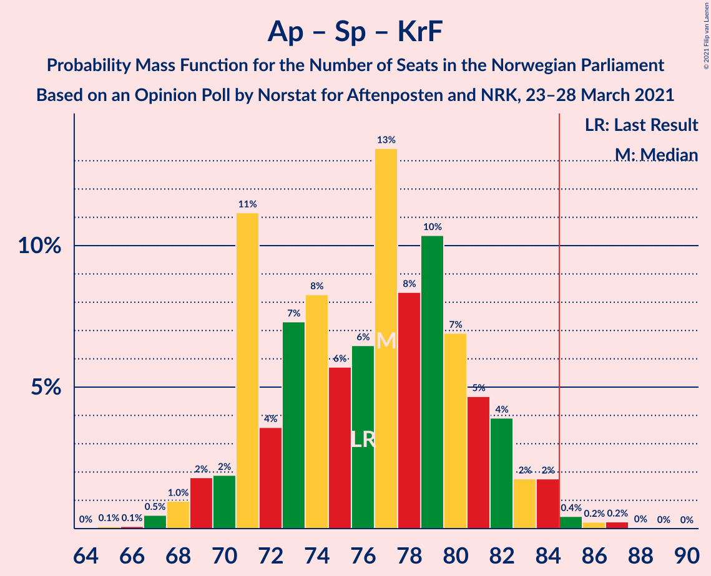

| Number of Seats | Probability | Accumulated | Special Marks |
|:---------------:|:-----------:|:-----------:|:-------------:|
| 65 | 0.1% | 100% |  |
| 66 | 0.1% | 99.9% |  |
| 67 | 0.5% | 99.8% |  |
| 68 | 1.0% | 99.3% |  |
| 69 | 2% | 98% |  |
| 70 | 2% | 97% |  |
| 71 | 11% | 95% |  |
| 72 | 4% | 83% |  |
| 73 | 7% | 80% |  |
| 74 | 8% | 73% |  |
| 75 | 6% | 64% | Median |
| 76 | 6% | 59% | Last Result |
| 77 | 13% | 52% |  |
| 78 | 8% | 39% |  |
| 79 | 10% | 30% |  |
| 80 | 7% | 20% |  |
| 81 | 5% | 13% |  |
| 82 | 4% | 8% |  |
| 83 | 2% | 4% |  |
| 84 | 2% | 3% |  |
| 85 | 0.4% | 1.0% | Majority |
| 86 | 0.2% | 0.5% |  |
| 87 | 0.2% | 0.3% |  |
| 88 | 0% | 0.1% |  |
| 89 | 0% | 0% |  |

### Arbeiderpartiet – Senterpartiet

| Number of Seats | Probability | Accumulated | Special Marks |
|:---------------:|:-----------:|:-----------:|:-------------:|
| 63 | 0% | 100% |  |
| 64 | 0.2% | 99.9% |  |
| 65 | 0.6% | 99.7% |  |
| 66 | 1.4% | 99.2% |  |
| 67 | 2% | 98% |  |
| 68 | 2% | 96% | Last Result |
| 69 | 3% | 94% |  |
| 70 | 14% | 91% |  |
| 71 | 6% | 77% |  |
| 72 | 10% | 72% |  |
| 73 | 5% | 62% |  |
| 74 | 9% | 56% | Median |
| 75 | 6% | 47% |  |
| 76 | 14% | 41% |  |
| 77 | 10% | 28% |  |
| 78 | 12% | 18% |  |
| 79 | 3% | 6% |  |
| 80 | 2% | 3% |  |
| 81 | 0.8% | 1.2% |  |
| 82 | 0.1% | 0.4% |  |
| 83 | 0.2% | 0.3% |  |
| 84 | 0% | 0.1% |  |
| 85 | 0.1% | 0.1% | Majority |
| 86 | 0% | 0% |  |

### Høyre – Fremskrittspartiet – Venstre – Kristelig Folkeparti

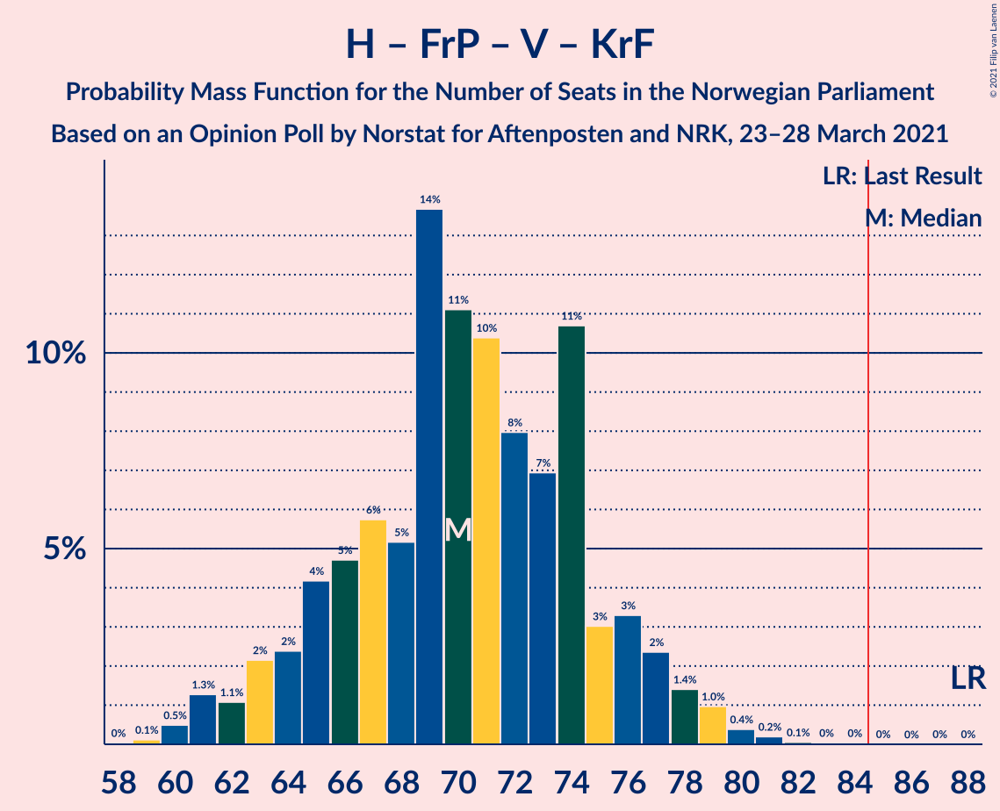

| Number of Seats | Probability | Accumulated | Special Marks |
|:---------------:|:-----------:|:-----------:|:-------------:|
| 59 | 0.1% | 100% |  |
| 60 | 0.5% | 99.8% |  |
| 61 | 1.3% | 99.3% |  |
| 62 | 1.1% | 98% |  |
| 63 | 2% | 97% |  |
| 64 | 2% | 95% |  |
| 65 | 4% | 92% |  |
| 66 | 5% | 88% |  |
| 67 | 6% | 84% |  |
| 68 | 5% | 78% |  |
| 69 | 14% | 73% |  |
| 70 | 11% | 59% | Median |
| 71 | 10% | 48% |  |
| 72 | 8% | 37% |  |
| 73 | 7% | 29% |  |
| 74 | 11% | 23% |  |
| 75 | 3% | 12% |  |
| 76 | 3% | 9% |  |
| 77 | 2% | 5% |  |
| 78 | 1.4% | 3% |  |
| 79 | 1.0% | 2% |  |
| 80 | 0.4% | 0.8% |  |
| 81 | 0.2% | 0.4% |  |
| 82 | 0.1% | 0.2% |  |
| 83 | 0% | 0.1% |  |
| 84 | 0% | 0.1% |  |
| 85 | 0% | 0% | Majority |
| 86 | 0% | 0% |  |
| 87 | 0% | 0% |  |
| 88 | 0% | 0% | Last Result |

### Høyre – Fremskrittspartiet – Venstre

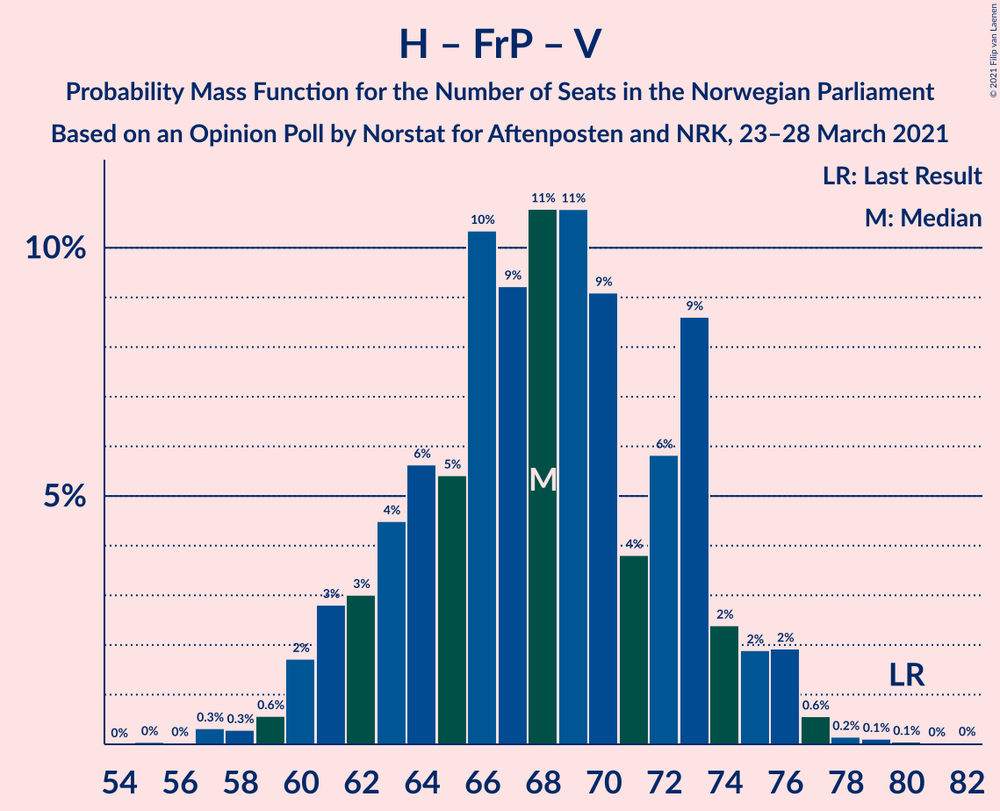

| Number of Seats | Probability | Accumulated | Special Marks |
|:---------------:|:-----------:|:-----------:|:-------------:|
| 55 | 0% | 100% |  |
| 56 | 0% | 99.9% |  |
| 57 | 0.3% | 99.9% |  |
| 58 | 0.3% | 99.6% |  |
| 59 | 0.6% | 99.3% |  |
| 60 | 2% | 98.7% |  |
| 61 | 3% | 97% |  |
| 62 | 3% | 94% |  |
| 63 | 4% | 91% |  |
| 64 | 6% | 87% |  |
| 65 | 5% | 81% |  |
| 66 | 10% | 76% |  |
| 67 | 9% | 65% |  |
| 68 | 11% | 56% |  |
| 69 | 11% | 45% | Median |
| 70 | 9% | 35% |  |
| 71 | 4% | 25% |  |
| 72 | 6% | 22% |  |
| 73 | 9% | 16% |  |
| 74 | 2% | 7% |  |
| 75 | 2% | 5% |  |
| 76 | 2% | 3% |  |
| 77 | 0.6% | 0.9% |  |
| 78 | 0.2% | 0.4% |  |
| 79 | 0.1% | 0.2% |  |
| 80 | 0.1% | 0.1% | Last Result |
| 81 | 0% | 0.1% |  |
| 82 | 0% | 0% |  |

### Høyre – Fremskrittspartiet

| Number of Seats | Probability | Accumulated | Special Marks |
|:---------------:|:-----------:|:-----------:|:-------------:|
| 52 | 0.1% | 100% |  |
| 53 | 0.4% | 99.9% |  |
| 54 | 0.3% | 99.5% |  |
| 55 | 1.1% | 99.1% |  |
| 56 | 2% | 98% |  |
| 57 | 3% | 96% |  |
| 58 | 5% | 93% |  |
| 59 | 6% | 88% |  |
| 60 | 9% | 82% |  |
| 61 | 12% | 73% |  |
| 62 | 10% | 61% | Median |
| 63 | 8% | 52% |  |
| 64 | 11% | 44% |  |
| 65 | 7% | 33% |  |
| 66 | 12% | 26% |  |
| 67 | 6% | 14% |  |
| 68 | 4% | 8% |  |
| 69 | 1.0% | 4% |  |
| 70 | 1.1% | 3% |  |
| 71 | 1.1% | 2% |  |
| 72 | 0.3% | 0.7% | Last Result |
| 73 | 0.3% | 0.4% |  |
| 74 | 0% | 0.1% |  |
| 75 | 0.1% | 0.1% |  |
| 76 | 0% | 0% |  |

### Arbeiderpartiet – Sosialistisk Venstreparti

| Number of Seats | Probability | Accumulated | Special Marks |
|:---------------:|:-----------:|:-----------:|:-------------:|
| 46 | 0.1% | 100% |  |
| 47 | 0.2% | 99.9% |  |
| 48 | 0.3% | 99.7% |  |
| 49 | 2% | 99.4% |  |
| 50 | 4% | 98% |  |
| 51 | 4% | 94% |  |
| 52 | 9% | 89% |  |
| 53 | 7% | 81% |  |
| 54 | 11% | 73% |  |
| 55 | 17% | 62% | Median |
| 56 | 16% | 45% |  |
| 57 | 13% | 29% |  |
| 58 | 4% | 15% |  |
| 59 | 3% | 11% |  |
| 60 | 4% | 8% | Last Result |
| 61 | 2% | 4% |  |
| 62 | 1.2% | 2% |  |
| 63 | 0.2% | 0.5% |  |
| 64 | 0.1% | 0.3% |  |
| 65 | 0.1% | 0.2% |  |
| 66 | 0% | 0.1% |  |
| 67 | 0% | 0% |  |

### Høyre – Venstre – Kristelig Folkeparti

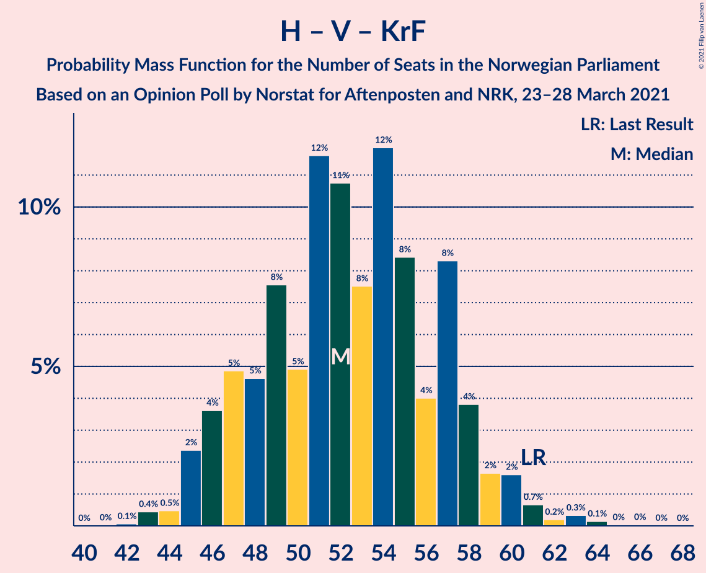

| Number of Seats | Probability | Accumulated | Special Marks |
|:---------------:|:-----------:|:-----------:|:-------------:|
| 42 | 0.1% | 100% |  |
| 43 | 0.4% | 99.9% |  |
| 44 | 0.5% | 99.5% |  |
| 45 | 2% | 99.0% |  |
| 46 | 4% | 97% |  |
| 47 | 5% | 93% |  |
| 48 | 5% | 88% |  |
| 49 | 8% | 83% |  |
| 50 | 5% | 76% |  |
| 51 | 12% | 71% |  |
| 52 | 11% | 59% | Median |
| 53 | 8% | 49% |  |
| 54 | 12% | 41% |  |
| 55 | 8% | 29% |  |
| 56 | 4% | 21% |  |
| 57 | 8% | 17% |  |
| 58 | 4% | 9% |  |
| 59 | 2% | 5% |  |
| 60 | 2% | 3% |  |
| 61 | 0.7% | 1.4% | Last Result |
| 62 | 0.2% | 0.8% |  |
| 63 | 0.3% | 0.6% |  |
| 64 | 0.1% | 0.2% |  |
| 65 | 0% | 0.1% |  |
| 66 | 0% | 0.1% |  |
| 67 | 0% | 0% |  |

### Senterpartiet – Venstre – Kristelig Folkeparti

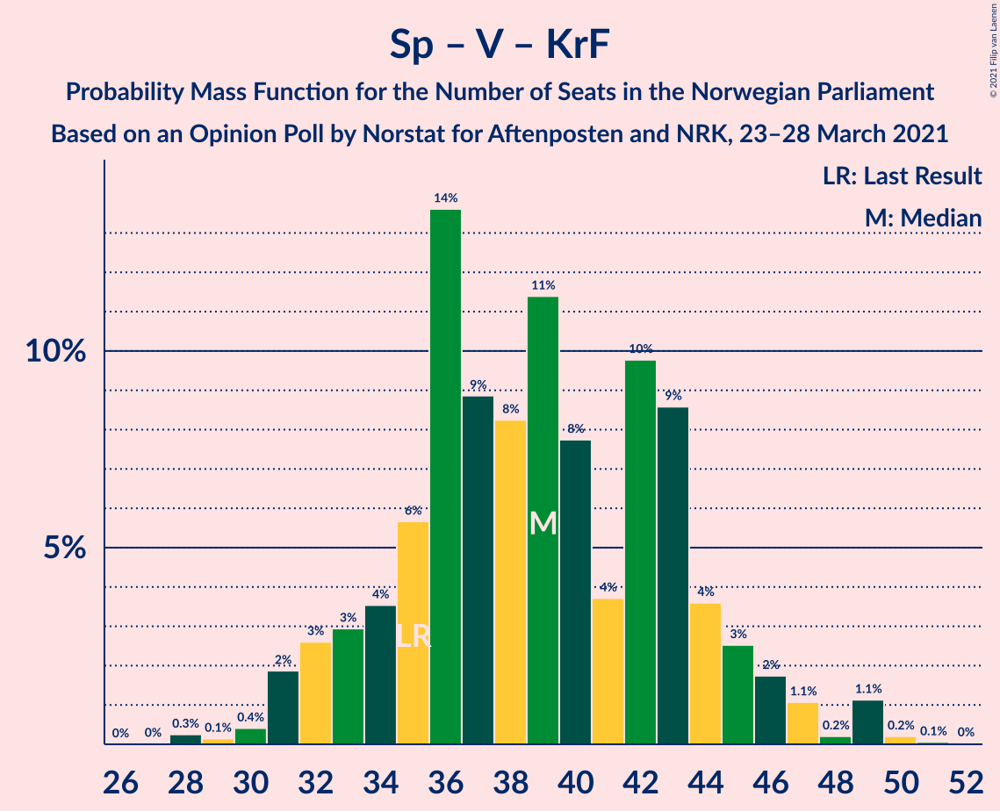

| Number of Seats | Probability | Accumulated | Special Marks |
|:---------------:|:-----------:|:-----------:|:-------------:|
| 28 | 0.3% | 100% |  |
| 29 | 0.1% | 99.7% |  |
| 30 | 0.4% | 99.6% |  |
| 31 | 2% | 99.2% |  |
| 32 | 3% | 97% |  |
| 33 | 3% | 95% |  |
| 34 | 4% | 92% |  |
| 35 | 6% | 88% | Last Result |
| 36 | 14% | 83% |  |
| 37 | 9% | 69% |  |
| 38 | 8% | 60% |  |
| 39 | 11% | 52% | Median |
| 40 | 8% | 40% |  |
| 41 | 4% | 33% |  |
| 42 | 10% | 29% |  |
| 43 | 9% | 19% |  |
| 44 | 4% | 11% |  |
| 45 | 3% | 7% |  |
| 46 | 2% | 4% |  |
| 47 | 1.1% | 3% |  |
| 48 | 0.2% | 2% |  |
| 49 | 1.1% | 1.4% |  |
| 50 | 0.2% | 0.3% |  |
| 51 | 0.1% | 0.1% |  |
| 52 | 0% | 0% |  |

## Technical Information

### Opinion Poll

+ **Polling firm:** Norstat
+ **Commissioner(s):** Aftenposten and NRK
+ **Fieldwork period:** 23–28 March 2021

### Calculations

+ **Sample size:** 968
+ **Simulations done:** 1,048,576
+ **Error estimate:** 2.79%

