# Opinion Poll by Kantar TNS for TV2, 29 March–7 April 2021

<a href="#voting-intentions">Voting Intentions</a> | <a href="#seats">Seats</a> | <a href="#coalitions">Coalitions</a> | <a href="#technical-information">Technical Information</a>

## Voting Intentions

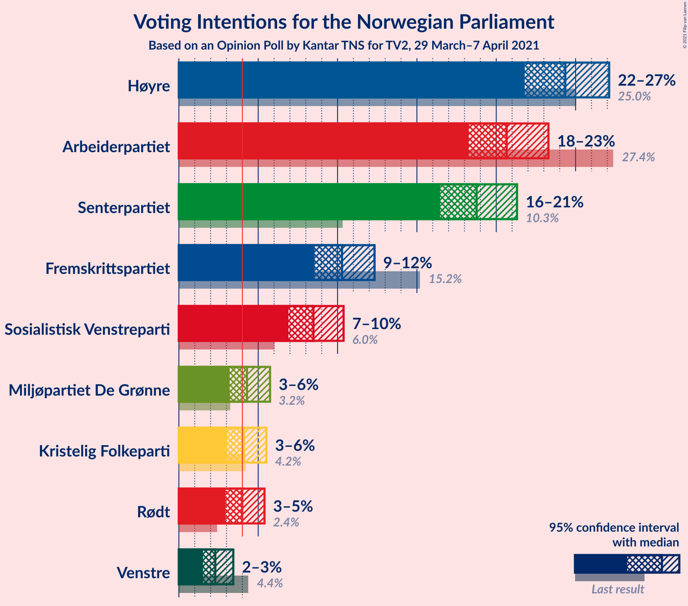

### Confidence Intervals

| Party | Last Result | Poll Result | 80% Confidence Interval | 90% Confidence Interval | 95% Confidence Interval | 99% Confidence Interval |
|:-----:|:-----------:|:-----------:|:-----------------------:|:-----------------------:|:-----------------------:|:-----------------------:|
| Høyre | 25.0% | 24.4% | 22.7–26.2% |22.2–26.7% |21.8–27.1% |21.0–28.0% |
| Arbeiderpartiet | 27.4% | 20.7% | 19.1–22.4% |18.6–22.9% |18.3–23.3% |17.5–24.1% |
| Senterpartiet | 10.3% | 18.8% | 17.3–20.4% |16.8–20.9% |16.5–21.3% |15.8–22.1% |
| Fremskrittspartiet | 15.2% | 10.3% | 9.1–11.6% |8.8–12.0% |8.6–12.3% |8.0–13.0% |
| Sosialistisk Venstreparti | 6.0% | 8.5% | 7.5–9.7% |7.1–10.1% |6.9–10.4% |6.4–11.0% |
| Miljøpartiet De Grønne | 3.2% | 4.3% | 3.6–5.2% |3.4–5.5% |3.2–5.7% |2.9–6.2% |
| Kristelig Folkeparti | 4.2% | 4.1% | 3.4–5.0% |3.2–5.3% |3.0–5.5% |2.7–6.0% |
| Rødt | 2.4% | 4.0% | 3.3–4.9% |3.1–5.2% |2.9–5.4% |2.6–5.9% |
| Venstre | 4.4% | 2.3% | 1.8–3.0% |1.6–3.2% |1.5–3.4% |1.3–3.8% |

*Note:* The poll result column reflects the actual value used in the calculations. Published results may vary slightly, and in addition be rounded to fewer digits.

## Seats

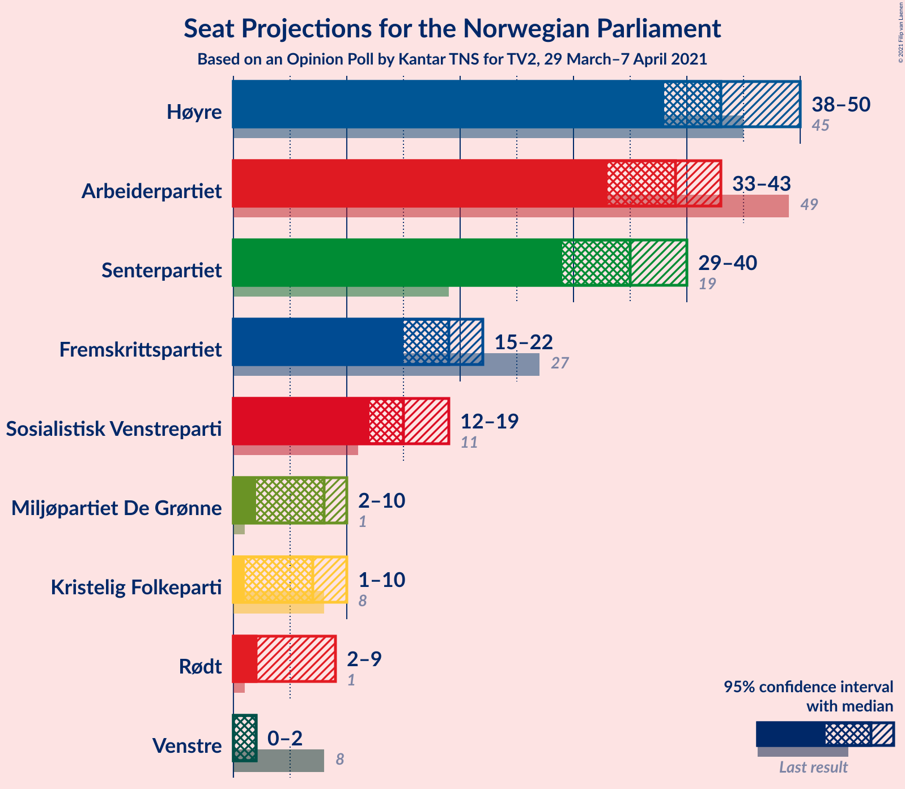

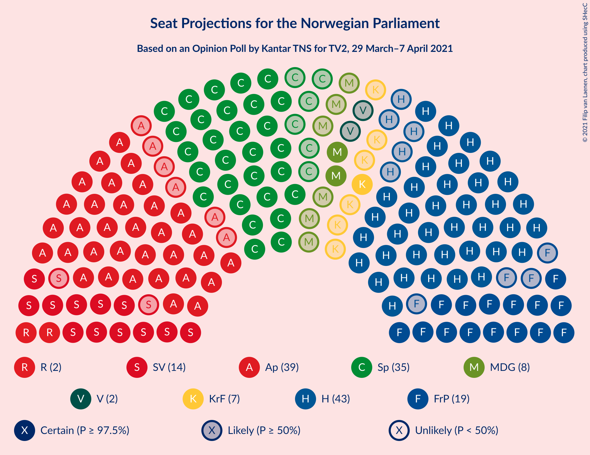

### Confidence Intervals

| Party | Last Result | Median | 80% Confidence Interval | 90% Confidence Interval | 95% Confidence Interval | 99% Confidence Interval |
|:-----:|:-----------:|:------:|:-----------------------:|:-----------------------:|:-----------------------:|:-----------------------:|
| <a href="#høyre">Høyre</a> | 45 | 43 | 40–48 |39–49 |38–50 |36–51 |
| <a href="#arbeiderpartiet">Arbeiderpartiet</a> | 49 | 39 | 34–41 |33–42 |33–43 |31–44 |
| <a href="#senterpartiet">Senterpartiet</a> | 19 | 35 | 31–37 |31–38 |29–40 |28–42 |
| <a href="#fremskrittspartiet">Fremskrittspartiet</a> | 27 | 19 | 16–21 |15–22 |15–22 |14–24 |
| <a href="#sosialistisk-venstreparti">Sosialistisk Venstreparti</a> | 11 | 15 | 13–17 |12–18 |12–19 |11–20 |
| <a href="#miljøpartiet-de-grønne">Miljøpartiet De Grønne</a> | 1 | 8 | 2–9 |2–10 |2–10 |1–11 |
| <a href="#kristelig-folkeparti">Kristelig Folkeparti</a> | 8 | 7 | 2–9 |1–9 |1–10 |1–10 |
| <a href="#rødt">Rødt</a> | 1 | 2 | 2–9 |2–9 |2–9 |1–11 |
| <a href="#venstre">Venstre</a> | 8 | 2 | 1–2 |0–2 |0–2 |0–2 |

### Høyre

*For a full overview of the results for this party, see the [Høyre](party-høyre.html) page.*

| Number of Seats | Probability | Accumulated | Special Marks |
|:---------------:|:-----------:|:-----------:|:-------------:|
| 35 | 0.2% | 100% |  |
| 36 | 0.8% | 99.8% |  |
| 37 | 1.3% | 99.0% |  |
| 38 | 1.2% | 98% |  |
| 39 | 3% | 97% |  |
| 40 | 5% | 93% |  |
| 41 | 12% | 88% |  |
| 42 | 9% | 76% |  |
| 43 | 18% | 67% | Median |
| 44 | 12% | 49% |  |
| 45 | 7% | 38% | Last Result |
| 46 | 16% | 31% |  |
| 47 | 4% | 15% |  |
| 48 | 6% | 12% |  |
| 49 | 3% | 5% |  |
| 50 | 2% | 3% |  |
| 51 | 0.7% | 1.2% |  |
| 52 | 0.3% | 0.5% |  |
| 53 | 0.1% | 0.1% |  |
| 54 | 0.1% | 0.1% |  |
| 55 | 0% | 0% |  |

### Arbeiderpartiet

*For a full overview of the results for this party, see the [Arbeiderpartiet](party-arbeiderpartiet.html) page.*

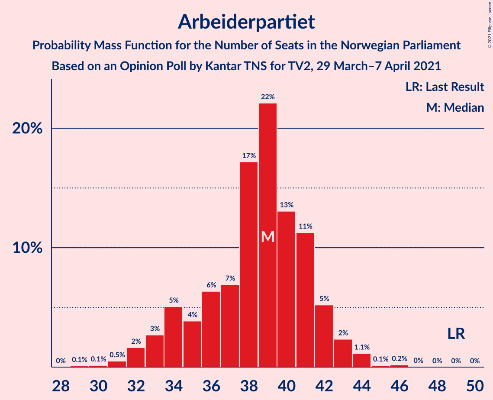

| Number of Seats | Probability | Accumulated | Special Marks |
|:---------------:|:-----------:|:-----------:|:-------------:|
| 29 | 0.1% | 100% |  |
| 30 | 0.1% | 99.9% |  |
| 31 | 0.5% | 99.7% |  |
| 32 | 2% | 99.2% |  |
| 33 | 3% | 98% |  |
| 34 | 5% | 95% |  |
| 35 | 4% | 90% |  |
| 36 | 6% | 86% |  |
| 37 | 7% | 80% |  |
| 38 | 17% | 73% |  |
| 39 | 22% | 56% | Median |
| 40 | 13% | 33% |  |
| 41 | 11% | 20% |  |
| 42 | 5% | 9% |  |
| 43 | 2% | 4% |  |
| 44 | 1.1% | 2% |  |
| 45 | 0.1% | 0.4% |  |
| 46 | 0.2% | 0.2% |  |
| 47 | 0% | 0% |  |
| 48 | 0% | 0% |  |
| 49 | 0% | 0% | Last Result |

### Senterpartiet

*For a full overview of the results for this party, see the [Senterpartiet](party-senterpartiet.html) page.*

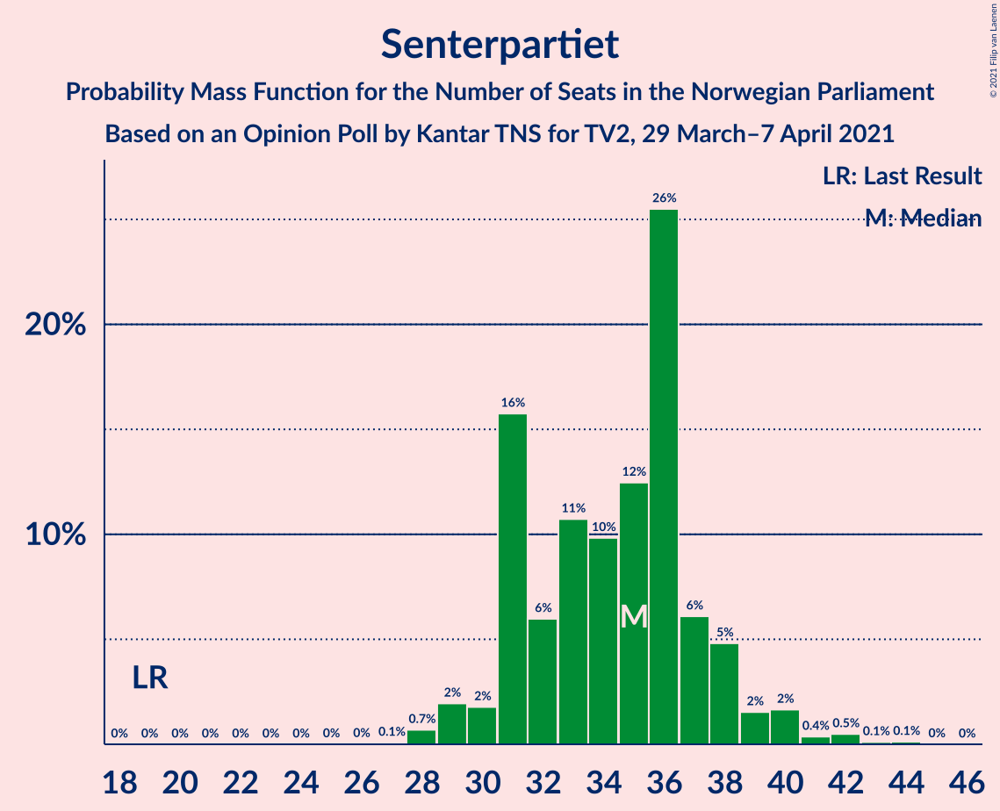

| Number of Seats | Probability | Accumulated | Special Marks |
|:---------------:|:-----------:|:-----------:|:-------------:|
| 19 | 0% | 100% | Last Result |
| 20 | 0% | 100% |  |
| 21 | 0% | 100% |  |
| 22 | 0% | 100% |  |
| 23 | 0% | 100% |  |
| 24 | 0% | 100% |  |
| 25 | 0% | 100% |  |
| 26 | 0% | 100% |  |
| 27 | 0.1% | 100% |  |
| 28 | 0.7% | 99.9% |  |
| 29 | 2% | 99.2% |  |
| 30 | 2% | 97% |  |
| 31 | 16% | 95% |  |
| 32 | 6% | 80% |  |
| 33 | 11% | 74% |  |
| 34 | 10% | 63% |  |
| 35 | 12% | 53% | Median |
| 36 | 26% | 41% |  |
| 37 | 6% | 15% |  |
| 38 | 5% | 9% |  |
| 39 | 2% | 4% |  |
| 40 | 2% | 3% |  |
| 41 | 0.4% | 1.1% |  |
| 42 | 0.5% | 0.7% |  |
| 43 | 0.1% | 0.2% |  |
| 44 | 0.1% | 0.1% |  |
| 45 | 0% | 0% |  |

### Fremskrittspartiet

*For a full overview of the results for this party, see the [Fremskrittspartiet](party-fremskrittspartiet.html) page.*

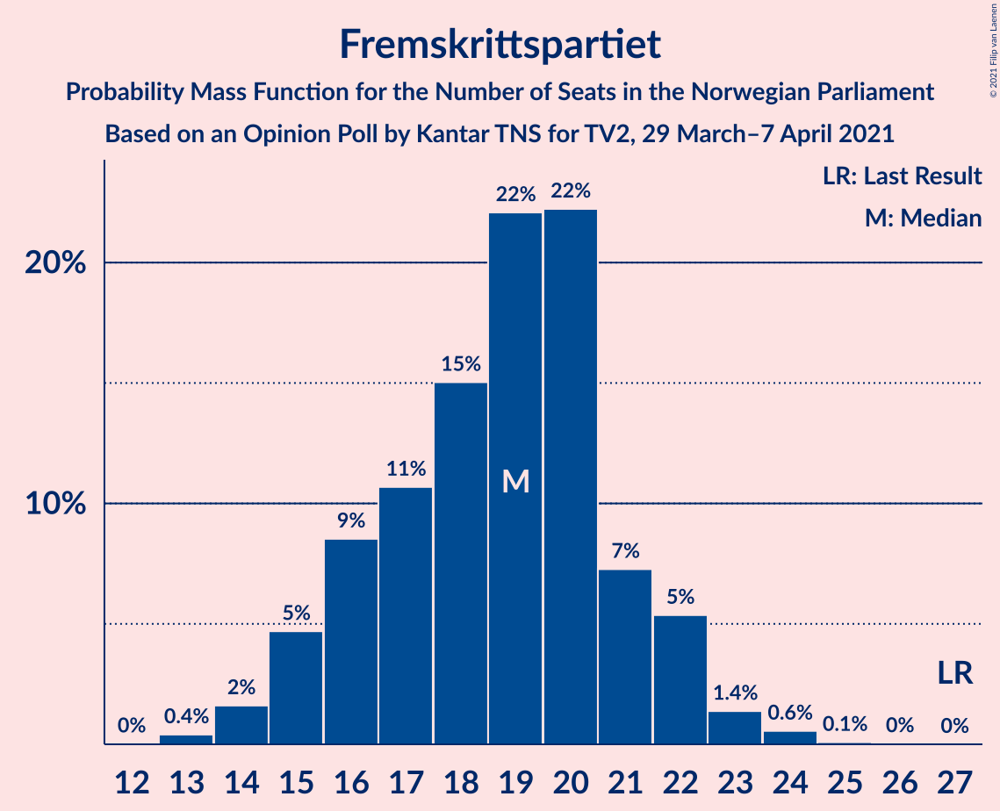

| Number of Seats | Probability | Accumulated | Special Marks |
|:---------------:|:-----------:|:-----------:|:-------------:|
| 13 | 0.4% | 100% |  |
| 14 | 2% | 99.6% |  |
| 15 | 5% | 98% |  |
| 16 | 9% | 93% |  |
| 17 | 11% | 85% |  |
| 18 | 15% | 74% |  |
| 19 | 22% | 59% | Median |
| 20 | 22% | 37% |  |
| 21 | 7% | 15% |  |
| 22 | 5% | 7% |  |
| 23 | 1.4% | 2% |  |
| 24 | 0.6% | 0.7% |  |
| 25 | 0.1% | 0.1% |  |
| 26 | 0% | 0% |  |
| 27 | 0% | 0% | Last Result |

### Sosialistisk Venstreparti

*For a full overview of the results for this party, see the [Sosialistisk Venstreparti](party-sosialistiskvenstreparti.html) page.*

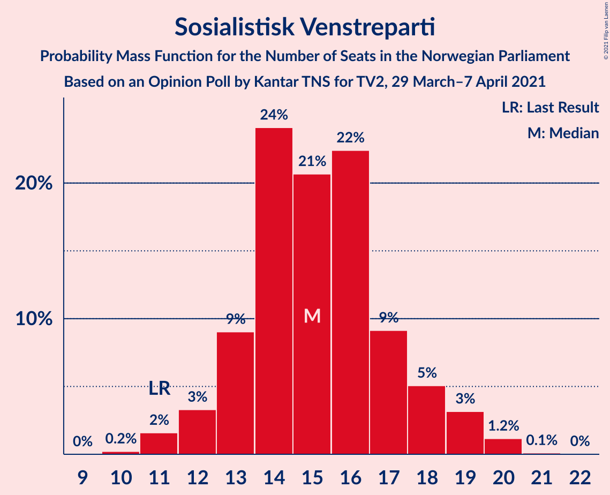

| Number of Seats | Probability | Accumulated | Special Marks |
|:---------------:|:-----------:|:-----------:|:-------------:|
| 10 | 0.2% | 100% |  |
| 11 | 2% | 99.8% | Last Result |
| 12 | 3% | 98% |  |
| 13 | 9% | 95% |  |
| 14 | 24% | 86% |  |
| 15 | 21% | 62% | Median |
| 16 | 22% | 41% |  |
| 17 | 9% | 19% |  |
| 18 | 5% | 10% |  |
| 19 | 3% | 4% |  |
| 20 | 1.2% | 1.3% |  |
| 21 | 0.1% | 0.1% |  |
| 22 | 0% | 0% |  |

### Miljøpartiet De Grønne

*For a full overview of the results for this party, see the [Miljøpartiet De Grønne](party-miljøpartietdegrønne.html) page.*

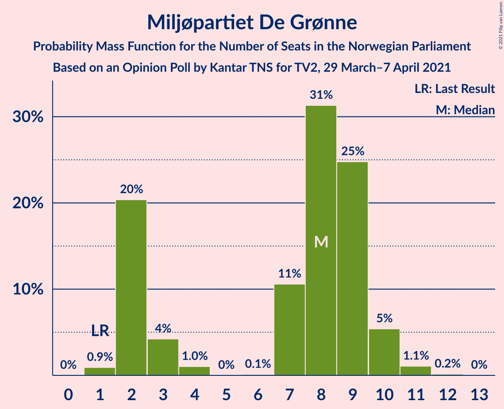

| Number of Seats | Probability | Accumulated | Special Marks |
|:---------------:|:-----------:|:-----------:|:-------------:|
| 1 | 0.9% | 100% | Last Result |
| 2 | 20% | 99.1% |  |
| 3 | 4% | 79% |  |
| 4 | 1.0% | 74% |  |
| 5 | 0% | 73% |  |
| 6 | 0.1% | 73% |  |
| 7 | 11% | 73% |  |
| 8 | 31% | 63% | Median |
| 9 | 25% | 31% |  |
| 10 | 5% | 7% |  |
| 11 | 1.1% | 1.2% |  |
| 12 | 0.2% | 0.2% |  |
| 13 | 0% | 0% |  |

### Kristelig Folkeparti

*For a full overview of the results for this party, see the [Kristelig Folkeparti](party-kristeligfolkeparti.html) page.*

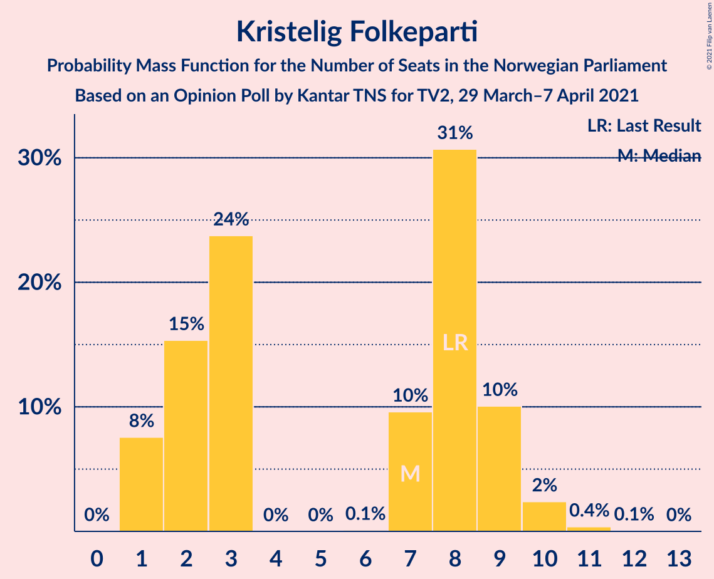

| Number of Seats | Probability | Accumulated | Special Marks |
|:---------------:|:-----------:|:-----------:|:-------------:|
| 1 | 8% | 100% |  |
| 2 | 15% | 92% |  |
| 3 | 24% | 77% |  |
| 4 | 0% | 53% |  |
| 5 | 0% | 53% |  |
| 6 | 0.1% | 53% |  |
| 7 | 10% | 53% | Median |
| 8 | 31% | 44% | Last Result |
| 9 | 10% | 13% |  |
| 10 | 2% | 3% |  |
| 11 | 0.4% | 0.5% |  |
| 12 | 0.1% | 0.1% |  |
| 13 | 0% | 0% |  |

### Rødt

*For a full overview of the results for this party, see the [Rødt](party-rødt.html) page.*

| Number of Seats | Probability | Accumulated | Special Marks |
|:---------------:|:-----------:|:-----------:|:-------------:|
| 1 | 0.9% | 100% | Last Result |
| 2 | 54% | 99.1% | Median |
| 3 | 0% | 45% |  |
| 4 | 0% | 45% |  |
| 5 | 0% | 45% |  |
| 6 | 0.1% | 45% |  |
| 7 | 10% | 45% |  |
| 8 | 22% | 34% |  |
| 9 | 10% | 12% |  |
| 10 | 2% | 2% |  |
| 11 | 0.5% | 0.5% |  |
| 12 | 0% | 0% |  |

### Venstre

*For a full overview of the results for this party, see the [Venstre](party-venstre.html) page.*

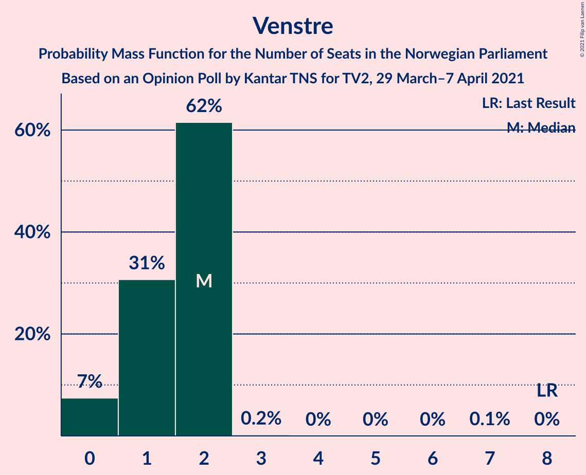

| Number of Seats | Probability | Accumulated | Special Marks |
|:---------------:|:-----------:|:-----------:|:-------------:|
| 0 | 7% | 100% |  |
| 1 | 31% | 93% |  |
| 2 | 62% | 62% | Median |
| 3 | 0.2% | 0.4% |  |
| 4 | 0% | 0.1% |  |
| 5 | 0% | 0.1% |  |
| 6 | 0% | 0.1% |  |
| 7 | 0.1% | 0.1% |  |
| 8 | 0% | 0% | Last Result |

## Coalitions

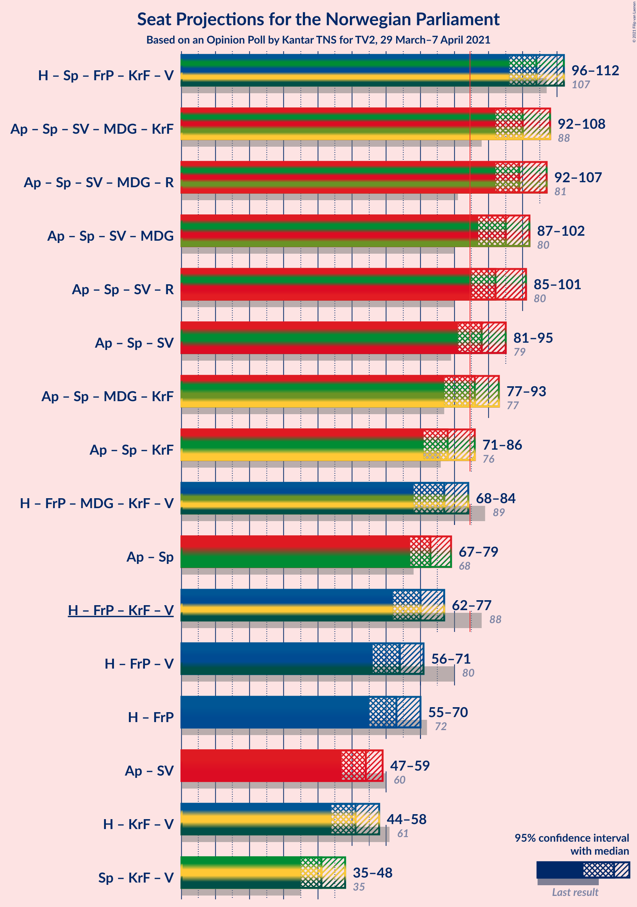

### Confidence Intervals

| Coalition | Last Result | Median | Majority? | 80% Confidence Interval | 90% Confidence Interval | 95% Confidence Interval | 99% Confidence Interval |
|:---------:|:-----------:|:------:|:---------:|:-----------------------:|:-----------------------:|:-----------------------:|:-----------------------:|
| Høyre – Senterpartiet – Fremskrittspartiet – Kristelig Folkeparti – Venstre | 107 | 104 | 100% | 98–109 | 97–111 | 96–112 | 94–114 |
| Arbeiderpartiet – Senterpartiet – Sosialistisk Venstreparti – Miljøpartiet De Grønne – Kristelig Folkeparti | 88 | 100 | 100% | 95–105 | 93–106 | 92–108 | 90–109 |
| Arbeiderpartiet – Senterpartiet – Sosialistisk Venstreparti – Miljøpartiet De Grønne – Rødt | 81 | 99 | 100% | 95–105 | 93–106 | 92–107 | 89–109 |
| Arbeiderpartiet – Senterpartiet – Sosialistisk Venstreparti – Miljøpartiet De Grønne | 80 | 95 | 99.6% | 89–99 | 88–101 | 87–102 | 85–104 |
| Arbeiderpartiet – Senterpartiet – Sosialistisk Venstreparti – Rødt | 80 | 92 | 98% | 88–98 | 87–99 | 85–101 | 83–103 |
| Arbeiderpartiet – Senterpartiet – Sosialistisk Venstreparti | 79 | 88 | 87% | 84–93 | 83–94 | 81–95 | 79–98 |
| Arbeiderpartiet – Senterpartiet – Miljøpartiet De Grønne – Kristelig Folkeparti | 77 | 86 | 61% | 79–90 | 78–92 | 77–93 | 74–95 |
| Arbeiderpartiet – Senterpartiet – Kristelig Folkeparti | 76 | 78 | 7% | 74–84 | 73–85 | 71–86 | 69–87 |
| Høyre – Fremskrittspartiet – Miljøpartiet De Grønne – Kristelig Folkeparti – Venstre | 89 | 77 | 2% | 70–81 | 69–82 | 68–84 | 66–86 |
| Arbeiderpartiet – Senterpartiet | 68 | 73 | 0% | 69–77 | 67–78 | 67–79 | 64–80 |
| Høyre – Fremskrittspartiet – Kristelig Folkeparti – Venstre | 88 | 70 | 0% | 64–74 | 63–75 | 62–77 | 59–79 |
| Høyre – Fremskrittspartiet – Venstre | 80 | 64 | 0% | 59–68 | 57–70 | 56–71 | 54–74 |
| Høyre – Fremskrittspartiet | 72 | 63 | 0% | 58–67 | 56–68 | 55–70 | 52–72 |
| Arbeiderpartiet – Sosialistisk Venstreparti | 60 | 54 | 0% | 49–57 | 48–58 | 47–59 | 45–62 |
| Høyre – Kristelig Folkeparti – Venstre | 61 | 51 | 0% | 45–55 | 45–57 | 44–58 | 42–60 |
| Senterpartiet – Kristelig Folkeparti – Venstre | 35 | 41 | 0% | 37–46 | 36–47 | 35–48 | 33–51 |

### Høyre – Senterpartiet – Fremskrittspartiet – Kristelig Folkeparti – Venstre

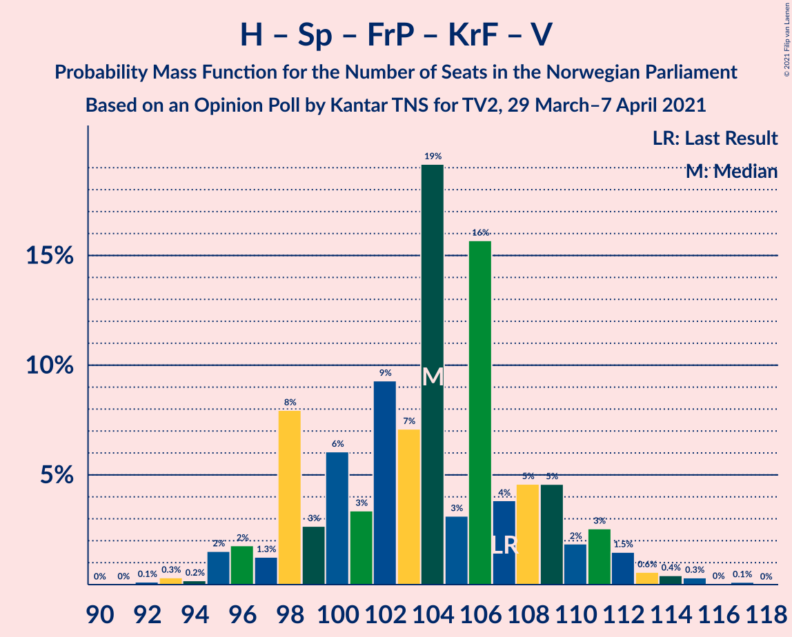

| Number of Seats | Probability | Accumulated | Special Marks |
|:---------------:|:-----------:|:-----------:|:-------------:|
| 92 | 0.1% | 100% |  |
| 93 | 0.3% | 99.8% |  |
| 94 | 0.2% | 99.5% |  |
| 95 | 2% | 99.3% |  |
| 96 | 2% | 98% |  |
| 97 | 1.3% | 96% |  |
| 98 | 8% | 95% |  |
| 99 | 3% | 87% |  |
| 100 | 6% | 84% |  |
| 101 | 3% | 78% |  |
| 102 | 9% | 75% |  |
| 103 | 7% | 65% |  |
| 104 | 19% | 58% |  |
| 105 | 3% | 39% |  |
| 106 | 16% | 36% | Median |
| 107 | 4% | 20% | Last Result |
| 108 | 5% | 17% |  |
| 109 | 5% | 12% |  |
| 110 | 2% | 7% |  |
| 111 | 3% | 6% |  |
| 112 | 1.5% | 3% |  |
| 113 | 0.6% | 1.5% |  |
| 114 | 0.4% | 0.9% |  |
| 115 | 0.3% | 0.5% |  |
| 116 | 0% | 0.2% |  |
| 117 | 0.1% | 0.1% |  |
| 118 | 0% | 0% |  |

### Arbeiderpartiet – Senterpartiet – Sosialistisk Venstreparti – Miljøpartiet De Grønne – Kristelig Folkeparti

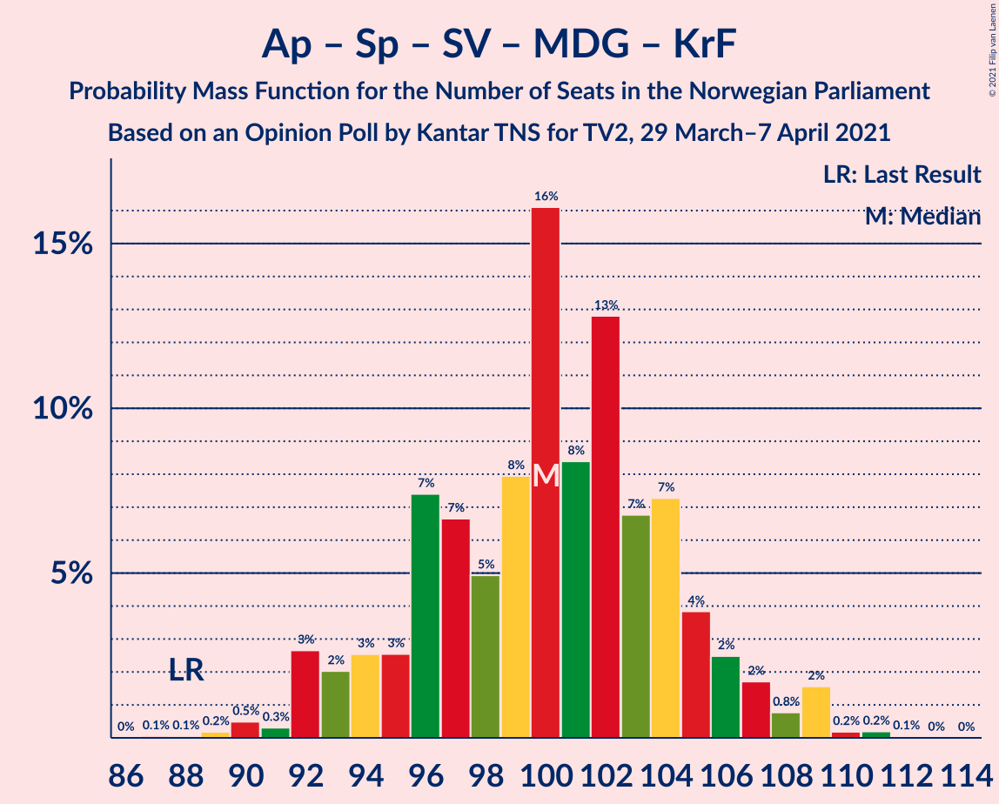

| Number of Seats | Probability | Accumulated | Special Marks |
|:---------------:|:-----------:|:-----------:|:-------------:|
| 87 | 0.1% | 100% |  |
| 88 | 0.1% | 99.9% | Last Result |
| 89 | 0.2% | 99.9% |  |
| 90 | 0.5% | 99.7% |  |
| 91 | 0.3% | 99.2% |  |
| 92 | 3% | 98.9% |  |
| 93 | 2% | 96% |  |
| 94 | 3% | 94% |  |
| 95 | 3% | 92% |  |
| 96 | 7% | 89% |  |
| 97 | 7% | 82% |  |
| 98 | 5% | 75% |  |
| 99 | 8% | 70% |  |
| 100 | 16% | 62% |  |
| 101 | 8% | 46% |  |
| 102 | 13% | 38% |  |
| 103 | 7% | 25% |  |
| 104 | 7% | 18% | Median |
| 105 | 4% | 11% |  |
| 106 | 2% | 7% |  |
| 107 | 2% | 4% |  |
| 108 | 0.8% | 3% |  |
| 109 | 2% | 2% |  |
| 110 | 0.2% | 0.5% |  |
| 111 | 0.2% | 0.3% |  |
| 112 | 0.1% | 0.1% |  |
| 113 | 0% | 0% |  |

### Arbeiderpartiet – Senterpartiet – Sosialistisk Venstreparti – Miljøpartiet De Grønne – Rødt

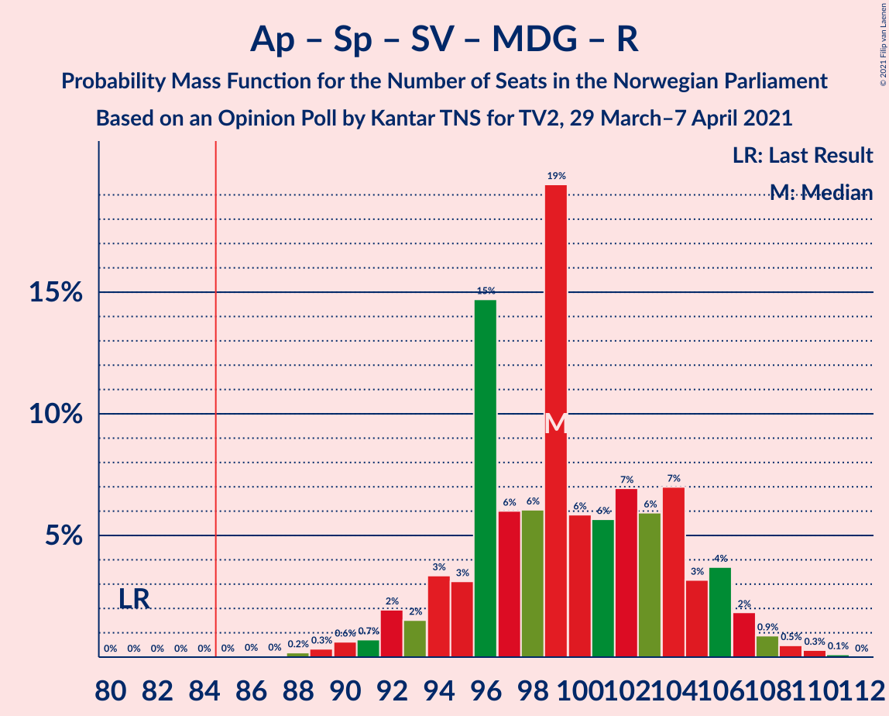

| Number of Seats | Probability | Accumulated | Special Marks |
|:---------------:|:-----------:|:-----------:|:-------------:|
| 81 | 0% | 100% | Last Result |
| 82 | 0% | 100% |  |
| 83 | 0% | 100% |  |
| 84 | 0% | 100% |  |
| 85 | 0% | 100% | Majority |
| 86 | 0% | 100% |  |
| 87 | 0% | 99.9% |  |
| 88 | 0.2% | 99.9% |  |
| 89 | 0.3% | 99.7% |  |
| 90 | 0.6% | 99.4% |  |
| 91 | 0.7% | 98.7% |  |
| 92 | 2% | 98% |  |
| 93 | 2% | 96% |  |
| 94 | 3% | 95% |  |
| 95 | 3% | 91% |  |
| 96 | 15% | 88% |  |
| 97 | 6% | 73% |  |
| 98 | 6% | 67% |  |
| 99 | 19% | 61% | Median |
| 100 | 6% | 42% |  |
| 101 | 6% | 36% |  |
| 102 | 7% | 30% |  |
| 103 | 6% | 23% |  |
| 104 | 7% | 17% |  |
| 105 | 3% | 10% |  |
| 106 | 4% | 7% |  |
| 107 | 2% | 4% |  |
| 108 | 0.9% | 2% |  |
| 109 | 0.5% | 0.9% |  |
| 110 | 0.3% | 0.4% |  |
| 111 | 0.1% | 0.1% |  |
| 112 | 0% | 0% |  |

### Arbeiderpartiet – Senterpartiet – Sosialistisk Venstreparti – Miljøpartiet De Grønne

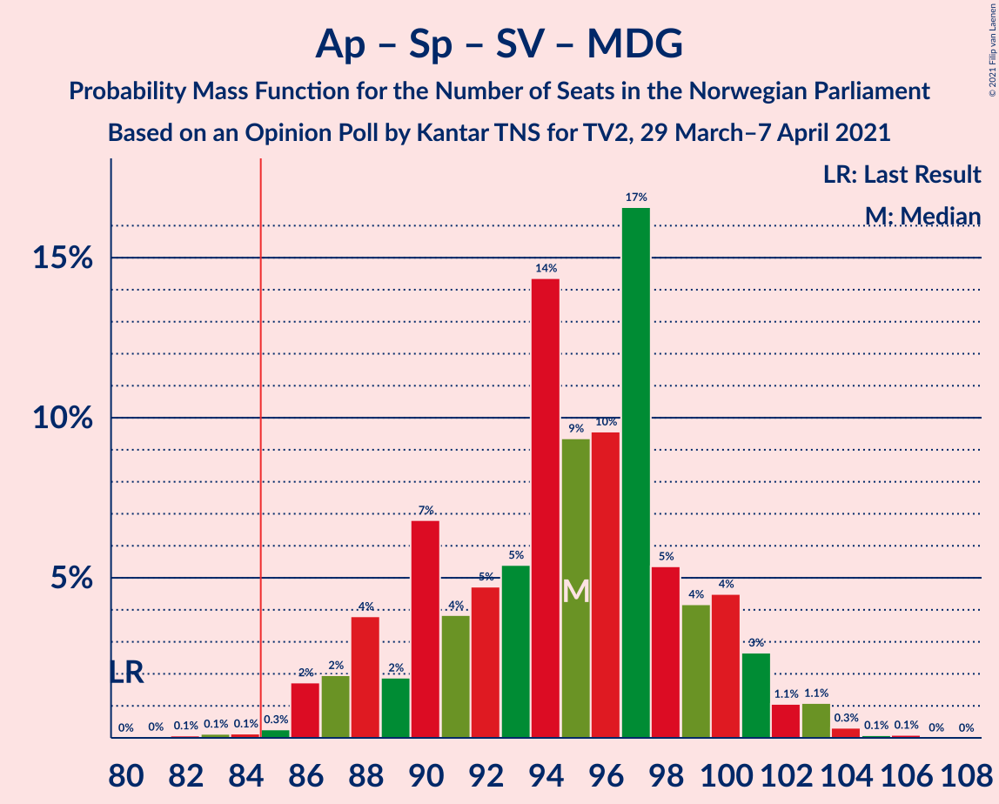

| Number of Seats | Probability | Accumulated | Special Marks |
|:---------------:|:-----------:|:-----------:|:-------------:|
| 80 | 0% | 100% | Last Result |
| 81 | 0% | 100% |  |
| 82 | 0.1% | 100% |  |
| 83 | 0.1% | 99.9% |  |
| 84 | 0.1% | 99.8% |  |
| 85 | 0.3% | 99.6% | Majority |
| 86 | 2% | 99.4% |  |
| 87 | 2% | 98% |  |
| 88 | 4% | 96% |  |
| 89 | 2% | 92% |  |
| 90 | 7% | 90% |  |
| 91 | 4% | 83% |  |
| 92 | 5% | 79% |  |
| 93 | 5% | 75% |  |
| 94 | 14% | 69% |  |
| 95 | 9% | 55% |  |
| 96 | 10% | 46% |  |
| 97 | 17% | 36% | Median |
| 98 | 5% | 19% |  |
| 99 | 4% | 14% |  |
| 100 | 4% | 10% |  |
| 101 | 3% | 5% |  |
| 102 | 1.1% | 3% |  |
| 103 | 1.1% | 2% |  |
| 104 | 0.3% | 0.5% |  |
| 105 | 0.1% | 0.2% |  |
| 106 | 0.1% | 0.1% |  |
| 107 | 0% | 0% |  |

### Arbeiderpartiet – Senterpartiet – Sosialistisk Venstreparti – Rødt

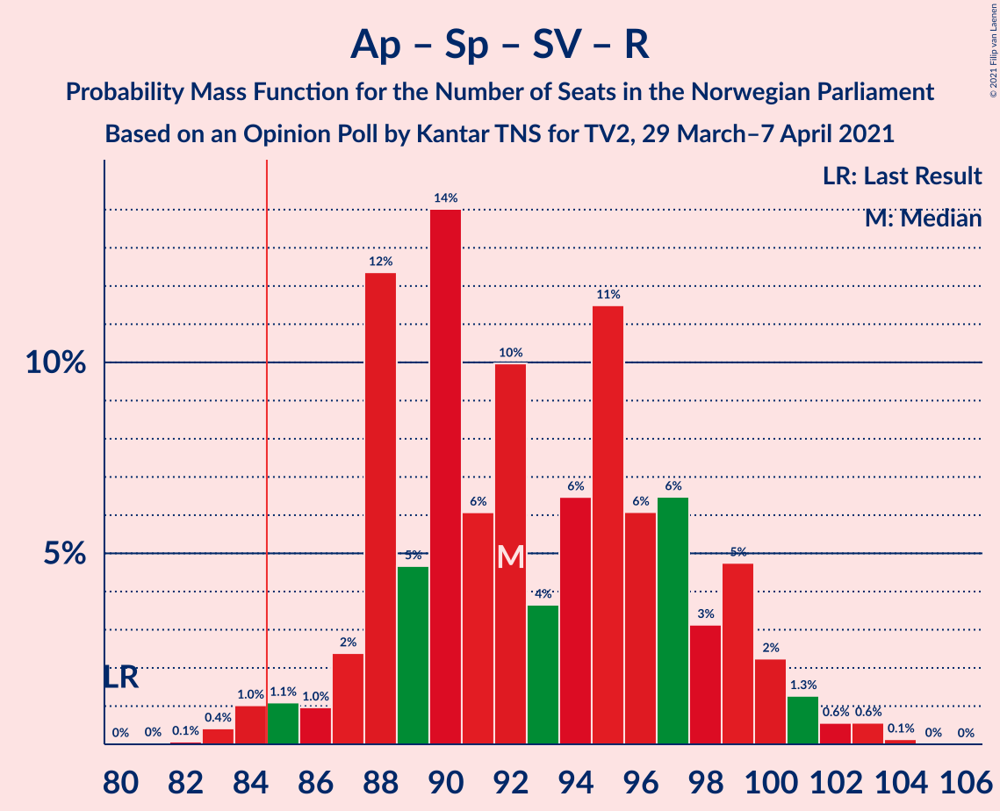

| Number of Seats | Probability | Accumulated | Special Marks |
|:---------------:|:-----------:|:-----------:|:-------------:|
| 80 | 0% | 100% | Last Result |
| 81 | 0% | 100% |  |
| 82 | 0.1% | 99.9% |  |
| 83 | 0.4% | 99.9% |  |
| 84 | 1.0% | 99.4% |  |
| 85 | 1.1% | 98% | Majority |
| 86 | 1.0% | 97% |  |
| 87 | 2% | 96% |  |
| 88 | 12% | 94% |  |
| 89 | 5% | 82% |  |
| 90 | 14% | 77% |  |
| 91 | 6% | 63% | Median |
| 92 | 10% | 57% |  |
| 93 | 4% | 47% |  |
| 94 | 6% | 43% |  |
| 95 | 11% | 37% |  |
| 96 | 6% | 25% |  |
| 97 | 6% | 19% |  |
| 98 | 3% | 13% |  |
| 99 | 5% | 10% |  |
| 100 | 2% | 5% |  |
| 101 | 1.3% | 3% |  |
| 102 | 0.6% | 1.3% |  |
| 103 | 0.6% | 0.7% |  |
| 104 | 0.1% | 0.2% |  |
| 105 | 0% | 0% |  |

### Arbeiderpartiet – Senterpartiet – Sosialistisk Venstreparti

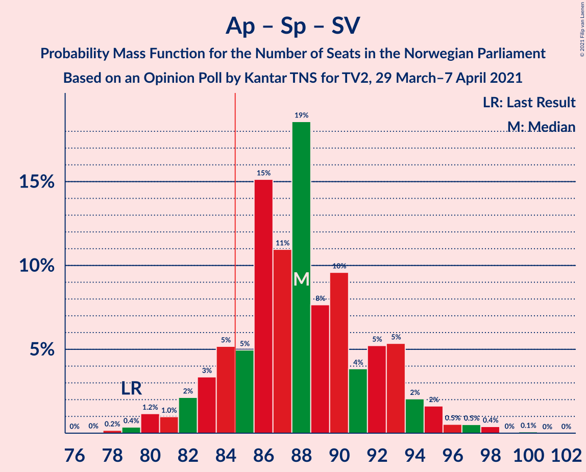

| Number of Seats | Probability | Accumulated | Special Marks |
|:---------------:|:-----------:|:-----------:|:-------------:|
| 76 | 0% | 100% |  |
| 77 | 0% | 99.9% |  |
| 78 | 0.2% | 99.9% |  |
| 79 | 0.4% | 99.7% | Last Result |
| 80 | 1.2% | 99.4% |  |
| 81 | 1.0% | 98% |  |
| 82 | 2% | 97% |  |
| 83 | 3% | 95% |  |
| 84 | 5% | 92% |  |
| 85 | 5% | 87% | Majority |
| 86 | 15% | 82% |  |
| 87 | 11% | 66% |  |
| 88 | 19% | 55% |  |
| 89 | 8% | 37% | Median |
| 90 | 10% | 29% |  |
| 91 | 4% | 20% |  |
| 92 | 5% | 16% |  |
| 93 | 5% | 11% |  |
| 94 | 2% | 5% |  |
| 95 | 2% | 3% |  |
| 96 | 0.5% | 2% |  |
| 97 | 0.5% | 1.0% |  |
| 98 | 0.4% | 0.5% |  |
| 99 | 0% | 0.1% |  |
| 100 | 0.1% | 0.1% |  |
| 101 | 0% | 0% |  |

### Arbeiderpartiet – Senterpartiet – Miljøpartiet De Grønne – Kristelig Folkeparti

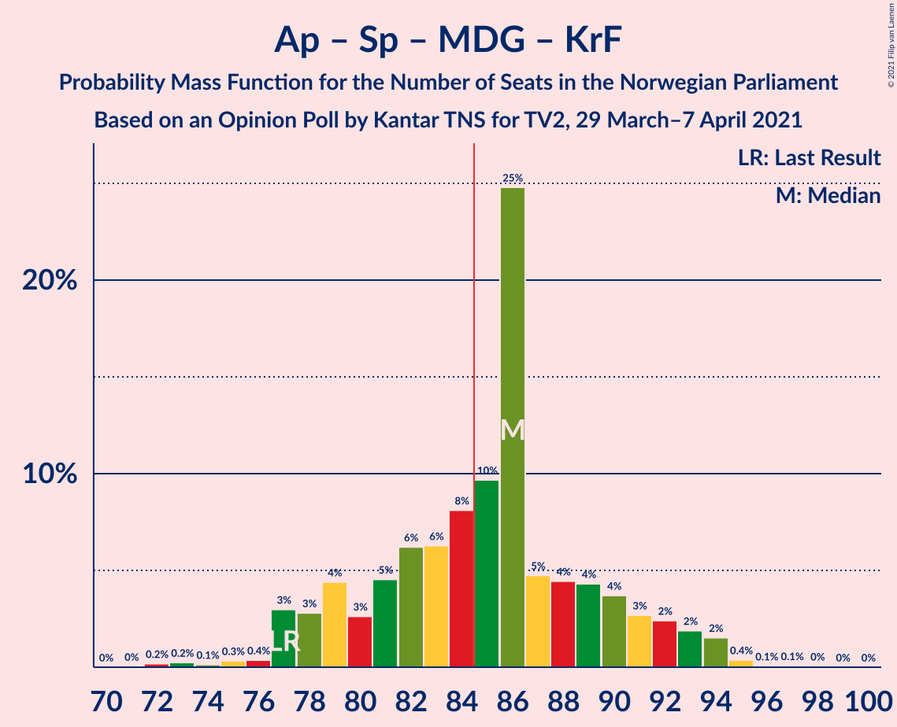

| Number of Seats | Probability | Accumulated | Special Marks |
|:---------------:|:-----------:|:-----------:|:-------------:|
| 72 | 0.2% | 100% |  |
| 73 | 0.2% | 99.8% |  |
| 74 | 0.1% | 99.5% |  |
| 75 | 0.3% | 99.4% |  |
| 76 | 0.4% | 99.1% |  |
| 77 | 3% | 98.7% | Last Result |
| 78 | 3% | 96% |  |
| 79 | 4% | 93% |  |
| 80 | 3% | 89% |  |
| 81 | 5% | 86% |  |
| 82 | 6% | 81% |  |
| 83 | 6% | 75% |  |
| 84 | 8% | 69% |  |
| 85 | 10% | 61% | Majority |
| 86 | 25% | 51% |  |
| 87 | 5% | 26% |  |
| 88 | 4% | 22% |  |
| 89 | 4% | 17% | Median |
| 90 | 4% | 13% |  |
| 91 | 3% | 9% |  |
| 92 | 2% | 6% |  |
| 93 | 2% | 4% |  |
| 94 | 2% | 2% |  |
| 95 | 0.4% | 0.6% |  |
| 96 | 0.1% | 0.2% |  |
| 97 | 0.1% | 0.1% |  |
| 98 | 0% | 0.1% |  |
| 99 | 0% | 0% |  |

### Arbeiderpartiet – Senterpartiet – Kristelig Folkeparti

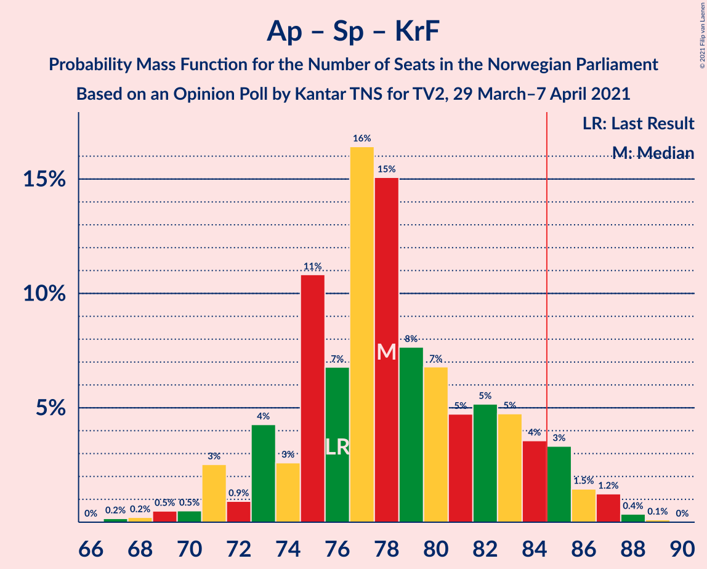

| Number of Seats | Probability | Accumulated | Special Marks |
|:---------------:|:-----------:|:-----------:|:-------------:|
| 66 | 0% | 100% |  |
| 67 | 0.2% | 99.9% |  |
| 68 | 0.2% | 99.8% |  |
| 69 | 0.5% | 99.6% |  |
| 70 | 0.5% | 99.1% |  |
| 71 | 3% | 98.6% |  |
| 72 | 0.9% | 96% |  |
| 73 | 4% | 95% |  |
| 74 | 3% | 91% |  |
| 75 | 11% | 88% |  |
| 76 | 7% | 77% | Last Result |
| 77 | 16% | 71% |  |
| 78 | 15% | 54% |  |
| 79 | 8% | 39% |  |
| 80 | 7% | 32% |  |
| 81 | 5% | 25% | Median |
| 82 | 5% | 20% |  |
| 83 | 5% | 15% |  |
| 84 | 4% | 10% |  |
| 85 | 3% | 7% | Majority |
| 86 | 1.5% | 3% |  |
| 87 | 1.2% | 2% |  |
| 88 | 0.4% | 0.5% |  |
| 89 | 0.1% | 0.1% |  |
| 90 | 0% | 0% |  |

### Høyre – Fremskrittspartiet – Miljøpartiet De Grønne – Kristelig Folkeparti – Venstre

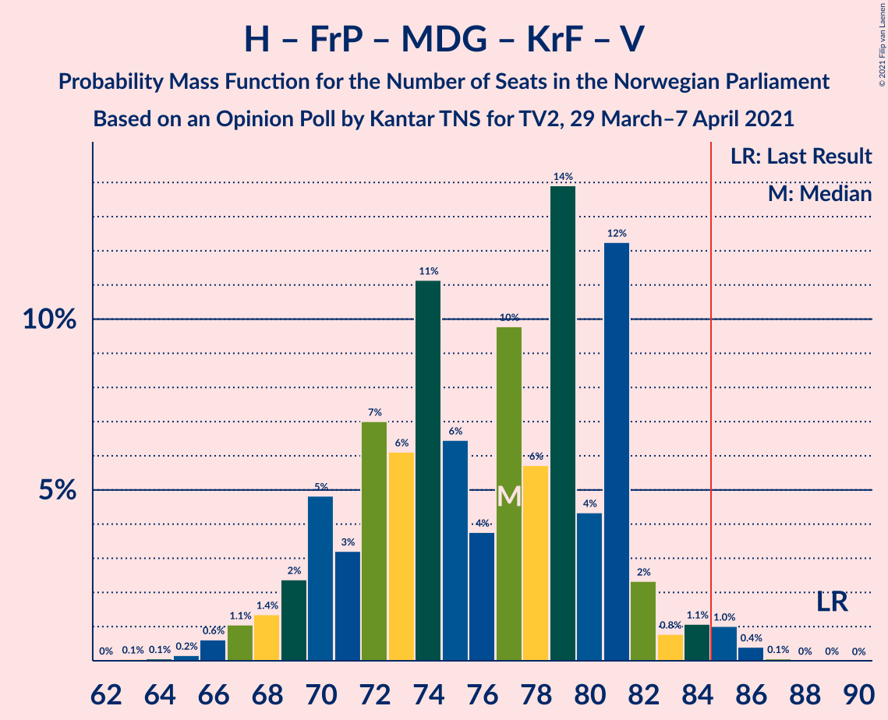

| Number of Seats | Probability | Accumulated | Special Marks |
|:---------------:|:-----------:|:-----------:|:-------------:|
| 63 | 0.1% | 100% |  |
| 64 | 0.1% | 99.9% |  |
| 65 | 0.2% | 99.8% |  |
| 66 | 0.6% | 99.7% |  |
| 67 | 1.1% | 99.1% |  |
| 68 | 1.4% | 98% |  |
| 69 | 2% | 97% |  |
| 70 | 5% | 94% |  |
| 71 | 3% | 89% |  |
| 72 | 7% | 86% |  |
| 73 | 6% | 79% |  |
| 74 | 11% | 73% |  |
| 75 | 6% | 62% |  |
| 76 | 4% | 55% |  |
| 77 | 10% | 52% |  |
| 78 | 6% | 42% |  |
| 79 | 14% | 36% | Median |
| 80 | 4% | 22% |  |
| 81 | 12% | 18% |  |
| 82 | 2% | 6% |  |
| 83 | 0.8% | 3% |  |
| 84 | 1.1% | 3% |  |
| 85 | 1.0% | 2% | Majority |
| 86 | 0.4% | 0.5% |  |
| 87 | 0.1% | 0.1% |  |
| 88 | 0% | 0% |  |
| 89 | 0% | 0% | Last Result |

### Arbeiderpartiet – Senterpartiet

| Number of Seats | Probability | Accumulated | Special Marks |
|:---------------:|:-----------:|:-----------:|:-------------:|
| 62 | 0.1% | 100% |  |
| 63 | 0.1% | 99.9% |  |
| 64 | 0.4% | 99.8% |  |
| 65 | 0.7% | 99.3% |  |
| 66 | 1.2% | 98.7% |  |
| 67 | 4% | 98% |  |
| 68 | 2% | 94% | Last Result |
| 69 | 3% | 91% |  |
| 70 | 14% | 88% |  |
| 71 | 9% | 73% |  |
| 72 | 11% | 65% |  |
| 73 | 8% | 54% |  |
| 74 | 20% | 46% | Median |
| 75 | 6% | 26% |  |
| 76 | 5% | 20% |  |
| 77 | 7% | 15% |  |
| 78 | 4% | 8% |  |
| 79 | 1.1% | 3% |  |
| 80 | 2% | 2% |  |
| 81 | 0.2% | 0.4% |  |
| 82 | 0.1% | 0.2% |  |
| 83 | 0% | 0.1% |  |
| 84 | 0.1% | 0.1% |  |
| 85 | 0% | 0% | Majority |

### Høyre – Fremskrittspartiet – Kristelig Folkeparti – Venstre

| Number of Seats | Probability | Accumulated | Special Marks |
|:---------------:|:-----------:|:-----------:|:-------------:|
| 57 | 0% | 100% |  |
| 58 | 0.1% | 99.9% |  |
| 59 | 0.7% | 99.8% |  |
| 60 | 0.6% | 99.1% |  |
| 61 | 1.0% | 98.6% |  |
| 62 | 2% | 98% |  |
| 63 | 4% | 96% |  |
| 64 | 3% | 92% |  |
| 65 | 7% | 89% |  |
| 66 | 6% | 81% |  |
| 67 | 7% | 76% |  |
| 68 | 6% | 69% |  |
| 69 | 6% | 63% |  |
| 70 | 20% | 57% |  |
| 71 | 6% | 38% | Median |
| 72 | 6% | 32% |  |
| 73 | 15% | 26% |  |
| 74 | 3% | 11% |  |
| 75 | 3% | 8% |  |
| 76 | 1.5% | 5% |  |
| 77 | 2% | 3% |  |
| 78 | 0.4% | 1.4% |  |
| 79 | 0.5% | 1.0% |  |
| 80 | 0.3% | 0.5% |  |
| 81 | 0.1% | 0.1% |  |
| 82 | 0% | 0.1% |  |
| 83 | 0% | 0% |  |
| 84 | 0% | 0% |  |
| 85 | 0% | 0% | Majority |
| 86 | 0% | 0% |  |
| 87 | 0% | 0% |  |
| 88 | 0% | 0% | Last Result |

### Høyre – Fremskrittspartiet – Venstre

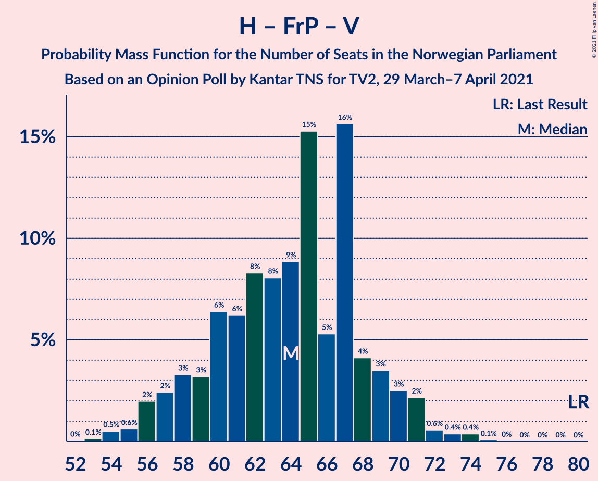

| Number of Seats | Probability | Accumulated | Special Marks |
|:---------------:|:-----------:|:-----------:|:-------------:|
| 52 | 0% | 100% |  |
| 53 | 0.1% | 99.9% |  |
| 54 | 0.5% | 99.8% |  |
| 55 | 0.6% | 99.3% |  |
| 56 | 2% | 98.7% |  |
| 57 | 2% | 97% |  |
| 58 | 3% | 94% |  |
| 59 | 3% | 91% |  |
| 60 | 6% | 88% |  |
| 61 | 6% | 81% |  |
| 62 | 8% | 75% |  |
| 63 | 8% | 67% |  |
| 64 | 9% | 59% | Median |
| 65 | 15% | 50% |  |
| 66 | 5% | 35% |  |
| 67 | 16% | 29% |  |
| 68 | 4% | 14% |  |
| 69 | 3% | 10% |  |
| 70 | 3% | 6% |  |
| 71 | 2% | 4% |  |
| 72 | 0.6% | 1.5% |  |
| 73 | 0.4% | 0.9% |  |
| 74 | 0.4% | 0.5% |  |
| 75 | 0.1% | 0.1% |  |
| 76 | 0% | 0% |  |
| 77 | 0% | 0% |  |
| 78 | 0% | 0% |  |
| 79 | 0% | 0% |  |
| 80 | 0% | 0% | Last Result |

### Høyre – Fremskrittspartiet

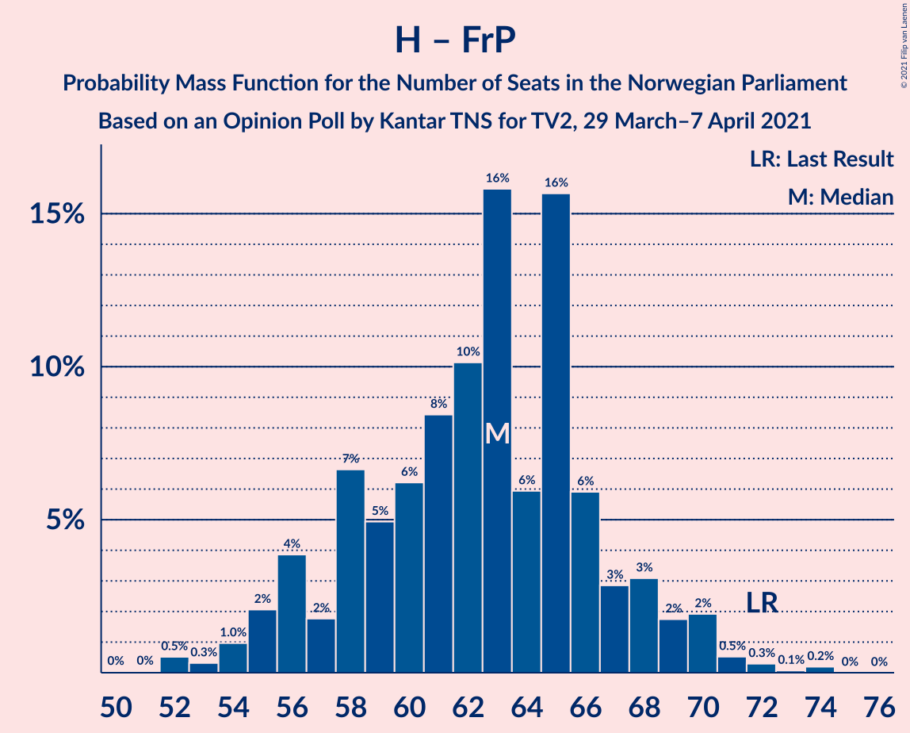

| Number of Seats | Probability | Accumulated | Special Marks |
|:---------------:|:-----------:|:-----------:|:-------------:|
| 51 | 0% | 100% |  |
| 52 | 0.5% | 99.9% |  |
| 53 | 0.3% | 99.4% |  |
| 54 | 1.0% | 99.1% |  |
| 55 | 2% | 98% |  |
| 56 | 4% | 96% |  |
| 57 | 2% | 92% |  |
| 58 | 7% | 90% |  |
| 59 | 5% | 84% |  |
| 60 | 6% | 79% |  |
| 61 | 8% | 73% |  |
| 62 | 10% | 64% | Median |
| 63 | 16% | 54% |  |
| 64 | 6% | 38% |  |
| 65 | 16% | 32% |  |
| 66 | 6% | 17% |  |
| 67 | 3% | 11% |  |
| 68 | 3% | 8% |  |
| 69 | 2% | 5% |  |
| 70 | 2% | 3% |  |
| 71 | 0.5% | 1.1% |  |
| 72 | 0.3% | 0.6% | Last Result |
| 73 | 0.1% | 0.3% |  |
| 74 | 0.2% | 0.2% |  |
| 75 | 0% | 0% |  |

### Arbeiderpartiet – Sosialistisk Venstreparti

| Number of Seats | Probability | Accumulated | Special Marks |
|:---------------:|:-----------:|:-----------:|:-------------:|
| 43 | 0.1% | 100% |  |
| 44 | 0.1% | 99.9% |  |
| 45 | 1.0% | 99.8% |  |
| 46 | 0.3% | 98.7% |  |
| 47 | 2% | 98% |  |
| 48 | 4% | 97% |  |
| 49 | 4% | 93% |  |
| 50 | 4% | 89% |  |
| 51 | 4% | 86% |  |
| 52 | 18% | 81% |  |
| 53 | 7% | 63% |  |
| 54 | 12% | 56% | Median |
| 55 | 21% | 44% |  |
| 56 | 10% | 24% |  |
| 57 | 7% | 14% |  |
| 58 | 2% | 6% |  |
| 59 | 2% | 4% |  |
| 60 | 1.0% | 2% | Last Result |
| 61 | 0.4% | 1.3% |  |
| 62 | 0.7% | 0.9% |  |
| 63 | 0.1% | 0.1% |  |
| 64 | 0.1% | 0.1% |  |
| 65 | 0% | 0% |  |

### Høyre – Kristelig Folkeparti – Venstre

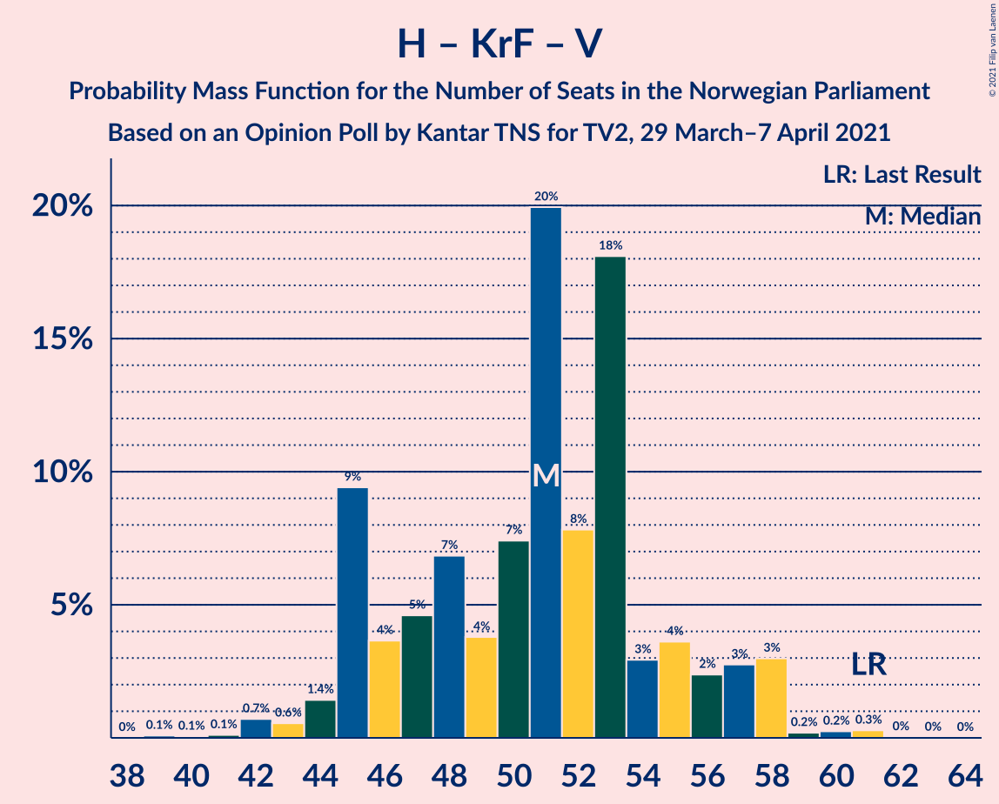

| Number of Seats | Probability | Accumulated | Special Marks |
|:---------------:|:-----------:|:-----------:|:-------------:|
| 39 | 0.1% | 100% |  |
| 40 | 0.1% | 99.9% |  |
| 41 | 0.1% | 99.8% |  |
| 42 | 0.7% | 99.7% |  |
| 43 | 0.6% | 99.0% |  |
| 44 | 1.4% | 98% |  |
| 45 | 9% | 97% |  |
| 46 | 4% | 88% |  |
| 47 | 5% | 84% |  |
| 48 | 7% | 79% |  |
| 49 | 4% | 73% |  |
| 50 | 7% | 69% |  |
| 51 | 20% | 61% |  |
| 52 | 8% | 41% | Median |
| 53 | 18% | 34% |  |
| 54 | 3% | 15% |  |
| 55 | 4% | 13% |  |
| 56 | 2% | 9% |  |
| 57 | 3% | 7% |  |
| 58 | 3% | 4% |  |
| 59 | 0.2% | 0.8% |  |
| 60 | 0.2% | 0.6% |  |
| 61 | 0.3% | 0.3% | Last Result |
| 62 | 0% | 0.1% |  |
| 63 | 0% | 0% |  |

### Senterpartiet – Kristelig Folkeparti – Venstre

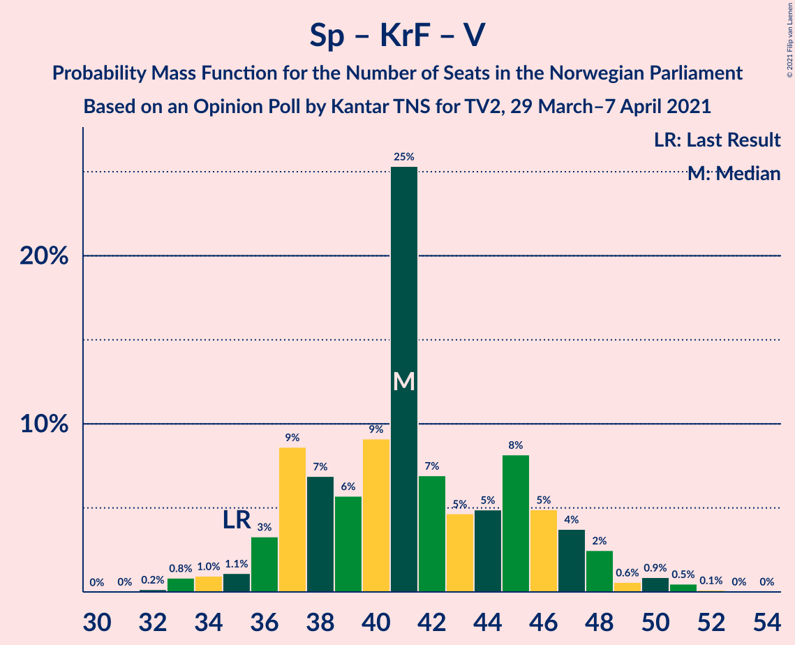

| Number of Seats | Probability | Accumulated | Special Marks |
|:---------------:|:-----------:|:-----------:|:-------------:|
| 32 | 0.2% | 100% |  |
| 33 | 0.8% | 99.8% |  |
| 34 | 1.0% | 99.0% |  |
| 35 | 1.1% | 98% | Last Result |
| 36 | 3% | 97% |  |
| 37 | 9% | 94% |  |
| 38 | 7% | 85% |  |
| 39 | 6% | 78% |  |
| 40 | 9% | 72% |  |
| 41 | 25% | 63% |  |
| 42 | 7% | 38% |  |
| 43 | 5% | 31% |  |
| 44 | 5% | 26% | Median |
| 45 | 8% | 21% |  |
| 46 | 5% | 13% |  |
| 47 | 4% | 8% |  |
| 48 | 2% | 5% |  |
| 49 | 0.6% | 2% |  |
| 50 | 0.9% | 2% |  |
| 51 | 0.5% | 0.7% |  |
| 52 | 0.1% | 0.2% |  |
| 53 | 0% | 0.1% |  |
| 54 | 0% | 0% |  |

## Technical Information

### Opinion Poll

+ **Polling firm:** Kantar TNS
+ **Commissioner(s):** TV2
+ **Fieldwork period:** 29 March–7 April 2021

### Calculations

+ **Sample size:** 1002
+ **Simulations done:** 1,048,576
+ **Error estimate:** 2.13%

