# Opinion Poll by Norfakta for Klassekampen and Nationen, 6–7 April 2021

<a href="#voting-intentions">Voting Intentions</a> | <a href="#seats">Seats</a> | <a href="#coalitions">Coalitions</a> | <a href="#technical-information">Technical Information</a>

## Voting Intentions

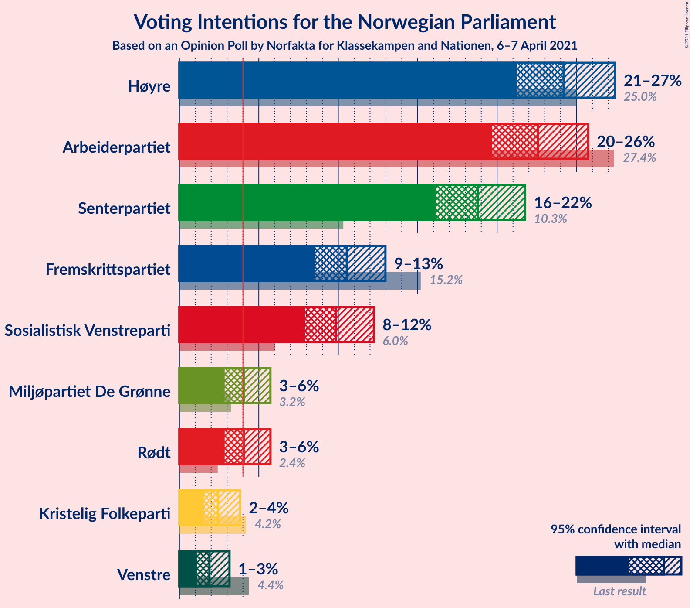

### Confidence Intervals

| Party | Last Result | Poll Result | 80% Confidence Interval | 90% Confidence Interval | 95% Confidence Interval | 99% Confidence Interval |
|:-----:|:-----------:|:-----------:|:-----------------------:|:-----------------------:|:-----------------------:|:-----------------------:|
| Høyre | 25.0% | 24.2% | 22.3–26.3% |21.7–26.9% |21.2–27.4% |20.3–28.4% |
| Arbeiderpartiet | 27.4% | 22.6% | 20.7–24.6% |20.1–25.2% |19.7–25.7% |18.8–26.7% |
| Senterpartiet | 10.3% | 18.8% | 17.0–20.7% |16.6–21.3% |16.1–21.8% |15.3–22.7% |
| Fremskrittspartiet | 15.2% | 10.5% | 9.2–12.1% |8.8–12.6% |8.5–13.0% |7.9–13.8% |
| Sosialistisk Venstreparti | 6.0% | 9.9% | 8.6–11.4% |8.2–11.8% |7.9–12.2% |7.3–13.0% |
| Rødt | 2.4% | 4.1% | 3.3–5.2% |3.0–5.5% |2.9–5.7% |2.5–6.3% |
| Miljøpartiet De Grønne | 3.2% | 4.1% | 3.3–5.2% |3.0–5.5% |2.9–5.7% |2.5–6.3% |
| Kristelig Folkeparti | 4.2% | 2.4% | 1.8–3.3% |1.7–3.6% |1.5–3.8% |1.3–4.3% |
| Venstre | 4.4% | 1.9% | 1.4–2.7% |1.2–2.9% |1.1–3.2% |0.9–3.6% |

*Note:* The poll result column reflects the actual value used in the calculations. Published results may vary slightly, and in addition be rounded to fewer digits.

## Seats

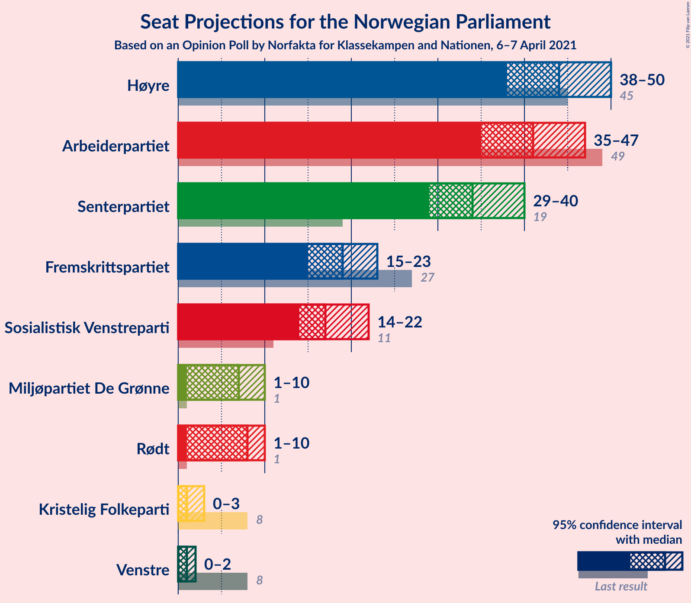

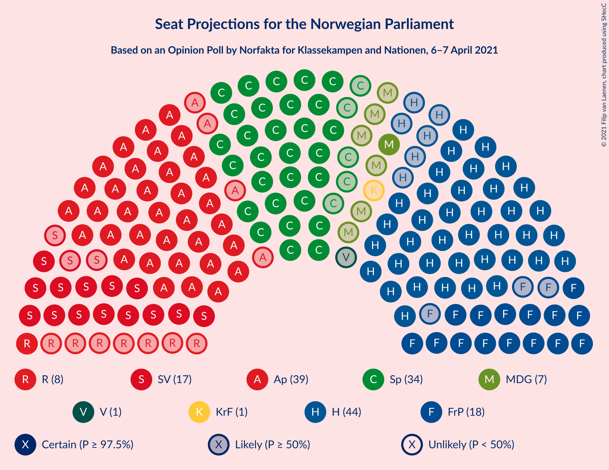

### Confidence Intervals

| Party | Last Result | Median | 80% Confidence Interval | 90% Confidence Interval | 95% Confidence Interval | 99% Confidence Interval |
|:-----:|:-----------:|:------:|:-----------------------:|:-----------------------:|:-----------------------:|:-----------------------:|
| <a href="#høyre">Høyre</a> | 45 | 44 | 40–48 |39–49 |38–50 |36–52 |
| <a href="#arbeiderpartiet">Arbeiderpartiet</a> | 49 | 41 | 37–44 |36–46 |35–47 |33–50 |
| <a href="#senterpartiet">Senterpartiet</a> | 19 | 34 | 31–38 |29–39 |29–40 |28–42 |
| <a href="#fremskrittspartiet">Fremskrittspartiet</a> | 27 | 19 | 16–22 |15–22 |15–23 |14–25 |
| <a href="#sosialistisk-venstreparti">Sosialistisk Venstreparti</a> | 11 | 17 | 15–20 |14–21 |14–22 |13–23 |
| <a href="#rødt">Rødt</a> | 1 | 8 | 2–10 |2–10 |1–10 |1–11 |
| <a href="#miljøpartiet-de-grønne">Miljøpartiet De Grønne</a> | 1 | 7 | 2–9 |2–10 |1–10 |1–11 |
| <a href="#kristelig-folkeparti">Kristelig Folkeparti</a> | 8 | 1 | 0–2 |0–3 |0–3 |0–8 |
| <a href="#venstre">Venstre</a> | 8 | 1 | 0–2 |0–2 |0–2 |0–2 |

### Høyre

*For a full overview of the results for this party, see the [Høyre](party-høyre.html) page.*

| Number of Seats | Probability | Accumulated | Special Marks |
|:---------------:|:-----------:|:-----------:|:-------------:|
| 34 | 0.1% | 100% |  |
| 35 | 0.2% | 99.9% |  |
| 36 | 0.6% | 99.8% |  |
| 37 | 1.5% | 99.2% |  |
| 38 | 1.5% | 98% |  |
| 39 | 4% | 96% |  |
| 40 | 8% | 92% |  |
| 41 | 6% | 84% |  |
| 42 | 16% | 78% |  |
| 43 | 10% | 62% |  |
| 44 | 17% | 52% | Median |
| 45 | 11% | 35% | Last Result |
| 46 | 7% | 24% |  |
| 47 | 5% | 17% |  |
| 48 | 3% | 12% |  |
| 49 | 4% | 9% |  |
| 50 | 3% | 5% |  |
| 51 | 0.9% | 2% |  |
| 52 | 0.7% | 1.0% |  |
| 53 | 0.2% | 0.4% |  |
| 54 | 0.1% | 0.2% |  |
| 55 | 0% | 0.1% |  |
| 56 | 0% | 0% |  |

### Arbeiderpartiet

*For a full overview of the results for this party, see the [Arbeiderpartiet](party-arbeiderpartiet.html) page.*

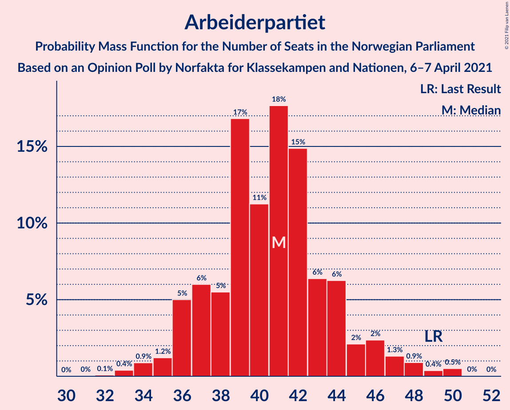

| Number of Seats | Probability | Accumulated | Special Marks |
|:---------------:|:-----------:|:-----------:|:-------------:|
| 32 | 0.1% | 100% |  |
| 33 | 0.4% | 99.9% |  |
| 34 | 0.9% | 99.5% |  |
| 35 | 1.2% | 98.6% |  |
| 36 | 5% | 97% |  |
| 37 | 6% | 92% |  |
| 38 | 5% | 86% |  |
| 39 | 17% | 81% |  |
| 40 | 11% | 64% |  |
| 41 | 18% | 53% | Median |
| 42 | 15% | 35% |  |
| 43 | 6% | 20% |  |
| 44 | 6% | 14% |  |
| 45 | 2% | 8% |  |
| 46 | 2% | 6% |  |
| 47 | 1.3% | 3% |  |
| 48 | 0.9% | 2% |  |
| 49 | 0.4% | 1.0% | Last Result |
| 50 | 0.5% | 0.6% |  |
| 51 | 0% | 0.1% |  |
| 52 | 0% | 0% |  |

### Senterpartiet

*For a full overview of the results for this party, see the [Senterpartiet](party-senterpartiet.html) page.*

| Number of Seats | Probability | Accumulated | Special Marks |
|:---------------:|:-----------:|:-----------:|:-------------:|
| 19 | 0% | 100% | Last Result |
| 20 | 0% | 100% |  |
| 21 | 0% | 100% |  |
| 22 | 0% | 100% |  |
| 23 | 0% | 100% |  |
| 24 | 0% | 100% |  |
| 25 | 0% | 100% |  |
| 26 | 0.1% | 100% |  |
| 27 | 0.2% | 99.9% |  |
| 28 | 1.0% | 99.6% |  |
| 29 | 4% | 98.6% |  |
| 30 | 4% | 95% |  |
| 31 | 6% | 91% |  |
| 32 | 12% | 85% |  |
| 33 | 9% | 73% |  |
| 34 | 20% | 63% | Median |
| 35 | 13% | 44% |  |
| 36 | 10% | 31% |  |
| 37 | 5% | 20% |  |
| 38 | 9% | 15% |  |
| 39 | 4% | 6% |  |
| 40 | 1.3% | 3% |  |
| 41 | 0.9% | 2% |  |
| 42 | 0.2% | 0.6% |  |
| 43 | 0.3% | 0.4% |  |
| 44 | 0.1% | 0.2% |  |
| 45 | 0% | 0% |  |

### Fremskrittspartiet

*For a full overview of the results for this party, see the [Fremskrittspartiet](party-fremskrittspartiet.html) page.*

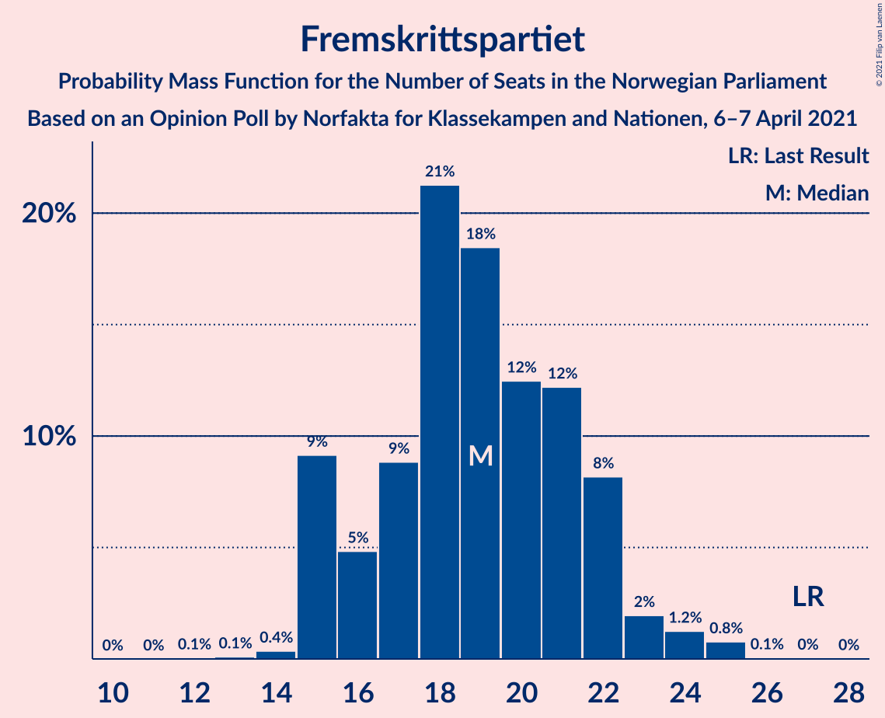

| Number of Seats | Probability | Accumulated | Special Marks |
|:---------------:|:-----------:|:-----------:|:-------------:|
| 12 | 0.1% | 100% |  |
| 13 | 0.1% | 99.9% |  |
| 14 | 0.4% | 99.8% |  |
| 15 | 9% | 99.5% |  |
| 16 | 5% | 90% |  |
| 17 | 9% | 86% |  |
| 18 | 21% | 77% |  |
| 19 | 18% | 55% | Median |
| 20 | 12% | 37% |  |
| 21 | 12% | 24% |  |
| 22 | 8% | 12% |  |
| 23 | 2% | 4% |  |
| 24 | 1.2% | 2% |  |
| 25 | 0.8% | 0.9% |  |
| 26 | 0.1% | 0.1% |  |
| 27 | 0% | 0.1% | Last Result |
| 28 | 0% | 0% |  |

### Sosialistisk Venstreparti

*For a full overview of the results for this party, see the [Sosialistisk Venstreparti](party-sosialistiskvenstreparti.html) page.*

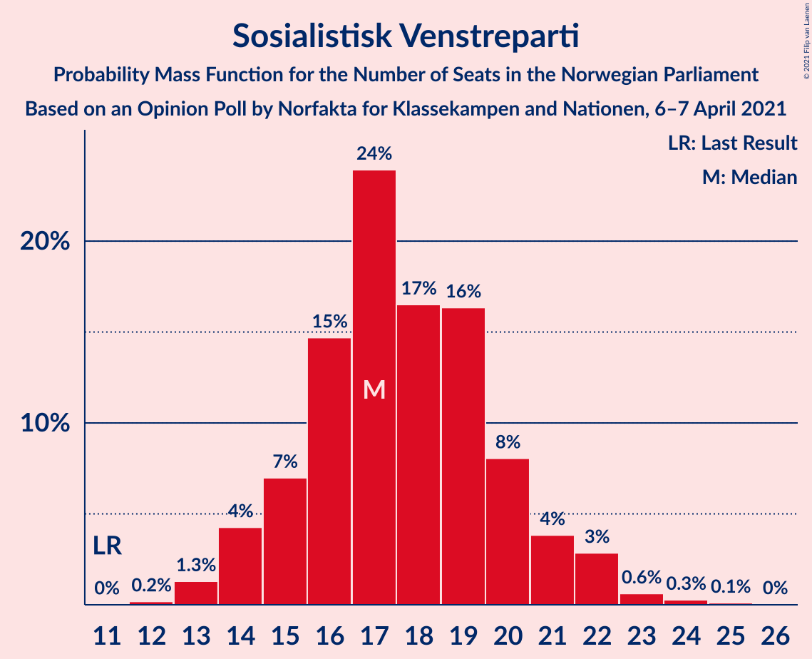

| Number of Seats | Probability | Accumulated | Special Marks |
|:---------------:|:-----------:|:-----------:|:-------------:|
| 11 | 0% | 100% | Last Result |
| 12 | 0.2% | 100% |  |
| 13 | 1.3% | 99.8% |  |
| 14 | 4% | 98% |  |
| 15 | 7% | 94% |  |
| 16 | 15% | 87% |  |
| 17 | 24% | 73% | Median |
| 18 | 17% | 49% |  |
| 19 | 16% | 32% |  |
| 20 | 8% | 16% |  |
| 21 | 4% | 8% |  |
| 22 | 3% | 4% |  |
| 23 | 0.6% | 1.0% |  |
| 24 | 0.3% | 0.4% |  |
| 25 | 0.1% | 0.1% |  |
| 26 | 0% | 0% |  |

### Rødt

*For a full overview of the results for this party, see the [Rødt](party-rødt.html) page.*

| Number of Seats | Probability | Accumulated | Special Marks |
|:---------------:|:-----------:|:-----------:|:-------------:|
| 1 | 3% | 100% | Last Result |
| 2 | 30% | 97% |  |
| 3 | 0% | 67% |  |
| 4 | 0% | 67% |  |
| 5 | 0% | 67% |  |
| 6 | 0% | 67% |  |
| 7 | 13% | 67% |  |
| 8 | 28% | 53% | Median |
| 9 | 14% | 25% |  |
| 10 | 10% | 11% |  |
| 11 | 1.1% | 1.3% |  |
| 12 | 0.1% | 0.2% |  |
| 13 | 0% | 0% |  |

### Miljøpartiet De Grønne

*For a full overview of the results for this party, see the [Miljøpartiet De Grønne](party-miljøpartietdegrønne.html) page.*

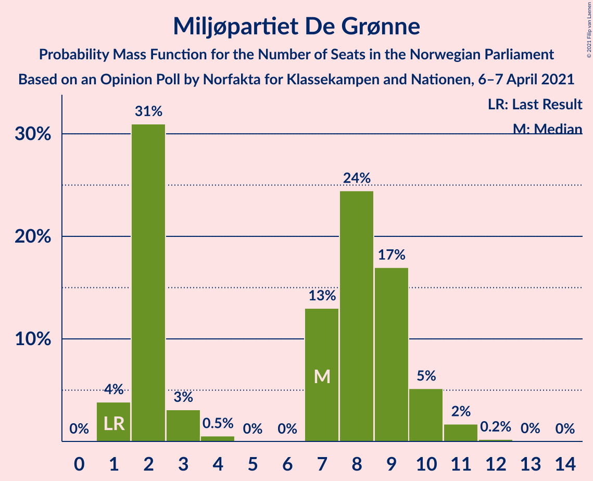

| Number of Seats | Probability | Accumulated | Special Marks |
|:---------------:|:-----------:|:-----------:|:-------------:|
| 1 | 4% | 100% | Last Result |
| 2 | 31% | 96% |  |
| 3 | 3% | 65% |  |
| 4 | 0.5% | 62% |  |
| 5 | 0% | 62% |  |
| 6 | 0% | 62% |  |
| 7 | 13% | 62% | Median |
| 8 | 24% | 49% |  |
| 9 | 17% | 24% |  |
| 10 | 5% | 7% |  |
| 11 | 2% | 2% |  |
| 12 | 0.2% | 0.3% |  |
| 13 | 0% | 0.1% |  |
| 14 | 0% | 0% |  |

### Kristelig Folkeparti

*For a full overview of the results for this party, see the [Kristelig Folkeparti](party-kristeligfolkeparti.html) page.*

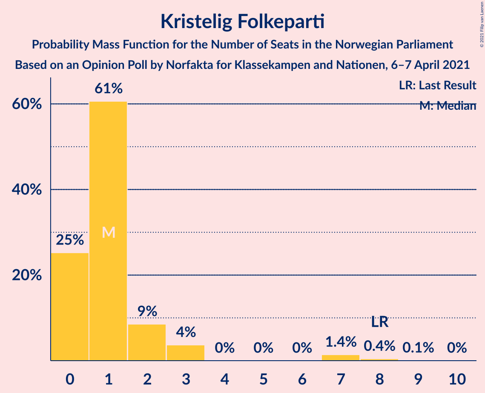

| Number of Seats | Probability | Accumulated | Special Marks |
|:---------------:|:-----------:|:-----------:|:-------------:|
| 0 | 25% | 100% |  |
| 1 | 61% | 75% | Median |
| 2 | 9% | 14% |  |
| 3 | 4% | 6% |  |
| 4 | 0% | 2% |  |
| 5 | 0% | 2% |  |
| 6 | 0% | 2% |  |
| 7 | 1.4% | 2% |  |
| 8 | 0.4% | 0.5% | Last Result |
| 9 | 0.1% | 0.1% |  |
| 10 | 0% | 0% |  |

### Venstre

*For a full overview of the results for this party, see the [Venstre](party-venstre.html) page.*

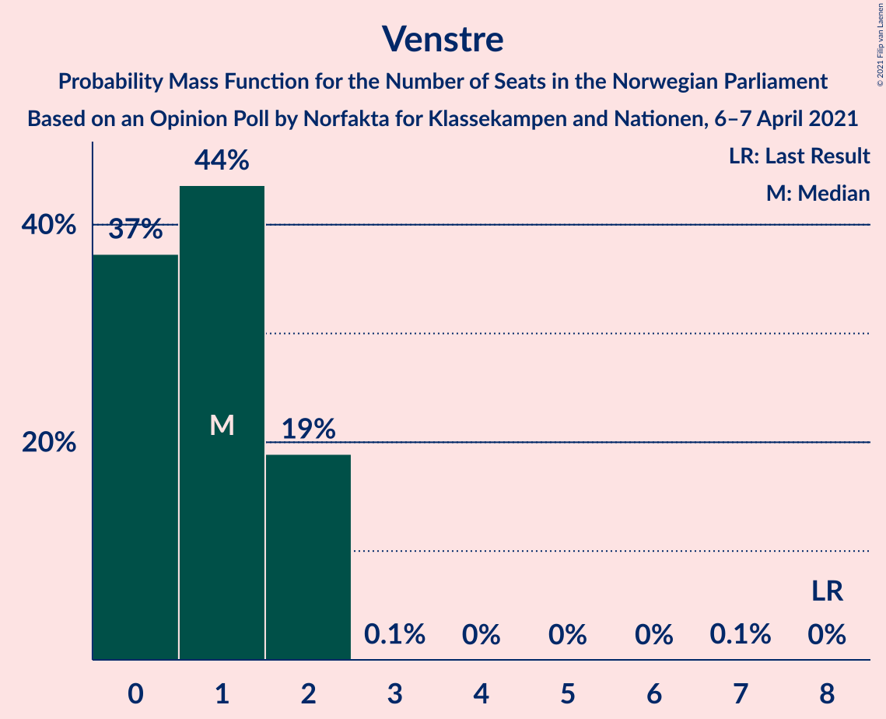

| Number of Seats | Probability | Accumulated | Special Marks |
|:---------------:|:-----------:|:-----------:|:-------------:|
| 0 | 37% | 100% |  |
| 1 | 44% | 63% | Median |
| 2 | 19% | 19% |  |
| 3 | 0.1% | 0.1% |  |
| 4 | 0% | 0.1% |  |
| 5 | 0% | 0.1% |  |
| 6 | 0% | 0.1% |  |
| 7 | 0.1% | 0.1% |  |
| 8 | 0% | 0% | Last Result |

## Coalitions

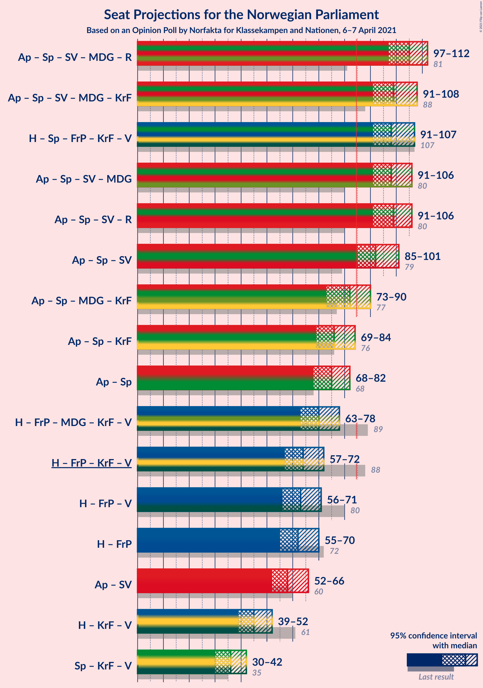

### Confidence Intervals

| Coalition | Last Result | Median | Majority? | 80% Confidence Interval | 90% Confidence Interval | 95% Confidence Interval | 99% Confidence Interval |
|:---------:|:-----------:|:------:|:---------:|:-----------------------:|:-----------------------:|:-----------------------:|:-----------------------:|
| Arbeiderpartiet – Senterpartiet – Sosialistisk Venstreparti – Miljøpartiet De Grønne – Rødt | 81 | 105 | 100% | 100–109 | 98–110 | 97–112 | 94–114 |
| Arbeiderpartiet – Senterpartiet – Sosialistisk Venstreparti – Miljøpartiet De Grønne – Kristelig Folkeparti | 88 | 99 | 100% | 94–105 | 92–106 | 91–108 | 89–110 |
| Høyre – Senterpartiet – Fremskrittspartiet – Kristelig Folkeparti – Venstre | 107 | 98 | 100% | 94–104 | 93–106 | 91–107 | 89–110 |
| Arbeiderpartiet – Senterpartiet – Sosialistisk Venstreparti – Miljøpartiet De Grønne | 80 | 98 | 100% | 93–104 | 92–105 | 91–106 | 88–109 |
| Arbeiderpartiet – Senterpartiet – Sosialistisk Venstreparti – Rødt | 80 | 99 | 100% | 93–104 | 92–106 | 91–106 | 89–108 |
| Arbeiderpartiet – Senterpartiet – Sosialistisk Venstreparti | 79 | 92 | 98% | 88–98 | 86–99 | 85–101 | 84–103 |
| Arbeiderpartiet – Senterpartiet – Miljøpartiet De Grønne – Kristelig Folkeparti | 77 | 82 | 30% | 76–87 | 75–88 | 73–90 | 71–92 |
| Arbeiderpartiet – Senterpartiet – Kristelig Folkeparti | 76 | 76 | 1.4% | 71–81 | 70–82 | 69–84 | 67–87 |
| Arbeiderpartiet – Senterpartiet | 68 | 75 | 0.7% | 70–79 | 69–81 | 68–82 | 66–86 |
| Høyre – Fremskrittspartiet – Miljøpartiet De Grønne – Kristelig Folkeparti – Venstre | 89 | 70 | 0% | 65–76 | 63–77 | 63–78 | 61–80 |
| Høyre – Fremskrittspartiet – Kristelig Folkeparti – Venstre | 88 | 64 | 0% | 60–69 | 59–71 | 57–72 | 55–75 |
| Høyre – Fremskrittspartiet – Venstre | 80 | 63 | 0% | 59–69 | 58–70 | 56–71 | 54–73 |
| Høyre – Fremskrittspartiet | 72 | 62 | 0% | 58–68 | 57–69 | 55–70 | 53–72 |
| Arbeiderpartiet – Sosialistisk Venstreparti | 60 | 58 | 0% | 54–63 | 53–65 | 52–66 | 51–68 |
| Høyre – Kristelig Folkeparti – Venstre | 61 | 45 | 0% | 42–50 | 41–51 | 39–52 | 38–54 |
| Senterpartiet – Kristelig Folkeparti – Venstre | 35 | 36 | 0% | 32–40 | 31–41 | 30–42 | 29–44 |

### Arbeiderpartiet – Senterpartiet – Sosialistisk Venstreparti – Miljøpartiet De Grønne – Rødt

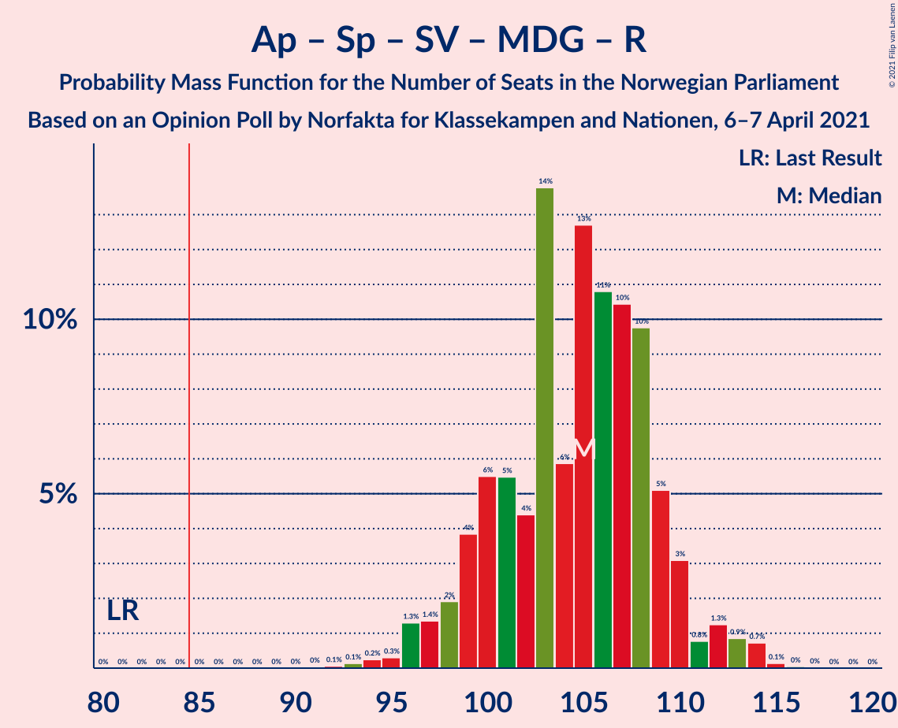

| Number of Seats | Probability | Accumulated | Special Marks |
|:---------------:|:-----------:|:-----------:|:-------------:|
| 81 | 0% | 100% | Last Result |
| 82 | 0% | 100% |  |
| 83 | 0% | 100% |  |
| 84 | 0% | 100% |  |
| 85 | 0% | 100% | Majority |
| 86 | 0% | 100% |  |
| 87 | 0% | 100% |  |
| 88 | 0% | 100% |  |
| 89 | 0% | 100% |  |
| 90 | 0% | 100% |  |
| 91 | 0% | 100% |  |
| 92 | 0.1% | 99.9% |  |
| 93 | 0.1% | 99.9% |  |
| 94 | 0.2% | 99.7% |  |
| 95 | 0.3% | 99.5% |  |
| 96 | 1.3% | 99.2% |  |
| 97 | 1.4% | 98% |  |
| 98 | 2% | 97% |  |
| 99 | 4% | 95% |  |
| 100 | 6% | 91% |  |
| 101 | 5% | 85% |  |
| 102 | 4% | 80% |  |
| 103 | 14% | 75% |  |
| 104 | 6% | 62% |  |
| 105 | 13% | 56% |  |
| 106 | 11% | 43% |  |
| 107 | 10% | 32% | Median |
| 108 | 10% | 22% |  |
| 109 | 5% | 12% |  |
| 110 | 3% | 7% |  |
| 111 | 0.8% | 4% |  |
| 112 | 1.3% | 3% |  |
| 113 | 0.9% | 2% |  |
| 114 | 0.7% | 0.9% |  |
| 115 | 0.1% | 0.2% |  |
| 116 | 0% | 0.1% |  |
| 117 | 0% | 0% |  |

### Arbeiderpartiet – Senterpartiet – Sosialistisk Venstreparti – Miljøpartiet De Grønne – Kristelig Folkeparti

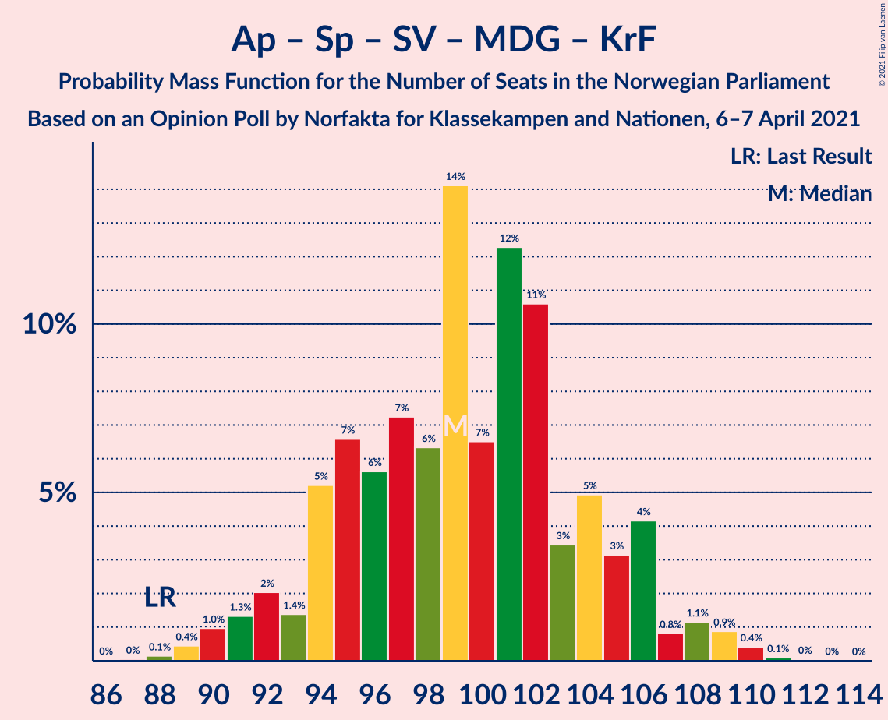

| Number of Seats | Probability | Accumulated | Special Marks |
|:---------------:|:-----------:|:-----------:|:-------------:|
| 87 | 0% | 100% |  |
| 88 | 0.1% | 99.9% | Last Result |
| 89 | 0.4% | 99.8% |  |
| 90 | 1.0% | 99.3% |  |
| 91 | 1.3% | 98% |  |
| 92 | 2% | 97% |  |
| 93 | 1.4% | 95% |  |
| 94 | 5% | 94% |  |
| 95 | 7% | 88% |  |
| 96 | 6% | 82% |  |
| 97 | 7% | 76% |  |
| 98 | 6% | 69% |  |
| 99 | 14% | 63% |  |
| 100 | 7% | 49% | Median |
| 101 | 12% | 42% |  |
| 102 | 11% | 30% |  |
| 103 | 3% | 19% |  |
| 104 | 5% | 16% |  |
| 105 | 3% | 11% |  |
| 106 | 4% | 8% |  |
| 107 | 0.8% | 3% |  |
| 108 | 1.1% | 3% |  |
| 109 | 0.9% | 1.5% |  |
| 110 | 0.4% | 0.6% |  |
| 111 | 0.1% | 0.2% |  |
| 112 | 0% | 0.1% |  |
| 113 | 0% | 0% |  |

### Høyre – Senterpartiet – Fremskrittspartiet – Kristelig Folkeparti – Venstre

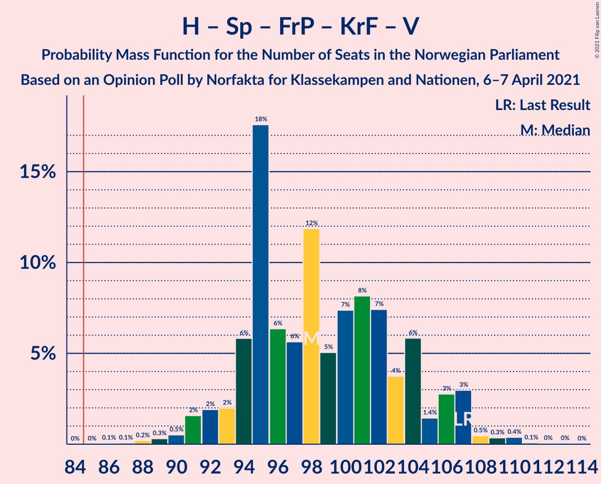

| Number of Seats | Probability | Accumulated | Special Marks |
|:---------------:|:-----------:|:-----------:|:-------------:|
| 86 | 0.1% | 100% |  |
| 87 | 0.1% | 99.9% |  |
| 88 | 0.2% | 99.9% |  |
| 89 | 0.3% | 99.7% |  |
| 90 | 0.5% | 99.4% |  |
| 91 | 2% | 98.8% |  |
| 92 | 2% | 97% |  |
| 93 | 2% | 95% |  |
| 94 | 6% | 93% |  |
| 95 | 18% | 88% |  |
| 96 | 6% | 70% |  |
| 97 | 6% | 64% |  |
| 98 | 12% | 58% |  |
| 99 | 5% | 46% | Median |
| 100 | 7% | 41% |  |
| 101 | 8% | 34% |  |
| 102 | 7% | 26% |  |
| 103 | 4% | 18% |  |
| 104 | 6% | 14% |  |
| 105 | 1.4% | 9% |  |
| 106 | 3% | 7% |  |
| 107 | 3% | 4% | Last Result |
| 108 | 0.5% | 1.4% |  |
| 109 | 0.3% | 0.9% |  |
| 110 | 0.4% | 0.5% |  |
| 111 | 0.1% | 0.2% |  |
| 112 | 0% | 0.1% |  |
| 113 | 0% | 0.1% |  |
| 114 | 0% | 0% |  |

### Arbeiderpartiet – Senterpartiet – Sosialistisk Venstreparti – Miljøpartiet De Grønne

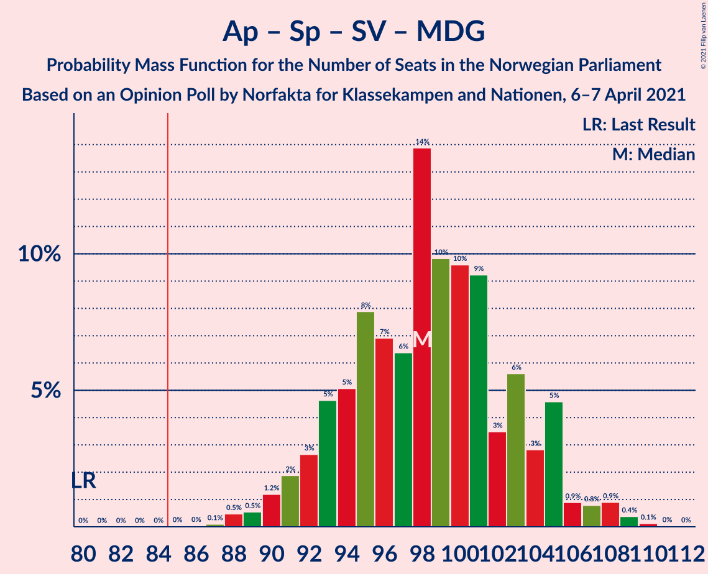

| Number of Seats | Probability | Accumulated | Special Marks |
|:---------------:|:-----------:|:-----------:|:-------------:|
| 80 | 0% | 100% | Last Result |
| 81 | 0% | 100% |  |
| 82 | 0% | 100% |  |
| 83 | 0% | 100% |  |
| 84 | 0% | 100% |  |
| 85 | 0% | 100% | Majority |
| 86 | 0% | 100% |  |
| 87 | 0.1% | 99.9% |  |
| 88 | 0.5% | 99.8% |  |
| 89 | 0.5% | 99.4% |  |
| 90 | 1.2% | 98.8% |  |
| 91 | 2% | 98% |  |
| 92 | 3% | 96% |  |
| 93 | 5% | 93% |  |
| 94 | 5% | 88% |  |
| 95 | 8% | 83% |  |
| 96 | 7% | 75% |  |
| 97 | 6% | 69% |  |
| 98 | 14% | 62% |  |
| 99 | 10% | 48% | Median |
| 100 | 10% | 38% |  |
| 101 | 9% | 29% |  |
| 102 | 3% | 20% |  |
| 103 | 6% | 16% |  |
| 104 | 3% | 11% |  |
| 105 | 5% | 8% |  |
| 106 | 0.9% | 3% |  |
| 107 | 0.8% | 2% |  |
| 108 | 0.9% | 1.5% |  |
| 109 | 0.4% | 0.6% |  |
| 110 | 0.1% | 0.2% |  |
| 111 | 0% | 0.1% |  |
| 112 | 0% | 0% |  |

### Arbeiderpartiet – Senterpartiet – Sosialistisk Venstreparti – Rødt

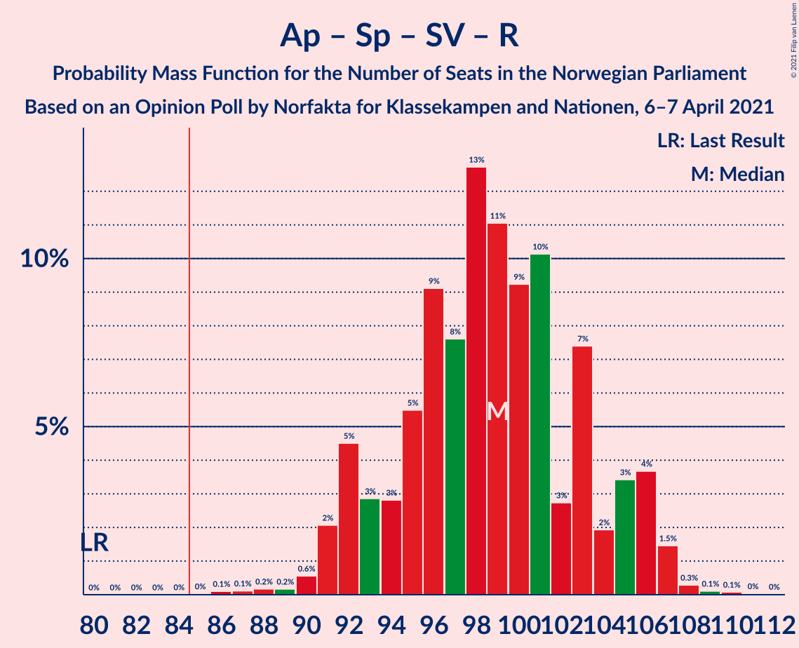

| Number of Seats | Probability | Accumulated | Special Marks |
|:---------------:|:-----------:|:-----------:|:-------------:|
| 80 | 0% | 100% | Last Result |
| 81 | 0% | 100% |  |
| 82 | 0% | 100% |  |
| 83 | 0% | 100% |  |
| 84 | 0% | 100% |  |
| 85 | 0% | 100% | Majority |
| 86 | 0.1% | 100% |  |
| 87 | 0.1% | 99.9% |  |
| 88 | 0.2% | 99.7% |  |
| 89 | 0.2% | 99.6% |  |
| 90 | 0.6% | 99.4% |  |
| 91 | 2% | 98.8% |  |
| 92 | 5% | 97% |  |
| 93 | 3% | 92% |  |
| 94 | 3% | 89% |  |
| 95 | 5% | 87% |  |
| 96 | 9% | 81% |  |
| 97 | 8% | 72% |  |
| 98 | 13% | 64% |  |
| 99 | 11% | 52% |  |
| 100 | 9% | 41% | Median |
| 101 | 10% | 31% |  |
| 102 | 3% | 21% |  |
| 103 | 7% | 18% |  |
| 104 | 2% | 11% |  |
| 105 | 3% | 9% |  |
| 106 | 4% | 6% |  |
| 107 | 1.5% | 2% |  |
| 108 | 0.3% | 0.5% |  |
| 109 | 0.1% | 0.2% |  |
| 110 | 0.1% | 0.1% |  |
| 111 | 0% | 0.1% |  |
| 112 | 0% | 0% |  |

### Arbeiderpartiet – Senterpartiet – Sosialistisk Venstreparti

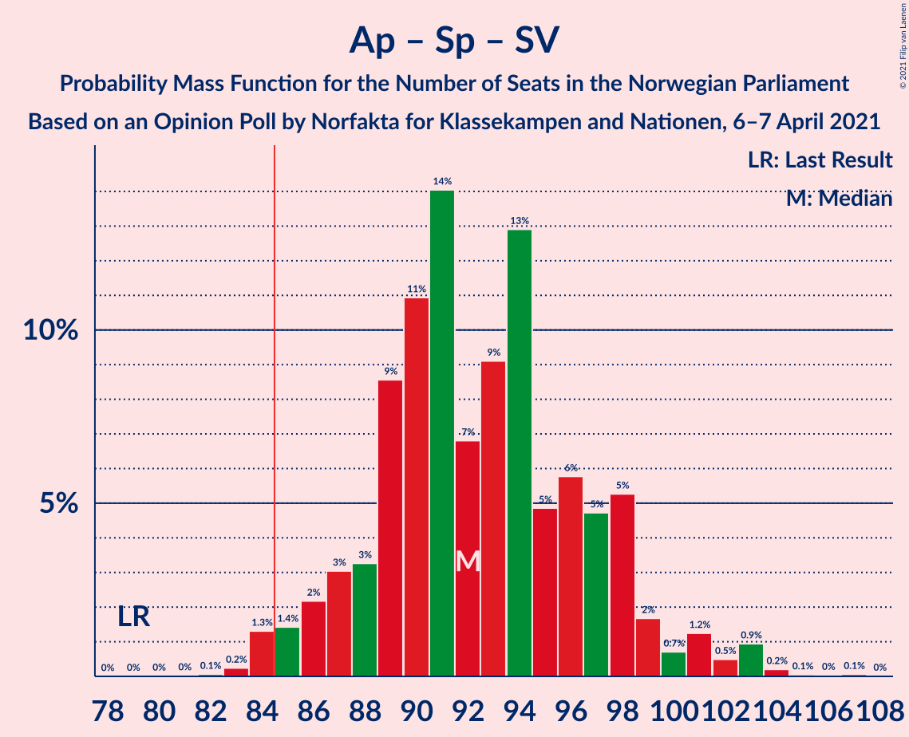

| Number of Seats | Probability | Accumulated | Special Marks |
|:---------------:|:-----------:|:-----------:|:-------------:|
| 79 | 0% | 100% | Last Result |
| 80 | 0% | 100% |  |
| 81 | 0% | 100% |  |
| 82 | 0.1% | 100% |  |
| 83 | 0.2% | 99.9% |  |
| 84 | 1.3% | 99.6% |  |
| 85 | 1.4% | 98% | Majority |
| 86 | 2% | 97% |  |
| 87 | 3% | 95% |  |
| 88 | 3% | 92% |  |
| 89 | 9% | 88% |  |
| 90 | 11% | 80% |  |
| 91 | 14% | 69% |  |
| 92 | 7% | 55% | Median |
| 93 | 9% | 48% |  |
| 94 | 13% | 39% |  |
| 95 | 5% | 26% |  |
| 96 | 6% | 21% |  |
| 97 | 5% | 15% |  |
| 98 | 5% | 11% |  |
| 99 | 2% | 5% |  |
| 100 | 0.7% | 4% |  |
| 101 | 1.2% | 3% |  |
| 102 | 0.5% | 2% |  |
| 103 | 0.9% | 1.3% |  |
| 104 | 0.2% | 0.4% |  |
| 105 | 0.1% | 0.2% |  |
| 106 | 0% | 0.1% |  |
| 107 | 0.1% | 0.1% |  |
| 108 | 0% | 0% |  |

### Arbeiderpartiet – Senterpartiet – Miljøpartiet De Grønne – Kristelig Folkeparti

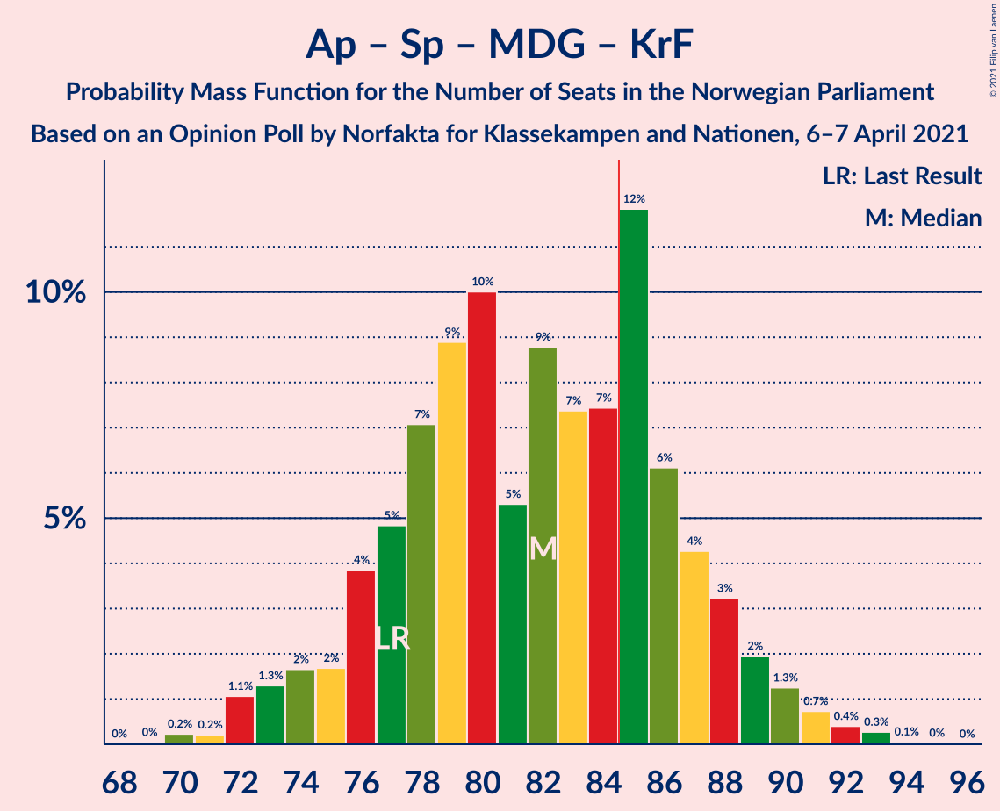

| Number of Seats | Probability | Accumulated | Special Marks |
|:---------------:|:-----------:|:-----------:|:-------------:|
| 69 | 0% | 100% |  |
| 70 | 0.2% | 99.9% |  |
| 71 | 0.2% | 99.7% |  |
| 72 | 1.1% | 99.5% |  |
| 73 | 1.3% | 98% |  |
| 74 | 2% | 97% |  |
| 75 | 2% | 95% |  |
| 76 | 4% | 94% |  |
| 77 | 5% | 90% | Last Result |
| 78 | 7% | 85% |  |
| 79 | 9% | 78% |  |
| 80 | 10% | 69% |  |
| 81 | 5% | 59% |  |
| 82 | 9% | 54% |  |
| 83 | 7% | 45% | Median |
| 84 | 7% | 38% |  |
| 85 | 12% | 30% | Majority |
| 86 | 6% | 18% |  |
| 87 | 4% | 12% |  |
| 88 | 3% | 8% |  |
| 89 | 2% | 5% |  |
| 90 | 1.3% | 3% |  |
| 91 | 0.7% | 2% |  |
| 92 | 0.4% | 0.8% |  |
| 93 | 0.3% | 0.4% |  |
| 94 | 0.1% | 0.1% |  |
| 95 | 0% | 0% |  |

### Arbeiderpartiet – Senterpartiet – Kristelig Folkeparti

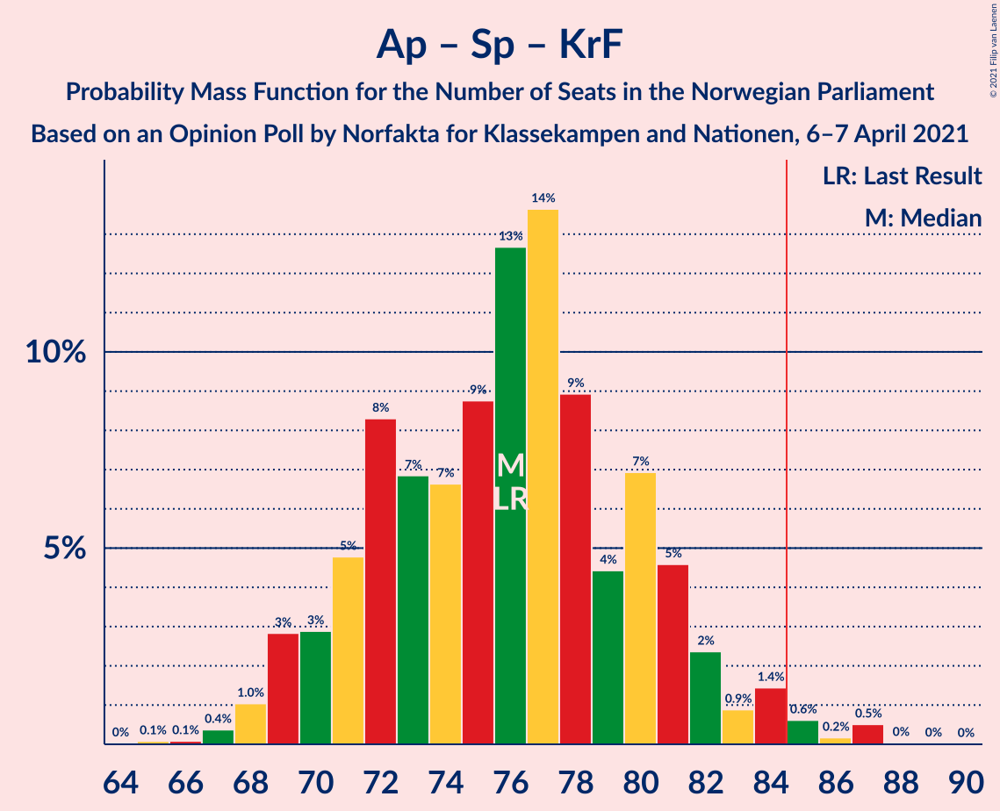

| Number of Seats | Probability | Accumulated | Special Marks |
|:---------------:|:-----------:|:-----------:|:-------------:|
| 64 | 0% | 100% |  |
| 65 | 0.1% | 99.9% |  |
| 66 | 0.1% | 99.9% |  |
| 67 | 0.4% | 99.8% |  |
| 68 | 1.0% | 99.4% |  |
| 69 | 3% | 98% |  |
| 70 | 3% | 96% |  |
| 71 | 5% | 93% |  |
| 72 | 8% | 88% |  |
| 73 | 7% | 80% |  |
| 74 | 7% | 73% |  |
| 75 | 9% | 66% |  |
| 76 | 13% | 57% | Last Result, Median |
| 77 | 14% | 45% |  |
| 78 | 9% | 31% |  |
| 79 | 4% | 22% |  |
| 80 | 7% | 18% |  |
| 81 | 5% | 11% |  |
| 82 | 2% | 6% |  |
| 83 | 0.9% | 4% |  |
| 84 | 1.4% | 3% |  |
| 85 | 0.6% | 1.4% | Majority |
| 86 | 0.2% | 0.8% |  |
| 87 | 0.5% | 0.6% |  |
| 88 | 0% | 0.1% |  |
| 89 | 0% | 0% |  |

### Arbeiderpartiet – Senterpartiet

| Number of Seats | Probability | Accumulated | Special Marks |
|:---------------:|:-----------:|:-----------:|:-------------:|
| 63 | 0% | 100% |  |
| 64 | 0.1% | 99.9% |  |
| 65 | 0.1% | 99.9% |  |
| 66 | 0.3% | 99.8% |  |
| 67 | 1.0% | 99.5% |  |
| 68 | 2% | 98% | Last Result |
| 69 | 4% | 96% |  |
| 70 | 4% | 92% |  |
| 71 | 7% | 88% |  |
| 72 | 8% | 81% |  |
| 73 | 9% | 73% |  |
| 74 | 6% | 64% |  |
| 75 | 13% | 59% | Median |
| 76 | 15% | 46% |  |
| 77 | 10% | 30% |  |
| 78 | 5% | 21% |  |
| 79 | 7% | 16% |  |
| 80 | 4% | 10% |  |
| 81 | 2% | 5% |  |
| 82 | 0.9% | 3% |  |
| 83 | 1.0% | 2% |  |
| 84 | 0.8% | 1.4% |  |
| 85 | 0.1% | 0.7% | Majority |
| 86 | 0.4% | 0.5% |  |
| 87 | 0.1% | 0.1% |  |
| 88 | 0% | 0% |  |

### Høyre – Fremskrittspartiet – Miljøpartiet De Grønne – Kristelig Folkeparti – Venstre

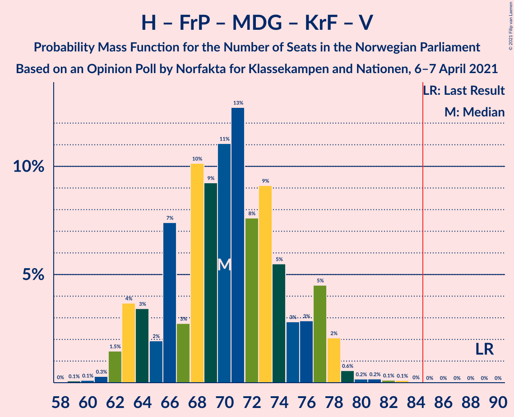

| Number of Seats | Probability | Accumulated | Special Marks |
|:---------------:|:-----------:|:-----------:|:-------------:|
| 58 | 0% | 100% |  |
| 59 | 0.1% | 99.9% |  |
| 60 | 0.1% | 99.9% |  |
| 61 | 0.3% | 99.8% |  |
| 62 | 1.5% | 99.5% |  |
| 63 | 4% | 98% |  |
| 64 | 3% | 94% |  |
| 65 | 2% | 91% |  |
| 66 | 7% | 89% |  |
| 67 | 3% | 82% |  |
| 68 | 10% | 79% |  |
| 69 | 9% | 69% |  |
| 70 | 11% | 59% |  |
| 71 | 13% | 48% |  |
| 72 | 8% | 36% | Median |
| 73 | 9% | 28% |  |
| 74 | 5% | 19% |  |
| 75 | 3% | 13% |  |
| 76 | 3% | 11% |  |
| 77 | 5% | 8% |  |
| 78 | 2% | 3% |  |
| 79 | 0.6% | 1.2% |  |
| 80 | 0.2% | 0.6% |  |
| 81 | 0.2% | 0.4% |  |
| 82 | 0.1% | 0.3% |  |
| 83 | 0.1% | 0.1% |  |
| 84 | 0% | 0% |  |
| 85 | 0% | 0% | Majority |
| 86 | 0% | 0% |  |
| 87 | 0% | 0% |  |
| 88 | 0% | 0% |  |
| 89 | 0% | 0% | Last Result |

### Høyre – Fremskrittspartiet – Kristelig Folkeparti – Venstre

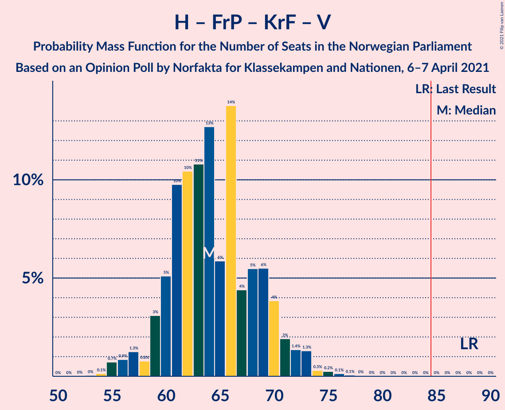

| Number of Seats | Probability | Accumulated | Special Marks |
|:---------------:|:-----------:|:-----------:|:-------------:|
| 53 | 0% | 100% |  |
| 54 | 0.1% | 99.9% |  |
| 55 | 0.7% | 99.8% |  |
| 56 | 0.9% | 99.1% |  |
| 57 | 1.3% | 98% |  |
| 58 | 0.8% | 97% |  |
| 59 | 3% | 96% |  |
| 60 | 5% | 93% |  |
| 61 | 10% | 88% |  |
| 62 | 10% | 78% |  |
| 63 | 11% | 68% |  |
| 64 | 13% | 57% |  |
| 65 | 6% | 44% | Median |
| 66 | 14% | 38% |  |
| 67 | 4% | 25% |  |
| 68 | 5% | 20% |  |
| 69 | 6% | 15% |  |
| 70 | 4% | 9% |  |
| 71 | 2% | 5% |  |
| 72 | 1.4% | 3% |  |
| 73 | 1.3% | 2% |  |
| 74 | 0.3% | 0.8% |  |
| 75 | 0.2% | 0.5% |  |
| 76 | 0.1% | 0.3% |  |
| 77 | 0.1% | 0.1% |  |
| 78 | 0% | 0.1% |  |
| 79 | 0% | 0% |  |
| 80 | 0% | 0% |  |
| 81 | 0% | 0% |  |
| 82 | 0% | 0% |  |
| 83 | 0% | 0% |  |
| 84 | 0% | 0% |  |
| 85 | 0% | 0% | Majority |
| 86 | 0% | 0% |  |
| 87 | 0% | 0% |  |
| 88 | 0% | 0% | Last Result |

### Høyre – Fremskrittspartiet – Venstre

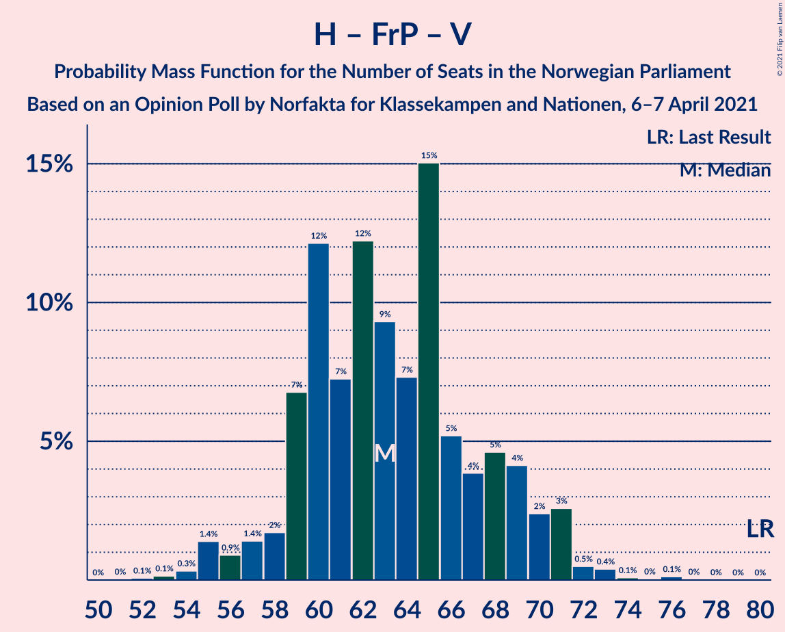

| Number of Seats | Probability | Accumulated | Special Marks |
|:---------------:|:-----------:|:-----------:|:-------------:|
| 52 | 0.1% | 100% |  |
| 53 | 0.1% | 99.9% |  |
| 54 | 0.3% | 99.7% |  |
| 55 | 1.4% | 99.4% |  |
| 56 | 0.9% | 98% |  |
| 57 | 1.4% | 97% |  |
| 58 | 2% | 96% |  |
| 59 | 7% | 94% |  |
| 60 | 12% | 87% |  |
| 61 | 7% | 75% |  |
| 62 | 12% | 68% |  |
| 63 | 9% | 56% |  |
| 64 | 7% | 46% | Median |
| 65 | 15% | 39% |  |
| 66 | 5% | 24% |  |
| 67 | 4% | 19% |  |
| 68 | 5% | 15% |  |
| 69 | 4% | 10% |  |
| 70 | 2% | 6% |  |
| 71 | 3% | 4% |  |
| 72 | 0.5% | 1.2% |  |
| 73 | 0.4% | 0.7% |  |
| 74 | 0.1% | 0.3% |  |
| 75 | 0% | 0.2% |  |
| 76 | 0.1% | 0.2% |  |
| 77 | 0% | 0% |  |
| 78 | 0% | 0% |  |
| 79 | 0% | 0% |  |
| 80 | 0% | 0% | Last Result |

### Høyre – Fremskrittspartiet

| Number of Seats | Probability | Accumulated | Special Marks |
|:---------------:|:-----------:|:-----------:|:-------------:|
| 51 | 0% | 100% |  |
| 52 | 0.1% | 99.9% |  |
| 53 | 0.4% | 99.8% |  |
| 54 | 1.2% | 99.4% |  |
| 55 | 0.9% | 98% |  |
| 56 | 0.7% | 97% |  |
| 57 | 3% | 97% |  |
| 58 | 4% | 94% |  |
| 59 | 10% | 90% |  |
| 60 | 11% | 80% |  |
| 61 | 12% | 69% |  |
| 62 | 9% | 57% |  |
| 63 | 9% | 48% | Median |
| 64 | 12% | 39% |  |
| 65 | 7% | 26% |  |
| 66 | 5% | 20% |  |
| 67 | 5% | 15% |  |
| 68 | 2% | 10% |  |
| 69 | 4% | 8% |  |
| 70 | 2% | 4% |  |
| 71 | 2% | 2% |  |
| 72 | 0.2% | 0.6% | Last Result |
| 73 | 0.2% | 0.4% |  |
| 74 | 0.1% | 0.2% |  |
| 75 | 0.1% | 0.1% |  |
| 76 | 0% | 0% |  |

### Arbeiderpartiet – Sosialistisk Venstreparti

| Number of Seats | Probability | Accumulated | Special Marks |
|:---------------:|:-----------:|:-----------:|:-------------:|
| 48 | 0.1% | 100% |  |
| 49 | 0.1% | 99.9% |  |
| 50 | 0.3% | 99.8% |  |
| 51 | 1.1% | 99.5% |  |
| 52 | 1.3% | 98% |  |
| 53 | 3% | 97% |  |
| 54 | 6% | 94% |  |
| 55 | 5% | 89% |  |
| 56 | 13% | 84% |  |
| 57 | 15% | 71% |  |
| 58 | 15% | 56% | Median |
| 59 | 13% | 40% |  |
| 60 | 6% | 27% | Last Result |
| 61 | 7% | 21% |  |
| 62 | 3% | 14% |  |
| 63 | 1.2% | 11% |  |
| 64 | 4% | 10% |  |
| 65 | 3% | 6% |  |
| 66 | 0.8% | 3% |  |
| 67 | 0.6% | 2% |  |
| 68 | 1.0% | 1.4% |  |
| 69 | 0.2% | 0.4% |  |
| 70 | 0.2% | 0.2% |  |
| 71 | 0.1% | 0.1% |  |
| 72 | 0% | 0% |  |

### Høyre – Kristelig Folkeparti – Venstre

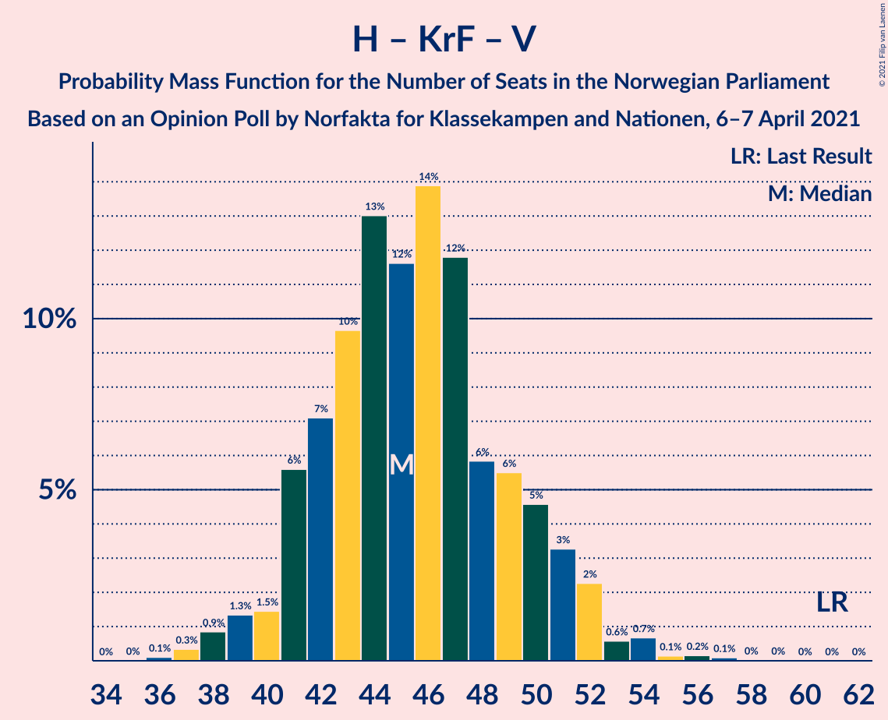

| Number of Seats | Probability | Accumulated | Special Marks |
|:---------------:|:-----------:|:-----------:|:-------------:|
| 36 | 0.1% | 100% |  |
| 37 | 0.3% | 99.9% |  |
| 38 | 0.9% | 99.5% |  |
| 39 | 1.3% | 98.7% |  |
| 40 | 1.5% | 97% |  |
| 41 | 6% | 96% |  |
| 42 | 7% | 90% |  |
| 43 | 10% | 83% |  |
| 44 | 13% | 74% |  |
| 45 | 12% | 60% |  |
| 46 | 14% | 49% | Median |
| 47 | 12% | 35% |  |
| 48 | 6% | 23% |  |
| 49 | 6% | 17% |  |
| 50 | 5% | 12% |  |
| 51 | 3% | 7% |  |
| 52 | 2% | 4% |  |
| 53 | 0.6% | 2% |  |
| 54 | 0.7% | 1.1% |  |
| 55 | 0.1% | 0.4% |  |
| 56 | 0.2% | 0.3% |  |
| 57 | 0.1% | 0.1% |  |
| 58 | 0% | 0% |  |
| 59 | 0% | 0% |  |
| 60 | 0% | 0% |  |
| 61 | 0% | 0% | Last Result |

### Senterpartiet – Kristelig Folkeparti – Venstre

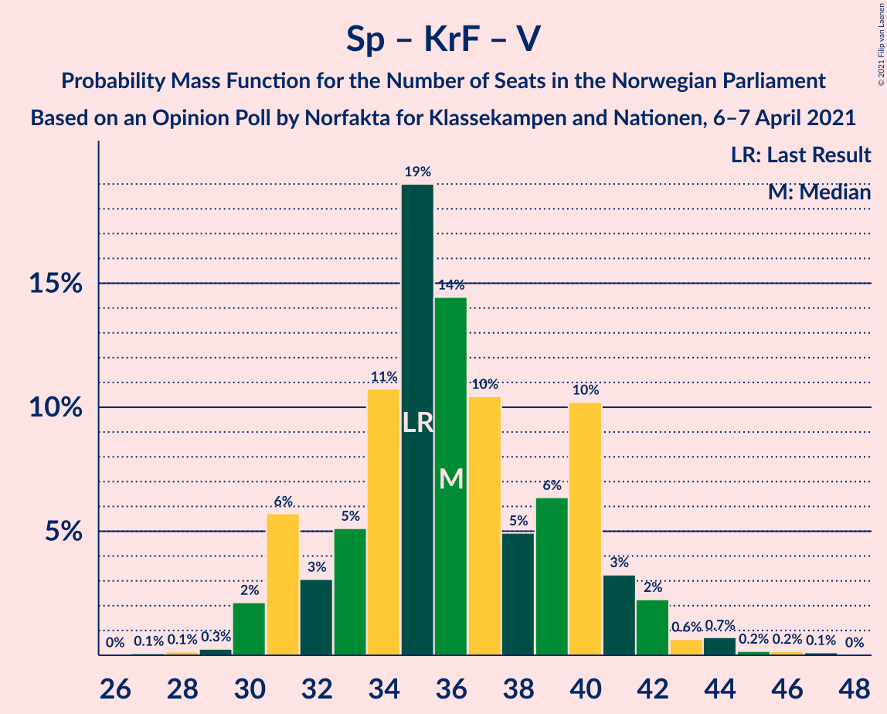

| Number of Seats | Probability | Accumulated | Special Marks |
|:---------------:|:-----------:|:-----------:|:-------------:|
| 27 | 0.1% | 100% |  |
| 28 | 0.1% | 99.9% |  |
| 29 | 0.3% | 99.8% |  |
| 30 | 2% | 99.5% |  |
| 31 | 6% | 97% |  |
| 32 | 3% | 92% |  |
| 33 | 5% | 89% |  |
| 34 | 11% | 83% |  |
| 35 | 19% | 73% | Last Result |
| 36 | 14% | 54% | Median |
| 37 | 10% | 39% |  |
| 38 | 5% | 29% |  |
| 39 | 6% | 24% |  |
| 40 | 10% | 18% |  |
| 41 | 3% | 7% |  |
| 42 | 2% | 4% |  |
| 43 | 0.6% | 2% |  |
| 44 | 0.7% | 1.2% |  |
| 45 | 0.2% | 0.5% |  |
| 46 | 0.2% | 0.3% |  |
| 47 | 0.1% | 0.1% |  |
| 48 | 0% | 0% |  |

## Technical Information

### Opinion Poll

+ **Polling firm:** Norfakta
+ **Commissioner(s):** Klassekampen and Nationen
+ **Fieldwork period:** 6–7 April 2021

### Calculations

+ **Sample size:** 740
+ **Simulations done:** 1,048,576
+ **Error estimate:** 2.13%

