# Opinion Poll by Opinion Perduco for Avisenes Nyhetsbyrå, Dagsavisen and FriFagbevegelse, 14 April 2021

<a href="#voting-intentions">Voting Intentions</a> | <a href="#seats">Seats</a> | <a href="#coalitions">Coalitions</a> | <a href="#technical-information">Technical Information</a>

## Voting Intentions

### Confidence Intervals

| Party | Last Result | Poll Result | 80% Confidence Interval | 90% Confidence Interval | 95% Confidence Interval | 99% Confidence Interval |
|:-----:|:-----------:|:-----------:|:-----------------------:|:-----------------------:|:-----------------------:|:-----------------------:|
| Arbeiderpartiet | 27.4% | 23.0% | 21.3–24.9% |20.9–25.4% |20.5–25.8% |19.7–26.7% |
| Høyre | 25.0% | 21.7% | 20.0–23.5% |19.5–24.0% |19.1–24.4% |18.4–25.3% |
| Senterpartiet | 10.3% | 19.0% | 17.4–20.7% |17.0–21.2% |16.6–21.6% |15.9–22.5% |
| Fremskrittspartiet | 15.2% | 9.4% | 8.3–10.8% |8.0–11.2% |7.7–11.5% |7.2–12.2% |
| Sosialistisk Venstreparti | 6.0% | 7.6% | 6.6–8.9% |6.4–9.2% |6.1–9.5% |5.7–10.2% |
| Miljøpartiet De Grønne | 3.2% | 5.7% | 4.9–6.8% |4.6–7.1% |4.4–7.4% |4.0–8.0% |
| Rødt | 2.4% | 4.0% | 3.3–5.0% |3.1–5.3% |3.0–5.5% |2.6–6.0% |
| Venstre | 4.4% | 3.3% | 2.7–4.2% |2.5–4.4% |2.3–4.6% |2.1–5.1% |
| Kristelig Folkeparti | 4.2% | 3.1% | 2.5–3.9% |2.3–4.2% |2.1–4.4% |1.9–4.8% |

*Note:* The poll result column reflects the actual value used in the calculations. Published results may vary slightly, and in addition be rounded to fewer digits.

## Seats

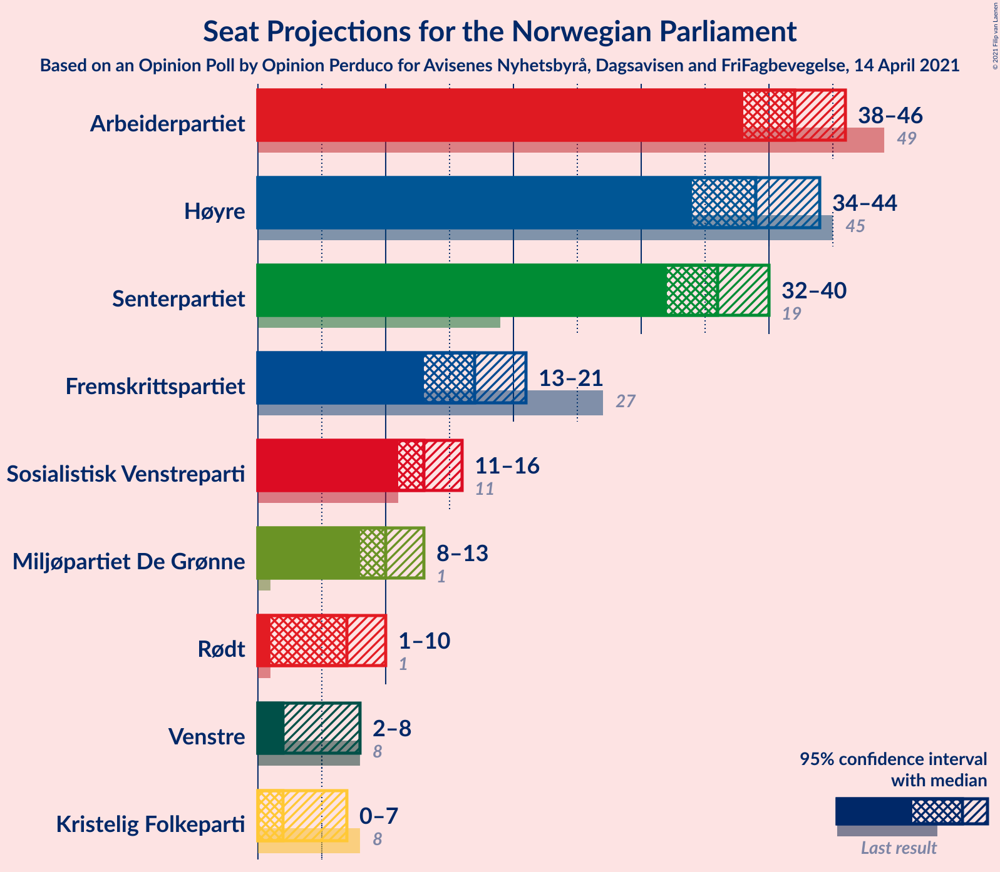

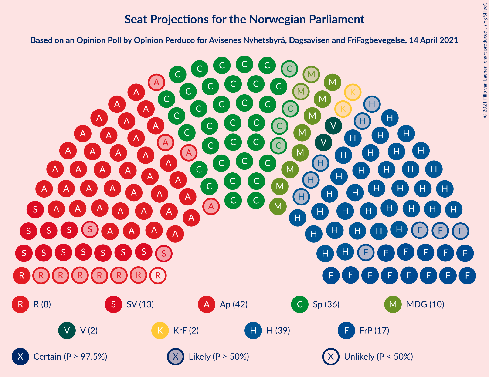

### Confidence Intervals

| Party | Last Result | Median | 80% Confidence Interval | 90% Confidence Interval | 95% Confidence Interval | 99% Confidence Interval |
|:-----:|:-----------:|:------:|:-----------------------:|:-----------------------:|:-----------------------:|:-----------------------:|
| <a href="#arbeiderpartiet">Arbeiderpartiet</a> | 49 | 42 | 39–45 |39–45 |38–46 |36–48 |
| <a href="#høyre">Høyre</a> | 45 | 39 | 35–42 |34–43 |34–44 |32–45 |
| <a href="#senterpartiet">Senterpartiet</a> | 19 | 36 | 34–38 |33–39 |32–40 |30–42 |
| <a href="#fremskrittspartiet">Fremskrittspartiet</a> | 27 | 17 | 14–20 |14–20 |13–21 |12–22 |
| <a href="#sosialistisk-venstreparti">Sosialistisk Venstreparti</a> | 11 | 13 | 12–15 |11–16 |11–16 |10–18 |
| <a href="#miljøpartiet-de-grønne">Miljøpartiet De Grønne</a> | 1 | 10 | 8–12 |8–13 |8–13 |4–14 |
| <a href="#rødt">Rødt</a> | 1 | 7 | 2–9 |2–10 |1–10 |1–11 |
| <a href="#venstre">Venstre</a> | 8 | 2 | 2–7 |2–8 |2–8 |1–9 |
| <a href="#kristelig-folkeparti">Kristelig Folkeparti</a> | 8 | 2 | 1–3 |0–7 |0–7 |0–8 |

### Arbeiderpartiet

*For a full overview of the results for this party, see the [Arbeiderpartiet](party-arbeiderpartiet.html) page.*

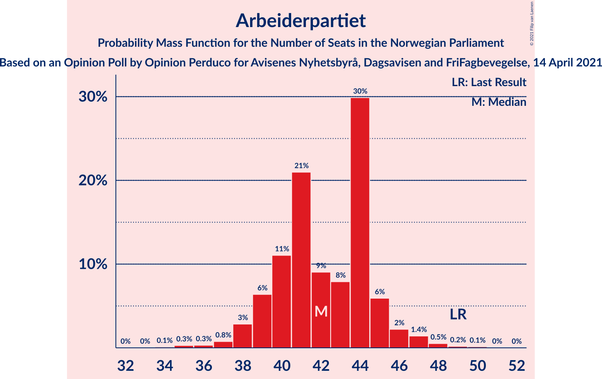

| Number of Seats | Probability | Accumulated | Special Marks |
|:---------------:|:-----------:|:-----------:|:-------------:|
| 34 | 0.1% | 100% |  |
| 35 | 0.3% | 99.9% |  |
| 36 | 0.3% | 99.6% |  |
| 37 | 0.8% | 99.3% |  |
| 38 | 3% | 98.5% |  |
| 39 | 6% | 96% |  |
| 40 | 11% | 89% |  |
| 41 | 21% | 78% |  |
| 42 | 9% | 57% | Median |
| 43 | 8% | 48% |  |
| 44 | 30% | 40% |  |
| 45 | 6% | 10% |  |
| 46 | 2% | 4% |  |
| 47 | 1.4% | 2% |  |
| 48 | 0.5% | 0.9% |  |
| 49 | 0.2% | 0.3% | Last Result |
| 50 | 0.1% | 0.2% |  |
| 51 | 0% | 0% |  |

### Høyre

*For a full overview of the results for this party, see the [Høyre](party-høyre.html) page.*

| Number of Seats | Probability | Accumulated | Special Marks |
|:---------------:|:-----------:|:-----------:|:-------------:|
| 31 | 0.1% | 100% |  |
| 32 | 0.4% | 99.9% |  |
| 33 | 1.0% | 99.4% |  |
| 34 | 6% | 98% |  |
| 35 | 11% | 92% |  |
| 36 | 4% | 81% |  |
| 37 | 14% | 77% |  |
| 38 | 8% | 63% |  |
| 39 | 14% | 55% | Median |
| 40 | 10% | 40% |  |
| 41 | 16% | 30% |  |
| 42 | 5% | 14% |  |
| 43 | 5% | 8% |  |
| 44 | 2% | 3% |  |
| 45 | 0.4% | 0.8% | Last Result |
| 46 | 0.1% | 0.4% |  |
| 47 | 0.1% | 0.3% |  |
| 48 | 0.1% | 0.2% |  |
| 49 | 0% | 0% |  |

### Senterpartiet

*For a full overview of the results for this party, see the [Senterpartiet](party-senterpartiet.html) page.*

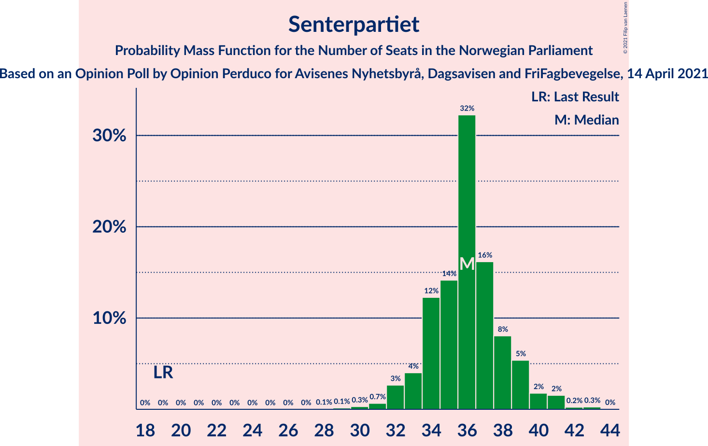

| Number of Seats | Probability | Accumulated | Special Marks |
|:---------------:|:-----------:|:-----------:|:-------------:|
| 19 | 0% | 100% | Last Result |
| 20 | 0% | 100% |  |
| 21 | 0% | 100% |  |
| 22 | 0% | 100% |  |
| 23 | 0% | 100% |  |
| 24 | 0% | 100% |  |
| 25 | 0% | 100% |  |
| 26 | 0% | 100% |  |
| 27 | 0% | 100% |  |
| 28 | 0.1% | 100% |  |
| 29 | 0.1% | 99.9% |  |
| 30 | 0.3% | 99.8% |  |
| 31 | 0.7% | 99.5% |  |
| 32 | 3% | 98.8% |  |
| 33 | 4% | 96% |  |
| 34 | 12% | 92% |  |
| 35 | 14% | 80% |  |
| 36 | 32% | 66% | Median |
| 37 | 16% | 33% |  |
| 38 | 8% | 17% |  |
| 39 | 5% | 9% |  |
| 40 | 2% | 4% |  |
| 41 | 2% | 2% |  |
| 42 | 0.2% | 0.5% |  |
| 43 | 0.3% | 0.3% |  |
| 44 | 0% | 0% |  |

### Fremskrittspartiet

*For a full overview of the results for this party, see the [Fremskrittspartiet](party-fremskrittspartiet.html) page.*

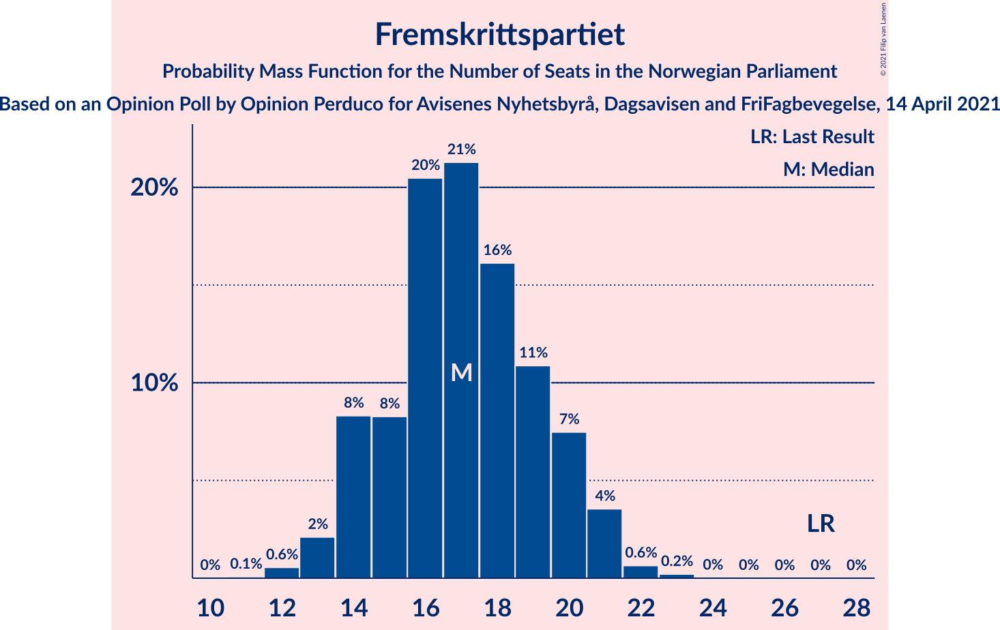

| Number of Seats | Probability | Accumulated | Special Marks |
|:---------------:|:-----------:|:-----------:|:-------------:|
| 11 | 0.1% | 100% |  |
| 12 | 0.6% | 99.9% |  |
| 13 | 2% | 99.4% |  |
| 14 | 8% | 97% |  |
| 15 | 8% | 89% |  |
| 16 | 20% | 81% |  |
| 17 | 21% | 60% | Median |
| 18 | 16% | 39% |  |
| 19 | 11% | 23% |  |
| 20 | 7% | 12% |  |
| 21 | 4% | 4% |  |
| 22 | 0.6% | 0.9% |  |
| 23 | 0.2% | 0.2% |  |
| 24 | 0% | 0% |  |
| 25 | 0% | 0% |  |
| 26 | 0% | 0% |  |
| 27 | 0% | 0% | Last Result |

### Sosialistisk Venstreparti

*For a full overview of the results for this party, see the [Sosialistisk Venstreparti](party-sosialistiskvenstreparti.html) page.*

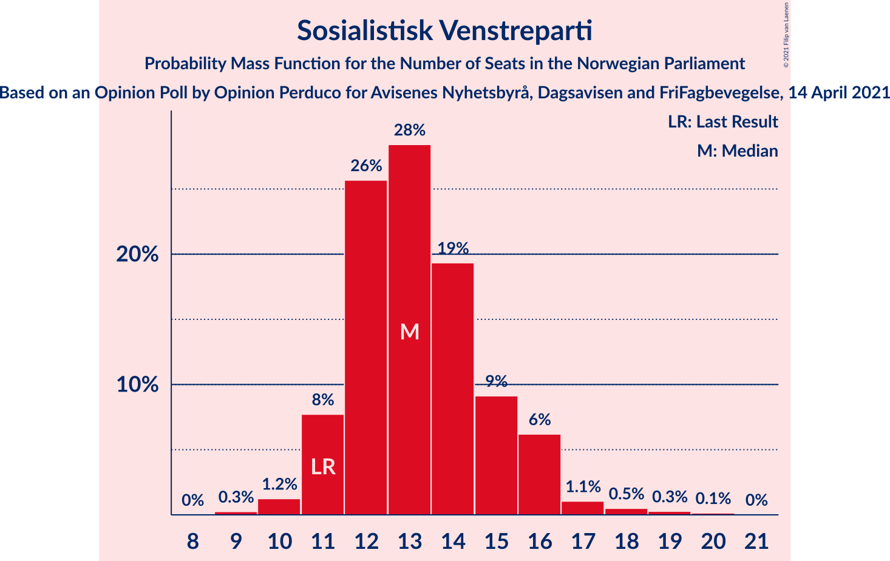

| Number of Seats | Probability | Accumulated | Special Marks |
|:---------------:|:-----------:|:-----------:|:-------------:|
| 9 | 0.3% | 100% |  |
| 10 | 1.2% | 99.7% |  |
| 11 | 8% | 98% | Last Result |
| 12 | 26% | 91% |  |
| 13 | 28% | 65% | Median |
| 14 | 19% | 37% |  |
| 15 | 9% | 17% |  |
| 16 | 6% | 8% |  |
| 17 | 1.1% | 2% |  |
| 18 | 0.5% | 0.9% |  |
| 19 | 0.3% | 0.4% |  |
| 20 | 0.1% | 0.2% |  |
| 21 | 0% | 0% |  |

### Miljøpartiet De Grønne

*For a full overview of the results for this party, see the [Miljøpartiet De Grønne](party-miljøpartietdegrønne.html) page.*

| Number of Seats | Probability | Accumulated | Special Marks |
|:---------------:|:-----------:|:-----------:|:-------------:|
| 1 | 0% | 100% | Last Result |
| 2 | 0.2% | 100% |  |
| 3 | 0.2% | 99.8% |  |
| 4 | 0.2% | 99.6% |  |
| 5 | 0% | 99.5% |  |
| 6 | 0% | 99.5% |  |
| 7 | 1.4% | 99.4% |  |
| 8 | 11% | 98% |  |
| 9 | 28% | 87% |  |
| 10 | 27% | 59% | Median |
| 11 | 16% | 32% |  |
| 12 | 11% | 16% |  |
| 13 | 4% | 5% |  |
| 14 | 1.0% | 1.3% |  |
| 15 | 0.2% | 0.3% |  |
| 16 | 0% | 0% |  |

### Rødt

*For a full overview of the results for this party, see the [Rødt](party-rødt.html) page.*

| Number of Seats | Probability | Accumulated | Special Marks |
|:---------------:|:-----------:|:-----------:|:-------------:|
| 1 | 4% | 100% | Last Result |
| 2 | 29% | 96% |  |
| 3 | 0.1% | 66% |  |
| 4 | 0% | 66% |  |
| 5 | 0% | 66% |  |
| 6 | 0.9% | 66% |  |
| 7 | 17% | 65% | Median |
| 8 | 31% | 49% |  |
| 9 | 11% | 18% |  |
| 10 | 5% | 6% |  |
| 11 | 0.8% | 0.8% |  |
| 12 | 0.1% | 0.1% |  |
| 13 | 0% | 0% |  |

### Venstre

*For a full overview of the results for this party, see the [Venstre](party-venstre.html) page.*

| Number of Seats | Probability | Accumulated | Special Marks |
|:---------------:|:-----------:|:-----------:|:-------------:|
| 0 | 0.1% | 100% |  |
| 1 | 2% | 99.9% |  |
| 2 | 70% | 98% | Median |
| 3 | 5% | 28% |  |
| 4 | 0.2% | 23% |  |
| 5 | 0% | 23% |  |
| 6 | 1.1% | 23% |  |
| 7 | 15% | 22% |  |
| 8 | 6% | 7% | Last Result |
| 9 | 1.2% | 1.4% |  |
| 10 | 0.2% | 0.2% |  |
| 11 | 0% | 0% |  |

### Kristelig Folkeparti

*For a full overview of the results for this party, see the [Kristelig Folkeparti](party-kristeligfolkeparti.html) page.*

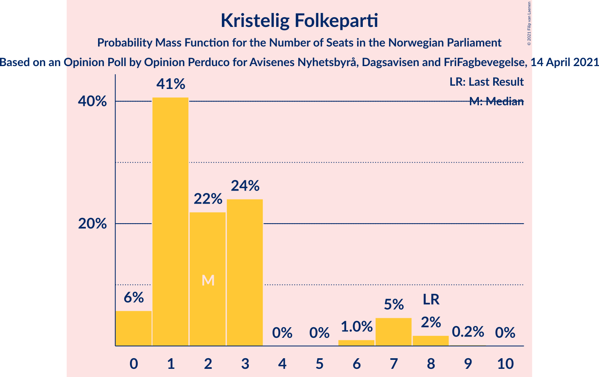

| Number of Seats | Probability | Accumulated | Special Marks |
|:---------------:|:-----------:|:-----------:|:-------------:|
| 0 | 6% | 100% |  |
| 1 | 41% | 94% |  |
| 2 | 22% | 54% | Median |
| 3 | 24% | 32% |  |
| 4 | 0% | 8% |  |
| 5 | 0% | 8% |  |
| 6 | 1.0% | 8% |  |
| 7 | 5% | 7% |  |
| 8 | 2% | 2% | Last Result |
| 9 | 0.2% | 0.2% |  |
| 10 | 0% | 0% |  |

## Coalitions

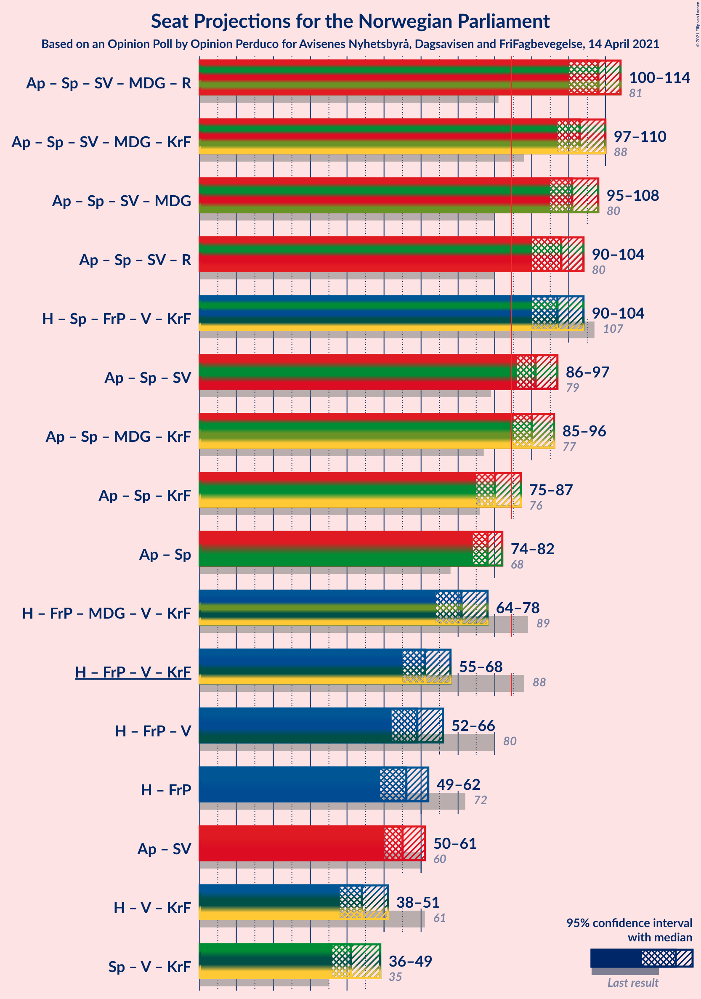

### Confidence Intervals

| Coalition | Last Result | Median | Majority? | 80% Confidence Interval | 90% Confidence Interval | 95% Confidence Interval | 99% Confidence Interval |
|:---------:|:-----------:|:------:|:---------:|:-----------------------:|:-----------------------:|:-----------------------:|:-----------------------:|
| Arbeiderpartiet – Senterpartiet – Sosialistisk Venstreparti – Miljøpartiet De Grønne – Rødt | 81 | 108 | 100% | 103–112 | 102–114 | 100–114 | 98–116 |
| Arbeiderpartiet – Senterpartiet – Sosialistisk Venstreparti – Miljøpartiet De Grønne – Kristelig Folkeparti | 88 | 103 | 100% | 100–108 | 98–109 | 97–110 | 96–113 |
| Arbeiderpartiet – Senterpartiet – Sosialistisk Venstreparti – Miljøpartiet De Grønne | 80 | 101 | 100% | 97–106 | 96–107 | 95–108 | 94–110 |
| Arbeiderpartiet – Senterpartiet – Sosialistisk Venstreparti – Rødt | 80 | 98 | 100% | 93–102 | 91–103 | 90–104 | 87–105 |
| Høyre – Senterpartiet – Fremskrittspartiet – Venstre – Kristelig Folkeparti | 107 | 97 | 100% | 92–102 | 91–103 | 90–104 | 88–106 |
| Arbeiderpartiet – Senterpartiet – Sosialistisk Venstreparti | 79 | 91 | 99.0% | 88–96 | 87–96 | 86–97 | 84–99 |
| Arbeiderpartiet – Senterpartiet – Miljøpartiet De Grønne – Kristelig Folkeparti | 77 | 90 | 98.9% | 87–93 | 86–95 | 85–96 | 83–98 |
| Arbeiderpartiet – Senterpartiet – Kristelig Folkeparti | 76 | 80 | 6% | 77–83 | 76–86 | 75–87 | 73–89 |
| Arbeiderpartiet – Senterpartiet | 68 | 78 | 0.6% | 75–81 | 75–81 | 74–82 | 72–85 |
| Høyre – Fremskrittspartiet – Miljøpartiet De Grønne – Venstre – Kristelig Folkeparti | 89 | 71 | 0% | 66–76 | 65–78 | 64–78 | 63–81 |
| Høyre – Fremskrittspartiet – Venstre – Kristelig Folkeparti | 88 | 61 | 0% | 56–65 | 55–67 | 55–68 | 53–71 |
| Høyre – Fremskrittspartiet – Venstre | 80 | 59 | 0% | 54–63 | 53–65 | 52–66 | 50–68 |
| Høyre – Fremskrittspartiet | 72 | 56 | 0% | 51–60 | 50–61 | 49–62 | 48–64 |
| Arbeiderpartiet – Sosialistisk Venstreparti | 60 | 55 | 0% | 52–59 | 51–60 | 50–61 | 49–64 |
| Høyre – Venstre – Kristelig Folkeparti | 61 | 44 | 0% | 40–48 | 39–50 | 38–51 | 37–53 |
| Senterpartiet – Venstre – Kristelig Folkeparti | 35 | 41 | 0% | 38–46 | 37–47 | 36–49 | 34–52 |

### Arbeiderpartiet – Senterpartiet – Sosialistisk Venstreparti – Miljøpartiet De Grønne – Rødt

| Number of Seats | Probability | Accumulated | Special Marks |
|:---------------:|:-----------:|:-----------:|:-------------:|
| 81 | 0% | 100% | Last Result |
| 82 | 0% | 100% |  |
| 83 | 0% | 100% |  |
| 84 | 0% | 100% |  |
| 85 | 0% | 100% | Majority |
| 86 | 0% | 100% |  |
| 87 | 0% | 100% |  |
| 88 | 0% | 100% |  |
| 89 | 0% | 100% |  |
| 90 | 0% | 100% |  |
| 91 | 0% | 100% |  |
| 92 | 0% | 100% |  |
| 93 | 0% | 100% |  |
| 94 | 0% | 100% |  |
| 95 | 0% | 100% |  |
| 96 | 0% | 99.9% |  |
| 97 | 0.2% | 99.9% |  |
| 98 | 0.5% | 99.7% |  |
| 99 | 0.5% | 99.2% |  |
| 100 | 1.4% | 98.6% |  |
| 101 | 1.3% | 97% |  |
| 102 | 4% | 96% |  |
| 103 | 5% | 92% |  |
| 104 | 7% | 87% |  |
| 105 | 10% | 80% |  |
| 106 | 7% | 70% |  |
| 107 | 11% | 62% |  |
| 108 | 12% | 51% | Median |
| 109 | 13% | 38% |  |
| 110 | 10% | 26% |  |
| 111 | 5% | 16% |  |
| 112 | 3% | 11% |  |
| 113 | 3% | 9% |  |
| 114 | 4% | 5% |  |
| 115 | 0.5% | 1.0% |  |
| 116 | 0.5% | 0.5% |  |
| 117 | 0% | 0.1% |  |
| 118 | 0% | 0% |  |

### Arbeiderpartiet – Senterpartiet – Sosialistisk Venstreparti – Miljøpartiet De Grønne – Kristelig Folkeparti

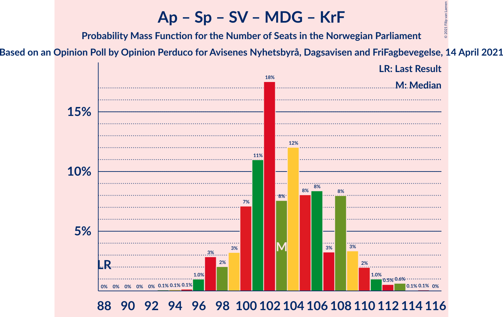

| Number of Seats | Probability | Accumulated | Special Marks |
|:---------------:|:-----------:|:-----------:|:-------------:|
| 88 | 0% | 100% | Last Result |
| 89 | 0% | 100% |  |
| 90 | 0% | 100% |  |
| 91 | 0% | 100% |  |
| 92 | 0% | 100% |  |
| 93 | 0.1% | 100% |  |
| 94 | 0.1% | 99.9% |  |
| 95 | 0.1% | 99.8% |  |
| 96 | 1.0% | 99.6% |  |
| 97 | 3% | 98.7% |  |
| 98 | 2% | 96% |  |
| 99 | 3% | 94% |  |
| 100 | 7% | 91% |  |
| 101 | 11% | 83% |  |
| 102 | 18% | 72% |  |
| 103 | 8% | 55% | Median |
| 104 | 12% | 47% |  |
| 105 | 8% | 35% |  |
| 106 | 8% | 27% |  |
| 107 | 3% | 19% |  |
| 108 | 8% | 16% |  |
| 109 | 3% | 8% |  |
| 110 | 2% | 4% |  |
| 111 | 1.0% | 2% |  |
| 112 | 0.5% | 1.3% |  |
| 113 | 0.6% | 0.8% |  |
| 114 | 0.1% | 0.2% |  |
| 115 | 0.1% | 0.1% |  |
| 116 | 0% | 0% |  |

### Arbeiderpartiet – Senterpartiet – Sosialistisk Venstreparti – Miljøpartiet De Grønne

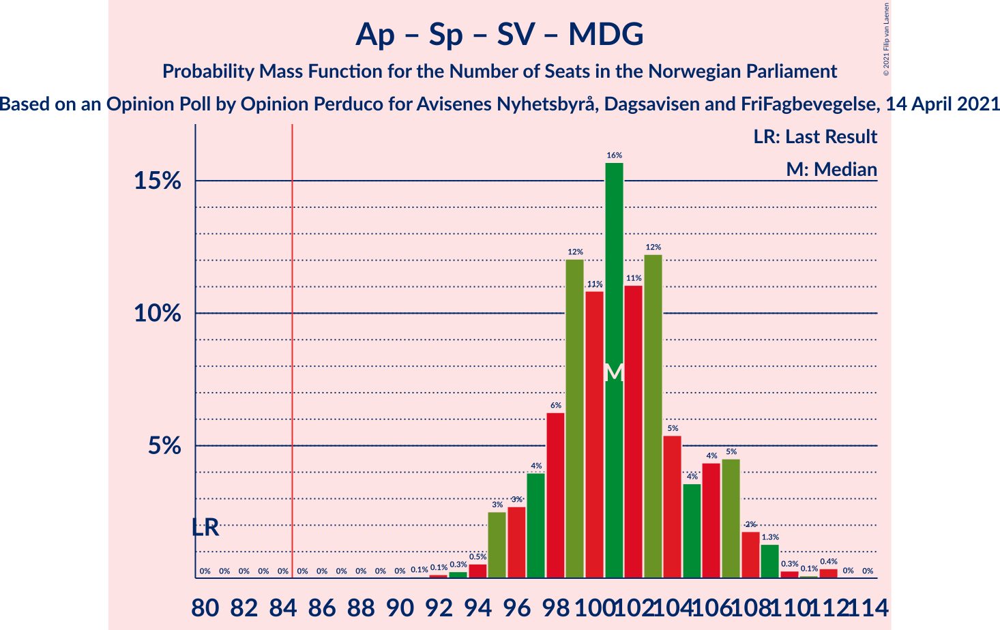

| Number of Seats | Probability | Accumulated | Special Marks |
|:---------------:|:-----------:|:-----------:|:-------------:|
| 80 | 0% | 100% | Last Result |
| 81 | 0% | 100% |  |
| 82 | 0% | 100% |  |
| 83 | 0% | 100% |  |
| 84 | 0% | 100% |  |
| 85 | 0% | 100% | Majority |
| 86 | 0% | 100% |  |
| 87 | 0% | 100% |  |
| 88 | 0% | 100% |  |
| 89 | 0% | 100% |  |
| 90 | 0% | 100% |  |
| 91 | 0.1% | 100% |  |
| 92 | 0.1% | 99.9% |  |
| 93 | 0.3% | 99.8% |  |
| 94 | 0.5% | 99.5% |  |
| 95 | 3% | 99.0% |  |
| 96 | 3% | 96% |  |
| 97 | 4% | 94% |  |
| 98 | 6% | 90% |  |
| 99 | 12% | 84% |  |
| 100 | 11% | 71% |  |
| 101 | 16% | 61% | Median |
| 102 | 11% | 45% |  |
| 103 | 12% | 34% |  |
| 104 | 5% | 22% |  |
| 105 | 4% | 16% |  |
| 106 | 4% | 13% |  |
| 107 | 5% | 8% |  |
| 108 | 2% | 4% |  |
| 109 | 1.3% | 2% |  |
| 110 | 0.3% | 0.8% |  |
| 111 | 0.1% | 0.5% |  |
| 112 | 0.4% | 0.4% |  |
| 113 | 0% | 0% |  |

### Arbeiderpartiet – Senterpartiet – Sosialistisk Venstreparti – Rødt

| Number of Seats | Probability | Accumulated | Special Marks |
|:---------------:|:-----------:|:-----------:|:-------------:|
| 80 | 0% | 100% | Last Result |
| 81 | 0% | 100% |  |
| 82 | 0% | 100% |  |
| 83 | 0% | 100% |  |
| 84 | 0% | 100% |  |
| 85 | 0% | 100% | Majority |
| 86 | 0.1% | 100% |  |
| 87 | 0.4% | 99.9% |  |
| 88 | 0.3% | 99.5% |  |
| 89 | 1.0% | 99.2% |  |
| 90 | 1.1% | 98% |  |
| 91 | 3% | 97% |  |
| 92 | 2% | 94% |  |
| 93 | 5% | 92% |  |
| 94 | 8% | 86% |  |
| 95 | 6% | 78% |  |
| 96 | 8% | 72% |  |
| 97 | 10% | 64% |  |
| 98 | 17% | 54% | Median |
| 99 | 11% | 38% |  |
| 100 | 9% | 27% |  |
| 101 | 5% | 17% |  |
| 102 | 4% | 12% |  |
| 103 | 4% | 9% |  |
| 104 | 4% | 5% |  |
| 105 | 0.5% | 0.7% |  |
| 106 | 0.2% | 0.2% |  |
| 107 | 0% | 0.1% |  |
| 108 | 0% | 0% |  |

### Høyre – Senterpartiet – Fremskrittspartiet – Venstre – Kristelig Folkeparti

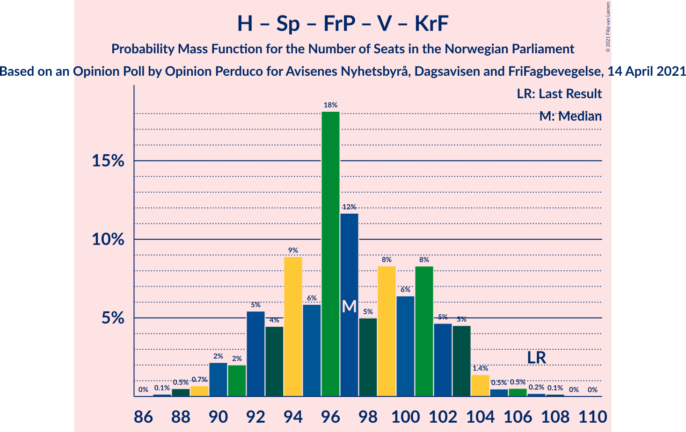

| Number of Seats | Probability | Accumulated | Special Marks |
|:---------------:|:-----------:|:-----------:|:-------------:|
| 86 | 0% | 100% |  |
| 87 | 0.1% | 99.9% |  |
| 88 | 0.5% | 99.8% |  |
| 89 | 0.7% | 99.3% |  |
| 90 | 2% | 98.6% |  |
| 91 | 2% | 96% |  |
| 92 | 5% | 94% |  |
| 93 | 4% | 89% |  |
| 94 | 9% | 85% |  |
| 95 | 6% | 76% |  |
| 96 | 18% | 70% | Median |
| 97 | 12% | 52% |  |
| 98 | 5% | 40% |  |
| 99 | 8% | 35% |  |
| 100 | 6% | 27% |  |
| 101 | 8% | 20% |  |
| 102 | 5% | 12% |  |
| 103 | 5% | 7% |  |
| 104 | 1.4% | 3% |  |
| 105 | 0.5% | 1.4% |  |
| 106 | 0.5% | 0.9% |  |
| 107 | 0.2% | 0.4% | Last Result |
| 108 | 0.1% | 0.2% |  |
| 109 | 0% | 0.1% |  |
| 110 | 0% | 0% |  |

### Arbeiderpartiet – Senterpartiet – Sosialistisk Venstreparti

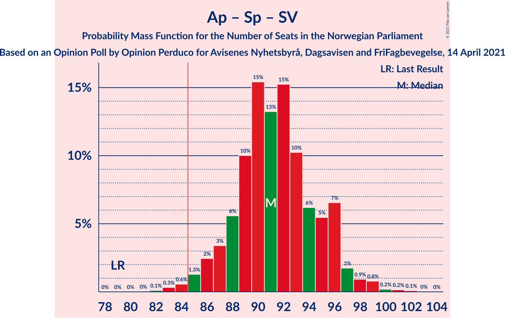

| Number of Seats | Probability | Accumulated | Special Marks |
|:---------------:|:-----------:|:-----------:|:-------------:|
| 79 | 0% | 100% | Last Result |
| 80 | 0% | 100% |  |
| 81 | 0% | 100% |  |
| 82 | 0.1% | 100% |  |
| 83 | 0.3% | 99.9% |  |
| 84 | 0.6% | 99.5% |  |
| 85 | 1.3% | 99.0% | Majority |
| 86 | 2% | 98% |  |
| 87 | 3% | 95% |  |
| 88 | 6% | 92% |  |
| 89 | 10% | 86% |  |
| 90 | 15% | 76% |  |
| 91 | 13% | 61% | Median |
| 92 | 15% | 48% |  |
| 93 | 10% | 32% |  |
| 94 | 6% | 22% |  |
| 95 | 5% | 16% |  |
| 96 | 7% | 10% |  |
| 97 | 2% | 4% |  |
| 98 | 0.9% | 2% |  |
| 99 | 0.8% | 1.2% |  |
| 100 | 0.2% | 0.5% |  |
| 101 | 0.2% | 0.3% |  |
| 102 | 0.1% | 0.1% |  |
| 103 | 0% | 0% |  |

### Arbeiderpartiet – Senterpartiet – Miljøpartiet De Grønne – Kristelig Folkeparti

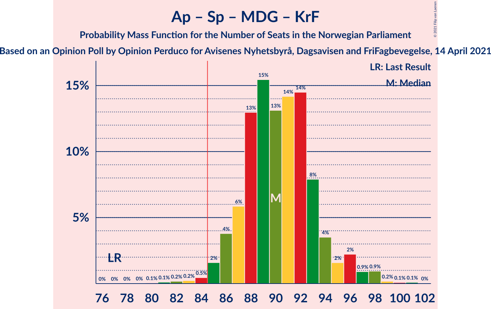

| Number of Seats | Probability | Accumulated | Special Marks |
|:---------------:|:-----------:|:-----------:|:-------------:|
| 77 | 0% | 100% | Last Result |
| 78 | 0% | 100% |  |
| 79 | 0% | 100% |  |
| 80 | 0.1% | 100% |  |
| 81 | 0.1% | 99.9% |  |
| 82 | 0.2% | 99.8% |  |
| 83 | 0.2% | 99.6% |  |
| 84 | 0.5% | 99.4% |  |
| 85 | 2% | 98.9% | Majority |
| 86 | 4% | 97% |  |
| 87 | 6% | 94% |  |
| 88 | 13% | 88% |  |
| 89 | 15% | 75% |  |
| 90 | 13% | 59% | Median |
| 91 | 14% | 46% |  |
| 92 | 14% | 32% |  |
| 93 | 8% | 17% |  |
| 94 | 4% | 10% |  |
| 95 | 2% | 6% |  |
| 96 | 2% | 4% |  |
| 97 | 0.9% | 2% |  |
| 98 | 0.9% | 1.3% |  |
| 99 | 0.2% | 0.4% |  |
| 100 | 0.1% | 0.2% |  |
| 101 | 0.1% | 0.1% |  |
| 102 | 0% | 0% |  |

### Arbeiderpartiet – Senterpartiet – Kristelig Folkeparti

| Number of Seats | Probability | Accumulated | Special Marks |
|:---------------:|:-----------:|:-----------:|:-------------:|
| 70 | 0% | 100% |  |
| 71 | 0.1% | 99.9% |  |
| 72 | 0.2% | 99.9% |  |
| 73 | 0.3% | 99.7% |  |
| 74 | 0.9% | 99.4% |  |
| 75 | 1.4% | 98.5% |  |
| 76 | 4% | 97% | Last Result |
| 77 | 7% | 93% |  |
| 78 | 10% | 86% |  |
| 79 | 14% | 76% |  |
| 80 | 14% | 62% | Median |
| 81 | 17% | 48% |  |
| 82 | 12% | 30% |  |
| 83 | 10% | 19% |  |
| 84 | 3% | 9% |  |
| 85 | 1.3% | 6% | Majority |
| 86 | 2% | 5% |  |
| 87 | 2% | 3% |  |
| 88 | 0.6% | 1.2% |  |
| 89 | 0.4% | 0.5% |  |
| 90 | 0.1% | 0.2% |  |
| 91 | 0.1% | 0.1% |  |
| 92 | 0% | 0% |  |

### Arbeiderpartiet – Senterpartiet

| Number of Seats | Probability | Accumulated | Special Marks |
|:---------------:|:-----------:|:-----------:|:-------------:|
| 68 | 0% | 100% | Last Result |
| 69 | 0% | 99.9% |  |
| 70 | 0.2% | 99.9% |  |
| 71 | 0.2% | 99.7% |  |
| 72 | 0.6% | 99.5% |  |
| 73 | 1.2% | 98.9% |  |
| 74 | 2% | 98% |  |
| 75 | 6% | 96% |  |
| 76 | 11% | 90% |  |
| 77 | 15% | 79% |  |
| 78 | 19% | 64% | Median |
| 79 | 12% | 45% |  |
| 80 | 21% | 33% |  |
| 81 | 7% | 12% |  |
| 82 | 3% | 5% |  |
| 83 | 1.0% | 2% |  |
| 84 | 0.4% | 1.0% |  |
| 85 | 0.4% | 0.6% | Majority |
| 86 | 0.1% | 0.2% |  |
| 87 | 0% | 0.1% |  |
| 88 | 0% | 0.1% |  |
| 89 | 0% | 0% |  |

### Høyre – Fremskrittspartiet – Miljøpartiet De Grønne – Venstre – Kristelig Folkeparti

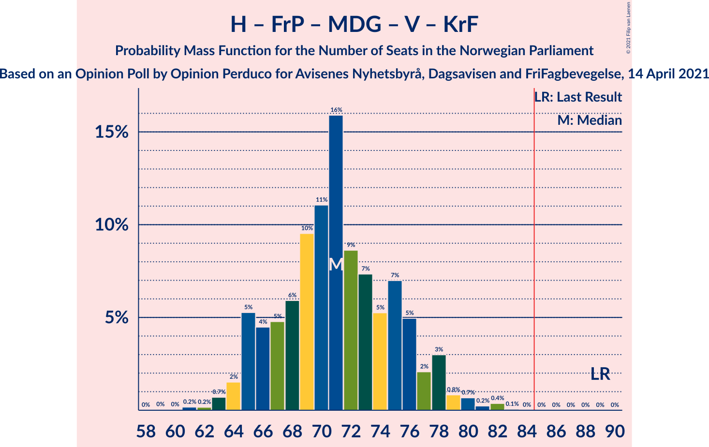

| Number of Seats | Probability | Accumulated | Special Marks |
|:---------------:|:-----------:|:-----------:|:-------------:|
| 59 | 0% | 100% |  |
| 60 | 0% | 99.9% |  |
| 61 | 0.2% | 99.9% |  |
| 62 | 0.2% | 99.7% |  |
| 63 | 0.7% | 99.6% |  |
| 64 | 2% | 98.9% |  |
| 65 | 5% | 97% |  |
| 66 | 4% | 92% |  |
| 67 | 5% | 88% |  |
| 68 | 6% | 83% |  |
| 69 | 10% | 77% |  |
| 70 | 11% | 67% | Median |
| 71 | 16% | 56% |  |
| 72 | 9% | 40% |  |
| 73 | 7% | 32% |  |
| 74 | 5% | 24% |  |
| 75 | 7% | 19% |  |
| 76 | 5% | 12% |  |
| 77 | 2% | 7% |  |
| 78 | 3% | 5% |  |
| 79 | 0.8% | 2% |  |
| 80 | 0.7% | 1.3% |  |
| 81 | 0.2% | 0.7% |  |
| 82 | 0.4% | 0.4% |  |
| 83 | 0.1% | 0.1% |  |
| 84 | 0% | 0% |  |
| 85 | 0% | 0% | Majority |
| 86 | 0% | 0% |  |
| 87 | 0% | 0% |  |
| 88 | 0% | 0% |  |
| 89 | 0% | 0% | Last Result |

### Høyre – Fremskrittspartiet – Venstre – Kristelig Folkeparti

| Number of Seats | Probability | Accumulated | Special Marks |
|:---------------:|:-----------:|:-----------:|:-------------:|
| 51 | 0% | 100% |  |
| 52 | 0.2% | 99.9% |  |
| 53 | 0.6% | 99.8% |  |
| 54 | 1.3% | 99.1% |  |
| 55 | 5% | 98% |  |
| 56 | 4% | 93% |  |
| 57 | 4% | 89% |  |
| 58 | 6% | 85% |  |
| 59 | 10% | 79% |  |
| 60 | 13% | 69% | Median |
| 61 | 12% | 56% |  |
| 62 | 11% | 44% |  |
| 63 | 7% | 32% |  |
| 64 | 9% | 26% |  |
| 65 | 7% | 17% |  |
| 66 | 4% | 10% |  |
| 67 | 3% | 6% |  |
| 68 | 0.9% | 3% |  |
| 69 | 0.8% | 2% |  |
| 70 | 0.4% | 0.9% |  |
| 71 | 0.3% | 0.5% |  |
| 72 | 0.2% | 0.2% |  |
| 73 | 0% | 0% |  |
| 74 | 0% | 0% |  |
| 75 | 0% | 0% |  |
| 76 | 0% | 0% |  |
| 77 | 0% | 0% |  |
| 78 | 0% | 0% |  |
| 79 | 0% | 0% |  |
| 80 | 0% | 0% |  |
| 81 | 0% | 0% |  |
| 82 | 0% | 0% |  |
| 83 | 0% | 0% |  |
| 84 | 0% | 0% |  |
| 85 | 0% | 0% | Majority |
| 86 | 0% | 0% |  |
| 87 | 0% | 0% |  |
| 88 | 0% | 0% | Last Result |

### Høyre – Fremskrittspartiet – Venstre

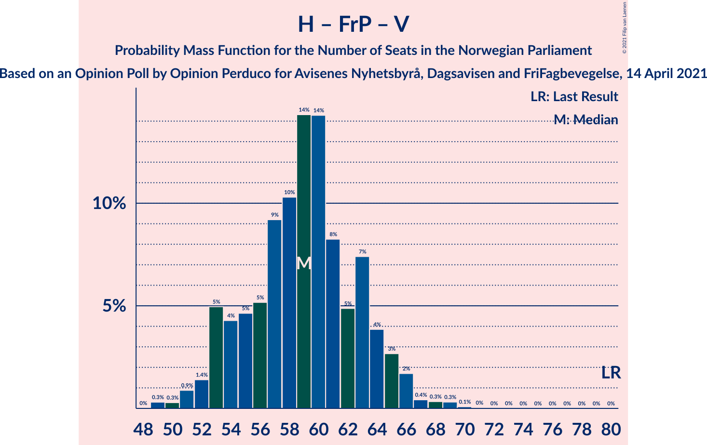

| Number of Seats | Probability | Accumulated | Special Marks |
|:---------------:|:-----------:|:-----------:|:-------------:|
| 49 | 0.3% | 100% |  |
| 50 | 0.3% | 99.7% |  |
| 51 | 0.9% | 99.4% |  |
| 52 | 1.4% | 98.5% |  |
| 53 | 5% | 97% |  |
| 54 | 4% | 92% |  |
| 55 | 5% | 88% |  |
| 56 | 5% | 83% |  |
| 57 | 9% | 78% |  |
| 58 | 10% | 69% | Median |
| 59 | 14% | 59% |  |
| 60 | 14% | 44% |  |
| 61 | 8% | 30% |  |
| 62 | 5% | 22% |  |
| 63 | 7% | 17% |  |
| 64 | 4% | 9% |  |
| 65 | 3% | 6% |  |
| 66 | 2% | 3% |  |
| 67 | 0.4% | 1.2% |  |
| 68 | 0.3% | 0.8% |  |
| 69 | 0.3% | 0.4% |  |
| 70 | 0.1% | 0.1% |  |
| 71 | 0% | 0.1% |  |
| 72 | 0% | 0% |  |
| 73 | 0% | 0% |  |
| 74 | 0% | 0% |  |
| 75 | 0% | 0% |  |
| 76 | 0% | 0% |  |
| 77 | 0% | 0% |  |
| 78 | 0% | 0% |  |
| 79 | 0% | 0% |  |
| 80 | 0% | 0% | Last Result |

### Høyre – Fremskrittspartiet

| Number of Seats | Probability | Accumulated | Special Marks |
|:---------------:|:-----------:|:-----------:|:-------------:|
| 47 | 0.4% | 100% |  |
| 48 | 1.2% | 99.5% |  |
| 49 | 2% | 98% |  |
| 50 | 2% | 97% |  |
| 51 | 9% | 94% |  |
| 52 | 6% | 86% |  |
| 53 | 8% | 80% |  |
| 54 | 7% | 72% |  |
| 55 | 11% | 65% |  |
| 56 | 8% | 54% | Median |
| 57 | 14% | 46% |  |
| 58 | 13% | 32% |  |
| 59 | 7% | 19% |  |
| 60 | 5% | 12% |  |
| 61 | 3% | 8% |  |
| 62 | 3% | 4% |  |
| 63 | 0.8% | 2% |  |
| 64 | 0.7% | 1.0% |  |
| 65 | 0.1% | 0.3% |  |
| 66 | 0.1% | 0.2% |  |
| 67 | 0% | 0.1% |  |
| 68 | 0% | 0% |  |
| 69 | 0% | 0% |  |
| 70 | 0% | 0% |  |
| 71 | 0% | 0% |  |
| 72 | 0% | 0% | Last Result |

### Arbeiderpartiet – Sosialistisk Venstreparti

| Number of Seats | Probability | Accumulated | Special Marks |
|:---------------:|:-----------:|:-----------:|:-------------:|
| 46 | 0% | 100% |  |
| 47 | 0.1% | 99.9% |  |
| 48 | 0.2% | 99.8% |  |
| 49 | 0.9% | 99.6% |  |
| 50 | 2% | 98.7% |  |
| 51 | 4% | 97% |  |
| 52 | 6% | 93% |  |
| 53 | 11% | 87% |  |
| 54 | 13% | 76% |  |
| 55 | 14% | 63% | Median |
| 56 | 15% | 48% |  |
| 57 | 13% | 33% |  |
| 58 | 8% | 21% |  |
| 59 | 5% | 13% |  |
| 60 | 6% | 8% | Last Result |
| 61 | 0.7% | 3% |  |
| 62 | 0.9% | 2% |  |
| 63 | 0.7% | 1.3% |  |
| 64 | 0.3% | 0.7% |  |
| 65 | 0.2% | 0.3% |  |
| 66 | 0.1% | 0.1% |  |
| 67 | 0% | 0% |  |

### Høyre – Venstre – Kristelig Folkeparti

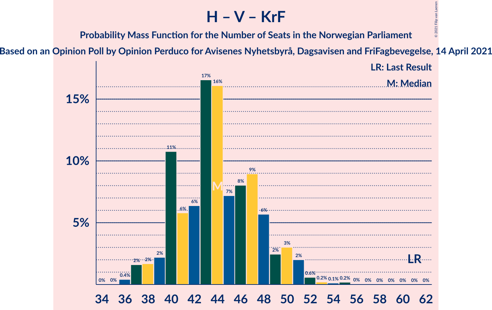

| Number of Seats | Probability | Accumulated | Special Marks |
|:---------------:|:-----------:|:-----------:|:-------------:|
| 36 | 0.4% | 100% |  |
| 37 | 2% | 99.6% |  |
| 38 | 2% | 98% |  |
| 39 | 2% | 96% |  |
| 40 | 11% | 94% |  |
| 41 | 6% | 83% |  |
| 42 | 6% | 78% |  |
| 43 | 17% | 71% | Median |
| 44 | 16% | 55% |  |
| 45 | 7% | 38% |  |
| 46 | 8% | 31% |  |
| 47 | 9% | 23% |  |
| 48 | 6% | 14% |  |
| 49 | 2% | 9% |  |
| 50 | 3% | 6% |  |
| 51 | 2% | 3% |  |
| 52 | 0.6% | 1.1% |  |
| 53 | 0.2% | 0.6% |  |
| 54 | 0.1% | 0.4% |  |
| 55 | 0.2% | 0.2% |  |
| 56 | 0% | 0.1% |  |
| 57 | 0% | 0% |  |
| 58 | 0% | 0% |  |
| 59 | 0% | 0% |  |
| 60 | 0% | 0% |  |
| 61 | 0% | 0% | Last Result |

### Senterpartiet – Venstre – Kristelig Folkeparti

| Number of Seats | Probability | Accumulated | Special Marks |
|:---------------:|:-----------:|:-----------:|:-------------:|
| 32 | 0.1% | 100% |  |
| 33 | 0.2% | 99.9% |  |
| 34 | 0.4% | 99.7% |  |
| 35 | 0.7% | 99.4% | Last Result |
| 36 | 2% | 98.7% |  |
| 37 | 5% | 97% |  |
| 38 | 13% | 92% |  |
| 39 | 13% | 79% |  |
| 40 | 10% | 66% | Median |
| 41 | 15% | 56% |  |
| 42 | 9% | 41% |  |
| 43 | 4% | 32% |  |
| 44 | 8% | 27% |  |
| 45 | 5% | 19% |  |
| 46 | 7% | 14% |  |
| 47 | 3% | 7% |  |
| 48 | 1.1% | 4% |  |
| 49 | 1.3% | 3% |  |
| 50 | 0.6% | 1.3% |  |
| 51 | 0.1% | 0.7% |  |
| 52 | 0.3% | 0.6% |  |
| 53 | 0.2% | 0.3% |  |
| 54 | 0% | 0% |  |

## Technical Information

### Opinion Poll

+ **Polling firm:** Opinion Perduco
+ **Commissioner(s):** Avisenes Nyhetsbyrå, Dagsavisen and FriFagbevegelse
+ **Fieldwork period:** 14 April 2021

### Calculations

+ **Sample size:** 942
+ **Simulations done:** 1,048,576
+ **Error estimate:** 1.60%

