# Opinion Poll by Sentio for Amedia and Nettavisen, 13–19 April 2021

<a href="#voting-intentions">Voting Intentions</a> | <a href="#seats">Seats</a> | <a href="#coalitions">Coalitions</a> | <a href="#technical-information">Technical Information</a>

## Voting Intentions

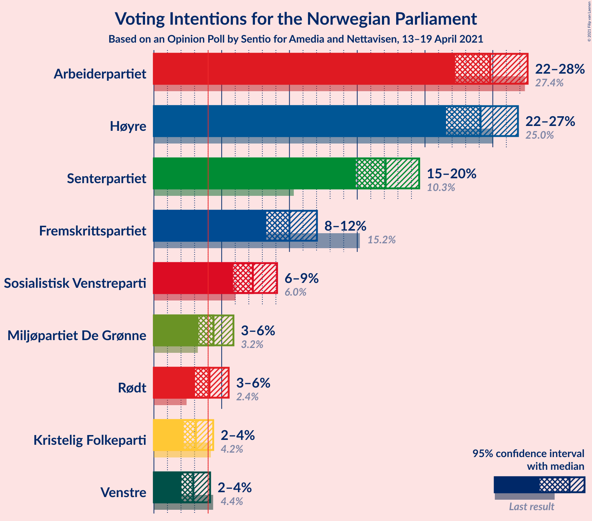

### Confidence Intervals

| Party | Last Result | Poll Result | 80% Confidence Interval | 90% Confidence Interval | 95% Confidence Interval | 99% Confidence Interval |
|:-----:|:-----------:|:-----------:|:-----------------------:|:-----------------------:|:-----------------------:|:-----------------------:|
| Arbeiderpartiet | 27.4% | 24.8% | 23.1–26.6% |22.6–27.1% |22.2–27.6% |21.4–28.5% |
| Høyre | 25.0% | 24.1% | 22.4–25.9% |21.9–26.4% |21.6–26.9% |20.8–27.7% |
| Senterpartiet | 10.3% | 17.1% | 15.7–18.7% |15.2–19.2% |14.9–19.6% |14.2–20.4% |
| Fremskrittspartiet | 15.2% | 10.0% | 8.9–11.3% |8.6–11.7% |8.3–12.0% |7.8–12.7% |
| Sosialistisk Venstreparti | 6.0% | 7.3% | 6.3–8.5% |6.1–8.8% |5.8–9.1% |5.4–9.7% |
| Miljøpartiet De Grønne | 3.2% | 4.4% | 3.7–5.3% |3.5–5.6% |3.3–5.9% |3.0–6.4% |
| Rødt | 2.4% | 4.1% | 3.4–5.0% |3.2–5.3% |3.0–5.5% |2.7–6.0% |
| Kristelig Folkeparti | 4.2% | 3.1% | 2.5–3.9% |2.3–4.2% |2.2–4.4% |1.9–4.8% |
| Venstre | 4.4% | 2.9% | 2.3–3.7% |2.2–3.9% |2.0–4.1% |1.8–4.6% |

*Note:* The poll result column reflects the actual value used in the calculations. Published results may vary slightly, and in addition be rounded to fewer digits.

## Seats

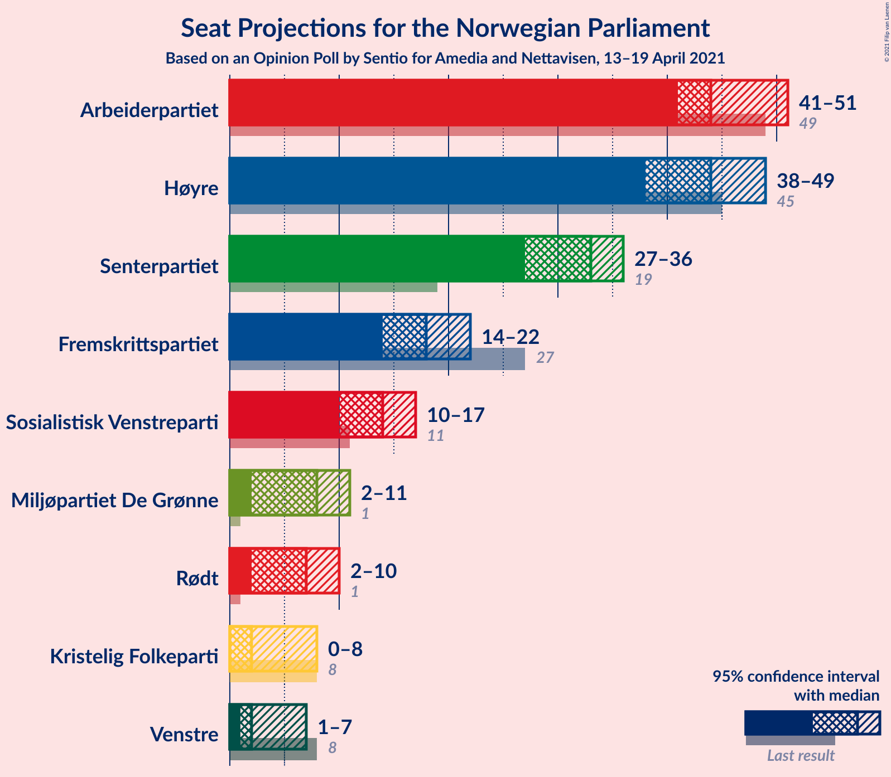

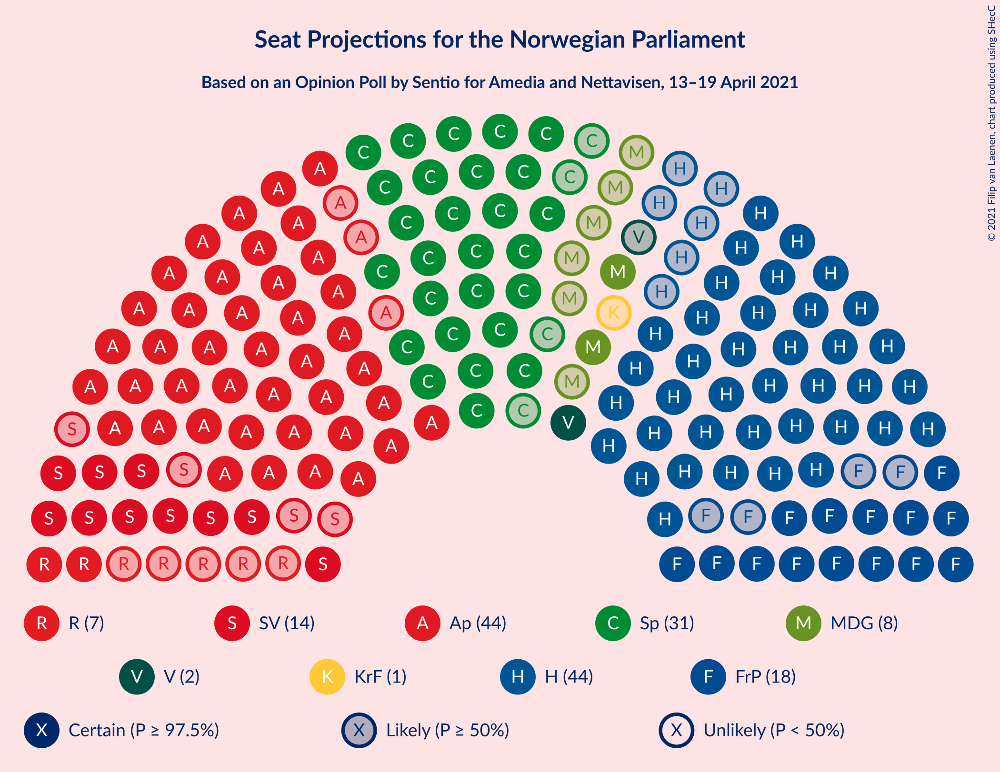

### Confidence Intervals

| Party | Last Result | Median | 80% Confidence Interval | 90% Confidence Interval | 95% Confidence Interval | 99% Confidence Interval |
|:-----:|:-----------:|:------:|:-----------------------:|:-----------------------:|:-----------------------:|:-----------------------:|
| <a href="#arbeiderpartiet">Arbeiderpartiet</a> | 49 | 44 | 43–48 |42–49 |41–51 |39–53 |
| <a href="#høyre">Høyre</a> | 45 | 44 | 40–47 |39–48 |38–49 |36–51 |
| <a href="#senterpartiet">Senterpartiet</a> | 19 | 33 | 29–35 |28–36 |27–36 |26–37 |
| <a href="#fremskrittspartiet">Fremskrittspartiet</a> | 27 | 18 | 16–20 |15–21 |14–22 |13–23 |
| <a href="#sosialistisk-venstreparti">Sosialistisk Venstreparti</a> | 11 | 14 | 11–16 |11–16 |10–17 |10–18 |
| <a href="#miljøpartiet-de-grønne">Miljøpartiet De Grønne</a> | 1 | 8 | 2–10 |2–10 |2–11 |1–11 |
| <a href="#rødt">Rødt</a> | 1 | 7 | 2–9 |2–9 |2–10 |1–11 |
| <a href="#kristelig-folkeparti">Kristelig Folkeparti</a> | 8 | 2 | 1–3 |1–7 |0–8 |0–8 |
| <a href="#venstre">Venstre</a> | 8 | 2 | 1–2 |1–3 |1–7 |0–8 |

### Arbeiderpartiet

*For a full overview of the results for this party, see the [Arbeiderpartiet](party-arbeiderpartiet.html) page.*

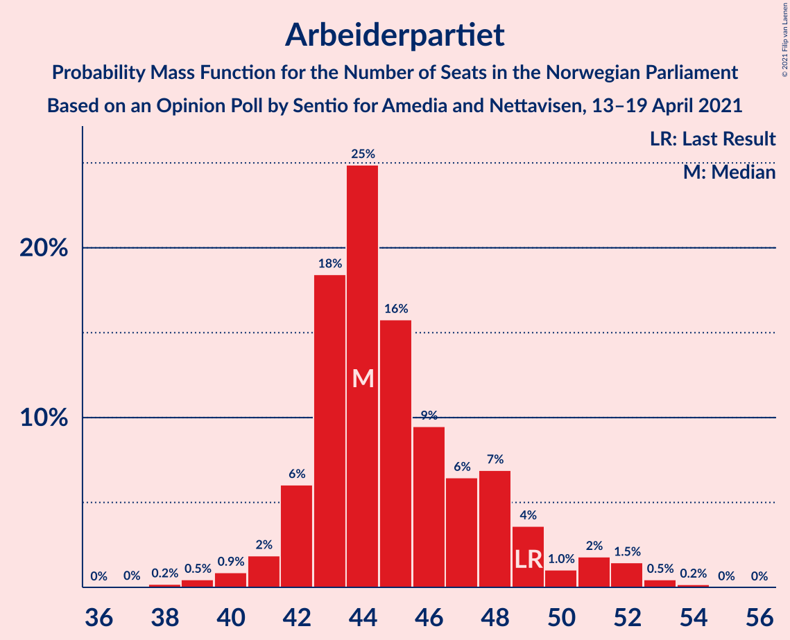

| Number of Seats | Probability | Accumulated | Special Marks |
|:---------------:|:-----------:|:-----------:|:-------------:|
| 37 | 0% | 100% |  |
| 38 | 0.2% | 99.9% |  |
| 39 | 0.5% | 99.8% |  |
| 40 | 0.9% | 99.3% |  |
| 41 | 2% | 98% |  |
| 42 | 6% | 97% |  |
| 43 | 18% | 91% |  |
| 44 | 25% | 72% | Median |
| 45 | 16% | 47% |  |
| 46 | 9% | 31% |  |
| 47 | 6% | 22% |  |
| 48 | 7% | 15% |  |
| 49 | 4% | 9% | Last Result |
| 50 | 1.0% | 5% |  |
| 51 | 2% | 4% |  |
| 52 | 1.5% | 2% |  |
| 53 | 0.5% | 0.7% |  |
| 54 | 0.2% | 0.2% |  |
| 55 | 0% | 0% |  |

### Høyre

*For a full overview of the results for this party, see the [Høyre](party-høyre.html) page.*

| Number of Seats | Probability | Accumulated | Special Marks |
|:---------------:|:-----------:|:-----------:|:-------------:|
| 35 | 0.1% | 100% |  |
| 36 | 0.6% | 99.9% |  |
| 37 | 0.8% | 99.3% |  |
| 38 | 2% | 98% |  |
| 39 | 4% | 97% |  |
| 40 | 8% | 93% |  |
| 41 | 12% | 85% |  |
| 42 | 11% | 73% |  |
| 43 | 10% | 62% |  |
| 44 | 13% | 53% | Median |
| 45 | 12% | 40% | Last Result |
| 46 | 11% | 28% |  |
| 47 | 8% | 17% |  |
| 48 | 5% | 9% |  |
| 49 | 2% | 4% |  |
| 50 | 1.2% | 2% |  |
| 51 | 0.4% | 0.7% |  |
| 52 | 0.2% | 0.3% |  |
| 53 | 0.1% | 0.1% |  |
| 54 | 0% | 0% |  |

### Senterpartiet

*For a full overview of the results for this party, see the [Senterpartiet](party-senterpartiet.html) page.*

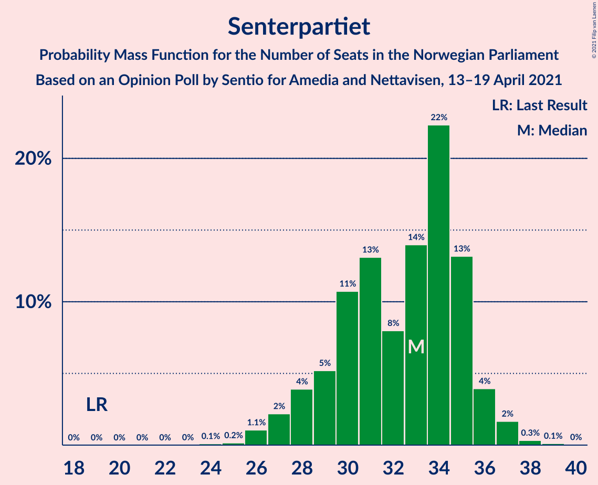

| Number of Seats | Probability | Accumulated | Special Marks |
|:---------------:|:-----------:|:-----------:|:-------------:|
| 19 | 0% | 100% | Last Result |
| 20 | 0% | 100% |  |
| 21 | 0% | 100% |  |
| 22 | 0% | 100% |  |
| 23 | 0% | 100% |  |
| 24 | 0.1% | 100% |  |
| 25 | 0.2% | 99.9% |  |
| 26 | 1.1% | 99.7% |  |
| 27 | 2% | 98.7% |  |
| 28 | 4% | 96% |  |
| 29 | 5% | 93% |  |
| 30 | 11% | 87% |  |
| 31 | 13% | 77% |  |
| 32 | 8% | 64% |  |
| 33 | 14% | 56% | Median |
| 34 | 22% | 42% |  |
| 35 | 13% | 19% |  |
| 36 | 4% | 6% |  |
| 37 | 2% | 2% |  |
| 38 | 0.3% | 0.5% |  |
| 39 | 0.1% | 0.2% |  |
| 40 | 0% | 0% |  |

### Fremskrittspartiet

*For a full overview of the results for this party, see the [Fremskrittspartiet](party-fremskrittspartiet.html) page.*

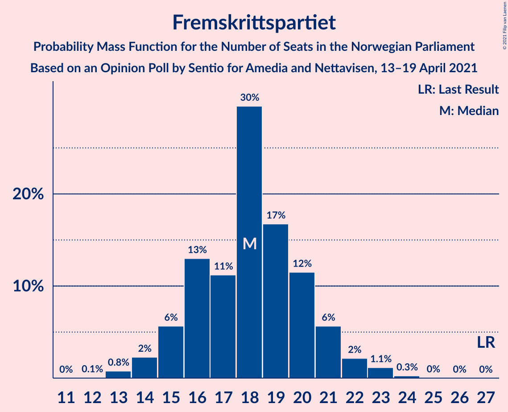

| Number of Seats | Probability | Accumulated | Special Marks |
|:---------------:|:-----------:|:-----------:|:-------------:|
| 12 | 0.1% | 100% |  |
| 13 | 0.8% | 99.9% |  |
| 14 | 2% | 99.2% |  |
| 15 | 6% | 97% |  |
| 16 | 13% | 91% |  |
| 17 | 11% | 78% |  |
| 18 | 30% | 67% | Median |
| 19 | 17% | 38% |  |
| 20 | 12% | 21% |  |
| 21 | 6% | 9% |  |
| 22 | 2% | 4% |  |
| 23 | 1.1% | 1.5% |  |
| 24 | 0.3% | 0.3% |  |
| 25 | 0% | 0.1% |  |
| 26 | 0% | 0% |  |
| 27 | 0% | 0% | Last Result |

### Sosialistisk Venstreparti

*For a full overview of the results for this party, see the [Sosialistisk Venstreparti](party-sosialistiskvenstreparti.html) page.*

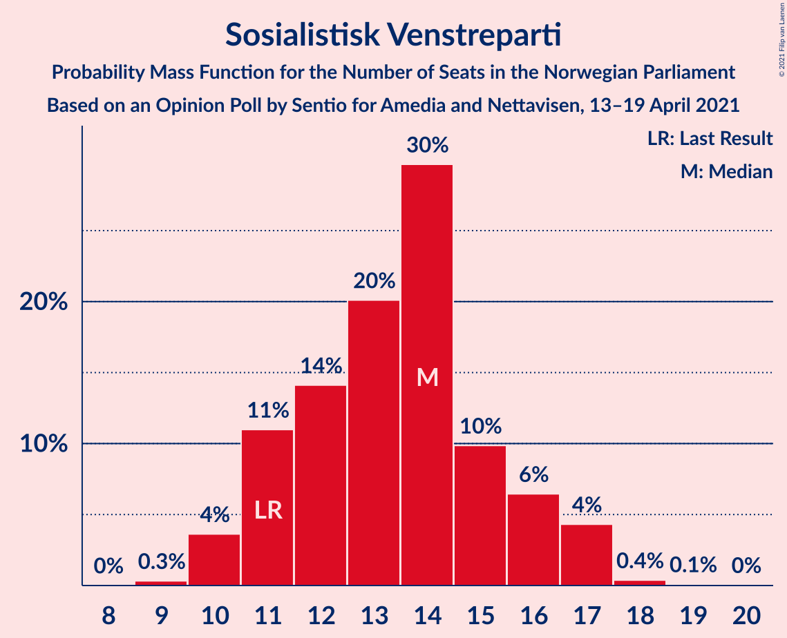

| Number of Seats | Probability | Accumulated | Special Marks |
|:---------------:|:-----------:|:-----------:|:-------------:|
| 9 | 0.3% | 100% |  |
| 10 | 4% | 99.7% |  |
| 11 | 11% | 96% | Last Result |
| 12 | 14% | 85% |  |
| 13 | 20% | 71% |  |
| 14 | 30% | 51% | Median |
| 15 | 10% | 21% |  |
| 16 | 6% | 11% |  |
| 17 | 4% | 5% |  |
| 18 | 0.4% | 0.5% |  |
| 19 | 0.1% | 0.1% |  |
| 20 | 0% | 0% |  |

### Miljøpartiet De Grønne

*For a full overview of the results for this party, see the [Miljøpartiet De Grønne](party-miljøpartietdegrønne.html) page.*

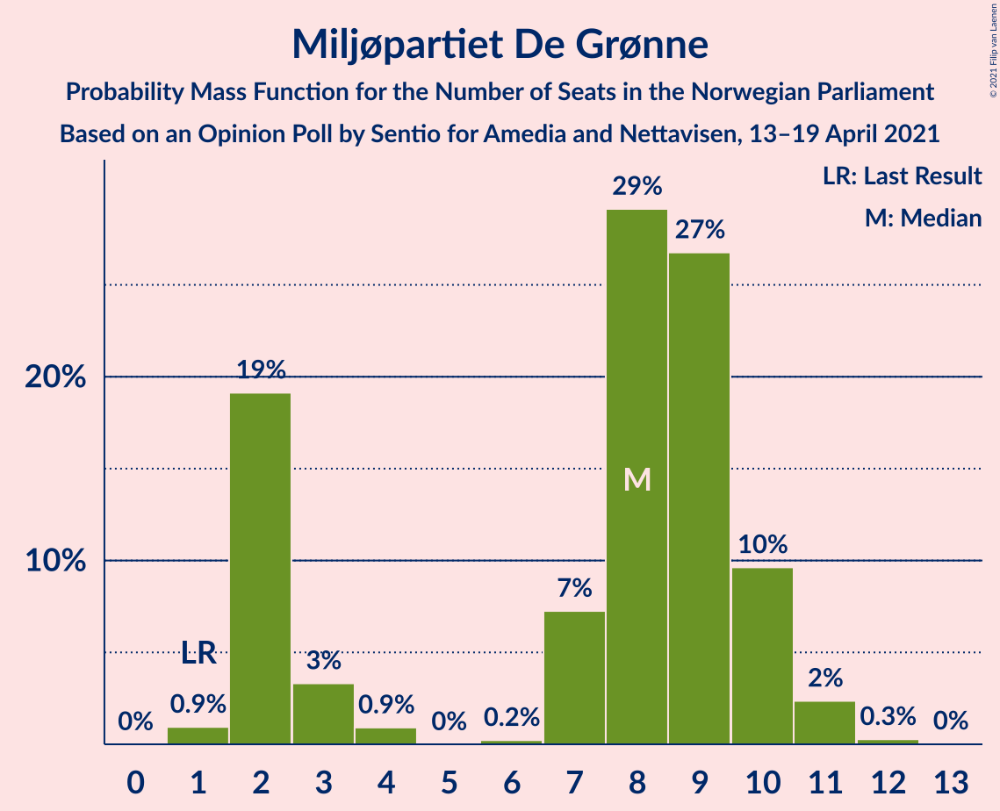

| Number of Seats | Probability | Accumulated | Special Marks |
|:---------------:|:-----------:|:-----------:|:-------------:|
| 1 | 0.9% | 100% | Last Result |
| 2 | 19% | 99.1% |  |
| 3 | 3% | 80% |  |
| 4 | 0.9% | 77% |  |
| 5 | 0% | 76% |  |
| 6 | 0.2% | 76% |  |
| 7 | 7% | 75% |  |
| 8 | 29% | 68% | Median |
| 9 | 27% | 39% |  |
| 10 | 10% | 12% |  |
| 11 | 2% | 3% |  |
| 12 | 0.3% | 0.3% |  |
| 13 | 0% | 0% |  |

### Rødt

*For a full overview of the results for this party, see the [Rødt](party-rødt.html) page.*

| Number of Seats | Probability | Accumulated | Special Marks |
|:---------------:|:-----------:|:-----------:|:-------------:|
| 1 | 0.7% | 100% | Last Result |
| 2 | 45% | 99.3% |  |
| 3 | 0% | 55% |  |
| 4 | 0% | 55% |  |
| 5 | 0% | 55% |  |
| 6 | 0.2% | 55% |  |
| 7 | 13% | 54% | Median |
| 8 | 25% | 41% |  |
| 9 | 12% | 16% |  |
| 10 | 3% | 4% |  |
| 11 | 0.7% | 0.7% |  |
| 12 | 0.1% | 0.1% |  |
| 13 | 0% | 0% |  |

### Kristelig Folkeparti

*For a full overview of the results for this party, see the [Kristelig Folkeparti](party-kristeligfolkeparti.html) page.*

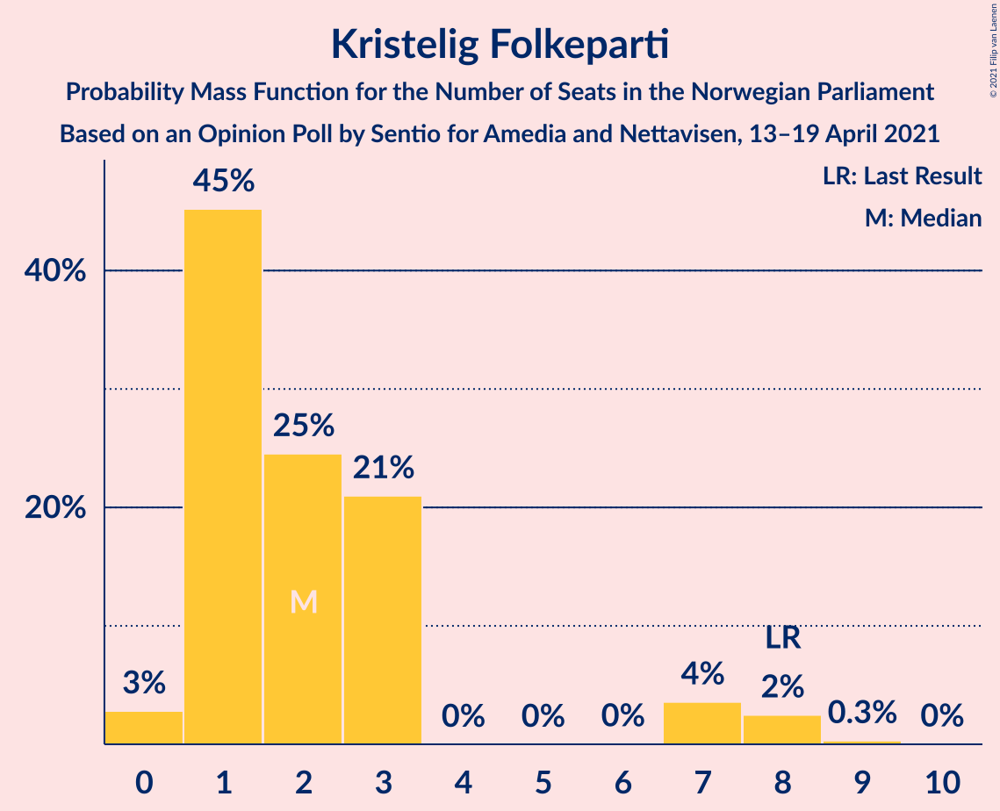

| Number of Seats | Probability | Accumulated | Special Marks |
|:---------------:|:-----------:|:-----------:|:-------------:|
| 0 | 3% | 100% |  |
| 1 | 45% | 97% |  |
| 2 | 25% | 52% | Median |
| 3 | 21% | 27% |  |
| 4 | 0% | 6% |  |
| 5 | 0% | 6% |  |
| 6 | 0% | 6% |  |
| 7 | 4% | 6% |  |
| 8 | 2% | 3% | Last Result |
| 9 | 0.3% | 0.3% |  |
| 10 | 0% | 0% |  |

### Venstre

*For a full overview of the results for this party, see the [Venstre](party-venstre.html) page.*

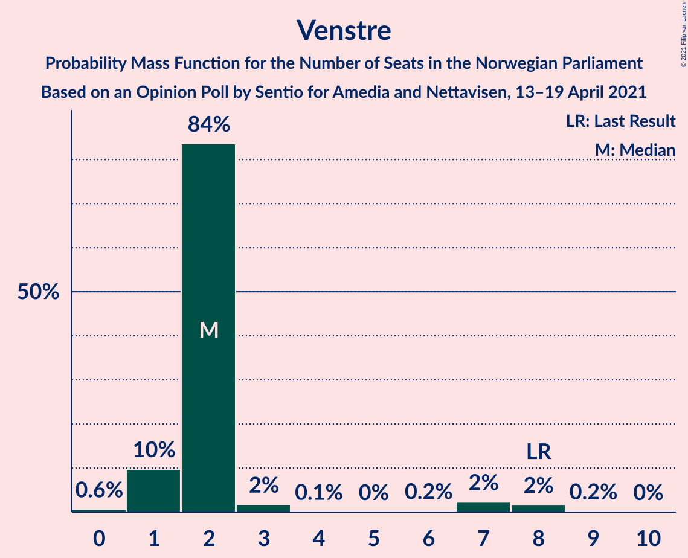

| Number of Seats | Probability | Accumulated | Special Marks |
|:---------------:|:-----------:|:-----------:|:-------------:|
| 0 | 0.6% | 100% |  |
| 1 | 10% | 99.4% |  |
| 2 | 84% | 90% | Median |
| 3 | 2% | 6% |  |
| 4 | 0.1% | 4% |  |
| 5 | 0% | 4% |  |
| 6 | 0.2% | 4% |  |
| 7 | 2% | 4% |  |
| 8 | 2% | 2% | Last Result |
| 9 | 0.2% | 0.2% |  |
| 10 | 0% | 0% |  |

## Coalitions

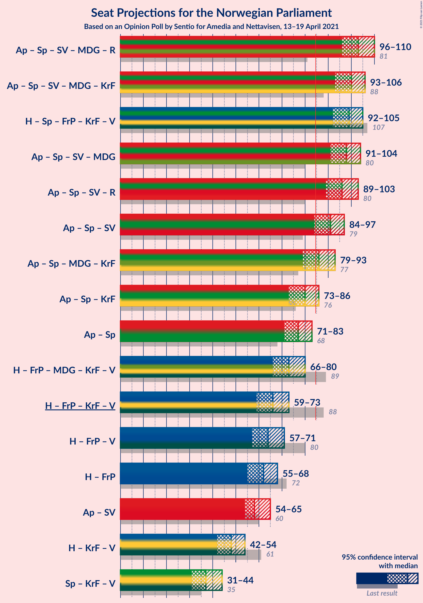

### Confidence Intervals

| Coalition | Last Result | Median | Majority? | 80% Confidence Interval | 90% Confidence Interval | 95% Confidence Interval | 99% Confidence Interval |
|:---------:|:-----------:|:------:|:---------:|:-----------------------:|:-----------------------:|:-----------------------:|:-----------------------:|
| Arbeiderpartiet – Senterpartiet – Sosialistisk Venstreparti – Miljøpartiet De Grønne – Rødt | 81 | 103 | 100% | 99–108 | 97–109 | 96–110 | 93–111 |
| Arbeiderpartiet – Senterpartiet – Sosialistisk Venstreparti – Miljøpartiet De Grønne – Kristelig Folkeparti | 88 | 100 | 100% | 95–104 | 94–105 | 93–106 | 90–109 |
| Høyre – Senterpartiet – Fremskrittspartiet – Kristelig Folkeparti – Venstre | 107 | 99 | 100% | 93–103 | 93–104 | 92–105 | 89–107 |
| Arbeiderpartiet – Senterpartiet – Sosialistisk Venstreparti – Miljøpartiet De Grønne | 80 | 98 | 100% | 93–102 | 92–103 | 91–104 | 88–107 |
| Arbeiderpartiet – Senterpartiet – Sosialistisk Venstreparti – Rødt | 80 | 96 | 100% | 91–101 | 90–102 | 89–103 | 87–105 |
| Arbeiderpartiet – Senterpartiet – Sosialistisk Venstreparti | 79 | 91 | 97% | 87–95 | 85–95 | 84–97 | 82–100 |
| Arbeiderpartiet – Senterpartiet – Miljøpartiet De Grønne – Kristelig Folkeparti | 77 | 86 | 73% | 82–91 | 80–92 | 79–93 | 77–96 |
| Arbeiderpartiet – Senterpartiet – Kristelig Folkeparti | 76 | 80 | 5% | 75–83 | 74–85 | 73–86 | 71–89 |
| Arbeiderpartiet – Senterpartiet | 68 | 77 | 2% | 73–81 | 72–82 | 71–83 | 69–86 |
| Høyre – Fremskrittspartiet – Miljøpartiet De Grønne – Kristelig Folkeparti – Venstre | 89 | 73 | 0% | 68–78 | 67–79 | 66–80 | 64–82 |
| Høyre – Fremskrittspartiet – Kristelig Folkeparti – Venstre | 88 | 66 | 0% | 61–70 | 60–72 | 59–73 | 58–76 |
| Høyre – Fremskrittspartiet – Venstre | 80 | 64 | 0% | 59–68 | 58–69 | 57–71 | 55–74 |
| Høyre – Fremskrittspartiet | 72 | 62 | 0% | 57–66 | 56–67 | 55–68 | 53–71 |
| Arbeiderpartiet – Sosialistisk Venstreparti | 60 | 58 | 0% | 55–62 | 54–63 | 54–65 | 52–67 |
| Høyre – Kristelig Folkeparti – Venstre | 61 | 48 | 0% | 44–52 | 43–53 | 42–54 | 40–57 |
| Senterpartiet – Kristelig Folkeparti – Venstre | 35 | 37 | 0% | 33–40 | 32–42 | 31–44 | 29–46 |

### Arbeiderpartiet – Senterpartiet – Sosialistisk Venstreparti – Miljøpartiet De Grønne – Rødt

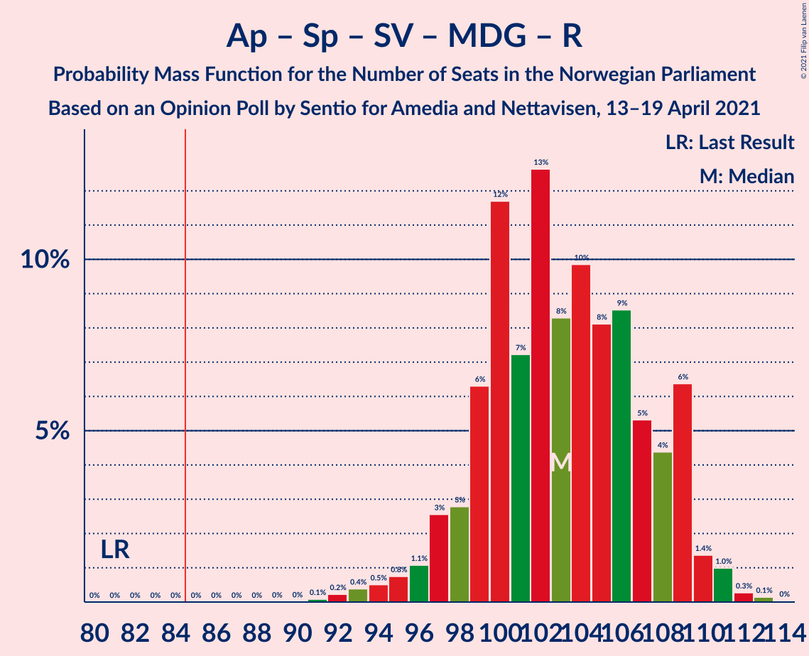

| Number of Seats | Probability | Accumulated | Special Marks |
|:---------------:|:-----------:|:-----------:|:-------------:|
| 81 | 0% | 100% | Last Result |
| 82 | 0% | 100% |  |
| 83 | 0% | 100% |  |
| 84 | 0% | 100% |  |
| 85 | 0% | 100% | Majority |
| 86 | 0% | 100% |  |
| 87 | 0% | 100% |  |
| 88 | 0% | 100% |  |
| 89 | 0% | 100% |  |
| 90 | 0% | 100% |  |
| 91 | 0.1% | 100% |  |
| 92 | 0.2% | 99.9% |  |
| 93 | 0.4% | 99.7% |  |
| 94 | 0.5% | 99.3% |  |
| 95 | 0.8% | 98.8% |  |
| 96 | 1.1% | 98% |  |
| 97 | 3% | 97% |  |
| 98 | 3% | 94% |  |
| 99 | 6% | 92% |  |
| 100 | 12% | 85% |  |
| 101 | 7% | 74% |  |
| 102 | 13% | 66% |  |
| 103 | 8% | 54% |  |
| 104 | 10% | 45% |  |
| 105 | 8% | 36% |  |
| 106 | 9% | 27% | Median |
| 107 | 5% | 19% |  |
| 108 | 4% | 14% |  |
| 109 | 6% | 9% |  |
| 110 | 1.4% | 3% |  |
| 111 | 1.0% | 1.5% |  |
| 112 | 0.3% | 0.5% |  |
| 113 | 0.1% | 0.2% |  |
| 114 | 0% | 0% |  |

### Arbeiderpartiet – Senterpartiet – Sosialistisk Venstreparti – Miljøpartiet De Grønne – Kristelig Folkeparti

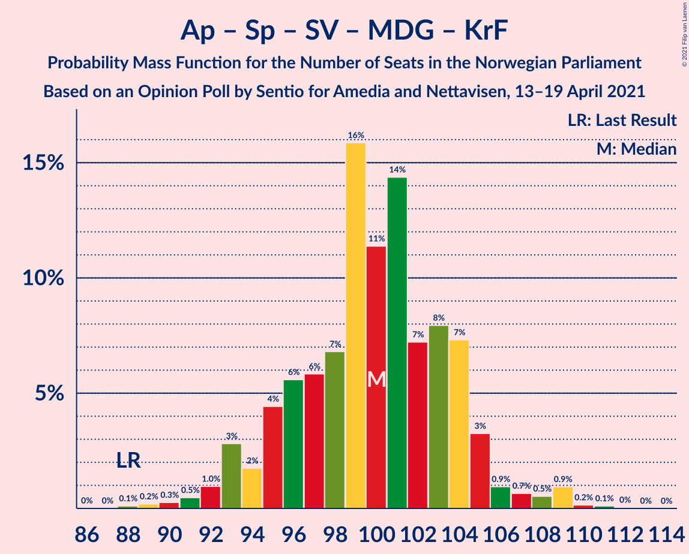

| Number of Seats | Probability | Accumulated | Special Marks |
|:---------------:|:-----------:|:-----------:|:-------------:|
| 88 | 0.1% | 100% | Last Result |
| 89 | 0.2% | 99.9% |  |
| 90 | 0.3% | 99.7% |  |
| 91 | 0.5% | 99.4% |  |
| 92 | 1.0% | 98.9% |  |
| 93 | 3% | 98% |  |
| 94 | 2% | 95% |  |
| 95 | 4% | 93% |  |
| 96 | 6% | 89% |  |
| 97 | 6% | 83% |  |
| 98 | 7% | 78% |  |
| 99 | 16% | 71% |  |
| 100 | 11% | 55% |  |
| 101 | 14% | 43% | Median |
| 102 | 7% | 29% |  |
| 103 | 8% | 22% |  |
| 104 | 7% | 14% |  |
| 105 | 3% | 7% |  |
| 106 | 0.9% | 3% |  |
| 107 | 0.7% | 2% |  |
| 108 | 0.5% | 2% |  |
| 109 | 0.9% | 1.3% |  |
| 110 | 0.2% | 0.3% |  |
| 111 | 0.1% | 0.2% |  |
| 112 | 0% | 0.1% |  |
| 113 | 0% | 0% |  |

### Høyre – Senterpartiet – Fremskrittspartiet – Kristelig Folkeparti – Venstre

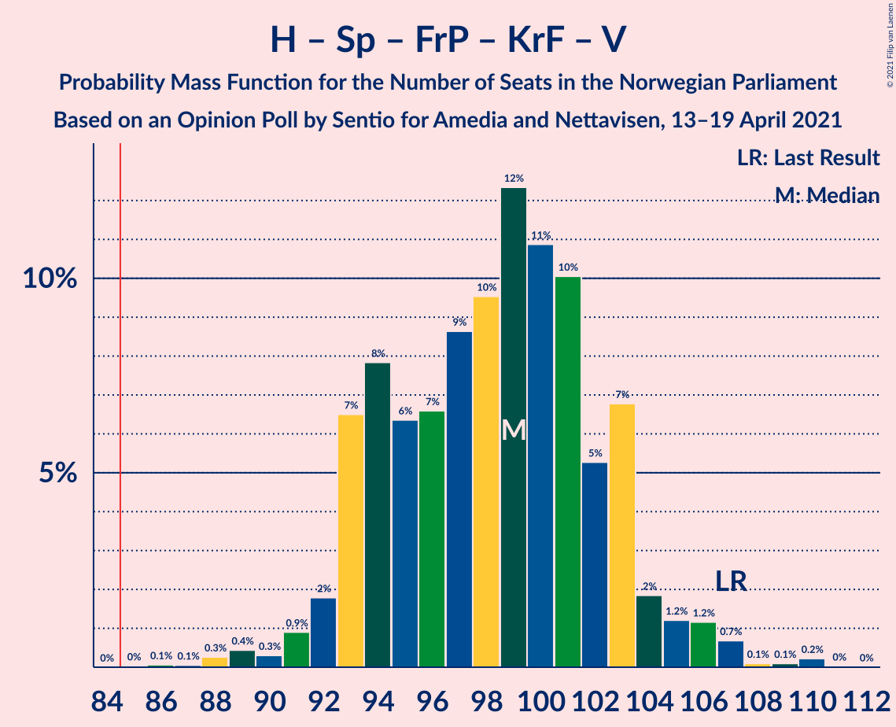

| Number of Seats | Probability | Accumulated | Special Marks |
|:---------------:|:-----------:|:-----------:|:-------------:|
| 86 | 0.1% | 100% |  |
| 87 | 0.1% | 99.9% |  |
| 88 | 0.3% | 99.8% |  |
| 89 | 0.4% | 99.6% |  |
| 90 | 0.3% | 99.1% |  |
| 91 | 0.9% | 98.8% |  |
| 92 | 2% | 98% |  |
| 93 | 7% | 96% |  |
| 94 | 8% | 90% |  |
| 95 | 6% | 82% |  |
| 96 | 7% | 75% |  |
| 97 | 9% | 69% |  |
| 98 | 10% | 60% |  |
| 99 | 12% | 51% | Median |
| 100 | 11% | 38% |  |
| 101 | 10% | 27% |  |
| 102 | 5% | 17% |  |
| 103 | 7% | 12% |  |
| 104 | 2% | 5% |  |
| 105 | 1.2% | 4% |  |
| 106 | 1.2% | 2% |  |
| 107 | 0.7% | 1.1% | Last Result |
| 108 | 0.1% | 0.5% |  |
| 109 | 0.1% | 0.4% |  |
| 110 | 0.2% | 0.3% |  |
| 111 | 0% | 0% |  |

### Arbeiderpartiet – Senterpartiet – Sosialistisk Venstreparti – Miljøpartiet De Grønne

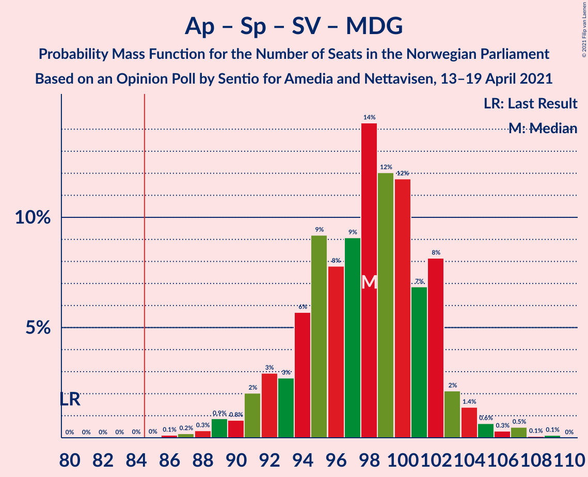

| Number of Seats | Probability | Accumulated | Special Marks |
|:---------------:|:-----------:|:-----------:|:-------------:|
| 80 | 0% | 100% | Last Result |
| 81 | 0% | 100% |  |
| 82 | 0% | 100% |  |
| 83 | 0% | 100% |  |
| 84 | 0% | 100% |  |
| 85 | 0% | 100% | Majority |
| 86 | 0.1% | 99.9% |  |
| 87 | 0.2% | 99.8% |  |
| 88 | 0.3% | 99.6% |  |
| 89 | 0.9% | 99.3% |  |
| 90 | 0.8% | 98% |  |
| 91 | 2% | 98% |  |
| 92 | 3% | 96% |  |
| 93 | 3% | 93% |  |
| 94 | 6% | 90% |  |
| 95 | 9% | 84% |  |
| 96 | 8% | 75% |  |
| 97 | 9% | 67% |  |
| 98 | 14% | 58% |  |
| 99 | 12% | 44% | Median |
| 100 | 12% | 32% |  |
| 101 | 7% | 20% |  |
| 102 | 8% | 13% |  |
| 103 | 2% | 5% |  |
| 104 | 1.4% | 3% |  |
| 105 | 0.6% | 2% |  |
| 106 | 0.3% | 1.0% |  |
| 107 | 0.5% | 0.7% |  |
| 108 | 0.1% | 0.2% |  |
| 109 | 0.1% | 0.1% |  |
| 110 | 0% | 0% |  |

### Arbeiderpartiet – Senterpartiet – Sosialistisk Venstreparti – Rødt

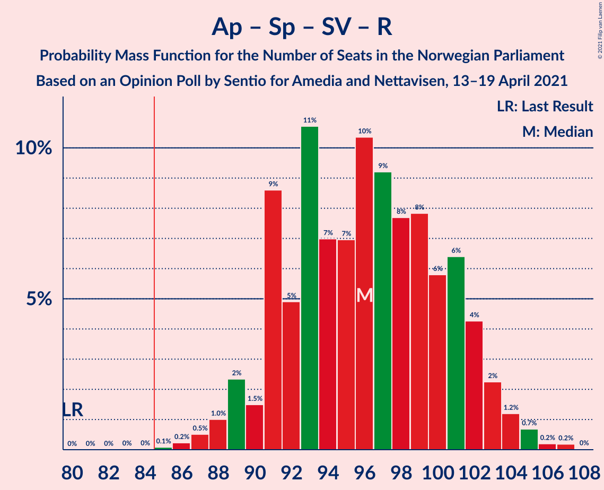

| Number of Seats | Probability | Accumulated | Special Marks |
|:---------------:|:-----------:|:-----------:|:-------------:|
| 80 | 0% | 100% | Last Result |
| 81 | 0% | 100% |  |
| 82 | 0% | 100% |  |
| 83 | 0% | 100% |  |
| 84 | 0% | 100% |  |
| 85 | 0.1% | 100% | Majority |
| 86 | 0.2% | 99.9% |  |
| 87 | 0.5% | 99.6% |  |
| 88 | 1.0% | 99.1% |  |
| 89 | 2% | 98% |  |
| 90 | 1.5% | 96% |  |
| 91 | 9% | 94% |  |
| 92 | 5% | 86% |  |
| 93 | 11% | 81% |  |
| 94 | 7% | 70% |  |
| 95 | 7% | 63% |  |
| 96 | 10% | 56% |  |
| 97 | 9% | 46% |  |
| 98 | 8% | 37% | Median |
| 99 | 8% | 29% |  |
| 100 | 6% | 21% |  |
| 101 | 6% | 15% |  |
| 102 | 4% | 9% |  |
| 103 | 2% | 5% |  |
| 104 | 1.2% | 2% |  |
| 105 | 0.7% | 1.1% |  |
| 106 | 0.2% | 0.4% |  |
| 107 | 0.2% | 0.2% |  |
| 108 | 0% | 0% |  |

### Arbeiderpartiet – Senterpartiet – Sosialistisk Venstreparti

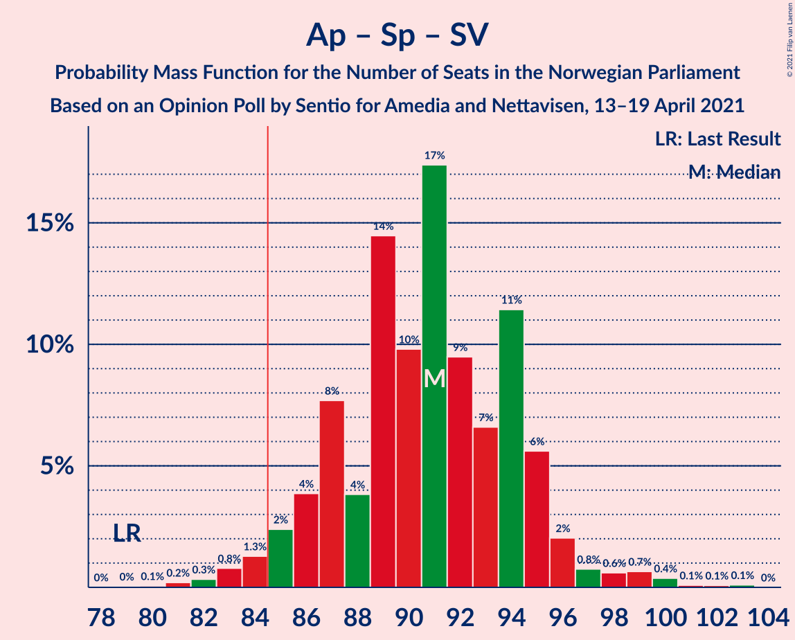

| Number of Seats | Probability | Accumulated | Special Marks |
|:---------------:|:-----------:|:-----------:|:-------------:|
| 79 | 0% | 100% | Last Result |
| 80 | 0.1% | 99.9% |  |
| 81 | 0.2% | 99.9% |  |
| 82 | 0.3% | 99.7% |  |
| 83 | 0.8% | 99.3% |  |
| 84 | 1.3% | 98.6% |  |
| 85 | 2% | 97% | Majority |
| 86 | 4% | 95% |  |
| 87 | 8% | 91% |  |
| 88 | 4% | 83% |  |
| 89 | 14% | 80% |  |
| 90 | 10% | 65% |  |
| 91 | 17% | 55% | Median |
| 92 | 9% | 38% |  |
| 93 | 7% | 28% |  |
| 94 | 11% | 22% |  |
| 95 | 6% | 10% |  |
| 96 | 2% | 5% |  |
| 97 | 0.8% | 3% |  |
| 98 | 0.6% | 2% |  |
| 99 | 0.7% | 1.3% |  |
| 100 | 0.4% | 0.7% |  |
| 101 | 0.1% | 0.3% |  |
| 102 | 0.1% | 0.2% |  |
| 103 | 0.1% | 0.1% |  |
| 104 | 0% | 0% |  |

### Arbeiderpartiet – Senterpartiet – Miljøpartiet De Grønne – Kristelig Folkeparti

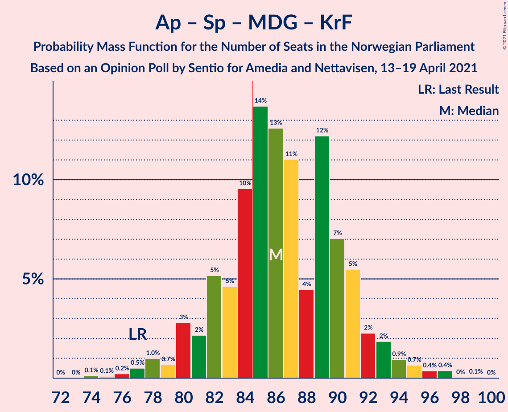

| Number of Seats | Probability | Accumulated | Special Marks |
|:---------------:|:-----------:|:-----------:|:-------------:|
| 74 | 0.1% | 100% |  |
| 75 | 0.1% | 99.9% |  |
| 76 | 0.2% | 99.8% |  |
| 77 | 0.5% | 99.5% | Last Result |
| 78 | 1.0% | 99.0% |  |
| 79 | 0.7% | 98% |  |
| 80 | 3% | 97% |  |
| 81 | 2% | 95% |  |
| 82 | 5% | 92% |  |
| 83 | 5% | 87% |  |
| 84 | 10% | 83% |  |
| 85 | 14% | 73% | Majority |
| 86 | 13% | 59% |  |
| 87 | 11% | 47% | Median |
| 88 | 4% | 36% |  |
| 89 | 12% | 31% |  |
| 90 | 7% | 19% |  |
| 91 | 5% | 12% |  |
| 92 | 2% | 7% |  |
| 93 | 2% | 4% |  |
| 94 | 0.9% | 2% |  |
| 95 | 0.7% | 1.5% |  |
| 96 | 0.4% | 0.8% |  |
| 97 | 0.4% | 0.5% |  |
| 98 | 0% | 0.1% |  |
| 99 | 0.1% | 0.1% |  |
| 100 | 0% | 0% |  |

### Arbeiderpartiet – Senterpartiet – Kristelig Folkeparti

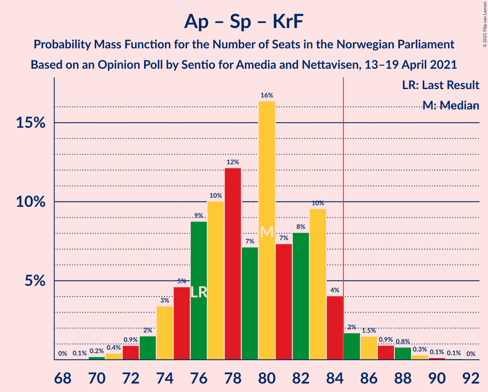

| Number of Seats | Probability | Accumulated | Special Marks |
|:---------------:|:-----------:|:-----------:|:-------------:|
| 69 | 0.1% | 100% |  |
| 70 | 0.2% | 99.9% |  |
| 71 | 0.4% | 99.7% |  |
| 72 | 0.9% | 99.3% |  |
| 73 | 2% | 98% |  |
| 74 | 3% | 97% |  |
| 75 | 5% | 93% |  |
| 76 | 9% | 89% | Last Result |
| 77 | 10% | 80% |  |
| 78 | 12% | 70% |  |
| 79 | 7% | 58% | Median |
| 80 | 16% | 51% |  |
| 81 | 7% | 34% |  |
| 82 | 8% | 27% |  |
| 83 | 10% | 19% |  |
| 84 | 4% | 9% |  |
| 85 | 2% | 5% | Majority |
| 86 | 1.5% | 4% |  |
| 87 | 0.9% | 2% |  |
| 88 | 0.8% | 1.3% |  |
| 89 | 0.3% | 0.5% |  |
| 90 | 0.1% | 0.2% |  |
| 91 | 0.1% | 0.1% |  |
| 92 | 0% | 0% |  |

### Arbeiderpartiet – Senterpartiet

| Number of Seats | Probability | Accumulated | Special Marks |
|:---------------:|:-----------:|:-----------:|:-------------:|
| 67 | 0.1% | 100% |  |
| 68 | 0.1% | 99.9% | Last Result |
| 69 | 0.3% | 99.7% |  |
| 70 | 0.9% | 99.4% |  |
| 71 | 1.4% | 98.5% |  |
| 72 | 3% | 97% |  |
| 73 | 6% | 94% |  |
| 74 | 5% | 88% |  |
| 75 | 12% | 82% |  |
| 76 | 8% | 71% |  |
| 77 | 16% | 63% | Median |
| 78 | 12% | 47% |  |
| 79 | 11% | 36% |  |
| 80 | 8% | 24% |  |
| 81 | 7% | 16% |  |
| 82 | 5% | 9% |  |
| 83 | 1.2% | 3% |  |
| 84 | 0.6% | 2% |  |
| 85 | 0.8% | 2% | Majority |
| 86 | 0.4% | 0.8% |  |
| 87 | 0.3% | 0.4% |  |
| 88 | 0.1% | 0.1% |  |
| 89 | 0% | 0% |  |

### Høyre – Fremskrittspartiet – Miljøpartiet De Grønne – Kristelig Folkeparti – Venstre

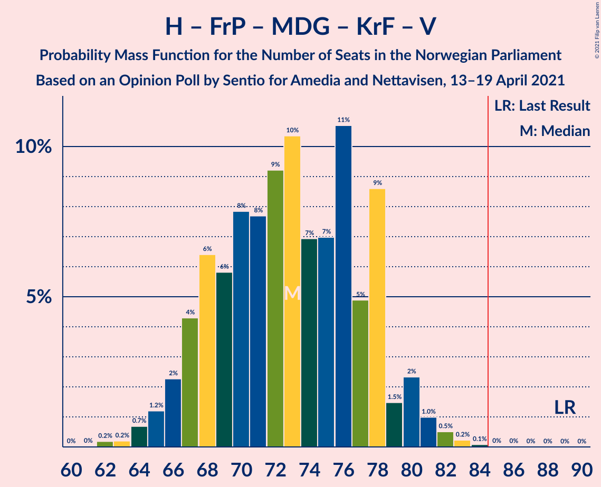

| Number of Seats | Probability | Accumulated | Special Marks |
|:---------------:|:-----------:|:-----------:|:-------------:|
| 62 | 0.2% | 100% |  |
| 63 | 0.2% | 99.8% |  |
| 64 | 0.7% | 99.6% |  |
| 65 | 1.2% | 98.9% |  |
| 66 | 2% | 98% |  |
| 67 | 4% | 95% |  |
| 68 | 6% | 91% |  |
| 69 | 6% | 85% |  |
| 70 | 8% | 79% |  |
| 71 | 8% | 71% |  |
| 72 | 9% | 63% |  |
| 73 | 10% | 54% |  |
| 74 | 7% | 44% | Median |
| 75 | 7% | 37% |  |
| 76 | 11% | 30% |  |
| 77 | 5% | 19% |  |
| 78 | 9% | 14% |  |
| 79 | 1.5% | 6% |  |
| 80 | 2% | 4% |  |
| 81 | 1.0% | 2% |  |
| 82 | 0.5% | 0.9% |  |
| 83 | 0.2% | 0.4% |  |
| 84 | 0.1% | 0.1% |  |
| 85 | 0% | 0% | Majority |
| 86 | 0% | 0% |  |
| 87 | 0% | 0% |  |
| 88 | 0% | 0% |  |
| 89 | 0% | 0% | Last Result |

### Høyre – Fremskrittspartiet – Kristelig Folkeparti – Venstre

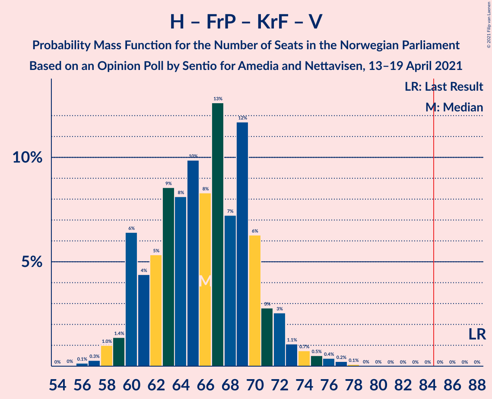

| Number of Seats | Probability | Accumulated | Special Marks |
|:---------------:|:-----------:|:-----------:|:-------------:|
| 56 | 0.1% | 100% |  |
| 57 | 0.3% | 99.8% |  |
| 58 | 1.0% | 99.5% |  |
| 59 | 1.4% | 98.5% |  |
| 60 | 6% | 97% |  |
| 61 | 4% | 91% |  |
| 62 | 5% | 86% |  |
| 63 | 9% | 81% |  |
| 64 | 8% | 72% |  |
| 65 | 10% | 64% |  |
| 66 | 8% | 54% | Median |
| 67 | 13% | 46% |  |
| 68 | 7% | 34% |  |
| 69 | 12% | 26% |  |
| 70 | 6% | 15% |  |
| 71 | 3% | 8% |  |
| 72 | 3% | 6% |  |
| 73 | 1.1% | 3% |  |
| 74 | 0.7% | 2% |  |
| 75 | 0.5% | 1.2% |  |
| 76 | 0.4% | 0.7% |  |
| 77 | 0.2% | 0.3% |  |
| 78 | 0.1% | 0.1% |  |
| 79 | 0% | 0% |  |
| 80 | 0% | 0% |  |
| 81 | 0% | 0% |  |
| 82 | 0% | 0% |  |
| 83 | 0% | 0% |  |
| 84 | 0% | 0% |  |
| 85 | 0% | 0% | Majority |
| 86 | 0% | 0% |  |
| 87 | 0% | 0% |  |
| 88 | 0% | 0% | Last Result |

### Høyre – Fremskrittspartiet – Venstre

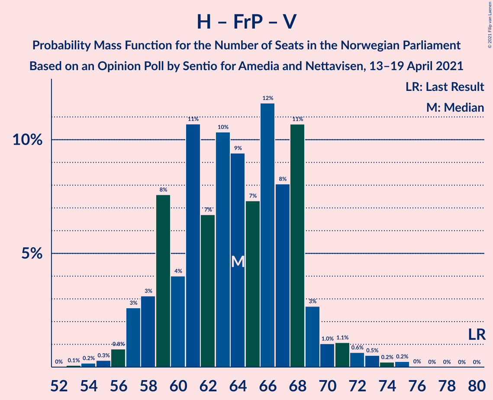

| Number of Seats | Probability | Accumulated | Special Marks |
|:---------------:|:-----------:|:-----------:|:-------------:|
| 53 | 0.1% | 100% |  |
| 54 | 0.2% | 99.9% |  |
| 55 | 0.3% | 99.7% |  |
| 56 | 0.8% | 99.4% |  |
| 57 | 3% | 98.6% |  |
| 58 | 3% | 96% |  |
| 59 | 8% | 93% |  |
| 60 | 4% | 85% |  |
| 61 | 11% | 81% |  |
| 62 | 7% | 71% |  |
| 63 | 10% | 64% |  |
| 64 | 9% | 54% | Median |
| 65 | 7% | 44% |  |
| 66 | 12% | 37% |  |
| 67 | 8% | 25% |  |
| 68 | 11% | 17% |  |
| 69 | 3% | 6% |  |
| 70 | 1.0% | 4% |  |
| 71 | 1.1% | 3% |  |
| 72 | 0.6% | 2% |  |
| 73 | 0.5% | 1.0% |  |
| 74 | 0.2% | 0.5% |  |
| 75 | 0.2% | 0.3% |  |
| 76 | 0% | 0.1% |  |
| 77 | 0% | 0% |  |
| 78 | 0% | 0% |  |
| 79 | 0% | 0% |  |
| 80 | 0% | 0% | Last Result |

### Høyre – Fremskrittspartiet

| Number of Seats | Probability | Accumulated | Special Marks |
|:---------------:|:-----------:|:-----------:|:-------------:|
| 51 | 0.1% | 100% |  |
| 52 | 0.2% | 99.9% |  |
| 53 | 0.5% | 99.7% |  |
| 54 | 1.1% | 99.1% |  |
| 55 | 3% | 98% |  |
| 56 | 3% | 95% |  |
| 57 | 8% | 93% |  |
| 58 | 4% | 85% |  |
| 59 | 10% | 81% |  |
| 60 | 8% | 71% |  |
| 61 | 11% | 63% |  |
| 62 | 9% | 51% | Median |
| 63 | 7% | 42% |  |
| 64 | 10% | 35% |  |
| 65 | 9% | 25% |  |
| 66 | 9% | 16% |  |
| 67 | 3% | 6% |  |
| 68 | 0.8% | 3% |  |
| 69 | 1.1% | 2% |  |
| 70 | 0.6% | 1.2% |  |
| 71 | 0.4% | 0.6% |  |
| 72 | 0.1% | 0.1% | Last Result |
| 73 | 0% | 0.1% |  |
| 74 | 0% | 0% |  |

### Arbeiderpartiet – Sosialistisk Venstreparti

| Number of Seats | Probability | Accumulated | Special Marks |
|:---------------:|:-----------:|:-----------:|:-------------:|
| 49 | 0% | 100% |  |
| 50 | 0.1% | 99.9% |  |
| 51 | 0.3% | 99.8% |  |
| 52 | 0.4% | 99.6% |  |
| 53 | 1.3% | 99.1% |  |
| 54 | 5% | 98% |  |
| 55 | 8% | 93% |  |
| 56 | 9% | 85% |  |
| 57 | 15% | 76% |  |
| 58 | 17% | 61% | Median |
| 59 | 16% | 44% |  |
| 60 | 7% | 28% | Last Result |
| 61 | 9% | 21% |  |
| 62 | 5% | 12% |  |
| 63 | 2% | 7% |  |
| 64 | 1.1% | 4% |  |
| 65 | 1.3% | 3% |  |
| 66 | 1.1% | 2% |  |
| 67 | 0.3% | 0.7% |  |
| 68 | 0.2% | 0.4% |  |
| 69 | 0.1% | 0.3% |  |
| 70 | 0.1% | 0.2% |  |
| 71 | 0% | 0% |  |

### Høyre – Kristelig Folkeparti – Venstre

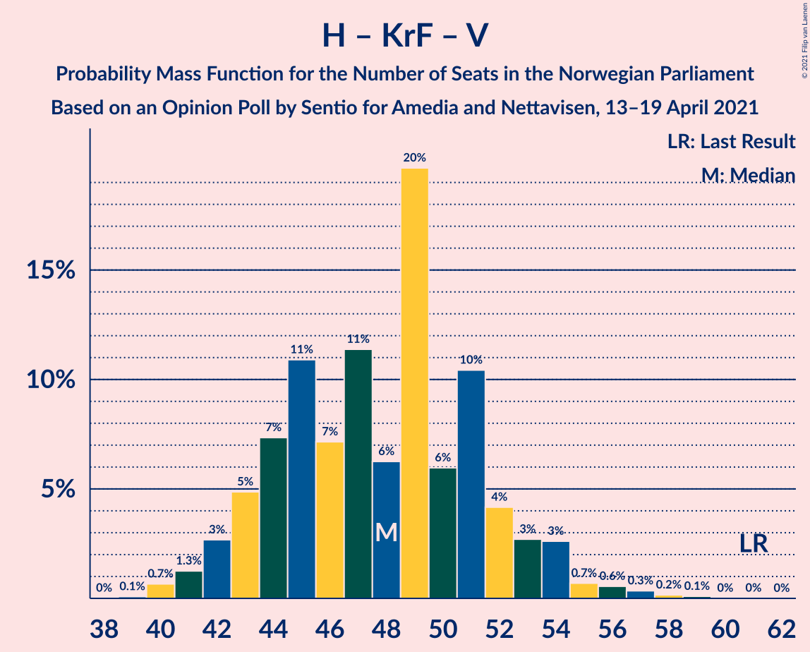

| Number of Seats | Probability | Accumulated | Special Marks |
|:---------------:|:-----------:|:-----------:|:-------------:|
| 39 | 0.1% | 100% |  |
| 40 | 0.7% | 99.9% |  |
| 41 | 1.3% | 99.2% |  |
| 42 | 3% | 98% |  |
| 43 | 5% | 95% |  |
| 44 | 7% | 90% |  |
| 45 | 11% | 83% |  |
| 46 | 7% | 72% |  |
| 47 | 11% | 65% |  |
| 48 | 6% | 54% | Median |
| 49 | 20% | 47% |  |
| 50 | 6% | 28% |  |
| 51 | 10% | 22% |  |
| 52 | 4% | 11% |  |
| 53 | 3% | 7% |  |
| 54 | 3% | 4% |  |
| 55 | 0.7% | 2% |  |
| 56 | 0.6% | 1.2% |  |
| 57 | 0.3% | 0.6% |  |
| 58 | 0.2% | 0.3% |  |
| 59 | 0.1% | 0.1% |  |
| 60 | 0% | 0% |  |
| 61 | 0% | 0% | Last Result |

### Senterpartiet – Kristelig Folkeparti – Venstre

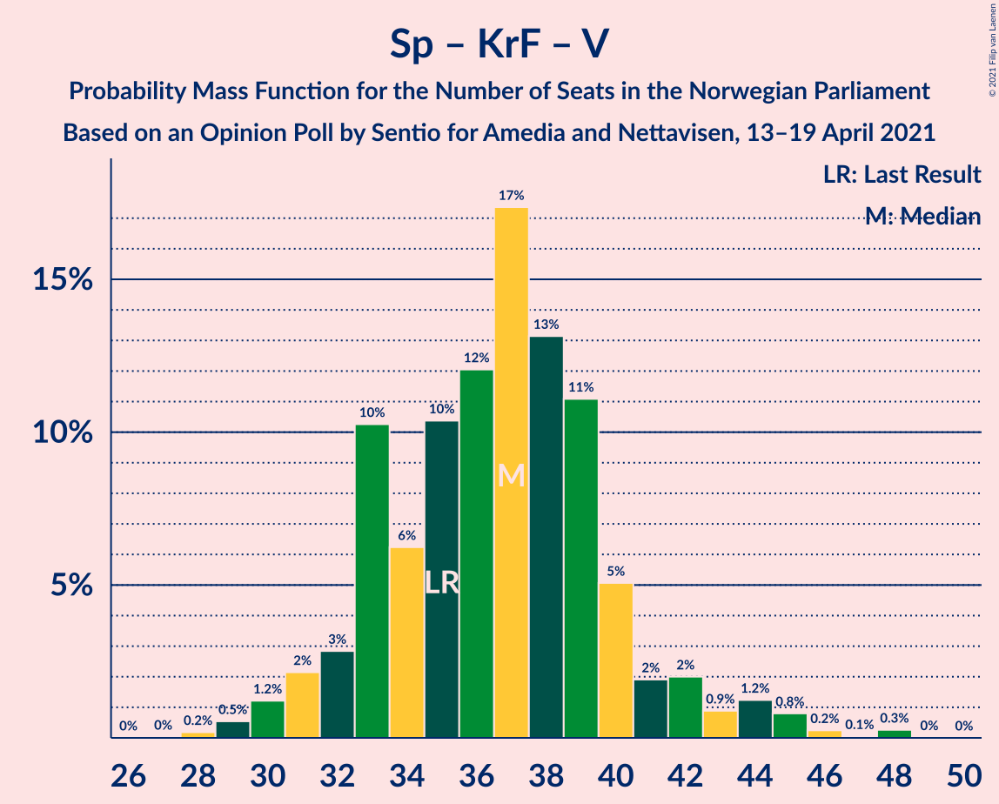

| Number of Seats | Probability | Accumulated | Special Marks |
|:---------------:|:-----------:|:-----------:|:-------------:|
| 28 | 0.2% | 100% |  |
| 29 | 0.5% | 99.8% |  |
| 30 | 1.2% | 99.2% |  |
| 31 | 2% | 98% |  |
| 32 | 3% | 96% |  |
| 33 | 10% | 93% |  |
| 34 | 6% | 83% |  |
| 35 | 10% | 77% | Last Result |
| 36 | 12% | 66% |  |
| 37 | 17% | 54% | Median |
| 38 | 13% | 37% |  |
| 39 | 11% | 24% |  |
| 40 | 5% | 12% |  |
| 41 | 2% | 7% |  |
| 42 | 2% | 6% |  |
| 43 | 0.9% | 4% |  |
| 44 | 1.2% | 3% |  |
| 45 | 0.8% | 1.4% |  |
| 46 | 0.2% | 0.6% |  |
| 47 | 0.1% | 0.3% |  |
| 48 | 0.3% | 0.3% |  |
| 49 | 0% | 0% |  |

## Technical Information

### Opinion Poll

+ **Polling firm:** Sentio
+ **Commissioner(s):** Amedia and Nettavisen
+ **Fieldwork period:** 13–19 April 2021

### Calculations

+ **Sample size:** 1000
+ **Simulations done:** 1,048,576
+ **Error estimate:** 1.34%

