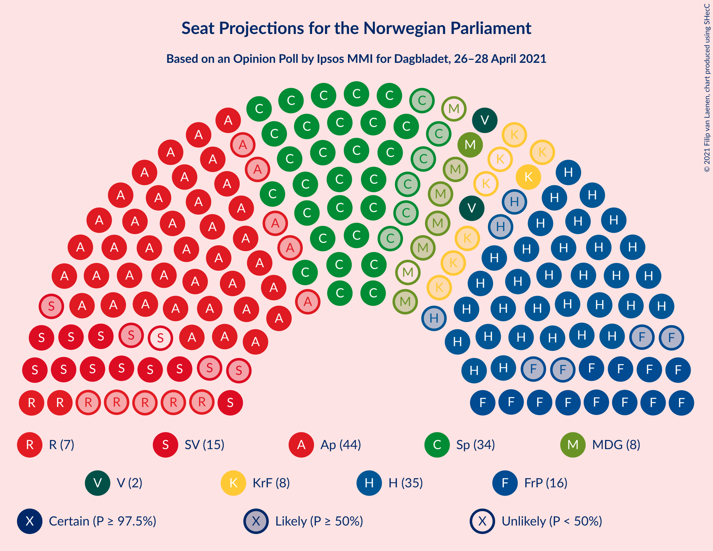

# Opinion Poll by Ipsos MMI for Dagbladet, 26–28 April 2021

<a href="#voting-intentions">Voting Intentions</a> | <a href="#seats">Seats</a> | <a href="#coalitions">Coalitions</a> | <a href="#technical-information">Technical Information</a>

## Voting Intentions

### Confidence Intervals

| Party | Last Result | Poll Result | 80% Confidence Interval | 90% Confidence Interval | 95% Confidence Interval | 99% Confidence Interval |
|:-----:|:-----------:|:-----------:|:-----------------------:|:-----------------------:|:-----------------------:|:-----------------------:|
| Arbeiderpartiet | 27.4% | 23.6% | 21.6–25.7% |21.1–26.3% |20.6–26.8% |19.7–27.8% |
| Høyre | 25.0% | 20.4% | 18.6–22.4% |18.1–23.0% |17.6–23.5% |16.8–24.5% |
| Senterpartiet | 10.3% | 17.5% | 15.8–19.4% |15.3–20.0% |14.9–20.5% |14.2–21.4% |
| Fremskrittspartiet | 15.2% | 9.5% | 8.2–11.0% |7.8–11.4% |7.5–11.8% |7.0–12.6% |
| Sosialistisk Venstreparti | 6.0% | 8.5% | 7.3–10.0% |7.0–10.4% |6.7–10.7% |6.1–11.5% |
| Rødt | 2.4% | 4.5% | 3.7–5.7% |3.4–6.0% |3.2–6.3% |2.9–6.9% |
| Kristelig Folkeparti | 4.2% | 4.0% | 3.2–5.1% |3.0–5.4% |2.8–5.7% |2.4–6.2% |
| Miljøpartiet De Grønne | 3.2% | 3.8% | 3.1–4.9% |2.9–5.2% |2.7–5.5% |2.3–6.1% |
| Venstre | 4.4% | 3.7% | 2.9–4.8% |2.7–5.1% |2.5–5.3% |2.2–5.9% |

*Note:* The poll result column reflects the actual value used in the calculations. Published results may vary slightly, and in addition be rounded to fewer digits.

## Seats

### Confidence Intervals

| Party | Last Result | Median | 80% Confidence Interval | 90% Confidence Interval | 95% Confidence Interval | 99% Confidence Interval |
|:-----:|:-----------:|:------:|:-----------------------:|:-----------------------:|:-----------------------:|:-----------------------:|
| <a href="#arbeiderpartiet">Arbeiderpartiet</a> | 49 | 44 | 41–46 |40–47 |39–49 |37–51 |
| <a href="#høyre">Høyre</a> | 45 | 35 | 33–40 |32–41 |32–42 |30–44 |
| <a href="#senterpartiet">Senterpartiet</a> | 19 | 34 | 30–36 |28–37 |28–38 |26–40 |
| <a href="#fremskrittspartiet">Fremskrittspartiet</a> | 27 | 16 | 13–18 |12–20 |12–21 |11–23 |
| <a href="#sosialistisk-venstreparti">Sosialistisk Venstreparti</a> | 11 | 14 | 11–17 |11–18 |10–19 |9–20 |
| <a href="#rødt">Rødt</a> | 1 | 7 | 2–9 |2–10 |2–10 |2–11 |
| <a href="#kristelig-folkeparti">Kristelig Folkeparti</a> | 8 | 6 | 1–8 |1–9 |1–9 |1–11 |
| <a href="#miljøpartiet-de-grønne">Miljøpartiet De Grønne</a> | 1 | 6 | 2–8 |1–8 |1–9 |1–10 |
| <a href="#venstre">Venstre</a> | 8 | 2 | 2–7 |2–8 |2–8 |1–10 |

### Arbeiderpartiet

*For a full overview of the results for this party, see the [Arbeiderpartiet](party-arbeiderpartiet.html) page.*

| Number of Seats | Probability | Accumulated | Special Marks |
|:---------------:|:-----------:|:-----------:|:-------------:|
| 34 | 0% | 100% |  |
| 35 | 0.1% | 99.9% |  |
| 36 | 0.2% | 99.9% |  |
| 37 | 0.2% | 99.7% |  |
| 38 | 0.6% | 99.5% |  |
| 39 | 2% | 98.9% |  |
| 40 | 6% | 97% |  |
| 41 | 9% | 91% |  |
| 42 | 8% | 81% |  |
| 43 | 16% | 73% |  |
| 44 | 37% | 58% | Median |
| 45 | 8% | 21% |  |
| 46 | 5% | 13% |  |
| 47 | 4% | 8% |  |
| 48 | 2% | 5% |  |
| 49 | 1.3% | 3% | Last Result |
| 50 | 0.3% | 2% |  |
| 51 | 1.1% | 1.3% |  |
| 52 | 0.2% | 0.3% |  |
| 53 | 0% | 0.1% |  |
| 54 | 0.1% | 0.1% |  |
| 55 | 0% | 0% |  |

### Høyre

*For a full overview of the results for this party, see the [Høyre](party-høyre.html) page.*

| Number of Seats | Probability | Accumulated | Special Marks |
|:---------------:|:-----------:|:-----------:|:-------------:|
| 27 | 0% | 100% |  |
| 28 | 0.1% | 99.9% |  |
| 29 | 0.3% | 99.9% |  |
| 30 | 0.3% | 99.5% |  |
| 31 | 0.5% | 99.2% |  |
| 32 | 4% | 98.7% |  |
| 33 | 6% | 94% |  |
| 34 | 15% | 89% |  |
| 35 | 24% | 73% | Median |
| 36 | 18% | 49% |  |
| 37 | 6% | 31% |  |
| 38 | 6% | 25% |  |
| 39 | 8% | 19% |  |
| 40 | 4% | 11% |  |
| 41 | 4% | 7% |  |
| 42 | 2% | 3% |  |
| 43 | 0.5% | 1.2% |  |
| 44 | 0.4% | 0.7% |  |
| 45 | 0.1% | 0.3% | Last Result |
| 46 | 0.1% | 0.1% |  |
| 47 | 0% | 0.1% |  |
| 48 | 0% | 0% |  |

### Senterpartiet

*For a full overview of the results for this party, see the [Senterpartiet](party-senterpartiet.html) page.*

| Number of Seats | Probability | Accumulated | Special Marks |
|:---------------:|:-----------:|:-----------:|:-------------:|
| 19 | 0% | 100% | Last Result |
| 20 | 0% | 100% |  |
| 21 | 0% | 100% |  |
| 22 | 0% | 100% |  |
| 23 | 0% | 100% |  |
| 24 | 0.1% | 100% |  |
| 25 | 0.2% | 99.9% |  |
| 26 | 0.9% | 99.7% |  |
| 27 | 1.1% | 98.8% |  |
| 28 | 3% | 98% |  |
| 29 | 3% | 94% |  |
| 30 | 9% | 92% |  |
| 31 | 8% | 83% |  |
| 32 | 9% | 75% |  |
| 33 | 10% | 66% |  |
| 34 | 17% | 56% | Median |
| 35 | 16% | 38% |  |
| 36 | 13% | 22% |  |
| 37 | 6% | 9% |  |
| 38 | 1.4% | 3% |  |
| 39 | 0.7% | 1.4% |  |
| 40 | 0.4% | 0.7% |  |
| 41 | 0.2% | 0.4% |  |
| 42 | 0.1% | 0.1% |  |
| 43 | 0% | 0% |  |

### Fremskrittspartiet

*For a full overview of the results for this party, see the [Fremskrittspartiet](party-fremskrittspartiet.html) page.*

| Number of Seats | Probability | Accumulated | Special Marks |
|:---------------:|:-----------:|:-----------:|:-------------:|
| 9 | 0.1% | 100% |  |
| 10 | 0.4% | 99.9% |  |
| 11 | 2% | 99.5% |  |
| 12 | 4% | 98% |  |
| 13 | 8% | 94% |  |
| 14 | 11% | 86% |  |
| 15 | 19% | 75% |  |
| 16 | 21% | 55% | Median |
| 17 | 16% | 34% |  |
| 18 | 10% | 18% |  |
| 19 | 3% | 8% |  |
| 20 | 2% | 5% |  |
| 21 | 2% | 3% |  |
| 22 | 0.6% | 1.1% |  |
| 23 | 0.3% | 0.5% |  |
| 24 | 0.2% | 0.2% |  |
| 25 | 0% | 0% |  |
| 26 | 0% | 0% |  |
| 27 | 0% | 0% | Last Result |

### Sosialistisk Venstreparti

*For a full overview of the results for this party, see the [Sosialistisk Venstreparti](party-sosialistiskvenstreparti.html) page.*

| Number of Seats | Probability | Accumulated | Special Marks |
|:---------------:|:-----------:|:-----------:|:-------------:|
| 8 | 0.1% | 100% |  |
| 9 | 0.8% | 99.9% |  |
| 10 | 4% | 99.1% |  |
| 11 | 8% | 96% | Last Result |
| 12 | 7% | 87% |  |
| 13 | 26% | 80% |  |
| 14 | 14% | 53% | Median |
| 15 | 15% | 39% |  |
| 16 | 9% | 24% |  |
| 17 | 6% | 15% |  |
| 18 | 6% | 9% |  |
| 19 | 2% | 3% |  |
| 20 | 0.5% | 0.8% |  |
| 21 | 0.3% | 0.4% |  |
| 22 | 0.1% | 0.1% |  |
| 23 | 0% | 0% |  |

### Rødt

*For a full overview of the results for this party, see the [Rødt](party-rødt.html) page.*

| Number of Seats | Probability | Accumulated | Special Marks |
|:---------------:|:-----------:|:-----------:|:-------------:|
| 1 | 0.3% | 100% | Last Result |
| 2 | 21% | 99.7% |  |
| 3 | 0% | 78% |  |
| 4 | 0% | 78% |  |
| 5 | 0% | 78% |  |
| 6 | 8% | 78% |  |
| 7 | 26% | 70% | Median |
| 8 | 24% | 44% |  |
| 9 | 14% | 20% |  |
| 10 | 4% | 6% |  |
| 11 | 2% | 2% |  |
| 12 | 0.3% | 0.4% |  |
| 13 | 0.1% | 0.1% |  |
| 14 | 0% | 0% |  |

### Kristelig Folkeparti

*For a full overview of the results for this party, see the [Kristelig Folkeparti](party-kristeligfolkeparti.html) page.*

| Number of Seats | Probability | Accumulated | Special Marks |
|:---------------:|:-----------:|:-----------:|:-------------:|
| 1 | 11% | 100% |  |
| 2 | 5% | 89% |  |
| 3 | 34% | 85% |  |
| 4 | 0% | 50% |  |
| 5 | 0.1% | 50% |  |
| 6 | 9% | 50% | Median |
| 7 | 26% | 42% |  |
| 8 | 9% | 15% | Last Result |
| 9 | 4% | 6% |  |
| 10 | 1.4% | 2% |  |
| 11 | 0.5% | 0.6% |  |
| 12 | 0.1% | 0.1% |  |
| 13 | 0% | 0% |  |

### Miljøpartiet De Grønne

*For a full overview of the results for this party, see the [Miljøpartiet De Grønne](party-miljøpartietdegrønne.html) page.*

| Number of Seats | Probability | Accumulated | Special Marks |
|:---------------:|:-----------:|:-----------:|:-------------:|
| 1 | 7% | 100% | Last Result |
| 2 | 32% | 93% |  |
| 3 | 5% | 61% |  |
| 4 | 2% | 56% |  |
| 5 | 0.1% | 53% |  |
| 6 | 7% | 53% | Median |
| 7 | 32% | 47% |  |
| 8 | 10% | 15% |  |
| 9 | 4% | 5% |  |
| 10 | 0.8% | 1.1% |  |
| 11 | 0.3% | 0.4% |  |
| 12 | 0% | 0% |  |

### Venstre

*For a full overview of the results for this party, see the [Venstre](party-venstre.html) page.*

| Number of Seats | Probability | Accumulated | Special Marks |
|:---------------:|:-----------:|:-----------:|:-------------:|
| 1 | 0.9% | 100% |  |
| 2 | 58% | 99.1% | Median |
| 3 | 6% | 41% |  |
| 4 | 0.1% | 35% |  |
| 5 | 0.1% | 35% |  |
| 6 | 9% | 34% |  |
| 7 | 16% | 26% |  |
| 8 | 7% | 10% | Last Result |
| 9 | 2% | 2% |  |
| 10 | 0.5% | 0.6% |  |
| 11 | 0.1% | 0.1% |  |
| 12 | 0% | 0% |  |

## Coalitions

### Confidence Intervals

| Coalition | Last Result | Median | Majority? | 80% Confidence Interval | 90% Confidence Interval | 95% Confidence Interval | 99% Confidence Interval |
|:---------:|:-----------:|:------:|:---------:|:-----------------------:|:-----------------------:|:-----------------------:|:-----------------------:|
| Arbeiderpartiet – Senterpartiet – Sosialistisk Venstreparti – Kristelig Folkeparti – Miljøpartiet De Grønne | 88 | 101 | 100% | 95–106 | 94–108 | 93–110 | 89–112 |
| Arbeiderpartiet – Senterpartiet – Sosialistisk Venstreparti – Rødt – Miljøpartiet De Grønne | 81 | 103 | 100% | 97–108 | 94–108 | 93–110 | 92–112 |
| Arbeiderpartiet – Senterpartiet – Sosialistisk Venstreparti – Rødt | 80 | 98 | 99.9% | 92–102 | 91–104 | 90–106 | 87–108 |
| Arbeiderpartiet – Senterpartiet – Sosialistisk Venstreparti – Miljøpartiet De Grønne | 80 | 96 | 99.7% | 90–101 | 89–102 | 87–103 | 85–106 |
| Høyre – Senterpartiet – Fremskrittspartiet – Kristelig Folkeparti – Venstre | 107 | 94 | 99.2% | 89–100 | 87–101 | 86–103 | 84–106 |
| Arbeiderpartiet – Senterpartiet – Sosialistisk Venstreparti | 79 | 91 | 97% | 87–95 | 85–97 | 84–99 | 81–101 |
| Arbeiderpartiet – Senterpartiet – Kristelig Folkeparti – Miljøpartiet De Grønne | 77 | 87 | 70% | 81–92 | 80–94 | 78–95 | 75–96 |
| Arbeiderpartiet – Senterpartiet – Kristelig Folkeparti | 76 | 81 | 25% | 77–87 | 75–88 | 74–89 | 72–91 |
| Arbeiderpartiet – Senterpartiet | 68 | 77 | 0.9% | 73–80 | 71–82 | 70–83 | 68–86 |
| Høyre – Fremskrittspartiet – Kristelig Folkeparti – Miljøpartiet De Grønne – Venstre | 89 | 65 | 0% | 61–71 | 59–73 | 57–75 | 55–79 |
| Høyre – Fremskrittspartiet – Kristelig Folkeparti – Venstre | 88 | 60 | 0% | 55–67 | 54–69 | 54–70 | 52–72 |
| Arbeiderpartiet – Sosialistisk Venstreparti | 60 | 57 | 0% | 54–62 | 53–64 | 52–65 | 50–66 |
| Høyre – Fremskrittspartiet – Venstre | 80 | 55 | 0% | 51–61 | 50–63 | 50–64 | 48–67 |
| Høyre – Fremskrittspartiet | 72 | 51 | 0% | 48–57 | 47–59 | 46–59 | 45–62 |
| Høyre – Kristelig Folkeparti – Venstre | 61 | 44 | 0% | 40–50 | 38–52 | 37–53 | 36–56 |
| Senterpartiet – Kristelig Folkeparti – Venstre | 35 | 41 | 0% | 37–49 | 36–49 | 34–50 | 32–54 |

### Arbeiderpartiet – Senterpartiet – Sosialistisk Venstreparti – Kristelig Folkeparti – Miljøpartiet De Grønne

| Number of Seats | Probability | Accumulated | Special Marks |
|:---------------:|:-----------:|:-----------:|:-------------:|
| 86 | 0.1% | 100% |  |
| 87 | 0% | 99.9% |  |
| 88 | 0.1% | 99.9% | Last Result |
| 89 | 0.3% | 99.7% |  |
| 90 | 0.3% | 99.4% |  |
| 91 | 0.6% | 99.1% |  |
| 92 | 0.8% | 98.5% |  |
| 93 | 1.2% | 98% |  |
| 94 | 4% | 96% |  |
| 95 | 4% | 93% |  |
| 96 | 3% | 88% |  |
| 97 | 6% | 85% |  |
| 98 | 5% | 79% |  |
| 99 | 5% | 74% |  |
| 100 | 13% | 69% |  |
| 101 | 18% | 56% |  |
| 102 | 12% | 38% |  |
| 103 | 8% | 27% |  |
| 104 | 4% | 19% | Median |
| 105 | 2% | 14% |  |
| 106 | 3% | 12% |  |
| 107 | 2% | 9% |  |
| 108 | 3% | 7% |  |
| 109 | 0.8% | 4% |  |
| 110 | 2% | 3% |  |
| 111 | 0.4% | 1.0% |  |
| 112 | 0.2% | 0.6% |  |
| 113 | 0.3% | 0.4% |  |
| 114 | 0% | 0.1% |  |
| 115 | 0% | 0% |  |

### Arbeiderpartiet – Senterpartiet – Sosialistisk Venstreparti – Rødt – Miljøpartiet De Grønne

| Number of Seats | Probability | Accumulated | Special Marks |
|:---------------:|:-----------:|:-----------:|:-------------:|
| 81 | 0% | 100% | Last Result |
| 82 | 0% | 100% |  |
| 83 | 0% | 100% |  |
| 84 | 0% | 100% |  |
| 85 | 0% | 100% | Majority |
| 86 | 0% | 100% |  |
| 87 | 0% | 100% |  |
| 88 | 0.1% | 100% |  |
| 89 | 0.1% | 99.9% |  |
| 90 | 0.1% | 99.8% |  |
| 91 | 0.3% | 99.8% |  |
| 92 | 2% | 99.5% |  |
| 93 | 2% | 98% |  |
| 94 | 1.1% | 95% |  |
| 95 | 1.2% | 94% |  |
| 96 | 2% | 93% |  |
| 97 | 3% | 92% |  |
| 98 | 8% | 89% |  |
| 99 | 4% | 81% |  |
| 100 | 7% | 76% |  |
| 101 | 9% | 70% |  |
| 102 | 6% | 61% |  |
| 103 | 12% | 54% |  |
| 104 | 7% | 42% |  |
| 105 | 15% | 36% | Median |
| 106 | 6% | 21% |  |
| 107 | 4% | 15% |  |
| 108 | 6% | 10% |  |
| 109 | 2% | 5% |  |
| 110 | 1.0% | 3% |  |
| 111 | 0.7% | 2% |  |
| 112 | 0.4% | 0.9% |  |
| 113 | 0.1% | 0.5% |  |
| 114 | 0.2% | 0.3% |  |
| 115 | 0.1% | 0.1% |  |
| 116 | 0% | 0% |  |

### Arbeiderpartiet – Senterpartiet – Sosialistisk Venstreparti – Rødt

| Number of Seats | Probability | Accumulated | Special Marks |
|:---------------:|:-----------:|:-----------:|:-------------:|
| 80 | 0% | 100% | Last Result |
| 81 | 0% | 100% |  |
| 82 | 0% | 100% |  |
| 83 | 0% | 100% |  |
| 84 | 0% | 100% |  |
| 85 | 0.1% | 99.9% | Majority |
| 86 | 0.2% | 99.9% |  |
| 87 | 0.5% | 99.7% |  |
| 88 | 0.5% | 99.3% |  |
| 89 | 0.7% | 98.8% |  |
| 90 | 3% | 98% |  |
| 91 | 3% | 95% |  |
| 92 | 3% | 92% |  |
| 93 | 3% | 89% |  |
| 94 | 5% | 86% |  |
| 95 | 7% | 82% |  |
| 96 | 13% | 75% |  |
| 97 | 5% | 61% |  |
| 98 | 18% | 56% |  |
| 99 | 11% | 38% | Median |
| 100 | 8% | 27% |  |
| 101 | 7% | 19% |  |
| 102 | 4% | 12% |  |
| 103 | 2% | 8% |  |
| 104 | 0.8% | 5% |  |
| 105 | 2% | 5% |  |
| 106 | 2% | 3% |  |
| 107 | 0.4% | 1.1% |  |
| 108 | 0.4% | 0.8% |  |
| 109 | 0% | 0.4% |  |
| 110 | 0.2% | 0.3% |  |
| 111 | 0.1% | 0.1% |  |
| 112 | 0% | 0% |  |

### Arbeiderpartiet – Senterpartiet – Sosialistisk Venstreparti – Miljøpartiet De Grønne

| Number of Seats | Probability | Accumulated | Special Marks |
|:---------------:|:-----------:|:-----------:|:-------------:|
| 80 | 0% | 100% | Last Result |
| 81 | 0% | 100% |  |
| 82 | 0.1% | 100% |  |
| 83 | 0.1% | 99.9% |  |
| 84 | 0.1% | 99.8% |  |
| 85 | 0.4% | 99.7% | Majority |
| 86 | 0.3% | 99.3% |  |
| 87 | 2% | 98.9% |  |
| 88 | 0.8% | 97% |  |
| 89 | 1.4% | 96% |  |
| 90 | 5% | 95% |  |
| 91 | 4% | 90% |  |
| 92 | 7% | 86% |  |
| 93 | 8% | 79% |  |
| 94 | 6% | 70% |  |
| 95 | 10% | 65% |  |
| 96 | 10% | 55% |  |
| 97 | 4% | 45% |  |
| 98 | 17% | 40% | Median |
| 99 | 9% | 24% |  |
| 100 | 3% | 14% |  |
| 101 | 5% | 12% |  |
| 102 | 3% | 7% |  |
| 103 | 2% | 4% |  |
| 104 | 0.6% | 2% |  |
| 105 | 0.6% | 1.3% |  |
| 106 | 0.3% | 0.7% |  |
| 107 | 0.1% | 0.4% |  |
| 108 | 0.2% | 0.3% |  |
| 109 | 0% | 0.2% |  |
| 110 | 0.1% | 0.1% |  |
| 111 | 0% | 0% |  |

### Høyre – Senterpartiet – Fremskrittspartiet – Kristelig Folkeparti – Venstre

| Number of Seats | Probability | Accumulated | Special Marks |
|:---------------:|:-----------:|:-----------:|:-------------:|
| 81 | 0% | 100% |  |
| 82 | 0.1% | 99.9% |  |
| 83 | 0.2% | 99.9% |  |
| 84 | 0.5% | 99.7% |  |
| 85 | 0.4% | 99.2% | Majority |
| 86 | 2% | 98.8% |  |
| 87 | 3% | 97% |  |
| 88 | 2% | 94% |  |
| 89 | 5% | 92% |  |
| 90 | 18% | 86% |  |
| 91 | 5% | 69% |  |
| 92 | 6% | 63% |  |
| 93 | 5% | 57% | Median |
| 94 | 7% | 52% |  |
| 95 | 6% | 45% |  |
| 96 | 10% | 39% |  |
| 97 | 9% | 30% |  |
| 98 | 5% | 20% |  |
| 99 | 4% | 15% |  |
| 100 | 4% | 11% |  |
| 101 | 2% | 7% |  |
| 102 | 1.4% | 5% |  |
| 103 | 2% | 3% |  |
| 104 | 0.4% | 1.4% |  |
| 105 | 0.4% | 1.1% |  |
| 106 | 0.2% | 0.6% |  |
| 107 | 0.1% | 0.4% | Last Result |
| 108 | 0.1% | 0.3% |  |
| 109 | 0.1% | 0.2% |  |
| 110 | 0.1% | 0.1% |  |
| 111 | 0% | 0% |  |

### Arbeiderpartiet – Senterpartiet – Sosialistisk Venstreparti

| Number of Seats | Probability | Accumulated | Special Marks |
|:---------------:|:-----------:|:-----------:|:-------------:|
| 79 | 0.1% | 100% | Last Result |
| 80 | 0.2% | 99.9% |  |
| 81 | 0.4% | 99.7% |  |
| 82 | 0.4% | 99.3% |  |
| 83 | 0.8% | 98.9% |  |
| 84 | 0.9% | 98% |  |
| 85 | 4% | 97% | Majority |
| 86 | 2% | 93% |  |
| 87 | 2% | 91% |  |
| 88 | 12% | 89% |  |
| 89 | 6% | 77% |  |
| 90 | 10% | 71% |  |
| 91 | 24% | 61% |  |
| 92 | 12% | 37% | Median |
| 93 | 7% | 25% |  |
| 94 | 6% | 18% |  |
| 95 | 3% | 12% |  |
| 96 | 3% | 10% |  |
| 97 | 3% | 7% |  |
| 98 | 0.7% | 3% |  |
| 99 | 0.9% | 3% |  |
| 100 | 1.3% | 2% |  |
| 101 | 0.2% | 0.6% |  |
| 102 | 0.2% | 0.4% |  |
| 103 | 0.1% | 0.2% |  |
| 104 | 0% | 0.2% |  |
| 105 | 0.2% | 0.2% |  |
| 106 | 0% | 0% |  |

### Arbeiderpartiet – Senterpartiet – Kristelig Folkeparti – Miljøpartiet De Grønne

| Number of Seats | Probability | Accumulated | Special Marks |
|:---------------:|:-----------:|:-----------:|:-------------:|
| 72 | 0% | 100% |  |
| 73 | 0.1% | 99.9% |  |
| 74 | 0.3% | 99.9% |  |
| 75 | 0.2% | 99.5% |  |
| 76 | 0.6% | 99.3% |  |
| 77 | 0.6% | 98.7% | Last Result |
| 78 | 1.4% | 98% |  |
| 79 | 2% | 97% |  |
| 80 | 4% | 95% |  |
| 81 | 2% | 91% |  |
| 82 | 5% | 89% |  |
| 83 | 8% | 84% |  |
| 84 | 6% | 76% |  |
| 85 | 4% | 70% | Majority |
| 86 | 9% | 66% |  |
| 87 | 13% | 57% |  |
| 88 | 15% | 44% |  |
| 89 | 8% | 29% |  |
| 90 | 5% | 21% | Median |
| 91 | 4% | 16% |  |
| 92 | 4% | 12% |  |
| 93 | 2% | 8% |  |
| 94 | 2% | 6% |  |
| 95 | 2% | 4% |  |
| 96 | 1.3% | 2% |  |
| 97 | 0.3% | 0.5% |  |
| 98 | 0.1% | 0.2% |  |
| 99 | 0.1% | 0.1% |  |
| 100 | 0% | 0% |  |

### Arbeiderpartiet – Senterpartiet – Kristelig Folkeparti

| Number of Seats | Probability | Accumulated | Special Marks |
|:---------------:|:-----------:|:-----------:|:-------------:|
| 68 | 0.1% | 100% |  |
| 69 | 0% | 99.9% |  |
| 70 | 0.1% | 99.9% |  |
| 71 | 0.2% | 99.8% |  |
| 72 | 0.4% | 99.5% |  |
| 73 | 0.6% | 99.1% |  |
| 74 | 1.5% | 98.6% |  |
| 75 | 3% | 97% |  |
| 76 | 4% | 94% | Last Result |
| 77 | 3% | 90% |  |
| 78 | 6% | 87% |  |
| 79 | 5% | 81% |  |
| 80 | 12% | 76% |  |
| 81 | 17% | 64% |  |
| 82 | 6% | 47% |  |
| 83 | 9% | 41% |  |
| 84 | 7% | 32% | Median |
| 85 | 5% | 25% | Majority |
| 86 | 7% | 20% |  |
| 87 | 7% | 13% |  |
| 88 | 3% | 7% |  |
| 89 | 2% | 4% |  |
| 90 | 1.4% | 2% |  |
| 91 | 0.4% | 0.7% |  |
| 92 | 0.2% | 0.3% |  |
| 93 | 0.1% | 0.2% |  |
| 94 | 0% | 0.1% |  |
| 95 | 0% | 0% |  |

### Arbeiderpartiet – Senterpartiet

| Number of Seats | Probability | Accumulated | Special Marks |
|:---------------:|:-----------:|:-----------:|:-------------:|
| 65 | 0.1% | 100% |  |
| 66 | 0.1% | 99.9% |  |
| 67 | 0.2% | 99.8% |  |
| 68 | 0.4% | 99.6% | Last Result |
| 69 | 1.1% | 99.2% |  |
| 70 | 1.2% | 98% |  |
| 71 | 3% | 97% |  |
| 72 | 3% | 94% |  |
| 73 | 8% | 91% |  |
| 74 | 6% | 83% |  |
| 75 | 9% | 77% |  |
| 76 | 10% | 68% |  |
| 77 | 9% | 58% |  |
| 78 | 17% | 49% | Median |
| 79 | 11% | 32% |  |
| 80 | 12% | 21% |  |
| 81 | 4% | 9% |  |
| 82 | 3% | 5% |  |
| 83 | 1.3% | 3% |  |
| 84 | 0.4% | 1.4% |  |
| 85 | 0.3% | 0.9% | Majority |
| 86 | 0.3% | 0.6% |  |
| 87 | 0.1% | 0.3% |  |
| 88 | 0.2% | 0.2% |  |
| 89 | 0% | 0% |  |

### Høyre – Fremskrittspartiet – Kristelig Folkeparti – Miljøpartiet De Grønne – Venstre

| Number of Seats | Probability | Accumulated | Special Marks |
|:---------------:|:-----------:|:-----------:|:-------------:|
| 53 | 0.1% | 100% |  |
| 54 | 0.3% | 99.9% |  |
| 55 | 0.6% | 99.6% |  |
| 56 | 0.5% | 99.0% |  |
| 57 | 1.5% | 98% |  |
| 58 | 2% | 97% |  |
| 59 | 1.2% | 95% |  |
| 60 | 3% | 94% |  |
| 61 | 8% | 91% |  |
| 62 | 7% | 83% |  |
| 63 | 19% | 77% |  |
| 64 | 7% | 58% |  |
| 65 | 6% | 51% | Median |
| 66 | 7% | 46% |  |
| 67 | 11% | 39% |  |
| 68 | 6% | 28% |  |
| 69 | 3% | 22% |  |
| 70 | 6% | 19% |  |
| 71 | 4% | 13% |  |
| 72 | 3% | 9% |  |
| 73 | 2% | 6% |  |
| 74 | 0.9% | 4% |  |
| 75 | 1.1% | 3% |  |
| 76 | 0.9% | 2% |  |
| 77 | 0.2% | 0.9% |  |
| 78 | 0.1% | 0.7% |  |
| 79 | 0.5% | 0.6% |  |
| 80 | 0% | 0.1% |  |
| 81 | 0% | 0% |  |
| 82 | 0% | 0% |  |
| 83 | 0% | 0% |  |
| 84 | 0% | 0% |  |
| 85 | 0% | 0% | Majority |
| 86 | 0% | 0% |  |
| 87 | 0% | 0% |  |
| 88 | 0% | 0% |  |
| 89 | 0% | 0% | Last Result |

### Høyre – Fremskrittspartiet – Kristelig Folkeparti – Venstre

| Number of Seats | Probability | Accumulated | Special Marks |
|:---------------:|:-----------:|:-----------:|:-------------:|
| 49 | 0% | 100% |  |
| 50 | 0% | 99.9% |  |
| 51 | 0.2% | 99.9% |  |
| 52 | 0.8% | 99.7% |  |
| 53 | 1.3% | 98.9% |  |
| 54 | 6% | 98% |  |
| 55 | 3% | 92% |  |
| 56 | 14% | 89% |  |
| 57 | 4% | 75% |  |
| 58 | 6% | 71% |  |
| 59 | 5% | 64% | Median |
| 60 | 12% | 60% |  |
| 61 | 10% | 47% |  |
| 62 | 5% | 37% |  |
| 63 | 7% | 32% |  |
| 64 | 5% | 24% |  |
| 65 | 5% | 19% |  |
| 66 | 4% | 14% |  |
| 67 | 1.1% | 10% |  |
| 68 | 4% | 9% |  |
| 69 | 2% | 5% |  |
| 70 | 1.3% | 3% |  |
| 71 | 1.2% | 2% |  |
| 72 | 0.5% | 0.8% |  |
| 73 | 0.2% | 0.3% |  |
| 74 | 0.1% | 0.2% |  |
| 75 | 0% | 0.1% |  |
| 76 | 0% | 0.1% |  |
| 77 | 0% | 0% |  |
| 78 | 0% | 0% |  |
| 79 | 0% | 0% |  |
| 80 | 0% | 0% |  |
| 81 | 0% | 0% |  |
| 82 | 0% | 0% |  |
| 83 | 0% | 0% |  |
| 84 | 0% | 0% |  |
| 85 | 0% | 0% | Majority |
| 86 | 0% | 0% |  |
| 87 | 0% | 0% |  |
| 88 | 0% | 0% | Last Result |

### Arbeiderpartiet – Sosialistisk Venstreparti

| Number of Seats | Probability | Accumulated | Special Marks |
|:---------------:|:-----------:|:-----------:|:-------------:|
| 48 | 0.1% | 100% |  |
| 49 | 0.3% | 99.9% |  |
| 50 | 0.3% | 99.5% |  |
| 51 | 1.0% | 99.2% |  |
| 52 | 2% | 98% |  |
| 53 | 3% | 96% |  |
| 54 | 3% | 93% |  |
| 55 | 12% | 90% |  |
| 56 | 9% | 78% |  |
| 57 | 26% | 68% |  |
| 58 | 14% | 42% | Median |
| 59 | 7% | 28% |  |
| 60 | 6% | 21% | Last Result |
| 61 | 4% | 15% |  |
| 62 | 2% | 10% |  |
| 63 | 3% | 8% |  |
| 64 | 2% | 6% |  |
| 65 | 2% | 3% |  |
| 66 | 1.0% | 1.4% |  |
| 67 | 0.2% | 0.4% |  |
| 68 | 0.1% | 0.2% |  |
| 69 | 0% | 0.1% |  |
| 70 | 0% | 0.1% |  |
| 71 | 0% | 0% |  |

### Høyre – Fremskrittspartiet – Venstre

| Number of Seats | Probability | Accumulated | Special Marks |
|:---------------:|:-----------:|:-----------:|:-------------:|
| 45 | 0% | 100% |  |
| 46 | 0.1% | 99.9% |  |
| 47 | 0.2% | 99.9% |  |
| 48 | 1.0% | 99.6% |  |
| 49 | 1.1% | 98.6% |  |
| 50 | 4% | 98% |  |
| 51 | 6% | 93% |  |
| 52 | 4% | 87% |  |
| 53 | 23% | 83% | Median |
| 54 | 9% | 60% |  |
| 55 | 7% | 51% |  |
| 56 | 5% | 44% |  |
| 57 | 11% | 39% |  |
| 58 | 5% | 28% |  |
| 59 | 5% | 24% |  |
| 60 | 6% | 19% |  |
| 61 | 4% | 13% |  |
| 62 | 3% | 9% |  |
| 63 | 2% | 6% |  |
| 64 | 2% | 4% |  |
| 65 | 1.0% | 2% |  |
| 66 | 0.3% | 1.0% |  |
| 67 | 0.4% | 0.6% |  |
| 68 | 0% | 0.3% |  |
| 69 | 0.1% | 0.2% |  |
| 70 | 0% | 0.1% |  |
| 71 | 0.1% | 0.1% |  |
| 72 | 0% | 0% |  |
| 73 | 0% | 0% |  |
| 74 | 0% | 0% |  |
| 75 | 0% | 0% |  |
| 76 | 0% | 0% |  |
| 77 | 0% | 0% |  |
| 78 | 0% | 0% |  |
| 79 | 0% | 0% |  |
| 80 | 0% | 0% | Last Result |

### Høyre – Fremskrittspartiet

| Number of Seats | Probability | Accumulated | Special Marks |
|:---------------:|:-----------:|:-----------:|:-------------:|
| 41 | 0% | 100% |  |
| 42 | 0% | 99.9% |  |
| 43 | 0.1% | 99.9% |  |
| 44 | 0.2% | 99.8% |  |
| 45 | 1.3% | 99.6% |  |
| 46 | 2% | 98% |  |
| 47 | 4% | 97% |  |
| 48 | 10% | 93% |  |
| 49 | 9% | 83% |  |
| 50 | 7% | 73% |  |
| 51 | 25% | 66% | Median |
| 52 | 8% | 42% |  |
| 53 | 6% | 33% |  |
| 54 | 5% | 28% |  |
| 55 | 8% | 23% |  |
| 56 | 3% | 15% |  |
| 57 | 6% | 12% |  |
| 58 | 2% | 7% |  |
| 59 | 3% | 5% |  |
| 60 | 0.6% | 2% |  |
| 61 | 0.9% | 2% |  |
| 62 | 0.3% | 0.7% |  |
| 63 | 0.2% | 0.4% |  |
| 64 | 0.1% | 0.2% |  |
| 65 | 0.1% | 0.1% |  |
| 66 | 0% | 0% |  |
| 67 | 0% | 0% |  |
| 68 | 0% | 0% |  |
| 69 | 0% | 0% |  |
| 70 | 0% | 0% |  |
| 71 | 0% | 0% |  |
| 72 | 0% | 0% | Last Result |

### Høyre – Kristelig Folkeparti – Venstre

| Number of Seats | Probability | Accumulated | Special Marks |
|:---------------:|:-----------:|:-----------:|:-------------:|
| 34 | 0.1% | 100% |  |
| 35 | 0.1% | 99.9% |  |
| 36 | 0.5% | 99.8% |  |
| 37 | 2% | 99.3% |  |
| 38 | 4% | 97% |  |
| 39 | 2% | 93% |  |
| 40 | 5% | 91% |  |
| 41 | 13% | 86% |  |
| 42 | 4% | 73% |  |
| 43 | 9% | 69% | Median |
| 44 | 12% | 60% |  |
| 45 | 5% | 48% |  |
| 46 | 9% | 43% |  |
| 47 | 10% | 34% |  |
| 48 | 5% | 24% |  |
| 49 | 5% | 19% |  |
| 50 | 4% | 14% |  |
| 51 | 4% | 10% |  |
| 52 | 2% | 6% |  |
| 53 | 2% | 4% |  |
| 54 | 0.7% | 2% |  |
| 55 | 1.0% | 2% |  |
| 56 | 0.3% | 0.5% |  |
| 57 | 0.1% | 0.2% |  |
| 58 | 0% | 0.1% |  |
| 59 | 0% | 0% |  |
| 60 | 0% | 0% |  |
| 61 | 0% | 0% | Last Result |

### Senterpartiet – Kristelig Folkeparti – Venstre

| Number of Seats | Probability | Accumulated | Special Marks |
|:---------------:|:-----------:|:-----------:|:-------------:|
| 29 | 0.1% | 100% |  |
| 30 | 0.1% | 99.9% |  |
| 31 | 0.2% | 99.9% |  |
| 32 | 0.6% | 99.7% |  |
| 33 | 0.6% | 99.1% |  |
| 34 | 1.3% | 98% |  |
| 35 | 1.4% | 97% | Last Result |
| 36 | 2% | 96% |  |
| 37 | 6% | 94% |  |
| 38 | 6% | 88% |  |
| 39 | 21% | 82% |  |
| 40 | 6% | 61% |  |
| 41 | 6% | 55% |  |
| 42 | 6% | 49% | Median |
| 43 | 5% | 44% |  |
| 44 | 6% | 39% |  |
| 45 | 9% | 33% |  |
| 46 | 6% | 24% |  |
| 47 | 4% | 18% |  |
| 48 | 4% | 14% |  |
| 49 | 7% | 11% |  |
| 50 | 2% | 4% |  |
| 51 | 0.7% | 2% |  |
| 52 | 0.4% | 1.2% |  |
| 53 | 0.2% | 0.8% |  |
| 54 | 0.4% | 0.6% |  |
| 55 | 0.2% | 0.2% |  |
| 56 | 0% | 0% |  |

## Technical Information

### Opinion Poll

+ **Polling firm:** Ipsos MMI
+ **Commissioner(s):** Dagbladet
+ **Fieldwork period:** 26–28 April 2021

### Calculations

+ **Sample size:** 730
+ **Simulations done:** 1,048,576
+ **Error estimate:** 1.25%

