# Opinion Poll by Norfakta for Klassekampen and Nationen, 4–5 May 2021

<a href="#voting-intentions">Voting Intentions</a> | <a href="#seats">Seats</a> | <a href="#coalitions">Coalitions</a> | <a href="#technical-information">Technical Information</a>

## Voting Intentions

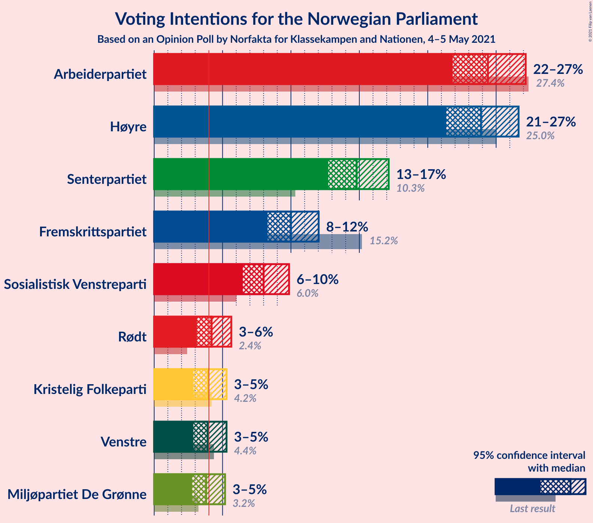

### Confidence Intervals

| Party | Last Result | Poll Result | 80% Confidence Interval | 90% Confidence Interval | 95% Confidence Interval | 99% Confidence Interval |
|:-----:|:-----------:|:-----------:|:-----------------------:|:-----------------------:|:-----------------------:|:-----------------------:|
| Arbeiderpartiet | 27.4% | 24.4% | 22.7–26.2% |22.2–26.7% |21.8–27.2% |21.0–28.0% |
| Høyre | 25.0% | 23.9% | 22.2–25.7% |21.8–26.2% |21.4–26.6% |20.6–27.5% |
| Senterpartiet | 10.3% | 14.8% | 13.4–16.3% |13.1–16.8% |12.7–17.1% |12.1–17.9% |
| Fremskrittspartiet | 15.2% | 10.0% | 8.9–11.3% |8.6–11.7% |8.3–12.0% |7.8–12.7% |
| Sosialistisk Venstreparti | 6.0% | 8.0% | 7.0–9.2% |6.7–9.6% |6.5–9.9% |6.0–10.5% |
| Rødt | 2.4% | 4.2% | 3.5–5.1% |3.3–5.4% |3.1–5.6% |2.8–6.1% |
| Venstre | 4.4% | 3.9% | 3.2–4.8% |3.0–5.1% |2.9–5.3% |2.6–5.8% |
| Kristelig Folkeparti | 4.2% | 3.9% | 3.2–4.8% |3.0–5.1% |2.9–5.3% |2.6–5.8% |
| Miljøpartiet De Grønne | 3.2% | 3.8% | 3.1–4.7% |2.9–5.0% |2.8–5.2% |2.5–5.6% |

*Note:* The poll result column reflects the actual value used in the calculations. Published results may vary slightly, and in addition be rounded to fewer digits.

## Seats

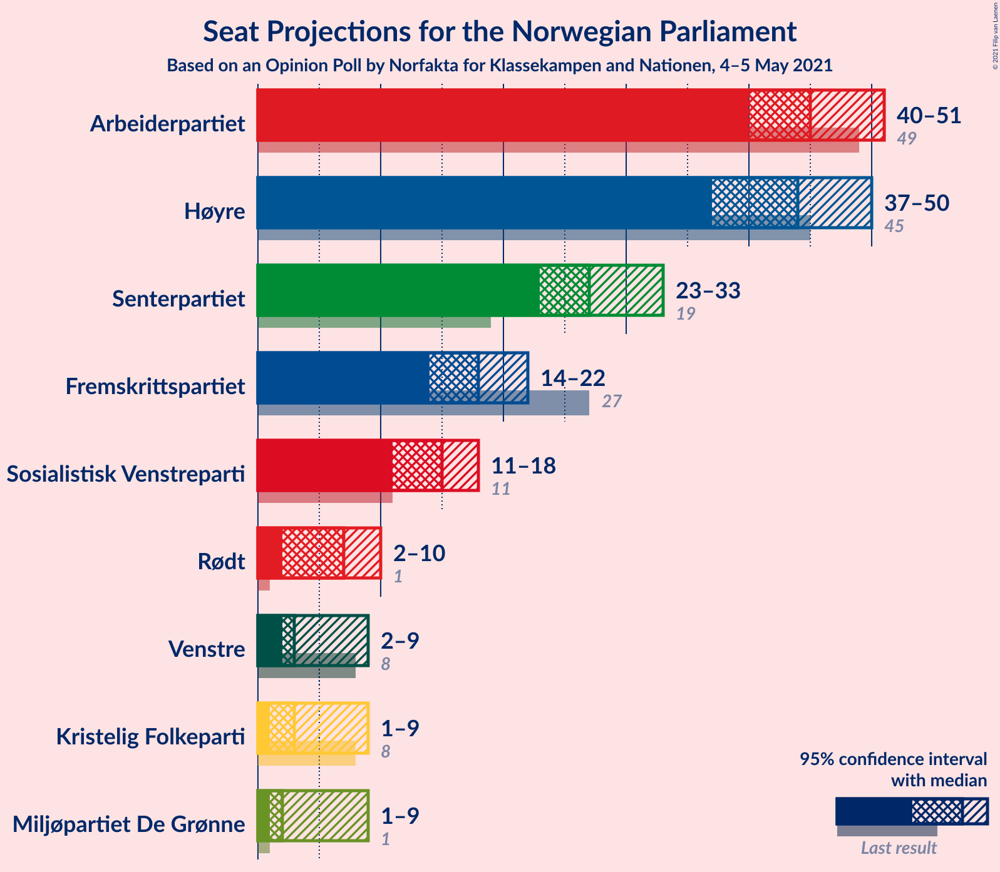

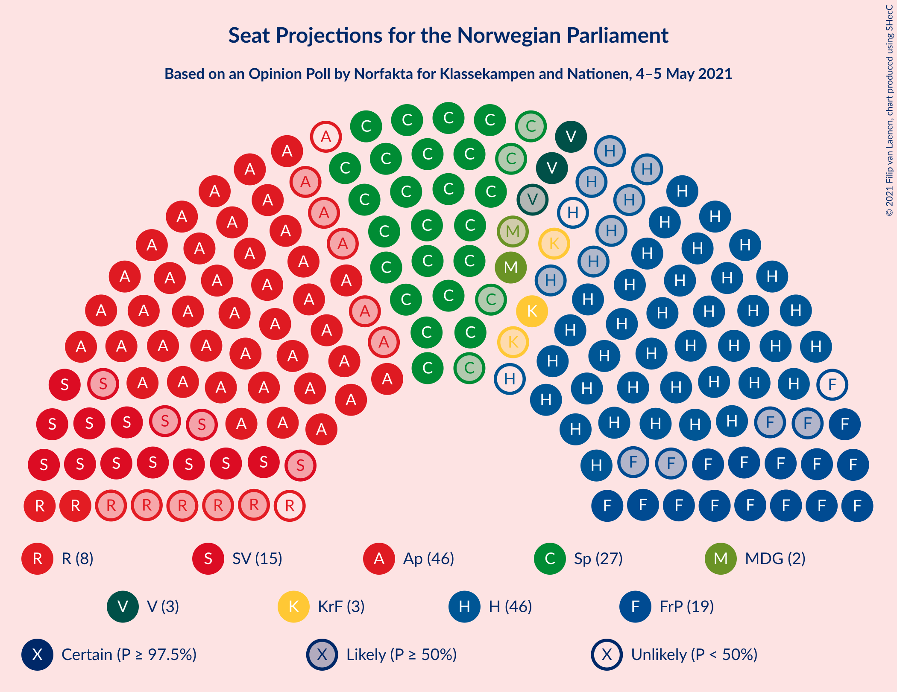

### Confidence Intervals

| Party | Last Result | Median | 80% Confidence Interval | 90% Confidence Interval | 95% Confidence Interval | 99% Confidence Interval |
|:-----:|:-----------:|:------:|:-----------------------:|:-----------------------:|:-----------------------:|:-----------------------:|
| <a href="#arbeiderpartiet">Arbeiderpartiet</a> | 49 | 45 | 42–49 |41–50 |40–51 |39–53 |
| <a href="#høyre">Høyre</a> | 45 | 44 | 40–47 |39–49 |37–50 |36–52 |
| <a href="#senterpartiet">Senterpartiet</a> | 19 | 27 | 24–31 |23–32 |23–33 |21–35 |
| <a href="#fremskrittspartiet">Fremskrittspartiet</a> | 27 | 18 | 16–21 |15–21 |14–22 |13–23 |
| <a href="#sosialistisk-venstreparti">Sosialistisk Venstreparti</a> | 11 | 15 | 12–17 |12–17 |11–18 |10–19 |
| <a href="#rødt">Rødt</a> | 1 | 7 | 2–9 |2–10 |2–10 |1–11 |
| <a href="#venstre">Venstre</a> | 8 | 3 | 2–8 |2–9 |2–9 |2–10 |
| <a href="#kristelig-folkeparti">Kristelig Folkeparti</a> | 8 | 3 | 2–8 |1–9 |1–9 |1–10 |
| <a href="#miljøpartiet-de-grønne">Miljøpartiet De Grønne</a> | 1 | 2 | 2–8 |1–9 |1–9 |1–10 |

### Arbeiderpartiet

*For a full overview of the results for this party, see the [Arbeiderpartiet](party-arbeiderpartiet.html) page.*

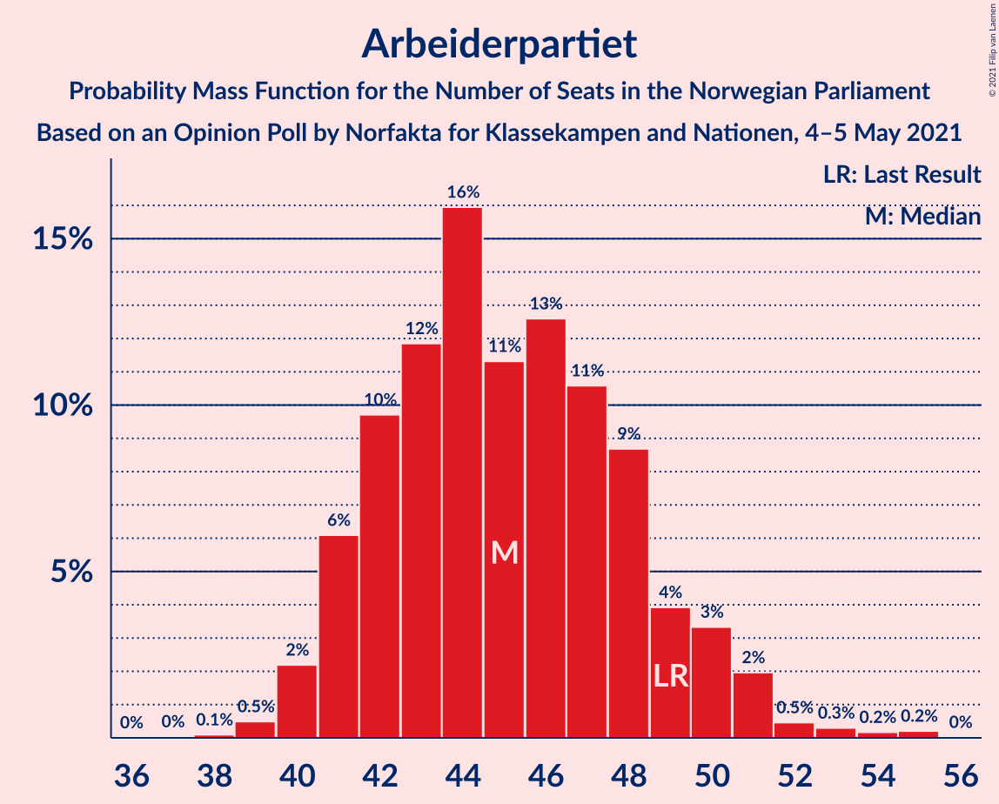

| Number of Seats | Probability | Accumulated | Special Marks |
|:---------------:|:-----------:|:-----------:|:-------------:|
| 38 | 0.1% | 100% |  |
| 39 | 0.5% | 99.9% |  |
| 40 | 2% | 99.4% |  |
| 41 | 6% | 97% |  |
| 42 | 10% | 91% |  |
| 43 | 12% | 81% |  |
| 44 | 16% | 70% |  |
| 45 | 11% | 54% | Median |
| 46 | 13% | 42% |  |
| 47 | 11% | 30% |  |
| 48 | 9% | 19% |  |
| 49 | 4% | 10% | Last Result |
| 50 | 3% | 6% |  |
| 51 | 2% | 3% |  |
| 52 | 0.5% | 1.2% |  |
| 53 | 0.3% | 0.7% |  |
| 54 | 0.2% | 0.4% |  |
| 55 | 0.2% | 0.2% |  |
| 56 | 0% | 0% |  |

### Høyre

*For a full overview of the results for this party, see the [Høyre](party-høyre.html) page.*

| Number of Seats | Probability | Accumulated | Special Marks |
|:---------------:|:-----------:|:-----------:|:-------------:|
| 35 | 0.1% | 100% |  |
| 36 | 0.8% | 99.9% |  |
| 37 | 2% | 99.0% |  |
| 38 | 2% | 97% |  |
| 39 | 3% | 95% |  |
| 40 | 11% | 93% |  |
| 41 | 13% | 82% |  |
| 42 | 7% | 69% |  |
| 43 | 9% | 62% |  |
| 44 | 13% | 53% | Median |
| 45 | 9% | 40% | Last Result |
| 46 | 13% | 31% |  |
| 47 | 9% | 18% |  |
| 48 | 3% | 9% |  |
| 49 | 3% | 6% |  |
| 50 | 1.0% | 3% |  |
| 51 | 1.1% | 2% |  |
| 52 | 1.0% | 1.2% |  |
| 53 | 0.2% | 0.3% |  |
| 54 | 0.1% | 0.1% |  |
| 55 | 0% | 0% |  |

### Senterpartiet

*For a full overview of the results for this party, see the [Senterpartiet](party-senterpartiet.html) page.*

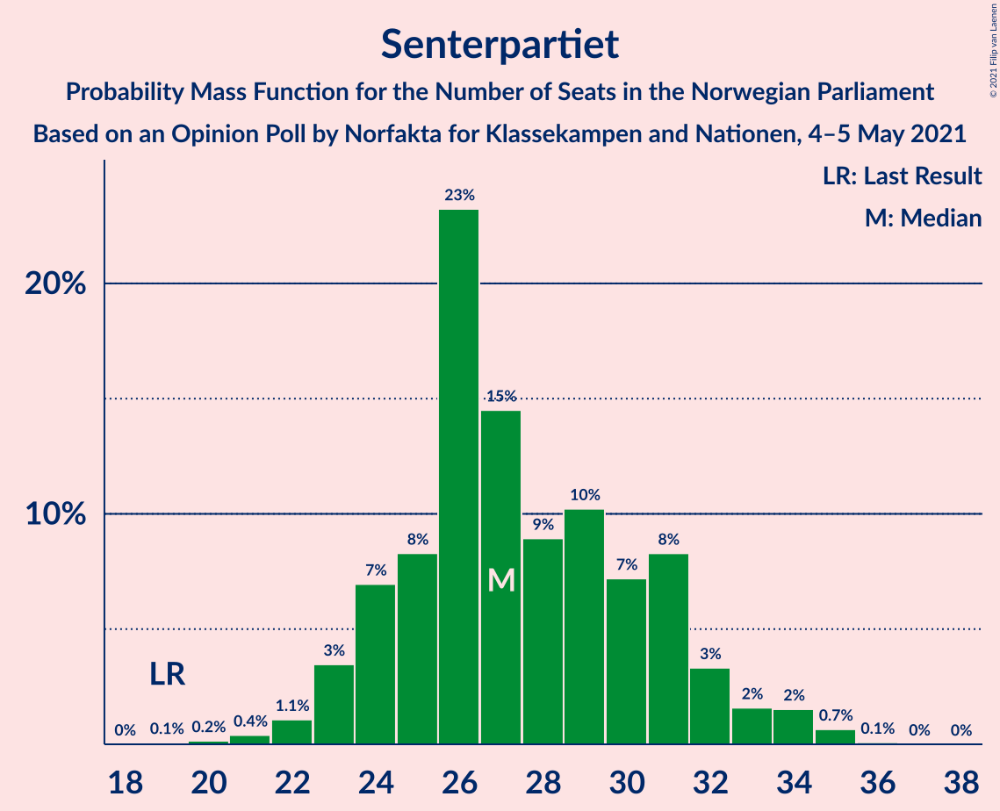

| Number of Seats | Probability | Accumulated | Special Marks |
|:---------------:|:-----------:|:-----------:|:-------------:|
| 19 | 0.1% | 100% | Last Result |
| 20 | 0.2% | 99.9% |  |
| 21 | 0.4% | 99.8% |  |
| 22 | 1.1% | 99.4% |  |
| 23 | 3% | 98% |  |
| 24 | 7% | 95% |  |
| 25 | 8% | 88% |  |
| 26 | 23% | 80% |  |
| 27 | 15% | 56% | Median |
| 28 | 9% | 42% |  |
| 29 | 10% | 33% |  |
| 30 | 7% | 23% |  |
| 31 | 8% | 15% |  |
| 32 | 3% | 7% |  |
| 33 | 2% | 4% |  |
| 34 | 2% | 2% |  |
| 35 | 0.7% | 0.7% |  |
| 36 | 0.1% | 0.1% |  |
| 37 | 0% | 0% |  |

### Fremskrittspartiet

*For a full overview of the results for this party, see the [Fremskrittspartiet](party-fremskrittspartiet.html) page.*

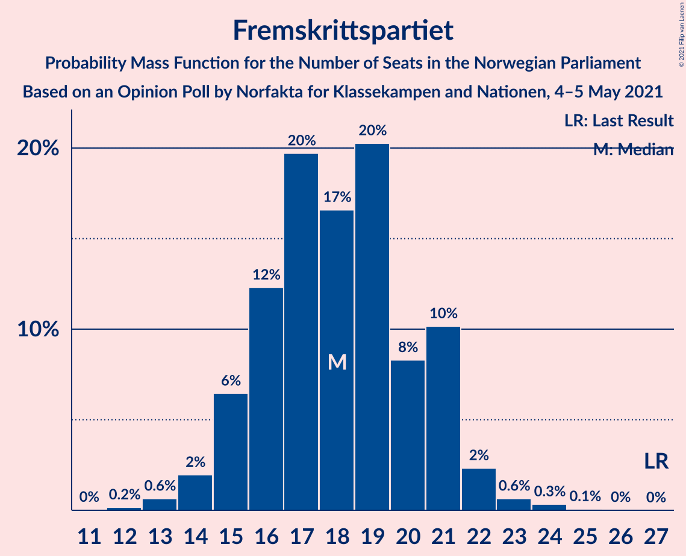

| Number of Seats | Probability | Accumulated | Special Marks |
|:---------------:|:-----------:|:-----------:|:-------------:|
| 12 | 0.2% | 100% |  |
| 13 | 0.6% | 99.8% |  |
| 14 | 2% | 99.1% |  |
| 15 | 6% | 97% |  |
| 16 | 12% | 91% |  |
| 17 | 20% | 78% |  |
| 18 | 17% | 59% | Median |
| 19 | 20% | 42% |  |
| 20 | 8% | 22% |  |
| 21 | 10% | 14% |  |
| 22 | 2% | 3% |  |
| 23 | 0.6% | 1.1% |  |
| 24 | 0.3% | 0.4% |  |
| 25 | 0.1% | 0.1% |  |
| 26 | 0% | 0% |  |
| 27 | 0% | 0% | Last Result |

### Sosialistisk Venstreparti

*For a full overview of the results for this party, see the [Sosialistisk Venstreparti](party-sosialistiskvenstreparti.html) page.*

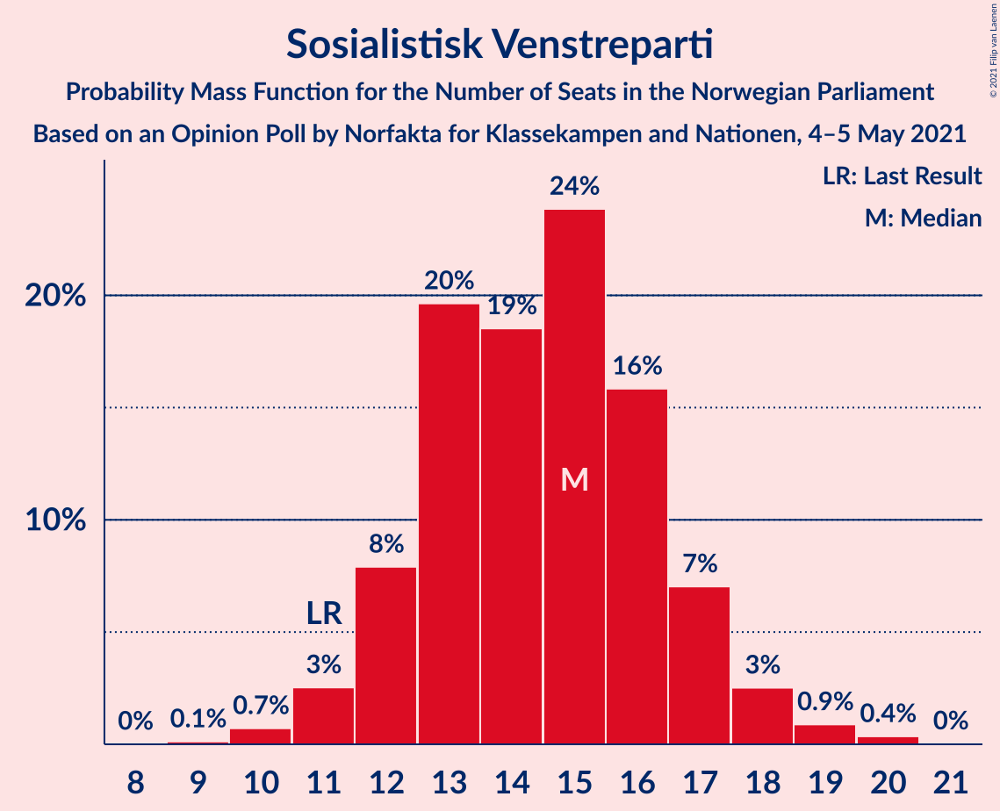

| Number of Seats | Probability | Accumulated | Special Marks |
|:---------------:|:-----------:|:-----------:|:-------------:|
| 9 | 0.1% | 100% |  |
| 10 | 0.7% | 99.9% |  |
| 11 | 3% | 99.1% | Last Result |
| 12 | 8% | 97% |  |
| 13 | 20% | 89% |  |
| 14 | 19% | 69% |  |
| 15 | 24% | 51% | Median |
| 16 | 16% | 27% |  |
| 17 | 7% | 11% |  |
| 18 | 3% | 4% |  |
| 19 | 0.9% | 1.3% |  |
| 20 | 0.4% | 0.4% |  |
| 21 | 0% | 0% |  |

### Rødt

*For a full overview of the results for this party, see the [Rødt](party-rødt.html) page.*

| Number of Seats | Probability | Accumulated | Special Marks |
|:---------------:|:-----------:|:-----------:|:-------------:|
| 1 | 0.5% | 100% | Last Result |
| 2 | 35% | 99.5% |  |
| 3 | 0% | 65% |  |
| 4 | 0% | 65% |  |
| 5 | 0% | 65% |  |
| 6 | 1.0% | 65% |  |
| 7 | 18% | 63% | Median |
| 8 | 25% | 46% |  |
| 9 | 13% | 20% |  |
| 10 | 6% | 7% |  |
| 11 | 0.7% | 0.8% |  |
| 12 | 0.1% | 0.1% |  |
| 13 | 0% | 0% |  |

### Venstre

*For a full overview of the results for this party, see the [Venstre](party-venstre.html) page.*

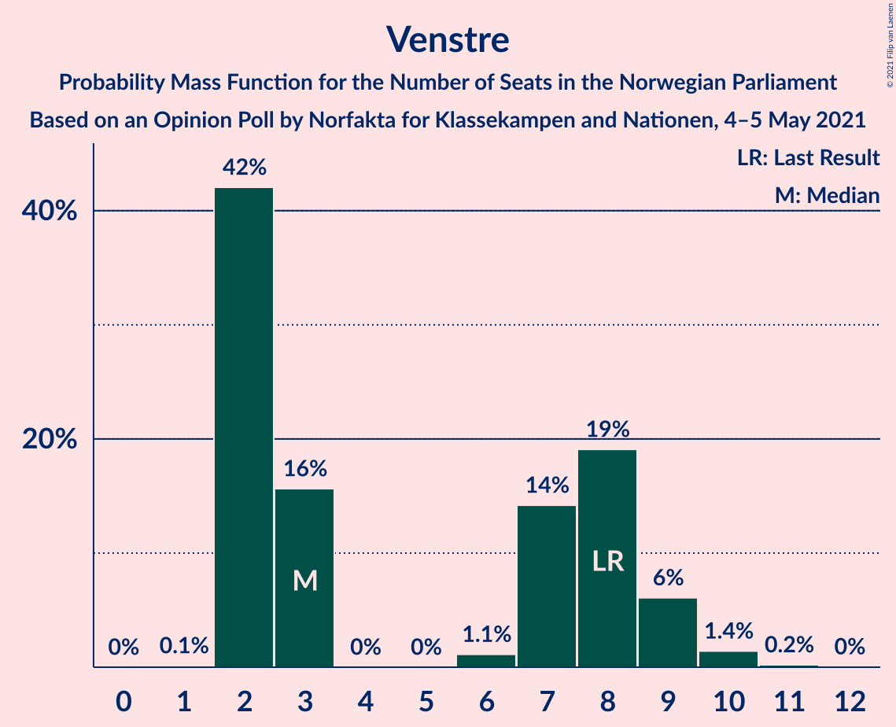

| Number of Seats | Probability | Accumulated | Special Marks |
|:---------------:|:-----------:|:-----------:|:-------------:|
| 1 | 0.1% | 100% |  |
| 2 | 42% | 99.9% |  |
| 3 | 16% | 58% | Median |
| 4 | 0% | 42% |  |
| 5 | 0% | 42% |  |
| 6 | 1.1% | 42% |  |
| 7 | 14% | 41% |  |
| 8 | 19% | 27% | Last Result |
| 9 | 6% | 8% |  |
| 10 | 1.4% | 2% |  |
| 11 | 0.2% | 0.3% |  |
| 12 | 0% | 0% |  |

### Kristelig Folkeparti

*For a full overview of the results for this party, see the [Kristelig Folkeparti](party-kristeligfolkeparti.html) page.*

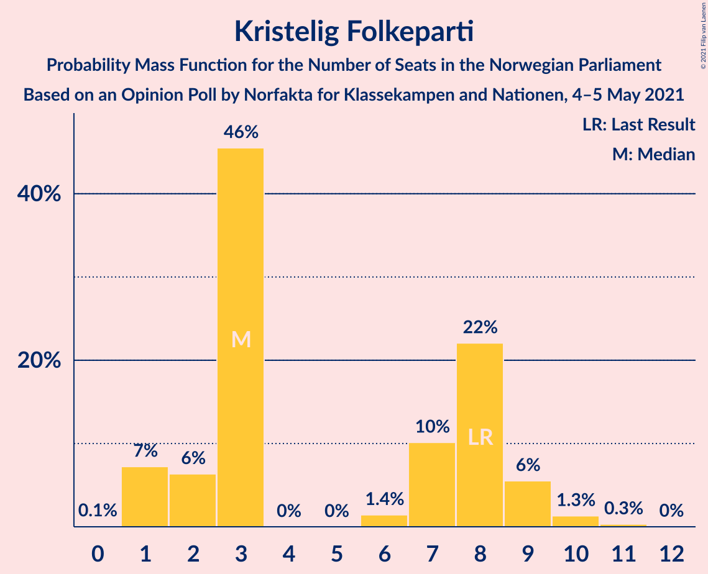

| Number of Seats | Probability | Accumulated | Special Marks |
|:---------------:|:-----------:|:-----------:|:-------------:|
| 0 | 0.1% | 100% |  |
| 1 | 7% | 99.9% |  |
| 2 | 6% | 93% |  |
| 3 | 46% | 86% | Median |
| 4 | 0% | 41% |  |
| 5 | 0% | 41% |  |
| 6 | 1.4% | 41% |  |
| 7 | 10% | 39% |  |
| 8 | 22% | 29% | Last Result |
| 9 | 6% | 7% |  |
| 10 | 1.3% | 2% |  |
| 11 | 0.3% | 0.4% |  |
| 12 | 0% | 0% |  |

### Miljøpartiet De Grønne

*For a full overview of the results for this party, see the [Miljøpartiet De Grønne](party-miljøpartietdegrønne.html) page.*

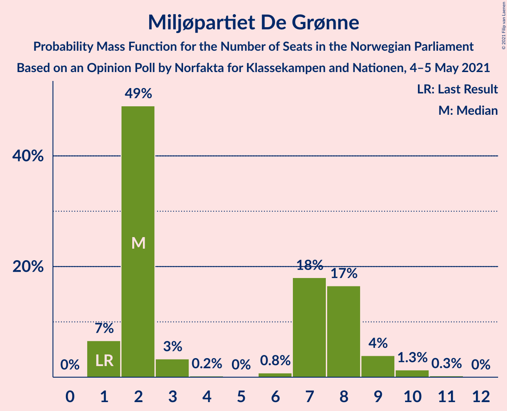

| Number of Seats | Probability | Accumulated | Special Marks |
|:---------------:|:-----------:|:-----------:|:-------------:|
| 1 | 7% | 100% | Last Result |
| 2 | 49% | 93% | Median |
| 3 | 3% | 44% |  |
| 4 | 0.2% | 41% |  |
| 5 | 0% | 41% |  |
| 6 | 0.8% | 41% |  |
| 7 | 18% | 40% |  |
| 8 | 17% | 22% |  |
| 9 | 4% | 5% |  |
| 10 | 1.3% | 2% |  |
| 11 | 0.3% | 0.3% |  |
| 12 | 0% | 0% |  |

## Coalitions

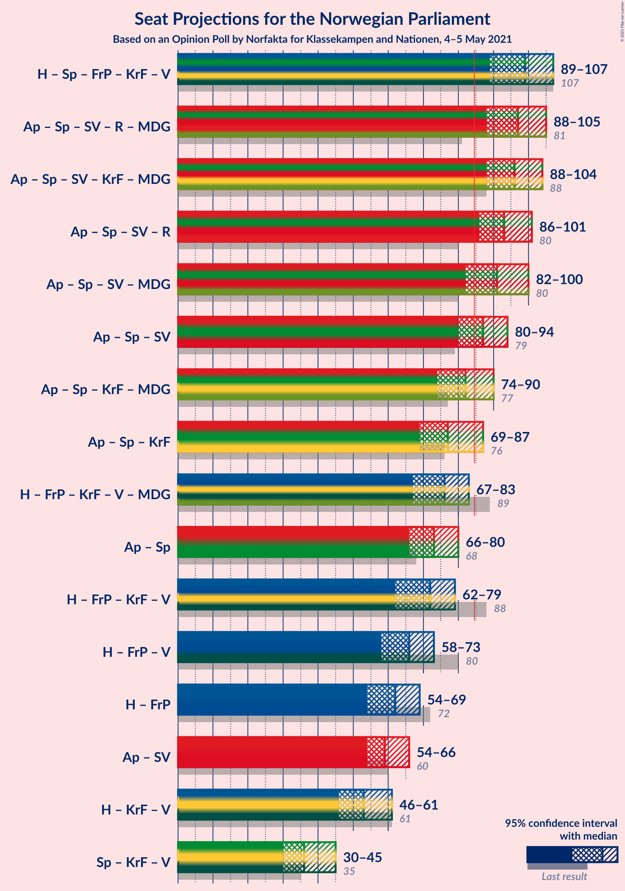

### Confidence Intervals

| Coalition | Last Result | Median | Majority? | 80% Confidence Interval | 90% Confidence Interval | 95% Confidence Interval | 99% Confidence Interval |
|:---------:|:-----------:|:------:|:---------:|:-----------------------:|:-----------------------:|:-----------------------:|:-----------------------:|
| Høyre – Senterpartiet – Fremskrittspartiet – Kristelig Folkeparti – Venstre | 107 | 99 | 100% | 93–103 | 92–105 | 89–107 | 87–109 |
| Arbeiderpartiet – Senterpartiet – Sosialistisk Venstreparti – Rødt – Miljøpartiet De Grønne | 81 | 97 | 99.9% | 91–103 | 90–104 | 88–105 | 87–107 |
| Arbeiderpartiet – Senterpartiet – Sosialistisk Venstreparti – Kristelig Folkeparti – Miljøpartiet De Grønne | 88 | 96 | 99.8% | 89–102 | 89–103 | 88–104 | 86–107 |
| Arbeiderpartiet – Senterpartiet – Sosialistisk Venstreparti – Rødt | 80 | 93 | 98.7% | 88–98 | 86–99 | 86–101 | 83–103 |
| Arbeiderpartiet – Senterpartiet – Sosialistisk Venstreparti – Miljøpartiet De Grønne | 80 | 91 | 93% | 86–96 | 83–98 | 82–100 | 81–102 |
| Arbeiderpartiet – Senterpartiet – Sosialistisk Venstreparti | 79 | 87 | 77% | 82–93 | 80–93 | 80–94 | 77–97 |
| Arbeiderpartiet – Senterpartiet – Kristelig Folkeparti – Miljøpartiet De Grønne | 77 | 82 | 25% | 75–87 | 74–90 | 74–90 | 71–93 |
| Arbeiderpartiet – Senterpartiet – Kristelig Folkeparti | 76 | 77 | 5% | 72–83 | 71–84 | 69–87 | 68–88 |
| Høyre – Fremskrittspartiet – Kristelig Folkeparti – Venstre – Miljøpartiet De Grønne | 89 | 76 | 0.8% | 71–80 | 68–82 | 67–83 | 64–85 |
| Arbeiderpartiet – Senterpartiet | 68 | 73 | 0.1% | 67–78 | 66–79 | 66–80 | 64–82 |
| Høyre – Fremskrittspartiet – Kristelig Folkeparti – Venstre | 88 | 72 | 0% | 65–76 | 64–78 | 62–79 | 61–81 |
| Høyre – Fremskrittspartiet – Venstre | 80 | 66 | 0% | 62–72 | 59–73 | 58–73 | 57–75 |
| Høyre – Fremskrittspartiet | 72 | 62 | 0% | 57–67 | 55–68 | 54–69 | 52–71 |
| Arbeiderpartiet – Sosialistisk Venstreparti | 60 | 59 | 0% | 55–64 | 54–65 | 54–66 | 52–68 |
| Høyre – Kristelig Folkeparti – Venstre | 61 | 53 | 0% | 48–58 | 47–59 | 46–61 | 44–63 |
| Senterpartiet – Kristelig Folkeparti – Venstre | 35 | 36 | 0% | 31–43 | 31–45 | 30–45 | 28–49 |

### Høyre – Senterpartiet – Fremskrittspartiet – Kristelig Folkeparti – Venstre

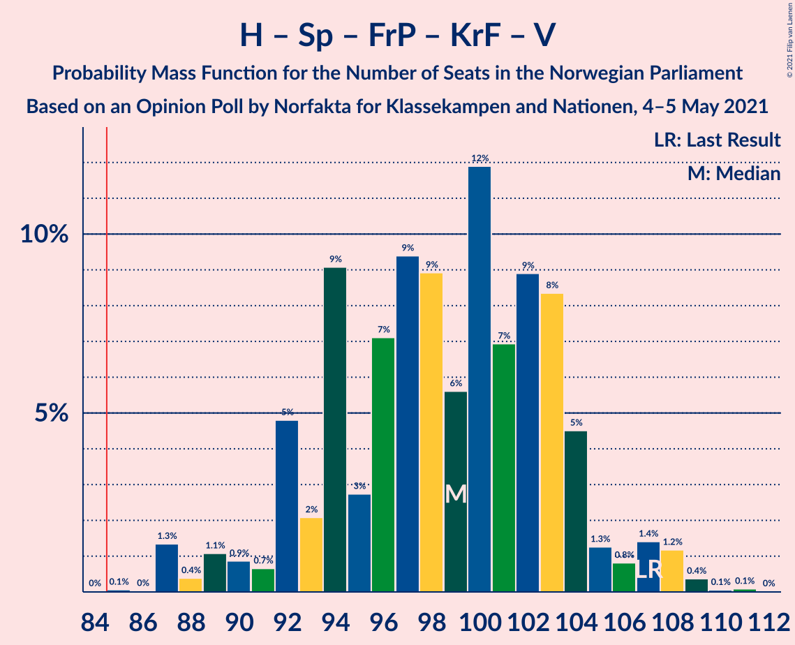

| Number of Seats | Probability | Accumulated | Special Marks |
|:---------------:|:-----------:|:-----------:|:-------------:|
| 85 | 0.1% | 100% | Majority |
| 86 | 0% | 99.9% |  |
| 87 | 1.3% | 99.9% |  |
| 88 | 0.4% | 98.5% |  |
| 89 | 1.1% | 98% |  |
| 90 | 0.9% | 97% |  |
| 91 | 0.7% | 96% |  |
| 92 | 5% | 96% |  |
| 93 | 2% | 91% |  |
| 94 | 9% | 89% |  |
| 95 | 3% | 80% | Median |
| 96 | 7% | 77% |  |
| 97 | 9% | 70% |  |
| 98 | 9% | 60% |  |
| 99 | 6% | 51% |  |
| 100 | 12% | 46% |  |
| 101 | 7% | 34% |  |
| 102 | 9% | 27% |  |
| 103 | 8% | 18% |  |
| 104 | 5% | 10% |  |
| 105 | 1.3% | 5% |  |
| 106 | 0.8% | 4% |  |
| 107 | 1.4% | 3% | Last Result |
| 108 | 1.2% | 2% |  |
| 109 | 0.4% | 0.5% |  |
| 110 | 0.1% | 0.2% |  |
| 111 | 0.1% | 0.1% |  |
| 112 | 0% | 0% |  |

### Arbeiderpartiet – Senterpartiet – Sosialistisk Venstreparti – Rødt – Miljøpartiet De Grønne

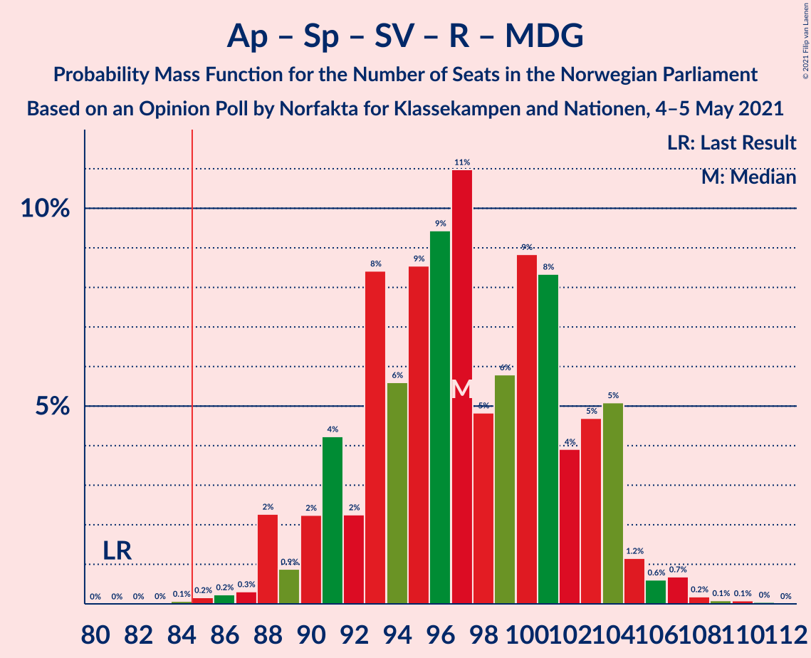

| Number of Seats | Probability | Accumulated | Special Marks |
|:---------------:|:-----------:|:-----------:|:-------------:|
| 81 | 0% | 100% | Last Result |
| 82 | 0% | 100% |  |
| 83 | 0% | 100% |  |
| 84 | 0.1% | 100% |  |
| 85 | 0.2% | 99.9% | Majority |
| 86 | 0.2% | 99.7% |  |
| 87 | 0.3% | 99.5% |  |
| 88 | 2% | 99.2% |  |
| 89 | 0.9% | 97% |  |
| 90 | 2% | 96% |  |
| 91 | 4% | 94% |  |
| 92 | 2% | 90% |  |
| 93 | 8% | 87% |  |
| 94 | 6% | 79% |  |
| 95 | 9% | 73% |  |
| 96 | 9% | 65% | Median |
| 97 | 11% | 55% |  |
| 98 | 5% | 44% |  |
| 99 | 6% | 40% |  |
| 100 | 9% | 34% |  |
| 101 | 8% | 25% |  |
| 102 | 4% | 17% |  |
| 103 | 5% | 13% |  |
| 104 | 5% | 8% |  |
| 105 | 1.2% | 3% |  |
| 106 | 0.6% | 2% |  |
| 107 | 0.7% | 1.1% |  |
| 108 | 0.2% | 0.4% |  |
| 109 | 0.1% | 0.2% |  |
| 110 | 0.1% | 0.1% |  |
| 111 | 0% | 0.1% |  |
| 112 | 0% | 0% |  |

### Arbeiderpartiet – Senterpartiet – Sosialistisk Venstreparti – Kristelig Folkeparti – Miljøpartiet De Grønne

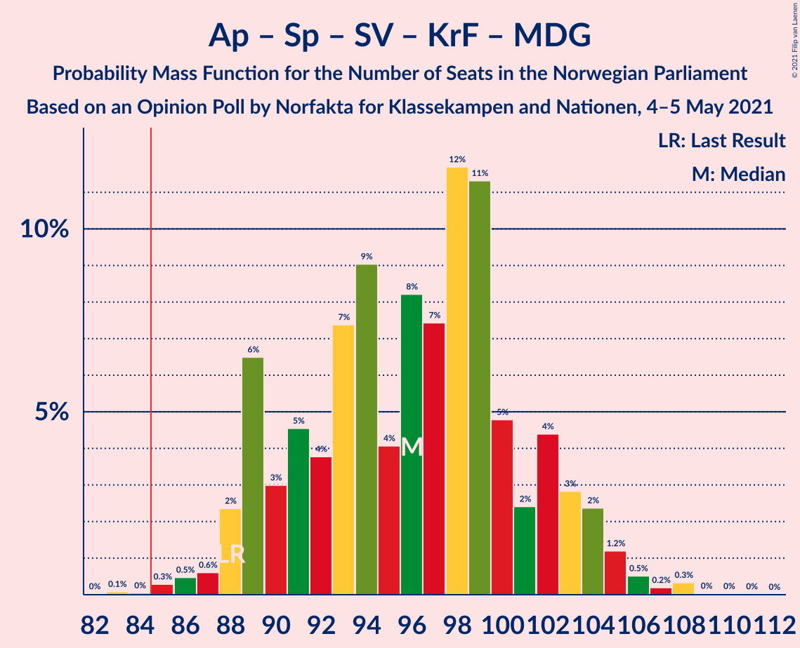

| Number of Seats | Probability | Accumulated | Special Marks |
|:---------------:|:-----------:|:-----------:|:-------------:|
| 83 | 0.1% | 100% |  |
| 84 | 0% | 99.9% |  |
| 85 | 0.3% | 99.8% | Majority |
| 86 | 0.5% | 99.5% |  |
| 87 | 0.6% | 99.1% |  |
| 88 | 2% | 98% | Last Result |
| 89 | 6% | 96% |  |
| 90 | 3% | 90% |  |
| 91 | 5% | 87% |  |
| 92 | 4% | 82% | Median |
| 93 | 7% | 78% |  |
| 94 | 9% | 71% |  |
| 95 | 4% | 62% |  |
| 96 | 8% | 58% |  |
| 97 | 7% | 50% |  |
| 98 | 12% | 42% |  |
| 99 | 11% | 30% |  |
| 100 | 5% | 19% |  |
| 101 | 2% | 14% |  |
| 102 | 4% | 12% |  |
| 103 | 3% | 8% |  |
| 104 | 2% | 5% |  |
| 105 | 1.2% | 2% |  |
| 106 | 0.5% | 1.1% |  |
| 107 | 0.2% | 0.6% |  |
| 108 | 0.3% | 0.4% |  |
| 109 | 0% | 0.1% |  |
| 110 | 0% | 0.1% |  |
| 111 | 0% | 0% |  |

### Arbeiderpartiet – Senterpartiet – Sosialistisk Venstreparti – Rødt

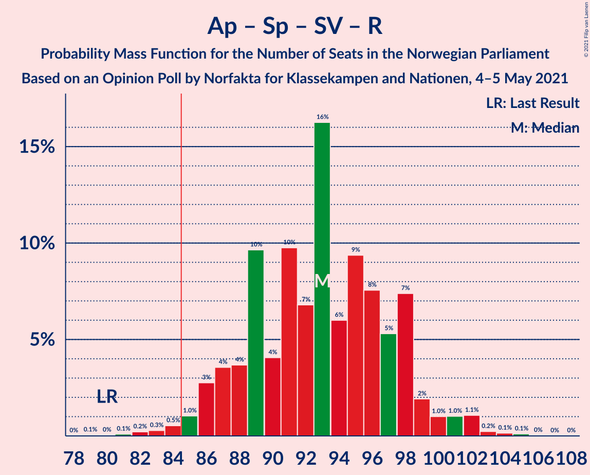

| Number of Seats | Probability | Accumulated | Special Marks |
|:---------------:|:-----------:|:-----------:|:-------------:|
| 79 | 0.1% | 100% |  |
| 80 | 0% | 99.9% | Last Result |
| 81 | 0.1% | 99.9% |  |
| 82 | 0.2% | 99.8% |  |
| 83 | 0.3% | 99.6% |  |
| 84 | 0.5% | 99.3% |  |
| 85 | 1.0% | 98.7% | Majority |
| 86 | 3% | 98% |  |
| 87 | 4% | 95% |  |
| 88 | 4% | 91% |  |
| 89 | 10% | 88% |  |
| 90 | 4% | 78% |  |
| 91 | 10% | 74% |  |
| 92 | 7% | 64% |  |
| 93 | 16% | 57% |  |
| 94 | 6% | 41% | Median |
| 95 | 9% | 35% |  |
| 96 | 8% | 26% |  |
| 97 | 5% | 18% |  |
| 98 | 7% | 13% |  |
| 99 | 2% | 6% |  |
| 100 | 1.0% | 4% |  |
| 101 | 1.0% | 3% |  |
| 102 | 1.1% | 2% |  |
| 103 | 0.2% | 0.5% |  |
| 104 | 0.1% | 0.3% |  |
| 105 | 0.1% | 0.2% |  |
| 106 | 0% | 0.1% |  |
| 107 | 0% | 0% |  |

### Arbeiderpartiet – Senterpartiet – Sosialistisk Venstreparti – Miljøpartiet De Grønne

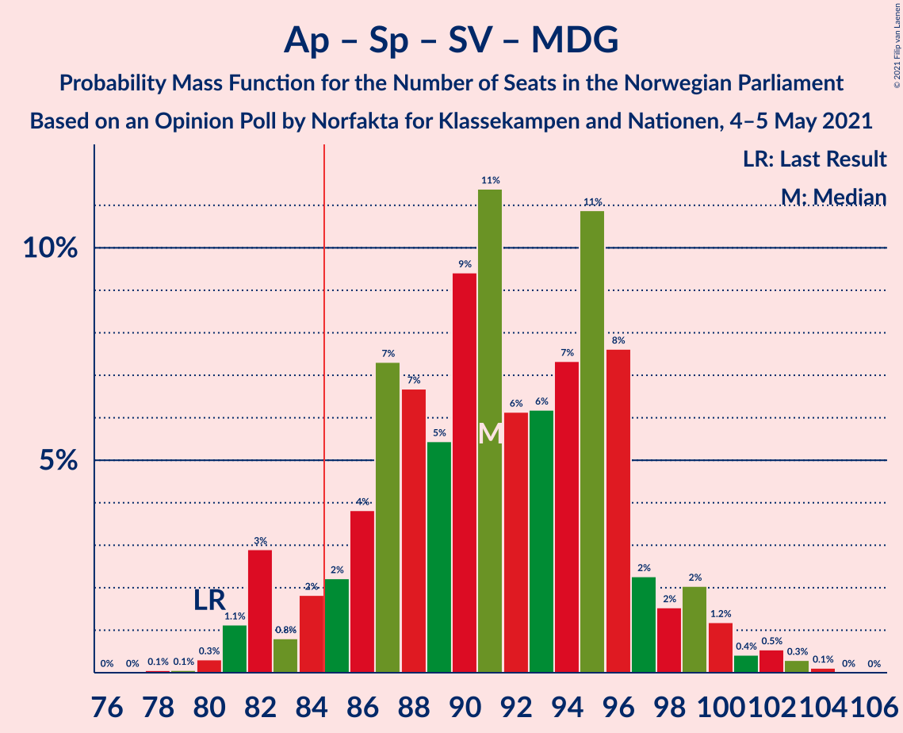

| Number of Seats | Probability | Accumulated | Special Marks |
|:---------------:|:-----------:|:-----------:|:-------------:|
| 78 | 0.1% | 100% |  |
| 79 | 0.1% | 99.9% |  |
| 80 | 0.3% | 99.8% | Last Result |
| 81 | 1.1% | 99.5% |  |
| 82 | 3% | 98% |  |
| 83 | 0.8% | 96% |  |
| 84 | 2% | 95% |  |
| 85 | 2% | 93% | Majority |
| 86 | 4% | 91% |  |
| 87 | 7% | 87% |  |
| 88 | 7% | 80% |  |
| 89 | 5% | 73% | Median |
| 90 | 9% | 67% |  |
| 91 | 11% | 58% |  |
| 92 | 6% | 47% |  |
| 93 | 6% | 40% |  |
| 94 | 7% | 34% |  |
| 95 | 11% | 27% |  |
| 96 | 8% | 16% |  |
| 97 | 2% | 8% |  |
| 98 | 2% | 6% |  |
| 99 | 2% | 5% |  |
| 100 | 1.2% | 3% |  |
| 101 | 0.4% | 1.4% |  |
| 102 | 0.5% | 1.0% |  |
| 103 | 0.3% | 0.4% |  |
| 104 | 0.1% | 0.1% |  |
| 105 | 0% | 0% |  |

### Arbeiderpartiet – Senterpartiet – Sosialistisk Venstreparti

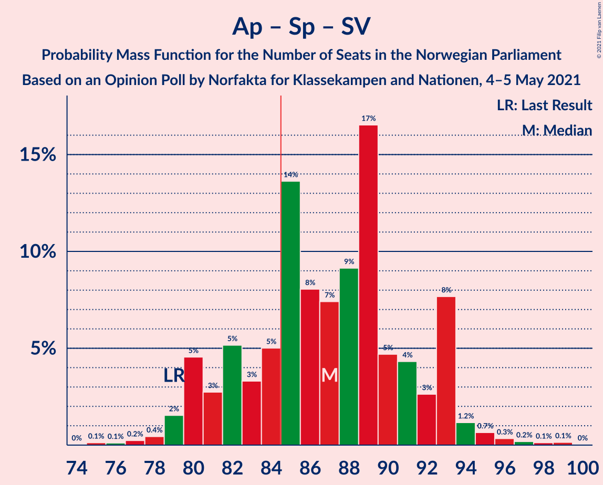

| Number of Seats | Probability | Accumulated | Special Marks |
|:---------------:|:-----------:|:-----------:|:-------------:|
| 75 | 0.1% | 100% |  |
| 76 | 0.1% | 99.8% |  |
| 77 | 0.2% | 99.7% |  |
| 78 | 0.4% | 99.5% |  |
| 79 | 2% | 99.0% | Last Result |
| 80 | 5% | 98% |  |
| 81 | 3% | 93% |  |
| 82 | 5% | 90% |  |
| 83 | 3% | 85% |  |
| 84 | 5% | 82% |  |
| 85 | 14% | 77% | Majority |
| 86 | 8% | 63% |  |
| 87 | 7% | 55% | Median |
| 88 | 9% | 48% |  |
| 89 | 17% | 39% |  |
| 90 | 5% | 22% |  |
| 91 | 4% | 17% |  |
| 92 | 3% | 13% |  |
| 93 | 8% | 10% |  |
| 94 | 1.2% | 3% |  |
| 95 | 0.7% | 1.5% |  |
| 96 | 0.3% | 0.8% |  |
| 97 | 0.2% | 0.5% |  |
| 98 | 0.1% | 0.3% |  |
| 99 | 0.1% | 0.2% |  |
| 100 | 0% | 0% |  |

### Arbeiderpartiet – Senterpartiet – Kristelig Folkeparti – Miljøpartiet De Grønne

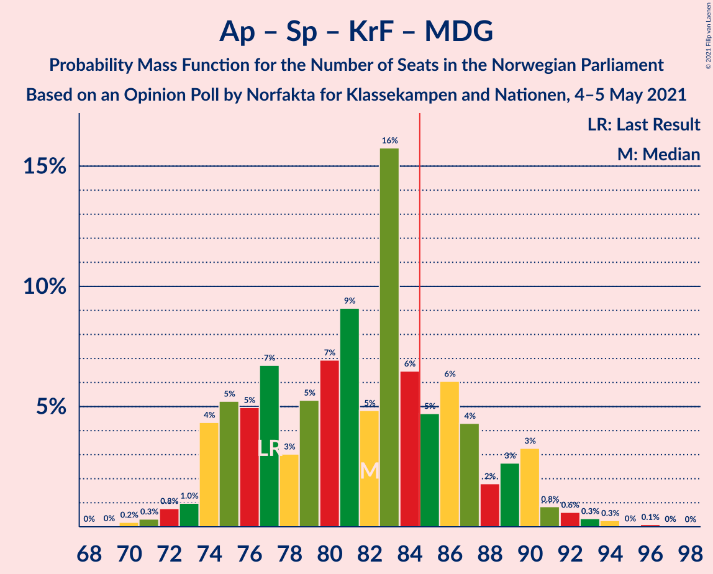

| Number of Seats | Probability | Accumulated | Special Marks |
|:---------------:|:-----------:|:-----------:|:-------------:|
| 68 | 0% | 100% |  |
| 69 | 0% | 99.9% |  |
| 70 | 0.2% | 99.9% |  |
| 71 | 0.3% | 99.7% |  |
| 72 | 0.8% | 99.4% |  |
| 73 | 1.0% | 98.6% |  |
| 74 | 4% | 98% |  |
| 75 | 5% | 93% |  |
| 76 | 5% | 88% |  |
| 77 | 7% | 83% | Last Result, Median |
| 78 | 3% | 76% |  |
| 79 | 5% | 73% |  |
| 80 | 7% | 68% |  |
| 81 | 9% | 61% |  |
| 82 | 5% | 52% |  |
| 83 | 16% | 47% |  |
| 84 | 6% | 31% |  |
| 85 | 5% | 25% | Majority |
| 86 | 6% | 20% |  |
| 87 | 4% | 14% |  |
| 88 | 2% | 10% |  |
| 89 | 3% | 8% |  |
| 90 | 3% | 5% |  |
| 91 | 0.8% | 2% |  |
| 92 | 0.6% | 1.4% |  |
| 93 | 0.3% | 0.8% |  |
| 94 | 0.3% | 0.4% |  |
| 95 | 0% | 0.2% |  |
| 96 | 0.1% | 0.1% |  |
| 97 | 0% | 0% |  |

### Arbeiderpartiet – Senterpartiet – Kristelig Folkeparti

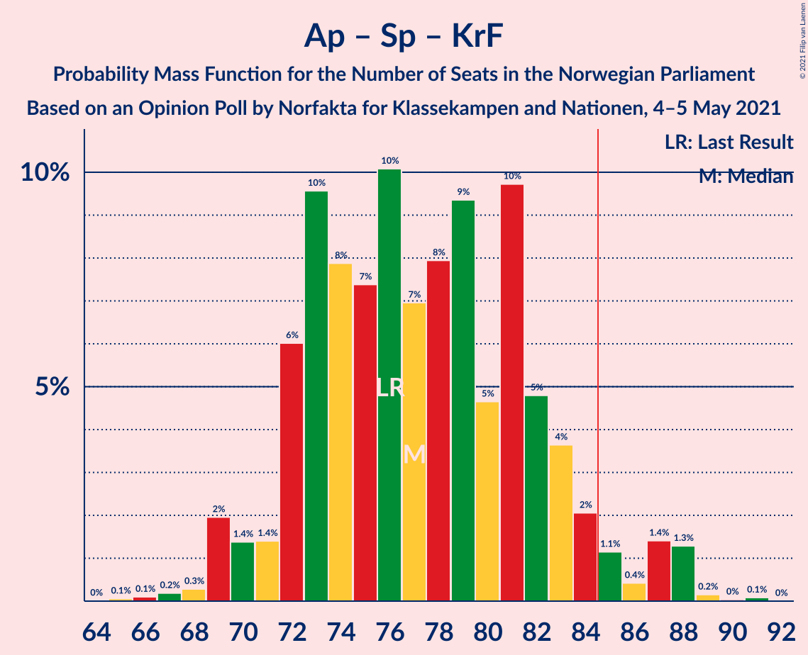

| Number of Seats | Probability | Accumulated | Special Marks |
|:---------------:|:-----------:|:-----------:|:-------------:|
| 65 | 0.1% | 100% |  |
| 66 | 0.1% | 99.9% |  |
| 67 | 0.2% | 99.8% |  |
| 68 | 0.3% | 99.6% |  |
| 69 | 2% | 99.4% |  |
| 70 | 1.4% | 97% |  |
| 71 | 1.4% | 96% |  |
| 72 | 6% | 95% |  |
| 73 | 10% | 89% |  |
| 74 | 8% | 79% |  |
| 75 | 7% | 71% | Median |
| 76 | 10% | 64% | Last Result |
| 77 | 7% | 54% |  |
| 78 | 8% | 47% |  |
| 79 | 9% | 39% |  |
| 80 | 5% | 29% |  |
| 81 | 10% | 25% |  |
| 82 | 5% | 15% |  |
| 83 | 4% | 10% |  |
| 84 | 2% | 7% |  |
| 85 | 1.1% | 5% | Majority |
| 86 | 0.4% | 3% |  |
| 87 | 1.4% | 3% |  |
| 88 | 1.3% | 2% |  |
| 89 | 0.2% | 0.3% |  |
| 90 | 0% | 0.1% |  |
| 91 | 0.1% | 0.1% |  |
| 92 | 0% | 0% |  |

### Høyre – Fremskrittspartiet – Kristelig Folkeparti – Venstre – Miljøpartiet De Grønne

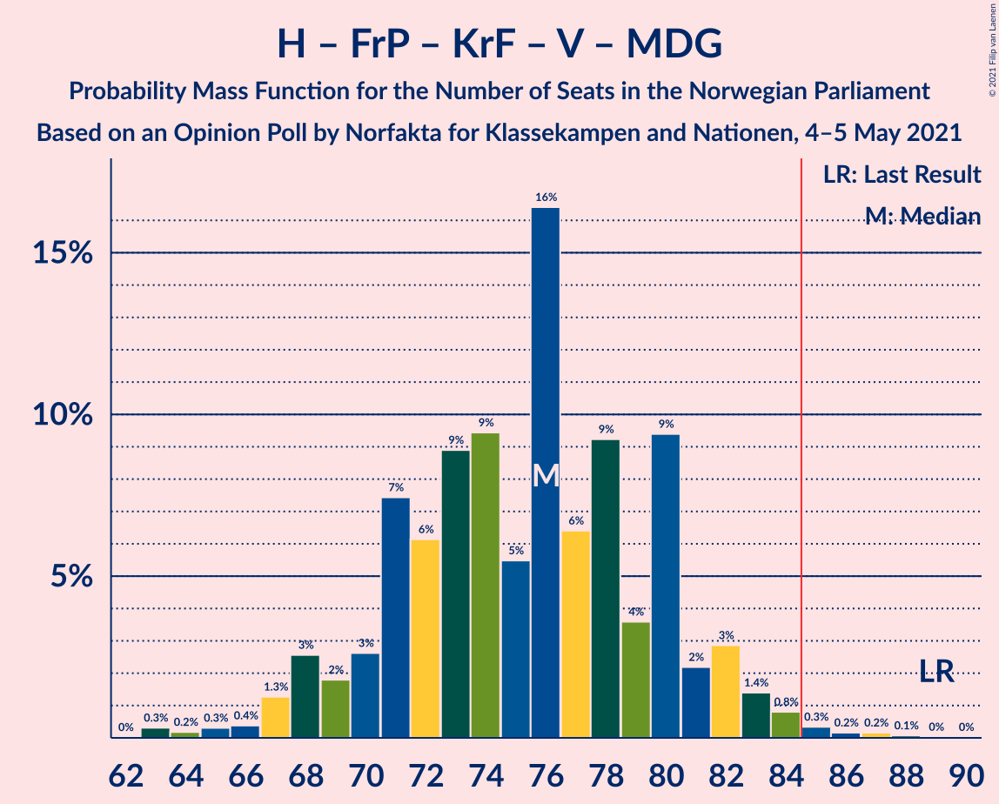

| Number of Seats | Probability | Accumulated | Special Marks |
|:---------------:|:-----------:|:-----------:|:-------------:|
| 63 | 0.3% | 100% |  |
| 64 | 0.2% | 99.6% |  |
| 65 | 0.3% | 99.5% |  |
| 66 | 0.4% | 99.1% |  |
| 67 | 1.3% | 98.8% |  |
| 68 | 3% | 97% |  |
| 69 | 2% | 95% |  |
| 70 | 3% | 93% | Median |
| 71 | 7% | 91% |  |
| 72 | 6% | 83% |  |
| 73 | 9% | 77% |  |
| 74 | 9% | 68% |  |
| 75 | 5% | 59% |  |
| 76 | 16% | 53% |  |
| 77 | 6% | 37% |  |
| 78 | 9% | 30% |  |
| 79 | 4% | 21% |  |
| 80 | 9% | 17% |  |
| 81 | 2% | 8% |  |
| 82 | 3% | 6% |  |
| 83 | 1.4% | 3% |  |
| 84 | 0.8% | 2% |  |
| 85 | 0.3% | 0.8% | Majority |
| 86 | 0.2% | 0.5% |  |
| 87 | 0.2% | 0.3% |  |
| 88 | 0.1% | 0.1% |  |
| 89 | 0% | 0.1% | Last Result |
| 90 | 0% | 0% |  |

### Arbeiderpartiet – Senterpartiet

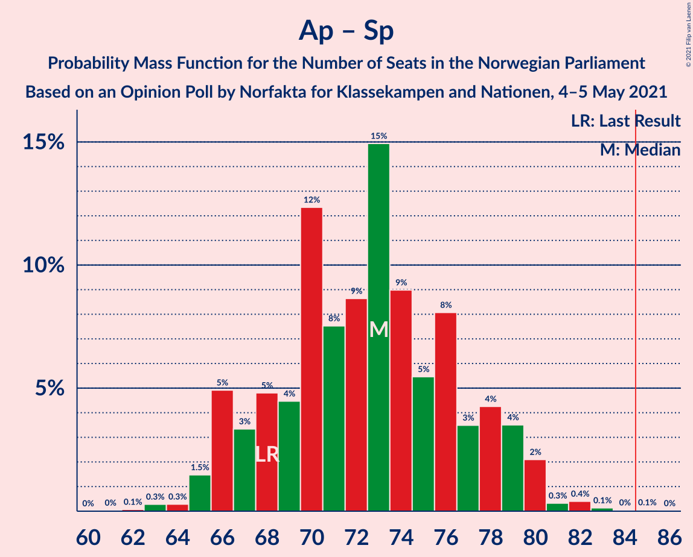

| Number of Seats | Probability | Accumulated | Special Marks |
|:---------------:|:-----------:|:-----------:|:-------------:|
| 62 | 0.1% | 100% |  |
| 63 | 0.3% | 99.9% |  |
| 64 | 0.3% | 99.6% |  |
| 65 | 1.5% | 99.3% |  |
| 66 | 5% | 98% |  |
| 67 | 3% | 93% |  |
| 68 | 5% | 90% | Last Result |
| 69 | 4% | 85% |  |
| 70 | 12% | 80% |  |
| 71 | 8% | 68% |  |
| 72 | 9% | 60% | Median |
| 73 | 15% | 52% |  |
| 74 | 9% | 37% |  |
| 75 | 5% | 28% |  |
| 76 | 8% | 22% |  |
| 77 | 3% | 14% |  |
| 78 | 4% | 11% |  |
| 79 | 4% | 7% |  |
| 80 | 2% | 3% |  |
| 81 | 0.3% | 1.0% |  |
| 82 | 0.4% | 0.6% |  |
| 83 | 0.1% | 0.2% |  |
| 84 | 0% | 0.1% |  |
| 85 | 0.1% | 0.1% | Majority |
| 86 | 0% | 0% |  |

### Høyre – Fremskrittspartiet – Kristelig Folkeparti – Venstre

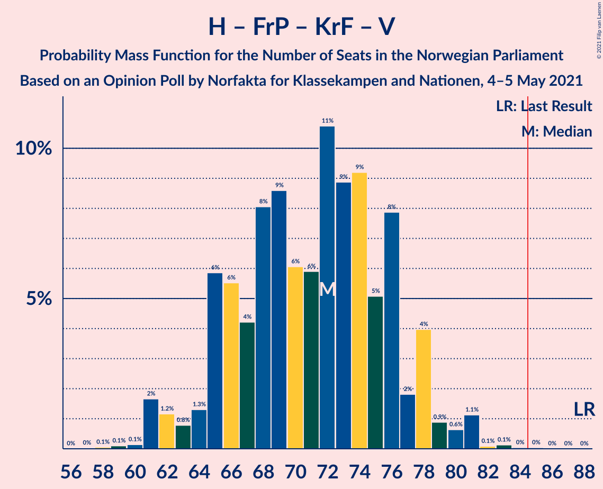

| Number of Seats | Probability | Accumulated | Special Marks |
|:---------------:|:-----------:|:-----------:|:-------------:|
| 58 | 0.1% | 100% |  |
| 59 | 0.1% | 99.9% |  |
| 60 | 0.1% | 99.8% |  |
| 61 | 2% | 99.7% |  |
| 62 | 1.2% | 98% |  |
| 63 | 0.8% | 97% |  |
| 64 | 1.3% | 96% |  |
| 65 | 6% | 95% |  |
| 66 | 6% | 89% |  |
| 67 | 4% | 83% |  |
| 68 | 8% | 79% | Median |
| 69 | 9% | 71% |  |
| 70 | 6% | 62% |  |
| 71 | 6% | 56% |  |
| 72 | 11% | 51% |  |
| 73 | 9% | 40% |  |
| 74 | 9% | 31% |  |
| 75 | 5% | 22% |  |
| 76 | 8% | 17% |  |
| 77 | 2% | 9% |  |
| 78 | 4% | 7% |  |
| 79 | 0.9% | 3% |  |
| 80 | 0.6% | 2% |  |
| 81 | 1.1% | 1.4% |  |
| 82 | 0.1% | 0.3% |  |
| 83 | 0.1% | 0.2% |  |
| 84 | 0% | 0.1% |  |
| 85 | 0% | 0% | Majority |
| 86 | 0% | 0% |  |
| 87 | 0% | 0% |  |
| 88 | 0% | 0% | Last Result |

### Høyre – Fremskrittspartiet – Venstre

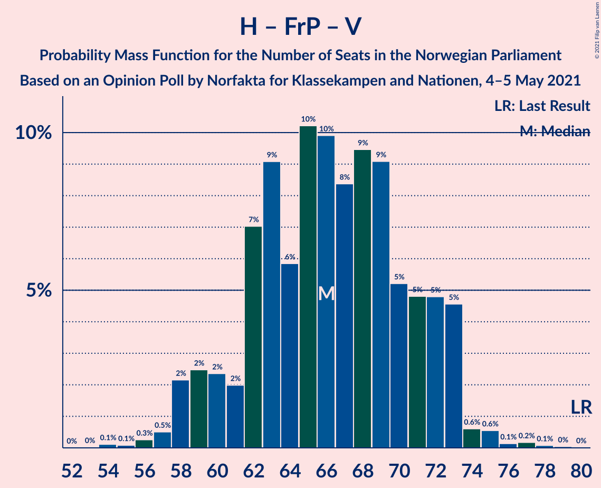

| Number of Seats | Probability | Accumulated | Special Marks |
|:---------------:|:-----------:|:-----------:|:-------------:|
| 54 | 0.1% | 100% |  |
| 55 | 0.1% | 99.9% |  |
| 56 | 0.3% | 99.8% |  |
| 57 | 0.5% | 99.5% |  |
| 58 | 2% | 99.0% |  |
| 59 | 2% | 97% |  |
| 60 | 2% | 94% |  |
| 61 | 2% | 92% |  |
| 62 | 7% | 90% |  |
| 63 | 9% | 83% |  |
| 64 | 6% | 74% |  |
| 65 | 10% | 68% | Median |
| 66 | 10% | 58% |  |
| 67 | 8% | 48% |  |
| 68 | 9% | 40% |  |
| 69 | 9% | 30% |  |
| 70 | 5% | 21% |  |
| 71 | 5% | 16% |  |
| 72 | 5% | 11% |  |
| 73 | 5% | 6% |  |
| 74 | 0.6% | 2% |  |
| 75 | 0.6% | 1.0% |  |
| 76 | 0.1% | 0.5% |  |
| 77 | 0.2% | 0.3% |  |
| 78 | 0.1% | 0.2% |  |
| 79 | 0% | 0.1% |  |
| 80 | 0% | 0% | Last Result |

### Høyre – Fremskrittspartiet

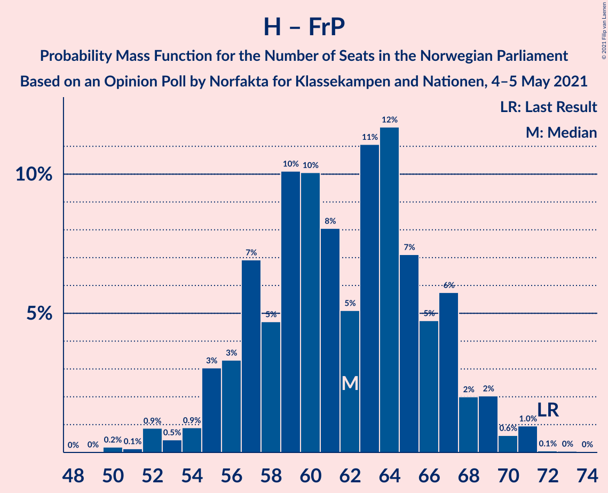

| Number of Seats | Probability | Accumulated | Special Marks |
|:---------------:|:-----------:|:-----------:|:-------------:|
| 50 | 0.2% | 100% |  |
| 51 | 0.1% | 99.8% |  |
| 52 | 0.9% | 99.6% |  |
| 53 | 0.5% | 98.8% |  |
| 54 | 0.9% | 98% |  |
| 55 | 3% | 97% |  |
| 56 | 3% | 94% |  |
| 57 | 7% | 91% |  |
| 58 | 5% | 84% |  |
| 59 | 10% | 79% |  |
| 60 | 10% | 69% |  |
| 61 | 8% | 59% |  |
| 62 | 5% | 51% | Median |
| 63 | 11% | 46% |  |
| 64 | 12% | 35% |  |
| 65 | 7% | 23% |  |
| 66 | 5% | 16% |  |
| 67 | 6% | 11% |  |
| 68 | 2% | 6% |  |
| 69 | 2% | 4% |  |
| 70 | 0.6% | 2% |  |
| 71 | 1.0% | 1.1% |  |
| 72 | 0.1% | 0.1% | Last Result |
| 73 | 0% | 0.1% |  |
| 74 | 0% | 0% |  |

### Arbeiderpartiet – Sosialistisk Venstreparti

| Number of Seats | Probability | Accumulated | Special Marks |
|:---------------:|:-----------:|:-----------:|:-------------:|
| 50 | 0% | 100% |  |
| 51 | 0.2% | 99.9% |  |
| 52 | 0.6% | 99.8% |  |
| 53 | 1.3% | 99.2% |  |
| 54 | 3% | 98% |  |
| 55 | 5% | 94% |  |
| 56 | 11% | 89% |  |
| 57 | 6% | 79% |  |
| 58 | 12% | 72% |  |
| 59 | 16% | 60% |  |
| 60 | 5% | 44% | Last Result, Median |
| 61 | 8% | 39% |  |
| 62 | 9% | 31% |  |
| 63 | 8% | 21% |  |
| 64 | 8% | 14% |  |
| 65 | 3% | 6% |  |
| 66 | 2% | 3% |  |
| 67 | 0.3% | 1.3% |  |
| 68 | 0.6% | 1.0% |  |
| 69 | 0.2% | 0.4% |  |
| 70 | 0% | 0.2% |  |
| 71 | 0.1% | 0.1% |  |
| 72 | 0% | 0.1% |  |
| 73 | 0% | 0% |  |

### Høyre – Kristelig Folkeparti – Venstre

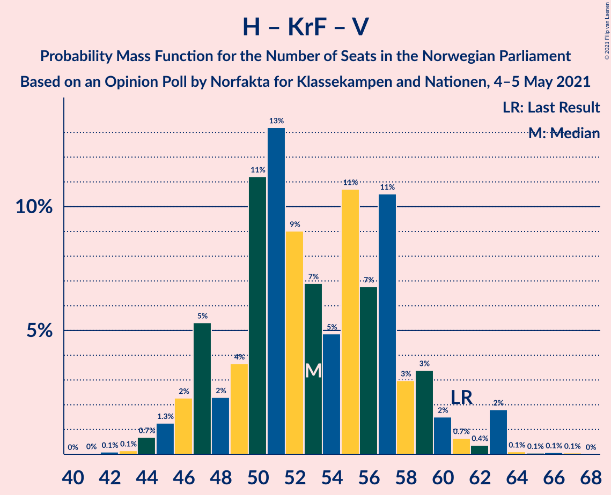

| Number of Seats | Probability | Accumulated | Special Marks |
|:---------------:|:-----------:|:-----------:|:-------------:|
| 41 | 0% | 100% |  |
| 42 | 0.1% | 99.9% |  |
| 43 | 0.1% | 99.8% |  |
| 44 | 0.7% | 99.7% |  |
| 45 | 1.3% | 99.0% |  |
| 46 | 2% | 98% |  |
| 47 | 5% | 95% |  |
| 48 | 2% | 90% |  |
| 49 | 4% | 88% |  |
| 50 | 11% | 84% | Median |
| 51 | 13% | 73% |  |
| 52 | 9% | 60% |  |
| 53 | 7% | 51% |  |
| 54 | 5% | 44% |  |
| 55 | 11% | 39% |  |
| 56 | 7% | 28% |  |
| 57 | 11% | 22% |  |
| 58 | 3% | 11% |  |
| 59 | 3% | 8% |  |
| 60 | 2% | 5% |  |
| 61 | 0.7% | 3% | Last Result |
| 62 | 0.4% | 2% |  |
| 63 | 2% | 2% |  |
| 64 | 0.1% | 0.3% |  |
| 65 | 0.1% | 0.2% |  |
| 66 | 0.1% | 0.1% |  |
| 67 | 0.1% | 0.1% |  |
| 68 | 0% | 0% |  |

### Senterpartiet – Kristelig Folkeparti – Venstre

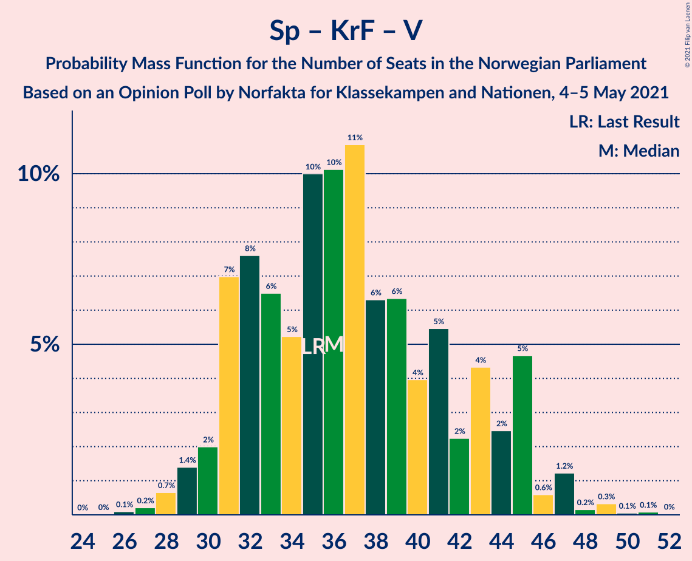

| Number of Seats | Probability | Accumulated | Special Marks |
|:---------------:|:-----------:|:-----------:|:-------------:|
| 26 | 0.1% | 100% |  |
| 27 | 0.2% | 99.9% |  |
| 28 | 0.7% | 99.7% |  |
| 29 | 1.4% | 99.0% |  |
| 30 | 2% | 98% |  |
| 31 | 7% | 96% |  |
| 32 | 8% | 89% |  |
| 33 | 6% | 81% | Median |
| 34 | 5% | 75% |  |
| 35 | 10% | 69% | Last Result |
| 36 | 10% | 59% |  |
| 37 | 11% | 49% |  |
| 38 | 6% | 38% |  |
| 39 | 6% | 32% |  |
| 40 | 4% | 26% |  |
| 41 | 5% | 22% |  |
| 42 | 2% | 16% |  |
| 43 | 4% | 14% |  |
| 44 | 2% | 10% |  |
| 45 | 5% | 7% |  |
| 46 | 0.6% | 2% |  |
| 47 | 1.2% | 2% |  |
| 48 | 0.2% | 0.7% |  |
| 49 | 0.3% | 0.5% |  |
| 50 | 0.1% | 0.2% |  |
| 51 | 0.1% | 0.1% |  |
| 52 | 0% | 0% |  |

## Technical Information

### Opinion Poll

+ **Polling firm:** Norfakta
+ **Commissioner(s):** Klassekampen and Nationen
+ **Fieldwork period:** 4–5 May 2021

### Calculations

+ **Sample size:** 1000
+ **Simulations done:** 1,048,576
+ **Error estimate:** 2.24%

