# Opinion Poll by Sentio for Amedia and Nettavisen, 11–16 May 2021

<a href="#voting-intentions">Voting Intentions</a> | <a href="#seats">Seats</a> | <a href="#coalitions">Coalitions</a> | <a href="#technical-information">Technical Information</a>

## Voting Intentions

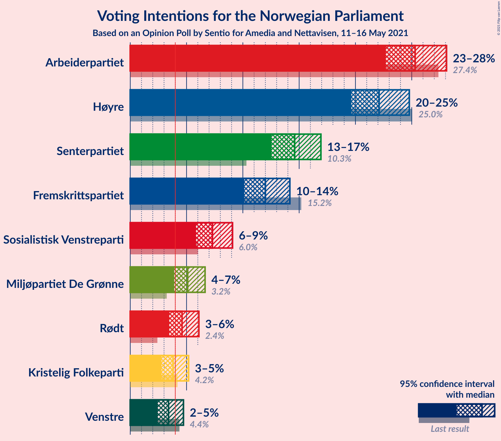

### Confidence Intervals

| Party | Last Result | Poll Result | 80% Confidence Interval | 90% Confidence Interval | 95% Confidence Interval | 99% Confidence Interval |
|:-----:|:-----------:|:-----------:|:-----------------------:|:-----------------------:|:-----------------------:|:-----------------------:|
| Arbeiderpartiet | 27.4% | 25.3% | 23.6–27.1% |23.1–27.6% |22.7–28.1% |21.9–29.0% |
| Høyre | 25.0% | 22.1% | 20.5–23.9% |20.0–24.4% |19.6–24.8% |18.9–25.6% |
| Senterpartiet | 10.3% | 14.6% | 13.2–16.1% |12.9–16.6% |12.5–16.9% |11.9–17.7% |
| Fremskrittspartiet | 15.2% | 12.0% | 10.8–13.4% |10.4–13.8% |10.1–14.2% |9.6–14.9% |
| Sosialistisk Venstreparti | 6.0% | 7.3% | 6.3–8.5% |6.1–8.8% |5.8–9.1% |5.4–9.7% |
| Miljøpartiet De Grønne | 3.2% | 5.1% | 4.3–6.1% |4.1–6.4% |3.9–6.6% |3.6–7.2% |
| Rødt | 2.4% | 4.6% | 3.9–5.6% |3.6–5.9% |3.5–6.1% |3.1–6.6% |
| Kristelig Folkeparti | 4.2% | 3.8% | 3.1–4.7% |2.9–5.0% |2.8–5.2% |2.5–5.6% |
| Venstre | 4.4% | 3.4% | 2.8–4.3% |2.6–4.5% |2.4–4.7% |2.2–5.2% |

*Note:* The poll result column reflects the actual value used in the calculations. Published results may vary slightly, and in addition be rounded to fewer digits.

## Seats

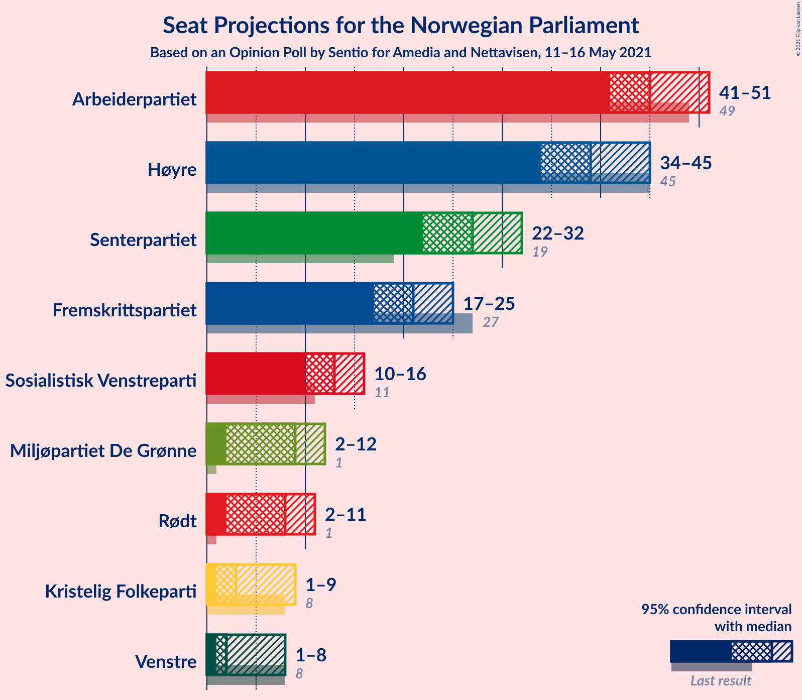

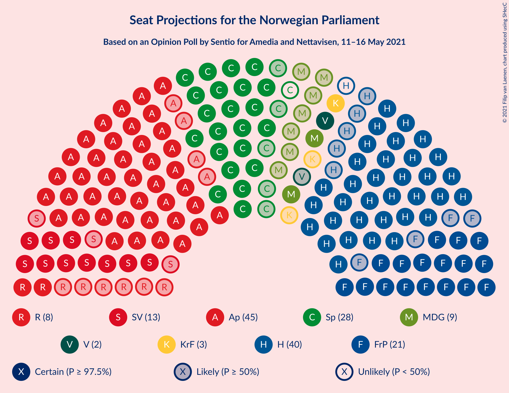

### Confidence Intervals

| Party | Last Result | Median | 80% Confidence Interval | 90% Confidence Interval | 95% Confidence Interval | 99% Confidence Interval |
|:-----:|:-----------:|:------:|:-----------------------:|:-----------------------:|:-----------------------:|:-----------------------:|
| <a href="#arbeiderpartiet">Arbeiderpartiet</a> | 49 | 45 | 43–49 |41–50 |41–51 |39–54 |
| <a href="#høyre">Høyre</a> | 45 | 39 | 36–43 |35–44 |34–45 |33–46 |
| <a href="#senterpartiet">Senterpartiet</a> | 19 | 27 | 23–30 |23–31 |22–32 |20–33 |
| <a href="#fremskrittspartiet">Fremskrittspartiet</a> | 27 | 21 | 18–24 |17–25 |17–25 |16–27 |
| <a href="#sosialistisk-venstreparti">Sosialistisk Venstreparti</a> | 11 | 13 | 11–15 |10–16 |10–16 |9–18 |
| <a href="#miljøpartiet-de-grønne">Miljøpartiet De Grønne</a> | 1 | 9 | 7–11 |7–11 |2–12 |2–13 |
| <a href="#rødt">Rødt</a> | 1 | 8 | 2–10 |2–10 |2–11 |2–12 |
| <a href="#kristelig-folkeparti">Kristelig Folkeparti</a> | 8 | 3 | 1–8 |1–9 |1–9 |1–10 |
| <a href="#venstre">Venstre</a> | 8 | 2 | 2–7 |2–8 |1–8 |1–9 |

### Arbeiderpartiet

*For a full overview of the results for this party, see the [Arbeiderpartiet](party-arbeiderpartiet.html) page.*

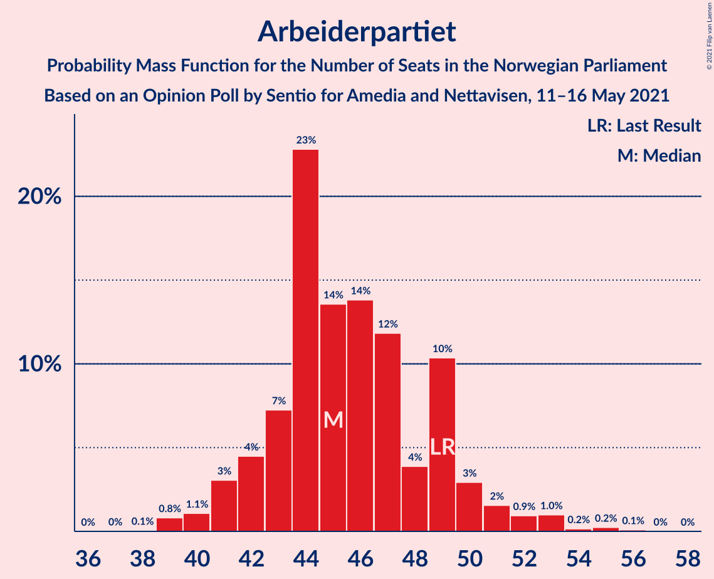

| Number of Seats | Probability | Accumulated | Special Marks |
|:---------------:|:-----------:|:-----------:|:-------------:|
| 38 | 0.1% | 100% |  |
| 39 | 0.8% | 99.9% |  |
| 40 | 1.1% | 99.1% |  |
| 41 | 3% | 98% |  |
| 42 | 4% | 95% |  |
| 43 | 7% | 90% |  |
| 44 | 23% | 83% |  |
| 45 | 14% | 60% | Median |
| 46 | 14% | 47% |  |
| 47 | 12% | 33% |  |
| 48 | 4% | 21% |  |
| 49 | 10% | 17% | Last Result |
| 50 | 3% | 7% |  |
| 51 | 2% | 4% |  |
| 52 | 0.9% | 2% |  |
| 53 | 1.0% | 2% |  |
| 54 | 0.2% | 0.5% |  |
| 55 | 0.2% | 0.4% |  |
| 56 | 0.1% | 0.1% |  |
| 57 | 0% | 0% |  |

### Høyre

*For a full overview of the results for this party, see the [Høyre](party-høyre.html) page.*

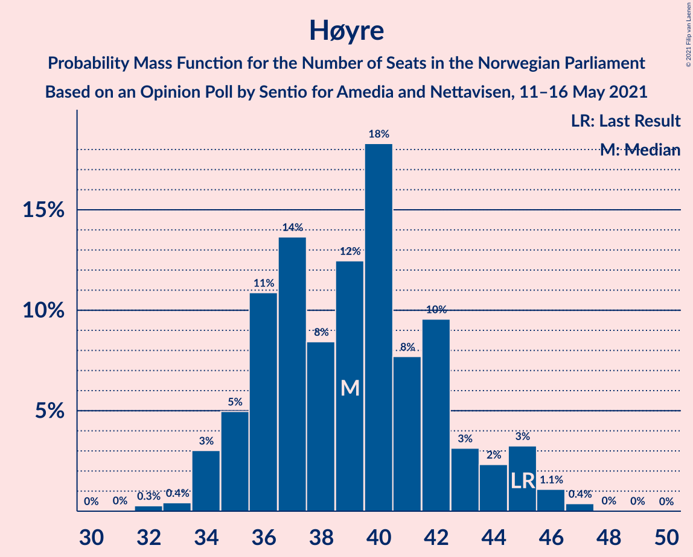

| Number of Seats | Probability | Accumulated | Special Marks |
|:---------------:|:-----------:|:-----------:|:-------------:|
| 31 | 0% | 100% |  |
| 32 | 0.3% | 99.9% |  |
| 33 | 0.4% | 99.7% |  |
| 34 | 3% | 99.2% |  |
| 35 | 5% | 96% |  |
| 36 | 11% | 91% |  |
| 37 | 14% | 80% |  |
| 38 | 8% | 67% |  |
| 39 | 12% | 58% | Median |
| 40 | 18% | 46% |  |
| 41 | 8% | 28% |  |
| 42 | 10% | 20% |  |
| 43 | 3% | 10% |  |
| 44 | 2% | 7% |  |
| 45 | 3% | 5% | Last Result |
| 46 | 1.1% | 2% |  |
| 47 | 0.4% | 0.5% |  |
| 48 | 0% | 0.1% |  |
| 49 | 0% | 0% |  |

### Senterpartiet

*For a full overview of the results for this party, see the [Senterpartiet](party-senterpartiet.html) page.*

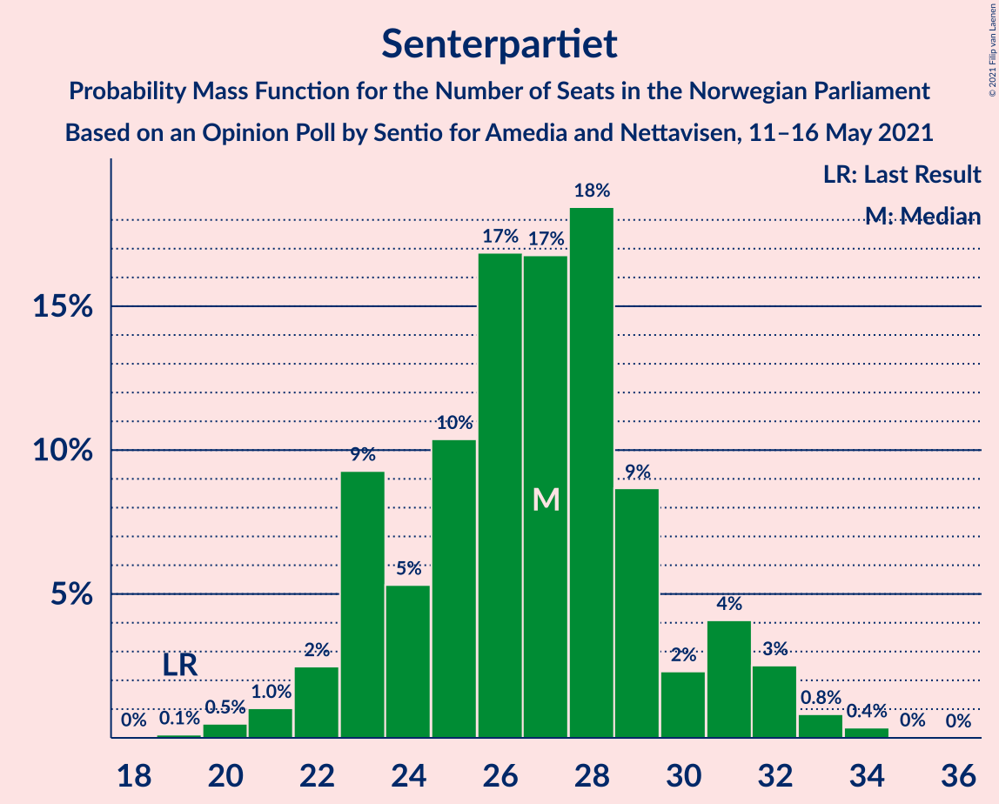

| Number of Seats | Probability | Accumulated | Special Marks |
|:---------------:|:-----------:|:-----------:|:-------------:|
| 19 | 0.1% | 100% | Last Result |
| 20 | 0.5% | 99.8% |  |
| 21 | 1.0% | 99.3% |  |
| 22 | 2% | 98% |  |
| 23 | 9% | 96% |  |
| 24 | 5% | 87% |  |
| 25 | 10% | 81% |  |
| 26 | 17% | 71% |  |
| 27 | 17% | 54% | Median |
| 28 | 18% | 37% |  |
| 29 | 9% | 19% |  |
| 30 | 2% | 10% |  |
| 31 | 4% | 8% |  |
| 32 | 3% | 4% |  |
| 33 | 0.8% | 1.2% |  |
| 34 | 0.4% | 0.4% |  |
| 35 | 0% | 0% |  |

### Fremskrittspartiet

*For a full overview of the results for this party, see the [Fremskrittspartiet](party-fremskrittspartiet.html) page.*

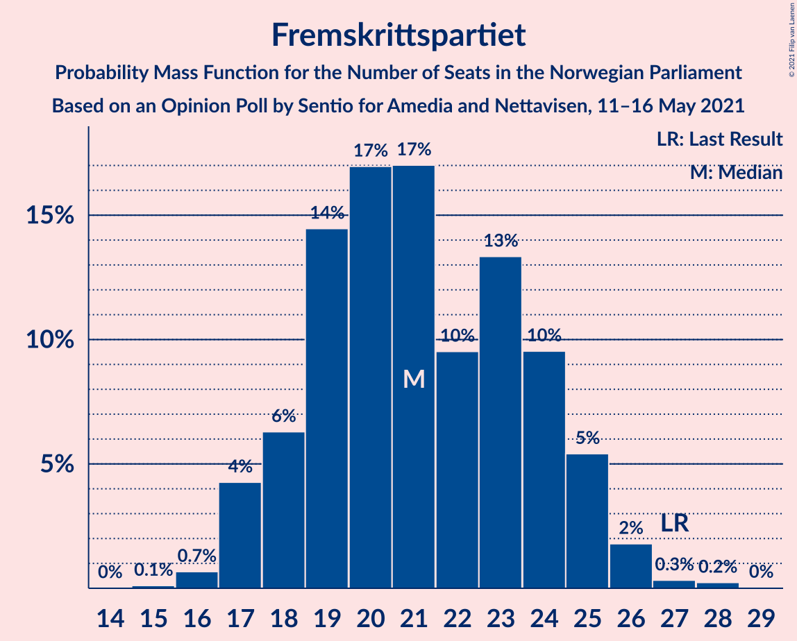

| Number of Seats | Probability | Accumulated | Special Marks |
|:---------------:|:-----------:|:-----------:|:-------------:|
| 15 | 0.1% | 100% |  |
| 16 | 0.7% | 99.9% |  |
| 17 | 4% | 99.2% |  |
| 18 | 6% | 95% |  |
| 19 | 14% | 89% |  |
| 20 | 17% | 74% |  |
| 21 | 17% | 57% | Median |
| 22 | 10% | 40% |  |
| 23 | 13% | 31% |  |
| 24 | 10% | 17% |  |
| 25 | 5% | 8% |  |
| 26 | 2% | 2% |  |
| 27 | 0.3% | 0.6% | Last Result |
| 28 | 0.2% | 0.3% |  |
| 29 | 0% | 0% |  |

### Sosialistisk Venstreparti

*For a full overview of the results for this party, see the [Sosialistisk Venstreparti](party-sosialistiskvenstreparti.html) page.*

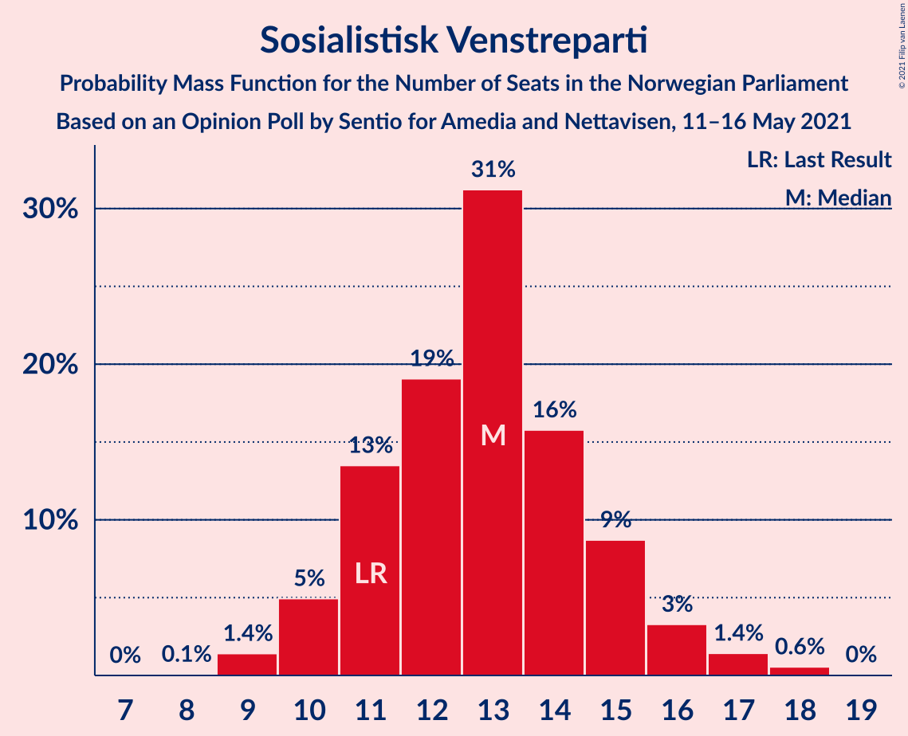

| Number of Seats | Probability | Accumulated | Special Marks |
|:---------------:|:-----------:|:-----------:|:-------------:|
| 8 | 0.1% | 100% |  |
| 9 | 1.4% | 99.9% |  |
| 10 | 5% | 98.5% |  |
| 11 | 13% | 94% | Last Result |
| 12 | 19% | 80% |  |
| 13 | 31% | 61% | Median |
| 14 | 16% | 30% |  |
| 15 | 9% | 14% |  |
| 16 | 3% | 5% |  |
| 17 | 1.4% | 2% |  |
| 18 | 0.6% | 0.6% |  |
| 19 | 0% | 0% |  |

### Miljøpartiet De Grønne

*For a full overview of the results for this party, see the [Miljøpartiet De Grønne](party-miljøpartietdegrønne.html) page.*

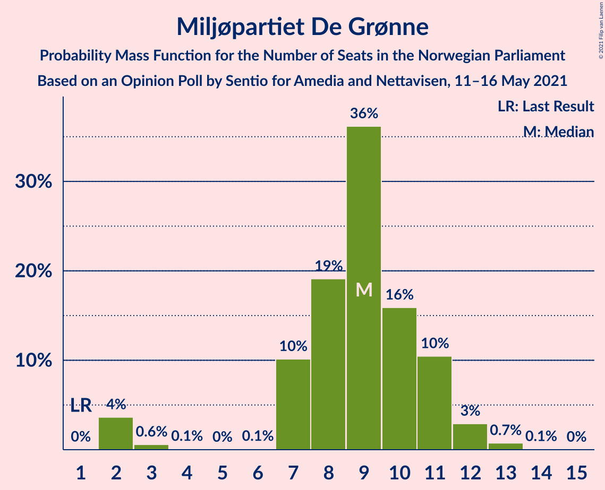

| Number of Seats | Probability | Accumulated | Special Marks |
|:---------------:|:-----------:|:-----------:|:-------------:|
| 1 | 0% | 100% | Last Result |
| 2 | 4% | 100% |  |
| 3 | 0.6% | 96% |  |
| 4 | 0.1% | 96% |  |
| 5 | 0% | 96% |  |
| 6 | 0.1% | 96% |  |
| 7 | 10% | 96% |  |
| 8 | 19% | 85% |  |
| 9 | 36% | 66% | Median |
| 10 | 16% | 30% |  |
| 11 | 10% | 14% |  |
| 12 | 3% | 4% |  |
| 13 | 0.7% | 0.8% |  |
| 14 | 0.1% | 0.1% |  |
| 15 | 0% | 0% |  |

### Rødt

*For a full overview of the results for this party, see the [Rødt](party-rødt.html) page.*

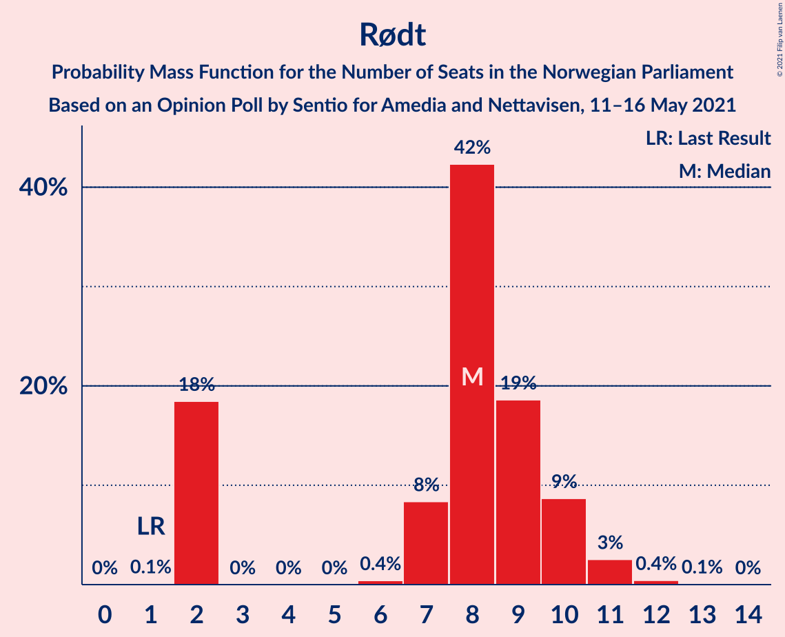

| Number of Seats | Probability | Accumulated | Special Marks |
|:---------------:|:-----------:|:-----------:|:-------------:|
| 1 | 0.1% | 100% | Last Result |
| 2 | 18% | 99.9% |  |
| 3 | 0% | 81% |  |
| 4 | 0% | 81% |  |
| 5 | 0% | 81% |  |
| 6 | 0.4% | 81% |  |
| 7 | 8% | 81% |  |
| 8 | 42% | 73% | Median |
| 9 | 19% | 30% |  |
| 10 | 9% | 12% |  |
| 11 | 3% | 3% |  |
| 12 | 0.4% | 0.5% |  |
| 13 | 0.1% | 0.1% |  |
| 14 | 0% | 0% |  |

### Kristelig Folkeparti

*For a full overview of the results for this party, see the [Kristelig Folkeparti](party-kristeligfolkeparti.html) page.*

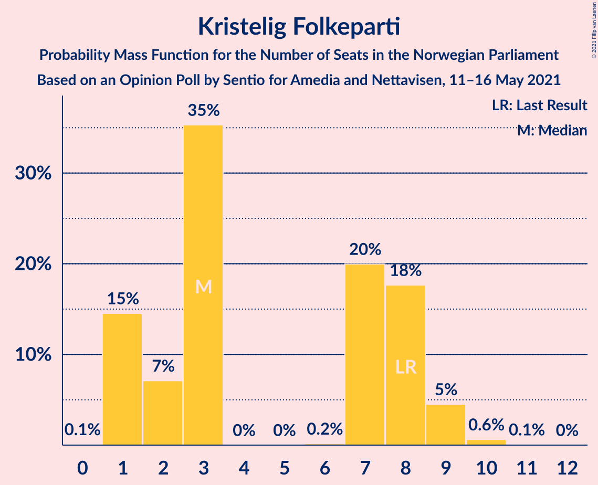

| Number of Seats | Probability | Accumulated | Special Marks |
|:---------------:|:-----------:|:-----------:|:-------------:|
| 0 | 0.1% | 100% |  |
| 1 | 15% | 99.9% |  |
| 2 | 7% | 85% |  |
| 3 | 35% | 78% | Median |
| 4 | 0% | 43% |  |
| 5 | 0% | 43% |  |
| 6 | 0.2% | 43% |  |
| 7 | 20% | 43% |  |
| 8 | 18% | 23% | Last Result |
| 9 | 5% | 5% |  |
| 10 | 0.6% | 0.7% |  |
| 11 | 0.1% | 0.1% |  |
| 12 | 0% | 0% |  |

### Venstre

*For a full overview of the results for this party, see the [Venstre](party-venstre.html) page.*

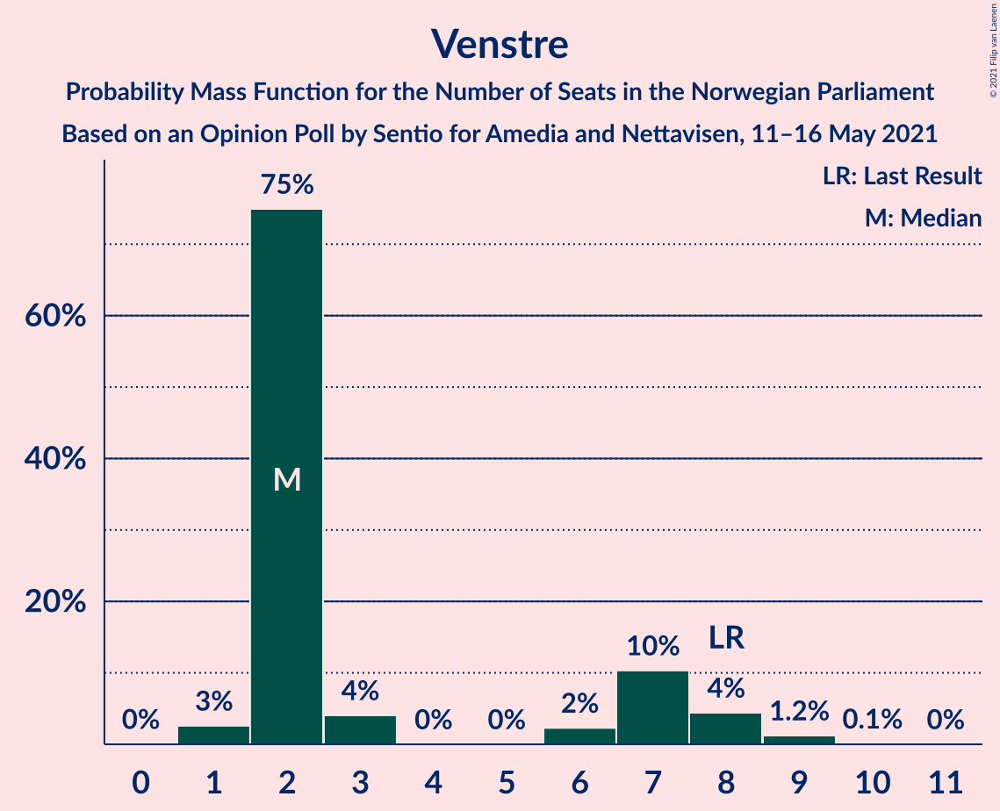

| Number of Seats | Probability | Accumulated | Special Marks |
|:---------------:|:-----------:|:-----------:|:-------------:|
| 1 | 3% | 100% |  |
| 2 | 75% | 97% | Median |
| 3 | 4% | 22% |  |
| 4 | 0% | 18% |  |
| 5 | 0% | 18% |  |
| 6 | 2% | 18% |  |
| 7 | 10% | 16% |  |
| 8 | 4% | 6% | Last Result |
| 9 | 1.2% | 1.3% |  |
| 10 | 0.1% | 0.1% |  |
| 11 | 0% | 0% |  |

## Coalitions

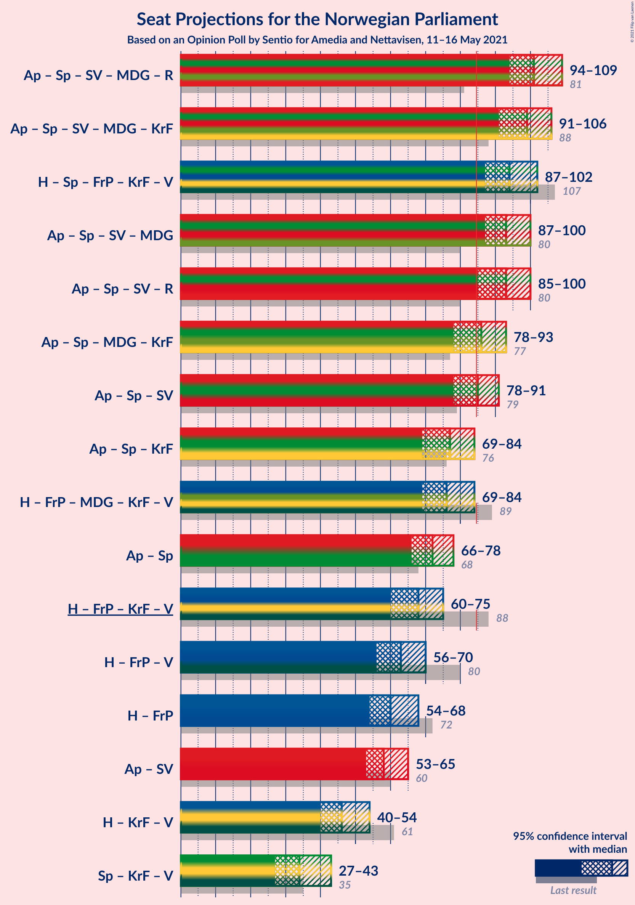

### Confidence Intervals

| Coalition | Last Result | Median | Majority? | 80% Confidence Interval | 90% Confidence Interval | 95% Confidence Interval | 99% Confidence Interval |
|:---------:|:-----------:|:------:|:---------:|:-----------------------:|:-----------------------:|:-----------------------:|:-----------------------:|
| Arbeiderpartiet – Senterpartiet – Sosialistisk Venstreparti – Miljøpartiet De Grønne – Rødt | 81 | 101 | 100% | 95–106 | 94–108 | 94–109 | 91–110 |
| Arbeiderpartiet – Senterpartiet – Sosialistisk Venstreparti – Miljøpartiet De Grønne – Kristelig Folkeparti | 88 | 99 | 100% | 94–103 | 92–104 | 91–106 | 89–107 |
| Høyre – Senterpartiet – Fremskrittspartiet – Kristelig Folkeparti – Venstre | 107 | 94 | 99.7% | 90–100 | 88–101 | 87–102 | 85–104 |
| Arbeiderpartiet – Senterpartiet – Sosialistisk Venstreparti – Miljøpartiet De Grønne | 80 | 93 | 99.2% | 90–99 | 88–99 | 87–100 | 84–102 |
| Arbeiderpartiet – Senterpartiet – Sosialistisk Venstreparti – Rødt | 80 | 93 | 98% | 86–97 | 85–99 | 85–100 | 83–102 |
| Arbeiderpartiet – Senterpartiet – Miljøpartiet De Grønne – Kristelig Folkeparti | 77 | 86 | 69% | 80–90 | 79–92 | 78–93 | 76–95 |
| Arbeiderpartiet – Senterpartiet – Sosialistisk Venstreparti | 79 | 85 | 58% | 81–89 | 79–90 | 78–91 | 76–94 |
| Arbeiderpartiet – Senterpartiet – Kristelig Folkeparti | 76 | 77 | 2% | 72–81 | 70–83 | 69–84 | 67–86 |
| Høyre – Fremskrittspartiet – Miljøpartiet De Grønne – Kristelig Folkeparti – Venstre | 89 | 76 | 2% | 72–83 | 70–84 | 69–84 | 67–86 |
| Arbeiderpartiet – Senterpartiet | 68 | 72 | 0% | 68–76 | 67–76 | 66–78 | 64–80 |
| Høyre – Fremskrittspartiet – Kristelig Folkeparti – Venstre | 88 | 68 | 0% | 63–74 | 61–75 | 60–75 | 59–78 |
| Høyre – Fremskrittspartiet – Venstre | 80 | 63 | 0% | 58–68 | 57–69 | 56–70 | 55–73 |
| Høyre – Fremskrittspartiet | 72 | 60 | 0% | 55–65 | 55–67 | 54–68 | 52–70 |
| Arbeiderpartiet – Sosialistisk Venstreparti | 60 | 58 | 0% | 55–62 | 54–63 | 53–65 | 51–67 |
| Høyre – Kristelig Folkeparti – Venstre | 61 | 46 | 0% | 43–52 | 41–54 | 40–54 | 39–56 |
| Senterpartiet – Kristelig Folkeparti – Venstre | 35 | 34 | 0% | 29–40 | 28–42 | 27–43 | 26–44 |

### Arbeiderpartiet – Senterpartiet – Sosialistisk Venstreparti – Miljøpartiet De Grønne – Rødt

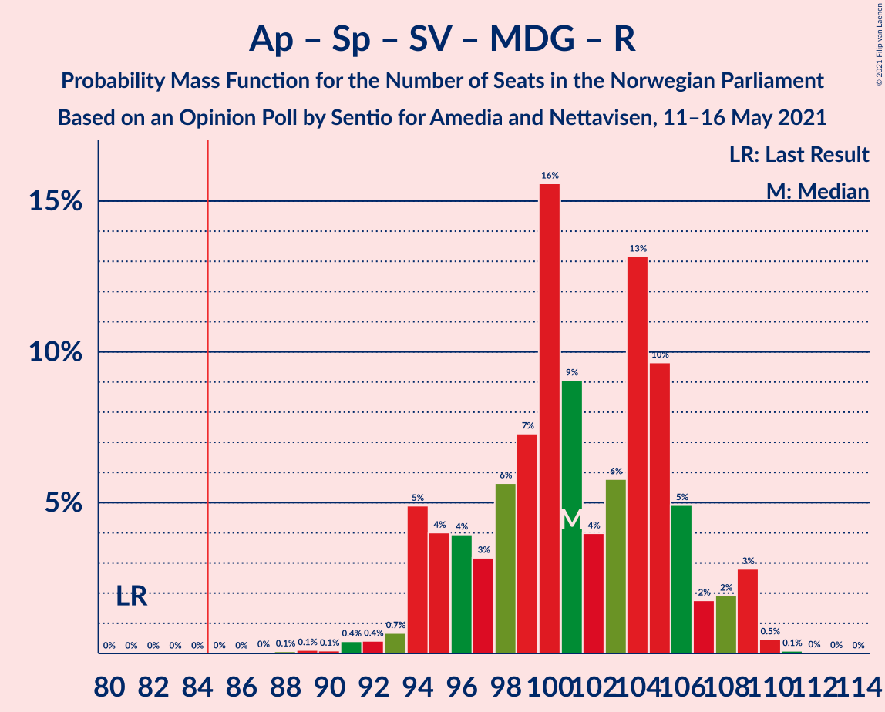

| Number of Seats | Probability | Accumulated | Special Marks |
|:---------------:|:-----------:|:-----------:|:-------------:|
| 81 | 0% | 100% | Last Result |
| 82 | 0% | 100% |  |
| 83 | 0% | 100% |  |
| 84 | 0% | 100% |  |
| 85 | 0% | 100% | Majority |
| 86 | 0% | 100% |  |
| 87 | 0% | 100% |  |
| 88 | 0.1% | 99.9% |  |
| 89 | 0.1% | 99.9% |  |
| 90 | 0.1% | 99.8% |  |
| 91 | 0.4% | 99.7% |  |
| 92 | 0.4% | 99.3% |  |
| 93 | 0.7% | 98.9% |  |
| 94 | 5% | 98% |  |
| 95 | 4% | 93% |  |
| 96 | 4% | 89% |  |
| 97 | 3% | 85% |  |
| 98 | 6% | 82% |  |
| 99 | 7% | 77% |  |
| 100 | 16% | 69% |  |
| 101 | 9% | 54% |  |
| 102 | 4% | 45% | Median |
| 103 | 6% | 41% |  |
| 104 | 13% | 35% |  |
| 105 | 10% | 22% |  |
| 106 | 5% | 12% |  |
| 107 | 2% | 7% |  |
| 108 | 2% | 5% |  |
| 109 | 3% | 3% |  |
| 110 | 0.5% | 0.6% |  |
| 111 | 0.1% | 0.1% |  |
| 112 | 0% | 0.1% |  |
| 113 | 0% | 0% |  |

### Arbeiderpartiet – Senterpartiet – Sosialistisk Venstreparti – Miljøpartiet De Grønne – Kristelig Folkeparti

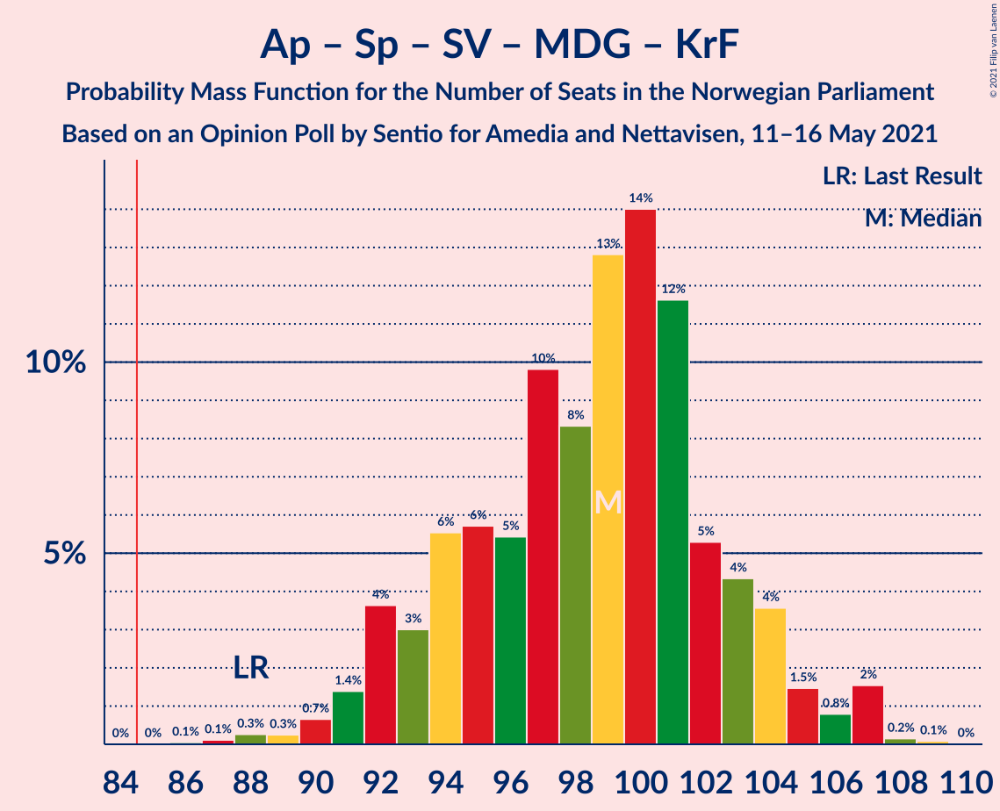

| Number of Seats | Probability | Accumulated | Special Marks |
|:---------------:|:-----------:|:-----------:|:-------------:|
| 86 | 0.1% | 100% |  |
| 87 | 0.1% | 99.9% |  |
| 88 | 0.3% | 99.8% | Last Result |
| 89 | 0.3% | 99.5% |  |
| 90 | 0.7% | 99.3% |  |
| 91 | 1.4% | 98.6% |  |
| 92 | 4% | 97% |  |
| 93 | 3% | 94% |  |
| 94 | 6% | 91% |  |
| 95 | 6% | 85% |  |
| 96 | 5% | 79% |  |
| 97 | 10% | 74% | Median |
| 98 | 8% | 64% |  |
| 99 | 13% | 56% |  |
| 100 | 14% | 43% |  |
| 101 | 12% | 29% |  |
| 102 | 5% | 17% |  |
| 103 | 4% | 12% |  |
| 104 | 4% | 8% |  |
| 105 | 1.5% | 4% |  |
| 106 | 0.8% | 3% |  |
| 107 | 2% | 2% |  |
| 108 | 0.2% | 0.3% |  |
| 109 | 0.1% | 0.1% |  |
| 110 | 0% | 0% |  |

### Høyre – Senterpartiet – Fremskrittspartiet – Kristelig Folkeparti – Venstre

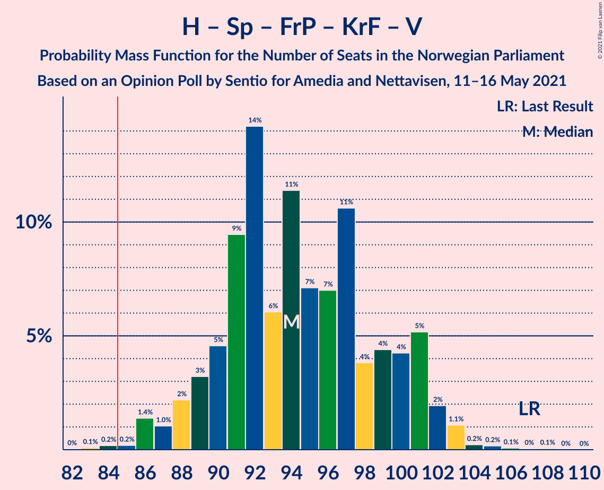

| Number of Seats | Probability | Accumulated | Special Marks |
|:---------------:|:-----------:|:-----------:|:-------------:|
| 83 | 0.1% | 100% |  |
| 84 | 0.2% | 99.9% |  |
| 85 | 0.2% | 99.7% | Majority |
| 86 | 1.4% | 99.5% |  |
| 87 | 1.0% | 98% |  |
| 88 | 2% | 97% |  |
| 89 | 3% | 95% |  |
| 90 | 5% | 92% |  |
| 91 | 9% | 87% |  |
| 92 | 14% | 78% | Median |
| 93 | 6% | 63% |  |
| 94 | 11% | 57% |  |
| 95 | 7% | 46% |  |
| 96 | 7% | 39% |  |
| 97 | 11% | 32% |  |
| 98 | 4% | 21% |  |
| 99 | 4% | 17% |  |
| 100 | 4% | 13% |  |
| 101 | 5% | 9% |  |
| 102 | 2% | 4% |  |
| 103 | 1.1% | 2% |  |
| 104 | 0.2% | 0.6% |  |
| 105 | 0.2% | 0.4% |  |
| 106 | 0.1% | 0.2% |  |
| 107 | 0% | 0.1% | Last Result |
| 108 | 0.1% | 0.1% |  |
| 109 | 0% | 0% |  |

### Arbeiderpartiet – Senterpartiet – Sosialistisk Venstreparti – Miljøpartiet De Grønne

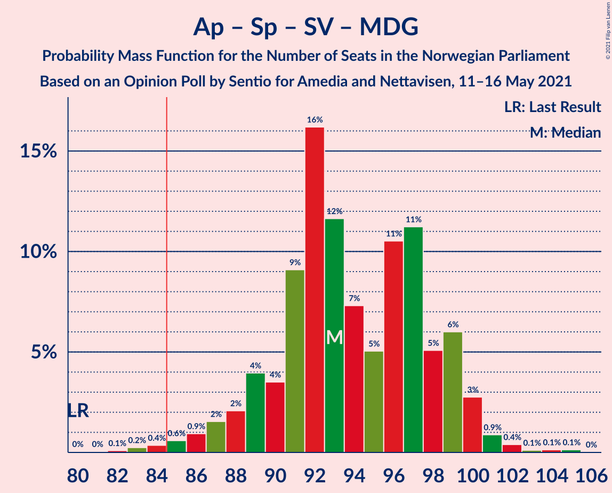

| Number of Seats | Probability | Accumulated | Special Marks |
|:---------------:|:-----------:|:-----------:|:-------------:|
| 80 | 0% | 100% | Last Result |
| 81 | 0% | 99.9% |  |
| 82 | 0.1% | 99.9% |  |
| 83 | 0.2% | 99.8% |  |
| 84 | 0.4% | 99.6% |  |
| 85 | 0.6% | 99.2% | Majority |
| 86 | 0.9% | 98.6% |  |
| 87 | 2% | 98% |  |
| 88 | 2% | 96% |  |
| 89 | 4% | 94% |  |
| 90 | 4% | 90% |  |
| 91 | 9% | 87% |  |
| 92 | 16% | 77% |  |
| 93 | 12% | 61% |  |
| 94 | 7% | 50% | Median |
| 95 | 5% | 42% |  |
| 96 | 11% | 37% |  |
| 97 | 11% | 27% |  |
| 98 | 5% | 16% |  |
| 99 | 6% | 10% |  |
| 100 | 3% | 4% |  |
| 101 | 0.9% | 2% |  |
| 102 | 0.4% | 0.8% |  |
| 103 | 0.1% | 0.4% |  |
| 104 | 0.1% | 0.3% |  |
| 105 | 0.1% | 0.2% |  |
| 106 | 0% | 0% |  |

### Arbeiderpartiet – Senterpartiet – Sosialistisk Venstreparti – Rødt

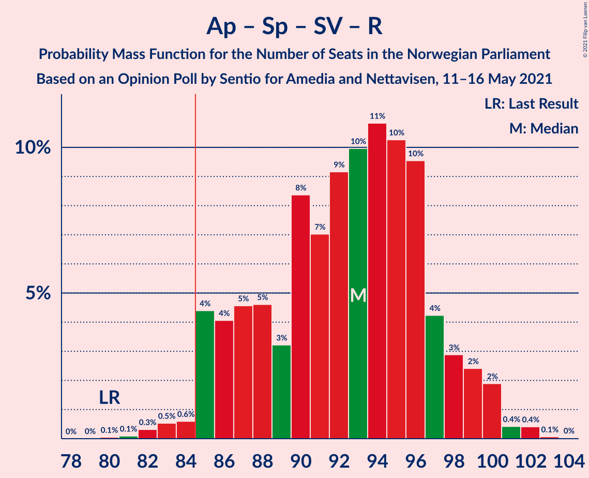

| Number of Seats | Probability | Accumulated | Special Marks |
|:---------------:|:-----------:|:-----------:|:-------------:|
| 80 | 0.1% | 100% | Last Result |
| 81 | 0.1% | 99.9% |  |
| 82 | 0.3% | 99.8% |  |
| 83 | 0.5% | 99.5% |  |
| 84 | 0.6% | 99.0% |  |
| 85 | 4% | 98% | Majority |
| 86 | 4% | 94% |  |
| 87 | 5% | 90% |  |
| 88 | 5% | 85% |  |
| 89 | 3% | 81% |  |
| 90 | 8% | 78% |  |
| 91 | 7% | 69% |  |
| 92 | 9% | 62% |  |
| 93 | 10% | 53% | Median |
| 94 | 11% | 43% |  |
| 95 | 10% | 32% |  |
| 96 | 10% | 22% |  |
| 97 | 4% | 12% |  |
| 98 | 3% | 8% |  |
| 99 | 2% | 5% |  |
| 100 | 2% | 3% |  |
| 101 | 0.4% | 0.9% |  |
| 102 | 0.4% | 0.5% |  |
| 103 | 0.1% | 0.1% |  |
| 104 | 0% | 0% |  |

### Arbeiderpartiet – Senterpartiet – Miljøpartiet De Grønne – Kristelig Folkeparti

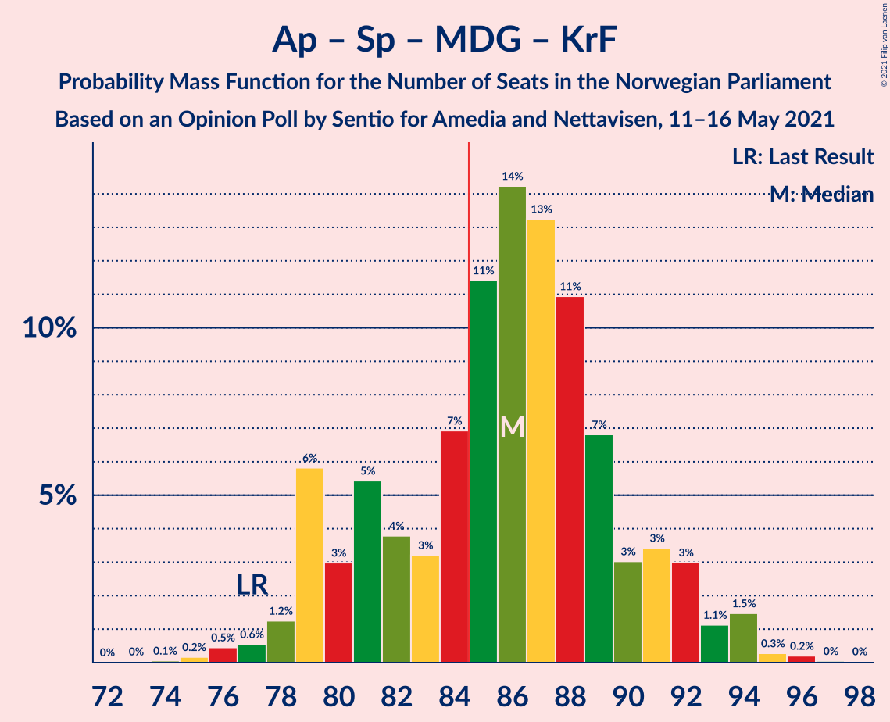

| Number of Seats | Probability | Accumulated | Special Marks |
|:---------------:|:-----------:|:-----------:|:-------------:|
| 73 | 0% | 100% |  |
| 74 | 0.1% | 99.9% |  |
| 75 | 0.2% | 99.9% |  |
| 76 | 0.5% | 99.7% |  |
| 77 | 0.6% | 99.3% | Last Result |
| 78 | 1.2% | 98.7% |  |
| 79 | 6% | 97% |  |
| 80 | 3% | 92% |  |
| 81 | 5% | 89% |  |
| 82 | 4% | 83% |  |
| 83 | 3% | 79% |  |
| 84 | 7% | 76% | Median |
| 85 | 11% | 69% | Majority |
| 86 | 14% | 58% |  |
| 87 | 13% | 44% |  |
| 88 | 11% | 30% |  |
| 89 | 7% | 19% |  |
| 90 | 3% | 13% |  |
| 91 | 3% | 10% |  |
| 92 | 3% | 6% |  |
| 93 | 1.1% | 3% |  |
| 94 | 1.5% | 2% |  |
| 95 | 0.3% | 0.6% |  |
| 96 | 0.2% | 0.3% |  |
| 97 | 0% | 0.1% |  |
| 98 | 0% | 0% |  |

### Arbeiderpartiet – Senterpartiet – Sosialistisk Venstreparti

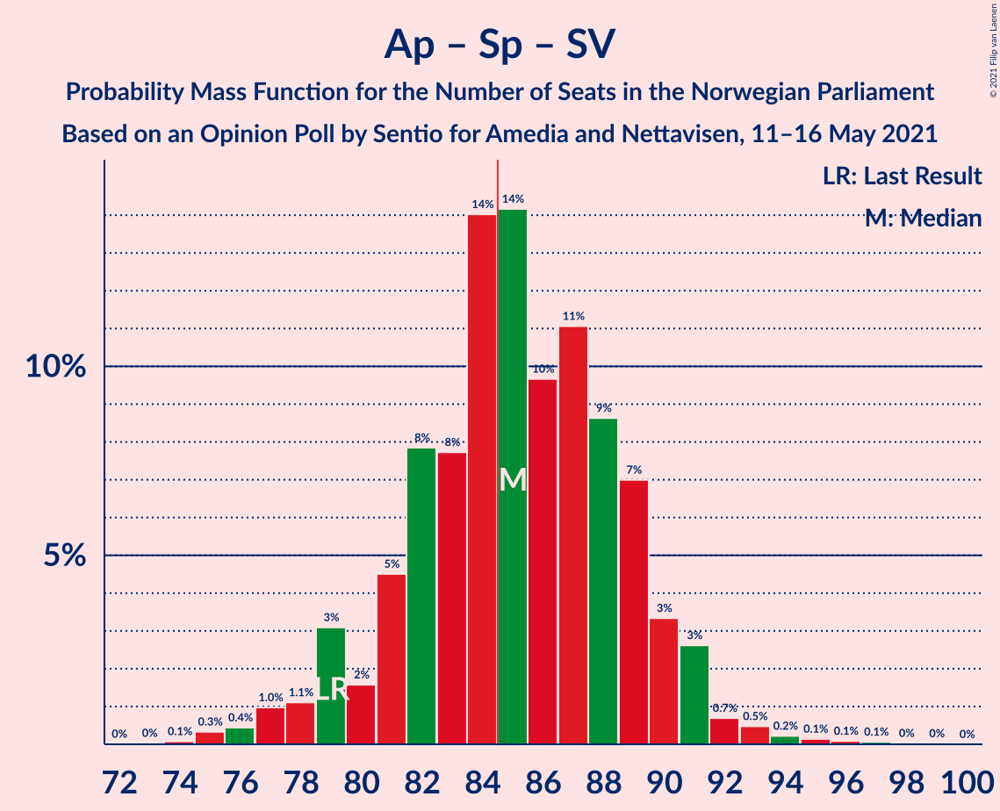

| Number of Seats | Probability | Accumulated | Special Marks |
|:---------------:|:-----------:|:-----------:|:-------------:|
| 73 | 0% | 100% |  |
| 74 | 0.1% | 99.9% |  |
| 75 | 0.3% | 99.9% |  |
| 76 | 0.4% | 99.5% |  |
| 77 | 1.0% | 99.1% |  |
| 78 | 1.1% | 98% |  |
| 79 | 3% | 97% | Last Result |
| 80 | 2% | 94% |  |
| 81 | 5% | 92% |  |
| 82 | 8% | 88% |  |
| 83 | 8% | 80% |  |
| 84 | 14% | 72% |  |
| 85 | 14% | 58% | Median, Majority |
| 86 | 10% | 44% |  |
| 87 | 11% | 34% |  |
| 88 | 9% | 23% |  |
| 89 | 7% | 15% |  |
| 90 | 3% | 8% |  |
| 91 | 3% | 4% |  |
| 92 | 0.7% | 2% |  |
| 93 | 0.5% | 1.0% |  |
| 94 | 0.2% | 0.6% |  |
| 95 | 0.1% | 0.3% |  |
| 96 | 0.1% | 0.2% |  |
| 97 | 0.1% | 0.1% |  |
| 98 | 0% | 0.1% |  |
| 99 | 0% | 0% |  |

### Arbeiderpartiet – Senterpartiet – Kristelig Folkeparti

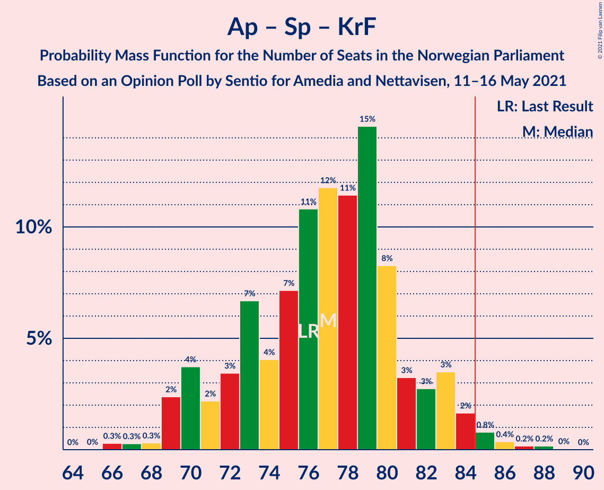

| Number of Seats | Probability | Accumulated | Special Marks |
|:---------------:|:-----------:|:-----------:|:-------------:|
| 66 | 0.3% | 100% |  |
| 67 | 0.3% | 99.7% |  |
| 68 | 0.3% | 99.4% |  |
| 69 | 2% | 99.1% |  |
| 70 | 4% | 97% |  |
| 71 | 2% | 93% |  |
| 72 | 3% | 91% |  |
| 73 | 7% | 87% |  |
| 74 | 4% | 81% |  |
| 75 | 7% | 77% | Median |
| 76 | 11% | 69% | Last Result |
| 77 | 12% | 59% |  |
| 78 | 11% | 47% |  |
| 79 | 15% | 35% |  |
| 80 | 8% | 21% |  |
| 81 | 3% | 13% |  |
| 82 | 3% | 9% |  |
| 83 | 3% | 7% |  |
| 84 | 2% | 3% |  |
| 85 | 0.8% | 2% | Majority |
| 86 | 0.4% | 0.8% |  |
| 87 | 0.2% | 0.4% |  |
| 88 | 0.2% | 0.2% |  |
| 89 | 0% | 0.1% |  |
| 90 | 0% | 0% |  |

### Høyre – Fremskrittspartiet – Miljøpartiet De Grønne – Kristelig Folkeparti – Venstre

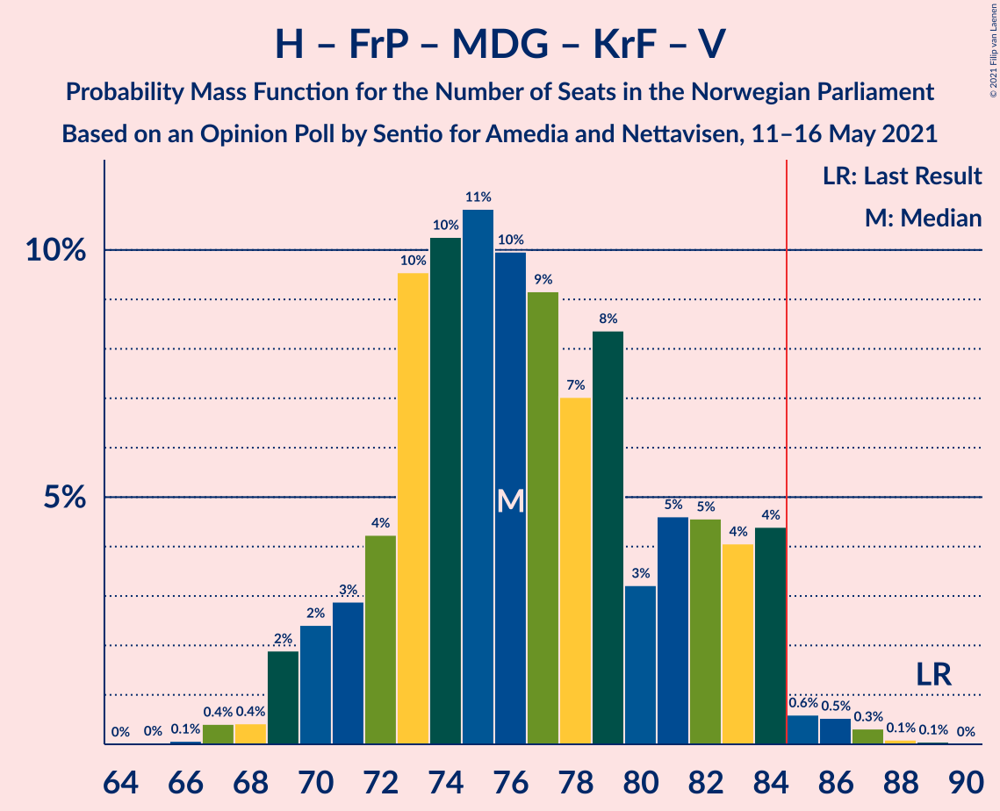

| Number of Seats | Probability | Accumulated | Special Marks |
|:---------------:|:-----------:|:-----------:|:-------------:|
| 66 | 0.1% | 100% |  |
| 67 | 0.4% | 99.9% |  |
| 68 | 0.4% | 99.5% |  |
| 69 | 2% | 99.1% |  |
| 70 | 2% | 97% |  |
| 71 | 3% | 95% |  |
| 72 | 4% | 92% |  |
| 73 | 10% | 88% |  |
| 74 | 10% | 78% | Median |
| 75 | 11% | 68% |  |
| 76 | 10% | 57% |  |
| 77 | 9% | 47% |  |
| 78 | 7% | 38% |  |
| 79 | 8% | 31% |  |
| 80 | 3% | 22% |  |
| 81 | 5% | 19% |  |
| 82 | 5% | 15% |  |
| 83 | 4% | 10% |  |
| 84 | 4% | 6% |  |
| 85 | 0.6% | 2% | Majority |
| 86 | 0.5% | 1.0% |  |
| 87 | 0.3% | 0.5% |  |
| 88 | 0.1% | 0.2% |  |
| 89 | 0.1% | 0.1% | Last Result |
| 90 | 0% | 0% |  |

### Arbeiderpartiet – Senterpartiet

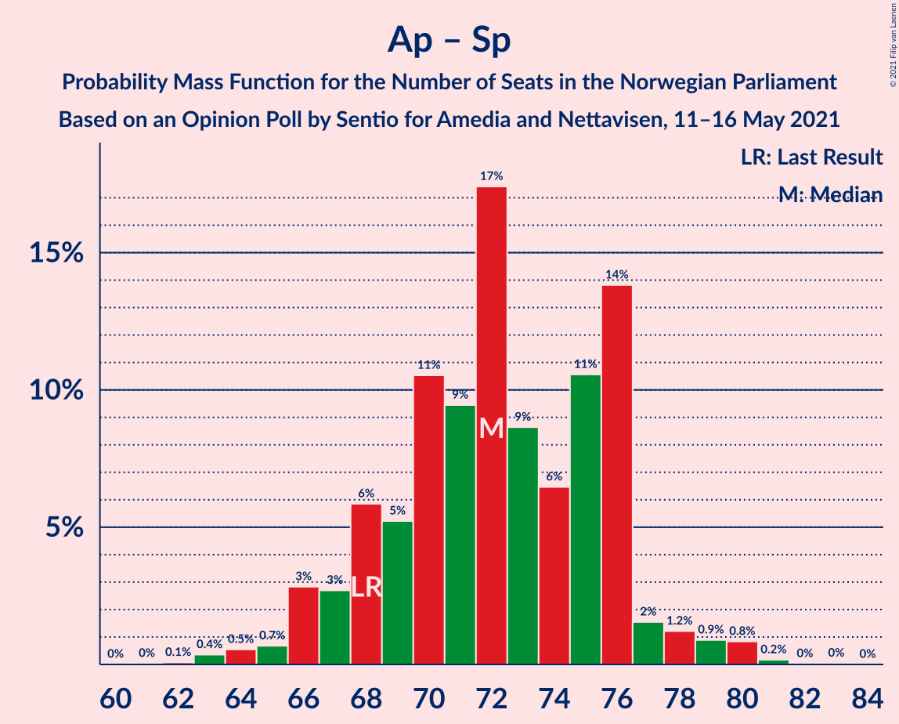

| Number of Seats | Probability | Accumulated | Special Marks |
|:---------------:|:-----------:|:-----------:|:-------------:|
| 61 | 0% | 100% |  |
| 62 | 0.1% | 99.9% |  |
| 63 | 0.4% | 99.9% |  |
| 64 | 0.5% | 99.5% |  |
| 65 | 0.7% | 99.0% |  |
| 66 | 3% | 98% |  |
| 67 | 3% | 95% |  |
| 68 | 6% | 93% | Last Result |
| 69 | 5% | 87% |  |
| 70 | 11% | 82% |  |
| 71 | 9% | 71% |  |
| 72 | 17% | 62% | Median |
| 73 | 9% | 44% |  |
| 74 | 6% | 36% |  |
| 75 | 11% | 29% |  |
| 76 | 14% | 19% |  |
| 77 | 2% | 5% |  |
| 78 | 1.2% | 3% |  |
| 79 | 0.9% | 2% |  |
| 80 | 0.8% | 1.1% |  |
| 81 | 0.2% | 0.3% |  |
| 82 | 0% | 0.1% |  |
| 83 | 0% | 0.1% |  |
| 84 | 0% | 0% |  |

### Høyre – Fremskrittspartiet – Kristelig Folkeparti – Venstre

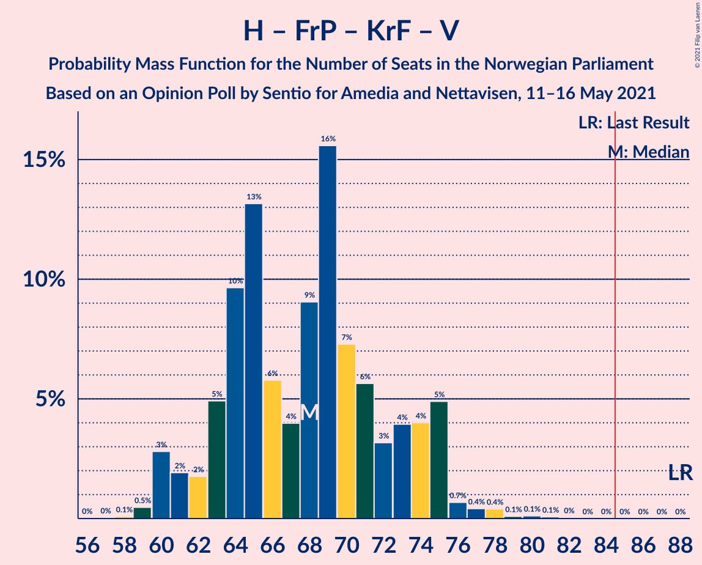

| Number of Seats | Probability | Accumulated | Special Marks |
|:---------------:|:-----------:|:-----------:|:-------------:|
| 57 | 0% | 100% |  |
| 58 | 0.1% | 99.9% |  |
| 59 | 0.5% | 99.9% |  |
| 60 | 3% | 99.4% |  |
| 61 | 2% | 97% |  |
| 62 | 2% | 95% |  |
| 63 | 5% | 93% |  |
| 64 | 10% | 88% |  |
| 65 | 13% | 78% | Median |
| 66 | 6% | 65% |  |
| 67 | 4% | 59% |  |
| 68 | 9% | 55% |  |
| 69 | 16% | 46% |  |
| 70 | 7% | 31% |  |
| 71 | 6% | 23% |  |
| 72 | 3% | 18% |  |
| 73 | 4% | 15% |  |
| 74 | 4% | 11% |  |
| 75 | 5% | 7% |  |
| 76 | 0.7% | 2% |  |
| 77 | 0.4% | 1.1% |  |
| 78 | 0.4% | 0.7% |  |
| 79 | 0.1% | 0.3% |  |
| 80 | 0.1% | 0.2% |  |
| 81 | 0.1% | 0.1% |  |
| 82 | 0% | 0.1% |  |
| 83 | 0% | 0% |  |
| 84 | 0% | 0% |  |
| 85 | 0% | 0% | Majority |
| 86 | 0% | 0% |  |
| 87 | 0% | 0% |  |
| 88 | 0% | 0% | Last Result |

### Høyre – Fremskrittspartiet – Venstre

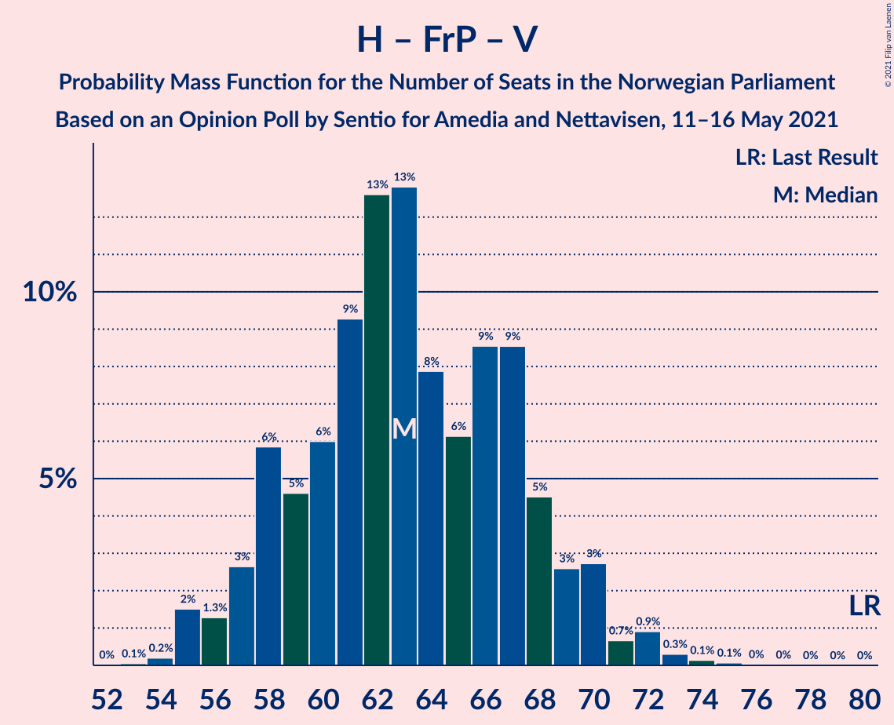

| Number of Seats | Probability | Accumulated | Special Marks |
|:---------------:|:-----------:|:-----------:|:-------------:|
| 53 | 0.1% | 100% |  |
| 54 | 0.2% | 99.9% |  |
| 55 | 2% | 99.7% |  |
| 56 | 1.3% | 98% |  |
| 57 | 3% | 97% |  |
| 58 | 6% | 94% |  |
| 59 | 5% | 88% |  |
| 60 | 6% | 84% |  |
| 61 | 9% | 78% |  |
| 62 | 13% | 69% | Median |
| 63 | 13% | 56% |  |
| 64 | 8% | 43% |  |
| 65 | 6% | 35% |  |
| 66 | 9% | 29% |  |
| 67 | 9% | 21% |  |
| 68 | 5% | 12% |  |
| 69 | 3% | 7% |  |
| 70 | 3% | 5% |  |
| 71 | 0.7% | 2% |  |
| 72 | 0.9% | 1.5% |  |
| 73 | 0.3% | 0.6% |  |
| 74 | 0.1% | 0.3% |  |
| 75 | 0.1% | 0.1% |  |
| 76 | 0% | 0.1% |  |
| 77 | 0% | 0% |  |
| 78 | 0% | 0% |  |
| 79 | 0% | 0% |  |
| 80 | 0% | 0% | Last Result |

### Høyre – Fremskrittspartiet

| Number of Seats | Probability | Accumulated | Special Marks |
|:---------------:|:-----------:|:-----------:|:-------------:|
| 50 | 0% | 100% |  |
| 51 | 0.1% | 99.9% |  |
| 52 | 0.4% | 99.9% |  |
| 53 | 2% | 99.4% |  |
| 54 | 2% | 98% |  |
| 55 | 7% | 96% |  |
| 56 | 7% | 89% |  |
| 57 | 8% | 81% |  |
| 58 | 6% | 73% |  |
| 59 | 11% | 67% |  |
| 60 | 9% | 56% | Median |
| 61 | 13% | 47% |  |
| 62 | 7% | 34% |  |
| 63 | 6% | 27% |  |
| 64 | 5% | 21% |  |
| 65 | 8% | 16% |  |
| 66 | 3% | 8% |  |
| 67 | 2% | 5% |  |
| 68 | 2% | 3% |  |
| 69 | 0.3% | 0.9% |  |
| 70 | 0.5% | 0.6% |  |
| 71 | 0.1% | 0.1% |  |
| 72 | 0% | 0% | Last Result |

### Arbeiderpartiet – Sosialistisk Venstreparti

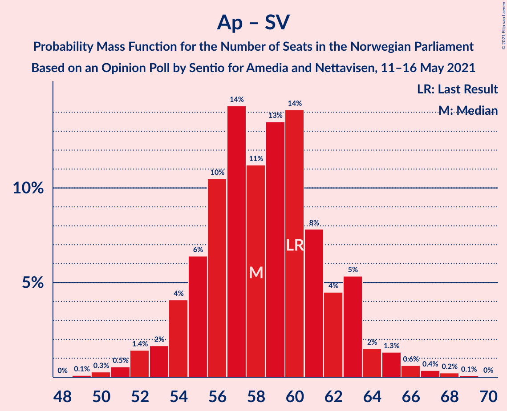

| Number of Seats | Probability | Accumulated | Special Marks |
|:---------------:|:-----------:|:-----------:|:-------------:|
| 49 | 0.1% | 100% |  |
| 50 | 0.3% | 99.9% |  |
| 51 | 0.5% | 99.6% |  |
| 52 | 1.4% | 99.1% |  |
| 53 | 2% | 98% |  |
| 54 | 4% | 96% |  |
| 55 | 6% | 92% |  |
| 56 | 10% | 85% |  |
| 57 | 14% | 75% |  |
| 58 | 11% | 61% | Median |
| 59 | 13% | 49% |  |
| 60 | 14% | 36% | Last Result |
| 61 | 8% | 22% |  |
| 62 | 4% | 14% |  |
| 63 | 5% | 9% |  |
| 64 | 2% | 4% |  |
| 65 | 1.3% | 3% |  |
| 66 | 0.6% | 1.3% |  |
| 67 | 0.4% | 0.7% |  |
| 68 | 0.2% | 0.3% |  |
| 69 | 0.1% | 0.1% |  |
| 70 | 0% | 0% |  |

### Høyre – Kristelig Folkeparti – Venstre

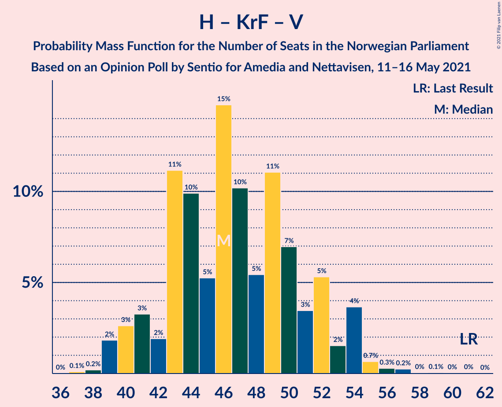

| Number of Seats | Probability | Accumulated | Special Marks |
|:---------------:|:-----------:|:-----------:|:-------------:|
| 37 | 0.1% | 100% |  |
| 38 | 0.2% | 99.9% |  |
| 39 | 2% | 99.7% |  |
| 40 | 3% | 98% |  |
| 41 | 3% | 95% |  |
| 42 | 2% | 92% |  |
| 43 | 11% | 90% |  |
| 44 | 10% | 79% | Median |
| 45 | 5% | 69% |  |
| 46 | 15% | 64% |  |
| 47 | 10% | 49% |  |
| 48 | 5% | 39% |  |
| 49 | 11% | 33% |  |
| 50 | 7% | 22% |  |
| 51 | 3% | 15% |  |
| 52 | 5% | 12% |  |
| 53 | 2% | 7% |  |
| 54 | 4% | 5% |  |
| 55 | 0.7% | 1.4% |  |
| 56 | 0.3% | 0.7% |  |
| 57 | 0.2% | 0.4% |  |
| 58 | 0% | 0.2% |  |
| 59 | 0.1% | 0.1% |  |
| 60 | 0% | 0.1% |  |
| 61 | 0% | 0% | Last Result |

### Senterpartiet – Kristelig Folkeparti – Venstre

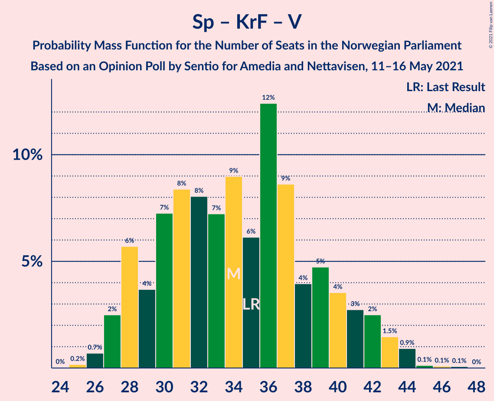

| Number of Seats | Probability | Accumulated | Special Marks |
|:---------------:|:-----------:|:-----------:|:-------------:|
| 25 | 0.2% | 100% |  |
| 26 | 0.7% | 99.8% |  |
| 27 | 2% | 99.1% |  |
| 28 | 6% | 97% |  |
| 29 | 4% | 91% |  |
| 30 | 7% | 87% |  |
| 31 | 8% | 80% |  |
| 32 | 8% | 72% | Median |
| 33 | 7% | 64% |  |
| 34 | 9% | 56% |  |
| 35 | 6% | 47% | Last Result |
| 36 | 12% | 41% |  |
| 37 | 9% | 29% |  |
| 38 | 4% | 20% |  |
| 39 | 5% | 16% |  |
| 40 | 4% | 11% |  |
| 41 | 3% | 8% |  |
| 42 | 2% | 5% |  |
| 43 | 1.5% | 3% |  |
| 44 | 0.9% | 1.2% |  |
| 45 | 0.1% | 0.3% |  |
| 46 | 0.1% | 0.2% |  |
| 47 | 0.1% | 0.1% |  |
| 48 | 0% | 0% |  |

## Technical Information

### Opinion Poll

+ **Polling firm:** Sentio
+ **Commissioner(s):** Amedia and Nettavisen
+ **Fieldwork period:** 11–16 May 2021

### Calculations

+ **Sample size:** 1000
+ **Simulations done:** 1,048,576
+ **Error estimate:** 1.13%

