# Opinion Poll by Norstat for Vårt Land, 18–25 May 2021

<a href="#voting-intentions">Voting Intentions</a> | <a href="#seats">Seats</a> | <a href="#coalitions">Coalitions</a> | <a href="#technical-information">Technical Information</a>

## Voting Intentions

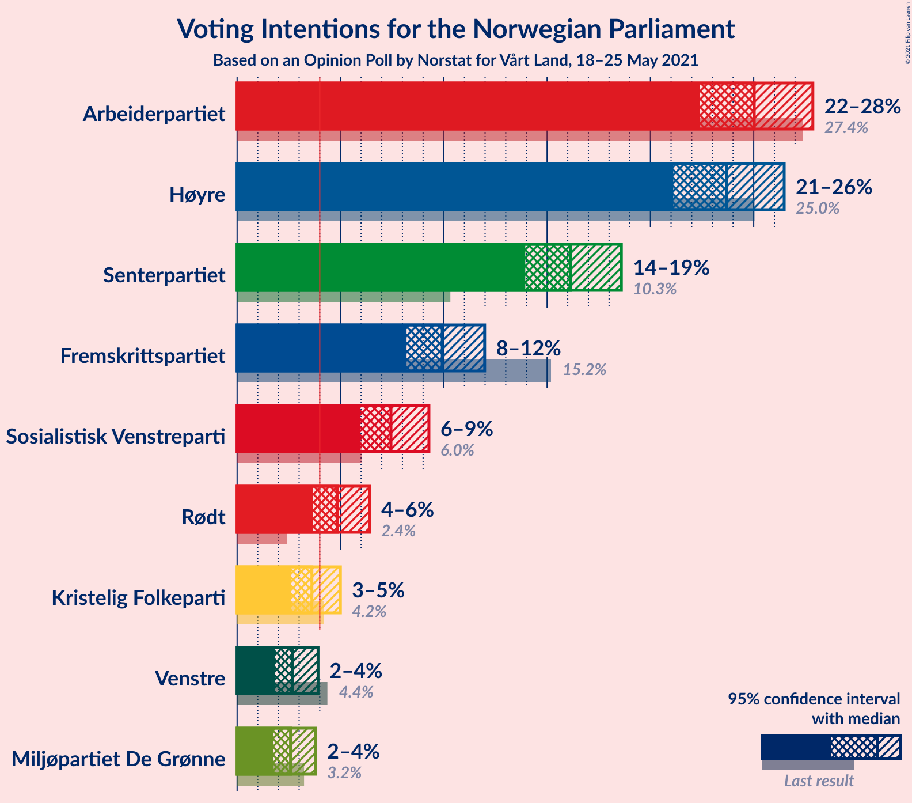

### Confidence Intervals

| Party | Last Result | Poll Result | 80% Confidence Interval | 90% Confidence Interval | 95% Confidence Interval | 99% Confidence Interval |
|:-----:|:-----------:|:-----------:|:-----------------------:|:-----------------------:|:-----------------------:|:-----------------------:|
| Arbeiderpartiet | 27.4% | 25.0% | 23.3–26.9% |22.8–27.4% |22.4–27.9% |21.6–28.8% |
| Høyre | 25.0% | 23.7% | 22.0–25.5% |21.5–26.0% |21.1–26.5% |20.3–27.4% |
| Senterpartiet | 10.3% | 16.1% | 14.7–17.7% |14.3–18.2% |13.9–18.6% |13.3–19.4% |
| Fremskrittspartiet | 15.2% | 9.9% | 8.8–11.3% |8.5–11.6% |8.2–12.0% |7.7–12.7% |
| Sosialistisk Venstreparti | 6.0% | 7.4% | 6.5–8.6% |6.2–9.0% |5.9–9.3% |5.5–9.9% |
| Rødt | 2.4% | 4.9% | 4.1–5.9% |3.9–6.2% |3.7–6.4% |3.3–6.9% |
| Kristelig Folkeparti | 4.2% | 3.6% | 3.0–4.5% |2.8–4.8% |2.6–5.0% |2.3–5.5% |
| Venstre | 4.4% | 2.7% | 2.1–3.5% |2.0–3.7% |1.8–3.9% |1.6–4.3% |
| Miljøpartiet De Grønne | 3.2% | 2.6% | 2.0–3.4% |1.9–3.6% |1.8–3.8% |1.5–4.2% |

*Note:* The poll result column reflects the actual value used in the calculations. Published results may vary slightly, and in addition be rounded to fewer digits.

## Seats

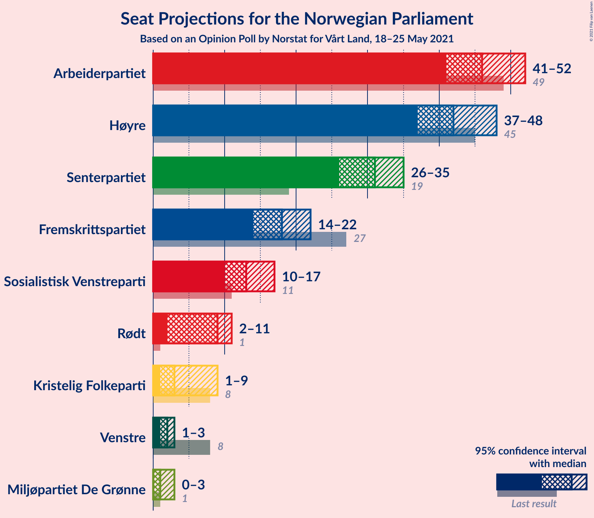

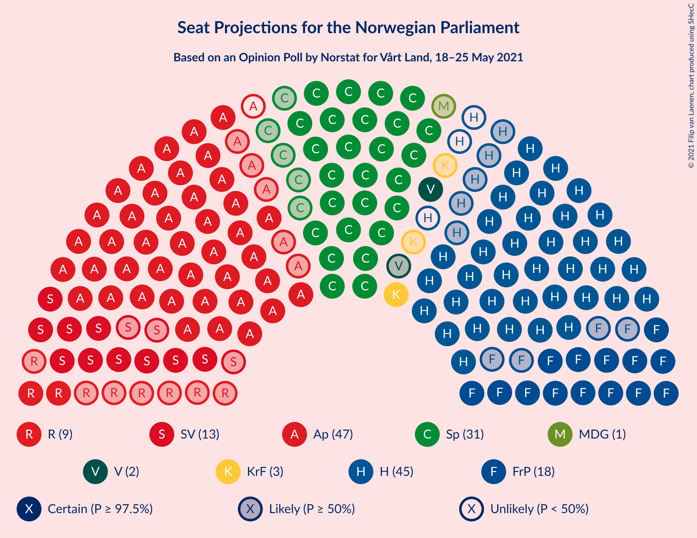

### Confidence Intervals

| Party | Last Result | Median | 80% Confidence Interval | 90% Confidence Interval | 95% Confidence Interval | 99% Confidence Interval |
|:-----:|:-----------:|:------:|:-----------------------:|:-----------------------:|:-----------------------:|:-----------------------:|
| <a href="#arbeiderpartiet">Arbeiderpartiet</a> | 49 | 46 | 43–49 |42–50 |41–52 |40–54 |
| <a href="#høyre">Høyre</a> | 45 | 42 | 39–47 |38–48 |37–48 |36–51 |
| <a href="#senterpartiet">Senterpartiet</a> | 19 | 31 | 27–34 |26–35 |26–35 |24–36 |
| <a href="#fremskrittspartiet">Fremskrittspartiet</a> | 27 | 18 | 15–20 |14–21 |14–22 |13–23 |
| <a href="#sosialistisk-venstreparti">Sosialistisk Venstreparti</a> | 11 | 13 | 11–16 |11–16 |10–17 |9–18 |
| <a href="#rødt">Rødt</a> | 1 | 9 | 7–10 |2–11 |2–11 |2–12 |
| <a href="#kristelig-folkeparti">Kristelig Folkeparti</a> | 8 | 3 | 1–8 |1–8 |1–9 |1–9 |
| <a href="#venstre">Venstre</a> | 8 | 2 | 1–2 |1–2 |1–3 |0–7 |
| <a href="#miljøpartiet-de-grønne">Miljøpartiet De Grønne</a> | 1 | 1 | 1–2 |1–2 |0–3 |0–7 |

### Arbeiderpartiet

*For a full overview of the results for this party, see the [Arbeiderpartiet](party-arbeiderpartiet.html) page.*

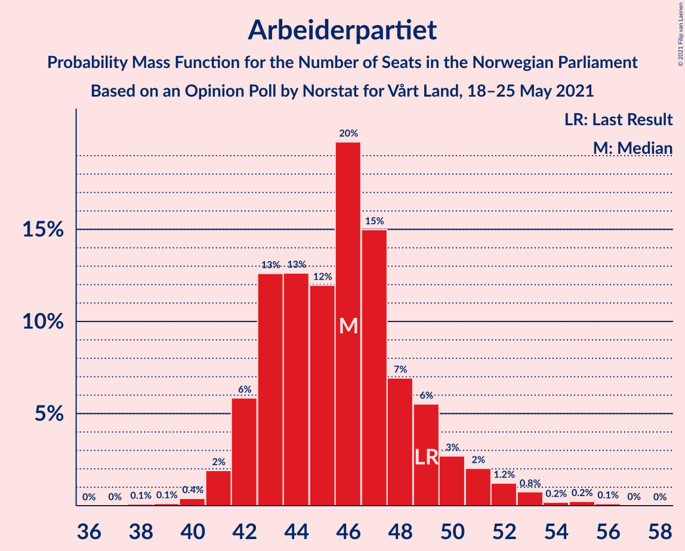

| Number of Seats | Probability | Accumulated | Special Marks |
|:---------------:|:-----------:|:-----------:|:-------------:|
| 38 | 0.1% | 100% |  |
| 39 | 0.1% | 99.9% |  |
| 40 | 0.4% | 99.8% |  |
| 41 | 2% | 99.4% |  |
| 42 | 6% | 97% |  |
| 43 | 13% | 92% |  |
| 44 | 13% | 79% |  |
| 45 | 12% | 66% |  |
| 46 | 20% | 54% | Median |
| 47 | 15% | 35% |  |
| 48 | 7% | 20% |  |
| 49 | 6% | 13% | Last Result |
| 50 | 3% | 7% |  |
| 51 | 2% | 5% |  |
| 52 | 1.2% | 3% |  |
| 53 | 0.8% | 1.3% |  |
| 54 | 0.2% | 0.6% |  |
| 55 | 0.2% | 0.4% |  |
| 56 | 0.1% | 0.1% |  |
| 57 | 0% | 0% |  |

### Høyre

*For a full overview of the results for this party, see the [Høyre](party-høyre.html) page.*

| Number of Seats | Probability | Accumulated | Special Marks |
|:---------------:|:-----------:|:-----------:|:-------------:|
| 34 | 0.1% | 100% |  |
| 35 | 0.2% | 99.9% |  |
| 36 | 0.7% | 99.7% |  |
| 37 | 2% | 99.0% |  |
| 38 | 5% | 97% |  |
| 39 | 6% | 92% |  |
| 40 | 18% | 86% |  |
| 41 | 13% | 68% |  |
| 42 | 10% | 55% | Median |
| 43 | 11% | 45% |  |
| 44 | 7% | 34% |  |
| 45 | 9% | 28% | Last Result |
| 46 | 3% | 18% |  |
| 47 | 6% | 15% |  |
| 48 | 6% | 9% |  |
| 49 | 1.5% | 2% |  |
| 50 | 0.5% | 1.0% |  |
| 51 | 0.3% | 0.5% |  |
| 52 | 0.2% | 0.3% |  |
| 53 | 0% | 0.1% |  |
| 54 | 0% | 0% |  |

### Senterpartiet

*For a full overview of the results for this party, see the [Senterpartiet](party-senterpartiet.html) page.*

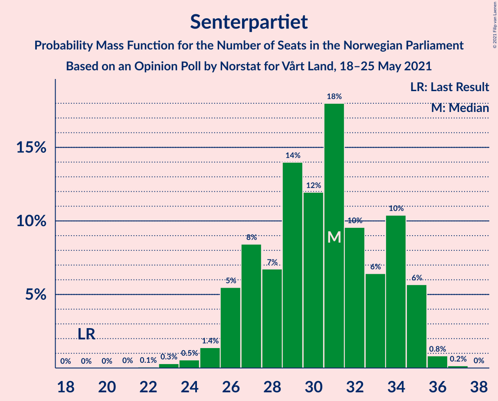

| Number of Seats | Probability | Accumulated | Special Marks |
|:---------------:|:-----------:|:-----------:|:-------------:|
| 19 | 0% | 100% | Last Result |
| 20 | 0% | 100% |  |
| 21 | 0% | 100% |  |
| 22 | 0.1% | 99.9% |  |
| 23 | 0.3% | 99.9% |  |
| 24 | 0.5% | 99.6% |  |
| 25 | 1.4% | 99.0% |  |
| 26 | 5% | 98% |  |
| 27 | 8% | 92% |  |
| 28 | 7% | 84% |  |
| 29 | 14% | 77% |  |
| 30 | 12% | 63% |  |
| 31 | 18% | 51% | Median |
| 32 | 10% | 33% |  |
| 33 | 6% | 24% |  |
| 34 | 10% | 17% |  |
| 35 | 6% | 7% |  |
| 36 | 0.8% | 1.0% |  |
| 37 | 0.2% | 0.2% |  |
| 38 | 0% | 0% |  |

### Fremskrittspartiet

*For a full overview of the results for this party, see the [Fremskrittspartiet](party-fremskrittspartiet.html) page.*

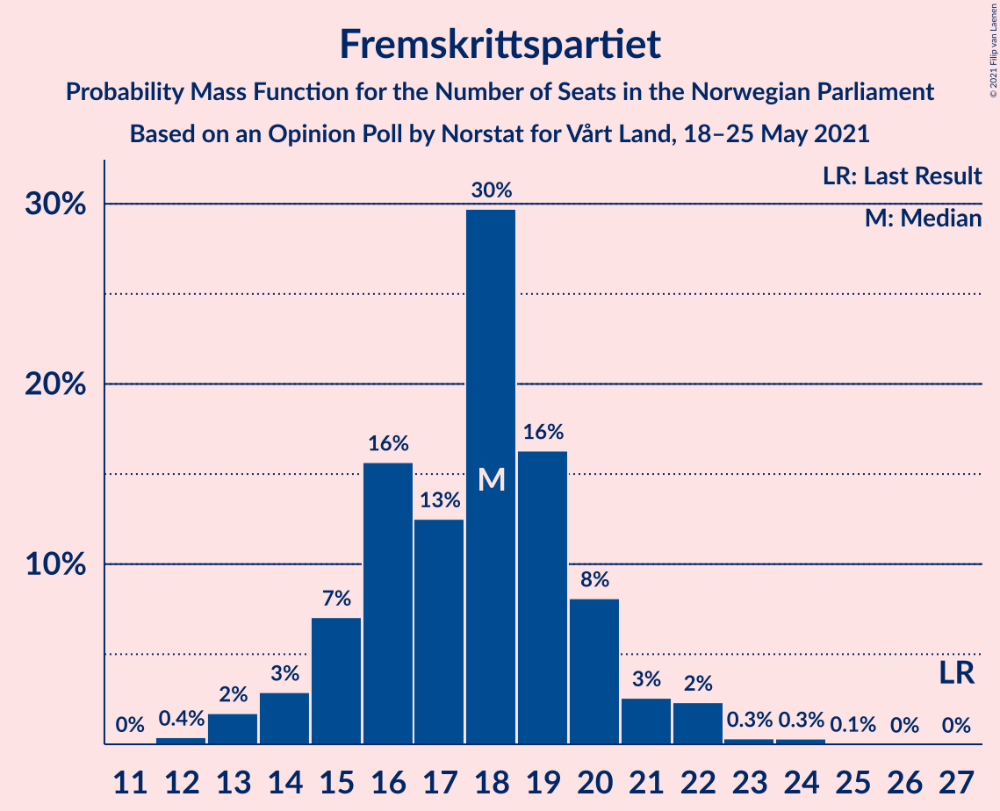

| Number of Seats | Probability | Accumulated | Special Marks |
|:---------------:|:-----------:|:-----------:|:-------------:|
| 12 | 0.4% | 100% |  |
| 13 | 2% | 99.6% |  |
| 14 | 3% | 98% |  |
| 15 | 7% | 95% |  |
| 16 | 16% | 88% |  |
| 17 | 13% | 72% |  |
| 18 | 30% | 60% | Median |
| 19 | 16% | 30% |  |
| 20 | 8% | 14% |  |
| 21 | 3% | 6% |  |
| 22 | 2% | 3% |  |
| 23 | 0.3% | 0.7% |  |
| 24 | 0.3% | 0.4% |  |
| 25 | 0.1% | 0.1% |  |
| 26 | 0% | 0% |  |
| 27 | 0% | 0% | Last Result |

### Sosialistisk Venstreparti

*For a full overview of the results for this party, see the [Sosialistisk Venstreparti](party-sosialistiskvenstreparti.html) page.*

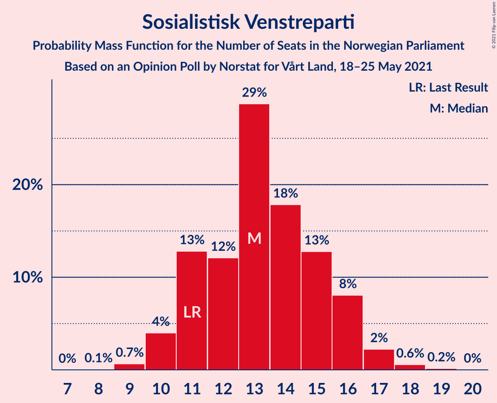

| Number of Seats | Probability | Accumulated | Special Marks |
|:---------------:|:-----------:|:-----------:|:-------------:|
| 8 | 0.1% | 100% |  |
| 9 | 0.7% | 99.9% |  |
| 10 | 4% | 99.3% |  |
| 11 | 13% | 95% | Last Result |
| 12 | 12% | 82% |  |
| 13 | 29% | 70% | Median |
| 14 | 18% | 42% |  |
| 15 | 13% | 24% |  |
| 16 | 8% | 11% |  |
| 17 | 2% | 3% |  |
| 18 | 0.6% | 0.8% |  |
| 19 | 0.2% | 0.2% |  |
| 20 | 0% | 0% |  |

### Rødt

*For a full overview of the results for this party, see the [Rødt](party-rødt.html) page.*

| Number of Seats | Probability | Accumulated | Special Marks |
|:---------------:|:-----------:|:-----------:|:-------------:|
| 1 | 0% | 100% | Last Result |
| 2 | 6% | 100% |  |
| 3 | 0% | 94% |  |
| 4 | 0% | 94% |  |
| 5 | 0% | 94% |  |
| 6 | 0.5% | 94% |  |
| 7 | 15% | 93% |  |
| 8 | 23% | 78% |  |
| 9 | 33% | 55% | Median |
| 10 | 13% | 22% |  |
| 11 | 7% | 8% |  |
| 12 | 1.2% | 2% |  |
| 13 | 0.3% | 0.4% |  |
| 14 | 0.1% | 0.1% |  |
| 15 | 0% | 0% |  |

### Kristelig Folkeparti

*For a full overview of the results for this party, see the [Kristelig Folkeparti](party-kristeligfolkeparti.html) page.*

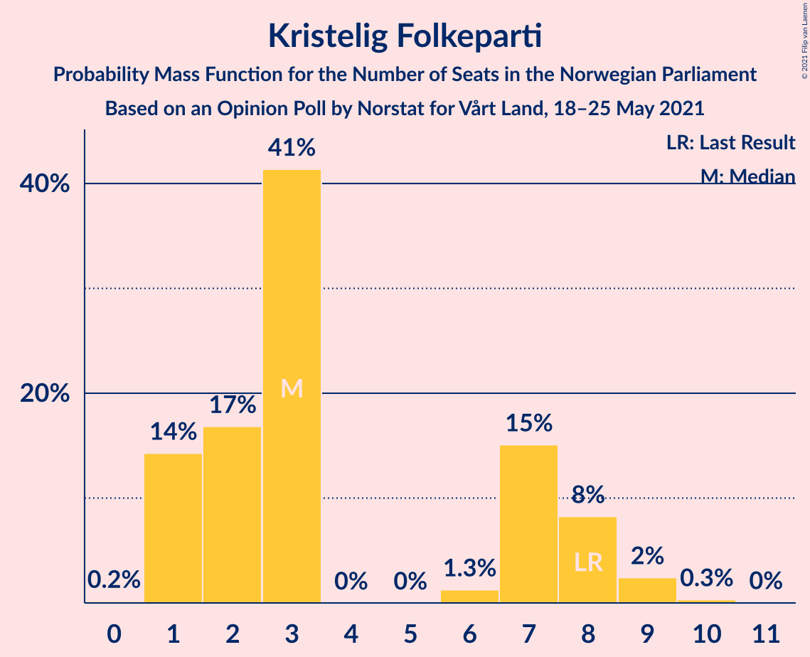

| Number of Seats | Probability | Accumulated | Special Marks |
|:---------------:|:-----------:|:-----------:|:-------------:|
| 0 | 0.2% | 100% |  |
| 1 | 14% | 99.8% |  |
| 2 | 17% | 86% |  |
| 3 | 41% | 69% | Median |
| 4 | 0% | 27% |  |
| 5 | 0% | 27% |  |
| 6 | 1.3% | 27% |  |
| 7 | 15% | 26% |  |
| 8 | 8% | 11% | Last Result |
| 9 | 2% | 3% |  |
| 10 | 0.3% | 0.4% |  |
| 11 | 0% | 0% |  |

### Venstre

*For a full overview of the results for this party, see the [Venstre](party-venstre.html) page.*

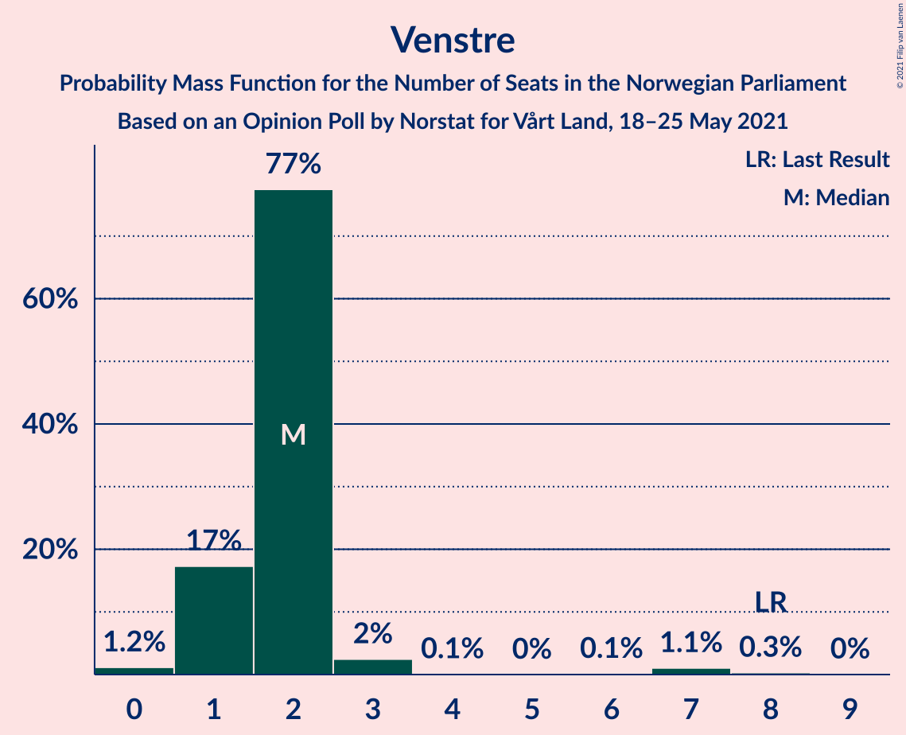

| Number of Seats | Probability | Accumulated | Special Marks |
|:---------------:|:-----------:|:-----------:|:-------------:|
| 0 | 1.2% | 100% |  |
| 1 | 17% | 98.8% |  |
| 2 | 77% | 82% | Median |
| 3 | 2% | 4% |  |
| 4 | 0.1% | 2% |  |
| 5 | 0% | 2% |  |
| 6 | 0.1% | 2% |  |
| 7 | 1.1% | 1.4% |  |
| 8 | 0.3% | 0.4% | Last Result |
| 9 | 0% | 0% |  |

### Miljøpartiet De Grønne

*For a full overview of the results for this party, see the [Miljøpartiet De Grønne](party-miljøpartietdegrønne.html) page.*

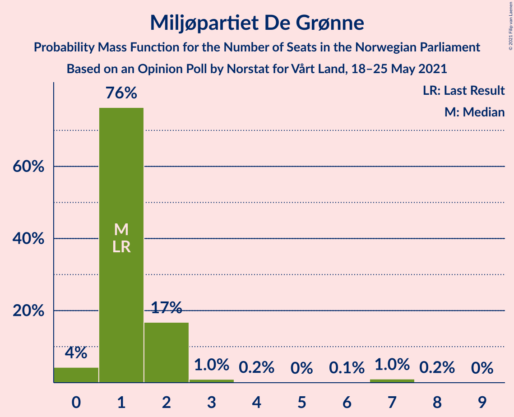

| Number of Seats | Probability | Accumulated | Special Marks |
|:---------------:|:-----------:|:-----------:|:-------------:|
| 0 | 4% | 100% |  |
| 1 | 76% | 96% | Last Result, Median |
| 2 | 17% | 19% |  |
| 3 | 1.0% | 3% |  |
| 4 | 0.2% | 2% |  |
| 5 | 0% | 1.4% |  |
| 6 | 0.1% | 1.4% |  |
| 7 | 1.0% | 1.3% |  |
| 8 | 0.2% | 0.2% |  |
| 9 | 0% | 0% |  |

## Coalitions

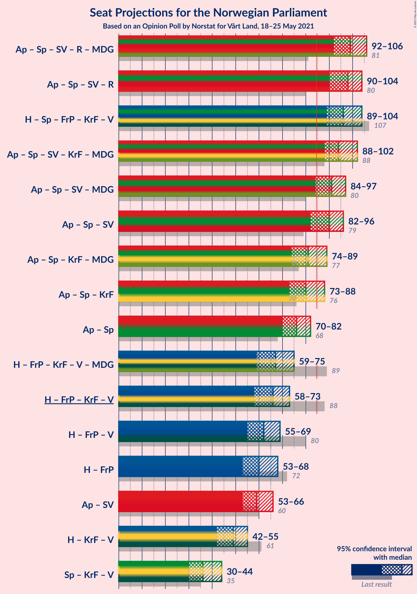

### Confidence Intervals

| Coalition | Last Result | Median | Majority? | 80% Confidence Interval | 90% Confidence Interval | 95% Confidence Interval | 99% Confidence Interval |
|:---------:|:-----------:|:------:|:---------:|:-----------------------:|:-----------------------:|:-----------------------:|:-----------------------:|
| Arbeiderpartiet – Senterpartiet – Sosialistisk Venstreparti – Rødt – Miljøpartiet De Grønne | 81 | 99 | 100% | 94–103 | 93–105 | 92–106 | 89–108 |
| Arbeiderpartiet – Senterpartiet – Sosialistisk Venstreparti – Rødt | 80 | 98 | 99.9% | 93–102 | 92–103 | 90–104 | 88–107 |
| Høyre – Senterpartiet – Fremskrittspartiet – Kristelig Folkeparti – Venstre | 107 | 96 | 99.9% | 92–101 | 90–102 | 89–104 | 86–106 |
| Arbeiderpartiet – Senterpartiet – Sosialistisk Venstreparti – Kristelig Folkeparti – Miljøpartiet De Grønne | 88 | 94 | 99.6% | 90–99 | 89–101 | 88–102 | 85–105 |
| Arbeiderpartiet – Senterpartiet – Sosialistisk Venstreparti – Miljøpartiet De Grønne | 80 | 91 | 96% | 86–95 | 85–97 | 84–97 | 81–100 |
| Arbeiderpartiet – Senterpartiet – Sosialistisk Venstreparti | 79 | 90 | 92% | 85–93 | 84–95 | 82–96 | 80–98 |
| Arbeiderpartiet – Senterpartiet – Kristelig Folkeparti – Miljøpartiet De Grønne | 77 | 81 | 16% | 77–86 | 76–88 | 74–89 | 71–91 |
| Arbeiderpartiet – Senterpartiet – Kristelig Folkeparti | 76 | 80 | 10% | 76–84 | 75–86 | 73–88 | 71–89 |
| Arbeiderpartiet – Senterpartiet | 68 | 76 | 0.9% | 72–80 | 71–81 | 70–82 | 67–85 |
| Høyre – Fremskrittspartiet – Kristelig Folkeparti – Venstre – Miljøpartiet De Grønne | 89 | 67 | 0% | 62–72 | 61–73 | 59–75 | 58–78 |
| Høyre – Fremskrittspartiet – Kristelig Folkeparti – Venstre | 88 | 66 | 0% | 61–71 | 60–72 | 58–73 | 57–77 |
| Høyre – Fremskrittspartiet – Venstre | 80 | 62 | 0% | 57–68 | 56–68 | 55–69 | 54–72 |
| Høyre – Fremskrittspartiet | 72 | 60 | 0% | 55–66 | 55–66 | 53–68 | 52–69 |
| Arbeiderpartiet – Sosialistisk Venstreparti | 60 | 59 | 0% | 55–63 | 54–64 | 53–66 | 52–67 |
| Høyre – Kristelig Folkeparti – Venstre | 61 | 49 | 0% | 43–53 | 42–53 | 42–55 | 41–59 |
| Senterpartiet – Kristelig Folkeparti – Venstre | 35 | 36 | 0% | 32–41 | 31–43 | 30–44 | 28–45 |

### Arbeiderpartiet – Senterpartiet – Sosialistisk Venstreparti – Rødt – Miljøpartiet De Grønne

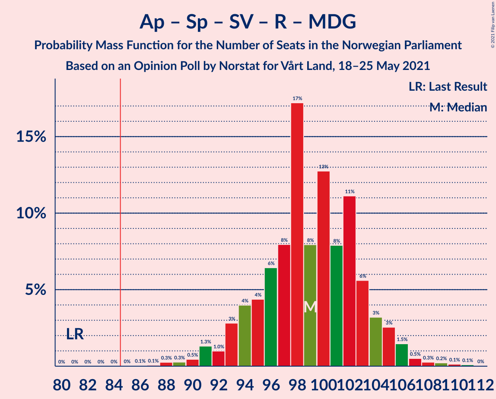

| Number of Seats | Probability | Accumulated | Special Marks |
|:---------------:|:-----------:|:-----------:|:-------------:|
| 81 | 0% | 100% | Last Result |
| 82 | 0% | 100% |  |
| 83 | 0% | 100% |  |
| 84 | 0% | 100% |  |
| 85 | 0% | 100% | Majority |
| 86 | 0.1% | 100% |  |
| 87 | 0.1% | 99.9% |  |
| 88 | 0.3% | 99.8% |  |
| 89 | 0.3% | 99.6% |  |
| 90 | 0.5% | 99.3% |  |
| 91 | 1.3% | 98.9% |  |
| 92 | 1.0% | 98% |  |
| 93 | 3% | 97% |  |
| 94 | 4% | 94% |  |
| 95 | 4% | 90% |  |
| 96 | 6% | 85% |  |
| 97 | 8% | 79% |  |
| 98 | 17% | 71% |  |
| 99 | 8% | 54% |  |
| 100 | 13% | 46% | Median |
| 101 | 8% | 33% |  |
| 102 | 11% | 25% |  |
| 103 | 6% | 14% |  |
| 104 | 3% | 8% |  |
| 105 | 3% | 5% |  |
| 106 | 1.5% | 3% |  |
| 107 | 0.5% | 1.2% |  |
| 108 | 0.3% | 0.7% |  |
| 109 | 0.2% | 0.5% |  |
| 110 | 0.1% | 0.3% |  |
| 111 | 0.1% | 0.1% |  |
| 112 | 0% | 0% |  |

### Arbeiderpartiet – Senterpartiet – Sosialistisk Venstreparti – Rødt

| Number of Seats | Probability | Accumulated | Special Marks |
|:---------------:|:-----------:|:-----------:|:-------------:|
| 80 | 0% | 100% | Last Result |
| 81 | 0% | 100% |  |
| 82 | 0% | 100% |  |
| 83 | 0% | 100% |  |
| 84 | 0% | 100% |  |
| 85 | 0.1% | 99.9% | Majority |
| 86 | 0.1% | 99.9% |  |
| 87 | 0.2% | 99.7% |  |
| 88 | 0.3% | 99.5% |  |
| 89 | 0.5% | 99.2% |  |
| 90 | 2% | 98.7% |  |
| 91 | 1.2% | 97% |  |
| 92 | 3% | 96% |  |
| 93 | 4% | 93% |  |
| 94 | 5% | 88% |  |
| 95 | 7% | 83% |  |
| 96 | 8% | 77% |  |
| 97 | 17% | 69% |  |
| 98 | 9% | 51% |  |
| 99 | 11% | 42% | Median |
| 100 | 8% | 32% |  |
| 101 | 10% | 24% |  |
| 102 | 6% | 13% |  |
| 103 | 3% | 7% |  |
| 104 | 2% | 4% |  |
| 105 | 1.3% | 2% |  |
| 106 | 0.3% | 1.0% |  |
| 107 | 0.3% | 0.7% |  |
| 108 | 0.2% | 0.4% |  |
| 109 | 0.1% | 0.2% |  |
| 110 | 0% | 0% |  |

### Høyre – Senterpartiet – Fremskrittspartiet – Kristelig Folkeparti – Venstre

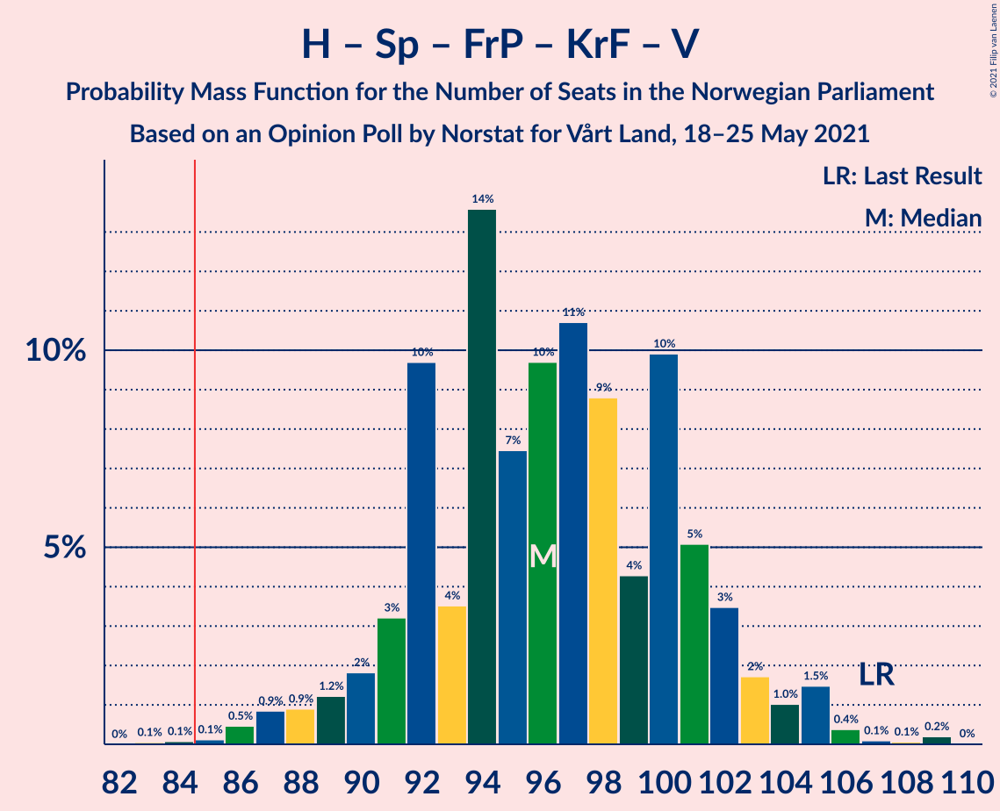

| Number of Seats | Probability | Accumulated | Special Marks |
|:---------------:|:-----------:|:-----------:|:-------------:|
| 83 | 0.1% | 100% |  |
| 84 | 0.1% | 99.9% |  |
| 85 | 0.1% | 99.9% | Majority |
| 86 | 0.5% | 99.7% |  |
| 87 | 0.9% | 99.3% |  |
| 88 | 0.9% | 98% |  |
| 89 | 1.2% | 98% |  |
| 90 | 2% | 96% |  |
| 91 | 3% | 94% |  |
| 92 | 10% | 91% |  |
| 93 | 4% | 82% |  |
| 94 | 14% | 78% |  |
| 95 | 7% | 64% |  |
| 96 | 10% | 57% | Median |
| 97 | 11% | 47% |  |
| 98 | 9% | 37% |  |
| 99 | 4% | 28% |  |
| 100 | 10% | 23% |  |
| 101 | 5% | 14% |  |
| 102 | 3% | 8% |  |
| 103 | 2% | 5% |  |
| 104 | 1.0% | 3% |  |
| 105 | 1.5% | 2% |  |
| 106 | 0.4% | 0.8% |  |
| 107 | 0.1% | 0.4% | Last Result |
| 108 | 0.1% | 0.3% |  |
| 109 | 0.2% | 0.2% |  |
| 110 | 0% | 0% |  |

### Arbeiderpartiet – Senterpartiet – Sosialistisk Venstreparti – Kristelig Folkeparti – Miljøpartiet De Grønne

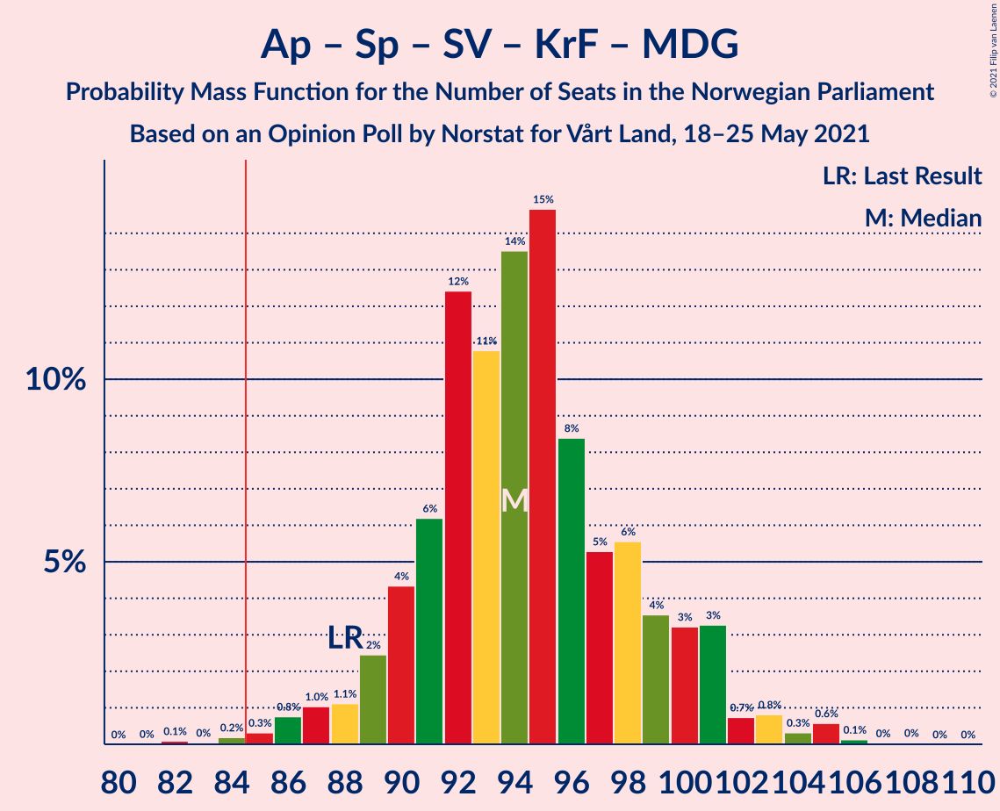

| Number of Seats | Probability | Accumulated | Special Marks |
|:---------------:|:-----------:|:-----------:|:-------------:|
| 82 | 0.1% | 100% |  |
| 83 | 0% | 99.9% |  |
| 84 | 0.2% | 99.8% |  |
| 85 | 0.3% | 99.6% | Majority |
| 86 | 0.8% | 99.3% |  |
| 87 | 1.0% | 98.6% |  |
| 88 | 1.1% | 98% | Last Result |
| 89 | 2% | 96% |  |
| 90 | 4% | 94% |  |
| 91 | 6% | 90% |  |
| 92 | 12% | 83% |  |
| 93 | 11% | 71% |  |
| 94 | 14% | 60% | Median |
| 95 | 15% | 47% |  |
| 96 | 8% | 32% |  |
| 97 | 5% | 24% |  |
| 98 | 6% | 18% |  |
| 99 | 4% | 13% |  |
| 100 | 3% | 9% |  |
| 101 | 3% | 6% |  |
| 102 | 0.7% | 3% |  |
| 103 | 0.8% | 2% |  |
| 104 | 0.3% | 1.1% |  |
| 105 | 0.6% | 0.8% |  |
| 106 | 0.1% | 0.2% |  |
| 107 | 0% | 0.1% |  |
| 108 | 0% | 0.1% |  |
| 109 | 0% | 0% |  |

### Arbeiderpartiet – Senterpartiet – Sosialistisk Venstreparti – Miljøpartiet De Grønne

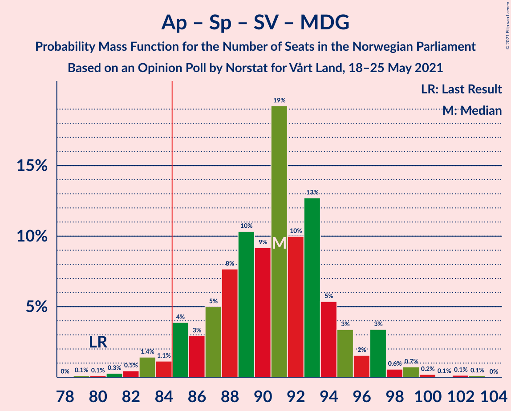

| Number of Seats | Probability | Accumulated | Special Marks |
|:---------------:|:-----------:|:-----------:|:-------------:|
| 79 | 0.1% | 100% |  |
| 80 | 0.1% | 99.8% | Last Result |
| 81 | 0.3% | 99.7% |  |
| 82 | 0.5% | 99.5% |  |
| 83 | 1.4% | 99.0% |  |
| 84 | 1.1% | 98% |  |
| 85 | 4% | 96% | Majority |
| 86 | 3% | 93% |  |
| 87 | 5% | 90% |  |
| 88 | 8% | 85% |  |
| 89 | 10% | 77% |  |
| 90 | 9% | 67% |  |
| 91 | 19% | 57% | Median |
| 92 | 10% | 38% |  |
| 93 | 13% | 28% |  |
| 94 | 5% | 16% |  |
| 95 | 3% | 10% |  |
| 96 | 2% | 7% |  |
| 97 | 3% | 5% |  |
| 98 | 0.6% | 2% |  |
| 99 | 0.7% | 1.2% |  |
| 100 | 0.2% | 0.5% |  |
| 101 | 0.1% | 0.3% |  |
| 102 | 0.1% | 0.3% |  |
| 103 | 0.1% | 0.1% |  |
| 104 | 0% | 0% |  |

### Arbeiderpartiet – Senterpartiet – Sosialistisk Venstreparti

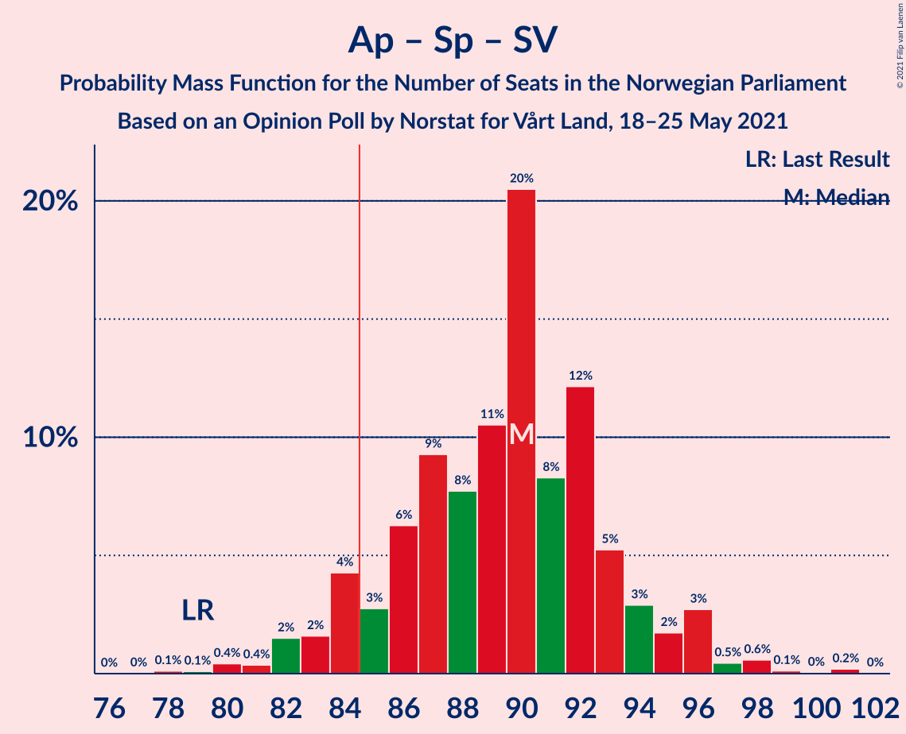

| Number of Seats | Probability | Accumulated | Special Marks |
|:---------------:|:-----------:|:-----------:|:-------------:|
| 77 | 0% | 100% |  |
| 78 | 0.1% | 99.9% |  |
| 79 | 0.1% | 99.8% | Last Result |
| 80 | 0.4% | 99.7% |  |
| 81 | 0.4% | 99.3% |  |
| 82 | 2% | 98.9% |  |
| 83 | 2% | 97% |  |
| 84 | 4% | 96% |  |
| 85 | 3% | 92% | Majority |
| 86 | 6% | 89% |  |
| 87 | 9% | 83% |  |
| 88 | 8% | 73% |  |
| 89 | 11% | 66% |  |
| 90 | 20% | 55% | Median |
| 91 | 8% | 34% |  |
| 92 | 12% | 26% |  |
| 93 | 5% | 14% |  |
| 94 | 3% | 9% |  |
| 95 | 2% | 6% |  |
| 96 | 3% | 4% |  |
| 97 | 0.5% | 1.4% |  |
| 98 | 0.6% | 1.0% |  |
| 99 | 0.1% | 0.4% |  |
| 100 | 0% | 0.3% |  |
| 101 | 0.2% | 0.2% |  |
| 102 | 0% | 0% |  |

### Arbeiderpartiet – Senterpartiet – Kristelig Folkeparti – Miljøpartiet De Grønne

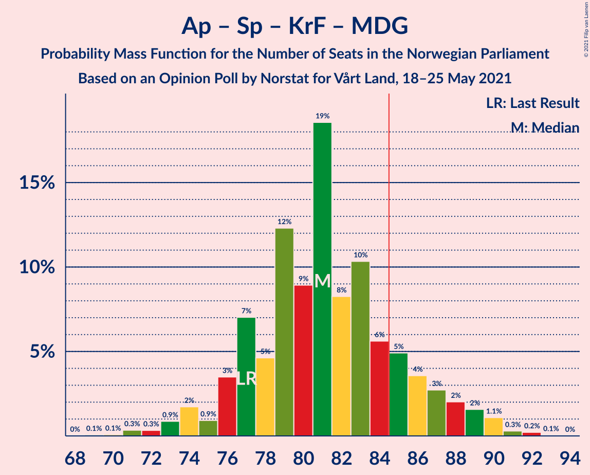

| Number of Seats | Probability | Accumulated | Special Marks |
|:---------------:|:-----------:|:-----------:|:-------------:|
| 69 | 0.1% | 100% |  |
| 70 | 0.1% | 99.9% |  |
| 71 | 0.3% | 99.8% |  |
| 72 | 0.3% | 99.5% |  |
| 73 | 0.9% | 99.2% |  |
| 74 | 2% | 98% |  |
| 75 | 0.9% | 97% |  |
| 76 | 3% | 96% |  |
| 77 | 7% | 92% | Last Result |
| 78 | 5% | 85% |  |
| 79 | 12% | 81% |  |
| 80 | 9% | 68% |  |
| 81 | 19% | 59% | Median |
| 82 | 8% | 41% |  |
| 83 | 10% | 32% |  |
| 84 | 6% | 22% |  |
| 85 | 5% | 16% | Majority |
| 86 | 4% | 12% |  |
| 87 | 3% | 8% |  |
| 88 | 2% | 5% |  |
| 89 | 2% | 3% |  |
| 90 | 1.1% | 2% |  |
| 91 | 0.3% | 0.6% |  |
| 92 | 0.2% | 0.3% |  |
| 93 | 0.1% | 0.1% |  |
| 94 | 0% | 0% |  |

### Arbeiderpartiet – Senterpartiet – Kristelig Folkeparti

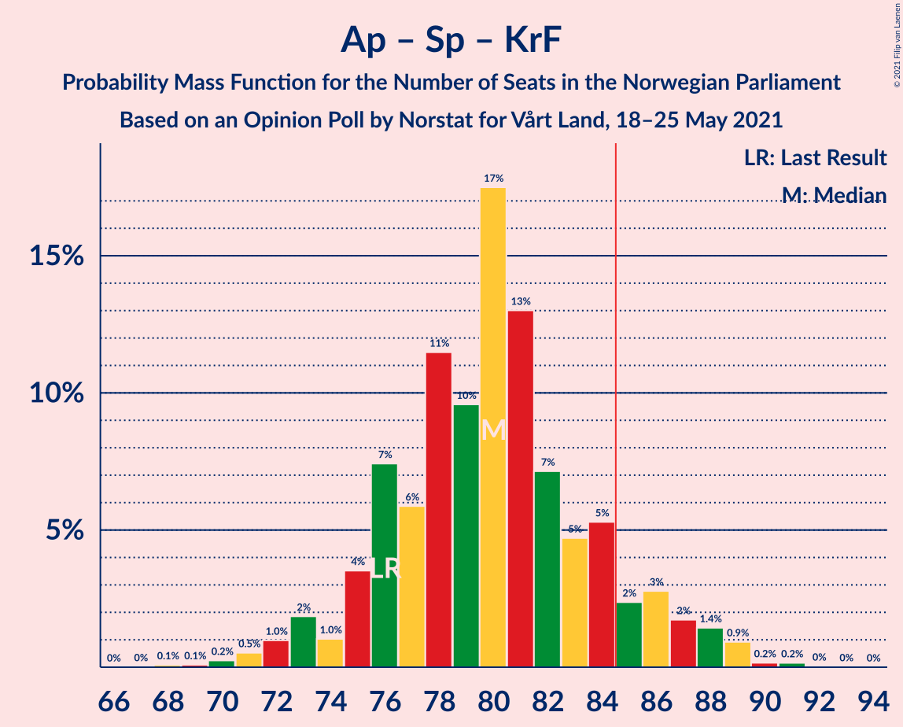

| Number of Seats | Probability | Accumulated | Special Marks |
|:---------------:|:-----------:|:-----------:|:-------------:|
| 68 | 0.1% | 100% |  |
| 69 | 0.1% | 99.9% |  |
| 70 | 0.2% | 99.8% |  |
| 71 | 0.5% | 99.6% |  |
| 72 | 1.0% | 99.0% |  |
| 73 | 2% | 98% |  |
| 74 | 1.0% | 96% |  |
| 75 | 4% | 95% |  |
| 76 | 7% | 92% | Last Result |
| 77 | 6% | 84% |  |
| 78 | 11% | 78% |  |
| 79 | 10% | 67% |  |
| 80 | 17% | 57% | Median |
| 81 | 13% | 40% |  |
| 82 | 7% | 27% |  |
| 83 | 5% | 20% |  |
| 84 | 5% | 15% |  |
| 85 | 2% | 10% | Majority |
| 86 | 3% | 7% |  |
| 87 | 2% | 4% |  |
| 88 | 1.4% | 3% |  |
| 89 | 0.9% | 1.3% |  |
| 90 | 0.2% | 0.4% |  |
| 91 | 0.2% | 0.2% |  |
| 92 | 0% | 0.1% |  |
| 93 | 0% | 0% |  |

### Arbeiderpartiet – Senterpartiet

| Number of Seats | Probability | Accumulated | Special Marks |
|:---------------:|:-----------:|:-----------:|:-------------:|
| 65 | 0.1% | 100% |  |
| 66 | 0.2% | 99.9% |  |
| 67 | 0.3% | 99.7% |  |
| 68 | 0.6% | 99.4% | Last Result |
| 69 | 1.2% | 98.9% |  |
| 70 | 2% | 98% |  |
| 71 | 2% | 95% |  |
| 72 | 4% | 94% |  |
| 73 | 7% | 89% |  |
| 74 | 12% | 83% |  |
| 75 | 7% | 71% |  |
| 76 | 19% | 64% |  |
| 77 | 14% | 45% | Median |
| 78 | 8% | 31% |  |
| 79 | 13% | 23% |  |
| 80 | 4% | 11% |  |
| 81 | 4% | 7% |  |
| 82 | 2% | 4% |  |
| 83 | 0.6% | 2% |  |
| 84 | 0.2% | 1.0% |  |
| 85 | 0.5% | 0.9% | Majority |
| 86 | 0.3% | 0.4% |  |
| 87 | 0% | 0.1% |  |
| 88 | 0% | 0% |  |

### Høyre – Fremskrittspartiet – Kristelig Folkeparti – Venstre – Miljøpartiet De Grønne

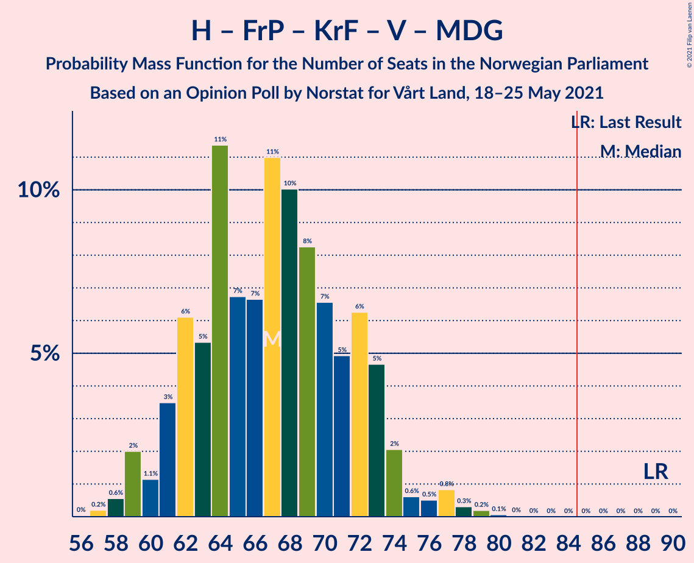

| Number of Seats | Probability | Accumulated | Special Marks |
|:---------------:|:-----------:|:-----------:|:-------------:|
| 56 | 0% | 100% |  |
| 57 | 0.2% | 99.9% |  |
| 58 | 0.6% | 99.7% |  |
| 59 | 2% | 99.2% |  |
| 60 | 1.1% | 97% |  |
| 61 | 3% | 96% |  |
| 62 | 6% | 93% |  |
| 63 | 5% | 86% |  |
| 64 | 11% | 81% |  |
| 65 | 7% | 70% |  |
| 66 | 7% | 63% | Median |
| 67 | 11% | 56% |  |
| 68 | 10% | 45% |  |
| 69 | 8% | 35% |  |
| 70 | 7% | 27% |  |
| 71 | 5% | 20% |  |
| 72 | 6% | 16% |  |
| 73 | 5% | 9% |  |
| 74 | 2% | 5% |  |
| 75 | 0.6% | 3% |  |
| 76 | 0.5% | 2% |  |
| 77 | 0.8% | 1.4% |  |
| 78 | 0.3% | 0.6% |  |
| 79 | 0.2% | 0.3% |  |
| 80 | 0.1% | 0.1% |  |
| 81 | 0% | 0% |  |
| 82 | 0% | 0% |  |
| 83 | 0% | 0% |  |
| 84 | 0% | 0% |  |
| 85 | 0% | 0% | Majority |
| 86 | 0% | 0% |  |
| 87 | 0% | 0% |  |
| 88 | 0% | 0% |  |
| 89 | 0% | 0% | Last Result |

### Høyre – Fremskrittspartiet – Kristelig Folkeparti – Venstre

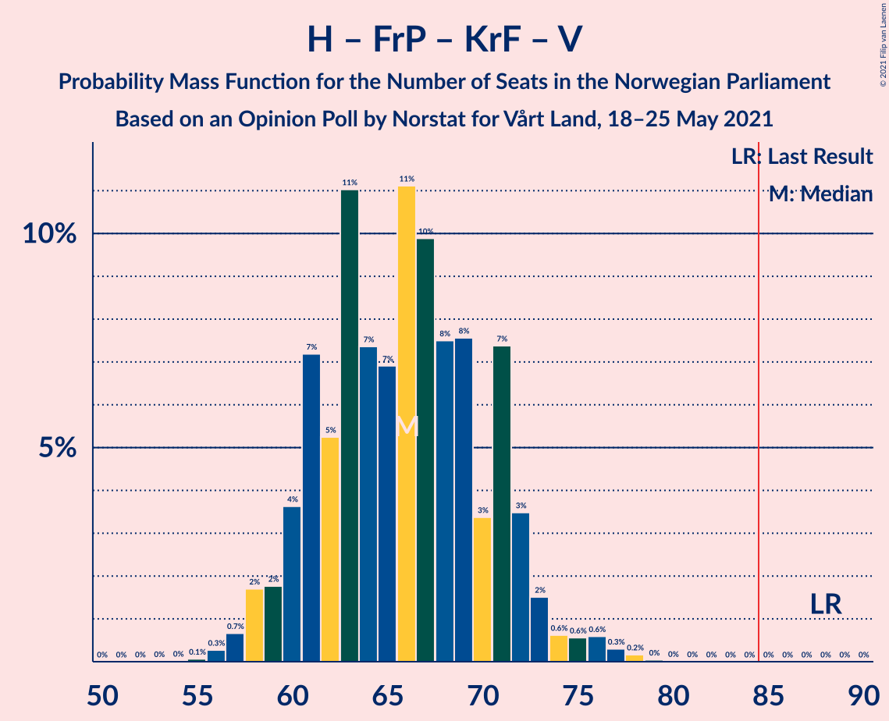

| Number of Seats | Probability | Accumulated | Special Marks |
|:---------------:|:-----------:|:-----------:|:-------------:|
| 55 | 0.1% | 100% |  |
| 56 | 0.3% | 99.9% |  |
| 57 | 0.7% | 99.6% |  |
| 58 | 2% | 99.0% |  |
| 59 | 2% | 97% |  |
| 60 | 4% | 95% |  |
| 61 | 7% | 92% |  |
| 62 | 5% | 85% |  |
| 63 | 11% | 79% |  |
| 64 | 7% | 68% |  |
| 65 | 7% | 61% | Median |
| 66 | 11% | 54% |  |
| 67 | 10% | 43% |  |
| 68 | 8% | 33% |  |
| 69 | 8% | 26% |  |
| 70 | 3% | 18% |  |
| 71 | 7% | 15% |  |
| 72 | 3% | 7% |  |
| 73 | 2% | 4% |  |
| 74 | 0.6% | 2% |  |
| 75 | 0.6% | 2% |  |
| 76 | 0.6% | 1.1% |  |
| 77 | 0.3% | 0.5% |  |
| 78 | 0.2% | 0.2% |  |
| 79 | 0% | 0.1% |  |
| 80 | 0% | 0% |  |
| 81 | 0% | 0% |  |
| 82 | 0% | 0% |  |
| 83 | 0% | 0% |  |
| 84 | 0% | 0% |  |
| 85 | 0% | 0% | Majority |
| 86 | 0% | 0% |  |
| 87 | 0% | 0% |  |
| 88 | 0% | 0% | Last Result |

### Høyre – Fremskrittspartiet – Venstre

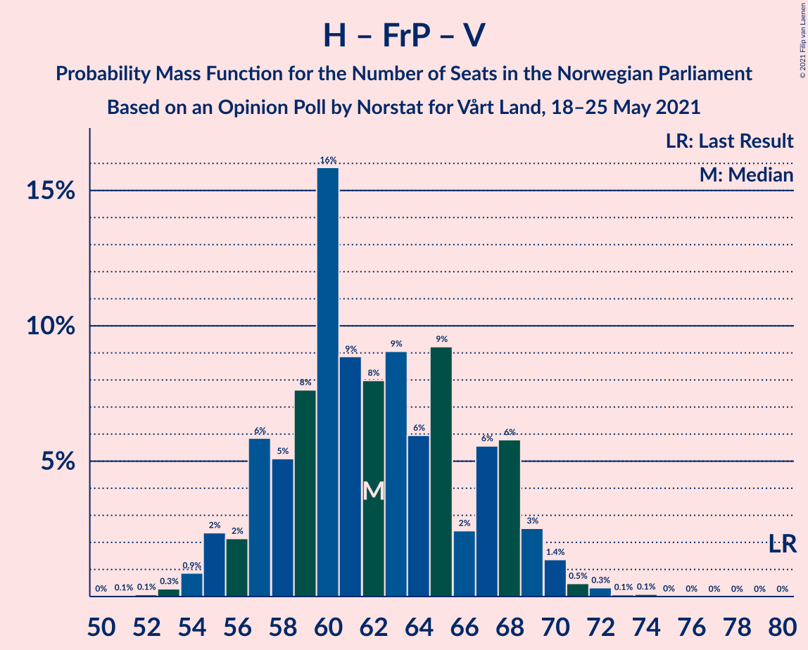

| Number of Seats | Probability | Accumulated | Special Marks |
|:---------------:|:-----------:|:-----------:|:-------------:|
| 51 | 0.1% | 100% |  |
| 52 | 0.1% | 99.9% |  |
| 53 | 0.3% | 99.9% |  |
| 54 | 0.9% | 99.6% |  |
| 55 | 2% | 98.7% |  |
| 56 | 2% | 96% |  |
| 57 | 6% | 94% |  |
| 58 | 5% | 88% |  |
| 59 | 8% | 83% |  |
| 60 | 16% | 76% |  |
| 61 | 9% | 60% |  |
| 62 | 8% | 51% | Median |
| 63 | 9% | 43% |  |
| 64 | 6% | 34% |  |
| 65 | 9% | 28% |  |
| 66 | 2% | 19% |  |
| 67 | 6% | 16% |  |
| 68 | 6% | 11% |  |
| 69 | 3% | 5% |  |
| 70 | 1.4% | 2% |  |
| 71 | 0.5% | 1.0% |  |
| 72 | 0.3% | 0.5% |  |
| 73 | 0.1% | 0.2% |  |
| 74 | 0.1% | 0.1% |  |
| 75 | 0% | 0% |  |
| 76 | 0% | 0% |  |
| 77 | 0% | 0% |  |
| 78 | 0% | 0% |  |
| 79 | 0% | 0% |  |
| 80 | 0% | 0% | Last Result |

### Høyre – Fremskrittspartiet

| Number of Seats | Probability | Accumulated | Special Marks |
|:---------------:|:-----------:|:-----------:|:-------------:|
| 49 | 0.1% | 100% |  |
| 50 | 0% | 99.9% |  |
| 51 | 0.3% | 99.9% |  |
| 52 | 0.8% | 99.6% |  |
| 53 | 2% | 98.8% |  |
| 54 | 2% | 97% |  |
| 55 | 6% | 95% |  |
| 56 | 6% | 89% |  |
| 57 | 7% | 83% |  |
| 58 | 15% | 76% |  |
| 59 | 9% | 61% |  |
| 60 | 8% | 52% | Median |
| 61 | 10% | 44% |  |
| 62 | 5% | 34% |  |
| 63 | 10% | 29% |  |
| 64 | 2% | 19% |  |
| 65 | 4% | 16% |  |
| 66 | 8% | 12% |  |
| 67 | 2% | 5% |  |
| 68 | 2% | 3% |  |
| 69 | 0.4% | 0.9% |  |
| 70 | 0.3% | 0.5% |  |
| 71 | 0.1% | 0.2% |  |
| 72 | 0.1% | 0.1% | Last Result |
| 73 | 0% | 0% |  |

### Arbeiderpartiet – Sosialistisk Venstreparti

| Number of Seats | Probability | Accumulated | Special Marks |
|:---------------:|:-----------:|:-----------:|:-------------:|
| 50 | 0.1% | 100% |  |
| 51 | 0.3% | 99.9% |  |
| 52 | 0.6% | 99.6% |  |
| 53 | 2% | 99.0% |  |
| 54 | 3% | 97% |  |
| 55 | 6% | 94% |  |
| 56 | 12% | 87% |  |
| 57 | 7% | 76% |  |
| 58 | 11% | 69% |  |
| 59 | 16% | 59% | Median |
| 60 | 14% | 42% | Last Result |
| 61 | 8% | 29% |  |
| 62 | 9% | 20% |  |
| 63 | 4% | 11% |  |
| 64 | 3% | 8% |  |
| 65 | 2% | 5% |  |
| 66 | 2% | 3% |  |
| 67 | 0.5% | 0.8% |  |
| 68 | 0.2% | 0.3% |  |
| 69 | 0.1% | 0.2% |  |
| 70 | 0% | 0.1% |  |
| 71 | 0% | 0% |  |

### Høyre – Kristelig Folkeparti – Venstre

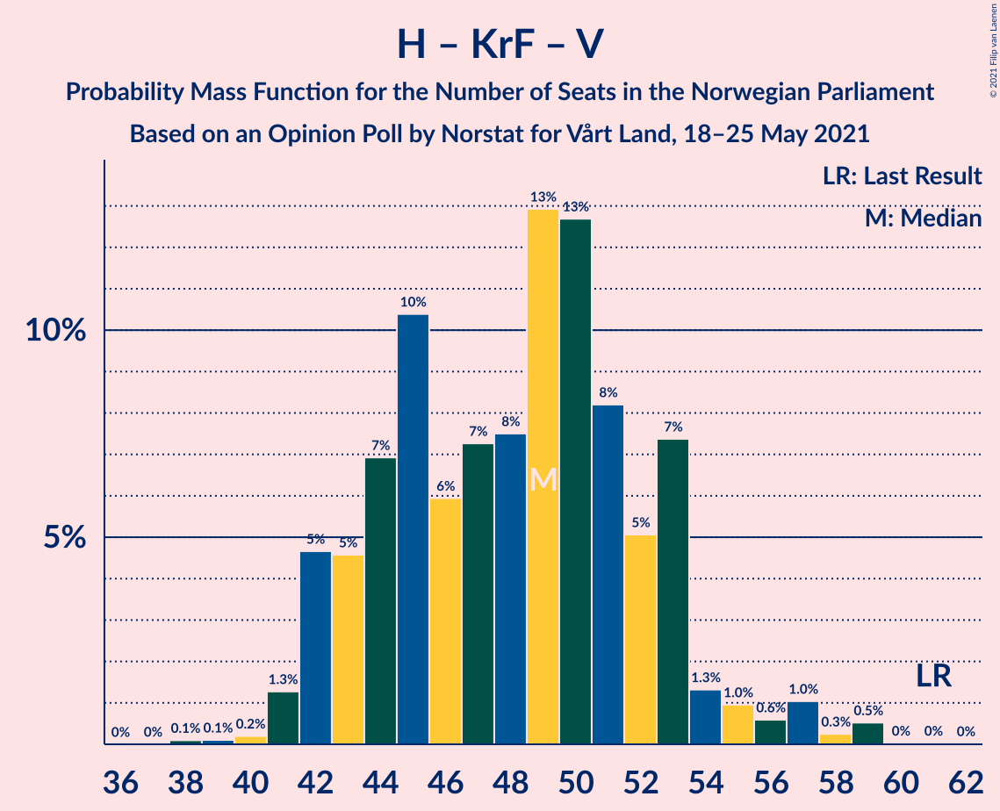

| Number of Seats | Probability | Accumulated | Special Marks |
|:---------------:|:-----------:|:-----------:|:-------------:|
| 38 | 0.1% | 100% |  |
| 39 | 0.1% | 99.9% |  |
| 40 | 0.2% | 99.8% |  |
| 41 | 1.3% | 99.6% |  |
| 42 | 5% | 98% |  |
| 43 | 5% | 94% |  |
| 44 | 7% | 89% |  |
| 45 | 10% | 82% |  |
| 46 | 6% | 72% |  |
| 47 | 7% | 66% | Median |
| 48 | 8% | 59% |  |
| 49 | 13% | 51% |  |
| 50 | 13% | 38% |  |
| 51 | 8% | 25% |  |
| 52 | 5% | 17% |  |
| 53 | 7% | 12% |  |
| 54 | 1.3% | 5% |  |
| 55 | 1.0% | 3% |  |
| 56 | 0.6% | 2% |  |
| 57 | 1.0% | 2% |  |
| 58 | 0.3% | 0.9% |  |
| 59 | 0.5% | 0.6% |  |
| 60 | 0% | 0.1% |  |
| 61 | 0% | 0.1% | Last Result |
| 62 | 0% | 0% |  |

### Senterpartiet – Kristelig Folkeparti – Venstre

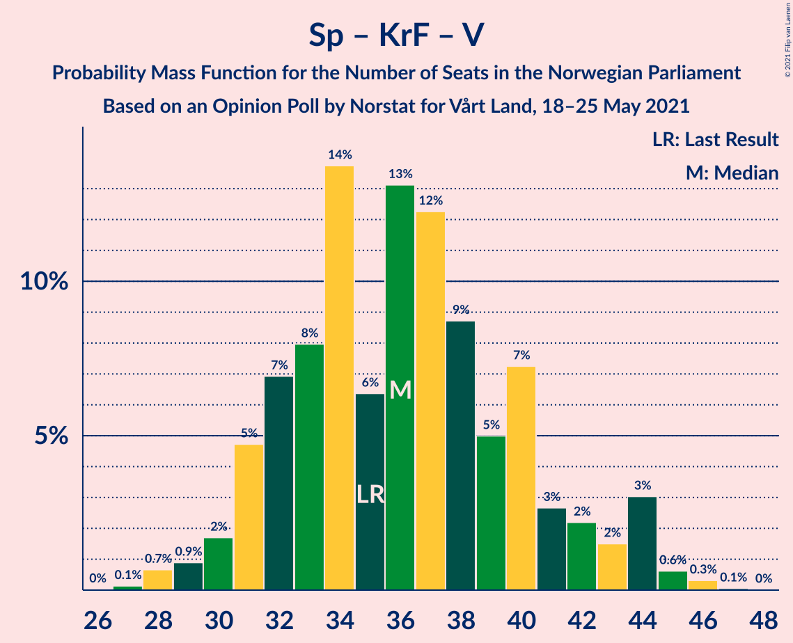

| Number of Seats | Probability | Accumulated | Special Marks |
|:---------------:|:-----------:|:-----------:|:-------------:|
| 26 | 0% | 100% |  |
| 27 | 0.1% | 99.9% |  |
| 28 | 0.7% | 99.8% |  |
| 29 | 0.9% | 99.1% |  |
| 30 | 2% | 98% |  |
| 31 | 5% | 97% |  |
| 32 | 7% | 92% |  |
| 33 | 8% | 85% |  |
| 34 | 14% | 77% |  |
| 35 | 6% | 63% | Last Result |
| 36 | 13% | 57% | Median |
| 37 | 12% | 44% |  |
| 38 | 9% | 31% |  |
| 39 | 5% | 23% |  |
| 40 | 7% | 18% |  |
| 41 | 3% | 10% |  |
| 42 | 2% | 8% |  |
| 43 | 2% | 6% |  |
| 44 | 3% | 4% |  |
| 45 | 0.6% | 1.0% |  |
| 46 | 0.3% | 0.4% |  |
| 47 | 0.1% | 0.1% |  |
| 48 | 0% | 0% |  |

## Technical Information

### Opinion Poll

+ **Polling firm:** Norstat
+ **Commissioner(s):** Vårt Land
+ **Fieldwork period:** 18–25 May 2021

### Calculations

+ **Sample size:** 967
+ **Simulations done:** 1,048,576
+ **Error estimate:** 1.66%

