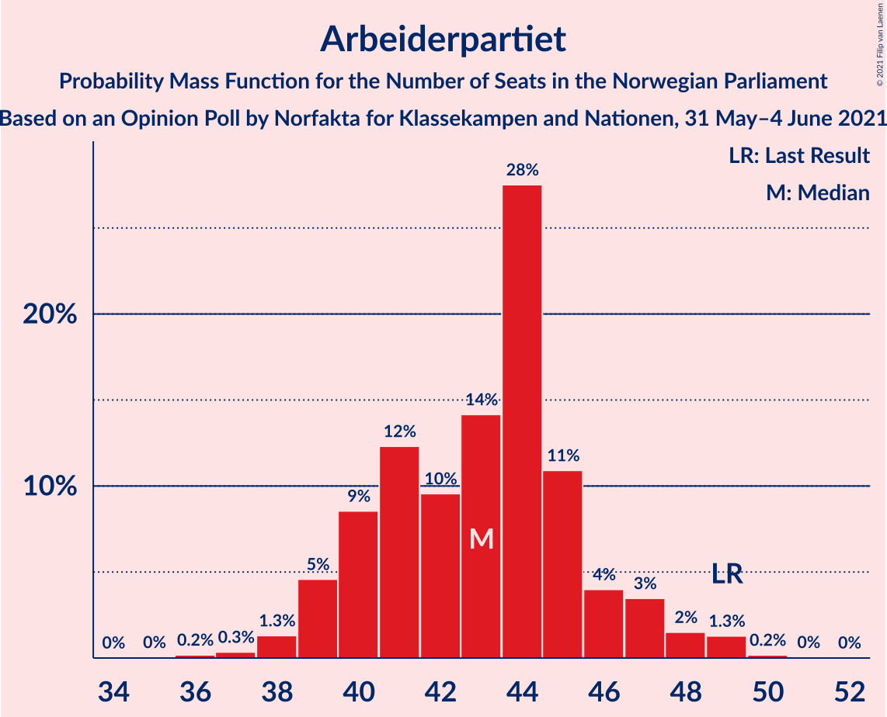
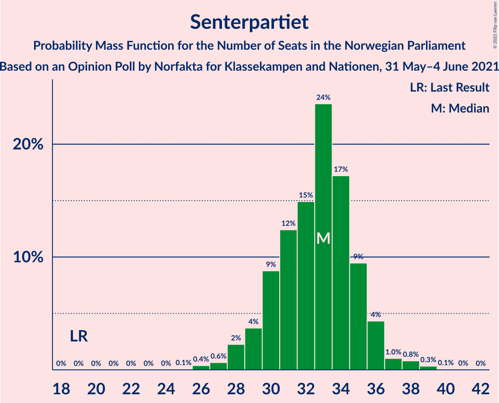
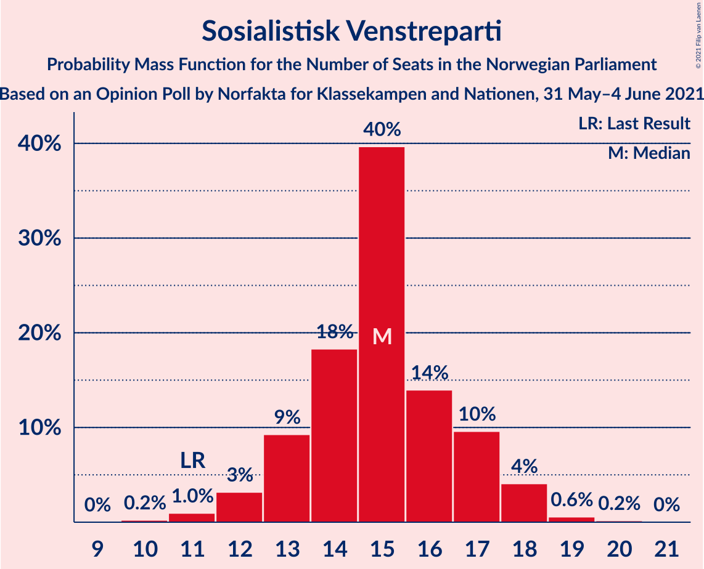
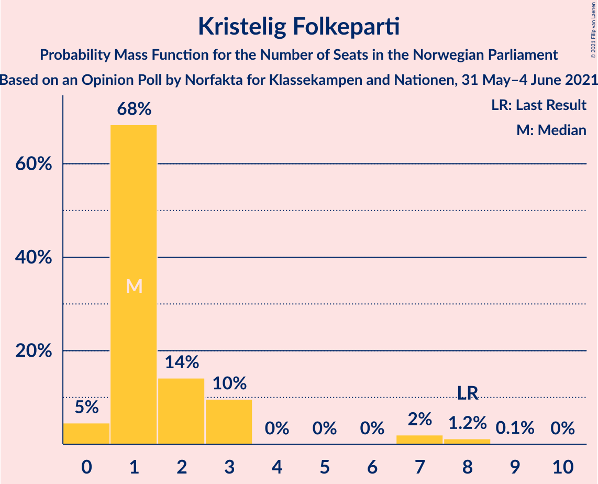
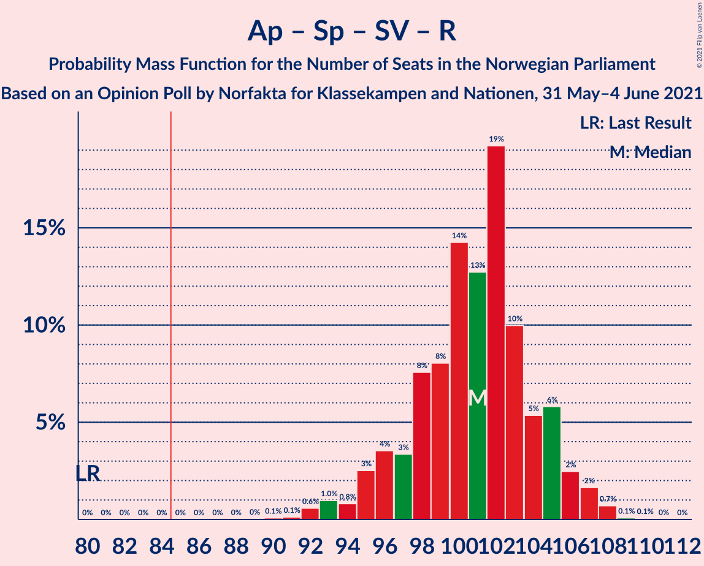
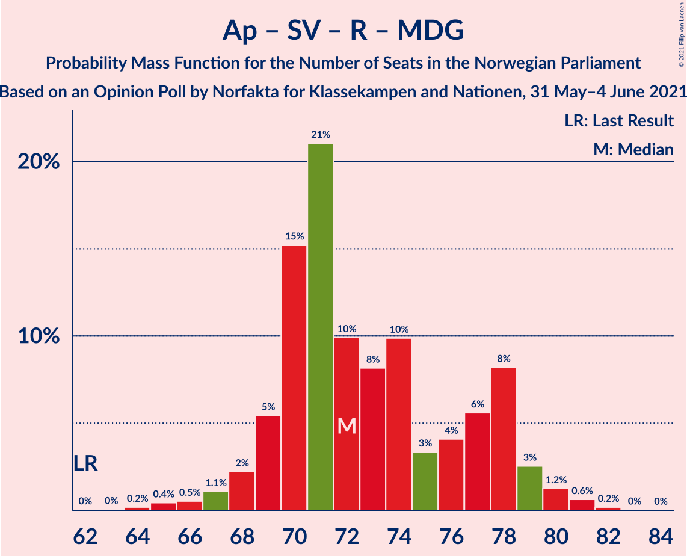
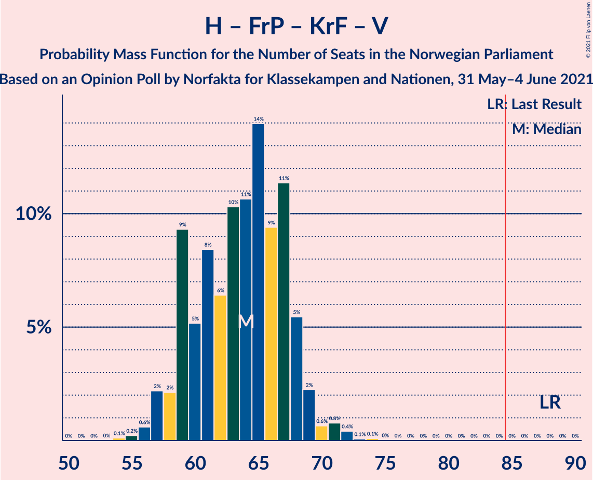
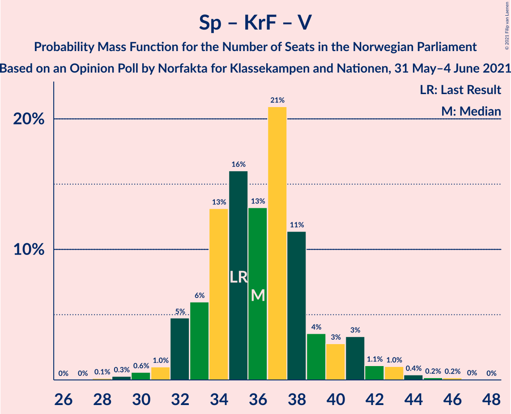

# Opinion Poll by Norfakta for Klassekampen and Nationen, 31 May–4 June 2021

<a href="#voting-intentions">Voting Intentions</a> | <a href="#seats">Seats</a> | <a href="#coalitions">Coalitions</a> | <a href="#technical-information">Technical Information</a>

## Voting Intentions

### Confidence Intervals

| Party | Last Result | Poll Result | 80% Confidence Interval | 90% Confidence Interval | 95% Confidence Interval | 99% Confidence Interval |
|:-----:|:-----------:|:-----------:|:-----------------------:|:-----------------------:|:-----------------------:|:-----------------------:|
| Arbeiderpartiet | 27.4% | 23.5% | 21.8–25.3% |21.4–25.8% |21.0–26.2% |20.2–27.1% |
| Høyre | 25.0% | 22.3% | 20.7–24.1% |20.2–24.6% |19.8–25.0% |19.1–25.8% |
| Senterpartiet | 10.3% | 17.6% | 16.1–19.2% |15.7–19.7% |15.4–20.1% |14.7–20.9% |
| Fremskrittspartiet | 15.2% | 10.9% | 9.7–12.3% |9.4–12.7% |9.1–13.0% |8.6–13.7% |
| Sosialistisk Venstreparti | 6.0% | 8.1% | 7.1–9.3% |6.8–9.7% |6.6–10.0% |6.1–10.6% |
| Rødt | 2.4% | 5.6% | 4.8–6.6% |4.5–7.0% |4.3–7.2% |4.0–7.7% |
| Miljøpartiet De Grønne | 3.2% | 4.0% | 3.3–4.9% |3.1–5.2% |2.9–5.4% |2.7–5.9% |
| Venstre | 4.4% | 2.9% | 2.3–3.7% |2.2–3.9% |2.0–4.1% |1.8–4.6% |
| Kristelig Folkeparti | 4.2% | 2.9% | 2.3–3.7% |2.2–3.9% |2.0–4.1% |1.8–4.6% |

*Note:* The poll result column reflects the actual value used in the calculations. Published results may vary slightly, and in addition be rounded to fewer digits.

## Seats

### Confidence Intervals

| Party | Last Result | Median | 80% Confidence Interval | 90% Confidence Interval | 95% Confidence Interval | 99% Confidence Interval |
|:-----:|:-----------:|:------:|:-----------------------:|:-----------------------:|:-----------------------:|:-----------------------:|
| <a href="#arbeiderpartiet">Arbeiderpartiet</a> | 49 | 43 | 40–46 |39–47 |39–48 |37–49 |
| <a href="#høyre">Høyre</a> | 45 | 41 | 37–43 |36–44 |36–45 |34–47 |
| <a href="#senterpartiet">Senterpartiet</a> | 19 | 33 | 30–35 |29–36 |28–36 |27–38 |
| <a href="#fremskrittspartiet">Fremskrittspartiet</a> | 27 | 20 | 17–22 |17–23 |16–23 |15–24 |
| <a href="#sosialistisk-venstreparti">Sosialistisk Venstreparti</a> | 11 | 15 | 13–17 |13–17 |12–18 |11–19 |
| <a href="#rødt">Rødt</a> | 1 | 10 | 9–12 |8–12 |8–13 |2–14 |
| <a href="#miljøpartiet-de-grønne">Miljøpartiet De Grønne</a> | 1 | 3 | 2–8 |2–9 |1–9 |1–10 |
| <a href="#venstre">Venstre</a> | 8 | 2 | 1–2 |1–2 |1–7 |0–8 |
| <a href="#kristelig-folkeparti">Kristelig Folkeparti</a> | 8 | 1 | 1–3 |1–3 |0–7 |0–8 |

### Arbeiderpartiet

*For a full overview of the results for this party, see the [Arbeiderpartiet](party-arbeiderpartiet.html) page.*

| Number of Seats | Probability | Accumulated | Special Marks |
|:---------------:|:-----------:|:-----------:|:-------------:|
| 35 | 0% | 100% |  |
| 36 | 0.2% | 99.9% |  |
| 37 | 0.3% | 99.7% |  |
| 38 | 1.3% | 99.4% |  |
| 39 | 5% | 98% |  |
| 40 | 9% | 94% |  |
| 41 | 12% | 85% |  |
| 42 | 10% | 73% |  |
| 43 | 14% | 63% | Median |
| 44 | 28% | 49% |  |
| 45 | 11% | 21% |  |
| 46 | 4% | 11% |  |
| 47 | 3% | 7% |  |
| 48 | 2% | 3% |  |
| 49 | 1.3% | 2% | Last Result |
| 50 | 0.2% | 0.3% |  |
| 51 | 0% | 0.1% |  |
| 52 | 0% | 0% |  |

### Høyre

*For a full overview of the results for this party, see the [Høyre](party-høyre.html) page.*

| Number of Seats | Probability | Accumulated | Special Marks |
|:---------------:|:-----------:|:-----------:|:-------------:|
| 33 | 0.2% | 100% |  |
| 34 | 0.5% | 99.8% |  |
| 35 | 2% | 99.3% |  |
| 36 | 4% | 98% |  |
| 37 | 9% | 94% |  |
| 38 | 10% | 84% |  |
| 39 | 11% | 75% |  |
| 40 | 11% | 64% |  |
| 41 | 13% | 53% | Median |
| 42 | 13% | 39% |  |
| 43 | 17% | 26% |  |
| 44 | 5% | 9% |  |
| 45 | 2% | 4% | Last Result |
| 46 | 1.1% | 2% |  |
| 47 | 0.5% | 0.8% |  |
| 48 | 0.1% | 0.3% |  |
| 49 | 0.1% | 0.1% |  |
| 50 | 0% | 0% |  |

### Senterpartiet

*For a full overview of the results for this party, see the [Senterpartiet](party-senterpartiet.html) page.*

| Number of Seats | Probability | Accumulated | Special Marks |
|:---------------:|:-----------:|:-----------:|:-------------:|
| 19 | 0% | 100% | Last Result |
| 20 | 0% | 100% |  |
| 21 | 0% | 100% |  |
| 22 | 0% | 100% |  |
| 23 | 0% | 100% |  |
| 24 | 0% | 100% |  |
| 25 | 0.1% | 100% |  |
| 26 | 0.4% | 99.9% |  |
| 27 | 0.6% | 99.5% |  |
| 28 | 2% | 98.9% |  |
| 29 | 4% | 97% |  |
| 30 | 9% | 93% |  |
| 31 | 12% | 84% |  |
| 32 | 15% | 72% |  |
| 33 | 24% | 57% | Median |
| 34 | 17% | 33% |  |
| 35 | 9% | 16% |  |
| 36 | 4% | 7% |  |
| 37 | 1.0% | 2% |  |
| 38 | 0.8% | 1.2% |  |
| 39 | 0.3% | 0.4% |  |
| 40 | 0.1% | 0.1% |  |
| 41 | 0% | 0% |  |

### Fremskrittspartiet

*For a full overview of the results for this party, see the [Fremskrittspartiet](party-fremskrittspartiet.html) page.*

| Number of Seats | Probability | Accumulated | Special Marks |
|:---------------:|:-----------:|:-----------:|:-------------:|
| 14 | 0.1% | 100% |  |
| 15 | 0.7% | 99.8% |  |
| 16 | 3% | 99.2% |  |
| 17 | 8% | 96% |  |
| 18 | 12% | 88% |  |
| 19 | 24% | 76% |  |
| 20 | 19% | 51% | Median |
| 21 | 19% | 32% |  |
| 22 | 8% | 13% |  |
| 23 | 4% | 5% |  |
| 24 | 1.2% | 2% |  |
| 25 | 0.3% | 0.5% |  |
| 26 | 0.1% | 0.2% |  |
| 27 | 0% | 0% | Last Result |

### Sosialistisk Venstreparti

*For a full overview of the results for this party, see the [Sosialistisk Venstreparti](party-sosialistiskvenstreparti.html) page.*

| Number of Seats | Probability | Accumulated | Special Marks |
|:---------------:|:-----------:|:-----------:|:-------------:|
| 10 | 0.2% | 100% |  |
| 11 | 1.0% | 99.8% | Last Result |
| 12 | 3% | 98.8% |  |
| 13 | 9% | 96% |  |
| 14 | 18% | 86% |  |
| 15 | 40% | 68% | Median |
| 16 | 14% | 28% |  |
| 17 | 10% | 14% |  |
| 18 | 4% | 5% |  |
| 19 | 0.6% | 0.8% |  |
| 20 | 0.2% | 0.2% |  |
| 21 | 0% | 0% |  |

### Rødt

*For a full overview of the results for this party, see the [Rødt](party-rødt.html) page.*

| Number of Seats | Probability | Accumulated | Special Marks |
|:---------------:|:-----------:|:-----------:|:-------------:|
| 1 | 0% | 100% | Last Result |
| 2 | 0.6% | 100% |  |
| 3 | 0% | 99.4% |  |
| 4 | 0% | 99.4% |  |
| 5 | 0% | 99.4% |  |
| 6 | 0% | 99.4% |  |
| 7 | 0.7% | 99.4% |  |
| 8 | 8% | 98.7% |  |
| 9 | 20% | 91% |  |
| 10 | 25% | 71% | Median |
| 11 | 29% | 46% |  |
| 12 | 13% | 17% |  |
| 13 | 3% | 4% |  |
| 14 | 0.8% | 1.0% |  |
| 15 | 0.2% | 0.2% |  |
| 16 | 0% | 0% |  |

### Miljøpartiet De Grønne

*For a full overview of the results for this party, see the [Miljøpartiet De Grønne](party-miljøpartietdegrønne.html) page.*

| Number of Seats | Probability | Accumulated | Special Marks |
|:---------------:|:-----------:|:-----------:|:-------------:|
| 1 | 5% | 100% | Last Result |
| 2 | 45% | 95% |  |
| 3 | 10% | 50% | Median |
| 4 | 0.1% | 40% |  |
| 5 | 0% | 40% |  |
| 6 | 0% | 40% |  |
| 7 | 9% | 40% |  |
| 8 | 21% | 31% |  |
| 9 | 7% | 10% |  |
| 10 | 2% | 2% |  |
| 11 | 0.3% | 0.4% |  |
| 12 | 0% | 0% |  |

### Venstre

*For a full overview of the results for this party, see the [Venstre](party-venstre.html) page.*

| Number of Seats | Probability | Accumulated | Special Marks |
|:---------------:|:-----------:|:-----------:|:-------------:|
| 0 | 1.2% | 100% |  |
| 1 | 14% | 98.8% |  |
| 2 | 81% | 85% | Median |
| 3 | 0% | 4% |  |
| 4 | 0% | 4% |  |
| 5 | 0% | 4% |  |
| 6 | 0% | 4% |  |
| 7 | 3% | 4% |  |
| 8 | 0.6% | 0.7% | Last Result |
| 9 | 0.1% | 0.1% |  |
| 10 | 0% | 0% |  |

### Kristelig Folkeparti

*For a full overview of the results for this party, see the [Kristelig Folkeparti](party-kristeligfolkeparti.html) page.*

| Number of Seats | Probability | Accumulated | Special Marks |
|:---------------:|:-----------:|:-----------:|:-------------:|
| 0 | 5% | 100% |  |
| 1 | 68% | 95% | Median |
| 2 | 14% | 27% |  |
| 3 | 10% | 13% |  |
| 4 | 0% | 3% |  |
| 5 | 0% | 3% |  |
| 6 | 0% | 3% |  |
| 7 | 2% | 3% |  |
| 8 | 1.2% | 1.3% | Last Result |
| 9 | 0.1% | 0.1% |  |
| 10 | 0% | 0% |  |

## Coalitions

### Confidence Intervals

| Coalition | Last Result | Median | Majority? | 80% Confidence Interval | 90% Confidence Interval | 95% Confidence Interval | 99% Confidence Interval |
|:---------:|:-----------:|:------:|:---------:|:-----------------------:|:-----------------------:|:-----------------------:|:-----------------------:|
| Arbeiderpartiet – Senterpartiet – Sosialistisk Venstreparti – Rødt – Miljøpartiet De Grønne | 81 | 105 | 100% | 102–110 | 101–111 | 100–112 | 97–113 |
| Arbeiderpartiet – Senterpartiet – Sosialistisk Venstreparti – Rødt | 80 | 101 | 100% | 97–105 | 95–105 | 94–107 | 92–108 |
| Arbeiderpartiet – Senterpartiet – Sosialistisk Venstreparti – Miljøpartiet De Grønne – Kristelig Folkeparti | 88 | 97 | 100% | 92–101 | 92–102 | 91–104 | 89–105 |
| Arbeiderpartiet – Senterpartiet – Sosialistisk Venstreparti – Miljøpartiet De Grønne | 80 | 95 | 99.9% | 91–99 | 90–101 | 89–102 | 87–103 |
| Høyre – Senterpartiet – Fremskrittspartiet – Kristelig Folkeparti – Venstre | 107 | 97 | 100% | 91–99 | 91–100 | 90–101 | 88–104 |
| Arbeiderpartiet – Senterpartiet – Sosialistisk Venstreparti | 79 | 91 | 97% | 87–94 | 86–95 | 84–96 | 82–98 |
| Arbeiderpartiet – Senterpartiet – Miljøpartiet De Grønne – Kristelig Folkeparti | 77 | 82 | 23% | 77–87 | 76–88 | 76–89 | 74–91 |
| Arbeiderpartiet – Senterpartiet – Kristelig Folkeparti | 76 | 77 | 1.3% | 74–81 | 72–82 | 71–83 | 69–85 |
| Arbeiderpartiet – Senterpartiet | 68 | 76 | 0.1% | 72–79 | 71–80 | 69–81 | 68–83 |
| Arbeiderpartiet – Sosialistisk Venstreparti – Rødt – Miljøpartiet De Grønne | 62 | 72 | 0% | 70–78 | 69–78 | 68–79 | 65–81 |
| Høyre – Fremskrittspartiet – Miljøpartiet De Grønne – Kristelig Folkeparti – Venstre | 89 | 68 | 0% | 64–72 | 63–74 | 62–75 | 61–77 |
| Høyre – Fremskrittspartiet – Kristelig Folkeparti – Venstre | 88 | 64 | 0% | 59–67 | 58–68 | 57–69 | 56–72 |
| Høyre – Fremskrittspartiet – Venstre | 80 | 63 | 0% | 58–66 | 57–67 | 56–68 | 54–70 |
| Høyre – Fremskrittspartiet | 72 | 61 | 0% | 56–64 | 55–65 | 54–66 | 52–68 |
| Arbeiderpartiet – Sosialistisk Venstreparti | 60 | 58 | 0% | 55–61 | 53–61 | 53–63 | 51–65 |
| Høyre – Kristelig Folkeparti – Venstre | 61 | 44 | 0% | 40–47 | 39–48 | 39–49 | 38–52 |
| Senterpartiet – Kristelig Folkeparti – Venstre | 35 | 36 | 0% | 33–39 | 32–41 | 32–42 | 30–44 |

### Arbeiderpartiet – Senterpartiet – Sosialistisk Venstreparti – Rødt – Miljøpartiet De Grønne

| Number of Seats | Probability | Accumulated | Special Marks |
|:---------------:|:-----------:|:-----------:|:-------------:|
| 81 | 0% | 100% | Last Result |
| 82 | 0% | 100% |  |
| 83 | 0% | 100% |  |
| 84 | 0% | 100% |  |
| 85 | 0% | 100% | Majority |
| 86 | 0% | 100% |  |
| 87 | 0% | 100% |  |
| 88 | 0% | 100% |  |
| 89 | 0% | 100% |  |
| 90 | 0% | 100% |  |
| 91 | 0% | 100% |  |
| 92 | 0% | 100% |  |
| 93 | 0% | 100% |  |
| 94 | 0% | 100% |  |
| 95 | 0.1% | 100% |  |
| 96 | 0.1% | 99.9% |  |
| 97 | 0.4% | 99.8% |  |
| 98 | 0.8% | 99.4% |  |
| 99 | 0.7% | 98.6% |  |
| 100 | 2% | 98% |  |
| 101 | 5% | 96% |  |
| 102 | 11% | 90% |  |
| 103 | 9% | 79% |  |
| 104 | 14% | 69% | Median |
| 105 | 11% | 55% |  |
| 106 | 10% | 45% |  |
| 107 | 6% | 35% |  |
| 108 | 8% | 28% |  |
| 109 | 5% | 20% |  |
| 110 | 9% | 15% |  |
| 111 | 2% | 5% |  |
| 112 | 2% | 3% |  |
| 113 | 0.6% | 0.9% |  |
| 114 | 0.2% | 0.3% |  |
| 115 | 0.1% | 0.1% |  |
| 116 | 0% | 0% |  |

### Arbeiderpartiet – Senterpartiet – Sosialistisk Venstreparti – Rødt

| Number of Seats | Probability | Accumulated | Special Marks |
|:---------------:|:-----------:|:-----------:|:-------------:|
| 80 | 0% | 100% | Last Result |
| 81 | 0% | 100% |  |
| 82 | 0% | 100% |  |
| 83 | 0% | 100% |  |
| 84 | 0% | 100% |  |
| 85 | 0% | 100% | Majority |
| 86 | 0% | 100% |  |
| 87 | 0% | 100% |  |
| 88 | 0% | 100% |  |
| 89 | 0% | 100% |  |
| 90 | 0.1% | 100% |  |
| 91 | 0.1% | 99.9% |  |
| 92 | 0.6% | 99.8% |  |
| 93 | 1.0% | 99.2% |  |
| 94 | 0.8% | 98% |  |
| 95 | 3% | 97% |  |
| 96 | 4% | 95% |  |
| 97 | 3% | 91% |  |
| 98 | 8% | 88% |  |
| 99 | 8% | 80% |  |
| 100 | 14% | 72% |  |
| 101 | 13% | 58% | Median |
| 102 | 19% | 45% |  |
| 103 | 10% | 26% |  |
| 104 | 5% | 16% |  |
| 105 | 6% | 11% |  |
| 106 | 2% | 5% |  |
| 107 | 2% | 3% |  |
| 108 | 0.7% | 0.9% |  |
| 109 | 0.1% | 0.2% |  |
| 110 | 0.1% | 0.1% |  |
| 111 | 0% | 0% |  |

### Arbeiderpartiet – Senterpartiet – Sosialistisk Venstreparti – Miljøpartiet De Grønne – Kristelig Folkeparti

| Number of Seats | Probability | Accumulated | Special Marks |
|:---------------:|:-----------:|:-----------:|:-------------:|
| 86 | 0.1% | 100% |  |
| 87 | 0.2% | 99.9% |  |
| 88 | 0.2% | 99.7% | Last Result |
| 89 | 0.2% | 99.5% |  |
| 90 | 1.1% | 99.3% |  |
| 91 | 2% | 98% |  |
| 92 | 15% | 96% |  |
| 93 | 5% | 80% |  |
| 94 | 7% | 76% |  |
| 95 | 8% | 69% | Median |
| 96 | 7% | 61% |  |
| 97 | 9% | 54% |  |
| 98 | 15% | 45% |  |
| 99 | 7% | 30% |  |
| 100 | 9% | 23% |  |
| 101 | 6% | 15% |  |
| 102 | 4% | 8% |  |
| 103 | 2% | 5% |  |
| 104 | 2% | 3% |  |
| 105 | 0.5% | 0.9% |  |
| 106 | 0.2% | 0.4% |  |
| 107 | 0.1% | 0.2% |  |
| 108 | 0.1% | 0.1% |  |
| 109 | 0% | 0% |  |

### Arbeiderpartiet – Senterpartiet – Sosialistisk Venstreparti – Miljøpartiet De Grønne

| Number of Seats | Probability | Accumulated | Special Marks |
|:---------------:|:-----------:|:-----------:|:-------------:|
| 80 | 0% | 100% | Last Result |
| 81 | 0% | 100% |  |
| 82 | 0% | 100% |  |
| 83 | 0% | 100% |  |
| 84 | 0% | 100% |  |
| 85 | 0.1% | 99.9% | Majority |
| 86 | 0.3% | 99.9% |  |
| 87 | 0.3% | 99.6% |  |
| 88 | 0.6% | 99.3% |  |
| 89 | 1.2% | 98.7% |  |
| 90 | 4% | 97% |  |
| 91 | 16% | 94% |  |
| 92 | 6% | 78% |  |
| 93 | 8% | 72% |  |
| 94 | 9% | 65% | Median |
| 95 | 7% | 55% |  |
| 96 | 11% | 49% |  |
| 97 | 12% | 38% |  |
| 98 | 6% | 25% |  |
| 99 | 10% | 19% |  |
| 100 | 3% | 10% |  |
| 101 | 3% | 6% |  |
| 102 | 1.0% | 3% |  |
| 103 | 2% | 2% |  |
| 104 | 0.3% | 0.4% |  |
| 105 | 0.1% | 0.1% |  |
| 106 | 0% | 0% |  |

### Høyre – Senterpartiet – Fremskrittspartiet – Kristelig Folkeparti – Venstre

| Number of Seats | Probability | Accumulated | Special Marks |
|:---------------:|:-----------:|:-----------:|:-------------:|
| 87 | 0.2% | 100% |  |
| 88 | 0.6% | 99.8% |  |
| 89 | 1.3% | 99.2% |  |
| 90 | 3% | 98% |  |
| 91 | 8% | 95% |  |
| 92 | 6% | 87% |  |
| 93 | 4% | 82% |  |
| 94 | 3% | 77% |  |
| 95 | 10% | 74% |  |
| 96 | 8% | 64% |  |
| 97 | 10% | 56% | Median |
| 98 | 21% | 46% |  |
| 99 | 15% | 25% |  |
| 100 | 5% | 10% |  |
| 101 | 2% | 4% |  |
| 102 | 1.1% | 2% |  |
| 103 | 0.5% | 1.2% |  |
| 104 | 0.4% | 0.7% |  |
| 105 | 0.2% | 0.3% |  |
| 106 | 0% | 0.1% |  |
| 107 | 0% | 0% | Last Result |

### Arbeiderpartiet – Senterpartiet – Sosialistisk Venstreparti

| Number of Seats | Probability | Accumulated | Special Marks |
|:---------------:|:-----------:|:-----------:|:-------------:|
| 79 | 0% | 100% | Last Result |
| 80 | 0% | 100% |  |
| 81 | 0.1% | 99.9% |  |
| 82 | 0.6% | 99.8% |  |
| 83 | 0.7% | 99.2% |  |
| 84 | 1.2% | 98.6% |  |
| 85 | 2% | 97% | Majority |
| 86 | 5% | 95% |  |
| 87 | 2% | 90% |  |
| 88 | 6% | 88% |  |
| 89 | 21% | 82% |  |
| 90 | 9% | 60% |  |
| 91 | 15% | 52% | Median |
| 92 | 9% | 37% |  |
| 93 | 9% | 28% |  |
| 94 | 11% | 19% |  |
| 95 | 4% | 8% |  |
| 96 | 2% | 4% |  |
| 97 | 1.2% | 2% |  |
| 98 | 0.4% | 0.6% |  |
| 99 | 0.1% | 0.1% |  |
| 100 | 0% | 0.1% |  |
| 101 | 0% | 0% |  |

### Arbeiderpartiet – Senterpartiet – Miljøpartiet De Grønne – Kristelig Folkeparti

| Number of Seats | Probability | Accumulated | Special Marks |
|:---------------:|:-----------:|:-----------:|:-------------:|
| 70 | 0% | 100% |  |
| 71 | 0.1% | 99.9% |  |
| 72 | 0.2% | 99.9% |  |
| 73 | 0.2% | 99.7% |  |
| 74 | 0.9% | 99.5% |  |
| 75 | 0.7% | 98.6% |  |
| 76 | 3% | 98% |  |
| 77 | 15% | 94% | Last Result |
| 78 | 5% | 79% |  |
| 79 | 4% | 74% |  |
| 80 | 6% | 70% | Median |
| 81 | 9% | 63% |  |
| 82 | 15% | 54% |  |
| 83 | 7% | 40% |  |
| 84 | 10% | 33% |  |
| 85 | 8% | 23% | Majority |
| 86 | 5% | 15% |  |
| 87 | 3% | 10% |  |
| 88 | 3% | 7% |  |
| 89 | 3% | 4% |  |
| 90 | 0.6% | 1.3% |  |
| 91 | 0.3% | 0.8% |  |
| 92 | 0.3% | 0.5% |  |
| 93 | 0.1% | 0.2% |  |
| 94 | 0.1% | 0.1% |  |
| 95 | 0% | 0% |  |

### Arbeiderpartiet – Senterpartiet – Kristelig Folkeparti

| Number of Seats | Probability | Accumulated | Special Marks |
|:---------------:|:-----------:|:-----------:|:-------------:|
| 67 | 0% | 100% |  |
| 68 | 0.1% | 99.9% |  |
| 69 | 0.4% | 99.8% |  |
| 70 | 1.5% | 99.4% |  |
| 71 | 1.0% | 98% |  |
| 72 | 2% | 97% |  |
| 73 | 3% | 94% |  |
| 74 | 8% | 91% |  |
| 75 | 17% | 83% |  |
| 76 | 11% | 66% | Last Result |
| 77 | 12% | 55% | Median |
| 78 | 6% | 43% |  |
| 79 | 16% | 37% |  |
| 80 | 8% | 22% |  |
| 81 | 4% | 13% |  |
| 82 | 5% | 9% |  |
| 83 | 2% | 4% |  |
| 84 | 0.8% | 2% |  |
| 85 | 1.0% | 1.3% | Majority |
| 86 | 0.2% | 0.3% |  |
| 87 | 0.1% | 0.1% |  |
| 88 | 0% | 0.1% |  |
| 89 | 0% | 0% |  |

### Arbeiderpartiet – Senterpartiet

| Number of Seats | Probability | Accumulated | Special Marks |
|:---------------:|:-----------:|:-----------:|:-------------:|
| 66 | 0.1% | 100% |  |
| 67 | 0.3% | 99.9% |  |
| 68 | 0.7% | 99.6% | Last Result |
| 69 | 2% | 98.9% |  |
| 70 | 2% | 97% |  |
| 71 | 3% | 96% |  |
| 72 | 7% | 93% |  |
| 73 | 7% | 86% |  |
| 74 | 18% | 80% |  |
| 75 | 11% | 62% |  |
| 76 | 11% | 51% | Median |
| 77 | 11% | 40% |  |
| 78 | 13% | 29% |  |
| 79 | 9% | 17% |  |
| 80 | 3% | 7% |  |
| 81 | 3% | 5% |  |
| 82 | 1.0% | 2% |  |
| 83 | 0.5% | 0.7% |  |
| 84 | 0.1% | 0.2% |  |
| 85 | 0.1% | 0.1% | Majority |
| 86 | 0% | 0% |  |

### Arbeiderpartiet – Sosialistisk Venstreparti – Rødt – Miljøpartiet De Grønne

| Number of Seats | Probability | Accumulated | Special Marks |
|:---------------:|:-----------:|:-----------:|:-------------:|
| 62 | 0% | 100% | Last Result |
| 63 | 0% | 100% |  |
| 64 | 0.2% | 99.9% |  |
| 65 | 0.4% | 99.7% |  |
| 66 | 0.5% | 99.3% |  |
| 67 | 1.1% | 98.8% |  |
| 68 | 2% | 98% |  |
| 69 | 5% | 95% |  |
| 70 | 15% | 90% |  |
| 71 | 21% | 75% | Median |
| 72 | 10% | 54% |  |
| 73 | 8% | 44% |  |
| 74 | 10% | 36% |  |
| 75 | 3% | 26% |  |
| 76 | 4% | 22% |  |
| 77 | 6% | 18% |  |
| 78 | 8% | 13% |  |
| 79 | 3% | 5% |  |
| 80 | 1.2% | 2% |  |
| 81 | 0.6% | 0.8% |  |
| 82 | 0.2% | 0.2% |  |
| 83 | 0% | 0% |  |

### Høyre – Fremskrittspartiet – Miljøpartiet De Grønne – Kristelig Folkeparti – Venstre

| Number of Seats | Probability | Accumulated | Special Marks |
|:---------------:|:-----------:|:-----------:|:-------------:|
| 59 | 0.1% | 100% |  |
| 60 | 0.1% | 99.9% |  |
| 61 | 0.7% | 99.8% |  |
| 62 | 2% | 99.1% |  |
| 63 | 2% | 97% |  |
| 64 | 6% | 95% |  |
| 65 | 5% | 89% |  |
| 66 | 10% | 84% |  |
| 67 | 19% | 74% | Median |
| 68 | 13% | 55% |  |
| 69 | 14% | 42% |  |
| 70 | 8% | 28% |  |
| 71 | 8% | 20% |  |
| 72 | 3% | 12% |  |
| 73 | 4% | 9% |  |
| 74 | 3% | 5% |  |
| 75 | 0.8% | 3% |  |
| 76 | 1.0% | 2% |  |
| 77 | 0.6% | 0.8% |  |
| 78 | 0.1% | 0.2% |  |
| 79 | 0.1% | 0.1% |  |
| 80 | 0% | 0% |  |
| 81 | 0% | 0% |  |
| 82 | 0% | 0% |  |
| 83 | 0% | 0% |  |
| 84 | 0% | 0% |  |
| 85 | 0% | 0% | Majority |
| 86 | 0% | 0% |  |
| 87 | 0% | 0% |  |
| 88 | 0% | 0% |  |
| 89 | 0% | 0% | Last Result |

### Høyre – Fremskrittspartiet – Kristelig Folkeparti – Venstre

| Number of Seats | Probability | Accumulated | Special Marks |
|:---------------:|:-----------:|:-----------:|:-------------:|
| 54 | 0.1% | 100% |  |
| 55 | 0.2% | 99.9% |  |
| 56 | 0.6% | 99.6% |  |
| 57 | 2% | 99.1% |  |
| 58 | 2% | 97% |  |
| 59 | 9% | 95% |  |
| 60 | 5% | 85% |  |
| 61 | 8% | 80% |  |
| 62 | 6% | 72% |  |
| 63 | 10% | 65% |  |
| 64 | 11% | 55% | Median |
| 65 | 14% | 44% |  |
| 66 | 9% | 30% |  |
| 67 | 11% | 21% |  |
| 68 | 5% | 10% |  |
| 69 | 2% | 4% |  |
| 70 | 0.6% | 2% |  |
| 71 | 0.8% | 1.4% |  |
| 72 | 0.4% | 0.6% |  |
| 73 | 0.1% | 0.2% |  |
| 74 | 0.1% | 0.1% |  |
| 75 | 0% | 0% |  |
| 76 | 0% | 0% |  |
| 77 | 0% | 0% |  |
| 78 | 0% | 0% |  |
| 79 | 0% | 0% |  |
| 80 | 0% | 0% |  |
| 81 | 0% | 0% |  |
| 82 | 0% | 0% |  |
| 83 | 0% | 0% |  |
| 84 | 0% | 0% |  |
| 85 | 0% | 0% | Majority |
| 86 | 0% | 0% |  |
| 87 | 0% | 0% |  |
| 88 | 0% | 0% | Last Result |

### Høyre – Fremskrittspartiet – Venstre

| Number of Seats | Probability | Accumulated | Special Marks |
|:---------------:|:-----------:|:-----------:|:-------------:|
| 51 | 0.1% | 100% |  |
| 52 | 0% | 99.9% |  |
| 53 | 0.3% | 99.9% |  |
| 54 | 0.2% | 99.6% |  |
| 55 | 0.7% | 99.4% |  |
| 56 | 3% | 98.6% |  |
| 57 | 3% | 95% |  |
| 58 | 12% | 93% |  |
| 59 | 5% | 80% |  |
| 60 | 8% | 75% |  |
| 61 | 7% | 67% |  |
| 62 | 8% | 60% |  |
| 63 | 14% | 52% | Median |
| 64 | 11% | 38% |  |
| 65 | 11% | 27% |  |
| 66 | 9% | 16% |  |
| 67 | 3% | 6% |  |
| 68 | 2% | 4% |  |
| 69 | 0.6% | 1.5% |  |
| 70 | 0.6% | 0.9% |  |
| 71 | 0.2% | 0.3% |  |
| 72 | 0% | 0.1% |  |
| 73 | 0.1% | 0.1% |  |
| 74 | 0% | 0% |  |
| 75 | 0% | 0% |  |
| 76 | 0% | 0% |  |
| 77 | 0% | 0% |  |
| 78 | 0% | 0% |  |
| 79 | 0% | 0% |  |
| 80 | 0% | 0% | Last Result |

### Høyre – Fremskrittspartiet

| Number of Seats | Probability | Accumulated | Special Marks |
|:---------------:|:-----------:|:-----------:|:-------------:|
| 50 | 0.1% | 100% |  |
| 51 | 0.4% | 99.9% |  |
| 52 | 0.3% | 99.5% |  |
| 53 | 0.9% | 99.2% |  |
| 54 | 3% | 98% |  |
| 55 | 2% | 95% |  |
| 56 | 10% | 93% |  |
| 57 | 7% | 82% |  |
| 58 | 9% | 75% |  |
| 59 | 7% | 67% |  |
| 60 | 7% | 59% |  |
| 61 | 16% | 52% | Median |
| 62 | 8% | 36% |  |
| 63 | 13% | 28% |  |
| 64 | 9% | 15% |  |
| 65 | 3% | 6% |  |
| 66 | 2% | 3% |  |
| 67 | 0.6% | 1.3% |  |
| 68 | 0.6% | 0.7% |  |
| 69 | 0.1% | 0.2% |  |
| 70 | 0% | 0.1% |  |
| 71 | 0% | 0% |  |
| 72 | 0% | 0% | Last Result |

### Arbeiderpartiet – Sosialistisk Venstreparti

| Number of Seats | Probability | Accumulated | Special Marks |
|:---------------:|:-----------:|:-----------:|:-------------:|
| 49 | 0.1% | 100% |  |
| 50 | 0.2% | 99.8% |  |
| 51 | 0.4% | 99.6% |  |
| 52 | 1.4% | 99.2% |  |
| 53 | 4% | 98% |  |
| 54 | 3% | 94% |  |
| 55 | 4% | 90% |  |
| 56 | 14% | 86% |  |
| 57 | 10% | 72% |  |
| 58 | 16% | 62% | Median |
| 59 | 16% | 45% |  |
| 60 | 15% | 30% | Last Result |
| 61 | 10% | 14% |  |
| 62 | 0.9% | 5% |  |
| 63 | 2% | 4% |  |
| 64 | 0.9% | 2% |  |
| 65 | 0.6% | 0.7% |  |
| 66 | 0.1% | 0.1% |  |
| 67 | 0% | 0% |  |

### Høyre – Kristelig Folkeparti – Venstre

| Number of Seats | Probability | Accumulated | Special Marks |
|:---------------:|:-----------:|:-----------:|:-------------:|
| 36 | 0.1% | 100% |  |
| 37 | 0.3% | 99.9% |  |
| 38 | 1.3% | 99.5% |  |
| 39 | 4% | 98% |  |
| 40 | 8% | 95% |  |
| 41 | 8% | 87% |  |
| 42 | 10% | 79% |  |
| 43 | 9% | 70% |  |
| 44 | 14% | 61% | Median |
| 45 | 14% | 47% |  |
| 46 | 18% | 33% |  |
| 47 | 6% | 14% |  |
| 48 | 4% | 9% |  |
| 49 | 2% | 5% |  |
| 50 | 1.2% | 2% |  |
| 51 | 0.6% | 1.1% |  |
| 52 | 0.3% | 0.5% |  |
| 53 | 0.2% | 0.3% |  |
| 54 | 0.1% | 0.1% |  |
| 55 | 0% | 0% |  |
| 56 | 0% | 0% |  |
| 57 | 0% | 0% |  |
| 58 | 0% | 0% |  |
| 59 | 0% | 0% |  |
| 60 | 0% | 0% |  |
| 61 | 0% | 0% | Last Result |

### Senterpartiet – Kristelig Folkeparti – Venstre

| Number of Seats | Probability | Accumulated | Special Marks |
|:---------------:|:-----------:|:-----------:|:-------------:|
| 28 | 0.1% | 100% |  |
| 29 | 0.3% | 99.9% |  |
| 30 | 0.6% | 99.6% |  |
| 31 | 1.0% | 99.0% |  |
| 32 | 5% | 98% |  |
| 33 | 6% | 93% |  |
| 34 | 13% | 87% |  |
| 35 | 16% | 74% | Last Result |
| 36 | 13% | 58% | Median |
| 37 | 21% | 45% |  |
| 38 | 11% | 24% |  |
| 39 | 4% | 13% |  |
| 40 | 3% | 9% |  |
| 41 | 3% | 6% |  |
| 42 | 1.1% | 3% |  |
| 43 | 1.0% | 2% |  |
| 44 | 0.4% | 0.8% |  |
| 45 | 0.2% | 0.4% |  |
| 46 | 0.2% | 0.2% |  |
| 47 | 0% | 0.1% |  |
| 48 | 0% | 0% |  |

## Technical Information

### Opinion Poll

+ **Polling firm:** Norfakta
+ **Commissioner(s):** Klassekampen and Nationen
+ **Fieldwork period:** 31 May–4 June 2021

### Calculations

+ **Sample size:** 1000
+ **Simulations done:** 1,048,576
+ **Error estimate:** 0.79%

