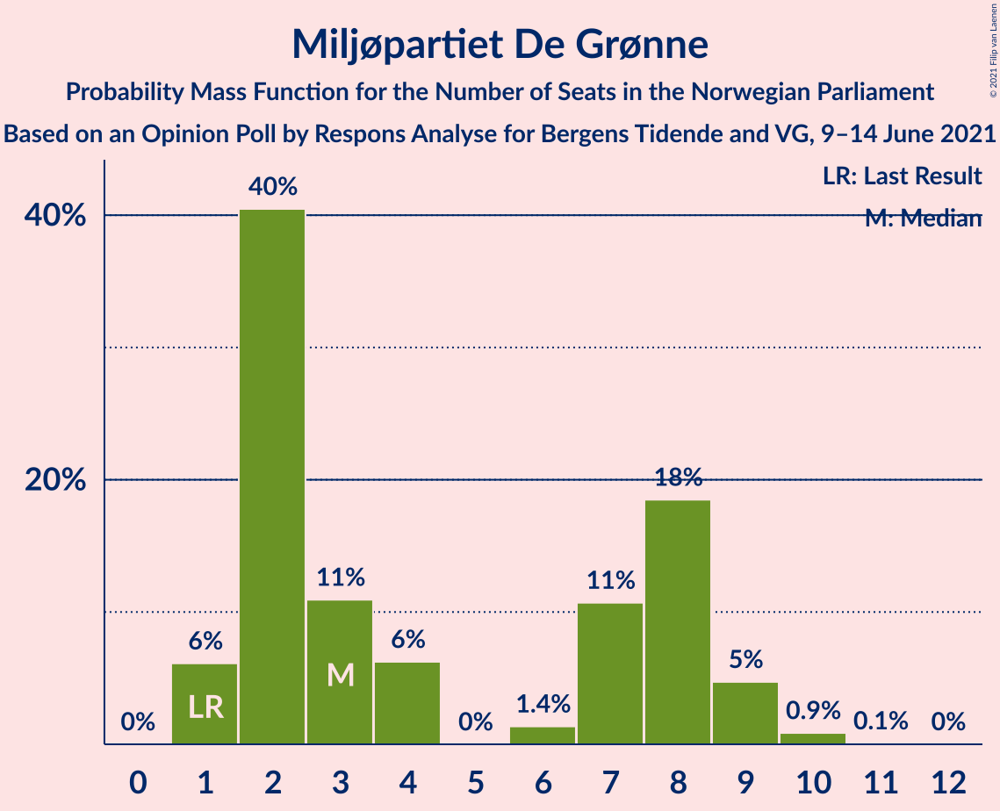

# Opinion Poll by Respons Analyse for Bergens Tidende and VG, 9–14 June 2021

<a href="#voting-intentions">Voting Intentions</a> | <a href="#seats">Seats</a> | <a href="#coalitions">Coalitions</a> | <a href="#technical-information">Technical Information</a>

## Voting Intentions

### Confidence Intervals

| Party | Last Result | Poll Result | 80% Confidence Interval | 90% Confidence Interval | 95% Confidence Interval | 99% Confidence Interval |
|:-----:|:-----------:|:-----------:|:-----------------------:|:-----------------------:|:-----------------------:|:-----------------------:|
| Arbeiderpartiet | 27.4% | 23.6% | 21.9–25.4% |21.5–25.9% |21.1–26.3% |20.3–27.2% |
| Høyre | 25.0% | 21.4% | 19.8–23.1% |19.4–23.6% |19.0–24.1% |18.2–24.9% |
| Senterpartiet | 10.3% | 18.2% | 16.7–19.8% |16.3–20.3% |15.9–20.7% |15.2–21.5% |
| Fremskrittspartiet | 15.2% | 10.5% | 9.3–11.8% |9.0–12.2% |8.7–12.6% |8.2–13.2% |
| Sosialistisk Venstreparti | 6.0% | 8.2% | 7.2–9.4% |6.9–9.8% |6.6–10.1% |6.2–10.7% |
| Rødt | 2.4% | 4.5% | 3.8–5.5% |3.6–5.7% |3.4–6.0% |3.0–6.5% |
| Miljøpartiet De Grønne | 3.2% | 3.7% | 3.0–4.6% |2.9–4.8% |2.7–5.1% |2.4–5.5% |
| Kristelig Folkeparti | 4.2% | 3.3% | 2.7–4.1% |2.5–4.4% |2.4–4.6% |2.1–5.0% |
| Venstre | 4.4% | 2.8% | 2.2–3.6% |2.1–3.8% |1.9–4.0% |1.7–4.4% |

*Note:* The poll result column reflects the actual value used in the calculations. Published results may vary slightly, and in addition be rounded to fewer digits.

## Seats

### Confidence Intervals

| Party | Last Result | Median | 80% Confidence Interval | 90% Confidence Interval | 95% Confidence Interval | 99% Confidence Interval |
|:-----:|:-----------:|:------:|:-----------------------:|:-----------------------:|:-----------------------:|:-----------------------:|
| <a href="#arbeiderpartiet">Arbeiderpartiet</a> | 49 | 44 | 41–47 |40–48 |39–49 |38–50 |
| <a href="#høyre">Høyre</a> | 45 | 39 | 35–42 |34–43 |34–44 |33–47 |
| <a href="#senterpartiet">Senterpartiet</a> | 19 | 34 | 31–37 |30–37 |29–39 |28–40 |
| <a href="#fremskrittspartiet">Fremskrittspartiet</a> | 27 | 19 | 16–21 |16–23 |15–23 |14–25 |
| <a href="#sosialistisk-venstreparti">Sosialistisk Venstreparti</a> | 11 | 15 | 12–17 |12–18 |12–19 |10–20 |
| <a href="#rødt">Rødt</a> | 1 | 8 | 2–10 |2–10 |2–11 |2–12 |
| <a href="#miljøpartiet-de-grønne">Miljøpartiet De Grønne</a> | 1 | 3 | 2–8 |1–9 |1–9 |1–10 |
| <a href="#kristelig-folkeparti">Kristelig Folkeparti</a> | 8 | 2 | 1–7 |1–8 |1–8 |1–9 |
| <a href="#venstre">Venstre</a> | 8 | 2 | 1–2 |1–2 |1–3 |0–8 |

### Arbeiderpartiet

*For a full overview of the results for this party, see the [Arbeiderpartiet](party-arbeiderpartiet.html) page.*

| Number of Seats | Probability | Accumulated | Special Marks |
|:---------------:|:-----------:|:-----------:|:-------------:|
| 36 | 0.1% | 100% |  |
| 37 | 0.2% | 99.9% |  |
| 38 | 0.6% | 99.7% |  |
| 39 | 2% | 99.1% |  |
| 40 | 5% | 97% |  |
| 41 | 9% | 93% |  |
| 42 | 13% | 84% |  |
| 43 | 12% | 71% |  |
| 44 | 31% | 59% | Median |
| 45 | 10% | 29% |  |
| 46 | 7% | 19% |  |
| 47 | 5% | 12% |  |
| 48 | 2% | 7% |  |
| 49 | 3% | 5% | Last Result |
| 50 | 0.7% | 1.2% |  |
| 51 | 0.3% | 0.5% |  |
| 52 | 0.1% | 0.2% |  |
| 53 | 0.1% | 0.1% |  |
| 54 | 0% | 0% |  |

### Høyre

*For a full overview of the results for this party, see the [Høyre](party-høyre.html) page.*

| Number of Seats | Probability | Accumulated | Special Marks |
|:---------------:|:-----------:|:-----------:|:-------------:|
| 31 | 0% | 100% |  |
| 32 | 0.3% | 99.9% |  |
| 33 | 0.7% | 99.6% |  |
| 34 | 5% | 99.0% |  |
| 35 | 9% | 94% |  |
| 36 | 7% | 85% |  |
| 37 | 8% | 78% |  |
| 38 | 18% | 70% |  |
| 39 | 11% | 52% | Median |
| 40 | 18% | 41% |  |
| 41 | 9% | 23% |  |
| 42 | 6% | 14% |  |
| 43 | 3% | 8% |  |
| 44 | 3% | 5% |  |
| 45 | 0.9% | 2% | Last Result |
| 46 | 0.5% | 1.2% |  |
| 47 | 0.6% | 0.7% |  |
| 48 | 0.1% | 0.1% |  |
| 49 | 0% | 0% |  |

### Senterpartiet

*For a full overview of the results for this party, see the [Senterpartiet](party-senterpartiet.html) page.*

| Number of Seats | Probability | Accumulated | Special Marks |
|:---------------:|:-----------:|:-----------:|:-------------:|
| 19 | 0% | 100% | Last Result |
| 20 | 0% | 100% |  |
| 21 | 0% | 100% |  |
| 22 | 0% | 100% |  |
| 23 | 0% | 100% |  |
| 24 | 0% | 100% |  |
| 25 | 0% | 100% |  |
| 26 | 0.1% | 100% |  |
| 27 | 0.3% | 99.9% |  |
| 28 | 0.8% | 99.6% |  |
| 29 | 1.4% | 98.8% |  |
| 30 | 3% | 97% |  |
| 31 | 4% | 94% |  |
| 32 | 5% | 90% |  |
| 33 | 26% | 85% |  |
| 34 | 19% | 59% | Median |
| 35 | 15% | 40% |  |
| 36 | 11% | 25% |  |
| 37 | 10% | 15% |  |
| 38 | 2% | 5% |  |
| 39 | 2% | 3% |  |
| 40 | 0.3% | 0.7% |  |
| 41 | 0.3% | 0.4% |  |
| 42 | 0.1% | 0.1% |  |
| 43 | 0% | 0% |  |

### Fremskrittspartiet

*For a full overview of the results for this party, see the [Fremskrittspartiet](party-fremskrittspartiet.html) page.*

| Number of Seats | Probability | Accumulated | Special Marks |
|:---------------:|:-----------:|:-----------:|:-------------:|
| 13 | 0.2% | 100% |  |
| 14 | 2% | 99.8% |  |
| 15 | 2% | 98% |  |
| 16 | 13% | 96% |  |
| 17 | 14% | 83% |  |
| 18 | 14% | 69% |  |
| 19 | 17% | 55% | Median |
| 20 | 19% | 38% |  |
| 21 | 10% | 19% |  |
| 22 | 4% | 9% |  |
| 23 | 3% | 5% |  |
| 24 | 1.0% | 2% |  |
| 25 | 0.6% | 0.7% |  |
| 26 | 0.1% | 0.1% |  |
| 27 | 0% | 0% | Last Result |

### Sosialistisk Venstreparti

*For a full overview of the results for this party, see the [Sosialistisk Venstreparti](party-sosialistiskvenstreparti.html) page.*

| Number of Seats | Probability | Accumulated | Special Marks |
|:---------------:|:-----------:|:-----------:|:-------------:|
| 9 | 0.1% | 100% |  |
| 10 | 0.7% | 99.9% |  |
| 11 | 1.3% | 99.2% | Last Result |
| 12 | 12% | 98% |  |
| 13 | 12% | 86% |  |
| 14 | 18% | 74% |  |
| 15 | 28% | 56% | Median |
| 16 | 15% | 28% |  |
| 17 | 7% | 13% |  |
| 18 | 3% | 6% |  |
| 19 | 2% | 3% |  |
| 20 | 0.4% | 0.5% |  |
| 21 | 0.1% | 0.1% |  |
| 22 | 0% | 0% |  |

### Rødt

*For a full overview of the results for this party, see the [Rødt](party-rødt.html) page.*

| Number of Seats | Probability | Accumulated | Special Marks |
|:---------------:|:-----------:|:-----------:|:-------------:|
| 1 | 0.1% | 100% | Last Result |
| 2 | 19% | 99.9% |  |
| 3 | 0.1% | 80% |  |
| 4 | 0% | 80% |  |
| 5 | 0% | 80% |  |
| 6 | 1.4% | 80% |  |
| 7 | 15% | 79% |  |
| 8 | 33% | 64% | Median |
| 9 | 15% | 30% |  |
| 10 | 10% | 15% |  |
| 11 | 4% | 5% |  |
| 12 | 1.0% | 1.1% |  |
| 13 | 0.1% | 0.1% |  |
| 14 | 0% | 0% |  |

### Miljøpartiet De Grønne

*For a full overview of the results for this party, see the [Miljøpartiet De Grønne](party-miljøpartietdegrønne.html) page.*

| Number of Seats | Probability | Accumulated | Special Marks |
|:---------------:|:-----------:|:-----------:|:-------------:|
| 1 | 6% | 100% | Last Result |
| 2 | 40% | 94% |  |
| 3 | 11% | 53% | Median |
| 4 | 6% | 42% |  |
| 5 | 0% | 36% |  |
| 6 | 1.4% | 36% |  |
| 7 | 11% | 35% |  |
| 8 | 18% | 24% |  |
| 9 | 5% | 6% |  |
| 10 | 0.9% | 1.0% |  |
| 11 | 0.1% | 0.1% |  |
| 12 | 0% | 0% |  |

### Kristelig Folkeparti

*For a full overview of the results for this party, see the [Kristelig Folkeparti](party-kristeligfolkeparti.html) page.*

| Number of Seats | Probability | Accumulated | Special Marks |
|:---------------:|:-----------:|:-----------:|:-------------:|
| 0 | 0.4% | 100% |  |
| 1 | 35% | 99.6% |  |
| 2 | 26% | 65% | Median |
| 3 | 27% | 39% |  |
| 4 | 0% | 12% |  |
| 5 | 0% | 12% |  |
| 6 | 0.5% | 12% |  |
| 7 | 4% | 11% |  |
| 8 | 6% | 7% | Last Result |
| 9 | 0.6% | 0.7% |  |
| 10 | 0.1% | 0.1% |  |
| 11 | 0% | 0% |  |

### Venstre

*For a full overview of the results for this party, see the [Venstre](party-venstre.html) page.*

| Number of Seats | Probability | Accumulated | Special Marks |
|:---------------:|:-----------:|:-----------:|:-------------:|
| 0 | 0.9% | 100% |  |
| 1 | 9% | 99.1% |  |
| 2 | 85% | 90% | Median |
| 3 | 2% | 4% |  |
| 4 | 0.2% | 2% |  |
| 5 | 0% | 2% |  |
| 6 | 0.4% | 2% |  |
| 7 | 1.0% | 2% |  |
| 8 | 0.8% | 0.9% | Last Result |
| 9 | 0.1% | 0.1% |  |
| 10 | 0% | 0% |  |

## Coalitions

### Confidence Intervals

| Coalition | Last Result | Median | Majority? | 80% Confidence Interval | 90% Confidence Interval | 95% Confidence Interval | 99% Confidence Interval |
|:---------:|:-----------:|:------:|:---------:|:-----------------------:|:-----------------------:|:-----------------------:|:-----------------------:|
| Arbeiderpartiet – Senterpartiet – Sosialistisk Venstreparti – Rødt – Miljøpartiet De Grønne | 81 | 104 | 100% | 99–109 | 97–110 | 95–111 | 93–113 |
| Arbeiderpartiet – Senterpartiet – Sosialistisk Venstreparti – Rødt | 80 | 99 | 100% | 95–105 | 93–107 | 92–108 | 89–109 |
| Arbeiderpartiet – Senterpartiet – Sosialistisk Venstreparti – Miljøpartiet De Grønne – Kristelig Folkeparti | 88 | 99 | 100% | 94–104 | 93–106 | 92–107 | 89–109 |
| Arbeiderpartiet – Senterpartiet – Sosialistisk Venstreparti – Miljøpartiet De Grønne | 80 | 97 | 99.9% | 92–101 | 91–103 | 89–105 | 87–106 |
| Høyre – Senterpartiet – Fremskrittspartiet – Kristelig Folkeparti – Venstre | 107 | 96 | 100% | 91–101 | 90–103 | 90–104 | 87–108 |
| Arbeiderpartiet – Senterpartiet – Sosialistisk Venstreparti | 79 | 92 | 99.2% | 89–98 | 87–99 | 86–100 | 84–102 |
| Arbeiderpartiet – Senterpartiet – Miljøpartiet De Grønne – Kristelig Folkeparti | 77 | 85 | 54% | 79–89 | 78–91 | 77–93 | 74–94 |
| Arbeiderpartiet – Senterpartiet – Kristelig Folkeparti | 76 | 80 | 16% | 76–86 | 75–87 | 74–87 | 71–90 |
| Arbeiderpartiet – Senterpartiet | 68 | 78 | 0.7% | 74–82 | 73–83 | 72–84 | 70–86 |
| Arbeiderpartiet – Sosialistisk Venstreparti – Rødt – Miljøpartiet De Grønne | 62 | 69 | 0% | 64–75 | 63–76 | 61–77 | 60–79 |
| Høyre – Fremskrittspartiet – Miljøpartiet De Grønne – Kristelig Folkeparti – Venstre | 89 | 66 | 0% | 61–71 | 60–73 | 59–74 | 57–76 |
| Høyre – Fremskrittspartiet – Kristelig Folkeparti – Venstre | 88 | 61 | 0% | 58–68 | 56–68 | 55–70 | 54–73 |
| Høyre – Fremskrittspartiet – Venstre | 80 | 59 | 0% | 55–64 | 54–66 | 53–67 | 51–70 |
| Arbeiderpartiet – Sosialistisk Venstreparti | 60 | 58 | 0% | 55–62 | 54–64 | 53–65 | 51–67 |
| Høyre – Fremskrittspartiet | 72 | 57 | 0% | 53–62 | 52–64 | 51–65 | 49–68 |
| Høyre – Kristelig Folkeparti – Venstre | 61 | 43 | 0% | 40–47 | 38–49 | 38–50 | 37–53 |
| Senterpartiet – Kristelig Folkeparti – Venstre | 35 | 38 | 0% | 35–43 | 35–44 | 34–45 | 32–47 |

### Arbeiderpartiet – Senterpartiet – Sosialistisk Venstreparti – Rødt – Miljøpartiet De Grønne

| Number of Seats | Probability | Accumulated | Special Marks |
|:---------------:|:-----------:|:-----------:|:-------------:|
| 81 | 0% | 100% | Last Result |
| 82 | 0% | 100% |  |
| 83 | 0% | 100% |  |
| 84 | 0% | 100% |  |
| 85 | 0% | 100% | Majority |
| 86 | 0% | 100% |  |
| 87 | 0% | 100% |  |
| 88 | 0% | 100% |  |
| 89 | 0% | 100% |  |
| 90 | 0.1% | 100% |  |
| 91 | 0.1% | 99.9% |  |
| 92 | 0.2% | 99.8% |  |
| 93 | 0.3% | 99.6% |  |
| 94 | 0.5% | 99.3% |  |
| 95 | 2% | 98.9% |  |
| 96 | 2% | 97% |  |
| 97 | 2% | 95% |  |
| 98 | 2% | 93% |  |
| 99 | 4% | 91% |  |
| 100 | 4% | 87% |  |
| 101 | 13% | 82% |  |
| 102 | 5% | 69% |  |
| 103 | 6% | 64% |  |
| 104 | 11% | 58% | Median |
| 105 | 9% | 47% |  |
| 106 | 11% | 38% |  |
| 107 | 6% | 27% |  |
| 108 | 10% | 22% |  |
| 109 | 5% | 12% |  |
| 110 | 4% | 7% |  |
| 111 | 2% | 3% |  |
| 112 | 0.4% | 1.1% |  |
| 113 | 0.2% | 0.6% |  |
| 114 | 0.3% | 0.4% |  |
| 115 | 0.1% | 0.1% |  |
| 116 | 0% | 0% |  |

### Arbeiderpartiet – Senterpartiet – Sosialistisk Venstreparti – Rødt

| Number of Seats | Probability | Accumulated | Special Marks |
|:---------------:|:-----------:|:-----------:|:-------------:|
| 80 | 0% | 100% | Last Result |
| 81 | 0% | 100% |  |
| 82 | 0% | 100% |  |
| 83 | 0% | 100% |  |
| 84 | 0% | 100% |  |
| 85 | 0% | 100% | Majority |
| 86 | 0.1% | 100% |  |
| 87 | 0% | 99.9% |  |
| 88 | 0.2% | 99.8% |  |
| 89 | 0.2% | 99.6% |  |
| 90 | 0.4% | 99.4% |  |
| 91 | 0.4% | 99.0% |  |
| 92 | 1.3% | 98.6% |  |
| 93 | 4% | 97% |  |
| 94 | 2% | 93% |  |
| 95 | 4% | 91% |  |
| 96 | 5% | 87% |  |
| 97 | 11% | 82% |  |
| 98 | 8% | 71% |  |
| 99 | 13% | 62% |  |
| 100 | 11% | 49% |  |
| 101 | 7% | 38% | Median |
| 102 | 9% | 32% |  |
| 103 | 8% | 22% |  |
| 104 | 4% | 14% |  |
| 105 | 3% | 10% |  |
| 106 | 1.1% | 8% |  |
| 107 | 3% | 6% |  |
| 108 | 3% | 4% |  |
| 109 | 0.5% | 0.9% |  |
| 110 | 0.3% | 0.4% |  |
| 111 | 0% | 0.1% |  |
| 112 | 0% | 0% |  |

### Arbeiderpartiet – Senterpartiet – Sosialistisk Venstreparti – Miljøpartiet De Grønne – Kristelig Folkeparti

| Number of Seats | Probability | Accumulated | Special Marks |
|:---------------:|:-----------:|:-----------:|:-------------:|
| 87 | 0.1% | 100% |  |
| 88 | 0.2% | 99.9% | Last Result |
| 89 | 0.2% | 99.7% |  |
| 90 | 0.6% | 99.4% |  |
| 91 | 1.0% | 98.8% |  |
| 92 | 1.0% | 98% |  |
| 93 | 3% | 97% |  |
| 94 | 7% | 94% |  |
| 95 | 4% | 87% |  |
| 96 | 5% | 83% |  |
| 97 | 11% | 78% |  |
| 98 | 9% | 67% | Median |
| 99 | 12% | 58% |  |
| 100 | 6% | 46% |  |
| 101 | 8% | 41% |  |
| 102 | 13% | 32% |  |
| 103 | 4% | 19% |  |
| 104 | 6% | 15% |  |
| 105 | 3% | 9% |  |
| 106 | 4% | 7% |  |
| 107 | 2% | 3% |  |
| 108 | 0.7% | 1.4% |  |
| 109 | 0.5% | 0.8% |  |
| 110 | 0.1% | 0.3% |  |
| 111 | 0.1% | 0.1% |  |
| 112 | 0% | 0.1% |  |
| 113 | 0% | 0.1% |  |
| 114 | 0% | 0% |  |

### Arbeiderpartiet – Senterpartiet – Sosialistisk Venstreparti – Miljøpartiet De Grønne

| Number of Seats | Probability | Accumulated | Special Marks |
|:---------------:|:-----------:|:-----------:|:-------------:|
| 80 | 0% | 100% | Last Result |
| 81 | 0% | 100% |  |
| 82 | 0% | 100% |  |
| 83 | 0% | 100% |  |
| 84 | 0% | 100% |  |
| 85 | 0.1% | 99.9% | Majority |
| 86 | 0.1% | 99.8% |  |
| 87 | 0.5% | 99.7% |  |
| 88 | 1.0% | 99.2% |  |
| 89 | 0.9% | 98% |  |
| 90 | 2% | 97% |  |
| 91 | 3% | 96% |  |
| 92 | 4% | 92% |  |
| 93 | 8% | 88% |  |
| 94 | 10% | 80% |  |
| 95 | 9% | 70% |  |
| 96 | 7% | 61% | Median |
| 97 | 7% | 53% |  |
| 98 | 14% | 47% |  |
| 99 | 6% | 33% |  |
| 100 | 13% | 27% |  |
| 101 | 5% | 14% |  |
| 102 | 3% | 9% |  |
| 103 | 1.5% | 5% |  |
| 104 | 2% | 4% |  |
| 105 | 2% | 3% |  |
| 106 | 0.5% | 0.7% |  |
| 107 | 0.1% | 0.2% |  |
| 108 | 0.1% | 0.1% |  |
| 109 | 0% | 0% |  |

### Høyre – Senterpartiet – Fremskrittspartiet – Kristelig Folkeparti – Venstre

| Number of Seats | Probability | Accumulated | Special Marks |
|:---------------:|:-----------:|:-----------:|:-------------:|
| 85 | 0.1% | 100% | Majority |
| 86 | 0.1% | 99.9% |  |
| 87 | 0.3% | 99.8% |  |
| 88 | 0.9% | 99.5% |  |
| 89 | 0.9% | 98.6% |  |
| 90 | 5% | 98% |  |
| 91 | 6% | 93% |  |
| 92 | 3% | 87% |  |
| 93 | 5% | 84% |  |
| 94 | 13% | 78% |  |
| 95 | 14% | 65% |  |
| 96 | 9% | 51% | Median |
| 97 | 6% | 42% |  |
| 98 | 8% | 36% |  |
| 99 | 5% | 27% |  |
| 100 | 8% | 22% |  |
| 101 | 6% | 15% |  |
| 102 | 3% | 9% |  |
| 103 | 2% | 6% |  |
| 104 | 1.2% | 4% |  |
| 105 | 0.9% | 2% |  |
| 106 | 0.7% | 2% |  |
| 107 | 0.2% | 0.8% | Last Result |
| 108 | 0.4% | 0.6% |  |
| 109 | 0.2% | 0.3% |  |
| 110 | 0.1% | 0.1% |  |
| 111 | 0% | 0% |  |

### Arbeiderpartiet – Senterpartiet – Sosialistisk Venstreparti

| Number of Seats | Probability | Accumulated | Special Marks |
|:---------------:|:-----------:|:-----------:|:-------------:|
| 79 | 0% | 100% | Last Result |
| 80 | 0% | 100% |  |
| 81 | 0.1% | 100% |  |
| 82 | 0% | 99.9% |  |
| 83 | 0.1% | 99.9% |  |
| 84 | 0.6% | 99.7% |  |
| 85 | 1.4% | 99.2% | Majority |
| 86 | 1.4% | 98% |  |
| 87 | 2% | 96% |  |
| 88 | 3% | 94% |  |
| 89 | 7% | 91% |  |
| 90 | 9% | 84% |  |
| 91 | 17% | 75% |  |
| 92 | 16% | 58% |  |
| 93 | 8% | 42% | Median |
| 94 | 7% | 34% |  |
| 95 | 10% | 27% |  |
| 96 | 5% | 17% |  |
| 97 | 2% | 13% |  |
| 98 | 5% | 10% |  |
| 99 | 3% | 5% |  |
| 100 | 2% | 3% |  |
| 101 | 0.1% | 1.1% |  |
| 102 | 0.7% | 1.0% |  |
| 103 | 0.1% | 0.3% |  |
| 104 | 0.1% | 0.1% |  |
| 105 | 0% | 0.1% |  |
| 106 | 0% | 0% |  |

### Arbeiderpartiet – Senterpartiet – Miljøpartiet De Grønne – Kristelig Folkeparti

| Number of Seats | Probability | Accumulated | Special Marks |
|:---------------:|:-----------:|:-----------:|:-------------:|
| 72 | 0% | 100% |  |
| 73 | 0.3% | 99.9% |  |
| 74 | 0.2% | 99.6% |  |
| 75 | 0.3% | 99.4% |  |
| 76 | 0.7% | 99.1% |  |
| 77 | 2% | 98% | Last Result |
| 78 | 2% | 97% |  |
| 79 | 6% | 95% |  |
| 80 | 4% | 89% |  |
| 81 | 5% | 85% |  |
| 82 | 9% | 80% |  |
| 83 | 11% | 72% | Median |
| 84 | 6% | 60% |  |
| 85 | 12% | 54% | Majority |
| 86 | 5% | 42% |  |
| 87 | 14% | 37% |  |
| 88 | 8% | 23% |  |
| 89 | 6% | 15% |  |
| 90 | 4% | 10% |  |
| 91 | 1.2% | 5% |  |
| 92 | 1.1% | 4% |  |
| 93 | 1.3% | 3% |  |
| 94 | 1.2% | 2% |  |
| 95 | 0.3% | 0.5% |  |
| 96 | 0.1% | 0.2% |  |
| 97 | 0.1% | 0.1% |  |
| 98 | 0% | 0% |  |

### Arbeiderpartiet – Senterpartiet – Kristelig Folkeparti

| Number of Seats | Probability | Accumulated | Special Marks |
|:---------------:|:-----------:|:-----------:|:-------------:|
| 69 | 0% | 100% |  |
| 70 | 0.1% | 99.9% |  |
| 71 | 0.5% | 99.8% |  |
| 72 | 0.4% | 99.4% |  |
| 73 | 0.9% | 99.0% |  |
| 74 | 1.0% | 98% |  |
| 75 | 3% | 97% |  |
| 76 | 4% | 94% | Last Result |
| 77 | 8% | 90% |  |
| 78 | 8% | 82% |  |
| 79 | 17% | 74% |  |
| 80 | 14% | 57% | Median |
| 81 | 13% | 43% |  |
| 82 | 6% | 30% |  |
| 83 | 5% | 25% |  |
| 84 | 4% | 20% |  |
| 85 | 5% | 16% | Majority |
| 86 | 5% | 11% |  |
| 87 | 4% | 6% |  |
| 88 | 0.9% | 2% |  |
| 89 | 0.3% | 0.8% |  |
| 90 | 0.2% | 0.5% |  |
| 91 | 0.2% | 0.4% |  |
| 92 | 0.1% | 0.1% |  |
| 93 | 0% | 0% |  |

### Arbeiderpartiet – Senterpartiet

| Number of Seats | Probability | Accumulated | Special Marks |
|:---------------:|:-----------:|:-----------:|:-------------:|
| 68 | 0.2% | 100% | Last Result |
| 69 | 0.3% | 99.8% |  |
| 70 | 0.8% | 99.5% |  |
| 71 | 0.7% | 98.8% |  |
| 72 | 2% | 98% |  |
| 73 | 2% | 96% |  |
| 74 | 6% | 94% |  |
| 75 | 4% | 88% |  |
| 76 | 10% | 84% |  |
| 77 | 20% | 75% |  |
| 78 | 18% | 54% | Median |
| 79 | 15% | 37% |  |
| 80 | 5% | 21% |  |
| 81 | 4% | 16% |  |
| 82 | 4% | 12% |  |
| 83 | 5% | 8% |  |
| 84 | 2% | 3% |  |
| 85 | 0.2% | 0.7% | Majority |
| 86 | 0.1% | 0.6% |  |
| 87 | 0.3% | 0.5% |  |
| 88 | 0.1% | 0.2% |  |
| 89 | 0.1% | 0.1% |  |
| 90 | 0% | 0% |  |

### Arbeiderpartiet – Sosialistisk Venstreparti – Rødt – Miljøpartiet De Grønne

| Number of Seats | Probability | Accumulated | Special Marks |
|:---------------:|:-----------:|:-----------:|:-------------:|
| 57 | 0% | 100% |  |
| 58 | 0.1% | 99.9% |  |
| 59 | 0.2% | 99.8% |  |
| 60 | 0.6% | 99.6% |  |
| 61 | 2% | 99.1% |  |
| 62 | 1.5% | 97% | Last Result |
| 63 | 2% | 95% |  |
| 64 | 4% | 93% |  |
| 65 | 3% | 89% |  |
| 66 | 4% | 86% |  |
| 67 | 12% | 82% |  |
| 68 | 9% | 70% |  |
| 69 | 11% | 61% |  |
| 70 | 4% | 50% | Median |
| 71 | 9% | 45% |  |
| 72 | 8% | 37% |  |
| 73 | 7% | 28% |  |
| 74 | 6% | 21% |  |
| 75 | 10% | 15% |  |
| 76 | 2% | 5% |  |
| 77 | 0.8% | 3% |  |
| 78 | 0.8% | 2% |  |
| 79 | 1.2% | 2% |  |
| 80 | 0.1% | 0.3% |  |
| 81 | 0.2% | 0.2% |  |
| 82 | 0% | 0% |  |

### Høyre – Fremskrittspartiet – Miljøpartiet De Grønne – Kristelig Folkeparti – Venstre

| Number of Seats | Probability | Accumulated | Special Marks |
|:---------------:|:-----------:|:-----------:|:-------------:|
| 56 | 0.1% | 100% |  |
| 57 | 0.4% | 99.9% |  |
| 58 | 1.5% | 99.5% |  |
| 59 | 2% | 98% |  |
| 60 | 1.5% | 96% |  |
| 61 | 5% | 95% |  |
| 62 | 5% | 90% |  |
| 63 | 9% | 85% |  |
| 64 | 6% | 76% |  |
| 65 | 15% | 71% | Median |
| 66 | 8% | 56% |  |
| 67 | 11% | 47% |  |
| 68 | 6% | 36% |  |
| 69 | 10% | 30% |  |
| 70 | 7% | 20% |  |
| 71 | 4% | 13% |  |
| 72 | 2% | 9% |  |
| 73 | 2% | 6% |  |
| 74 | 2% | 4% |  |
| 75 | 0.8% | 2% |  |
| 76 | 0.9% | 1.2% |  |
| 77 | 0.1% | 0.3% |  |
| 78 | 0.1% | 0.2% |  |
| 79 | 0% | 0.1% |  |
| 80 | 0% | 0.1% |  |
| 81 | 0% | 0% |  |
| 82 | 0% | 0% |  |
| 83 | 0% | 0% |  |
| 84 | 0% | 0% |  |
| 85 | 0% | 0% | Majority |
| 86 | 0% | 0% |  |
| 87 | 0% | 0% |  |
| 88 | 0% | 0% |  |
| 89 | 0% | 0% | Last Result |

### Høyre – Fremskrittspartiet – Kristelig Folkeparti – Venstre

| Number of Seats | Probability | Accumulated | Special Marks |
|:---------------:|:-----------:|:-----------:|:-------------:|
| 52 | 0.1% | 100% |  |
| 53 | 0.2% | 99.9% |  |
| 54 | 0.9% | 99.7% |  |
| 55 | 2% | 98.8% |  |
| 56 | 3% | 97% |  |
| 57 | 4% | 94% |  |
| 58 | 9% | 90% |  |
| 59 | 7% | 82% |  |
| 60 | 8% | 75% |  |
| 61 | 18% | 67% |  |
| 62 | 7% | 49% | Median |
| 63 | 11% | 42% |  |
| 64 | 5% | 31% |  |
| 65 | 9% | 26% |  |
| 66 | 4% | 17% |  |
| 67 | 3% | 13% |  |
| 68 | 6% | 11% |  |
| 69 | 1.3% | 5% |  |
| 70 | 0.9% | 3% |  |
| 71 | 1.1% | 2% |  |
| 72 | 0.7% | 1.2% |  |
| 73 | 0.4% | 0.6% |  |
| 74 | 0.1% | 0.2% |  |
| 75 | 0% | 0.1% |  |
| 76 | 0% | 0% |  |
| 77 | 0% | 0% |  |
| 78 | 0% | 0% |  |
| 79 | 0% | 0% |  |
| 80 | 0% | 0% |  |
| 81 | 0% | 0% |  |
| 82 | 0% | 0% |  |
| 83 | 0% | 0% |  |
| 84 | 0% | 0% |  |
| 85 | 0% | 0% | Majority |
| 86 | 0% | 0% |  |
| 87 | 0% | 0% |  |
| 88 | 0% | 0% | Last Result |

### Høyre – Fremskrittspartiet – Venstre

| Number of Seats | Probability | Accumulated | Special Marks |
|:---------------:|:-----------:|:-----------:|:-------------:|
| 49 | 0% | 100% |  |
| 50 | 0.2% | 99.9% |  |
| 51 | 0.9% | 99.8% |  |
| 52 | 0.7% | 98.9% |  |
| 53 | 2% | 98% |  |
| 54 | 5% | 96% |  |
| 55 | 6% | 92% |  |
| 56 | 8% | 86% |  |
| 57 | 9% | 78% |  |
| 58 | 10% | 69% |  |
| 59 | 11% | 59% |  |
| 60 | 12% | 48% | Median |
| 61 | 6% | 35% |  |
| 62 | 9% | 29% |  |
| 63 | 6% | 20% |  |
| 64 | 4% | 14% |  |
| 65 | 3% | 10% |  |
| 66 | 3% | 7% |  |
| 67 | 2% | 4% |  |
| 68 | 0.4% | 2% |  |
| 69 | 0.9% | 2% |  |
| 70 | 0.5% | 0.9% |  |
| 71 | 0.4% | 0.4% |  |
| 72 | 0% | 0.1% |  |
| 73 | 0% | 0% |  |
| 74 | 0% | 0% |  |
| 75 | 0% | 0% |  |
| 76 | 0% | 0% |  |
| 77 | 0% | 0% |  |
| 78 | 0% | 0% |  |
| 79 | 0% | 0% |  |
| 80 | 0% | 0% | Last Result |

### Arbeiderpartiet – Sosialistisk Venstreparti

| Number of Seats | Probability | Accumulated | Special Marks |
|:---------------:|:-----------:|:-----------:|:-------------:|
| 49 | 0% | 100% |  |
| 50 | 0.1% | 99.9% |  |
| 51 | 0.5% | 99.8% |  |
| 52 | 1.0% | 99.3% |  |
| 53 | 3% | 98% |  |
| 54 | 5% | 95% |  |
| 55 | 6% | 91% |  |
| 56 | 12% | 85% |  |
| 57 | 12% | 73% |  |
| 58 | 15% | 61% |  |
| 59 | 17% | 46% | Median |
| 60 | 6% | 29% | Last Result |
| 61 | 7% | 23% |  |
| 62 | 6% | 16% |  |
| 63 | 4% | 10% |  |
| 64 | 2% | 6% |  |
| 65 | 2% | 4% |  |
| 66 | 0.8% | 1.4% |  |
| 67 | 0.3% | 0.6% |  |
| 68 | 0.1% | 0.3% |  |
| 69 | 0.1% | 0.2% |  |
| 70 | 0.1% | 0.1% |  |
| 71 | 0% | 0% |  |

### Høyre – Fremskrittspartiet

| Number of Seats | Probability | Accumulated | Special Marks |
|:---------------:|:-----------:|:-----------:|:-------------:|
| 48 | 0.1% | 100% |  |
| 49 | 0.9% | 99.8% |  |
| 50 | 0.7% | 99.0% |  |
| 51 | 2% | 98% |  |
| 52 | 4% | 96% |  |
| 53 | 6% | 92% |  |
| 54 | 7% | 85% |  |
| 55 | 10% | 79% |  |
| 56 | 10% | 69% |  |
| 57 | 12% | 59% |  |
| 58 | 12% | 47% | Median |
| 59 | 6% | 36% |  |
| 60 | 10% | 29% |  |
| 61 | 5% | 19% |  |
| 62 | 4% | 14% |  |
| 63 | 3% | 9% |  |
| 64 | 3% | 7% |  |
| 65 | 2% | 4% |  |
| 66 | 0.4% | 2% |  |
| 67 | 0.8% | 2% |  |
| 68 | 0.5% | 0.9% |  |
| 69 | 0.4% | 0.4% |  |
| 70 | 0% | 0% |  |
| 71 | 0% | 0% |  |
| 72 | 0% | 0% | Last Result |

### Høyre – Kristelig Folkeparti – Venstre

| Number of Seats | Probability | Accumulated | Special Marks |
|:---------------:|:-----------:|:-----------:|:-------------:|
| 36 | 0.1% | 100% |  |
| 37 | 0.8% | 99.8% |  |
| 38 | 4% | 99.0% |  |
| 39 | 5% | 95% |  |
| 40 | 6% | 90% |  |
| 41 | 10% | 84% |  |
| 42 | 21% | 75% |  |
| 43 | 11% | 54% | Median |
| 44 | 9% | 43% |  |
| 45 | 13% | 34% |  |
| 46 | 7% | 22% |  |
| 47 | 6% | 15% |  |
| 48 | 3% | 9% |  |
| 49 | 3% | 6% |  |
| 50 | 1.5% | 3% |  |
| 51 | 0.9% | 2% |  |
| 52 | 0.3% | 0.9% |  |
| 53 | 0.3% | 0.5% |  |
| 54 | 0.2% | 0.3% |  |
| 55 | 0% | 0.1% |  |
| 56 | 0% | 0% |  |
| 57 | 0% | 0% |  |
| 58 | 0% | 0% |  |
| 59 | 0% | 0% |  |
| 60 | 0% | 0% |  |
| 61 | 0% | 0% | Last Result |

### Senterpartiet – Kristelig Folkeparti – Venstre

| Number of Seats | Probability | Accumulated | Special Marks |
|:---------------:|:-----------:|:-----------:|:-------------:|
| 30 | 0.1% | 100% |  |
| 31 | 0.2% | 99.9% |  |
| 32 | 0.8% | 99.7% |  |
| 33 | 1.2% | 98.9% |  |
| 34 | 2% | 98% |  |
| 35 | 6% | 95% | Last Result |
| 36 | 9% | 89% |  |
| 37 | 18% | 80% |  |
| 38 | 14% | 62% | Median |
| 39 | 11% | 47% |  |
| 40 | 13% | 36% |  |
| 41 | 7% | 23% |  |
| 42 | 5% | 16% |  |
| 43 | 4% | 11% |  |
| 44 | 3% | 7% |  |
| 45 | 2% | 4% |  |
| 46 | 1.2% | 2% |  |
| 47 | 0.5% | 0.9% |  |
| 48 | 0.2% | 0.4% |  |
| 49 | 0.1% | 0.2% |  |
| 50 | 0.1% | 0.1% |  |
| 51 | 0% | 0% |  |

## Technical Information

### Opinion Poll

+ **Polling firm:** Respons Analyse
+ **Commissioner(s):** Bergens Tidende and VG
+ **Fieldwork period:** 9–14 June 2021

### Calculations

+ **Sample size:** 1000
+ **Simulations done:** 1,048,576
+ **Error estimate:** 1.97%

