# Opinion Poll by Norstat for Dagens Næringsliv, 17–23 June 2021

<a href="#voting-intentions">Voting Intentions</a> | <a href="#seats">Seats</a> | <a href="#coalitions">Coalitions</a> | <a href="#technical-information">Technical Information</a>

## Voting Intentions

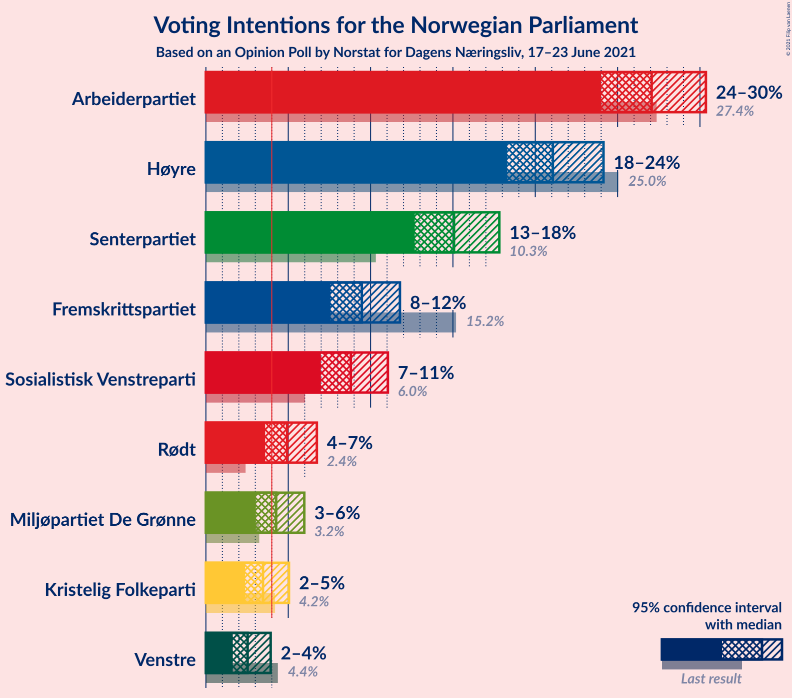

### Confidence Intervals

| Party | Last Result | Poll Result | 80% Confidence Interval | 90% Confidence Interval | 95% Confidence Interval | 99% Confidence Interval |
|:-----:|:-----------:|:-----------:|:-----------------------:|:-----------------------:|:-----------------------:|:-----------------------:|
| Arbeiderpartiet | 27.4% | 27.1% | 25.1–29.2% |24.5–29.8% |24.0–30.4% |23.1–31.4% |
| Høyre | 25.0% | 21.1% | 19.3–23.1% |18.7–23.6% |18.3–24.1% |17.5–25.1% |
| Senterpartiet | 10.3% | 15.1% | 13.5–16.9% |13.1–17.4% |12.7–17.8% |12.0–18.7% |
| Fremskrittspartiet | 15.2% | 9.5% | 8.2–11.0% |7.9–11.4% |7.6–11.8% |7.0–12.5% |
| Sosialistisk Venstreparti | 6.0% | 8.8% | 7.6–10.3% |7.3–10.7% |7.0–11.1% |6.4–11.8% |
| Rødt | 2.4% | 4.9% | 4.1–6.1% |3.8–6.4% |3.6–6.7% |3.2–7.3% |
| Miljøpartiet De Grønne | 3.2% | 4.3% | 3.5–5.4% |3.2–5.7% |3.0–6.0% |2.7–6.5% |
| Kristelig Folkeparti | 4.2% | 3.5% | 2.7–4.5% |2.5–4.8% |2.4–5.0% |2.1–5.6% |
| Venstre | 4.4% | 2.5% | 1.9–3.4% |1.8–3.7% |1.6–3.9% |1.4–4.4% |

*Note:* The poll result column reflects the actual value used in the calculations. Published results may vary slightly, and in addition be rounded to fewer digits.

## Seats

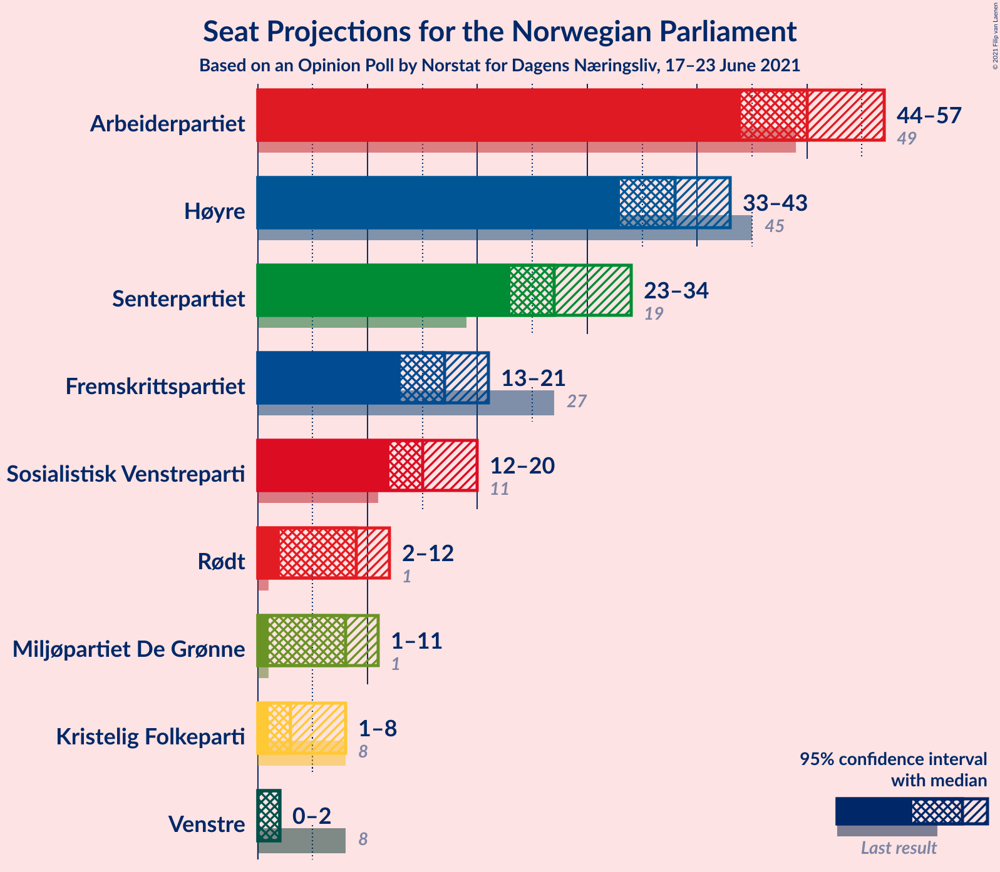

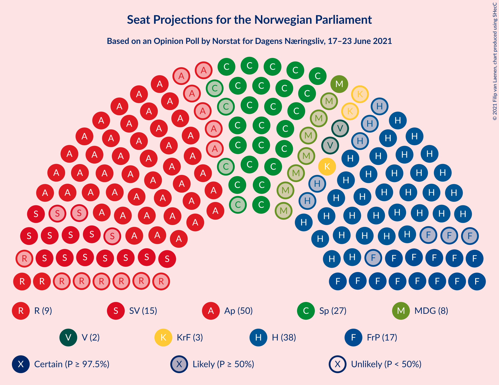

### Confidence Intervals

| Party | Last Result | Median | 80% Confidence Interval | 90% Confidence Interval | 95% Confidence Interval | 99% Confidence Interval |
|:-----:|:-----------:|:------:|:-----------------------:|:-----------------------:|:-----------------------:|:-----------------------:|
| <a href="#arbeiderpartiet">Arbeiderpartiet</a> | 49 | 50 | 45–54 |44–56 |44–57 |42–58 |
| <a href="#høyre">Høyre</a> | 45 | 38 | 35–42 |34–43 |33–43 |31–45 |
| <a href="#senterpartiet">Senterpartiet</a> | 19 | 27 | 25–32 |23–33 |23–34 |21–36 |
| <a href="#fremskrittspartiet">Fremskrittspartiet</a> | 27 | 17 | 15–20 |14–21 |13–21 |12–24 |
| <a href="#sosialistisk-venstreparti">Sosialistisk Venstreparti</a> | 11 | 15 | 13–18 |13–19 |12–20 |11–21 |
| <a href="#rødt">Rødt</a> | 1 | 9 | 7–11 |2–11 |2–12 |2–12 |
| <a href="#miljøpartiet-de-grønne">Miljøpartiet De Grønne</a> | 1 | 8 | 2–9 |2–10 |1–11 |1–12 |
| <a href="#kristelig-folkeparti">Kristelig Folkeparti</a> | 8 | 3 | 1–7 |1–8 |1–8 |1–10 |
| <a href="#venstre">Venstre</a> | 8 | 2 | 1–2 |0–2 |0–2 |0–8 |

### Arbeiderpartiet

*For a full overview of the results for this party, see the [Arbeiderpartiet](party-arbeiderpartiet.html) page.*

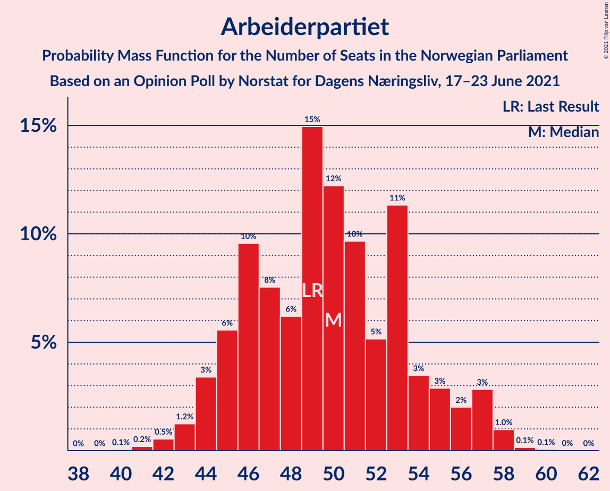

| Number of Seats | Probability | Accumulated | Special Marks |
|:---------------:|:-----------:|:-----------:|:-------------:|
| 40 | 0.1% | 100% |  |
| 41 | 0.2% | 99.9% |  |
| 42 | 0.5% | 99.7% |  |
| 43 | 1.2% | 99.2% |  |
| 44 | 3% | 98% |  |
| 45 | 6% | 95% |  |
| 46 | 10% | 89% |  |
| 47 | 8% | 79% |  |
| 48 | 6% | 72% |  |
| 49 | 15% | 66% | Last Result |
| 50 | 12% | 51% | Median |
| 51 | 10% | 39% |  |
| 52 | 5% | 29% |  |
| 53 | 11% | 24% |  |
| 54 | 3% | 12% |  |
| 55 | 3% | 9% |  |
| 56 | 2% | 6% |  |
| 57 | 3% | 4% |  |
| 58 | 1.0% | 1.2% |  |
| 59 | 0.1% | 0.2% |  |
| 60 | 0.1% | 0.1% |  |
| 61 | 0% | 0% |  |

### Høyre

*For a full overview of the results for this party, see the [Høyre](party-høyre.html) page.*

| Number of Seats | Probability | Accumulated | Special Marks |
|:---------------:|:-----------:|:-----------:|:-------------:|
| 29 | 0.1% | 100% |  |
| 30 | 0.1% | 99.9% |  |
| 31 | 0.8% | 99.8% |  |
| 32 | 1.0% | 99.0% |  |
| 33 | 2% | 98% |  |
| 34 | 5% | 96% |  |
| 35 | 8% | 91% |  |
| 36 | 14% | 82% |  |
| 37 | 10% | 68% |  |
| 38 | 17% | 58% | Median |
| 39 | 8% | 41% |  |
| 40 | 16% | 33% |  |
| 41 | 5% | 17% |  |
| 42 | 3% | 12% |  |
| 43 | 6% | 8% |  |
| 44 | 1.2% | 2% |  |
| 45 | 0.3% | 0.7% | Last Result |
| 46 | 0.3% | 0.4% |  |
| 47 | 0.1% | 0.2% |  |
| 48 | 0% | 0.1% |  |
| 49 | 0% | 0% |  |

### Senterpartiet

*For a full overview of the results for this party, see the [Senterpartiet](party-senterpartiet.html) page.*

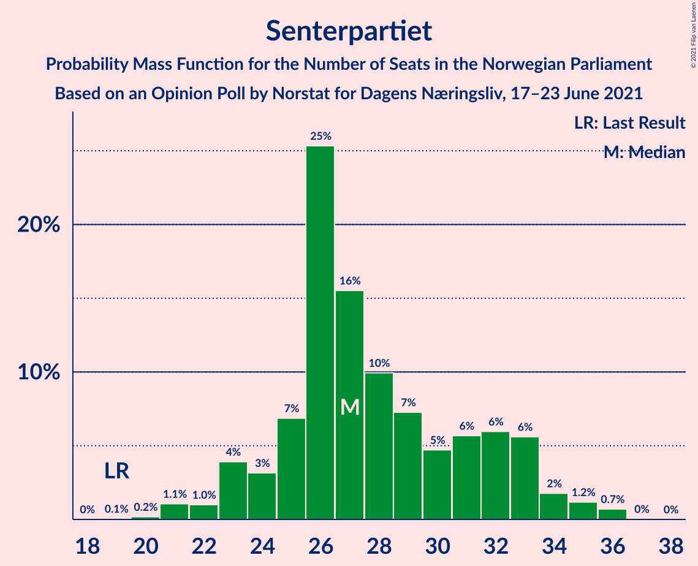

| Number of Seats | Probability | Accumulated | Special Marks |
|:---------------:|:-----------:|:-----------:|:-------------:|
| 19 | 0.1% | 100% | Last Result |
| 20 | 0.2% | 99.9% |  |
| 21 | 1.1% | 99.7% |  |
| 22 | 1.0% | 98.7% |  |
| 23 | 4% | 98% |  |
| 24 | 3% | 94% |  |
| 25 | 7% | 91% |  |
| 26 | 25% | 84% |  |
| 27 | 16% | 58% | Median |
| 28 | 10% | 43% |  |
| 29 | 7% | 33% |  |
| 30 | 5% | 26% |  |
| 31 | 6% | 21% |  |
| 32 | 6% | 15% |  |
| 33 | 6% | 9% |  |
| 34 | 2% | 4% |  |
| 35 | 1.2% | 2% |  |
| 36 | 0.7% | 0.8% |  |
| 37 | 0% | 0% |  |

### Fremskrittspartiet

*For a full overview of the results for this party, see the [Fremskrittspartiet](party-fremskrittspartiet.html) page.*

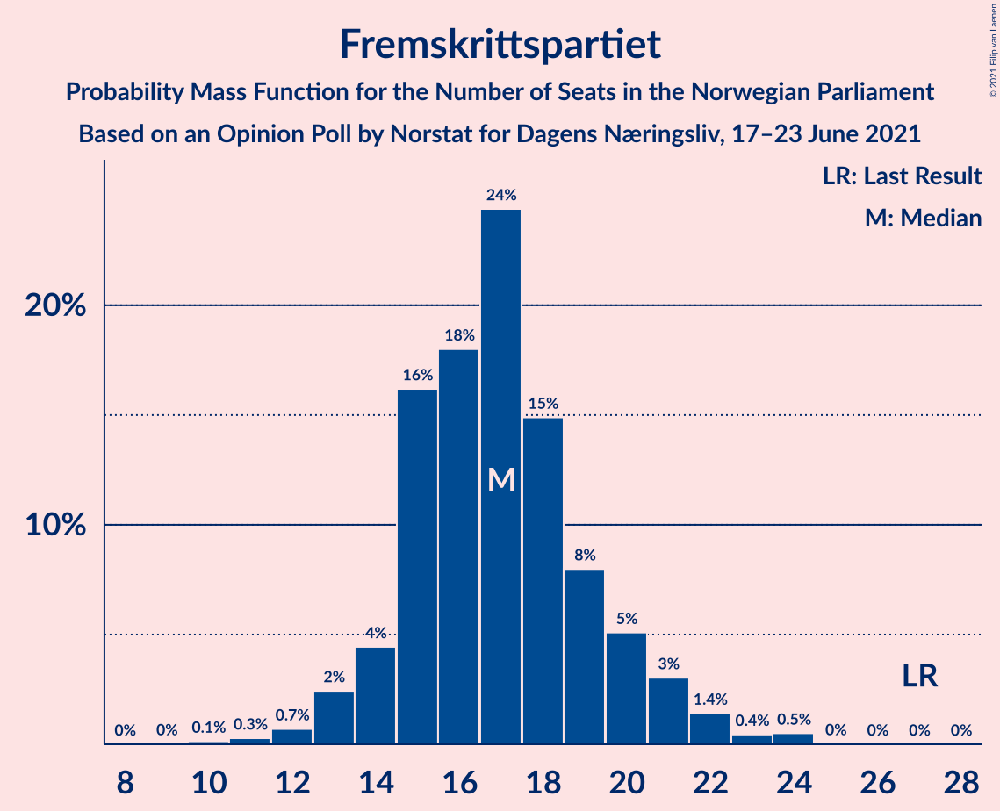

| Number of Seats | Probability | Accumulated | Special Marks |
|:---------------:|:-----------:|:-----------:|:-------------:|
| 10 | 0.1% | 100% |  |
| 11 | 0.3% | 99.8% |  |
| 12 | 0.7% | 99.6% |  |
| 13 | 2% | 98.9% |  |
| 14 | 4% | 96% |  |
| 15 | 16% | 92% |  |
| 16 | 18% | 76% |  |
| 17 | 24% | 58% | Median |
| 18 | 15% | 33% |  |
| 19 | 8% | 19% |  |
| 20 | 5% | 11% |  |
| 21 | 3% | 5% |  |
| 22 | 1.4% | 2% |  |
| 23 | 0.4% | 1.0% |  |
| 24 | 0.5% | 0.5% |  |
| 25 | 0% | 0% |  |
| 26 | 0% | 0% |  |
| 27 | 0% | 0% | Last Result |

### Sosialistisk Venstreparti

*For a full overview of the results for this party, see the [Sosialistisk Venstreparti](party-sosialistiskvenstreparti.html) page.*

| Number of Seats | Probability | Accumulated | Special Marks |
|:---------------:|:-----------:|:-----------:|:-------------:|
| 10 | 0.2% | 100% |  |
| 11 | 1.3% | 99.8% | Last Result |
| 12 | 3% | 98% |  |
| 13 | 9% | 95% |  |
| 14 | 13% | 87% |  |
| 15 | 24% | 73% | Median |
| 16 | 16% | 50% |  |
| 17 | 14% | 33% |  |
| 18 | 11% | 19% |  |
| 19 | 5% | 9% |  |
| 20 | 2% | 4% |  |
| 21 | 1.2% | 1.5% |  |
| 22 | 0.2% | 0.3% |  |
| 23 | 0.1% | 0.1% |  |
| 24 | 0% | 0% |  |

### Rødt

*For a full overview of the results for this party, see the [Rødt](party-rødt.html) page.*

| Number of Seats | Probability | Accumulated | Special Marks |
|:---------------:|:-----------:|:-----------:|:-------------:|
| 1 | 0.1% | 100% | Last Result |
| 2 | 6% | 99.9% |  |
| 3 | 0% | 94% |  |
| 4 | 0% | 94% |  |
| 5 | 0% | 94% |  |
| 6 | 0.2% | 94% |  |
| 7 | 8% | 94% |  |
| 8 | 31% | 86% |  |
| 9 | 33% | 55% | Median |
| 10 | 9% | 22% |  |
| 11 | 10% | 13% |  |
| 12 | 3% | 4% |  |
| 13 | 0.4% | 0.5% |  |
| 14 | 0.1% | 0.1% |  |
| 15 | 0% | 0% |  |

### Miljøpartiet De Grønne

*For a full overview of the results for this party, see the [Miljøpartiet De Grønne](party-miljøpartietdegrønne.html) page.*

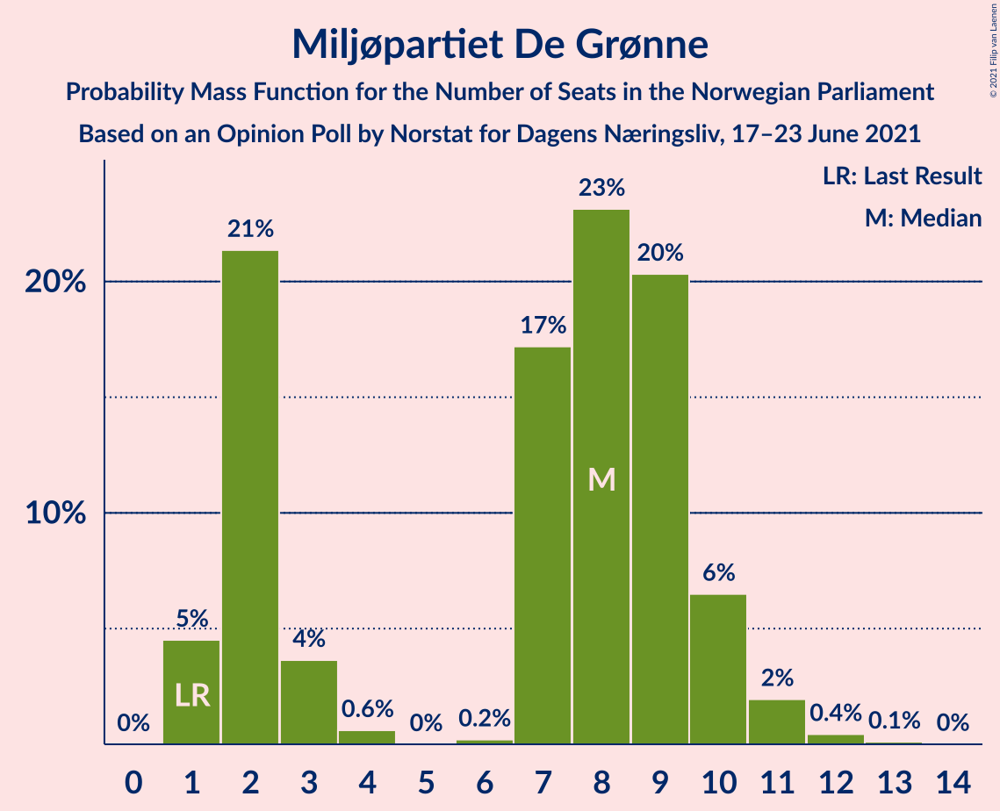

| Number of Seats | Probability | Accumulated | Special Marks |
|:---------------:|:-----------:|:-----------:|:-------------:|
| 1 | 5% | 100% | Last Result |
| 2 | 21% | 95% |  |
| 3 | 4% | 74% |  |
| 4 | 0.6% | 70% |  |
| 5 | 0% | 70% |  |
| 6 | 0.2% | 70% |  |
| 7 | 17% | 70% |  |
| 8 | 23% | 52% | Median |
| 9 | 20% | 29% |  |
| 10 | 6% | 9% |  |
| 11 | 2% | 3% |  |
| 12 | 0.4% | 0.6% |  |
| 13 | 0.1% | 0.1% |  |
| 14 | 0% | 0% |  |

### Kristelig Folkeparti

*For a full overview of the results for this party, see the [Kristelig Folkeparti](party-kristeligfolkeparti.html) page.*

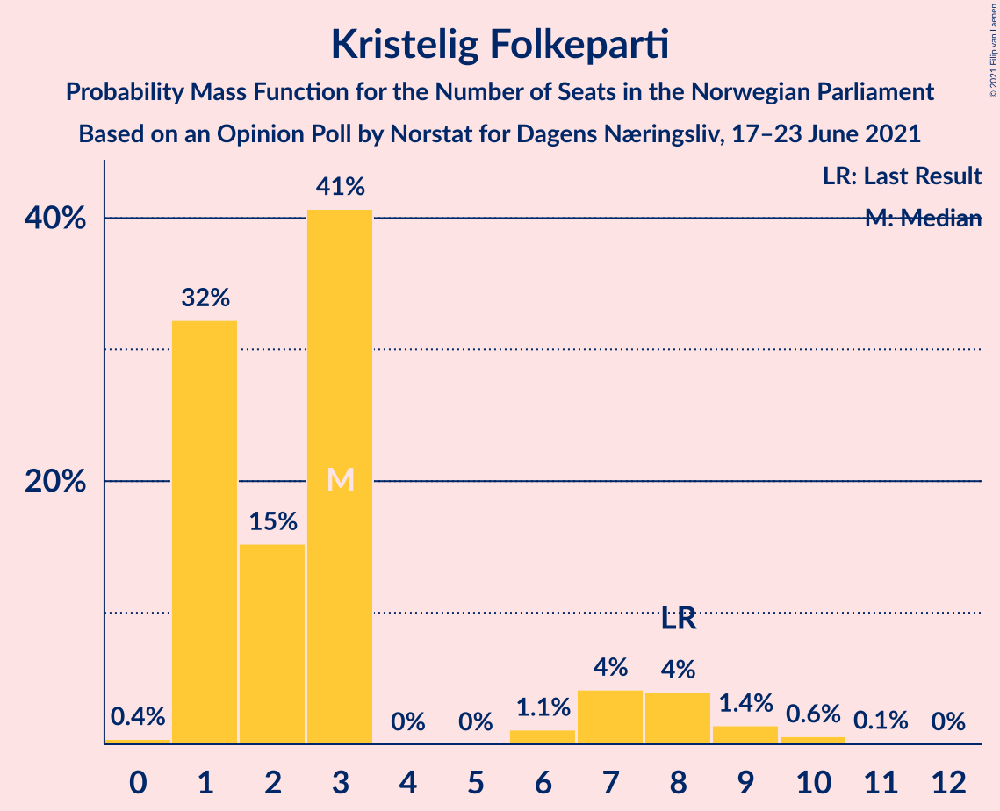

| Number of Seats | Probability | Accumulated | Special Marks |
|:---------------:|:-----------:|:-----------:|:-------------:|
| 0 | 0.4% | 100% |  |
| 1 | 32% | 99.6% |  |
| 2 | 15% | 67% |  |
| 3 | 41% | 52% | Median |
| 4 | 0% | 11% |  |
| 5 | 0% | 11% |  |
| 6 | 1.1% | 11% |  |
| 7 | 4% | 10% |  |
| 8 | 4% | 6% | Last Result |
| 9 | 1.4% | 2% |  |
| 10 | 0.6% | 0.7% |  |
| 11 | 0.1% | 0.1% |  |
| 12 | 0% | 0% |  |

### Venstre

*For a full overview of the results for this party, see the [Venstre](party-venstre.html) page.*

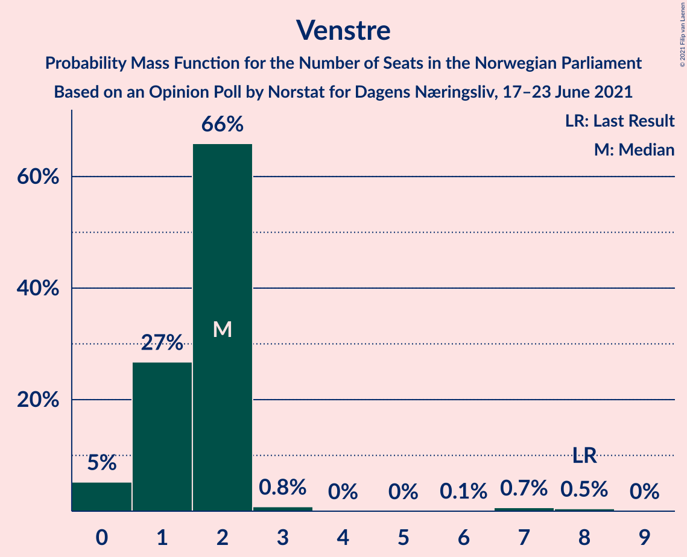

| Number of Seats | Probability | Accumulated | Special Marks |
|:---------------:|:-----------:|:-----------:|:-------------:|
| 0 | 5% | 100% |  |
| 1 | 27% | 95% |  |
| 2 | 66% | 68% | Median |
| 3 | 0.8% | 2% |  |
| 4 | 0% | 1.3% |  |
| 5 | 0% | 1.3% |  |
| 6 | 0.1% | 1.3% |  |
| 7 | 0.7% | 1.2% |  |
| 8 | 0.5% | 0.5% | Last Result |
| 9 | 0% | 0% |  |

## Coalitions

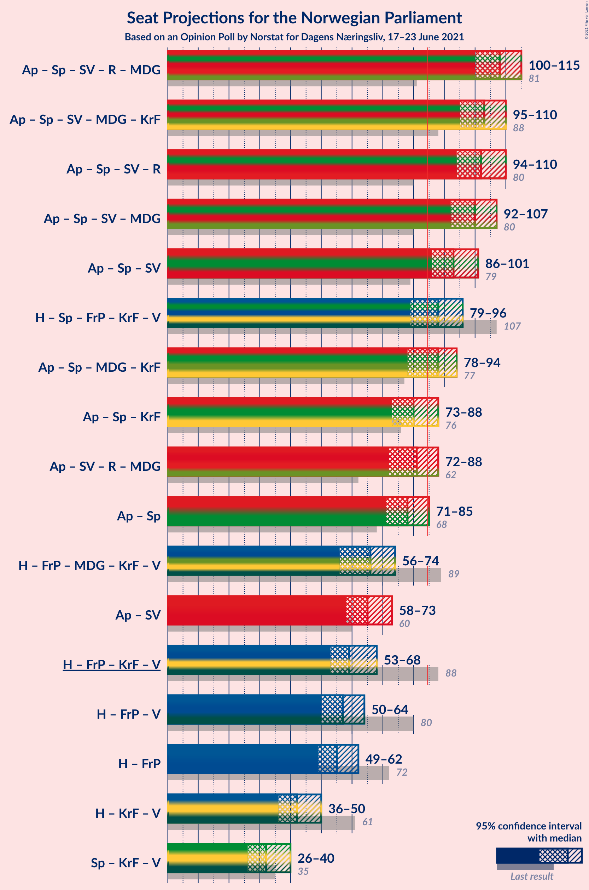

### Confidence Intervals

| Coalition | Last Result | Median | Majority? | 80% Confidence Interval | 90% Confidence Interval | 95% Confidence Interval | 99% Confidence Interval |
|:---------:|:-----------:|:------:|:---------:|:-----------------------:|:-----------------------:|:-----------------------:|:-----------------------:|
| Arbeiderpartiet – Senterpartiet – Sosialistisk Venstreparti – Rødt – Miljøpartiet De Grønne | 81 | 108 | 100% | 103–113 | 102–114 | 100–115 | 96–117 |
| Arbeiderpartiet – Senterpartiet – Sosialistisk Venstreparti – Miljøpartiet De Grønne – Kristelig Folkeparti | 88 | 103 | 100% | 97–107 | 96–108 | 95–110 | 92–113 |
| Arbeiderpartiet – Senterpartiet – Sosialistisk Venstreparti – Rødt | 80 | 102 | 100% | 97–107 | 95–108 | 94–110 | 91–111 |
| Arbeiderpartiet – Senterpartiet – Sosialistisk Venstreparti – Miljøpartiet De Grønne | 80 | 100 | 100% | 95–104 | 93–106 | 92–107 | 89–109 |
| Arbeiderpartiet – Senterpartiet – Sosialistisk Venstreparti | 79 | 93 | 99.2% | 89–98 | 87–99 | 86–101 | 84–103 |
| Høyre – Senterpartiet – Fremskrittspartiet – Kristelig Folkeparti – Venstre | 107 | 88 | 71% | 81–93 | 80–95 | 79–96 | 76–99 |
| Arbeiderpartiet – Senterpartiet – Miljøpartiet De Grønne – Kristelig Folkeparti | 77 | 88 | 73% | 81–92 | 80–92 | 78–94 | 76–97 |
| Arbeiderpartiet – Senterpartiet – Kristelig Folkeparti | 76 | 80 | 13% | 76–85 | 74–87 | 73–88 | 71–91 |
| Arbeiderpartiet – Sosialistisk Venstreparti – Rødt – Miljøpartiet De Grønne | 62 | 81 | 18% | 74–86 | 73–87 | 72–88 | 68–91 |
| Arbeiderpartiet – Senterpartiet | 68 | 78 | 3% | 73–82 | 72–84 | 71–85 | 68–87 |
| Høyre – Fremskrittspartiet – Miljøpartiet De Grønne – Kristelig Folkeparti – Venstre | 89 | 66 | 0% | 60–71 | 59–73 | 56–74 | 56–77 |
| Arbeiderpartiet – Sosialistisk Venstreparti | 60 | 65 | 0% | 61–70 | 59–72 | 58–73 | 56–75 |
| Høyre – Fremskrittspartiet – Kristelig Folkeparti – Venstre | 88 | 59 | 0% | 55–65 | 54–66 | 53–68 | 50–70 |
| Høyre – Fremskrittspartiet – Venstre | 80 | 57 | 0% | 52–62 | 51–63 | 50–64 | 48–67 |
| Høyre – Fremskrittspartiet | 72 | 55 | 0% | 51–60 | 50–62 | 49–62 | 46–65 |
| Høyre – Kristelig Folkeparti – Venstre | 61 | 42 | 0% | 38–47 | 37–48 | 36–50 | 35–53 |
| Senterpartiet – Kristelig Folkeparti – Venstre | 35 | 32 | 0% | 28–37 | 27–38 | 26–40 | 25–43 |

### Arbeiderpartiet – Senterpartiet – Sosialistisk Venstreparti – Rødt – Miljøpartiet De Grønne

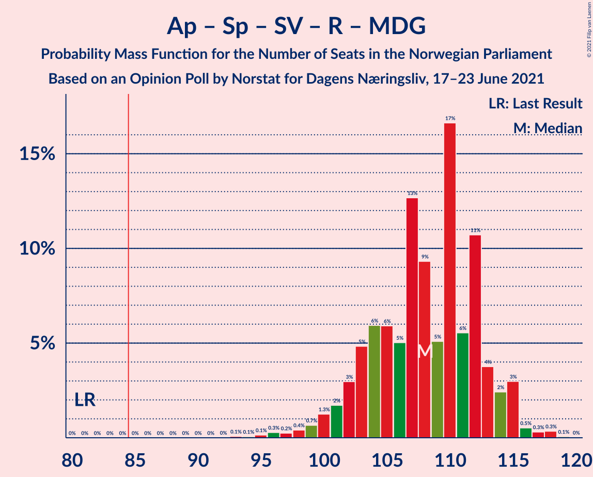

| Number of Seats | Probability | Accumulated | Special Marks |
|:---------------:|:-----------:|:-----------:|:-------------:|
| 81 | 0% | 100% | Last Result |
| 82 | 0% | 100% |  |
| 83 | 0% | 100% |  |
| 84 | 0% | 100% |  |
| 85 | 0% | 100% | Majority |
| 86 | 0% | 100% |  |
| 87 | 0% | 100% |  |
| 88 | 0% | 100% |  |
| 89 | 0% | 100% |  |
| 90 | 0% | 100% |  |
| 91 | 0% | 100% |  |
| 92 | 0% | 100% |  |
| 93 | 0.1% | 100% |  |
| 94 | 0.1% | 99.9% |  |
| 95 | 0.1% | 99.8% |  |
| 96 | 0.3% | 99.7% |  |
| 97 | 0.2% | 99.4% |  |
| 98 | 0.4% | 99.2% |  |
| 99 | 0.7% | 98.7% |  |
| 100 | 1.3% | 98% |  |
| 101 | 2% | 97% |  |
| 102 | 3% | 95% |  |
| 103 | 5% | 92% |  |
| 104 | 6% | 87% |  |
| 105 | 6% | 81% |  |
| 106 | 5% | 75% |  |
| 107 | 13% | 70% |  |
| 108 | 9% | 58% |  |
| 109 | 5% | 48% | Median |
| 110 | 17% | 43% |  |
| 111 | 6% | 27% |  |
| 112 | 11% | 21% |  |
| 113 | 4% | 10% |  |
| 114 | 2% | 7% |  |
| 115 | 3% | 4% |  |
| 116 | 0.5% | 1.3% |  |
| 117 | 0.3% | 0.8% |  |
| 118 | 0.3% | 0.4% |  |
| 119 | 0.1% | 0.1% |  |
| 120 | 0% | 0% |  |

### Arbeiderpartiet – Senterpartiet – Sosialistisk Venstreparti – Miljøpartiet De Grønne – Kristelig Folkeparti

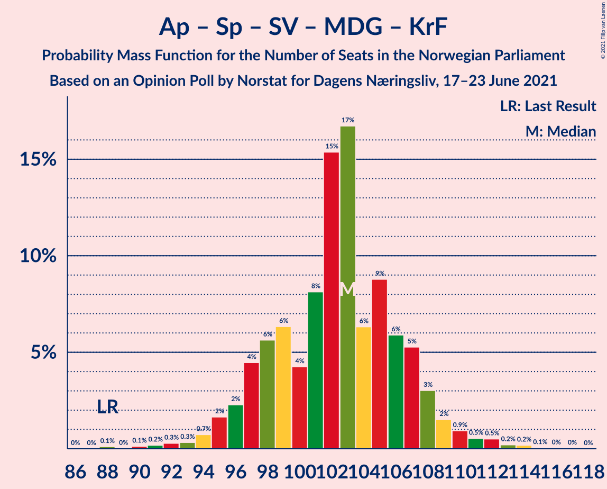

| Number of Seats | Probability | Accumulated | Special Marks |
|:---------------:|:-----------:|:-----------:|:-------------:|
| 88 | 0.1% | 100% | Last Result |
| 89 | 0% | 99.9% |  |
| 90 | 0.1% | 99.9% |  |
| 91 | 0.2% | 99.7% |  |
| 92 | 0.3% | 99.5% |  |
| 93 | 0.3% | 99.2% |  |
| 94 | 0.7% | 98.9% |  |
| 95 | 2% | 98% |  |
| 96 | 2% | 97% |  |
| 97 | 4% | 94% |  |
| 98 | 6% | 90% |  |
| 99 | 6% | 84% |  |
| 100 | 4% | 78% |  |
| 101 | 8% | 74% |  |
| 102 | 15% | 65% |  |
| 103 | 17% | 50% | Median |
| 104 | 6% | 33% |  |
| 105 | 9% | 27% |  |
| 106 | 6% | 18% |  |
| 107 | 5% | 12% |  |
| 108 | 3% | 7% |  |
| 109 | 2% | 4% |  |
| 110 | 0.9% | 3% |  |
| 111 | 0.5% | 2% |  |
| 112 | 0.5% | 1.0% |  |
| 113 | 0.2% | 0.5% |  |
| 114 | 0.2% | 0.3% |  |
| 115 | 0.1% | 0.1% |  |
| 116 | 0% | 0.1% |  |
| 117 | 0% | 0% |  |

### Arbeiderpartiet – Senterpartiet – Sosialistisk Venstreparti – Rødt

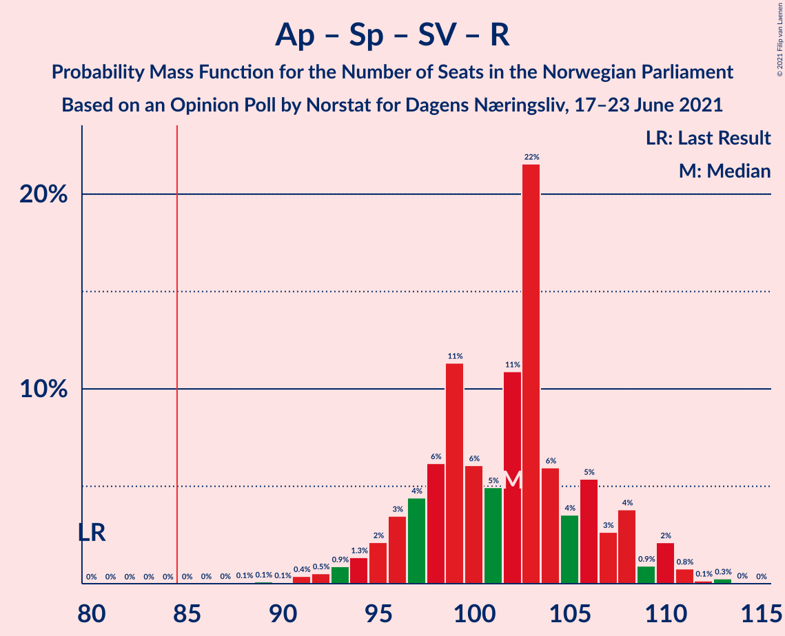

| Number of Seats | Probability | Accumulated | Special Marks |
|:---------------:|:-----------:|:-----------:|:-------------:|
| 80 | 0% | 100% | Last Result |
| 81 | 0% | 100% |  |
| 82 | 0% | 100% |  |
| 83 | 0% | 100% |  |
| 84 | 0% | 100% |  |
| 85 | 0% | 100% | Majority |
| 86 | 0% | 100% |  |
| 87 | 0% | 100% |  |
| 88 | 0.1% | 99.9% |  |
| 89 | 0.1% | 99.9% |  |
| 90 | 0.1% | 99.8% |  |
| 91 | 0.4% | 99.7% |  |
| 92 | 0.5% | 99.3% |  |
| 93 | 0.9% | 98.8% |  |
| 94 | 1.3% | 98% |  |
| 95 | 2% | 97% |  |
| 96 | 3% | 94% |  |
| 97 | 4% | 91% |  |
| 98 | 6% | 87% |  |
| 99 | 11% | 80% |  |
| 100 | 6% | 69% |  |
| 101 | 5% | 63% | Median |
| 102 | 11% | 58% |  |
| 103 | 22% | 47% |  |
| 104 | 6% | 26% |  |
| 105 | 4% | 20% |  |
| 106 | 5% | 16% |  |
| 107 | 3% | 11% |  |
| 108 | 4% | 8% |  |
| 109 | 0.9% | 4% |  |
| 110 | 2% | 3% |  |
| 111 | 0.8% | 1.2% |  |
| 112 | 0.1% | 0.5% |  |
| 113 | 0.3% | 0.3% |  |
| 114 | 0% | 0.1% |  |
| 115 | 0% | 0% |  |

### Arbeiderpartiet – Senterpartiet – Sosialistisk Venstreparti – Miljøpartiet De Grønne

| Number of Seats | Probability | Accumulated | Special Marks |
|:---------------:|:-----------:|:-----------:|:-------------:|
| 80 | 0% | 100% | Last Result |
| 81 | 0% | 100% |  |
| 82 | 0% | 100% |  |
| 83 | 0% | 100% |  |
| 84 | 0% | 100% |  |
| 85 | 0% | 100% | Majority |
| 86 | 0% | 99.9% |  |
| 87 | 0.2% | 99.9% |  |
| 88 | 0.2% | 99.8% |  |
| 89 | 0.3% | 99.6% |  |
| 90 | 0.3% | 99.3% |  |
| 91 | 1.2% | 99.0% |  |
| 92 | 1.5% | 98% |  |
| 93 | 2% | 96% |  |
| 94 | 4% | 94% |  |
| 95 | 7% | 90% |  |
| 96 | 4% | 84% |  |
| 97 | 6% | 79% |  |
| 98 | 9% | 73% |  |
| 99 | 9% | 64% |  |
| 100 | 10% | 55% | Median |
| 101 | 20% | 45% |  |
| 102 | 5% | 26% |  |
| 103 | 4% | 21% |  |
| 104 | 7% | 17% |  |
| 105 | 4% | 10% |  |
| 106 | 3% | 6% |  |
| 107 | 2% | 3% |  |
| 108 | 0.7% | 1.3% |  |
| 109 | 0.4% | 0.7% |  |
| 110 | 0.1% | 0.3% |  |
| 111 | 0.2% | 0.2% |  |
| 112 | 0% | 0.1% |  |
| 113 | 0% | 0% |  |

### Arbeiderpartiet – Senterpartiet – Sosialistisk Venstreparti

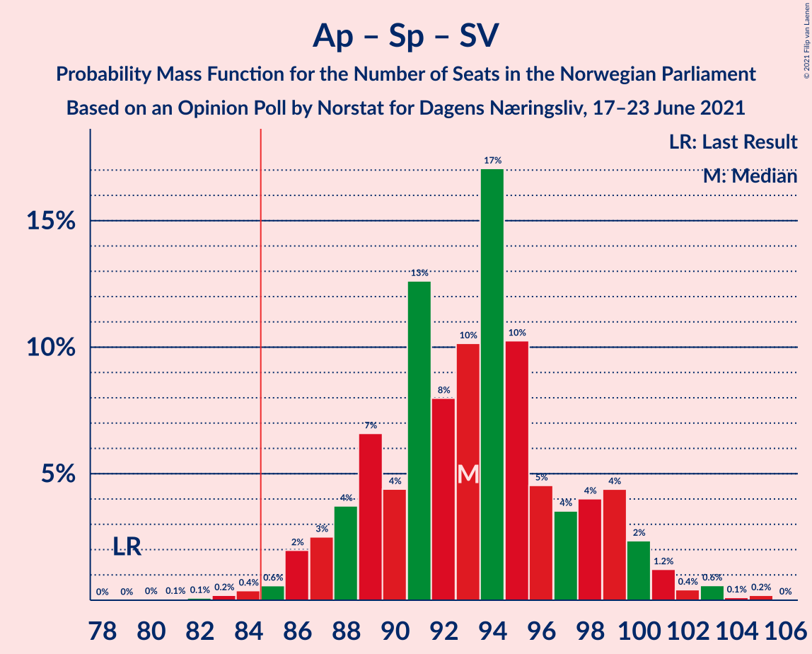

| Number of Seats | Probability | Accumulated | Special Marks |
|:---------------:|:-----------:|:-----------:|:-------------:|
| 79 | 0% | 100% | Last Result |
| 80 | 0% | 100% |  |
| 81 | 0.1% | 99.9% |  |
| 82 | 0.1% | 99.9% |  |
| 83 | 0.2% | 99.8% |  |
| 84 | 0.4% | 99.6% |  |
| 85 | 0.6% | 99.2% | Majority |
| 86 | 2% | 98.6% |  |
| 87 | 3% | 97% |  |
| 88 | 4% | 94% |  |
| 89 | 7% | 90% |  |
| 90 | 4% | 84% |  |
| 91 | 13% | 79% |  |
| 92 | 8% | 67% | Median |
| 93 | 10% | 59% |  |
| 94 | 17% | 49% |  |
| 95 | 10% | 32% |  |
| 96 | 5% | 21% |  |
| 97 | 4% | 17% |  |
| 98 | 4% | 13% |  |
| 99 | 4% | 9% |  |
| 100 | 2% | 5% |  |
| 101 | 1.2% | 3% |  |
| 102 | 0.4% | 1.3% |  |
| 103 | 0.6% | 0.9% |  |
| 104 | 0.1% | 0.3% |  |
| 105 | 0.2% | 0.2% |  |
| 106 | 0% | 0% |  |

### Høyre – Senterpartiet – Fremskrittspartiet – Kristelig Folkeparti – Venstre

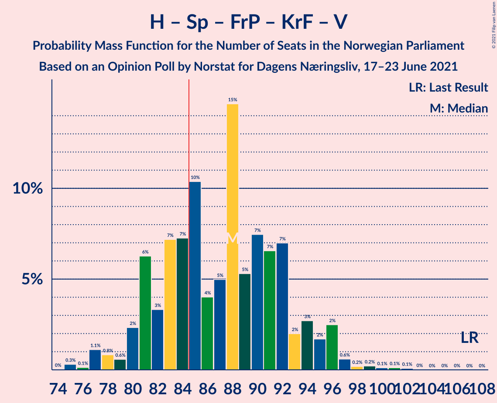

| Number of Seats | Probability | Accumulated | Special Marks |
|:---------------:|:-----------:|:-----------:|:-------------:|
| 74 | 0% | 100% |  |
| 75 | 0.3% | 99.9% |  |
| 76 | 0.1% | 99.6% |  |
| 77 | 1.1% | 99.5% |  |
| 78 | 0.8% | 98% |  |
| 79 | 0.6% | 98% |  |
| 80 | 2% | 97% |  |
| 81 | 6% | 95% |  |
| 82 | 3% | 88% |  |
| 83 | 7% | 85% |  |
| 84 | 7% | 78% |  |
| 85 | 10% | 71% | Majority |
| 86 | 4% | 60% |  |
| 87 | 5% | 56% | Median |
| 88 | 15% | 51% |  |
| 89 | 5% | 37% |  |
| 90 | 7% | 31% |  |
| 91 | 7% | 24% |  |
| 92 | 7% | 17% |  |
| 93 | 2% | 10% |  |
| 94 | 3% | 8% |  |
| 95 | 2% | 6% |  |
| 96 | 2% | 4% |  |
| 97 | 0.6% | 1.4% |  |
| 98 | 0.2% | 0.8% |  |
| 99 | 0.2% | 0.6% |  |
| 100 | 0.1% | 0.4% |  |
| 101 | 0.1% | 0.2% |  |
| 102 | 0.1% | 0.1% |  |
| 103 | 0% | 0% |  |
| 104 | 0% | 0% |  |
| 105 | 0% | 0% |  |
| 106 | 0% | 0% |  |
| 107 | 0% | 0% | Last Result |

### Arbeiderpartiet – Senterpartiet – Miljøpartiet De Grønne – Kristelig Folkeparti

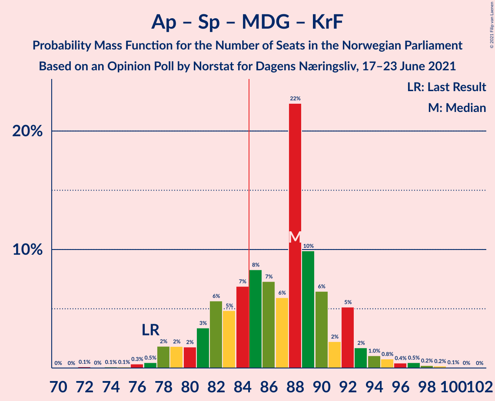

| Number of Seats | Probability | Accumulated | Special Marks |
|:---------------:|:-----------:|:-----------:|:-------------:|
| 72 | 0.1% | 100% |  |
| 73 | 0% | 99.9% |  |
| 74 | 0.1% | 99.8% |  |
| 75 | 0.1% | 99.7% |  |
| 76 | 0.3% | 99.6% |  |
| 77 | 0.5% | 99.3% | Last Result |
| 78 | 2% | 98.8% |  |
| 79 | 2% | 97% |  |
| 80 | 2% | 95% |  |
| 81 | 3% | 93% |  |
| 82 | 6% | 90% |  |
| 83 | 5% | 84% |  |
| 84 | 7% | 79% |  |
| 85 | 8% | 73% | Majority |
| 86 | 7% | 64% |  |
| 87 | 6% | 57% |  |
| 88 | 22% | 51% | Median |
| 89 | 10% | 29% |  |
| 90 | 6% | 19% |  |
| 91 | 2% | 12% |  |
| 92 | 5% | 10% |  |
| 93 | 2% | 5% |  |
| 94 | 1.0% | 3% |  |
| 95 | 0.8% | 2% |  |
| 96 | 0.4% | 1.4% |  |
| 97 | 0.5% | 1.0% |  |
| 98 | 0.2% | 0.5% |  |
| 99 | 0.2% | 0.3% |  |
| 100 | 0.1% | 0.1% |  |
| 101 | 0% | 0% |  |

### Arbeiderpartiet – Senterpartiet – Kristelig Folkeparti

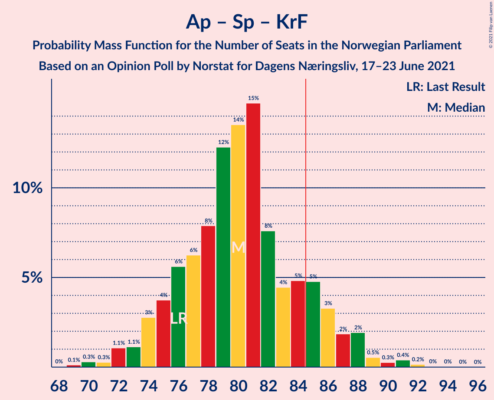

| Number of Seats | Probability | Accumulated | Special Marks |
|:---------------:|:-----------:|:-----------:|:-------------:|
| 68 | 0% | 100% |  |
| 69 | 0.1% | 99.9% |  |
| 70 | 0.3% | 99.8% |  |
| 71 | 0.3% | 99.5% |  |
| 72 | 1.1% | 99.2% |  |
| 73 | 1.1% | 98% |  |
| 74 | 3% | 97% |  |
| 75 | 4% | 94% |  |
| 76 | 6% | 91% | Last Result |
| 77 | 6% | 85% |  |
| 78 | 8% | 79% |  |
| 79 | 12% | 71% |  |
| 80 | 14% | 58% | Median |
| 81 | 15% | 45% |  |
| 82 | 8% | 30% |  |
| 83 | 4% | 23% |  |
| 84 | 5% | 18% |  |
| 85 | 5% | 13% | Majority |
| 86 | 3% | 9% |  |
| 87 | 2% | 5% |  |
| 88 | 2% | 3% |  |
| 89 | 0.5% | 1.5% |  |
| 90 | 0.3% | 0.9% |  |
| 91 | 0.4% | 0.7% |  |
| 92 | 0.2% | 0.3% |  |
| 93 | 0% | 0.1% |  |
| 94 | 0% | 0.1% |  |
| 95 | 0% | 0% |  |

### Arbeiderpartiet – Sosialistisk Venstreparti – Rødt – Miljøpartiet De Grønne

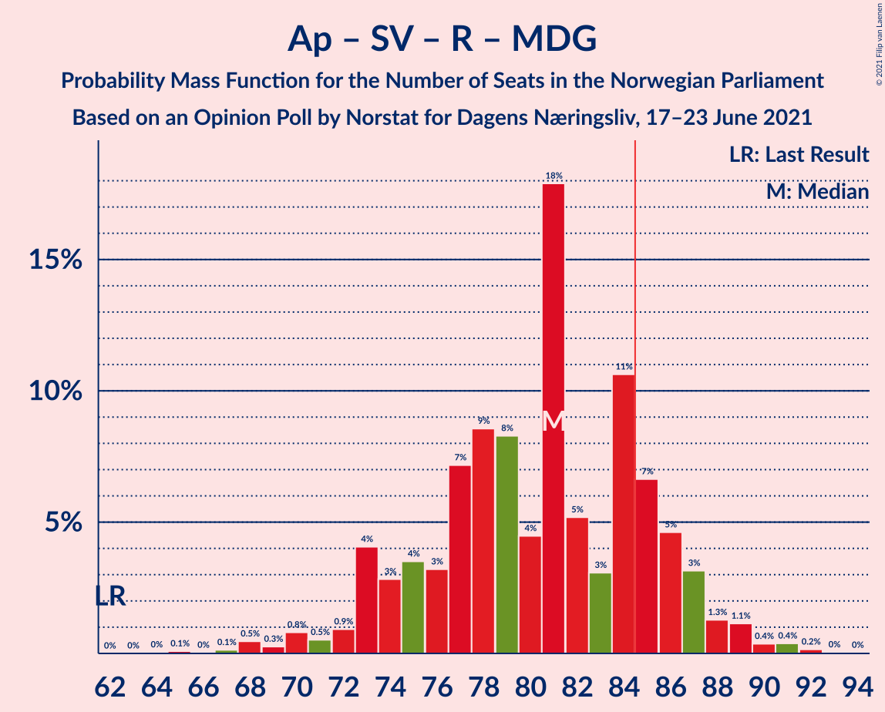

| Number of Seats | Probability | Accumulated | Special Marks |
|:---------------:|:-----------:|:-----------:|:-------------:|
| 62 | 0% | 100% | Last Result |
| 63 | 0% | 100% |  |
| 64 | 0% | 100% |  |
| 65 | 0.1% | 99.9% |  |
| 66 | 0% | 99.9% |  |
| 67 | 0.1% | 99.8% |  |
| 68 | 0.5% | 99.7% |  |
| 69 | 0.3% | 99.2% |  |
| 70 | 0.8% | 99.0% |  |
| 71 | 0.5% | 98% |  |
| 72 | 0.9% | 98% |  |
| 73 | 4% | 97% |  |
| 74 | 3% | 93% |  |
| 75 | 4% | 90% |  |
| 76 | 3% | 86% |  |
| 77 | 7% | 83% |  |
| 78 | 9% | 76% |  |
| 79 | 8% | 67% |  |
| 80 | 4% | 59% |  |
| 81 | 18% | 55% |  |
| 82 | 5% | 37% | Median |
| 83 | 3% | 32% |  |
| 84 | 11% | 28% |  |
| 85 | 7% | 18% | Majority |
| 86 | 5% | 11% |  |
| 87 | 3% | 7% |  |
| 88 | 1.3% | 3% |  |
| 89 | 1.1% | 2% |  |
| 90 | 0.4% | 1.0% |  |
| 91 | 0.4% | 0.6% |  |
| 92 | 0.2% | 0.2% |  |
| 93 | 0% | 0.1% |  |
| 94 | 0% | 0% |  |

### Arbeiderpartiet – Senterpartiet

| Number of Seats | Probability | Accumulated | Special Marks |
|:---------------:|:-----------:|:-----------:|:-------------:|
| 65 | 0% | 100% |  |
| 66 | 0.1% | 99.9% |  |
| 67 | 0.1% | 99.8% |  |
| 68 | 0.3% | 99.7% | Last Result |
| 69 | 0.5% | 99.4% |  |
| 70 | 1.1% | 98.8% |  |
| 71 | 2% | 98% |  |
| 72 | 5% | 96% |  |
| 73 | 5% | 91% |  |
| 74 | 3% | 86% |  |
| 75 | 11% | 83% |  |
| 76 | 14% | 72% |  |
| 77 | 8% | 58% | Median |
| 78 | 5% | 50% |  |
| 79 | 19% | 45% |  |
| 80 | 10% | 26% |  |
| 81 | 5% | 16% |  |
| 82 | 3% | 11% |  |
| 83 | 3% | 8% |  |
| 84 | 3% | 6% |  |
| 85 | 2% | 3% | Majority |
| 86 | 0.3% | 0.8% |  |
| 87 | 0.2% | 0.5% |  |
| 88 | 0.2% | 0.3% |  |
| 89 | 0% | 0.1% |  |
| 90 | 0% | 0% |  |

### Høyre – Fremskrittspartiet – Miljøpartiet De Grønne – Kristelig Folkeparti – Venstre

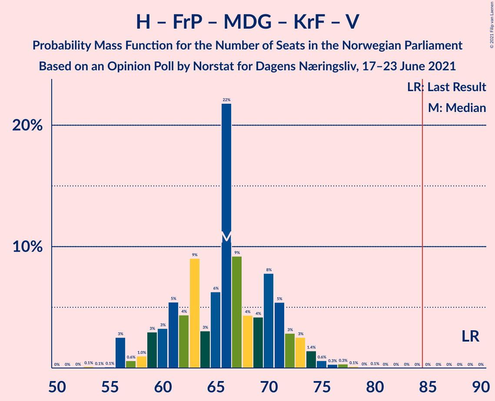

| Number of Seats | Probability | Accumulated | Special Marks |
|:---------------:|:-----------:|:-----------:|:-------------:|
| 53 | 0.1% | 100% |  |
| 54 | 0.1% | 99.8% |  |
| 55 | 0.1% | 99.8% |  |
| 56 | 3% | 99.7% |  |
| 57 | 0.6% | 97% |  |
| 58 | 1.0% | 97% |  |
| 59 | 3% | 96% |  |
| 60 | 3% | 93% |  |
| 61 | 5% | 89% |  |
| 62 | 4% | 84% |  |
| 63 | 9% | 80% |  |
| 64 | 3% | 70% |  |
| 65 | 6% | 67% |  |
| 66 | 22% | 61% |  |
| 67 | 9% | 39% |  |
| 68 | 4% | 30% | Median |
| 69 | 4% | 26% |  |
| 70 | 8% | 22% |  |
| 71 | 5% | 14% |  |
| 72 | 3% | 8% |  |
| 73 | 3% | 5% |  |
| 74 | 1.4% | 3% |  |
| 75 | 0.6% | 2% |  |
| 76 | 0.3% | 0.9% |  |
| 77 | 0.3% | 0.6% |  |
| 78 | 0.1% | 0.3% |  |
| 79 | 0% | 0.1% |  |
| 80 | 0.1% | 0.1% |  |
| 81 | 0% | 0% |  |
| 82 | 0% | 0% |  |
| 83 | 0% | 0% |  |
| 84 | 0% | 0% |  |
| 85 | 0% | 0% | Majority |
| 86 | 0% | 0% |  |
| 87 | 0% | 0% |  |
| 88 | 0% | 0% |  |
| 89 | 0% | 0% | Last Result |

### Arbeiderpartiet – Sosialistisk Venstreparti

| Number of Seats | Probability | Accumulated | Special Marks |
|:---------------:|:-----------:|:-----------:|:-------------:|
| 54 | 0% | 100% |  |
| 55 | 0.1% | 99.9% |  |
| 56 | 0.4% | 99.8% |  |
| 57 | 0.8% | 99.4% |  |
| 58 | 2% | 98.6% |  |
| 59 | 3% | 97% |  |
| 60 | 3% | 94% | Last Result |
| 61 | 5% | 91% |  |
| 62 | 8% | 86% |  |
| 63 | 10% | 78% |  |
| 64 | 10% | 68% |  |
| 65 | 9% | 58% | Median |
| 66 | 7% | 49% |  |
| 67 | 11% | 42% |  |
| 68 | 13% | 31% |  |
| 69 | 5% | 17% |  |
| 70 | 4% | 12% |  |
| 71 | 3% | 8% |  |
| 72 | 2% | 5% |  |
| 73 | 2% | 3% |  |
| 74 | 0.7% | 2% |  |
| 75 | 0.5% | 1.0% |  |
| 76 | 0.3% | 0.4% |  |
| 77 | 0% | 0.1% |  |
| 78 | 0% | 0.1% |  |
| 79 | 0% | 0% |  |

### Høyre – Fremskrittspartiet – Kristelig Folkeparti – Venstre

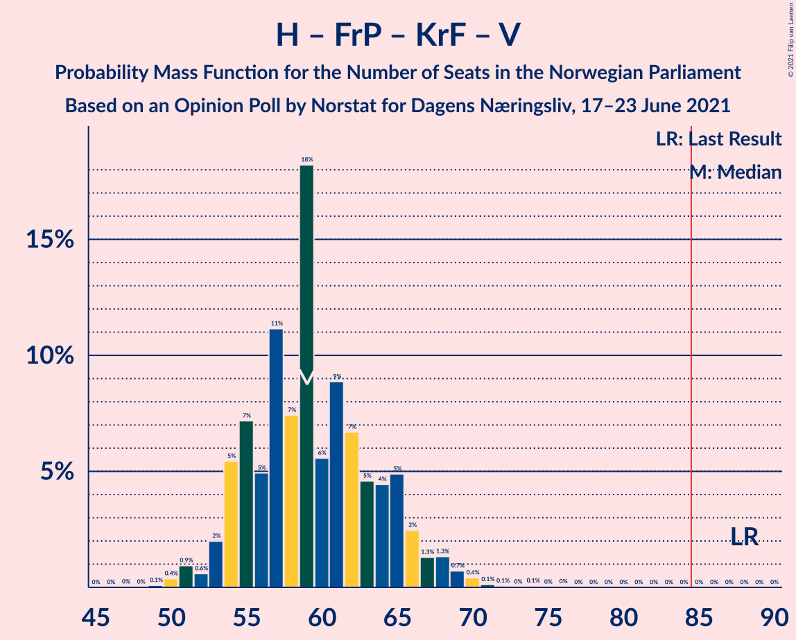

| Number of Seats | Probability | Accumulated | Special Marks |
|:---------------:|:-----------:|:-----------:|:-------------:|
| 49 | 0.1% | 100% |  |
| 50 | 0.4% | 99.9% |  |
| 51 | 0.9% | 99.5% |  |
| 52 | 0.6% | 98.5% |  |
| 53 | 2% | 98% |  |
| 54 | 5% | 96% |  |
| 55 | 7% | 91% |  |
| 56 | 5% | 83% |  |
| 57 | 11% | 78% |  |
| 58 | 7% | 67% |  |
| 59 | 18% | 60% |  |
| 60 | 6% | 42% | Median |
| 61 | 9% | 36% |  |
| 62 | 7% | 27% |  |
| 63 | 5% | 20% |  |
| 64 | 4% | 16% |  |
| 65 | 5% | 11% |  |
| 66 | 2% | 7% |  |
| 67 | 1.3% | 4% |  |
| 68 | 1.3% | 3% |  |
| 69 | 0.7% | 1.5% |  |
| 70 | 0.4% | 0.7% |  |
| 71 | 0.1% | 0.3% |  |
| 72 | 0.1% | 0.2% |  |
| 73 | 0% | 0.1% |  |
| 74 | 0.1% | 0.1% |  |
| 75 | 0% | 0.1% |  |
| 76 | 0% | 0% |  |
| 77 | 0% | 0% |  |
| 78 | 0% | 0% |  |
| 79 | 0% | 0% |  |
| 80 | 0% | 0% |  |
| 81 | 0% | 0% |  |
| 82 | 0% | 0% |  |
| 83 | 0% | 0% |  |
| 84 | 0% | 0% |  |
| 85 | 0% | 0% | Majority |
| 86 | 0% | 0% |  |
| 87 | 0% | 0% |  |
| 88 | 0% | 0% | Last Result |

### Høyre – Fremskrittspartiet – Venstre

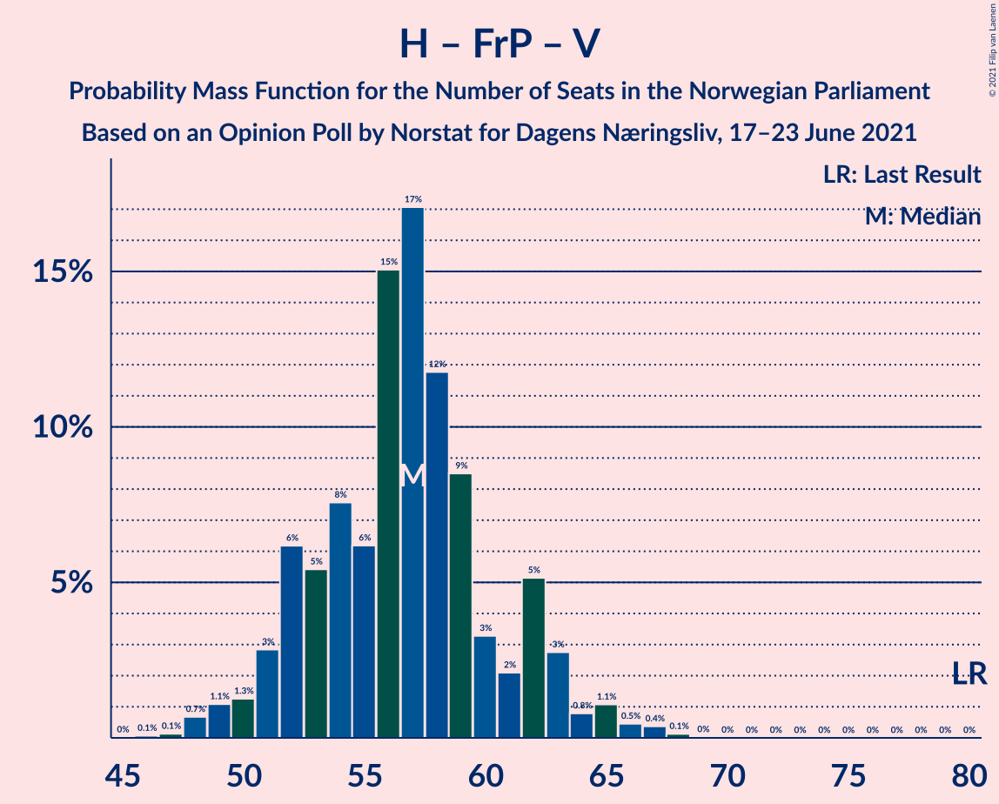

| Number of Seats | Probability | Accumulated | Special Marks |
|:---------------:|:-----------:|:-----------:|:-------------:|
| 46 | 0.1% | 100% |  |
| 47 | 0.1% | 99.9% |  |
| 48 | 0.7% | 99.8% |  |
| 49 | 1.1% | 99.1% |  |
| 50 | 1.3% | 98% |  |
| 51 | 3% | 97% |  |
| 52 | 6% | 94% |  |
| 53 | 5% | 88% |  |
| 54 | 8% | 82% |  |
| 55 | 6% | 75% |  |
| 56 | 15% | 69% |  |
| 57 | 17% | 53% | Median |
| 58 | 12% | 36% |  |
| 59 | 9% | 25% |  |
| 60 | 3% | 16% |  |
| 61 | 2% | 13% |  |
| 62 | 5% | 11% |  |
| 63 | 3% | 6% |  |
| 64 | 0.8% | 3% |  |
| 65 | 1.1% | 2% |  |
| 66 | 0.5% | 1.0% |  |
| 67 | 0.4% | 0.5% |  |
| 68 | 0.1% | 0.2% |  |
| 69 | 0% | 0% |  |
| 70 | 0% | 0% |  |
| 71 | 0% | 0% |  |
| 72 | 0% | 0% |  |
| 73 | 0% | 0% |  |
| 74 | 0% | 0% |  |
| 75 | 0% | 0% |  |
| 76 | 0% | 0% |  |
| 77 | 0% | 0% |  |
| 78 | 0% | 0% |  |
| 79 | 0% | 0% |  |
| 80 | 0% | 0% | Last Result |

### Høyre – Fremskrittspartiet

| Number of Seats | Probability | Accumulated | Special Marks |
|:---------------:|:-----------:|:-----------:|:-------------:|
| 44 | 0% | 100% |  |
| 45 | 0.1% | 99.9% |  |
| 46 | 0.7% | 99.8% |  |
| 47 | 0.9% | 99.2% |  |
| 48 | 0.7% | 98% |  |
| 49 | 2% | 98% |  |
| 50 | 3% | 95% |  |
| 51 | 8% | 93% |  |
| 52 | 8% | 85% |  |
| 53 | 5% | 77% |  |
| 54 | 13% | 72% |  |
| 55 | 21% | 59% | Median |
| 56 | 13% | 38% |  |
| 57 | 8% | 25% |  |
| 58 | 3% | 17% |  |
| 59 | 3% | 14% |  |
| 60 | 4% | 11% |  |
| 61 | 1.3% | 7% |  |
| 62 | 3% | 5% |  |
| 63 | 1.2% | 2% |  |
| 64 | 0.3% | 1.0% |  |
| 65 | 0.4% | 0.7% |  |
| 66 | 0.2% | 0.3% |  |
| 67 | 0% | 0% |  |
| 68 | 0% | 0% |  |
| 69 | 0% | 0% |  |
| 70 | 0% | 0% |  |
| 71 | 0% | 0% |  |
| 72 | 0% | 0% | Last Result |

### Høyre – Kristelig Folkeparti – Venstre

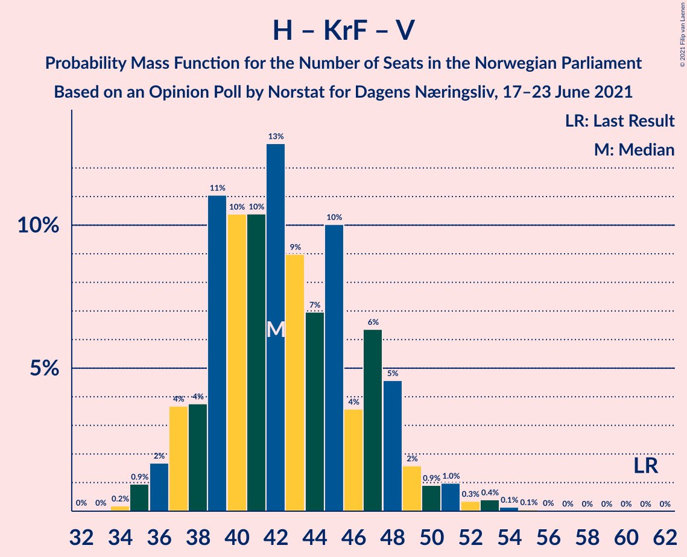

| Number of Seats | Probability | Accumulated | Special Marks |
|:---------------:|:-----------:|:-----------:|:-------------:|
| 33 | 0% | 100% |  |
| 34 | 0.2% | 99.9% |  |
| 35 | 0.9% | 99.7% |  |
| 36 | 2% | 98.8% |  |
| 37 | 4% | 97% |  |
| 38 | 4% | 93% |  |
| 39 | 11% | 90% |  |
| 40 | 10% | 79% |  |
| 41 | 10% | 68% |  |
| 42 | 13% | 58% |  |
| 43 | 9% | 45% | Median |
| 44 | 7% | 36% |  |
| 45 | 10% | 29% |  |
| 46 | 4% | 19% |  |
| 47 | 6% | 15% |  |
| 48 | 5% | 9% |  |
| 49 | 2% | 4% |  |
| 50 | 0.9% | 3% |  |
| 51 | 1.0% | 2% |  |
| 52 | 0.3% | 1.0% |  |
| 53 | 0.4% | 0.7% |  |
| 54 | 0.1% | 0.3% |  |
| 55 | 0.1% | 0.1% |  |
| 56 | 0% | 0.1% |  |
| 57 | 0% | 0% |  |
| 58 | 0% | 0% |  |
| 59 | 0% | 0% |  |
| 60 | 0% | 0% |  |
| 61 | 0% | 0% | Last Result |

### Senterpartiet – Kristelig Folkeparti – Venstre

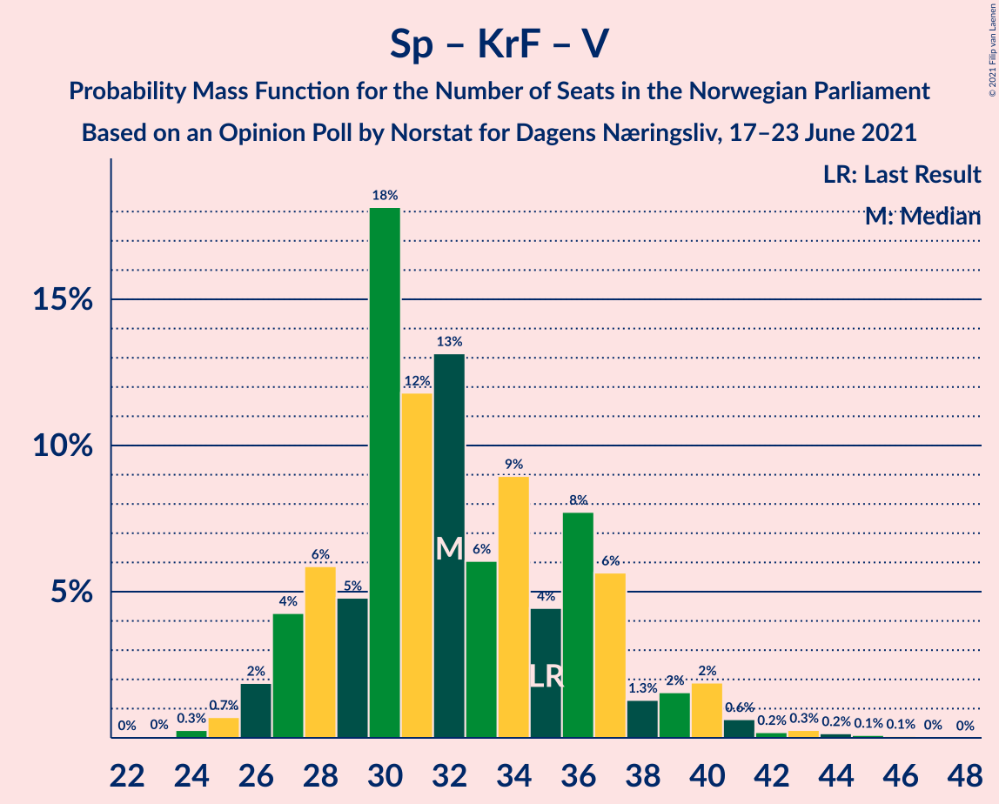

| Number of Seats | Probability | Accumulated | Special Marks |
|:---------------:|:-----------:|:-----------:|:-------------:|
| 23 | 0% | 100% |  |
| 24 | 0.3% | 99.9% |  |
| 25 | 0.7% | 99.7% |  |
| 26 | 2% | 98.9% |  |
| 27 | 4% | 97% |  |
| 28 | 6% | 93% |  |
| 29 | 5% | 87% |  |
| 30 | 18% | 82% |  |
| 31 | 12% | 64% |  |
| 32 | 13% | 52% | Median |
| 33 | 6% | 39% |  |
| 34 | 9% | 33% |  |
| 35 | 4% | 24% | Last Result |
| 36 | 8% | 20% |  |
| 37 | 6% | 12% |  |
| 38 | 1.3% | 6% |  |
| 39 | 2% | 5% |  |
| 40 | 2% | 3% |  |
| 41 | 0.6% | 1.5% |  |
| 42 | 0.2% | 0.8% |  |
| 43 | 0.3% | 0.6% |  |
| 44 | 0.2% | 0.4% |  |
| 45 | 0.1% | 0.2% |  |
| 46 | 0.1% | 0.1% |  |
| 47 | 0% | 0.1% |  |
| 48 | 0% | 0% |  |

## Technical Information

### Opinion Poll

+ **Polling firm:** Norstat
+ **Commissioner(s):** Dagens Næringsliv
+ **Fieldwork period:** 17–23 June 2021

### Calculations

+ **Sample size:** 750
+ **Simulations done:** 1,048,576
+ **Error estimate:** 1.81%

