# Opinion Poll by Ipsos MMI for Dagbladet, 28–30 June 2021

<a href="#voting-intentions">Voting Intentions</a> | <a href="#seats">Seats</a> | <a href="#coalitions">Coalitions</a> | <a href="#technical-information">Technical Information</a>

## Voting Intentions

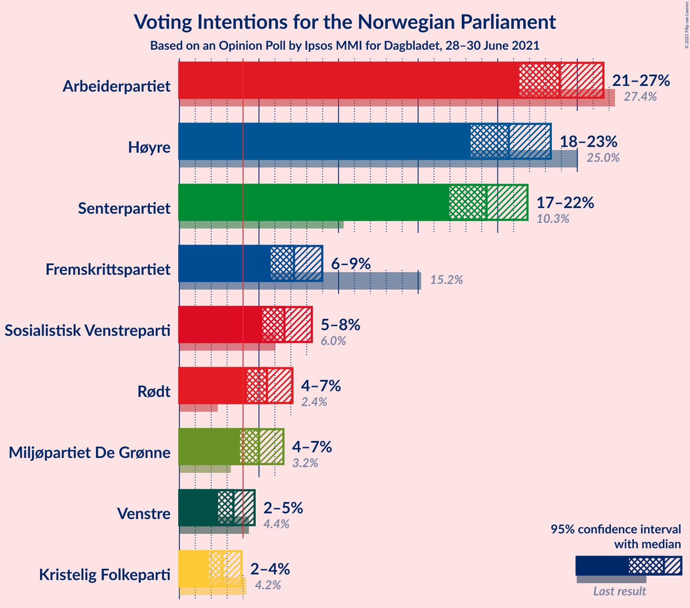

### Confidence Intervals

| Party | Last Result | Poll Result | 80% Confidence Interval | 90% Confidence Interval | 95% Confidence Interval | 99% Confidence Interval |
|:-----:|:-----------:|:-----------:|:-----------------------:|:-----------------------:|:-----------------------:|:-----------------------:|
| Arbeiderpartiet | 27.4% | 23.9% | 22.2–25.7% |21.8–26.2% |21.4–26.6% |20.6–27.5% |
| Høyre | 25.0% | 20.7% | 19.1–22.4% |18.7–22.9% |18.3–23.3% |17.6–24.2% |
| Senterpartiet | 10.3% | 19.3% | 17.8–21.0% |17.3–21.5% |17.0–21.9% |16.3–22.7% |
| Fremskrittspartiet | 15.2% | 7.2% | 6.2–8.4% |6.0–8.7% |5.7–9.0% |5.3–9.6% |
| Sosialistisk Venstreparti | 6.0% | 6.6% | 5.7–7.7% |5.4–8.0% |5.2–8.3% |4.8–8.9% |
| Rødt | 2.4% | 5.5% | 4.7–6.5% |4.4–6.8% |4.3–7.1% |3.9–7.6% |
| Miljøpartiet De Grønne | 3.2% | 5.0% | 4.2–6.0% |4.0–6.3% |3.8–6.5% |3.5–7.1% |
| Venstre | 4.4% | 3.4% | 2.8–4.3% |2.6–4.5% |2.4–4.7% |2.2–5.2% |
| Kristelig Folkeparti | 4.2% | 2.7% | 2.1–3.5% |2.0–3.7% |1.9–3.9% |1.6–4.3% |

*Note:* The poll result column reflects the actual value used in the calculations. Published results may vary slightly, and in addition be rounded to fewer digits.

## Seats

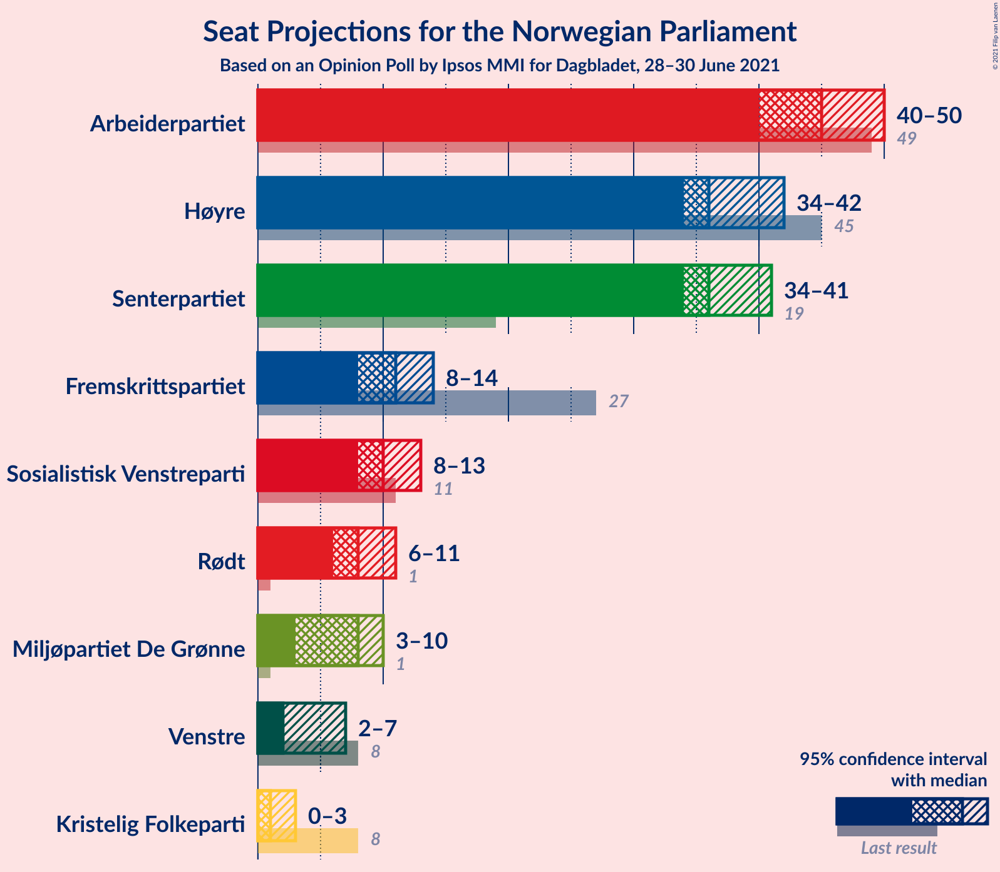

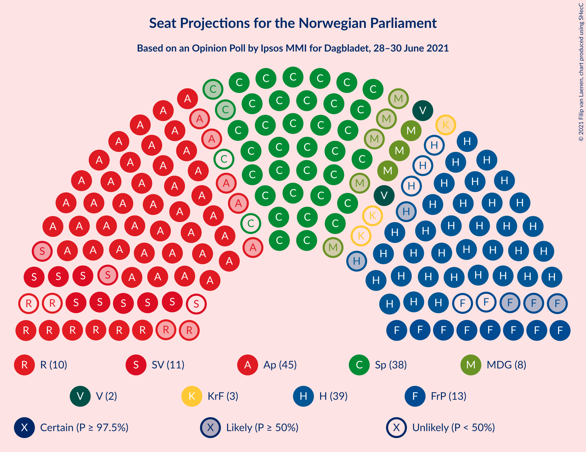

### Confidence Intervals

| Party | Last Result | Median | 80% Confidence Interval | 90% Confidence Interval | 95% Confidence Interval | 99% Confidence Interval |
|:-----:|:-----------:|:------:|:-----------------------:|:-----------------------:|:-----------------------:|:-----------------------:|
| <a href="#arbeiderpartiet">Arbeiderpartiet</a> | 49 | 45 | 42–48 |41–49 |40–50 |39–52 |
| <a href="#høyre">Høyre</a> | 45 | 36 | 35–40 |34–41 |34–42 |32–43 |
| <a href="#senterpartiet">Senterpartiet</a> | 19 | 36 | 35–40 |35–41 |34–41 |33–43 |
| <a href="#fremskrittspartiet">Fremskrittspartiet</a> | 27 | 11 | 9–13 |9–14 |8–14 |8–15 |
| <a href="#sosialistisk-venstreparti">Sosialistisk Venstreparti</a> | 11 | 10 | 8–12 |8–13 |8–13 |7–14 |
| <a href="#rødt">Rødt</a> | 1 | 8 | 7–10 |6–10 |6–11 |2–11 |
| <a href="#miljøpartiet-de-grønne">Miljøpartiet De Grønne</a> | 1 | 8 | 6–9 |6–9 |3–10 |2–11 |
| <a href="#venstre">Venstre</a> | 8 | 2 | 2–6 |2–7 |2–7 |1–8 |
| <a href="#kristelig-folkeparti">Kristelig Folkeparti</a> | 8 | 1 | 1–3 |0–3 |0–3 |0–6 |

### Arbeiderpartiet

*For a full overview of the results for this party, see the [Arbeiderpartiet](party-arbeiderpartiet.html) page.*

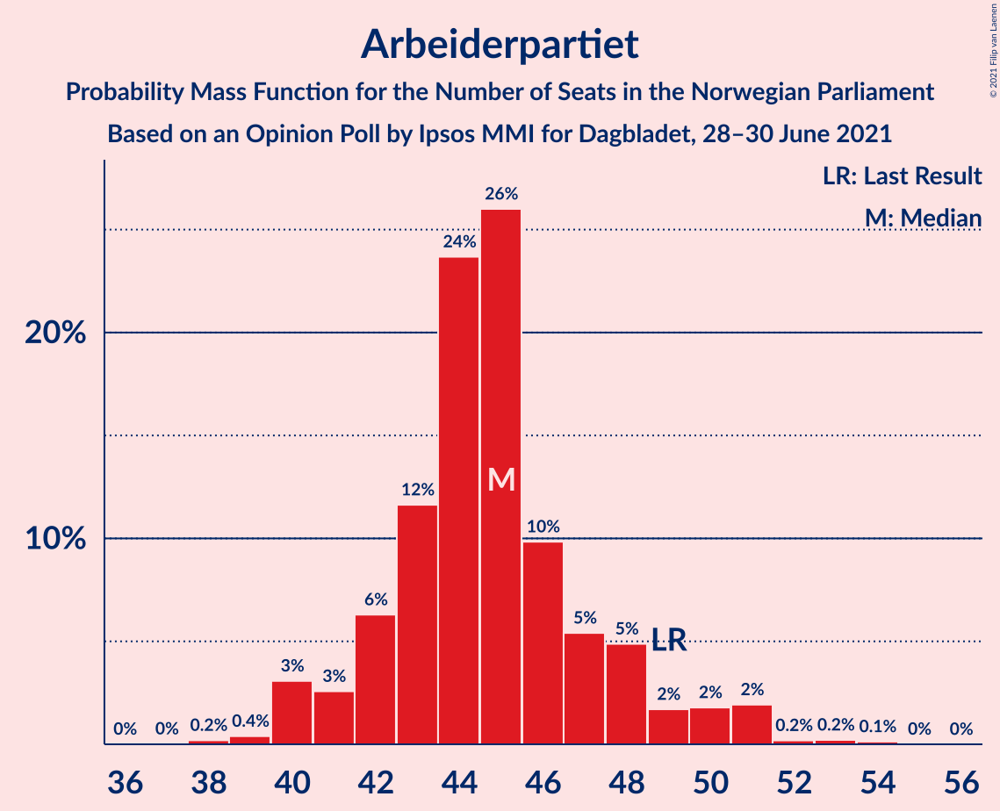

| Number of Seats | Probability | Accumulated | Special Marks |
|:---------------:|:-----------:|:-----------:|:-------------:|
| 38 | 0.2% | 100% |  |
| 39 | 0.4% | 99.8% |  |
| 40 | 3% | 99.4% |  |
| 41 | 3% | 96% |  |
| 42 | 6% | 94% |  |
| 43 | 12% | 87% |  |
| 44 | 24% | 76% |  |
| 45 | 26% | 52% | Median |
| 46 | 10% | 26% |  |
| 47 | 5% | 16% |  |
| 48 | 5% | 11% |  |
| 49 | 2% | 6% | Last Result |
| 50 | 2% | 4% |  |
| 51 | 2% | 2% |  |
| 52 | 0.2% | 0.5% |  |
| 53 | 0.2% | 0.4% |  |
| 54 | 0.1% | 0.1% |  |
| 55 | 0% | 0% |  |

### Høyre

*For a full overview of the results for this party, see the [Høyre](party-høyre.html) page.*

| Number of Seats | Probability | Accumulated | Special Marks |
|:---------------:|:-----------:|:-----------:|:-------------:|
| 30 | 0% | 100% |  |
| 31 | 0.1% | 99.9% |  |
| 32 | 0.4% | 99.9% |  |
| 33 | 0.9% | 99.5% |  |
| 34 | 5% | 98.6% |  |
| 35 | 24% | 94% |  |
| 36 | 23% | 70% | Median |
| 37 | 18% | 47% |  |
| 38 | 9% | 29% |  |
| 39 | 8% | 19% |  |
| 40 | 6% | 12% |  |
| 41 | 3% | 6% |  |
| 42 | 2% | 3% |  |
| 43 | 1.0% | 1.4% |  |
| 44 | 0.3% | 0.3% |  |
| 45 | 0.1% | 0.1% | Last Result |
| 46 | 0% | 0% |  |

### Senterpartiet

*For a full overview of the results for this party, see the [Senterpartiet](party-senterpartiet.html) page.*

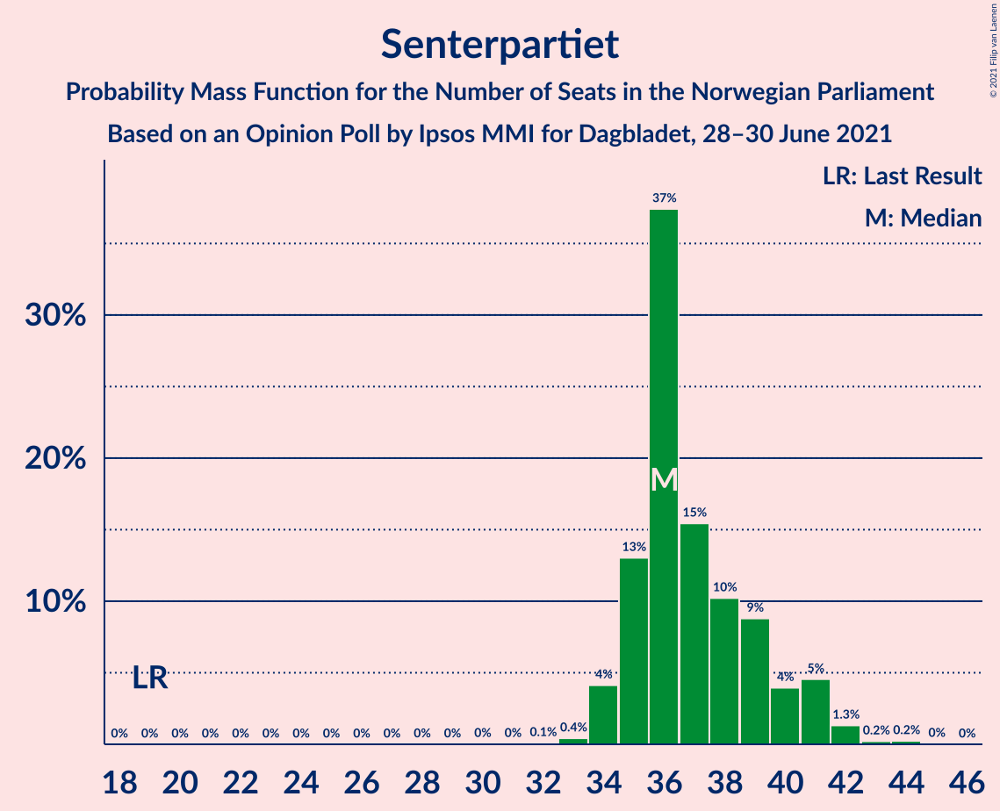

| Number of Seats | Probability | Accumulated | Special Marks |
|:---------------:|:-----------:|:-----------:|:-------------:|
| 19 | 0% | 100% | Last Result |
| 20 | 0% | 100% |  |
| 21 | 0% | 100% |  |
| 22 | 0% | 100% |  |
| 23 | 0% | 100% |  |
| 24 | 0% | 100% |  |
| 25 | 0% | 100% |  |
| 26 | 0% | 100% |  |
| 27 | 0% | 100% |  |
| 28 | 0% | 100% |  |
| 29 | 0% | 100% |  |
| 30 | 0% | 100% |  |
| 31 | 0% | 99.9% |  |
| 32 | 0.1% | 99.9% |  |
| 33 | 0.4% | 99.8% |  |
| 34 | 4% | 99.4% |  |
| 35 | 13% | 95% |  |
| 36 | 37% | 82% | Median |
| 37 | 15% | 45% |  |
| 38 | 10% | 29% |  |
| 39 | 9% | 19% |  |
| 40 | 4% | 10% |  |
| 41 | 5% | 6% |  |
| 42 | 1.3% | 2% |  |
| 43 | 0.2% | 0.5% |  |
| 44 | 0.2% | 0.3% |  |
| 45 | 0% | 0.1% |  |
| 46 | 0% | 0% |  |

### Fremskrittspartiet

*For a full overview of the results for this party, see the [Fremskrittspartiet](party-fremskrittspartiet.html) page.*

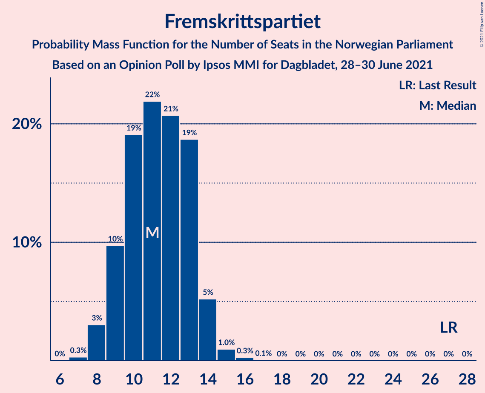

| Number of Seats | Probability | Accumulated | Special Marks |
|:---------------:|:-----------:|:-----------:|:-------------:|
| 7 | 0.3% | 100% |  |
| 8 | 3% | 99.7% |  |
| 9 | 10% | 97% |  |
| 10 | 19% | 87% |  |
| 11 | 22% | 68% | Median |
| 12 | 21% | 46% |  |
| 13 | 19% | 25% |  |
| 14 | 5% | 7% |  |
| 15 | 1.0% | 1.3% |  |
| 16 | 0.3% | 0.3% |  |
| 17 | 0.1% | 0.1% |  |
| 18 | 0% | 0% |  |
| 19 | 0% | 0% |  |
| 20 | 0% | 0% |  |
| 21 | 0% | 0% |  |
| 22 | 0% | 0% |  |
| 23 | 0% | 0% |  |
| 24 | 0% | 0% |  |
| 25 | 0% | 0% |  |
| 26 | 0% | 0% |  |
| 27 | 0% | 0% | Last Result |

### Sosialistisk Venstreparti

*For a full overview of the results for this party, see the [Sosialistisk Venstreparti](party-sosialistiskvenstreparti.html) page.*

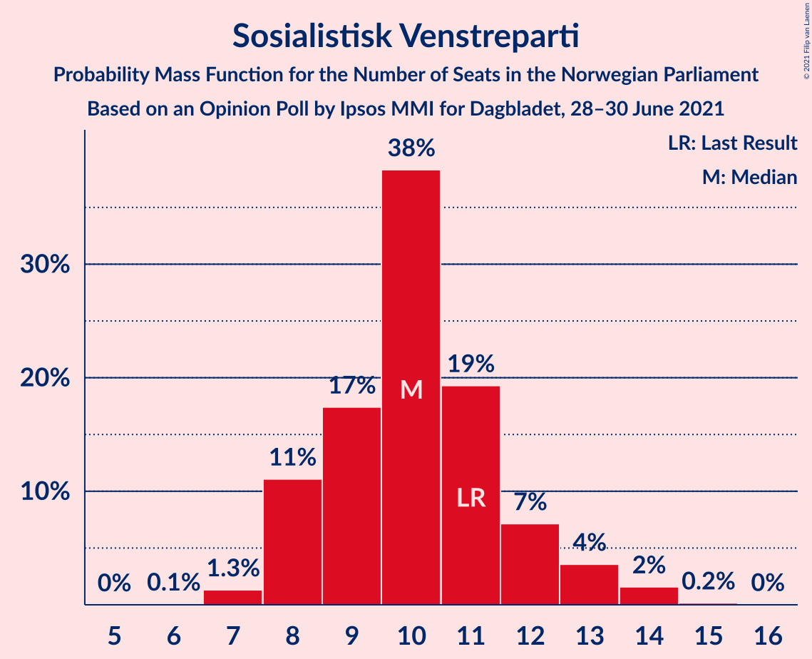

| Number of Seats | Probability | Accumulated | Special Marks |
|:---------------:|:-----------:|:-----------:|:-------------:|
| 6 | 0.1% | 100% |  |
| 7 | 1.3% | 99.9% |  |
| 8 | 11% | 98.6% |  |
| 9 | 17% | 88% |  |
| 10 | 38% | 70% | Median |
| 11 | 19% | 32% | Last Result |
| 12 | 7% | 12% |  |
| 13 | 4% | 5% |  |
| 14 | 2% | 2% |  |
| 15 | 0.2% | 0.2% |  |
| 16 | 0% | 0% |  |

### Rødt

*For a full overview of the results for this party, see the [Rødt](party-rødt.html) page.*

| Number of Seats | Probability | Accumulated | Special Marks |
|:---------------:|:-----------:|:-----------:|:-------------:|
| 1 | 0% | 100% | Last Result |
| 2 | 1.0% | 100% |  |
| 3 | 0% | 99.0% |  |
| 4 | 0% | 99.0% |  |
| 5 | 0% | 99.0% |  |
| 6 | 4% | 99.0% |  |
| 7 | 12% | 95% |  |
| 8 | 40% | 83% | Median |
| 9 | 18% | 43% |  |
| 10 | 22% | 25% |  |
| 11 | 3% | 3% |  |
| 12 | 0.4% | 0.5% |  |
| 13 | 0.1% | 0.1% |  |
| 14 | 0% | 0% |  |

### Miljøpartiet De Grønne

*For a full overview of the results for this party, see the [Miljøpartiet De Grønne](party-miljøpartietdegrønne.html) page.*

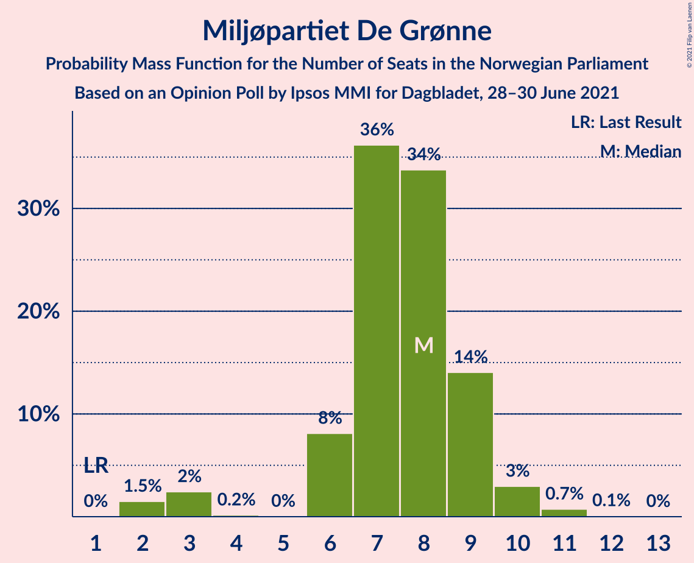

| Number of Seats | Probability | Accumulated | Special Marks |
|:---------------:|:-----------:|:-----------:|:-------------:|
| 1 | 0% | 100% | Last Result |
| 2 | 1.5% | 100% |  |
| 3 | 2% | 98% |  |
| 4 | 0.2% | 96% |  |
| 5 | 0% | 96% |  |
| 6 | 8% | 96% |  |
| 7 | 36% | 88% |  |
| 8 | 34% | 52% | Median |
| 9 | 14% | 18% |  |
| 10 | 3% | 4% |  |
| 11 | 0.7% | 0.8% |  |
| 12 | 0.1% | 0.1% |  |
| 13 | 0% | 0% |  |

### Venstre

*For a full overview of the results for this party, see the [Venstre](party-venstre.html) page.*

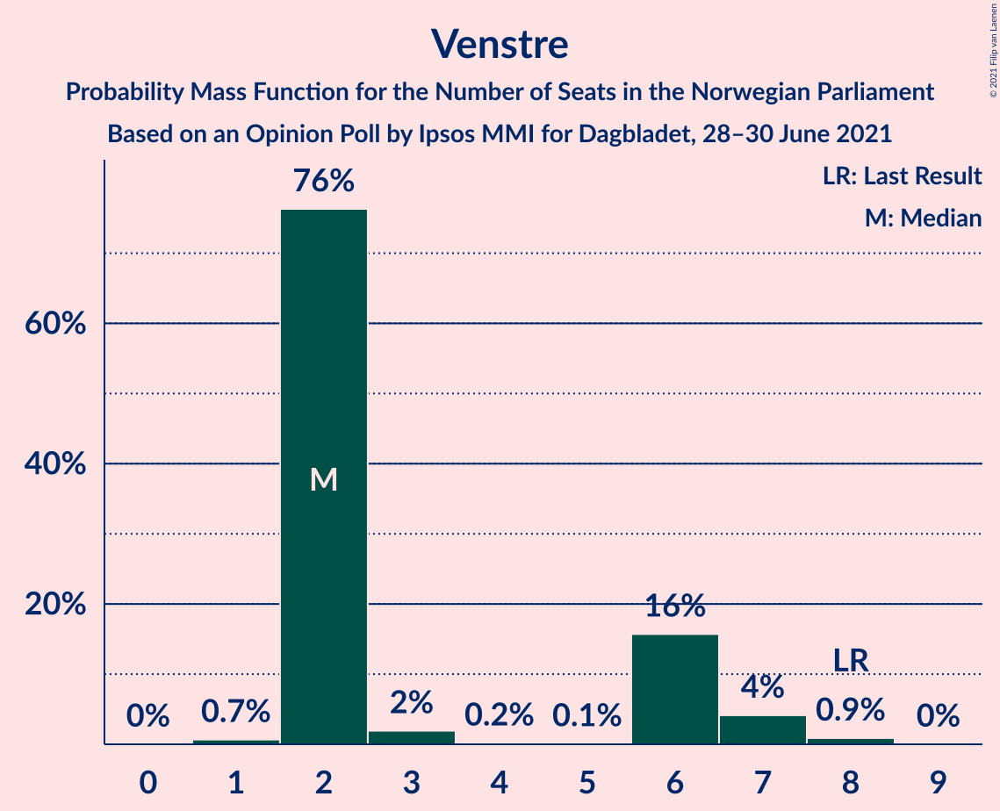

| Number of Seats | Probability | Accumulated | Special Marks |
|:---------------:|:-----------:|:-----------:|:-------------:|
| 1 | 0.7% | 100% |  |
| 2 | 76% | 99.3% | Median |
| 3 | 2% | 23% |  |
| 4 | 0.2% | 21% |  |
| 5 | 0.1% | 21% |  |
| 6 | 16% | 21% |  |
| 7 | 4% | 5% |  |
| 8 | 0.9% | 0.9% | Last Result |
| 9 | 0% | 0% |  |

### Kristelig Folkeparti

*For a full overview of the results for this party, see the [Kristelig Folkeparti](party-kristeligfolkeparti.html) page.*

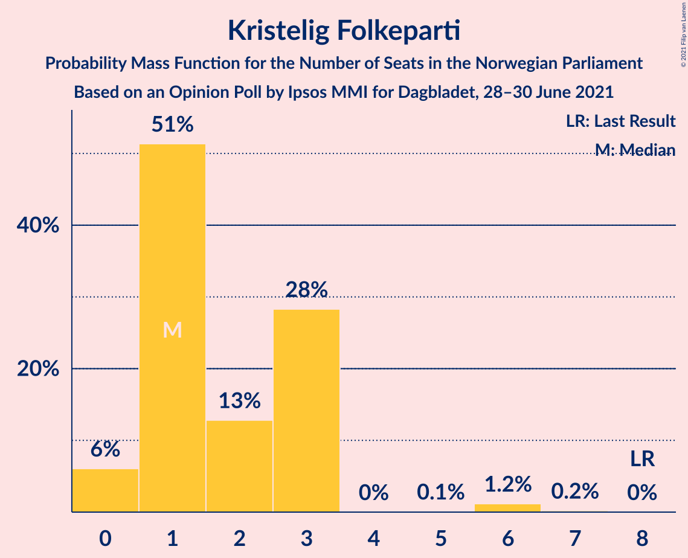

| Number of Seats | Probability | Accumulated | Special Marks |
|:---------------:|:-----------:|:-----------:|:-------------:|
| 0 | 6% | 100% |  |
| 1 | 51% | 94% | Median |
| 2 | 13% | 43% |  |
| 3 | 28% | 30% |  |
| 4 | 0% | 1.5% |  |
| 5 | 0.1% | 1.5% |  |
| 6 | 1.2% | 1.4% |  |
| 7 | 0.2% | 0.2% |  |
| 8 | 0% | 0% | Last Result |

## Coalitions

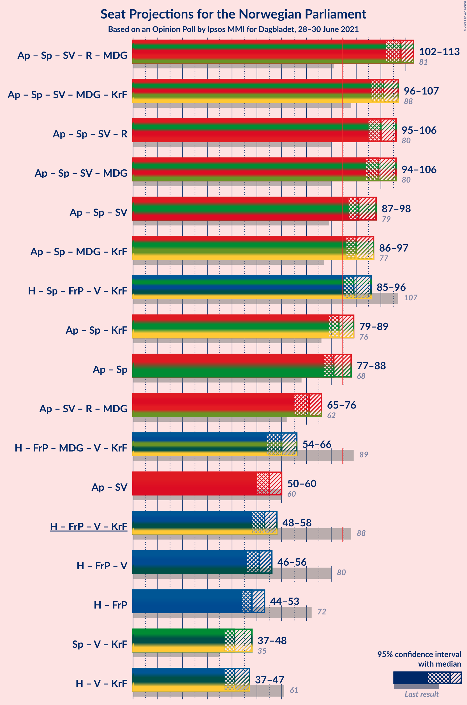

### Confidence Intervals

| Coalition | Last Result | Median | Majority? | 80% Confidence Interval | 90% Confidence Interval | 95% Confidence Interval | 99% Confidence Interval |
|:---------:|:-----------:|:------:|:---------:|:-----------------------:|:-----------------------:|:-----------------------:|:-----------------------:|
| Arbeiderpartiet – Senterpartiet – Sosialistisk Venstreparti – Rødt – Miljøpartiet De Grønne | 81 | 108 | 100% | 104–111 | 103–112 | 102–113 | 100–114 |
| Arbeiderpartiet – Senterpartiet – Sosialistisk Venstreparti – Miljøpartiet De Grønne – Kristelig Folkeparti | 88 | 101 | 100% | 98–104 | 97–106 | 96–107 | 93–108 |
| Arbeiderpartiet – Senterpartiet – Sosialistisk Venstreparti – Rødt | 80 | 100 | 100% | 97–103 | 96–105 | 95–106 | 93–107 |
| Arbeiderpartiet – Senterpartiet – Sosialistisk Venstreparti – Miljøpartiet De Grønne | 80 | 99 | 100% | 96–103 | 95–104 | 94–106 | 92–106 |
| Arbeiderpartiet – Senterpartiet – Sosialistisk Venstreparti | 79 | 91 | 99.8% | 89–95 | 88–97 | 87–98 | 85–100 |
| Arbeiderpartiet – Senterpartiet – Miljøpartiet De Grønne – Kristelig Folkeparti | 77 | 90 | 98.8% | 88–94 | 87–96 | 86–97 | 83–98 |
| Høyre – Senterpartiet – Fremskrittspartiet – Venstre – Kristelig Folkeparti | 107 | 89 | 98% | 86–93 | 85–95 | 85–96 | 84–97 |
| Arbeiderpartiet – Senterpartiet – Kristelig Folkeparti | 76 | 83 | 25% | 81–87 | 80–88 | 79–89 | 77–92 |
| Arbeiderpartiet – Senterpartiet | 68 | 81 | 13% | 79–85 | 78–87 | 77–88 | 76–90 |
| Arbeiderpartiet – Sosialistisk Venstreparti – Rødt – Miljøpartiet De Grønne | 62 | 71 | 0% | 67–74 | 66–75 | 65–76 | 63–78 |
| Høyre – Fremskrittspartiet – Miljøpartiet De Grønne – Venstre – Kristelig Folkeparti | 89 | 60 | 0% | 57–64 | 56–64 | 54–66 | 53–68 |
| Arbeiderpartiet – Sosialistisk Venstreparti | 60 | 55 | 0% | 52–58 | 51–59 | 50–60 | 49–62 |
| Høyre – Fremskrittspartiet – Venstre – Kristelig Folkeparti | 88 | 53 | 0% | 49–56 | 48–57 | 48–58 | 46–60 |
| Høyre – Fremskrittspartiet – Venstre | 80 | 51 | 0% | 48–54 | 47–56 | 46–56 | 45–59 |
| Høyre – Fremskrittspartiet | 72 | 48 | 0% | 45–51 | 45–52 | 44–53 | 43–55 |
| Senterpartiet – Venstre – Kristelig Folkeparti | 35 | 41 | 0% | 39–45 | 38–46 | 37–48 | 36–50 |
| Høyre – Venstre – Kristelig Folkeparti | 61 | 41 | 0% | 38–45 | 37–47 | 37–47 | 36–50 |

### Arbeiderpartiet – Senterpartiet – Sosialistisk Venstreparti – Rødt – Miljøpartiet De Grønne

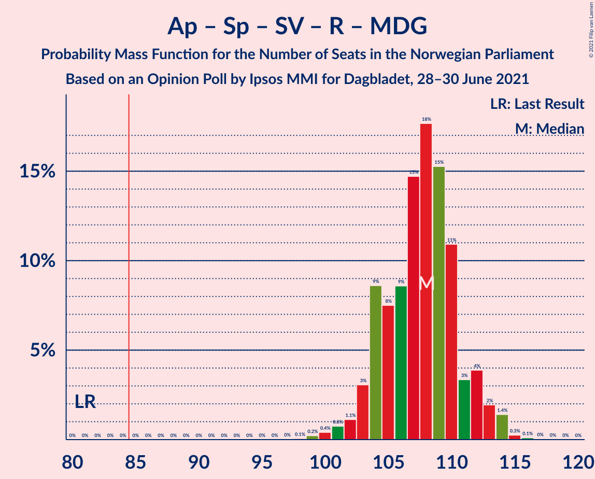

| Number of Seats | Probability | Accumulated | Special Marks |
|:---------------:|:-----------:|:-----------:|:-------------:|
| 81 | 0% | 100% | Last Result |
| 82 | 0% | 100% |  |
| 83 | 0% | 100% |  |
| 84 | 0% | 100% |  |
| 85 | 0% | 100% | Majority |
| 86 | 0% | 100% |  |
| 87 | 0% | 100% |  |
| 88 | 0% | 100% |  |
| 89 | 0% | 100% |  |
| 90 | 0% | 100% |  |
| 91 | 0% | 100% |  |
| 92 | 0% | 100% |  |
| 93 | 0% | 100% |  |
| 94 | 0% | 100% |  |
| 95 | 0% | 100% |  |
| 96 | 0% | 100% |  |
| 97 | 0% | 100% |  |
| 98 | 0.1% | 100% |  |
| 99 | 0.2% | 99.9% |  |
| 100 | 0.4% | 99.7% |  |
| 101 | 0.8% | 99.3% |  |
| 102 | 1.1% | 98.5% |  |
| 103 | 3% | 97% |  |
| 104 | 9% | 94% |  |
| 105 | 8% | 86% |  |
| 106 | 9% | 78% |  |
| 107 | 15% | 70% | Median |
| 108 | 18% | 55% |  |
| 109 | 15% | 37% |  |
| 110 | 11% | 22% |  |
| 111 | 3% | 11% |  |
| 112 | 4% | 8% |  |
| 113 | 2% | 4% |  |
| 114 | 1.4% | 2% |  |
| 115 | 0.3% | 0.4% |  |
| 116 | 0.1% | 0.2% |  |
| 117 | 0% | 0.1% |  |
| 118 | 0% | 0% |  |

### Arbeiderpartiet – Senterpartiet – Sosialistisk Venstreparti – Miljøpartiet De Grønne – Kristelig Folkeparti

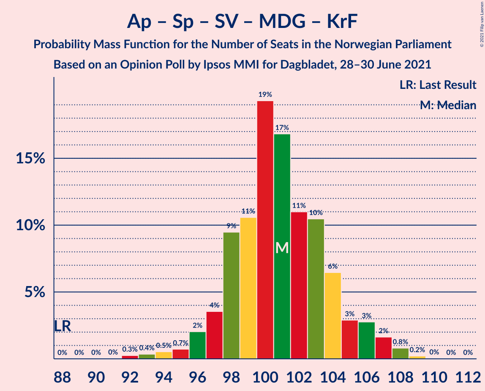

| Number of Seats | Probability | Accumulated | Special Marks |
|:---------------:|:-----------:|:-----------:|:-------------:|
| 88 | 0% | 100% | Last Result |
| 89 | 0% | 100% |  |
| 90 | 0% | 100% |  |
| 91 | 0% | 100% |  |
| 92 | 0.3% | 99.9% |  |
| 93 | 0.4% | 99.7% |  |
| 94 | 0.5% | 99.3% |  |
| 95 | 0.7% | 98.8% |  |
| 96 | 2% | 98% |  |
| 97 | 4% | 96% |  |
| 98 | 9% | 92% |  |
| 99 | 11% | 83% |  |
| 100 | 19% | 72% | Median |
| 101 | 17% | 53% |  |
| 102 | 11% | 36% |  |
| 103 | 10% | 25% |  |
| 104 | 6% | 15% |  |
| 105 | 3% | 8% |  |
| 106 | 3% | 5% |  |
| 107 | 2% | 3% |  |
| 108 | 0.8% | 1.1% |  |
| 109 | 0.2% | 0.3% |  |
| 110 | 0% | 0.1% |  |
| 111 | 0% | 0% |  |

### Arbeiderpartiet – Senterpartiet – Sosialistisk Venstreparti – Rødt

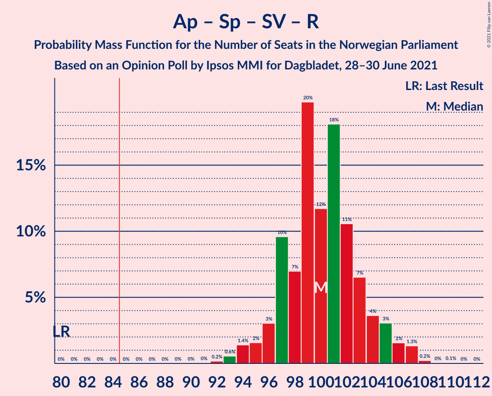

| Number of Seats | Probability | Accumulated | Special Marks |
|:---------------:|:-----------:|:-----------:|:-------------:|
| 80 | 0% | 100% | Last Result |
| 81 | 0% | 100% |  |
| 82 | 0% | 100% |  |
| 83 | 0% | 100% |  |
| 84 | 0% | 100% |  |
| 85 | 0% | 100% | Majority |
| 86 | 0% | 100% |  |
| 87 | 0% | 100% |  |
| 88 | 0% | 100% |  |
| 89 | 0% | 100% |  |
| 90 | 0% | 100% |  |
| 91 | 0% | 100% |  |
| 92 | 0.2% | 99.9% |  |
| 93 | 0.6% | 99.7% |  |
| 94 | 1.4% | 99.2% |  |
| 95 | 2% | 98% |  |
| 96 | 3% | 96% |  |
| 97 | 10% | 93% |  |
| 98 | 7% | 84% |  |
| 99 | 20% | 77% | Median |
| 100 | 12% | 57% |  |
| 101 | 18% | 45% |  |
| 102 | 11% | 27% |  |
| 103 | 7% | 16% |  |
| 104 | 4% | 10% |  |
| 105 | 3% | 6% |  |
| 106 | 2% | 3% |  |
| 107 | 1.3% | 2% |  |
| 108 | 0.2% | 0.3% |  |
| 109 | 0% | 0.1% |  |
| 110 | 0.1% | 0.1% |  |
| 111 | 0% | 0% |  |

### Arbeiderpartiet – Senterpartiet – Sosialistisk Venstreparti – Miljøpartiet De Grønne

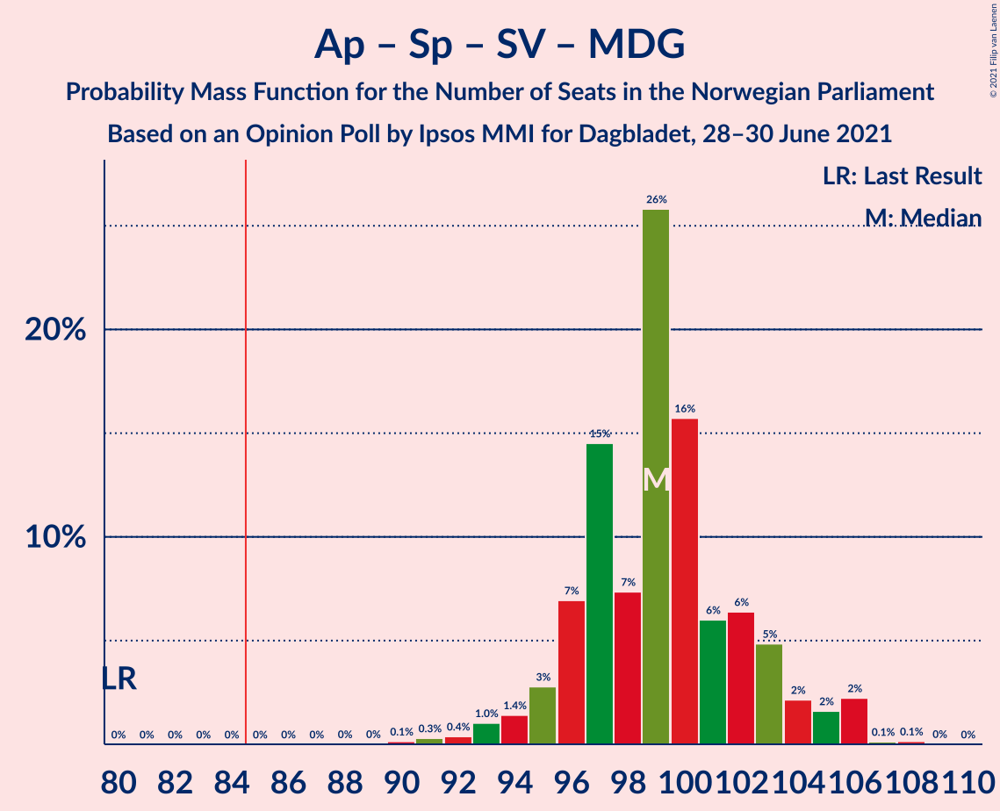

| Number of Seats | Probability | Accumulated | Special Marks |
|:---------------:|:-----------:|:-----------:|:-------------:|
| 80 | 0% | 100% | Last Result |
| 81 | 0% | 100% |  |
| 82 | 0% | 100% |  |
| 83 | 0% | 100% |  |
| 84 | 0% | 100% |  |
| 85 | 0% | 100% | Majority |
| 86 | 0% | 100% |  |
| 87 | 0% | 100% |  |
| 88 | 0% | 100% |  |
| 89 | 0% | 100% |  |
| 90 | 0.1% | 100% |  |
| 91 | 0.3% | 99.8% |  |
| 92 | 0.4% | 99.5% |  |
| 93 | 1.0% | 99.1% |  |
| 94 | 1.4% | 98% |  |
| 95 | 3% | 97% |  |
| 96 | 7% | 94% |  |
| 97 | 15% | 87% |  |
| 98 | 7% | 72% |  |
| 99 | 26% | 65% | Median |
| 100 | 16% | 39% |  |
| 101 | 6% | 24% |  |
| 102 | 6% | 18% |  |
| 103 | 5% | 11% |  |
| 104 | 2% | 6% |  |
| 105 | 2% | 4% |  |
| 106 | 2% | 3% |  |
| 107 | 0.1% | 0.3% |  |
| 108 | 0.1% | 0.2% |  |
| 109 | 0% | 0% |  |

### Arbeiderpartiet – Senterpartiet – Sosialistisk Venstreparti

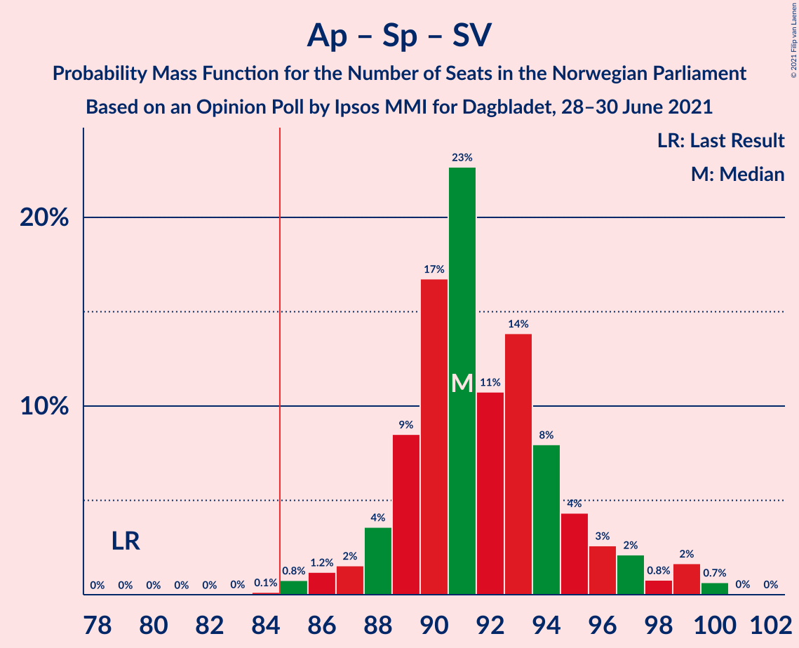

| Number of Seats | Probability | Accumulated | Special Marks |
|:---------------:|:-----------:|:-----------:|:-------------:|
| 79 | 0% | 100% | Last Result |
| 80 | 0% | 100% |  |
| 81 | 0% | 100% |  |
| 82 | 0% | 100% |  |
| 83 | 0% | 100% |  |
| 84 | 0.1% | 100% |  |
| 85 | 0.8% | 99.8% | Majority |
| 86 | 1.2% | 99.1% |  |
| 87 | 2% | 98% |  |
| 88 | 4% | 96% |  |
| 89 | 9% | 93% |  |
| 90 | 17% | 84% |  |
| 91 | 23% | 67% | Median |
| 92 | 11% | 45% |  |
| 93 | 14% | 34% |  |
| 94 | 8% | 20% |  |
| 95 | 4% | 12% |  |
| 96 | 3% | 8% |  |
| 97 | 2% | 5% |  |
| 98 | 0.8% | 3% |  |
| 99 | 2% | 2% |  |
| 100 | 0.7% | 0.7% |  |
| 101 | 0% | 0.1% |  |
| 102 | 0% | 0% |  |

### Arbeiderpartiet – Senterpartiet – Miljøpartiet De Grønne – Kristelig Folkeparti

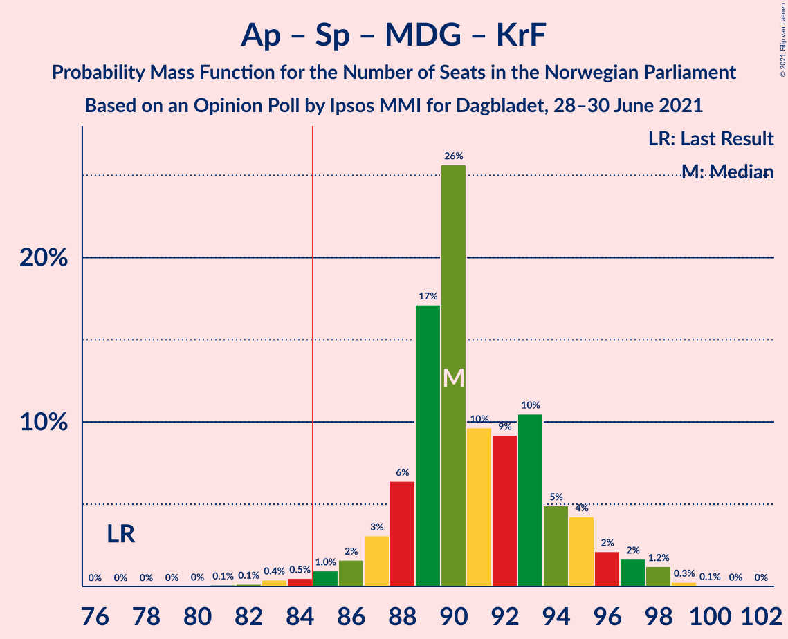

| Number of Seats | Probability | Accumulated | Special Marks |
|:---------------:|:-----------:|:-----------:|:-------------:|
| 77 | 0% | 100% | Last Result |
| 78 | 0% | 100% |  |
| 79 | 0% | 100% |  |
| 80 | 0% | 100% |  |
| 81 | 0.1% | 100% |  |
| 82 | 0.1% | 99.9% |  |
| 83 | 0.4% | 99.7% |  |
| 84 | 0.5% | 99.3% |  |
| 85 | 1.0% | 98.8% | Majority |
| 86 | 2% | 98% |  |
| 87 | 3% | 96% |  |
| 88 | 6% | 93% |  |
| 89 | 17% | 87% |  |
| 90 | 26% | 70% | Median |
| 91 | 10% | 44% |  |
| 92 | 9% | 34% |  |
| 93 | 10% | 25% |  |
| 94 | 5% | 15% |  |
| 95 | 4% | 10% |  |
| 96 | 2% | 5% |  |
| 97 | 2% | 3% |  |
| 98 | 1.2% | 2% |  |
| 99 | 0.3% | 0.4% |  |
| 100 | 0.1% | 0.1% |  |
| 101 | 0% | 0% |  |

### Høyre – Senterpartiet – Fremskrittspartiet – Venstre – Kristelig Folkeparti

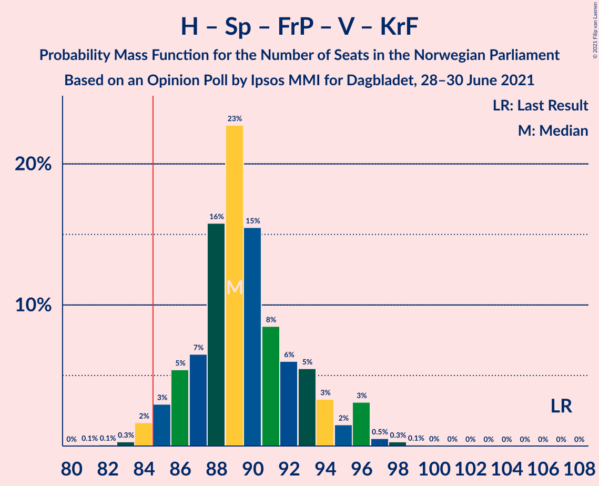

| Number of Seats | Probability | Accumulated | Special Marks |
|:---------------:|:-----------:|:-----------:|:-------------:|
| 81 | 0.1% | 100% |  |
| 82 | 0.1% | 99.9% |  |
| 83 | 0.3% | 99.8% |  |
| 84 | 2% | 99.5% |  |
| 85 | 3% | 98% | Majority |
| 86 | 5% | 95% | Median |
| 87 | 7% | 89% |  |
| 88 | 16% | 83% |  |
| 89 | 23% | 67% |  |
| 90 | 15% | 44% |  |
| 91 | 8% | 29% |  |
| 92 | 6% | 20% |  |
| 93 | 5% | 14% |  |
| 94 | 3% | 9% |  |
| 95 | 2% | 6% |  |
| 96 | 3% | 4% |  |
| 97 | 0.5% | 1.0% |  |
| 98 | 0.3% | 0.5% |  |
| 99 | 0.1% | 0.2% |  |
| 100 | 0% | 0.1% |  |
| 101 | 0% | 0% |  |
| 102 | 0% | 0% |  |
| 103 | 0% | 0% |  |
| 104 | 0% | 0% |  |
| 105 | 0% | 0% |  |
| 106 | 0% | 0% |  |
| 107 | 0% | 0% | Last Result |

### Arbeiderpartiet – Senterpartiet – Kristelig Folkeparti

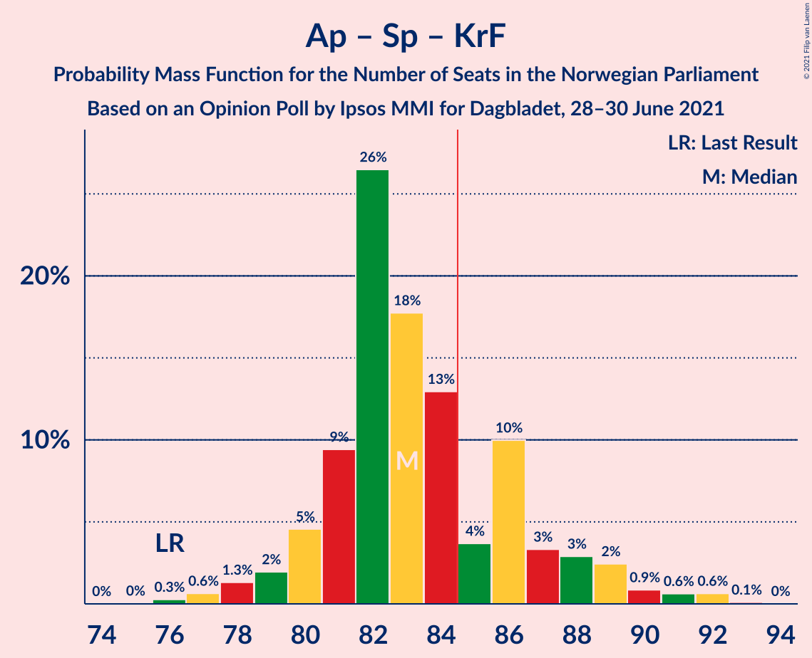

| Number of Seats | Probability | Accumulated | Special Marks |
|:---------------:|:-----------:|:-----------:|:-------------:|
| 75 | 0% | 100% |  |
| 76 | 0.3% | 99.9% | Last Result |
| 77 | 0.6% | 99.7% |  |
| 78 | 1.3% | 99.0% |  |
| 79 | 2% | 98% |  |
| 80 | 5% | 96% |  |
| 81 | 9% | 91% |  |
| 82 | 26% | 82% | Median |
| 83 | 18% | 55% |  |
| 84 | 13% | 38% |  |
| 85 | 4% | 25% | Majority |
| 86 | 10% | 21% |  |
| 87 | 3% | 11% |  |
| 88 | 3% | 8% |  |
| 89 | 2% | 5% |  |
| 90 | 0.9% | 2% |  |
| 91 | 0.6% | 1.4% |  |
| 92 | 0.6% | 0.8% |  |
| 93 | 0.1% | 0.1% |  |
| 94 | 0% | 0% |  |

### Arbeiderpartiet – Senterpartiet

| Number of Seats | Probability | Accumulated | Special Marks |
|:---------------:|:-----------:|:-----------:|:-------------:|
| 68 | 0% | 100% | Last Result |
| 69 | 0% | 100% |  |
| 70 | 0% | 100% |  |
| 71 | 0% | 100% |  |
| 72 | 0% | 100% |  |
| 73 | 0% | 100% |  |
| 74 | 0.1% | 100% |  |
| 75 | 0.3% | 99.9% |  |
| 76 | 1.2% | 99.6% |  |
| 77 | 2% | 98% |  |
| 78 | 4% | 97% |  |
| 79 | 8% | 93% |  |
| 80 | 16% | 85% |  |
| 81 | 28% | 69% | Median |
| 82 | 12% | 40% |  |
| 83 | 11% | 28% |  |
| 84 | 4% | 17% |  |
| 85 | 5% | 13% | Majority |
| 86 | 3% | 8% |  |
| 87 | 1.2% | 5% |  |
| 88 | 2% | 4% |  |
| 89 | 0.6% | 2% |  |
| 90 | 0.9% | 1.1% |  |
| 91 | 0.2% | 0.2% |  |
| 92 | 0.1% | 0.1% |  |
| 93 | 0% | 0% |  |

### Arbeiderpartiet – Sosialistisk Venstreparti – Rødt – Miljøpartiet De Grønne

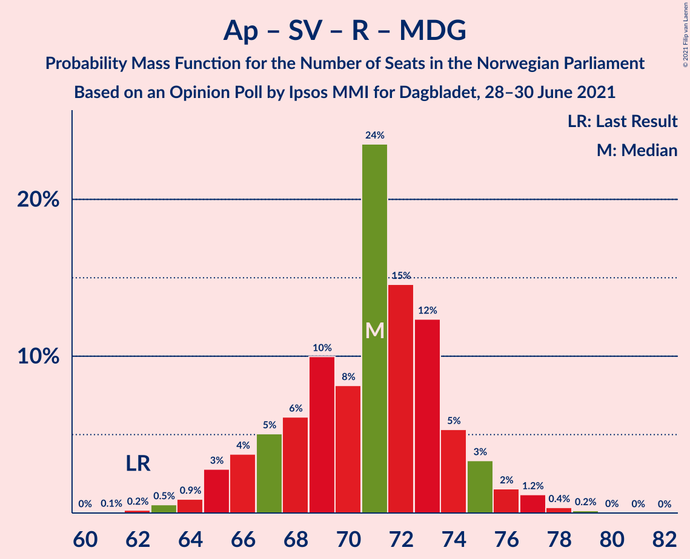

| Number of Seats | Probability | Accumulated | Special Marks |
|:---------------:|:-----------:|:-----------:|:-------------:|
| 61 | 0.1% | 100% |  |
| 62 | 0.2% | 99.9% | Last Result |
| 63 | 0.5% | 99.7% |  |
| 64 | 0.9% | 99.2% |  |
| 65 | 3% | 98% |  |
| 66 | 4% | 95% |  |
| 67 | 5% | 92% |  |
| 68 | 6% | 87% |  |
| 69 | 10% | 81% |  |
| 70 | 8% | 71% |  |
| 71 | 24% | 62% | Median |
| 72 | 15% | 39% |  |
| 73 | 12% | 24% |  |
| 74 | 5% | 12% |  |
| 75 | 3% | 7% |  |
| 76 | 2% | 3% |  |
| 77 | 1.2% | 2% |  |
| 78 | 0.4% | 0.6% |  |
| 79 | 0.2% | 0.2% |  |
| 80 | 0% | 0.1% |  |
| 81 | 0% | 0% |  |

### Høyre – Fremskrittspartiet – Miljøpartiet De Grønne – Venstre – Kristelig Folkeparti

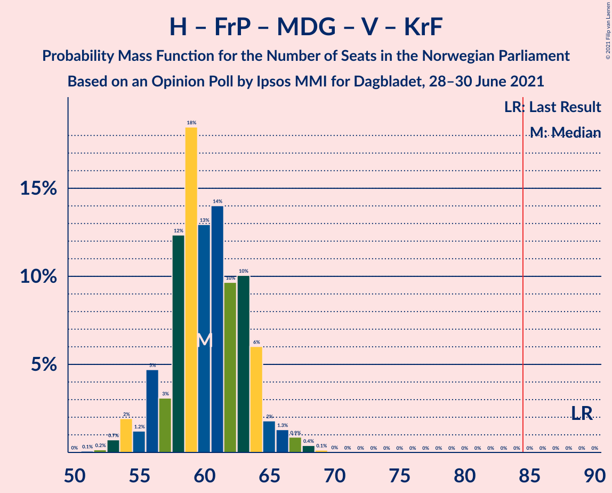

| Number of Seats | Probability | Accumulated | Special Marks |
|:---------------:|:-----------:|:-----------:|:-------------:|
| 51 | 0.1% | 100% |  |
| 52 | 0.2% | 99.9% |  |
| 53 | 0.7% | 99.7% |  |
| 54 | 2% | 99.0% |  |
| 55 | 1.2% | 97% |  |
| 56 | 5% | 96% |  |
| 57 | 3% | 91% |  |
| 58 | 12% | 88% | Median |
| 59 | 18% | 76% |  |
| 60 | 13% | 57% |  |
| 61 | 14% | 44% |  |
| 62 | 10% | 30% |  |
| 63 | 10% | 21% |  |
| 64 | 6% | 11% |  |
| 65 | 2% | 5% |  |
| 66 | 1.3% | 3% |  |
| 67 | 0.9% | 1.5% |  |
| 68 | 0.4% | 0.6% |  |
| 69 | 0.1% | 0.2% |  |
| 70 | 0% | 0.1% |  |
| 71 | 0% | 0% |  |
| 72 | 0% | 0% |  |
| 73 | 0% | 0% |  |
| 74 | 0% | 0% |  |
| 75 | 0% | 0% |  |
| 76 | 0% | 0% |  |
| 77 | 0% | 0% |  |
| 78 | 0% | 0% |  |
| 79 | 0% | 0% |  |
| 80 | 0% | 0% |  |
| 81 | 0% | 0% |  |
| 82 | 0% | 0% |  |
| 83 | 0% | 0% |  |
| 84 | 0% | 0% |  |
| 85 | 0% | 0% | Majority |
| 86 | 0% | 0% |  |
| 87 | 0% | 0% |  |
| 88 | 0% | 0% |  |
| 89 | 0% | 0% | Last Result |

### Arbeiderpartiet – Sosialistisk Venstreparti

| Number of Seats | Probability | Accumulated | Special Marks |
|:---------------:|:-----------:|:-----------:|:-------------:|
| 47 | 0.1% | 100% |  |
| 48 | 0.3% | 99.9% |  |
| 49 | 2% | 99.5% |  |
| 50 | 2% | 98% |  |
| 51 | 5% | 96% |  |
| 52 | 5% | 90% |  |
| 53 | 15% | 86% |  |
| 54 | 17% | 71% |  |
| 55 | 20% | 55% | Median |
| 56 | 12% | 34% |  |
| 57 | 10% | 22% |  |
| 58 | 4% | 12% |  |
| 59 | 4% | 8% |  |
| 60 | 1.4% | 4% | Last Result |
| 61 | 1.1% | 2% |  |
| 62 | 0.9% | 1.2% |  |
| 63 | 0.2% | 0.2% |  |
| 64 | 0% | 0.1% |  |
| 65 | 0% | 0% |  |

### Høyre – Fremskrittspartiet – Venstre – Kristelig Folkeparti

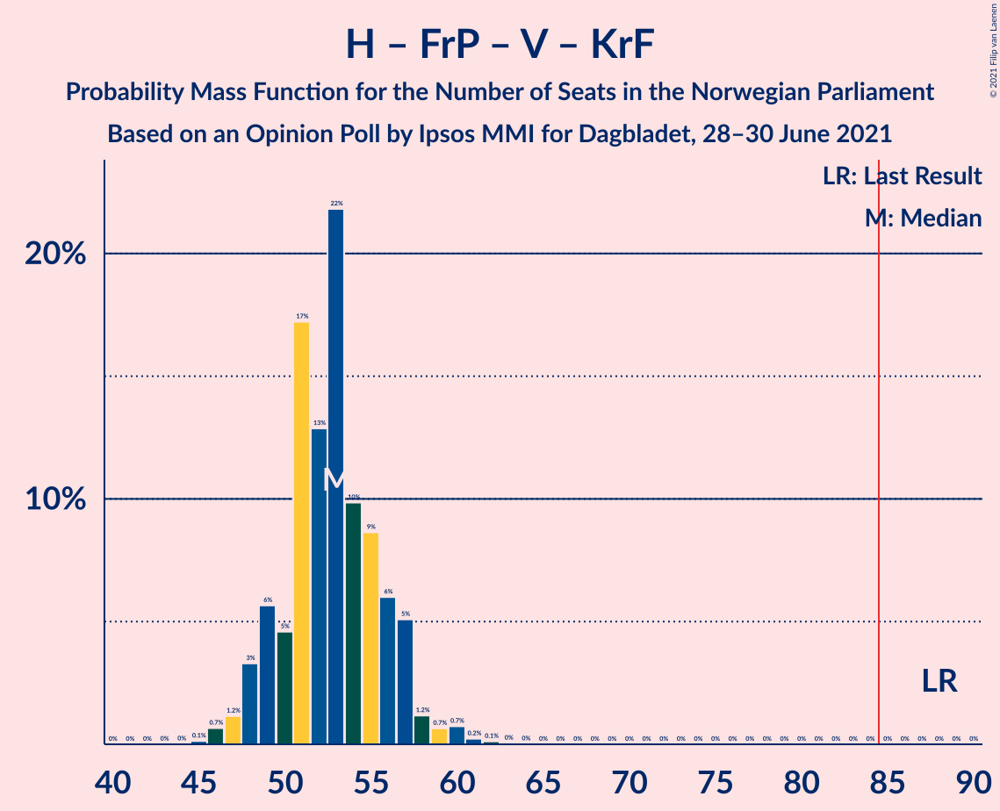

| Number of Seats | Probability | Accumulated | Special Marks |
|:---------------:|:-----------:|:-----------:|:-------------:|
| 45 | 0.1% | 100% |  |
| 46 | 0.7% | 99.8% |  |
| 47 | 1.2% | 99.2% |  |
| 48 | 3% | 98% |  |
| 49 | 6% | 95% |  |
| 50 | 5% | 89% | Median |
| 51 | 17% | 84% |  |
| 52 | 13% | 67% |  |
| 53 | 22% | 54% |  |
| 54 | 10% | 33% |  |
| 55 | 9% | 23% |  |
| 56 | 6% | 14% |  |
| 57 | 5% | 8% |  |
| 58 | 1.2% | 3% |  |
| 59 | 0.7% | 2% |  |
| 60 | 0.7% | 1.2% |  |
| 61 | 0.2% | 0.4% |  |
| 62 | 0.1% | 0.2% |  |
| 63 | 0% | 0.1% |  |
| 64 | 0% | 0% |  |
| 65 | 0% | 0% |  |
| 66 | 0% | 0% |  |
| 67 | 0% | 0% |  |
| 68 | 0% | 0% |  |
| 69 | 0% | 0% |  |
| 70 | 0% | 0% |  |
| 71 | 0% | 0% |  |
| 72 | 0% | 0% |  |
| 73 | 0% | 0% |  |
| 74 | 0% | 0% |  |
| 75 | 0% | 0% |  |
| 76 | 0% | 0% |  |
| 77 | 0% | 0% |  |
| 78 | 0% | 0% |  |
| 79 | 0% | 0% |  |
| 80 | 0% | 0% |  |
| 81 | 0% | 0% |  |
| 82 | 0% | 0% |  |
| 83 | 0% | 0% |  |
| 84 | 0% | 0% |  |
| 85 | 0% | 0% | Majority |
| 86 | 0% | 0% |  |
| 87 | 0% | 0% |  |
| 88 | 0% | 0% | Last Result |

### Høyre – Fremskrittspartiet – Venstre

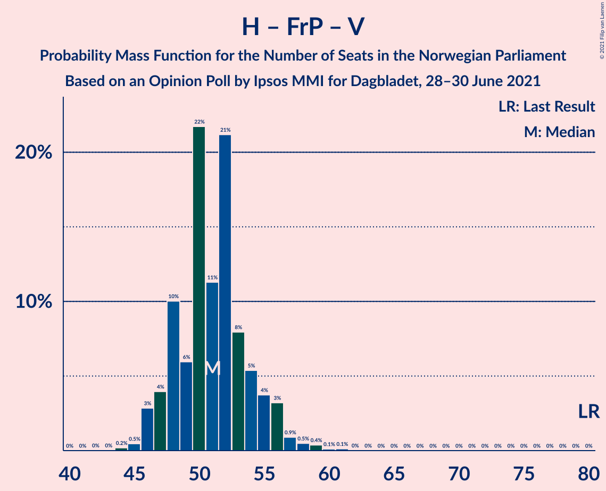

| Number of Seats | Probability | Accumulated | Special Marks |
|:---------------:|:-----------:|:-----------:|:-------------:|
| 43 | 0% | 100% |  |
| 44 | 0.2% | 99.9% |  |
| 45 | 0.5% | 99.8% |  |
| 46 | 3% | 99.3% |  |
| 47 | 4% | 96% |  |
| 48 | 10% | 92% |  |
| 49 | 6% | 82% | Median |
| 50 | 22% | 77% |  |
| 51 | 11% | 55% |  |
| 52 | 21% | 43% |  |
| 53 | 8% | 22% |  |
| 54 | 5% | 14% |  |
| 55 | 4% | 9% |  |
| 56 | 3% | 5% |  |
| 57 | 0.9% | 2% |  |
| 58 | 0.5% | 1.1% |  |
| 59 | 0.4% | 0.6% |  |
| 60 | 0.1% | 0.3% |  |
| 61 | 0.1% | 0.1% |  |
| 62 | 0% | 0% |  |
| 63 | 0% | 0% |  |
| 64 | 0% | 0% |  |
| 65 | 0% | 0% |  |
| 66 | 0% | 0% |  |
| 67 | 0% | 0% |  |
| 68 | 0% | 0% |  |
| 69 | 0% | 0% |  |
| 70 | 0% | 0% |  |
| 71 | 0% | 0% |  |
| 72 | 0% | 0% |  |
| 73 | 0% | 0% |  |
| 74 | 0% | 0% |  |
| 75 | 0% | 0% |  |
| 76 | 0% | 0% |  |
| 77 | 0% | 0% |  |
| 78 | 0% | 0% |  |
| 79 | 0% | 0% |  |
| 80 | 0% | 0% | Last Result |

### Høyre – Fremskrittspartiet

| Number of Seats | Probability | Accumulated | Special Marks |
|:---------------:|:-----------:|:-----------:|:-------------:|
| 41 | 0.1% | 100% |  |
| 42 | 0.2% | 99.9% |  |
| 43 | 0.6% | 99.7% |  |
| 44 | 4% | 99.0% |  |
| 45 | 6% | 95% |  |
| 46 | 17% | 89% |  |
| 47 | 10% | 72% | Median |
| 48 | 22% | 62% |  |
| 49 | 11% | 40% |  |
| 50 | 17% | 29% |  |
| 51 | 5% | 12% |  |
| 52 | 3% | 7% |  |
| 53 | 3% | 4% |  |
| 54 | 0.5% | 1.1% |  |
| 55 | 0.4% | 0.7% |  |
| 56 | 0.1% | 0.2% |  |
| 57 | 0.1% | 0.1% |  |
| 58 | 0% | 0% |  |
| 59 | 0% | 0% |  |
| 60 | 0% | 0% |  |
| 61 | 0% | 0% |  |
| 62 | 0% | 0% |  |
| 63 | 0% | 0% |  |
| 64 | 0% | 0% |  |
| 65 | 0% | 0% |  |
| 66 | 0% | 0% |  |
| 67 | 0% | 0% |  |
| 68 | 0% | 0% |  |
| 69 | 0% | 0% |  |
| 70 | 0% | 0% |  |
| 71 | 0% | 0% |  |
| 72 | 0% | 0% | Last Result |

### Senterpartiet – Venstre – Kristelig Folkeparti

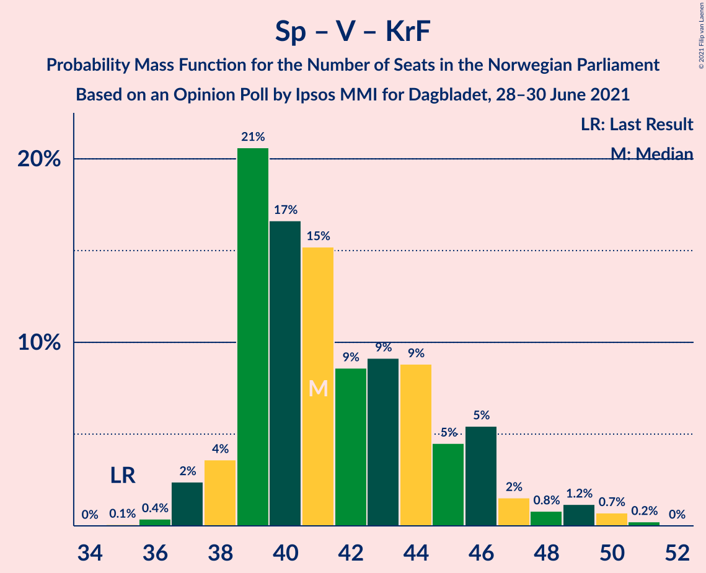

| Number of Seats | Probability | Accumulated | Special Marks |
|:---------------:|:-----------:|:-----------:|:-------------:|
| 34 | 0% | 100% |  |
| 35 | 0.1% | 99.9% | Last Result |
| 36 | 0.4% | 99.9% |  |
| 37 | 2% | 99.5% |  |
| 38 | 4% | 97% |  |
| 39 | 21% | 93% | Median |
| 40 | 17% | 73% |  |
| 41 | 15% | 56% |  |
| 42 | 9% | 41% |  |
| 43 | 9% | 32% |  |
| 44 | 9% | 23% |  |
| 45 | 5% | 14% |  |
| 46 | 5% | 10% |  |
| 47 | 2% | 5% |  |
| 48 | 0.8% | 3% |  |
| 49 | 1.2% | 2% |  |
| 50 | 0.7% | 1.0% |  |
| 51 | 0.2% | 0.3% |  |
| 52 | 0% | 0% |  |

### Høyre – Venstre – Kristelig Folkeparti

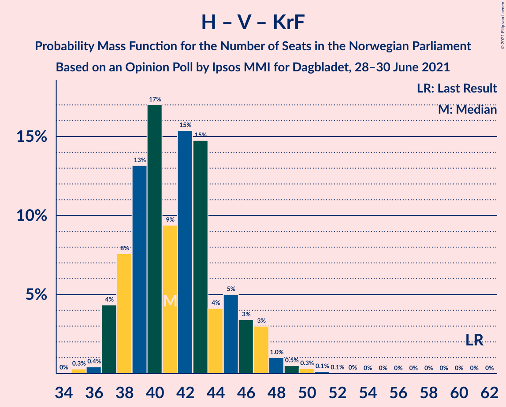

| Number of Seats | Probability | Accumulated | Special Marks |
|:---------------:|:-----------:|:-----------:|:-------------:|
| 34 | 0% | 100% |  |
| 35 | 0.3% | 99.9% |  |
| 36 | 0.4% | 99.6% |  |
| 37 | 4% | 99.2% |  |
| 38 | 8% | 95% |  |
| 39 | 13% | 87% | Median |
| 40 | 17% | 74% |  |
| 41 | 9% | 57% |  |
| 42 | 15% | 48% |  |
| 43 | 15% | 32% |  |
| 44 | 4% | 18% |  |
| 45 | 5% | 13% |  |
| 46 | 3% | 8% |  |
| 47 | 3% | 5% |  |
| 48 | 1.0% | 2% |  |
| 49 | 0.5% | 1.0% |  |
| 50 | 0.3% | 0.5% |  |
| 51 | 0.1% | 0.2% |  |
| 52 | 0.1% | 0.1% |  |
| 53 | 0% | 0% |  |
| 54 | 0% | 0% |  |
| 55 | 0% | 0% |  |
| 56 | 0% | 0% |  |
| 57 | 0% | 0% |  |
| 58 | 0% | 0% |  |
| 59 | 0% | 0% |  |
| 60 | 0% | 0% |  |
| 61 | 0% | 0% | Last Result |

## Technical Information

### Opinion Poll

+ **Polling firm:** Ipsos MMI
+ **Commissioner(s):** Dagbladet
+ **Fieldwork period:** 28–30 June 2021

### Calculations

+ **Sample size:** 1000
+ **Simulations done:** 1,048,576
+ **Error estimate:** 1.37%

