# Opinion Poll by Kantar TNS for TV2, 28 June–2 July 2021

<a href="#voting-intentions">Voting Intentions</a> | <a href="#seats">Seats</a> | <a href="#coalitions">Coalitions</a> | <a href="#technical-information">Technical Information</a>

## Voting Intentions

### Confidence Intervals

| Party | Last Result | Poll Result | 80% Confidence Interval | 90% Confidence Interval | 95% Confidence Interval | 99% Confidence Interval |
|:-----:|:-----------:|:-----------:|:-----------------------:|:-----------------------:|:-----------------------:|:-----------------------:|
| Arbeiderpartiet | 27.4% | 22.4% | 20.8–24.2% |20.3–24.7% |19.9–25.1% |19.1–26.0% |
| Høyre | 25.0% | 19.7% | 18.1–21.4% |17.7–21.8% |17.3–22.3% |16.6–23.1% |
| Senterpartiet | 10.3% | 19.0% | 17.5–20.7% |17.1–21.2% |16.7–21.6% |16.0–22.5% |
| Fremskrittspartiet | 15.2% | 10.6% | 9.4–11.9% |9.1–12.3% |8.8–12.7% |8.3–13.4% |
| Sosialistisk Venstreparti | 6.0% | 7.3% | 6.4–8.5% |6.1–8.8% |5.9–9.1% |5.4–9.7% |
| Rødt | 2.4% | 5.4% | 4.6–6.4% |4.3–6.7% |4.1–7.0% |3.8–7.5% |
| Miljøpartiet De Grønne | 3.2% | 4.9% | 4.1–5.9% |3.9–6.2% |3.7–6.4% |3.4–6.9% |
| Kristelig Folkeparti | 4.2% | 3.8% | 3.1–4.7% |2.9–4.9% |2.7–5.2% |2.5–5.6% |
| Venstre | 4.4% | 2.7% | 2.2–3.6% |2.0–3.8% |1.9–4.0% |1.7–4.4% |

*Note:* The poll result column reflects the actual value used in the calculations. Published results may vary slightly, and in addition be rounded to fewer digits.

## Seats

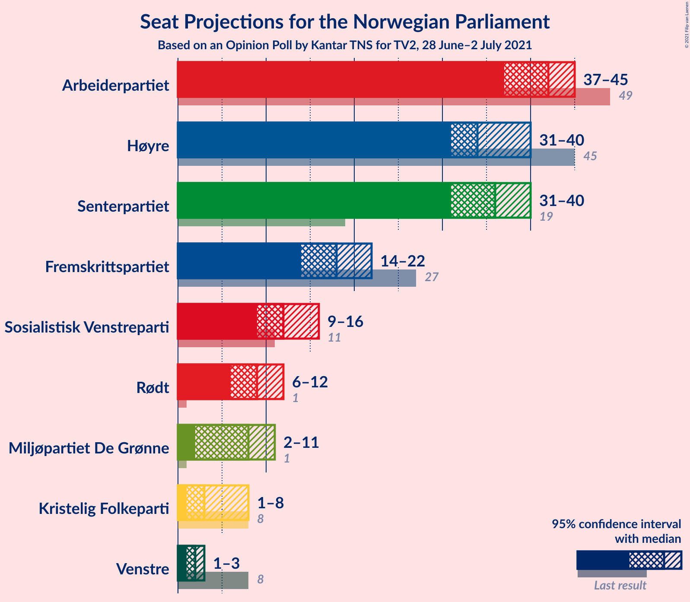

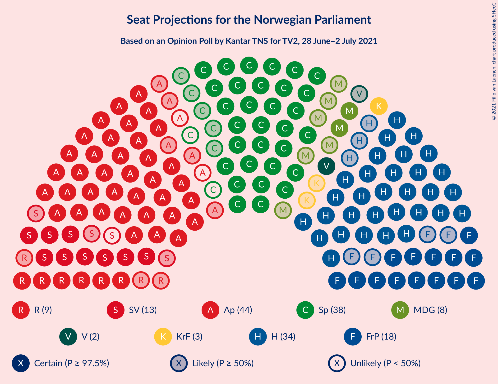

### Confidence Intervals

| Party | Last Result | Median | 80% Confidence Interval | 90% Confidence Interval | 95% Confidence Interval | 99% Confidence Interval |
|:-----:|:-----------:|:------:|:-----------------------:|:-----------------------:|:-----------------------:|:-----------------------:|
| <a href="#arbeiderpartiet">Arbeiderpartiet</a> | 49 | 42 | 39–44 |38–44 |37–45 |35–47 |
| <a href="#høyre">Høyre</a> | 45 | 34 | 32–38 |31–39 |31–40 |28–41 |
| <a href="#senterpartiet">Senterpartiet</a> | 19 | 36 | 33–38 |32–39 |31–40 |30–42 |
| <a href="#fremskrittspartiet">Fremskrittspartiet</a> | 27 | 18 | 15–20 |14–22 |14–22 |12–23 |
| <a href="#sosialistisk-venstreparti">Sosialistisk Venstreparti</a> | 11 | 12 | 10–14 |9–15 |9–16 |8–17 |
| <a href="#rødt">Rødt</a> | 1 | 9 | 7–11 |7–11 |6–12 |2–13 |
| <a href="#miljøpartiet-de-grønne">Miljøpartiet De Grønne</a> | 1 | 8 | 7–10 |3–11 |2–11 |2–12 |
| <a href="#kristelig-folkeparti">Kristelig Folkeparti</a> | 8 | 3 | 1–7 |1–8 |1–8 |1–9 |
| <a href="#venstre">Venstre</a> | 8 | 2 | 1–2 |1–2 |1–3 |0–7 |

### Arbeiderpartiet

*For a full overview of the results for this party, see the [Arbeiderpartiet](party-arbeiderpartiet.html) page.*

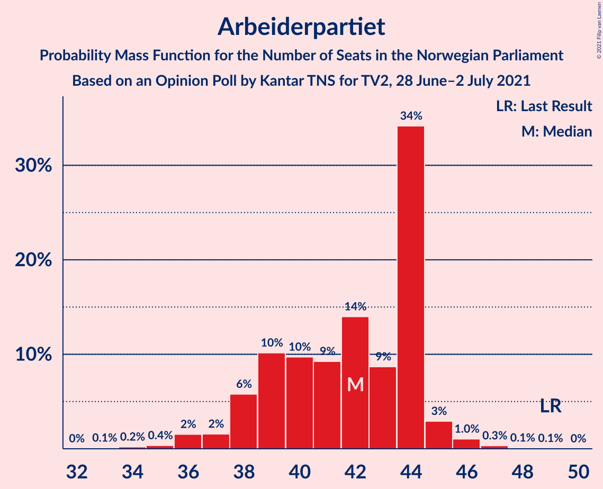

| Number of Seats | Probability | Accumulated | Special Marks |
|:---------------:|:-----------:|:-----------:|:-------------:|
| 33 | 0.1% | 100% |  |
| 34 | 0.2% | 99.9% |  |
| 35 | 0.4% | 99.7% |  |
| 36 | 2% | 99.3% |  |
| 37 | 2% | 98% |  |
| 38 | 6% | 96% |  |
| 39 | 10% | 90% |  |
| 40 | 10% | 80% |  |
| 41 | 9% | 71% |  |
| 42 | 14% | 61% | Median |
| 43 | 9% | 47% |  |
| 44 | 34% | 39% |  |
| 45 | 3% | 4% |  |
| 46 | 1.0% | 2% |  |
| 47 | 0.3% | 0.5% |  |
| 48 | 0.1% | 0.2% |  |
| 49 | 0.1% | 0.1% | Last Result |
| 50 | 0% | 0% |  |

### Høyre

*For a full overview of the results for this party, see the [Høyre](party-høyre.html) page.*

| Number of Seats | Probability | Accumulated | Special Marks |
|:---------------:|:-----------:|:-----------:|:-------------:|
| 27 | 0.1% | 100% |  |
| 28 | 0.5% | 99.8% |  |
| 29 | 0.8% | 99.3% |  |
| 30 | 1.0% | 98.5% |  |
| 31 | 4% | 98% |  |
| 32 | 5% | 93% |  |
| 33 | 13% | 88% |  |
| 34 | 32% | 75% | Median |
| 35 | 15% | 43% |  |
| 36 | 9% | 28% |  |
| 37 | 8% | 19% |  |
| 38 | 3% | 11% |  |
| 39 | 5% | 7% |  |
| 40 | 2% | 3% |  |
| 41 | 0.9% | 1.0% |  |
| 42 | 0.1% | 0.2% |  |
| 43 | 0% | 0.1% |  |
| 44 | 0% | 0% |  |
| 45 | 0% | 0% | Last Result |

### Senterpartiet

*For a full overview of the results for this party, see the [Senterpartiet](party-senterpartiet.html) page.*

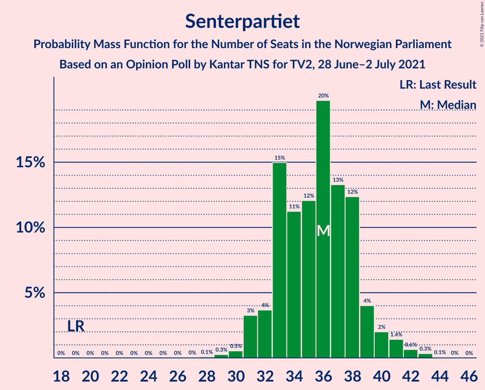

| Number of Seats | Probability | Accumulated | Special Marks |
|:---------------:|:-----------:|:-----------:|:-------------:|
| 19 | 0% | 100% | Last Result |
| 20 | 0% | 100% |  |
| 21 | 0% | 100% |  |
| 22 | 0% | 100% |  |
| 23 | 0% | 100% |  |
| 24 | 0% | 100% |  |
| 25 | 0% | 100% |  |
| 26 | 0% | 100% |  |
| 27 | 0% | 100% |  |
| 28 | 0.1% | 100% |  |
| 29 | 0.3% | 99.9% |  |
| 30 | 0.5% | 99.6% |  |
| 31 | 3% | 99.1% |  |
| 32 | 4% | 96% |  |
| 33 | 15% | 92% |  |
| 34 | 11% | 77% |  |
| 35 | 12% | 66% |  |
| 36 | 20% | 54% | Median |
| 37 | 13% | 34% |  |
| 38 | 12% | 21% |  |
| 39 | 4% | 8% |  |
| 40 | 2% | 4% |  |
| 41 | 1.4% | 2% |  |
| 42 | 0.6% | 1.1% |  |
| 43 | 0.3% | 0.4% |  |
| 44 | 0.1% | 0.1% |  |
| 45 | 0% | 0% |  |

### Fremskrittspartiet

*For a full overview of the results for this party, see the [Fremskrittspartiet](party-fremskrittspartiet.html) page.*

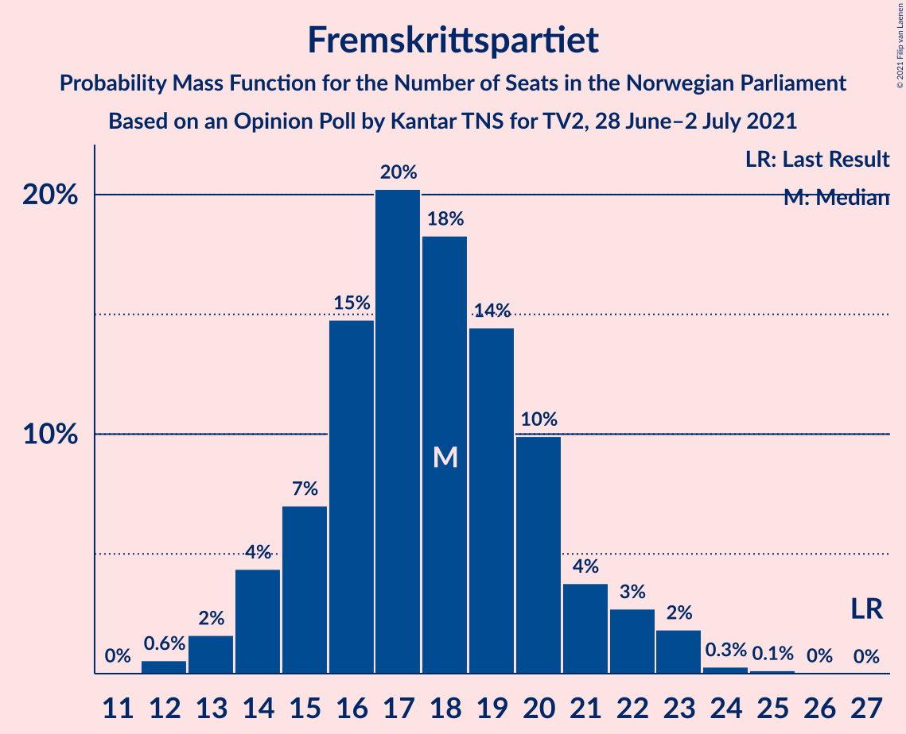

| Number of Seats | Probability | Accumulated | Special Marks |
|:---------------:|:-----------:|:-----------:|:-------------:|
| 12 | 0.6% | 100% |  |
| 13 | 2% | 99.4% |  |
| 14 | 4% | 98% |  |
| 15 | 7% | 93% |  |
| 16 | 15% | 86% |  |
| 17 | 20% | 72% |  |
| 18 | 18% | 51% | Median |
| 19 | 14% | 33% |  |
| 20 | 10% | 19% |  |
| 21 | 4% | 9% |  |
| 22 | 3% | 5% |  |
| 23 | 2% | 2% |  |
| 24 | 0.3% | 0.5% |  |
| 25 | 0.1% | 0.2% |  |
| 26 | 0% | 0% |  |
| 27 | 0% | 0% | Last Result |

### Sosialistisk Venstreparti

*For a full overview of the results for this party, see the [Sosialistisk Venstreparti](party-sosialistiskvenstreparti.html) page.*

| Number of Seats | Probability | Accumulated | Special Marks |
|:---------------:|:-----------:|:-----------:|:-------------:|
| 7 | 0.1% | 100% |  |
| 8 | 1.3% | 99.9% |  |
| 9 | 5% | 98.6% |  |
| 10 | 8% | 94% |  |
| 11 | 23% | 85% | Last Result |
| 12 | 20% | 63% | Median |
| 13 | 22% | 43% |  |
| 14 | 12% | 21% |  |
| 15 | 6% | 9% |  |
| 16 | 2% | 3% |  |
| 17 | 0.6% | 0.9% |  |
| 18 | 0.3% | 0.4% |  |
| 19 | 0% | 0.1% |  |
| 20 | 0% | 0% |  |

### Rødt

*For a full overview of the results for this party, see the [Rødt](party-rødt.html) page.*

| Number of Seats | Probability | Accumulated | Special Marks |
|:---------------:|:-----------:|:-----------:|:-------------:|
| 1 | 0% | 100% | Last Result |
| 2 | 2% | 100% |  |
| 3 | 0.1% | 98% |  |
| 4 | 0% | 98% |  |
| 5 | 0% | 98% |  |
| 6 | 2% | 98% |  |
| 7 | 10% | 96% |  |
| 8 | 25% | 86% |  |
| 9 | 30% | 62% | Median |
| 10 | 20% | 32% |  |
| 11 | 8% | 11% |  |
| 12 | 2% | 3% |  |
| 13 | 0.8% | 1.0% |  |
| 14 | 0.1% | 0.1% |  |
| 15 | 0% | 0% |  |

### Miljøpartiet De Grønne

*For a full overview of the results for this party, see the [Miljøpartiet De Grønne](party-miljøpartietdegrønne.html) page.*

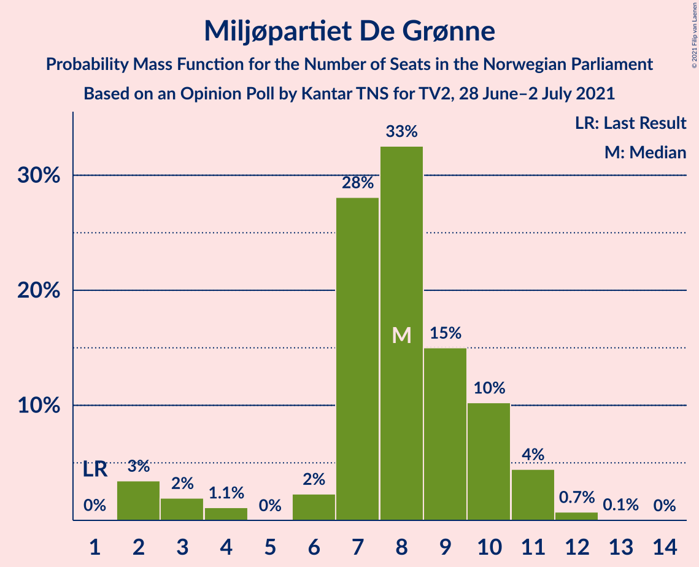

| Number of Seats | Probability | Accumulated | Special Marks |
|:---------------:|:-----------:|:-----------:|:-------------:|
| 1 | 0% | 100% | Last Result |
| 2 | 3% | 100% |  |
| 3 | 2% | 97% |  |
| 4 | 1.1% | 95% |  |
| 5 | 0% | 93% |  |
| 6 | 2% | 93% |  |
| 7 | 28% | 91% |  |
| 8 | 33% | 63% | Median |
| 9 | 15% | 31% |  |
| 10 | 10% | 16% |  |
| 11 | 4% | 5% |  |
| 12 | 0.7% | 0.8% |  |
| 13 | 0.1% | 0.1% |  |
| 14 | 0% | 0% |  |

### Kristelig Folkeparti

*For a full overview of the results for this party, see the [Kristelig Folkeparti](party-kristeligfolkeparti.html) page.*

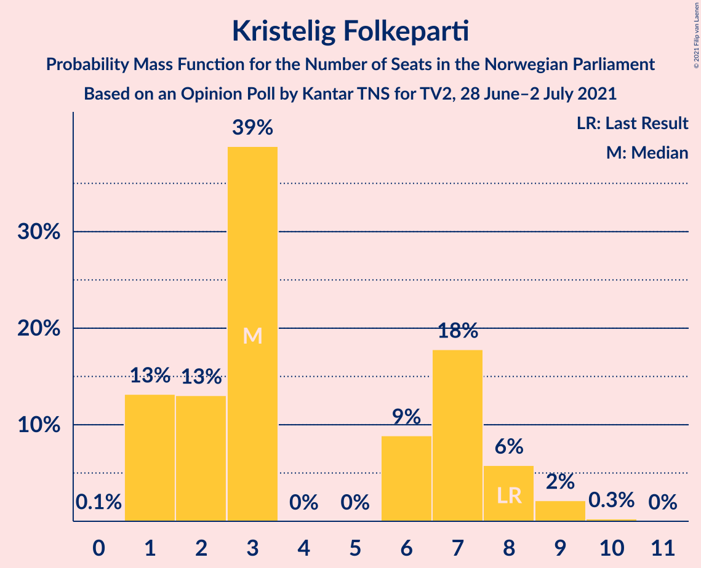

| Number of Seats | Probability | Accumulated | Special Marks |
|:---------------:|:-----------:|:-----------:|:-------------:|
| 0 | 0.1% | 100% |  |
| 1 | 13% | 99.9% |  |
| 2 | 13% | 87% |  |
| 3 | 39% | 74% | Median |
| 4 | 0% | 35% |  |
| 5 | 0% | 35% |  |
| 6 | 9% | 35% |  |
| 7 | 18% | 26% |  |
| 8 | 6% | 8% | Last Result |
| 9 | 2% | 2% |  |
| 10 | 0.3% | 0.3% |  |
| 11 | 0% | 0% |  |

### Venstre

*For a full overview of the results for this party, see the [Venstre](party-venstre.html) page.*

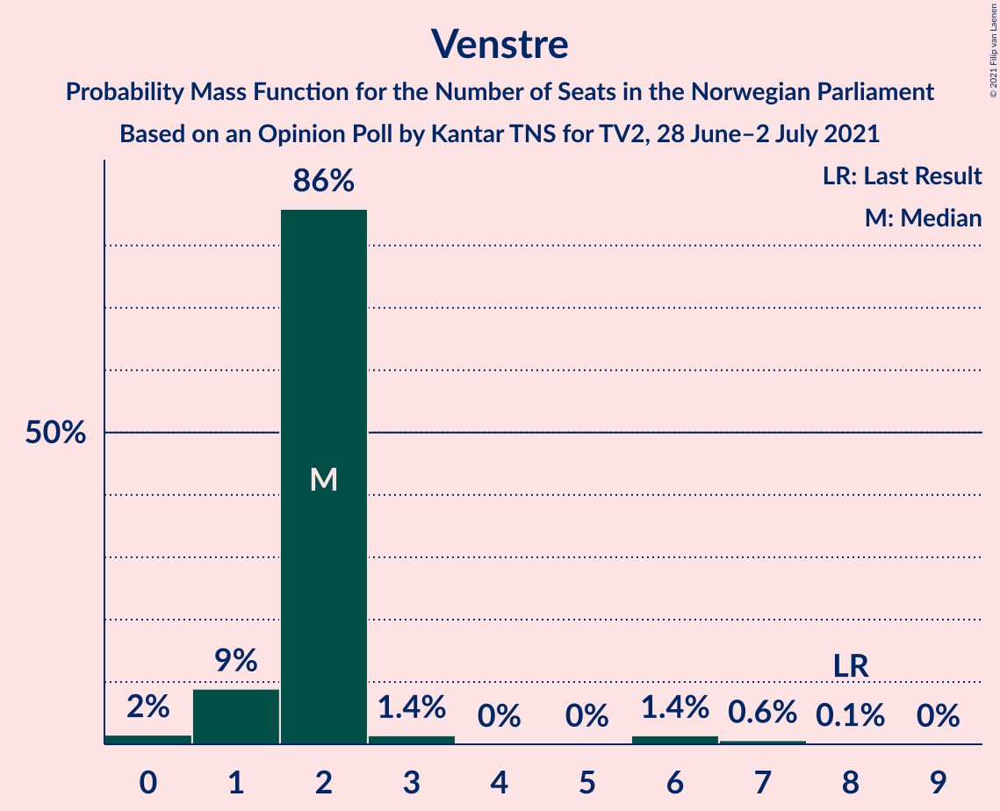

| Number of Seats | Probability | Accumulated | Special Marks |
|:---------------:|:-----------:|:-----------:|:-------------:|
| 0 | 2% | 100% |  |
| 1 | 9% | 98% |  |
| 2 | 86% | 90% | Median |
| 3 | 1.4% | 4% |  |
| 4 | 0% | 2% |  |
| 5 | 0% | 2% |  |
| 6 | 1.4% | 2% |  |
| 7 | 0.6% | 0.8% |  |
| 8 | 0.1% | 0.1% | Last Result |
| 9 | 0% | 0% |  |

## Coalitions

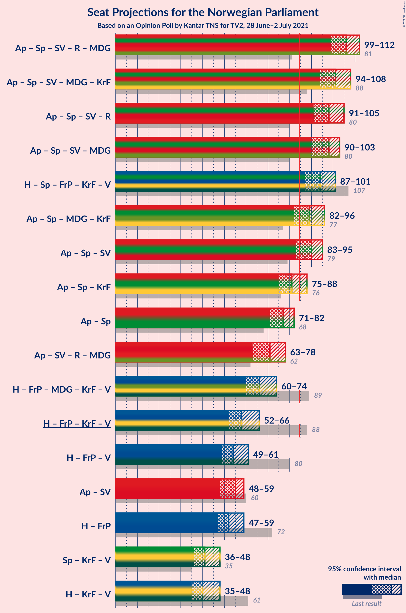

### Confidence Intervals

| Coalition | Last Result | Median | Majority? | 80% Confidence Interval | 90% Confidence Interval | 95% Confidence Interval | 99% Confidence Interval |
|:---------:|:-----------:|:------:|:---------:|:-----------------------:|:-----------------------:|:-----------------------:|:-----------------------:|
| Arbeiderpartiet – Senterpartiet – Sosialistisk Venstreparti – Rødt – Miljøpartiet De Grønne | 81 | 106 | 100% | 102–111 | 100–112 | 99–112 | 96–115 |
| Arbeiderpartiet – Senterpartiet – Sosialistisk Venstreparti – Miljøpartiet De Grønne – Kristelig Folkeparti | 88 | 101 | 100% | 97–106 | 95–107 | 94–108 | 92–110 |
| Arbeiderpartiet – Senterpartiet – Sosialistisk Venstreparti – Rødt | 80 | 98 | 100% | 94–102 | 93–104 | 91–105 | 89–107 |
| Arbeiderpartiet – Senterpartiet – Sosialistisk Venstreparti – Miljøpartiet De Grønne | 80 | 98 | 100% | 93–102 | 92–102 | 90–103 | 88–105 |
| Høyre – Senterpartiet – Fremskrittspartiet – Kristelig Folkeparti – Venstre | 107 | 94 | 99.9% | 89–99 | 89–100 | 87–101 | 86–104 |
| Arbeiderpartiet – Senterpartiet – Miljøpartiet De Grønne – Kristelig Folkeparti | 77 | 89 | 91% | 85–94 | 83–95 | 82–96 | 80–98 |
| Arbeiderpartiet – Senterpartiet – Sosialistisk Venstreparti | 79 | 90 | 96% | 86–93 | 85–94 | 83–95 | 81–97 |
| Arbeiderpartiet – Senterpartiet – Kristelig Folkeparti | 76 | 81 | 21% | 77–86 | 76–87 | 75–88 | 73–90 |
| Arbeiderpartiet – Senterpartiet | 68 | 77 | 0.6% | 74–80 | 73–81 | 71–82 | 70–85 |
| Arbeiderpartiet – Sosialistisk Venstreparti – Rødt – Miljøpartiet De Grønne | 62 | 71 | 0% | 66–76 | 65–77 | 63–78 | 61–80 |
| Høyre – Fremskrittspartiet – Miljøpartiet De Grønne – Kristelig Folkeparti – Venstre | 89 | 66 | 0% | 62–71 | 61–73 | 60–74 | 58–76 |
| Høyre – Fremskrittspartiet – Kristelig Folkeparti – Venstre | 88 | 58 | 0% | 54–63 | 53–65 | 52–66 | 50–68 |
| Høyre – Fremskrittspartiet – Venstre | 80 | 54 | 0% | 51–58 | 50–60 | 49–61 | 47–64 |
| Arbeiderpartiet – Sosialistisk Venstreparti | 60 | 55 | 0% | 50–58 | 49–58 | 48–59 | 46–60 |
| Høyre – Fremskrittspartiet | 72 | 52 | 0% | 49–56 | 48–58 | 47–59 | 45–61 |
| Senterpartiet – Kristelig Folkeparti – Venstre | 35 | 41 | 0% | 37–46 | 36–47 | 36–48 | 34–50 |
| Høyre – Kristelig Folkeparti – Venstre | 61 | 40 | 0% | 37–45 | 36–46 | 35–48 | 34–50 |

### Arbeiderpartiet – Senterpartiet – Sosialistisk Venstreparti – Rødt – Miljøpartiet De Grønne

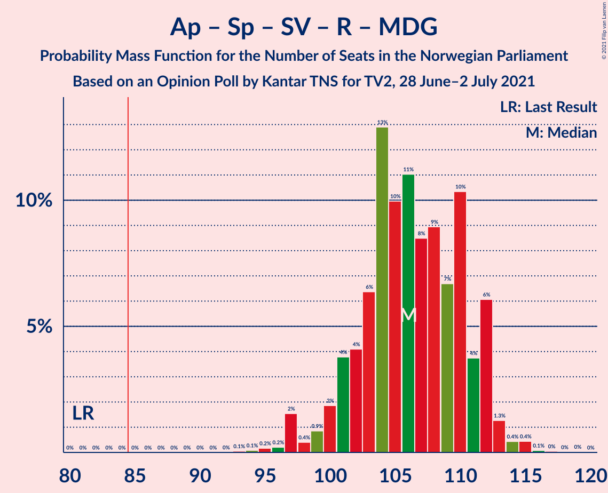

| Number of Seats | Probability | Accumulated | Special Marks |
|:---------------:|:-----------:|:-----------:|:-------------:|
| 81 | 0% | 100% | Last Result |
| 82 | 0% | 100% |  |
| 83 | 0% | 100% |  |
| 84 | 0% | 100% |  |
| 85 | 0% | 100% | Majority |
| 86 | 0% | 100% |  |
| 87 | 0% | 100% |  |
| 88 | 0% | 100% |  |
| 89 | 0% | 100% |  |
| 90 | 0% | 100% |  |
| 91 | 0% | 100% |  |
| 92 | 0% | 100% |  |
| 93 | 0.1% | 100% |  |
| 94 | 0.1% | 99.9% |  |
| 95 | 0.2% | 99.8% |  |
| 96 | 0.2% | 99.7% |  |
| 97 | 2% | 99.5% |  |
| 98 | 0.4% | 98% |  |
| 99 | 0.9% | 98% |  |
| 100 | 2% | 97% |  |
| 101 | 4% | 95% |  |
| 102 | 4% | 91% |  |
| 103 | 6% | 87% |  |
| 104 | 13% | 81% |  |
| 105 | 10% | 68% |  |
| 106 | 11% | 58% |  |
| 107 | 8% | 47% | Median |
| 108 | 9% | 38% |  |
| 109 | 7% | 29% |  |
| 110 | 10% | 22% |  |
| 111 | 4% | 12% |  |
| 112 | 6% | 8% |  |
| 113 | 1.3% | 2% |  |
| 114 | 0.4% | 1.1% |  |
| 115 | 0.4% | 0.6% |  |
| 116 | 0.1% | 0.2% |  |
| 117 | 0% | 0.1% |  |
| 118 | 0% | 0% |  |

### Arbeiderpartiet – Senterpartiet – Sosialistisk Venstreparti – Miljøpartiet De Grønne – Kristelig Folkeparti

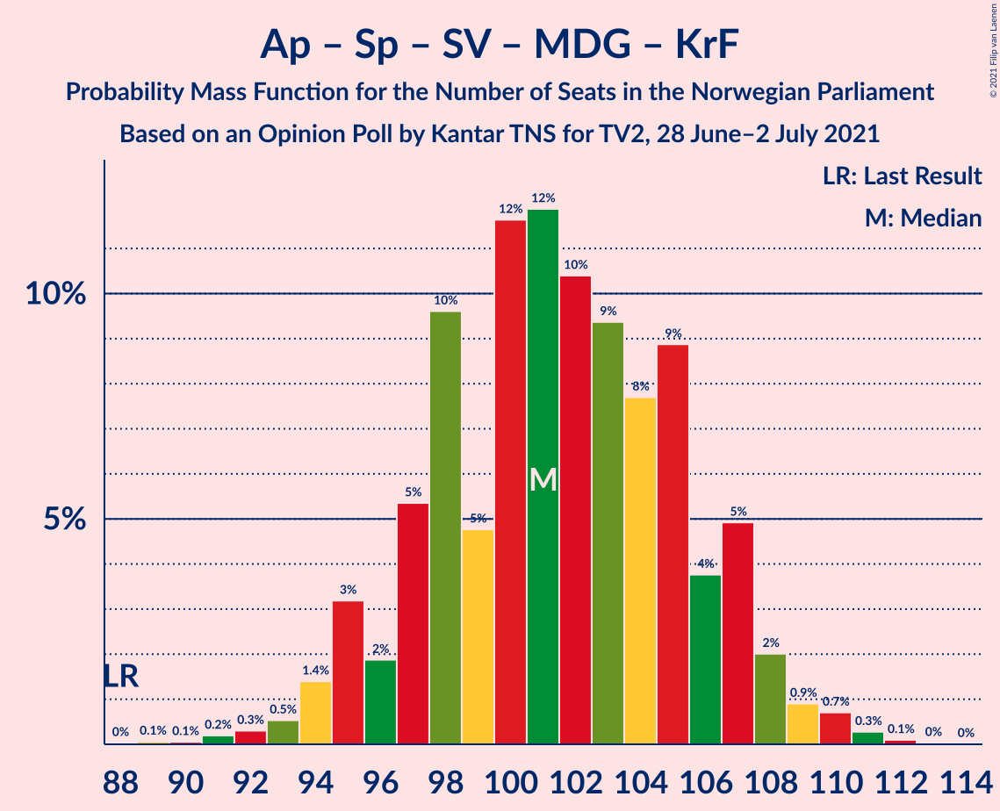

| Number of Seats | Probability | Accumulated | Special Marks |
|:---------------:|:-----------:|:-----------:|:-------------:|
| 88 | 0% | 100% | Last Result |
| 89 | 0.1% | 100% |  |
| 90 | 0.1% | 99.9% |  |
| 91 | 0.2% | 99.8% |  |
| 92 | 0.3% | 99.6% |  |
| 93 | 0.5% | 99.3% |  |
| 94 | 1.4% | 98.8% |  |
| 95 | 3% | 97% |  |
| 96 | 2% | 94% |  |
| 97 | 5% | 92% |  |
| 98 | 10% | 87% |  |
| 99 | 5% | 77% |  |
| 100 | 12% | 73% |  |
| 101 | 12% | 61% | Median |
| 102 | 10% | 49% |  |
| 103 | 9% | 39% |  |
| 104 | 8% | 29% |  |
| 105 | 9% | 22% |  |
| 106 | 4% | 13% |  |
| 107 | 5% | 9% |  |
| 108 | 2% | 4% |  |
| 109 | 0.9% | 2% |  |
| 110 | 0.7% | 1.1% |  |
| 111 | 0.3% | 0.4% |  |
| 112 | 0.1% | 0.2% |  |
| 113 | 0% | 0.1% |  |
| 114 | 0% | 0% |  |

### Arbeiderpartiet – Senterpartiet – Sosialistisk Venstreparti – Rødt

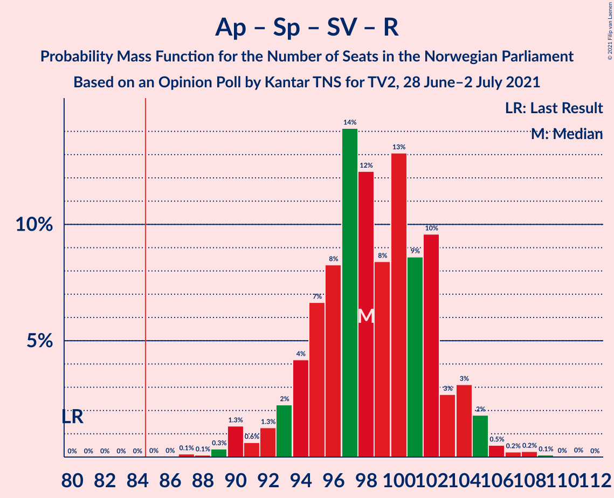

| Number of Seats | Probability | Accumulated | Special Marks |
|:---------------:|:-----------:|:-----------:|:-------------:|
| 80 | 0% | 100% | Last Result |
| 81 | 0% | 100% |  |
| 82 | 0% | 100% |  |
| 83 | 0% | 100% |  |
| 84 | 0% | 100% |  |
| 85 | 0% | 100% | Majority |
| 86 | 0% | 100% |  |
| 87 | 0.1% | 100% |  |
| 88 | 0.1% | 99.8% |  |
| 89 | 0.3% | 99.7% |  |
| 90 | 1.3% | 99.4% |  |
| 91 | 0.6% | 98% |  |
| 92 | 1.3% | 97% |  |
| 93 | 2% | 96% |  |
| 94 | 4% | 94% |  |
| 95 | 7% | 90% |  |
| 96 | 8% | 83% |  |
| 97 | 14% | 75% |  |
| 98 | 12% | 61% |  |
| 99 | 8% | 48% | Median |
| 100 | 13% | 40% |  |
| 101 | 9% | 27% |  |
| 102 | 10% | 18% |  |
| 103 | 3% | 9% |  |
| 104 | 3% | 6% |  |
| 105 | 2% | 3% |  |
| 106 | 0.5% | 1.1% |  |
| 107 | 0.2% | 0.6% |  |
| 108 | 0.2% | 0.4% |  |
| 109 | 0.1% | 0.2% |  |
| 110 | 0% | 0.1% |  |
| 111 | 0% | 0% |  |

### Arbeiderpartiet – Senterpartiet – Sosialistisk Venstreparti – Miljøpartiet De Grønne

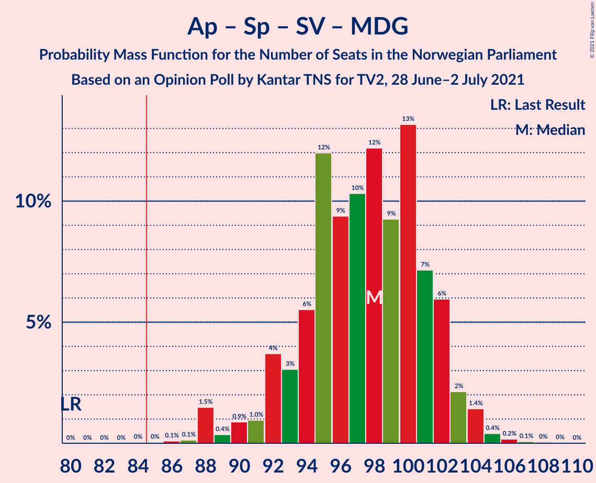

| Number of Seats | Probability | Accumulated | Special Marks |
|:---------------:|:-----------:|:-----------:|:-------------:|
| 80 | 0% | 100% | Last Result |
| 81 | 0% | 100% |  |
| 82 | 0% | 100% |  |
| 83 | 0% | 100% |  |
| 84 | 0% | 100% |  |
| 85 | 0% | 100% | Majority |
| 86 | 0.1% | 99.9% |  |
| 87 | 0.1% | 99.8% |  |
| 88 | 1.5% | 99.7% |  |
| 89 | 0.4% | 98% |  |
| 90 | 0.9% | 98% |  |
| 91 | 1.0% | 97% |  |
| 92 | 4% | 96% |  |
| 93 | 3% | 92% |  |
| 94 | 6% | 89% |  |
| 95 | 12% | 84% |  |
| 96 | 9% | 72% |  |
| 97 | 10% | 62% |  |
| 98 | 12% | 52% | Median |
| 99 | 9% | 40% |  |
| 100 | 13% | 31% |  |
| 101 | 7% | 17% |  |
| 102 | 6% | 10% |  |
| 103 | 2% | 4% |  |
| 104 | 1.4% | 2% |  |
| 105 | 0.4% | 0.7% |  |
| 106 | 0.2% | 0.3% |  |
| 107 | 0.1% | 0.2% |  |
| 108 | 0% | 0.1% |  |
| 109 | 0% | 0% |  |

### Høyre – Senterpartiet – Fremskrittspartiet – Kristelig Folkeparti – Venstre

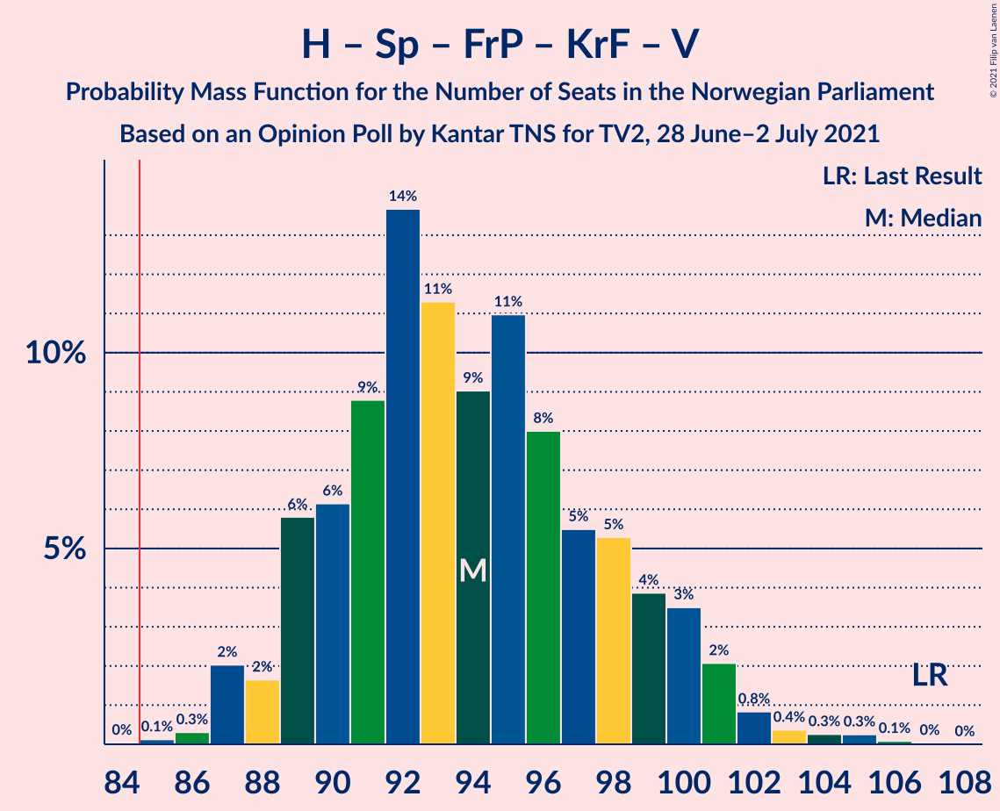

| Number of Seats | Probability | Accumulated | Special Marks |
|:---------------:|:-----------:|:-----------:|:-------------:|
| 84 | 0% | 100% |  |
| 85 | 0.1% | 99.9% | Majority |
| 86 | 0.3% | 99.8% |  |
| 87 | 2% | 99.5% |  |
| 88 | 2% | 97% |  |
| 89 | 6% | 96% |  |
| 90 | 6% | 90% |  |
| 91 | 9% | 84% |  |
| 92 | 14% | 75% |  |
| 93 | 11% | 61% | Median |
| 94 | 9% | 50% |  |
| 95 | 11% | 41% |  |
| 96 | 8% | 30% |  |
| 97 | 5% | 22% |  |
| 98 | 5% | 17% |  |
| 99 | 4% | 11% |  |
| 100 | 3% | 7% |  |
| 101 | 2% | 4% |  |
| 102 | 0.8% | 2% |  |
| 103 | 0.4% | 1.0% |  |
| 104 | 0.3% | 0.6% |  |
| 105 | 0.3% | 0.4% |  |
| 106 | 0.1% | 0.1% |  |
| 107 | 0% | 0.1% | Last Result |
| 108 | 0% | 0% |  |

### Arbeiderpartiet – Senterpartiet – Miljøpartiet De Grønne – Kristelig Folkeparti

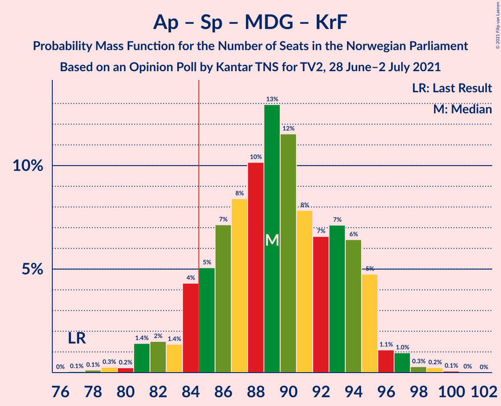

| Number of Seats | Probability | Accumulated | Special Marks |
|:---------------:|:-----------:|:-----------:|:-------------:|
| 76 | 0% | 100% |  |
| 77 | 0.1% | 99.9% | Last Result |
| 78 | 0.1% | 99.9% |  |
| 79 | 0.3% | 99.8% |  |
| 80 | 0.2% | 99.5% |  |
| 81 | 1.4% | 99.3% |  |
| 82 | 2% | 98% |  |
| 83 | 1.4% | 96% |  |
| 84 | 4% | 95% |  |
| 85 | 5% | 91% | Majority |
| 86 | 7% | 86% |  |
| 87 | 8% | 78% |  |
| 88 | 10% | 70% |  |
| 89 | 13% | 60% | Median |
| 90 | 12% | 47% |  |
| 91 | 8% | 35% |  |
| 92 | 7% | 28% |  |
| 93 | 7% | 21% |  |
| 94 | 6% | 14% |  |
| 95 | 5% | 7% |  |
| 96 | 1.1% | 3% |  |
| 97 | 1.0% | 2% |  |
| 98 | 0.3% | 0.6% |  |
| 99 | 0.2% | 0.4% |  |
| 100 | 0.1% | 0.1% |  |
| 101 | 0% | 0% |  |

### Arbeiderpartiet – Senterpartiet – Sosialistisk Venstreparti

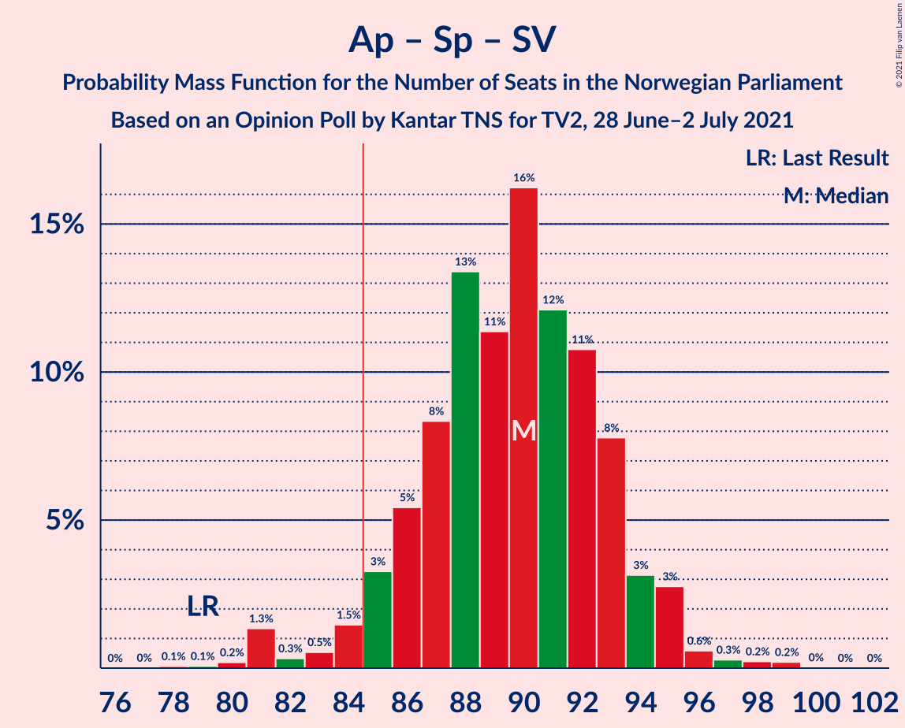

| Number of Seats | Probability | Accumulated | Special Marks |
|:---------------:|:-----------:|:-----------:|:-------------:|
| 78 | 0.1% | 100% |  |
| 79 | 0.1% | 99.9% | Last Result |
| 80 | 0.2% | 99.8% |  |
| 81 | 1.3% | 99.7% |  |
| 82 | 0.3% | 98% |  |
| 83 | 0.5% | 98% |  |
| 84 | 1.5% | 97% |  |
| 85 | 3% | 96% | Majority |
| 86 | 5% | 93% |  |
| 87 | 8% | 87% |  |
| 88 | 13% | 79% |  |
| 89 | 11% | 66% |  |
| 90 | 16% | 54% | Median |
| 91 | 12% | 38% |  |
| 92 | 11% | 26% |  |
| 93 | 8% | 15% |  |
| 94 | 3% | 7% |  |
| 95 | 3% | 4% |  |
| 96 | 0.6% | 1.4% |  |
| 97 | 0.3% | 0.8% |  |
| 98 | 0.2% | 0.5% |  |
| 99 | 0.2% | 0.3% |  |
| 100 | 0% | 0.1% |  |
| 101 | 0% | 0% |  |

### Arbeiderpartiet – Senterpartiet – Kristelig Folkeparti

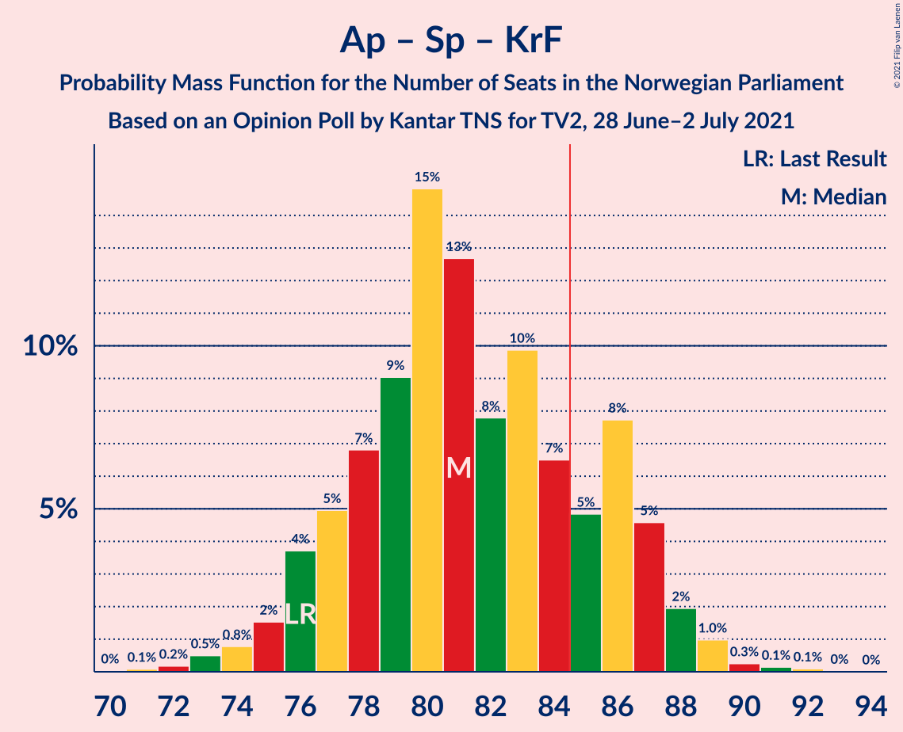

| Number of Seats | Probability | Accumulated | Special Marks |
|:---------------:|:-----------:|:-----------:|:-------------:|
| 70 | 0% | 100% |  |
| 71 | 0.1% | 99.9% |  |
| 72 | 0.2% | 99.8% |  |
| 73 | 0.5% | 99.7% |  |
| 74 | 0.8% | 99.2% |  |
| 75 | 2% | 98% |  |
| 76 | 4% | 97% | Last Result |
| 77 | 5% | 93% |  |
| 78 | 7% | 88% |  |
| 79 | 9% | 81% |  |
| 80 | 15% | 72% |  |
| 81 | 13% | 57% | Median |
| 82 | 8% | 45% |  |
| 83 | 10% | 37% |  |
| 84 | 7% | 27% |  |
| 85 | 5% | 21% | Majority |
| 86 | 8% | 16% |  |
| 87 | 5% | 8% |  |
| 88 | 2% | 3% |  |
| 89 | 1.0% | 2% |  |
| 90 | 0.3% | 0.5% |  |
| 91 | 0.1% | 0.3% |  |
| 92 | 0.1% | 0.1% |  |
| 93 | 0% | 0% |  |

### Arbeiderpartiet – Senterpartiet

| Number of Seats | Probability | Accumulated | Special Marks |
|:---------------:|:-----------:|:-----------:|:-------------:|
| 67 | 0.1% | 100% |  |
| 68 | 0.1% | 99.9% | Last Result |
| 69 | 0.1% | 99.8% |  |
| 70 | 1.5% | 99.6% |  |
| 71 | 0.8% | 98% |  |
| 72 | 2% | 97% |  |
| 73 | 3% | 95% |  |
| 74 | 4% | 93% |  |
| 75 | 9% | 88% |  |
| 76 | 12% | 80% |  |
| 77 | 19% | 68% |  |
| 78 | 12% | 49% | Median |
| 79 | 14% | 37% |  |
| 80 | 14% | 23% |  |
| 81 | 5% | 9% |  |
| 82 | 2% | 4% |  |
| 83 | 1.0% | 2% |  |
| 84 | 0.5% | 1.1% |  |
| 85 | 0.5% | 0.6% | Majority |
| 86 | 0% | 0.1% |  |
| 87 | 0% | 0.1% |  |
| 88 | 0% | 0% |  |

### Arbeiderpartiet – Sosialistisk Venstreparti – Rødt – Miljøpartiet De Grønne

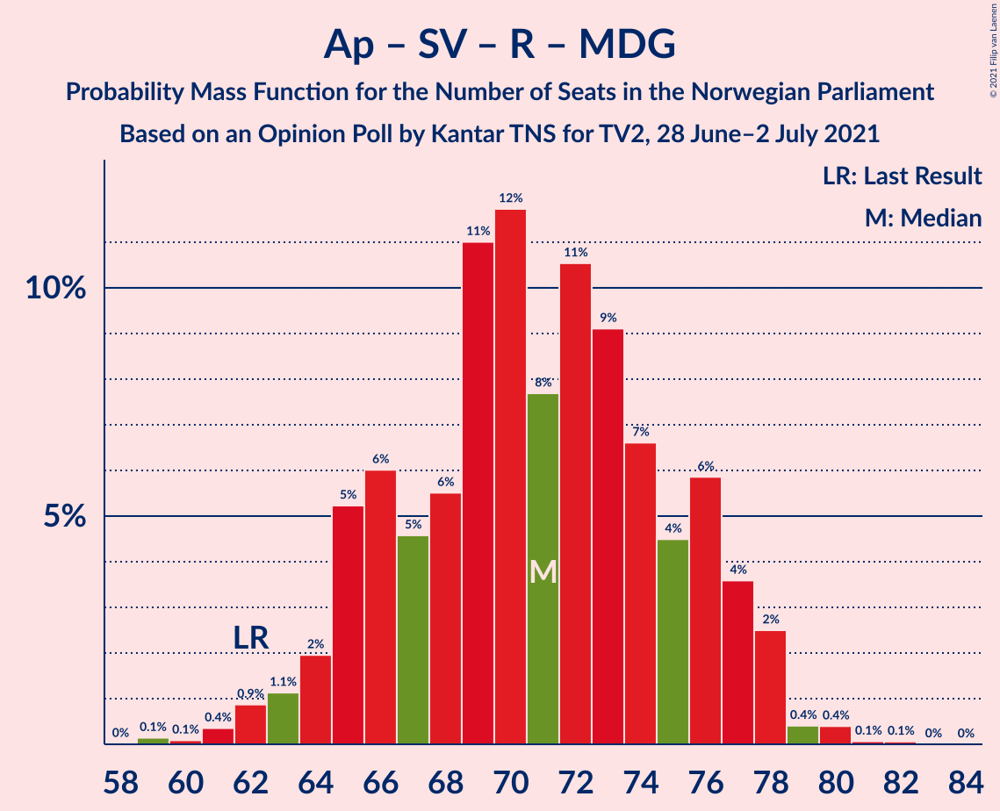

| Number of Seats | Probability | Accumulated | Special Marks |
|:---------------:|:-----------:|:-----------:|:-------------:|
| 58 | 0% | 100% |  |
| 59 | 0.1% | 99.9% |  |
| 60 | 0.1% | 99.8% |  |
| 61 | 0.4% | 99.7% |  |
| 62 | 0.9% | 99.4% | Last Result |
| 63 | 1.1% | 98% |  |
| 64 | 2% | 97% |  |
| 65 | 5% | 95% |  |
| 66 | 6% | 90% |  |
| 67 | 5% | 84% |  |
| 68 | 6% | 80% |  |
| 69 | 11% | 74% |  |
| 70 | 12% | 63% |  |
| 71 | 8% | 51% | Median |
| 72 | 11% | 44% |  |
| 73 | 9% | 33% |  |
| 74 | 7% | 24% |  |
| 75 | 4% | 17% |  |
| 76 | 6% | 13% |  |
| 77 | 4% | 7% |  |
| 78 | 2% | 3% |  |
| 79 | 0.4% | 0.9% |  |
| 80 | 0.4% | 0.5% |  |
| 81 | 0.1% | 0.1% |  |
| 82 | 0.1% | 0.1% |  |
| 83 | 0% | 0% |  |

### Høyre – Fremskrittspartiet – Miljøpartiet De Grønne – Kristelig Folkeparti – Venstre

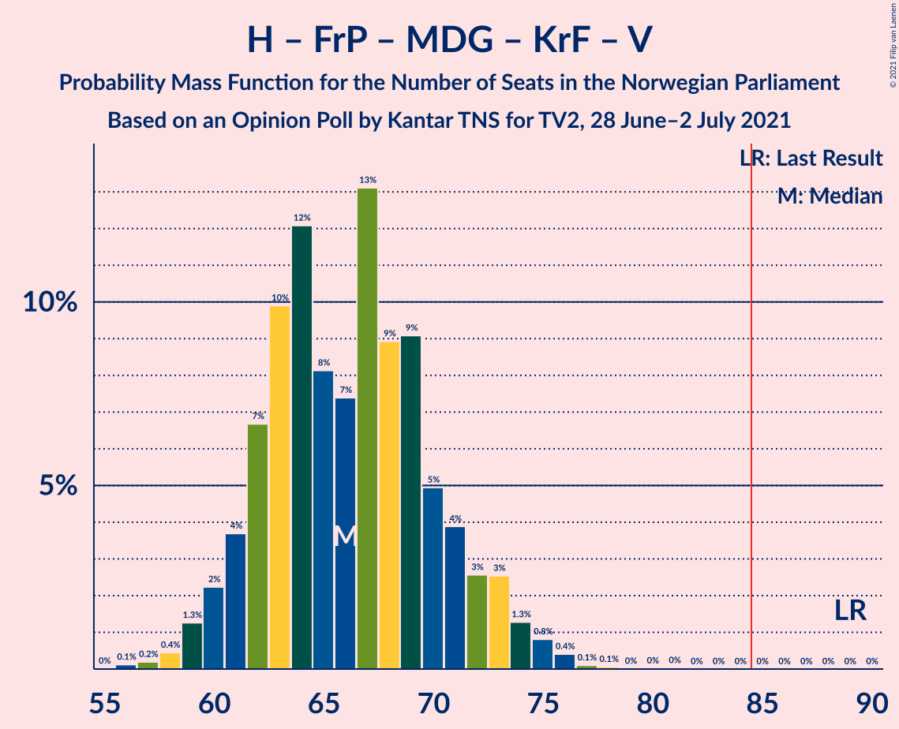

| Number of Seats | Probability | Accumulated | Special Marks |
|:---------------:|:-----------:|:-----------:|:-------------:|
| 55 | 0% | 100% |  |
| 56 | 0.1% | 99.9% |  |
| 57 | 0.2% | 99.8% |  |
| 58 | 0.4% | 99.6% |  |
| 59 | 1.3% | 99.2% |  |
| 60 | 2% | 98% |  |
| 61 | 4% | 96% |  |
| 62 | 7% | 92% |  |
| 63 | 10% | 85% |  |
| 64 | 12% | 75% |  |
| 65 | 8% | 63% | Median |
| 66 | 7% | 55% |  |
| 67 | 13% | 48% |  |
| 68 | 9% | 35% |  |
| 69 | 9% | 26% |  |
| 70 | 5% | 17% |  |
| 71 | 4% | 12% |  |
| 72 | 3% | 8% |  |
| 73 | 3% | 5% |  |
| 74 | 1.3% | 3% |  |
| 75 | 0.8% | 1.4% |  |
| 76 | 0.4% | 0.6% |  |
| 77 | 0.1% | 0.2% |  |
| 78 | 0.1% | 0.1% |  |
| 79 | 0% | 0.1% |  |
| 80 | 0% | 0.1% |  |
| 81 | 0% | 0% |  |
| 82 | 0% | 0% |  |
| 83 | 0% | 0% |  |
| 84 | 0% | 0% |  |
| 85 | 0% | 0% | Majority |
| 86 | 0% | 0% |  |
| 87 | 0% | 0% |  |
| 88 | 0% | 0% |  |
| 89 | 0% | 0% | Last Result |

### Høyre – Fremskrittspartiet – Kristelig Folkeparti – Venstre

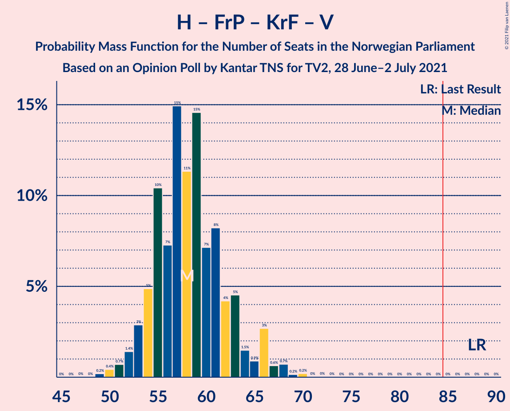

| Number of Seats | Probability | Accumulated | Special Marks |
|:---------------:|:-----------:|:-----------:|:-------------:|
| 49 | 0.2% | 100% |  |
| 50 | 0.4% | 99.8% |  |
| 51 | 0.7% | 99.3% |  |
| 52 | 1.4% | 98.6% |  |
| 53 | 3% | 97% |  |
| 54 | 5% | 94% |  |
| 55 | 10% | 89% |  |
| 56 | 7% | 79% |  |
| 57 | 15% | 72% | Median |
| 58 | 11% | 57% |  |
| 59 | 15% | 46% |  |
| 60 | 7% | 31% |  |
| 61 | 8% | 24% |  |
| 62 | 4% | 16% |  |
| 63 | 5% | 11% |  |
| 64 | 1.5% | 7% |  |
| 65 | 0.9% | 5% |  |
| 66 | 3% | 4% |  |
| 67 | 0.6% | 2% |  |
| 68 | 0.7% | 1.1% |  |
| 69 | 0.2% | 0.4% |  |
| 70 | 0.2% | 0.3% |  |
| 71 | 0% | 0.1% |  |
| 72 | 0% | 0% |  |
| 73 | 0% | 0% |  |
| 74 | 0% | 0% |  |
| 75 | 0% | 0% |  |
| 76 | 0% | 0% |  |
| 77 | 0% | 0% |  |
| 78 | 0% | 0% |  |
| 79 | 0% | 0% |  |
| 80 | 0% | 0% |  |
| 81 | 0% | 0% |  |
| 82 | 0% | 0% |  |
| 83 | 0% | 0% |  |
| 84 | 0% | 0% |  |
| 85 | 0% | 0% | Majority |
| 86 | 0% | 0% |  |
| 87 | 0% | 0% |  |
| 88 | 0% | 0% | Last Result |

### Høyre – Fremskrittspartiet – Venstre

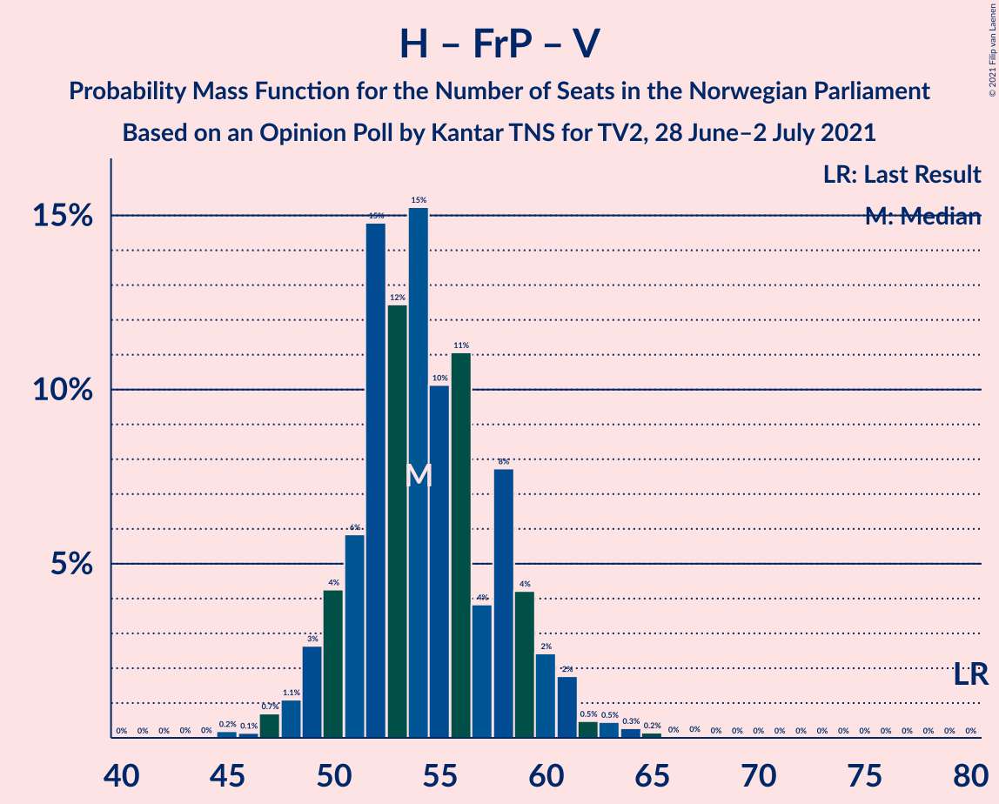

| Number of Seats | Probability | Accumulated | Special Marks |
|:---------------:|:-----------:|:-----------:|:-------------:|
| 45 | 0.2% | 100% |  |
| 46 | 0.1% | 99.8% |  |
| 47 | 0.7% | 99.6% |  |
| 48 | 1.1% | 98.9% |  |
| 49 | 3% | 98% |  |
| 50 | 4% | 95% |  |
| 51 | 6% | 91% |  |
| 52 | 15% | 85% |  |
| 53 | 12% | 70% |  |
| 54 | 15% | 58% | Median |
| 55 | 10% | 43% |  |
| 56 | 11% | 32% |  |
| 57 | 4% | 21% |  |
| 58 | 8% | 18% |  |
| 59 | 4% | 10% |  |
| 60 | 2% | 6% |  |
| 61 | 2% | 3% |  |
| 62 | 0.5% | 1.5% |  |
| 63 | 0.5% | 1.0% |  |
| 64 | 0.3% | 0.5% |  |
| 65 | 0.2% | 0.2% |  |
| 66 | 0% | 0.1% |  |
| 67 | 0% | 0.1% |  |
| 68 | 0% | 0% |  |
| 69 | 0% | 0% |  |
| 70 | 0% | 0% |  |
| 71 | 0% | 0% |  |
| 72 | 0% | 0% |  |
| 73 | 0% | 0% |  |
| 74 | 0% | 0% |  |
| 75 | 0% | 0% |  |
| 76 | 0% | 0% |  |
| 77 | 0% | 0% |  |
| 78 | 0% | 0% |  |
| 79 | 0% | 0% |  |
| 80 | 0% | 0% | Last Result |

### Arbeiderpartiet – Sosialistisk Venstreparti

| Number of Seats | Probability | Accumulated | Special Marks |
|:---------------:|:-----------:|:-----------:|:-------------:|
| 44 | 0% | 100% |  |
| 45 | 0.1% | 99.9% |  |
| 46 | 0.5% | 99.8% |  |
| 47 | 1.5% | 99.4% |  |
| 48 | 1.2% | 98% |  |
| 49 | 3% | 97% |  |
| 50 | 8% | 93% |  |
| 51 | 6% | 85% |  |
| 52 | 8% | 80% |  |
| 53 | 11% | 72% |  |
| 54 | 10% | 61% | Median |
| 55 | 18% | 51% |  |
| 56 | 12% | 33% |  |
| 57 | 11% | 21% |  |
| 58 | 6% | 10% |  |
| 59 | 3% | 4% |  |
| 60 | 0.6% | 1.0% | Last Result |
| 61 | 0.2% | 0.4% |  |
| 62 | 0.1% | 0.2% |  |
| 63 | 0.1% | 0.1% |  |
| 64 | 0% | 0% |  |

### Høyre – Fremskrittspartiet

| Number of Seats | Probability | Accumulated | Special Marks |
|:---------------:|:-----------:|:-----------:|:-------------:|
| 43 | 0.2% | 100% |  |
| 44 | 0.2% | 99.8% |  |
| 45 | 0.6% | 99.6% |  |
| 46 | 1.0% | 99.0% |  |
| 47 | 3% | 98% |  |
| 48 | 3% | 95% |  |
| 49 | 7% | 92% |  |
| 50 | 15% | 86% |  |
| 51 | 13% | 71% |  |
| 52 | 16% | 57% | Median |
| 53 | 10% | 42% |  |
| 54 | 10% | 32% |  |
| 55 | 4% | 21% |  |
| 56 | 8% | 18% |  |
| 57 | 4% | 10% |  |
| 58 | 3% | 6% |  |
| 59 | 2% | 3% |  |
| 60 | 0.5% | 1.4% |  |
| 61 | 0.5% | 0.9% |  |
| 62 | 0.2% | 0.4% |  |
| 63 | 0.1% | 0.2% |  |
| 64 | 0% | 0.1% |  |
| 65 | 0% | 0% |  |
| 66 | 0% | 0% |  |
| 67 | 0% | 0% |  |
| 68 | 0% | 0% |  |
| 69 | 0% | 0% |  |
| 70 | 0% | 0% |  |
| 71 | 0% | 0% |  |
| 72 | 0% | 0% | Last Result |

### Senterpartiet – Kristelig Folkeparti – Venstre

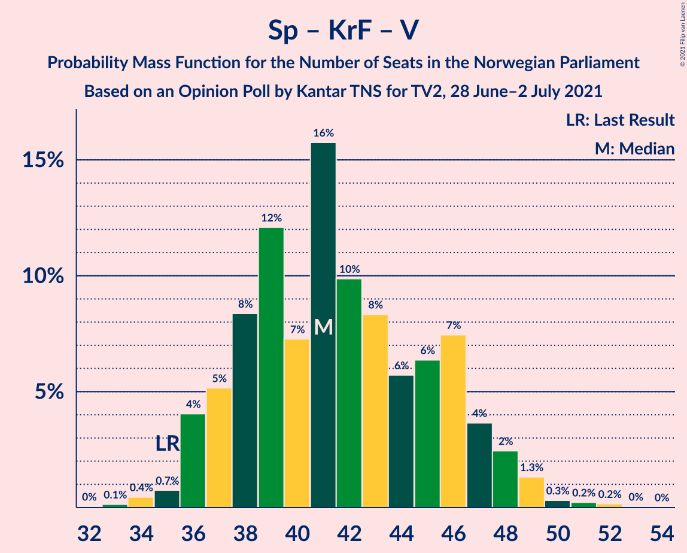

| Number of Seats | Probability | Accumulated | Special Marks |
|:---------------:|:-----------:|:-----------:|:-------------:|
| 32 | 0% | 100% |  |
| 33 | 0.1% | 99.9% |  |
| 34 | 0.4% | 99.8% |  |
| 35 | 0.7% | 99.4% | Last Result |
| 36 | 4% | 98.6% |  |
| 37 | 5% | 95% |  |
| 38 | 8% | 89% |  |
| 39 | 12% | 81% |  |
| 40 | 7% | 69% |  |
| 41 | 16% | 62% | Median |
| 42 | 10% | 46% |  |
| 43 | 8% | 36% |  |
| 44 | 6% | 28% |  |
| 45 | 6% | 22% |  |
| 46 | 7% | 16% |  |
| 47 | 4% | 8% |  |
| 48 | 2% | 5% |  |
| 49 | 1.3% | 2% |  |
| 50 | 0.3% | 0.8% |  |
| 51 | 0.2% | 0.5% |  |
| 52 | 0.2% | 0.2% |  |
| 53 | 0% | 0.1% |  |
| 54 | 0% | 0% |  |

### Høyre – Kristelig Folkeparti – Venstre

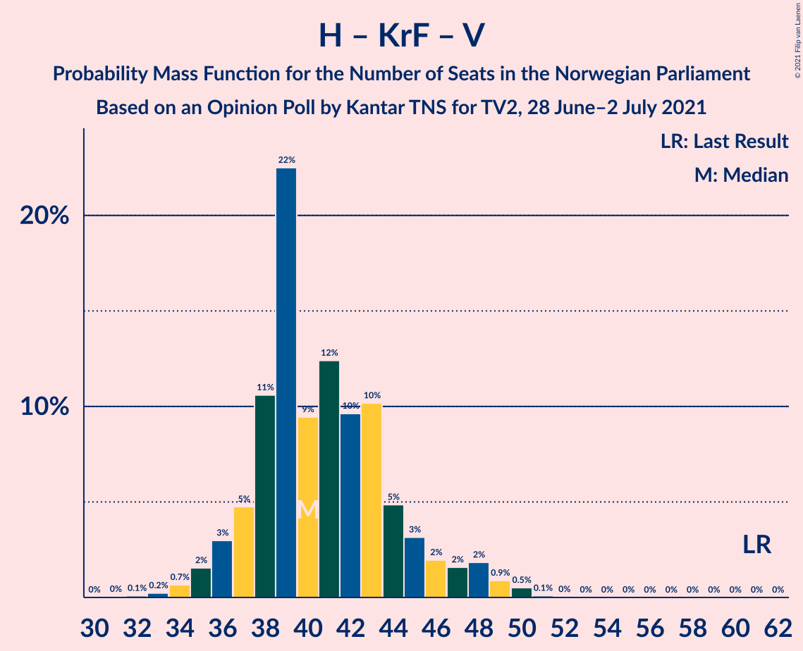

| Number of Seats | Probability | Accumulated | Special Marks |
|:---------------:|:-----------:|:-----------:|:-------------:|
| 31 | 0% | 100% |  |
| 32 | 0.1% | 99.9% |  |
| 33 | 0.2% | 99.9% |  |
| 34 | 0.7% | 99.6% |  |
| 35 | 2% | 99.0% |  |
| 36 | 3% | 97% |  |
| 37 | 5% | 94% |  |
| 38 | 11% | 90% |  |
| 39 | 22% | 79% | Median |
| 40 | 9% | 57% |  |
| 41 | 12% | 47% |  |
| 42 | 10% | 35% |  |
| 43 | 10% | 25% |  |
| 44 | 5% | 15% |  |
| 45 | 3% | 10% |  |
| 46 | 2% | 7% |  |
| 47 | 2% | 5% |  |
| 48 | 2% | 3% |  |
| 49 | 0.9% | 2% |  |
| 50 | 0.5% | 0.7% |  |
| 51 | 0.1% | 0.1% |  |
| 52 | 0% | 0% |  |
| 53 | 0% | 0% |  |
| 54 | 0% | 0% |  |
| 55 | 0% | 0% |  |
| 56 | 0% | 0% |  |
| 57 | 0% | 0% |  |
| 58 | 0% | 0% |  |
| 59 | 0% | 0% |  |
| 60 | 0% | 0% |  |
| 61 | 0% | 0% | Last Result |

## Technical Information

### Opinion Poll

+ **Polling firm:** Kantar TNS
+ **Commissioner(s):** TV2
+ **Fieldwork period:** 28 June–2 July 2021

### Calculations

+ **Sample size:** 982
+ **Simulations done:** 1,048,576
+ **Error estimate:** 1.51%

