# Opinion Poll by Norstat for Dagens Næringsliv, 22–28 July 2021

<a href="#voting-intentions">Voting Intentions</a> | <a href="#seats">Seats</a> | <a href="#coalitions">Coalitions</a> | <a href="#technical-information">Technical Information</a>

## Voting Intentions

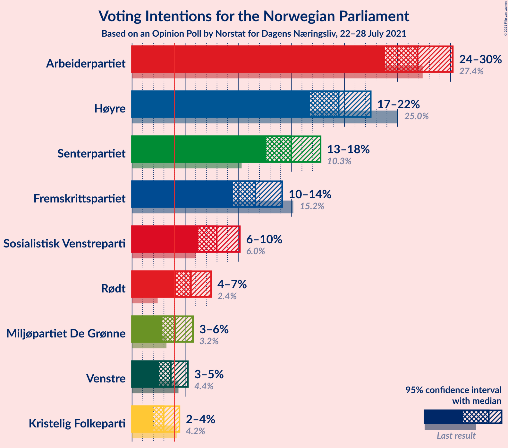

### Confidence Intervals

| Party | Last Result | Poll Result | 80% Confidence Interval | 90% Confidence Interval | 95% Confidence Interval | 99% Confidence Interval |
|:-----:|:-----------:|:-----------:|:-----------------------:|:-----------------------:|:-----------------------:|:-----------------------:|
| Arbeiderpartiet | 27.4% | 26.9% | 24.9–29.1% |24.3–29.7% |23.8–30.2% |22.9–31.3% |
| Høyre | 25.0% | 19.5% | 17.7–21.4% |17.2–22.0% |16.8–22.5% |15.9–23.4% |
| Senterpartiet | 10.3% | 15.0% | 13.4–16.8% |13.0–17.3% |12.6–17.8% |11.9–18.7% |
| Fremskrittspartiet | 15.2% | 11.6% | 10.2–13.3% |9.8–13.7% |9.5–14.1% |8.9–15.0% |
| Sosialistisk Venstreparti | 6.0% | 8.0% | 6.8–9.4% |6.5–9.8% |6.2–10.2% |5.7–10.9% |
| Rødt | 2.4% | 5.5% | 4.6–6.8% |4.3–7.1% |4.1–7.4% |3.7–8.1% |
| Miljøpartiet De Grønne | 3.2% | 4.1% | 3.3–5.2% |3.0–5.5% |2.9–5.7% |2.5–6.3% |
| Venstre | 4.4% | 3.6% | 2.9–4.7% |2.7–5.0% |2.5–5.3% |2.2–5.8% |
| Kristelig Folkeparti | 4.2% | 3.0% | 2.3–3.9% |2.1–4.2% |2.0–4.5% |1.7–5.0% |

*Note:* The poll result column reflects the actual value used in the calculations. Published results may vary slightly, and in addition be rounded to fewer digits.

## Seats

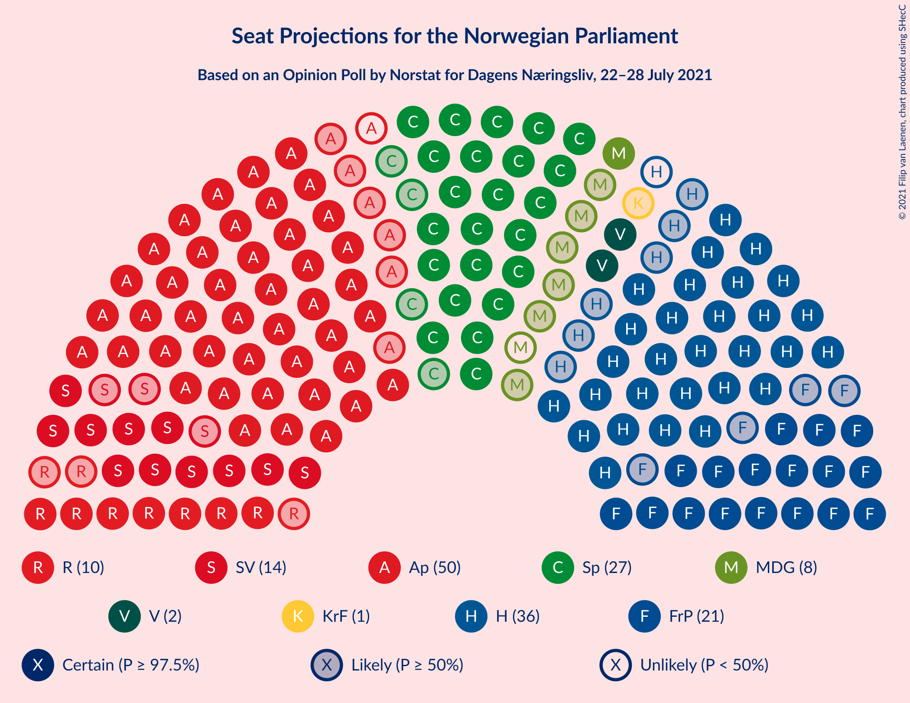

### Confidence Intervals

| Party | Last Result | Median | 80% Confidence Interval | 90% Confidence Interval | 95% Confidence Interval | 99% Confidence Interval |
|:-----:|:-----------:|:------:|:-----------------------:|:-----------------------:|:-----------------------:|:-----------------------:|
| <a href="#arbeiderpartiet">Arbeiderpartiet</a> | 49 | 49 | 45–54 |44–55 |43–56 |42–58 |
| <a href="#høyre">Høyre</a> | 45 | 35 | 31–39 |30–40 |29–41 |28–43 |
| <a href="#senterpartiet">Senterpartiet</a> | 19 | 27 | 24–32 |24–33 |23–34 |21–35 |
| <a href="#fremskrittspartiet">Fremskrittspartiet</a> | 27 | 21 | 18–24 |17–25 |17–26 |15–28 |
| <a href="#sosialistisk-venstreparti">Sosialistisk Venstreparti</a> | 11 | 14 | 12–17 |12–18 |11–19 |9–20 |
| <a href="#rødt">Rødt</a> | 1 | 10 | 8–12 |8–13 |7–13 |2–15 |
| <a href="#miljøpartiet-de-grønne">Miljøpartiet De Grønne</a> | 1 | 7 | 2–9 |1–10 |1–10 |1–11 |
| <a href="#venstre">Venstre</a> | 8 | 2 | 2–8 |2–9 |2–9 |1–10 |
| <a href="#kristelig-folkeparti">Kristelig Folkeparti</a> | 8 | 1 | 1–3 |0–7 |0–8 |0–9 |

### Arbeiderpartiet

*For a full overview of the results for this party, see the [Arbeiderpartiet](party-arbeiderpartiet.html) page.*

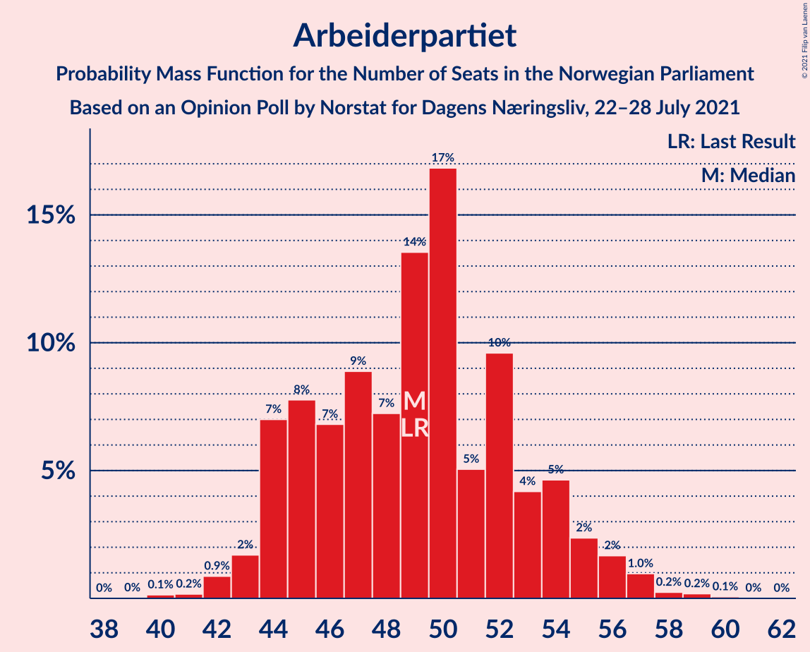

| Number of Seats | Probability | Accumulated | Special Marks |
|:---------------:|:-----------:|:-----------:|:-------------:|
| 40 | 0.1% | 100% |  |
| 41 | 0.2% | 99.8% |  |
| 42 | 0.9% | 99.7% |  |
| 43 | 2% | 98.8% |  |
| 44 | 7% | 97% |  |
| 45 | 8% | 90% |  |
| 46 | 7% | 82% |  |
| 47 | 9% | 76% |  |
| 48 | 7% | 67% |  |
| 49 | 14% | 59% | Last Result, Median |
| 50 | 17% | 46% |  |
| 51 | 5% | 29% |  |
| 52 | 10% | 24% |  |
| 53 | 4% | 14% |  |
| 54 | 5% | 10% |  |
| 55 | 2% | 6% |  |
| 56 | 2% | 3% |  |
| 57 | 1.0% | 1.5% |  |
| 58 | 0.2% | 0.5% |  |
| 59 | 0.2% | 0.3% |  |
| 60 | 0.1% | 0.1% |  |
| 61 | 0% | 0% |  |

### Høyre

*For a full overview of the results for this party, see the [Høyre](party-høyre.html) page.*

| Number of Seats | Probability | Accumulated | Special Marks |
|:---------------:|:-----------:|:-----------:|:-------------:|
| 26 | 0% | 100% |  |
| 27 | 0.3% | 99.9% |  |
| 28 | 1.2% | 99.7% |  |
| 29 | 2% | 98% |  |
| 30 | 4% | 96% |  |
| 31 | 4% | 92% |  |
| 32 | 8% | 88% |  |
| 33 | 7% | 81% |  |
| 34 | 12% | 74% |  |
| 35 | 13% | 62% | Median |
| 36 | 24% | 49% |  |
| 37 | 6% | 25% |  |
| 38 | 8% | 19% |  |
| 39 | 5% | 11% |  |
| 40 | 2% | 6% |  |
| 41 | 2% | 4% |  |
| 42 | 1.0% | 2% |  |
| 43 | 0.6% | 0.8% |  |
| 44 | 0.1% | 0.2% |  |
| 45 | 0.1% | 0.1% | Last Result |
| 46 | 0% | 0% |  |

### Senterpartiet

*For a full overview of the results for this party, see the [Senterpartiet](party-senterpartiet.html) page.*

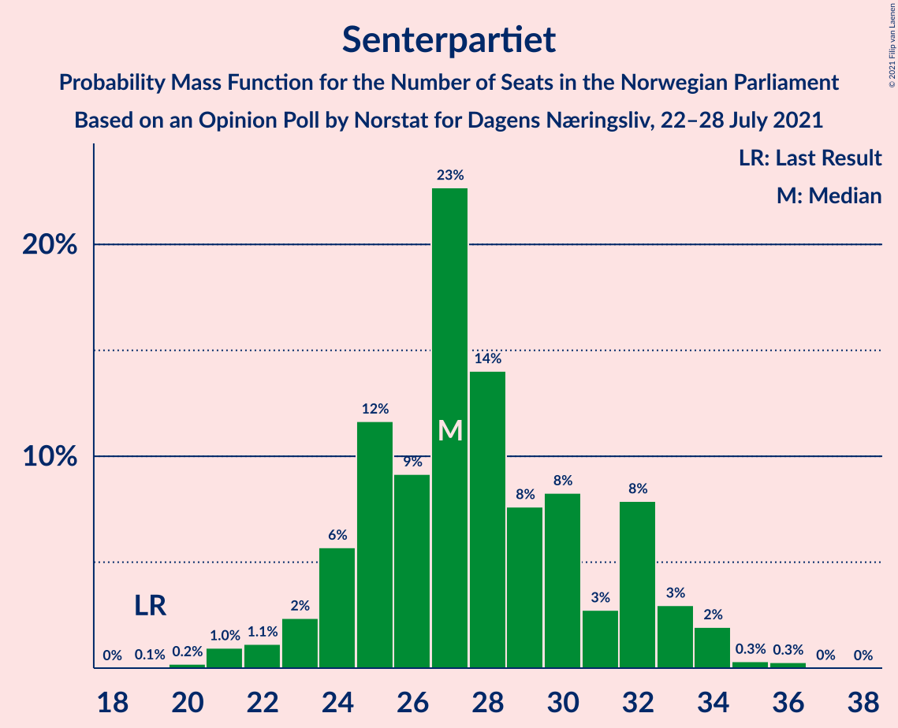

| Number of Seats | Probability | Accumulated | Special Marks |
|:---------------:|:-----------:|:-----------:|:-------------:|
| 19 | 0.1% | 100% | Last Result |
| 20 | 0.2% | 99.9% |  |
| 21 | 1.0% | 99.7% |  |
| 22 | 1.1% | 98.8% |  |
| 23 | 2% | 98% |  |
| 24 | 6% | 95% |  |
| 25 | 12% | 90% |  |
| 26 | 9% | 78% |  |
| 27 | 23% | 69% | Median |
| 28 | 14% | 46% |  |
| 29 | 8% | 32% |  |
| 30 | 8% | 24% |  |
| 31 | 3% | 16% |  |
| 32 | 8% | 13% |  |
| 33 | 3% | 6% |  |
| 34 | 2% | 3% |  |
| 35 | 0.3% | 0.6% |  |
| 36 | 0.3% | 0.3% |  |
| 37 | 0% | 0% |  |

### Fremskrittspartiet

*For a full overview of the results for this party, see the [Fremskrittspartiet](party-fremskrittspartiet.html) page.*

| Number of Seats | Probability | Accumulated | Special Marks |
|:---------------:|:-----------:|:-----------:|:-------------:|
| 14 | 0.2% | 100% |  |
| 15 | 0.7% | 99.8% |  |
| 16 | 1.1% | 99.1% |  |
| 17 | 5% | 98% |  |
| 18 | 9% | 93% |  |
| 19 | 12% | 84% |  |
| 20 | 10% | 72% |  |
| 21 | 18% | 62% | Median |
| 22 | 18% | 44% |  |
| 23 | 11% | 26% |  |
| 24 | 8% | 15% |  |
| 25 | 4% | 7% |  |
| 26 | 1.2% | 3% |  |
| 27 | 0.8% | 1.4% | Last Result |
| 28 | 0.4% | 0.6% |  |
| 29 | 0.1% | 0.1% |  |
| 30 | 0% | 0% |  |

### Sosialistisk Venstreparti

*For a full overview of the results for this party, see the [Sosialistisk Venstreparti](party-sosialistiskvenstreparti.html) page.*

| Number of Seats | Probability | Accumulated | Special Marks |
|:---------------:|:-----------:|:-----------:|:-------------:|
| 9 | 0.5% | 100% |  |
| 10 | 1.4% | 99.5% |  |
| 11 | 3% | 98% | Last Result |
| 12 | 13% | 95% |  |
| 13 | 29% | 82% |  |
| 14 | 13% | 53% | Median |
| 15 | 15% | 40% |  |
| 16 | 8% | 25% |  |
| 17 | 9% | 17% |  |
| 18 | 6% | 9% |  |
| 19 | 1.4% | 3% |  |
| 20 | 1.4% | 2% |  |
| 21 | 0.1% | 0.1% |  |
| 22 | 0% | 0% |  |

### Rødt

*For a full overview of the results for this party, see the [Rødt](party-rødt.html) page.*

| Number of Seats | Probability | Accumulated | Special Marks |
|:---------------:|:-----------:|:-----------:|:-------------:|
| 1 | 0% | 100% | Last Result |
| 2 | 2% | 100% |  |
| 3 | 0% | 98% |  |
| 4 | 0% | 98% |  |
| 5 | 0% | 98% |  |
| 6 | 0% | 98% |  |
| 7 | 3% | 98% |  |
| 8 | 12% | 96% |  |
| 9 | 19% | 84% |  |
| 10 | 28% | 65% | Median |
| 11 | 18% | 37% |  |
| 12 | 13% | 19% |  |
| 13 | 4% | 7% |  |
| 14 | 2% | 2% |  |
| 15 | 0.4% | 0.6% |  |
| 16 | 0.2% | 0.2% |  |
| 17 | 0% | 0% |  |

### Miljøpartiet De Grønne

*For a full overview of the results for this party, see the [Miljøpartiet De Grønne](party-miljøpartietdegrønne.html) page.*

| Number of Seats | Probability | Accumulated | Special Marks |
|:---------------:|:-----------:|:-----------:|:-------------:|
| 1 | 7% | 100% | Last Result |
| 2 | 30% | 93% |  |
| 3 | 4% | 63% |  |
| 4 | 0.9% | 59% |  |
| 5 | 0% | 58% |  |
| 6 | 0.3% | 58% |  |
| 7 | 11% | 58% | Median |
| 8 | 30% | 47% |  |
| 9 | 11% | 17% |  |
| 10 | 5% | 6% |  |
| 11 | 1.2% | 1.4% |  |
| 12 | 0.2% | 0.2% |  |
| 13 | 0.1% | 0.1% |  |
| 14 | 0% | 0% |  |

### Venstre

*For a full overview of the results for this party, see the [Venstre](party-venstre.html) page.*

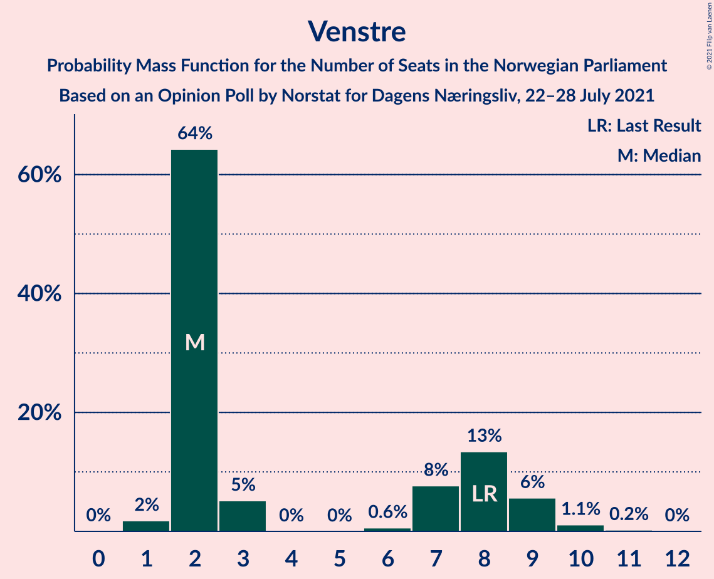

| Number of Seats | Probability | Accumulated | Special Marks |
|:---------------:|:-----------:|:-----------:|:-------------:|
| 1 | 2% | 100% |  |
| 2 | 64% | 98% | Median |
| 3 | 5% | 34% |  |
| 4 | 0% | 29% |  |
| 5 | 0% | 29% |  |
| 6 | 0.6% | 29% |  |
| 7 | 8% | 28% |  |
| 8 | 13% | 20% | Last Result |
| 9 | 6% | 7% |  |
| 10 | 1.1% | 1.4% |  |
| 11 | 0.2% | 0.3% |  |
| 12 | 0% | 0% |  |

### Kristelig Folkeparti

*For a full overview of the results for this party, see the [Kristelig Folkeparti](party-kristeligfolkeparti.html) page.*

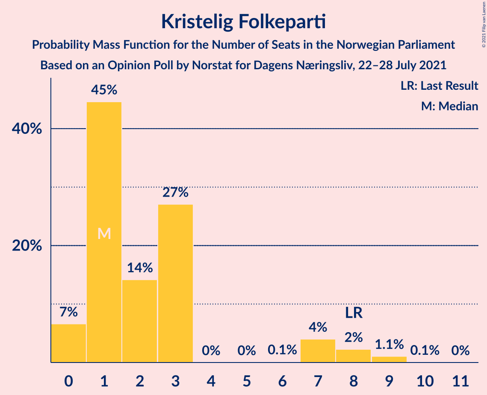

| Number of Seats | Probability | Accumulated | Special Marks |
|:---------------:|:-----------:|:-----------:|:-------------:|
| 0 | 7% | 100% |  |
| 1 | 45% | 93% | Median |
| 2 | 14% | 49% |  |
| 3 | 27% | 35% |  |
| 4 | 0% | 8% |  |
| 5 | 0% | 8% |  |
| 6 | 0.1% | 8% |  |
| 7 | 4% | 7% |  |
| 8 | 2% | 3% | Last Result |
| 9 | 1.1% | 1.1% |  |
| 10 | 0.1% | 0.1% |  |
| 11 | 0% | 0% |  |

## Coalitions

### Confidence Intervals

| Coalition | Last Result | Median | Majority? | 80% Confidence Interval | 90% Confidence Interval | 95% Confidence Interval | 99% Confidence Interval |
|:---------:|:-----------:|:------:|:---------:|:-----------------------:|:-----------------------:|:-----------------------:|:-----------------------:|
| Arbeiderpartiet – Senterpartiet – Sosialistisk Venstreparti – Rødt – Miljøpartiet De Grønne | 81 | 107 | 100% | 102–112 | 100–113 | 99–114 | 96–116 |
| Arbeiderpartiet – Senterpartiet – Sosialistisk Venstreparti – Rødt | 80 | 101 | 100% | 95–107 | 94–108 | 93–109 | 91–112 |
| Arbeiderpartiet – Senterpartiet – Sosialistisk Venstreparti – Miljøpartiet De Grønne – Kristelig Folkeparti | 88 | 99 | 100% | 93–104 | 92–105 | 91–106 | 89–108 |
| Arbeiderpartiet – Senterpartiet – Sosialistisk Venstreparti – Miljøpartiet De Grønne | 80 | 97 | 99.7% | 91–102 | 90–103 | 89–104 | 86–106 |
| Arbeiderpartiet – Senterpartiet – Sosialistisk Venstreparti | 79 | 91 | 95% | 86–97 | 84–97 | 83–98 | 81–101 |
| Høyre – Senterpartiet – Fremskrittspartiet – Venstre – Kristelig Folkeparti | 107 | 90 | 89% | 84–95 | 83–97 | 82–98 | 79–100 |
| Arbeiderpartiet – Senterpartiet – Miljøpartiet De Grønne – Kristelig Folkeparti | 77 | 85 | 53% | 79–90 | 78–91 | 76–92 | 73–94 |
| Arbeiderpartiet – Senterpartiet – Kristelig Folkeparti | 76 | 78 | 6% | 73–83 | 73–85 | 71–87 | 69–89 |
| Arbeiderpartiet – Sosialistisk Venstreparti – Rødt – Miljøpartiet De Grønne | 62 | 79 | 9% | 73–84 | 72–86 | 71–87 | 68–89 |
| Arbeiderpartiet – Senterpartiet | 68 | 77 | 1.0% | 72–82 | 70–82 | 69–84 | 67–86 |
| Høyre – Fremskrittspartiet – Miljøpartiet De Grønne – Venstre – Kristelig Folkeparti | 89 | 68 | 0% | 62–73 | 60–75 | 60–75 | 57–78 |
| Arbeiderpartiet – Sosialistisk Venstreparti | 60 | 63 | 0% | 58–68 | 57–69 | 56–70 | 55–73 |
| Høyre – Fremskrittspartiet – Venstre – Kristelig Folkeparti | 88 | 62 | 0% | 57–67 | 56–69 | 55–70 | 52–73 |
| Høyre – Fremskrittspartiet – Venstre | 80 | 60 | 0% | 55–65 | 53–66 | 52–68 | 51–70 |
| Høyre – Fremskrittspartiet | 72 | 57 | 0% | 51–61 | 50–62 | 49–63 | 47–65 |
| Høyre – Venstre – Kristelig Folkeparti | 61 | 41 | 0% | 36–46 | 35–47 | 34–48 | 33–51 |
| Senterpartiet – Venstre – Kristelig Folkeparti | 35 | 33 | 0% | 28–39 | 28–41 | 27–43 | 25–45 |

### Arbeiderpartiet – Senterpartiet – Sosialistisk Venstreparti – Rødt – Miljøpartiet De Grønne

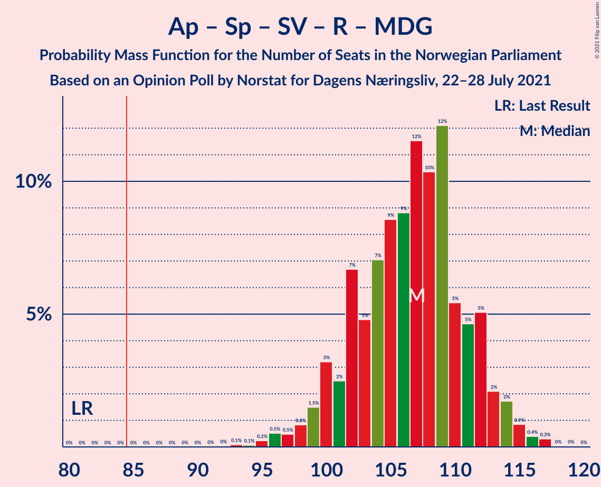

| Number of Seats | Probability | Accumulated | Special Marks |
|:---------------:|:-----------:|:-----------:|:-------------:|
| 81 | 0% | 100% | Last Result |
| 82 | 0% | 100% |  |
| 83 | 0% | 100% |  |
| 84 | 0% | 100% |  |
| 85 | 0% | 100% | Majority |
| 86 | 0% | 100% |  |
| 87 | 0% | 100% |  |
| 88 | 0% | 100% |  |
| 89 | 0% | 100% |  |
| 90 | 0% | 100% |  |
| 91 | 0% | 100% |  |
| 92 | 0% | 100% |  |
| 93 | 0.1% | 99.9% |  |
| 94 | 0.1% | 99.8% |  |
| 95 | 0.2% | 99.8% |  |
| 96 | 0.5% | 99.5% |  |
| 97 | 0.5% | 99.0% |  |
| 98 | 0.8% | 98.5% |  |
| 99 | 1.5% | 98% |  |
| 100 | 3% | 96% |  |
| 101 | 2% | 93% |  |
| 102 | 7% | 91% |  |
| 103 | 5% | 84% |  |
| 104 | 7% | 79% |  |
| 105 | 9% | 72% |  |
| 106 | 9% | 63% |  |
| 107 | 12% | 55% | Median |
| 108 | 10% | 43% |  |
| 109 | 12% | 33% |  |
| 110 | 5% | 21% |  |
| 111 | 5% | 15% |  |
| 112 | 5% | 11% |  |
| 113 | 2% | 5% |  |
| 114 | 2% | 3% |  |
| 115 | 0.9% | 2% |  |
| 116 | 0.4% | 0.8% |  |
| 117 | 0.3% | 0.4% |  |
| 118 | 0% | 0.1% |  |
| 119 | 0% | 0% |  |

### Arbeiderpartiet – Senterpartiet – Sosialistisk Venstreparti – Rødt

| Number of Seats | Probability | Accumulated | Special Marks |
|:---------------:|:-----------:|:-----------:|:-------------:|
| 80 | 0% | 100% | Last Result |
| 81 | 0% | 100% |  |
| 82 | 0% | 100% |  |
| 83 | 0% | 100% |  |
| 84 | 0% | 100% |  |
| 85 | 0% | 100% | Majority |
| 86 | 0% | 100% |  |
| 87 | 0% | 100% |  |
| 88 | 0.1% | 99.9% |  |
| 89 | 0.1% | 99.9% |  |
| 90 | 0.2% | 99.7% |  |
| 91 | 0.4% | 99.5% |  |
| 92 | 1.2% | 99.1% |  |
| 93 | 1.1% | 98% |  |
| 94 | 3% | 97% |  |
| 95 | 4% | 94% |  |
| 96 | 4% | 90% |  |
| 97 | 5% | 86% |  |
| 98 | 7% | 81% |  |
| 99 | 13% | 74% |  |
| 100 | 9% | 60% | Median |
| 101 | 8% | 52% |  |
| 102 | 8% | 43% |  |
| 103 | 7% | 35% |  |
| 104 | 6% | 28% |  |
| 105 | 6% | 22% |  |
| 106 | 4% | 15% |  |
| 107 | 5% | 12% |  |
| 108 | 2% | 7% |  |
| 109 | 3% | 5% |  |
| 110 | 0.8% | 1.5% |  |
| 111 | 0.2% | 0.7% |  |
| 112 | 0.3% | 0.5% |  |
| 113 | 0.2% | 0.2% |  |
| 114 | 0% | 0.1% |  |
| 115 | 0% | 0% |  |

### Arbeiderpartiet – Senterpartiet – Sosialistisk Venstreparti – Miljøpartiet De Grønne – Kristelig Folkeparti

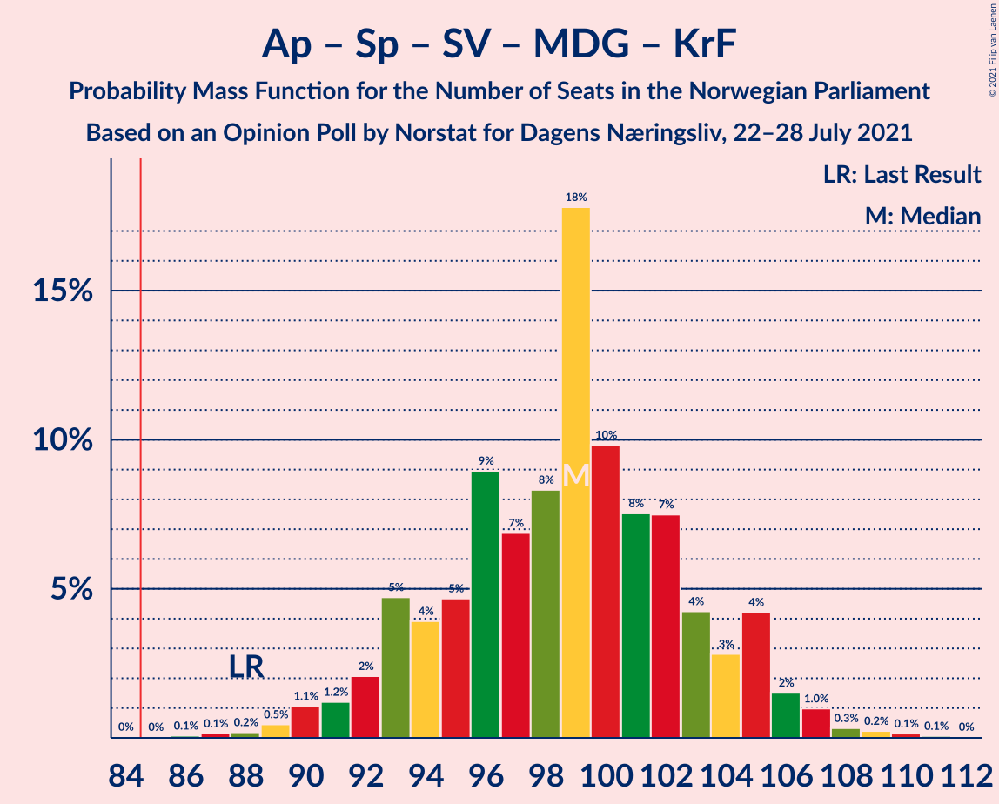

| Number of Seats | Probability | Accumulated | Special Marks |
|:---------------:|:-----------:|:-----------:|:-------------:|
| 85 | 0% | 100% | Majority |
| 86 | 0.1% | 99.9% |  |
| 87 | 0.1% | 99.8% |  |
| 88 | 0.2% | 99.7% | Last Result |
| 89 | 0.5% | 99.5% |  |
| 90 | 1.1% | 99.1% |  |
| 91 | 1.2% | 98% |  |
| 92 | 2% | 97% |  |
| 93 | 5% | 95% |  |
| 94 | 4% | 90% |  |
| 95 | 5% | 86% |  |
| 96 | 9% | 81% |  |
| 97 | 7% | 72% |  |
| 98 | 8% | 66% | Median |
| 99 | 18% | 57% |  |
| 100 | 10% | 39% |  |
| 101 | 8% | 30% |  |
| 102 | 7% | 22% |  |
| 103 | 4% | 15% |  |
| 104 | 3% | 10% |  |
| 105 | 4% | 8% |  |
| 106 | 2% | 3% |  |
| 107 | 1.0% | 2% |  |
| 108 | 0.3% | 0.8% |  |
| 109 | 0.2% | 0.5% |  |
| 110 | 0.1% | 0.3% |  |
| 111 | 0.1% | 0.1% |  |
| 112 | 0% | 0% |  |

### Arbeiderpartiet – Senterpartiet – Sosialistisk Venstreparti – Miljøpartiet De Grønne

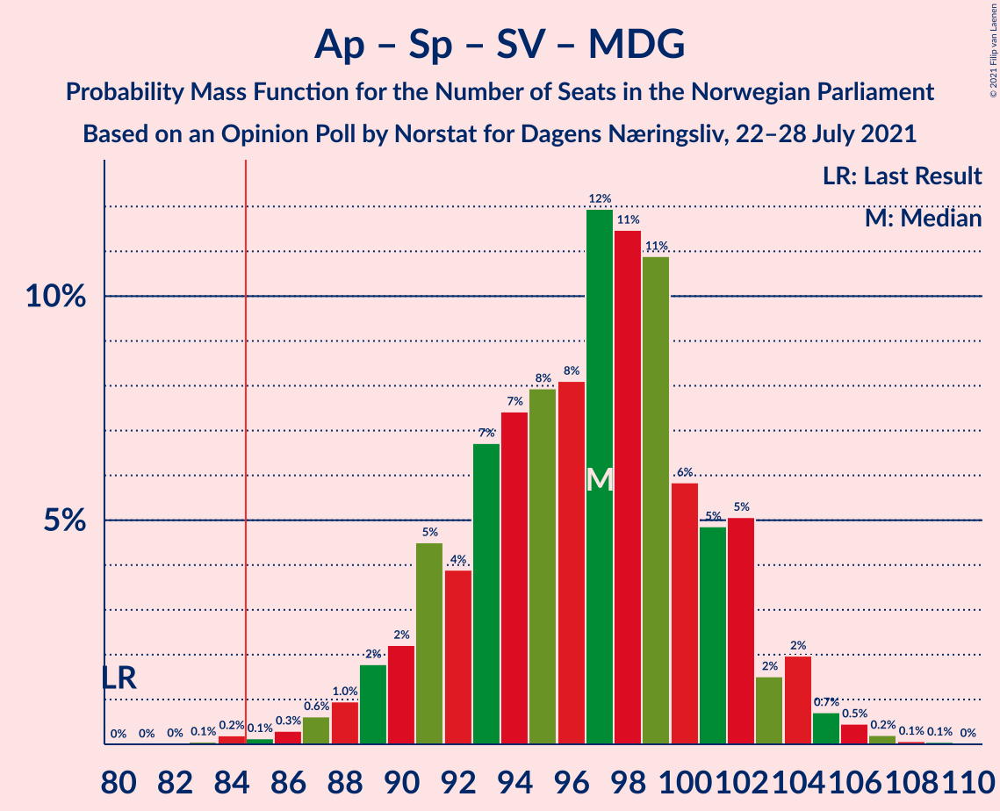

| Number of Seats | Probability | Accumulated | Special Marks |
|:---------------:|:-----------:|:-----------:|:-------------:|
| 80 | 0% | 100% | Last Result |
| 81 | 0% | 100% |  |
| 82 | 0% | 100% |  |
| 83 | 0.1% | 100% |  |
| 84 | 0.2% | 99.9% |  |
| 85 | 0.1% | 99.7% | Majority |
| 86 | 0.3% | 99.6% |  |
| 87 | 0.6% | 99.3% |  |
| 88 | 1.0% | 98.7% |  |
| 89 | 2% | 98% |  |
| 90 | 2% | 96% |  |
| 91 | 5% | 94% |  |
| 92 | 4% | 89% |  |
| 93 | 7% | 85% |  |
| 94 | 7% | 79% |  |
| 95 | 8% | 71% |  |
| 96 | 8% | 63% |  |
| 97 | 12% | 55% | Median |
| 98 | 11% | 43% |  |
| 99 | 11% | 32% |  |
| 100 | 6% | 21% |  |
| 101 | 5% | 15% |  |
| 102 | 5% | 10% |  |
| 103 | 2% | 5% |  |
| 104 | 2% | 4% |  |
| 105 | 0.7% | 2% |  |
| 106 | 0.5% | 0.8% |  |
| 107 | 0.2% | 0.4% |  |
| 108 | 0.1% | 0.2% |  |
| 109 | 0.1% | 0.1% |  |
| 110 | 0% | 0% |  |

### Arbeiderpartiet – Senterpartiet – Sosialistisk Venstreparti

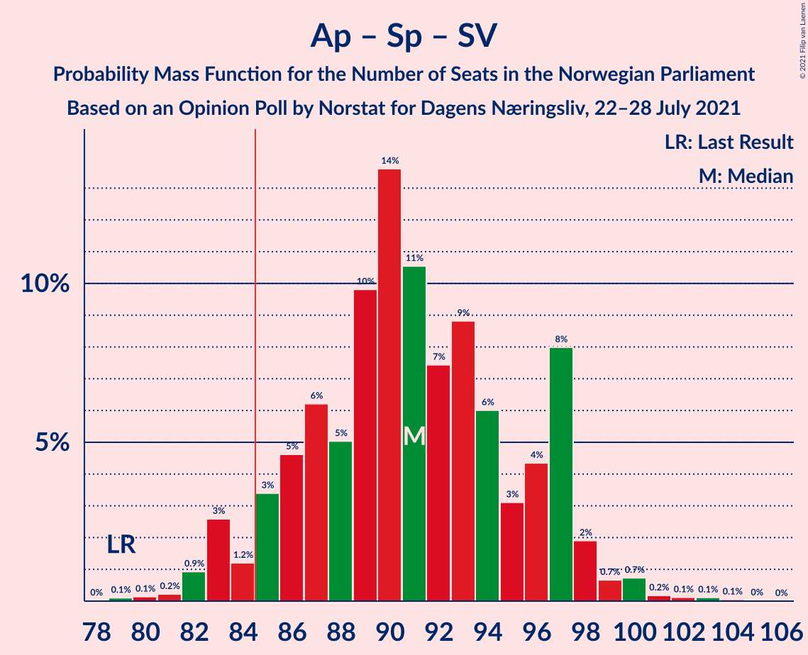

| Number of Seats | Probability | Accumulated | Special Marks |
|:---------------:|:-----------:|:-----------:|:-------------:|
| 79 | 0.1% | 100% | Last Result |
| 80 | 0.1% | 99.9% |  |
| 81 | 0.2% | 99.7% |  |
| 82 | 0.9% | 99.5% |  |
| 83 | 3% | 98.6% |  |
| 84 | 1.2% | 96% |  |
| 85 | 3% | 95% | Majority |
| 86 | 5% | 91% |  |
| 87 | 6% | 87% |  |
| 88 | 5% | 81% |  |
| 89 | 10% | 76% |  |
| 90 | 14% | 66% | Median |
| 91 | 11% | 52% |  |
| 92 | 7% | 42% |  |
| 93 | 9% | 34% |  |
| 94 | 6% | 25% |  |
| 95 | 3% | 19% |  |
| 96 | 4% | 16% |  |
| 97 | 8% | 12% |  |
| 98 | 2% | 4% |  |
| 99 | 0.7% | 2% |  |
| 100 | 0.7% | 1.2% |  |
| 101 | 0.2% | 0.5% |  |
| 102 | 0.1% | 0.3% |  |
| 103 | 0.1% | 0.2% |  |
| 104 | 0.1% | 0.1% |  |
| 105 | 0% | 0% |  |

### Høyre – Senterpartiet – Fremskrittspartiet – Venstre – Kristelig Folkeparti

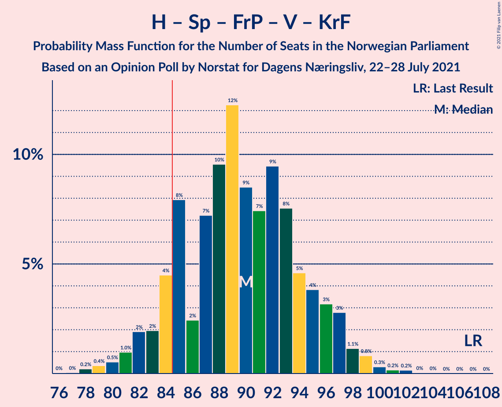

| Number of Seats | Probability | Accumulated | Special Marks |
|:---------------:|:-----------:|:-----------:|:-------------:|
| 76 | 0% | 100% |  |
| 77 | 0% | 99.9% |  |
| 78 | 0.2% | 99.9% |  |
| 79 | 0.4% | 99.7% |  |
| 80 | 0.5% | 99.3% |  |
| 81 | 1.0% | 98.8% |  |
| 82 | 2% | 98% |  |
| 83 | 2% | 96% |  |
| 84 | 4% | 94% |  |
| 85 | 8% | 89% | Majority |
| 86 | 2% | 81% | Median |
| 87 | 7% | 79% |  |
| 88 | 10% | 72% |  |
| 89 | 12% | 62% |  |
| 90 | 9% | 50% |  |
| 91 | 7% | 42% |  |
| 92 | 9% | 34% |  |
| 93 | 8% | 25% |  |
| 94 | 5% | 17% |  |
| 95 | 4% | 12% |  |
| 96 | 3% | 9% |  |
| 97 | 3% | 5% |  |
| 98 | 1.1% | 3% |  |
| 99 | 0.8% | 2% |  |
| 100 | 0.3% | 0.7% |  |
| 101 | 0.2% | 0.4% |  |
| 102 | 0.2% | 0.2% |  |
| 103 | 0% | 0.1% |  |
| 104 | 0% | 0% |  |
| 105 | 0% | 0% |  |
| 106 | 0% | 0% |  |
| 107 | 0% | 0% | Last Result |

### Arbeiderpartiet – Senterpartiet – Miljøpartiet De Grønne – Kristelig Folkeparti

| Number of Seats | Probability | Accumulated | Special Marks |
|:---------------:|:-----------:|:-----------:|:-------------:|
| 71 | 0% | 100% |  |
| 72 | 0.1% | 99.9% |  |
| 73 | 0.5% | 99.8% |  |
| 74 | 0.7% | 99.3% |  |
| 75 | 0.3% | 98.7% |  |
| 76 | 1.4% | 98% |  |
| 77 | 1.4% | 97% | Last Result |
| 78 | 3% | 96% |  |
| 79 | 7% | 93% |  |
| 80 | 4% | 86% |  |
| 81 | 7% | 82% |  |
| 82 | 5% | 75% |  |
| 83 | 7% | 70% |  |
| 84 | 11% | 63% | Median |
| 85 | 10% | 53% | Majority |
| 86 | 15% | 43% |  |
| 87 | 8% | 28% |  |
| 88 | 4% | 20% |  |
| 89 | 4% | 16% |  |
| 90 | 4% | 12% |  |
| 91 | 3% | 8% |  |
| 92 | 3% | 5% |  |
| 93 | 0.9% | 2% |  |
| 94 | 0.3% | 0.8% |  |
| 95 | 0.2% | 0.5% |  |
| 96 | 0.2% | 0.3% |  |
| 97 | 0.1% | 0.2% |  |
| 98 | 0% | 0.1% |  |
| 99 | 0% | 0% |  |

### Arbeiderpartiet – Senterpartiet – Kristelig Folkeparti

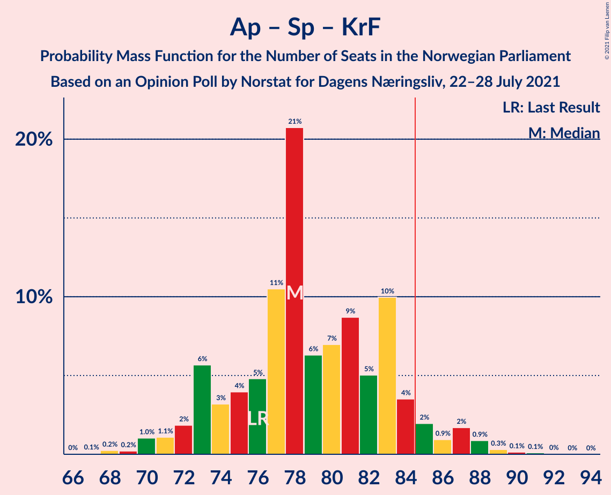

| Number of Seats | Probability | Accumulated | Special Marks |
|:---------------:|:-----------:|:-----------:|:-------------:|
| 66 | 0% | 100% |  |
| 67 | 0.1% | 99.9% |  |
| 68 | 0.2% | 99.9% |  |
| 69 | 0.2% | 99.6% |  |
| 70 | 1.0% | 99.4% |  |
| 71 | 1.1% | 98% |  |
| 72 | 2% | 97% |  |
| 73 | 6% | 95% |  |
| 74 | 3% | 90% |  |
| 75 | 4% | 87% |  |
| 76 | 5% | 83% | Last Result |
| 77 | 11% | 78% | Median |
| 78 | 21% | 67% |  |
| 79 | 6% | 47% |  |
| 80 | 7% | 40% |  |
| 81 | 9% | 33% |  |
| 82 | 5% | 25% |  |
| 83 | 10% | 20% |  |
| 84 | 4% | 10% |  |
| 85 | 2% | 6% | Majority |
| 86 | 0.9% | 4% |  |
| 87 | 2% | 3% |  |
| 88 | 0.9% | 1.5% |  |
| 89 | 0.3% | 0.6% |  |
| 90 | 0.1% | 0.3% |  |
| 91 | 0.1% | 0.2% |  |
| 92 | 0% | 0.1% |  |
| 93 | 0% | 0% |  |

### Arbeiderpartiet – Sosialistisk Venstreparti – Rødt – Miljøpartiet De Grønne

| Number of Seats | Probability | Accumulated | Special Marks |
|:---------------:|:-----------:|:-----------:|:-------------:|
| 62 | 0% | 100% | Last Result |
| 63 | 0% | 100% |  |
| 64 | 0% | 100% |  |
| 65 | 0.1% | 100% |  |
| 66 | 0.1% | 99.9% |  |
| 67 | 0.2% | 99.8% |  |
| 68 | 0.4% | 99.6% |  |
| 69 | 0.3% | 99.3% |  |
| 70 | 1.0% | 98.9% |  |
| 71 | 1.3% | 98% |  |
| 72 | 3% | 97% |  |
| 73 | 4% | 93% |  |
| 74 | 4% | 89% |  |
| 75 | 5% | 85% |  |
| 76 | 8% | 81% |  |
| 77 | 10% | 73% |  |
| 78 | 9% | 63% |  |
| 79 | 8% | 54% |  |
| 80 | 12% | 47% | Median |
| 81 | 9% | 35% |  |
| 82 | 7% | 25% |  |
| 83 | 2% | 18% |  |
| 84 | 7% | 16% |  |
| 85 | 4% | 9% | Majority |
| 86 | 2% | 5% |  |
| 87 | 2% | 3% |  |
| 88 | 0.9% | 2% |  |
| 89 | 0.5% | 0.9% |  |
| 90 | 0.2% | 0.4% |  |
| 91 | 0.1% | 0.2% |  |
| 92 | 0% | 0.1% |  |
| 93 | 0% | 0% |  |

### Arbeiderpartiet – Senterpartiet

| Number of Seats | Probability | Accumulated | Special Marks |
|:---------------:|:-----------:|:-----------:|:-------------:|
| 64 | 0% | 100% |  |
| 65 | 0% | 99.9% |  |
| 66 | 0.2% | 99.9% |  |
| 67 | 0.3% | 99.7% |  |
| 68 | 0.8% | 99.4% | Last Result |
| 69 | 1.5% | 98.6% |  |
| 70 | 2% | 97% |  |
| 71 | 4% | 95% |  |
| 72 | 6% | 91% |  |
| 73 | 5% | 85% |  |
| 74 | 4% | 81% |  |
| 75 | 9% | 76% |  |
| 76 | 16% | 67% | Median |
| 77 | 14% | 52% |  |
| 78 | 9% | 38% |  |
| 79 | 4% | 29% |  |
| 80 | 8% | 25% |  |
| 81 | 5% | 17% |  |
| 82 | 8% | 12% |  |
| 83 | 2% | 4% |  |
| 84 | 2% | 3% |  |
| 85 | 0.5% | 1.0% | Majority |
| 86 | 0.2% | 0.5% |  |
| 87 | 0.1% | 0.3% |  |
| 88 | 0.1% | 0.2% |  |
| 89 | 0.1% | 0.1% |  |
| 90 | 0% | 0% |  |

### Høyre – Fremskrittspartiet – Miljøpartiet De Grønne – Venstre – Kristelig Folkeparti

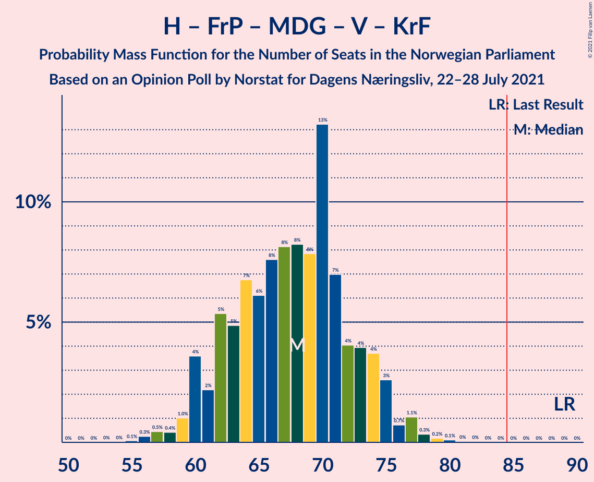

| Number of Seats | Probability | Accumulated | Special Marks |
|:---------------:|:-----------:|:-----------:|:-------------:|
| 55 | 0.1% | 100% |  |
| 56 | 0.3% | 99.9% |  |
| 57 | 0.5% | 99.6% |  |
| 58 | 0.4% | 99.2% |  |
| 59 | 1.0% | 98.8% |  |
| 60 | 4% | 98% |  |
| 61 | 2% | 94% |  |
| 62 | 5% | 92% |  |
| 63 | 5% | 87% |  |
| 64 | 7% | 82% |  |
| 65 | 6% | 75% |  |
| 66 | 8% | 69% | Median |
| 67 | 8% | 61% |  |
| 68 | 8% | 53% |  |
| 69 | 8% | 45% |  |
| 70 | 13% | 37% |  |
| 71 | 7% | 24% |  |
| 72 | 4% | 17% |  |
| 73 | 4% | 13% |  |
| 74 | 4% | 9% |  |
| 75 | 3% | 5% |  |
| 76 | 0.7% | 2% |  |
| 77 | 1.1% | 2% |  |
| 78 | 0.3% | 0.7% |  |
| 79 | 0.2% | 0.4% |  |
| 80 | 0.1% | 0.2% |  |
| 81 | 0% | 0.1% |  |
| 82 | 0% | 0% |  |
| 83 | 0% | 0% |  |
| 84 | 0% | 0% |  |
| 85 | 0% | 0% | Majority |
| 86 | 0% | 0% |  |
| 87 | 0% | 0% |  |
| 88 | 0% | 0% |  |
| 89 | 0% | 0% | Last Result |

### Arbeiderpartiet – Sosialistisk Venstreparti

| Number of Seats | Probability | Accumulated | Special Marks |
|:---------------:|:-----------:|:-----------:|:-------------:|
| 53 | 0.1% | 100% |  |
| 54 | 0.2% | 99.9% |  |
| 55 | 0.5% | 99.7% |  |
| 56 | 2% | 99.2% |  |
| 57 | 4% | 97% |  |
| 58 | 4% | 94% |  |
| 59 | 7% | 90% |  |
| 60 | 7% | 83% | Last Result |
| 61 | 6% | 76% |  |
| 62 | 14% | 70% |  |
| 63 | 10% | 56% | Median |
| 64 | 8% | 46% |  |
| 65 | 9% | 37% |  |
| 66 | 7% | 28% |  |
| 67 | 7% | 21% |  |
| 68 | 6% | 14% |  |
| 69 | 3% | 8% |  |
| 70 | 2% | 5% |  |
| 71 | 1.0% | 2% |  |
| 72 | 0.8% | 2% |  |
| 73 | 0.5% | 0.7% |  |
| 74 | 0.1% | 0.2% |  |
| 75 | 0.1% | 0.1% |  |
| 76 | 0% | 0.1% |  |
| 77 | 0% | 0% |  |

### Høyre – Fremskrittspartiet – Venstre – Kristelig Folkeparti

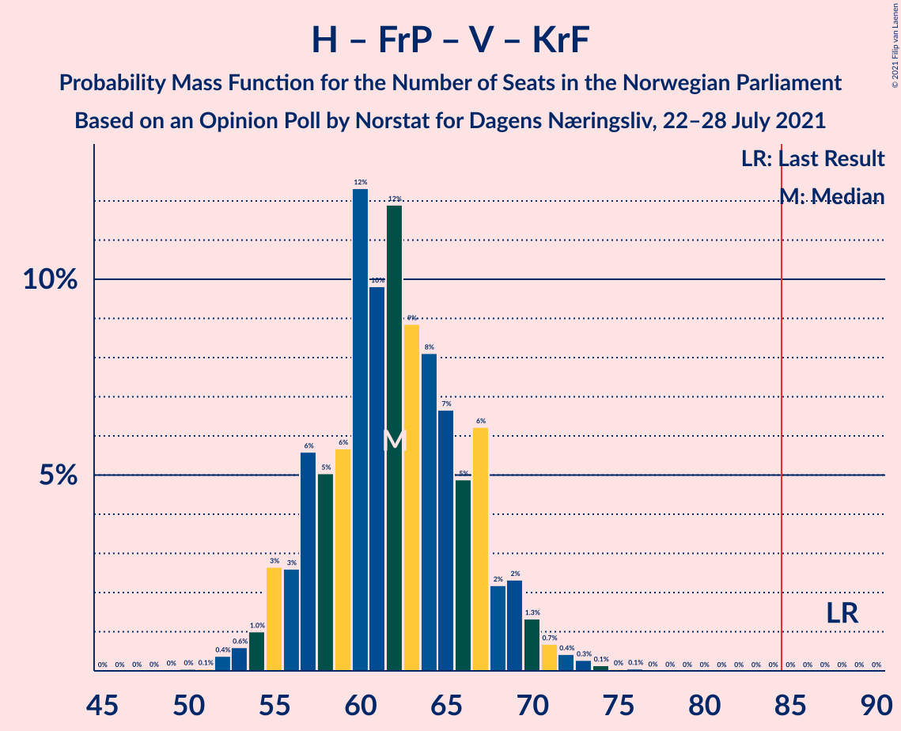

| Number of Seats | Probability | Accumulated | Special Marks |
|:---------------:|:-----------:|:-----------:|:-------------:|
| 49 | 0% | 100% |  |
| 50 | 0% | 99.9% |  |
| 51 | 0.1% | 99.9% |  |
| 52 | 0.4% | 99.8% |  |
| 53 | 0.6% | 99.5% |  |
| 54 | 1.0% | 98.9% |  |
| 55 | 3% | 98% |  |
| 56 | 3% | 95% |  |
| 57 | 6% | 93% |  |
| 58 | 5% | 87% |  |
| 59 | 6% | 82% | Median |
| 60 | 12% | 76% |  |
| 61 | 10% | 64% |  |
| 62 | 12% | 54% |  |
| 63 | 9% | 42% |  |
| 64 | 8% | 33% |  |
| 65 | 7% | 25% |  |
| 66 | 5% | 19% |  |
| 67 | 6% | 14% |  |
| 68 | 2% | 8% |  |
| 69 | 2% | 5% |  |
| 70 | 1.3% | 3% |  |
| 71 | 0.7% | 2% |  |
| 72 | 0.4% | 1.0% |  |
| 73 | 0.3% | 0.5% |  |
| 74 | 0.1% | 0.3% |  |
| 75 | 0% | 0.1% |  |
| 76 | 0.1% | 0.1% |  |
| 77 | 0% | 0% |  |
| 78 | 0% | 0% |  |
| 79 | 0% | 0% |  |
| 80 | 0% | 0% |  |
| 81 | 0% | 0% |  |
| 82 | 0% | 0% |  |
| 83 | 0% | 0% |  |
| 84 | 0% | 0% |  |
| 85 | 0% | 0% | Majority |
| 86 | 0% | 0% |  |
| 87 | 0% | 0% |  |
| 88 | 0% | 0% | Last Result |

### Høyre – Fremskrittspartiet – Venstre

| Number of Seats | Probability | Accumulated | Special Marks |
|:---------------:|:-----------:|:-----------:|:-------------:|
| 48 | 0.1% | 100% |  |
| 49 | 0.1% | 99.9% |  |
| 50 | 0.2% | 99.8% |  |
| 51 | 0.4% | 99.5% |  |
| 52 | 2% | 99.1% |  |
| 53 | 2% | 97% |  |
| 54 | 4% | 95% |  |
| 55 | 4% | 91% |  |
| 56 | 4% | 87% |  |
| 57 | 6% | 83% |  |
| 58 | 8% | 76% | Median |
| 59 | 14% | 68% |  |
| 60 | 17% | 55% |  |
| 61 | 5% | 38% |  |
| 62 | 9% | 32% |  |
| 63 | 6% | 24% |  |
| 64 | 6% | 17% |  |
| 65 | 4% | 11% |  |
| 66 | 2% | 7% |  |
| 67 | 2% | 5% |  |
| 68 | 2% | 3% |  |
| 69 | 0.6% | 1.2% |  |
| 70 | 0.2% | 0.6% |  |
| 71 | 0.2% | 0.4% |  |
| 72 | 0.1% | 0.2% |  |
| 73 | 0.1% | 0.1% |  |
| 74 | 0% | 0% |  |
| 75 | 0% | 0% |  |
| 76 | 0% | 0% |  |
| 77 | 0% | 0% |  |
| 78 | 0% | 0% |  |
| 79 | 0% | 0% |  |
| 80 | 0% | 0% | Last Result |

### Høyre – Fremskrittspartiet

| Number of Seats | Probability | Accumulated | Special Marks |
|:---------------:|:-----------:|:-----------:|:-------------:|
| 44 | 0% | 100% |  |
| 45 | 0.1% | 99.9% |  |
| 46 | 0.2% | 99.9% |  |
| 47 | 0.3% | 99.6% |  |
| 48 | 1.0% | 99.3% |  |
| 49 | 2% | 98% |  |
| 50 | 4% | 97% |  |
| 51 | 4% | 93% |  |
| 52 | 8% | 89% |  |
| 53 | 6% | 81% |  |
| 54 | 8% | 75% |  |
| 55 | 7% | 67% |  |
| 56 | 10% | 60% | Median |
| 57 | 13% | 50% |  |
| 58 | 15% | 38% |  |
| 59 | 5% | 23% |  |
| 60 | 6% | 17% |  |
| 61 | 4% | 11% |  |
| 62 | 3% | 7% |  |
| 63 | 2% | 4% |  |
| 64 | 0.8% | 2% |  |
| 65 | 0.7% | 1.1% |  |
| 66 | 0.4% | 0.5% |  |
| 67 | 0.1% | 0.1% |  |
| 68 | 0% | 0.1% |  |
| 69 | 0% | 0% |  |
| 70 | 0% | 0% |  |
| 71 | 0% | 0% |  |
| 72 | 0% | 0% | Last Result |

### Høyre – Venstre – Kristelig Folkeparti

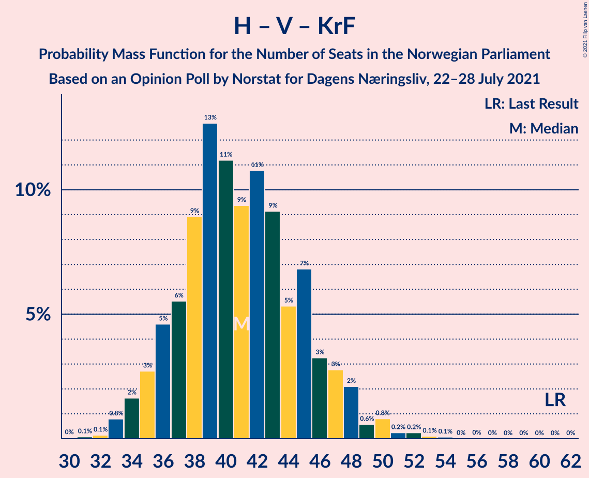

| Number of Seats | Probability | Accumulated | Special Marks |
|:---------------:|:-----------:|:-----------:|:-------------:|
| 30 | 0% | 100% |  |
| 31 | 0.1% | 99.9% |  |
| 32 | 0.1% | 99.9% |  |
| 33 | 0.8% | 99.7% |  |
| 34 | 2% | 98.9% |  |
| 35 | 3% | 97% |  |
| 36 | 5% | 95% |  |
| 37 | 6% | 90% |  |
| 38 | 9% | 84% | Median |
| 39 | 13% | 76% |  |
| 40 | 11% | 63% |  |
| 41 | 9% | 52% |  |
| 42 | 11% | 42% |  |
| 43 | 9% | 31% |  |
| 44 | 5% | 22% |  |
| 45 | 7% | 17% |  |
| 46 | 3% | 10% |  |
| 47 | 3% | 7% |  |
| 48 | 2% | 4% |  |
| 49 | 0.6% | 2% |  |
| 50 | 0.8% | 2% |  |
| 51 | 0.2% | 0.7% |  |
| 52 | 0.2% | 0.5% |  |
| 53 | 0.1% | 0.2% |  |
| 54 | 0.1% | 0.1% |  |
| 55 | 0% | 0% |  |
| 56 | 0% | 0% |  |
| 57 | 0% | 0% |  |
| 58 | 0% | 0% |  |
| 59 | 0% | 0% |  |
| 60 | 0% | 0% |  |
| 61 | 0% | 0% | Last Result |

### Senterpartiet – Venstre – Kristelig Folkeparti

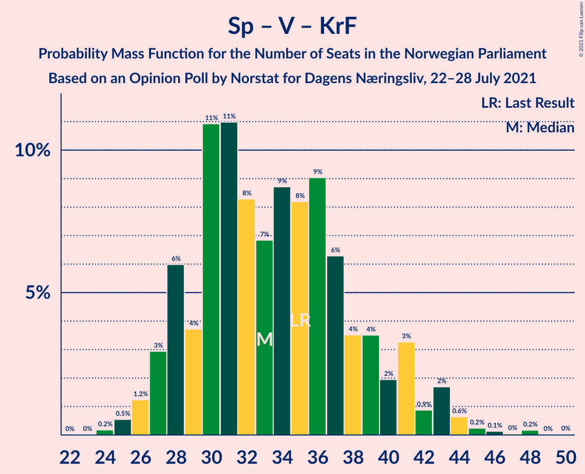

| Number of Seats | Probability | Accumulated | Special Marks |
|:---------------:|:-----------:|:-----------:|:-------------:|
| 24 | 0.2% | 100% |  |
| 25 | 0.5% | 99.8% |  |
| 26 | 1.2% | 99.2% |  |
| 27 | 3% | 98% |  |
| 28 | 6% | 95% |  |
| 29 | 4% | 89% |  |
| 30 | 11% | 85% | Median |
| 31 | 11% | 74% |  |
| 32 | 8% | 63% |  |
| 33 | 7% | 55% |  |
| 34 | 9% | 48% |  |
| 35 | 8% | 40% | Last Result |
| 36 | 9% | 31% |  |
| 37 | 6% | 22% |  |
| 38 | 4% | 16% |  |
| 39 | 4% | 13% |  |
| 40 | 2% | 9% |  |
| 41 | 3% | 7% |  |
| 42 | 0.9% | 4% |  |
| 43 | 2% | 3% |  |
| 44 | 0.6% | 1.3% |  |
| 45 | 0.2% | 0.6% |  |
| 46 | 0.1% | 0.4% |  |
| 47 | 0% | 0.3% |  |
| 48 | 0.2% | 0.2% |  |
| 49 | 0% | 0.1% |  |
| 50 | 0% | 0% |  |

## Technical Information

### Opinion Poll

+ **Polling firm:** Norstat
+ **Commissioner(s):** Dagens Næringsliv
+ **Fieldwork period:** 22–28 July 2021

### Calculations

+ **Sample size:** 740
+ **Simulations done:** 1,048,576
+ **Error estimate:** 2.06%

