# Opinion Poll by Kantar TNS for TV2, 2–6 August 2021

<a href="#voting-intentions">Voting Intentions</a> | <a href="#seats">Seats</a> | <a href="#coalitions">Coalitions</a> | <a href="#technical-information">Technical Information</a>

## Voting Intentions

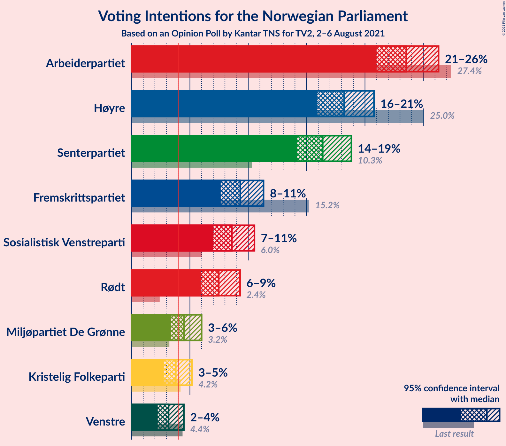

### Confidence Intervals

| Party | Last Result | Poll Result | 80% Confidence Interval | 90% Confidence Interval | 95% Confidence Interval | 99% Confidence Interval |
|:-----:|:-----------:|:-----------:|:-----------------------:|:-----------------------:|:-----------------------:|:-----------------------:|
| Arbeiderpartiet | 27.4% | 23.5% | 21.9–25.3% |21.4–25.9% |21.0–26.3% |20.2–27.2% |
| Høyre | 25.0% | 18.2% | 16.7–19.9% |16.3–20.4% |15.9–20.8% |15.2–21.6% |
| Senterpartiet | 10.3% | 16.4% | 14.9–18.0% |14.5–18.4% |14.2–18.8% |13.5–19.6% |
| Fremskrittspartiet | 15.2% | 9.3% | 8.2–10.6% |7.9–11.0% |7.6–11.3% |7.1–12.0% |
| Sosialistisk Venstreparti | 6.0% | 8.6% | 7.5–9.9% |7.2–10.2% |7.0–10.5% |6.5–11.2% |
| Rødt | 2.4% | 7.5% | 6.5–8.7% |6.2–9.0% |6.0–9.3% |5.5–9.9% |
| Miljøpartiet De Grønne | 3.2% | 4.5% | 3.7–5.5% |3.6–5.8% |3.4–6.0% |3.0–6.5% |
| Kristelig Folkeparti | 4.2% | 3.8% | 3.1–4.7% |2.9–5.0% |2.8–5.2% |2.5–5.7% |
| Venstre | 4.4% | 3.2% | 2.6–4.0% |2.4–4.3% |2.2–4.5% |2.0–4.9% |

*Note:* The poll result column reflects the actual value used in the calculations. Published results may vary slightly, and in addition be rounded to fewer digits.

## Seats

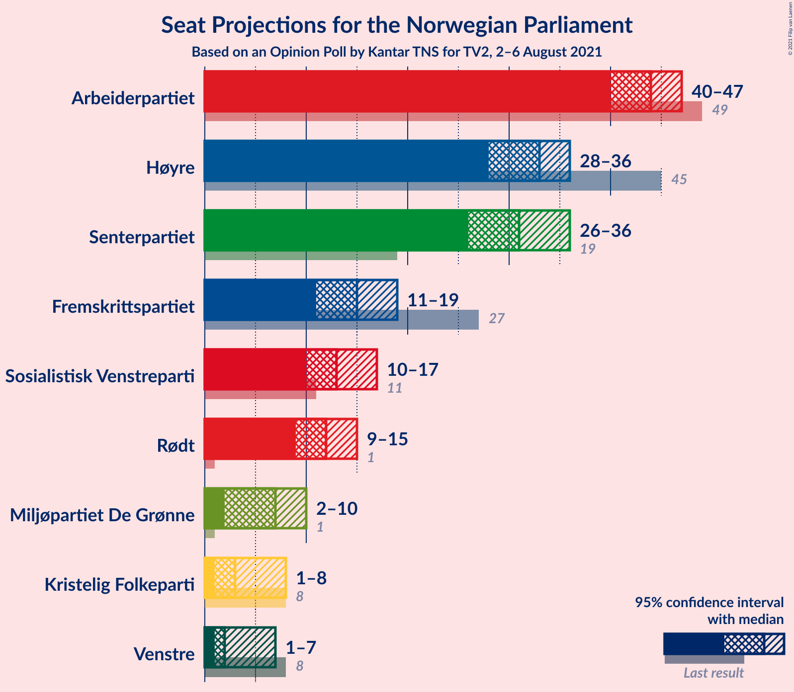

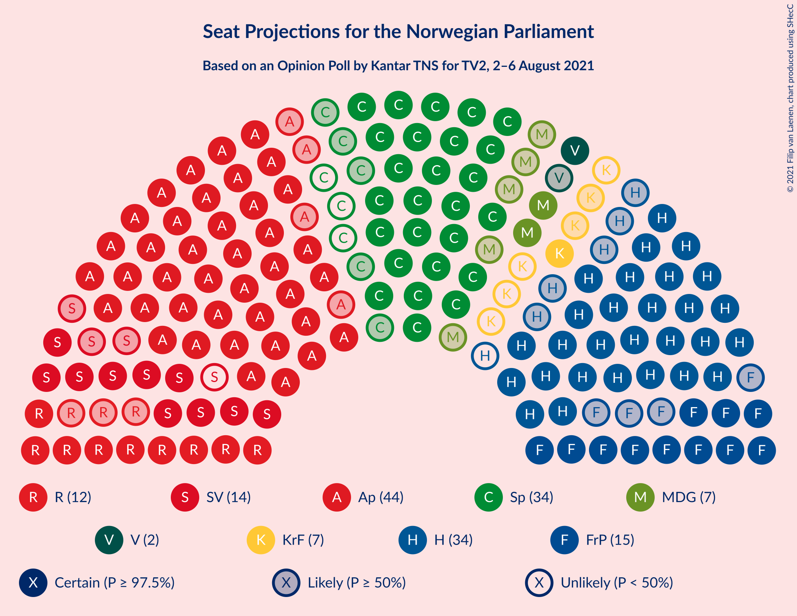

### Confidence Intervals

| Party | Last Result | Median | 80% Confidence Interval | 90% Confidence Interval | 95% Confidence Interval | 99% Confidence Interval |
|:-----:|:-----------:|:------:|:-----------------------:|:-----------------------:|:-----------------------:|:-----------------------:|
| <a href="#arbeiderpartiet">Arbeiderpartiet</a> | 49 | 44 | 42–45 |41–46 |40–47 |38–50 |
| <a href="#høyre">Høyre</a> | 45 | 33 | 29–35 |29–36 |28–36 |26–38 |
| <a href="#senterpartiet">Senterpartiet</a> | 19 | 31 | 28–35 |27–36 |26–36 |25–37 |
| <a href="#fremskrittspartiet">Fremskrittspartiet</a> | 27 | 15 | 12–17 |12–18 |11–19 |11–21 |
| <a href="#sosialistisk-venstreparti">Sosialistisk Venstreparti</a> | 11 | 13 | 11–16 |11–17 |10–17 |9–19 |
| <a href="#rødt">Rødt</a> | 1 | 12 | 10–14 |9–14 |9–15 |8–16 |
| <a href="#miljøpartiet-de-grønne">Miljøpartiet De Grønne</a> | 1 | 7 | 2–8 |2–9 |2–10 |2–10 |
| <a href="#kristelig-folkeparti">Kristelig Folkeparti</a> | 8 | 3 | 3–7 |1–7 |1–8 |1–9 |
| <a href="#venstre">Venstre</a> | 8 | 2 | 2 |2–6 |1–7 |1–8 |

### Arbeiderpartiet

*For a full overview of the results for this party, see the [Arbeiderpartiet](party-arbeiderpartiet.html) page.*

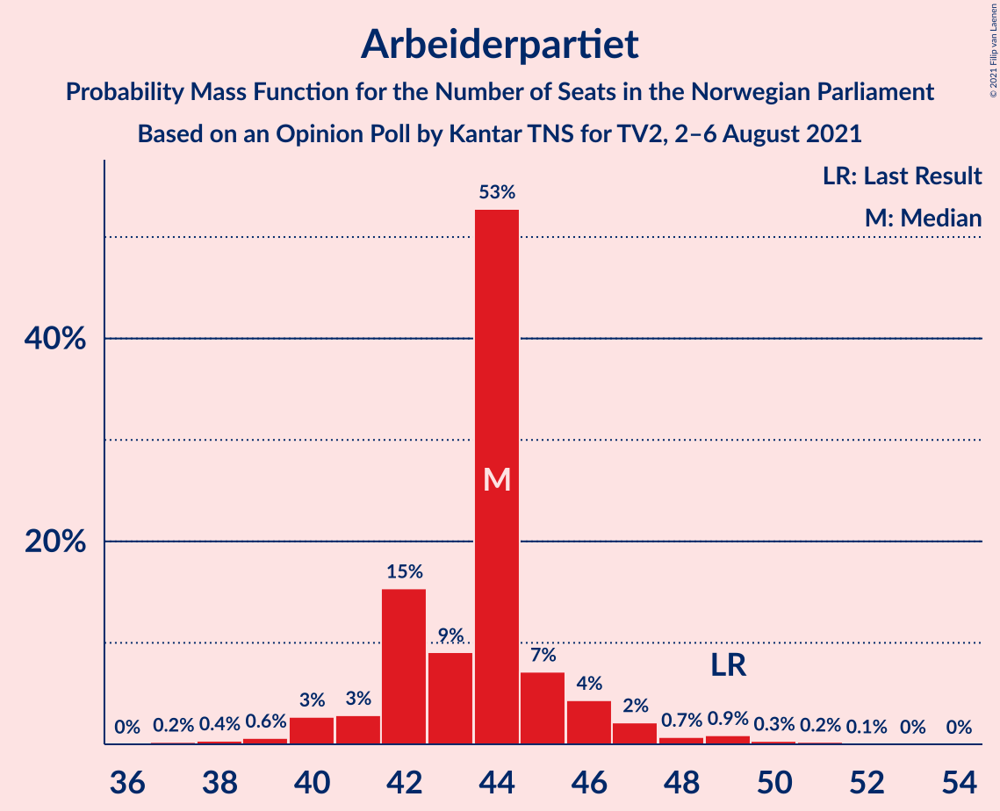

| Number of Seats | Probability | Accumulated | Special Marks |
|:---------------:|:-----------:|:-----------:|:-------------:|
| 36 | 0% | 100% |  |
| 37 | 0.2% | 99.9% |  |
| 38 | 0.4% | 99.7% |  |
| 39 | 0.6% | 99.4% |  |
| 40 | 3% | 98.7% |  |
| 41 | 3% | 96% |  |
| 42 | 15% | 93% |  |
| 43 | 9% | 78% |  |
| 44 | 53% | 69% | Median |
| 45 | 7% | 16% |  |
| 46 | 4% | 9% |  |
| 47 | 2% | 4% |  |
| 48 | 0.7% | 2% |  |
| 49 | 0.9% | 2% | Last Result |
| 50 | 0.3% | 0.7% |  |
| 51 | 0.2% | 0.4% |  |
| 52 | 0.1% | 0.1% |  |
| 53 | 0% | 0.1% |  |
| 54 | 0% | 0% |  |

### Høyre

*For a full overview of the results for this party, see the [Høyre](party-høyre.html) page.*

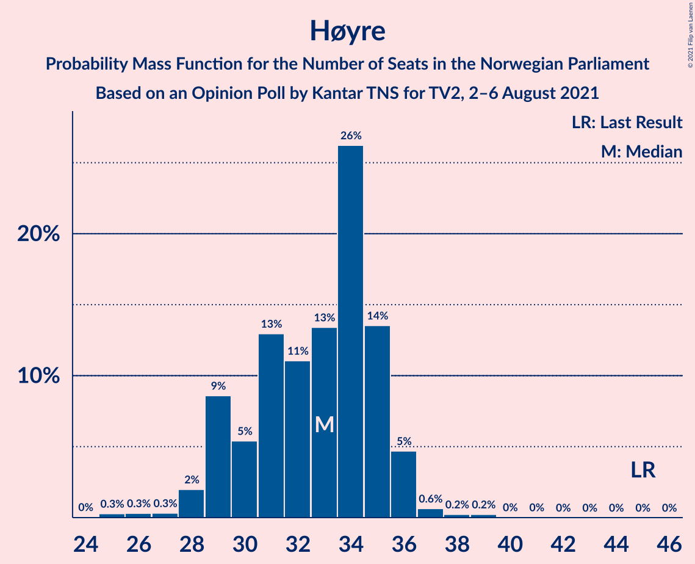

| Number of Seats | Probability | Accumulated | Special Marks |
|:---------------:|:-----------:|:-----------:|:-------------:|
| 24 | 0% | 100% |  |
| 25 | 0.3% | 99.9% |  |
| 26 | 0.3% | 99.6% |  |
| 27 | 0.3% | 99.3% |  |
| 28 | 2% | 99.0% |  |
| 29 | 9% | 97% |  |
| 30 | 5% | 88% |  |
| 31 | 13% | 83% |  |
| 32 | 11% | 70% |  |
| 33 | 13% | 59% | Median |
| 34 | 26% | 46% |  |
| 35 | 14% | 19% |  |
| 36 | 5% | 6% |  |
| 37 | 0.6% | 1.2% |  |
| 38 | 0.2% | 0.5% |  |
| 39 | 0.2% | 0.3% |  |
| 40 | 0% | 0.1% |  |
| 41 | 0% | 0% |  |
| 42 | 0% | 0% |  |
| 43 | 0% | 0% |  |
| 44 | 0% | 0% |  |
| 45 | 0% | 0% | Last Result |

### Senterpartiet

*For a full overview of the results for this party, see the [Senterpartiet](party-senterpartiet.html) page.*

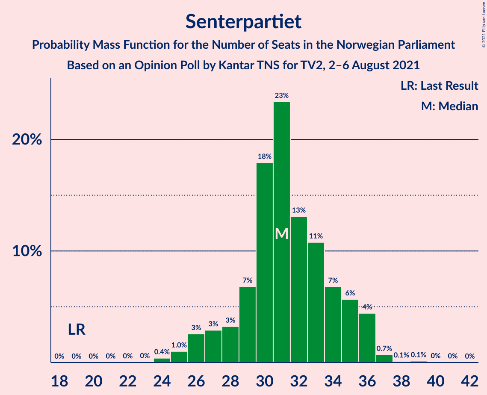

| Number of Seats | Probability | Accumulated | Special Marks |
|:---------------:|:-----------:|:-----------:|:-------------:|
| 19 | 0% | 100% | Last Result |
| 20 | 0% | 100% |  |
| 21 | 0% | 100% |  |
| 22 | 0% | 100% |  |
| 23 | 0% | 100% |  |
| 24 | 0.4% | 99.9% |  |
| 25 | 1.0% | 99.5% |  |
| 26 | 3% | 98.5% |  |
| 27 | 3% | 96% |  |
| 28 | 3% | 93% |  |
| 29 | 7% | 90% |  |
| 30 | 18% | 83% |  |
| 31 | 23% | 65% | Median |
| 32 | 13% | 42% |  |
| 33 | 11% | 29% |  |
| 34 | 7% | 18% |  |
| 35 | 6% | 11% |  |
| 36 | 4% | 5% |  |
| 37 | 0.7% | 1.0% |  |
| 38 | 0.1% | 0.3% |  |
| 39 | 0.1% | 0.2% |  |
| 40 | 0% | 0.1% |  |
| 41 | 0% | 0% |  |

### Fremskrittspartiet

*For a full overview of the results for this party, see the [Fremskrittspartiet](party-fremskrittspartiet.html) page.*

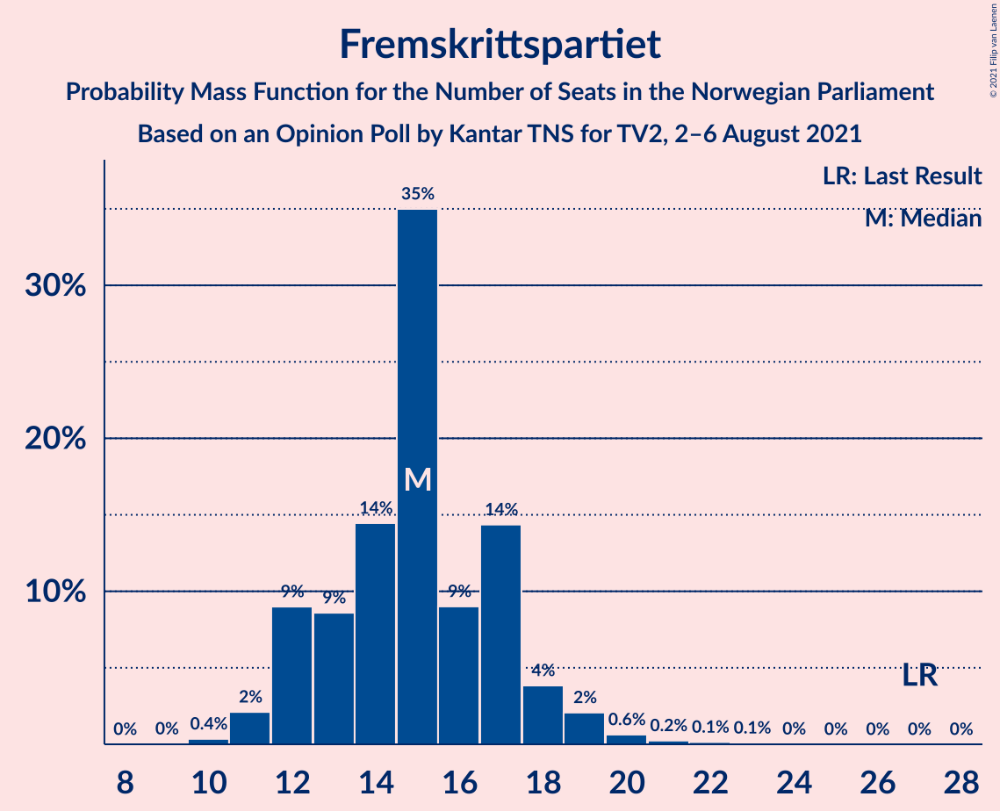

| Number of Seats | Probability | Accumulated | Special Marks |
|:---------------:|:-----------:|:-----------:|:-------------:|
| 10 | 0.4% | 100% |  |
| 11 | 2% | 99.6% |  |
| 12 | 9% | 97% |  |
| 13 | 9% | 88% |  |
| 14 | 14% | 80% |  |
| 15 | 35% | 65% | Median |
| 16 | 9% | 30% |  |
| 17 | 14% | 21% |  |
| 18 | 4% | 7% |  |
| 19 | 2% | 3% |  |
| 20 | 0.6% | 1.1% |  |
| 21 | 0.2% | 0.5% |  |
| 22 | 0.1% | 0.3% |  |
| 23 | 0.1% | 0.1% |  |
| 24 | 0% | 0% |  |
| 25 | 0% | 0% |  |
| 26 | 0% | 0% |  |
| 27 | 0% | 0% | Last Result |

### Sosialistisk Venstreparti

*For a full overview of the results for this party, see the [Sosialistisk Venstreparti](party-sosialistiskvenstreparti.html) page.*

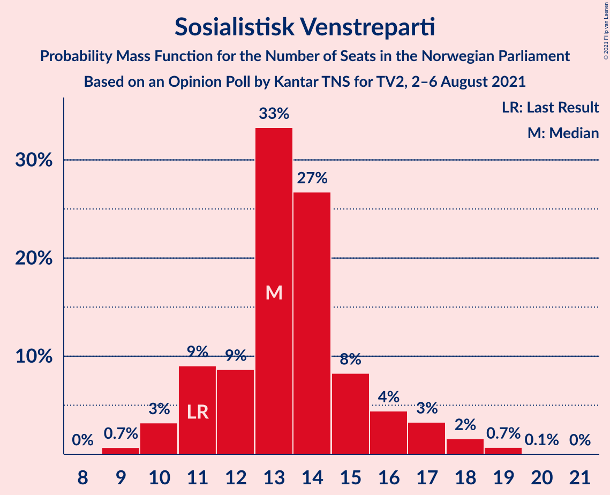

| Number of Seats | Probability | Accumulated | Special Marks |
|:---------------:|:-----------:|:-----------:|:-------------:|
| 9 | 0.7% | 100% |  |
| 10 | 3% | 99.3% |  |
| 11 | 9% | 96% | Last Result |
| 12 | 9% | 87% |  |
| 13 | 33% | 78% | Median |
| 14 | 27% | 45% |  |
| 15 | 8% | 18% |  |
| 16 | 4% | 10% |  |
| 17 | 3% | 6% |  |
| 18 | 2% | 2% |  |
| 19 | 0.7% | 0.8% |  |
| 20 | 0.1% | 0.1% |  |
| 21 | 0% | 0% |  |

### Rødt

*For a full overview of the results for this party, see the [Rødt](party-rødt.html) page.*

| Number of Seats | Probability | Accumulated | Special Marks |
|:---------------:|:-----------:|:-----------:|:-------------:|
| 1 | 0% | 100% | Last Result |
| 2 | 0% | 100% |  |
| 3 | 0% | 100% |  |
| 4 | 0% | 100% |  |
| 5 | 0% | 100% |  |
| 6 | 0% | 100% |  |
| 7 | 0% | 100% |  |
| 8 | 0.6% | 100% |  |
| 9 | 5% | 99.3% |  |
| 10 | 10% | 94% |  |
| 11 | 20% | 84% |  |
| 12 | 36% | 65% | Median |
| 13 | 18% | 28% |  |
| 14 | 6% | 11% |  |
| 15 | 3% | 4% |  |
| 16 | 0.7% | 1.0% |  |
| 17 | 0.2% | 0.3% |  |
| 18 | 0.1% | 0.1% |  |
| 19 | 0% | 0% |  |

### Miljøpartiet De Grønne

*For a full overview of the results for this party, see the [Miljøpartiet De Grønne](party-miljøpartietdegrønne.html) page.*

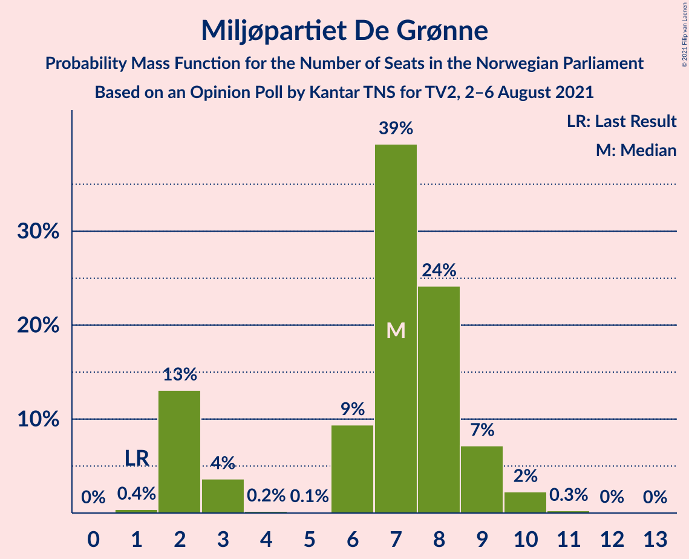

| Number of Seats | Probability | Accumulated | Special Marks |
|:---------------:|:-----------:|:-----------:|:-------------:|
| 1 | 0.4% | 100% | Last Result |
| 2 | 13% | 99.6% |  |
| 3 | 4% | 87% |  |
| 4 | 0.2% | 83% |  |
| 5 | 0.1% | 83% |  |
| 6 | 9% | 83% |  |
| 7 | 39% | 73% | Median |
| 8 | 24% | 34% |  |
| 9 | 7% | 10% |  |
| 10 | 2% | 3% |  |
| 11 | 0.3% | 0.3% |  |
| 12 | 0% | 0.1% |  |
| 13 | 0% | 0% |  |

### Kristelig Folkeparti

*For a full overview of the results for this party, see the [Kristelig Folkeparti](party-kristeligfolkeparti.html) page.*

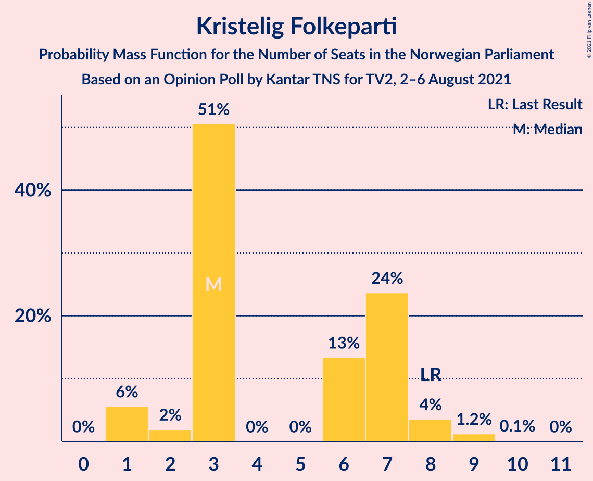

| Number of Seats | Probability | Accumulated | Special Marks |
|:---------------:|:-----------:|:-----------:|:-------------:|
| 1 | 6% | 100% |  |
| 2 | 2% | 94% |  |
| 3 | 51% | 92% | Median |
| 4 | 0% | 42% |  |
| 5 | 0% | 42% |  |
| 6 | 13% | 42% |  |
| 7 | 24% | 29% |  |
| 8 | 4% | 5% | Last Result |
| 9 | 1.2% | 1.4% |  |
| 10 | 0.1% | 0.2% |  |
| 11 | 0% | 0% |  |

### Venstre

*For a full overview of the results for this party, see the [Venstre](party-venstre.html) page.*

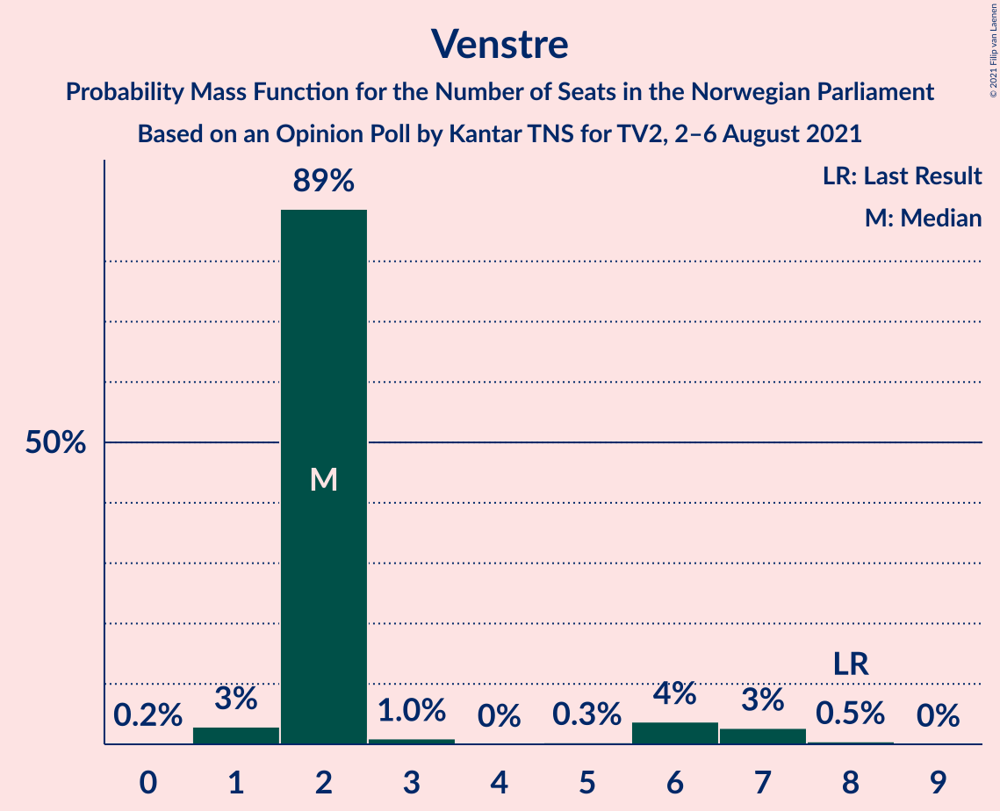

| Number of Seats | Probability | Accumulated | Special Marks |
|:---------------:|:-----------:|:-----------:|:-------------:|
| 0 | 0.2% | 100% |  |
| 1 | 3% | 99.8% |  |
| 2 | 89% | 97% | Median |
| 3 | 1.0% | 8% |  |
| 4 | 0% | 7% |  |
| 5 | 0.3% | 7% |  |
| 6 | 4% | 7% |  |
| 7 | 3% | 3% |  |
| 8 | 0.5% | 0.5% | Last Result |
| 9 | 0% | 0% |  |

## Coalitions

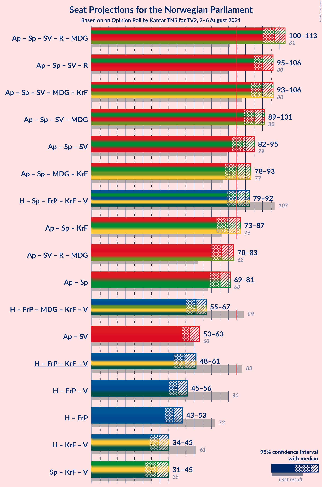

### Confidence Intervals

| Coalition | Last Result | Median | Majority? | 80% Confidence Interval | 90% Confidence Interval | 95% Confidence Interval | 99% Confidence Interval |
|:---------:|:-----------:|:------:|:---------:|:-----------------------:|:-----------------------:|:-----------------------:|:-----------------------:|
| Arbeiderpartiet – Senterpartiet – Sosialistisk Venstreparti – Rødt – Miljøpartiet De Grønne | 81 | 107 | 100% | 103–110 | 101–112 | 100–113 | 98–115 |
| Arbeiderpartiet – Senterpartiet – Sosialistisk Venstreparti – Rødt | 80 | 100 | 100% | 97–104 | 95–106 | 95–106 | 92–109 |
| Arbeiderpartiet – Senterpartiet – Sosialistisk Venstreparti – Miljøpartiet De Grønne – Kristelig Folkeparti | 88 | 99 | 100% | 96–104 | 94–105 | 93–106 | 91–108 |
| Arbeiderpartiet – Senterpartiet – Sosialistisk Venstreparti – Miljøpartiet De Grønne | 80 | 95 | 99.9% | 91–99 | 89–100 | 89–101 | 86–103 |
| Arbeiderpartiet – Senterpartiet – Sosialistisk Venstreparti | 79 | 88 | 93% | 85–92 | 84–93 | 82–95 | 81–96 |
| Arbeiderpartiet – Senterpartiet – Miljøpartiet De Grønne – Kristelig Folkeparti | 77 | 85 | 76% | 82–91 | 80–92 | 78–93 | 75–94 |
| Høyre – Senterpartiet – Fremskrittspartiet – Kristelig Folkeparti – Venstre | 107 | 85 | 69% | 82–90 | 80–91 | 79–92 | 76–94 |
| Arbeiderpartiet – Senterpartiet – Kristelig Folkeparti | 76 | 79 | 8% | 75–84 | 74–85 | 73–87 | 70–88 |
| Arbeiderpartiet – Sosialistisk Venstreparti – Rødt – Miljøpartiet De Grønne | 62 | 76 | 0.8% | 71–79 | 70–81 | 70–83 | 68–85 |
| Arbeiderpartiet – Senterpartiet | 68 | 75 | 0% | 72–79 | 70–80 | 69–81 | 67–83 |
| Høyre – Fremskrittspartiet – Miljøpartiet De Grønne – Kristelig Folkeparti – Venstre | 89 | 61 | 0% | 57–65 | 56–66 | 55–67 | 53–70 |
| Arbeiderpartiet – Sosialistisk Venstreparti | 60 | 57 | 0% | 55–60 | 54–62 | 53–63 | 52–65 |
| Høyre – Fremskrittspartiet – Kristelig Folkeparti – Venstre | 88 | 54 | 0% | 51–58 | 50–59 | 48–61 | 46–63 |
| Høyre – Fremskrittspartiet – Venstre | 80 | 50 | 0% | 47–53 | 46–54 | 45–56 | 43–59 |
| Høyre – Fremskrittspartiet | 72 | 48 | 0% | 44–50 | 43–52 | 43–53 | 40–55 |
| Høyre – Kristelig Folkeparti – Venstre | 61 | 39 | 0% | 36–43 | 34–44 | 34–45 | 32–47 |
| Senterpartiet – Kristelig Folkeparti – Venstre | 35 | 38 | 0% | 34–42 | 32–44 | 31–45 | 29–47 |

### Arbeiderpartiet – Senterpartiet – Sosialistisk Venstreparti – Rødt – Miljøpartiet De Grønne

| Number of Seats | Probability | Accumulated | Special Marks |
|:---------------:|:-----------:|:-----------:|:-------------:|
| 81 | 0% | 100% | Last Result |
| 82 | 0% | 100% |  |
| 83 | 0% | 100% |  |
| 84 | 0% | 100% |  |
| 85 | 0% | 100% | Majority |
| 86 | 0% | 100% |  |
| 87 | 0% | 100% |  |
| 88 | 0% | 100% |  |
| 89 | 0% | 100% |  |
| 90 | 0% | 100% |  |
| 91 | 0% | 100% |  |
| 92 | 0% | 100% |  |
| 93 | 0% | 100% |  |
| 94 | 0% | 100% |  |
| 95 | 0% | 100% |  |
| 96 | 0.1% | 100% |  |
| 97 | 0.2% | 99.9% |  |
| 98 | 0.3% | 99.7% |  |
| 99 | 0.5% | 99.4% |  |
| 100 | 1.4% | 98.9% |  |
| 101 | 4% | 97% |  |
| 102 | 3% | 94% |  |
| 103 | 5% | 91% |  |
| 104 | 7% | 86% |  |
| 105 | 8% | 79% |  |
| 106 | 10% | 71% |  |
| 107 | 23% | 61% | Median |
| 108 | 8% | 38% |  |
| 109 | 13% | 30% |  |
| 110 | 7% | 16% |  |
| 111 | 3% | 10% |  |
| 112 | 3% | 6% |  |
| 113 | 1.2% | 3% |  |
| 114 | 1.0% | 2% |  |
| 115 | 0.7% | 1.1% |  |
| 116 | 0.2% | 0.4% |  |
| 117 | 0.1% | 0.2% |  |
| 118 | 0.1% | 0.1% |  |
| 119 | 0% | 0% |  |

### Arbeiderpartiet – Senterpartiet – Sosialistisk Venstreparti – Rødt

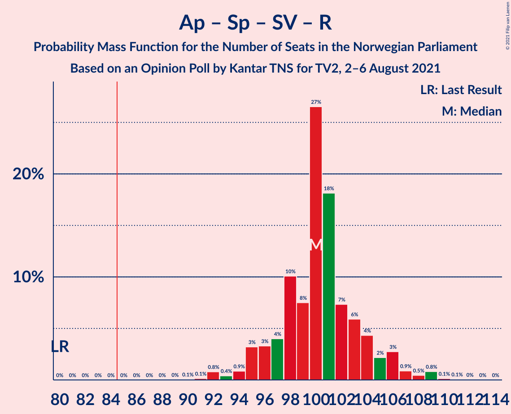

| Number of Seats | Probability | Accumulated | Special Marks |
|:---------------:|:-----------:|:-----------:|:-------------:|
| 80 | 0% | 100% | Last Result |
| 81 | 0% | 100% |  |
| 82 | 0% | 100% |  |
| 83 | 0% | 100% |  |
| 84 | 0% | 100% |  |
| 85 | 0% | 100% | Majority |
| 86 | 0% | 100% |  |
| 87 | 0% | 100% |  |
| 88 | 0% | 100% |  |
| 89 | 0% | 100% |  |
| 90 | 0.1% | 100% |  |
| 91 | 0.1% | 99.9% |  |
| 92 | 0.8% | 99.8% |  |
| 93 | 0.4% | 99.0% |  |
| 94 | 0.9% | 98.6% |  |
| 95 | 3% | 98% |  |
| 96 | 3% | 94% |  |
| 97 | 4% | 91% |  |
| 98 | 10% | 87% |  |
| 99 | 8% | 77% |  |
| 100 | 27% | 70% | Median |
| 101 | 18% | 43% |  |
| 102 | 7% | 25% |  |
| 103 | 6% | 18% |  |
| 104 | 4% | 12% |  |
| 105 | 2% | 7% |  |
| 106 | 3% | 5% |  |
| 107 | 0.9% | 2% |  |
| 108 | 0.5% | 2% |  |
| 109 | 0.8% | 1.1% |  |
| 110 | 0.1% | 0.3% |  |
| 111 | 0.1% | 0.1% |  |
| 112 | 0% | 0.1% |  |
| 113 | 0% | 0% |  |

### Arbeiderpartiet – Senterpartiet – Sosialistisk Venstreparti – Miljøpartiet De Grønne – Kristelig Folkeparti

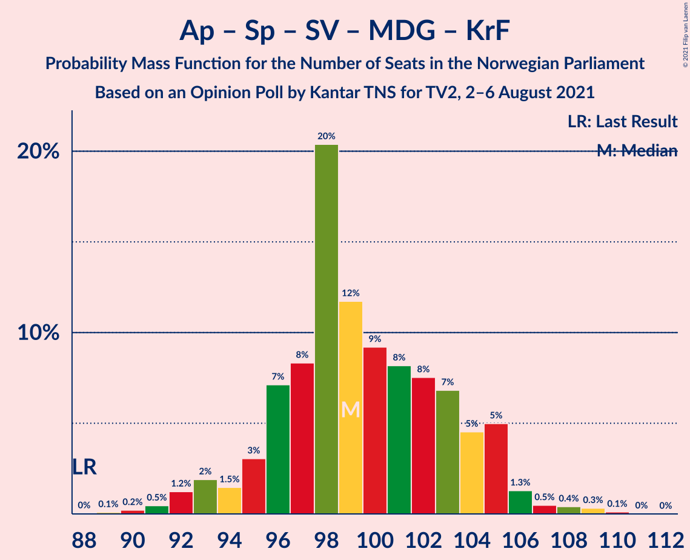

| Number of Seats | Probability | Accumulated | Special Marks |
|:---------------:|:-----------:|:-----------:|:-------------:|
| 88 | 0% | 100% | Last Result |
| 89 | 0.1% | 99.9% |  |
| 90 | 0.2% | 99.8% |  |
| 91 | 0.5% | 99.6% |  |
| 92 | 1.2% | 99.2% |  |
| 93 | 2% | 98% |  |
| 94 | 1.5% | 96% |  |
| 95 | 3% | 95% |  |
| 96 | 7% | 91% |  |
| 97 | 8% | 84% |  |
| 98 | 20% | 76% | Median |
| 99 | 12% | 56% |  |
| 100 | 9% | 44% |  |
| 101 | 8% | 35% |  |
| 102 | 8% | 27% |  |
| 103 | 7% | 19% |  |
| 104 | 5% | 12% |  |
| 105 | 5% | 8% |  |
| 106 | 1.3% | 3% |  |
| 107 | 0.5% | 1.4% |  |
| 108 | 0.4% | 0.9% |  |
| 109 | 0.3% | 0.5% |  |
| 110 | 0.1% | 0.2% |  |
| 111 | 0% | 0% |  |

### Arbeiderpartiet – Senterpartiet – Sosialistisk Venstreparti – Miljøpartiet De Grønne

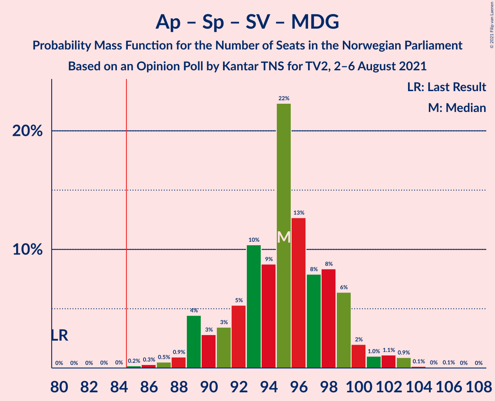

| Number of Seats | Probability | Accumulated | Special Marks |
|:---------------:|:-----------:|:-----------:|:-------------:|
| 80 | 0% | 100% | Last Result |
| 81 | 0% | 100% |  |
| 82 | 0% | 100% |  |
| 83 | 0% | 100% |  |
| 84 | 0% | 100% |  |
| 85 | 0.2% | 99.9% | Majority |
| 86 | 0.3% | 99.7% |  |
| 87 | 0.5% | 99.4% |  |
| 88 | 0.9% | 98.9% |  |
| 89 | 4% | 98% |  |
| 90 | 3% | 94% |  |
| 91 | 3% | 91% |  |
| 92 | 5% | 87% |  |
| 93 | 10% | 82% |  |
| 94 | 9% | 72% |  |
| 95 | 22% | 63% | Median |
| 96 | 13% | 41% |  |
| 97 | 8% | 28% |  |
| 98 | 8% | 20% |  |
| 99 | 6% | 12% |  |
| 100 | 2% | 5% |  |
| 101 | 1.0% | 3% |  |
| 102 | 1.1% | 2% |  |
| 103 | 0.9% | 1.1% |  |
| 104 | 0.1% | 0.3% |  |
| 105 | 0% | 0.1% |  |
| 106 | 0.1% | 0.1% |  |
| 107 | 0% | 0% |  |

### Arbeiderpartiet – Senterpartiet – Sosialistisk Venstreparti

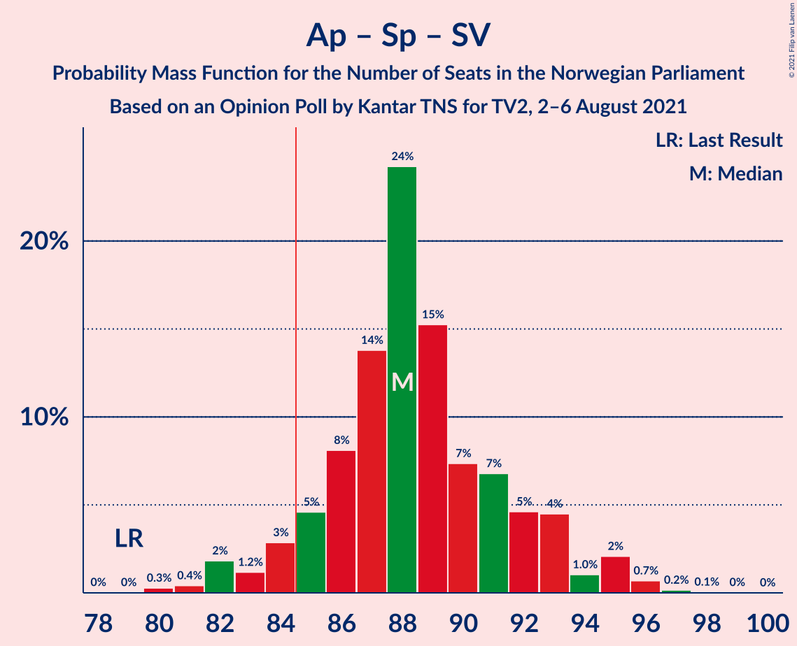

| Number of Seats | Probability | Accumulated | Special Marks |
|:---------------:|:-----------:|:-----------:|:-------------:|
| 79 | 0% | 100% | Last Result |
| 80 | 0.3% | 99.9% |  |
| 81 | 0.4% | 99.6% |  |
| 82 | 2% | 99.2% |  |
| 83 | 1.2% | 97% |  |
| 84 | 3% | 96% |  |
| 85 | 5% | 93% | Majority |
| 86 | 8% | 89% |  |
| 87 | 14% | 81% |  |
| 88 | 24% | 67% | Median |
| 89 | 15% | 43% |  |
| 90 | 7% | 27% |  |
| 91 | 7% | 20% |  |
| 92 | 5% | 13% |  |
| 93 | 4% | 9% |  |
| 94 | 1.0% | 4% |  |
| 95 | 2% | 3% |  |
| 96 | 0.7% | 1.0% |  |
| 97 | 0.2% | 0.3% |  |
| 98 | 0.1% | 0.1% |  |
| 99 | 0% | 0.1% |  |
| 100 | 0% | 0% |  |

### Arbeiderpartiet – Senterpartiet – Miljøpartiet De Grønne – Kristelig Folkeparti

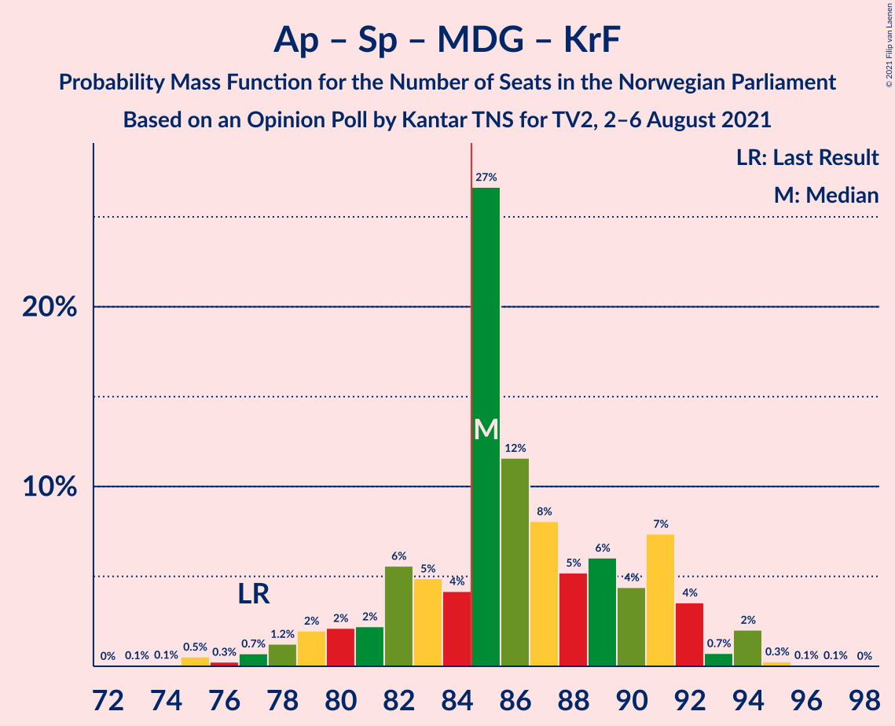

| Number of Seats | Probability | Accumulated | Special Marks |
|:---------------:|:-----------:|:-----------:|:-------------:|
| 73 | 0.1% | 100% |  |
| 74 | 0.1% | 99.9% |  |
| 75 | 0.5% | 99.8% |  |
| 76 | 0.3% | 99.3% |  |
| 77 | 0.7% | 99.0% | Last Result |
| 78 | 1.2% | 98% |  |
| 79 | 2% | 97% |  |
| 80 | 2% | 95% |  |
| 81 | 2% | 93% |  |
| 82 | 6% | 91% |  |
| 83 | 5% | 85% |  |
| 84 | 4% | 80% |  |
| 85 | 27% | 76% | Median, Majority |
| 86 | 12% | 49% |  |
| 87 | 8% | 38% |  |
| 88 | 5% | 30% |  |
| 89 | 6% | 25% |  |
| 90 | 4% | 19% |  |
| 91 | 7% | 14% |  |
| 92 | 4% | 7% |  |
| 93 | 0.7% | 3% |  |
| 94 | 2% | 2% |  |
| 95 | 0.3% | 0.4% |  |
| 96 | 0.1% | 0.2% |  |
| 97 | 0.1% | 0.1% |  |
| 98 | 0% | 0% |  |

### Høyre – Senterpartiet – Fremskrittspartiet – Kristelig Folkeparti – Venstre

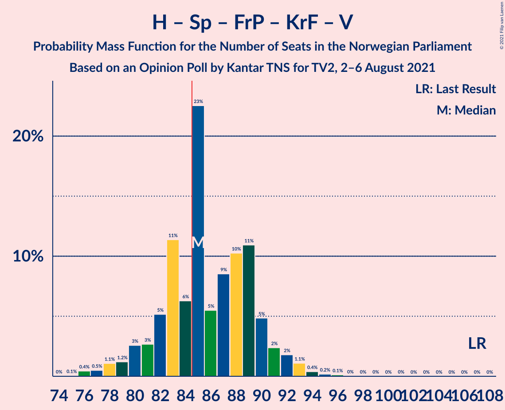

| Number of Seats | Probability | Accumulated | Special Marks |
|:---------------:|:-----------:|:-----------:|:-------------:|
| 75 | 0.1% | 100% |  |
| 76 | 0.4% | 99.9% |  |
| 77 | 0.5% | 99.5% |  |
| 78 | 1.1% | 99.0% |  |
| 79 | 1.2% | 98% |  |
| 80 | 3% | 97% |  |
| 81 | 3% | 94% |  |
| 82 | 5% | 91% |  |
| 83 | 11% | 86% |  |
| 84 | 6% | 75% | Median |
| 85 | 23% | 69% | Majority |
| 86 | 5% | 46% |  |
| 87 | 9% | 41% |  |
| 88 | 10% | 32% |  |
| 89 | 11% | 22% |  |
| 90 | 5% | 11% |  |
| 91 | 2% | 6% |  |
| 92 | 2% | 4% |  |
| 93 | 1.1% | 2% |  |
| 94 | 0.4% | 0.8% |  |
| 95 | 0.2% | 0.4% |  |
| 96 | 0.1% | 0.2% |  |
| 97 | 0% | 0.1% |  |
| 98 | 0% | 0% |  |
| 99 | 0% | 0% |  |
| 100 | 0% | 0% |  |
| 101 | 0% | 0% |  |
| 102 | 0% | 0% |  |
| 103 | 0% | 0% |  |
| 104 | 0% | 0% |  |
| 105 | 0% | 0% |  |
| 106 | 0% | 0% |  |
| 107 | 0% | 0% | Last Result |

### Arbeiderpartiet – Senterpartiet – Kristelig Folkeparti

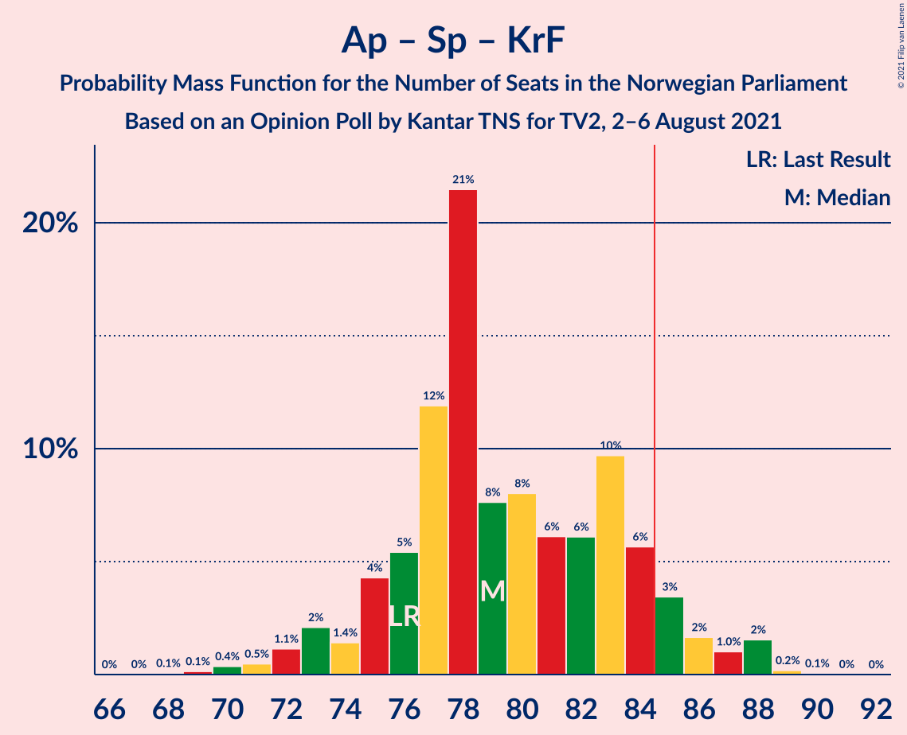

| Number of Seats | Probability | Accumulated | Special Marks |
|:---------------:|:-----------:|:-----------:|:-------------:|
| 68 | 0.1% | 100% |  |
| 69 | 0.1% | 99.9% |  |
| 70 | 0.4% | 99.8% |  |
| 71 | 0.5% | 99.4% |  |
| 72 | 1.1% | 98.9% |  |
| 73 | 2% | 98% |  |
| 74 | 1.4% | 96% |  |
| 75 | 4% | 94% |  |
| 76 | 5% | 90% | Last Result |
| 77 | 12% | 85% |  |
| 78 | 21% | 73% | Median |
| 79 | 8% | 51% |  |
| 80 | 8% | 44% |  |
| 81 | 6% | 36% |  |
| 82 | 6% | 29% |  |
| 83 | 10% | 23% |  |
| 84 | 6% | 14% |  |
| 85 | 3% | 8% | Majority |
| 86 | 2% | 4% |  |
| 87 | 1.0% | 3% |  |
| 88 | 2% | 2% |  |
| 89 | 0.2% | 0.3% |  |
| 90 | 0.1% | 0.1% |  |
| 91 | 0% | 0% |  |

### Arbeiderpartiet – Sosialistisk Venstreparti – Rødt – Miljøpartiet De Grønne

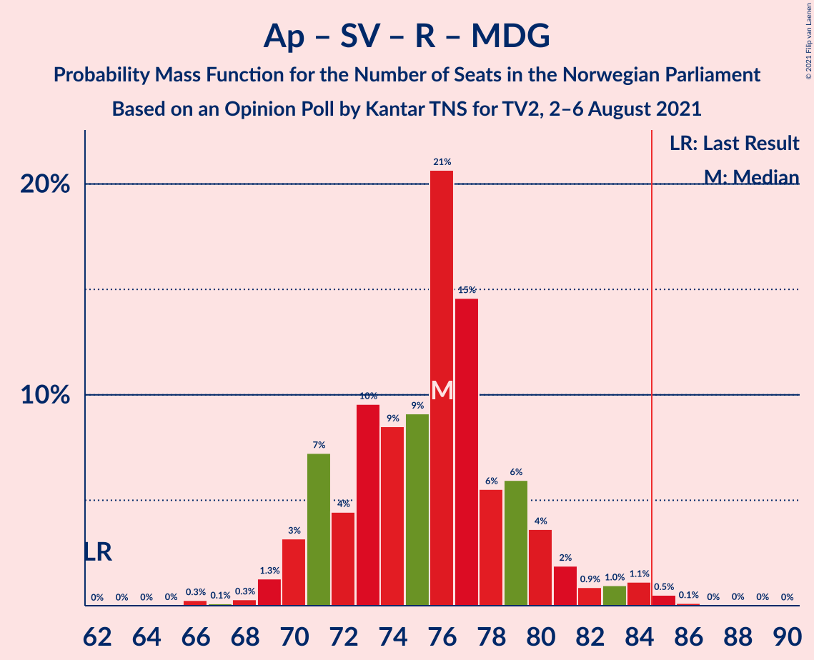

| Number of Seats | Probability | Accumulated | Special Marks |
|:---------------:|:-----------:|:-----------:|:-------------:|
| 62 | 0% | 100% | Last Result |
| 63 | 0% | 100% |  |
| 64 | 0% | 100% |  |
| 65 | 0% | 100% |  |
| 66 | 0.3% | 99.9% |  |
| 67 | 0.1% | 99.7% |  |
| 68 | 0.3% | 99.6% |  |
| 69 | 1.3% | 99.3% |  |
| 70 | 3% | 98% |  |
| 71 | 7% | 95% |  |
| 72 | 4% | 88% |  |
| 73 | 10% | 83% |  |
| 74 | 9% | 74% |  |
| 75 | 9% | 65% |  |
| 76 | 21% | 56% | Median |
| 77 | 15% | 35% |  |
| 78 | 6% | 21% |  |
| 79 | 6% | 15% |  |
| 80 | 4% | 9% |  |
| 81 | 2% | 6% |  |
| 82 | 0.9% | 4% |  |
| 83 | 1.0% | 3% |  |
| 84 | 1.1% | 2% |  |
| 85 | 0.5% | 0.8% | Majority |
| 86 | 0.1% | 0.2% |  |
| 87 | 0% | 0.1% |  |
| 88 | 0% | 0.1% |  |
| 89 | 0% | 0.1% |  |
| 90 | 0% | 0% |  |

### Arbeiderpartiet – Senterpartiet

| Number of Seats | Probability | Accumulated | Special Marks |
|:---------------:|:-----------:|:-----------:|:-------------:|
| 65 | 0.1% | 100% |  |
| 66 | 0.2% | 99.9% |  |
| 67 | 0.6% | 99.7% |  |
| 68 | 1.0% | 99.1% | Last Result |
| 69 | 2% | 98% |  |
| 70 | 2% | 96% |  |
| 71 | 3% | 94% |  |
| 72 | 7% | 91% |  |
| 73 | 7% | 84% |  |
| 74 | 18% | 76% |  |
| 75 | 23% | 59% | Median |
| 76 | 11% | 35% |  |
| 77 | 7% | 24% |  |
| 78 | 5% | 17% |  |
| 79 | 5% | 12% |  |
| 80 | 4% | 7% |  |
| 81 | 1.3% | 4% |  |
| 82 | 2% | 2% |  |
| 83 | 0.6% | 0.7% |  |
| 84 | 0.1% | 0.1% |  |
| 85 | 0% | 0% | Majority |

### Høyre – Fremskrittspartiet – Miljøpartiet De Grønne – Kristelig Folkeparti – Venstre

| Number of Seats | Probability | Accumulated | Special Marks |
|:---------------:|:-----------:|:-----------:|:-------------:|
| 50 | 0.1% | 100% |  |
| 51 | 0.1% | 99.9% |  |
| 52 | 0.3% | 99.8% |  |
| 53 | 1.0% | 99.6% |  |
| 54 | 0.8% | 98.6% |  |
| 55 | 3% | 98% |  |
| 56 | 3% | 95% |  |
| 57 | 4% | 93% |  |
| 58 | 5% | 89% |  |
| 59 | 12% | 84% |  |
| 60 | 11% | 72% | Median |
| 61 | 26% | 60% |  |
| 62 | 9% | 35% |  |
| 63 | 6% | 26% |  |
| 64 | 9% | 20% |  |
| 65 | 5% | 11% |  |
| 66 | 2% | 6% |  |
| 67 | 2% | 4% |  |
| 68 | 0.7% | 2% |  |
| 69 | 0.9% | 2% |  |
| 70 | 0.6% | 0.8% |  |
| 71 | 0.1% | 0.2% |  |
| 72 | 0.1% | 0.1% |  |
| 73 | 0% | 0.1% |  |
| 74 | 0% | 0% |  |
| 75 | 0% | 0% |  |
| 76 | 0% | 0% |  |
| 77 | 0% | 0% |  |
| 78 | 0% | 0% |  |
| 79 | 0% | 0% |  |
| 80 | 0% | 0% |  |
| 81 | 0% | 0% |  |
| 82 | 0% | 0% |  |
| 83 | 0% | 0% |  |
| 84 | 0% | 0% |  |
| 85 | 0% | 0% | Majority |
| 86 | 0% | 0% |  |
| 87 | 0% | 0% |  |
| 88 | 0% | 0% |  |
| 89 | 0% | 0% | Last Result |

### Arbeiderpartiet – Sosialistisk Venstreparti

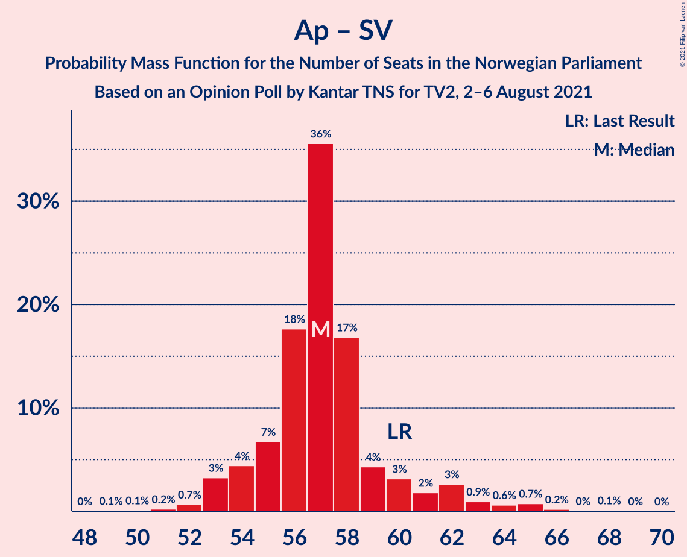

| Number of Seats | Probability | Accumulated | Special Marks |
|:---------------:|:-----------:|:-----------:|:-------------:|
| 49 | 0.1% | 100% |  |
| 50 | 0.1% | 99.9% |  |
| 51 | 0.2% | 99.8% |  |
| 52 | 0.7% | 99.6% |  |
| 53 | 3% | 98.9% |  |
| 54 | 4% | 96% |  |
| 55 | 7% | 91% |  |
| 56 | 18% | 85% |  |
| 57 | 36% | 67% | Median |
| 58 | 17% | 31% |  |
| 59 | 4% | 14% |  |
| 60 | 3% | 10% | Last Result |
| 61 | 2% | 7% |  |
| 62 | 3% | 5% |  |
| 63 | 0.9% | 3% |  |
| 64 | 0.6% | 2% |  |
| 65 | 0.7% | 1.1% |  |
| 66 | 0.2% | 0.4% |  |
| 67 | 0% | 0.2% |  |
| 68 | 0.1% | 0.1% |  |
| 69 | 0% | 0% |  |

### Høyre – Fremskrittspartiet – Kristelig Folkeparti – Venstre

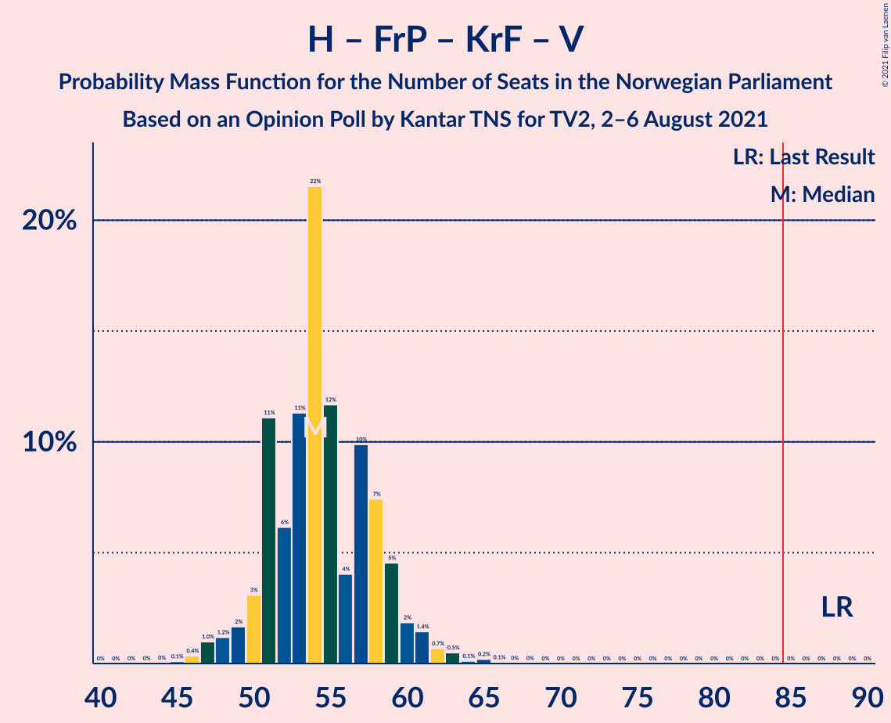

| Number of Seats | Probability | Accumulated | Special Marks |
|:---------------:|:-----------:|:-----------:|:-------------:|
| 44 | 0% | 100% |  |
| 45 | 0.1% | 99.9% |  |
| 46 | 0.4% | 99.8% |  |
| 47 | 1.0% | 99.5% |  |
| 48 | 1.2% | 98.5% |  |
| 49 | 2% | 97% |  |
| 50 | 3% | 96% |  |
| 51 | 11% | 93% |  |
| 52 | 6% | 81% |  |
| 53 | 11% | 75% | Median |
| 54 | 22% | 64% |  |
| 55 | 12% | 42% |  |
| 56 | 4% | 31% |  |
| 57 | 10% | 27% |  |
| 58 | 7% | 17% |  |
| 59 | 5% | 9% |  |
| 60 | 2% | 5% |  |
| 61 | 1.4% | 3% |  |
| 62 | 0.7% | 2% |  |
| 63 | 0.5% | 0.9% |  |
| 64 | 0.1% | 0.4% |  |
| 65 | 0.2% | 0.3% |  |
| 66 | 0.1% | 0.1% |  |
| 67 | 0% | 0% |  |
| 68 | 0% | 0% |  |
| 69 | 0% | 0% |  |
| 70 | 0% | 0% |  |
| 71 | 0% | 0% |  |
| 72 | 0% | 0% |  |
| 73 | 0% | 0% |  |
| 74 | 0% | 0% |  |
| 75 | 0% | 0% |  |
| 76 | 0% | 0% |  |
| 77 | 0% | 0% |  |
| 78 | 0% | 0% |  |
| 79 | 0% | 0% |  |
| 80 | 0% | 0% |  |
| 81 | 0% | 0% |  |
| 82 | 0% | 0% |  |
| 83 | 0% | 0% |  |
| 84 | 0% | 0% |  |
| 85 | 0% | 0% | Majority |
| 86 | 0% | 0% |  |
| 87 | 0% | 0% |  |
| 88 | 0% | 0% | Last Result |

### Høyre – Fremskrittspartiet – Venstre

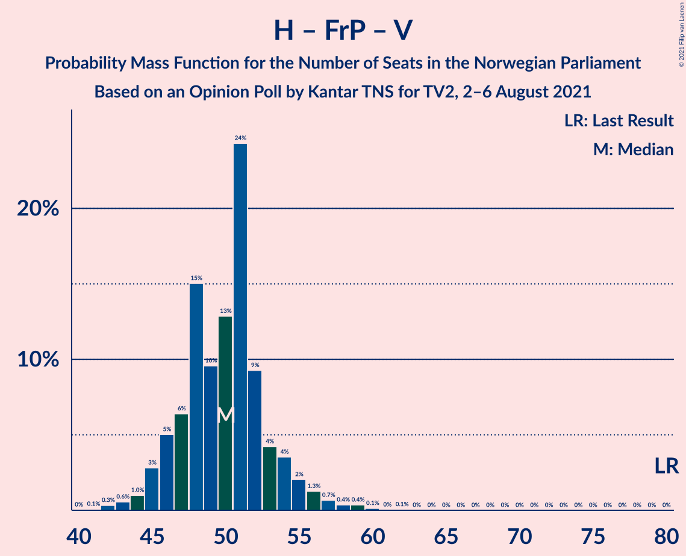

| Number of Seats | Probability | Accumulated | Special Marks |
|:---------------:|:-----------:|:-----------:|:-------------:|
| 40 | 0% | 100% |  |
| 41 | 0.1% | 99.9% |  |
| 42 | 0.3% | 99.9% |  |
| 43 | 0.6% | 99.5% |  |
| 44 | 1.0% | 99.0% |  |
| 45 | 3% | 98% |  |
| 46 | 5% | 95% |  |
| 47 | 6% | 90% |  |
| 48 | 15% | 84% |  |
| 49 | 10% | 69% |  |
| 50 | 13% | 59% | Median |
| 51 | 24% | 46% |  |
| 52 | 9% | 22% |  |
| 53 | 4% | 13% |  |
| 54 | 4% | 8% |  |
| 55 | 2% | 5% |  |
| 56 | 1.3% | 3% |  |
| 57 | 0.7% | 2% |  |
| 58 | 0.4% | 1.0% |  |
| 59 | 0.4% | 0.6% |  |
| 60 | 0.1% | 0.2% |  |
| 61 | 0% | 0.1% |  |
| 62 | 0.1% | 0.1% |  |
| 63 | 0% | 0% |  |
| 64 | 0% | 0% |  |
| 65 | 0% | 0% |  |
| 66 | 0% | 0% |  |
| 67 | 0% | 0% |  |
| 68 | 0% | 0% |  |
| 69 | 0% | 0% |  |
| 70 | 0% | 0% |  |
| 71 | 0% | 0% |  |
| 72 | 0% | 0% |  |
| 73 | 0% | 0% |  |
| 74 | 0% | 0% |  |
| 75 | 0% | 0% |  |
| 76 | 0% | 0% |  |
| 77 | 0% | 0% |  |
| 78 | 0% | 0% |  |
| 79 | 0% | 0% |  |
| 80 | 0% | 0% | Last Result |

### Høyre – Fremskrittspartiet

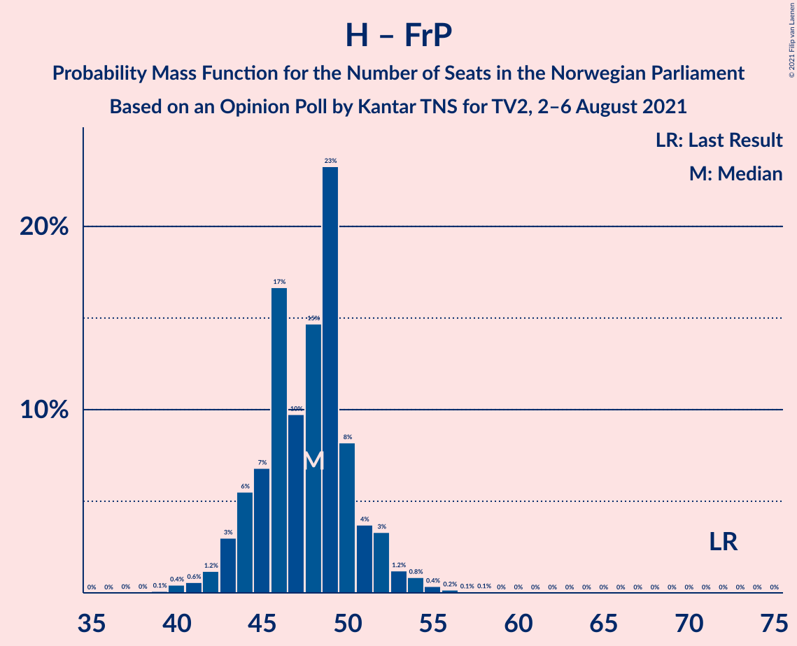

| Number of Seats | Probability | Accumulated | Special Marks |
|:---------------:|:-----------:|:-----------:|:-------------:|
| 38 | 0% | 100% |  |
| 39 | 0.1% | 99.9% |  |
| 40 | 0.4% | 99.8% |  |
| 41 | 0.6% | 99.4% |  |
| 42 | 1.2% | 98.8% |  |
| 43 | 3% | 98% |  |
| 44 | 6% | 95% |  |
| 45 | 7% | 89% |  |
| 46 | 17% | 82% |  |
| 47 | 10% | 66% |  |
| 48 | 15% | 56% | Median |
| 49 | 23% | 41% |  |
| 50 | 8% | 18% |  |
| 51 | 4% | 10% |  |
| 52 | 3% | 6% |  |
| 53 | 1.2% | 3% |  |
| 54 | 0.8% | 2% |  |
| 55 | 0.4% | 0.7% |  |
| 56 | 0.2% | 0.3% |  |
| 57 | 0.1% | 0.1% |  |
| 58 | 0.1% | 0.1% |  |
| 59 | 0% | 0% |  |
| 60 | 0% | 0% |  |
| 61 | 0% | 0% |  |
| 62 | 0% | 0% |  |
| 63 | 0% | 0% |  |
| 64 | 0% | 0% |  |
| 65 | 0% | 0% |  |
| 66 | 0% | 0% |  |
| 67 | 0% | 0% |  |
| 68 | 0% | 0% |  |
| 69 | 0% | 0% |  |
| 70 | 0% | 0% |  |
| 71 | 0% | 0% |  |
| 72 | 0% | 0% | Last Result |

### Høyre – Kristelig Folkeparti – Venstre

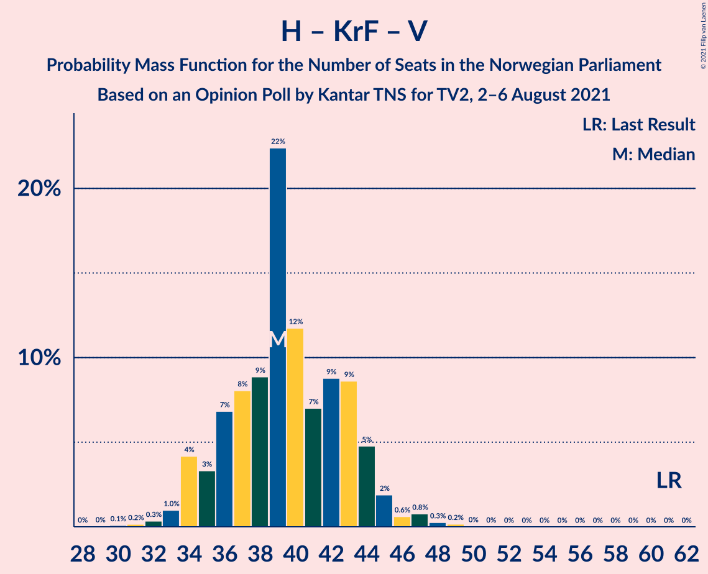

| Number of Seats | Probability | Accumulated | Special Marks |
|:---------------:|:-----------:|:-----------:|:-------------:|
| 30 | 0.1% | 100% |  |
| 31 | 0.2% | 99.9% |  |
| 32 | 0.3% | 99.7% |  |
| 33 | 1.0% | 99.4% |  |
| 34 | 4% | 98% |  |
| 35 | 3% | 94% |  |
| 36 | 7% | 91% |  |
| 37 | 8% | 84% |  |
| 38 | 9% | 76% | Median |
| 39 | 22% | 67% |  |
| 40 | 12% | 45% |  |
| 41 | 7% | 33% |  |
| 42 | 9% | 26% |  |
| 43 | 9% | 17% |  |
| 44 | 5% | 9% |  |
| 45 | 2% | 4% |  |
| 46 | 0.6% | 2% |  |
| 47 | 0.8% | 1.3% |  |
| 48 | 0.3% | 0.5% |  |
| 49 | 0.2% | 0.2% |  |
| 50 | 0% | 0.1% |  |
| 51 | 0% | 0% |  |
| 52 | 0% | 0% |  |
| 53 | 0% | 0% |  |
| 54 | 0% | 0% |  |
| 55 | 0% | 0% |  |
| 56 | 0% | 0% |  |
| 57 | 0% | 0% |  |
| 58 | 0% | 0% |  |
| 59 | 0% | 0% |  |
| 60 | 0% | 0% |  |
| 61 | 0% | 0% | Last Result |

### Senterpartiet – Kristelig Folkeparti – Venstre

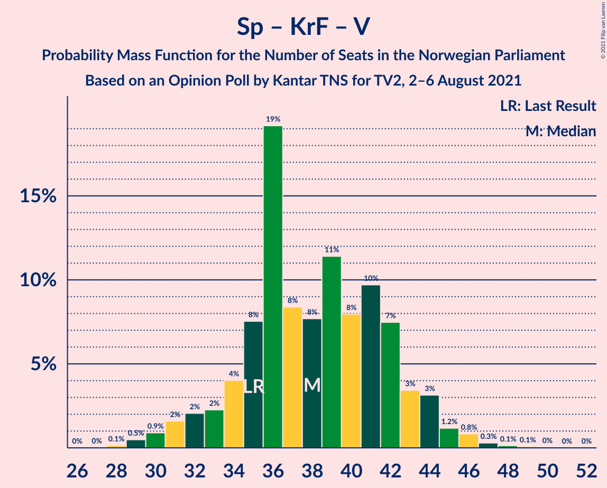

| Number of Seats | Probability | Accumulated | Special Marks |
|:---------------:|:-----------:|:-----------:|:-------------:|
| 28 | 0.1% | 100% |  |
| 29 | 0.5% | 99.8% |  |
| 30 | 0.9% | 99.3% |  |
| 31 | 2% | 98% |  |
| 32 | 2% | 97% |  |
| 33 | 2% | 95% |  |
| 34 | 4% | 93% |  |
| 35 | 8% | 88% | Last Result |
| 36 | 19% | 81% | Median |
| 37 | 8% | 62% |  |
| 38 | 8% | 53% |  |
| 39 | 11% | 46% |  |
| 40 | 8% | 34% |  |
| 41 | 10% | 26% |  |
| 42 | 7% | 17% |  |
| 43 | 3% | 9% |  |
| 44 | 3% | 6% |  |
| 45 | 1.2% | 3% |  |
| 46 | 0.8% | 1.4% |  |
| 47 | 0.3% | 0.6% |  |
| 48 | 0.1% | 0.3% |  |
| 49 | 0.1% | 0.1% |  |
| 50 | 0% | 0.1% |  |
| 51 | 0% | 0% |  |

## Technical Information

### Opinion Poll

+ **Polling firm:** Kantar TNS
+ **Commissioner(s):** TV2
+ **Fieldwork period:** 2–6 August 2021

### Calculations

+ **Sample size:** 977
+ **Simulations done:** 1,048,576
+ **Error estimate:** 0.75%

