# Opinion Poll by Norstat for Dagens Næringsliv, 6–11 August 2021

<a href="#voting-intentions">Voting Intentions</a> | <a href="#seats">Seats</a> | <a href="#coalitions">Coalitions</a> | <a href="#technical-information">Technical Information</a>

## Voting Intentions

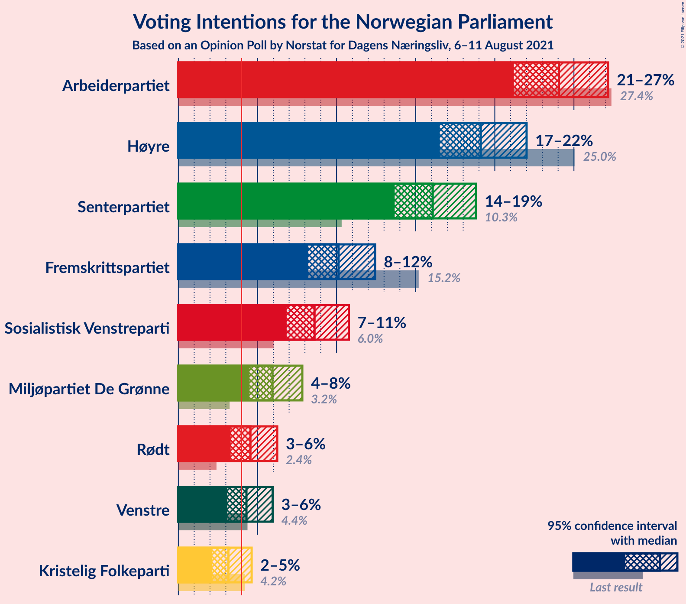

### Confidence Intervals

| Party | Last Result | Poll Result | 80% Confidence Interval | 90% Confidence Interval | 95% Confidence Interval | 99% Confidence Interval |
|:-----:|:-----------:|:-----------:|:-----------------------:|:-----------------------:|:-----------------------:|:-----------------------:|
| Arbeiderpartiet | 27.4% | 24.1% | 22.2–26.1% |21.6–26.7% |21.2–27.2% |20.3–28.2% |
| Høyre | 25.0% | 19.1% | 17.4–21.0% |16.9–21.5% |16.5–22.0% |15.7–22.9% |
| Senterpartiet | 10.3% | 16.1% | 14.5–17.9% |14.1–18.4% |13.7–18.8% |13.0–19.7% |
| Fremskrittspartiet | 15.2% | 10.1% | 8.9–11.6% |8.5–12.1% |8.2–12.4% |7.6–13.2% |
| Sosialistisk Venstreparti | 6.0% | 8.6% | 7.4–10.0% |7.1–10.4% |6.8–10.8% |6.3–11.5% |
| Miljøpartiet De Grønne | 3.2% | 5.9% | 5.0–7.2% |4.7–7.5% |4.5–7.8% |4.1–8.5% |
| Rødt | 2.4% | 4.6% | 3.7–5.7% |3.5–6.0% |3.3–6.2% |3.0–6.8% |
| Venstre | 4.4% | 4.3% | 3.5–5.4% |3.3–5.7% |3.1–6.0% |2.7–6.5% |
| Kristelig Folkeparti | 4.2% | 3.2% | 2.5–4.1% |2.3–4.4% |2.1–4.6% |1.9–5.1% |

*Note:* The poll result column reflects the actual value used in the calculations. Published results may vary slightly, and in addition be rounded to fewer digits.

## Seats

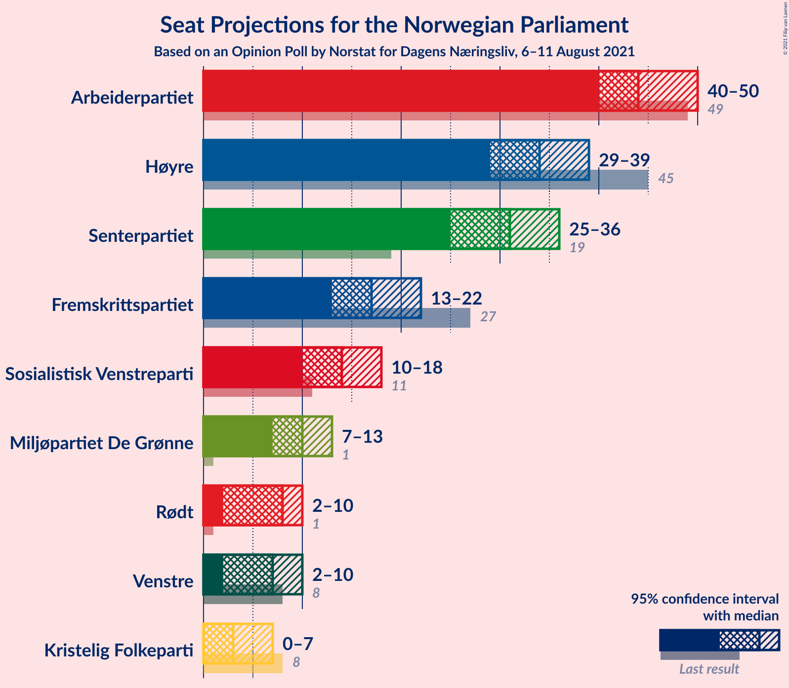

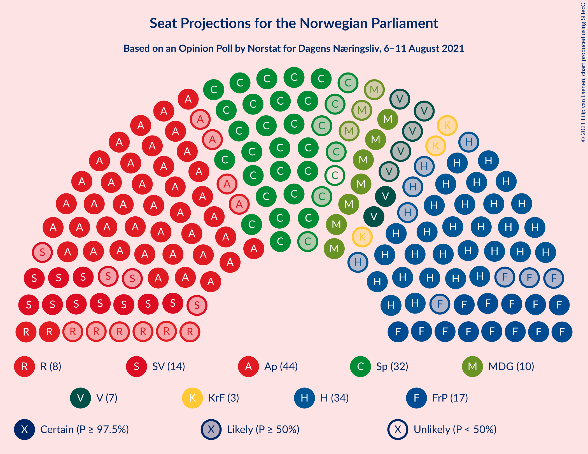

### Confidence Intervals

| Party | Last Result | Median | 80% Confidence Interval | 90% Confidence Interval | 95% Confidence Interval | 99% Confidence Interval |
|:-----:|:-----------:|:------:|:-----------------------:|:-----------------------:|:-----------------------:|:-----------------------:|
| <a href="#arbeiderpartiet">Arbeiderpartiet</a> | 49 | 44 | 41–47 |41–49 |40–50 |38–53 |
| <a href="#høyre">Høyre</a> | 45 | 34 | 31–36 |30–37 |29–39 |28–41 |
| <a href="#senterpartiet">Senterpartiet</a> | 19 | 31 | 27–34 |26–35 |25–36 |23–37 |
| <a href="#fremskrittspartiet">Fremskrittspartiet</a> | 27 | 17 | 14–20 |13–21 |13–22 |11–24 |
| <a href="#sosialistisk-venstreparti">Sosialistisk Venstreparti</a> | 11 | 14 | 12–17 |11–18 |10–18 |9–19 |
| <a href="#miljøpartiet-de-grønne">Miljøpartiet De Grønne</a> | 1 | 10 | 8–12 |8–13 |7–13 |6–14 |
| <a href="#rødt">Rødt</a> | 1 | 8 | 2–9 |2–10 |2–10 |2–11 |
| <a href="#venstre">Venstre</a> | 8 | 7 | 2–9 |2–10 |2–10 |2–11 |
| <a href="#kristelig-folkeparti">Kristelig Folkeparti</a> | 8 | 3 | 1–6 |1–7 |0–7 |0–8 |

### Arbeiderpartiet

*For a full overview of the results for this party, see the [Arbeiderpartiet](party-arbeiderpartiet.html) page.*

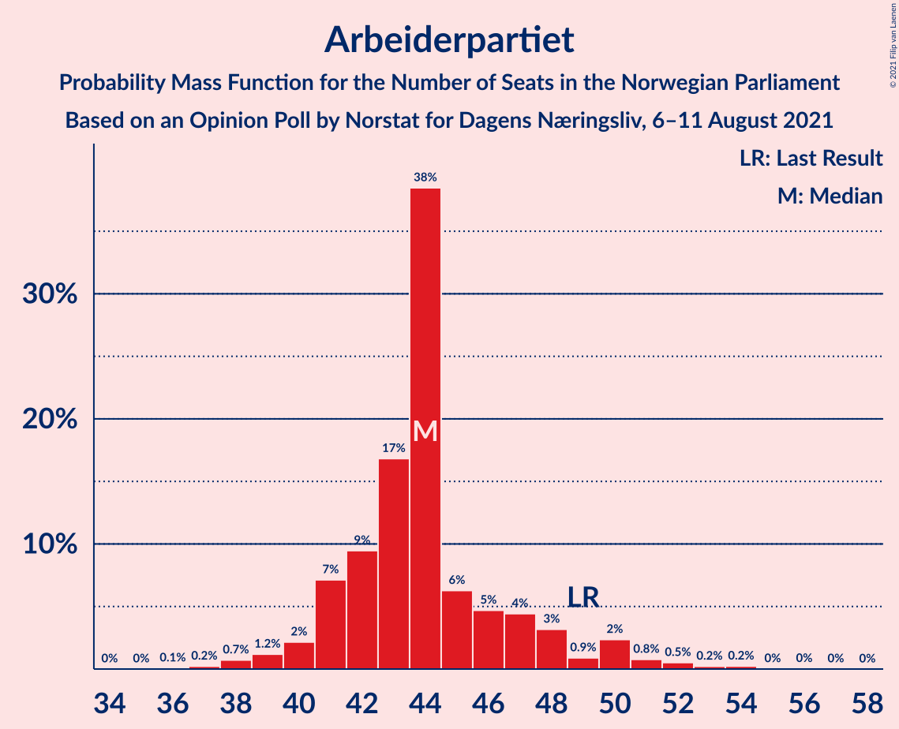

| Number of Seats | Probability | Accumulated | Special Marks |
|:---------------:|:-----------:|:-----------:|:-------------:|
| 36 | 0.1% | 100% |  |
| 37 | 0.2% | 99.9% |  |
| 38 | 0.7% | 99.7% |  |
| 39 | 1.2% | 98.9% |  |
| 40 | 2% | 98% |  |
| 41 | 7% | 96% |  |
| 42 | 9% | 88% |  |
| 43 | 17% | 79% |  |
| 44 | 38% | 62% | Median |
| 45 | 6% | 24% |  |
| 46 | 5% | 17% |  |
| 47 | 4% | 13% |  |
| 48 | 3% | 8% |  |
| 49 | 0.9% | 5% | Last Result |
| 50 | 2% | 4% |  |
| 51 | 0.8% | 2% |  |
| 52 | 0.5% | 1.1% |  |
| 53 | 0.2% | 0.5% |  |
| 54 | 0.2% | 0.3% |  |
| 55 | 0% | 0.1% |  |
| 56 | 0% | 0.1% |  |
| 57 | 0% | 0% |  |

### Høyre

*For a full overview of the results for this party, see the [Høyre](party-høyre.html) page.*

| Number of Seats | Probability | Accumulated | Special Marks |
|:---------------:|:-----------:|:-----------:|:-------------:|
| 25 | 0.1% | 100% |  |
| 26 | 0.1% | 99.9% |  |
| 27 | 0.1% | 99.9% |  |
| 28 | 1.3% | 99.7% |  |
| 29 | 2% | 98% |  |
| 30 | 4% | 96% |  |
| 31 | 5% | 93% |  |
| 32 | 20% | 87% |  |
| 33 | 13% | 68% |  |
| 34 | 21% | 55% | Median |
| 35 | 14% | 34% |  |
| 36 | 11% | 20% |  |
| 37 | 4% | 9% |  |
| 38 | 2% | 5% |  |
| 39 | 2% | 3% |  |
| 40 | 1.0% | 2% |  |
| 41 | 0.2% | 0.6% |  |
| 42 | 0.2% | 0.4% |  |
| 43 | 0.1% | 0.2% |  |
| 44 | 0.1% | 0.1% |  |
| 45 | 0% | 0% | Last Result |

### Senterpartiet

*For a full overview of the results for this party, see the [Senterpartiet](party-senterpartiet.html) page.*

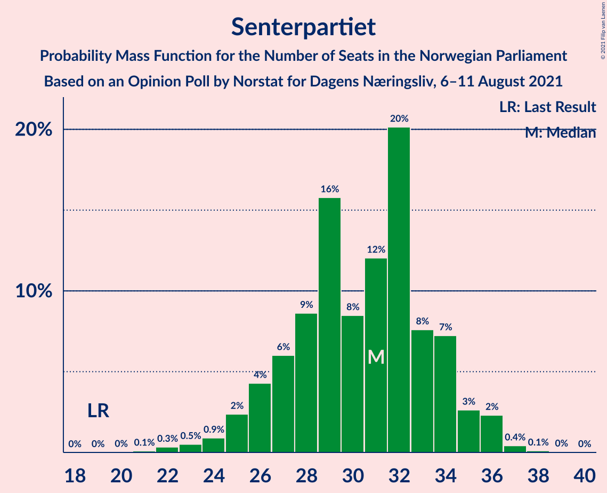

| Number of Seats | Probability | Accumulated | Special Marks |
|:---------------:|:-----------:|:-----------:|:-------------:|
| 19 | 0% | 100% | Last Result |
| 20 | 0% | 100% |  |
| 21 | 0.1% | 100% |  |
| 22 | 0.3% | 99.9% |  |
| 23 | 0.5% | 99.5% |  |
| 24 | 0.9% | 99.0% |  |
| 25 | 2% | 98% |  |
| 26 | 4% | 96% |  |
| 27 | 6% | 91% |  |
| 28 | 9% | 85% |  |
| 29 | 16% | 77% |  |
| 30 | 8% | 61% |  |
| 31 | 12% | 53% | Median |
| 32 | 20% | 41% |  |
| 33 | 8% | 20% |  |
| 34 | 7% | 13% |  |
| 35 | 3% | 6% |  |
| 36 | 2% | 3% |  |
| 37 | 0.4% | 0.6% |  |
| 38 | 0.1% | 0.2% |  |
| 39 | 0% | 0.1% |  |
| 40 | 0% | 0% |  |

### Fremskrittspartiet

*For a full overview of the results for this party, see the [Fremskrittspartiet](party-fremskrittspartiet.html) page.*

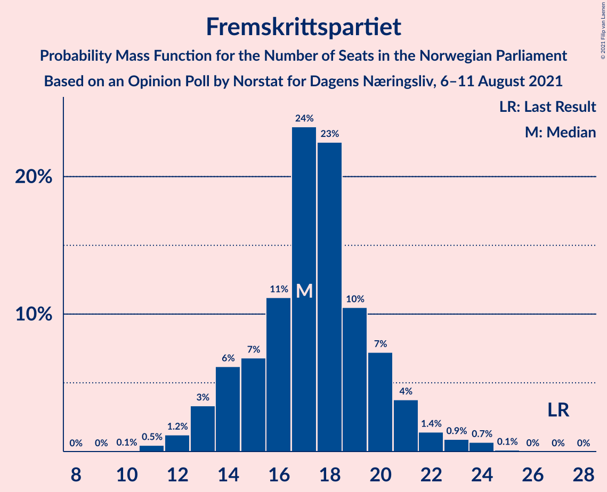

| Number of Seats | Probability | Accumulated | Special Marks |
|:---------------:|:-----------:|:-----------:|:-------------:|
| 10 | 0.1% | 100% |  |
| 11 | 0.5% | 99.9% |  |
| 12 | 1.2% | 99.5% |  |
| 13 | 3% | 98% |  |
| 14 | 6% | 95% |  |
| 15 | 7% | 89% |  |
| 16 | 11% | 82% |  |
| 17 | 24% | 71% | Median |
| 18 | 23% | 47% |  |
| 19 | 10% | 25% |  |
| 20 | 7% | 14% |  |
| 21 | 4% | 7% |  |
| 22 | 1.4% | 3% |  |
| 23 | 0.9% | 2% |  |
| 24 | 0.7% | 0.8% |  |
| 25 | 0.1% | 0.1% |  |
| 26 | 0% | 0% |  |
| 27 | 0% | 0% | Last Result |

### Sosialistisk Venstreparti

*For a full overview of the results for this party, see the [Sosialistisk Venstreparti](party-sosialistiskvenstreparti.html) page.*

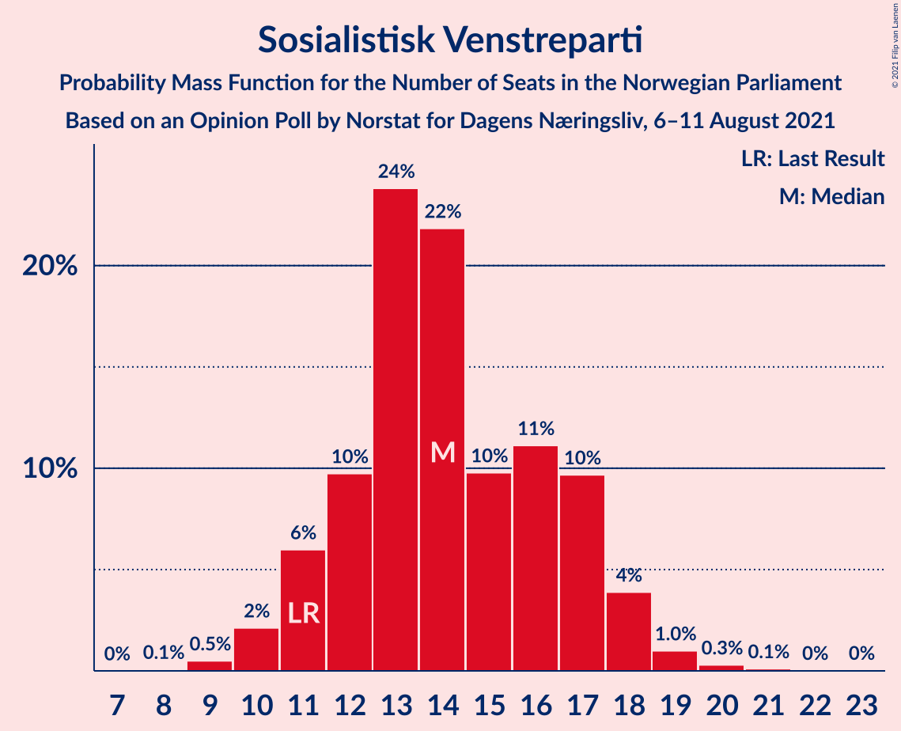

| Number of Seats | Probability | Accumulated | Special Marks |
|:---------------:|:-----------:|:-----------:|:-------------:|
| 8 | 0.1% | 100% |  |
| 9 | 0.5% | 99.9% |  |
| 10 | 2% | 99.4% |  |
| 11 | 6% | 97% | Last Result |
| 12 | 10% | 91% |  |
| 13 | 24% | 82% |  |
| 14 | 22% | 58% | Median |
| 15 | 10% | 36% |  |
| 16 | 11% | 26% |  |
| 17 | 10% | 15% |  |
| 18 | 4% | 5% |  |
| 19 | 1.0% | 1.5% |  |
| 20 | 0.3% | 0.5% |  |
| 21 | 0.1% | 0.2% |  |
| 22 | 0% | 0.1% |  |
| 23 | 0% | 0% |  |

### Miljøpartiet De Grønne

*For a full overview of the results for this party, see the [Miljøpartiet De Grønne](party-miljøpartietdegrønne.html) page.*

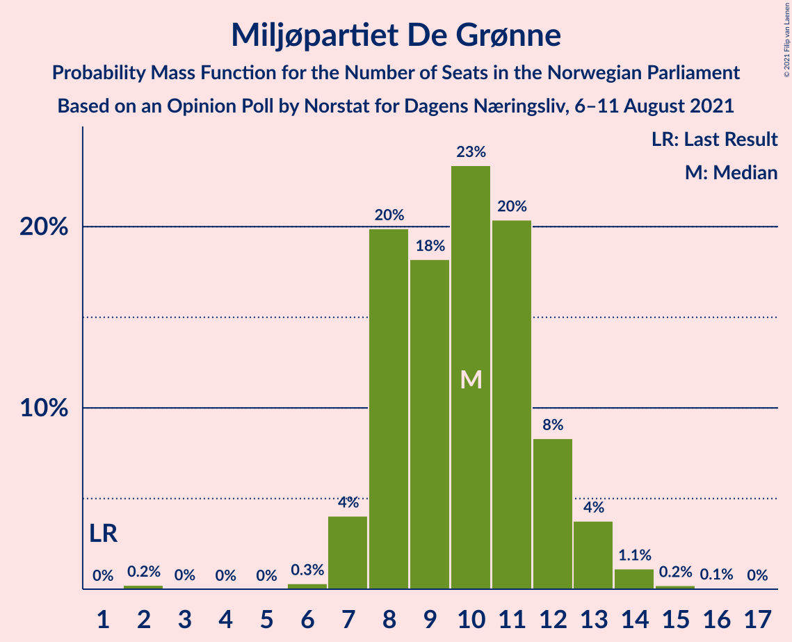

| Number of Seats | Probability | Accumulated | Special Marks |
|:---------------:|:-----------:|:-----------:|:-------------:|
| 1 | 0% | 100% | Last Result |
| 2 | 0.2% | 100% |  |
| 3 | 0% | 99.8% |  |
| 4 | 0% | 99.7% |  |
| 5 | 0% | 99.7% |  |
| 6 | 0.3% | 99.7% |  |
| 7 | 4% | 99.4% |  |
| 8 | 20% | 95% |  |
| 9 | 18% | 75% |  |
| 10 | 23% | 57% | Median |
| 11 | 20% | 34% |  |
| 12 | 8% | 14% |  |
| 13 | 4% | 5% |  |
| 14 | 1.1% | 1.4% |  |
| 15 | 0.2% | 0.3% |  |
| 16 | 0.1% | 0.1% |  |
| 17 | 0% | 0% |  |

### Rødt

*For a full overview of the results for this party, see the [Rødt](party-rødt.html) page.*

| Number of Seats | Probability | Accumulated | Special Marks |
|:---------------:|:-----------:|:-----------:|:-------------:|
| 1 | 0.2% | 100% | Last Result |
| 2 | 13% | 99.8% |  |
| 3 | 0.1% | 86% |  |
| 4 | 0% | 86% |  |
| 5 | 0% | 86% |  |
| 6 | 6% | 86% |  |
| 7 | 26% | 81% |  |
| 8 | 31% | 54% | Median |
| 9 | 18% | 23% |  |
| 10 | 4% | 5% |  |
| 11 | 1.1% | 1.3% |  |
| 12 | 0.2% | 0.2% |  |
| 13 | 0% | 0% |  |

### Venstre

*For a full overview of the results for this party, see the [Venstre](party-venstre.html) page.*

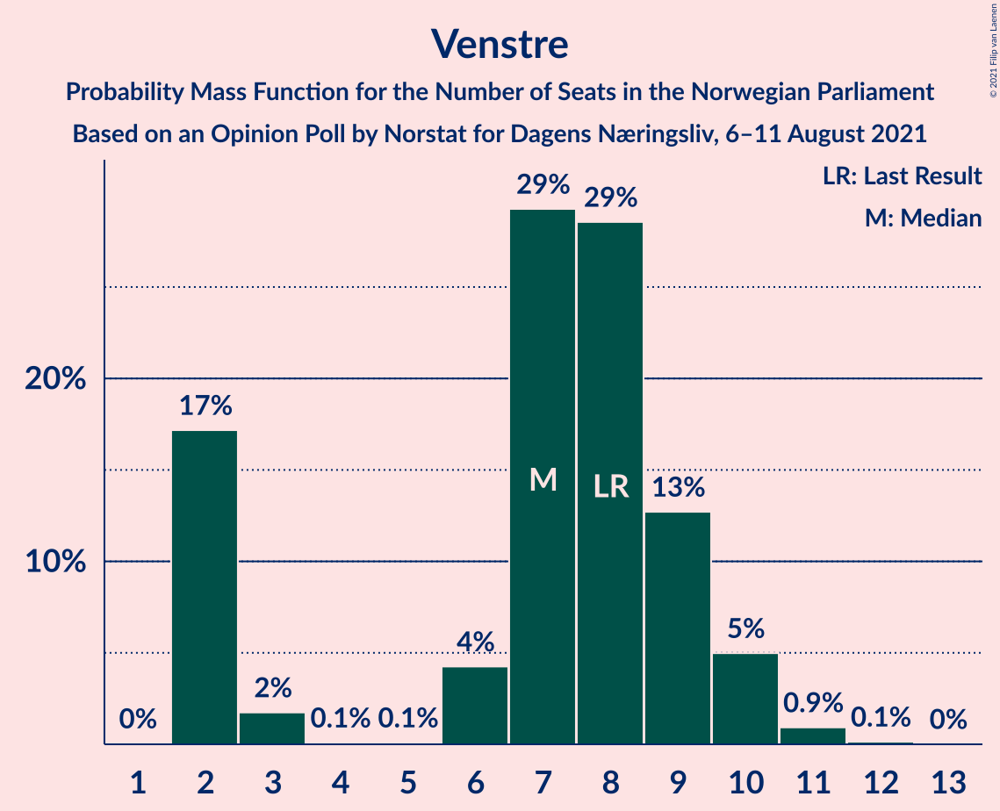

| Number of Seats | Probability | Accumulated | Special Marks |
|:---------------:|:-----------:|:-----------:|:-------------:|
| 2 | 17% | 100% |  |
| 3 | 2% | 83% |  |
| 4 | 0.1% | 81% |  |
| 5 | 0.1% | 81% |  |
| 6 | 4% | 81% |  |
| 7 | 29% | 77% | Median |
| 8 | 29% | 47% | Last Result |
| 9 | 13% | 19% |  |
| 10 | 5% | 6% |  |
| 11 | 0.9% | 1.1% |  |
| 12 | 0.1% | 0.2% |  |
| 13 | 0% | 0% |  |

### Kristelig Folkeparti

*For a full overview of the results for this party, see the [Kristelig Folkeparti](party-kristeligfolkeparti.html) page.*

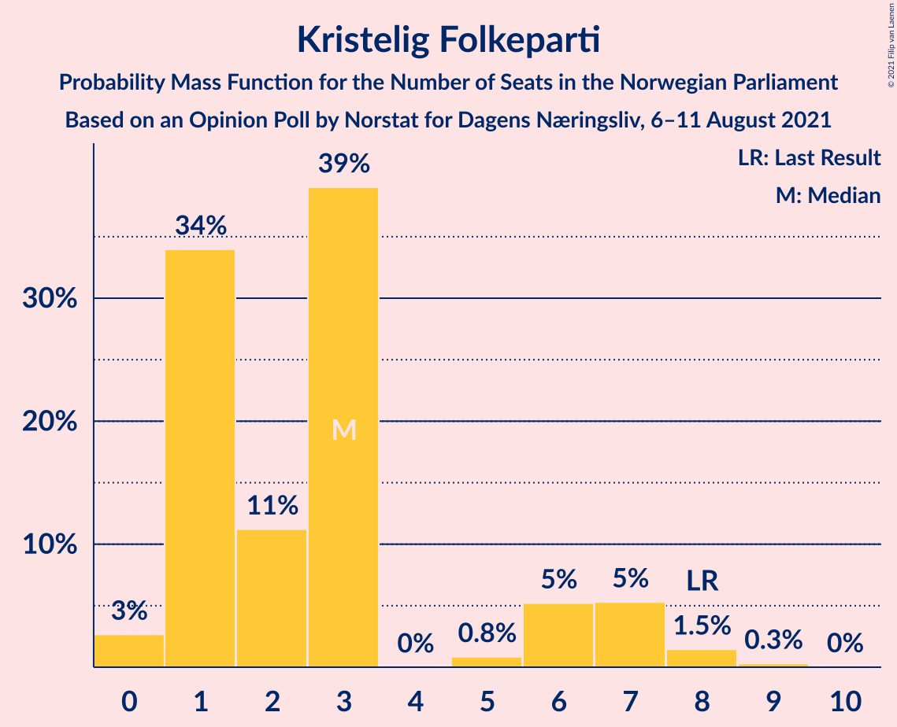

| Number of Seats | Probability | Accumulated | Special Marks |
|:---------------:|:-----------:|:-----------:|:-------------:|
| 0 | 3% | 100% |  |
| 1 | 34% | 97% |  |
| 2 | 11% | 63% |  |
| 3 | 39% | 52% | Median |
| 4 | 0% | 13% |  |
| 5 | 0.8% | 13% |  |
| 6 | 5% | 12% |  |
| 7 | 5% | 7% |  |
| 8 | 1.5% | 2% | Last Result |
| 9 | 0.3% | 0.3% |  |
| 10 | 0% | 0% |  |

## Coalitions

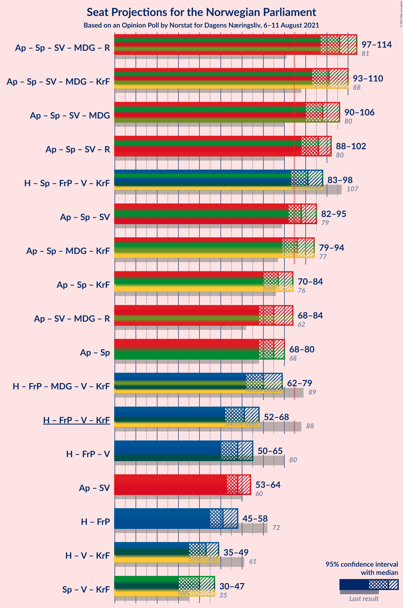

### Confidence Intervals

| Coalition | Last Result | Median | Majority? | 80% Confidence Interval | 90% Confidence Interval | 95% Confidence Interval | 99% Confidence Interval |
|:---------:|:-----------:|:------:|:---------:|:-----------------------:|:-----------------------:|:-----------------------:|:-----------------------:|
| Arbeiderpartiet – Senterpartiet – Sosialistisk Venstreparti – Miljøpartiet De Grønne – Rødt | 81 | 106 | 100% | 101–110 | 98–112 | 97–114 | 95–117 |
| Arbeiderpartiet – Senterpartiet – Sosialistisk Venstreparti – Miljøpartiet De Grønne – Kristelig Folkeparti | 88 | 101 | 100% | 96–106 | 95–108 | 93–110 | 92–113 |
| Arbeiderpartiet – Senterpartiet – Sosialistisk Venstreparti – Miljøpartiet De Grønne | 80 | 98 | 100% | 94–103 | 92–105 | 90–106 | 89–110 |
| Arbeiderpartiet – Senterpartiet – Sosialistisk Venstreparti – Rødt | 80 | 96 | 99.8% | 91–100 | 89–101 | 88–102 | 85–104 |
| Høyre – Senterpartiet – Fremskrittspartiet – Venstre – Kristelig Folkeparti | 107 | 91 | 95% | 85–95 | 84–96 | 83–98 | 78–100 |
| Arbeiderpartiet – Senterpartiet – Sosialistisk Venstreparti | 79 | 88 | 91% | 85–92 | 82–94 | 82–95 | 80–97 |
| Arbeiderpartiet – Senterpartiet – Miljøpartiet De Grønne – Kristelig Folkeparti | 77 | 86 | 72% | 82–91 | 81–93 | 79–94 | 77–97 |
| Arbeiderpartiet – Senterpartiet – Kristelig Folkeparti | 76 | 77 | 2% | 73–81 | 72–82 | 70–84 | 68–86 |
| Arbeiderpartiet – Sosialistisk Venstreparti – Miljøpartiet De Grønne – Rødt | 62 | 75 | 1.3% | 70–80 | 69–83 | 68–84 | 65–85 |
| Arbeiderpartiet – Senterpartiet | 68 | 75 | 0.1% | 71–78 | 69–79 | 68–80 | 66–82 |
| Høyre – Fremskrittspartiet – Miljøpartiet De Grønne – Venstre – Kristelig Folkeparti | 89 | 70 | 0% | 65–75 | 63–76 | 62–79 | 60–81 |
| Høyre – Fremskrittspartiet – Venstre – Kristelig Folkeparti | 88 | 61 | 0% | 55–65 | 54–66 | 52–68 | 49–71 |
| Høyre – Fremskrittspartiet – Venstre | 80 | 58 | 0% | 52–62 | 51–64 | 50–65 | 48–67 |
| Arbeiderpartiet – Sosialistisk Venstreparti | 60 | 58 | 0% | 54–62 | 54–64 | 53–64 | 51–68 |
| Høyre – Fremskrittspartiet | 72 | 51 | 0% | 47–55 | 46–57 | 45–58 | 44–61 |
| Høyre – Venstre – Kristelig Folkeparti | 61 | 43 | 0% | 39–47 | 37–48 | 35–49 | 33–52 |
| Senterpartiet – Venstre – Kristelig Folkeparti | 35 | 40 | 0% | 35–44 | 32–45 | 30–47 | 28–49 |

### Arbeiderpartiet – Senterpartiet – Sosialistisk Venstreparti – Miljøpartiet De Grønne – Rødt

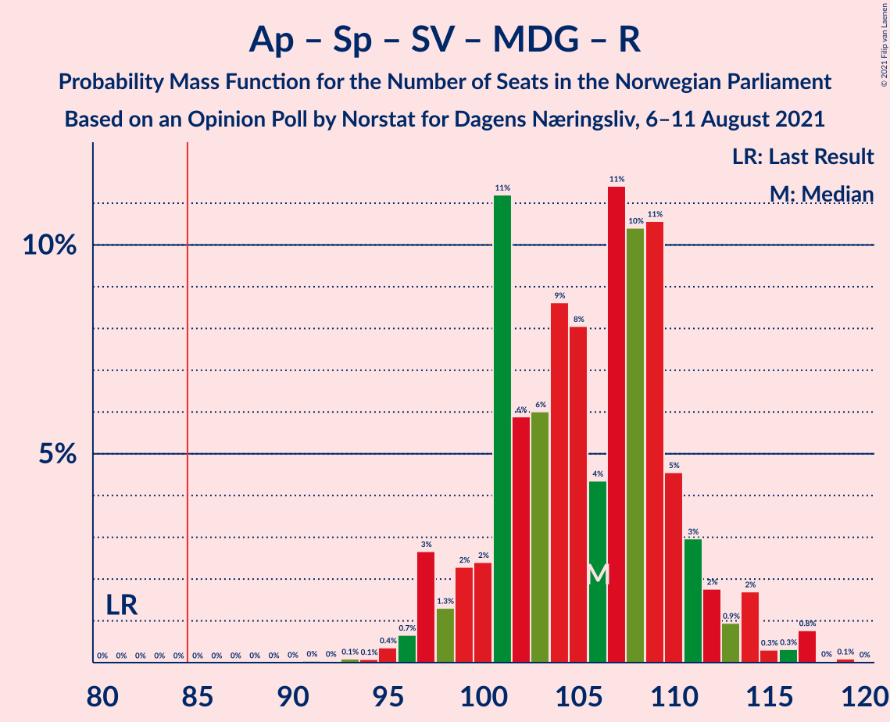

| Number of Seats | Probability | Accumulated | Special Marks |
|:---------------:|:-----------:|:-----------:|:-------------:|
| 81 | 0% | 100% | Last Result |
| 82 | 0% | 100% |  |
| 83 | 0% | 100% |  |
| 84 | 0% | 100% |  |
| 85 | 0% | 100% | Majority |
| 86 | 0% | 100% |  |
| 87 | 0% | 100% |  |
| 88 | 0% | 100% |  |
| 89 | 0% | 100% |  |
| 90 | 0% | 100% |  |
| 91 | 0% | 100% |  |
| 92 | 0% | 99.9% |  |
| 93 | 0.1% | 99.9% |  |
| 94 | 0.1% | 99.8% |  |
| 95 | 0.4% | 99.7% |  |
| 96 | 0.7% | 99.4% |  |
| 97 | 3% | 98.7% |  |
| 98 | 1.3% | 96% |  |
| 99 | 2% | 95% |  |
| 100 | 2% | 92% |  |
| 101 | 11% | 90% |  |
| 102 | 6% | 79% |  |
| 103 | 6% | 73% |  |
| 104 | 9% | 67% |  |
| 105 | 8% | 58% |  |
| 106 | 4% | 50% |  |
| 107 | 11% | 46% | Median |
| 108 | 10% | 34% |  |
| 109 | 11% | 24% |  |
| 110 | 5% | 13% |  |
| 111 | 3% | 9% |  |
| 112 | 2% | 6% |  |
| 113 | 0.9% | 4% |  |
| 114 | 2% | 3% |  |
| 115 | 0.3% | 2% |  |
| 116 | 0.3% | 1.3% |  |
| 117 | 0.8% | 0.9% |  |
| 118 | 0% | 0.2% |  |
| 119 | 0.1% | 0.1% |  |
| 120 | 0% | 0% |  |

### Arbeiderpartiet – Senterpartiet – Sosialistisk Venstreparti – Miljøpartiet De Grønne – Kristelig Folkeparti

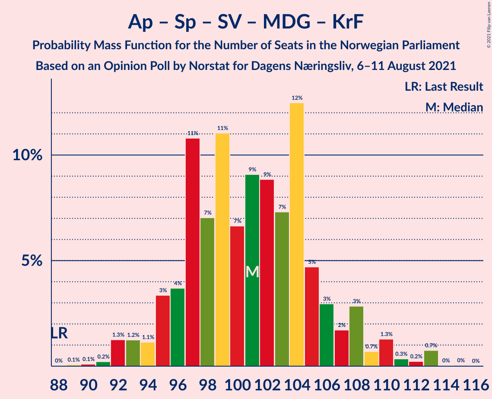

| Number of Seats | Probability | Accumulated | Special Marks |
|:---------------:|:-----------:|:-----------:|:-------------:|
| 88 | 0% | 100% | Last Result |
| 89 | 0.1% | 100% |  |
| 90 | 0.1% | 99.9% |  |
| 91 | 0.2% | 99.8% |  |
| 92 | 1.3% | 99.6% |  |
| 93 | 1.2% | 98% |  |
| 94 | 1.1% | 97% |  |
| 95 | 3% | 96% |  |
| 96 | 4% | 93% |  |
| 97 | 11% | 89% |  |
| 98 | 7% | 78% |  |
| 99 | 11% | 71% |  |
| 100 | 7% | 60% |  |
| 101 | 9% | 53% |  |
| 102 | 9% | 44% | Median |
| 103 | 7% | 35% |  |
| 104 | 12% | 28% |  |
| 105 | 5% | 16% |  |
| 106 | 3% | 11% |  |
| 107 | 2% | 8% |  |
| 108 | 3% | 6% |  |
| 109 | 0.7% | 3% |  |
| 110 | 1.3% | 3% |  |
| 111 | 0.3% | 1.4% |  |
| 112 | 0.2% | 1.1% |  |
| 113 | 0.7% | 0.9% |  |
| 114 | 0% | 0.1% |  |
| 115 | 0% | 0.1% |  |
| 116 | 0% | 0% |  |

### Arbeiderpartiet – Senterpartiet – Sosialistisk Venstreparti – Miljøpartiet De Grønne

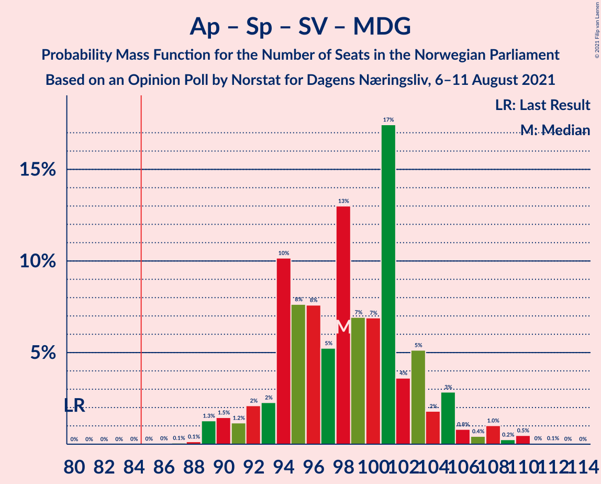

| Number of Seats | Probability | Accumulated | Special Marks |
|:---------------:|:-----------:|:-----------:|:-------------:|
| 80 | 0% | 100% | Last Result |
| 81 | 0% | 100% |  |
| 82 | 0% | 100% |  |
| 83 | 0% | 100% |  |
| 84 | 0% | 100% |  |
| 85 | 0% | 100% | Majority |
| 86 | 0% | 100% |  |
| 87 | 0.1% | 99.9% |  |
| 88 | 0.1% | 99.8% |  |
| 89 | 1.3% | 99.7% |  |
| 90 | 1.5% | 98% |  |
| 91 | 1.2% | 97% |  |
| 92 | 2% | 96% |  |
| 93 | 2% | 94% |  |
| 94 | 10% | 91% |  |
| 95 | 8% | 81% |  |
| 96 | 8% | 74% |  |
| 97 | 5% | 66% |  |
| 98 | 13% | 61% |  |
| 99 | 7% | 48% | Median |
| 100 | 7% | 41% |  |
| 101 | 17% | 34% |  |
| 102 | 4% | 17% |  |
| 103 | 5% | 13% |  |
| 104 | 2% | 8% |  |
| 105 | 3% | 6% |  |
| 106 | 0.8% | 3% |  |
| 107 | 0.4% | 2% |  |
| 108 | 1.0% | 2% |  |
| 109 | 0.2% | 0.9% |  |
| 110 | 0.5% | 0.6% |  |
| 111 | 0% | 0.1% |  |
| 112 | 0.1% | 0.1% |  |
| 113 | 0% | 0% |  |

### Arbeiderpartiet – Senterpartiet – Sosialistisk Venstreparti – Rødt

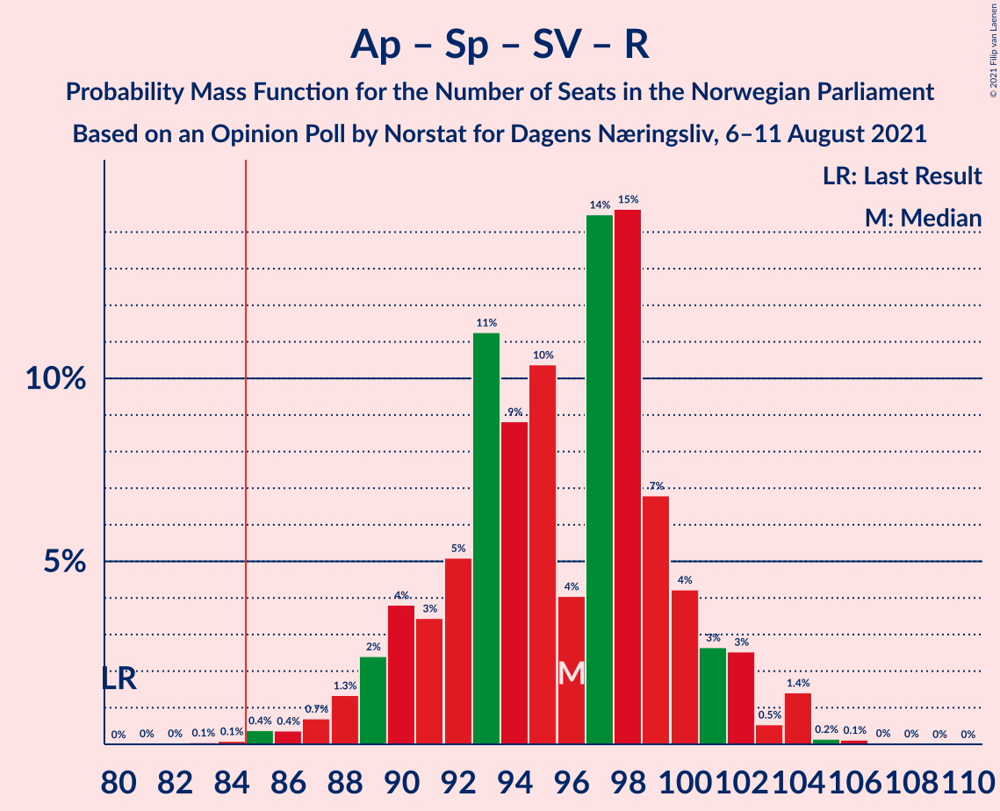

| Number of Seats | Probability | Accumulated | Special Marks |
|:---------------:|:-----------:|:-----------:|:-------------:|
| 80 | 0% | 100% | Last Result |
| 81 | 0% | 100% |  |
| 82 | 0% | 100% |  |
| 83 | 0.1% | 99.9% |  |
| 84 | 0.1% | 99.9% |  |
| 85 | 0.4% | 99.8% | Majority |
| 86 | 0.4% | 99.4% |  |
| 87 | 0.7% | 99.0% |  |
| 88 | 1.3% | 98% |  |
| 89 | 2% | 97% |  |
| 90 | 4% | 95% |  |
| 91 | 3% | 91% |  |
| 92 | 5% | 87% |  |
| 93 | 11% | 82% |  |
| 94 | 9% | 71% |  |
| 95 | 10% | 62% |  |
| 96 | 4% | 52% |  |
| 97 | 14% | 48% | Median |
| 98 | 15% | 33% |  |
| 99 | 7% | 19% |  |
| 100 | 4% | 12% |  |
| 101 | 3% | 8% |  |
| 102 | 3% | 5% |  |
| 103 | 0.5% | 2% |  |
| 104 | 1.4% | 2% |  |
| 105 | 0.2% | 0.4% |  |
| 106 | 0.1% | 0.2% |  |
| 107 | 0% | 0.1% |  |
| 108 | 0% | 0.1% |  |
| 109 | 0% | 0% |  |

### Høyre – Senterpartiet – Fremskrittspartiet – Venstre – Kristelig Folkeparti

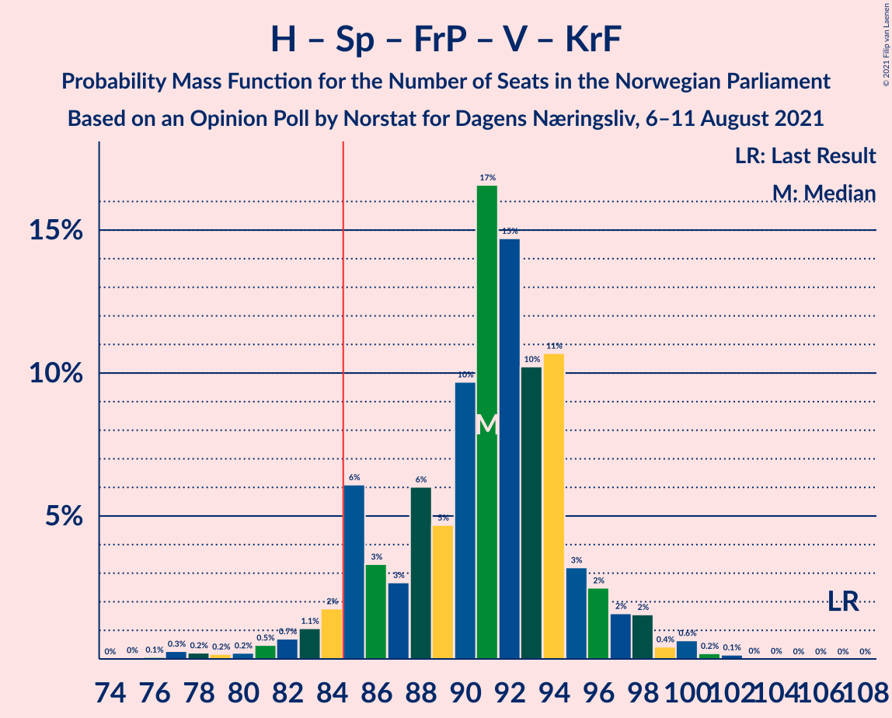

| Number of Seats | Probability | Accumulated | Special Marks |
|:---------------:|:-----------:|:-----------:|:-------------:|
| 75 | 0% | 100% |  |
| 76 | 0.1% | 99.9% |  |
| 77 | 0.3% | 99.9% |  |
| 78 | 0.2% | 99.6% |  |
| 79 | 0.2% | 99.4% |  |
| 80 | 0.2% | 99.2% |  |
| 81 | 0.5% | 99.0% |  |
| 82 | 0.7% | 98.5% |  |
| 83 | 1.1% | 98% |  |
| 84 | 2% | 97% |  |
| 85 | 6% | 95% | Majority |
| 86 | 3% | 89% |  |
| 87 | 3% | 86% |  |
| 88 | 6% | 83% |  |
| 89 | 5% | 77% |  |
| 90 | 10% | 72% |  |
| 91 | 17% | 63% |  |
| 92 | 15% | 46% | Median |
| 93 | 10% | 31% |  |
| 94 | 11% | 21% |  |
| 95 | 3% | 10% |  |
| 96 | 2% | 7% |  |
| 97 | 2% | 5% |  |
| 98 | 2% | 3% |  |
| 99 | 0.4% | 1.5% |  |
| 100 | 0.6% | 1.0% |  |
| 101 | 0.2% | 0.4% |  |
| 102 | 0.1% | 0.2% |  |
| 103 | 0% | 0.1% |  |
| 104 | 0% | 0% |  |
| 105 | 0% | 0% |  |
| 106 | 0% | 0% |  |
| 107 | 0% | 0% | Last Result |

### Arbeiderpartiet – Senterpartiet – Sosialistisk Venstreparti

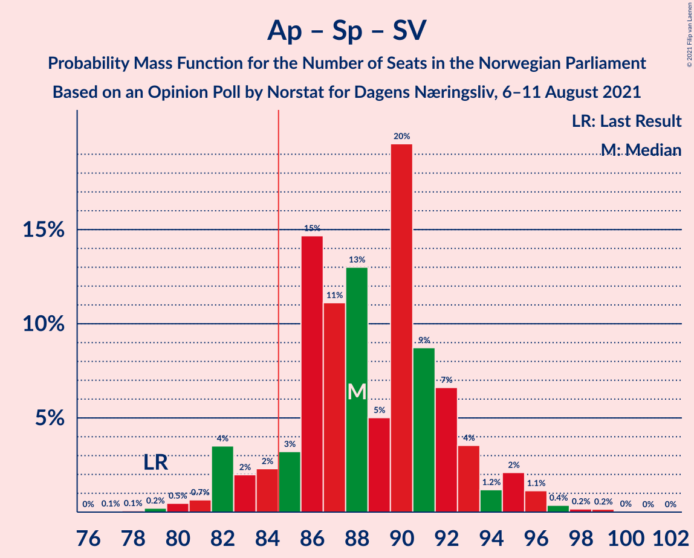

| Number of Seats | Probability | Accumulated | Special Marks |
|:---------------:|:-----------:|:-----------:|:-------------:|
| 77 | 0.1% | 100% |  |
| 78 | 0.1% | 99.9% |  |
| 79 | 0.2% | 99.8% | Last Result |
| 80 | 0.5% | 99.6% |  |
| 81 | 0.7% | 99.2% |  |
| 82 | 4% | 98.5% |  |
| 83 | 2% | 95% |  |
| 84 | 2% | 93% |  |
| 85 | 3% | 91% | Majority |
| 86 | 15% | 87% |  |
| 87 | 11% | 73% |  |
| 88 | 13% | 62% |  |
| 89 | 5% | 49% | Median |
| 90 | 20% | 44% |  |
| 91 | 9% | 24% |  |
| 92 | 7% | 15% |  |
| 93 | 4% | 9% |  |
| 94 | 1.2% | 5% |  |
| 95 | 2% | 4% |  |
| 96 | 1.1% | 2% |  |
| 97 | 0.4% | 0.8% |  |
| 98 | 0.2% | 0.4% |  |
| 99 | 0.2% | 0.3% |  |
| 100 | 0% | 0.1% |  |
| 101 | 0% | 0.1% |  |
| 102 | 0% | 0% |  |

### Arbeiderpartiet – Senterpartiet – Miljøpartiet De Grønne – Kristelig Folkeparti

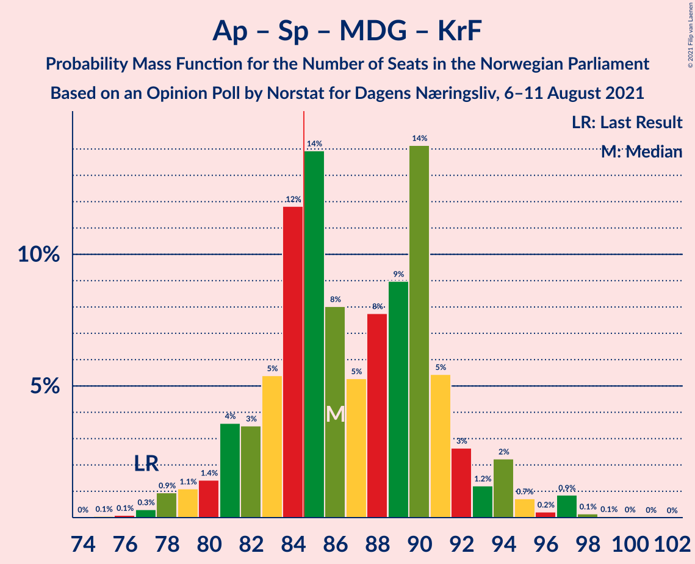

| Number of Seats | Probability | Accumulated | Special Marks |
|:---------------:|:-----------:|:-----------:|:-------------:|
| 75 | 0.1% | 100% |  |
| 76 | 0.1% | 99.9% |  |
| 77 | 0.3% | 99.8% | Last Result |
| 78 | 0.9% | 99.5% |  |
| 79 | 1.1% | 98.5% |  |
| 80 | 1.4% | 97% |  |
| 81 | 4% | 96% |  |
| 82 | 3% | 92% |  |
| 83 | 5% | 89% |  |
| 84 | 12% | 84% |  |
| 85 | 14% | 72% | Majority |
| 86 | 8% | 58% |  |
| 87 | 5% | 50% |  |
| 88 | 8% | 44% | Median |
| 89 | 9% | 37% |  |
| 90 | 14% | 28% |  |
| 91 | 5% | 14% |  |
| 92 | 3% | 8% |  |
| 93 | 1.2% | 6% |  |
| 94 | 2% | 4% |  |
| 95 | 0.7% | 2% |  |
| 96 | 0.2% | 1.3% |  |
| 97 | 0.9% | 1.1% |  |
| 98 | 0.1% | 0.3% |  |
| 99 | 0.1% | 0.1% |  |
| 100 | 0% | 0.1% |  |
| 101 | 0% | 0% |  |

### Arbeiderpartiet – Senterpartiet – Kristelig Folkeparti

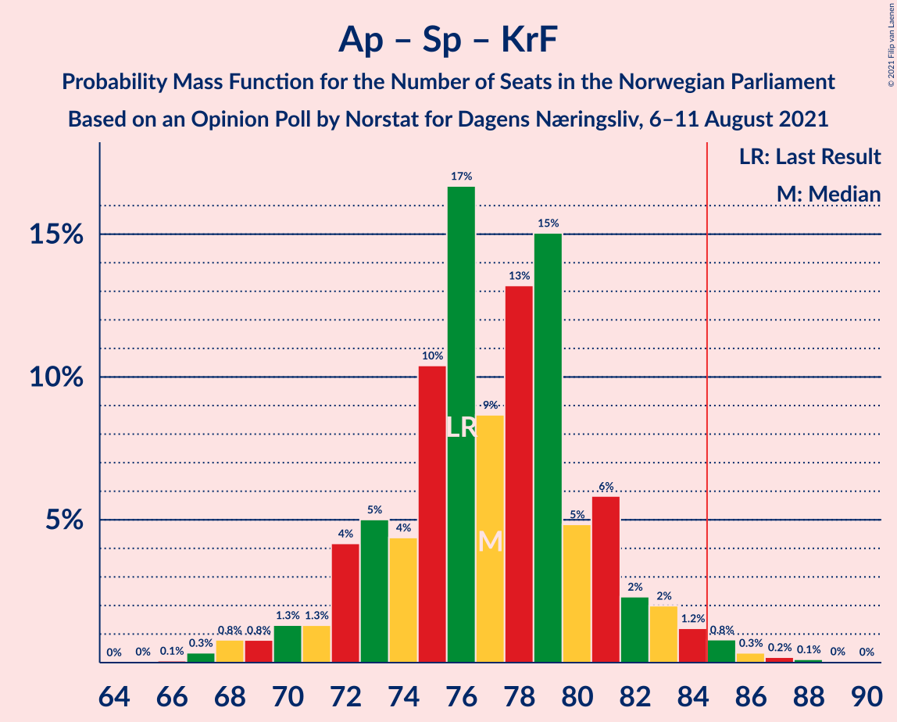

| Number of Seats | Probability | Accumulated | Special Marks |
|:---------------:|:-----------:|:-----------:|:-------------:|
| 65 | 0% | 100% |  |
| 66 | 0.1% | 99.9% |  |
| 67 | 0.3% | 99.9% |  |
| 68 | 0.8% | 99.5% |  |
| 69 | 0.8% | 98.7% |  |
| 70 | 1.3% | 98% |  |
| 71 | 1.3% | 97% |  |
| 72 | 4% | 95% |  |
| 73 | 5% | 91% |  |
| 74 | 4% | 86% |  |
| 75 | 10% | 82% |  |
| 76 | 17% | 71% | Last Result |
| 77 | 9% | 55% |  |
| 78 | 13% | 46% | Median |
| 79 | 15% | 33% |  |
| 80 | 5% | 18% |  |
| 81 | 6% | 13% |  |
| 82 | 2% | 7% |  |
| 83 | 2% | 5% |  |
| 84 | 1.2% | 3% |  |
| 85 | 0.8% | 2% | Majority |
| 86 | 0.3% | 0.7% |  |
| 87 | 0.2% | 0.4% |  |
| 88 | 0.1% | 0.2% |  |
| 89 | 0% | 0.1% |  |
| 90 | 0% | 0% |  |

### Arbeiderpartiet – Sosialistisk Venstreparti – Miljøpartiet De Grønne – Rødt

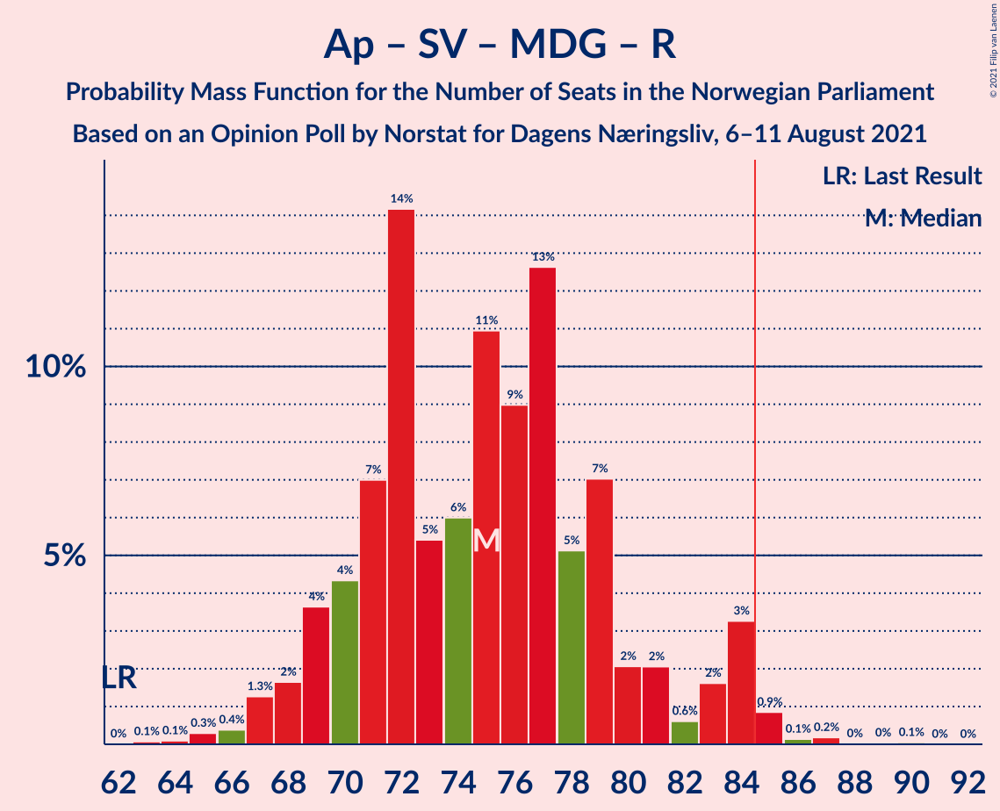

| Number of Seats | Probability | Accumulated | Special Marks |
|:---------------:|:-----------:|:-----------:|:-------------:|
| 62 | 0% | 100% | Last Result |
| 63 | 0.1% | 100% |  |
| 64 | 0.1% | 99.9% |  |
| 65 | 0.3% | 99.8% |  |
| 66 | 0.4% | 99.5% |  |
| 67 | 1.3% | 99.1% |  |
| 68 | 2% | 98% |  |
| 69 | 4% | 96% |  |
| 70 | 4% | 93% |  |
| 71 | 7% | 88% |  |
| 72 | 14% | 81% |  |
| 73 | 5% | 67% |  |
| 74 | 6% | 62% |  |
| 75 | 11% | 56% |  |
| 76 | 9% | 45% | Median |
| 77 | 13% | 36% |  |
| 78 | 5% | 23% |  |
| 79 | 7% | 18% |  |
| 80 | 2% | 11% |  |
| 81 | 2% | 9% |  |
| 82 | 0.6% | 7% |  |
| 83 | 2% | 6% |  |
| 84 | 3% | 5% |  |
| 85 | 0.9% | 1.3% | Majority |
| 86 | 0.1% | 0.4% |  |
| 87 | 0.2% | 0.3% |  |
| 88 | 0% | 0.1% |  |
| 89 | 0% | 0.1% |  |
| 90 | 0.1% | 0.1% |  |
| 91 | 0% | 0% |  |

### Arbeiderpartiet – Senterpartiet

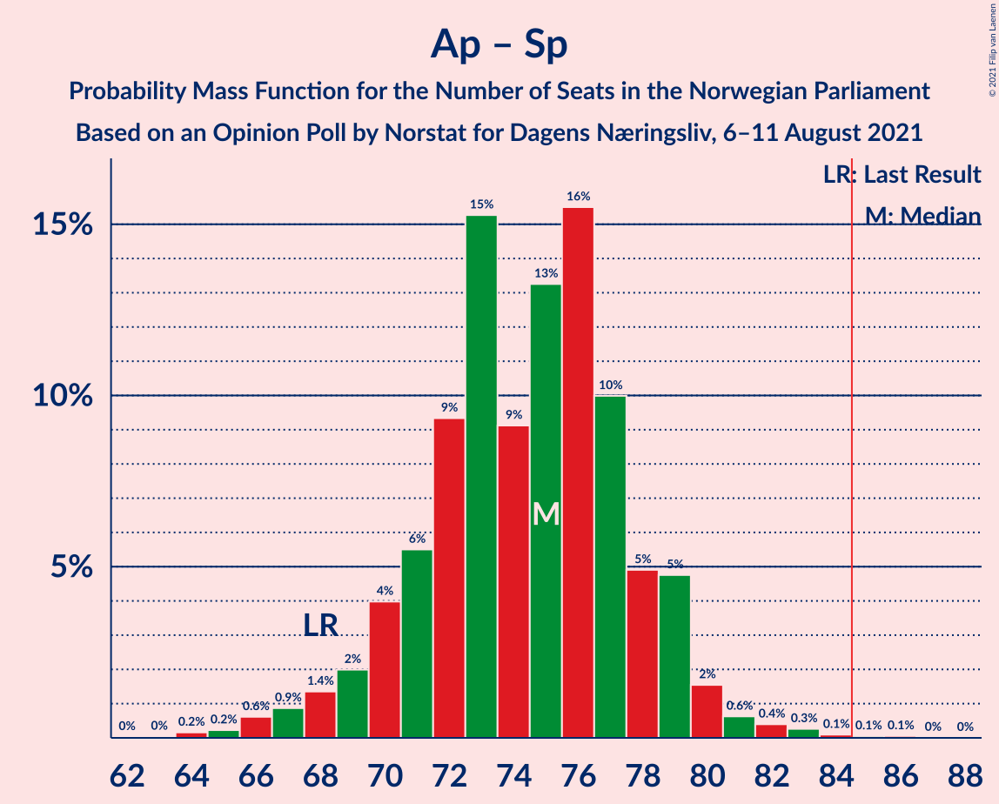

| Number of Seats | Probability | Accumulated | Special Marks |
|:---------------:|:-----------:|:-----------:|:-------------:|
| 63 | 0% | 100% |  |
| 64 | 0.2% | 99.9% |  |
| 65 | 0.2% | 99.7% |  |
| 66 | 0.6% | 99.5% |  |
| 67 | 0.9% | 98.9% |  |
| 68 | 1.4% | 98% | Last Result |
| 69 | 2% | 97% |  |
| 70 | 4% | 95% |  |
| 71 | 6% | 91% |  |
| 72 | 9% | 85% |  |
| 73 | 15% | 76% |  |
| 74 | 9% | 61% |  |
| 75 | 13% | 51% | Median |
| 76 | 16% | 38% |  |
| 77 | 10% | 23% |  |
| 78 | 5% | 13% |  |
| 79 | 5% | 8% |  |
| 80 | 2% | 3% |  |
| 81 | 0.6% | 2% |  |
| 82 | 0.4% | 0.9% |  |
| 83 | 0.3% | 0.5% |  |
| 84 | 0.1% | 0.2% |  |
| 85 | 0.1% | 0.1% | Majority |
| 86 | 0.1% | 0.1% |  |
| 87 | 0% | 0% |  |

### Høyre – Fremskrittspartiet – Miljøpartiet De Grønne – Venstre – Kristelig Folkeparti

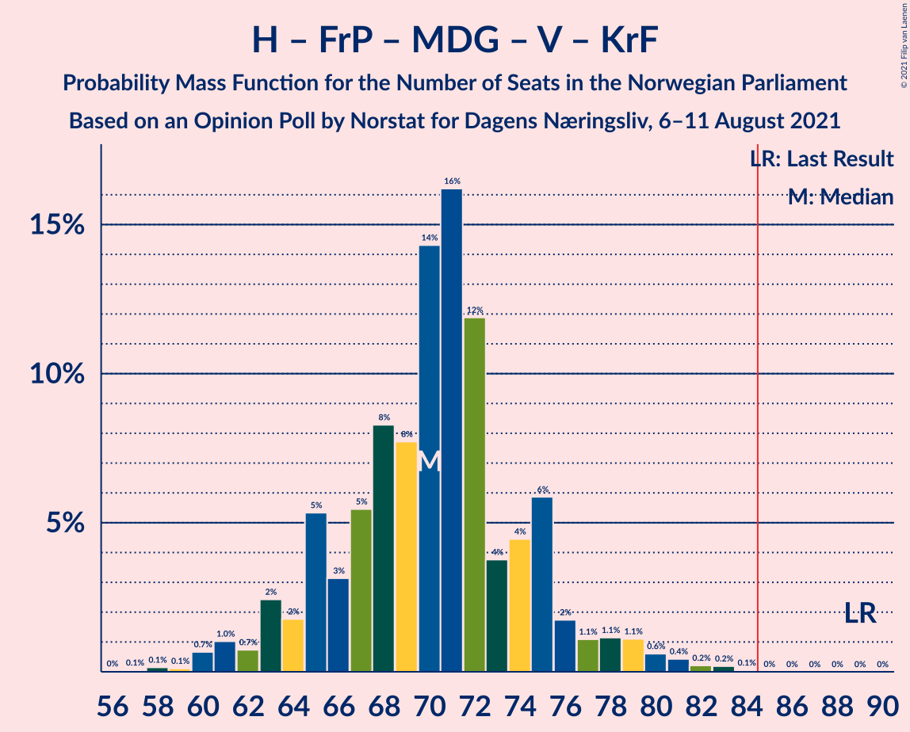

| Number of Seats | Probability | Accumulated | Special Marks |
|:---------------:|:-----------:|:-----------:|:-------------:|
| 57 | 0.1% | 100% |  |
| 58 | 0.1% | 99.9% |  |
| 59 | 0.1% | 99.8% |  |
| 60 | 0.7% | 99.7% |  |
| 61 | 1.0% | 99.0% |  |
| 62 | 0.7% | 98% |  |
| 63 | 2% | 97% |  |
| 64 | 2% | 95% |  |
| 65 | 5% | 93% |  |
| 66 | 3% | 88% |  |
| 67 | 5% | 85% |  |
| 68 | 8% | 79% |  |
| 69 | 8% | 71% |  |
| 70 | 14% | 63% |  |
| 71 | 16% | 49% | Median |
| 72 | 12% | 33% |  |
| 73 | 4% | 21% |  |
| 74 | 4% | 17% |  |
| 75 | 6% | 12% |  |
| 76 | 2% | 7% |  |
| 77 | 1.1% | 5% |  |
| 78 | 1.1% | 4% |  |
| 79 | 1.1% | 3% |  |
| 80 | 0.6% | 2% |  |
| 81 | 0.4% | 0.9% |  |
| 82 | 0.2% | 0.5% |  |
| 83 | 0.2% | 0.3% |  |
| 84 | 0.1% | 0.1% |  |
| 85 | 0% | 0% | Majority |
| 86 | 0% | 0% |  |
| 87 | 0% | 0% |  |
| 88 | 0% | 0% |  |
| 89 | 0% | 0% | Last Result |

### Høyre – Fremskrittspartiet – Venstre – Kristelig Folkeparti

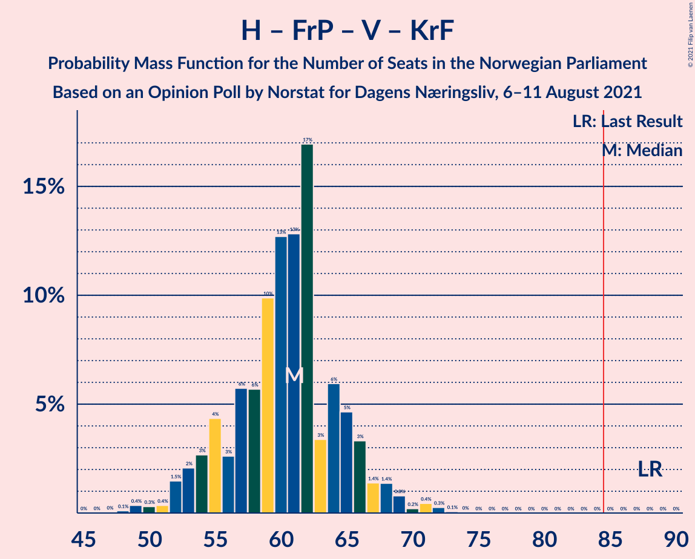

| Number of Seats | Probability | Accumulated | Special Marks |
|:---------------:|:-----------:|:-----------:|:-------------:|
| 47 | 0% | 100% |  |
| 48 | 0.1% | 99.9% |  |
| 49 | 0.4% | 99.8% |  |
| 50 | 0.3% | 99.5% |  |
| 51 | 0.4% | 99.2% |  |
| 52 | 1.5% | 98.8% |  |
| 53 | 2% | 97% |  |
| 54 | 3% | 95% |  |
| 55 | 4% | 93% |  |
| 56 | 3% | 88% |  |
| 57 | 6% | 86% |  |
| 58 | 6% | 80% |  |
| 59 | 10% | 74% |  |
| 60 | 13% | 64% |  |
| 61 | 13% | 52% | Median |
| 62 | 17% | 39% |  |
| 63 | 3% | 22% |  |
| 64 | 6% | 18% |  |
| 65 | 5% | 13% |  |
| 66 | 3% | 8% |  |
| 67 | 1.4% | 5% |  |
| 68 | 1.4% | 3% |  |
| 69 | 0.8% | 2% |  |
| 70 | 0.2% | 1.0% |  |
| 71 | 0.4% | 0.8% |  |
| 72 | 0.3% | 0.4% |  |
| 73 | 0.1% | 0.1% |  |
| 74 | 0% | 0% |  |
| 75 | 0% | 0% |  |
| 76 | 0% | 0% |  |
| 77 | 0% | 0% |  |
| 78 | 0% | 0% |  |
| 79 | 0% | 0% |  |
| 80 | 0% | 0% |  |
| 81 | 0% | 0% |  |
| 82 | 0% | 0% |  |
| 83 | 0% | 0% |  |
| 84 | 0% | 0% |  |
| 85 | 0% | 0% | Majority |
| 86 | 0% | 0% |  |
| 87 | 0% | 0% |  |
| 88 | 0% | 0% | Last Result |

### Høyre – Fremskrittspartiet – Venstre

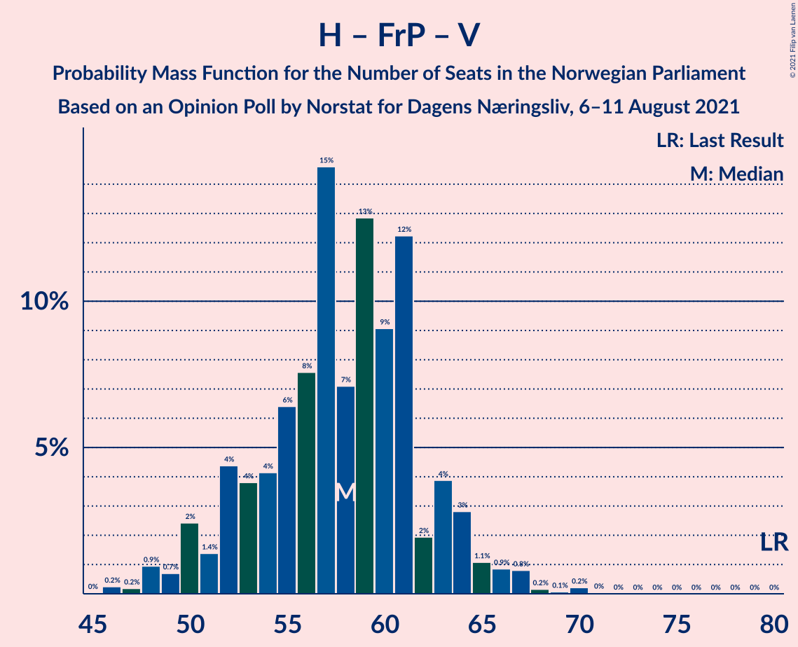

| Number of Seats | Probability | Accumulated | Special Marks |
|:---------------:|:-----------:|:-----------:|:-------------:|
| 45 | 0% | 100% |  |
| 46 | 0.2% | 99.9% |  |
| 47 | 0.2% | 99.7% |  |
| 48 | 0.9% | 99.5% |  |
| 49 | 0.7% | 98.6% |  |
| 50 | 2% | 98% |  |
| 51 | 1.4% | 95% |  |
| 52 | 4% | 94% |  |
| 53 | 4% | 90% |  |
| 54 | 4% | 86% |  |
| 55 | 6% | 82% |  |
| 56 | 8% | 75% |  |
| 57 | 15% | 68% |  |
| 58 | 7% | 53% | Median |
| 59 | 13% | 46% |  |
| 60 | 9% | 33% |  |
| 61 | 12% | 24% |  |
| 62 | 2% | 12% |  |
| 63 | 4% | 10% |  |
| 64 | 3% | 6% |  |
| 65 | 1.1% | 3% |  |
| 66 | 0.9% | 2% |  |
| 67 | 0.8% | 1.3% |  |
| 68 | 0.2% | 0.5% |  |
| 69 | 0.1% | 0.3% |  |
| 70 | 0.2% | 0.3% |  |
| 71 | 0% | 0.1% |  |
| 72 | 0% | 0% |  |
| 73 | 0% | 0% |  |
| 74 | 0% | 0% |  |
| 75 | 0% | 0% |  |
| 76 | 0% | 0% |  |
| 77 | 0% | 0% |  |
| 78 | 0% | 0% |  |
| 79 | 0% | 0% |  |
| 80 | 0% | 0% | Last Result |

### Arbeiderpartiet – Sosialistisk Venstreparti

| Number of Seats | Probability | Accumulated | Special Marks |
|:---------------:|:-----------:|:-----------:|:-------------:|
| 49 | 0.1% | 100% |  |
| 50 | 0.2% | 99.9% |  |
| 51 | 0.5% | 99.7% |  |
| 52 | 1.4% | 99.2% |  |
| 53 | 2% | 98% |  |
| 54 | 7% | 96% |  |
| 55 | 5% | 88% |  |
| 56 | 12% | 83% |  |
| 57 | 16% | 71% |  |
| 58 | 19% | 55% | Median |
| 59 | 9% | 36% |  |
| 60 | 6% | 27% | Last Result |
| 61 | 9% | 21% |  |
| 62 | 5% | 13% |  |
| 63 | 3% | 8% |  |
| 64 | 3% | 5% |  |
| 65 | 0.5% | 2% |  |
| 66 | 0.4% | 2% |  |
| 67 | 0.9% | 1.5% |  |
| 68 | 0.3% | 0.5% |  |
| 69 | 0.2% | 0.3% |  |
| 70 | 0% | 0.1% |  |
| 71 | 0% | 0.1% |  |
| 72 | 0% | 0% |  |

### Høyre – Fremskrittspartiet

| Number of Seats | Probability | Accumulated | Special Marks |
|:---------------:|:-----------:|:-----------:|:-------------:|
| 41 | 0.1% | 100% |  |
| 42 | 0.1% | 99.9% |  |
| 43 | 0.3% | 99.8% |  |
| 44 | 1.2% | 99.5% |  |
| 45 | 2% | 98% |  |
| 46 | 3% | 97% |  |
| 47 | 6% | 93% |  |
| 48 | 8% | 88% |  |
| 49 | 18% | 79% |  |
| 50 | 6% | 61% |  |
| 51 | 9% | 55% | Median |
| 52 | 19% | 46% |  |
| 53 | 7% | 27% |  |
| 54 | 7% | 21% |  |
| 55 | 4% | 14% |  |
| 56 | 4% | 10% |  |
| 57 | 3% | 6% |  |
| 58 | 0.9% | 3% |  |
| 59 | 0.8% | 2% |  |
| 60 | 0.4% | 1.2% |  |
| 61 | 0.5% | 0.8% |  |
| 62 | 0.1% | 0.3% |  |
| 63 | 0.1% | 0.2% |  |
| 64 | 0% | 0.1% |  |
| 65 | 0% | 0% |  |
| 66 | 0% | 0% |  |
| 67 | 0% | 0% |  |
| 68 | 0% | 0% |  |
| 69 | 0% | 0% |  |
| 70 | 0% | 0% |  |
| 71 | 0% | 0% |  |
| 72 | 0% | 0% | Last Result |

### Høyre – Venstre – Kristelig Folkeparti

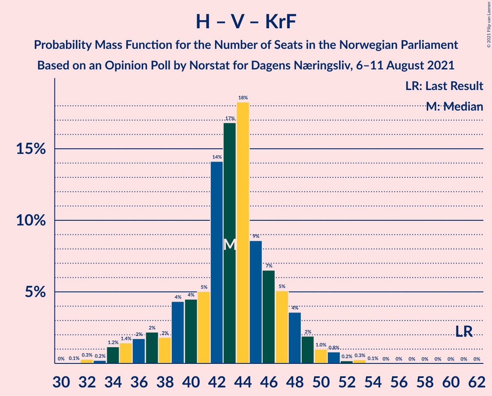

| Number of Seats | Probability | Accumulated | Special Marks |
|:---------------:|:-----------:|:-----------:|:-------------:|
| 31 | 0.1% | 100% |  |
| 32 | 0.3% | 99.9% |  |
| 33 | 0.2% | 99.6% |  |
| 34 | 1.2% | 99.4% |  |
| 35 | 1.4% | 98% |  |
| 36 | 2% | 97% |  |
| 37 | 2% | 95% |  |
| 38 | 2% | 93% |  |
| 39 | 4% | 91% |  |
| 40 | 4% | 87% |  |
| 41 | 5% | 82% |  |
| 42 | 14% | 77% |  |
| 43 | 17% | 63% |  |
| 44 | 18% | 46% | Median |
| 45 | 9% | 28% |  |
| 46 | 7% | 19% |  |
| 47 | 5% | 13% |  |
| 48 | 4% | 8% |  |
| 49 | 2% | 4% |  |
| 50 | 1.0% | 2% |  |
| 51 | 0.8% | 1.3% |  |
| 52 | 0.2% | 0.5% |  |
| 53 | 0.3% | 0.3% |  |
| 54 | 0.1% | 0.1% |  |
| 55 | 0% | 0% |  |
| 56 | 0% | 0% |  |
| 57 | 0% | 0% |  |
| 58 | 0% | 0% |  |
| 59 | 0% | 0% |  |
| 60 | 0% | 0% |  |
| 61 | 0% | 0% | Last Result |

### Senterpartiet – Venstre – Kristelig Folkeparti

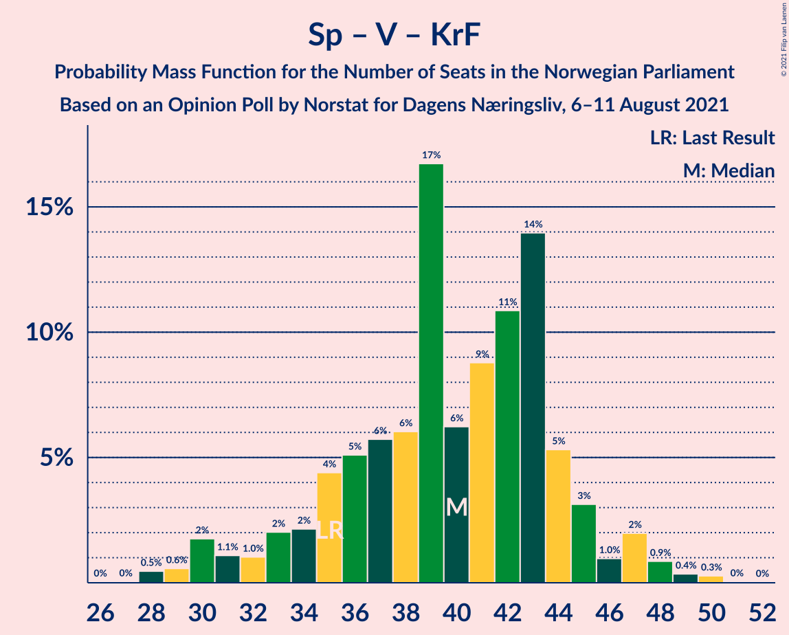

| Number of Seats | Probability | Accumulated | Special Marks |
|:---------------:|:-----------:|:-----------:|:-------------:|
| 26 | 0% | 100% |  |
| 27 | 0% | 99.9% |  |
| 28 | 0.5% | 99.9% |  |
| 29 | 0.6% | 99.4% |  |
| 30 | 2% | 98.9% |  |
| 31 | 1.1% | 97% |  |
| 32 | 1.0% | 96% |  |
| 33 | 2% | 95% |  |
| 34 | 2% | 93% |  |
| 35 | 4% | 91% | Last Result |
| 36 | 5% | 86% |  |
| 37 | 6% | 81% |  |
| 38 | 6% | 76% |  |
| 39 | 17% | 70% |  |
| 40 | 6% | 53% |  |
| 41 | 9% | 47% | Median |
| 42 | 11% | 38% |  |
| 43 | 14% | 27% |  |
| 44 | 5% | 13% |  |
| 45 | 3% | 8% |  |
| 46 | 1.0% | 5% |  |
| 47 | 2% | 4% |  |
| 48 | 0.9% | 2% |  |
| 49 | 0.4% | 0.7% |  |
| 50 | 0.3% | 0.4% |  |
| 51 | 0% | 0.1% |  |
| 52 | 0% | 0% |  |

## Technical Information

### Opinion Poll

+ **Polling firm:** Norstat
+ **Commissioner(s):** Dagens Næringsliv
+ **Fieldwork period:** 6–11 August 2021

### Calculations

+ **Sample size:** 790
+ **Simulations done:** 1,048,576
+ **Error estimate:** 1.69%

