# Opinion Poll by Respons Analyse for VG, 5–11 August 2021

<a href="#voting-intentions">Voting Intentions</a> | <a href="#seats">Seats</a> | <a href="#coalitions">Coalitions</a> | <a href="#technical-information">Technical Information</a>

## Voting Intentions

### Confidence Intervals

| Party | Last Result | Poll Result | 80% Confidence Interval | 90% Confidence Interval | 95% Confidence Interval | 99% Confidence Interval |
|:-----:|:-----------:|:-----------:|:-----------------------:|:-----------------------:|:-----------------------:|:-----------------------:|
| Arbeiderpartiet | 27.4% | 24.8% | 23.1–26.6% |22.6–27.1% |22.2–27.6% |21.4–28.5% |
| Høyre | 25.0% | 18.9% | 17.4–20.6% |16.9–21.0% |16.6–21.5% |15.9–22.3% |
| Senterpartiet | 10.3% | 15.3% | 13.9–16.9% |13.5–17.3% |13.2–17.7% |12.6–18.4% |
| Fremskrittspartiet | 15.2% | 11.4% | 10.2–12.8% |9.9–13.2% |9.6–13.5% |9.0–14.2% |
| Sosialistisk Venstreparti | 6.0% | 9.4% | 8.3–10.7% |8.0–11.1% |7.7–11.4% |7.2–12.0% |
| Miljøpartiet De Grønne | 3.2% | 5.1% | 4.3–6.1% |4.1–6.4% |3.9–6.6% |3.6–7.2% |
| Rødt | 2.4% | 4.3% | 3.6–5.2% |3.4–5.5% |3.2–5.7% |2.9–6.2% |
| Venstre | 4.4% | 4.0% | 3.3–4.9% |3.1–5.2% |2.9–5.4% |2.7–5.9% |
| Kristelig Folkeparti | 4.2% | 3.3% | 2.7–4.1% |2.5–4.4% |2.4–4.6% |2.1–5.0% |

*Note:* The poll result column reflects the actual value used in the calculations. Published results may vary slightly, and in addition be rounded to fewer digits.

## Seats

### Confidence Intervals

| Party | Last Result | Median | 80% Confidence Interval | 90% Confidence Interval | 95% Confidence Interval | 99% Confidence Interval |
|:-----:|:-----------:|:------:|:-----------------------:|:-----------------------:|:-----------------------:|:-----------------------:|
| <a href="#arbeiderpartiet">Arbeiderpartiet</a> | 49 | 44 | 42–48 |42–50 |41–51 |40–54 |
| <a href="#høyre">Høyre</a> | 45 | 34 | 31–37 |30–38 |29–39 |28–41 |
| <a href="#senterpartiet">Senterpartiet</a> | 19 | 28 | 25–32 |25–32 |24–33 |22–34 |
| <a href="#fremskrittspartiet">Fremskrittspartiet</a> | 27 | 20 | 17–23 |17–24 |16–24 |15–26 |
| <a href="#sosialistisk-venstreparti">Sosialistisk Venstreparti</a> | 11 | 17 | 14–19 |13–19 |13–20 |12–22 |
| <a href="#miljøpartiet-de-grønne">Miljøpartiet De Grønne</a> | 1 | 9 | 7–11 |7–11 |2–12 |2–13 |
| <a href="#rødt">Rødt</a> | 1 | 7 | 2–9 |2–10 |2–10 |2–11 |
| <a href="#venstre">Venstre</a> | 8 | 7 | 2–8 |2–9 |2–10 |2–10 |
| <a href="#kristelig-folkeparti">Kristelig Folkeparti</a> | 8 | 3 | 1–7 |1–7 |1–8 |0–9 |

### Arbeiderpartiet

*For a full overview of the results for this party, see the [Arbeiderpartiet](party-arbeiderpartiet.html) page.*

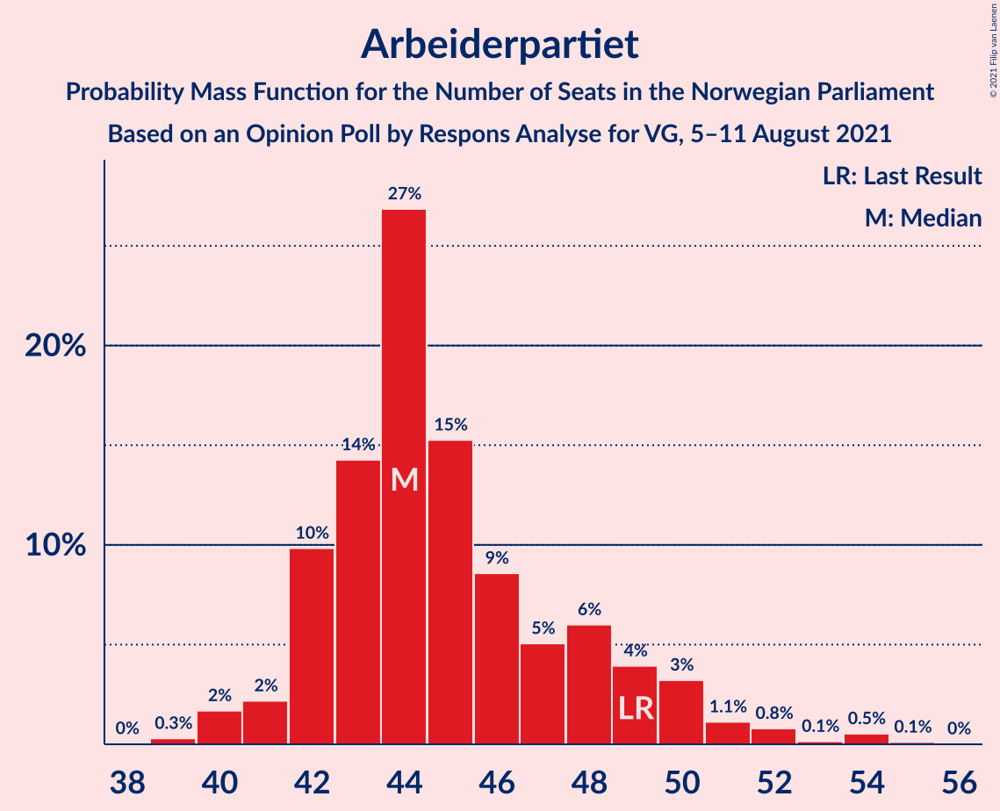

| Number of Seats | Probability | Accumulated | Special Marks |
|:---------------:|:-----------:|:-----------:|:-------------:|
| 38 | 0% | 100% |  |
| 39 | 0.3% | 99.9% |  |
| 40 | 2% | 99.6% |  |
| 41 | 2% | 98% |  |
| 42 | 10% | 96% |  |
| 43 | 14% | 86% |  |
| 44 | 27% | 72% | Median |
| 45 | 15% | 45% |  |
| 46 | 9% | 30% |  |
| 47 | 5% | 21% |  |
| 48 | 6% | 16% |  |
| 49 | 4% | 10% | Last Result |
| 50 | 3% | 6% |  |
| 51 | 1.1% | 3% |  |
| 52 | 0.8% | 2% |  |
| 53 | 0.1% | 0.8% |  |
| 54 | 0.5% | 0.7% |  |
| 55 | 0.1% | 0.1% |  |
| 56 | 0% | 0% |  |

### Høyre

*For a full overview of the results for this party, see the [Høyre](party-høyre.html) page.*

| Number of Seats | Probability | Accumulated | Special Marks |
|:---------------:|:-----------:|:-----------:|:-------------:|
| 26 | 0% | 100% |  |
| 27 | 0.4% | 99.9% |  |
| 28 | 1.3% | 99.5% |  |
| 29 | 2% | 98% |  |
| 30 | 5% | 96% |  |
| 31 | 7% | 92% |  |
| 32 | 13% | 85% |  |
| 33 | 11% | 72% |  |
| 34 | 20% | 61% | Median |
| 35 | 15% | 41% |  |
| 36 | 13% | 26% |  |
| 37 | 6% | 13% |  |
| 38 | 3% | 7% |  |
| 39 | 2% | 4% |  |
| 40 | 0.6% | 1.2% |  |
| 41 | 0.4% | 0.6% |  |
| 42 | 0.2% | 0.3% |  |
| 43 | 0.1% | 0.1% |  |
| 44 | 0% | 0% |  |
| 45 | 0% | 0% | Last Result |

### Senterpartiet

*For a full overview of the results for this party, see the [Senterpartiet](party-senterpartiet.html) page.*

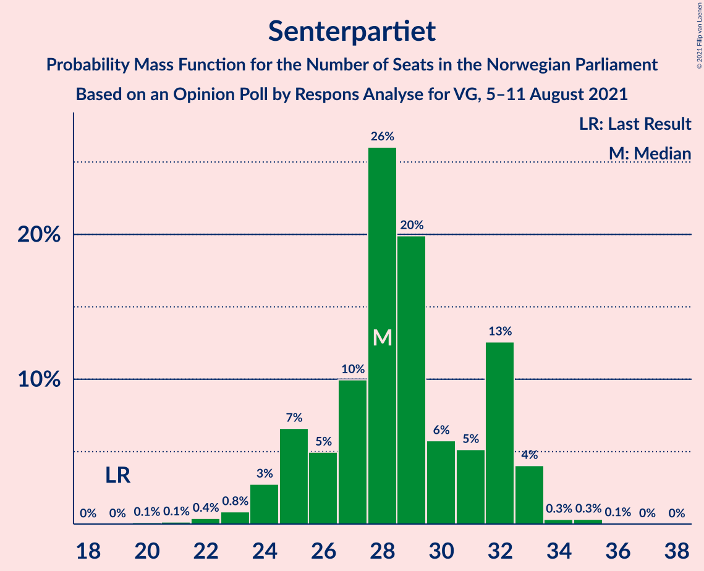

| Number of Seats | Probability | Accumulated | Special Marks |
|:---------------:|:-----------:|:-----------:|:-------------:|
| 19 | 0% | 100% | Last Result |
| 20 | 0.1% | 100% |  |
| 21 | 0.1% | 99.9% |  |
| 22 | 0.4% | 99.7% |  |
| 23 | 0.8% | 99.3% |  |
| 24 | 3% | 98.5% |  |
| 25 | 7% | 96% |  |
| 26 | 5% | 89% |  |
| 27 | 10% | 84% |  |
| 28 | 26% | 74% | Median |
| 29 | 20% | 48% |  |
| 30 | 6% | 28% |  |
| 31 | 5% | 23% |  |
| 32 | 13% | 17% |  |
| 33 | 4% | 5% |  |
| 34 | 0.3% | 0.8% |  |
| 35 | 0.3% | 0.4% |  |
| 36 | 0.1% | 0.1% |  |
| 37 | 0% | 0% |  |

### Fremskrittspartiet

*For a full overview of the results for this party, see the [Fremskrittspartiet](party-fremskrittspartiet.html) page.*

| Number of Seats | Probability | Accumulated | Special Marks |
|:---------------:|:-----------:|:-----------:|:-------------:|
| 14 | 0.2% | 100% |  |
| 15 | 0.5% | 99.7% |  |
| 16 | 3% | 99.2% |  |
| 17 | 7% | 96% |  |
| 18 | 17% | 88% |  |
| 19 | 11% | 72% |  |
| 20 | 18% | 61% | Median |
| 21 | 15% | 43% |  |
| 22 | 11% | 27% |  |
| 23 | 9% | 16% |  |
| 24 | 6% | 8% |  |
| 25 | 1.1% | 2% |  |
| 26 | 0.8% | 0.9% |  |
| 27 | 0.1% | 0.2% | Last Result |
| 28 | 0% | 0% |  |

### Sosialistisk Venstreparti

*For a full overview of the results for this party, see the [Sosialistisk Venstreparti](party-sosialistiskvenstreparti.html) page.*

| Number of Seats | Probability | Accumulated | Special Marks |
|:---------------:|:-----------:|:-----------:|:-------------:|
| 10 | 0% | 100% |  |
| 11 | 0.3% | 99.9% | Last Result |
| 12 | 2% | 99.6% |  |
| 13 | 3% | 98% |  |
| 14 | 5% | 95% |  |
| 15 | 16% | 90% |  |
| 16 | 19% | 74% |  |
| 17 | 11% | 55% | Median |
| 18 | 27% | 44% |  |
| 19 | 12% | 17% |  |
| 20 | 3% | 5% |  |
| 21 | 1.1% | 2% |  |
| 22 | 0.3% | 0.6% |  |
| 23 | 0.3% | 0.3% |  |
| 24 | 0% | 0% |  |

### Miljøpartiet De Grønne

*For a full overview of the results for this party, see the [Miljøpartiet De Grønne](party-miljøpartietdegrønne.html) page.*

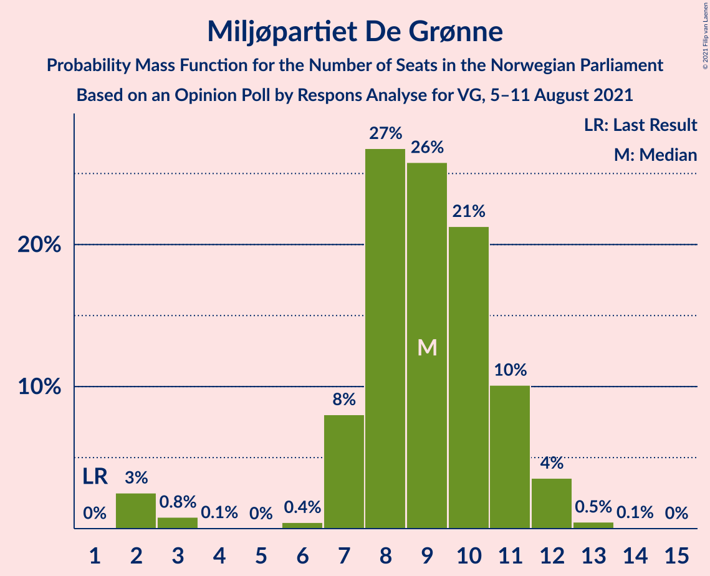

| Number of Seats | Probability | Accumulated | Special Marks |
|:---------------:|:-----------:|:-----------:|:-------------:|
| 1 | 0% | 100% | Last Result |
| 2 | 3% | 100% |  |
| 3 | 0.8% | 97% |  |
| 4 | 0.1% | 97% |  |
| 5 | 0% | 97% |  |
| 6 | 0.4% | 97% |  |
| 7 | 8% | 96% |  |
| 8 | 27% | 88% |  |
| 9 | 26% | 61% | Median |
| 10 | 21% | 36% |  |
| 11 | 10% | 14% |  |
| 12 | 4% | 4% |  |
| 13 | 0.5% | 0.6% |  |
| 14 | 0.1% | 0.1% |  |
| 15 | 0% | 0% |  |

### Rødt

*For a full overview of the results for this party, see the [Rødt](party-rødt.html) page.*

| Number of Seats | Probability | Accumulated | Special Marks |
|:---------------:|:-----------:|:-----------:|:-------------:|
| 1 | 0.5% | 100% | Last Result |
| 2 | 30% | 99.5% |  |
| 3 | 0% | 70% |  |
| 4 | 0% | 70% |  |
| 5 | 0% | 70% |  |
| 6 | 0.9% | 70% |  |
| 7 | 21% | 69% | Median |
| 8 | 25% | 47% |  |
| 9 | 17% | 22% |  |
| 10 | 4% | 5% |  |
| 11 | 1.1% | 1.2% |  |
| 12 | 0.1% | 0.1% |  |
| 13 | 0% | 0% |  |

### Venstre

*For a full overview of the results for this party, see the [Venstre](party-venstre.html) page.*

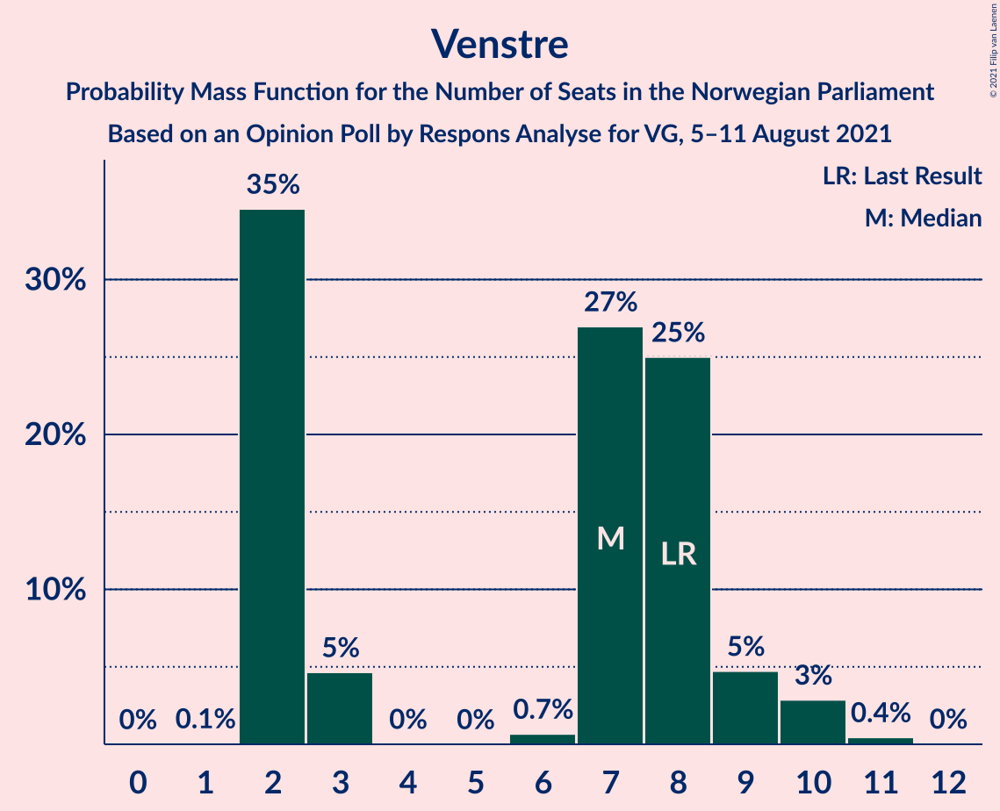

| Number of Seats | Probability | Accumulated | Special Marks |
|:---------------:|:-----------:|:-----------:|:-------------:|
| 1 | 0.1% | 100% |  |
| 2 | 35% | 99.9% |  |
| 3 | 5% | 65% |  |
| 4 | 0% | 61% |  |
| 5 | 0% | 61% |  |
| 6 | 0.7% | 61% |  |
| 7 | 27% | 60% | Median |
| 8 | 25% | 33% | Last Result |
| 9 | 5% | 8% |  |
| 10 | 3% | 3% |  |
| 11 | 0.4% | 0.5% |  |
| 12 | 0% | 0% |  |

### Kristelig Folkeparti

*For a full overview of the results for this party, see the [Kristelig Folkeparti](party-kristeligfolkeparti.html) page.*

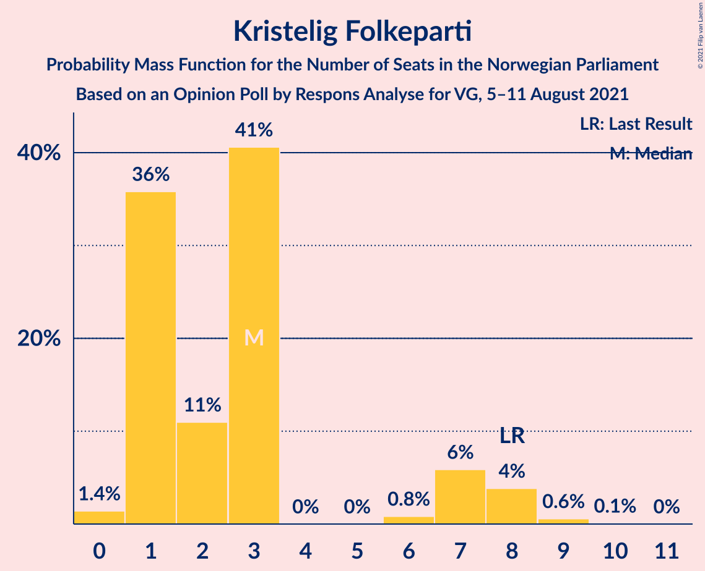

| Number of Seats | Probability | Accumulated | Special Marks |
|:---------------:|:-----------:|:-----------:|:-------------:|
| 0 | 1.4% | 100% |  |
| 1 | 36% | 98.6% |  |
| 2 | 11% | 63% |  |
| 3 | 41% | 52% | Median |
| 4 | 0% | 11% |  |
| 5 | 0% | 11% |  |
| 6 | 0.8% | 11% |  |
| 7 | 6% | 10% |  |
| 8 | 4% | 4% | Last Result |
| 9 | 0.6% | 0.7% |  |
| 10 | 0.1% | 0.1% |  |
| 11 | 0% | 0% |  |

## Coalitions

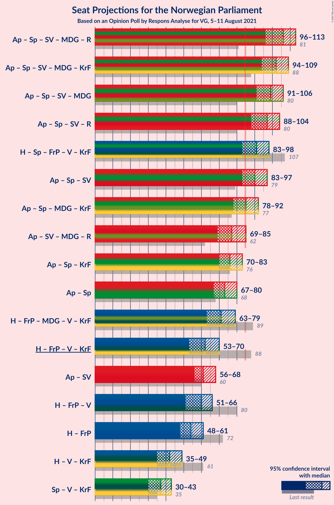

### Confidence Intervals

| Coalition | Last Result | Median | Majority? | 80% Confidence Interval | 90% Confidence Interval | 95% Confidence Interval | 99% Confidence Interval |
|:---------:|:-----------:|:------:|:---------:|:-----------------------:|:-----------------------:|:-----------------------:|:-----------------------:|
| Arbeiderpartiet – Senterpartiet – Sosialistisk Venstreparti – Miljøpartiet De Grønne – Rødt | 81 | 106 | 100% | 100–109 | 98–111 | 96–113 | 95–114 |
| Arbeiderpartiet – Senterpartiet – Sosialistisk Venstreparti – Miljøpartiet De Grønne – Kristelig Folkeparti | 88 | 102 | 100% | 97–106 | 95–107 | 94–109 | 91–112 |
| Arbeiderpartiet – Senterpartiet – Sosialistisk Venstreparti – Miljøpartiet De Grønne | 80 | 99 | 100% | 94–104 | 93–105 | 91–106 | 89–109 |
| Arbeiderpartiet – Senterpartiet – Sosialistisk Venstreparti – Rødt | 80 | 97 | 99.9% | 91–100 | 90–102 | 88–104 | 85–105 |
| Høyre – Senterpartiet – Fremskrittspartiet – Venstre – Kristelig Folkeparti | 107 | 91 | 93% | 86–96 | 84–98 | 83–98 | 80–100 |
| Arbeiderpartiet – Senterpartiet – Sosialistisk Venstreparti | 79 | 90 | 95% | 86–94 | 84–96 | 83–97 | 81–99 |
| Arbeiderpartiet – Senterpartiet – Miljøpartiet De Grønne – Kristelig Folkeparti | 77 | 85 | 57% | 81–89 | 79–91 | 78–92 | 75–95 |
| Arbeiderpartiet – Sosialistisk Venstreparti – Miljøpartiet De Grønne – Rødt | 62 | 77 | 3% | 71–81 | 70–83 | 69–85 | 67–86 |
| Arbeiderpartiet – Senterpartiet – Kristelig Folkeparti | 76 | 76 | 0.9% | 72–80 | 71–82 | 70–83 | 68–86 |
| Arbeiderpartiet – Senterpartiet | 68 | 73 | 0% | 69–77 | 68–79 | 67–80 | 65–83 |
| Høyre – Fremskrittspartiet – Miljøpartiet De Grønne – Venstre – Kristelig Folkeparti | 89 | 71 | 0% | 66–76 | 64–78 | 63–79 | 60–81 |
| Høyre – Fremskrittspartiet – Venstre – Kristelig Folkeparti | 88 | 62 | 0% | 57–67 | 56–68 | 53–70 | 52–73 |
| Arbeiderpartiet – Sosialistisk Venstreparti | 60 | 61 | 0% | 58–66 | 57–67 | 56–68 | 55–70 |
| Høyre – Fremskrittspartiet – Venstre | 80 | 60 | 0% | 55–64 | 53–65 | 51–66 | 50–69 |
| Høyre – Fremskrittspartiet | 72 | 54 | 0% | 50–58 | 48–59 | 48–61 | 46–63 |
| Høyre – Venstre – Kristelig Folkeparti | 61 | 42 | 0% | 37–47 | 36–48 | 35–49 | 33–52 |
| Senterpartiet – Venstre – Kristelig Folkeparti | 35 | 37 | 0% | 32–42 | 30–43 | 30–43 | 28–46 |

### Arbeiderpartiet – Senterpartiet – Sosialistisk Venstreparti – Miljøpartiet De Grønne – Rødt

| Number of Seats | Probability | Accumulated | Special Marks |
|:---------------:|:-----------:|:-----------:|:-------------:|
| 81 | 0% | 100% | Last Result |
| 82 | 0% | 100% |  |
| 83 | 0% | 100% |  |
| 84 | 0% | 100% |  |
| 85 | 0% | 100% | Majority |
| 86 | 0% | 100% |  |
| 87 | 0% | 100% |  |
| 88 | 0% | 100% |  |
| 89 | 0% | 100% |  |
| 90 | 0% | 100% |  |
| 91 | 0% | 100% |  |
| 92 | 0% | 100% |  |
| 93 | 0.2% | 99.9% |  |
| 94 | 0.1% | 99.8% |  |
| 95 | 0.9% | 99.6% |  |
| 96 | 1.3% | 98.7% |  |
| 97 | 0.9% | 97% |  |
| 98 | 2% | 97% |  |
| 99 | 3% | 94% |  |
| 100 | 3% | 91% |  |
| 101 | 7% | 88% |  |
| 102 | 3% | 82% |  |
| 103 | 5% | 79% |  |
| 104 | 6% | 73% |  |
| 105 | 9% | 67% | Median |
| 106 | 13% | 58% |  |
| 107 | 21% | 45% |  |
| 108 | 7% | 25% |  |
| 109 | 8% | 17% |  |
| 110 | 2% | 9% |  |
| 111 | 3% | 7% |  |
| 112 | 2% | 4% |  |
| 113 | 2% | 3% |  |
| 114 | 0.3% | 0.8% |  |
| 115 | 0.2% | 0.5% |  |
| 116 | 0.2% | 0.2% |  |
| 117 | 0% | 0.1% |  |
| 118 | 0% | 0% |  |

### Arbeiderpartiet – Senterpartiet – Sosialistisk Venstreparti – Miljøpartiet De Grønne – Kristelig Folkeparti

| Number of Seats | Probability | Accumulated | Special Marks |
|:---------------:|:-----------:|:-----------:|:-------------:|
| 88 | 0% | 100% | Last Result |
| 89 | 0% | 100% |  |
| 90 | 0.2% | 99.9% |  |
| 91 | 0.4% | 99.8% |  |
| 92 | 0.3% | 99.4% |  |
| 93 | 0.5% | 99.1% |  |
| 94 | 1.1% | 98.5% |  |
| 95 | 2% | 97% |  |
| 96 | 2% | 95% |  |
| 97 | 5% | 93% |  |
| 98 | 5% | 88% |  |
| 99 | 11% | 83% |  |
| 100 | 10% | 72% |  |
| 101 | 5% | 62% | Median |
| 102 | 12% | 57% |  |
| 103 | 15% | 45% |  |
| 104 | 9% | 30% |  |
| 105 | 6% | 21% |  |
| 106 | 8% | 15% |  |
| 107 | 3% | 8% |  |
| 108 | 1.2% | 5% |  |
| 109 | 2% | 4% |  |
| 110 | 0.9% | 2% |  |
| 111 | 0.4% | 0.9% |  |
| 112 | 0.2% | 0.5% |  |
| 113 | 0.1% | 0.3% |  |
| 114 | 0.1% | 0.2% |  |
| 115 | 0.1% | 0.1% |  |
| 116 | 0% | 0% |  |

### Arbeiderpartiet – Senterpartiet – Sosialistisk Venstreparti – Miljøpartiet De Grønne

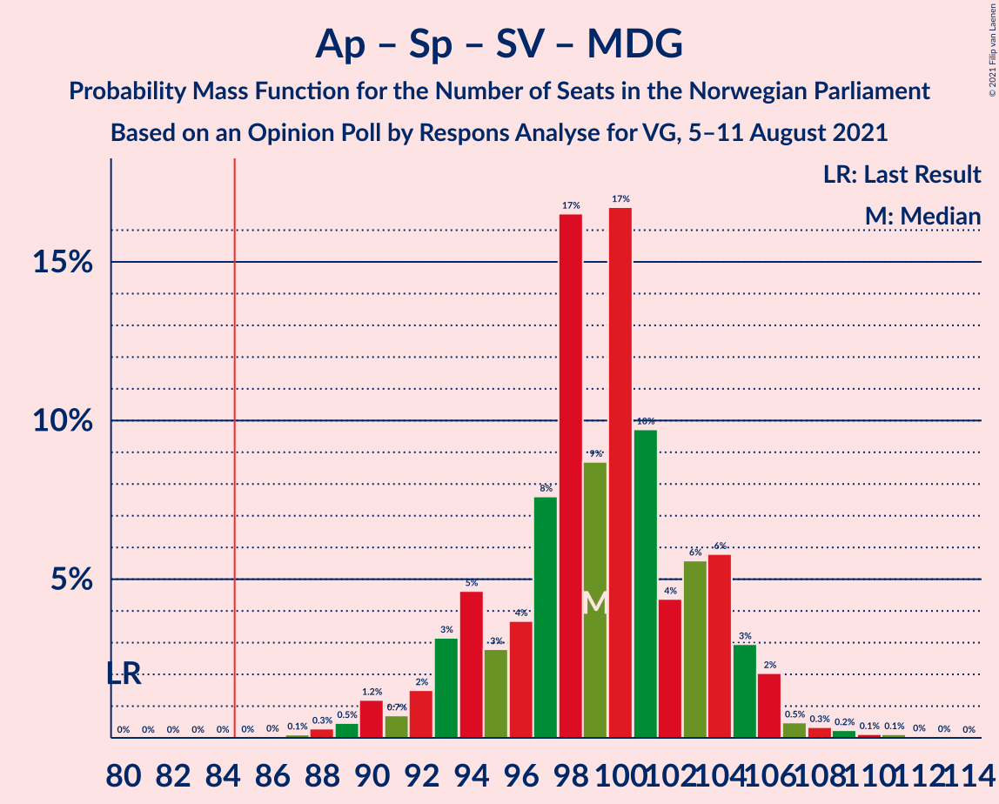

| Number of Seats | Probability | Accumulated | Special Marks |
|:---------------:|:-----------:|:-----------:|:-------------:|
| 80 | 0% | 100% | Last Result |
| 81 | 0% | 100% |  |
| 82 | 0% | 100% |  |
| 83 | 0% | 100% |  |
| 84 | 0% | 100% |  |
| 85 | 0% | 100% | Majority |
| 86 | 0% | 100% |  |
| 87 | 0.1% | 99.9% |  |
| 88 | 0.3% | 99.8% |  |
| 89 | 0.5% | 99.5% |  |
| 90 | 1.2% | 99.1% |  |
| 91 | 0.7% | 98% |  |
| 92 | 2% | 97% |  |
| 93 | 3% | 96% |  |
| 94 | 5% | 93% |  |
| 95 | 3% | 88% |  |
| 96 | 4% | 85% |  |
| 97 | 8% | 81% |  |
| 98 | 17% | 74% | Median |
| 99 | 9% | 57% |  |
| 100 | 17% | 49% |  |
| 101 | 10% | 32% |  |
| 102 | 4% | 22% |  |
| 103 | 6% | 18% |  |
| 104 | 6% | 12% |  |
| 105 | 3% | 6% |  |
| 106 | 2% | 3% |  |
| 107 | 0.5% | 1.4% |  |
| 108 | 0.3% | 0.9% |  |
| 109 | 0.2% | 0.5% |  |
| 110 | 0.1% | 0.3% |  |
| 111 | 0.1% | 0.2% |  |
| 112 | 0% | 0.1% |  |
| 113 | 0% | 0% |  |

### Arbeiderpartiet – Senterpartiet – Sosialistisk Venstreparti – Rødt

| Number of Seats | Probability | Accumulated | Special Marks |
|:---------------:|:-----------:|:-----------:|:-------------:|
| 80 | 0% | 100% | Last Result |
| 81 | 0% | 100% |  |
| 82 | 0% | 100% |  |
| 83 | 0% | 100% |  |
| 84 | 0% | 100% |  |
| 85 | 0.7% | 99.9% | Majority |
| 86 | 0.2% | 99.2% |  |
| 87 | 0.4% | 99.0% |  |
| 88 | 1.5% | 98.6% |  |
| 89 | 1.3% | 97% |  |
| 90 | 2% | 96% |  |
| 91 | 5% | 93% |  |
| 92 | 3% | 88% |  |
| 93 | 4% | 85% |  |
| 94 | 7% | 81% |  |
| 95 | 6% | 74% |  |
| 96 | 12% | 68% | Median |
| 97 | 14% | 56% |  |
| 98 | 7% | 42% |  |
| 99 | 19% | 34% |  |
| 100 | 6% | 15% |  |
| 101 | 3% | 9% |  |
| 102 | 2% | 6% |  |
| 103 | 2% | 4% |  |
| 104 | 2% | 3% |  |
| 105 | 0.1% | 0.6% |  |
| 106 | 0.3% | 0.5% |  |
| 107 | 0.1% | 0.1% |  |
| 108 | 0% | 0.1% |  |
| 109 | 0% | 0% |  |

### Høyre – Senterpartiet – Fremskrittspartiet – Venstre – Kristelig Folkeparti

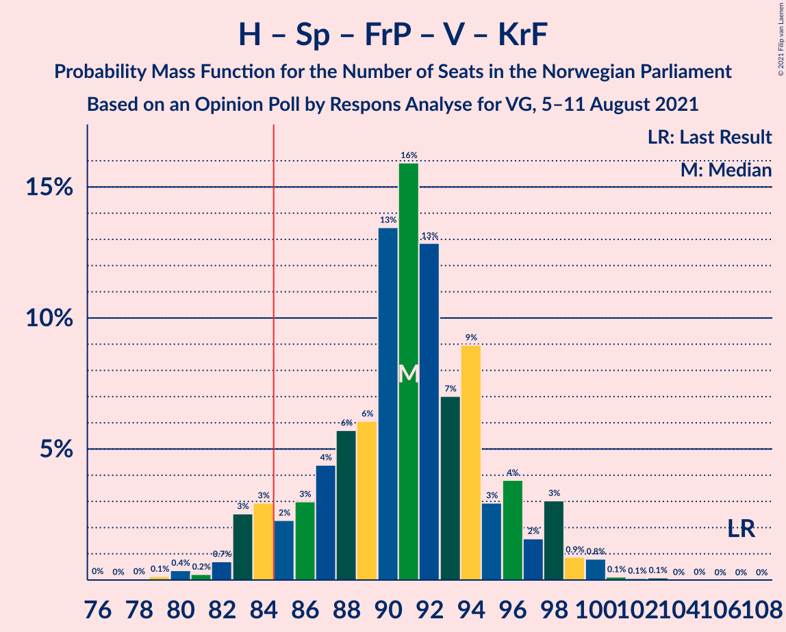

| Number of Seats | Probability | Accumulated | Special Marks |
|:---------------:|:-----------:|:-----------:|:-------------:|
| 76 | 0% | 100% |  |
| 77 | 0% | 99.9% |  |
| 78 | 0% | 99.9% |  |
| 79 | 0.1% | 99.9% |  |
| 80 | 0.4% | 99.8% |  |
| 81 | 0.2% | 99.4% |  |
| 82 | 0.7% | 99.2% |  |
| 83 | 3% | 98% |  |
| 84 | 3% | 96% |  |
| 85 | 2% | 93% | Majority |
| 86 | 3% | 91% |  |
| 87 | 4% | 88% |  |
| 88 | 6% | 83% |  |
| 89 | 6% | 78% |  |
| 90 | 13% | 72% |  |
| 91 | 16% | 58% |  |
| 92 | 13% | 42% | Median |
| 93 | 7% | 29% |  |
| 94 | 9% | 22% |  |
| 95 | 3% | 13% |  |
| 96 | 4% | 10% |  |
| 97 | 2% | 7% |  |
| 98 | 3% | 5% |  |
| 99 | 0.9% | 2% |  |
| 100 | 0.8% | 1.1% |  |
| 101 | 0.1% | 0.3% |  |
| 102 | 0.1% | 0.2% |  |
| 103 | 0.1% | 0.1% |  |
| 104 | 0% | 0% |  |
| 105 | 0% | 0% |  |
| 106 | 0% | 0% |  |
| 107 | 0% | 0% | Last Result |

### Arbeiderpartiet – Senterpartiet – Sosialistisk Venstreparti

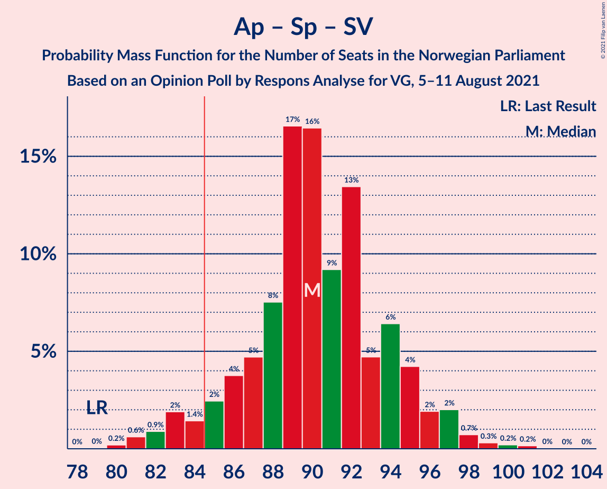

| Number of Seats | Probability | Accumulated | Special Marks |
|:---------------:|:-----------:|:-----------:|:-------------:|
| 79 | 0% | 100% | Last Result |
| 80 | 0.2% | 99.9% |  |
| 81 | 0.6% | 99.7% |  |
| 82 | 0.9% | 99.1% |  |
| 83 | 2% | 98% |  |
| 84 | 1.4% | 96% |  |
| 85 | 2% | 95% | Majority |
| 86 | 4% | 92% |  |
| 87 | 5% | 89% |  |
| 88 | 8% | 84% |  |
| 89 | 17% | 76% | Median |
| 90 | 16% | 60% |  |
| 91 | 9% | 43% |  |
| 92 | 13% | 34% |  |
| 93 | 5% | 21% |  |
| 94 | 6% | 16% |  |
| 95 | 4% | 10% |  |
| 96 | 2% | 5% |  |
| 97 | 2% | 3% |  |
| 98 | 0.7% | 1.5% |  |
| 99 | 0.3% | 0.7% |  |
| 100 | 0.2% | 0.4% |  |
| 101 | 0.2% | 0.2% |  |
| 102 | 0% | 0.1% |  |
| 103 | 0% | 0% |  |

### Arbeiderpartiet – Senterpartiet – Miljøpartiet De Grønne – Kristelig Folkeparti

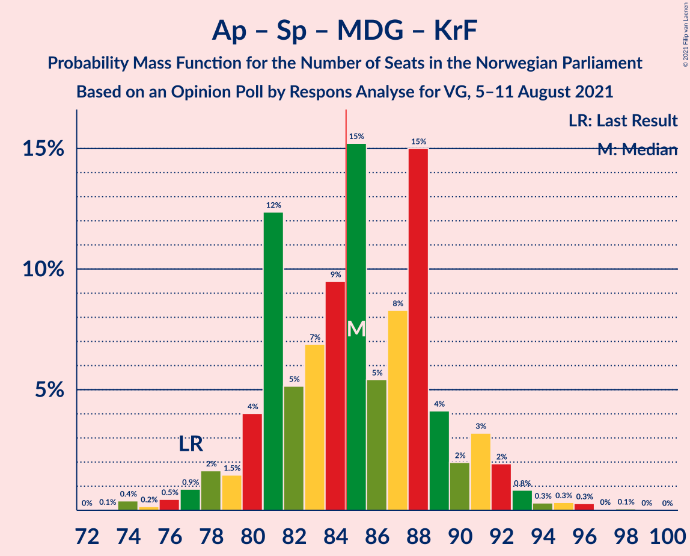

| Number of Seats | Probability | Accumulated | Special Marks |
|:---------------:|:-----------:|:-----------:|:-------------:|
| 73 | 0.1% | 100% |  |
| 74 | 0.4% | 99.9% |  |
| 75 | 0.2% | 99.5% |  |
| 76 | 0.5% | 99.4% |  |
| 77 | 0.9% | 98.9% | Last Result |
| 78 | 2% | 98% |  |
| 79 | 1.5% | 96% |  |
| 80 | 4% | 95% |  |
| 81 | 12% | 91% |  |
| 82 | 5% | 79% |  |
| 83 | 7% | 73% |  |
| 84 | 9% | 67% | Median |
| 85 | 15% | 57% | Majority |
| 86 | 5% | 42% |  |
| 87 | 8% | 36% |  |
| 88 | 15% | 28% |  |
| 89 | 4% | 13% |  |
| 90 | 2% | 9% |  |
| 91 | 3% | 7% |  |
| 92 | 2% | 4% |  |
| 93 | 0.8% | 2% |  |
| 94 | 0.3% | 1.0% |  |
| 95 | 0.3% | 0.7% |  |
| 96 | 0.3% | 0.4% |  |
| 97 | 0% | 0.1% |  |
| 98 | 0.1% | 0.1% |  |
| 99 | 0% | 0% |  |

### Arbeiderpartiet – Sosialistisk Venstreparti – Miljøpartiet De Grønne – Rødt

| Number of Seats | Probability | Accumulated | Special Marks |
|:---------------:|:-----------:|:-----------:|:-------------:|
| 62 | 0% | 100% | Last Result |
| 63 | 0% | 100% |  |
| 64 | 0% | 100% |  |
| 65 | 0.1% | 99.9% |  |
| 66 | 0.3% | 99.8% |  |
| 67 | 0.2% | 99.5% |  |
| 68 | 0.4% | 99.3% |  |
| 69 | 2% | 98.9% |  |
| 70 | 4% | 96% |  |
| 71 | 5% | 93% |  |
| 72 | 3% | 88% |  |
| 73 | 5% | 85% |  |
| 74 | 4% | 80% |  |
| 75 | 10% | 76% |  |
| 76 | 8% | 66% |  |
| 77 | 10% | 58% | Median |
| 78 | 16% | 48% |  |
| 79 | 13% | 32% |  |
| 80 | 6% | 19% |  |
| 81 | 5% | 13% |  |
| 82 | 3% | 9% |  |
| 83 | 2% | 6% |  |
| 84 | 1.2% | 4% |  |
| 85 | 2% | 3% | Majority |
| 86 | 0.4% | 0.6% |  |
| 87 | 0.1% | 0.2% |  |
| 88 | 0.1% | 0.1% |  |
| 89 | 0.1% | 0.1% |  |
| 90 | 0% | 0% |  |

### Arbeiderpartiet – Senterpartiet – Kristelig Folkeparti

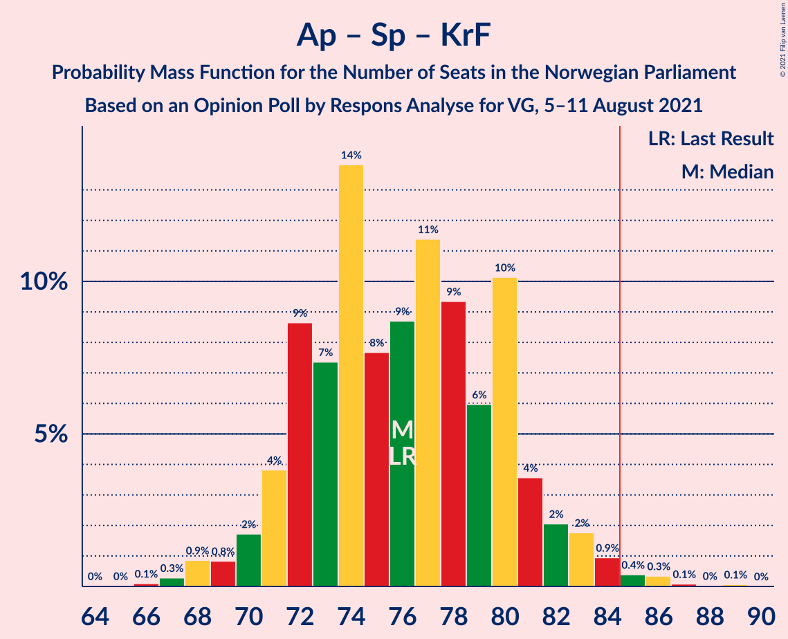

| Number of Seats | Probability | Accumulated | Special Marks |
|:---------------:|:-----------:|:-----------:|:-------------:|
| 66 | 0.1% | 100% |  |
| 67 | 0.3% | 99.9% |  |
| 68 | 0.9% | 99.6% |  |
| 69 | 0.8% | 98.7% |  |
| 70 | 2% | 98% |  |
| 71 | 4% | 96% |  |
| 72 | 9% | 92% |  |
| 73 | 7% | 84% |  |
| 74 | 14% | 76% |  |
| 75 | 8% | 62% | Median |
| 76 | 9% | 55% | Last Result |
| 77 | 11% | 46% |  |
| 78 | 9% | 35% |  |
| 79 | 6% | 25% |  |
| 80 | 10% | 19% |  |
| 81 | 4% | 9% |  |
| 82 | 2% | 6% |  |
| 83 | 2% | 4% |  |
| 84 | 0.9% | 2% |  |
| 85 | 0.4% | 0.9% | Majority |
| 86 | 0.3% | 0.5% |  |
| 87 | 0.1% | 0.2% |  |
| 88 | 0% | 0.1% |  |
| 89 | 0.1% | 0.1% |  |
| 90 | 0% | 0% |  |

### Arbeiderpartiet – Senterpartiet

| Number of Seats | Probability | Accumulated | Special Marks |
|:---------------:|:-----------:|:-----------:|:-------------:|
| 63 | 0.1% | 100% |  |
| 64 | 0.1% | 99.9% |  |
| 65 | 0.7% | 99.8% |  |
| 66 | 0.6% | 99.1% |  |
| 67 | 2% | 98% |  |
| 68 | 3% | 97% | Last Result |
| 69 | 4% | 94% |  |
| 70 | 4% | 90% |  |
| 71 | 17% | 86% |  |
| 72 | 12% | 69% | Median |
| 73 | 10% | 57% |  |
| 74 | 8% | 47% |  |
| 75 | 9% | 39% |  |
| 76 | 10% | 30% |  |
| 77 | 11% | 20% |  |
| 78 | 4% | 9% |  |
| 79 | 3% | 5% |  |
| 80 | 2% | 3% |  |
| 81 | 0.5% | 1.1% |  |
| 82 | 0.2% | 0.7% |  |
| 83 | 0.4% | 0.5% |  |
| 84 | 0.1% | 0.1% |  |
| 85 | 0% | 0% | Majority |

### Høyre – Fremskrittspartiet – Miljøpartiet De Grønne – Venstre – Kristelig Folkeparti

| Number of Seats | Probability | Accumulated | Special Marks |
|:---------------:|:-----------:|:-----------:|:-------------:|
| 57 | 0% | 100% |  |
| 58 | 0.1% | 99.9% |  |
| 59 | 0.1% | 99.9% |  |
| 60 | 0.5% | 99.8% |  |
| 61 | 0.2% | 99.3% |  |
| 62 | 0.9% | 99.2% |  |
| 63 | 2% | 98% |  |
| 64 | 1.2% | 96% |  |
| 65 | 3% | 95% |  |
| 66 | 3% | 92% |  |
| 67 | 3% | 88% |  |
| 68 | 5% | 85% |  |
| 69 | 6% | 80% |  |
| 70 | 18% | 74% |  |
| 71 | 9% | 56% |  |
| 72 | 13% | 47% |  |
| 73 | 12% | 33% | Median |
| 74 | 5% | 22% |  |
| 75 | 5% | 17% |  |
| 76 | 4% | 12% |  |
| 77 | 3% | 8% |  |
| 78 | 2% | 5% |  |
| 79 | 2% | 3% |  |
| 80 | 0.4% | 1.3% |  |
| 81 | 0.6% | 1.0% |  |
| 82 | 0.1% | 0.3% |  |
| 83 | 0.1% | 0.2% |  |
| 84 | 0.1% | 0.1% |  |
| 85 | 0% | 0% | Majority |
| 86 | 0% | 0% |  |
| 87 | 0% | 0% |  |
| 88 | 0% | 0% |  |
| 89 | 0% | 0% | Last Result |

### Høyre – Fremskrittspartiet – Venstre – Kristelig Folkeparti

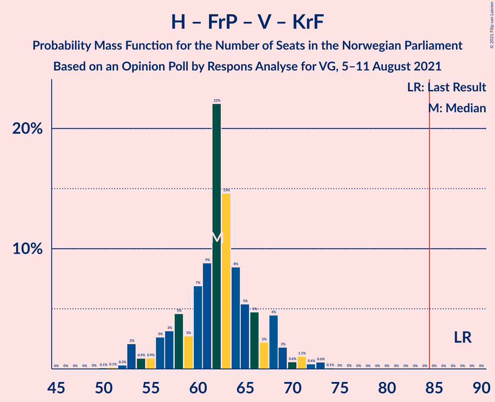

| Number of Seats | Probability | Accumulated | Special Marks |
|:---------------:|:-----------:|:-----------:|:-------------:|
| 50 | 0.1% | 100% |  |
| 51 | 0.1% | 99.9% |  |
| 52 | 0.3% | 99.7% |  |
| 53 | 2% | 99.4% |  |
| 54 | 0.9% | 97% |  |
| 55 | 0.9% | 96% |  |
| 56 | 3% | 96% |  |
| 57 | 3% | 93% |  |
| 58 | 5% | 90% |  |
| 59 | 3% | 85% |  |
| 60 | 7% | 82% |  |
| 61 | 9% | 75% |  |
| 62 | 22% | 67% |  |
| 63 | 15% | 45% |  |
| 64 | 8% | 30% | Median |
| 65 | 5% | 21% |  |
| 66 | 5% | 16% |  |
| 67 | 2% | 11% |  |
| 68 | 4% | 9% |  |
| 69 | 2% | 5% |  |
| 70 | 0.6% | 3% |  |
| 71 | 1.1% | 2% |  |
| 72 | 0.4% | 1.1% |  |
| 73 | 0.6% | 0.7% |  |
| 74 | 0.1% | 0.2% |  |
| 75 | 0% | 0.1% |  |
| 76 | 0% | 0% |  |
| 77 | 0% | 0% |  |
| 78 | 0% | 0% |  |
| 79 | 0% | 0% |  |
| 80 | 0% | 0% |  |
| 81 | 0% | 0% |  |
| 82 | 0% | 0% |  |
| 83 | 0% | 0% |  |
| 84 | 0% | 0% |  |
| 85 | 0% | 0% | Majority |
| 86 | 0% | 0% |  |
| 87 | 0% | 0% |  |
| 88 | 0% | 0% | Last Result |

### Arbeiderpartiet – Sosialistisk Venstreparti

| Number of Seats | Probability | Accumulated | Special Marks |
|:---------------:|:-----------:|:-----------:|:-------------:|
| 53 | 0.1% | 100% |  |
| 54 | 0.3% | 99.9% |  |
| 55 | 0.8% | 99.6% |  |
| 56 | 2% | 98.8% |  |
| 57 | 4% | 97% |  |
| 58 | 5% | 93% |  |
| 59 | 7% | 88% |  |
| 60 | 20% | 80% | Last Result |
| 61 | 15% | 60% | Median |
| 62 | 12% | 45% |  |
| 63 | 12% | 34% |  |
| 64 | 5% | 22% |  |
| 65 | 4% | 17% |  |
| 66 | 5% | 13% |  |
| 67 | 3% | 8% |  |
| 68 | 3% | 5% |  |
| 69 | 0.7% | 1.5% |  |
| 70 | 0.4% | 0.7% |  |
| 71 | 0.2% | 0.4% |  |
| 72 | 0.1% | 0.2% |  |
| 73 | 0% | 0% |  |

### Høyre – Fremskrittspartiet – Venstre

| Number of Seats | Probability | Accumulated | Special Marks |
|:---------------:|:-----------:|:-----------:|:-------------:|
| 48 | 0.2% | 100% |  |
| 49 | 0.1% | 99.8% |  |
| 50 | 2% | 99.7% |  |
| 51 | 0.9% | 98% |  |
| 52 | 0.8% | 97% |  |
| 53 | 1.3% | 96% |  |
| 54 | 5% | 95% |  |
| 55 | 4% | 90% |  |
| 56 | 3% | 86% |  |
| 57 | 7% | 83% |  |
| 58 | 8% | 77% |  |
| 59 | 15% | 69% |  |
| 60 | 11% | 53% |  |
| 61 | 11% | 42% | Median |
| 62 | 12% | 31% |  |
| 63 | 7% | 18% |  |
| 64 | 3% | 11% |  |
| 65 | 4% | 9% |  |
| 66 | 2% | 4% |  |
| 67 | 1.1% | 2% |  |
| 68 | 0.5% | 1.0% |  |
| 69 | 0.3% | 0.5% |  |
| 70 | 0.1% | 0.3% |  |
| 71 | 0.1% | 0.1% |  |
| 72 | 0.1% | 0.1% |  |
| 73 | 0% | 0% |  |
| 74 | 0% | 0% |  |
| 75 | 0% | 0% |  |
| 76 | 0% | 0% |  |
| 77 | 0% | 0% |  |
| 78 | 0% | 0% |  |
| 79 | 0% | 0% |  |
| 80 | 0% | 0% | Last Result |

### Høyre – Fremskrittspartiet

| Number of Seats | Probability | Accumulated | Special Marks |
|:---------------:|:-----------:|:-----------:|:-------------:|
| 44 | 0% | 100% |  |
| 45 | 0.2% | 99.9% |  |
| 46 | 0.6% | 99.7% |  |
| 47 | 0.8% | 99.2% |  |
| 48 | 4% | 98% |  |
| 49 | 2% | 94% |  |
| 50 | 4% | 92% |  |
| 51 | 8% | 88% |  |
| 52 | 17% | 80% |  |
| 53 | 5% | 63% |  |
| 54 | 15% | 58% | Median |
| 55 | 11% | 43% |  |
| 56 | 5% | 32% |  |
| 57 | 9% | 27% |  |
| 58 | 10% | 18% |  |
| 59 | 5% | 8% |  |
| 60 | 1.1% | 4% |  |
| 61 | 1.3% | 3% |  |
| 62 | 0.3% | 1.3% |  |
| 63 | 0.6% | 0.9% |  |
| 64 | 0.2% | 0.4% |  |
| 65 | 0.1% | 0.1% |  |
| 66 | 0% | 0% |  |
| 67 | 0% | 0% |  |
| 68 | 0% | 0% |  |
| 69 | 0% | 0% |  |
| 70 | 0% | 0% |  |
| 71 | 0% | 0% |  |
| 72 | 0% | 0% | Last Result |

### Høyre – Venstre – Kristelig Folkeparti

| Number of Seats | Probability | Accumulated | Special Marks |
|:---------------:|:-----------:|:-----------:|:-------------:|
| 31 | 0% | 100% |  |
| 32 | 0.2% | 99.9% |  |
| 33 | 0.3% | 99.7% |  |
| 34 | 1.0% | 99.4% |  |
| 35 | 3% | 98% |  |
| 36 | 2% | 96% |  |
| 37 | 5% | 94% |  |
| 38 | 2% | 89% |  |
| 39 | 9% | 86% |  |
| 40 | 10% | 77% |  |
| 41 | 7% | 67% |  |
| 42 | 14% | 61% |  |
| 43 | 8% | 46% |  |
| 44 | 15% | 38% | Median |
| 45 | 8% | 22% |  |
| 46 | 4% | 15% |  |
| 47 | 4% | 11% |  |
| 48 | 4% | 6% |  |
| 49 | 0.8% | 3% |  |
| 50 | 0.8% | 2% |  |
| 51 | 0.3% | 1.0% |  |
| 52 | 0.6% | 0.7% |  |
| 53 | 0.1% | 0.1% |  |
| 54 | 0% | 0% |  |
| 55 | 0% | 0% |  |
| 56 | 0% | 0% |  |
| 57 | 0% | 0% |  |
| 58 | 0% | 0% |  |
| 59 | 0% | 0% |  |
| 60 | 0% | 0% |  |
| 61 | 0% | 0% | Last Result |

### Senterpartiet – Venstre – Kristelig Folkeparti

| Number of Seats | Probability | Accumulated | Special Marks |
|:---------------:|:-----------:|:-----------:|:-------------:|
| 26 | 0.1% | 100% |  |
| 27 | 0.3% | 99.9% |  |
| 28 | 0.5% | 99.6% |  |
| 29 | 1.5% | 99.1% |  |
| 30 | 3% | 98% |  |
| 31 | 4% | 94% |  |
| 32 | 8% | 91% |  |
| 33 | 8% | 83% |  |
| 34 | 5% | 75% |  |
| 35 | 4% | 70% | Last Result |
| 36 | 8% | 66% |  |
| 37 | 11% | 58% |  |
| 38 | 14% | 47% | Median |
| 39 | 10% | 33% |  |
| 40 | 5% | 23% |  |
| 41 | 4% | 18% |  |
| 42 | 7% | 14% |  |
| 43 | 5% | 7% |  |
| 44 | 0.8% | 2% |  |
| 45 | 0.4% | 1.1% |  |
| 46 | 0.2% | 0.7% |  |
| 47 | 0.3% | 0.5% |  |
| 48 | 0.1% | 0.1% |  |
| 49 | 0% | 0.1% |  |
| 50 | 0% | 0% |  |

## Technical Information

### Opinion Poll

+ **Polling firm:** Respons Analyse
+ **Commissioner(s):** VG
+ **Fieldwork period:** 5–11 August 2021

### Calculations

+ **Sample size:** 1000
+ **Simulations done:** 1,048,576
+ **Error estimate:** 2.29%

