# Opinion Poll by Kantar TNS for TV2, 9–13 August 2021

<a href="#voting-intentions">Voting Intentions</a> | <a href="#seats">Seats</a> | <a href="#coalitions">Coalitions</a> | <a href="#technical-information">Technical Information</a>

## Voting Intentions

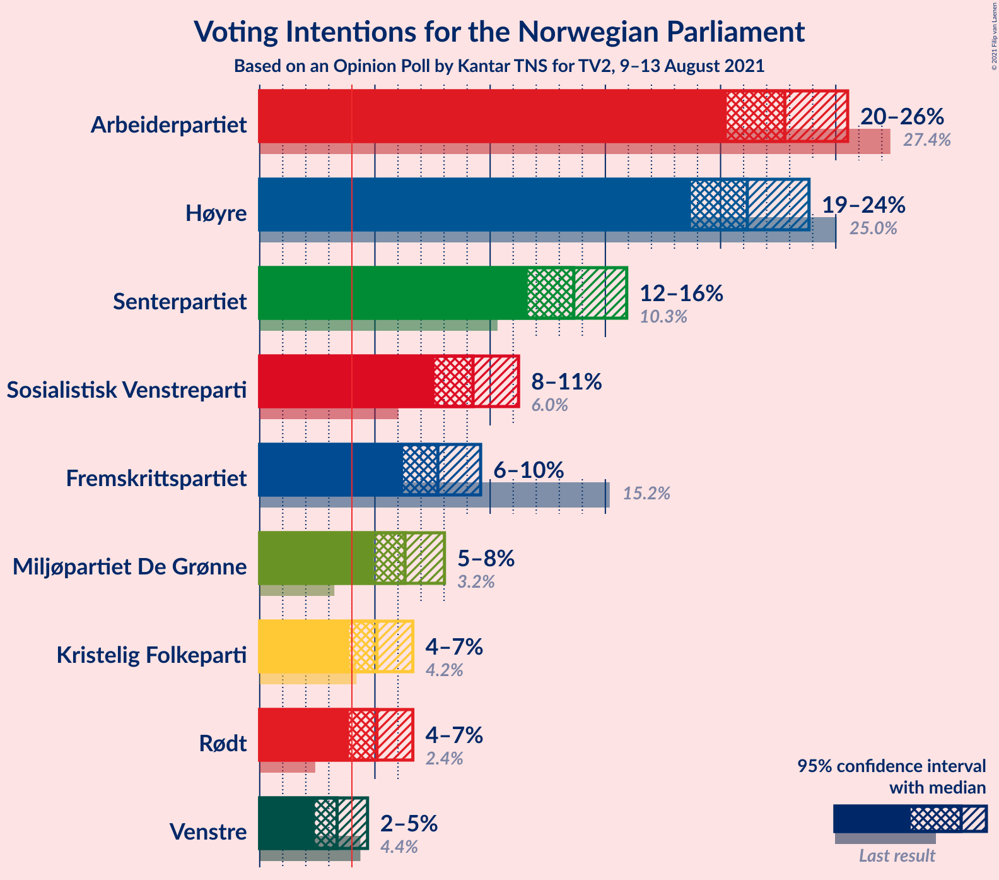

### Confidence Intervals

| Party | Last Result | Poll Result | 80% Confidence Interval | 90% Confidence Interval | 95% Confidence Interval | 99% Confidence Interval |
|:-----:|:-----------:|:-----------:|:-----------------------:|:-----------------------:|:-----------------------:|:-----------------------:|
| Arbeiderpartiet | 27.4% | 22.8% | 21.1–24.6% |20.7–25.1% |20.3–25.5% |19.5–26.4% |
| Høyre | 25.0% | 21.2% | 19.6–22.9% |19.1–23.4% |18.7–23.8% |18.0–24.7% |
| Senterpartiet | 10.3% | 13.6% | 12.3–15.1% |11.9–15.6% |11.6–15.9% |11.0–16.7% |
| Sosialistisk Venstreparti | 6.0% | 9.3% | 8.2–10.5% |7.8–10.9% |7.6–11.2% |7.1–11.9% |
| Fremskrittspartiet | 15.2% | 7.7% | 6.7–8.9% |6.4–9.3% |6.2–9.6% |5.8–10.2% |
| Miljøpartiet De Grønne | 3.2% | 6.3% | 5.4–7.4% |5.2–7.7% |5.0–8.0% |4.5–8.6% |
| Rødt | 2.4% | 5.1% | 4.3–6.1% |4.1–6.4% |3.9–6.6% |3.5–7.2% |
| Kristelig Folkeparti | 4.2% | 5.1% | 4.3–6.1% |4.1–6.4% |3.9–6.6% |3.5–7.2% |
| Venstre | 4.4% | 3.4% | 2.7–4.2% |2.5–4.5% |2.4–4.7% |2.1–5.1% |

*Note:* The poll result column reflects the actual value used in the calculations. Published results may vary slightly, and in addition be rounded to fewer digits.

## Seats

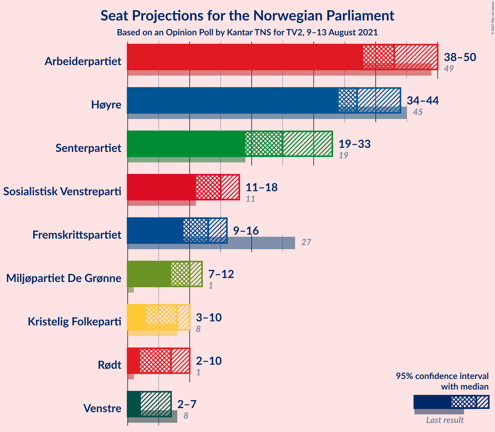

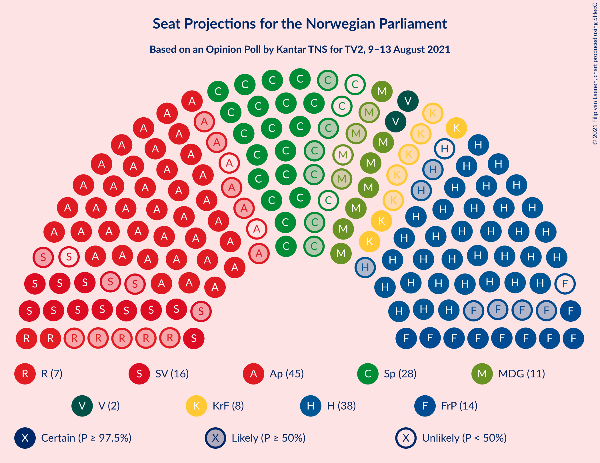

### Confidence Intervals

| Party | Last Result | Median | 80% Confidence Interval | 90% Confidence Interval | 95% Confidence Interval | 99% Confidence Interval |
|:-----:|:-----------:|:------:|:-----------------------:|:-----------------------:|:-----------------------:|:-----------------------:|
| <a href="#arbeiderpartiet">Arbeiderpartiet</a> | 49 | 43 | 40–46 |39–48 |38–50 |37–52 |
| <a href="#høyre">Høyre</a> | 45 | 37 | 35–41 |34–43 |34–44 |32–46 |
| <a href="#senterpartiet">Senterpartiet</a> | 19 | 25 | 20–31 |20–32 |19–33 |18–34 |
| <a href="#sosialistisk-venstreparti">Sosialistisk Venstreparti</a> | 11 | 15 | 12–17 |11–17 |11–18 |10–19 |
| <a href="#fremskrittspartiet">Fremskrittspartiet</a> | 27 | 13 | 10–15 |9–16 |9–16 |8–17 |
| <a href="#miljøpartiet-de-grønne">Miljøpartiet De Grønne</a> | 1 | 10 | 8–12 |8–12 |7–12 |7–13 |
| <a href="#rødt">Rødt</a> | 1 | 7 | 6–9 |2–10 |2–10 |2–11 |
| <a href="#kristelig-folkeparti">Kristelig Folkeparti</a> | 8 | 8 | 6–9 |5–10 |3–10 |3–11 |
| <a href="#venstre">Venstre</a> | 8 | 2 | 2–6 |2–7 |2–7 |1–7 |

### Arbeiderpartiet

*For a full overview of the results for this party, see the [Arbeiderpartiet](party-arbeiderpartiet.html) page.*

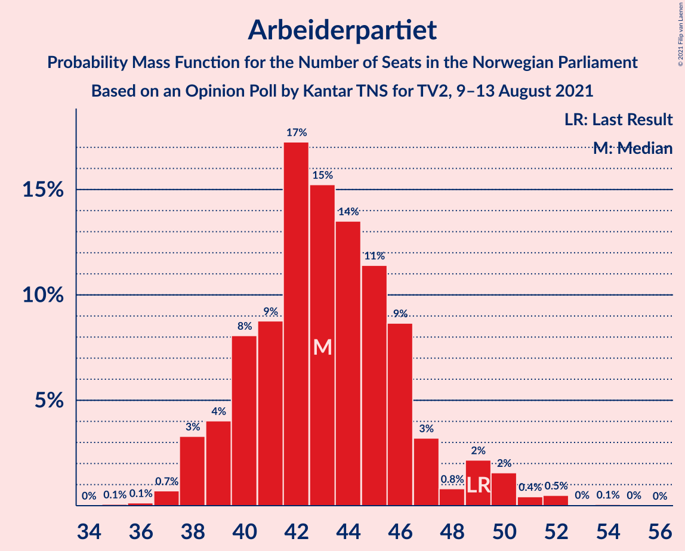

| Number of Seats | Probability | Accumulated | Special Marks |
|:---------------:|:-----------:|:-----------:|:-------------:|
| 35 | 0.1% | 100% |  |
| 36 | 0.1% | 99.9% |  |
| 37 | 0.7% | 99.8% |  |
| 38 | 3% | 99.1% |  |
| 39 | 4% | 96% |  |
| 40 | 8% | 92% |  |
| 41 | 9% | 84% |  |
| 42 | 17% | 75% |  |
| 43 | 15% | 58% | Median |
| 44 | 14% | 42% |  |
| 45 | 11% | 29% |  |
| 46 | 9% | 17% |  |
| 47 | 3% | 9% |  |
| 48 | 0.8% | 6% |  |
| 49 | 2% | 5% | Last Result |
| 50 | 2% | 3% |  |
| 51 | 0.4% | 1.1% |  |
| 52 | 0.5% | 0.7% |  |
| 53 | 0% | 0.2% |  |
| 54 | 0.1% | 0.1% |  |
| 55 | 0% | 0.1% |  |
| 56 | 0% | 0% |  |

### Høyre

*For a full overview of the results for this party, see the [Høyre](party-høyre.html) page.*

| Number of Seats | Probability | Accumulated | Special Marks |
|:---------------:|:-----------:|:-----------:|:-------------:|
| 30 | 0.1% | 100% |  |
| 31 | 0.2% | 99.9% |  |
| 32 | 0.3% | 99.7% |  |
| 33 | 1.3% | 99.4% |  |
| 34 | 5% | 98% |  |
| 35 | 17% | 93% |  |
| 36 | 24% | 76% |  |
| 37 | 12% | 53% | Median |
| 38 | 12% | 41% |  |
| 39 | 8% | 28% |  |
| 40 | 7% | 20% |  |
| 41 | 4% | 13% |  |
| 42 | 3% | 9% |  |
| 43 | 2% | 6% |  |
| 44 | 2% | 4% |  |
| 45 | 0.4% | 2% | Last Result |
| 46 | 0.9% | 1.4% |  |
| 47 | 0.4% | 0.5% |  |
| 48 | 0.1% | 0.1% |  |
| 49 | 0% | 0% |  |

### Senterpartiet

*For a full overview of the results for this party, see the [Senterpartiet](party-senterpartiet.html) page.*

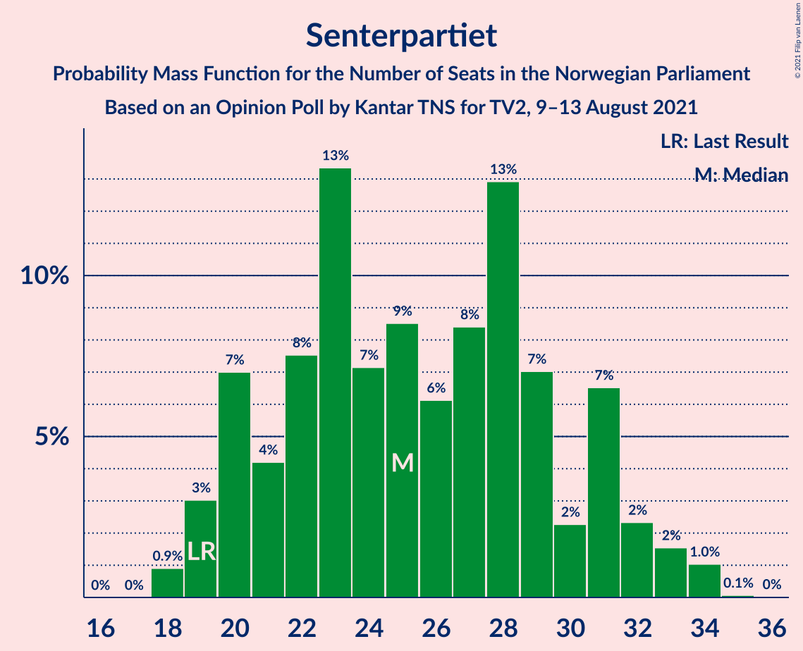

| Number of Seats | Probability | Accumulated | Special Marks |
|:---------------:|:-----------:|:-----------:|:-------------:|
| 18 | 0.9% | 100% |  |
| 19 | 3% | 99.1% | Last Result |
| 20 | 7% | 96% |  |
| 21 | 4% | 89% |  |
| 22 | 8% | 85% |  |
| 23 | 13% | 77% |  |
| 24 | 7% | 64% |  |
| 25 | 9% | 57% | Median |
| 26 | 6% | 48% |  |
| 27 | 8% | 42% |  |
| 28 | 13% | 34% |  |
| 29 | 7% | 21% |  |
| 30 | 2% | 14% |  |
| 31 | 7% | 12% |  |
| 32 | 2% | 5% |  |
| 33 | 2% | 3% |  |
| 34 | 1.0% | 1.1% |  |
| 35 | 0.1% | 0.1% |  |
| 36 | 0% | 0% |  |

### Sosialistisk Venstreparti

*For a full overview of the results for this party, see the [Sosialistisk Venstreparti](party-sosialistiskvenstreparti.html) page.*

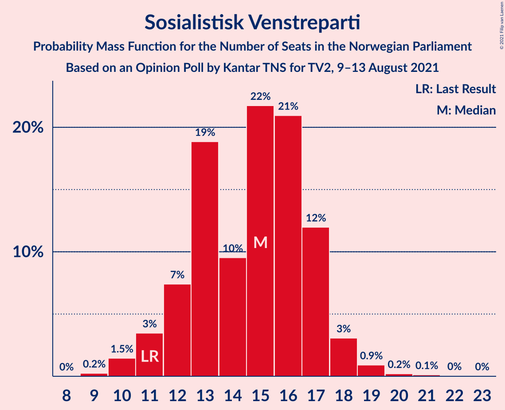

| Number of Seats | Probability | Accumulated | Special Marks |
|:---------------:|:-----------:|:-----------:|:-------------:|
| 9 | 0.2% | 100% |  |
| 10 | 1.5% | 99.8% |  |
| 11 | 3% | 98% | Last Result |
| 12 | 7% | 95% |  |
| 13 | 19% | 87% |  |
| 14 | 10% | 69% |  |
| 15 | 22% | 59% | Median |
| 16 | 21% | 37% |  |
| 17 | 12% | 16% |  |
| 18 | 3% | 4% |  |
| 19 | 0.9% | 1.3% |  |
| 20 | 0.2% | 0.4% |  |
| 21 | 0.1% | 0.2% |  |
| 22 | 0% | 0.1% |  |
| 23 | 0% | 0% |  |

### Fremskrittspartiet

*For a full overview of the results for this party, see the [Fremskrittspartiet](party-fremskrittspartiet.html) page.*

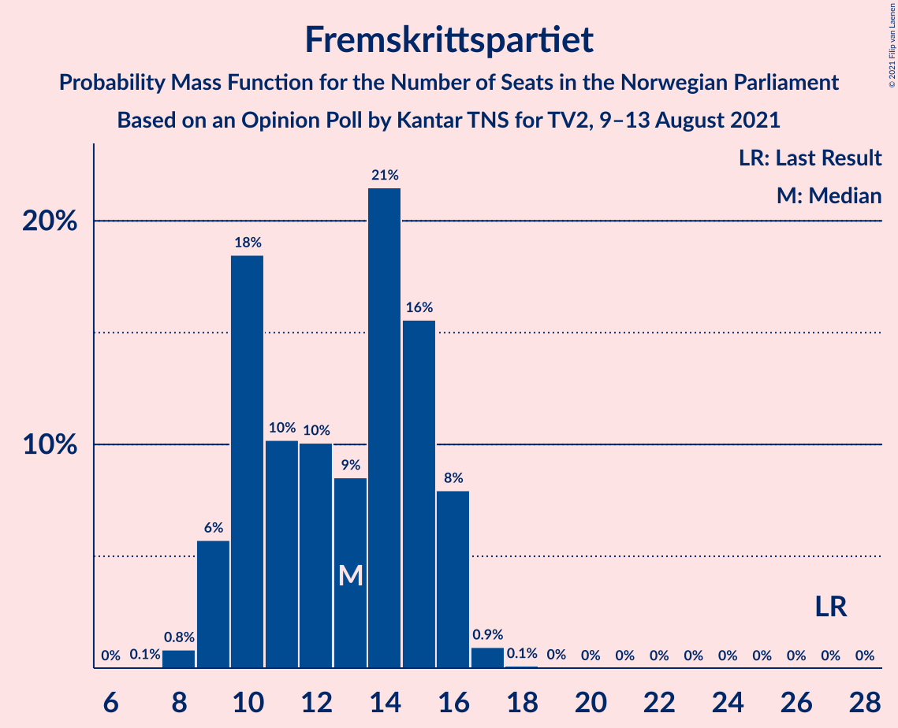

| Number of Seats | Probability | Accumulated | Special Marks |
|:---------------:|:-----------:|:-----------:|:-------------:|
| 7 | 0.1% | 100% |  |
| 8 | 0.8% | 99.9% |  |
| 9 | 6% | 99.1% |  |
| 10 | 18% | 93% |  |
| 11 | 10% | 75% |  |
| 12 | 10% | 65% |  |
| 13 | 9% | 55% | Median |
| 14 | 21% | 46% |  |
| 15 | 16% | 25% |  |
| 16 | 8% | 9% |  |
| 17 | 0.9% | 1.1% |  |
| 18 | 0.1% | 0.2% |  |
| 19 | 0% | 0.1% |  |
| 20 | 0% | 0% |  |
| 21 | 0% | 0% |  |
| 22 | 0% | 0% |  |
| 23 | 0% | 0% |  |
| 24 | 0% | 0% |  |
| 25 | 0% | 0% |  |
| 26 | 0% | 0% |  |
| 27 | 0% | 0% | Last Result |

### Miljøpartiet De Grønne

*For a full overview of the results for this party, see the [Miljøpartiet De Grønne](party-miljøpartietdegrønne.html) page.*

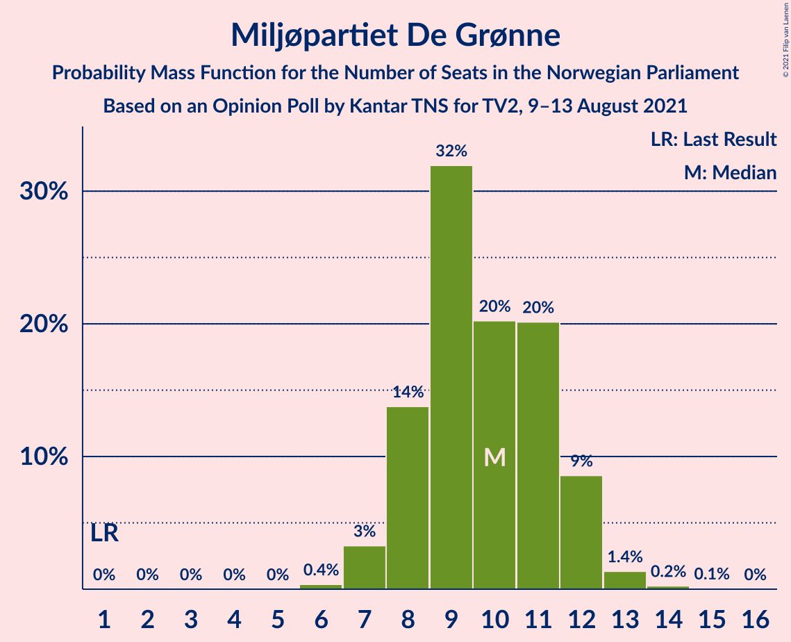

| Number of Seats | Probability | Accumulated | Special Marks |
|:---------------:|:-----------:|:-----------:|:-------------:|
| 1 | 0% | 100% | Last Result |
| 2 | 0% | 100% |  |
| 3 | 0% | 100% |  |
| 4 | 0% | 100% |  |
| 5 | 0% | 100% |  |
| 6 | 0.4% | 100% |  |
| 7 | 3% | 99.6% |  |
| 8 | 14% | 96% |  |
| 9 | 32% | 83% |  |
| 10 | 20% | 51% | Median |
| 11 | 20% | 30% |  |
| 12 | 9% | 10% |  |
| 13 | 1.4% | 2% |  |
| 14 | 0.2% | 0.3% |  |
| 15 | 0.1% | 0.1% |  |
| 16 | 0% | 0% |  |

### Rødt

*For a full overview of the results for this party, see the [Rødt](party-rødt.html) page.*

| Number of Seats | Probability | Accumulated | Special Marks |
|:---------------:|:-----------:|:-----------:|:-------------:|
| 1 | 0% | 100% | Last Result |
| 2 | 5% | 100% |  |
| 3 | 0% | 95% |  |
| 4 | 0% | 95% |  |
| 5 | 0.1% | 95% |  |
| 6 | 12% | 95% |  |
| 7 | 38% | 82% | Median |
| 8 | 28% | 44% |  |
| 9 | 11% | 16% |  |
| 10 | 5% | 6% |  |
| 11 | 0.6% | 0.7% |  |
| 12 | 0.1% | 0.1% |  |
| 13 | 0% | 0% |  |

### Kristelig Folkeparti

*For a full overview of the results for this party, see the [Kristelig Folkeparti](party-kristeligfolkeparti.html) page.*

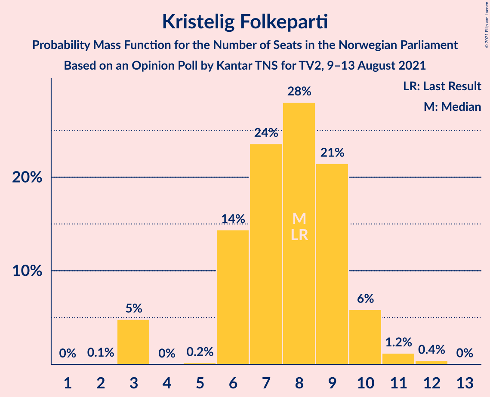

| Number of Seats | Probability | Accumulated | Special Marks |
|:---------------:|:-----------:|:-----------:|:-------------:|
| 2 | 0.1% | 100% |  |
| 3 | 5% | 99.9% |  |
| 4 | 0% | 95% |  |
| 5 | 0.2% | 95% |  |
| 6 | 14% | 95% |  |
| 7 | 24% | 81% |  |
| 8 | 28% | 57% | Last Result, Median |
| 9 | 21% | 29% |  |
| 10 | 6% | 7% |  |
| 11 | 1.2% | 2% |  |
| 12 | 0.4% | 0.4% |  |
| 13 | 0% | 0% |  |

### Venstre

*For a full overview of the results for this party, see the [Venstre](party-venstre.html) page.*

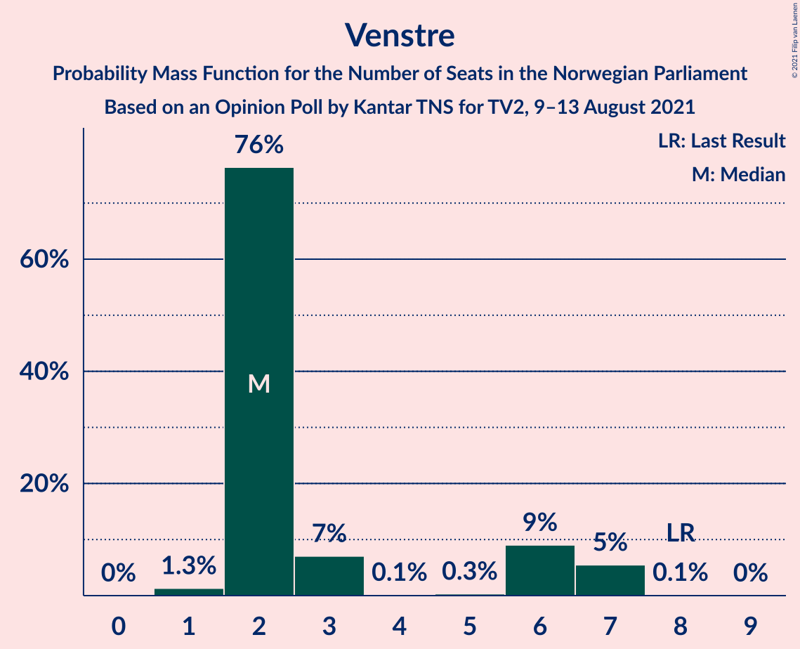

| Number of Seats | Probability | Accumulated | Special Marks |
|:---------------:|:-----------:|:-----------:|:-------------:|
| 1 | 1.3% | 100% |  |
| 2 | 76% | 98.6% | Median |
| 3 | 7% | 22% |  |
| 4 | 0.1% | 15% |  |
| 5 | 0.3% | 15% |  |
| 6 | 9% | 15% |  |
| 7 | 5% | 6% |  |
| 8 | 0.1% | 0.2% | Last Result |
| 9 | 0% | 0% |  |

## Coalitions

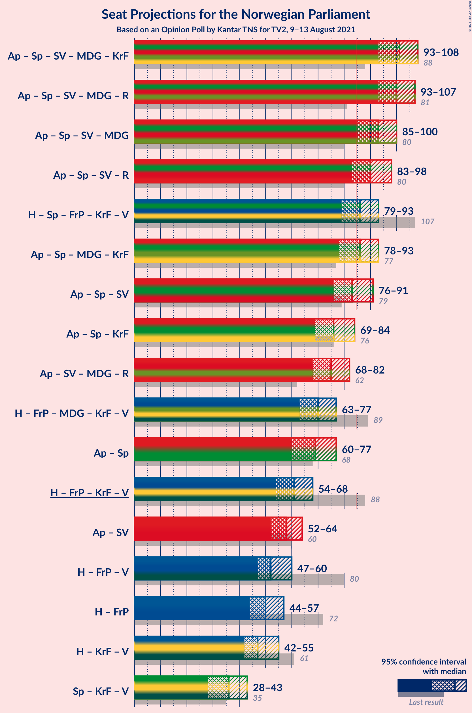

### Confidence Intervals

| Coalition | Last Result | Median | Majority? | 80% Confidence Interval | 90% Confidence Interval | 95% Confidence Interval | 99% Confidence Interval |
|:---------:|:-----------:|:------:|:---------:|:-----------------------:|:-----------------------:|:-----------------------:|:-----------------------:|
| Arbeiderpartiet – Senterpartiet – Sosialistisk Venstreparti – Miljøpartiet De Grønne – Kristelig Folkeparti | 88 | 101 | 100% | 96–105 | 94–106 | 93–108 | 90–110 |
| Arbeiderpartiet – Senterpartiet – Sosialistisk Venstreparti – Miljøpartiet De Grønne – Rødt | 81 | 100 | 100% | 95–106 | 94–107 | 93–107 | 90–109 |
| Arbeiderpartiet – Senterpartiet – Sosialistisk Venstreparti – Miljøpartiet De Grønne | 80 | 93 | 98% | 88–99 | 87–99 | 85–100 | 83–102 |
| Arbeiderpartiet – Senterpartiet – Sosialistisk Venstreparti – Rødt | 80 | 90 | 95% | 86–96 | 85–97 | 83–98 | 80–99 |
| Høyre – Senterpartiet – Fremskrittspartiet – Kristelig Folkeparti – Venstre | 107 | 86 | 63% | 82–90 | 81–92 | 79–93 | 77–95 |
| Arbeiderpartiet – Senterpartiet – Miljøpartiet De Grønne – Kristelig Folkeparti | 77 | 86 | 66% | 81–91 | 79–93 | 78–93 | 76–94 |
| Arbeiderpartiet – Senterpartiet – Sosialistisk Venstreparti | 79 | 83 | 35% | 78–89 | 77–90 | 76–91 | 73–92 |
| Arbeiderpartiet – Senterpartiet – Kristelig Folkeparti | 76 | 76 | 1.3% | 71–81 | 70–83 | 69–84 | 66–85 |
| Arbeiderpartiet – Sosialistisk Venstreparti – Miljøpartiet De Grønne – Rødt | 62 | 75 | 0.5% | 70–79 | 69–80 | 68–82 | 65–85 |
| Høyre – Fremskrittspartiet – Miljøpartiet De Grønne – Kristelig Folkeparti – Venstre | 89 | 70 | 0% | 65–75 | 64–76 | 63–77 | 62–80 |
| Arbeiderpartiet – Senterpartiet | 68 | 69 | 0% | 63–74 | 62–76 | 60–77 | 59–78 |
| Høyre – Fremskrittspartiet – Kristelig Folkeparti – Venstre | 88 | 61 | 0% | 55–66 | 55–66 | 54–68 | 52–71 |
| Arbeiderpartiet – Sosialistisk Venstreparti | 60 | 58 | 0% | 54–62 | 52–63 | 52–64 | 50–66 |
| Høyre – Fremskrittspartiet – Venstre | 80 | 52 | 0% | 49–57 | 48–58 | 47–60 | 46–63 |
| Høyre – Fremskrittspartiet | 72 | 50 | 0% | 46–55 | 45–56 | 44–57 | 43–60 |
| Høyre – Kristelig Folkeparti – Venstre | 61 | 47 | 0% | 44–52 | 44–54 | 42–55 | 40–58 |
| Senterpartiet – Kristelig Folkeparti – Venstre | 35 | 36 | 0% | 31–41 | 30–43 | 28–43 | 27–45 |

### Arbeiderpartiet – Senterpartiet – Sosialistisk Venstreparti – Miljøpartiet De Grønne – Kristelig Folkeparti

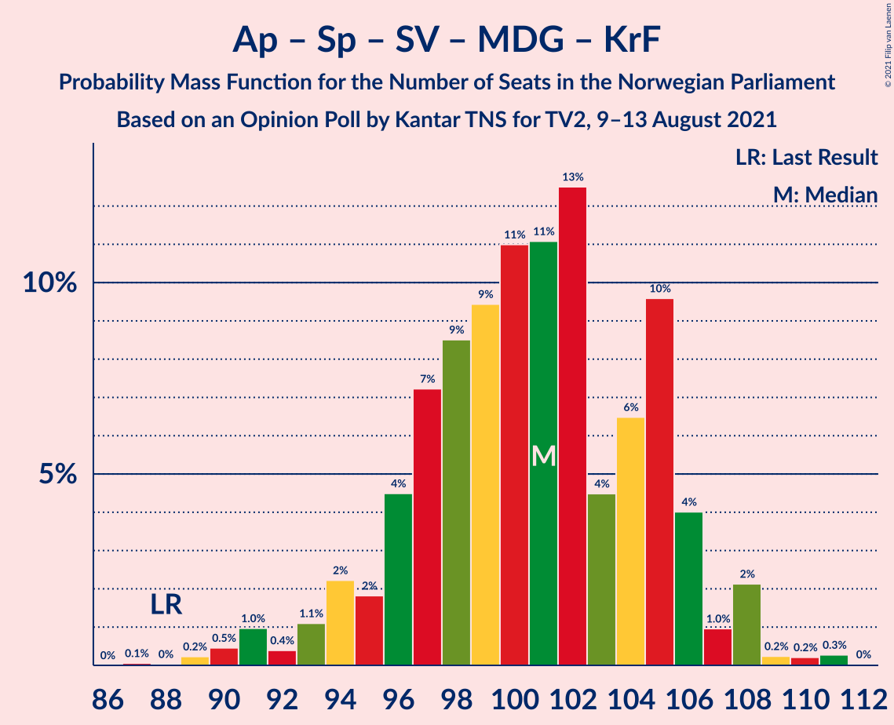

| Number of Seats | Probability | Accumulated | Special Marks |
|:---------------:|:-----------:|:-----------:|:-------------:|
| 87 | 0.1% | 100% |  |
| 88 | 0% | 99.9% | Last Result |
| 89 | 0.2% | 99.9% |  |
| 90 | 0.5% | 99.7% |  |
| 91 | 1.0% | 99.2% |  |
| 92 | 0.4% | 98% |  |
| 93 | 1.1% | 98% |  |
| 94 | 2% | 97% |  |
| 95 | 2% | 95% |  |
| 96 | 4% | 93% |  |
| 97 | 7% | 88% |  |
| 98 | 9% | 81% |  |
| 99 | 9% | 72% |  |
| 100 | 11% | 63% |  |
| 101 | 11% | 52% | Median |
| 102 | 13% | 41% |  |
| 103 | 4% | 28% |  |
| 104 | 6% | 24% |  |
| 105 | 10% | 17% |  |
| 106 | 4% | 8% |  |
| 107 | 1.0% | 4% |  |
| 108 | 2% | 3% |  |
| 109 | 0.2% | 0.8% |  |
| 110 | 0.2% | 0.5% |  |
| 111 | 0.3% | 0.3% |  |
| 112 | 0% | 0% |  |

### Arbeiderpartiet – Senterpartiet – Sosialistisk Venstreparti – Miljøpartiet De Grønne – Rødt

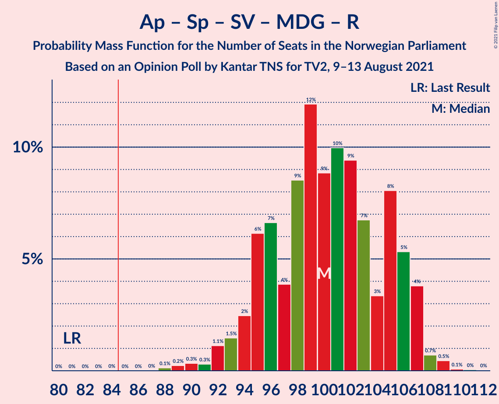

| Number of Seats | Probability | Accumulated | Special Marks |
|:---------------:|:-----------:|:-----------:|:-------------:|
| 81 | 0% | 100% | Last Result |
| 82 | 0% | 100% |  |
| 83 | 0% | 100% |  |
| 84 | 0% | 100% |  |
| 85 | 0% | 100% | Majority |
| 86 | 0% | 100% |  |
| 87 | 0% | 100% |  |
| 88 | 0.1% | 100% |  |
| 89 | 0.2% | 99.8% |  |
| 90 | 0.3% | 99.6% |  |
| 91 | 0.3% | 99.3% |  |
| 92 | 1.1% | 99.0% |  |
| 93 | 1.5% | 98% |  |
| 94 | 2% | 96% |  |
| 95 | 6% | 94% |  |
| 96 | 7% | 88% |  |
| 97 | 4% | 81% |  |
| 98 | 9% | 77% |  |
| 99 | 12% | 69% |  |
| 100 | 9% | 57% | Median |
| 101 | 10% | 48% |  |
| 102 | 9% | 38% |  |
| 103 | 7% | 29% |  |
| 104 | 3% | 22% |  |
| 105 | 8% | 18% |  |
| 106 | 5% | 10% |  |
| 107 | 4% | 5% |  |
| 108 | 0.7% | 1.3% |  |
| 109 | 0.5% | 0.6% |  |
| 110 | 0.1% | 0.2% |  |
| 111 | 0% | 0.1% |  |
| 112 | 0% | 0% |  |

### Arbeiderpartiet – Senterpartiet – Sosialistisk Venstreparti – Miljøpartiet De Grønne

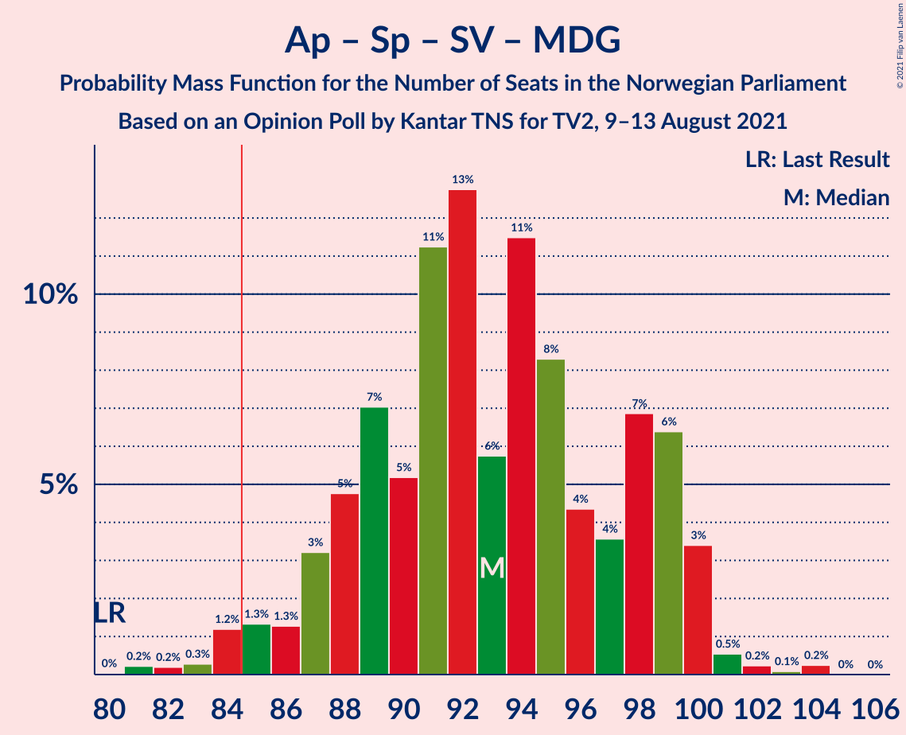

| Number of Seats | Probability | Accumulated | Special Marks |
|:---------------:|:-----------:|:-----------:|:-------------:|
| 80 | 0% | 100% | Last Result |
| 81 | 0.2% | 100% |  |
| 82 | 0.2% | 99.7% |  |
| 83 | 0.3% | 99.5% |  |
| 84 | 1.2% | 99.3% |  |
| 85 | 1.3% | 98% | Majority |
| 86 | 1.3% | 97% |  |
| 87 | 3% | 95% |  |
| 88 | 5% | 92% |  |
| 89 | 7% | 87% |  |
| 90 | 5% | 80% |  |
| 91 | 11% | 75% |  |
| 92 | 13% | 64% |  |
| 93 | 6% | 51% | Median |
| 94 | 11% | 45% |  |
| 95 | 8% | 34% |  |
| 96 | 4% | 26% |  |
| 97 | 4% | 21% |  |
| 98 | 7% | 18% |  |
| 99 | 6% | 11% |  |
| 100 | 3% | 5% |  |
| 101 | 0.5% | 1.1% |  |
| 102 | 0.2% | 0.6% |  |
| 103 | 0.1% | 0.3% |  |
| 104 | 0.2% | 0.3% |  |
| 105 | 0% | 0% |  |

### Arbeiderpartiet – Senterpartiet – Sosialistisk Venstreparti – Rødt

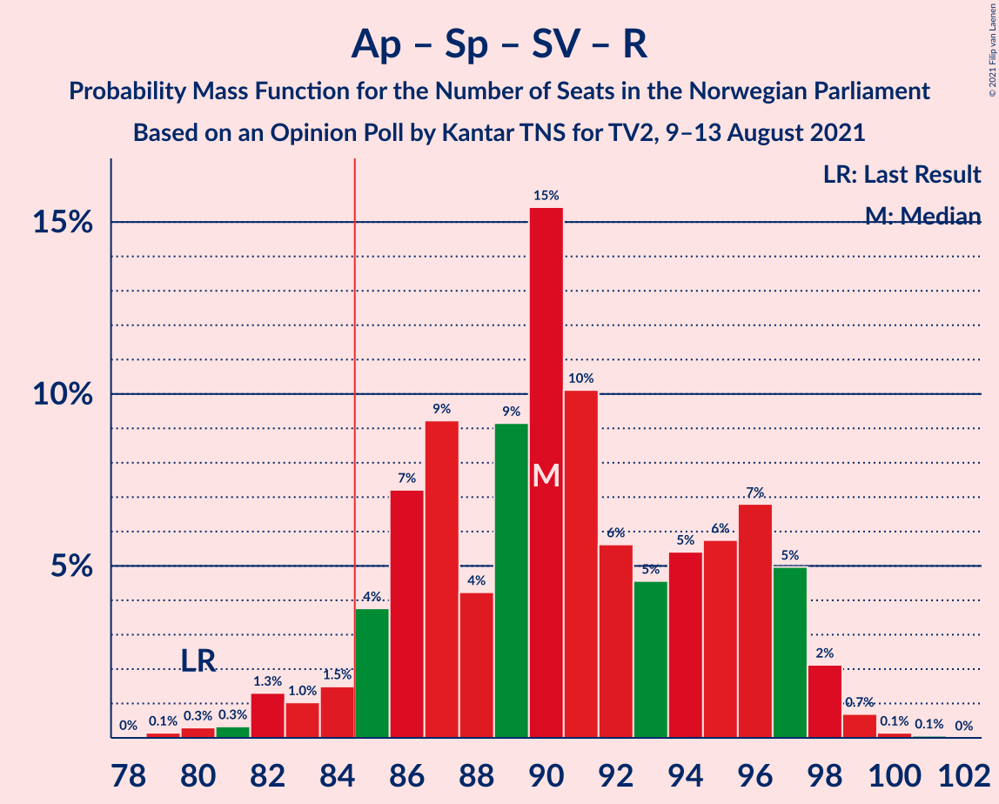

| Number of Seats | Probability | Accumulated | Special Marks |
|:---------------:|:-----------:|:-----------:|:-------------:|
| 78 | 0% | 100% |  |
| 79 | 0.1% | 99.9% |  |
| 80 | 0.3% | 99.8% | Last Result |
| 81 | 0.3% | 99.5% |  |
| 82 | 1.3% | 99.2% |  |
| 83 | 1.0% | 98% |  |
| 84 | 1.5% | 97% |  |
| 85 | 4% | 95% | Majority |
| 86 | 7% | 92% |  |
| 87 | 9% | 84% |  |
| 88 | 4% | 75% |  |
| 89 | 9% | 71% |  |
| 90 | 15% | 62% | Median |
| 91 | 10% | 46% |  |
| 92 | 6% | 36% |  |
| 93 | 5% | 31% |  |
| 94 | 5% | 26% |  |
| 95 | 6% | 21% |  |
| 96 | 7% | 15% |  |
| 97 | 5% | 8% |  |
| 98 | 2% | 3% |  |
| 99 | 0.7% | 0.9% |  |
| 100 | 0.1% | 0.2% |  |
| 101 | 0.1% | 0.1% |  |
| 102 | 0% | 0% |  |

### Høyre – Senterpartiet – Fremskrittspartiet – Kristelig Folkeparti – Venstre

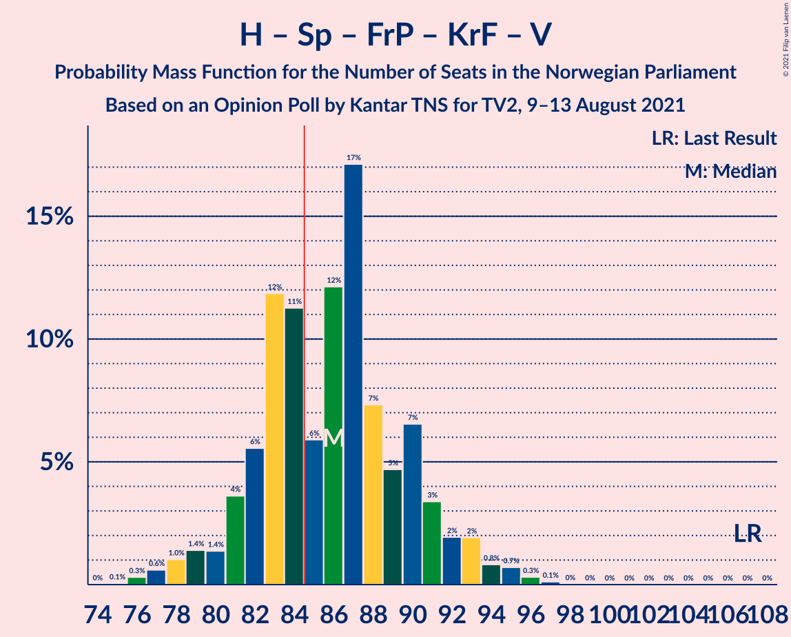

| Number of Seats | Probability | Accumulated | Special Marks |
|:---------------:|:-----------:|:-----------:|:-------------:|
| 75 | 0.1% | 100% |  |
| 76 | 0.3% | 99.9% |  |
| 77 | 0.6% | 99.6% |  |
| 78 | 1.0% | 99.0% |  |
| 79 | 1.4% | 98% |  |
| 80 | 1.4% | 97% |  |
| 81 | 4% | 95% |  |
| 82 | 6% | 92% |  |
| 83 | 12% | 86% |  |
| 84 | 11% | 74% |  |
| 85 | 6% | 63% | Median, Majority |
| 86 | 12% | 57% |  |
| 87 | 17% | 45% |  |
| 88 | 7% | 28% |  |
| 89 | 5% | 20% |  |
| 90 | 7% | 16% |  |
| 91 | 3% | 9% |  |
| 92 | 2% | 6% |  |
| 93 | 2% | 4% |  |
| 94 | 0.8% | 2% |  |
| 95 | 0.7% | 1.2% |  |
| 96 | 0.3% | 0.5% |  |
| 97 | 0.1% | 0.1% |  |
| 98 | 0% | 0% |  |
| 99 | 0% | 0% |  |
| 100 | 0% | 0% |  |
| 101 | 0% | 0% |  |
| 102 | 0% | 0% |  |
| 103 | 0% | 0% |  |
| 104 | 0% | 0% |  |
| 105 | 0% | 0% |  |
| 106 | 0% | 0% |  |
| 107 | 0% | 0% | Last Result |

### Arbeiderpartiet – Senterpartiet – Miljøpartiet De Grønne – Kristelig Folkeparti

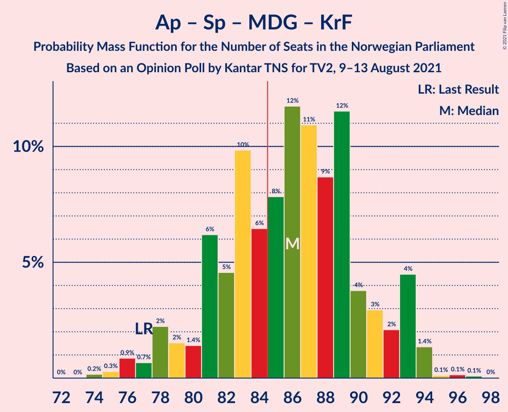

| Number of Seats | Probability | Accumulated | Special Marks |
|:---------------:|:-----------:|:-----------:|:-------------:|
| 74 | 0.2% | 100% |  |
| 75 | 0.3% | 99.8% |  |
| 76 | 0.9% | 99.5% |  |
| 77 | 0.7% | 98.6% | Last Result |
| 78 | 2% | 98% |  |
| 79 | 2% | 96% |  |
| 80 | 1.4% | 94% |  |
| 81 | 6% | 93% |  |
| 82 | 5% | 87% |  |
| 83 | 10% | 82% |  |
| 84 | 6% | 72% |  |
| 85 | 8% | 66% | Majority |
| 86 | 12% | 58% | Median |
| 87 | 11% | 46% |  |
| 88 | 9% | 35% |  |
| 89 | 12% | 27% |  |
| 90 | 4% | 15% |  |
| 91 | 3% | 11% |  |
| 92 | 2% | 8% |  |
| 93 | 4% | 6% |  |
| 94 | 1.4% | 2% |  |
| 95 | 0.1% | 0.4% |  |
| 96 | 0.1% | 0.3% |  |
| 97 | 0.1% | 0.1% |  |
| 98 | 0% | 0% |  |

### Arbeiderpartiet – Senterpartiet – Sosialistisk Venstreparti

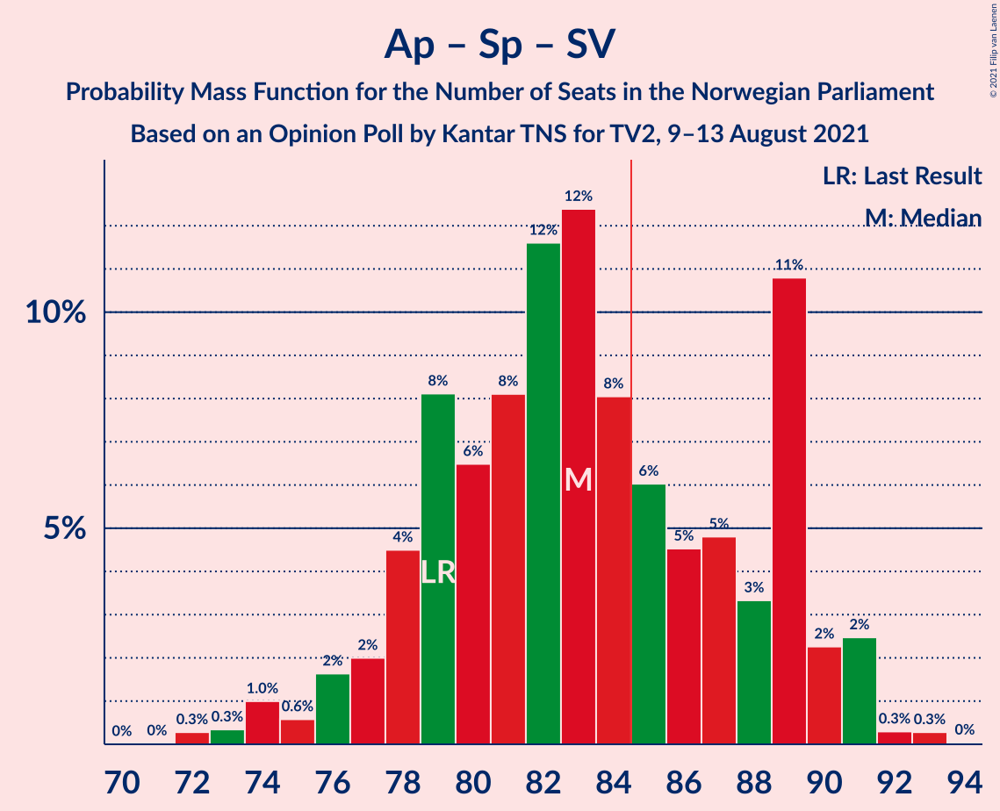

| Number of Seats | Probability | Accumulated | Special Marks |
|:---------------:|:-----------:|:-----------:|:-------------:|
| 72 | 0.3% | 100% |  |
| 73 | 0.3% | 99.7% |  |
| 74 | 1.0% | 99.3% |  |
| 75 | 0.6% | 98% |  |
| 76 | 2% | 98% |  |
| 77 | 2% | 96% |  |
| 78 | 4% | 94% |  |
| 79 | 8% | 90% | Last Result |
| 80 | 6% | 82% |  |
| 81 | 8% | 75% |  |
| 82 | 12% | 67% |  |
| 83 | 12% | 55% | Median |
| 84 | 8% | 43% |  |
| 85 | 6% | 35% | Majority |
| 86 | 5% | 29% |  |
| 87 | 5% | 24% |  |
| 88 | 3% | 19% |  |
| 89 | 11% | 16% |  |
| 90 | 2% | 5% |  |
| 91 | 2% | 3% |  |
| 92 | 0.3% | 0.6% |  |
| 93 | 0.3% | 0.3% |  |
| 94 | 0% | 0% |  |

### Arbeiderpartiet – Senterpartiet – Kristelig Folkeparti

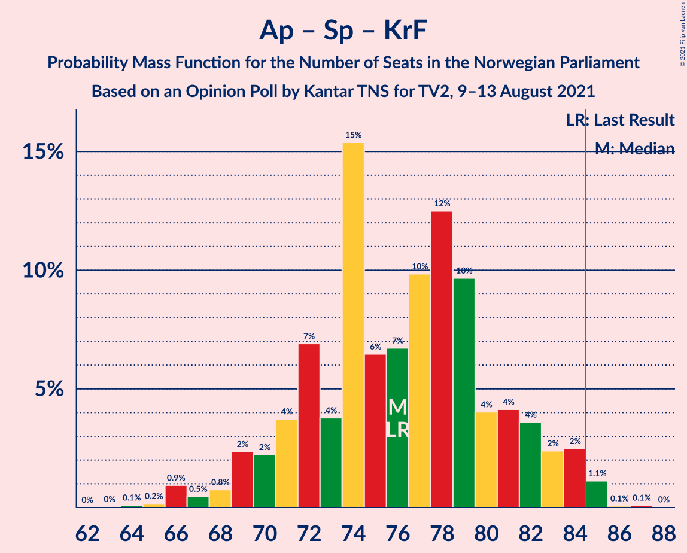

| Number of Seats | Probability | Accumulated | Special Marks |
|:---------------:|:-----------:|:-----------:|:-------------:|
| 63 | 0% | 100% |  |
| 64 | 0.1% | 99.9% |  |
| 65 | 0.2% | 99.8% |  |
| 66 | 0.9% | 99.7% |  |
| 67 | 0.5% | 98.7% |  |
| 68 | 0.8% | 98% |  |
| 69 | 2% | 98% |  |
| 70 | 2% | 95% |  |
| 71 | 4% | 93% |  |
| 72 | 7% | 89% |  |
| 73 | 4% | 82% |  |
| 74 | 15% | 79% |  |
| 75 | 6% | 63% |  |
| 76 | 7% | 57% | Last Result, Median |
| 77 | 10% | 50% |  |
| 78 | 12% | 40% |  |
| 79 | 10% | 28% |  |
| 80 | 4% | 18% |  |
| 81 | 4% | 14% |  |
| 82 | 4% | 10% |  |
| 83 | 2% | 6% |  |
| 84 | 2% | 4% |  |
| 85 | 1.1% | 1.3% | Majority |
| 86 | 0.1% | 0.2% |  |
| 87 | 0.1% | 0.1% |  |
| 88 | 0% | 0% |  |

### Arbeiderpartiet – Sosialistisk Venstreparti – Miljøpartiet De Grønne – Rødt

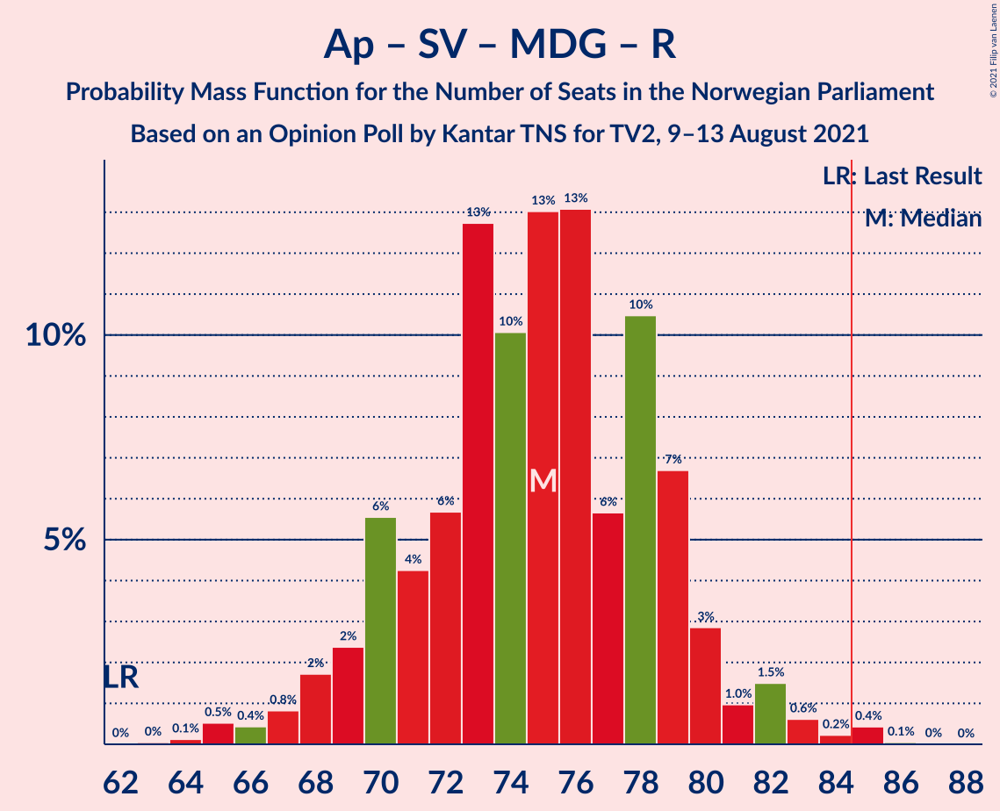

| Number of Seats | Probability | Accumulated | Special Marks |
|:---------------:|:-----------:|:-----------:|:-------------:|
| 62 | 0% | 100% | Last Result |
| 63 | 0% | 100% |  |
| 64 | 0.1% | 99.9% |  |
| 65 | 0.5% | 99.8% |  |
| 66 | 0.4% | 99.3% |  |
| 67 | 0.8% | 98.8% |  |
| 68 | 2% | 98% |  |
| 69 | 2% | 96% |  |
| 70 | 6% | 94% |  |
| 71 | 4% | 88% |  |
| 72 | 6% | 84% |  |
| 73 | 13% | 78% |  |
| 74 | 10% | 66% |  |
| 75 | 13% | 56% | Median |
| 76 | 13% | 43% |  |
| 77 | 6% | 30% |  |
| 78 | 10% | 24% |  |
| 79 | 7% | 13% |  |
| 80 | 3% | 7% |  |
| 81 | 1.0% | 4% |  |
| 82 | 1.5% | 3% |  |
| 83 | 0.6% | 1.3% |  |
| 84 | 0.2% | 0.7% |  |
| 85 | 0.4% | 0.5% | Majority |
| 86 | 0.1% | 0.1% |  |
| 87 | 0% | 0% |  |

### Høyre – Fremskrittspartiet – Miljøpartiet De Grønne – Kristelig Folkeparti – Venstre

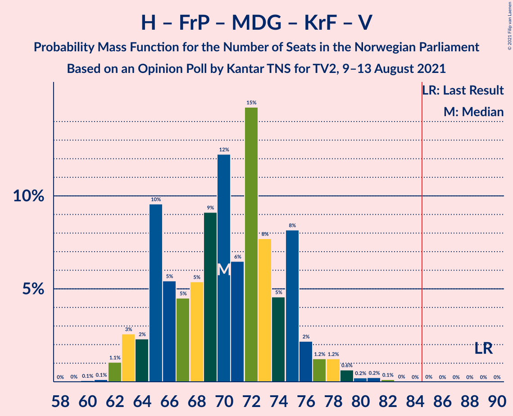

| Number of Seats | Probability | Accumulated | Special Marks |
|:---------------:|:-----------:|:-----------:|:-------------:|
| 60 | 0.1% | 100% |  |
| 61 | 0.1% | 99.9% |  |
| 62 | 1.1% | 99.8% |  |
| 63 | 3% | 98.7% |  |
| 64 | 2% | 96% |  |
| 65 | 10% | 94% |  |
| 66 | 5% | 84% |  |
| 67 | 5% | 79% |  |
| 68 | 5% | 74% |  |
| 69 | 9% | 69% |  |
| 70 | 12% | 60% | Median |
| 71 | 6% | 48% |  |
| 72 | 15% | 41% |  |
| 73 | 8% | 26% |  |
| 74 | 5% | 19% |  |
| 75 | 8% | 14% |  |
| 76 | 2% | 6% |  |
| 77 | 1.2% | 4% |  |
| 78 | 1.2% | 2% |  |
| 79 | 0.6% | 1.2% |  |
| 80 | 0.2% | 0.6% |  |
| 81 | 0.2% | 0.4% |  |
| 82 | 0.1% | 0.2% |  |
| 83 | 0% | 0.1% |  |
| 84 | 0% | 0% |  |
| 85 | 0% | 0% | Majority |
| 86 | 0% | 0% |  |
| 87 | 0% | 0% |  |
| 88 | 0% | 0% |  |
| 89 | 0% | 0% | Last Result |

### Arbeiderpartiet – Senterpartiet

| Number of Seats | Probability | Accumulated | Special Marks |
|:---------------:|:-----------:|:-----------:|:-------------:|
| 58 | 0.2% | 100% |  |
| 59 | 1.3% | 99.8% |  |
| 60 | 1.0% | 98% |  |
| 61 | 2% | 97% |  |
| 62 | 2% | 95% |  |
| 63 | 6% | 93% |  |
| 64 | 4% | 87% |  |
| 65 | 9% | 83% |  |
| 66 | 5% | 75% |  |
| 67 | 8% | 69% |  |
| 68 | 9% | 61% | Last Result, Median |
| 69 | 9% | 52% |  |
| 70 | 13% | 43% |  |
| 71 | 3% | 30% |  |
| 72 | 9% | 27% |  |
| 73 | 5% | 18% |  |
| 74 | 4% | 13% |  |
| 75 | 3% | 9% |  |
| 76 | 2% | 5% |  |
| 77 | 2% | 4% |  |
| 78 | 2% | 2% |  |
| 79 | 0.1% | 0.2% |  |
| 80 | 0.1% | 0.1% |  |
| 81 | 0% | 0% |  |

### Høyre – Fremskrittspartiet – Kristelig Folkeparti – Venstre

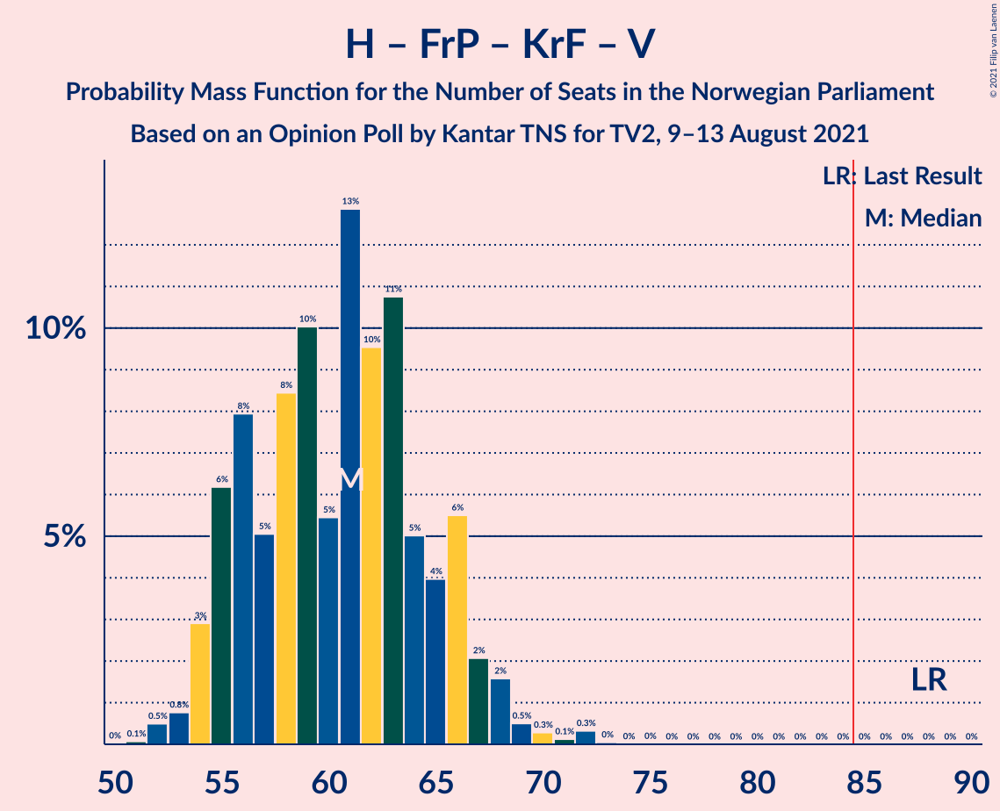

| Number of Seats | Probability | Accumulated | Special Marks |
|:---------------:|:-----------:|:-----------:|:-------------:|
| 51 | 0.1% | 100% |  |
| 52 | 0.5% | 99.9% |  |
| 53 | 0.8% | 99.4% |  |
| 54 | 3% | 98.6% |  |
| 55 | 6% | 96% |  |
| 56 | 8% | 90% |  |
| 57 | 5% | 82% |  |
| 58 | 8% | 77% |  |
| 59 | 10% | 68% |  |
| 60 | 5% | 58% | Median |
| 61 | 13% | 53% |  |
| 62 | 10% | 40% |  |
| 63 | 11% | 30% |  |
| 64 | 5% | 19% |  |
| 65 | 4% | 14% |  |
| 66 | 6% | 10% |  |
| 67 | 2% | 5% |  |
| 68 | 2% | 3% |  |
| 69 | 0.5% | 1.3% |  |
| 70 | 0.3% | 0.8% |  |
| 71 | 0.1% | 0.5% |  |
| 72 | 0.3% | 0.4% |  |
| 73 | 0% | 0.1% |  |
| 74 | 0% | 0% |  |
| 75 | 0% | 0% |  |
| 76 | 0% | 0% |  |
| 77 | 0% | 0% |  |
| 78 | 0% | 0% |  |
| 79 | 0% | 0% |  |
| 80 | 0% | 0% |  |
| 81 | 0% | 0% |  |
| 82 | 0% | 0% |  |
| 83 | 0% | 0% |  |
| 84 | 0% | 0% |  |
| 85 | 0% | 0% | Majority |
| 86 | 0% | 0% |  |
| 87 | 0% | 0% |  |
| 88 | 0% | 0% | Last Result |

### Arbeiderpartiet – Sosialistisk Venstreparti

| Number of Seats | Probability | Accumulated | Special Marks |
|:---------------:|:-----------:|:-----------:|:-------------:|
| 48 | 0.1% | 100% |  |
| 49 | 0.2% | 99.9% |  |
| 50 | 0.4% | 99.8% |  |
| 51 | 1.4% | 99.4% |  |
| 52 | 3% | 98% |  |
| 53 | 3% | 95% |  |
| 54 | 4% | 92% |  |
| 55 | 13% | 88% |  |
| 56 | 8% | 75% |  |
| 57 | 12% | 67% |  |
| 58 | 15% | 55% | Median |
| 59 | 15% | 41% |  |
| 60 | 6% | 26% | Last Result |
| 61 | 6% | 20% |  |
| 62 | 6% | 14% |  |
| 63 | 3% | 7% |  |
| 64 | 2% | 4% |  |
| 65 | 0.6% | 1.4% |  |
| 66 | 0.6% | 0.8% |  |
| 67 | 0.2% | 0.3% |  |
| 68 | 0% | 0.1% |  |
| 69 | 0% | 0.1% |  |
| 70 | 0% | 0% |  |

### Høyre – Fremskrittspartiet – Venstre

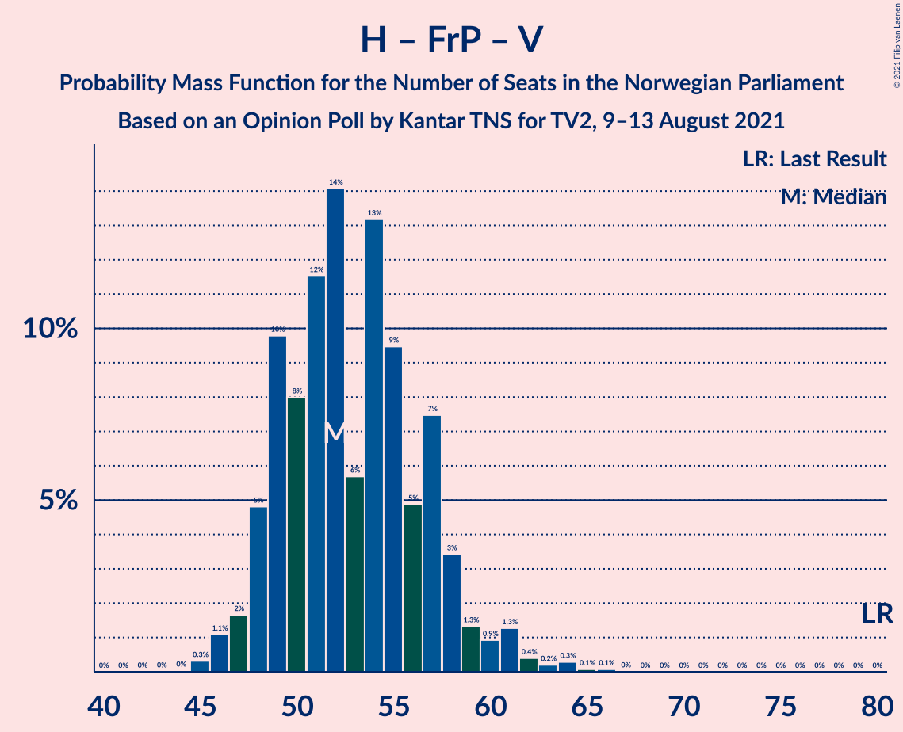

| Number of Seats | Probability | Accumulated | Special Marks |
|:---------------:|:-----------:|:-----------:|:-------------:|
| 44 | 0% | 100% |  |
| 45 | 0.3% | 99.9% |  |
| 46 | 1.1% | 99.6% |  |
| 47 | 2% | 98.5% |  |
| 48 | 5% | 97% |  |
| 49 | 10% | 92% |  |
| 50 | 8% | 82% |  |
| 51 | 12% | 74% |  |
| 52 | 14% | 63% | Median |
| 53 | 6% | 49% |  |
| 54 | 13% | 43% |  |
| 55 | 9% | 30% |  |
| 56 | 5% | 20% |  |
| 57 | 7% | 15% |  |
| 58 | 3% | 8% |  |
| 59 | 1.3% | 5% |  |
| 60 | 0.9% | 3% |  |
| 61 | 1.3% | 2% |  |
| 62 | 0.4% | 1.0% |  |
| 63 | 0.2% | 0.6% |  |
| 64 | 0.3% | 0.4% |  |
| 65 | 0.1% | 0.2% |  |
| 66 | 0.1% | 0.1% |  |
| 67 | 0% | 0% |  |
| 68 | 0% | 0% |  |
| 69 | 0% | 0% |  |
| 70 | 0% | 0% |  |
| 71 | 0% | 0% |  |
| 72 | 0% | 0% |  |
| 73 | 0% | 0% |  |
| 74 | 0% | 0% |  |
| 75 | 0% | 0% |  |
| 76 | 0% | 0% |  |
| 77 | 0% | 0% |  |
| 78 | 0% | 0% |  |
| 79 | 0% | 0% |  |
| 80 | 0% | 0% | Last Result |

### Høyre – Fremskrittspartiet

| Number of Seats | Probability | Accumulated | Special Marks |
|:---------------:|:-----------:|:-----------:|:-------------:|
| 42 | 0.1% | 100% |  |
| 43 | 0.4% | 99.9% |  |
| 44 | 2% | 99.4% |  |
| 45 | 4% | 97% |  |
| 46 | 12% | 94% |  |
| 47 | 6% | 82% |  |
| 48 | 8% | 76% |  |
| 49 | 12% | 68% |  |
| 50 | 13% | 56% | Median |
| 51 | 6% | 43% |  |
| 52 | 12% | 36% |  |
| 53 | 9% | 24% |  |
| 54 | 4% | 15% |  |
| 55 | 6% | 11% |  |
| 56 | 2% | 5% |  |
| 57 | 0.9% | 3% |  |
| 58 | 0.7% | 2% |  |
| 59 | 0.9% | 1.4% |  |
| 60 | 0.4% | 0.5% |  |
| 61 | 0.1% | 0.2% |  |
| 62 | 0% | 0.1% |  |
| 63 | 0% | 0% |  |
| 64 | 0% | 0% |  |
| 65 | 0% | 0% |  |
| 66 | 0% | 0% |  |
| 67 | 0% | 0% |  |
| 68 | 0% | 0% |  |
| 69 | 0% | 0% |  |
| 70 | 0% | 0% |  |
| 71 | 0% | 0% |  |
| 72 | 0% | 0% | Last Result |

### Høyre – Kristelig Folkeparti – Venstre

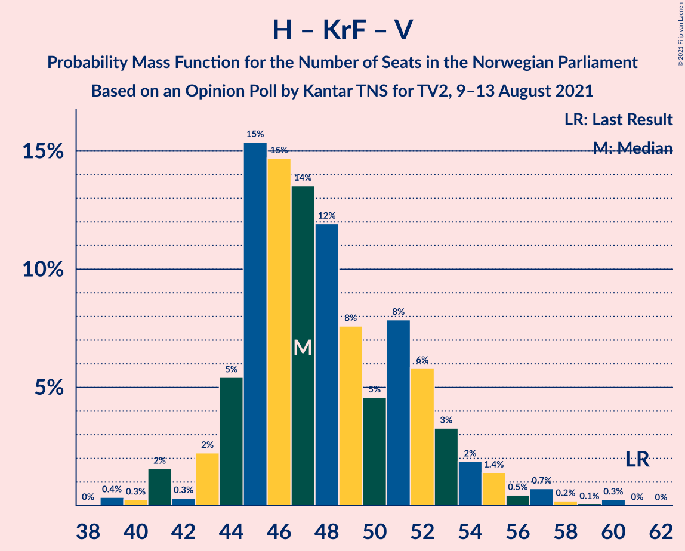

| Number of Seats | Probability | Accumulated | Special Marks |
|:---------------:|:-----------:|:-----------:|:-------------:|
| 39 | 0.4% | 100% |  |
| 40 | 0.3% | 99.6% |  |
| 41 | 2% | 99.3% |  |
| 42 | 0.3% | 98% |  |
| 43 | 2% | 97% |  |
| 44 | 5% | 95% |  |
| 45 | 15% | 90% |  |
| 46 | 15% | 74% |  |
| 47 | 14% | 60% | Median |
| 48 | 12% | 46% |  |
| 49 | 8% | 34% |  |
| 50 | 5% | 27% |  |
| 51 | 8% | 22% |  |
| 52 | 6% | 14% |  |
| 53 | 3% | 8% |  |
| 54 | 2% | 5% |  |
| 55 | 1.4% | 3% |  |
| 56 | 0.5% | 2% |  |
| 57 | 0.7% | 1.3% |  |
| 58 | 0.2% | 0.6% |  |
| 59 | 0.1% | 0.4% |  |
| 60 | 0.3% | 0.3% |  |
| 61 | 0% | 0.1% | Last Result |
| 62 | 0% | 0% |  |

### Senterpartiet – Kristelig Folkeparti – Venstre

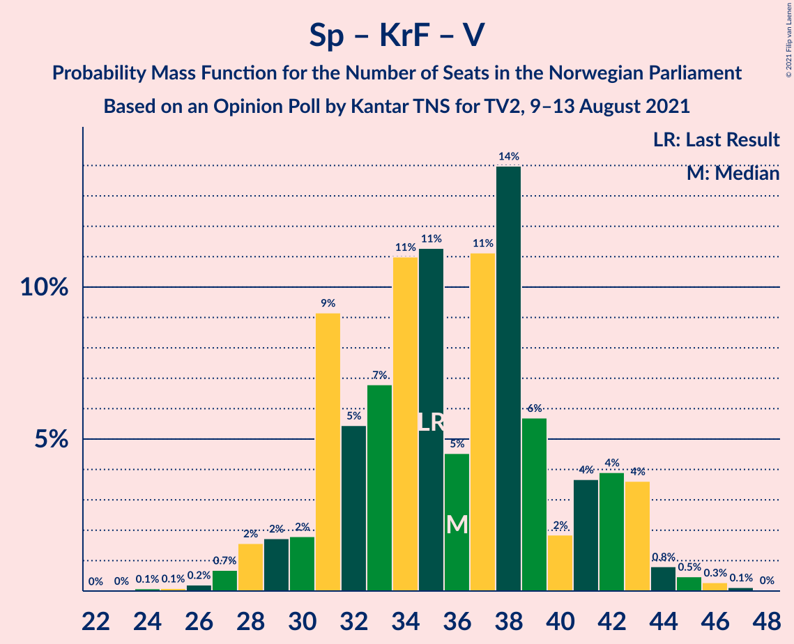

| Number of Seats | Probability | Accumulated | Special Marks |
|:---------------:|:-----------:|:-----------:|:-------------:|
| 24 | 0.1% | 100% |  |
| 25 | 0.1% | 99.9% |  |
| 26 | 0.2% | 99.8% |  |
| 27 | 0.7% | 99.6% |  |
| 28 | 2% | 98.9% |  |
| 29 | 2% | 97% |  |
| 30 | 2% | 96% |  |
| 31 | 9% | 94% |  |
| 32 | 5% | 85% |  |
| 33 | 7% | 79% |  |
| 34 | 11% | 72% |  |
| 35 | 11% | 61% | Last Result, Median |
| 36 | 5% | 50% |  |
| 37 | 11% | 46% |  |
| 38 | 14% | 34% |  |
| 39 | 6% | 20% |  |
| 40 | 2% | 15% |  |
| 41 | 4% | 13% |  |
| 42 | 4% | 9% |  |
| 43 | 4% | 5% |  |
| 44 | 0.8% | 2% |  |
| 45 | 0.5% | 0.9% |  |
| 46 | 0.3% | 0.5% |  |
| 47 | 0.1% | 0.2% |  |
| 48 | 0% | 0% |  |

## Technical Information

### Opinion Poll

+ **Polling firm:** Kantar TNS
+ **Commissioner(s):** TV2
+ **Fieldwork period:** 9–13 August 2021

### Calculations

+ **Sample size:** 983
+ **Simulations done:** 1,048,576
+ **Error estimate:** 1.94%

