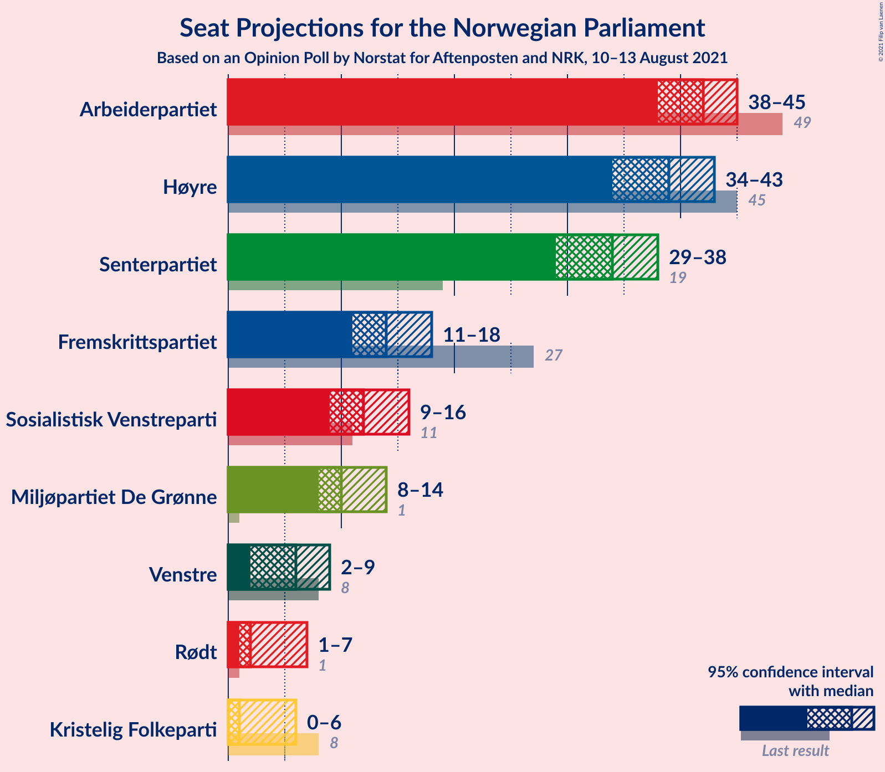

# Opinion Poll by Norstat for Aftenposten and NRK, 10–13 August 2021

<a href="#voting-intentions">Voting Intentions</a> | <a href="#seats">Seats</a> | <a href="#coalitions">Coalitions</a> | <a href="#technical-information">Technical Information</a>

## Voting Intentions

### Confidence Intervals

| Party | Last Result | Poll Result | 80% Confidence Interval | 90% Confidence Interval | 95% Confidence Interval | 99% Confidence Interval |
|:-----:|:-----------:|:-----------:|:-----------------------:|:-----------------------:|:-----------------------:|:-----------------------:|
| Arbeiderpartiet | 27.4% | 22.2% | 20.5–24.0% |20.0–24.5% |19.6–24.9% |18.8–25.8% |
| Høyre | 25.0% | 21.9% | 20.3–23.7% |19.8–24.2% |19.4–24.7% |18.6–25.6% |
| Senterpartiet | 10.3% | 17.1% | 15.6–18.7% |15.2–19.2% |14.8–19.6% |14.1–20.4% |
| Fremskrittspartiet | 15.2% | 8.6% | 7.6–9.9% |7.3–10.3% |7.0–10.6% |6.5–11.3% |
| Sosialistisk Venstreparti | 6.0% | 7.6% | 6.6–8.8% |6.3–9.2% |6.1–9.5% |5.6–10.1% |
| Miljøpartiet De Grønne | 3.2% | 6.8% | 5.8–7.9% |5.5–8.2% |5.3–8.5% |4.9–9.1% |
| Venstre | 4.4% | 4.1% | 3.4–5.1% |3.2–5.3% |3.0–5.6% |2.7–6.1% |
| Rødt | 2.4% | 3.2% | 2.5–4.0% |2.4–4.3% |2.2–4.5% |2.0–4.9% |
| Kristelig Folkeparti | 4.2% | 2.8% | 2.3–3.7% |2.1–3.9% |2.0–4.1% |1.7–4.6% |

*Note:* The poll result column reflects the actual value used in the calculations. Published results may vary slightly, and in addition be rounded to fewer digits.

## Seats

### Confidence Intervals

| Party | Last Result | Median | 80% Confidence Interval | 90% Confidence Interval | 95% Confidence Interval | 99% Confidence Interval |
|:-----:|:-----------:|:------:|:-----------------------:|:-----------------------:|:-----------------------:|:-----------------------:|
| <a href="#arbeiderpartiet">Arbeiderpartiet</a> | 49 | 42 | 39–44 |38–45 |38–45 |35–47 |
| <a href="#høyre">Høyre</a> | 45 | 39 | 35–41 |34–42 |34–43 |33–45 |
| <a href="#senterpartiet">Senterpartiet</a> | 19 | 34 | 31–36 |30–37 |29–38 |26–38 |
| <a href="#fremskrittspartiet">Fremskrittspartiet</a> | 27 | 14 | 12–16 |11–17 |11–18 |10–19 |
| <a href="#sosialistisk-venstreparti">Sosialistisk Venstreparti</a> | 11 | 12 | 10–14 |9–15 |9–16 |8–16 |
| <a href="#miljøpartiet-de-grønne">Miljøpartiet De Grønne</a> | 1 | 10 | 9–13 |9–13 |8–14 |7–15 |
| <a href="#venstre">Venstre</a> | 8 | 6 | 2–8 |2–8 |2–9 |2–9 |
| <a href="#rødt">Rødt</a> | 1 | 2 | 1–2 |1–6 |1–7 |1–7 |
| <a href="#kristelig-folkeparti">Kristelig Folkeparti</a> | 8 | 1 | 0–3 |0–3 |0–6 |0–7 |

### Arbeiderpartiet

*For a full overview of the results for this party, see the [Arbeiderpartiet](party-arbeiderpartiet.html) page.*

| Number of Seats | Probability | Accumulated | Special Marks |
|:---------------:|:-----------:|:-----------:|:-------------:|
| 33 | 0.1% | 100% |  |
| 34 | 0.1% | 99.9% |  |
| 35 | 0.3% | 99.8% |  |
| 36 | 0.4% | 99.5% |  |
| 37 | 1.0% | 99.1% |  |
| 38 | 5% | 98% |  |
| 39 | 10% | 93% |  |
| 40 | 11% | 83% |  |
| 41 | 11% | 72% |  |
| 42 | 14% | 62% | Median |
| 43 | 19% | 48% |  |
| 44 | 21% | 29% |  |
| 45 | 6% | 7% |  |
| 46 | 1.2% | 2% |  |
| 47 | 0.2% | 0.6% |  |
| 48 | 0.1% | 0.4% |  |
| 49 | 0.1% | 0.3% | Last Result |
| 50 | 0.1% | 0.1% |  |
| 51 | 0% | 0.1% |  |
| 52 | 0% | 0% |  |

### Høyre

*For a full overview of the results for this party, see the [Høyre](party-høyre.html) page.*

| Number of Seats | Probability | Accumulated | Special Marks |
|:---------------:|:-----------:|:-----------:|:-------------:|
| 31 | 0.1% | 100% |  |
| 32 | 0.1% | 99.9% |  |
| 33 | 0.6% | 99.8% |  |
| 34 | 8% | 99.3% |  |
| 35 | 12% | 91% |  |
| 36 | 8% | 79% |  |
| 37 | 5% | 71% |  |
| 38 | 5% | 66% |  |
| 39 | 18% | 60% | Median |
| 40 | 14% | 42% |  |
| 41 | 21% | 28% |  |
| 42 | 3% | 7% |  |
| 43 | 2% | 4% |  |
| 44 | 1.1% | 2% |  |
| 45 | 0.5% | 1.0% | Last Result |
| 46 | 0.2% | 0.5% |  |
| 47 | 0.1% | 0.2% |  |
| 48 | 0.1% | 0.1% |  |
| 49 | 0% | 0.1% |  |
| 50 | 0% | 0% |  |

### Senterpartiet

*For a full overview of the results for this party, see the [Senterpartiet](party-senterpartiet.html) page.*

| Number of Seats | Probability | Accumulated | Special Marks |
|:---------------:|:-----------:|:-----------:|:-------------:|
| 19 | 0% | 100% | Last Result |
| 20 | 0% | 100% |  |
| 21 | 0% | 100% |  |
| 22 | 0% | 100% |  |
| 23 | 0% | 100% |  |
| 24 | 0% | 100% |  |
| 25 | 0.1% | 99.9% |  |
| 26 | 0.4% | 99.8% |  |
| 27 | 0.5% | 99.4% |  |
| 28 | 1.0% | 98.9% |  |
| 29 | 2% | 98% |  |
| 30 | 4% | 96% |  |
| 31 | 4% | 91% |  |
| 32 | 14% | 88% |  |
| 33 | 13% | 74% |  |
| 34 | 19% | 61% | Median |
| 35 | 19% | 42% |  |
| 36 | 15% | 23% |  |
| 37 | 5% | 7% |  |
| 38 | 2% | 3% |  |
| 39 | 0.3% | 0.4% |  |
| 40 | 0.1% | 0.1% |  |
| 41 | 0% | 0% |  |

### Fremskrittspartiet

*For a full overview of the results for this party, see the [Fremskrittspartiet](party-fremskrittspartiet.html) page.*

| Number of Seats | Probability | Accumulated | Special Marks |
|:---------------:|:-----------:|:-----------:|:-------------:|
| 9 | 0.3% | 100% |  |
| 10 | 2% | 99.6% |  |
| 11 | 6% | 98% |  |
| 12 | 18% | 92% |  |
| 13 | 13% | 74% |  |
| 14 | 24% | 61% | Median |
| 15 | 17% | 37% |  |
| 16 | 11% | 20% |  |
| 17 | 5% | 9% |  |
| 18 | 3% | 3% |  |
| 19 | 0.5% | 0.7% |  |
| 20 | 0.1% | 0.2% |  |
| 21 | 0% | 0.1% |  |
| 22 | 0% | 0% |  |
| 23 | 0% | 0% |  |
| 24 | 0% | 0% |  |
| 25 | 0% | 0% |  |
| 26 | 0% | 0% |  |
| 27 | 0% | 0% | Last Result |

### Sosialistisk Venstreparti

*For a full overview of the results for this party, see the [Sosialistisk Venstreparti](party-sosialistiskvenstreparti.html) page.*

| Number of Seats | Probability | Accumulated | Special Marks |
|:---------------:|:-----------:|:-----------:|:-------------:|
| 7 | 0.1% | 100% |  |
| 8 | 0.7% | 99.9% |  |
| 9 | 5% | 99.3% |  |
| 10 | 10% | 94% |  |
| 11 | 21% | 84% | Last Result |
| 12 | 23% | 64% | Median |
| 13 | 22% | 41% |  |
| 14 | 11% | 18% |  |
| 15 | 3% | 8% |  |
| 16 | 4% | 4% |  |
| 17 | 0.3% | 0.5% |  |
| 18 | 0.1% | 0.1% |  |
| 19 | 0% | 0% |  |

### Miljøpartiet De Grønne

*For a full overview of the results for this party, see the [Miljøpartiet De Grønne](party-miljøpartietdegrønne.html) page.*

| Number of Seats | Probability | Accumulated | Special Marks |
|:---------------:|:-----------:|:-----------:|:-------------:|
| 1 | 0% | 100% | Last Result |
| 2 | 0% | 100% |  |
| 3 | 0% | 100% |  |
| 4 | 0% | 100% |  |
| 5 | 0% | 100% |  |
| 6 | 0% | 100% |  |
| 7 | 0.8% | 100% |  |
| 8 | 3% | 99.1% |  |
| 9 | 23% | 96% |  |
| 10 | 25% | 73% | Median |
| 11 | 19% | 48% |  |
| 12 | 17% | 29% |  |
| 13 | 9% | 13% |  |
| 14 | 3% | 4% |  |
| 15 | 0.9% | 1.1% |  |
| 16 | 0.1% | 0.1% |  |
| 17 | 0% | 0% |  |

### Venstre

*For a full overview of the results for this party, see the [Venstre](party-venstre.html) page.*

| Number of Seats | Probability | Accumulated | Special Marks |
|:---------------:|:-----------:|:-----------:|:-------------:|
| 2 | 31% | 100% |  |
| 3 | 7% | 69% |  |
| 4 | 0.5% | 62% |  |
| 5 | 0.1% | 61% |  |
| 6 | 17% | 61% | Median |
| 7 | 24% | 45% |  |
| 8 | 18% | 20% | Last Result |
| 9 | 2% | 3% |  |
| 10 | 0.2% | 0.3% |  |
| 11 | 0% | 0% |  |

### Rødt

*For a full overview of the results for this party, see the [Rødt](party-rødt.html) page.*

| Number of Seats | Probability | Accumulated | Special Marks |
|:---------------:|:-----------:|:-----------:|:-------------:|
| 1 | 33% | 100% | Last Result |
| 2 | 57% | 67% | Median |
| 3 | 0.1% | 10% |  |
| 4 | 0% | 10% |  |
| 5 | 0.6% | 10% |  |
| 6 | 5% | 9% |  |
| 7 | 4% | 4% |  |
| 8 | 0.3% | 0.4% |  |
| 9 | 0% | 0% |  |

### Kristelig Folkeparti

*For a full overview of the results for this party, see the [Kristelig Folkeparti](party-kristeligfolkeparti.html) page.*

| Number of Seats | Probability | Accumulated | Special Marks |
|:---------------:|:-----------:|:-----------:|:-------------:|
| 0 | 11% | 100% |  |
| 1 | 44% | 89% | Median |
| 2 | 12% | 45% |  |
| 3 | 30% | 33% |  |
| 4 | 0% | 3% |  |
| 5 | 0% | 3% |  |
| 6 | 2% | 3% |  |
| 7 | 0.7% | 0.8% |  |
| 8 | 0.1% | 0.1% | Last Result |
| 9 | 0% | 0% |  |

## Coalitions

### Confidence Intervals

| Coalition | Last Result | Median | Majority? | 80% Confidence Interval | 90% Confidence Interval | 95% Confidence Interval | 99% Confidence Interval |
|:---------:|:-----------:|:------:|:---------:|:-----------------------:|:-----------------------:|:-----------------------:|:-----------------------:|
| Arbeiderpartiet – Senterpartiet – Sosialistisk Venstreparti – Miljøpartiet De Grønne – Kristelig Folkeparti | 88 | 100 | 100% | 96–104 | 95–106 | 94–107 | 91–108 |
| Arbeiderpartiet – Senterpartiet – Sosialistisk Venstreparti – Miljøpartiet De Grønne – Rødt | 81 | 101 | 100% | 97–105 | 95–106 | 94–107 | 92–109 |
| Arbeiderpartiet – Senterpartiet – Sosialistisk Venstreparti – Miljøpartiet De Grønne | 80 | 98 | 100% | 95–103 | 93–104 | 92–105 | 89–106 |
| Høyre – Senterpartiet – Fremskrittspartiet – Venstre – Kristelig Folkeparti | 107 | 93 | 99.7% | 89–97 | 88–99 | 87–99 | 85–101 |
| Arbeiderpartiet – Senterpartiet – Sosialistisk Venstreparti – Rødt | 80 | 90 | 96% | 86–94 | 85–95 | 83–95 | 81–97 |
| Arbeiderpartiet – Senterpartiet – Miljøpartiet De Grønne – Kristelig Folkeparti | 77 | 88 | 88% | 84–92 | 83–94 | 81–94 | 79–96 |
| Arbeiderpartiet – Senterpartiet – Sosialistisk Venstreparti | 79 | 88 | 88% | 84–92 | 83–92 | 81–93 | 79–94 |
| Arbeiderpartiet – Senterpartiet – Kristelig Folkeparti | 76 | 78 | 0.4% | 73–82 | 72–82 | 70–83 | 68–84 |
| Arbeiderpartiet – Senterpartiet | 68 | 76 | 0% | 72–79 | 70–80 | 68–80 | 66–82 |
| Høyre – Fremskrittspartiet – Miljøpartiet De Grønne – Venstre – Kristelig Folkeparti | 89 | 70 | 0% | 66–74 | 65–75 | 64–76 | 63–80 |
| Arbeiderpartiet – Sosialistisk Venstreparti – Miljøpartiet De Grønne – Rødt | 62 | 67 | 0% | 63–71 | 62–72 | 61–73 | 59–75 |
| Høyre – Fremskrittspartiet – Venstre – Kristelig Folkeparti | 88 | 59 | 0% | 55–64 | 53–65 | 53–66 | 51–69 |
| Høyre – Fremskrittspartiet – Venstre | 80 | 58 | 0% | 53–63 | 52–63 | 51–64 | 50–66 |
| Arbeiderpartiet – Sosialistisk Venstreparti | 60 | 54 | 0% | 51–57 | 49–58 | 49–59 | 47–61 |
| Høyre – Fremskrittspartiet | 72 | 53 | 0% | 48–56 | 48–57 | 47–59 | 46–60 |
| Høyre – Venstre – Kristelig Folkeparti | 61 | 46 | 0% | 41–50 | 39–51 | 38–52 | 37–54 |
| Senterpartiet – Venstre – Kristelig Folkeparti | 35 | 41 | 0% | 37–45 | 35–45 | 34–46 | 31–48 |

### Arbeiderpartiet – Senterpartiet – Sosialistisk Venstreparti – Miljøpartiet De Grønne – Kristelig Folkeparti

| Number of Seats | Probability | Accumulated | Special Marks |
|:---------------:|:-----------:|:-----------:|:-------------:|
| 88 | 0% | 100% | Last Result |
| 89 | 0.1% | 100% |  |
| 90 | 0.2% | 99.9% |  |
| 91 | 0.4% | 99.6% |  |
| 92 | 0.6% | 99.2% |  |
| 93 | 1.1% | 98.7% |  |
| 94 | 2% | 98% |  |
| 95 | 3% | 96% |  |
| 96 | 4% | 93% |  |
| 97 | 12% | 88% |  |
| 98 | 8% | 77% |  |
| 99 | 13% | 69% | Median |
| 100 | 9% | 56% |  |
| 101 | 11% | 47% |  |
| 102 | 6% | 36% |  |
| 103 | 10% | 30% |  |
| 104 | 11% | 20% |  |
| 105 | 3% | 10% |  |
| 106 | 4% | 7% |  |
| 107 | 2% | 3% |  |
| 108 | 0.6% | 1.0% |  |
| 109 | 0.2% | 0.3% |  |
| 110 | 0% | 0.1% |  |
| 111 | 0.1% | 0.1% |  |
| 112 | 0% | 0% |  |

### Arbeiderpartiet – Senterpartiet – Sosialistisk Venstreparti – Miljøpartiet De Grønne – Rødt

| Number of Seats | Probability | Accumulated | Special Marks |
|:---------------:|:-----------:|:-----------:|:-------------:|
| 81 | 0% | 100% | Last Result |
| 82 | 0% | 100% |  |
| 83 | 0% | 100% |  |
| 84 | 0% | 100% |  |
| 85 | 0% | 100% | Majority |
| 86 | 0% | 100% |  |
| 87 | 0% | 100% |  |
| 88 | 0% | 100% |  |
| 89 | 0% | 100% |  |
| 90 | 0.1% | 99.9% |  |
| 91 | 0.2% | 99.8% |  |
| 92 | 0.7% | 99.6% |  |
| 93 | 0.5% | 98.9% |  |
| 94 | 2% | 98% |  |
| 95 | 2% | 96% |  |
| 96 | 3% | 94% |  |
| 97 | 13% | 91% |  |
| 98 | 10% | 78% |  |
| 99 | 7% | 69% |  |
| 100 | 11% | 61% | Median |
| 101 | 6% | 50% |  |
| 102 | 13% | 44% |  |
| 103 | 9% | 31% |  |
| 104 | 9% | 23% |  |
| 105 | 6% | 13% |  |
| 106 | 3% | 7% |  |
| 107 | 3% | 4% |  |
| 108 | 0.4% | 0.9% |  |
| 109 | 0.4% | 0.5% |  |
| 110 | 0.1% | 0.2% |  |
| 111 | 0% | 0% |  |

### Arbeiderpartiet – Senterpartiet – Sosialistisk Venstreparti – Miljøpartiet De Grønne

| Number of Seats | Probability | Accumulated | Special Marks |
|:---------------:|:-----------:|:-----------:|:-------------:|
| 80 | 0% | 100% | Last Result |
| 81 | 0% | 100% |  |
| 82 | 0% | 100% |  |
| 83 | 0% | 100% |  |
| 84 | 0% | 100% |  |
| 85 | 0% | 100% | Majority |
| 86 | 0% | 100% |  |
| 87 | 0.1% | 99.9% |  |
| 88 | 0.1% | 99.9% |  |
| 89 | 0.3% | 99.8% |  |
| 90 | 0.8% | 99.5% |  |
| 91 | 0.6% | 98.6% |  |
| 92 | 2% | 98% |  |
| 93 | 2% | 96% |  |
| 94 | 3% | 94% |  |
| 95 | 5% | 90% |  |
| 96 | 14% | 86% |  |
| 97 | 14% | 71% |  |
| 98 | 11% | 57% | Median |
| 99 | 5% | 47% |  |
| 100 | 15% | 42% |  |
| 101 | 5% | 27% |  |
| 102 | 9% | 22% |  |
| 103 | 6% | 13% |  |
| 104 | 2% | 6% |  |
| 105 | 3% | 4% |  |
| 106 | 0.3% | 0.8% |  |
| 107 | 0.4% | 0.5% |  |
| 108 | 0.1% | 0.1% |  |
| 109 | 0% | 0% |  |

### Høyre – Senterpartiet – Fremskrittspartiet – Venstre – Kristelig Folkeparti

| Number of Seats | Probability | Accumulated | Special Marks |
|:---------------:|:-----------:|:-----------:|:-------------:|
| 82 | 0.1% | 100% |  |
| 83 | 0.1% | 99.9% |  |
| 84 | 0.2% | 99.8% |  |
| 85 | 0.7% | 99.7% | Majority |
| 86 | 0.5% | 98.9% |  |
| 87 | 1.3% | 98% |  |
| 88 | 5% | 97% |  |
| 89 | 4% | 92% |  |
| 90 | 9% | 89% |  |
| 91 | 9% | 80% |  |
| 92 | 15% | 71% |  |
| 93 | 14% | 57% |  |
| 94 | 6% | 43% | Median |
| 95 | 12% | 37% |  |
| 96 | 9% | 25% |  |
| 97 | 6% | 16% |  |
| 98 | 4% | 10% |  |
| 99 | 4% | 6% |  |
| 100 | 0.7% | 2% |  |
| 101 | 0.8% | 1.3% |  |
| 102 | 0.2% | 0.5% |  |
| 103 | 0.2% | 0.3% |  |
| 104 | 0% | 0.1% |  |
| 105 | 0% | 0% |  |
| 106 | 0% | 0% |  |
| 107 | 0% | 0% | Last Result |

### Arbeiderpartiet – Senterpartiet – Sosialistisk Venstreparti – Rødt

| Number of Seats | Probability | Accumulated | Special Marks |
|:---------------:|:-----------:|:-----------:|:-------------:|
| 78 | 0% | 100% |  |
| 79 | 0.1% | 99.9% |  |
| 80 | 0.3% | 99.9% | Last Result |
| 81 | 0.2% | 99.6% |  |
| 82 | 1.1% | 99.4% |  |
| 83 | 0.9% | 98% |  |
| 84 | 1.4% | 97% |  |
| 85 | 4% | 96% | Majority |
| 86 | 7% | 92% |  |
| 87 | 7% | 86% |  |
| 88 | 18% | 79% |  |
| 89 | 6% | 61% |  |
| 90 | 10% | 55% | Median |
| 91 | 8% | 45% |  |
| 92 | 11% | 37% |  |
| 93 | 9% | 25% |  |
| 94 | 10% | 17% |  |
| 95 | 5% | 7% |  |
| 96 | 1.0% | 2% |  |
| 97 | 0.7% | 1.0% |  |
| 98 | 0.2% | 0.3% |  |
| 99 | 0.1% | 0.1% |  |
| 100 | 0% | 0% |  |

### Arbeiderpartiet – Senterpartiet – Miljøpartiet De Grønne – Kristelig Folkeparti

| Number of Seats | Probability | Accumulated | Special Marks |
|:---------------:|:-----------:|:-----------:|:-------------:|
| 77 | 0.1% | 100% | Last Result |
| 78 | 0.3% | 99.9% |  |
| 79 | 0.3% | 99.6% |  |
| 80 | 0.6% | 99.3% |  |
| 81 | 1.3% | 98.7% |  |
| 82 | 2% | 97% |  |
| 83 | 3% | 95% |  |
| 84 | 4% | 92% |  |
| 85 | 11% | 88% | Majority |
| 86 | 7% | 77% |  |
| 87 | 11% | 70% | Median |
| 88 | 14% | 59% |  |
| 89 | 10% | 45% |  |
| 90 | 9% | 35% |  |
| 91 | 10% | 26% |  |
| 92 | 7% | 16% |  |
| 93 | 3% | 9% |  |
| 94 | 4% | 5% |  |
| 95 | 0.8% | 1.4% |  |
| 96 | 0.5% | 0.7% |  |
| 97 | 0.1% | 0.2% |  |
| 98 | 0.1% | 0.1% |  |
| 99 | 0% | 0% |  |

### Arbeiderpartiet – Senterpartiet – Sosialistisk Venstreparti

| Number of Seats | Probability | Accumulated | Special Marks |
|:---------------:|:-----------:|:-----------:|:-------------:|
| 76 | 0% | 100% |  |
| 77 | 0.1% | 99.9% |  |
| 78 | 0.3% | 99.8% |  |
| 79 | 0.3% | 99.6% | Last Result |
| 80 | 0.8% | 99.3% |  |
| 81 | 1.4% | 98% |  |
| 82 | 1.1% | 97% |  |
| 83 | 3% | 96% |  |
| 84 | 5% | 93% |  |
| 85 | 10% | 88% | Majority |
| 86 | 9% | 78% |  |
| 87 | 16% | 69% |  |
| 88 | 9% | 53% | Median |
| 89 | 12% | 44% |  |
| 90 | 10% | 32% |  |
| 91 | 8% | 22% |  |
| 92 | 9% | 13% |  |
| 93 | 3% | 4% |  |
| 94 | 0.8% | 1.3% |  |
| 95 | 0.3% | 0.4% |  |
| 96 | 0.1% | 0.1% |  |
| 97 | 0% | 0% |  |

### Arbeiderpartiet – Senterpartiet – Kristelig Folkeparti

| Number of Seats | Probability | Accumulated | Special Marks |
|:---------------:|:-----------:|:-----------:|:-------------:|
| 66 | 0.1% | 100% |  |
| 67 | 0.2% | 99.9% |  |
| 68 | 0.2% | 99.7% |  |
| 69 | 1.1% | 99.5% |  |
| 70 | 0.9% | 98% |  |
| 71 | 2% | 97% |  |
| 72 | 3% | 96% |  |
| 73 | 3% | 93% |  |
| 74 | 4% | 89% |  |
| 75 | 8% | 85% |  |
| 76 | 16% | 77% | Last Result |
| 77 | 7% | 61% | Median |
| 78 | 12% | 54% |  |
| 79 | 14% | 42% |  |
| 80 | 14% | 28% |  |
| 81 | 4% | 15% |  |
| 82 | 7% | 10% |  |
| 83 | 2% | 3% |  |
| 84 | 0.5% | 1.0% |  |
| 85 | 0.2% | 0.4% | Majority |
| 86 | 0.2% | 0.3% |  |
| 87 | 0.1% | 0.1% |  |
| 88 | 0% | 0% |  |

### Arbeiderpartiet – Senterpartiet

| Number of Seats | Probability | Accumulated | Special Marks |
|:---------------:|:-----------:|:-----------:|:-------------:|
| 64 | 0% | 100% |  |
| 65 | 0.2% | 99.9% |  |
| 66 | 0.5% | 99.8% |  |
| 67 | 0.7% | 99.3% |  |
| 68 | 1.3% | 98.6% | Last Result |
| 69 | 0.8% | 97% |  |
| 70 | 2% | 97% |  |
| 71 | 2% | 94% |  |
| 72 | 4% | 92% |  |
| 73 | 8% | 88% |  |
| 74 | 10% | 79% |  |
| 75 | 17% | 69% |  |
| 76 | 8% | 52% | Median |
| 77 | 11% | 44% |  |
| 78 | 11% | 33% |  |
| 79 | 16% | 22% |  |
| 80 | 4% | 6% |  |
| 81 | 0.8% | 2% |  |
| 82 | 0.6% | 0.7% |  |
| 83 | 0.1% | 0.2% |  |
| 84 | 0% | 0% |  |

### Høyre – Fremskrittspartiet – Miljøpartiet De Grønne – Venstre – Kristelig Folkeparti

| Number of Seats | Probability | Accumulated | Special Marks |
|:---------------:|:-----------:|:-----------:|:-------------:|
| 61 | 0.1% | 100% |  |
| 62 | 0.3% | 99.8% |  |
| 63 | 1.3% | 99.6% |  |
| 64 | 2% | 98% |  |
| 65 | 4% | 97% |  |
| 66 | 7% | 92% |  |
| 67 | 10% | 85% |  |
| 68 | 11% | 75% |  |
| 69 | 11% | 64% |  |
| 70 | 7% | 53% | Median |
| 71 | 7% | 45% |  |
| 72 | 12% | 38% |  |
| 73 | 12% | 26% |  |
| 74 | 5% | 14% |  |
| 75 | 4% | 9% |  |
| 76 | 2% | 5% |  |
| 77 | 0.9% | 2% |  |
| 78 | 0.7% | 2% |  |
| 79 | 0.3% | 0.8% |  |
| 80 | 0.3% | 0.5% |  |
| 81 | 0.1% | 0.2% |  |
| 82 | 0% | 0.1% |  |
| 83 | 0% | 0% |  |
| 84 | 0% | 0% |  |
| 85 | 0% | 0% | Majority |
| 86 | 0% | 0% |  |
| 87 | 0% | 0% |  |
| 88 | 0% | 0% |  |
| 89 | 0% | 0% | Last Result |

### Arbeiderpartiet – Sosialistisk Venstreparti – Miljøpartiet De Grønne – Rødt

| Number of Seats | Probability | Accumulated | Special Marks |
|:---------------:|:-----------:|:-----------:|:-------------:|
| 56 | 0.1% | 100% |  |
| 57 | 0% | 99.9% |  |
| 58 | 0.3% | 99.9% |  |
| 59 | 0.4% | 99.6% |  |
| 60 | 0.9% | 99.2% |  |
| 61 | 3% | 98% |  |
| 62 | 5% | 96% | Last Result |
| 63 | 6% | 91% |  |
| 64 | 6% | 85% |  |
| 65 | 16% | 78% |  |
| 66 | 9% | 63% | Median |
| 67 | 12% | 53% |  |
| 68 | 11% | 41% |  |
| 69 | 10% | 30% |  |
| 70 | 8% | 20% |  |
| 71 | 4% | 13% |  |
| 72 | 6% | 8% |  |
| 73 | 1.2% | 3% |  |
| 74 | 0.7% | 1.3% |  |
| 75 | 0.3% | 0.6% |  |
| 76 | 0.1% | 0.2% |  |
| 77 | 0% | 0.1% |  |
| 78 | 0.1% | 0.1% |  |
| 79 | 0% | 0% |  |

### Høyre – Fremskrittspartiet – Venstre – Kristelig Folkeparti

| Number of Seats | Probability | Accumulated | Special Marks |
|:---------------:|:-----------:|:-----------:|:-------------:|
| 50 | 0.1% | 100% |  |
| 51 | 0.6% | 99.9% |  |
| 52 | 1.1% | 99.3% |  |
| 53 | 3% | 98% |  |
| 54 | 3% | 95% |  |
| 55 | 4% | 92% |  |
| 56 | 8% | 88% |  |
| 57 | 11% | 80% |  |
| 58 | 12% | 68% |  |
| 59 | 9% | 56% |  |
| 60 | 9% | 47% | Median |
| 61 | 8% | 38% |  |
| 62 | 10% | 30% |  |
| 63 | 5% | 21% |  |
| 64 | 9% | 15% |  |
| 65 | 3% | 7% |  |
| 66 | 2% | 4% |  |
| 67 | 0.7% | 2% |  |
| 68 | 0.5% | 1.0% |  |
| 69 | 0.3% | 0.5% |  |
| 70 | 0.1% | 0.3% |  |
| 71 | 0.1% | 0.1% |  |
| 72 | 0% | 0% |  |
| 73 | 0% | 0% |  |
| 74 | 0% | 0% |  |
| 75 | 0% | 0% |  |
| 76 | 0% | 0% |  |
| 77 | 0% | 0% |  |
| 78 | 0% | 0% |  |
| 79 | 0% | 0% |  |
| 80 | 0% | 0% |  |
| 81 | 0% | 0% |  |
| 82 | 0% | 0% |  |
| 83 | 0% | 0% |  |
| 84 | 0% | 0% |  |
| 85 | 0% | 0% | Majority |
| 86 | 0% | 0% |  |
| 87 | 0% | 0% |  |
| 88 | 0% | 0% | Last Result |

### Høyre – Fremskrittspartiet – Venstre

| Number of Seats | Probability | Accumulated | Special Marks |
|:---------------:|:-----------:|:-----------:|:-------------:|
| 48 | 0.1% | 100% |  |
| 49 | 0.3% | 99.9% |  |
| 50 | 2% | 99.7% |  |
| 51 | 2% | 98% |  |
| 52 | 4% | 96% |  |
| 53 | 3% | 92% |  |
| 54 | 5% | 89% |  |
| 55 | 14% | 84% |  |
| 56 | 11% | 70% |  |
| 57 | 7% | 59% |  |
| 58 | 11% | 52% |  |
| 59 | 13% | 41% | Median |
| 60 | 6% | 28% |  |
| 61 | 5% | 22% |  |
| 62 | 6% | 17% |  |
| 63 | 7% | 11% |  |
| 64 | 2% | 4% |  |
| 65 | 1.3% | 2% |  |
| 66 | 0.7% | 1.1% |  |
| 67 | 0.2% | 0.4% |  |
| 68 | 0.1% | 0.2% |  |
| 69 | 0% | 0.1% |  |
| 70 | 0% | 0% |  |
| 71 | 0% | 0% |  |
| 72 | 0% | 0% |  |
| 73 | 0% | 0% |  |
| 74 | 0% | 0% |  |
| 75 | 0% | 0% |  |
| 76 | 0% | 0% |  |
| 77 | 0% | 0% |  |
| 78 | 0% | 0% |  |
| 79 | 0% | 0% |  |
| 80 | 0% | 0% | Last Result |

### Arbeiderpartiet – Sosialistisk Venstreparti

| Number of Seats | Probability | Accumulated | Special Marks |
|:---------------:|:-----------:|:-----------:|:-------------:|
| 44 | 0% | 100% |  |
| 45 | 0.1% | 99.9% |  |
| 46 | 0.1% | 99.9% |  |
| 47 | 0.4% | 99.8% |  |
| 48 | 1.4% | 99.4% |  |
| 49 | 4% | 98% |  |
| 50 | 4% | 94% |  |
| 51 | 7% | 90% |  |
| 52 | 11% | 83% |  |
| 53 | 8% | 73% |  |
| 54 | 16% | 65% | Median |
| 55 | 19% | 49% |  |
| 56 | 19% | 30% |  |
| 57 | 5% | 11% |  |
| 58 | 2% | 7% |  |
| 59 | 2% | 4% |  |
| 60 | 1.5% | 2% | Last Result |
| 61 | 0.3% | 0.5% |  |
| 62 | 0.1% | 0.2% |  |
| 63 | 0.1% | 0.1% |  |
| 64 | 0% | 0.1% |  |
| 65 | 0% | 0% |  |

### Høyre – Fremskrittspartiet

| Number of Seats | Probability | Accumulated | Special Marks |
|:---------------:|:-----------:|:-----------:|:-------------:|
| 45 | 0.3% | 100% |  |
| 46 | 2% | 99.7% |  |
| 47 | 2% | 98% |  |
| 48 | 10% | 96% |  |
| 49 | 8% | 86% |  |
| 50 | 6% | 78% |  |
| 51 | 10% | 72% |  |
| 52 | 10% | 63% |  |
| 53 | 14% | 52% | Median |
| 54 | 7% | 38% |  |
| 55 | 16% | 31% |  |
| 56 | 7% | 15% |  |
| 57 | 3% | 8% |  |
| 58 | 2% | 4% |  |
| 59 | 1.4% | 3% |  |
| 60 | 0.7% | 1.1% |  |
| 61 | 0.2% | 0.4% |  |
| 62 | 0.1% | 0.2% |  |
| 63 | 0% | 0.1% |  |
| 64 | 0% | 0.1% |  |
| 65 | 0% | 0% |  |
| 66 | 0% | 0% |  |
| 67 | 0% | 0% |  |
| 68 | 0% | 0% |  |
| 69 | 0% | 0% |  |
| 70 | 0% | 0% |  |
| 71 | 0% | 0% |  |
| 72 | 0% | 0% | Last Result |

### Høyre – Venstre – Kristelig Folkeparti

| Number of Seats | Probability | Accumulated | Special Marks |
|:---------------:|:-----------:|:-----------:|:-------------:|
| 36 | 0.1% | 100% |  |
| 37 | 2% | 99.9% |  |
| 38 | 2% | 98% |  |
| 39 | 2% | 96% |  |
| 40 | 2% | 93% |  |
| 41 | 3% | 92% |  |
| 42 | 9% | 89% |  |
| 43 | 9% | 79% |  |
| 44 | 5% | 70% |  |
| 45 | 12% | 65% |  |
| 46 | 13% | 53% | Median |
| 47 | 9% | 40% |  |
| 48 | 10% | 31% |  |
| 49 | 10% | 21% |  |
| 50 | 6% | 12% |  |
| 51 | 2% | 6% |  |
| 52 | 2% | 3% |  |
| 53 | 1.0% | 2% |  |
| 54 | 0.3% | 0.7% |  |
| 55 | 0.2% | 0.4% |  |
| 56 | 0.1% | 0.2% |  |
| 57 | 0% | 0.1% |  |
| 58 | 0% | 0% |  |
| 59 | 0% | 0% |  |
| 60 | 0% | 0% |  |
| 61 | 0% | 0% | Last Result |

### Senterpartiet – Venstre – Kristelig Folkeparti

| Number of Seats | Probability | Accumulated | Special Marks |
|:---------------:|:-----------:|:-----------:|:-------------:|
| 28 | 0.1% | 100% |  |
| 29 | 0% | 99.9% |  |
| 30 | 0.2% | 99.9% |  |
| 31 | 0.3% | 99.7% |  |
| 32 | 0.4% | 99.4% |  |
| 33 | 1.3% | 99.0% |  |
| 34 | 1.4% | 98% |  |
| 35 | 2% | 96% | Last Result |
| 36 | 3% | 94% |  |
| 37 | 9% | 91% |  |
| 38 | 8% | 82% |  |
| 39 | 10% | 74% |  |
| 40 | 9% | 65% |  |
| 41 | 11% | 56% | Median |
| 42 | 13% | 44% |  |
| 43 | 7% | 31% |  |
| 44 | 8% | 24% |  |
| 45 | 11% | 16% |  |
| 46 | 3% | 5% |  |
| 47 | 1.2% | 2% |  |
| 48 | 0.7% | 1.0% |  |
| 49 | 0.2% | 0.4% |  |
| 50 | 0.1% | 0.1% |  |
| 51 | 0% | 0% |  |

## Technical Information

### Opinion Poll

+ **Polling firm:** Norstat
+ **Commissioner(s):** Aftenposten and NRK
+ **Fieldwork period:** 10–13 August 2021

### Calculations

+ **Sample size:** 948
+ **Simulations done:** 1,048,576
+ **Error estimate:** 0.76%

