# Opinion Poll by Respons Analyse for Bergens Tidende and VG, 13–18 August 2021

<a href="#voting-intentions">Voting Intentions</a> | <a href="#seats">Seats</a> | <a href="#coalitions">Coalitions</a> | <a href="#technical-information">Technical Information</a>

## Voting Intentions

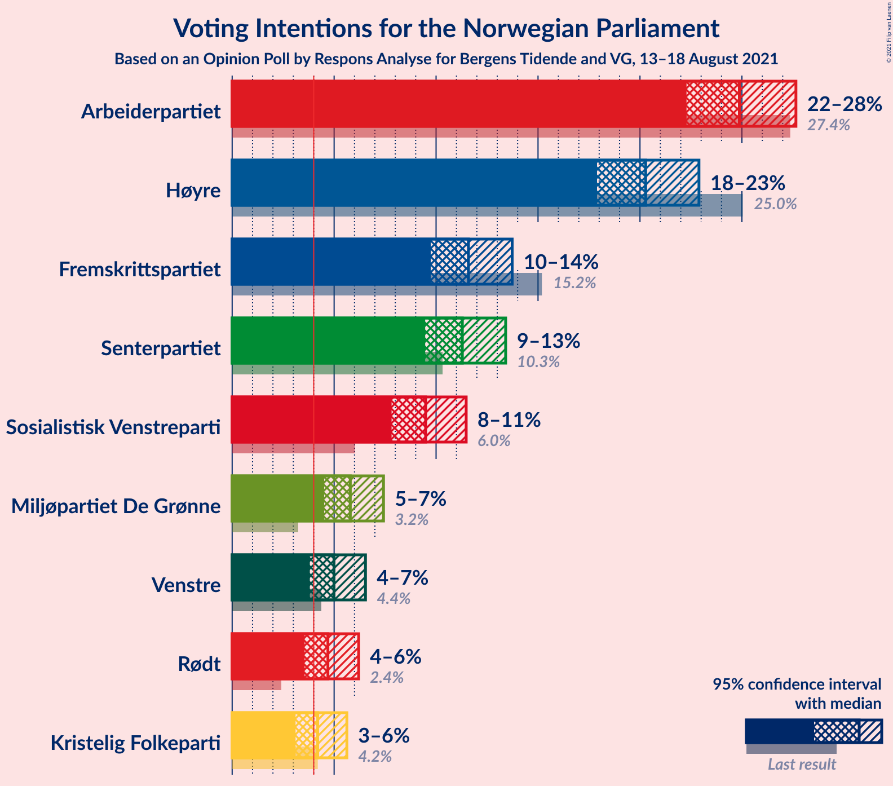

### Confidence Intervals

| Party | Last Result | Poll Result | 80% Confidence Interval | 90% Confidence Interval | 95% Confidence Interval | 99% Confidence Interval |
|:-----:|:-----------:|:-----------:|:-----------------------:|:-----------------------:|:-----------------------:|:-----------------------:|
| Arbeiderpartiet | 27.4% | 24.9% | 23.2–26.7% |22.7–27.2% |22.3–27.6% |21.5–28.5% |
| Høyre | 25.0% | 20.3% | 18.7–22.0% |18.3–22.5% |17.9–22.9% |17.2–23.7% |
| Fremskrittspartiet | 15.2% | 11.6% | 10.4–13.0% |10.0–13.4% |9.7–13.7% |9.2–14.4% |
| Senterpartiet | 10.3% | 11.3% | 10.1–12.7% |9.8–13.1% |9.5–13.4% |8.9–14.1% |
| Sosialistisk Venstreparti | 6.0% | 9.5% | 8.4–10.8% |8.1–11.2% |7.8–11.5% |7.3–12.1% |
| Miljøpartiet De Grønne | 3.2% | 5.8% | 4.9–6.9% |4.7–7.2% |4.5–7.4% |4.1–8.0% |
| Venstre | 4.4% | 5.0% | 4.2–6.0% |4.0–6.3% |3.8–6.5% |3.5–7.0% |
| Rødt | 2.4% | 4.7% | 3.9–5.7% |3.7–5.9% |3.6–6.2% |3.2–6.7% |
| Kristelig Folkeparti | 4.2% | 4.2% | 3.5–5.1% |3.3–5.4% |3.1–5.6% |2.8–6.1% |

*Note:* The poll result column reflects the actual value used in the calculations. Published results may vary slightly, and in addition be rounded to fewer digits.

## Seats

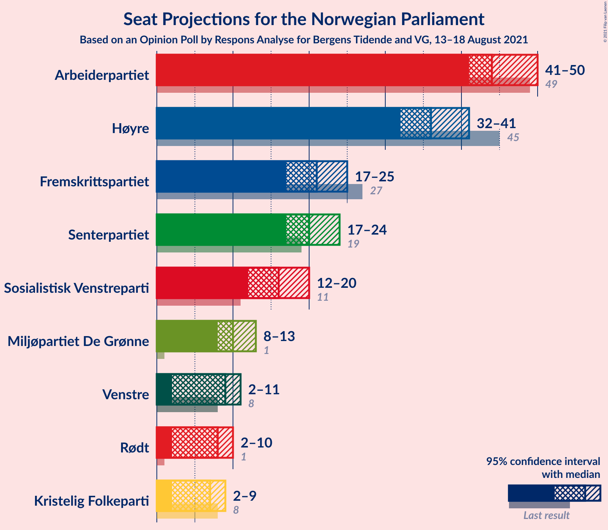

### Confidence Intervals

| Party | Last Result | Median | 80% Confidence Interval | 90% Confidence Interval | 95% Confidence Interval | 99% Confidence Interval |
|:-----:|:-----------:|:------:|:-----------------------:|:-----------------------:|:-----------------------:|:-----------------------:|
| <a href="#arbeiderpartiet">Arbeiderpartiet</a> | 49 | 44 | 41–47 |41–49 |41–50 |40–53 |
| <a href="#høyre">Høyre</a> | 45 | 36 | 34–38 |33–40 |32–41 |30–43 |
| <a href="#fremskrittspartiet">Fremskrittspartiet</a> | 27 | 21 | 18–23 |17–24 |17–25 |16–26 |
| <a href="#senterpartiet">Senterpartiet</a> | 19 | 20 | 18–21 |17–22 |17–24 |15–26 |
| <a href="#sosialistisk-venstreparti">Sosialistisk Venstreparti</a> | 11 | 16 | 13–18 |13–19 |12–20 |12–21 |
| <a href="#miljøpartiet-de-grønne">Miljøpartiet De Grønne</a> | 1 | 10 | 8–11 |8–12 |8–13 |7–13 |
| <a href="#venstre">Venstre</a> | 8 | 9 | 7–10 |7–10 |2–11 |2–12 |
| <a href="#rødt">Rødt</a> | 1 | 8 | 2–9 |2–10 |2–10 |2–11 |
| <a href="#kristelig-folkeparti">Kristelig Folkeparti</a> | 8 | 7 | 3–9 |3–9 |2–9 |1–10 |

### Arbeiderpartiet

*For a full overview of the results for this party, see the [Arbeiderpartiet](party-arbeiderpartiet.html) page.*

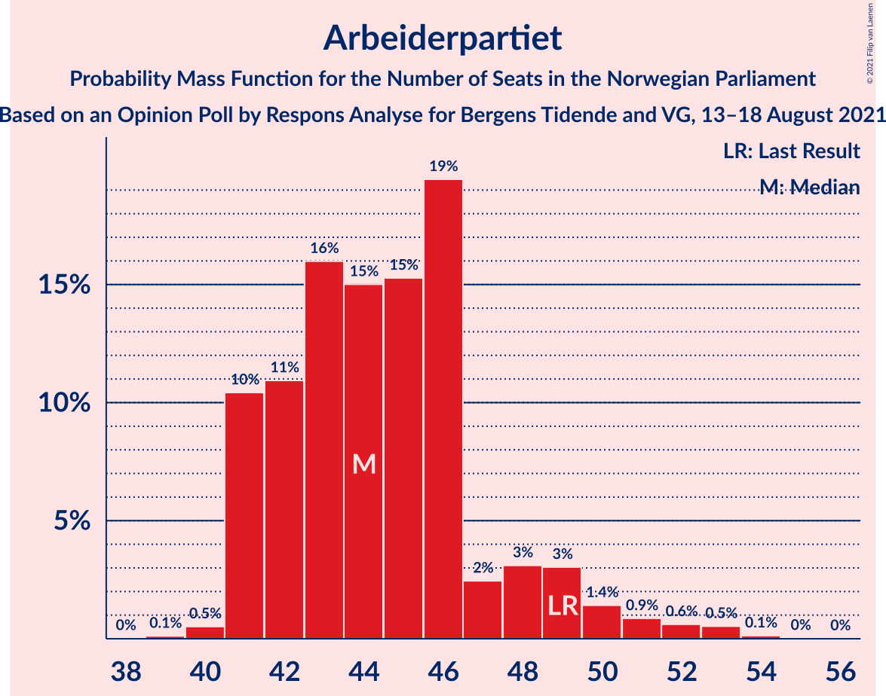

| Number of Seats | Probability | Accumulated | Special Marks |
|:---------------:|:-----------:|:-----------:|:-------------:|
| 39 | 0.1% | 100% |  |
| 40 | 0.5% | 99.8% |  |
| 41 | 10% | 99.3% |  |
| 42 | 11% | 89% |  |
| 43 | 16% | 78% |  |
| 44 | 15% | 62% | Median |
| 45 | 15% | 47% |  |
| 46 | 19% | 32% |  |
| 47 | 2% | 12% |  |
| 48 | 3% | 10% |  |
| 49 | 3% | 7% | Last Result |
| 50 | 1.4% | 4% |  |
| 51 | 0.9% | 2% |  |
| 52 | 0.6% | 1.3% |  |
| 53 | 0.5% | 0.7% |  |
| 54 | 0.1% | 0.2% |  |
| 55 | 0% | 0.1% |  |
| 56 | 0% | 0% |  |

### Høyre

*For a full overview of the results for this party, see the [Høyre](party-høyre.html) page.*

| Number of Seats | Probability | Accumulated | Special Marks |
|:---------------:|:-----------:|:-----------:|:-------------:|
| 28 | 0.1% | 100% |  |
| 29 | 0.3% | 99.9% |  |
| 30 | 0.9% | 99.7% |  |
| 31 | 1.0% | 98.8% |  |
| 32 | 1.4% | 98% |  |
| 33 | 2% | 96% |  |
| 34 | 7% | 95% |  |
| 35 | 20% | 87% |  |
| 36 | 27% | 68% | Median |
| 37 | 12% | 41% |  |
| 38 | 20% | 29% |  |
| 39 | 3% | 9% |  |
| 40 | 2% | 6% |  |
| 41 | 1.2% | 4% |  |
| 42 | 2% | 2% |  |
| 43 | 0.4% | 0.6% |  |
| 44 | 0.1% | 0.2% |  |
| 45 | 0.1% | 0.1% | Last Result |
| 46 | 0% | 0% |  |

### Fremskrittspartiet

*For a full overview of the results for this party, see the [Fremskrittspartiet](party-fremskrittspartiet.html) page.*

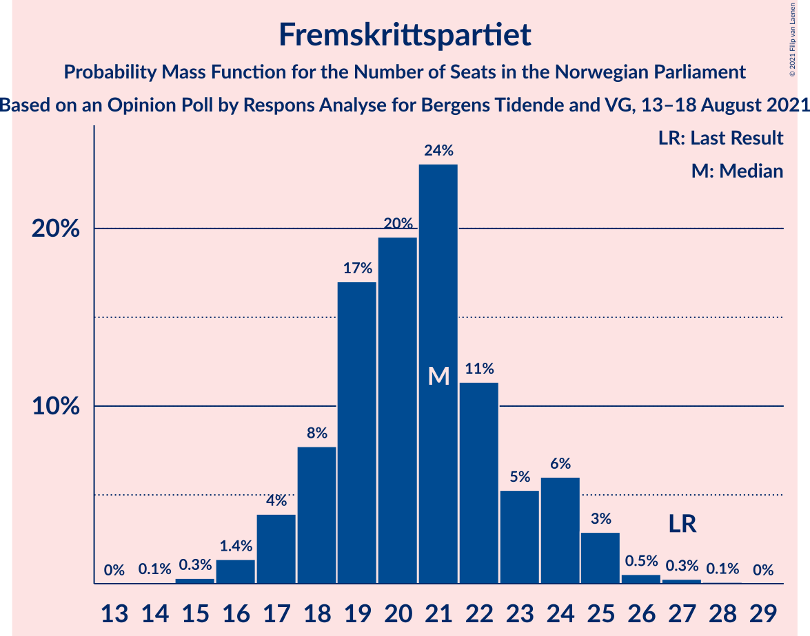

| Number of Seats | Probability | Accumulated | Special Marks |
|:---------------:|:-----------:|:-----------:|:-------------:|
| 14 | 0.1% | 100% |  |
| 15 | 0.3% | 99.9% |  |
| 16 | 1.4% | 99.6% |  |
| 17 | 4% | 98% |  |
| 18 | 8% | 94% |  |
| 19 | 17% | 87% |  |
| 20 | 20% | 70% |  |
| 21 | 24% | 50% | Median |
| 22 | 11% | 26% |  |
| 23 | 5% | 15% |  |
| 24 | 6% | 10% |  |
| 25 | 3% | 4% |  |
| 26 | 0.5% | 0.9% |  |
| 27 | 0.3% | 0.4% | Last Result |
| 28 | 0.1% | 0.1% |  |
| 29 | 0% | 0% |  |

### Senterpartiet

*For a full overview of the results for this party, see the [Senterpartiet](party-senterpartiet.html) page.*

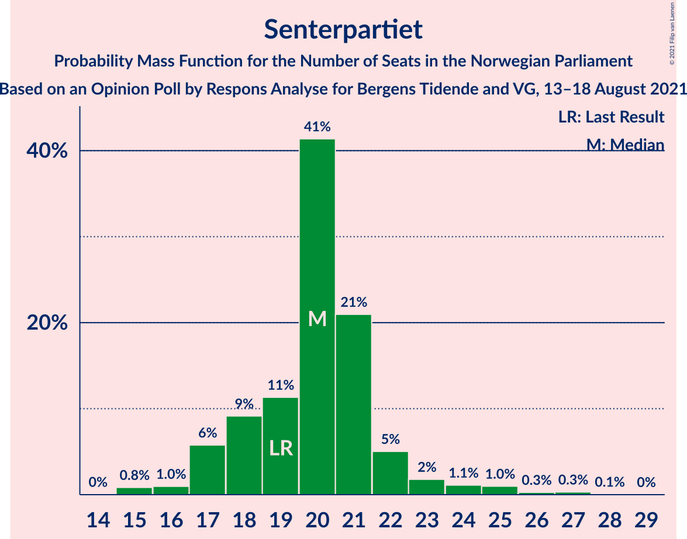

| Number of Seats | Probability | Accumulated | Special Marks |
|:---------------:|:-----------:|:-----------:|:-------------:|
| 15 | 0.8% | 100% |  |
| 16 | 1.0% | 99.1% |  |
| 17 | 6% | 98% |  |
| 18 | 9% | 92% |  |
| 19 | 11% | 83% | Last Result |
| 20 | 41% | 72% | Median |
| 21 | 21% | 31% |  |
| 22 | 5% | 10% |  |
| 23 | 2% | 5% |  |
| 24 | 1.1% | 3% |  |
| 25 | 1.0% | 2% |  |
| 26 | 0.3% | 0.7% |  |
| 27 | 0.3% | 0.4% |  |
| 28 | 0.1% | 0.1% |  |
| 29 | 0% | 0% |  |

### Sosialistisk Venstreparti

*For a full overview of the results for this party, see the [Sosialistisk Venstreparti](party-sosialistiskvenstreparti.html) page.*

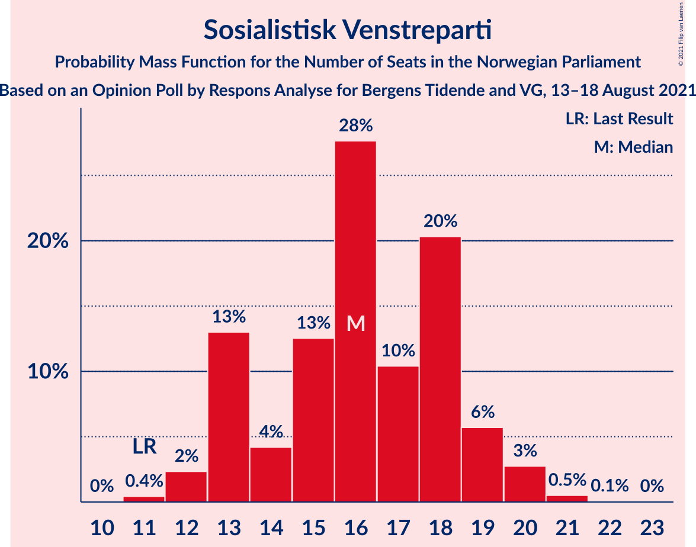

| Number of Seats | Probability | Accumulated | Special Marks |
|:---------------:|:-----------:|:-----------:|:-------------:|
| 11 | 0.4% | 100% | Last Result |
| 12 | 2% | 99.5% |  |
| 13 | 13% | 97% |  |
| 14 | 4% | 84% |  |
| 15 | 13% | 80% |  |
| 16 | 28% | 67% | Median |
| 17 | 10% | 40% |  |
| 18 | 20% | 29% |  |
| 19 | 6% | 9% |  |
| 20 | 3% | 3% |  |
| 21 | 0.5% | 0.6% |  |
| 22 | 0.1% | 0.1% |  |
| 23 | 0% | 0% |  |

### Miljøpartiet De Grønne

*For a full overview of the results for this party, see the [Miljøpartiet De Grønne](party-miljøpartietdegrønne.html) page.*

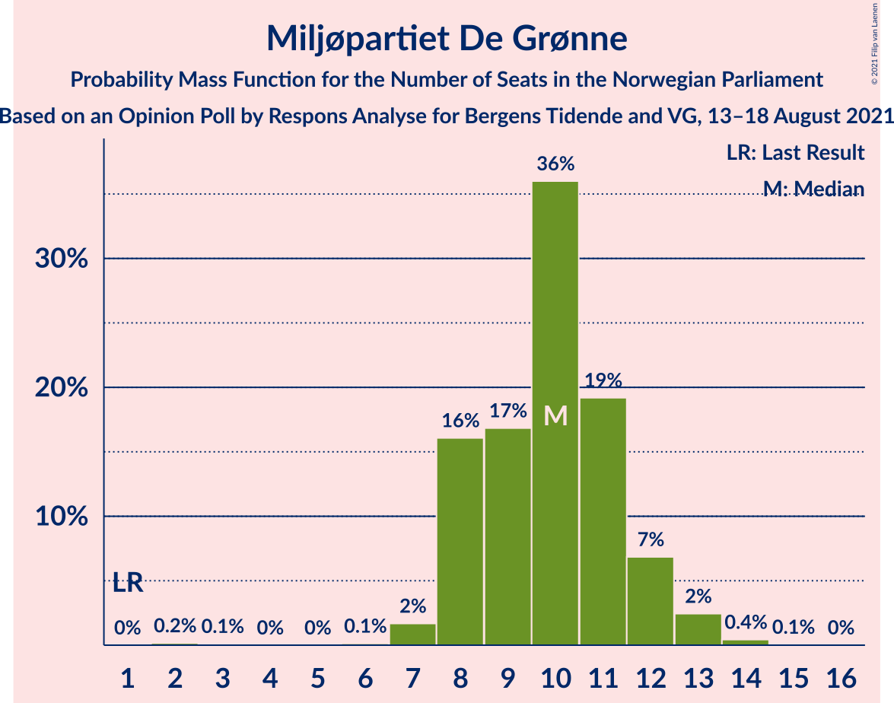

| Number of Seats | Probability | Accumulated | Special Marks |
|:---------------:|:-----------:|:-----------:|:-------------:|
| 1 | 0% | 100% | Last Result |
| 2 | 0.2% | 100% |  |
| 3 | 0.1% | 99.8% |  |
| 4 | 0% | 99.7% |  |
| 5 | 0% | 99.7% |  |
| 6 | 0.1% | 99.7% |  |
| 7 | 2% | 99.6% |  |
| 8 | 16% | 98% |  |
| 9 | 17% | 82% |  |
| 10 | 36% | 65% | Median |
| 11 | 19% | 29% |  |
| 12 | 7% | 10% |  |
| 13 | 2% | 3% |  |
| 14 | 0.4% | 0.5% |  |
| 15 | 0.1% | 0.1% |  |
| 16 | 0% | 0% |  |

### Venstre

*For a full overview of the results for this party, see the [Venstre](party-venstre.html) page.*

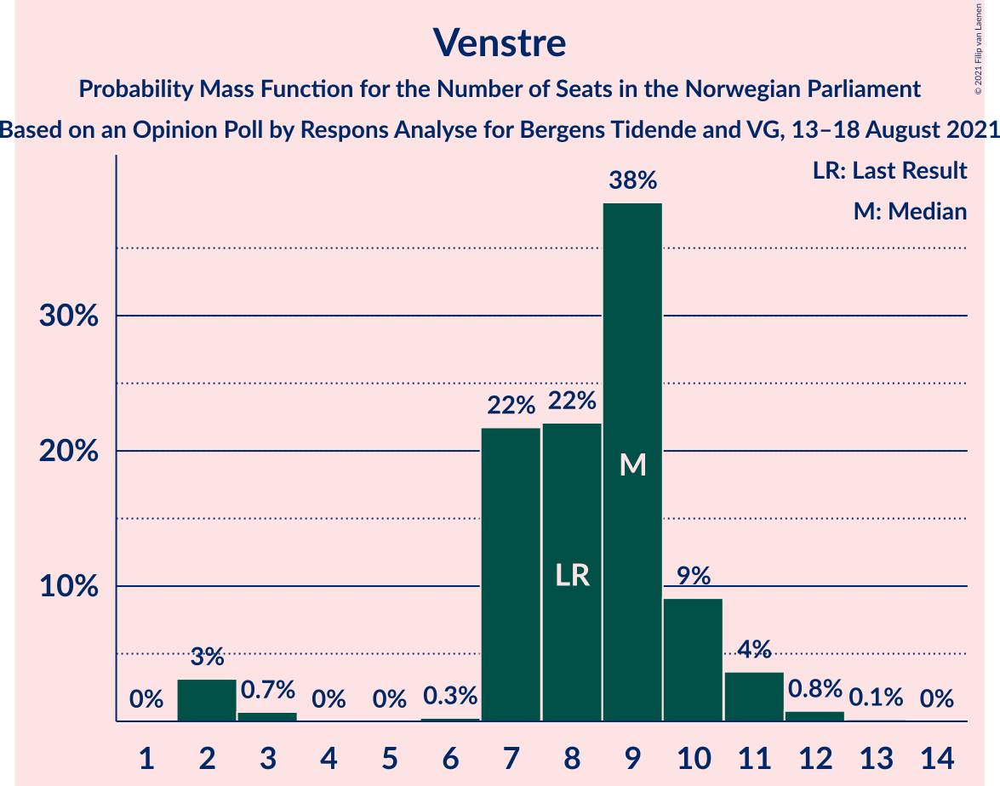

| Number of Seats | Probability | Accumulated | Special Marks |
|:---------------:|:-----------:|:-----------:|:-------------:|
| 2 | 3% | 100% |  |
| 3 | 0.7% | 97% |  |
| 4 | 0% | 96% |  |
| 5 | 0% | 96% |  |
| 6 | 0.3% | 96% |  |
| 7 | 22% | 96% |  |
| 8 | 22% | 74% | Last Result |
| 9 | 38% | 52% | Median |
| 10 | 9% | 14% |  |
| 11 | 4% | 5% |  |
| 12 | 0.8% | 0.9% |  |
| 13 | 0.1% | 0.2% |  |
| 14 | 0% | 0% |  |

### Rødt

*For a full overview of the results for this party, see the [Rødt](party-rødt.html) page.*

| Number of Seats | Probability | Accumulated | Special Marks |
|:---------------:|:-----------:|:-----------:|:-------------:|
| 1 | 0.1% | 100% | Last Result |
| 2 | 13% | 99.9% |  |
| 3 | 0% | 87% |  |
| 4 | 0% | 87% |  |
| 5 | 0% | 87% |  |
| 6 | 0.5% | 87% |  |
| 7 | 24% | 87% |  |
| 8 | 36% | 63% | Median |
| 9 | 18% | 26% |  |
| 10 | 7% | 8% |  |
| 11 | 1.3% | 2% |  |
| 12 | 0.3% | 0.3% |  |
| 13 | 0% | 0% |  |

### Kristelig Folkeparti

*For a full overview of the results for this party, see the [Kristelig Folkeparti](party-kristeligfolkeparti.html) page.*

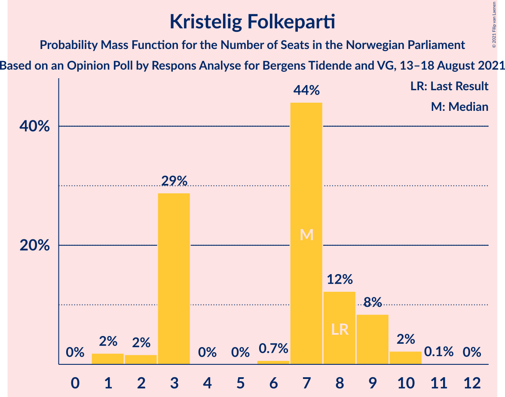

| Number of Seats | Probability | Accumulated | Special Marks |
|:---------------:|:-----------:|:-----------:|:-------------:|
| 1 | 2% | 100% |  |
| 2 | 2% | 98% |  |
| 3 | 29% | 97% |  |
| 4 | 0% | 68% |  |
| 5 | 0% | 68% |  |
| 6 | 0.7% | 68% |  |
| 7 | 44% | 67% | Median |
| 8 | 12% | 23% | Last Result |
| 9 | 8% | 11% |  |
| 10 | 2% | 2% |  |
| 11 | 0.1% | 0.2% |  |
| 12 | 0% | 0% |  |

## Coalitions

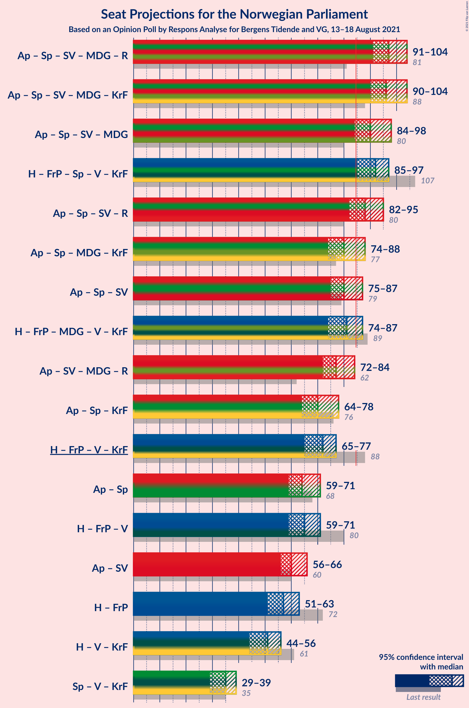

### Confidence Intervals

| Coalition | Last Result | Median | Majority? | 80% Confidence Interval | 90% Confidence Interval | 95% Confidence Interval | 99% Confidence Interval |
|:---------:|:-----------:|:------:|:---------:|:-----------------------:|:-----------------------:|:-----------------------:|:-----------------------:|
| Arbeiderpartiet – Senterpartiet – Sosialistisk Venstreparti – Miljøpartiet De Grønne – Rødt | 81 | 97 | 99.9% | 94–102 | 93–104 | 91–104 | 89–107 |
| Arbeiderpartiet – Senterpartiet – Sosialistisk Venstreparti – Miljøpartiet De Grønne – Kristelig Folkeparti | 88 | 96 | 100% | 92–100 | 92–102 | 90–104 | 88–107 |
| Arbeiderpartiet – Senterpartiet – Sosialistisk Venstreparti – Miljøpartiet De Grønne | 80 | 90 | 97% | 87–95 | 85–96 | 84–98 | 82–100 |
| Høyre – Fremskrittspartiet – Senterpartiet – Venstre – Kristelig Folkeparti | 107 | 92 | 98% | 87–95 | 86–95 | 85–97 | 82–98 |
| Arbeiderpartiet – Senterpartiet – Sosialistisk Venstreparti – Rødt | 80 | 88 | 86% | 84–92 | 83–93 | 82–95 | 79–97 |
| Arbeiderpartiet – Senterpartiet – Miljøpartiet De Grønne – Kristelig Folkeparti | 77 | 80 | 9% | 77–84 | 75–86 | 74–88 | 72–90 |
| Arbeiderpartiet – Senterpartiet – Sosialistisk Venstreparti | 79 | 80 | 13% | 77–85 | 76–86 | 75–87 | 73–89 |
| Høyre – Fremskrittspartiet – Miljøpartiet De Grønne – Venstre – Kristelig Folkeparti | 89 | 81 | 13% | 77–85 | 76–86 | 74–87 | 72–89 |
| Arbeiderpartiet – Sosialistisk Venstreparti – Miljøpartiet De Grønne – Rødt | 62 | 77 | 2% | 74–82 | 73–83 | 72–84 | 70–86 |
| Arbeiderpartiet – Senterpartiet – Kristelig Folkeparti | 76 | 70 | 0% | 67–75 | 65–76 | 64–78 | 62–81 |
| Høyre – Fremskrittspartiet – Venstre – Kristelig Folkeparti | 88 | 72 | 0% | 67–75 | 65–76 | 65–77 | 62–80 |
| Arbeiderpartiet – Senterpartiet | 68 | 64 | 0% | 61–68 | 60–69 | 59–71 | 58–73 |
| Høyre – Fremskrittspartiet – Venstre | 80 | 65 | 0% | 62–69 | 60–70 | 59–71 | 56–73 |
| Arbeiderpartiet – Sosialistisk Venstreparti | 60 | 60 | 0% | 57–64 | 57–65 | 56–66 | 54–68 |
| Høyre – Fremskrittspartiet | 72 | 57 | 0% | 54–60 | 53–61 | 51–63 | 49–64 |
| Høyre – Venstre – Kristelig Folkeparti | 61 | 51 | 0% | 47–54 | 46–55 | 44–56 | 42–58 |
| Senterpartiet – Venstre – Kristelig Folkeparti | 35 | 35 | 0% | 30–38 | 29–39 | 29–39 | 26–41 |

### Arbeiderpartiet – Senterpartiet – Sosialistisk Venstreparti – Miljøpartiet De Grønne – Rødt

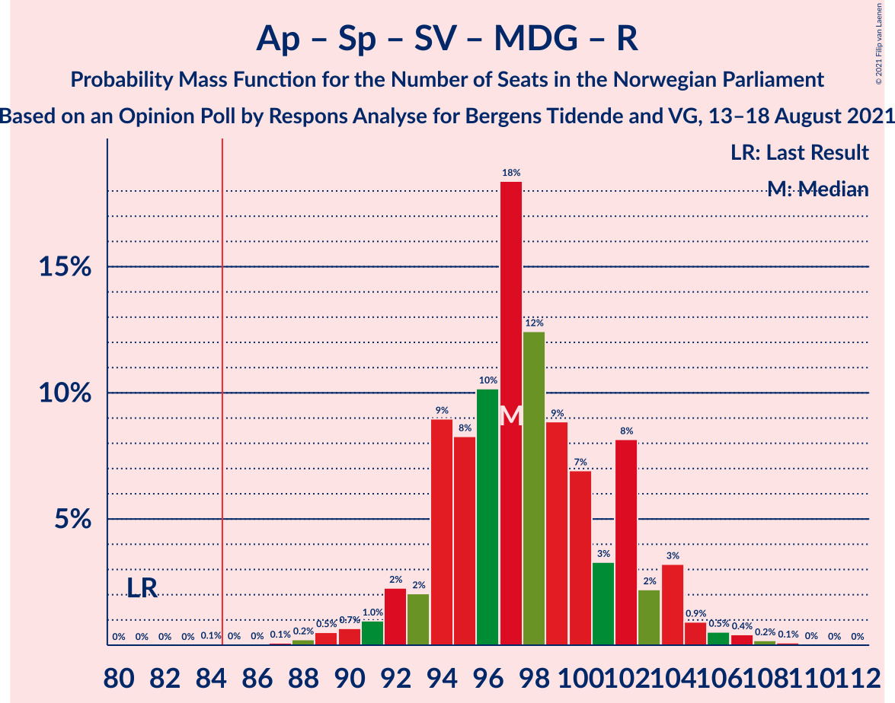

| Number of Seats | Probability | Accumulated | Special Marks |
|:---------------:|:-----------:|:-----------:|:-------------:|
| 81 | 0% | 100% | Last Result |
| 82 | 0% | 100% |  |
| 83 | 0% | 100% |  |
| 84 | 0.1% | 100% |  |
| 85 | 0% | 99.9% | Majority |
| 86 | 0% | 99.9% |  |
| 87 | 0.1% | 99.9% |  |
| 88 | 0.2% | 99.8% |  |
| 89 | 0.5% | 99.6% |  |
| 90 | 0.7% | 99.1% |  |
| 91 | 1.0% | 98% |  |
| 92 | 2% | 97% |  |
| 93 | 2% | 95% |  |
| 94 | 9% | 93% |  |
| 95 | 8% | 84% |  |
| 96 | 10% | 76% |  |
| 97 | 18% | 66% |  |
| 98 | 12% | 47% | Median |
| 99 | 9% | 35% |  |
| 100 | 7% | 26% |  |
| 101 | 3% | 19% |  |
| 102 | 8% | 16% |  |
| 103 | 2% | 8% |  |
| 104 | 3% | 5% |  |
| 105 | 0.9% | 2% |  |
| 106 | 0.5% | 1.3% |  |
| 107 | 0.4% | 0.8% |  |
| 108 | 0.2% | 0.3% |  |
| 109 | 0.1% | 0.2% |  |
| 110 | 0% | 0.1% |  |
| 111 | 0% | 0% |  |

### Arbeiderpartiet – Senterpartiet – Sosialistisk Venstreparti – Miljøpartiet De Grønne – Kristelig Folkeparti

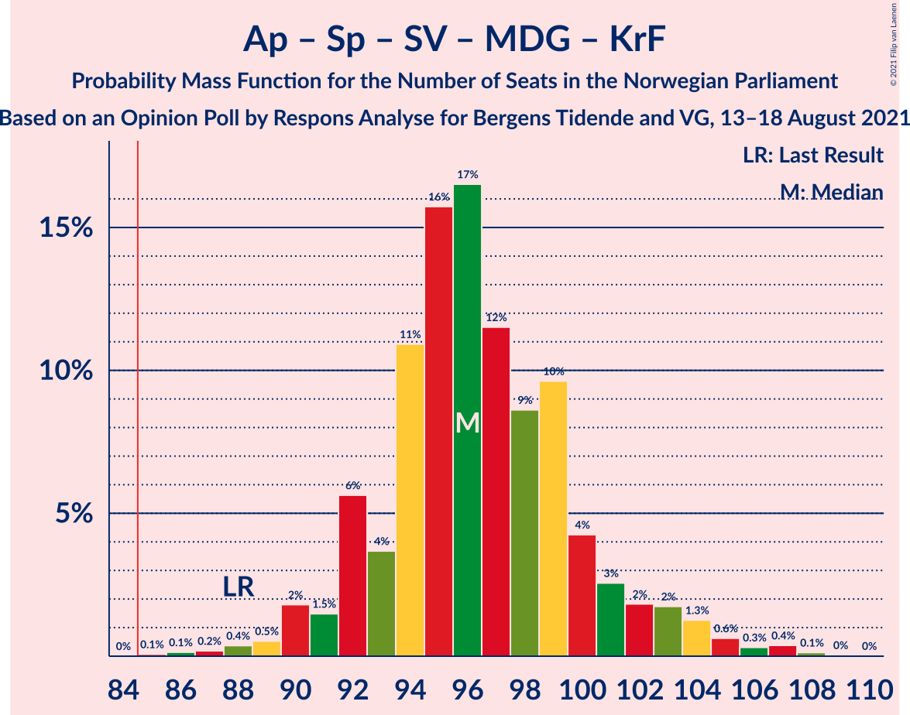

| Number of Seats | Probability | Accumulated | Special Marks |
|:---------------:|:-----------:|:-----------:|:-------------:|
| 85 | 0.1% | 100% | Majority |
| 86 | 0.1% | 99.9% |  |
| 87 | 0.2% | 99.8% |  |
| 88 | 0.4% | 99.6% | Last Result |
| 89 | 0.5% | 99.2% |  |
| 90 | 2% | 98.7% |  |
| 91 | 1.5% | 97% |  |
| 92 | 6% | 95% |  |
| 93 | 4% | 90% |  |
| 94 | 11% | 86% |  |
| 95 | 16% | 75% |  |
| 96 | 17% | 59% |  |
| 97 | 12% | 43% | Median |
| 98 | 9% | 31% |  |
| 99 | 10% | 23% |  |
| 100 | 4% | 13% |  |
| 101 | 3% | 9% |  |
| 102 | 2% | 6% |  |
| 103 | 2% | 5% |  |
| 104 | 1.3% | 3% |  |
| 105 | 0.6% | 2% |  |
| 106 | 0.3% | 0.9% |  |
| 107 | 0.4% | 0.6% |  |
| 108 | 0.1% | 0.2% |  |
| 109 | 0% | 0.1% |  |
| 110 | 0% | 0% |  |

### Arbeiderpartiet – Senterpartiet – Sosialistisk Venstreparti – Miljøpartiet De Grønne

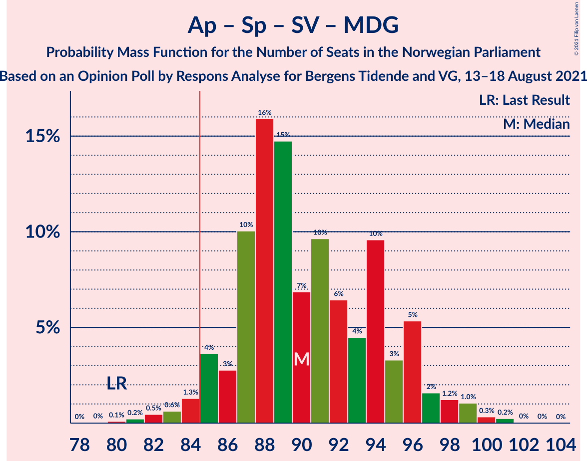

| Number of Seats | Probability | Accumulated | Special Marks |
|:---------------:|:-----------:|:-----------:|:-------------:|
| 79 | 0% | 100% |  |
| 80 | 0.1% | 99.9% | Last Result |
| 81 | 0.2% | 99.8% |  |
| 82 | 0.5% | 99.6% |  |
| 83 | 0.6% | 99.2% |  |
| 84 | 1.3% | 98.5% |  |
| 85 | 4% | 97% | Majority |
| 86 | 3% | 94% |  |
| 87 | 10% | 91% |  |
| 88 | 16% | 81% |  |
| 89 | 15% | 65% |  |
| 90 | 7% | 50% | Median |
| 91 | 10% | 43% |  |
| 92 | 6% | 34% |  |
| 93 | 4% | 27% |  |
| 94 | 10% | 23% |  |
| 95 | 3% | 13% |  |
| 96 | 5% | 10% |  |
| 97 | 2% | 5% |  |
| 98 | 1.2% | 3% |  |
| 99 | 1.0% | 2% |  |
| 100 | 0.3% | 0.6% |  |
| 101 | 0.2% | 0.3% |  |
| 102 | 0% | 0.1% |  |
| 103 | 0% | 0% |  |

### Høyre – Fremskrittspartiet – Senterpartiet – Venstre – Kristelig Folkeparti

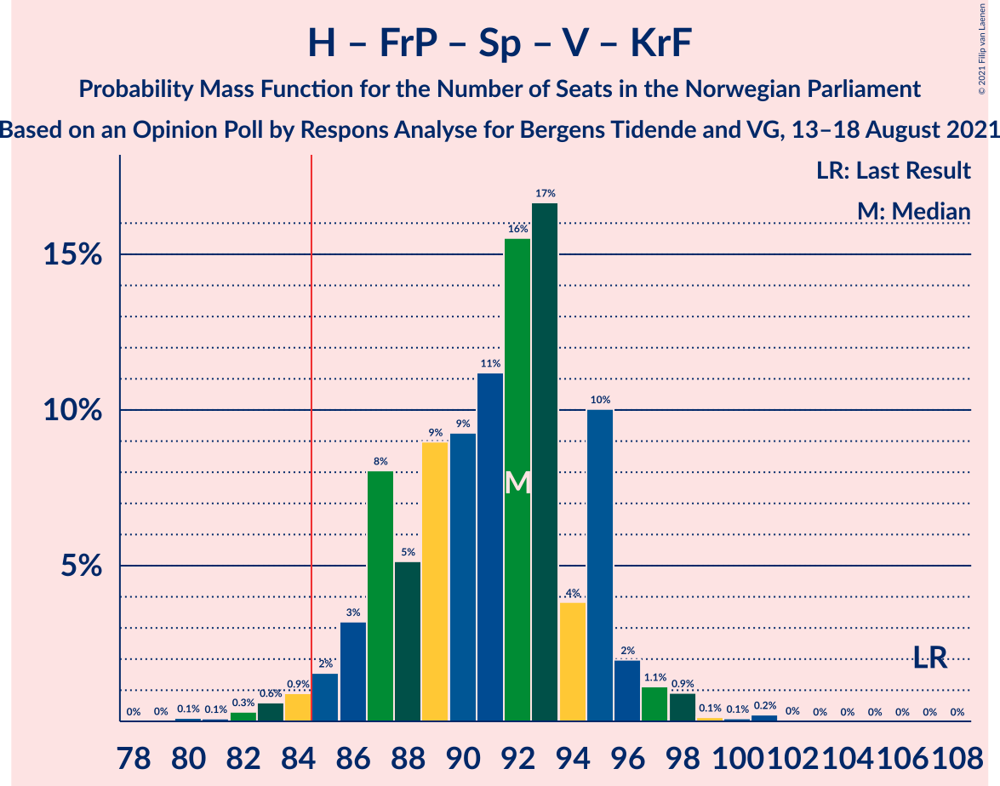

| Number of Seats | Probability | Accumulated | Special Marks |
|:---------------:|:-----------:|:-----------:|:-------------:|
| 80 | 0.1% | 100% |  |
| 81 | 0.1% | 99.9% |  |
| 82 | 0.3% | 99.8% |  |
| 83 | 0.6% | 99.5% |  |
| 84 | 0.9% | 98.9% |  |
| 85 | 2% | 98% | Majority |
| 86 | 3% | 96% |  |
| 87 | 8% | 93% |  |
| 88 | 5% | 85% |  |
| 89 | 9% | 80% |  |
| 90 | 9% | 71% |  |
| 91 | 11% | 62% |  |
| 92 | 16% | 51% |  |
| 93 | 17% | 35% | Median |
| 94 | 4% | 18% |  |
| 95 | 10% | 15% |  |
| 96 | 2% | 4% |  |
| 97 | 1.1% | 3% |  |
| 98 | 0.9% | 1.4% |  |
| 99 | 0.1% | 0.5% |  |
| 100 | 0.1% | 0.4% |  |
| 101 | 0.2% | 0.3% |  |
| 102 | 0% | 0% |  |
| 103 | 0% | 0% |  |
| 104 | 0% | 0% |  |
| 105 | 0% | 0% |  |
| 106 | 0% | 0% |  |
| 107 | 0% | 0% | Last Result |

### Arbeiderpartiet – Senterpartiet – Sosialistisk Venstreparti – Rødt

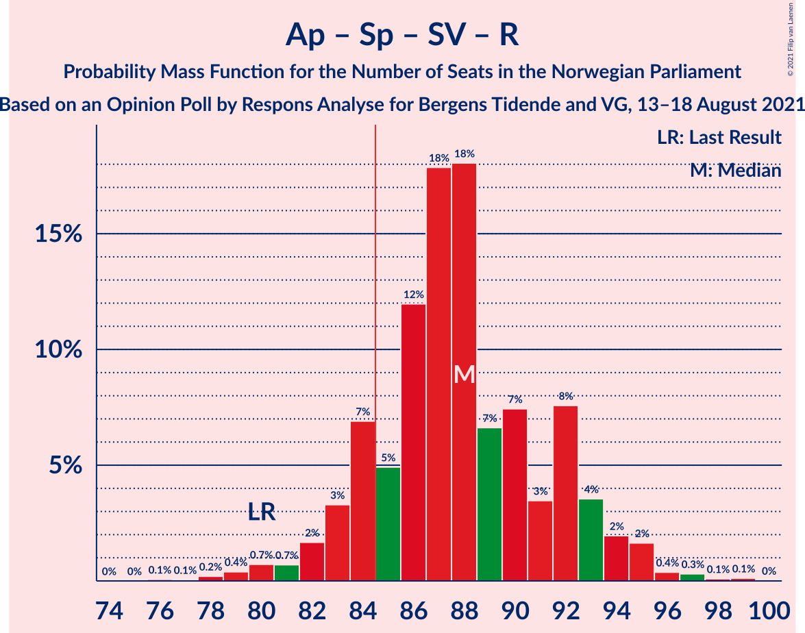

| Number of Seats | Probability | Accumulated | Special Marks |
|:---------------:|:-----------:|:-----------:|:-------------:|
| 76 | 0.1% | 100% |  |
| 77 | 0.1% | 99.9% |  |
| 78 | 0.2% | 99.9% |  |
| 79 | 0.4% | 99.7% |  |
| 80 | 0.7% | 99.3% | Last Result |
| 81 | 0.7% | 98.6% |  |
| 82 | 2% | 98% |  |
| 83 | 3% | 96% |  |
| 84 | 7% | 93% |  |
| 85 | 5% | 86% | Majority |
| 86 | 12% | 81% |  |
| 87 | 18% | 69% |  |
| 88 | 18% | 51% | Median |
| 89 | 7% | 33% |  |
| 90 | 7% | 27% |  |
| 91 | 3% | 19% |  |
| 92 | 8% | 16% |  |
| 93 | 4% | 8% |  |
| 94 | 2% | 5% |  |
| 95 | 2% | 3% |  |
| 96 | 0.4% | 0.9% |  |
| 97 | 0.3% | 0.6% |  |
| 98 | 0.1% | 0.3% |  |
| 99 | 0.1% | 0.2% |  |
| 100 | 0% | 0% |  |

### Arbeiderpartiet – Senterpartiet – Miljøpartiet De Grønne – Kristelig Folkeparti

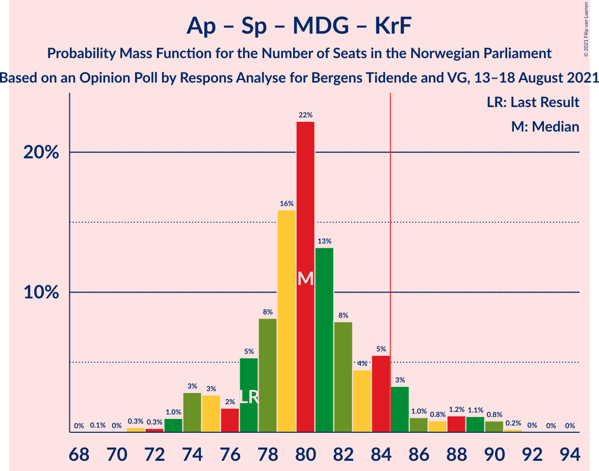

| Number of Seats | Probability | Accumulated | Special Marks |
|:---------------:|:-----------:|:-----------:|:-------------:|
| 69 | 0.1% | 100% |  |
| 70 | 0% | 99.9% |  |
| 71 | 0.3% | 99.9% |  |
| 72 | 0.3% | 99.6% |  |
| 73 | 1.0% | 99.3% |  |
| 74 | 3% | 98% |  |
| 75 | 3% | 95% |  |
| 76 | 2% | 93% |  |
| 77 | 5% | 91% | Last Result |
| 78 | 8% | 86% |  |
| 79 | 16% | 78% |  |
| 80 | 22% | 62% |  |
| 81 | 13% | 40% | Median |
| 82 | 8% | 26% |  |
| 83 | 4% | 18% |  |
| 84 | 5% | 14% |  |
| 85 | 3% | 9% | Majority |
| 86 | 1.0% | 5% |  |
| 87 | 0.8% | 4% |  |
| 88 | 1.2% | 3% |  |
| 89 | 1.1% | 2% |  |
| 90 | 0.8% | 1.1% |  |
| 91 | 0.2% | 0.3% |  |
| 92 | 0% | 0.1% |  |
| 93 | 0% | 0% |  |

### Arbeiderpartiet – Senterpartiet – Sosialistisk Venstreparti

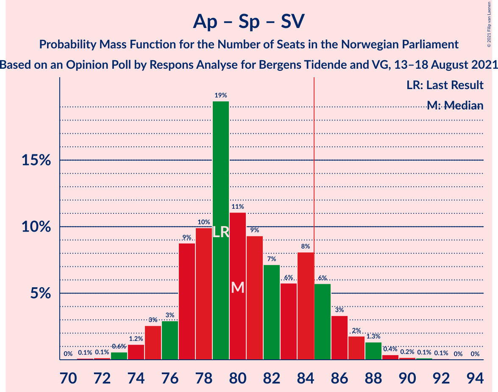

| Number of Seats | Probability | Accumulated | Special Marks |
|:---------------:|:-----------:|:-----------:|:-------------:|
| 71 | 0.1% | 100% |  |
| 72 | 0.1% | 99.9% |  |
| 73 | 0.6% | 99.7% |  |
| 74 | 1.2% | 99.1% |  |
| 75 | 3% | 98% |  |
| 76 | 3% | 95% |  |
| 77 | 9% | 92% |  |
| 78 | 10% | 84% |  |
| 79 | 19% | 74% | Last Result |
| 80 | 11% | 54% | Median |
| 81 | 9% | 43% |  |
| 82 | 7% | 34% |  |
| 83 | 6% | 27% |  |
| 84 | 8% | 21% |  |
| 85 | 6% | 13% | Majority |
| 86 | 3% | 7% |  |
| 87 | 2% | 4% |  |
| 88 | 1.3% | 2% |  |
| 89 | 0.4% | 0.8% |  |
| 90 | 0.2% | 0.4% |  |
| 91 | 0.1% | 0.2% |  |
| 92 | 0.1% | 0.1% |  |
| 93 | 0% | 0% |  |

### Høyre – Fremskrittspartiet – Miljøpartiet De Grønne – Venstre – Kristelig Folkeparti

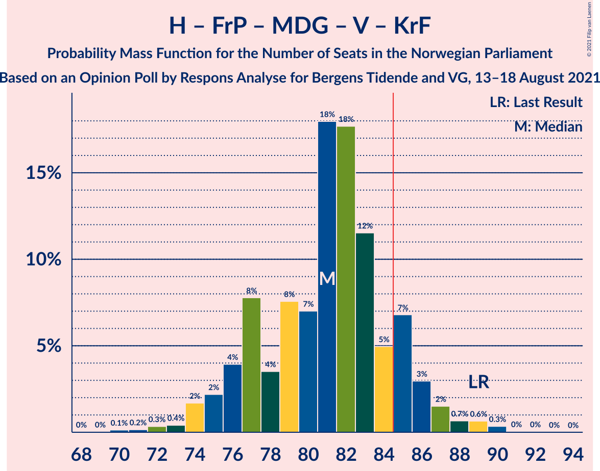

| Number of Seats | Probability | Accumulated | Special Marks |
|:---------------:|:-----------:|:-----------:|:-------------:|
| 69 | 0% | 100% |  |
| 70 | 0.1% | 99.9% |  |
| 71 | 0.2% | 99.8% |  |
| 72 | 0.3% | 99.6% |  |
| 73 | 0.4% | 99.3% |  |
| 74 | 2% | 98.9% |  |
| 75 | 2% | 97% |  |
| 76 | 4% | 95% |  |
| 77 | 8% | 91% |  |
| 78 | 4% | 83% |  |
| 79 | 8% | 80% |  |
| 80 | 7% | 72% |  |
| 81 | 18% | 65% |  |
| 82 | 18% | 47% |  |
| 83 | 12% | 30% | Median |
| 84 | 5% | 18% |  |
| 85 | 7% | 13% | Majority |
| 86 | 3% | 6% |  |
| 87 | 2% | 3% |  |
| 88 | 0.7% | 2% |  |
| 89 | 0.6% | 1.1% | Last Result |
| 90 | 0.3% | 0.5% |  |
| 91 | 0% | 0.1% |  |
| 92 | 0% | 0.1% |  |
| 93 | 0% | 0% |  |

### Arbeiderpartiet – Sosialistisk Venstreparti – Miljøpartiet De Grønne – Rødt

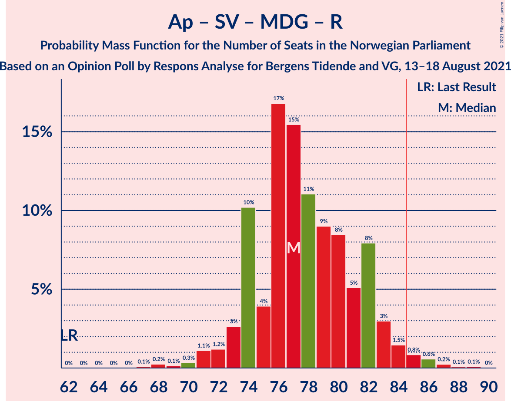

| Number of Seats | Probability | Accumulated | Special Marks |
|:---------------:|:-----------:|:-----------:|:-------------:|
| 62 | 0% | 100% | Last Result |
| 63 | 0% | 100% |  |
| 64 | 0% | 100% |  |
| 65 | 0% | 100% |  |
| 66 | 0% | 100% |  |
| 67 | 0.1% | 100% |  |
| 68 | 0.2% | 99.9% |  |
| 69 | 0.1% | 99.6% |  |
| 70 | 0.3% | 99.5% |  |
| 71 | 1.1% | 99.2% |  |
| 72 | 1.2% | 98% |  |
| 73 | 3% | 97% |  |
| 74 | 10% | 94% |  |
| 75 | 4% | 84% |  |
| 76 | 17% | 80% |  |
| 77 | 15% | 63% |  |
| 78 | 11% | 48% | Median |
| 79 | 9% | 37% |  |
| 80 | 8% | 28% |  |
| 81 | 5% | 19% |  |
| 82 | 8% | 14% |  |
| 83 | 3% | 6% |  |
| 84 | 1.5% | 3% |  |
| 85 | 0.8% | 2% | Majority |
| 86 | 0.6% | 1.0% |  |
| 87 | 0.2% | 0.4% |  |
| 88 | 0.1% | 0.2% |  |
| 89 | 0.1% | 0.1% |  |
| 90 | 0% | 0% |  |

### Arbeiderpartiet – Senterpartiet – Kristelig Folkeparti

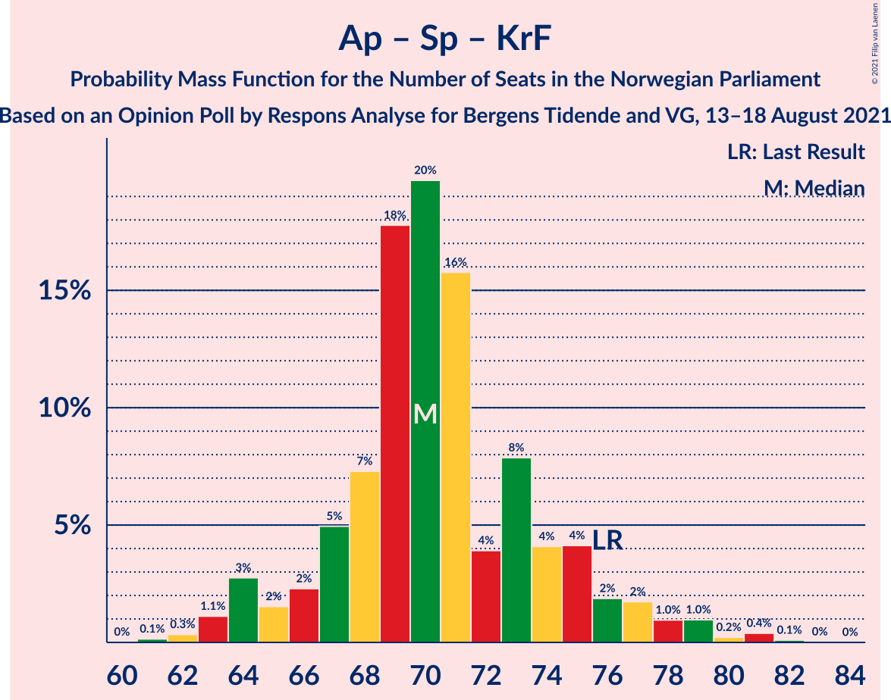

| Number of Seats | Probability | Accumulated | Special Marks |
|:---------------:|:-----------:|:-----------:|:-------------:|
| 61 | 0.1% | 100% |  |
| 62 | 0.3% | 99.8% |  |
| 63 | 1.1% | 99.5% |  |
| 64 | 3% | 98% |  |
| 65 | 2% | 96% |  |
| 66 | 2% | 94% |  |
| 67 | 5% | 92% |  |
| 68 | 7% | 87% |  |
| 69 | 18% | 80% |  |
| 70 | 20% | 62% |  |
| 71 | 16% | 42% | Median |
| 72 | 4% | 26% |  |
| 73 | 8% | 22% |  |
| 74 | 4% | 15% |  |
| 75 | 4% | 10% |  |
| 76 | 2% | 6% | Last Result |
| 77 | 2% | 4% |  |
| 78 | 1.0% | 3% |  |
| 79 | 1.0% | 2% |  |
| 80 | 0.2% | 0.8% |  |
| 81 | 0.4% | 0.5% |  |
| 82 | 0.1% | 0.1% |  |
| 83 | 0% | 0% |  |

### Høyre – Fremskrittspartiet – Venstre – Kristelig Folkeparti

| Number of Seats | Probability | Accumulated | Special Marks |
|:---------------:|:-----------:|:-----------:|:-------------:|
| 59 | 0% | 100% |  |
| 60 | 0.1% | 99.9% |  |
| 61 | 0.2% | 99.8% |  |
| 62 | 0.5% | 99.6% |  |
| 63 | 0.6% | 99.1% |  |
| 64 | 1.0% | 98.6% |  |
| 65 | 3% | 98% |  |
| 66 | 2% | 94% |  |
| 67 | 8% | 92% |  |
| 68 | 4% | 84% |  |
| 69 | 7% | 80% |  |
| 70 | 9% | 73% |  |
| 71 | 13% | 64% |  |
| 72 | 19% | 51% |  |
| 73 | 10% | 33% | Median |
| 74 | 8% | 23% |  |
| 75 | 8% | 14% |  |
| 76 | 2% | 6% |  |
| 77 | 2% | 4% |  |
| 78 | 0.6% | 2% |  |
| 79 | 0.6% | 1.2% |  |
| 80 | 0.4% | 0.6% |  |
| 81 | 0.1% | 0.2% |  |
| 82 | 0% | 0.1% |  |
| 83 | 0% | 0% |  |
| 84 | 0% | 0% |  |
| 85 | 0% | 0% | Majority |
| 86 | 0% | 0% |  |
| 87 | 0% | 0% |  |
| 88 | 0% | 0% | Last Result |

### Arbeiderpartiet – Senterpartiet

| Number of Seats | Probability | Accumulated | Special Marks |
|:---------------:|:-----------:|:-----------:|:-------------:|
| 57 | 0.4% | 100% |  |
| 58 | 0.7% | 99.6% |  |
| 59 | 3% | 98.9% |  |
| 60 | 2% | 96% |  |
| 61 | 7% | 94% |  |
| 62 | 14% | 88% |  |
| 63 | 12% | 74% |  |
| 64 | 18% | 61% | Median |
| 65 | 8% | 44% |  |
| 66 | 17% | 36% |  |
| 67 | 8% | 19% |  |
| 68 | 5% | 11% | Last Result |
| 69 | 2% | 7% |  |
| 70 | 2% | 4% |  |
| 71 | 1.2% | 3% |  |
| 72 | 0.6% | 2% |  |
| 73 | 0.6% | 0.9% |  |
| 74 | 0.2% | 0.4% |  |
| 75 | 0.1% | 0.2% |  |
| 76 | 0.1% | 0.1% |  |
| 77 | 0.1% | 0.1% |  |
| 78 | 0% | 0% |  |

### Høyre – Fremskrittspartiet – Venstre

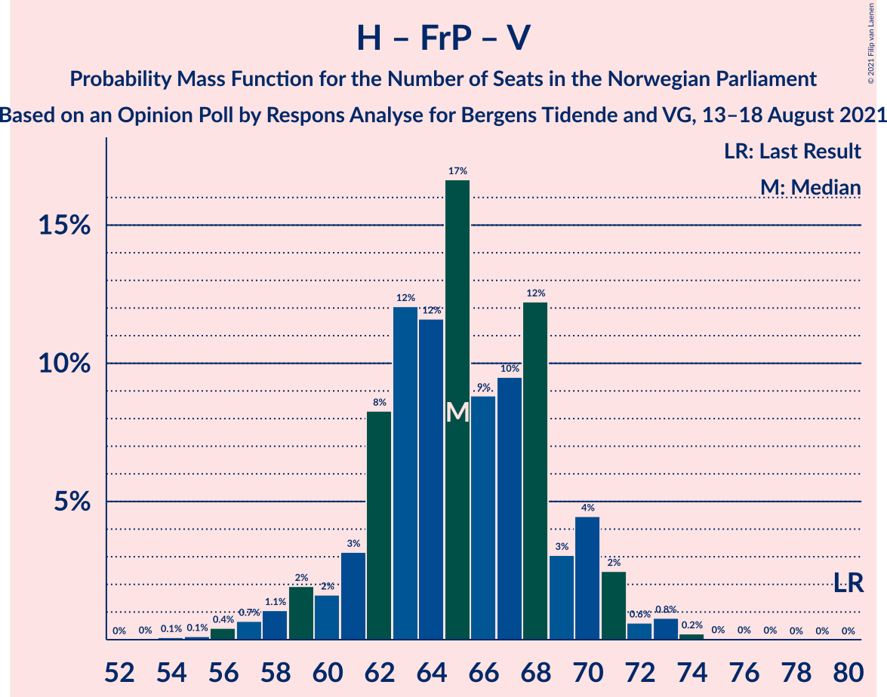

| Number of Seats | Probability | Accumulated | Special Marks |
|:---------------:|:-----------:|:-----------:|:-------------:|
| 54 | 0.1% | 100% |  |
| 55 | 0.1% | 99.9% |  |
| 56 | 0.4% | 99.7% |  |
| 57 | 0.7% | 99.3% |  |
| 58 | 1.1% | 98.7% |  |
| 59 | 2% | 98% |  |
| 60 | 2% | 96% |  |
| 61 | 3% | 94% |  |
| 62 | 8% | 91% |  |
| 63 | 12% | 83% |  |
| 64 | 12% | 71% |  |
| 65 | 17% | 59% |  |
| 66 | 9% | 42% | Median |
| 67 | 10% | 33% |  |
| 68 | 12% | 24% |  |
| 69 | 3% | 12% |  |
| 70 | 4% | 9% |  |
| 71 | 2% | 4% |  |
| 72 | 0.6% | 2% |  |
| 73 | 0.8% | 1.1% |  |
| 74 | 0.2% | 0.3% |  |
| 75 | 0% | 0.1% |  |
| 76 | 0% | 0.1% |  |
| 77 | 0% | 0% |  |
| 78 | 0% | 0% |  |
| 79 | 0% | 0% |  |
| 80 | 0% | 0% | Last Result |

### Arbeiderpartiet – Sosialistisk Venstreparti

| Number of Seats | Probability | Accumulated | Special Marks |
|:---------------:|:-----------:|:-----------:|:-------------:|
| 53 | 0.1% | 100% |  |
| 54 | 0.5% | 99.9% |  |
| 55 | 1.0% | 99.4% |  |
| 56 | 2% | 98% |  |
| 57 | 9% | 96% |  |
| 58 | 11% | 88% |  |
| 59 | 18% | 77% |  |
| 60 | 16% | 58% | Last Result, Median |
| 61 | 9% | 43% |  |
| 62 | 9% | 34% |  |
| 63 | 6% | 25% |  |
| 64 | 10% | 18% |  |
| 65 | 4% | 8% |  |
| 66 | 2% | 5% |  |
| 67 | 1.4% | 2% |  |
| 68 | 0.6% | 1.1% |  |
| 69 | 0.3% | 0.5% |  |
| 70 | 0.2% | 0.2% |  |
| 71 | 0% | 0.1% |  |
| 72 | 0% | 0% |  |

### Høyre – Fremskrittspartiet

| Number of Seats | Probability | Accumulated | Special Marks |
|:---------------:|:-----------:|:-----------:|:-------------:|
| 47 | 0.1% | 100% |  |
| 48 | 0.2% | 99.9% |  |
| 49 | 0.7% | 99.7% |  |
| 50 | 0.6% | 99.0% |  |
| 51 | 1.3% | 98% |  |
| 52 | 2% | 97% |  |
| 53 | 5% | 95% |  |
| 54 | 10% | 90% |  |
| 55 | 11% | 81% |  |
| 56 | 18% | 70% |  |
| 57 | 13% | 51% | Median |
| 58 | 7% | 38% |  |
| 59 | 11% | 31% |  |
| 60 | 11% | 20% |  |
| 61 | 4% | 9% |  |
| 62 | 2% | 5% |  |
| 63 | 1.2% | 3% |  |
| 64 | 0.9% | 1.4% |  |
| 65 | 0.3% | 0.5% |  |
| 66 | 0.1% | 0.2% |  |
| 67 | 0% | 0.1% |  |
| 68 | 0% | 0% |  |
| 69 | 0% | 0% |  |
| 70 | 0% | 0% |  |
| 71 | 0% | 0% |  |
| 72 | 0% | 0% | Last Result |

### Høyre – Venstre – Kristelig Folkeparti

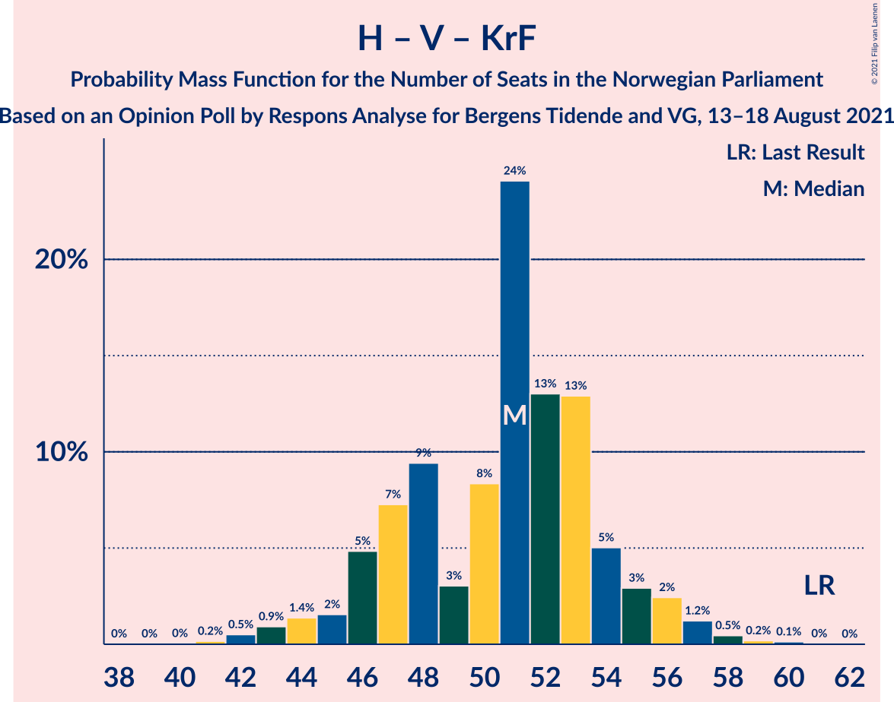

| Number of Seats | Probability | Accumulated | Special Marks |
|:---------------:|:-----------:|:-----------:|:-------------:|
| 39 | 0% | 100% |  |
| 40 | 0% | 99.9% |  |
| 41 | 0.2% | 99.9% |  |
| 42 | 0.5% | 99.7% |  |
| 43 | 0.9% | 99.2% |  |
| 44 | 1.4% | 98% |  |
| 45 | 2% | 97% |  |
| 46 | 5% | 95% |  |
| 47 | 7% | 91% |  |
| 48 | 9% | 83% |  |
| 49 | 3% | 74% |  |
| 50 | 8% | 71% |  |
| 51 | 24% | 62% |  |
| 52 | 13% | 38% | Median |
| 53 | 13% | 25% |  |
| 54 | 5% | 12% |  |
| 55 | 3% | 7% |  |
| 56 | 2% | 4% |  |
| 57 | 1.2% | 2% |  |
| 58 | 0.5% | 0.8% |  |
| 59 | 0.2% | 0.4% |  |
| 60 | 0.1% | 0.2% |  |
| 61 | 0% | 0.1% | Last Result |
| 62 | 0% | 0% |  |

### Senterpartiet – Venstre – Kristelig Folkeparti

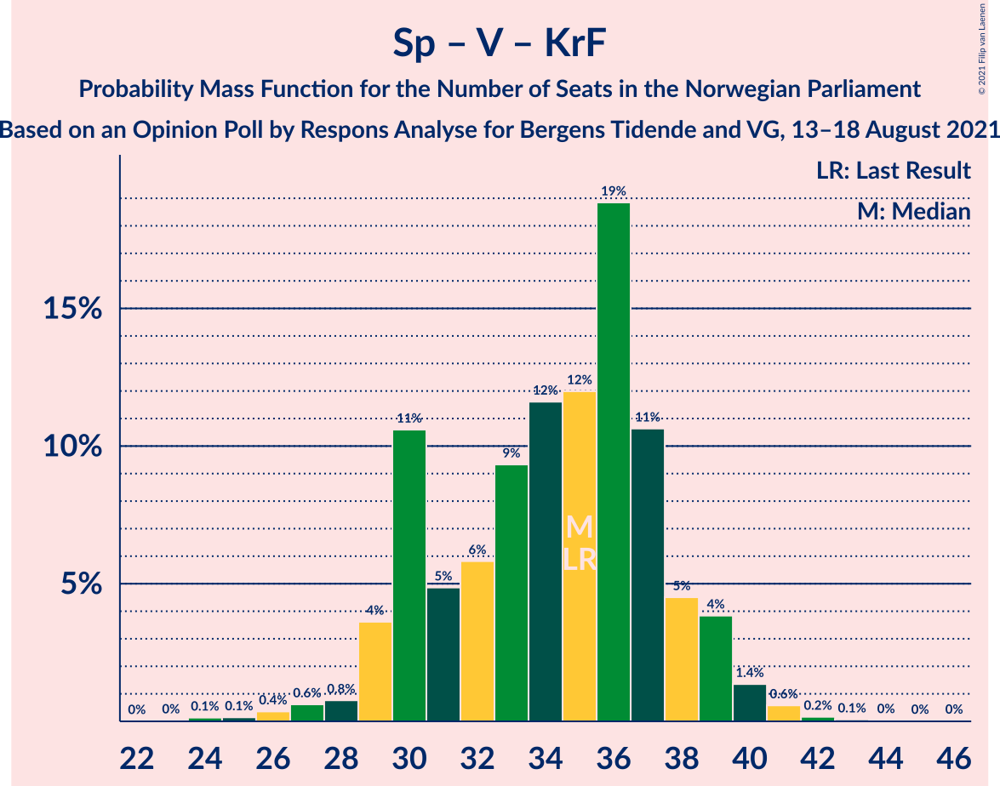

| Number of Seats | Probability | Accumulated | Special Marks |
|:---------------:|:-----------:|:-----------:|:-------------:|
| 24 | 0.1% | 100% |  |
| 25 | 0.1% | 99.8% |  |
| 26 | 0.4% | 99.7% |  |
| 27 | 0.6% | 99.3% |  |
| 28 | 0.8% | 98.7% |  |
| 29 | 4% | 98% |  |
| 30 | 11% | 94% |  |
| 31 | 5% | 84% |  |
| 32 | 6% | 79% |  |
| 33 | 9% | 73% |  |
| 34 | 12% | 64% |  |
| 35 | 12% | 52% | Last Result |
| 36 | 19% | 40% | Median |
| 37 | 11% | 21% |  |
| 38 | 5% | 11% |  |
| 39 | 4% | 6% |  |
| 40 | 1.4% | 2% |  |
| 41 | 0.6% | 0.9% |  |
| 42 | 0.2% | 0.3% |  |
| 43 | 0.1% | 0.2% |  |
| 44 | 0% | 0.1% |  |
| 45 | 0% | 0.1% |  |
| 46 | 0% | 0% |  |

## Technical Information

### Opinion Poll

+ **Polling firm:** Respons Analyse
+ **Commissioner(s):** Bergens Tidende and VG
+ **Fieldwork period:** 13–18 August 2021

### Calculations

+ **Sample size:** 1001
+ **Simulations done:** 1,048,576
+ **Error estimate:** 0.90%

