# Opinion Poll by Kantar TNS for TV2, 16–20 August 2021

<a href="#voting-intentions">Voting Intentions</a> | <a href="#seats">Seats</a> | <a href="#coalitions">Coalitions</a> | <a href="#technical-information">Technical Information</a>

## Voting Intentions

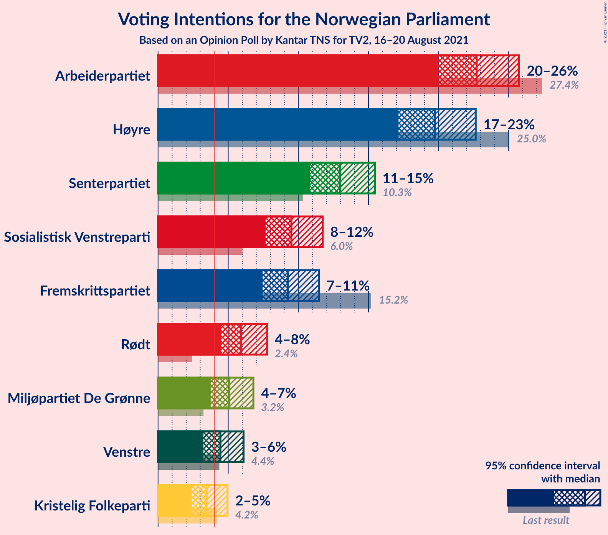

### Confidence Intervals

| Party | Last Result | Poll Result | 80% Confidence Interval | 90% Confidence Interval | 95% Confidence Interval | 99% Confidence Interval |
|:-----:|:-----------:|:-----------:|:-----------------------:|:-----------------------:|:-----------------------:|:-----------------------:|
| Arbeiderpartiet | 27.4% | 22.7% | 20.9–24.7% |20.4–25.3% |20.0–25.7% |19.1–26.7% |
| Høyre | 25.0% | 19.8% | 18.0–21.6% |17.6–22.2% |17.1–22.6% |16.4–23.6% |
| Senterpartiet | 10.3% | 13.0% | 11.6–14.6% |11.2–15.1% |10.8–15.5% |10.2–16.3% |
| Sosialistisk Venstreparti | 6.0% | 9.5% | 8.3–11.0% |8.0–11.4% |7.7–11.7% |7.1–12.5% |
| Fremskrittspartiet | 15.2% | 9.3% | 8.1–10.7% |7.7–11.1% |7.5–11.5% |6.9–12.2% |
| Rødt | 2.4% | 5.9% | 5.0–7.1% |4.7–7.5% |4.5–7.8% |4.1–8.4% |
| Miljøpartiet De Grønne | 3.2% | 5.1% | 4.2–6.2% |3.9–6.5% |3.7–6.8% |3.4–7.4% |
| Venstre | 4.4% | 4.4% | 3.6–5.5% |3.4–5.8% |3.2–6.1% |2.9–6.7% |
| Kristelig Folkeparti | 4.2% | 3.5% | 2.8–4.4% |2.6–4.7% |2.4–5.0% |2.1–5.5% |

*Note:* The poll result column reflects the actual value used in the calculations. Published results may vary slightly, and in addition be rounded to fewer digits.

## Seats

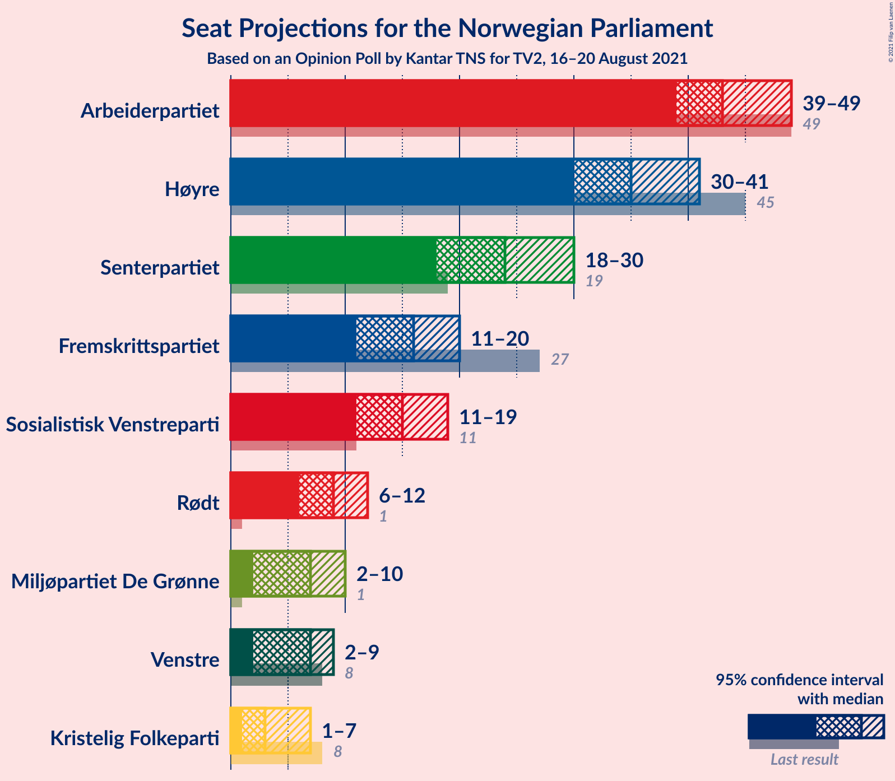

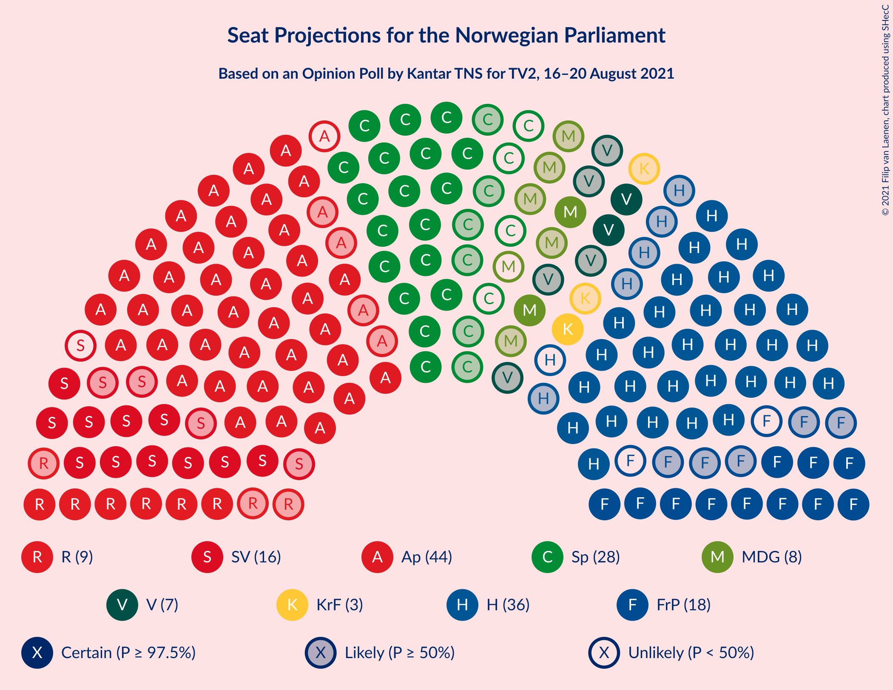

### Confidence Intervals

| Party | Last Result | Median | 80% Confidence Interval | 90% Confidence Interval | 95% Confidence Interval | 99% Confidence Interval |
|:-----:|:-----------:|:------:|:-----------------------:|:-----------------------:|:-----------------------:|:-----------------------:|
| <a href="#arbeiderpartiet">Arbeiderpartiet</a> | 49 | 43 | 40–47 |40–48 |39–49 |37–51 |
| <a href="#høyre">Høyre</a> | 45 | 35 | 32–38 |31–40 |30–41 |29–45 |
| <a href="#senterpartiet">Senterpartiet</a> | 19 | 24 | 20–28 |19–29 |18–30 |18–33 |
| <a href="#sosialistisk-venstreparti">Sosialistisk Venstreparti</a> | 11 | 15 | 12–17 |11–18 |11–19 |10–20 |
| <a href="#fremskrittspartiet">Fremskrittspartiet</a> | 27 | 16 | 13–18 |12–19 |11–20 |9–22 |
| <a href="#rødt">Rødt</a> | 1 | 9 | 7–11 |7–11 |6–12 |2–13 |
| <a href="#miljøpartiet-de-grønne">Miljøpartiet De Grønne</a> | 1 | 7 | 6–9 |3–10 |2–10 |2–11 |
| <a href="#venstre">Venstre</a> | 8 | 7 | 2–8 |2–9 |2–9 |2–10 |
| <a href="#kristelig-folkeparti">Kristelig Folkeparti</a> | 8 | 3 | 1–6 |1–7 |1–7 |0–8 |

### Arbeiderpartiet

*For a full overview of the results for this party, see the [Arbeiderpartiet](party-arbeiderpartiet.html) page.*

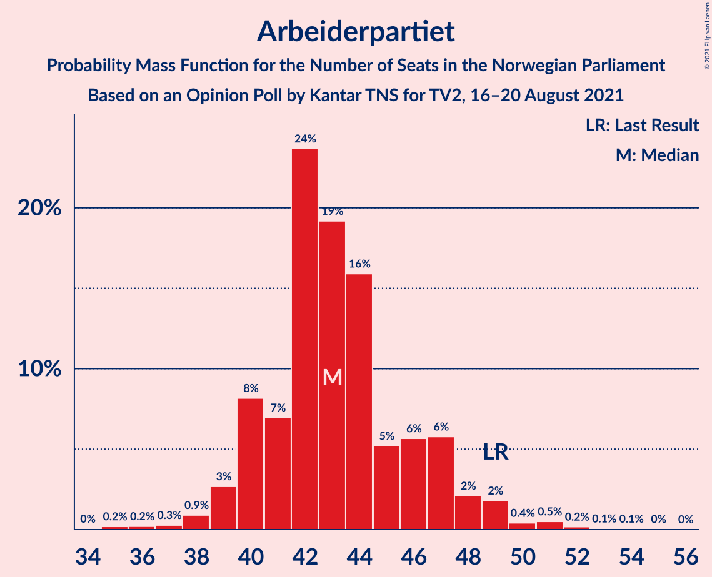

| Number of Seats | Probability | Accumulated | Special Marks |
|:---------------:|:-----------:|:-----------:|:-------------:|
| 34 | 0% | 100% |  |
| 35 | 0.2% | 99.9% |  |
| 36 | 0.2% | 99.7% |  |
| 37 | 0.3% | 99.5% |  |
| 38 | 0.9% | 99.3% |  |
| 39 | 3% | 98% |  |
| 40 | 8% | 96% |  |
| 41 | 7% | 88% |  |
| 42 | 24% | 81% |  |
| 43 | 19% | 57% | Median |
| 44 | 16% | 38% |  |
| 45 | 5% | 22% |  |
| 46 | 6% | 17% |  |
| 47 | 6% | 11% |  |
| 48 | 2% | 5% |  |
| 49 | 2% | 3% | Last Result |
| 50 | 0.4% | 1.3% |  |
| 51 | 0.5% | 0.8% |  |
| 52 | 0.2% | 0.3% |  |
| 53 | 0.1% | 0.2% |  |
| 54 | 0.1% | 0.1% |  |
| 55 | 0% | 0.1% |  |
| 56 | 0% | 0% |  |

### Høyre

*For a full overview of the results for this party, see the [Høyre](party-høyre.html) page.*

| Number of Seats | Probability | Accumulated | Special Marks |
|:---------------:|:-----------:|:-----------:|:-------------:|
| 28 | 0.3% | 100% |  |
| 29 | 1.0% | 99.7% |  |
| 30 | 2% | 98.7% |  |
| 31 | 3% | 97% |  |
| 32 | 5% | 94% |  |
| 33 | 7% | 89% |  |
| 34 | 11% | 81% |  |
| 35 | 24% | 70% | Median |
| 36 | 26% | 47% |  |
| 37 | 7% | 21% |  |
| 38 | 5% | 13% |  |
| 39 | 2% | 8% |  |
| 40 | 2% | 6% |  |
| 41 | 1.3% | 4% |  |
| 42 | 1.0% | 2% |  |
| 43 | 0.4% | 1.3% |  |
| 44 | 0.3% | 0.9% |  |
| 45 | 0.3% | 0.6% | Last Result |
| 46 | 0.2% | 0.3% |  |
| 47 | 0% | 0.1% |  |
| 48 | 0% | 0% |  |

### Senterpartiet

*For a full overview of the results for this party, see the [Senterpartiet](party-senterpartiet.html) page.*

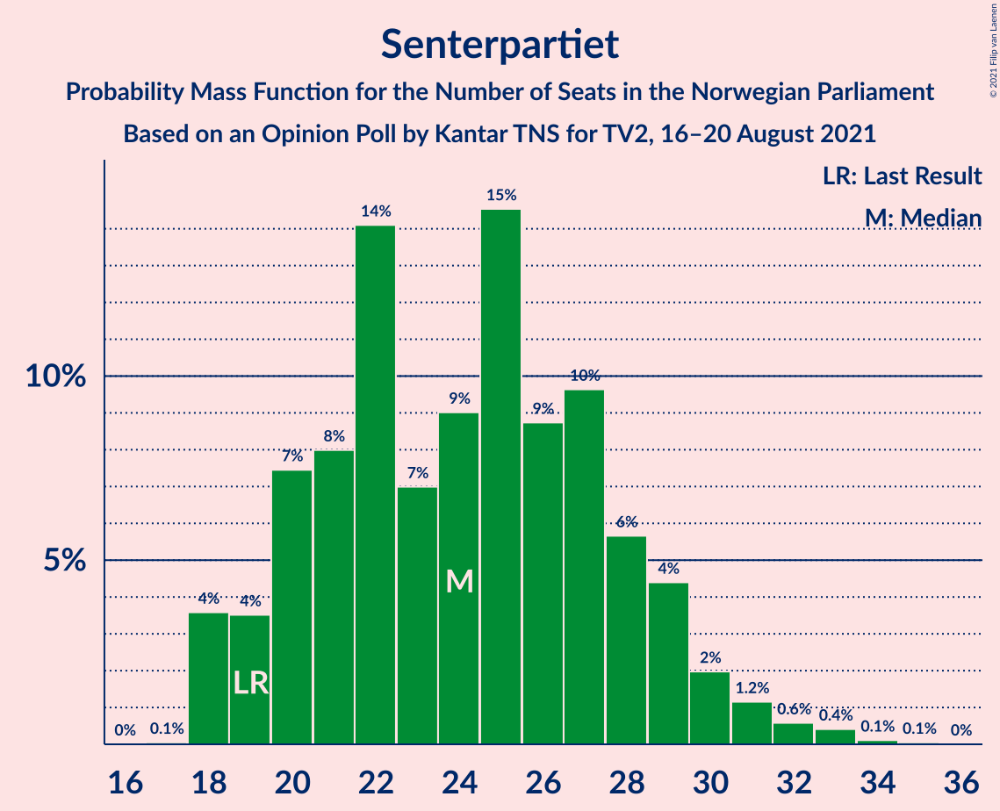

| Number of Seats | Probability | Accumulated | Special Marks |
|:---------------:|:-----------:|:-----------:|:-------------:|
| 17 | 0.1% | 100% |  |
| 18 | 4% | 99.9% |  |
| 19 | 4% | 96% | Last Result |
| 20 | 7% | 93% |  |
| 21 | 8% | 85% |  |
| 22 | 14% | 77% |  |
| 23 | 7% | 63% |  |
| 24 | 9% | 56% | Median |
| 25 | 15% | 47% |  |
| 26 | 9% | 33% |  |
| 27 | 10% | 24% |  |
| 28 | 6% | 14% |  |
| 29 | 4% | 9% |  |
| 30 | 2% | 4% |  |
| 31 | 1.2% | 2% |  |
| 32 | 0.6% | 1.2% |  |
| 33 | 0.4% | 0.6% |  |
| 34 | 0.1% | 0.2% |  |
| 35 | 0.1% | 0.1% |  |
| 36 | 0% | 0% |  |

### Sosialistisk Venstreparti

*For a full overview of the results for this party, see the [Sosialistisk Venstreparti](party-sosialistiskvenstreparti.html) page.*

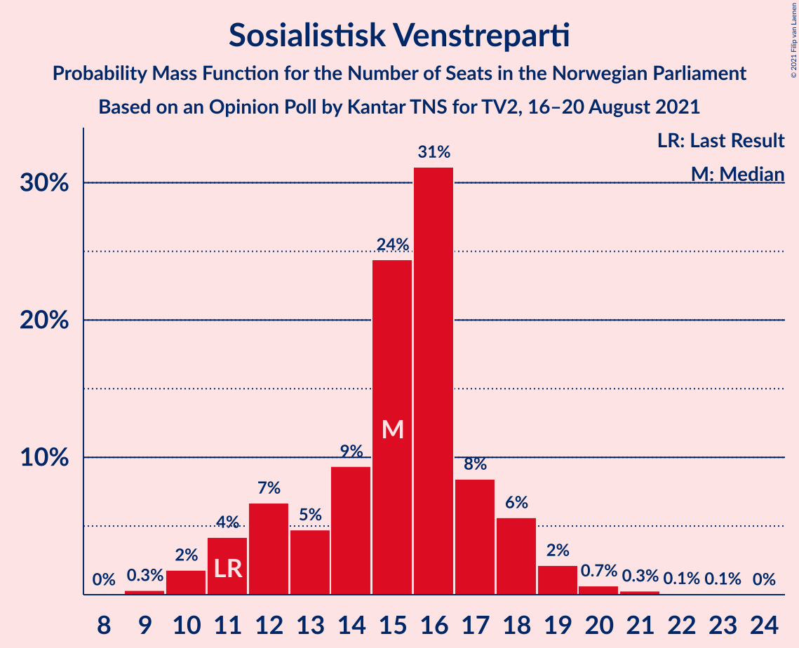

| Number of Seats | Probability | Accumulated | Special Marks |
|:---------------:|:-----------:|:-----------:|:-------------:|
| 9 | 0.3% | 100% |  |
| 10 | 2% | 99.7% |  |
| 11 | 4% | 98% | Last Result |
| 12 | 7% | 94% |  |
| 13 | 5% | 87% |  |
| 14 | 9% | 82% |  |
| 15 | 24% | 73% | Median |
| 16 | 31% | 48% |  |
| 17 | 8% | 17% |  |
| 18 | 6% | 9% |  |
| 19 | 2% | 3% |  |
| 20 | 0.7% | 1.1% |  |
| 21 | 0.3% | 0.5% |  |
| 22 | 0.1% | 0.2% |  |
| 23 | 0.1% | 0.1% |  |
| 24 | 0% | 0% |  |

### Fremskrittspartiet

*For a full overview of the results for this party, see the [Fremskrittspartiet](party-fremskrittspartiet.html) page.*

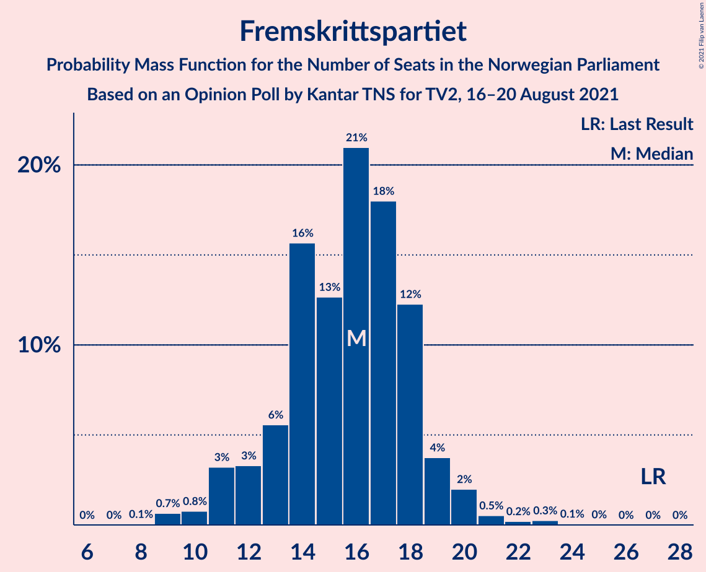

| Number of Seats | Probability | Accumulated | Special Marks |
|:---------------:|:-----------:|:-----------:|:-------------:|
| 8 | 0.1% | 100% |  |
| 9 | 0.7% | 99.9% |  |
| 10 | 0.8% | 99.3% |  |
| 11 | 3% | 98.5% |  |
| 12 | 3% | 95% |  |
| 13 | 6% | 92% |  |
| 14 | 16% | 86% |  |
| 15 | 13% | 71% |  |
| 16 | 21% | 58% | Median |
| 17 | 18% | 37% |  |
| 18 | 12% | 19% |  |
| 19 | 4% | 7% |  |
| 20 | 2% | 3% |  |
| 21 | 0.5% | 1.1% |  |
| 22 | 0.2% | 0.6% |  |
| 23 | 0.3% | 0.4% |  |
| 24 | 0.1% | 0.1% |  |
| 25 | 0% | 0% |  |
| 26 | 0% | 0% |  |
| 27 | 0% | 0% | Last Result |

### Rødt

*For a full overview of the results for this party, see the [Rødt](party-rødt.html) page.*

| Number of Seats | Probability | Accumulated | Special Marks |
|:---------------:|:-----------:|:-----------:|:-------------:|
| 1 | 0% | 100% | Last Result |
| 2 | 0.6% | 100% |  |
| 3 | 0% | 99.4% |  |
| 4 | 0% | 99.4% |  |
| 5 | 0.4% | 99.4% |  |
| 6 | 3% | 99.0% |  |
| 7 | 9% | 96% |  |
| 8 | 20% | 87% |  |
| 9 | 37% | 66% | Median |
| 10 | 19% | 30% |  |
| 11 | 8% | 11% |  |
| 12 | 3% | 3% |  |
| 13 | 0.5% | 0.6% |  |
| 14 | 0.1% | 0.1% |  |
| 15 | 0% | 0% |  |

### Miljøpartiet De Grønne

*For a full overview of the results for this party, see the [Miljøpartiet De Grønne](party-miljøpartietdegrønne.html) page.*

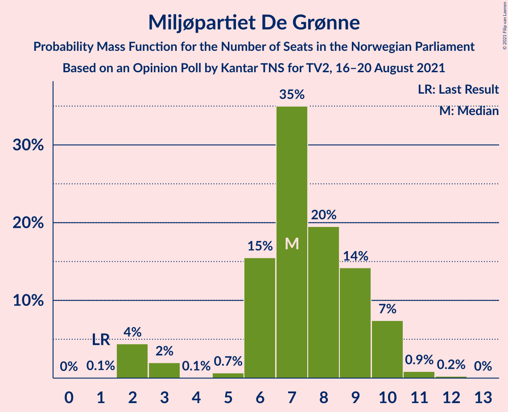

| Number of Seats | Probability | Accumulated | Special Marks |
|:---------------:|:-----------:|:-----------:|:-------------:|
| 1 | 0.1% | 100% | Last Result |
| 2 | 4% | 99.9% |  |
| 3 | 2% | 95% |  |
| 4 | 0.1% | 93% |  |
| 5 | 0.7% | 93% |  |
| 6 | 15% | 93% |  |
| 7 | 35% | 77% | Median |
| 8 | 20% | 42% |  |
| 9 | 14% | 23% |  |
| 10 | 7% | 9% |  |
| 11 | 0.9% | 1.1% |  |
| 12 | 0.2% | 0.3% |  |
| 13 | 0% | 0% |  |

### Venstre

*For a full overview of the results for this party, see the [Venstre](party-venstre.html) page.*

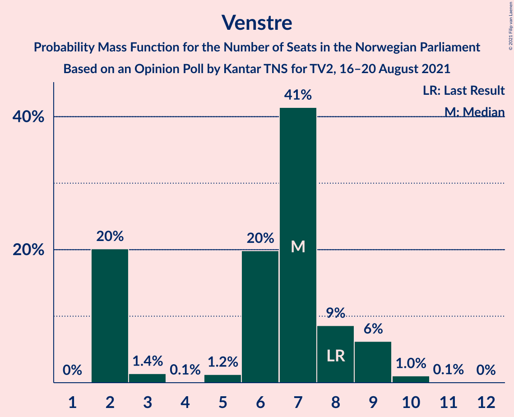

| Number of Seats | Probability | Accumulated | Special Marks |
|:---------------:|:-----------:|:-----------:|:-------------:|
| 2 | 20% | 100% |  |
| 3 | 1.4% | 80% |  |
| 4 | 0.1% | 78% |  |
| 5 | 1.2% | 78% |  |
| 6 | 20% | 77% |  |
| 7 | 41% | 57% | Median |
| 8 | 9% | 16% | Last Result |
| 9 | 6% | 7% |  |
| 10 | 1.0% | 1.1% |  |
| 11 | 0.1% | 0.1% |  |
| 12 | 0% | 0% |  |

### Kristelig Folkeparti

*For a full overview of the results for this party, see the [Kristelig Folkeparti](party-kristeligfolkeparti.html) page.*

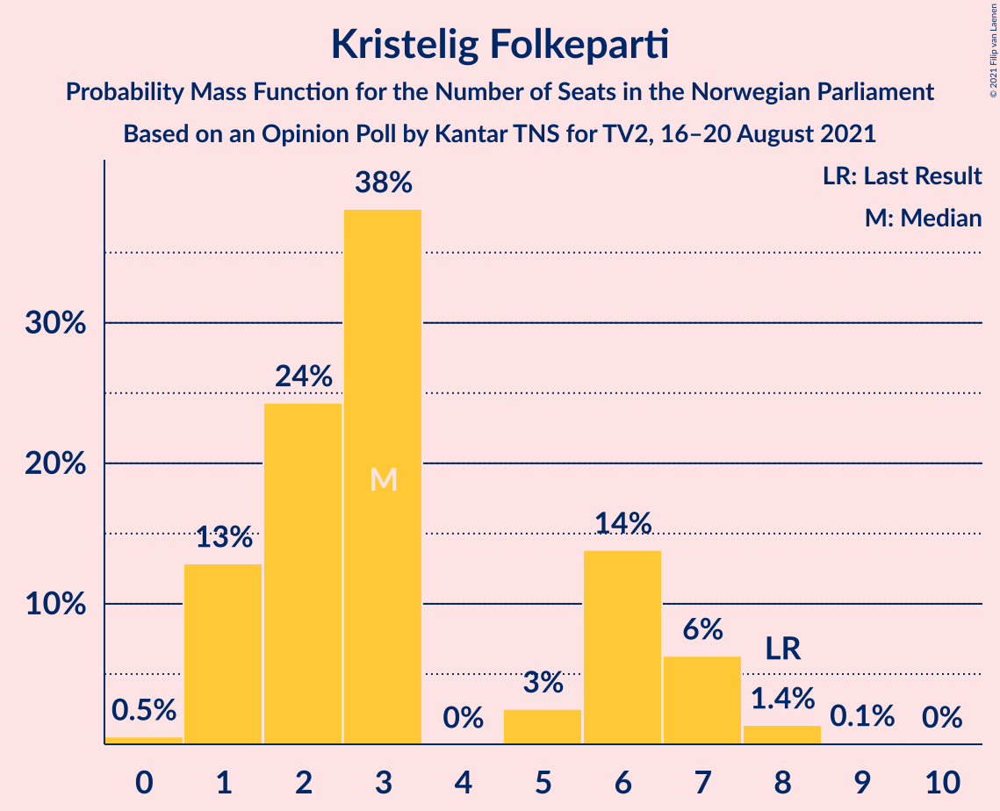

| Number of Seats | Probability | Accumulated | Special Marks |
|:---------------:|:-----------:|:-----------:|:-------------:|
| 0 | 0.5% | 100% |  |
| 1 | 13% | 99.5% |  |
| 2 | 24% | 87% |  |
| 3 | 38% | 62% | Median |
| 4 | 0% | 24% |  |
| 5 | 3% | 24% |  |
| 6 | 14% | 22% |  |
| 7 | 6% | 8% |  |
| 8 | 1.4% | 2% | Last Result |
| 9 | 0.1% | 0.1% |  |
| 10 | 0% | 0% |  |

## Coalitions

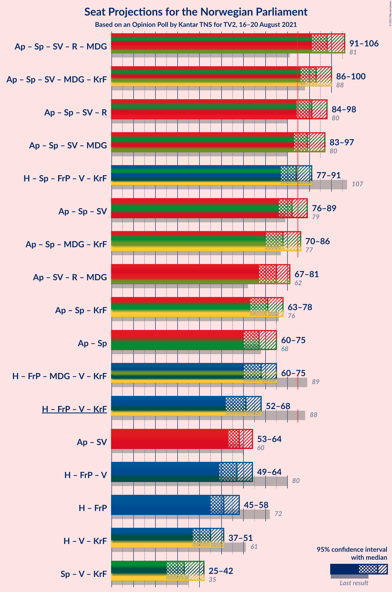

### Confidence Intervals

| Coalition | Last Result | Median | Majority? | 80% Confidence Interval | 90% Confidence Interval | 95% Confidence Interval | 99% Confidence Interval |
|:---------:|:-----------:|:------:|:---------:|:-----------------------:|:-----------------------:|:-----------------------:|:-----------------------:|
| Arbeiderpartiet – Senterpartiet – Sosialistisk Venstreparti – Rødt – Miljøpartiet De Grønne | 81 | 98 | 100% | 94–103 | 93–105 | 91–106 | 88–108 |
| Arbeiderpartiet – Senterpartiet – Sosialistisk Venstreparti – Miljøpartiet De Grønne – Kristelig Folkeparti | 88 | 93 | 98.7% | 88–98 | 87–99 | 86–100 | 83–102 |
| Arbeiderpartiet – Senterpartiet – Sosialistisk Venstreparti – Rødt | 80 | 91 | 97% | 87–96 | 86–97 | 84–98 | 82–100 |
| Arbeiderpartiet – Senterpartiet – Sosialistisk Venstreparti – Miljøpartiet De Grønne | 80 | 89 | 94% | 85–94 | 84–96 | 83–97 | 80–99 |
| Høyre – Senterpartiet – Fremskrittspartiet – Venstre – Kristelig Folkeparti | 107 | 84 | 42% | 80–89 | 79–90 | 77–91 | 75–95 |
| Arbeiderpartiet – Senterpartiet – Sosialistisk Venstreparti | 79 | 82 | 27% | 78–87 | 77–88 | 76–89 | 74–91 |
| Arbeiderpartiet – Senterpartiet – Miljøpartiet De Grønne – Kristelig Folkeparti | 77 | 78 | 6% | 73–83 | 71–85 | 70–86 | 68–88 |
| Arbeiderpartiet – Sosialistisk Venstreparti – Rødt – Miljøpartiet De Grønne | 62 | 75 | 0.2% | 70–79 | 69–80 | 67–81 | 66–84 |
| Arbeiderpartiet – Senterpartiet – Kristelig Folkeparti | 76 | 71 | 0% | 66–76 | 64–77 | 63–78 | 61–81 |
| Arbeiderpartiet – Senterpartiet | 68 | 67 | 0% | 63–72 | 61–74 | 60–75 | 59–76 |
| Høyre – Fremskrittspartiet – Miljøpartiet De Grønne – Venstre – Kristelig Folkeparti | 89 | 68 | 0% | 62–72 | 61–73 | 60–75 | 58–77 |
| Høyre – Fremskrittspartiet – Venstre – Kristelig Folkeparti | 88 | 61 | 0% | 54–64 | 53–66 | 52–68 | 51–70 |
| Arbeiderpartiet – Sosialistisk Venstreparti | 60 | 58 | 0% | 55–62 | 54–63 | 53–64 | 50–67 |
| Høyre – Fremskrittspartiet – Venstre | 80 | 57 | 0% | 52–61 | 51–63 | 49–64 | 48–67 |
| Høyre – Fremskrittspartiet | 72 | 51 | 0% | 47–55 | 46–56 | 45–58 | 43–60 |
| Høyre – Venstre – Kristelig Folkeparti | 61 | 45 | 0% | 40–49 | 38–50 | 37–51 | 36–54 |
| Senterpartiet – Venstre – Kristelig Folkeparti | 35 | 33 | 0% | 29–39 | 27–40 | 25–42 | 23–43 |

### Arbeiderpartiet – Senterpartiet – Sosialistisk Venstreparti – Rødt – Miljøpartiet De Grønne

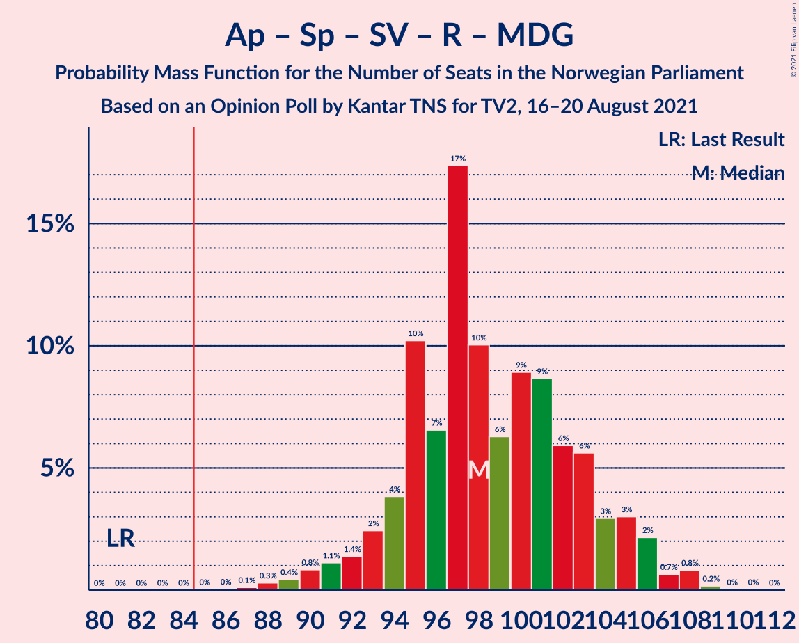

| Number of Seats | Probability | Accumulated | Special Marks |
|:---------------:|:-----------:|:-----------:|:-------------:|
| 81 | 0% | 100% | Last Result |
| 82 | 0% | 100% |  |
| 83 | 0% | 100% |  |
| 84 | 0% | 100% |  |
| 85 | 0% | 100% | Majority |
| 86 | 0% | 100% |  |
| 87 | 0.1% | 99.9% |  |
| 88 | 0.3% | 99.8% |  |
| 89 | 0.4% | 99.5% |  |
| 90 | 0.8% | 99.1% |  |
| 91 | 1.1% | 98% |  |
| 92 | 1.4% | 97% |  |
| 93 | 2% | 96% |  |
| 94 | 4% | 93% |  |
| 95 | 10% | 89% |  |
| 96 | 7% | 79% |  |
| 97 | 17% | 73% |  |
| 98 | 10% | 55% | Median |
| 99 | 6% | 45% |  |
| 100 | 9% | 39% |  |
| 101 | 9% | 30% |  |
| 102 | 6% | 21% |  |
| 103 | 6% | 15% |  |
| 104 | 3% | 10% |  |
| 105 | 3% | 7% |  |
| 106 | 2% | 4% |  |
| 107 | 0.7% | 2% |  |
| 108 | 0.8% | 1.1% |  |
| 109 | 0.2% | 0.3% |  |
| 110 | 0% | 0.1% |  |
| 111 | 0% | 0% |  |

### Arbeiderpartiet – Senterpartiet – Sosialistisk Venstreparti – Miljøpartiet De Grønne – Kristelig Folkeparti

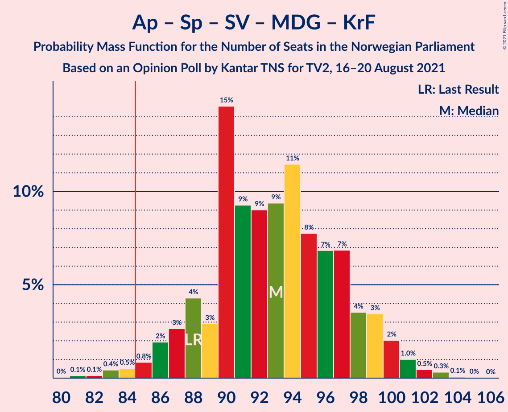

| Number of Seats | Probability | Accumulated | Special Marks |
|:---------------:|:-----------:|:-----------:|:-------------:|
| 80 | 0% | 100% |  |
| 81 | 0.1% | 99.9% |  |
| 82 | 0.1% | 99.8% |  |
| 83 | 0.4% | 99.7% |  |
| 84 | 0.5% | 99.2% |  |
| 85 | 0.8% | 98.7% | Majority |
| 86 | 2% | 98% |  |
| 87 | 3% | 96% |  |
| 88 | 4% | 93% | Last Result |
| 89 | 3% | 89% |  |
| 90 | 15% | 86% |  |
| 91 | 9% | 72% |  |
| 92 | 9% | 62% | Median |
| 93 | 9% | 53% |  |
| 94 | 11% | 44% |  |
| 95 | 8% | 32% |  |
| 96 | 7% | 25% |  |
| 97 | 7% | 18% |  |
| 98 | 4% | 11% |  |
| 99 | 3% | 7% |  |
| 100 | 2% | 4% |  |
| 101 | 1.0% | 2% |  |
| 102 | 0.5% | 0.9% |  |
| 103 | 0.3% | 0.5% |  |
| 104 | 0.1% | 0.1% |  |
| 105 | 0% | 0.1% |  |
| 106 | 0% | 0% |  |

### Arbeiderpartiet – Senterpartiet – Sosialistisk Venstreparti – Rødt

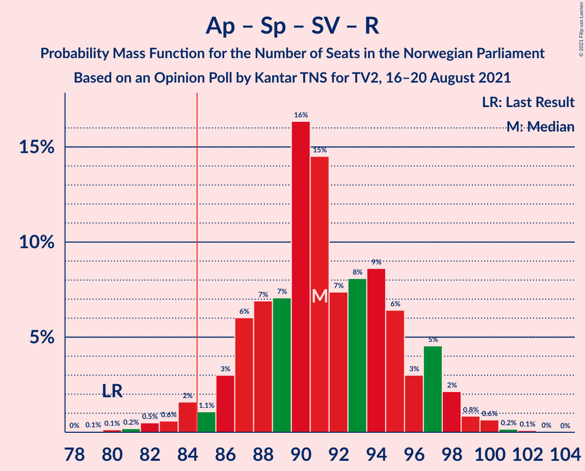

| Number of Seats | Probability | Accumulated | Special Marks |
|:---------------:|:-----------:|:-----------:|:-------------:|
| 79 | 0.1% | 100% |  |
| 80 | 0.1% | 99.9% | Last Result |
| 81 | 0.2% | 99.8% |  |
| 82 | 0.5% | 99.6% |  |
| 83 | 0.6% | 99.1% |  |
| 84 | 2% | 98% |  |
| 85 | 1.1% | 97% | Majority |
| 86 | 3% | 96% |  |
| 87 | 6% | 93% |  |
| 88 | 7% | 87% |  |
| 89 | 7% | 80% |  |
| 90 | 16% | 73% |  |
| 91 | 15% | 56% | Median |
| 92 | 7% | 42% |  |
| 93 | 8% | 35% |  |
| 94 | 9% | 27% |  |
| 95 | 6% | 18% |  |
| 96 | 3% | 11% |  |
| 97 | 5% | 8% |  |
| 98 | 2% | 4% |  |
| 99 | 0.8% | 2% |  |
| 100 | 0.6% | 1.0% |  |
| 101 | 0.2% | 0.3% |  |
| 102 | 0.1% | 0.1% |  |
| 103 | 0% | 0% |  |

### Arbeiderpartiet – Senterpartiet – Sosialistisk Venstreparti – Miljøpartiet De Grønne

| Number of Seats | Probability | Accumulated | Special Marks |
|:---------------:|:-----------:|:-----------:|:-------------:|
| 77 | 0% | 100% |  |
| 78 | 0.2% | 99.9% |  |
| 79 | 0.1% | 99.8% |  |
| 80 | 0.2% | 99.6% | Last Result |
| 81 | 0.6% | 99.4% |  |
| 82 | 1.2% | 98.8% |  |
| 83 | 2% | 98% |  |
| 84 | 2% | 96% |  |
| 85 | 6% | 94% | Majority |
| 86 | 5% | 87% |  |
| 87 | 7% | 82% |  |
| 88 | 15% | 75% |  |
| 89 | 12% | 59% | Median |
| 90 | 8% | 47% |  |
| 91 | 10% | 39% |  |
| 92 | 7% | 29% |  |
| 93 | 8% | 22% |  |
| 94 | 5% | 14% |  |
| 95 | 3% | 10% |  |
| 96 | 3% | 6% |  |
| 97 | 2% | 4% |  |
| 98 | 0.9% | 2% |  |
| 99 | 0.9% | 1.1% |  |
| 100 | 0.2% | 0.2% |  |
| 101 | 0% | 0.1% |  |
| 102 | 0% | 0.1% |  |
| 103 | 0% | 0% |  |

### Høyre – Senterpartiet – Fremskrittspartiet – Venstre – Kristelig Folkeparti

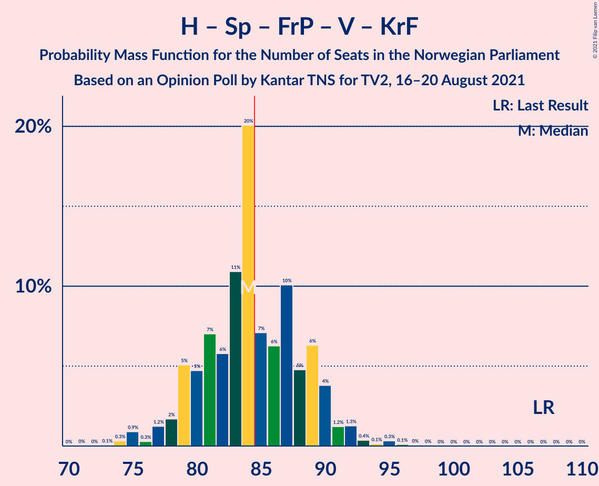

| Number of Seats | Probability | Accumulated | Special Marks |
|:---------------:|:-----------:|:-----------:|:-------------:|
| 72 | 0% | 100% |  |
| 73 | 0.1% | 99.9% |  |
| 74 | 0.3% | 99.9% |  |
| 75 | 0.9% | 99.6% |  |
| 76 | 0.3% | 98.7% |  |
| 77 | 1.2% | 98% |  |
| 78 | 2% | 97% |  |
| 79 | 5% | 95% |  |
| 80 | 5% | 90% |  |
| 81 | 7% | 86% |  |
| 82 | 6% | 79% |  |
| 83 | 11% | 73% |  |
| 84 | 20% | 62% |  |
| 85 | 7% | 42% | Median, Majority |
| 86 | 6% | 35% |  |
| 87 | 10% | 28% |  |
| 88 | 5% | 18% |  |
| 89 | 6% | 14% |  |
| 90 | 4% | 7% |  |
| 91 | 1.2% | 4% |  |
| 92 | 1.3% | 2% |  |
| 93 | 0.4% | 1.0% |  |
| 94 | 0.1% | 0.7% |  |
| 95 | 0.3% | 0.5% |  |
| 96 | 0.1% | 0.2% |  |
| 97 | 0% | 0.1% |  |
| 98 | 0% | 0% |  |
| 99 | 0% | 0% |  |
| 100 | 0% | 0% |  |
| 101 | 0% | 0% |  |
| 102 | 0% | 0% |  |
| 103 | 0% | 0% |  |
| 104 | 0% | 0% |  |
| 105 | 0% | 0% |  |
| 106 | 0% | 0% |  |
| 107 | 0% | 0% | Last Result |

### Arbeiderpartiet – Senterpartiet – Sosialistisk Venstreparti

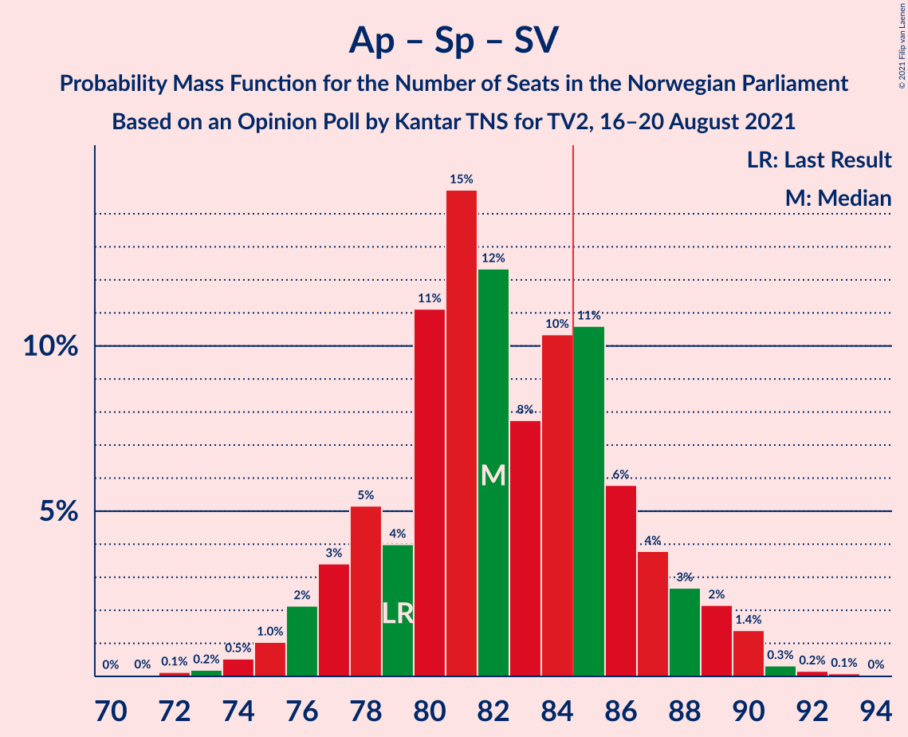

| Number of Seats | Probability | Accumulated | Special Marks |
|:---------------:|:-----------:|:-----------:|:-------------:|
| 71 | 0% | 100% |  |
| 72 | 0.1% | 99.9% |  |
| 73 | 0.2% | 99.8% |  |
| 74 | 0.5% | 99.6% |  |
| 75 | 1.0% | 99.1% |  |
| 76 | 2% | 98% |  |
| 77 | 3% | 96% |  |
| 78 | 5% | 92% |  |
| 79 | 4% | 87% | Last Result |
| 80 | 11% | 83% |  |
| 81 | 15% | 72% |  |
| 82 | 12% | 57% | Median |
| 83 | 8% | 45% |  |
| 84 | 10% | 37% |  |
| 85 | 11% | 27% | Majority |
| 86 | 6% | 16% |  |
| 87 | 4% | 11% |  |
| 88 | 3% | 7% |  |
| 89 | 2% | 4% |  |
| 90 | 1.4% | 2% |  |
| 91 | 0.3% | 0.6% |  |
| 92 | 0.2% | 0.3% |  |
| 93 | 0.1% | 0.1% |  |
| 94 | 0% | 0% |  |

### Arbeiderpartiet – Senterpartiet – Miljøpartiet De Grønne – Kristelig Folkeparti

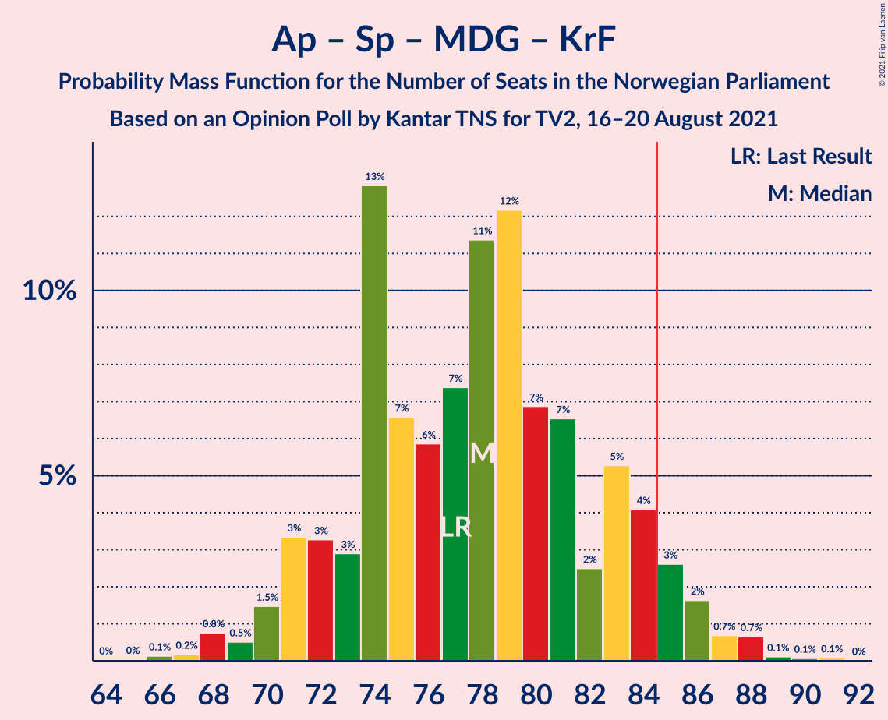

| Number of Seats | Probability | Accumulated | Special Marks |
|:---------------:|:-----------:|:-----------:|:-------------:|
| 65 | 0% | 100% |  |
| 66 | 0.1% | 99.9% |  |
| 67 | 0.2% | 99.8% |  |
| 68 | 0.8% | 99.6% |  |
| 69 | 0.5% | 98.9% |  |
| 70 | 1.5% | 98% |  |
| 71 | 3% | 97% |  |
| 72 | 3% | 94% |  |
| 73 | 3% | 90% |  |
| 74 | 13% | 87% |  |
| 75 | 7% | 75% |  |
| 76 | 6% | 68% |  |
| 77 | 7% | 62% | Last Result, Median |
| 78 | 11% | 55% |  |
| 79 | 12% | 43% |  |
| 80 | 7% | 31% |  |
| 81 | 7% | 24% |  |
| 82 | 2% | 18% |  |
| 83 | 5% | 15% |  |
| 84 | 4% | 10% |  |
| 85 | 3% | 6% | Majority |
| 86 | 2% | 3% |  |
| 87 | 0.7% | 2% |  |
| 88 | 0.7% | 0.9% |  |
| 89 | 0.1% | 0.3% |  |
| 90 | 0.1% | 0.2% |  |
| 91 | 0.1% | 0.1% |  |
| 92 | 0% | 0% |  |

### Arbeiderpartiet – Sosialistisk Venstreparti – Rødt – Miljøpartiet De Grønne

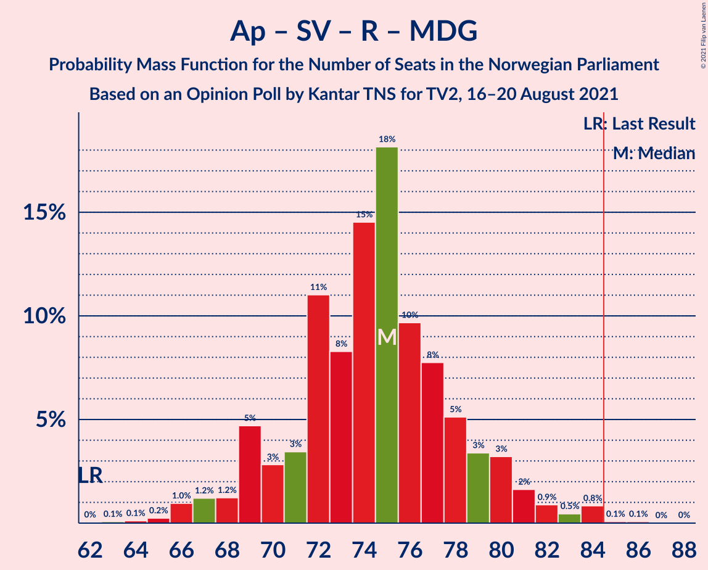

| Number of Seats | Probability | Accumulated | Special Marks |
|:---------------:|:-----------:|:-----------:|:-------------:|
| 62 | 0% | 100% | Last Result |
| 63 | 0.1% | 99.9% |  |
| 64 | 0.1% | 99.9% |  |
| 65 | 0.2% | 99.7% |  |
| 66 | 1.0% | 99.5% |  |
| 67 | 1.2% | 98.5% |  |
| 68 | 1.2% | 97% |  |
| 69 | 5% | 96% |  |
| 70 | 3% | 91% |  |
| 71 | 3% | 89% |  |
| 72 | 11% | 85% |  |
| 73 | 8% | 74% |  |
| 74 | 15% | 66% | Median |
| 75 | 18% | 51% |  |
| 76 | 10% | 33% |  |
| 77 | 8% | 23% |  |
| 78 | 5% | 16% |  |
| 79 | 3% | 11% |  |
| 80 | 3% | 7% |  |
| 81 | 2% | 4% |  |
| 82 | 0.9% | 2% |  |
| 83 | 0.5% | 1.5% |  |
| 84 | 0.8% | 1.0% |  |
| 85 | 0.1% | 0.2% | Majority |
| 86 | 0.1% | 0.1% |  |
| 87 | 0% | 0% |  |

### Arbeiderpartiet – Senterpartiet – Kristelig Folkeparti

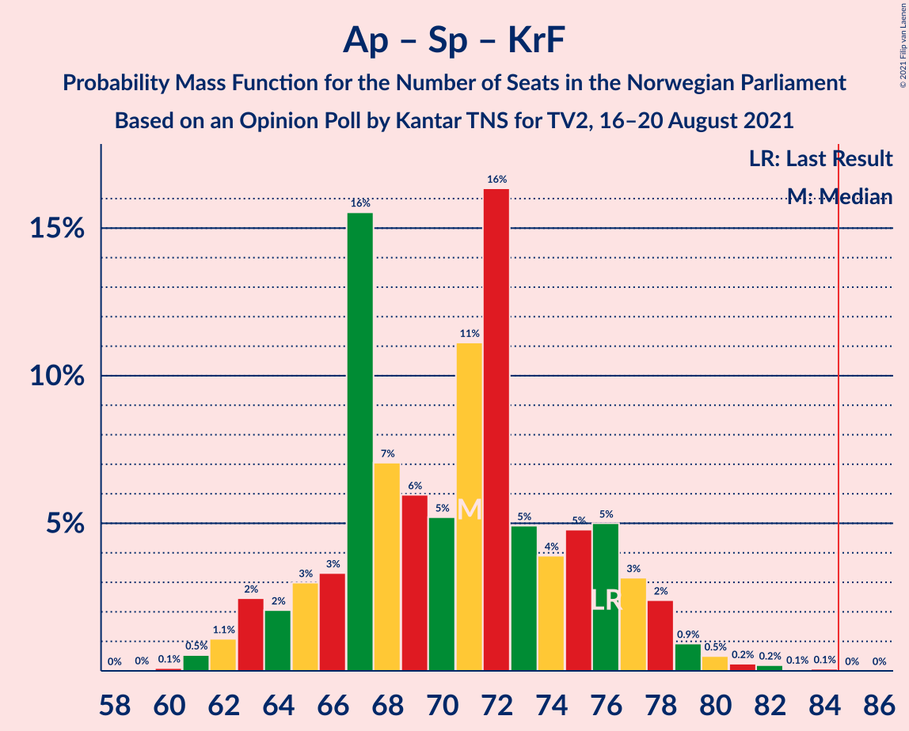

| Number of Seats | Probability | Accumulated | Special Marks |
|:---------------:|:-----------:|:-----------:|:-------------:|
| 60 | 0.1% | 100% |  |
| 61 | 0.5% | 99.9% |  |
| 62 | 1.1% | 99.3% |  |
| 63 | 2% | 98% |  |
| 64 | 2% | 96% |  |
| 65 | 3% | 94% |  |
| 66 | 3% | 91% |  |
| 67 | 16% | 87% |  |
| 68 | 7% | 72% |  |
| 69 | 6% | 65% |  |
| 70 | 5% | 59% | Median |
| 71 | 11% | 54% |  |
| 72 | 16% | 43% |  |
| 73 | 5% | 26% |  |
| 74 | 4% | 21% |  |
| 75 | 5% | 17% |  |
| 76 | 5% | 13% | Last Result |
| 77 | 3% | 8% |  |
| 78 | 2% | 4% |  |
| 79 | 0.9% | 2% |  |
| 80 | 0.5% | 1.1% |  |
| 81 | 0.2% | 0.6% |  |
| 82 | 0.2% | 0.3% |  |
| 83 | 0.1% | 0.1% |  |
| 84 | 0.1% | 0.1% |  |
| 85 | 0% | 0% | Majority |

### Arbeiderpartiet – Senterpartiet

| Number of Seats | Probability | Accumulated | Special Marks |
|:---------------:|:-----------:|:-----------:|:-------------:|
| 57 | 0% | 100% |  |
| 58 | 0.2% | 99.9% |  |
| 59 | 1.2% | 99.8% |  |
| 60 | 2% | 98.6% |  |
| 61 | 4% | 97% |  |
| 62 | 3% | 93% |  |
| 63 | 4% | 90% |  |
| 64 | 7% | 86% |  |
| 65 | 15% | 78% |  |
| 66 | 11% | 63% |  |
| 67 | 5% | 52% | Median |
| 68 | 9% | 47% | Last Result |
| 69 | 10% | 38% |  |
| 70 | 9% | 27% |  |
| 71 | 5% | 19% |  |
| 72 | 5% | 13% |  |
| 73 | 3% | 9% |  |
| 74 | 3% | 5% |  |
| 75 | 1.3% | 3% |  |
| 76 | 1.0% | 1.4% |  |
| 77 | 0.2% | 0.5% |  |
| 78 | 0.2% | 0.3% |  |
| 79 | 0.1% | 0.1% |  |
| 80 | 0% | 0% |  |

### Høyre – Fremskrittspartiet – Miljøpartiet De Grønne – Venstre – Kristelig Folkeparti

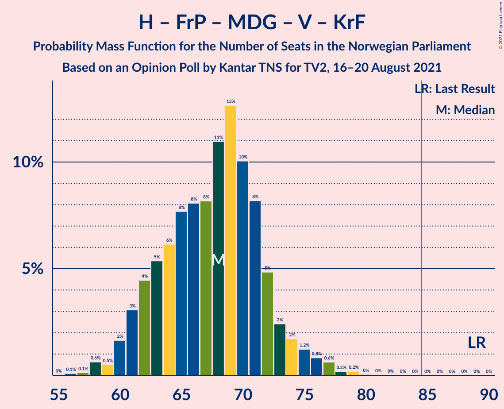

| Number of Seats | Probability | Accumulated | Special Marks |
|:---------------:|:-----------:|:-----------:|:-------------:|
| 56 | 0.1% | 100% |  |
| 57 | 0.1% | 99.9% |  |
| 58 | 0.6% | 99.8% |  |
| 59 | 0.5% | 99.1% |  |
| 60 | 2% | 98.6% |  |
| 61 | 3% | 97% |  |
| 62 | 4% | 94% |  |
| 63 | 5% | 89% |  |
| 64 | 6% | 84% |  |
| 65 | 8% | 78% |  |
| 66 | 8% | 70% |  |
| 67 | 8% | 62% |  |
| 68 | 11% | 54% | Median |
| 69 | 13% | 43% |  |
| 70 | 10% | 30% |  |
| 71 | 8% | 20% |  |
| 72 | 5% | 12% |  |
| 73 | 2% | 7% |  |
| 74 | 2% | 5% |  |
| 75 | 1.2% | 3% |  |
| 76 | 0.8% | 2% |  |
| 77 | 0.6% | 1.1% |  |
| 78 | 0.2% | 0.5% |  |
| 79 | 0.2% | 0.3% |  |
| 80 | 0% | 0.1% |  |
| 81 | 0% | 0.1% |  |
| 82 | 0% | 0% |  |
| 83 | 0% | 0% |  |
| 84 | 0% | 0% |  |
| 85 | 0% | 0% | Majority |
| 86 | 0% | 0% |  |
| 87 | 0% | 0% |  |
| 88 | 0% | 0% |  |
| 89 | 0% | 0% | Last Result |

### Høyre – Fremskrittspartiet – Venstre – Kristelig Folkeparti

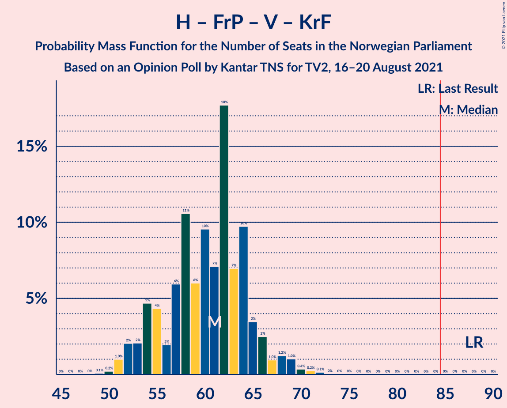

| Number of Seats | Probability | Accumulated | Special Marks |
|:---------------:|:-----------:|:-----------:|:-------------:|
| 49 | 0.1% | 100% |  |
| 50 | 0.2% | 99.9% |  |
| 51 | 1.0% | 99.7% |  |
| 52 | 2% | 98.7% |  |
| 53 | 2% | 97% |  |
| 54 | 5% | 95% |  |
| 55 | 4% | 90% |  |
| 56 | 2% | 86% |  |
| 57 | 6% | 84% |  |
| 58 | 11% | 78% |  |
| 59 | 6% | 67% |  |
| 60 | 10% | 61% |  |
| 61 | 7% | 52% | Median |
| 62 | 18% | 44% |  |
| 63 | 7% | 27% |  |
| 64 | 10% | 20% |  |
| 65 | 3% | 10% |  |
| 66 | 2% | 7% |  |
| 67 | 1.0% | 4% |  |
| 68 | 1.2% | 3% |  |
| 69 | 1.0% | 2% |  |
| 70 | 0.4% | 0.8% |  |
| 71 | 0.2% | 0.5% |  |
| 72 | 0.1% | 0.2% |  |
| 73 | 0% | 0.1% |  |
| 74 | 0% | 0% |  |
| 75 | 0% | 0% |  |
| 76 | 0% | 0% |  |
| 77 | 0% | 0% |  |
| 78 | 0% | 0% |  |
| 79 | 0% | 0% |  |
| 80 | 0% | 0% |  |
| 81 | 0% | 0% |  |
| 82 | 0% | 0% |  |
| 83 | 0% | 0% |  |
| 84 | 0% | 0% |  |
| 85 | 0% | 0% | Majority |
| 86 | 0% | 0% |  |
| 87 | 0% | 0% |  |
| 88 | 0% | 0% | Last Result |

### Arbeiderpartiet – Sosialistisk Venstreparti

| Number of Seats | Probability | Accumulated | Special Marks |
|:---------------:|:-----------:|:-----------:|:-------------:|
| 48 | 0.1% | 100% |  |
| 49 | 0.1% | 99.9% |  |
| 50 | 0.3% | 99.8% |  |
| 51 | 0.5% | 99.5% |  |
| 52 | 1.1% | 98.9% |  |
| 53 | 2% | 98% |  |
| 54 | 3% | 96% |  |
| 55 | 5% | 92% |  |
| 56 | 12% | 87% |  |
| 57 | 14% | 76% |  |
| 58 | 17% | 62% | Median |
| 59 | 17% | 44% |  |
| 60 | 10% | 28% | Last Result |
| 61 | 5% | 18% |  |
| 62 | 5% | 13% |  |
| 63 | 4% | 8% |  |
| 64 | 2% | 4% |  |
| 65 | 2% | 2% |  |
| 66 | 0.4% | 0.9% |  |
| 67 | 0.3% | 0.5% |  |
| 68 | 0.2% | 0.2% |  |
| 69 | 0% | 0.1% |  |
| 70 | 0% | 0% |  |

### Høyre – Fremskrittspartiet – Venstre

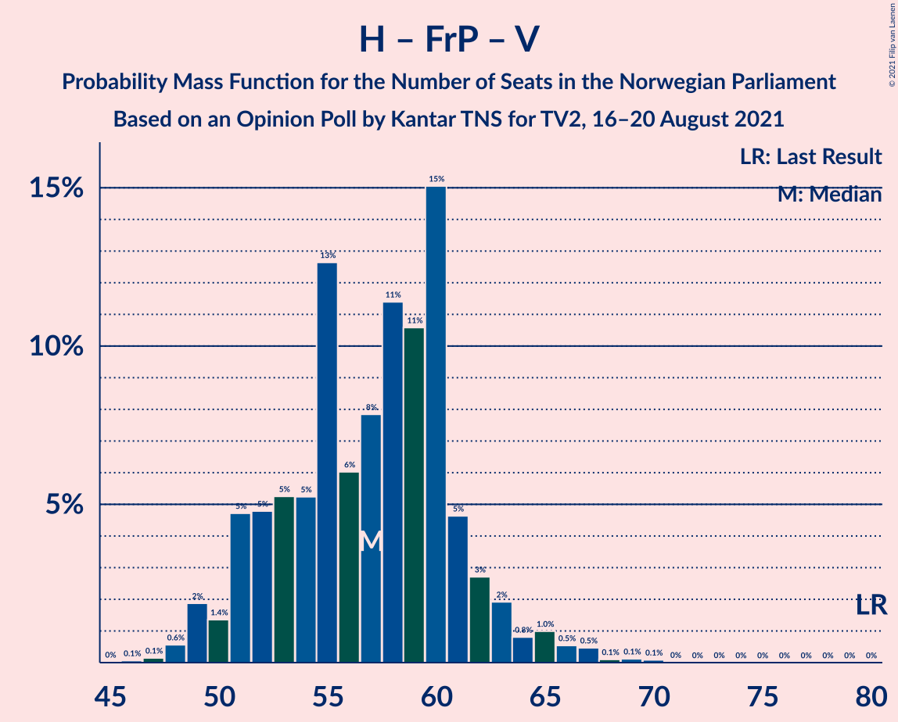

| Number of Seats | Probability | Accumulated | Special Marks |
|:---------------:|:-----------:|:-----------:|:-------------:|
| 46 | 0.1% | 100% |  |
| 47 | 0.1% | 99.9% |  |
| 48 | 0.6% | 99.8% |  |
| 49 | 2% | 99.2% |  |
| 50 | 1.4% | 97% |  |
| 51 | 5% | 96% |  |
| 52 | 5% | 91% |  |
| 53 | 5% | 86% |  |
| 54 | 5% | 81% |  |
| 55 | 13% | 76% |  |
| 56 | 6% | 63% |  |
| 57 | 8% | 57% |  |
| 58 | 11% | 49% | Median |
| 59 | 11% | 38% |  |
| 60 | 15% | 27% |  |
| 61 | 5% | 12% |  |
| 62 | 3% | 8% |  |
| 63 | 2% | 5% |  |
| 64 | 0.8% | 3% |  |
| 65 | 1.0% | 2% |  |
| 66 | 0.5% | 1.3% |  |
| 67 | 0.5% | 0.8% |  |
| 68 | 0.1% | 0.3% |  |
| 69 | 0.1% | 0.2% |  |
| 70 | 0.1% | 0.1% |  |
| 71 | 0% | 0% |  |
| 72 | 0% | 0% |  |
| 73 | 0% | 0% |  |
| 74 | 0% | 0% |  |
| 75 | 0% | 0% |  |
| 76 | 0% | 0% |  |
| 77 | 0% | 0% |  |
| 78 | 0% | 0% |  |
| 79 | 0% | 0% |  |
| 80 | 0% | 0% | Last Result |

### Høyre – Fremskrittspartiet

| Number of Seats | Probability | Accumulated | Special Marks |
|:---------------:|:-----------:|:-----------:|:-------------:|
| 41 | 0.1% | 100% |  |
| 42 | 0.2% | 99.9% |  |
| 43 | 0.5% | 99.7% |  |
| 44 | 0.6% | 99.2% |  |
| 45 | 2% | 98.6% |  |
| 46 | 6% | 97% |  |
| 47 | 5% | 90% |  |
| 48 | 8% | 86% |  |
| 49 | 13% | 78% |  |
| 50 | 7% | 65% |  |
| 51 | 11% | 58% | Median |
| 52 | 10% | 47% |  |
| 53 | 20% | 37% |  |
| 54 | 6% | 17% |  |
| 55 | 5% | 11% |  |
| 56 | 2% | 6% |  |
| 57 | 1.2% | 4% |  |
| 58 | 1.1% | 3% |  |
| 59 | 0.8% | 2% |  |
| 60 | 0.6% | 1.1% |  |
| 61 | 0.3% | 0.5% |  |
| 62 | 0.1% | 0.2% |  |
| 63 | 0% | 0.1% |  |
| 64 | 0% | 0% |  |
| 65 | 0% | 0% |  |
| 66 | 0% | 0% |  |
| 67 | 0% | 0% |  |
| 68 | 0% | 0% |  |
| 69 | 0% | 0% |  |
| 70 | 0% | 0% |  |
| 71 | 0% | 0% |  |
| 72 | 0% | 0% | Last Result |

### Høyre – Venstre – Kristelig Folkeparti

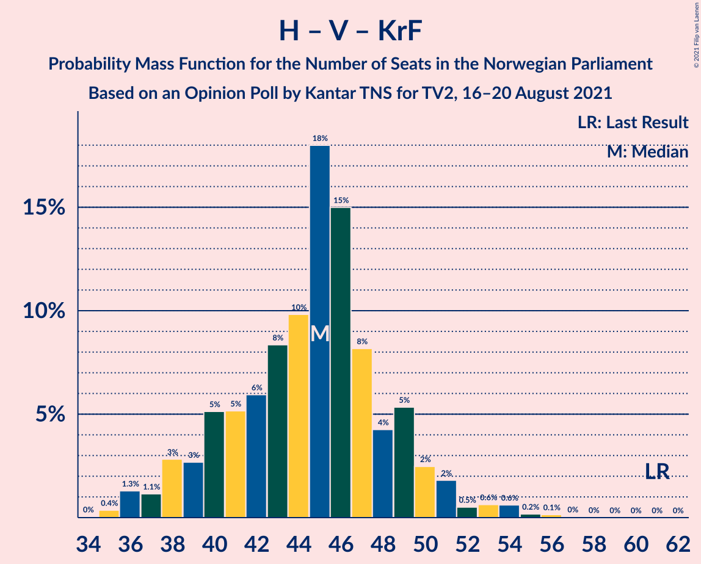

| Number of Seats | Probability | Accumulated | Special Marks |
|:---------------:|:-----------:|:-----------:|:-------------:|
| 34 | 0% | 100% |  |
| 35 | 0.4% | 99.9% |  |
| 36 | 1.3% | 99.6% |  |
| 37 | 1.1% | 98% |  |
| 38 | 3% | 97% |  |
| 39 | 3% | 94% |  |
| 40 | 5% | 92% |  |
| 41 | 5% | 86% |  |
| 42 | 6% | 81% |  |
| 43 | 8% | 75% |  |
| 44 | 10% | 67% |  |
| 45 | 18% | 57% | Median |
| 46 | 15% | 39% |  |
| 47 | 8% | 24% |  |
| 48 | 4% | 16% |  |
| 49 | 5% | 12% |  |
| 50 | 2% | 6% |  |
| 51 | 2% | 4% |  |
| 52 | 0.5% | 2% |  |
| 53 | 0.6% | 2% |  |
| 54 | 0.6% | 1.0% |  |
| 55 | 0.2% | 0.4% |  |
| 56 | 0.1% | 0.2% |  |
| 57 | 0% | 0.1% |  |
| 58 | 0% | 0% |  |
| 59 | 0% | 0% |  |
| 60 | 0% | 0% |  |
| 61 | 0% | 0% | Last Result |

### Senterpartiet – Venstre – Kristelig Folkeparti

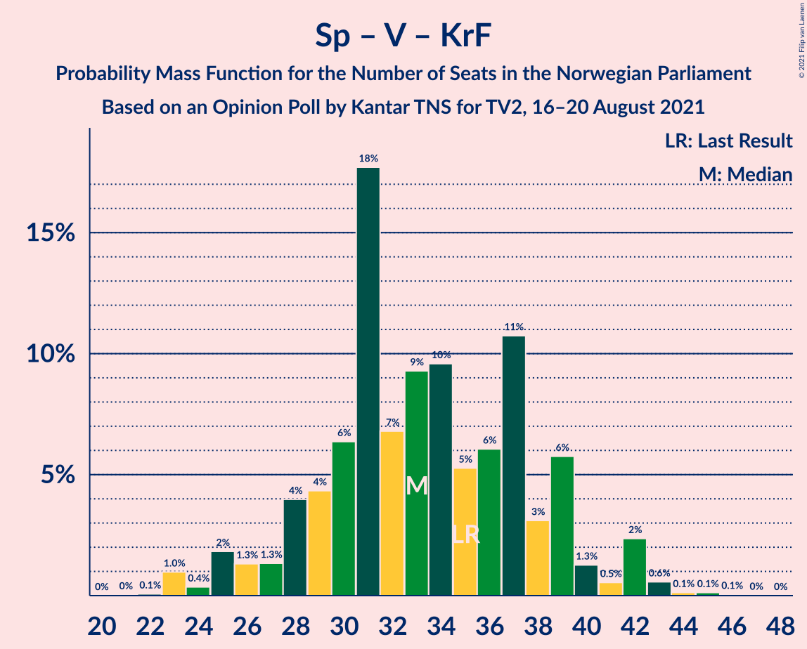

| Number of Seats | Probability | Accumulated | Special Marks |
|:---------------:|:-----------:|:-----------:|:-------------:|
| 22 | 0.1% | 100% |  |
| 23 | 1.0% | 99.9% |  |
| 24 | 0.4% | 98.9% |  |
| 25 | 2% | 98.6% |  |
| 26 | 1.3% | 97% |  |
| 27 | 1.3% | 95% |  |
| 28 | 4% | 94% |  |
| 29 | 4% | 90% |  |
| 30 | 6% | 86% |  |
| 31 | 18% | 79% |  |
| 32 | 7% | 62% |  |
| 33 | 9% | 55% |  |
| 34 | 10% | 46% | Median |
| 35 | 5% | 36% | Last Result |
| 36 | 6% | 31% |  |
| 37 | 11% | 25% |  |
| 38 | 3% | 14% |  |
| 39 | 6% | 11% |  |
| 40 | 1.3% | 5% |  |
| 41 | 0.5% | 4% |  |
| 42 | 2% | 3% |  |
| 43 | 0.6% | 0.9% |  |
| 44 | 0.1% | 0.3% |  |
| 45 | 0.1% | 0.2% |  |
| 46 | 0.1% | 0.1% |  |
| 47 | 0% | 0% |  |

## Technical Information

### Opinion Poll

+ **Polling firm:** Kantar TNS
+ **Commissioner(s):** TV2
+ **Fieldwork period:** 16–20 August 2021

### Calculations

+ **Sample size:** 810
+ **Simulations done:** 1,048,576
+ **Error estimate:** 2.51%

