# Opinion Poll by Norstat for Aftenposten, 16–22 August 2021

<a href="#voting-intentions">Voting Intentions</a> | <a href="#seats">Seats</a> | <a href="#coalitions">Coalitions</a> | <a href="#technical-information">Technical Information</a>

## Voting Intentions

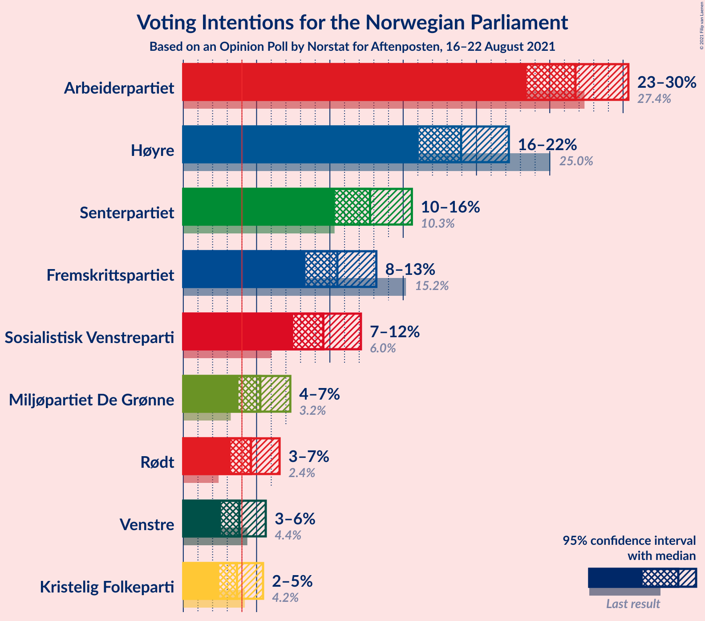

### Confidence Intervals

| Party | Last Result | Poll Result | 80% Confidence Interval | 90% Confidence Interval | 95% Confidence Interval | 99% Confidence Interval |
|:-----:|:-----------:|:-----------:|:-----------------------:|:-----------------------:|:-----------------------:|:-----------------------:|
| Arbeiderpartiet | 27.4% | 26.8% | 24.6–29.1% |24.0–29.8% |23.4–30.4% |22.4–31.5% |
| Høyre | 25.0% | 18.9% | 17.1–21.1% |16.5–21.7% |16.1–22.2% |15.2–23.3% |
| Senterpartiet | 10.3% | 12.7% | 11.2–14.6% |10.7–15.1% |10.3–15.6% |9.6–16.5% |
| Fremskrittspartiet | 15.2% | 10.5% | 9.1–12.2% |8.7–12.7% |8.3–13.2% |7.7–14.0% |
| Sosialistisk Venstreparti | 6.0% | 9.6% | 8.2–11.2% |7.8–11.7% |7.5–12.1% |6.9–13.0% |
| Miljøpartiet De Grønne | 3.2% | 5.3% | 4.3–6.6% |4.0–7.0% |3.8–7.3% |3.3–8.0% |
| Rødt | 2.4% | 4.6% | 3.7–5.9% |3.4–6.2% |3.2–6.6% |2.9–7.2% |
| Venstre | 4.4% | 3.8% | 3.0–5.0% |2.8–5.3% |2.6–5.6% |2.2–6.2% |
| Kristelig Folkeparti | 4.2% | 3.7% | 2.9–4.8% |2.6–5.2% |2.5–5.4% |2.1–6.1% |

*Note:* The poll result column reflects the actual value used in the calculations. Published results may vary slightly, and in addition be rounded to fewer digits.

## Seats

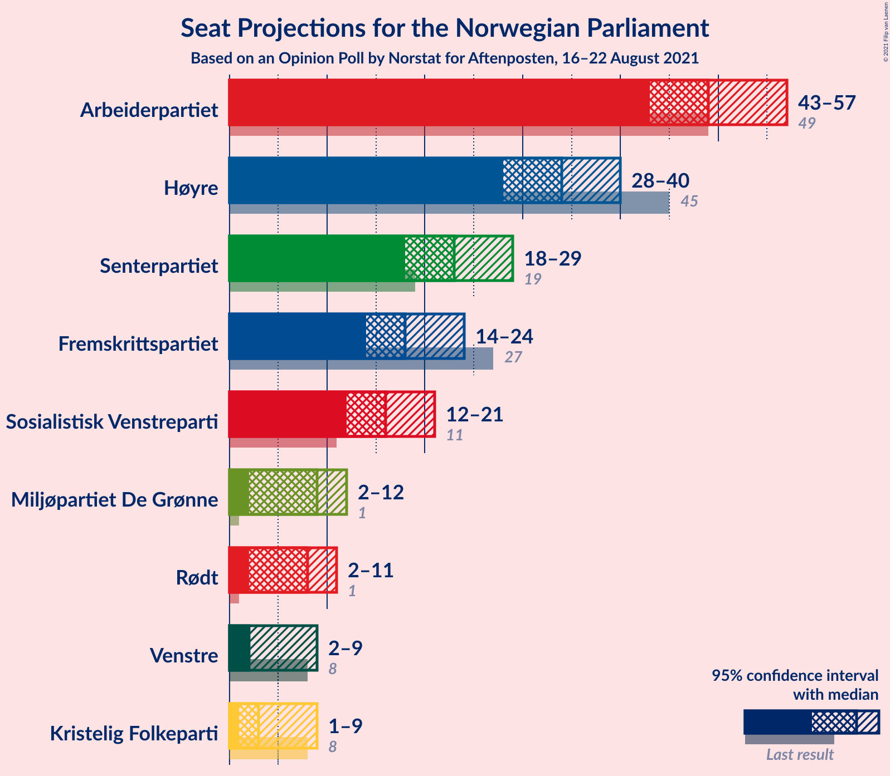

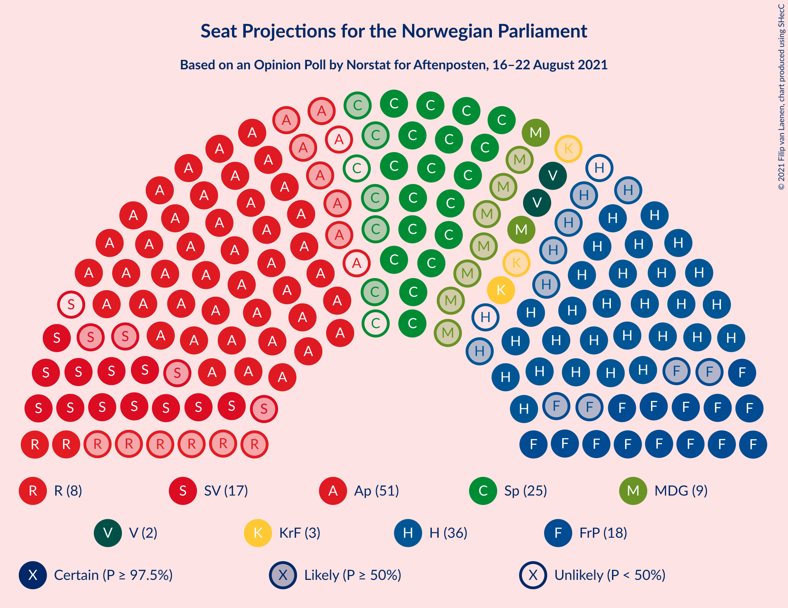

### Confidence Intervals

| Party | Last Result | Median | 80% Confidence Interval | 90% Confidence Interval | 95% Confidence Interval | 99% Confidence Interval |
|:-----:|:-----------:|:------:|:-----------------------:|:-----------------------:|:-----------------------:|:-----------------------:|
| <a href="#arbeiderpartiet">Arbeiderpartiet</a> | 49 | 49 | 44–55 |43–56 |43–57 |41–59 |
| <a href="#høyre">Høyre</a> | 45 | 34 | 30–37 |29–38 |28–40 |26–42 |
| <a href="#senterpartiet">Senterpartiet</a> | 19 | 23 | 20–27 |19–28 |18–29 |17–31 |
| <a href="#fremskrittspartiet">Fremskrittspartiet</a> | 27 | 18 | 15–21 |14–22 |14–24 |12–26 |
| <a href="#sosialistisk-venstreparti">Sosialistisk Venstreparti</a> | 11 | 16 | 13–19 |12–20 |12–21 |10–22 |
| <a href="#miljøpartiet-de-grønne">Miljøpartiet De Grønne</a> | 1 | 9 | 7–11 |6–12 |2–12 |2–13 |
| <a href="#rødt">Rødt</a> | 1 | 8 | 2–10 |2–11 |2–11 |1–13 |
| <a href="#venstre">Venstre</a> | 8 | 2 | 2–8 |2–9 |2–9 |1–10 |
| <a href="#kristelig-folkeparti">Kristelig Folkeparti</a> | 8 | 3 | 1–8 |1–8 |1–9 |1–10 |

### Arbeiderpartiet

*For a full overview of the results for this party, see the [Arbeiderpartiet](party-arbeiderpartiet.html) page.*

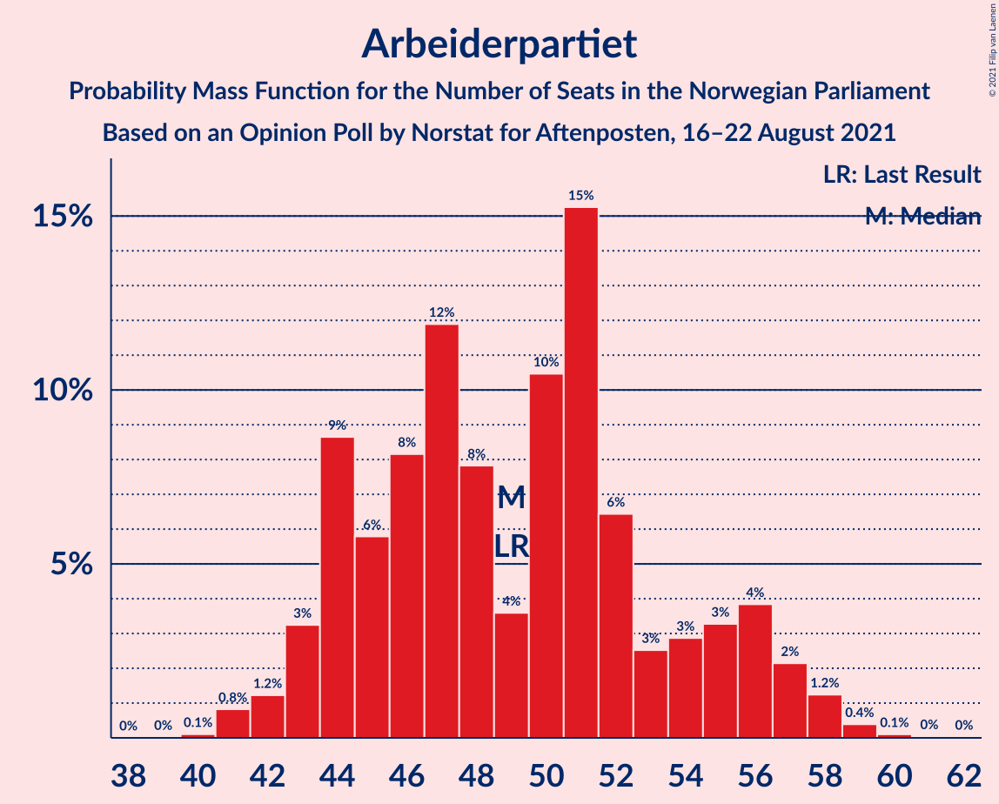

| Number of Seats | Probability | Accumulated | Special Marks |
|:---------------:|:-----------:|:-----------:|:-------------:|
| 40 | 0.1% | 100% |  |
| 41 | 0.8% | 99.9% |  |
| 42 | 1.2% | 99.0% |  |
| 43 | 3% | 98% |  |
| 44 | 9% | 95% |  |
| 45 | 6% | 86% |  |
| 46 | 8% | 80% |  |
| 47 | 12% | 72% |  |
| 48 | 8% | 60% |  |
| 49 | 4% | 52% | Last Result, Median |
| 50 | 10% | 49% |  |
| 51 | 15% | 38% |  |
| 52 | 6% | 23% |  |
| 53 | 3% | 16% |  |
| 54 | 3% | 14% |  |
| 55 | 3% | 11% |  |
| 56 | 4% | 8% |  |
| 57 | 2% | 4% |  |
| 58 | 1.2% | 2% |  |
| 59 | 0.4% | 0.6% |  |
| 60 | 0.1% | 0.2% |  |
| 61 | 0% | 0.1% |  |
| 62 | 0% | 0% |  |

### Høyre

*For a full overview of the results for this party, see the [Høyre](party-høyre.html) page.*

| Number of Seats | Probability | Accumulated | Special Marks |
|:---------------:|:-----------:|:-----------:|:-------------:|
| 23 | 0.1% | 100% |  |
| 24 | 0.1% | 99.9% |  |
| 25 | 0.1% | 99.8% |  |
| 26 | 0.3% | 99.7% |  |
| 27 | 0.4% | 99.4% |  |
| 28 | 3% | 99.0% |  |
| 29 | 6% | 96% |  |
| 30 | 6% | 91% |  |
| 31 | 4% | 85% |  |
| 32 | 12% | 81% |  |
| 33 | 16% | 68% |  |
| 34 | 13% | 53% | Median |
| 35 | 9% | 39% |  |
| 36 | 17% | 31% |  |
| 37 | 4% | 13% |  |
| 38 | 5% | 9% |  |
| 39 | 1.0% | 4% |  |
| 40 | 2% | 3% |  |
| 41 | 0.3% | 0.9% |  |
| 42 | 0.3% | 0.6% |  |
| 43 | 0.1% | 0.3% |  |
| 44 | 0.1% | 0.1% |  |
| 45 | 0.1% | 0.1% | Last Result |
| 46 | 0% | 0% |  |

### Senterpartiet

*For a full overview of the results for this party, see the [Senterpartiet](party-senterpartiet.html) page.*

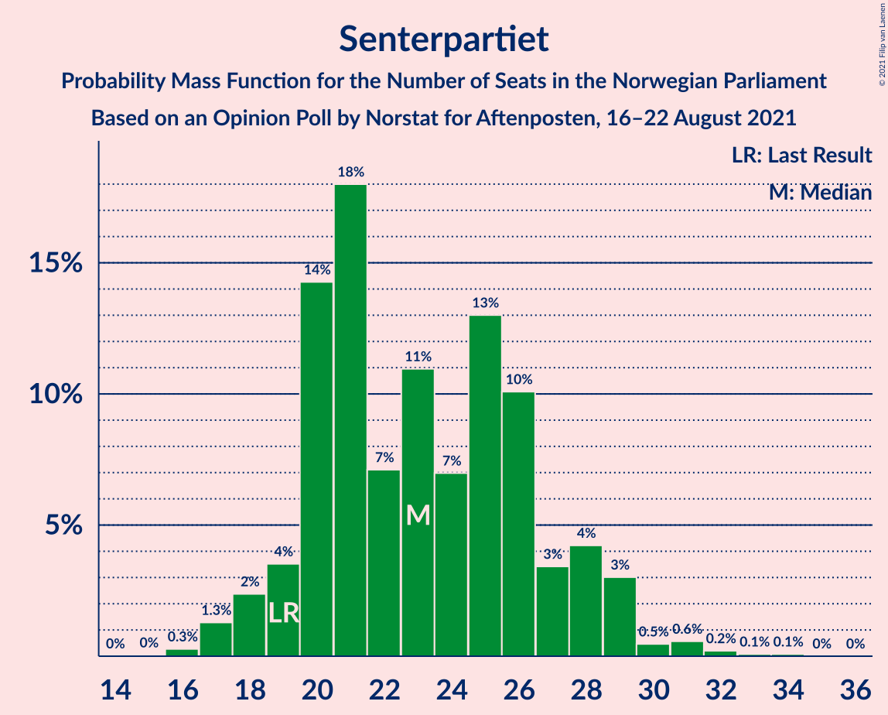

| Number of Seats | Probability | Accumulated | Special Marks |
|:---------------:|:-----------:|:-----------:|:-------------:|
| 15 | 0% | 100% |  |
| 16 | 0.3% | 99.9% |  |
| 17 | 1.3% | 99.7% |  |
| 18 | 2% | 98% |  |
| 19 | 4% | 96% | Last Result |
| 20 | 14% | 92% |  |
| 21 | 18% | 78% |  |
| 22 | 7% | 60% |  |
| 23 | 11% | 53% | Median |
| 24 | 7% | 42% |  |
| 25 | 13% | 35% |  |
| 26 | 10% | 22% |  |
| 27 | 3% | 12% |  |
| 28 | 4% | 9% |  |
| 29 | 3% | 4% |  |
| 30 | 0.5% | 1.4% |  |
| 31 | 0.6% | 0.9% |  |
| 32 | 0.2% | 0.4% |  |
| 33 | 0.1% | 0.2% |  |
| 34 | 0.1% | 0.1% |  |
| 35 | 0% | 0% |  |

### Fremskrittspartiet

*For a full overview of the results for this party, see the [Fremskrittspartiet](party-fremskrittspartiet.html) page.*

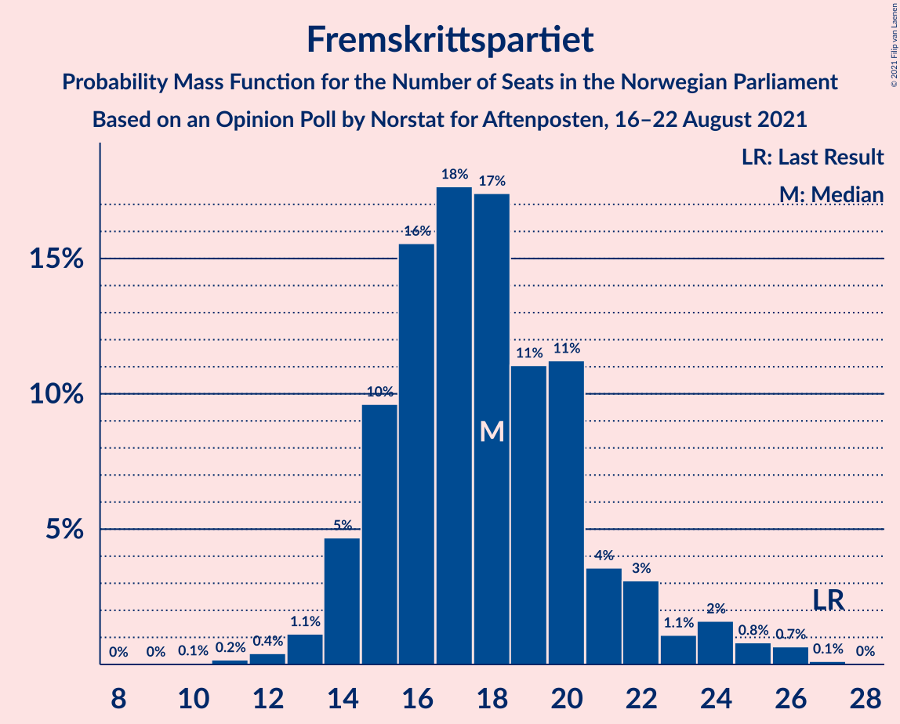

| Number of Seats | Probability | Accumulated | Special Marks |
|:---------------:|:-----------:|:-----------:|:-------------:|
| 10 | 0.1% | 100% |  |
| 11 | 0.2% | 99.9% |  |
| 12 | 0.4% | 99.8% |  |
| 13 | 1.1% | 99.3% |  |
| 14 | 5% | 98% |  |
| 15 | 10% | 94% |  |
| 16 | 16% | 84% |  |
| 17 | 18% | 68% |  |
| 18 | 17% | 51% | Median |
| 19 | 11% | 33% |  |
| 20 | 11% | 22% |  |
| 21 | 4% | 11% |  |
| 22 | 3% | 7% |  |
| 23 | 1.1% | 4% |  |
| 24 | 2% | 3% |  |
| 25 | 0.8% | 2% |  |
| 26 | 0.7% | 0.8% |  |
| 27 | 0.1% | 0.2% | Last Result |
| 28 | 0% | 0% |  |

### Sosialistisk Venstreparti

*For a full overview of the results for this party, see the [Sosialistisk Venstreparti](party-sosialistiskvenstreparti.html) page.*

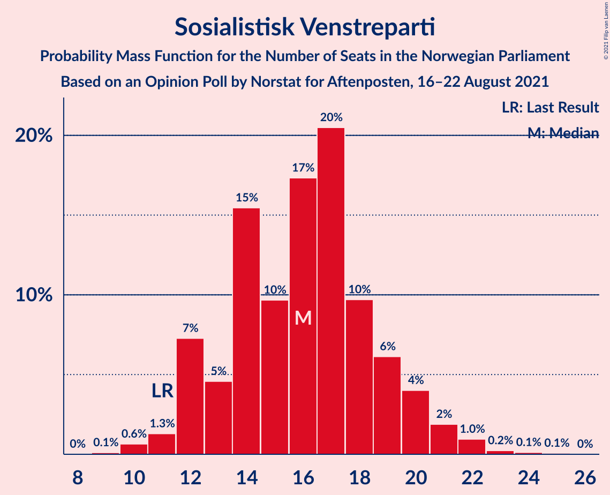

| Number of Seats | Probability | Accumulated | Special Marks |
|:---------------:|:-----------:|:-----------:|:-------------:|
| 9 | 0.1% | 100% |  |
| 10 | 0.6% | 99.9% |  |
| 11 | 1.3% | 99.2% | Last Result |
| 12 | 7% | 98% |  |
| 13 | 5% | 91% |  |
| 14 | 15% | 86% |  |
| 15 | 10% | 71% |  |
| 16 | 17% | 61% | Median |
| 17 | 20% | 44% |  |
| 18 | 10% | 23% |  |
| 19 | 6% | 13% |  |
| 20 | 4% | 7% |  |
| 21 | 2% | 3% |  |
| 22 | 1.0% | 1.4% |  |
| 23 | 0.2% | 0.5% |  |
| 24 | 0.1% | 0.2% |  |
| 25 | 0.1% | 0.1% |  |
| 26 | 0% | 0% |  |

### Miljøpartiet De Grønne

*For a full overview of the results for this party, see the [Miljøpartiet De Grønne](party-miljøpartietdegrønne.html) page.*

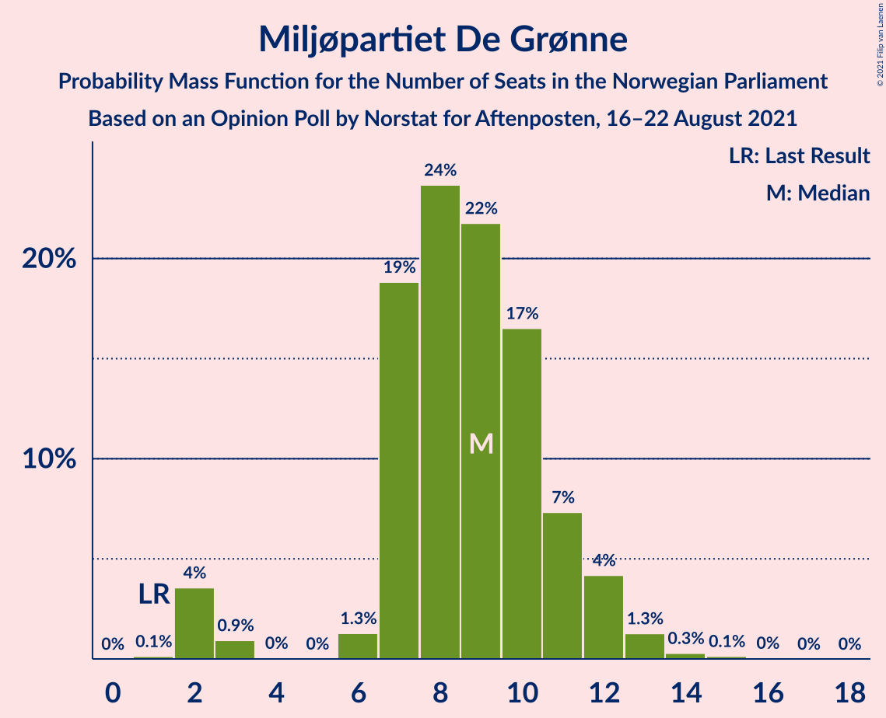

| Number of Seats | Probability | Accumulated | Special Marks |
|:---------------:|:-----------:|:-----------:|:-------------:|
| 1 | 0.1% | 100% | Last Result |
| 2 | 4% | 99.9% |  |
| 3 | 0.9% | 96% |  |
| 4 | 0% | 95% |  |
| 5 | 0% | 95% |  |
| 6 | 1.3% | 95% |  |
| 7 | 19% | 94% |  |
| 8 | 24% | 75% |  |
| 9 | 22% | 52% | Median |
| 10 | 17% | 30% |  |
| 11 | 7% | 13% |  |
| 12 | 4% | 6% |  |
| 13 | 1.3% | 2% |  |
| 14 | 0.3% | 0.5% |  |
| 15 | 0.1% | 0.2% |  |
| 16 | 0% | 0.1% |  |
| 17 | 0% | 0% |  |

### Rødt

*For a full overview of the results for this party, see the [Rødt](party-rødt.html) page.*

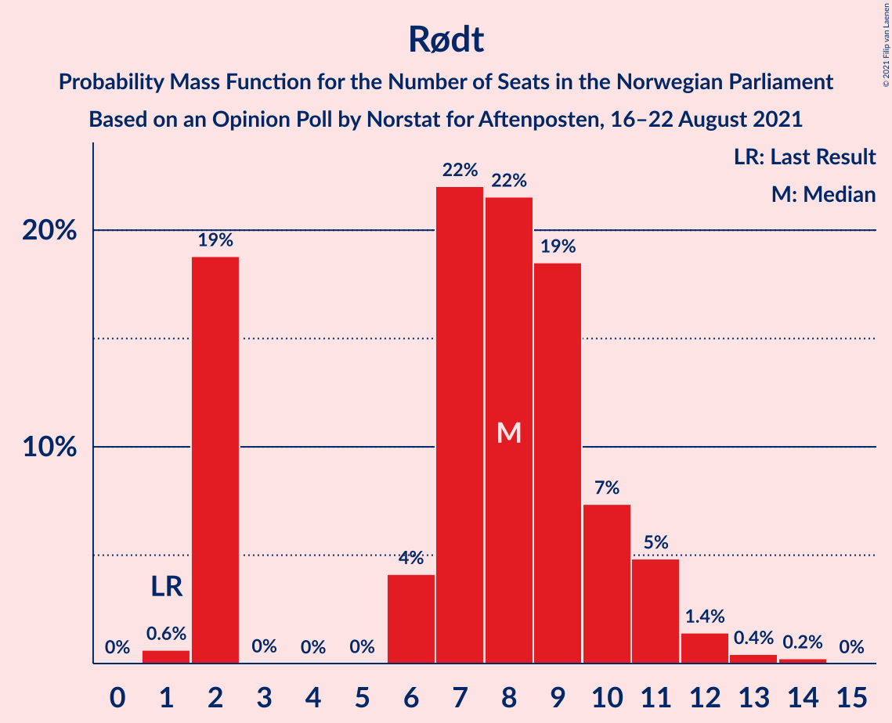

| Number of Seats | Probability | Accumulated | Special Marks |
|:---------------:|:-----------:|:-----------:|:-------------:|
| 1 | 0.6% | 100% | Last Result |
| 2 | 19% | 99.4% |  |
| 3 | 0% | 81% |  |
| 4 | 0% | 81% |  |
| 5 | 0% | 81% |  |
| 6 | 4% | 81% |  |
| 7 | 22% | 76% |  |
| 8 | 22% | 54% | Median |
| 9 | 19% | 33% |  |
| 10 | 7% | 14% |  |
| 11 | 5% | 7% |  |
| 12 | 1.4% | 2% |  |
| 13 | 0.4% | 0.7% |  |
| 14 | 0.2% | 0.2% |  |
| 15 | 0% | 0% |  |

### Venstre

*For a full overview of the results for this party, see the [Venstre](party-venstre.html) page.*

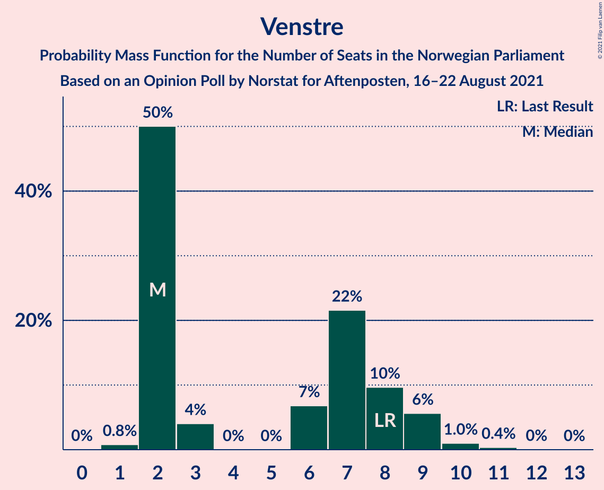

| Number of Seats | Probability | Accumulated | Special Marks |
|:---------------:|:-----------:|:-----------:|:-------------:|
| 1 | 0.8% | 100% |  |
| 2 | 50% | 99.2% | Median |
| 3 | 4% | 49% |  |
| 4 | 0% | 45% |  |
| 5 | 0% | 45% |  |
| 6 | 7% | 45% |  |
| 7 | 22% | 38% |  |
| 8 | 10% | 17% | Last Result |
| 9 | 6% | 7% |  |
| 10 | 1.0% | 1.4% |  |
| 11 | 0.4% | 0.4% |  |
| 12 | 0% | 0.1% |  |
| 13 | 0% | 0% |  |

### Kristelig Folkeparti

*For a full overview of the results for this party, see the [Kristelig Folkeparti](party-kristeligfolkeparti.html) page.*

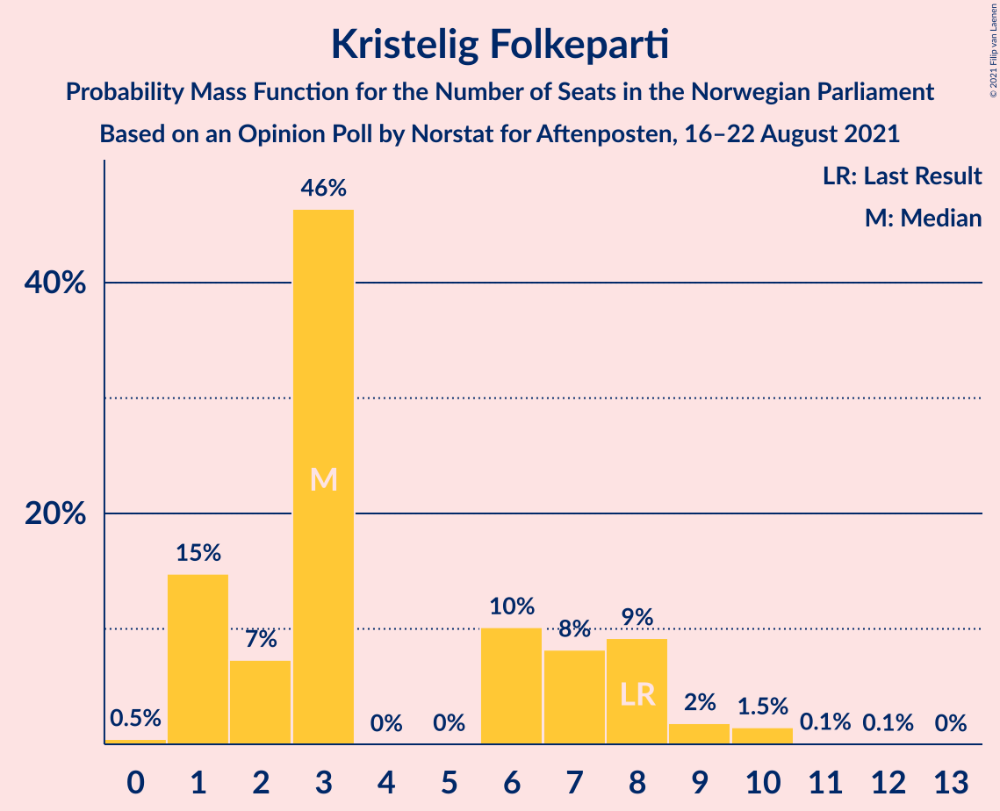

| Number of Seats | Probability | Accumulated | Special Marks |
|:---------------:|:-----------:|:-----------:|:-------------:|
| 0 | 0.5% | 100% |  |
| 1 | 15% | 99.5% |  |
| 2 | 7% | 85% |  |
| 3 | 46% | 77% | Median |
| 4 | 0% | 31% |  |
| 5 | 0% | 31% |  |
| 6 | 10% | 31% |  |
| 7 | 8% | 21% |  |
| 8 | 9% | 13% | Last Result |
| 9 | 2% | 3% |  |
| 10 | 1.5% | 2% |  |
| 11 | 0.1% | 0.2% |  |
| 12 | 0.1% | 0.1% |  |
| 13 | 0% | 0% |  |

## Coalitions

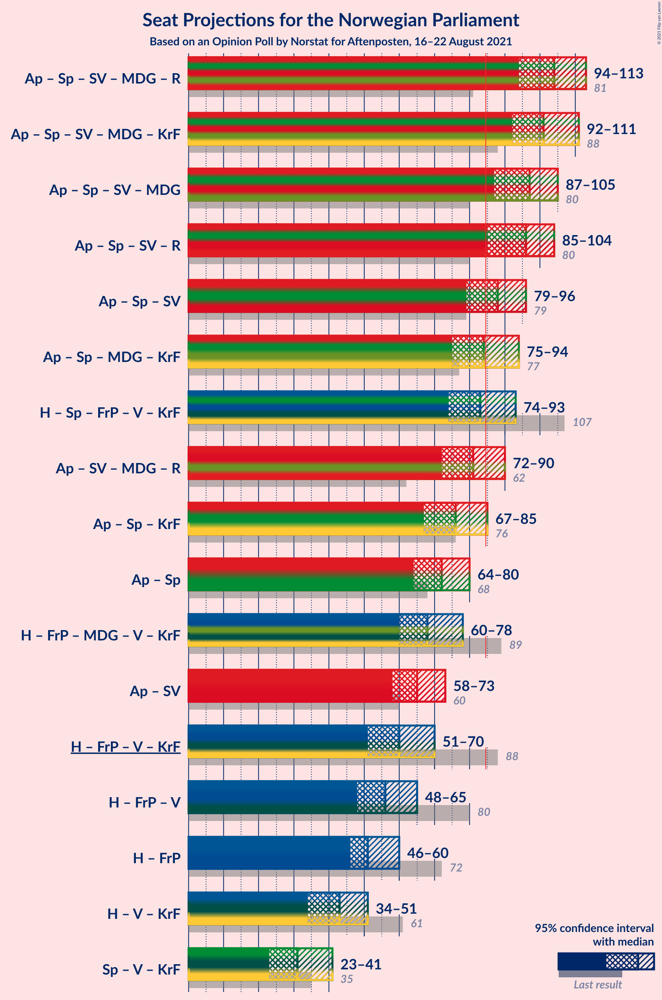

### Confidence Intervals

| Coalition | Last Result | Median | Majority? | 80% Confidence Interval | 90% Confidence Interval | 95% Confidence Interval | 99% Confidence Interval |
|:---------:|:-----------:|:------:|:---------:|:-----------------------:|:-----------------------:|:-----------------------:|:-----------------------:|
| Arbeiderpartiet – Senterpartiet – Sosialistisk Venstreparti – Miljøpartiet De Grønne – Rødt | 81 | 104 | 100% | 98–110 | 95–111 | 94–113 | 91–117 |
| Arbeiderpartiet – Senterpartiet – Sosialistisk Venstreparti – Miljøpartiet De Grønne – Kristelig Folkeparti | 88 | 101 | 100% | 95–106 | 93–109 | 92–111 | 89–114 |
| Arbeiderpartiet – Senterpartiet – Sosialistisk Venstreparti – Miljøpartiet De Grønne | 80 | 97 | 99.6% | 91–102 | 90–104 | 87–105 | 85–109 |
| Arbeiderpartiet – Senterpartiet – Sosialistisk Venstreparti – Rødt | 80 | 96 | 98.7% | 89–101 | 87–103 | 85–104 | 83–106 |
| Arbeiderpartiet – Senterpartiet – Sosialistisk Venstreparti | 79 | 88 | 78% | 83–93 | 81–95 | 79–96 | 77–99 |
| Arbeiderpartiet – Senterpartiet – Miljøpartiet De Grønne – Kristelig Folkeparti | 77 | 84 | 48% | 79–91 | 77–93 | 75–94 | 73–96 |
| Høyre – Senterpartiet – Fremskrittspartiet – Venstre – Kristelig Folkeparti | 107 | 83 | 39% | 76–89 | 75–91 | 74–93 | 72–96 |
| Arbeiderpartiet – Sosialistisk Venstreparti – Miljøpartiet De Grønne – Rødt | 62 | 81 | 22% | 74–87 | 73–88 | 72–90 | 69–94 |
| Arbeiderpartiet – Senterpartiet – Kristelig Folkeparti | 76 | 76 | 3% | 70–82 | 68–84 | 67–85 | 65–87 |
| Arbeiderpartiet – Senterpartiet | 68 | 72 | 0.1% | 67–78 | 65–79 | 64–80 | 61–82 |
| Høyre – Fremskrittspartiet – Miljøpartiet De Grønne – Venstre – Kristelig Folkeparti | 89 | 68 | 0.1% | 62–75 | 62–77 | 60–78 | 58–82 |
| Arbeiderpartiet – Sosialistisk Venstreparti | 60 | 65 | 0% | 60–70 | 59–72 | 58–73 | 55–75 |
| Høyre – Fremskrittspartiet – Venstre – Kristelig Folkeparti | 88 | 60 | 0% | 54–66 | 53–68 | 51–70 | 50–73 |
| Høyre – Fremskrittspartiet – Venstre | 80 | 56 | 0% | 51–61 | 50–63 | 48–65 | 46–69 |
| Høyre – Fremskrittspartiet | 72 | 51 | 0% | 48–57 | 46–59 | 46–60 | 42–62 |
| Høyre – Venstre – Kristelig Folkeparti | 61 | 43 | 0% | 37–47 | 35–50 | 34–51 | 32–53 |
| Senterpartiet – Venstre – Kristelig Folkeparti | 35 | 31 | 0% | 26–38 | 24–39 | 23–41 | 21–44 |

### Arbeiderpartiet – Senterpartiet – Sosialistisk Venstreparti – Miljøpartiet De Grønne – Rødt

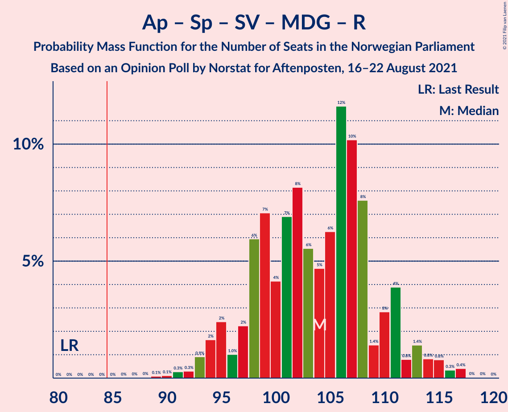

| Number of Seats | Probability | Accumulated | Special Marks |
|:---------------:|:-----------:|:-----------:|:-------------:|
| 81 | 0% | 100% | Last Result |
| 82 | 0% | 100% |  |
| 83 | 0% | 100% |  |
| 84 | 0% | 100% |  |
| 85 | 0% | 100% | Majority |
| 86 | 0% | 100% |  |
| 87 | 0% | 100% |  |
| 88 | 0% | 100% |  |
| 89 | 0.1% | 99.9% |  |
| 90 | 0.1% | 99.8% |  |
| 91 | 0.3% | 99.7% |  |
| 92 | 0.3% | 99.4% |  |
| 93 | 0.9% | 99.2% |  |
| 94 | 2% | 98% |  |
| 95 | 2% | 97% |  |
| 96 | 1.0% | 94% |  |
| 97 | 2% | 93% |  |
| 98 | 6% | 91% |  |
| 99 | 7% | 85% |  |
| 100 | 4% | 78% |  |
| 101 | 7% | 74% |  |
| 102 | 8% | 67% |  |
| 103 | 6% | 59% |  |
| 104 | 5% | 53% |  |
| 105 | 6% | 48% | Median |
| 106 | 12% | 42% |  |
| 107 | 10% | 31% |  |
| 108 | 8% | 20% |  |
| 109 | 1.4% | 13% |  |
| 110 | 3% | 11% |  |
| 111 | 4% | 9% |  |
| 112 | 0.8% | 5% |  |
| 113 | 1.4% | 4% |  |
| 114 | 0.8% | 2% |  |
| 115 | 0.8% | 2% |  |
| 116 | 0.3% | 0.8% |  |
| 117 | 0.4% | 0.5% |  |
| 118 | 0% | 0.1% |  |
| 119 | 0% | 0.1% |  |
| 120 | 0% | 0% |  |

### Arbeiderpartiet – Senterpartiet – Sosialistisk Venstreparti – Miljøpartiet De Grønne – Kristelig Folkeparti

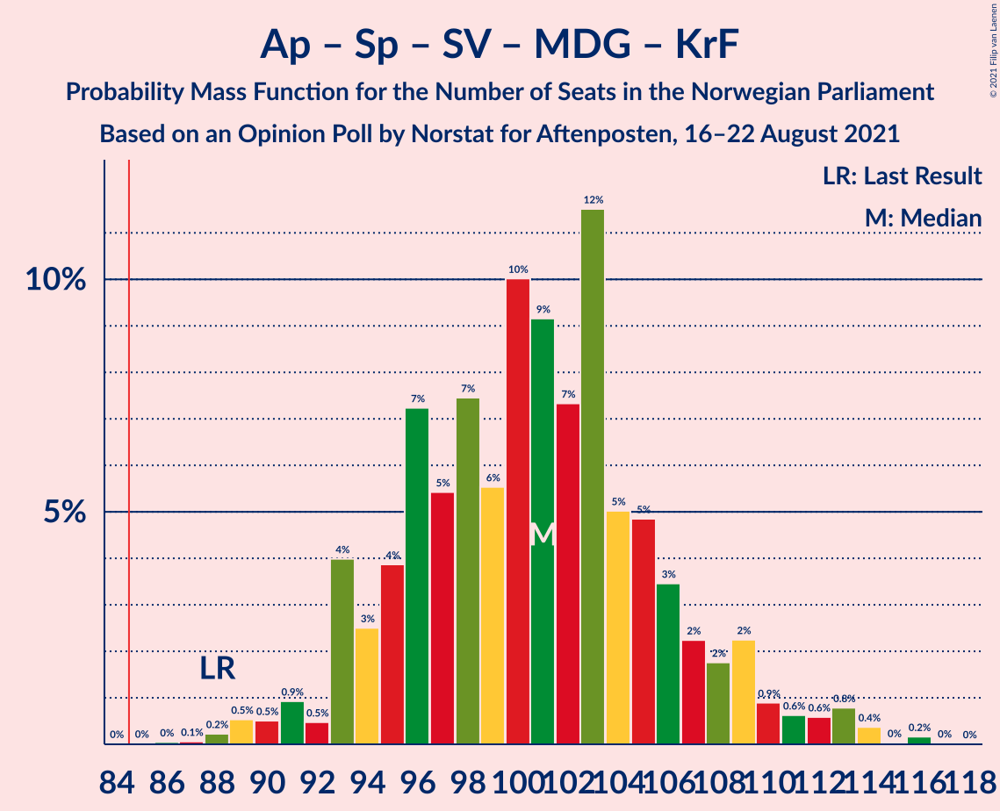

| Number of Seats | Probability | Accumulated | Special Marks |
|:---------------:|:-----------:|:-----------:|:-------------:|
| 85 | 0% | 100% | Majority |
| 86 | 0% | 99.9% |  |
| 87 | 0.1% | 99.9% |  |
| 88 | 0.2% | 99.8% | Last Result |
| 89 | 0.5% | 99.6% |  |
| 90 | 0.5% | 99.1% |  |
| 91 | 0.9% | 98.6% |  |
| 92 | 0.5% | 98% |  |
| 93 | 4% | 97% |  |
| 94 | 3% | 93% |  |
| 95 | 4% | 91% |  |
| 96 | 7% | 87% |  |
| 97 | 5% | 80% |  |
| 98 | 7% | 74% |  |
| 99 | 6% | 67% |  |
| 100 | 10% | 61% | Median |
| 101 | 9% | 51% |  |
| 102 | 7% | 42% |  |
| 103 | 12% | 35% |  |
| 104 | 5% | 23% |  |
| 105 | 5% | 18% |  |
| 106 | 3% | 13% |  |
| 107 | 2% | 10% |  |
| 108 | 2% | 8% |  |
| 109 | 2% | 6% |  |
| 110 | 0.9% | 4% |  |
| 111 | 0.6% | 3% |  |
| 112 | 0.6% | 2% |  |
| 113 | 0.8% | 1.4% |  |
| 114 | 0.4% | 0.6% |  |
| 115 | 0% | 0.2% |  |
| 116 | 0.2% | 0.2% |  |
| 117 | 0% | 0% |  |

### Arbeiderpartiet – Senterpartiet – Sosialistisk Venstreparti – Miljøpartiet De Grønne

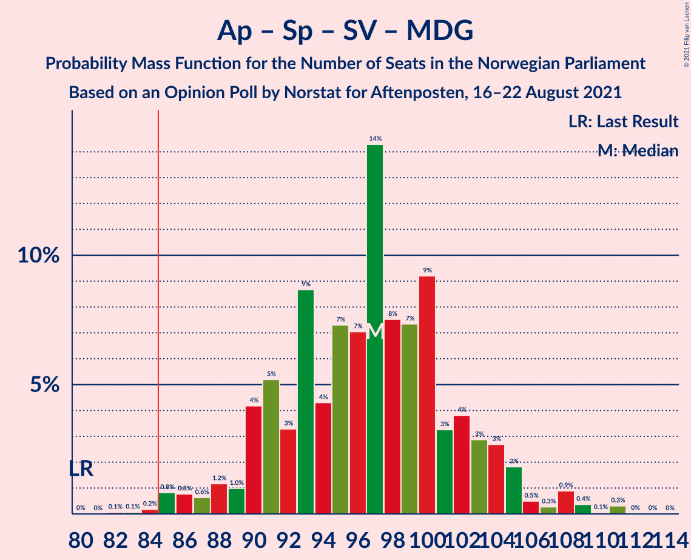

| Number of Seats | Probability | Accumulated | Special Marks |
|:---------------:|:-----------:|:-----------:|:-------------:|
| 80 | 0% | 100% | Last Result |
| 81 | 0% | 100% |  |
| 82 | 0.1% | 100% |  |
| 83 | 0.1% | 99.9% |  |
| 84 | 0.2% | 99.8% |  |
| 85 | 0.8% | 99.6% | Majority |
| 86 | 0.8% | 98.8% |  |
| 87 | 0.6% | 98% |  |
| 88 | 1.2% | 97% |  |
| 89 | 1.0% | 96% |  |
| 90 | 4% | 95% |  |
| 91 | 5% | 91% |  |
| 92 | 3% | 86% |  |
| 93 | 9% | 83% |  |
| 94 | 4% | 74% |  |
| 95 | 7% | 70% |  |
| 96 | 7% | 62% |  |
| 97 | 14% | 55% | Median |
| 98 | 8% | 41% |  |
| 99 | 7% | 33% |  |
| 100 | 9% | 26% |  |
| 101 | 3% | 17% |  |
| 102 | 4% | 14% |  |
| 103 | 3% | 10% |  |
| 104 | 3% | 7% |  |
| 105 | 2% | 4% |  |
| 106 | 0.5% | 2% |  |
| 107 | 0.3% | 2% |  |
| 108 | 0.9% | 2% |  |
| 109 | 0.4% | 0.8% |  |
| 110 | 0.1% | 0.4% |  |
| 111 | 0.3% | 0.4% |  |
| 112 | 0% | 0.1% |  |
| 113 | 0% | 0% |  |

### Arbeiderpartiet – Senterpartiet – Sosialistisk Venstreparti – Rødt

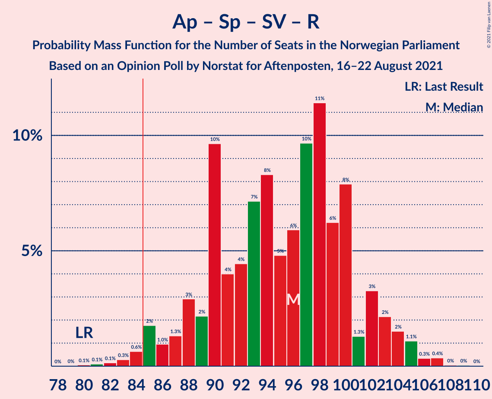

| Number of Seats | Probability | Accumulated | Special Marks |
|:---------------:|:-----------:|:-----------:|:-------------:|
| 80 | 0.1% | 100% | Last Result |
| 81 | 0.1% | 99.9% |  |
| 82 | 0.1% | 99.8% |  |
| 83 | 0.3% | 99.7% |  |
| 84 | 0.6% | 99.4% |  |
| 85 | 2% | 98.7% | Majority |
| 86 | 1.0% | 97% |  |
| 87 | 1.3% | 96% |  |
| 88 | 3% | 95% |  |
| 89 | 2% | 92% |  |
| 90 | 10% | 90% |  |
| 91 | 4% | 80% |  |
| 92 | 4% | 76% |  |
| 93 | 7% | 72% |  |
| 94 | 8% | 64% |  |
| 95 | 5% | 56% |  |
| 96 | 6% | 51% | Median |
| 97 | 10% | 45% |  |
| 98 | 11% | 36% |  |
| 99 | 6% | 24% |  |
| 100 | 8% | 18% |  |
| 101 | 1.3% | 10% |  |
| 102 | 3% | 9% |  |
| 103 | 2% | 6% |  |
| 104 | 2% | 3% |  |
| 105 | 1.1% | 2% |  |
| 106 | 0.3% | 0.8% |  |
| 107 | 0.4% | 0.5% |  |
| 108 | 0% | 0.1% |  |
| 109 | 0% | 0.1% |  |
| 110 | 0% | 0% |  |

### Arbeiderpartiet – Senterpartiet – Sosialistisk Venstreparti

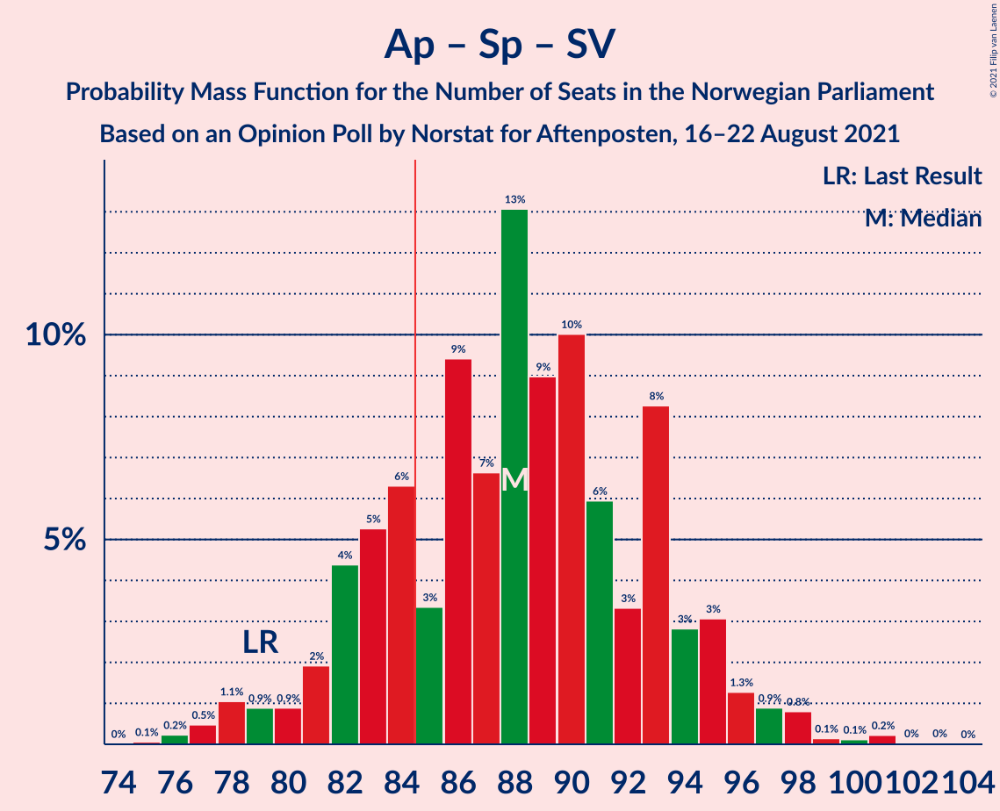

| Number of Seats | Probability | Accumulated | Special Marks |
|:---------------:|:-----------:|:-----------:|:-------------:|
| 75 | 0.1% | 100% |  |
| 76 | 0.2% | 99.9% |  |
| 77 | 0.5% | 99.7% |  |
| 78 | 1.1% | 99.2% |  |
| 79 | 0.9% | 98% | Last Result |
| 80 | 0.9% | 97% |  |
| 81 | 2% | 96% |  |
| 82 | 4% | 94% |  |
| 83 | 5% | 90% |  |
| 84 | 6% | 85% |  |
| 85 | 3% | 78% | Majority |
| 86 | 9% | 75% |  |
| 87 | 7% | 66% |  |
| 88 | 13% | 59% | Median |
| 89 | 9% | 46% |  |
| 90 | 10% | 37% |  |
| 91 | 6% | 27% |  |
| 92 | 3% | 21% |  |
| 93 | 8% | 18% |  |
| 94 | 3% | 9% |  |
| 95 | 3% | 7% |  |
| 96 | 1.3% | 4% |  |
| 97 | 0.9% | 2% |  |
| 98 | 0.8% | 1.4% |  |
| 99 | 0.1% | 0.6% |  |
| 100 | 0.1% | 0.4% |  |
| 101 | 0.2% | 0.3% |  |
| 102 | 0% | 0.1% |  |
| 103 | 0% | 0.1% |  |
| 104 | 0% | 0% |  |

### Arbeiderpartiet – Senterpartiet – Miljøpartiet De Grønne – Kristelig Folkeparti

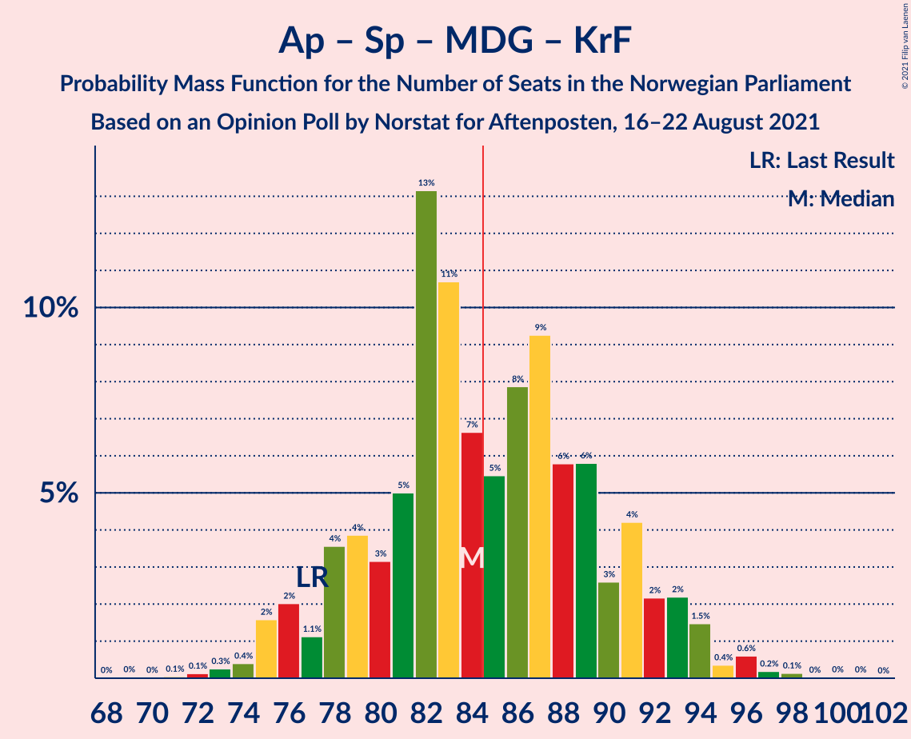

| Number of Seats | Probability | Accumulated | Special Marks |
|:---------------:|:-----------:|:-----------:|:-------------:|
| 69 | 0% | 100% |  |
| 70 | 0% | 99.9% |  |
| 71 | 0.1% | 99.9% |  |
| 72 | 0.1% | 99.9% |  |
| 73 | 0.3% | 99.7% |  |
| 74 | 0.4% | 99.5% |  |
| 75 | 2% | 99.1% |  |
| 76 | 2% | 97% |  |
| 77 | 1.1% | 95% | Last Result |
| 78 | 4% | 94% |  |
| 79 | 4% | 91% |  |
| 80 | 3% | 87% |  |
| 81 | 5% | 84% |  |
| 82 | 13% | 79% |  |
| 83 | 11% | 66% |  |
| 84 | 7% | 55% | Median |
| 85 | 5% | 48% | Majority |
| 86 | 8% | 43% |  |
| 87 | 9% | 35% |  |
| 88 | 6% | 26% |  |
| 89 | 6% | 20% |  |
| 90 | 3% | 14% |  |
| 91 | 4% | 11% |  |
| 92 | 2% | 7% |  |
| 93 | 2% | 5% |  |
| 94 | 1.5% | 3% |  |
| 95 | 0.4% | 1.4% |  |
| 96 | 0.6% | 1.0% |  |
| 97 | 0.2% | 0.4% |  |
| 98 | 0.1% | 0.2% |  |
| 99 | 0% | 0.1% |  |
| 100 | 0% | 0.1% |  |
| 101 | 0% | 0% |  |

### Høyre – Senterpartiet – Fremskrittspartiet – Venstre – Kristelig Folkeparti

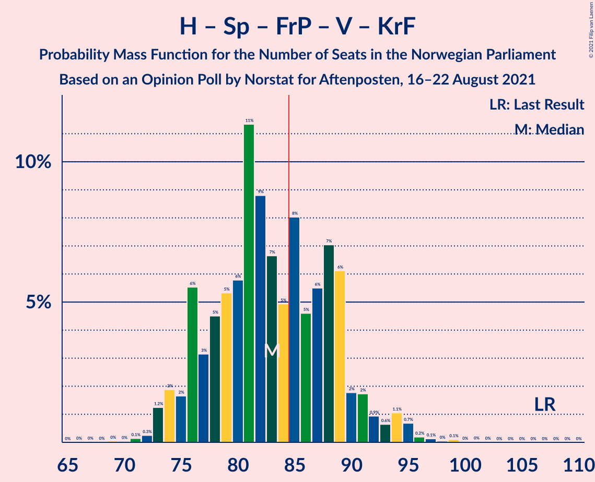

| Number of Seats | Probability | Accumulated | Special Marks |
|:---------------:|:-----------:|:-----------:|:-------------:|
| 69 | 0% | 100% |  |
| 70 | 0% | 99.9% |  |
| 71 | 0.1% | 99.9% |  |
| 72 | 0.3% | 99.7% |  |
| 73 | 1.2% | 99.5% |  |
| 74 | 2% | 98% |  |
| 75 | 2% | 96% |  |
| 76 | 6% | 95% |  |
| 77 | 3% | 89% |  |
| 78 | 5% | 86% |  |
| 79 | 5% | 81% |  |
| 80 | 6% | 76% | Median |
| 81 | 11% | 70% |  |
| 82 | 9% | 59% |  |
| 83 | 7% | 50% |  |
| 84 | 5% | 44% |  |
| 85 | 8% | 39% | Majority |
| 86 | 5% | 31% |  |
| 87 | 6% | 26% |  |
| 88 | 7% | 21% |  |
| 89 | 6% | 13% |  |
| 90 | 2% | 7% |  |
| 91 | 2% | 6% |  |
| 92 | 0.9% | 4% |  |
| 93 | 0.6% | 3% |  |
| 94 | 1.1% | 2% |  |
| 95 | 0.7% | 1.2% |  |
| 96 | 0.2% | 0.5% |  |
| 97 | 0.1% | 0.3% |  |
| 98 | 0% | 0.2% |  |
| 99 | 0.1% | 0.2% |  |
| 100 | 0% | 0% |  |
| 101 | 0% | 0% |  |
| 102 | 0% | 0% |  |
| 103 | 0% | 0% |  |
| 104 | 0% | 0% |  |
| 105 | 0% | 0% |  |
| 106 | 0% | 0% |  |
| 107 | 0% | 0% | Last Result |

### Arbeiderpartiet – Sosialistisk Venstreparti – Miljøpartiet De Grønne – Rødt

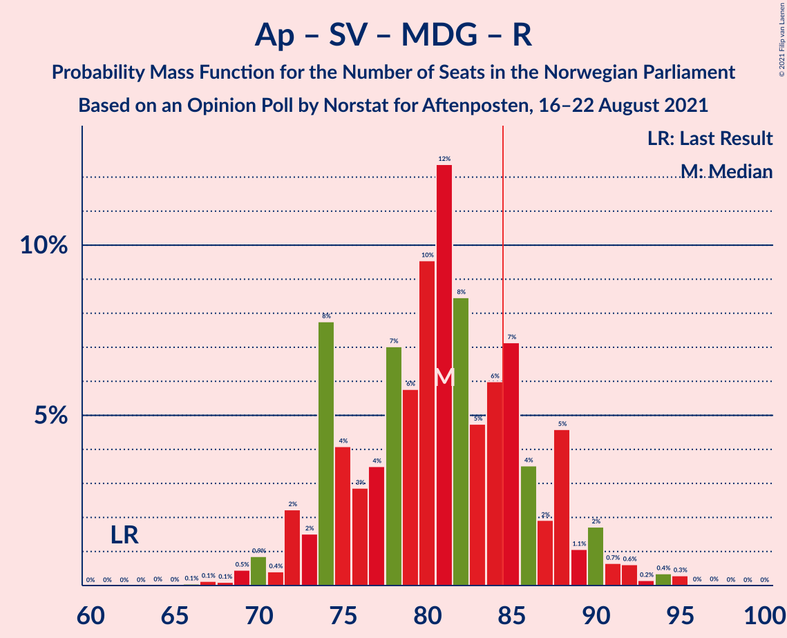

| Number of Seats | Probability | Accumulated | Special Marks |
|:---------------:|:-----------:|:-----------:|:-------------:|
| 62 | 0% | 100% | Last Result |
| 63 | 0% | 100% |  |
| 64 | 0% | 100% |  |
| 65 | 0% | 100% |  |
| 66 | 0.1% | 100% |  |
| 67 | 0.1% | 99.9% |  |
| 68 | 0.1% | 99.8% |  |
| 69 | 0.5% | 99.7% |  |
| 70 | 0.9% | 99.2% |  |
| 71 | 0.4% | 98% |  |
| 72 | 2% | 98% |  |
| 73 | 2% | 96% |  |
| 74 | 8% | 94% |  |
| 75 | 4% | 86% |  |
| 76 | 3% | 82% |  |
| 77 | 4% | 80% |  |
| 78 | 7% | 76% |  |
| 79 | 6% | 69% |  |
| 80 | 10% | 63% |  |
| 81 | 12% | 54% |  |
| 82 | 8% | 41% | Median |
| 83 | 5% | 33% |  |
| 84 | 6% | 28% |  |
| 85 | 7% | 22% | Majority |
| 86 | 4% | 15% |  |
| 87 | 2% | 11% |  |
| 88 | 5% | 10% |  |
| 89 | 1.1% | 5% |  |
| 90 | 2% | 4% |  |
| 91 | 0.7% | 2% |  |
| 92 | 0.6% | 1.5% |  |
| 93 | 0.2% | 0.9% |  |
| 94 | 0.4% | 0.7% |  |
| 95 | 0.3% | 0.4% |  |
| 96 | 0% | 0.1% |  |
| 97 | 0% | 0% |  |

### Arbeiderpartiet – Senterpartiet – Kristelig Folkeparti

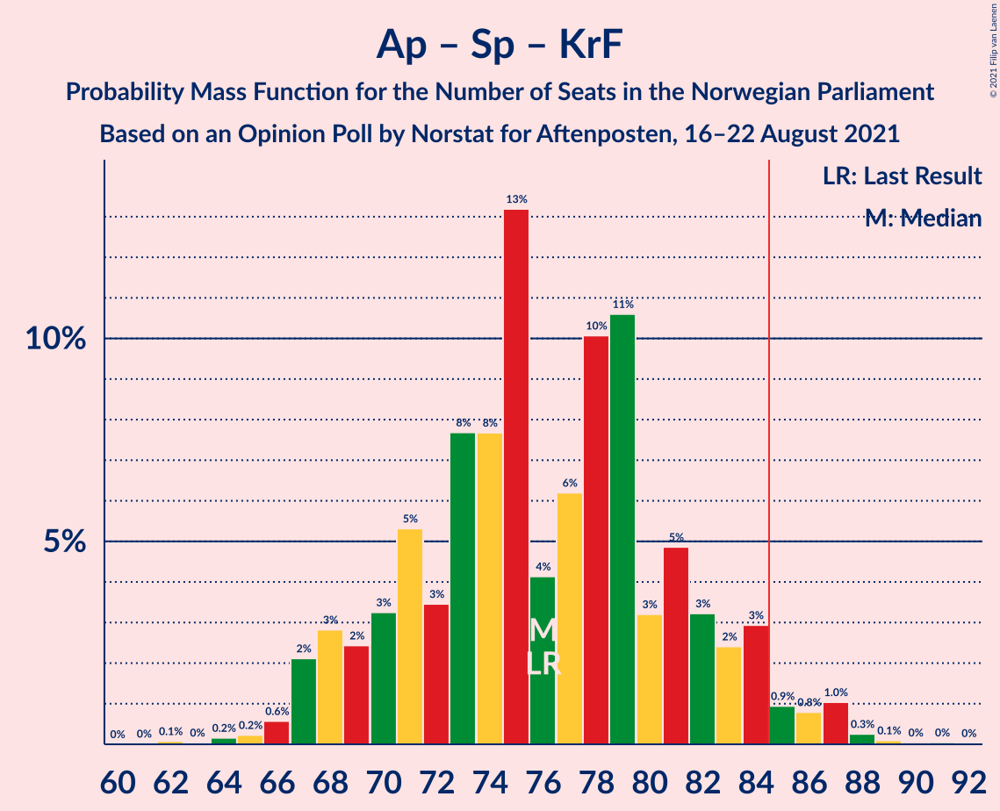

| Number of Seats | Probability | Accumulated | Special Marks |
|:---------------:|:-----------:|:-----------:|:-------------:|
| 62 | 0.1% | 100% |  |
| 63 | 0% | 99.9% |  |
| 64 | 0.2% | 99.9% |  |
| 65 | 0.2% | 99.7% |  |
| 66 | 0.6% | 99.5% |  |
| 67 | 2% | 98.9% |  |
| 68 | 3% | 97% |  |
| 69 | 2% | 94% |  |
| 70 | 3% | 92% |  |
| 71 | 5% | 88% |  |
| 72 | 3% | 83% |  |
| 73 | 8% | 79% |  |
| 74 | 8% | 72% |  |
| 75 | 13% | 64% | Median |
| 76 | 4% | 51% | Last Result |
| 77 | 6% | 47% |  |
| 78 | 10% | 41% |  |
| 79 | 11% | 31% |  |
| 80 | 3% | 20% |  |
| 81 | 5% | 17% |  |
| 82 | 3% | 12% |  |
| 83 | 2% | 9% |  |
| 84 | 3% | 6% |  |
| 85 | 0.9% | 3% | Majority |
| 86 | 0.8% | 2% |  |
| 87 | 1.0% | 2% |  |
| 88 | 0.3% | 0.5% |  |
| 89 | 0.1% | 0.2% |  |
| 90 | 0% | 0.1% |  |
| 91 | 0% | 0.1% |  |
| 92 | 0% | 0% |  |

### Arbeiderpartiet – Senterpartiet

| Number of Seats | Probability | Accumulated | Special Marks |
|:---------------:|:-----------:|:-----------:|:-------------:|
| 59 | 0% | 100% |  |
| 60 | 0.1% | 99.9% |  |
| 61 | 0.5% | 99.9% |  |
| 62 | 0.3% | 99.4% |  |
| 63 | 1.0% | 99.0% |  |
| 64 | 2% | 98% |  |
| 65 | 2% | 96% |  |
| 66 | 3% | 93% |  |
| 67 | 5% | 91% |  |
| 68 | 6% | 86% | Last Result |
| 69 | 5% | 80% |  |
| 70 | 7% | 75% |  |
| 71 | 8% | 68% |  |
| 72 | 20% | 59% | Median |
| 73 | 5% | 40% |  |
| 74 | 5% | 35% |  |
| 75 | 4% | 29% |  |
| 76 | 12% | 26% |  |
| 77 | 3% | 14% |  |
| 78 | 4% | 11% |  |
| 79 | 4% | 7% |  |
| 80 | 2% | 3% |  |
| 81 | 1.0% | 2% |  |
| 82 | 0.2% | 0.7% |  |
| 83 | 0.3% | 0.4% |  |
| 84 | 0.1% | 0.1% |  |
| 85 | 0% | 0.1% | Majority |
| 86 | 0% | 0% |  |

### Høyre – Fremskrittspartiet – Miljøpartiet De Grønne – Venstre – Kristelig Folkeparti

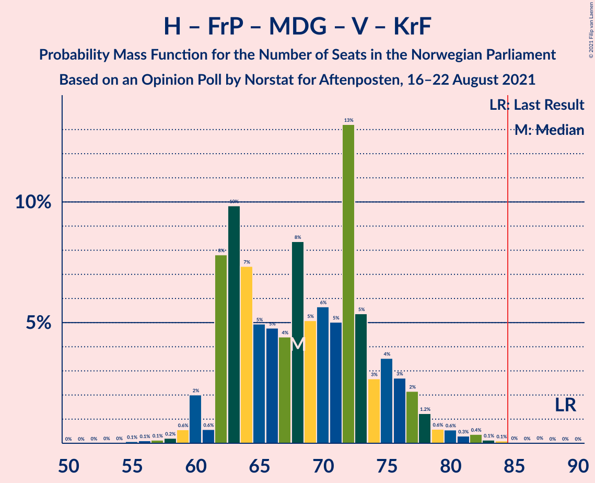

| Number of Seats | Probability | Accumulated | Special Marks |
|:---------------:|:-----------:|:-----------:|:-------------:|
| 54 | 0% | 100% |  |
| 55 | 0.1% | 99.9% |  |
| 56 | 0.1% | 99.9% |  |
| 57 | 0.1% | 99.8% |  |
| 58 | 0.2% | 99.6% |  |
| 59 | 0.6% | 99.4% |  |
| 60 | 2% | 98.9% |  |
| 61 | 0.6% | 97% |  |
| 62 | 8% | 96% |  |
| 63 | 10% | 88% |  |
| 64 | 7% | 79% |  |
| 65 | 5% | 71% |  |
| 66 | 5% | 66% | Median |
| 67 | 4% | 62% |  |
| 68 | 8% | 57% |  |
| 69 | 5% | 49% |  |
| 70 | 6% | 44% |  |
| 71 | 5% | 38% |  |
| 72 | 13% | 33% |  |
| 73 | 5% | 20% |  |
| 74 | 3% | 14% |  |
| 75 | 4% | 12% |  |
| 76 | 3% | 8% |  |
| 77 | 2% | 6% |  |
| 78 | 1.2% | 3% |  |
| 79 | 0.6% | 2% |  |
| 80 | 0.6% | 2% |  |
| 81 | 0.3% | 1.0% |  |
| 82 | 0.4% | 0.7% |  |
| 83 | 0.1% | 0.3% |  |
| 84 | 0.1% | 0.2% |  |
| 85 | 0% | 0.1% | Majority |
| 86 | 0% | 0.1% |  |
| 87 | 0% | 0% |  |
| 88 | 0% | 0% |  |
| 89 | 0% | 0% | Last Result |

### Arbeiderpartiet – Sosialistisk Venstreparti

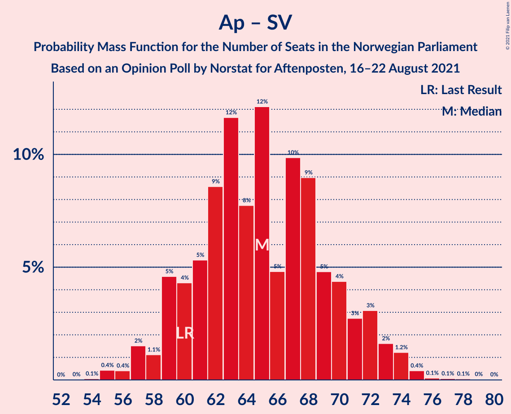

| Number of Seats | Probability | Accumulated | Special Marks |
|:---------------:|:-----------:|:-----------:|:-------------:|
| 54 | 0.1% | 100% |  |
| 55 | 0.4% | 99.9% |  |
| 56 | 0.4% | 99.5% |  |
| 57 | 2% | 99.1% |  |
| 58 | 1.1% | 98% |  |
| 59 | 5% | 96% |  |
| 60 | 4% | 92% | Last Result |
| 61 | 5% | 88% |  |
| 62 | 9% | 82% |  |
| 63 | 12% | 74% |  |
| 64 | 8% | 62% |  |
| 65 | 12% | 54% | Median |
| 66 | 5% | 42% |  |
| 67 | 10% | 37% |  |
| 68 | 9% | 27% |  |
| 69 | 5% | 19% |  |
| 70 | 4% | 14% |  |
| 71 | 3% | 9% |  |
| 72 | 3% | 7% |  |
| 73 | 2% | 4% |  |
| 74 | 1.2% | 2% |  |
| 75 | 0.4% | 0.7% |  |
| 76 | 0.1% | 0.3% |  |
| 77 | 0.1% | 0.2% |  |
| 78 | 0.1% | 0.1% |  |
| 79 | 0% | 0.1% |  |
| 80 | 0% | 0% |  |

### Høyre – Fremskrittspartiet – Venstre – Kristelig Folkeparti

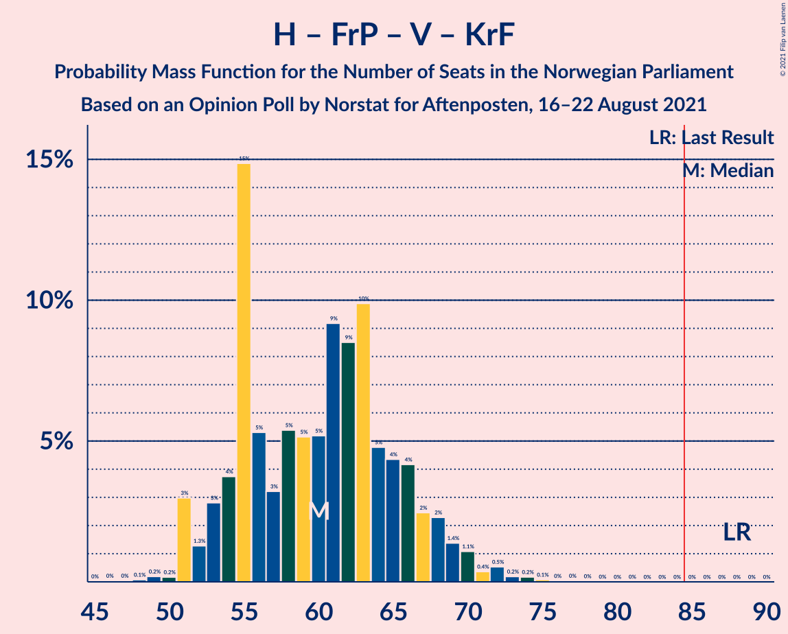

| Number of Seats | Probability | Accumulated | Special Marks |
|:---------------:|:-----------:|:-----------:|:-------------:|
| 46 | 0% | 100% |  |
| 47 | 0% | 99.9% |  |
| 48 | 0.1% | 99.9% |  |
| 49 | 0.2% | 99.8% |  |
| 50 | 0.2% | 99.6% |  |
| 51 | 3% | 99.5% |  |
| 52 | 1.3% | 96% |  |
| 53 | 3% | 95% |  |
| 54 | 4% | 92% |  |
| 55 | 15% | 89% |  |
| 56 | 5% | 74% |  |
| 57 | 3% | 68% | Median |
| 58 | 5% | 65% |  |
| 59 | 5% | 60% |  |
| 60 | 5% | 55% |  |
| 61 | 9% | 50% |  |
| 62 | 9% | 40% |  |
| 63 | 10% | 32% |  |
| 64 | 5% | 22% |  |
| 65 | 4% | 17% |  |
| 66 | 4% | 13% |  |
| 67 | 2% | 9% |  |
| 68 | 2% | 6% |  |
| 69 | 1.4% | 4% |  |
| 70 | 1.1% | 3% |  |
| 71 | 0.4% | 1.5% |  |
| 72 | 0.5% | 1.1% |  |
| 73 | 0.2% | 0.6% |  |
| 74 | 0.2% | 0.4% |  |
| 75 | 0.1% | 0.2% |  |
| 76 | 0% | 0.1% |  |
| 77 | 0% | 0.1% |  |
| 78 | 0% | 0% |  |
| 79 | 0% | 0% |  |
| 80 | 0% | 0% |  |
| 81 | 0% | 0% |  |
| 82 | 0% | 0% |  |
| 83 | 0% | 0% |  |
| 84 | 0% | 0% |  |
| 85 | 0% | 0% | Majority |
| 86 | 0% | 0% |  |
| 87 | 0% | 0% |  |
| 88 | 0% | 0% | Last Result |

### Høyre – Fremskrittspartiet – Venstre

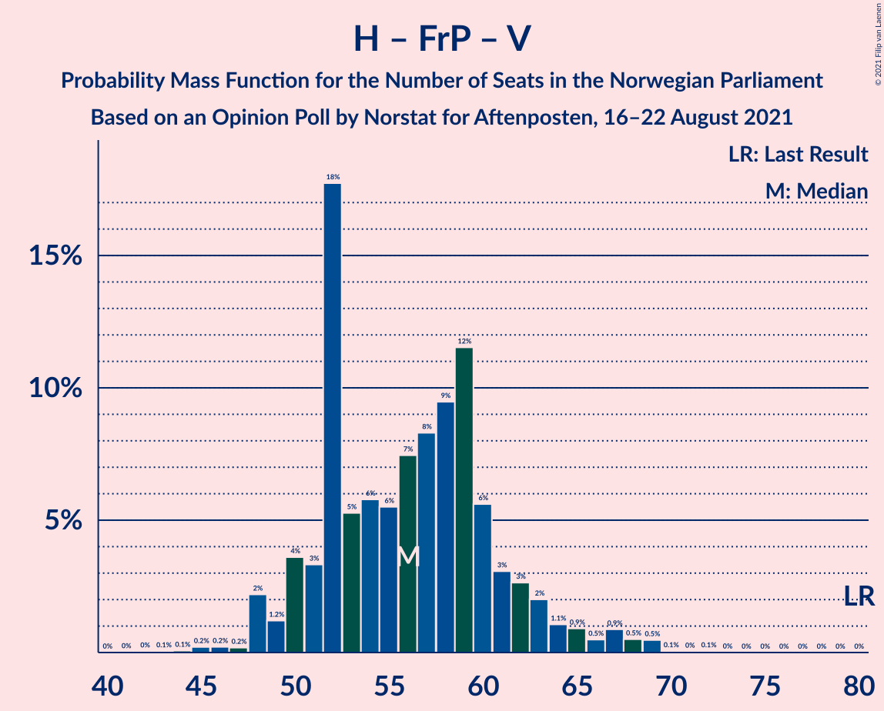

| Number of Seats | Probability | Accumulated | Special Marks |
|:---------------:|:-----------:|:-----------:|:-------------:|
| 42 | 0% | 100% |  |
| 43 | 0.1% | 99.9% |  |
| 44 | 0.1% | 99.9% |  |
| 45 | 0.2% | 99.8% |  |
| 46 | 0.2% | 99.6% |  |
| 47 | 0.2% | 99.4% |  |
| 48 | 2% | 99.2% |  |
| 49 | 1.2% | 97% |  |
| 50 | 4% | 96% |  |
| 51 | 3% | 92% |  |
| 52 | 18% | 89% |  |
| 53 | 5% | 71% |  |
| 54 | 6% | 66% | Median |
| 55 | 6% | 60% |  |
| 56 | 7% | 55% |  |
| 57 | 8% | 47% |  |
| 58 | 9% | 39% |  |
| 59 | 12% | 29% |  |
| 60 | 6% | 18% |  |
| 61 | 3% | 12% |  |
| 62 | 3% | 9% |  |
| 63 | 2% | 6% |  |
| 64 | 1.1% | 4% |  |
| 65 | 0.9% | 3% |  |
| 66 | 0.5% | 2% |  |
| 67 | 0.9% | 2% |  |
| 68 | 0.5% | 1.1% |  |
| 69 | 0.5% | 0.6% |  |
| 70 | 0.1% | 0.2% |  |
| 71 | 0% | 0.1% |  |
| 72 | 0.1% | 0.1% |  |
| 73 | 0% | 0% |  |
| 74 | 0% | 0% |  |
| 75 | 0% | 0% |  |
| 76 | 0% | 0% |  |
| 77 | 0% | 0% |  |
| 78 | 0% | 0% |  |
| 79 | 0% | 0% |  |
| 80 | 0% | 0% | Last Result |

### Høyre – Fremskrittspartiet

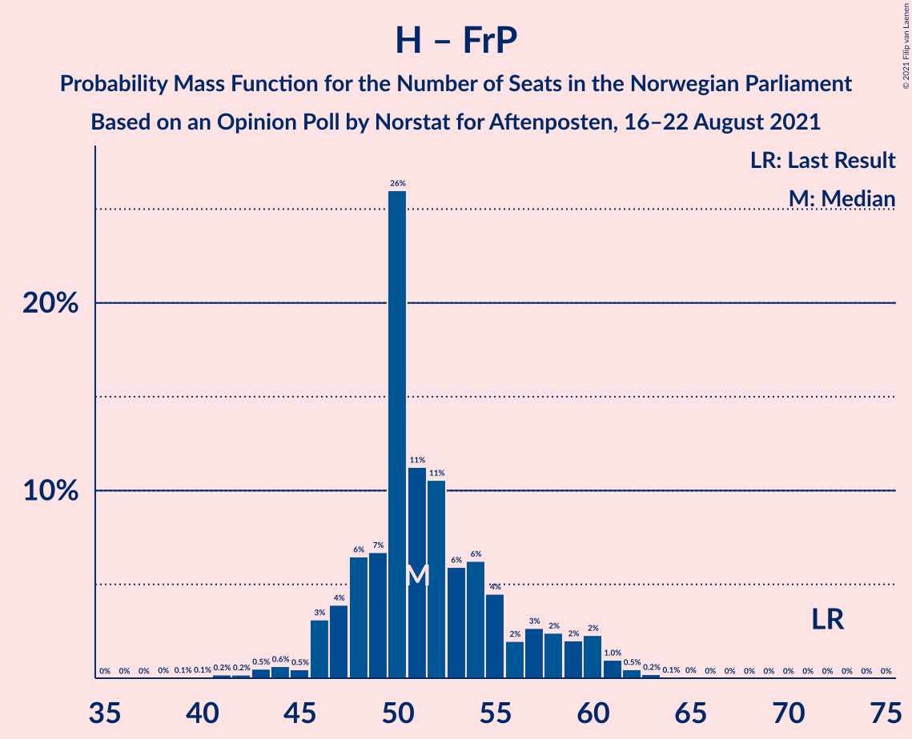

| Number of Seats | Probability | Accumulated | Special Marks |
|:---------------:|:-----------:|:-----------:|:-------------:|
| 39 | 0.1% | 100% |  |
| 40 | 0.1% | 99.9% |  |
| 41 | 0.2% | 99.8% |  |
| 42 | 0.2% | 99.6% |  |
| 43 | 0.5% | 99.5% |  |
| 44 | 0.6% | 99.0% |  |
| 45 | 0.5% | 98% |  |
| 46 | 3% | 98% |  |
| 47 | 4% | 95% |  |
| 48 | 6% | 91% |  |
| 49 | 7% | 84% |  |
| 50 | 26% | 78% |  |
| 51 | 11% | 52% |  |
| 52 | 11% | 40% | Median |
| 53 | 6% | 30% |  |
| 54 | 6% | 24% |  |
| 55 | 4% | 18% |  |
| 56 | 2% | 13% |  |
| 57 | 3% | 11% |  |
| 58 | 2% | 9% |  |
| 59 | 2% | 6% |  |
| 60 | 2% | 4% |  |
| 61 | 1.0% | 2% |  |
| 62 | 0.5% | 0.8% |  |
| 63 | 0.2% | 0.3% |  |
| 64 | 0.1% | 0.1% |  |
| 65 | 0% | 0.1% |  |
| 66 | 0% | 0% |  |
| 67 | 0% | 0% |  |
| 68 | 0% | 0% |  |
| 69 | 0% | 0% |  |
| 70 | 0% | 0% |  |
| 71 | 0% | 0% |  |
| 72 | 0% | 0% | Last Result |

### Høyre – Venstre – Kristelig Folkeparti

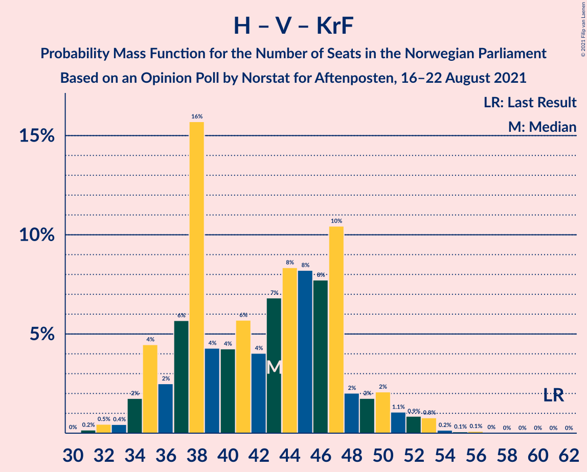

| Number of Seats | Probability | Accumulated | Special Marks |
|:---------------:|:-----------:|:-----------:|:-------------:|
| 30 | 0% | 100% |  |
| 31 | 0.2% | 99.9% |  |
| 32 | 0.5% | 99.8% |  |
| 33 | 0.4% | 99.3% |  |
| 34 | 2% | 98.9% |  |
| 35 | 4% | 97% |  |
| 36 | 2% | 93% |  |
| 37 | 6% | 90% |  |
| 38 | 16% | 84% |  |
| 39 | 4% | 69% | Median |
| 40 | 4% | 64% |  |
| 41 | 6% | 60% |  |
| 42 | 4% | 55% |  |
| 43 | 7% | 50% |  |
| 44 | 8% | 44% |  |
| 45 | 8% | 35% |  |
| 46 | 8% | 27% |  |
| 47 | 10% | 19% |  |
| 48 | 2% | 9% |  |
| 49 | 2% | 7% |  |
| 50 | 2% | 5% |  |
| 51 | 1.1% | 3% |  |
| 52 | 0.9% | 2% |  |
| 53 | 0.8% | 1.2% |  |
| 54 | 0.2% | 0.4% |  |
| 55 | 0.1% | 0.2% |  |
| 56 | 0.1% | 0.2% |  |
| 57 | 0% | 0.1% |  |
| 58 | 0% | 0% |  |
| 59 | 0% | 0% |  |
| 60 | 0% | 0% |  |
| 61 | 0% | 0% | Last Result |

### Senterpartiet – Venstre – Kristelig Folkeparti

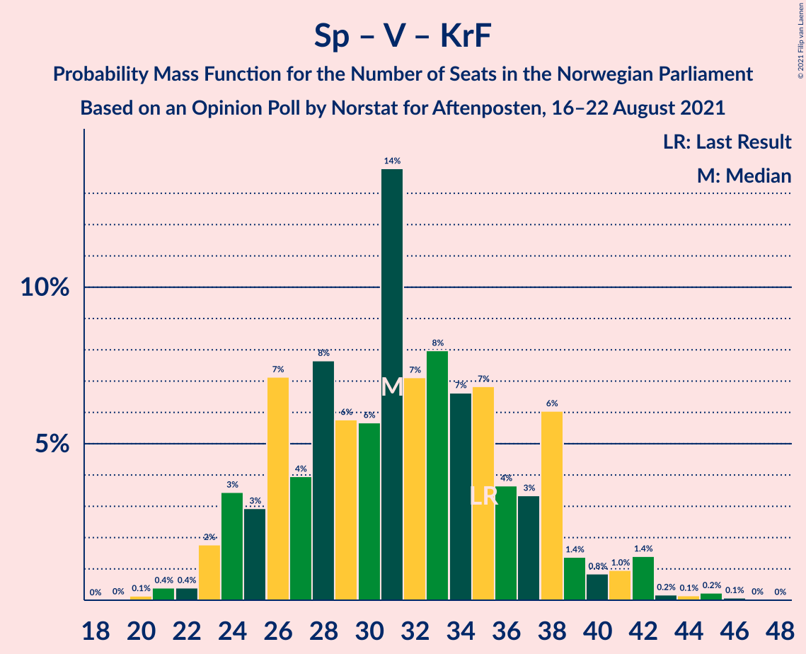

| Number of Seats | Probability | Accumulated | Special Marks |
|:---------------:|:-----------:|:-----------:|:-------------:|
| 20 | 0.1% | 100% |  |
| 21 | 0.4% | 99.8% |  |
| 22 | 0.4% | 99.4% |  |
| 23 | 2% | 99.0% |  |
| 24 | 3% | 97% |  |
| 25 | 3% | 94% |  |
| 26 | 7% | 91% |  |
| 27 | 4% | 84% |  |
| 28 | 8% | 80% | Median |
| 29 | 6% | 72% |  |
| 30 | 6% | 66% |  |
| 31 | 14% | 61% |  |
| 32 | 7% | 47% |  |
| 33 | 8% | 40% |  |
| 34 | 7% | 32% |  |
| 35 | 7% | 25% | Last Result |
| 36 | 4% | 18% |  |
| 37 | 3% | 15% |  |
| 38 | 6% | 11% |  |
| 39 | 1.4% | 5% |  |
| 40 | 0.8% | 4% |  |
| 41 | 1.0% | 3% |  |
| 42 | 1.4% | 2% |  |
| 43 | 0.2% | 0.7% |  |
| 44 | 0.1% | 0.5% |  |
| 45 | 0.2% | 0.4% |  |
| 46 | 0.1% | 0.1% |  |
| 47 | 0% | 0.1% |  |
| 48 | 0% | 0% |  |

## Technical Information

### Opinion Poll

+ **Polling firm:** Norstat
+ **Commissioner(s):** Aftenposten
+ **Fieldwork period:** 16–22 August 2021

### Calculations

+ **Sample size:** 628
+ **Simulations done:** 1,048,576
+ **Error estimate:** 1.62%

