# Opinion Poll by Norstat for Dagens Næringsliv, 19–24 August 2021

<a href="#voting-intentions">Voting Intentions</a> | <a href="#seats">Seats</a> | <a href="#coalitions">Coalitions</a> | <a href="#technical-information">Technical Information</a>

## Voting Intentions

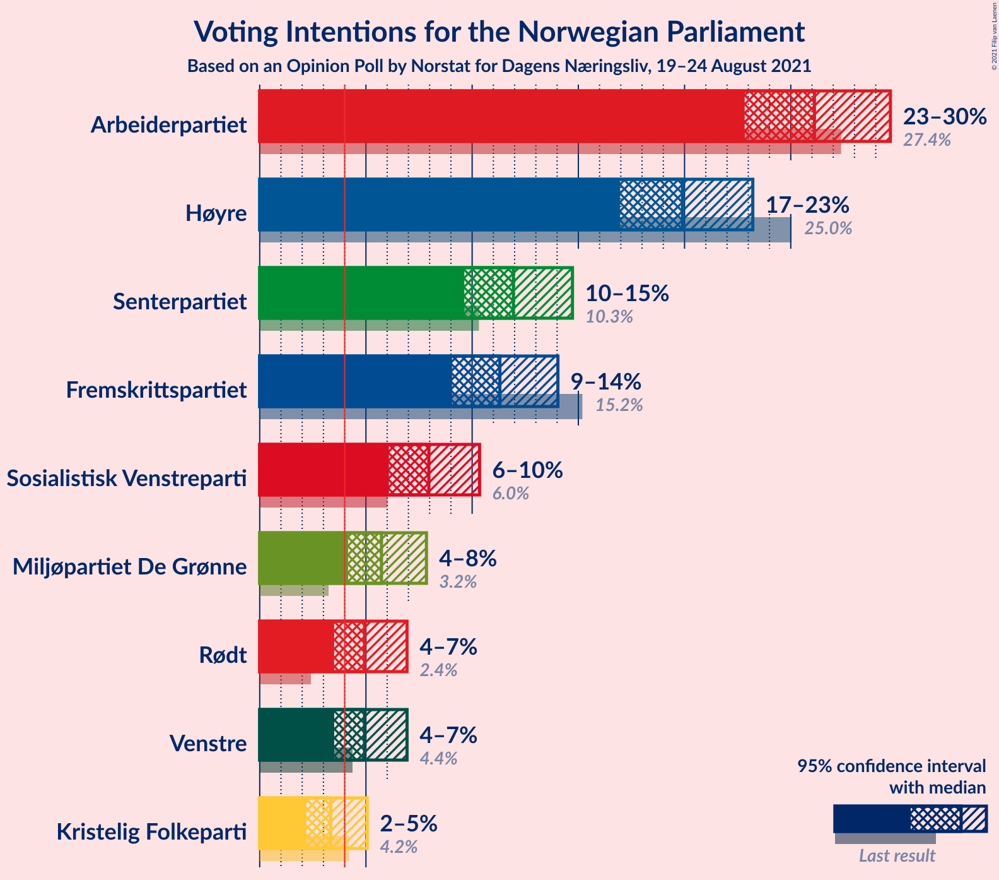

### Confidence Intervals

| Party | Last Result | Poll Result | 80% Confidence Interval | 90% Confidence Interval | 95% Confidence Interval | 99% Confidence Interval |
|:-----:|:-----------:|:-----------:|:-----------------------:|:-----------------------:|:-----------------------:|:-----------------------:|
| Arbeiderpartiet | 27.4% | 26.1% | 24.0–28.5% |23.4–29.1% |22.8–29.7% |21.8–30.8% |
| Høyre | 25.0% | 19.9% | 18.0–22.1% |17.4–22.7% |17.0–23.2% |16.1–24.3% |
| Senterpartiet | 10.3% | 11.9% | 10.4–13.8% |10.0–14.3% |9.6–14.7% |8.9–15.6% |
| Fremskrittspartiet | 15.2% | 11.3% | 9.8–13.1% |9.4–13.6% |9.1–14.0% |8.4–14.9% |
| Sosialistisk Venstreparti | 6.0% | 8.0% | 6.7–9.5% |6.4–10.0% |6.1–10.3% |5.5–11.1% |
| Miljøpartiet De Grønne | 3.2% | 5.7% | 4.7–7.1% |4.4–7.5% |4.2–7.8% |3.7–8.6% |
| Rødt | 2.4% | 4.9% | 4.0–6.2% |3.7–6.6% |3.5–6.9% |3.1–7.6% |
| Venstre | 4.4% | 4.9% | 4.0–6.2% |3.7–6.6% |3.5–6.9% |3.1–7.6% |
| Kristelig Folkeparti | 4.2% | 3.3% | 2.6–4.5% |2.4–4.8% |2.2–5.1% |1.9–5.7% |

*Note:* The poll result column reflects the actual value used in the calculations. Published results may vary slightly, and in addition be rounded to fewer digits.

## Seats

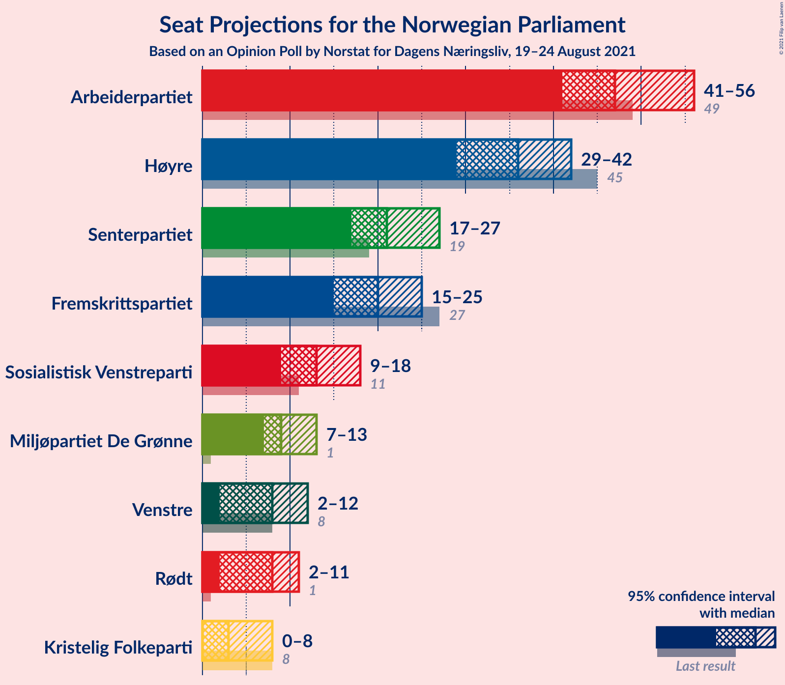

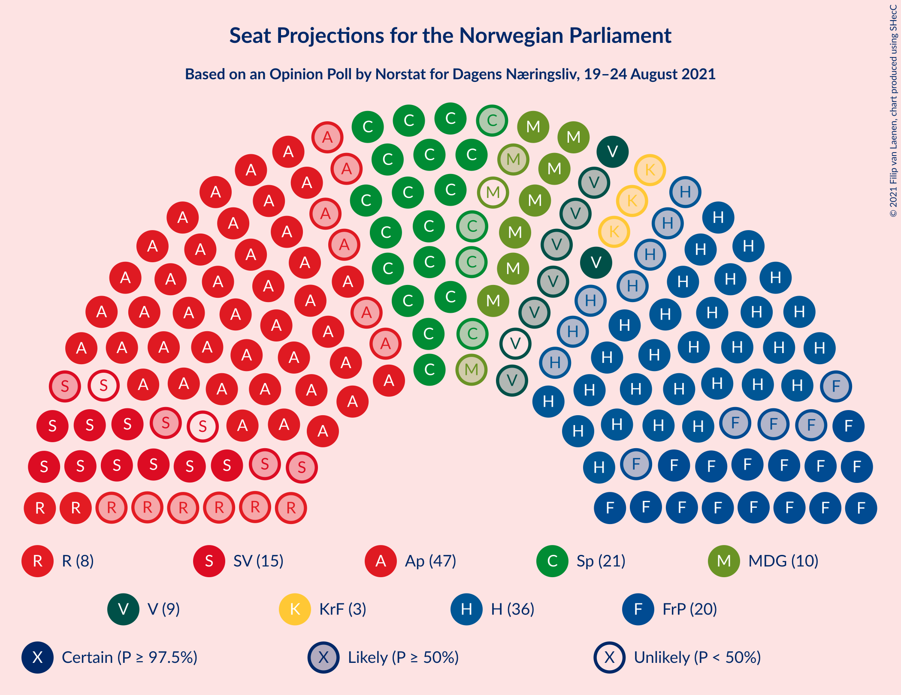

### Confidence Intervals

| Party | Last Result | Median | 80% Confidence Interval | 90% Confidence Interval | 95% Confidence Interval | 99% Confidence Interval |
|:-----:|:-----------:|:------:|:-----------------------:|:-----------------------:|:-----------------------:|:-----------------------:|
| <a href="#arbeiderpartiet">Arbeiderpartiet</a> | 49 | 47 | 44–53 |43–55 |41–56 |40–58 |
| <a href="#høyre">Høyre</a> | 45 | 36 | 32–39 |31–40 |29–42 |28–44 |
| <a href="#senterpartiet">Senterpartiet</a> | 19 | 21 | 18–25 |17–27 |17–27 |16–31 |
| <a href="#fremskrittspartiet">Fremskrittspartiet</a> | 27 | 20 | 17–24 |16–25 |15–25 |13–28 |
| <a href="#sosialistisk-venstreparti">Sosialistisk Venstreparti</a> | 11 | 13 | 10–16 |10–17 |9–18 |8–19 |
| <a href="#miljøpartiet-de-grønne">Miljøpartiet De Grønne</a> | 1 | 9 | 8–12 |7–12 |7–13 |2–14 |
| <a href="#rødt">Rødt</a> | 1 | 8 | 2–10 |2–11 |2–11 |2–13 |
| <a href="#venstre">Venstre</a> | 8 | 8 | 3–10 |2–11 |2–12 |2–12 |
| <a href="#kristelig-folkeparti">Kristelig Folkeparti</a> | 8 | 3 | 1–7 |1–7 |0–8 |0–9 |

### Arbeiderpartiet

*For a full overview of the results for this party, see the [Arbeiderpartiet](party-arbeiderpartiet.html) page.*

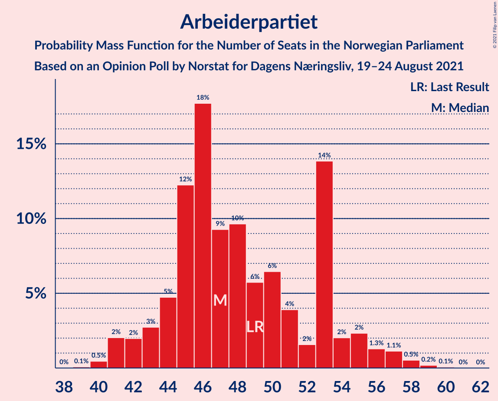

| Number of Seats | Probability | Accumulated | Special Marks |
|:---------------:|:-----------:|:-----------:|:-------------:|
| 39 | 0.1% | 100% |  |
| 40 | 0.5% | 99.9% |  |
| 41 | 2% | 99.4% |  |
| 42 | 2% | 97% |  |
| 43 | 3% | 95% |  |
| 44 | 5% | 93% |  |
| 45 | 12% | 88% |  |
| 46 | 18% | 76% |  |
| 47 | 9% | 58% | Median |
| 48 | 10% | 49% |  |
| 49 | 6% | 39% | Last Result |
| 50 | 6% | 33% |  |
| 51 | 4% | 27% |  |
| 52 | 2% | 23% |  |
| 53 | 14% | 21% |  |
| 54 | 2% | 8% |  |
| 55 | 2% | 6% |  |
| 56 | 1.3% | 3% |  |
| 57 | 1.1% | 2% |  |
| 58 | 0.5% | 0.8% |  |
| 59 | 0.2% | 0.3% |  |
| 60 | 0.1% | 0.1% |  |
| 61 | 0% | 0% |  |

### Høyre

*For a full overview of the results for this party, see the [Høyre](party-høyre.html) page.*

| Number of Seats | Probability | Accumulated | Special Marks |
|:---------------:|:-----------:|:-----------:|:-------------:|
| 26 | 0.1% | 100% |  |
| 27 | 0.1% | 99.9% |  |
| 28 | 0.5% | 99.8% |  |
| 29 | 3% | 99.3% |  |
| 30 | 1.3% | 97% |  |
| 31 | 2% | 95% |  |
| 32 | 10% | 94% |  |
| 33 | 12% | 83% |  |
| 34 | 5% | 72% |  |
| 35 | 13% | 66% |  |
| 36 | 23% | 53% | Median |
| 37 | 8% | 30% |  |
| 38 | 10% | 22% |  |
| 39 | 3% | 13% |  |
| 40 | 4% | 9% |  |
| 41 | 1.4% | 5% |  |
| 42 | 1.2% | 4% |  |
| 43 | 1.2% | 2% |  |
| 44 | 0.8% | 1.2% |  |
| 45 | 0.3% | 0.5% | Last Result |
| 46 | 0.1% | 0.2% |  |
| 47 | 0.1% | 0.1% |  |
| 48 | 0% | 0% |  |

### Senterpartiet

*For a full overview of the results for this party, see the [Senterpartiet](party-senterpartiet.html) page.*

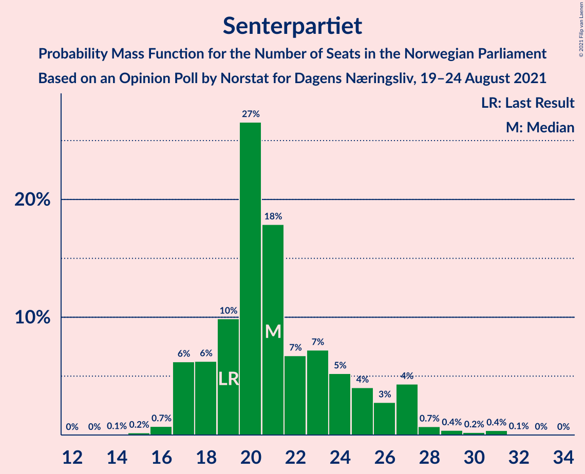

| Number of Seats | Probability | Accumulated | Special Marks |
|:---------------:|:-----------:|:-----------:|:-------------:|
| 14 | 0.1% | 100% |  |
| 15 | 0.2% | 99.9% |  |
| 16 | 0.7% | 99.7% |  |
| 17 | 6% | 99.0% |  |
| 18 | 6% | 93% |  |
| 19 | 10% | 86% | Last Result |
| 20 | 27% | 77% |  |
| 21 | 18% | 50% | Median |
| 22 | 7% | 32% |  |
| 23 | 7% | 25% |  |
| 24 | 5% | 18% |  |
| 25 | 4% | 13% |  |
| 26 | 3% | 9% |  |
| 27 | 4% | 6% |  |
| 28 | 0.7% | 2% |  |
| 29 | 0.4% | 1.1% |  |
| 30 | 0.2% | 0.7% |  |
| 31 | 0.4% | 0.5% |  |
| 32 | 0.1% | 0.1% |  |
| 33 | 0% | 0% |  |

### Fremskrittspartiet

*For a full overview of the results for this party, see the [Fremskrittspartiet](party-fremskrittspartiet.html) page.*

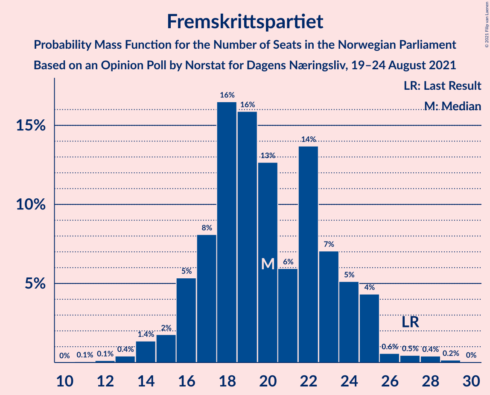

| Number of Seats | Probability | Accumulated | Special Marks |
|:---------------:|:-----------:|:-----------:|:-------------:|
| 11 | 0.1% | 100% |  |
| 12 | 0.1% | 99.9% |  |
| 13 | 0.4% | 99.8% |  |
| 14 | 1.4% | 99.4% |  |
| 15 | 2% | 98% |  |
| 16 | 5% | 96% |  |
| 17 | 8% | 91% |  |
| 18 | 16% | 83% |  |
| 19 | 16% | 66% |  |
| 20 | 13% | 50% | Median |
| 21 | 6% | 38% |  |
| 22 | 14% | 32% |  |
| 23 | 7% | 18% |  |
| 24 | 5% | 11% |  |
| 25 | 4% | 6% |  |
| 26 | 0.6% | 2% |  |
| 27 | 0.5% | 1.1% | Last Result |
| 28 | 0.4% | 0.6% |  |
| 29 | 0.2% | 0.2% |  |
| 30 | 0% | 0% |  |

### Sosialistisk Venstreparti

*For a full overview of the results for this party, see the [Sosialistisk Venstreparti](party-sosialistiskvenstreparti.html) page.*

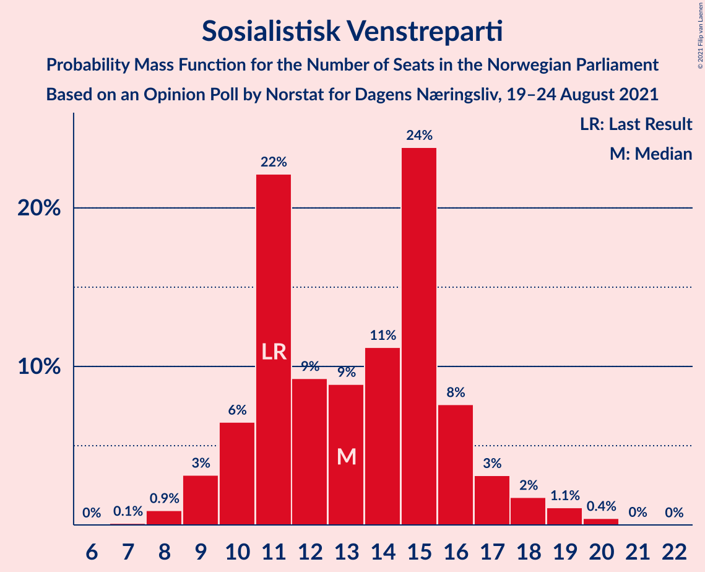

| Number of Seats | Probability | Accumulated | Special Marks |
|:---------------:|:-----------:|:-----------:|:-------------:|
| 7 | 0.1% | 100% |  |
| 8 | 0.9% | 99.9% |  |
| 9 | 3% | 99.0% |  |
| 10 | 6% | 96% |  |
| 11 | 22% | 89% | Last Result |
| 12 | 9% | 67% |  |
| 13 | 9% | 58% | Median |
| 14 | 11% | 49% |  |
| 15 | 24% | 38% |  |
| 16 | 8% | 14% |  |
| 17 | 3% | 6% |  |
| 18 | 2% | 3% |  |
| 19 | 1.1% | 2% |  |
| 20 | 0.4% | 0.5% |  |
| 21 | 0% | 0.1% |  |
| 22 | 0% | 0% |  |

### Miljøpartiet De Grønne

*For a full overview of the results for this party, see the [Miljøpartiet De Grønne](party-miljøpartietdegrønne.html) page.*

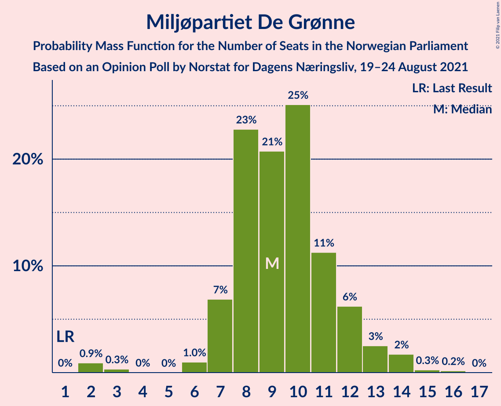

| Number of Seats | Probability | Accumulated | Special Marks |
|:---------------:|:-----------:|:-----------:|:-------------:|
| 1 | 0% | 100% | Last Result |
| 2 | 0.9% | 100% |  |
| 3 | 0.3% | 99.1% |  |
| 4 | 0% | 98.7% |  |
| 5 | 0% | 98.7% |  |
| 6 | 1.0% | 98.7% |  |
| 7 | 7% | 98% |  |
| 8 | 23% | 91% |  |
| 9 | 21% | 68% | Median |
| 10 | 25% | 47% |  |
| 11 | 11% | 22% |  |
| 12 | 6% | 11% |  |
| 13 | 3% | 5% |  |
| 14 | 2% | 2% |  |
| 15 | 0.3% | 0.4% |  |
| 16 | 0.2% | 0.2% |  |
| 17 | 0% | 0% |  |

### Rødt

*For a full overview of the results for this party, see the [Rødt](party-rødt.html) page.*

| Number of Seats | Probability | Accumulated | Special Marks |
|:---------------:|:-----------:|:-----------:|:-------------:|
| 1 | 0.2% | 100% | Last Result |
| 2 | 10% | 99.8% |  |
| 3 | 0% | 89% |  |
| 4 | 0% | 89% |  |
| 5 | 0% | 89% |  |
| 6 | 7% | 89% |  |
| 7 | 16% | 83% |  |
| 8 | 27% | 67% | Median |
| 9 | 20% | 39% |  |
| 10 | 13% | 20% |  |
| 11 | 4% | 7% |  |
| 12 | 2% | 2% |  |
| 13 | 0.4% | 0.6% |  |
| 14 | 0.1% | 0.2% |  |
| 15 | 0% | 0% |  |

### Venstre

*For a full overview of the results for this party, see the [Venstre](party-venstre.html) page.*

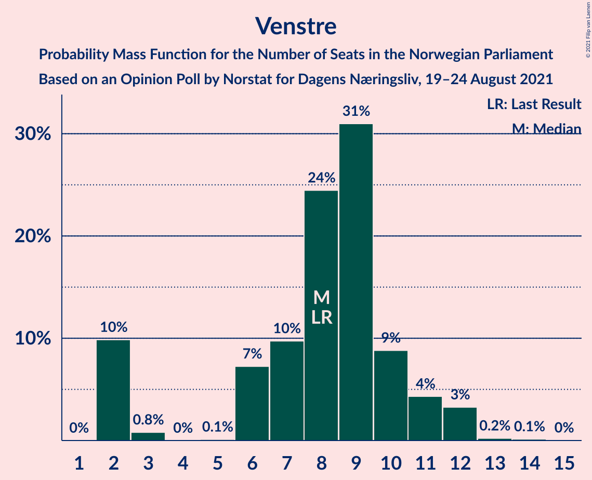

| Number of Seats | Probability | Accumulated | Special Marks |
|:---------------:|:-----------:|:-----------:|:-------------:|
| 2 | 10% | 100% |  |
| 3 | 0.8% | 90% |  |
| 4 | 0% | 89% |  |
| 5 | 0.1% | 89% |  |
| 6 | 7% | 89% |  |
| 7 | 10% | 82% |  |
| 8 | 24% | 72% | Last Result, Median |
| 9 | 31% | 48% |  |
| 10 | 9% | 17% |  |
| 11 | 4% | 8% |  |
| 12 | 3% | 4% |  |
| 13 | 0.2% | 0.4% |  |
| 14 | 0.1% | 0.2% |  |
| 15 | 0% | 0% |  |

### Kristelig Folkeparti

*For a full overview of the results for this party, see the [Kristelig Folkeparti](party-kristeligfolkeparti.html) page.*

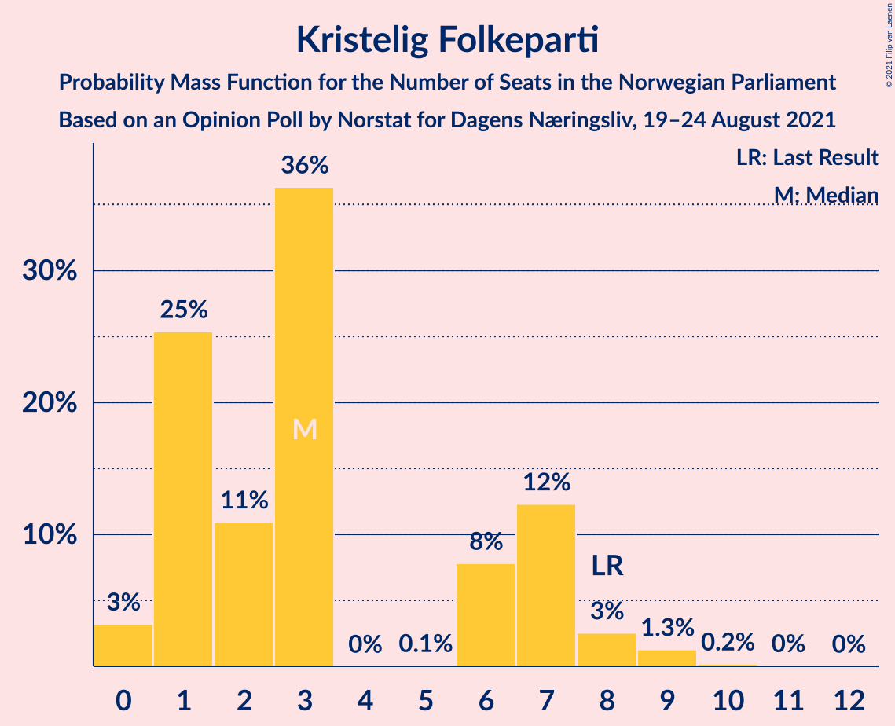

| Number of Seats | Probability | Accumulated | Special Marks |
|:---------------:|:-----------:|:-----------:|:-------------:|
| 0 | 3% | 100% |  |
| 1 | 25% | 97% |  |
| 2 | 11% | 71% |  |
| 3 | 36% | 60% | Median |
| 4 | 0% | 24% |  |
| 5 | 0.1% | 24% |  |
| 6 | 8% | 24% |  |
| 7 | 12% | 16% |  |
| 8 | 3% | 4% | Last Result |
| 9 | 1.3% | 1.5% |  |
| 10 | 0.2% | 0.2% |  |
| 11 | 0% | 0.1% |  |
| 12 | 0% | 0% |  |

## Coalitions

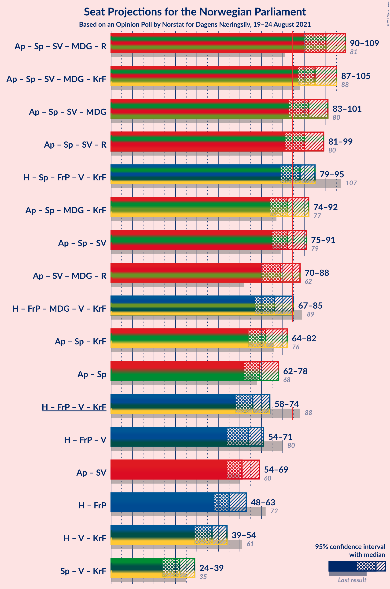

### Confidence Intervals

| Coalition | Last Result | Median | Majority? | 80% Confidence Interval | 90% Confidence Interval | 95% Confidence Interval | 99% Confidence Interval |
|:---------:|:-----------:|:------:|:---------:|:-----------------------:|:-----------------------:|:-----------------------:|:-----------------------:|
| Arbeiderpartiet – Senterpartiet – Sosialistisk Venstreparti – Miljøpartiet De Grønne – Rødt | 81 | 100 | 99.9% | 93–106 | 91–108 | 90–109 | 87–113 |
| Arbeiderpartiet – Senterpartiet – Sosialistisk Venstreparti – Miljøpartiet De Grønne – Kristelig Folkeparti | 88 | 95 | 99.1% | 89–102 | 88–103 | 87–105 | 83–107 |
| Arbeiderpartiet – Senterpartiet – Sosialistisk Venstreparti – Miljøpartiet De Grønne | 80 | 92 | 94% | 86–98 | 84–100 | 83–101 | 79–105 |
| Arbeiderpartiet – Senterpartiet – Sosialistisk Venstreparti – Rødt | 80 | 90 | 88% | 84–97 | 82–98 | 81–99 | 78–102 |
| Høyre – Senterpartiet – Fremskrittspartiet – Venstre – Kristelig Folkeparti | 107 | 88 | 75% | 82–92 | 80–94 | 79–95 | 76–99 |
| Arbeiderpartiet – Senterpartiet – Miljøpartiet De Grønne – Kristelig Folkeparti | 77 | 82 | 25% | 77–89 | 75–90 | 74–92 | 71–95 |
| Arbeiderpartiet – Senterpartiet – Sosialistisk Venstreparti | 79 | 82 | 31% | 77–88 | 75–89 | 75–91 | 72–94 |
| Arbeiderpartiet – Sosialistisk Venstreparti – Miljøpartiet De Grønne – Rødt | 62 | 79 | 11% | 72–85 | 71–86 | 70–88 | 67–92 |
| Høyre – Fremskrittspartiet – Miljøpartiet De Grønne – Venstre – Kristelig Folkeparti | 89 | 76 | 3% | 70–82 | 69–83 | 67–85 | 64–88 |
| Arbeiderpartiet – Senterpartiet – Kristelig Folkeparti | 76 | 72 | 0.8% | 67–79 | 65–81 | 64–82 | 62–85 |
| Arbeiderpartiet – Senterpartiet | 68 | 69 | 0% | 64–75 | 63–76 | 62–78 | 59–80 |
| Høyre – Fremskrittspartiet – Venstre – Kristelig Folkeparti | 88 | 66 | 0% | 61–72 | 59–73 | 58–74 | 55–78 |
| Høyre – Fremskrittspartiet – Venstre | 80 | 64 | 0% | 58–68 | 56–70 | 54–71 | 52–74 |
| Arbeiderpartiet – Sosialistisk Venstreparti | 60 | 61 | 0% | 56–67 | 55–68 | 54–69 | 52–71 |
| Høyre – Fremskrittspartiet | 72 | 55 | 0% | 51–60 | 49–62 | 48–63 | 45–66 |
| Høyre – Venstre – Kristelig Folkeparti | 61 | 47 | 0% | 42–51 | 40–53 | 39–54 | 36–57 |
| Senterpartiet – Venstre – Kristelig Folkeparti | 35 | 32 | 0% | 27–37 | 26–38 | 24–39 | 22–43 |

### Arbeiderpartiet – Senterpartiet – Sosialistisk Venstreparti – Miljøpartiet De Grønne – Rødt

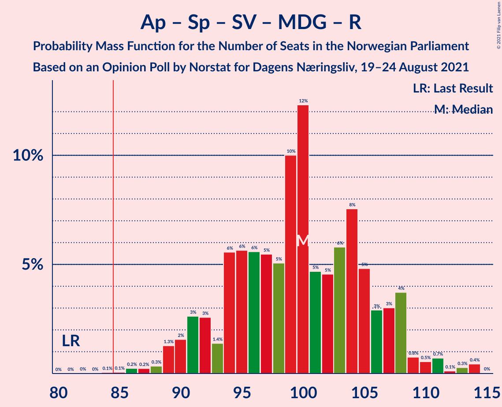

| Number of Seats | Probability | Accumulated | Special Marks |
|:---------------:|:-----------:|:-----------:|:-------------:|
| 81 | 0% | 100% | Last Result |
| 82 | 0% | 100% |  |
| 83 | 0% | 100% |  |
| 84 | 0.1% | 99.9% |  |
| 85 | 0.1% | 99.9% | Majority |
| 86 | 0.2% | 99.8% |  |
| 87 | 0.2% | 99.6% |  |
| 88 | 0.3% | 99.4% |  |
| 89 | 1.3% | 99.0% |  |
| 90 | 2% | 98% |  |
| 91 | 3% | 96% |  |
| 92 | 3% | 94% |  |
| 93 | 1.4% | 91% |  |
| 94 | 6% | 90% |  |
| 95 | 6% | 84% |  |
| 96 | 6% | 78% |  |
| 97 | 5% | 73% |  |
| 98 | 5% | 67% | Median |
| 99 | 10% | 62% |  |
| 100 | 12% | 52% |  |
| 101 | 5% | 40% |  |
| 102 | 5% | 35% |  |
| 103 | 6% | 31% |  |
| 104 | 8% | 25% |  |
| 105 | 5% | 17% |  |
| 106 | 3% | 13% |  |
| 107 | 3% | 10% |  |
| 108 | 4% | 7% |  |
| 109 | 0.8% | 3% |  |
| 110 | 0.5% | 2% |  |
| 111 | 0.7% | 2% |  |
| 112 | 0.1% | 0.9% |  |
| 113 | 0.3% | 0.7% |  |
| 114 | 0.4% | 0.5% |  |
| 115 | 0% | 0% |  |

### Arbeiderpartiet – Senterpartiet – Sosialistisk Venstreparti – Miljøpartiet De Grønne – Kristelig Folkeparti

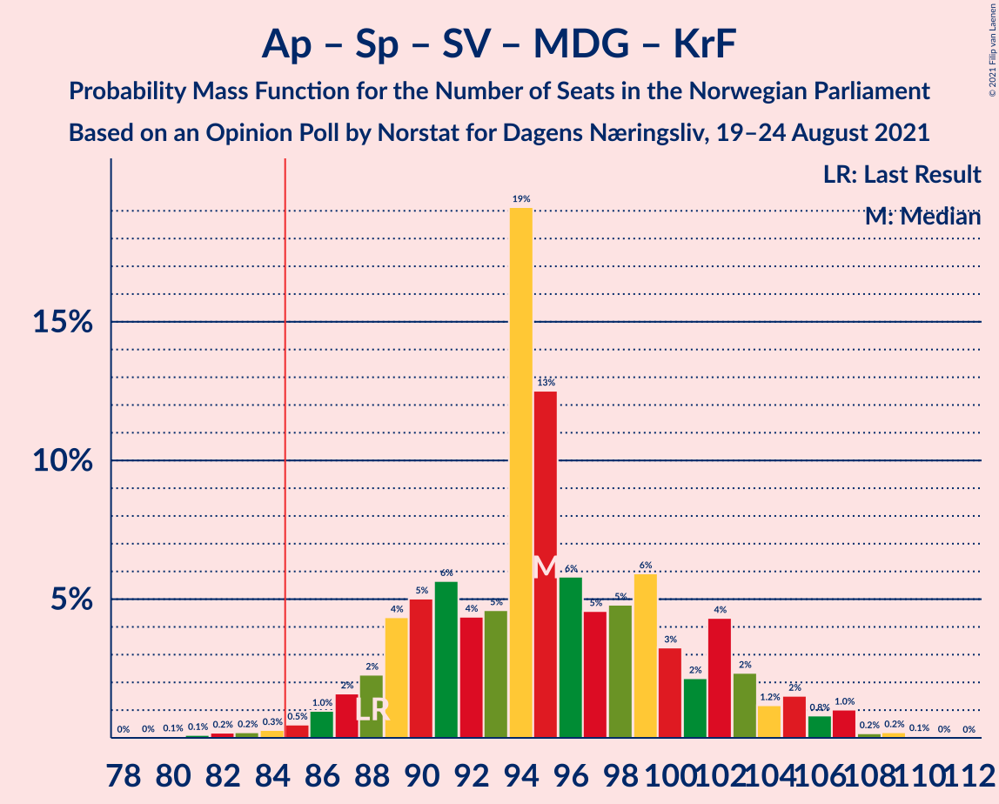

| Number of Seats | Probability | Accumulated | Special Marks |
|:---------------:|:-----------:|:-----------:|:-------------:|
| 80 | 0.1% | 100% |  |
| 81 | 0.1% | 99.9% |  |
| 82 | 0.2% | 99.8% |  |
| 83 | 0.2% | 99.6% |  |
| 84 | 0.3% | 99.4% |  |
| 85 | 0.5% | 99.1% | Majority |
| 86 | 1.0% | 98.7% |  |
| 87 | 2% | 98% |  |
| 88 | 2% | 96% | Last Result |
| 89 | 4% | 94% |  |
| 90 | 5% | 89% |  |
| 91 | 6% | 84% |  |
| 92 | 4% | 79% |  |
| 93 | 5% | 74% | Median |
| 94 | 19% | 70% |  |
| 95 | 13% | 51% |  |
| 96 | 6% | 38% |  |
| 97 | 5% | 32% |  |
| 98 | 5% | 28% |  |
| 99 | 6% | 23% |  |
| 100 | 3% | 17% |  |
| 101 | 2% | 14% |  |
| 102 | 4% | 12% |  |
| 103 | 2% | 7% |  |
| 104 | 1.2% | 5% |  |
| 105 | 2% | 4% |  |
| 106 | 0.8% | 2% |  |
| 107 | 1.0% | 1.5% |  |
| 108 | 0.2% | 0.5% |  |
| 109 | 0.2% | 0.3% |  |
| 110 | 0.1% | 0.1% |  |
| 111 | 0% | 0% |  |

### Arbeiderpartiet – Senterpartiet – Sosialistisk Venstreparti – Miljøpartiet De Grønne

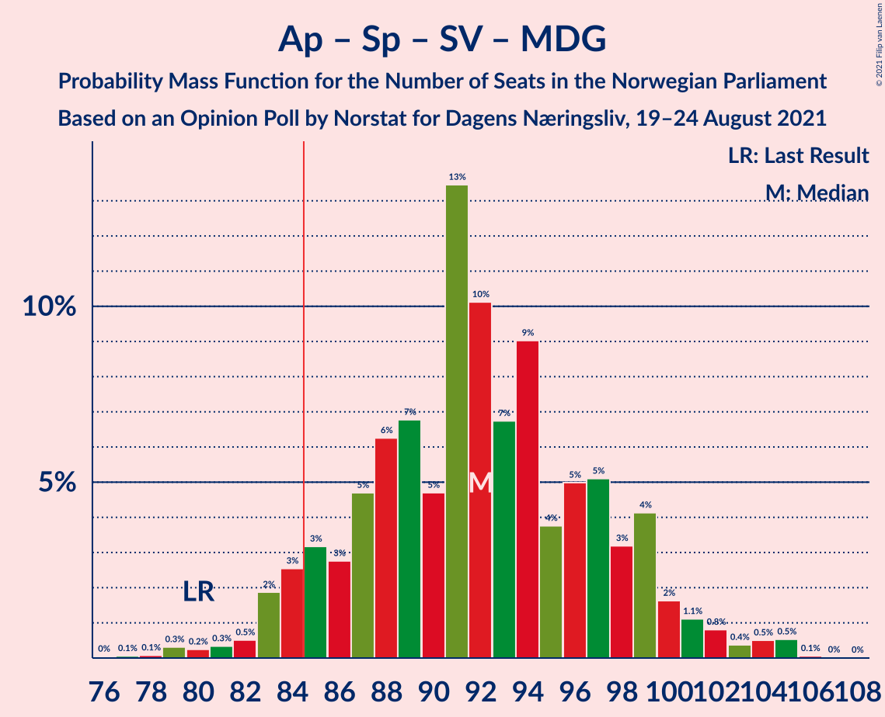

| Number of Seats | Probability | Accumulated | Special Marks |
|:---------------:|:-----------:|:-----------:|:-------------:|
| 76 | 0% | 100% |  |
| 77 | 0.1% | 99.9% |  |
| 78 | 0.1% | 99.9% |  |
| 79 | 0.3% | 99.8% |  |
| 80 | 0.2% | 99.5% | Last Result |
| 81 | 0.3% | 99.2% |  |
| 82 | 0.5% | 98.9% |  |
| 83 | 2% | 98% |  |
| 84 | 3% | 97% |  |
| 85 | 3% | 94% | Majority |
| 86 | 3% | 91% |  |
| 87 | 5% | 88% |  |
| 88 | 6% | 83% |  |
| 89 | 7% | 77% |  |
| 90 | 5% | 70% | Median |
| 91 | 13% | 66% |  |
| 92 | 10% | 52% |  |
| 93 | 7% | 42% |  |
| 94 | 9% | 35% |  |
| 95 | 4% | 26% |  |
| 96 | 5% | 22% |  |
| 97 | 5% | 17% |  |
| 98 | 3% | 12% |  |
| 99 | 4% | 9% |  |
| 100 | 2% | 5% |  |
| 101 | 1.1% | 3% |  |
| 102 | 0.8% | 2% |  |
| 103 | 0.4% | 2% |  |
| 104 | 0.5% | 1.1% |  |
| 105 | 0.5% | 0.6% |  |
| 106 | 0.1% | 0.1% |  |
| 107 | 0% | 0% |  |

### Arbeiderpartiet – Senterpartiet – Sosialistisk Venstreparti – Rødt

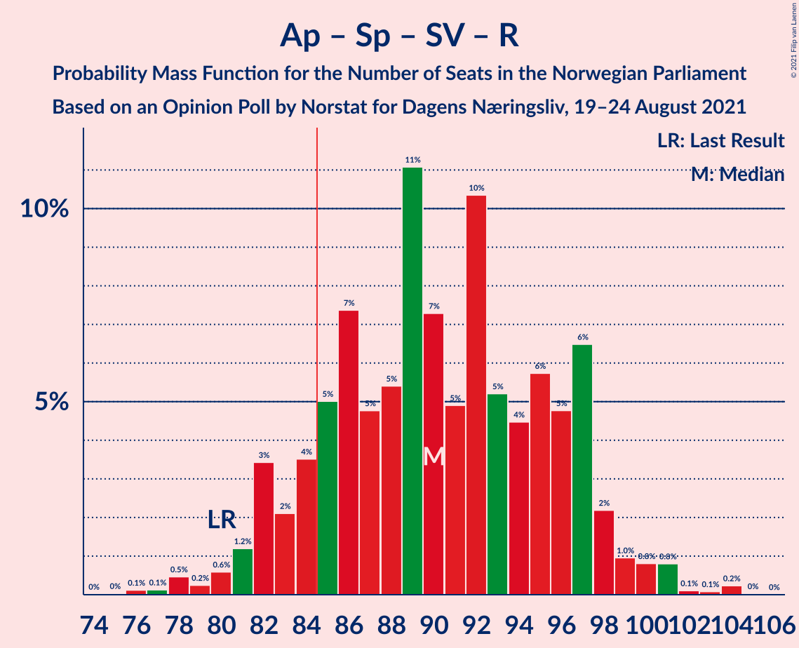

| Number of Seats | Probability | Accumulated | Special Marks |
|:---------------:|:-----------:|:-----------:|:-------------:|
| 75 | 0% | 100% |  |
| 76 | 0.1% | 99.9% |  |
| 77 | 0.1% | 99.8% |  |
| 78 | 0.5% | 99.7% |  |
| 79 | 0.2% | 99.2% |  |
| 80 | 0.6% | 99.0% | Last Result |
| 81 | 1.2% | 98% |  |
| 82 | 3% | 97% |  |
| 83 | 2% | 94% |  |
| 84 | 4% | 92% |  |
| 85 | 5% | 88% | Majority |
| 86 | 7% | 83% |  |
| 87 | 5% | 76% |  |
| 88 | 5% | 71% |  |
| 89 | 11% | 66% | Median |
| 90 | 7% | 54% |  |
| 91 | 5% | 47% |  |
| 92 | 10% | 42% |  |
| 93 | 5% | 32% |  |
| 94 | 4% | 27% |  |
| 95 | 6% | 22% |  |
| 96 | 5% | 17% |  |
| 97 | 6% | 12% |  |
| 98 | 2% | 5% |  |
| 99 | 1.0% | 3% |  |
| 100 | 0.8% | 2% |  |
| 101 | 0.8% | 1.3% |  |
| 102 | 0.1% | 0.5% |  |
| 103 | 0.1% | 0.4% |  |
| 104 | 0.2% | 0.3% |  |
| 105 | 0% | 0.1% |  |
| 106 | 0% | 0% |  |

### Høyre – Senterpartiet – Fremskrittspartiet – Venstre – Kristelig Folkeparti

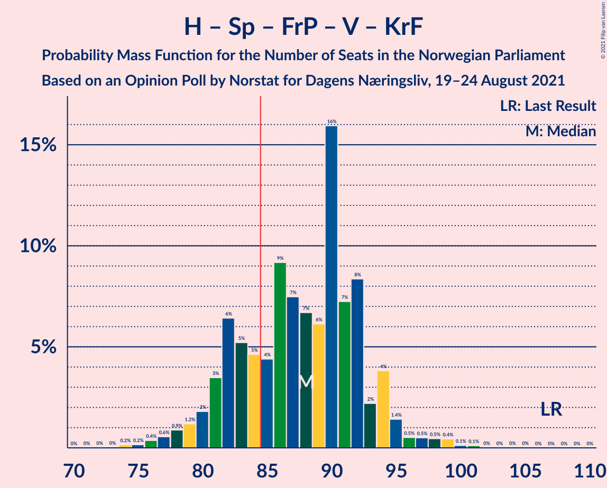

| Number of Seats | Probability | Accumulated | Special Marks |
|:---------------:|:-----------:|:-----------:|:-------------:|
| 73 | 0% | 100% |  |
| 74 | 0.2% | 99.9% |  |
| 75 | 0.2% | 99.8% |  |
| 76 | 0.4% | 99.6% |  |
| 77 | 0.6% | 99.3% |  |
| 78 | 0.9% | 98.7% |  |
| 79 | 1.2% | 98% |  |
| 80 | 2% | 97% |  |
| 81 | 3% | 95% |  |
| 82 | 6% | 91% |  |
| 83 | 5% | 85% |  |
| 84 | 5% | 80% |  |
| 85 | 4% | 75% | Majority |
| 86 | 9% | 71% |  |
| 87 | 7% | 62% |  |
| 88 | 7% | 54% | Median |
| 89 | 6% | 47% |  |
| 90 | 16% | 41% |  |
| 91 | 7% | 25% |  |
| 92 | 8% | 18% |  |
| 93 | 2% | 10% |  |
| 94 | 4% | 7% |  |
| 95 | 1.4% | 4% |  |
| 96 | 0.5% | 2% |  |
| 97 | 0.5% | 2% |  |
| 98 | 0.5% | 1.2% |  |
| 99 | 0.4% | 0.7% |  |
| 100 | 0.1% | 0.3% |  |
| 101 | 0.1% | 0.2% |  |
| 102 | 0% | 0.1% |  |
| 103 | 0% | 0% |  |
| 104 | 0% | 0% |  |
| 105 | 0% | 0% |  |
| 106 | 0% | 0% |  |
| 107 | 0% | 0% | Last Result |

### Arbeiderpartiet – Senterpartiet – Miljøpartiet De Grønne – Kristelig Folkeparti

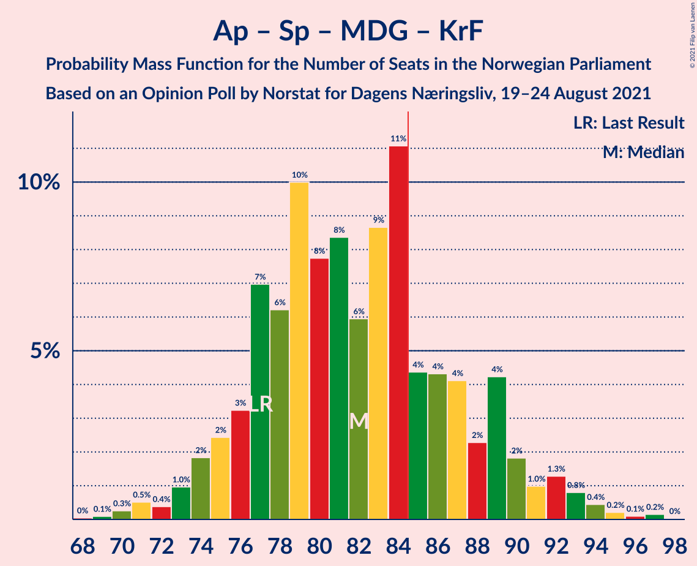

| Number of Seats | Probability | Accumulated | Special Marks |
|:---------------:|:-----------:|:-----------:|:-------------:|
| 68 | 0% | 100% |  |
| 69 | 0.1% | 99.9% |  |
| 70 | 0.3% | 99.8% |  |
| 71 | 0.5% | 99.6% |  |
| 72 | 0.4% | 99.0% |  |
| 73 | 1.0% | 98.7% |  |
| 74 | 2% | 98% |  |
| 75 | 2% | 96% |  |
| 76 | 3% | 93% |  |
| 77 | 7% | 90% | Last Result |
| 78 | 6% | 83% |  |
| 79 | 10% | 77% |  |
| 80 | 8% | 67% | Median |
| 81 | 8% | 59% |  |
| 82 | 6% | 51% |  |
| 83 | 9% | 45% |  |
| 84 | 11% | 36% |  |
| 85 | 4% | 25% | Majority |
| 86 | 4% | 21% |  |
| 87 | 4% | 16% |  |
| 88 | 2% | 12% |  |
| 89 | 4% | 10% |  |
| 90 | 2% | 6% |  |
| 91 | 1.0% | 4% |  |
| 92 | 1.3% | 3% |  |
| 93 | 0.8% | 2% |  |
| 94 | 0.4% | 1.0% |  |
| 95 | 0.2% | 0.5% |  |
| 96 | 0.1% | 0.3% |  |
| 97 | 0.2% | 0.2% |  |
| 98 | 0% | 0% |  |

### Arbeiderpartiet – Senterpartiet – Sosialistisk Venstreparti

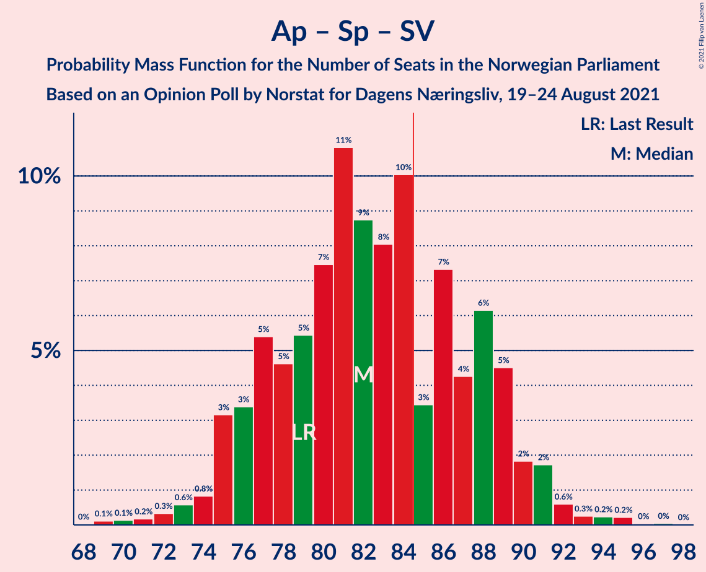

| Number of Seats | Probability | Accumulated | Special Marks |
|:---------------:|:-----------:|:-----------:|:-------------:|
| 69 | 0.1% | 100% |  |
| 70 | 0.1% | 99.9% |  |
| 71 | 0.2% | 99.7% |  |
| 72 | 0.3% | 99.5% |  |
| 73 | 0.6% | 99.2% |  |
| 74 | 0.8% | 98.6% |  |
| 75 | 3% | 98% |  |
| 76 | 3% | 95% |  |
| 77 | 5% | 91% |  |
| 78 | 5% | 86% |  |
| 79 | 5% | 81% | Last Result |
| 80 | 7% | 76% |  |
| 81 | 11% | 68% | Median |
| 82 | 9% | 58% |  |
| 83 | 8% | 49% |  |
| 84 | 10% | 41% |  |
| 85 | 3% | 31% | Majority |
| 86 | 7% | 27% |  |
| 87 | 4% | 20% |  |
| 88 | 6% | 16% |  |
| 89 | 5% | 9% |  |
| 90 | 2% | 5% |  |
| 91 | 2% | 3% |  |
| 92 | 0.6% | 1.4% |  |
| 93 | 0.3% | 0.8% |  |
| 94 | 0.2% | 0.6% |  |
| 95 | 0.2% | 0.3% |  |
| 96 | 0% | 0.1% |  |
| 97 | 0% | 0.1% |  |
| 98 | 0% | 0% |  |

### Arbeiderpartiet – Sosialistisk Venstreparti – Miljøpartiet De Grønne – Rødt

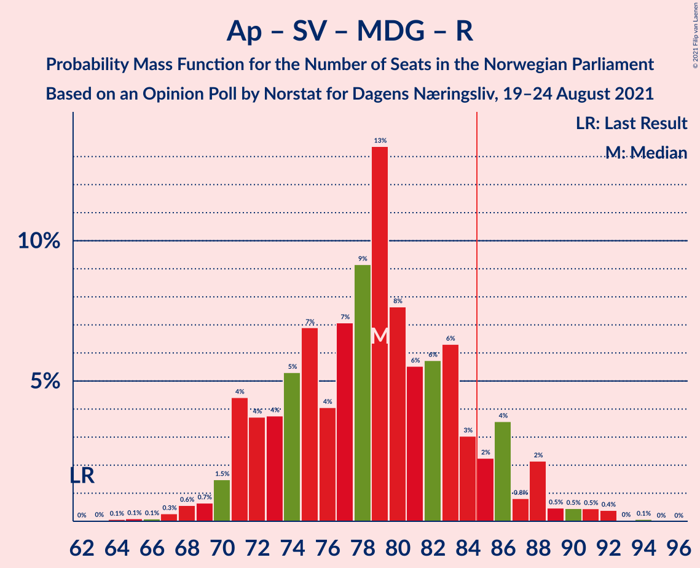

| Number of Seats | Probability | Accumulated | Special Marks |
|:---------------:|:-----------:|:-----------:|:-------------:|
| 62 | 0% | 100% | Last Result |
| 63 | 0% | 100% |  |
| 64 | 0.1% | 100% |  |
| 65 | 0.1% | 99.9% |  |
| 66 | 0.1% | 99.8% |  |
| 67 | 0.3% | 99.7% |  |
| 68 | 0.6% | 99.4% |  |
| 69 | 0.7% | 98.9% |  |
| 70 | 1.5% | 98% |  |
| 71 | 4% | 97% |  |
| 72 | 4% | 92% |  |
| 73 | 4% | 89% |  |
| 74 | 5% | 85% |  |
| 75 | 7% | 80% |  |
| 76 | 4% | 73% |  |
| 77 | 7% | 69% | Median |
| 78 | 9% | 61% |  |
| 79 | 13% | 52% |  |
| 80 | 8% | 39% |  |
| 81 | 6% | 31% |  |
| 82 | 6% | 26% |  |
| 83 | 6% | 20% |  |
| 84 | 3% | 14% |  |
| 85 | 2% | 11% | Majority |
| 86 | 4% | 8% |  |
| 87 | 0.8% | 5% |  |
| 88 | 2% | 4% |  |
| 89 | 0.5% | 2% |  |
| 90 | 0.5% | 1.4% |  |
| 91 | 0.5% | 1.0% |  |
| 92 | 0.4% | 0.5% |  |
| 93 | 0% | 0.1% |  |
| 94 | 0.1% | 0.1% |  |
| 95 | 0% | 0% |  |

### Høyre – Fremskrittspartiet – Miljøpartiet De Grønne – Venstre – Kristelig Folkeparti

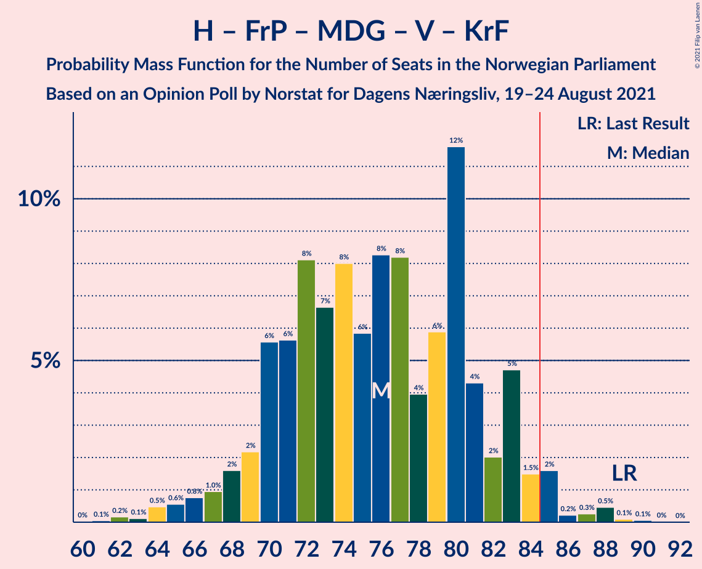

| Number of Seats | Probability | Accumulated | Special Marks |
|:---------------:|:-----------:|:-----------:|:-------------:|
| 60 | 0% | 100% |  |
| 61 | 0.1% | 99.9% |  |
| 62 | 0.2% | 99.9% |  |
| 63 | 0.1% | 99.7% |  |
| 64 | 0.5% | 99.6% |  |
| 65 | 0.6% | 99.1% |  |
| 66 | 0.8% | 98.6% |  |
| 67 | 1.0% | 98% |  |
| 68 | 2% | 97% |  |
| 69 | 2% | 95% |  |
| 70 | 6% | 93% |  |
| 71 | 6% | 87% |  |
| 72 | 8% | 82% |  |
| 73 | 7% | 74% |  |
| 74 | 8% | 67% |  |
| 75 | 6% | 59% |  |
| 76 | 8% | 53% | Median |
| 77 | 8% | 45% |  |
| 78 | 4% | 37% |  |
| 79 | 6% | 33% |  |
| 80 | 12% | 27% |  |
| 81 | 4% | 15% |  |
| 82 | 2% | 11% |  |
| 83 | 5% | 9% |  |
| 84 | 1.5% | 4% |  |
| 85 | 2% | 3% | Majority |
| 86 | 0.2% | 1.2% |  |
| 87 | 0.3% | 1.0% |  |
| 88 | 0.5% | 0.7% |  |
| 89 | 0.1% | 0.2% | Last Result |
| 90 | 0.1% | 0.1% |  |
| 91 | 0% | 0.1% |  |
| 92 | 0% | 0% |  |

### Arbeiderpartiet – Senterpartiet – Kristelig Folkeparti

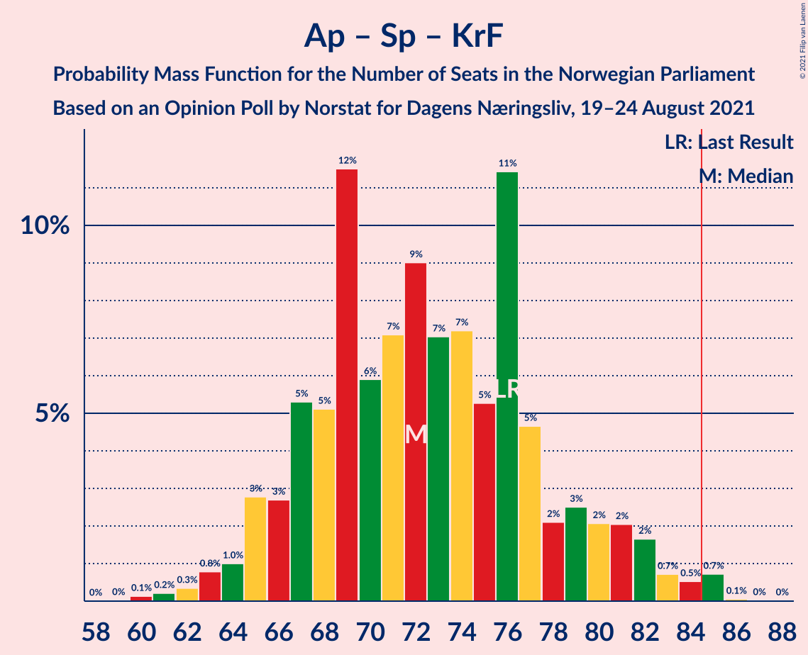

| Number of Seats | Probability | Accumulated | Special Marks |
|:---------------:|:-----------:|:-----------:|:-------------:|
| 60 | 0.1% | 100% |  |
| 61 | 0.2% | 99.8% |  |
| 62 | 0.3% | 99.6% |  |
| 63 | 0.8% | 99.3% |  |
| 64 | 1.0% | 98% |  |
| 65 | 3% | 97% |  |
| 66 | 3% | 95% |  |
| 67 | 5% | 92% |  |
| 68 | 5% | 87% |  |
| 69 | 12% | 82% |  |
| 70 | 6% | 70% |  |
| 71 | 7% | 64% | Median |
| 72 | 9% | 57% |  |
| 73 | 7% | 48% |  |
| 74 | 7% | 41% |  |
| 75 | 5% | 34% |  |
| 76 | 11% | 29% | Last Result |
| 77 | 5% | 17% |  |
| 78 | 2% | 12% |  |
| 79 | 3% | 10% |  |
| 80 | 2% | 8% |  |
| 81 | 2% | 6% |  |
| 82 | 2% | 4% |  |
| 83 | 0.7% | 2% |  |
| 84 | 0.5% | 1.4% |  |
| 85 | 0.7% | 0.8% | Majority |
| 86 | 0.1% | 0.1% |  |
| 87 | 0% | 0.1% |  |
| 88 | 0% | 0% |  |

### Arbeiderpartiet – Senterpartiet

| Number of Seats | Probability | Accumulated | Special Marks |
|:---------------:|:-----------:|:-----------:|:-------------:|
| 57 | 0.1% | 100% |  |
| 58 | 0.1% | 99.9% |  |
| 59 | 0.4% | 99.8% |  |
| 60 | 0.7% | 99.4% |  |
| 61 | 1.2% | 98.7% |  |
| 62 | 1.2% | 98% |  |
| 63 | 3% | 96% |  |
| 64 | 5% | 94% |  |
| 65 | 5% | 88% |  |
| 66 | 17% | 83% |  |
| 67 | 6% | 66% |  |
| 68 | 9% | 60% | Last Result, Median |
| 69 | 4% | 51% |  |
| 70 | 4% | 47% |  |
| 71 | 9% | 43% |  |
| 72 | 5% | 34% |  |
| 73 | 10% | 28% |  |
| 74 | 8% | 19% |  |
| 75 | 3% | 10% |  |
| 76 | 2% | 7% |  |
| 77 | 2% | 4% |  |
| 78 | 1.2% | 3% |  |
| 79 | 0.6% | 1.4% |  |
| 80 | 0.5% | 0.8% |  |
| 81 | 0.2% | 0.3% |  |
| 82 | 0% | 0.1% |  |
| 83 | 0% | 0% |  |

### Høyre – Fremskrittspartiet – Venstre – Kristelig Folkeparti

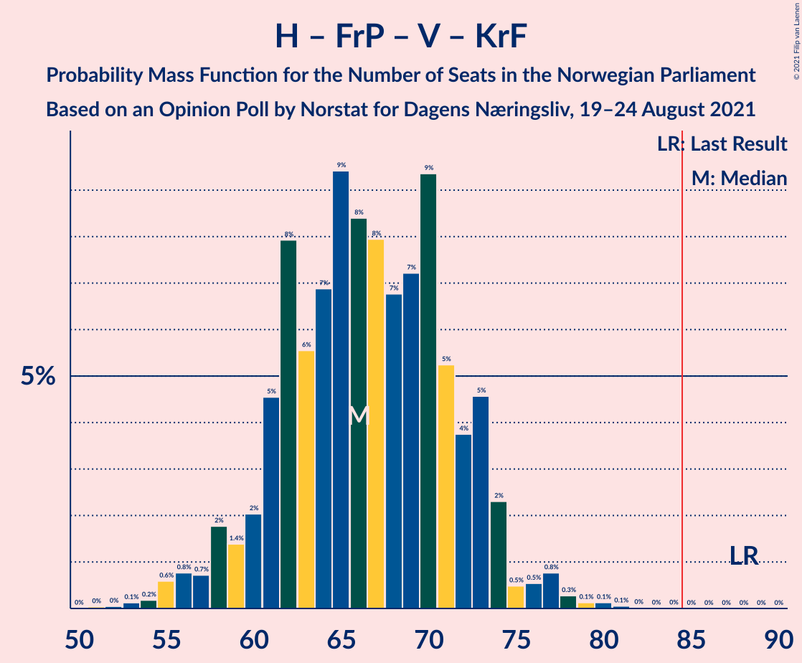

| Number of Seats | Probability | Accumulated | Special Marks |
|:---------------:|:-----------:|:-----------:|:-------------:|
| 51 | 0% | 100% |  |
| 52 | 0% | 99.9% |  |
| 53 | 0.1% | 99.9% |  |
| 54 | 0.2% | 99.8% |  |
| 55 | 0.6% | 99.6% |  |
| 56 | 0.8% | 99.0% |  |
| 57 | 0.7% | 98% |  |
| 58 | 2% | 98% |  |
| 59 | 1.4% | 96% |  |
| 60 | 2% | 94% |  |
| 61 | 5% | 92% |  |
| 62 | 8% | 88% |  |
| 63 | 6% | 80% |  |
| 64 | 7% | 74% |  |
| 65 | 9% | 67% |  |
| 66 | 8% | 58% |  |
| 67 | 8% | 50% | Median |
| 68 | 7% | 42% |  |
| 69 | 7% | 35% |  |
| 70 | 9% | 28% |  |
| 71 | 5% | 18% |  |
| 72 | 4% | 13% |  |
| 73 | 5% | 9% |  |
| 74 | 2% | 5% |  |
| 75 | 0.5% | 2% |  |
| 76 | 0.5% | 2% |  |
| 77 | 0.8% | 1.4% |  |
| 78 | 0.3% | 0.6% |  |
| 79 | 0.1% | 0.3% |  |
| 80 | 0.1% | 0.2% |  |
| 81 | 0.1% | 0.1% |  |
| 82 | 0% | 0% |  |
| 83 | 0% | 0% |  |
| 84 | 0% | 0% |  |
| 85 | 0% | 0% | Majority |
| 86 | 0% | 0% |  |
| 87 | 0% | 0% |  |
| 88 | 0% | 0% | Last Result |

### Høyre – Fremskrittspartiet – Venstre

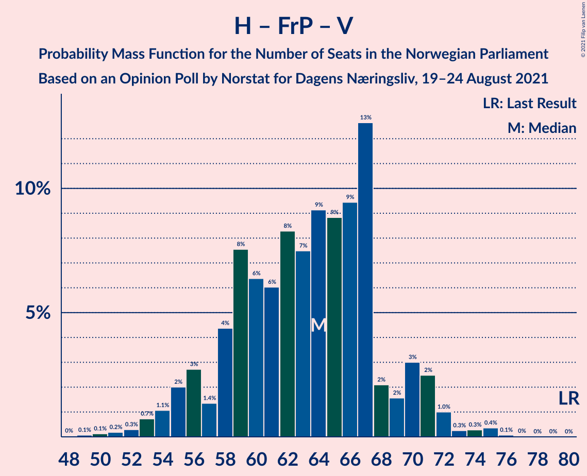

| Number of Seats | Probability | Accumulated | Special Marks |
|:---------------:|:-----------:|:-----------:|:-------------:|
| 48 | 0% | 100% |  |
| 49 | 0.1% | 99.9% |  |
| 50 | 0.1% | 99.9% |  |
| 51 | 0.2% | 99.7% |  |
| 52 | 0.3% | 99.5% |  |
| 53 | 0.7% | 99.2% |  |
| 54 | 1.1% | 98.5% |  |
| 55 | 2% | 97% |  |
| 56 | 3% | 95% |  |
| 57 | 1.4% | 93% |  |
| 58 | 4% | 91% |  |
| 59 | 8% | 87% |  |
| 60 | 6% | 79% |  |
| 61 | 6% | 73% |  |
| 62 | 8% | 67% |  |
| 63 | 7% | 59% |  |
| 64 | 9% | 51% | Median |
| 65 | 9% | 42% |  |
| 66 | 9% | 33% |  |
| 67 | 13% | 24% |  |
| 68 | 2% | 11% |  |
| 69 | 2% | 9% |  |
| 70 | 3% | 8% |  |
| 71 | 2% | 5% |  |
| 72 | 1.0% | 2% |  |
| 73 | 0.3% | 1.0% |  |
| 74 | 0.3% | 0.8% |  |
| 75 | 0.4% | 0.5% |  |
| 76 | 0.1% | 0.1% |  |
| 77 | 0% | 0.1% |  |
| 78 | 0% | 0% |  |
| 79 | 0% | 0% |  |
| 80 | 0% | 0% | Last Result |

### Arbeiderpartiet – Sosialistisk Venstreparti

| Number of Seats | Probability | Accumulated | Special Marks |
|:---------------:|:-----------:|:-----------:|:-------------:|
| 50 | 0% | 100% |  |
| 51 | 0.2% | 99.9% |  |
| 52 | 0.5% | 99.7% |  |
| 53 | 0.4% | 99.2% |  |
| 54 | 2% | 98.8% |  |
| 55 | 3% | 97% |  |
| 56 | 5% | 94% |  |
| 57 | 6% | 89% |  |
| 58 | 6% | 84% |  |
| 59 | 9% | 78% |  |
| 60 | 10% | 69% | Last Result, Median |
| 61 | 15% | 59% |  |
| 62 | 9% | 44% |  |
| 63 | 5% | 35% |  |
| 64 | 9% | 30% |  |
| 65 | 6% | 21% |  |
| 66 | 4% | 15% |  |
| 67 | 3% | 12% |  |
| 68 | 5% | 8% |  |
| 69 | 1.5% | 4% |  |
| 70 | 1.0% | 2% |  |
| 71 | 0.9% | 1.3% |  |
| 72 | 0.2% | 0.4% |  |
| 73 | 0.1% | 0.1% |  |
| 74 | 0.1% | 0.1% |  |
| 75 | 0% | 0% |  |

### Høyre – Fremskrittspartiet

| Number of Seats | Probability | Accumulated | Special Marks |
|:---------------:|:-----------:|:-----------:|:-------------:|
| 43 | 0% | 100% |  |
| 44 | 0.1% | 99.9% |  |
| 45 | 0.5% | 99.8% |  |
| 46 | 0.6% | 99.3% |  |
| 47 | 1.1% | 98.7% |  |
| 48 | 2% | 98% |  |
| 49 | 2% | 96% |  |
| 50 | 3% | 94% |  |
| 51 | 9% | 91% |  |
| 52 | 4% | 82% |  |
| 53 | 10% | 78% |  |
| 54 | 9% | 69% |  |
| 55 | 10% | 59% |  |
| 56 | 8% | 49% | Median |
| 57 | 10% | 41% |  |
| 58 | 12% | 31% |  |
| 59 | 7% | 19% |  |
| 60 | 3% | 13% |  |
| 61 | 4% | 9% |  |
| 62 | 3% | 5% |  |
| 63 | 1.0% | 3% |  |
| 64 | 0.8% | 2% |  |
| 65 | 0.4% | 1.0% |  |
| 66 | 0.4% | 0.6% |  |
| 67 | 0.1% | 0.2% |  |
| 68 | 0% | 0.1% |  |
| 69 | 0% | 0.1% |  |
| 70 | 0% | 0% |  |
| 71 | 0% | 0% |  |
| 72 | 0% | 0% | Last Result |

### Høyre – Venstre – Kristelig Folkeparti

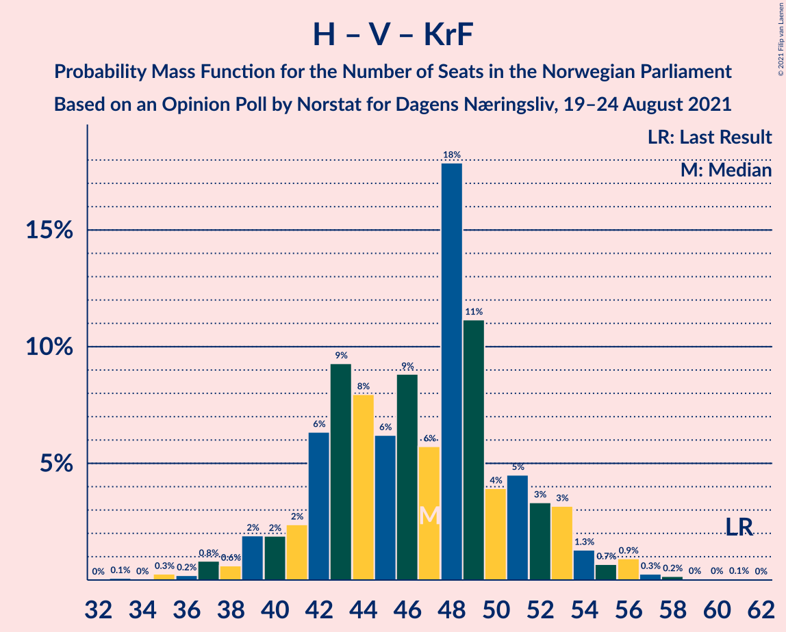

| Number of Seats | Probability | Accumulated | Special Marks |
|:---------------:|:-----------:|:-----------:|:-------------:|
| 33 | 0.1% | 100% |  |
| 34 | 0% | 99.9% |  |
| 35 | 0.3% | 99.9% |  |
| 36 | 0.2% | 99.6% |  |
| 37 | 0.8% | 99.4% |  |
| 38 | 0.6% | 98.6% |  |
| 39 | 2% | 98% |  |
| 40 | 2% | 96% |  |
| 41 | 2% | 94% |  |
| 42 | 6% | 92% |  |
| 43 | 9% | 85% |  |
| 44 | 8% | 76% |  |
| 45 | 6% | 68% |  |
| 46 | 9% | 62% |  |
| 47 | 6% | 53% | Median |
| 48 | 18% | 47% |  |
| 49 | 11% | 30% |  |
| 50 | 4% | 18% |  |
| 51 | 5% | 14% |  |
| 52 | 3% | 10% |  |
| 53 | 3% | 7% |  |
| 54 | 1.3% | 3% |  |
| 55 | 0.7% | 2% |  |
| 56 | 0.9% | 2% |  |
| 57 | 0.3% | 0.6% |  |
| 58 | 0.2% | 0.3% |  |
| 59 | 0% | 0.2% |  |
| 60 | 0% | 0.1% |  |
| 61 | 0.1% | 0.1% | Last Result |
| 62 | 0% | 0% |  |

### Senterpartiet – Venstre – Kristelig Folkeparti

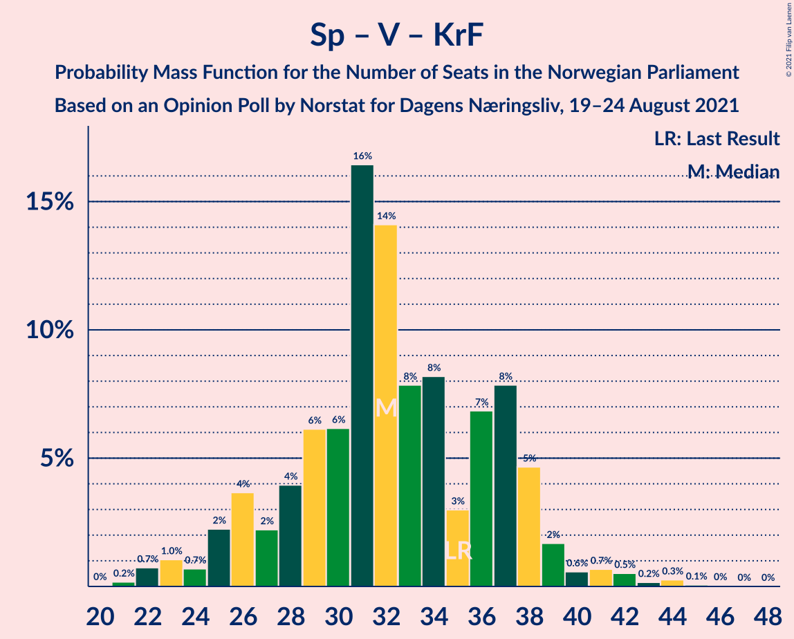

| Number of Seats | Probability | Accumulated | Special Marks |
|:---------------:|:-----------:|:-----------:|:-------------:|
| 20 | 0% | 100% |  |
| 21 | 0.2% | 99.9% |  |
| 22 | 0.7% | 99.7% |  |
| 23 | 1.0% | 99.0% |  |
| 24 | 0.7% | 98% |  |
| 25 | 2% | 97% |  |
| 26 | 4% | 95% |  |
| 27 | 2% | 91% |  |
| 28 | 4% | 89% |  |
| 29 | 6% | 85% |  |
| 30 | 6% | 79% |  |
| 31 | 16% | 73% |  |
| 32 | 14% | 56% | Median |
| 33 | 8% | 42% |  |
| 34 | 8% | 35% |  |
| 35 | 3% | 26% | Last Result |
| 36 | 7% | 23% |  |
| 37 | 8% | 16% |  |
| 38 | 5% | 9% |  |
| 39 | 2% | 4% |  |
| 40 | 0.6% | 2% |  |
| 41 | 0.7% | 2% |  |
| 42 | 0.5% | 1.1% |  |
| 43 | 0.2% | 0.5% |  |
| 44 | 0.3% | 0.4% |  |
| 45 | 0.1% | 0.1% |  |
| 46 | 0% | 0.1% |  |
| 47 | 0% | 0% |  |

## Technical Information

### Opinion Poll

+ **Polling firm:** Norstat
+ **Commissioner(s):** Dagens Næringsliv
+ **Fieldwork period:** 19–24 August 2021

### Calculations

+ **Sample size:** 628
+ **Simulations done:** 1,048,576
+ **Error estimate:** 2.16%

