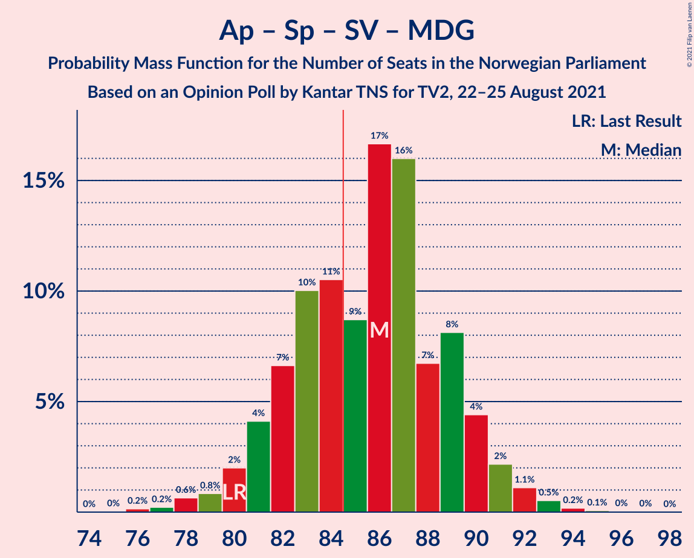

# Opinion Poll by Kantar TNS for TV2, 22–25 August 2021

<a href="#voting-intentions">Voting Intentions</a> | <a href="#seats">Seats</a> | <a href="#coalitions">Coalitions</a> | <a href="#technical-information">Technical Information</a>

## Voting Intentions

### Confidence Intervals

| Party | Last Result | Poll Result | 80% Confidence Interval | 90% Confidence Interval | 95% Confidence Interval | 99% Confidence Interval |
|:-----:|:-----------:|:-----------:|:-----------------------:|:-----------------------:|:-----------------------:|:-----------------------:|
| Arbeiderpartiet | 27.4% | 22.4% | 20.8–24.2% |20.3–24.7% |19.9–25.1% |19.2–26.0% |
| Høyre | 25.0% | 20.5% | 18.9–22.2% |18.5–22.7% |18.1–23.1% |17.4–24.0% |
| Senterpartiet | 10.3% | 11.2% | 10.0–12.5% |9.6–12.9% |9.3–13.3% |8.8–14.0% |
| Fremskrittspartiet | 15.2% | 10.7% | 9.5–12.0% |9.2–12.4% |8.9–12.7% |8.4–13.4% |
| Sosialistisk Venstreparti | 6.0% | 9.9% | 8.8–11.3% |8.5–11.6% |8.2–12.0% |7.7–12.6% |
| Rødt | 2.4% | 6.3% | 5.4–7.4% |5.2–7.8% |5.0–8.0% |4.6–8.6% |
| Miljøpartiet De Grønne | 3.2% | 5.3% | 4.5–6.4% |4.3–6.6% |4.1–6.9% |3.7–7.4% |
| Venstre | 4.4% | 4.8% | 4.1–5.8% |3.8–6.1% |3.7–6.3% |3.3–6.9% |
| Kristelig Folkeparti | 4.2% | 3.7% | 3.0–4.6% |2.9–4.9% |2.7–5.1% |2.4–5.5% |

*Note:* The poll result column reflects the actual value used in the calculations. Published results may vary slightly, and in addition be rounded to fewer digits.

## Seats

### Confidence Intervals

| Party | Last Result | Median | 80% Confidence Interval | 90% Confidence Interval | 95% Confidence Interval | 99% Confidence Interval |
|:-----:|:-----------:|:------:|:-----------------------:|:-----------------------:|:-----------------------:|:-----------------------:|
| <a href="#arbeiderpartiet">Arbeiderpartiet</a> | 49 | 41 | 40–44 |39–45 |38–46 |36–47 |
| <a href="#høyre">Høyre</a> | 45 | 36 | 34–39 |34–40 |33–42 |31–44 |
| <a href="#senterpartiet">Senterpartiet</a> | 19 | 20 | 18–22 |17–23 |17–24 |15–25 |
| <a href="#fremskrittspartiet">Fremskrittspartiet</a> | 27 | 18 | 16–20 |15–21 |15–22 |14–24 |
| <a href="#sosialistisk-venstreparti">Sosialistisk Venstreparti</a> | 11 | 16 | 15–18 |13–18 |12–19 |11–20 |
| <a href="#rødt">Rødt</a> | 1 | 10 | 8–11 |8–12 |8–12 |7–13 |
| <a href="#miljøpartiet-de-grønne">Miljøpartiet De Grønne</a> | 1 | 8 | 7–10 |6–10 |3–11 |2–12 |
| <a href="#venstre">Venstre</a> | 8 | 8 | 6–9 |2–9 |2–10 |2–11 |
| <a href="#kristelig-folkeparti">Kristelig Folkeparti</a> | 8 | 3 | 2–7 |2–7 |2–8 |1–8 |

### Arbeiderpartiet

*For a full overview of the results for this party, see the [Arbeiderpartiet](party-arbeiderpartiet.html) page.*

| Number of Seats | Probability | Accumulated | Special Marks |
|:---------------:|:-----------:|:-----------:|:-------------:|
| 34 | 0% | 100% |  |
| 35 | 0.2% | 99.9% |  |
| 36 | 0.4% | 99.7% |  |
| 37 | 0.3% | 99.3% |  |
| 38 | 2% | 99.0% |  |
| 39 | 3% | 97% |  |
| 40 | 12% | 93% |  |
| 41 | 40% | 82% | Median |
| 42 | 10% | 42% |  |
| 43 | 22% | 32% |  |
| 44 | 4% | 10% |  |
| 45 | 3% | 6% |  |
| 46 | 2% | 3% |  |
| 47 | 0.6% | 1.1% |  |
| 48 | 0.3% | 0.5% |  |
| 49 | 0.1% | 0.2% | Last Result |
| 50 | 0% | 0.1% |  |
| 51 | 0% | 0% |  |

### Høyre

*For a full overview of the results for this party, see the [Høyre](party-høyre.html) page.*

| Number of Seats | Probability | Accumulated | Special Marks |
|:---------------:|:-----------:|:-----------:|:-------------:|
| 29 | 0.1% | 100% |  |
| 30 | 0.2% | 99.8% |  |
| 31 | 0.7% | 99.6% |  |
| 32 | 0.8% | 99.0% |  |
| 33 | 2% | 98% |  |
| 34 | 7% | 97% |  |
| 35 | 27% | 89% |  |
| 36 | 14% | 63% | Median |
| 37 | 17% | 49% |  |
| 38 | 16% | 32% |  |
| 39 | 8% | 15% |  |
| 40 | 2% | 7% |  |
| 41 | 2% | 5% |  |
| 42 | 2% | 3% |  |
| 43 | 0.3% | 0.8% |  |
| 44 | 0.4% | 0.5% |  |
| 45 | 0.1% | 0.2% | Last Result |
| 46 | 0.1% | 0.1% |  |
| 47 | 0% | 0% |  |

### Senterpartiet

*For a full overview of the results for this party, see the [Senterpartiet](party-senterpartiet.html) page.*

| Number of Seats | Probability | Accumulated | Special Marks |
|:---------------:|:-----------:|:-----------:|:-------------:|
| 14 | 0.2% | 100% |  |
| 15 | 0.4% | 99.8% |  |
| 16 | 1.1% | 99.4% |  |
| 17 | 3% | 98% |  |
| 18 | 24% | 95% |  |
| 19 | 15% | 71% | Last Result |
| 20 | 24% | 55% | Median |
| 21 | 20% | 31% |  |
| 22 | 3% | 11% |  |
| 23 | 4% | 8% |  |
| 24 | 3% | 4% |  |
| 25 | 0.6% | 0.9% |  |
| 26 | 0.1% | 0.3% |  |
| 27 | 0.2% | 0.2% |  |
| 28 | 0% | 0% |  |

### Fremskrittspartiet

*For a full overview of the results for this party, see the [Fremskrittspartiet](party-fremskrittspartiet.html) page.*

| Number of Seats | Probability | Accumulated | Special Marks |
|:---------------:|:-----------:|:-----------:|:-------------:|
| 13 | 0.3% | 100% |  |
| 14 | 1.2% | 99.6% |  |
| 15 | 5% | 98% |  |
| 16 | 10% | 94% |  |
| 17 | 18% | 84% |  |
| 18 | 22% | 66% | Median |
| 19 | 26% | 44% |  |
| 20 | 9% | 17% |  |
| 21 | 4% | 8% |  |
| 22 | 2% | 4% |  |
| 23 | 1.1% | 2% |  |
| 24 | 0.8% | 1.2% |  |
| 25 | 0.2% | 0.4% |  |
| 26 | 0.1% | 0.1% |  |
| 27 | 0% | 0% | Last Result |

### Sosialistisk Venstreparti

*For a full overview of the results for this party, see the [Sosialistisk Venstreparti](party-sosialistiskvenstreparti.html) page.*

| Number of Seats | Probability | Accumulated | Special Marks |
|:---------------:|:-----------:|:-----------:|:-------------:|
| 10 | 0.4% | 100% |  |
| 11 | 1.1% | 99.6% | Last Result |
| 12 | 2% | 98.6% |  |
| 13 | 3% | 97% |  |
| 14 | 3% | 94% |  |
| 15 | 12% | 91% |  |
| 16 | 46% | 80% | Median |
| 17 | 22% | 34% |  |
| 18 | 8% | 12% |  |
| 19 | 3% | 4% |  |
| 20 | 0.9% | 1.2% |  |
| 21 | 0.2% | 0.3% |  |
| 22 | 0.1% | 0.1% |  |
| 23 | 0% | 0% |  |

### Rødt

*For a full overview of the results for this party, see the [Rødt](party-rødt.html) page.*

| Number of Seats | Probability | Accumulated | Special Marks |
|:---------------:|:-----------:|:-----------:|:-------------:|
| 1 | 0% | 100% | Last Result |
| 2 | 0% | 100% |  |
| 3 | 0% | 100% |  |
| 4 | 0% | 100% |  |
| 5 | 0% | 100% |  |
| 6 | 0.3% | 100% |  |
| 7 | 2% | 99.6% |  |
| 8 | 9% | 98% |  |
| 9 | 30% | 89% |  |
| 10 | 36% | 58% | Median |
| 11 | 15% | 23% |  |
| 12 | 6% | 8% |  |
| 13 | 1.2% | 1.5% |  |
| 14 | 0.2% | 0.3% |  |
| 15 | 0.1% | 0.1% |  |
| 16 | 0% | 0% |  |

### Miljøpartiet De Grønne

*For a full overview of the results for this party, see the [Miljøpartiet De Grønne](party-miljøpartietdegrønne.html) page.*

| Number of Seats | Probability | Accumulated | Special Marks |
|:---------------:|:-----------:|:-----------:|:-------------:|
| 1 | 0% | 100% | Last Result |
| 2 | 2% | 100% |  |
| 3 | 0.2% | 98% |  |
| 4 | 0% | 97% |  |
| 5 | 0% | 97% |  |
| 6 | 3% | 97% |  |
| 7 | 23% | 95% |  |
| 8 | 36% | 72% | Median |
| 9 | 23% | 36% |  |
| 10 | 9% | 13% |  |
| 11 | 3% | 4% |  |
| 12 | 0.5% | 0.6% |  |
| 13 | 0.1% | 0.1% |  |
| 14 | 0% | 0% |  |

### Venstre

*For a full overview of the results for this party, see the [Venstre](party-venstre.html) page.*

| Number of Seats | Probability | Accumulated | Special Marks |
|:---------------:|:-----------:|:-----------:|:-------------:|
| 2 | 8% | 100% |  |
| 3 | 0.5% | 92% |  |
| 4 | 0% | 91% |  |
| 5 | 0.1% | 91% |  |
| 6 | 9% | 91% |  |
| 7 | 24% | 82% |  |
| 8 | 43% | 59% | Last Result, Median |
| 9 | 13% | 16% |  |
| 10 | 3% | 4% |  |
| 11 | 0.4% | 0.5% |  |
| 12 | 0.1% | 0.1% |  |
| 13 | 0% | 0% |  |

### Kristelig Folkeparti

*For a full overview of the results for this party, see the [Kristelig Folkeparti](party-kristeligfolkeparti.html) page.*

| Number of Seats | Probability | Accumulated | Special Marks |
|:---------------:|:-----------:|:-----------:|:-------------:|
| 0 | 0.1% | 100% |  |
| 1 | 2% | 99.9% |  |
| 2 | 29% | 98% |  |
| 3 | 41% | 69% | Median |
| 4 | 0% | 28% |  |
| 5 | 0.1% | 28% |  |
| 6 | 16% | 28% |  |
| 7 | 8% | 12% |  |
| 8 | 3% | 4% | Last Result |
| 9 | 0.4% | 0.4% |  |
| 10 | 0% | 0% |  |

## Coalitions

### Confidence Intervals

| Coalition | Last Result | Median | Majority? | 80% Confidence Interval | 90% Confidence Interval | 95% Confidence Interval | 99% Confidence Interval |
|:---------:|:-----------:|:------:|:---------:|:-----------------------:|:-----------------------:|:-----------------------:|:-----------------------:|
| Arbeiderpartiet – Senterpartiet – Sosialistisk Venstreparti – Rødt – Miljøpartiet De Grønne | 81 | 96 | 99.9% | 91–100 | 90–101 | 89–102 | 87–104 |
| Arbeiderpartiet – Senterpartiet – Sosialistisk Venstreparti – Miljøpartiet De Grønne – Kristelig Folkeparti | 88 | 89 | 94% | 86–93 | 84–95 | 83–95 | 81–97 |
| Arbeiderpartiet – Senterpartiet – Sosialistisk Venstreparti – Rødt | 80 | 88 | 78% | 83–91 | 83–92 | 82–93 | 79–96 |
| Høyre – Senterpartiet – Fremskrittspartiet – Venstre – Kristelig Folkeparti | 107 | 85 | 69% | 81–89 | 81–90 | 80–92 | 78–93 |
| Arbeiderpartiet – Senterpartiet – Sosialistisk Venstreparti – Miljøpartiet De Grønne | 80 | 86 | 65% | 82–89 | 81–90 | 80–91 | 78–93 |
| Arbeiderpartiet – Senterpartiet – Sosialistisk Venstreparti | 79 | 78 | 0.4% | 74–81 | 73–82 | 72–83 | 70–84 |
| Arbeiderpartiet – Sosialistisk Venstreparti – Rødt – Miljøpartiet De Grønne | 62 | 75 | 0.2% | 72–79 | 71–80 | 70–82 | 68–84 |
| Høyre – Fremskrittspartiet – Miljøpartiet De Grønne – Venstre – Kristelig Folkeparti | 89 | 74 | 0.2% | 70–78 | 69–79 | 68–80 | 64–83 |
| Arbeiderpartiet – Senterpartiet – Miljøpartiet De Grønne – Kristelig Folkeparti | 77 | 73 | 0.1% | 70–77 | 69–79 | 67–80 | 65–81 |
| Høyre – Fremskrittspartiet – Venstre – Kristelig Folkeparti | 88 | 65 | 0% | 61–70 | 60–71 | 60–72 | 57–75 |
| Arbeiderpartiet – Senterpartiet – Kristelig Folkeparti | 76 | 65 | 0% | 61–69 | 61–70 | 60–71 | 59–73 |
| Høyre – Fremskrittspartiet – Venstre | 80 | 62 | 0% | 58–66 | 57–67 | 56–68 | 54–70 |
| Arbeiderpartiet – Senterpartiet | 68 | 61 | 0% | 59–65 | 58–66 | 57–66 | 56–68 |
| Arbeiderpartiet – Sosialistisk Venstreparti | 60 | 58 | 0% | 55–60 | 54–61 | 53–62 | 51–64 |
| Høyre – Fremskrittspartiet | 72 | 54 | 0% | 52–58 | 51–59 | 50–60 | 48–63 |
| Høyre – Venstre – Kristelig Folkeparti | 61 | 47 | 0% | 44–51 | 43–53 | 41–54 | 39–55 |
| Senterpartiet – Venstre – Kristelig Folkeparti | 35 | 31 | 0% | 27–34 | 26–35 | 24–36 | 23–38 |

### Arbeiderpartiet – Senterpartiet – Sosialistisk Venstreparti – Rødt – Miljøpartiet De Grønne

| Number of Seats | Probability | Accumulated | Special Marks |
|:---------------:|:-----------:|:-----------:|:-------------:|
| 81 | 0% | 100% | Last Result |
| 82 | 0% | 100% |  |
| 83 | 0% | 100% |  |
| 84 | 0.1% | 100% |  |
| 85 | 0.1% | 99.9% | Majority |
| 86 | 0.2% | 99.8% |  |
| 87 | 0.4% | 99.6% |  |
| 88 | 0.6% | 99.3% |  |
| 89 | 2% | 98.7% |  |
| 90 | 2% | 97% |  |
| 91 | 7% | 95% |  |
| 92 | 11% | 87% |  |
| 93 | 5% | 77% |  |
| 94 | 9% | 72% |  |
| 95 | 11% | 62% | Median |
| 96 | 13% | 52% |  |
| 97 | 18% | 39% |  |
| 98 | 4% | 21% |  |
| 99 | 7% | 17% |  |
| 100 | 5% | 10% |  |
| 101 | 2% | 5% |  |
| 102 | 2% | 4% |  |
| 103 | 0.6% | 1.4% |  |
| 104 | 0.5% | 0.8% |  |
| 105 | 0.1% | 0.3% |  |
| 106 | 0.1% | 0.2% |  |
| 107 | 0% | 0.1% |  |
| 108 | 0% | 0% |  |

### Arbeiderpartiet – Senterpartiet – Sosialistisk Venstreparti – Miljøpartiet De Grønne – Kristelig Folkeparti

| Number of Seats | Probability | Accumulated | Special Marks |
|:---------------:|:-----------:|:-----------:|:-------------:|
| 79 | 0.1% | 100% |  |
| 80 | 0.2% | 99.9% |  |
| 81 | 0.3% | 99.7% |  |
| 82 | 0.7% | 99.4% |  |
| 83 | 2% | 98.8% |  |
| 84 | 3% | 97% |  |
| 85 | 3% | 94% | Majority |
| 86 | 13% | 92% |  |
| 87 | 7% | 79% |  |
| 88 | 12% | 72% | Last Result, Median |
| 89 | 14% | 60% |  |
| 90 | 13% | 46% |  |
| 91 | 11% | 34% |  |
| 92 | 7% | 22% |  |
| 93 | 6% | 16% |  |
| 94 | 4% | 9% |  |
| 95 | 3% | 5% |  |
| 96 | 1.4% | 2% |  |
| 97 | 0.4% | 0.9% |  |
| 98 | 0.2% | 0.4% |  |
| 99 | 0.1% | 0.3% |  |
| 100 | 0% | 0.1% |  |
| 101 | 0% | 0.1% |  |
| 102 | 0% | 0% |  |

### Arbeiderpartiet – Senterpartiet – Sosialistisk Venstreparti – Rødt

| Number of Seats | Probability | Accumulated | Special Marks |
|:---------------:|:-----------:|:-----------:|:-------------:|
| 77 | 0.1% | 100% |  |
| 78 | 0.1% | 99.8% |  |
| 79 | 0.3% | 99.7% |  |
| 80 | 0.3% | 99.4% | Last Result |
| 81 | 2% | 99.2% |  |
| 82 | 2% | 98% |  |
| 83 | 6% | 96% |  |
| 84 | 12% | 89% |  |
| 85 | 6% | 78% | Majority |
| 86 | 12% | 71% |  |
| 87 | 9% | 60% | Median |
| 88 | 18% | 51% |  |
| 89 | 8% | 34% |  |
| 90 | 13% | 25% |  |
| 91 | 5% | 12% |  |
| 92 | 3% | 7% |  |
| 93 | 1.5% | 4% |  |
| 94 | 0.6% | 2% |  |
| 95 | 0.8% | 2% |  |
| 96 | 0.5% | 0.7% |  |
| 97 | 0.1% | 0.2% |  |
| 98 | 0% | 0.1% |  |
| 99 | 0% | 0% |  |

### Høyre – Senterpartiet – Fremskrittspartiet – Venstre – Kristelig Folkeparti

| Number of Seats | Probability | Accumulated | Special Marks |
|:---------------:|:-----------:|:-----------:|:-------------:|
| 75 | 0% | 100% |  |
| 76 | 0.1% | 99.9% |  |
| 77 | 0.2% | 99.9% |  |
| 78 | 0.6% | 99.7% |  |
| 79 | 1.0% | 99.0% |  |
| 80 | 3% | 98% |  |
| 81 | 6% | 96% |  |
| 82 | 5% | 90% |  |
| 83 | 4% | 85% |  |
| 84 | 12% | 81% |  |
| 85 | 22% | 69% | Median, Majority |
| 86 | 15% | 47% |  |
| 87 | 11% | 32% |  |
| 88 | 9% | 21% |  |
| 89 | 4% | 12% |  |
| 90 | 3% | 8% |  |
| 91 | 2% | 5% |  |
| 92 | 1.2% | 3% |  |
| 93 | 0.9% | 1.4% |  |
| 94 | 0.2% | 0.5% |  |
| 95 | 0.1% | 0.3% |  |
| 96 | 0.1% | 0.2% |  |
| 97 | 0% | 0.1% |  |
| 98 | 0% | 0% |  |
| 99 | 0% | 0% |  |
| 100 | 0% | 0% |  |
| 101 | 0% | 0% |  |
| 102 | 0% | 0% |  |
| 103 | 0% | 0% |  |
| 104 | 0% | 0% |  |
| 105 | 0% | 0% |  |
| 106 | 0% | 0% |  |
| 107 | 0% | 0% | Last Result |

### Arbeiderpartiet – Senterpartiet – Sosialistisk Venstreparti – Miljøpartiet De Grønne

| Number of Seats | Probability | Accumulated | Special Marks |
|:---------------:|:-----------:|:-----------:|:-------------:|
| 76 | 0.2% | 100% |  |
| 77 | 0.2% | 99.8% |  |
| 78 | 0.6% | 99.6% |  |
| 79 | 0.8% | 98.9% |  |
| 80 | 2% | 98% | Last Result |
| 81 | 4% | 96% |  |
| 82 | 7% | 92% |  |
| 83 | 10% | 85% |  |
| 84 | 11% | 75% |  |
| 85 | 9% | 65% | Median, Majority |
| 86 | 17% | 56% |  |
| 87 | 16% | 39% |  |
| 88 | 7% | 23% |  |
| 89 | 8% | 17% |  |
| 90 | 4% | 9% |  |
| 91 | 2% | 4% |  |
| 92 | 1.1% | 2% |  |
| 93 | 0.5% | 0.9% |  |
| 94 | 0.2% | 0.3% |  |
| 95 | 0.1% | 0.2% |  |
| 96 | 0% | 0.1% |  |
| 97 | 0% | 0% |  |

### Arbeiderpartiet – Senterpartiet – Sosialistisk Venstreparti

| Number of Seats | Probability | Accumulated | Special Marks |
|:---------------:|:-----------:|:-----------:|:-------------:|
| 68 | 0.1% | 100% |  |
| 69 | 0.2% | 99.9% |  |
| 70 | 0.5% | 99.7% |  |
| 71 | 0.7% | 99.2% |  |
| 72 | 1.4% | 98% |  |
| 73 | 2% | 97% |  |
| 74 | 6% | 95% |  |
| 75 | 15% | 89% |  |
| 76 | 10% | 74% |  |
| 77 | 13% | 65% | Median |
| 78 | 16% | 52% |  |
| 79 | 10% | 35% | Last Result |
| 80 | 14% | 26% |  |
| 81 | 7% | 12% |  |
| 82 | 2% | 5% |  |
| 83 | 2% | 3% |  |
| 84 | 1.0% | 1.4% |  |
| 85 | 0.2% | 0.4% | Majority |
| 86 | 0.1% | 0.2% |  |
| 87 | 0% | 0.1% |  |
| 88 | 0% | 0% |  |

### Arbeiderpartiet – Sosialistisk Venstreparti – Rødt – Miljøpartiet De Grønne

| Number of Seats | Probability | Accumulated | Special Marks |
|:---------------:|:-----------:|:-----------:|:-------------:|
| 62 | 0% | 100% | Last Result |
| 63 | 0% | 100% |  |
| 64 | 0% | 100% |  |
| 65 | 0.1% | 100% |  |
| 66 | 0.1% | 99.9% |  |
| 67 | 0.2% | 99.9% |  |
| 68 | 0.5% | 99.7% |  |
| 69 | 1.0% | 99.2% |  |
| 70 | 1.4% | 98% |  |
| 71 | 2% | 97% |  |
| 72 | 5% | 95% |  |
| 73 | 7% | 90% |  |
| 74 | 14% | 82% |  |
| 75 | 19% | 68% | Median |
| 76 | 17% | 49% |  |
| 77 | 11% | 32% |  |
| 78 | 6% | 20% |  |
| 79 | 4% | 14% |  |
| 80 | 5% | 10% |  |
| 81 | 2% | 5% |  |
| 82 | 2% | 3% |  |
| 83 | 0.3% | 0.8% |  |
| 84 | 0.3% | 0.5% |  |
| 85 | 0.1% | 0.2% | Majority |
| 86 | 0% | 0.1% |  |
| 87 | 0% | 0% |  |

### Høyre – Fremskrittspartiet – Miljøpartiet De Grønne – Venstre – Kristelig Folkeparti

| Number of Seats | Probability | Accumulated | Special Marks |
|:---------------:|:-----------:|:-----------:|:-------------:|
| 63 | 0.1% | 100% |  |
| 64 | 0.4% | 99.9% |  |
| 65 | 0.3% | 99.5% |  |
| 66 | 0.4% | 99.2% |  |
| 67 | 0.8% | 98.8% |  |
| 68 | 1.0% | 98% |  |
| 69 | 5% | 97% |  |
| 70 | 5% | 92% |  |
| 71 | 15% | 88% |  |
| 72 | 12% | 73% |  |
| 73 | 8% | 61% | Median |
| 74 | 11% | 53% |  |
| 75 | 12% | 42% |  |
| 76 | 9% | 30% |  |
| 77 | 9% | 21% |  |
| 78 | 6% | 13% |  |
| 79 | 3% | 7% |  |
| 80 | 2% | 4% |  |
| 81 | 1.2% | 2% |  |
| 82 | 0.6% | 1.3% |  |
| 83 | 0.2% | 0.6% |  |
| 84 | 0.2% | 0.4% |  |
| 85 | 0.1% | 0.2% | Majority |
| 86 | 0.1% | 0.1% |  |
| 87 | 0% | 0% |  |
| 88 | 0% | 0% |  |
| 89 | 0% | 0% | Last Result |

### Arbeiderpartiet – Senterpartiet – Miljøpartiet De Grønne – Kristelig Folkeparti

| Number of Seats | Probability | Accumulated | Special Marks |
|:---------------:|:-----------:|:-----------:|:-------------:|
| 63 | 0% | 100% |  |
| 64 | 0.1% | 99.9% |  |
| 65 | 0.6% | 99.8% |  |
| 66 | 1.1% | 99.2% |  |
| 67 | 0.7% | 98% |  |
| 68 | 2% | 97% |  |
| 69 | 5% | 95% |  |
| 70 | 13% | 91% |  |
| 71 | 7% | 78% |  |
| 72 | 15% | 71% | Median |
| 73 | 11% | 56% |  |
| 74 | 16% | 45% |  |
| 75 | 6% | 29% |  |
| 76 | 9% | 23% |  |
| 77 | 6% | 15% | Last Result |
| 78 | 3% | 8% |  |
| 79 | 3% | 5% |  |
| 80 | 0.9% | 3% |  |
| 81 | 1.1% | 2% |  |
| 82 | 0.2% | 0.5% |  |
| 83 | 0.2% | 0.3% |  |
| 84 | 0% | 0.1% |  |
| 85 | 0% | 0.1% | Majority |
| 86 | 0% | 0% |  |

### Høyre – Fremskrittspartiet – Venstre – Kristelig Folkeparti

| Number of Seats | Probability | Accumulated | Special Marks |
|:---------------:|:-----------:|:-----------:|:-------------:|
| 54 | 0.1% | 100% |  |
| 55 | 0.1% | 99.9% |  |
| 56 | 0.2% | 99.8% |  |
| 57 | 0.5% | 99.6% |  |
| 58 | 0.5% | 99.1% |  |
| 59 | 0.9% | 98.7% |  |
| 60 | 5% | 98% |  |
| 61 | 3% | 93% |  |
| 62 | 3% | 90% |  |
| 63 | 6% | 87% |  |
| 64 | 23% | 80% |  |
| 65 | 7% | 57% | Median |
| 66 | 9% | 50% |  |
| 67 | 12% | 41% |  |
| 68 | 10% | 29% |  |
| 69 | 5% | 19% |  |
| 70 | 5% | 14% |  |
| 71 | 4% | 8% |  |
| 72 | 2% | 4% |  |
| 73 | 0.8% | 2% |  |
| 74 | 0.6% | 1.2% |  |
| 75 | 0.2% | 0.6% |  |
| 76 | 0.1% | 0.3% |  |
| 77 | 0.1% | 0.2% |  |
| 78 | 0.1% | 0.1% |  |
| 79 | 0% | 0% |  |
| 80 | 0% | 0% |  |
| 81 | 0% | 0% |  |
| 82 | 0% | 0% |  |
| 83 | 0% | 0% |  |
| 84 | 0% | 0% |  |
| 85 | 0% | 0% | Majority |
| 86 | 0% | 0% |  |
| 87 | 0% | 0% |  |
| 88 | 0% | 0% | Last Result |

### Arbeiderpartiet – Senterpartiet – Kristelig Folkeparti

| Number of Seats | Probability | Accumulated | Special Marks |
|:---------------:|:-----------:|:-----------:|:-------------:|
| 57 | 0.1% | 100% |  |
| 58 | 0.3% | 99.9% |  |
| 59 | 0.6% | 99.6% |  |
| 60 | 3% | 99.0% |  |
| 61 | 7% | 96% |  |
| 62 | 12% | 89% |  |
| 63 | 14% | 77% |  |
| 64 | 7% | 63% | Median |
| 65 | 14% | 57% |  |
| 66 | 8% | 43% |  |
| 67 | 15% | 35% |  |
| 68 | 6% | 20% |  |
| 69 | 6% | 13% |  |
| 70 | 3% | 7% |  |
| 71 | 2% | 4% |  |
| 72 | 1.1% | 2% |  |
| 73 | 0.4% | 0.8% |  |
| 74 | 0.1% | 0.4% |  |
| 75 | 0.1% | 0.2% |  |
| 76 | 0.1% | 0.1% | Last Result |
| 77 | 0% | 0% |  |

### Høyre – Fremskrittspartiet – Venstre

| Number of Seats | Probability | Accumulated | Special Marks |
|:---------------:|:-----------:|:-----------:|:-------------:|
| 51 | 0.1% | 100% |  |
| 52 | 0.1% | 99.9% |  |
| 53 | 0.1% | 99.8% |  |
| 54 | 1.3% | 99.6% |  |
| 55 | 0.4% | 98% |  |
| 56 | 1.3% | 98% |  |
| 57 | 5% | 97% |  |
| 58 | 5% | 91% |  |
| 59 | 6% | 86% |  |
| 60 | 4% | 80% |  |
| 61 | 19% | 76% |  |
| 62 | 15% | 57% | Median |
| 63 | 6% | 43% |  |
| 64 | 18% | 36% |  |
| 65 | 6% | 18% |  |
| 66 | 6% | 12% |  |
| 67 | 3% | 6% |  |
| 68 | 1.5% | 3% |  |
| 69 | 0.7% | 2% |  |
| 70 | 0.4% | 0.8% |  |
| 71 | 0.2% | 0.4% |  |
| 72 | 0.1% | 0.2% |  |
| 73 | 0% | 0.1% |  |
| 74 | 0% | 0% |  |
| 75 | 0% | 0% |  |
| 76 | 0% | 0% |  |
| 77 | 0% | 0% |  |
| 78 | 0% | 0% |  |
| 79 | 0% | 0% |  |
| 80 | 0% | 0% | Last Result |

### Arbeiderpartiet – Senterpartiet

| Number of Seats | Probability | Accumulated | Special Marks |
|:---------------:|:-----------:|:-----------:|:-------------:|
| 53 | 0.1% | 100% |  |
| 54 | 0.1% | 99.9% |  |
| 55 | 0.2% | 99.7% |  |
| 56 | 0.5% | 99.6% |  |
| 57 | 2% | 99.0% |  |
| 58 | 4% | 97% |  |
| 59 | 23% | 93% |  |
| 60 | 10% | 70% |  |
| 61 | 18% | 60% | Median |
| 62 | 11% | 42% |  |
| 63 | 7% | 31% |  |
| 64 | 14% | 25% |  |
| 65 | 3% | 11% |  |
| 66 | 5% | 8% |  |
| 67 | 1.2% | 2% |  |
| 68 | 0.6% | 1.0% | Last Result |
| 69 | 0.2% | 0.5% |  |
| 70 | 0.1% | 0.2% |  |
| 71 | 0% | 0.1% |  |
| 72 | 0% | 0.1% |  |
| 73 | 0% | 0% |  |

### Arbeiderpartiet – Sosialistisk Venstreparti

| Number of Seats | Probability | Accumulated | Special Marks |
|:---------------:|:-----------:|:-----------:|:-------------:|
| 49 | 0% | 100% |  |
| 50 | 0.2% | 99.9% |  |
| 51 | 0.5% | 99.8% |  |
| 52 | 0.7% | 99.3% |  |
| 53 | 1.2% | 98.6% |  |
| 54 | 3% | 97% |  |
| 55 | 5% | 94% |  |
| 56 | 12% | 90% |  |
| 57 | 24% | 77% | Median |
| 58 | 19% | 54% |  |
| 59 | 17% | 34% |  |
| 60 | 10% | 17% | Last Result |
| 61 | 3% | 7% |  |
| 62 | 2% | 4% |  |
| 63 | 0.6% | 2% |  |
| 64 | 0.7% | 1.1% |  |
| 65 | 0.3% | 0.3% |  |
| 66 | 0% | 0.1% |  |
| 67 | 0% | 0% |  |

### Høyre – Fremskrittspartiet

| Number of Seats | Probability | Accumulated | Special Marks |
|:---------------:|:-----------:|:-----------:|:-------------:|
| 46 | 0.1% | 100% |  |
| 47 | 0.3% | 99.9% |  |
| 48 | 0.5% | 99.6% |  |
| 49 | 0.5% | 99.1% |  |
| 50 | 2% | 98.6% |  |
| 51 | 5% | 96% |  |
| 52 | 8% | 91% |  |
| 53 | 17% | 83% |  |
| 54 | 16% | 66% | Median |
| 55 | 11% | 49% |  |
| 56 | 13% | 38% |  |
| 57 | 11% | 25% |  |
| 58 | 6% | 14% |  |
| 59 | 3% | 8% |  |
| 60 | 3% | 5% |  |
| 61 | 1.0% | 2% |  |
| 62 | 0.7% | 1.3% |  |
| 63 | 0.3% | 0.6% |  |
| 64 | 0.1% | 0.3% |  |
| 65 | 0.1% | 0.2% |  |
| 66 | 0.1% | 0.1% |  |
| 67 | 0% | 0% |  |
| 68 | 0% | 0% |  |
| 69 | 0% | 0% |  |
| 70 | 0% | 0% |  |
| 71 | 0% | 0% |  |
| 72 | 0% | 0% | Last Result |

### Høyre – Venstre – Kristelig Folkeparti

| Number of Seats | Probability | Accumulated | Special Marks |
|:---------------:|:-----------:|:-----------:|:-------------:|
| 37 | 0.1% | 100% |  |
| 38 | 0.1% | 99.9% |  |
| 39 | 0.5% | 99.9% |  |
| 40 | 0.7% | 99.3% |  |
| 41 | 1.2% | 98.6% |  |
| 42 | 2% | 97% |  |
| 43 | 2% | 95% |  |
| 44 | 6% | 93% |  |
| 45 | 14% | 87% |  |
| 46 | 16% | 74% |  |
| 47 | 12% | 58% | Median |
| 48 | 9% | 46% |  |
| 49 | 11% | 38% |  |
| 50 | 11% | 27% |  |
| 51 | 6% | 16% |  |
| 52 | 3% | 10% |  |
| 53 | 3% | 7% |  |
| 54 | 2% | 3% |  |
| 55 | 1.3% | 2% |  |
| 56 | 0.2% | 0.4% |  |
| 57 | 0.1% | 0.2% |  |
| 58 | 0.1% | 0.1% |  |
| 59 | 0% | 0% |  |
| 60 | 0% | 0% |  |
| 61 | 0% | 0% | Last Result |

### Senterpartiet – Venstre – Kristelig Folkeparti

| Number of Seats | Probability | Accumulated | Special Marks |
|:---------------:|:-----------:|:-----------:|:-------------:|
| 21 | 0.1% | 100% |  |
| 22 | 0.3% | 99.9% |  |
| 23 | 0.7% | 99.6% |  |
| 24 | 2% | 98.9% |  |
| 25 | 1.5% | 97% |  |
| 26 | 2% | 96% |  |
| 27 | 7% | 94% |  |
| 28 | 5% | 87% |  |
| 29 | 12% | 82% |  |
| 30 | 18% | 69% |  |
| 31 | 11% | 52% | Median |
| 32 | 17% | 41% |  |
| 33 | 10% | 24% |  |
| 34 | 6% | 14% |  |
| 35 | 5% | 8% | Last Result |
| 36 | 1.5% | 3% |  |
| 37 | 1.1% | 2% |  |
| 38 | 0.3% | 0.6% |  |
| 39 | 0.1% | 0.3% |  |
| 40 | 0.1% | 0.1% |  |
| 41 | 0% | 0% |  |

## Technical Information

### Opinion Poll

+ **Polling firm:** Kantar TNS
+ **Commissioner(s):** TV2
+ **Fieldwork period:** 22–25 August 2021

### Calculations

+ **Sample size:** 995
+ **Simulations done:** 1,048,576
+ **Error estimate:** 1.07%

