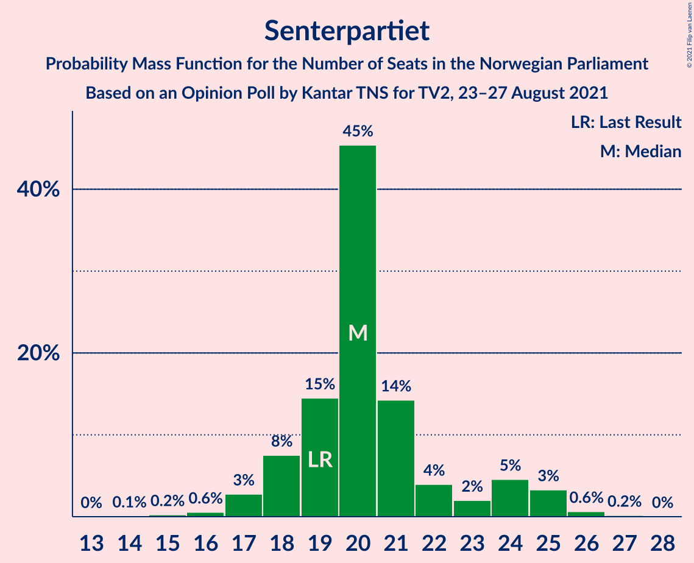
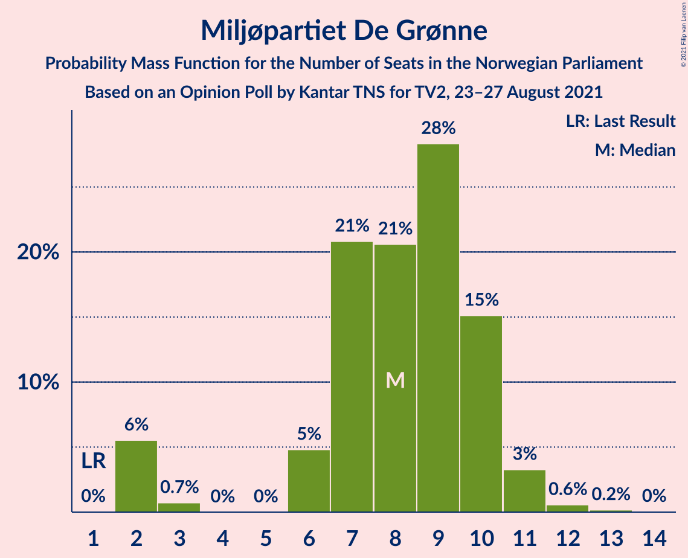

# Opinion Poll by Kantar TNS for TV2, 23–27 August 2021

<a href="#voting-intentions">Voting Intentions</a> | <a href="#seats">Seats</a> | <a href="#coalitions">Coalitions</a> | <a href="#technical-information">Technical Information</a>

## Voting Intentions

### Confidence Intervals

| Party | Last Result | Poll Result | 80% Confidence Interval | 90% Confidence Interval | 95% Confidence Interval | 99% Confidence Interval |
|:-----:|:-----------:|:-----------:|:-----------------------:|:-----------------------:|:-----------------------:|:-----------------------:|
| Arbeiderpartiet | 27.4% | 22.6% | 21.0–24.4% |20.5–24.9% |20.1–25.3% |19.3–26.2% |
| Høyre | 25.0% | 19.2% | 17.6–20.9% |17.2–21.3% |16.8–21.7% |16.1–22.6% |
| Fremskrittspartiet | 15.2% | 11.8% | 10.6–13.3% |10.3–13.7% |10.0–14.0% |9.4–14.7% |
| Senterpartiet | 10.3% | 11.5% | 10.3–12.9% |10.0–13.3% |9.7–13.7% |9.1–14.4% |
| Sosialistisk Venstreparti | 6.0% | 10.2% | 9.1–11.6% |8.8–11.9% |8.5–12.3% |8.0–13.0% |
| Rødt | 2.4% | 7.2% | 6.3–8.4% |6.0–8.7% |5.8–9.0% |5.3–9.6% |
| Miljøpartiet De Grønne | 3.2% | 5.0% | 4.2–6.0% |4.0–6.3% |3.8–6.6% |3.5–7.1% |
| Venstre | 4.4% | 4.4% | 3.7–5.4% |3.5–5.6% |3.3–5.9% |3.0–6.4% |
| Kristelig Folkeparti | 4.2% | 3.8% | 3.1–4.7% |2.9–5.0% |2.8–5.2% |2.5–5.7% |

*Note:* The poll result column reflects the actual value used in the calculations. Published results may vary slightly, and in addition be rounded to fewer digits.

## Seats

### Confidence Intervals

| Party | Last Result | Median | 80% Confidence Interval | 90% Confidence Interval | 95% Confidence Interval | 99% Confidence Interval |
|:-----:|:-----------:|:------:|:-----------------------:|:-----------------------:|:-----------------------:|:-----------------------:|
| <a href="#arbeiderpartiet">Arbeiderpartiet</a> | 49 | 42 | 40–44 |39–45 |38–46 |35–48 |
| <a href="#høyre">Høyre</a> | 45 | 35 | 31–37 |31–38 |30–39 |28–40 |
| <a href="#fremskrittspartiet">Fremskrittspartiet</a> | 27 | 20 | 18–24 |17–25 |17–25 |16–27 |
| <a href="#senterpartiet">Senterpartiet</a> | 19 | 20 | 18–23 |18–24 |17–25 |16–26 |
| <a href="#sosialistisk-venstreparti">Sosialistisk Venstreparti</a> | 11 | 17 | 15–20 |14–21 |13–21 |11–23 |
| <a href="#rødt">Rødt</a> | 1 | 12 | 10–14 |9–15 |9–15 |8–16 |
| <a href="#miljøpartiet-de-grønne">Miljøpartiet De Grønne</a> | 1 | 8 | 6–10 |2–10 |2–11 |2–12 |
| <a href="#venstre">Venstre</a> | 8 | 7 | 2–9 |2–9 |2–10 |2–11 |
| <a href="#kristelig-folkeparti">Kristelig Folkeparti</a> | 8 | 3 | 2–8 |2–8 |1–9 |1–9 |

### Arbeiderpartiet

*For a full overview of the results for this party, see the [Arbeiderpartiet](party-arbeiderpartiet.html) page.*

| Number of Seats | Probability | Accumulated | Special Marks |
|:---------------:|:-----------:|:-----------:|:-------------:|
| 34 | 0.1% | 100% |  |
| 35 | 0.4% | 99.9% |  |
| 36 | 0.3% | 99.5% |  |
| 37 | 0.6% | 99.2% |  |
| 38 | 2% | 98.6% |  |
| 39 | 5% | 96% |  |
| 40 | 13% | 92% |  |
| 41 | 26% | 79% |  |
| 42 | 22% | 52% | Median |
| 43 | 11% | 30% |  |
| 44 | 12% | 19% |  |
| 45 | 3% | 7% |  |
| 46 | 2% | 4% |  |
| 47 | 0.6% | 1.3% |  |
| 48 | 0.5% | 0.7% |  |
| 49 | 0.1% | 0.2% | Last Result |
| 50 | 0.1% | 0.1% |  |
| 51 | 0% | 0% |  |

### Høyre

*For a full overview of the results for this party, see the [Høyre](party-høyre.html) page.*

| Number of Seats | Probability | Accumulated | Special Marks |
|:---------------:|:-----------:|:-----------:|:-------------:|
| 25 | 0.1% | 100% |  |
| 26 | 0.1% | 99.9% |  |
| 27 | 0.2% | 99.8% |  |
| 28 | 0.4% | 99.7% |  |
| 29 | 0.8% | 99.3% |  |
| 30 | 2% | 98% |  |
| 31 | 7% | 96% |  |
| 32 | 9% | 89% |  |
| 33 | 8% | 80% |  |
| 34 | 10% | 72% |  |
| 35 | 28% | 62% | Median |
| 36 | 17% | 34% |  |
| 37 | 10% | 17% |  |
| 38 | 4% | 7% |  |
| 39 | 2% | 3% |  |
| 40 | 1.0% | 1.3% |  |
| 41 | 0.2% | 0.3% |  |
| 42 | 0.1% | 0.1% |  |
| 43 | 0% | 0% |  |
| 44 | 0% | 0% |  |
| 45 | 0% | 0% | Last Result |

### Fremskrittspartiet

*For a full overview of the results for this party, see the [Fremskrittspartiet](party-fremskrittspartiet.html) page.*

| Number of Seats | Probability | Accumulated | Special Marks |
|:---------------:|:-----------:|:-----------:|:-------------:|
| 14 | 0% | 100% |  |
| 15 | 0.2% | 99.9% |  |
| 16 | 2% | 99.8% |  |
| 17 | 3% | 98% |  |
| 18 | 14% | 95% |  |
| 19 | 14% | 81% |  |
| 20 | 19% | 67% | Median |
| 21 | 16% | 48% |  |
| 22 | 15% | 32% |  |
| 23 | 6% | 17% |  |
| 24 | 5% | 11% |  |
| 25 | 5% | 6% |  |
| 26 | 0.6% | 1.1% |  |
| 27 | 0.3% | 0.5% | Last Result |
| 28 | 0.2% | 0.2% |  |
| 29 | 0% | 0% |  |

### Senterpartiet

*For a full overview of the results for this party, see the [Senterpartiet](party-senterpartiet.html) page.*

| Number of Seats | Probability | Accumulated | Special Marks |
|:---------------:|:-----------:|:-----------:|:-------------:|
| 14 | 0.1% | 100% |  |
| 15 | 0.2% | 99.9% |  |
| 16 | 0.6% | 99.7% |  |
| 17 | 3% | 99.1% |  |
| 18 | 8% | 96% |  |
| 19 | 15% | 89% | Last Result |
| 20 | 45% | 74% | Median |
| 21 | 14% | 29% |  |
| 22 | 4% | 15% |  |
| 23 | 2% | 11% |  |
| 24 | 5% | 9% |  |
| 25 | 3% | 4% |  |
| 26 | 0.6% | 0.8% |  |
| 27 | 0.2% | 0.2% |  |
| 28 | 0% | 0% |  |

### Sosialistisk Venstreparti

*For a full overview of the results for this party, see the [Sosialistisk Venstreparti](party-sosialistiskvenstreparti.html) page.*

| Number of Seats | Probability | Accumulated | Special Marks |
|:---------------:|:-----------:|:-----------:|:-------------:|
| 10 | 0.1% | 100% |  |
| 11 | 0.6% | 99.9% | Last Result |
| 12 | 0.7% | 99.4% |  |
| 13 | 2% | 98.6% |  |
| 14 | 5% | 96% |  |
| 15 | 13% | 92% |  |
| 16 | 20% | 79% |  |
| 17 | 18% | 59% | Median |
| 18 | 19% | 41% |  |
| 19 | 11% | 22% |  |
| 20 | 4% | 11% |  |
| 21 | 6% | 7% |  |
| 22 | 0.7% | 2% |  |
| 23 | 0.7% | 0.9% |  |
| 24 | 0.1% | 0.2% |  |
| 25 | 0% | 0% |  |

### Rødt

*For a full overview of the results for this party, see the [Rødt](party-rødt.html) page.*

| Number of Seats | Probability | Accumulated | Special Marks |
|:---------------:|:-----------:|:-----------:|:-------------:|
| 1 | 0% | 100% | Last Result |
| 2 | 0% | 100% |  |
| 3 | 0% | 100% |  |
| 4 | 0% | 100% |  |
| 5 | 0% | 100% |  |
| 6 | 0% | 100% |  |
| 7 | 0.2% | 100% |  |
| 8 | 1.1% | 99.8% |  |
| 9 | 5% | 98.7% |  |
| 10 | 14% | 94% |  |
| 11 | 24% | 79% |  |
| 12 | 20% | 55% | Median |
| 13 | 18% | 35% |  |
| 14 | 8% | 17% |  |
| 15 | 6% | 9% |  |
| 16 | 2% | 2% |  |
| 17 | 0.2% | 0.3% |  |
| 18 | 0% | 0.1% |  |
| 19 | 0% | 0% |  |

### Miljøpartiet De Grønne

*For a full overview of the results for this party, see the [Miljøpartiet De Grønne](party-miljøpartietdegrønne.html) page.*

| Number of Seats | Probability | Accumulated | Special Marks |
|:---------------:|:-----------:|:-----------:|:-------------:|
| 1 | 0% | 100% | Last Result |
| 2 | 6% | 100% |  |
| 3 | 0.7% | 94% |  |
| 4 | 0% | 94% |  |
| 5 | 0% | 94% |  |
| 6 | 5% | 94% |  |
| 7 | 21% | 89% |  |
| 8 | 21% | 68% | Median |
| 9 | 28% | 47% |  |
| 10 | 15% | 19% |  |
| 11 | 3% | 4% |  |
| 12 | 0.6% | 0.8% |  |
| 13 | 0.2% | 0.2% |  |
| 14 | 0% | 0% |  |

### Venstre

*For a full overview of the results for this party, see the [Venstre](party-venstre.html) page.*

| Number of Seats | Probability | Accumulated | Special Marks |
|:---------------:|:-----------:|:-----------:|:-------------:|
| 2 | 28% | 100% |  |
| 3 | 0.2% | 72% |  |
| 4 | 0% | 72% |  |
| 5 | 0% | 72% |  |
| 6 | 6% | 72% |  |
| 7 | 34% | 66% | Median |
| 8 | 17% | 32% | Last Result |
| 9 | 10% | 14% |  |
| 10 | 3% | 4% |  |
| 11 | 0.8% | 0.8% |  |
| 12 | 0.1% | 0.1% |  |
| 13 | 0% | 0% |  |

### Kristelig Folkeparti

*For a full overview of the results for this party, see the [Kristelig Folkeparti](party-kristeligfolkeparti.html) page.*

| Number of Seats | Probability | Accumulated | Special Marks |
|:---------------:|:-----------:|:-----------:|:-------------:|
| 1 | 3% | 100% |  |
| 2 | 13% | 97% |  |
| 3 | 46% | 84% | Median |
| 4 | 0% | 38% |  |
| 5 | 0.1% | 38% |  |
| 6 | 10% | 38% |  |
| 7 | 16% | 28% |  |
| 8 | 9% | 12% | Last Result |
| 9 | 3% | 3% |  |
| 10 | 0.2% | 0.3% |  |
| 11 | 0% | 0.1% |  |
| 12 | 0% | 0% |  |

## Coalitions

### Confidence Intervals

| Coalition | Last Result | Median | Majority? | 80% Confidence Interval | 90% Confidence Interval | 95% Confidence Interval | 99% Confidence Interval |
|:---------:|:-----------:|:------:|:---------:|:-----------------------:|:-----------------------:|:-----------------------:|:-----------------------:|
| Arbeiderpartiet – Senterpartiet – Sosialistisk Venstreparti – Rødt – Miljøpartiet De Grønne | 81 | 99 | 100% | 93–105 | 92–107 | 90–108 | 89–110 |
| Arbeiderpartiet – Senterpartiet – Sosialistisk Venstreparti – Miljøpartiet De Grønne – Kristelig Folkeparti | 88 | 91 | 97% | 87–97 | 86–97 | 84–99 | 82–101 |
| Arbeiderpartiet – Senterpartiet – Sosialistisk Venstreparti – Rødt | 80 | 91 | 95% | 86–97 | 84–97 | 84–99 | 82–101 |
| Arbeiderpartiet – Senterpartiet – Sosialistisk Venstreparti – Miljøpartiet De Grønne | 80 | 87 | 77% | 82–93 | 81–94 | 80–94 | 78–96 |
| Høyre – Fremskrittspartiet – Senterpartiet – Venstre – Kristelig Folkeparti | 107 | 86 | 64% | 82–91 | 80–92 | 79–93 | 77–95 |
| Arbeiderpartiet – Senterpartiet – Sosialistisk Venstreparti | 79 | 79 | 4% | 75–84 | 74–84 | 73–86 | 71–88 |
| Arbeiderpartiet – Sosialistisk Venstreparti – Rødt – Miljøpartiet De Grønne | 62 | 79 | 9% | 73–84 | 72–86 | 71–86 | 69–89 |
| Høyre – Fremskrittspartiet – Miljøpartiet De Grønne – Venstre – Kristelig Folkeparti | 89 | 73 | 0.7% | 69–79 | 68–80 | 66–82 | 64–85 |
| Arbeiderpartiet – Senterpartiet – Miljøpartiet De Grønne – Kristelig Folkeparti | 77 | 75 | 0.3% | 70–79 | 69–80 | 68–81 | 65–84 |
| Høyre – Fremskrittspartiet – Venstre – Kristelig Folkeparti | 88 | 66 | 0% | 61–71 | 59–72 | 59–74 | 56–75 |
| Arbeiderpartiet – Senterpartiet – Kristelig Folkeparti | 76 | 66 | 0% | 62–70 | 61–72 | 61–73 | 58–75 |
| Arbeiderpartiet – Senterpartiet | 68 | 62 | 0% | 59–65 | 58–66 | 57–68 | 55–70 |
| Høyre – Fremskrittspartiet – Venstre | 80 | 61 | 0% | 57–66 | 56–67 | 54–68 | 53–70 |
| Arbeiderpartiet – Sosialistisk Venstreparti | 60 | 59 | 0% | 55–63 | 55–63 | 54–65 | 52–66 |
| Høyre – Fremskrittspartiet | 72 | 55 | 0% | 52–59 | 50–60 | 49–62 | 48–63 |
| Høyre – Venstre – Kristelig Folkeparti | 61 | 45 | 0% | 41–50 | 40–51 | 37–52 | 35–54 |
| Senterpartiet – Venstre – Kristelig Folkeparti | 35 | 30 | 0% | 26–36 | 25–37 | 24–38 | 23–39 |

### Arbeiderpartiet – Senterpartiet – Sosialistisk Venstreparti – Rødt – Miljøpartiet De Grønne

| Number of Seats | Probability | Accumulated | Special Marks |
|:---------------:|:-----------:|:-----------:|:-------------:|
| 81 | 0% | 100% | Last Result |
| 82 | 0% | 100% |  |
| 83 | 0% | 100% |  |
| 84 | 0% | 100% |  |
| 85 | 0% | 100% | Majority |
| 86 | 0% | 100% |  |
| 87 | 0.1% | 99.9% |  |
| 88 | 0.3% | 99.8% |  |
| 89 | 0.5% | 99.5% |  |
| 90 | 2% | 99.0% |  |
| 91 | 2% | 97% |  |
| 92 | 3% | 95% |  |
| 93 | 3% | 92% |  |
| 94 | 5% | 89% |  |
| 95 | 6% | 84% |  |
| 96 | 9% | 78% |  |
| 97 | 4% | 69% |  |
| 98 | 8% | 65% |  |
| 99 | 14% | 57% | Median |
| 100 | 7% | 42% |  |
| 101 | 7% | 35% |  |
| 102 | 6% | 28% |  |
| 103 | 5% | 22% |  |
| 104 | 3% | 17% |  |
| 105 | 5% | 14% |  |
| 106 | 2% | 9% |  |
| 107 | 5% | 7% |  |
| 108 | 1.4% | 3% |  |
| 109 | 0.4% | 1.2% |  |
| 110 | 0.5% | 0.8% |  |
| 111 | 0.1% | 0.3% |  |
| 112 | 0.1% | 0.1% |  |
| 113 | 0.1% | 0.1% |  |
| 114 | 0% | 0% |  |

### Arbeiderpartiet – Senterpartiet – Sosialistisk Venstreparti – Miljøpartiet De Grønne – Kristelig Folkeparti

| Number of Seats | Probability | Accumulated | Special Marks |
|:---------------:|:-----------:|:-----------:|:-------------:|
| 80 | 0.1% | 100% |  |
| 81 | 0.2% | 99.9% |  |
| 82 | 0.3% | 99.6% |  |
| 83 | 0.6% | 99.3% |  |
| 84 | 2% | 98.7% |  |
| 85 | 1.3% | 97% | Majority |
| 86 | 3% | 95% |  |
| 87 | 6% | 92% |  |
| 88 | 11% | 87% | Last Result |
| 89 | 9% | 76% |  |
| 90 | 9% | 67% | Median |
| 91 | 9% | 58% |  |
| 92 | 9% | 48% |  |
| 93 | 7% | 39% |  |
| 94 | 9% | 33% |  |
| 95 | 6% | 24% |  |
| 96 | 8% | 18% |  |
| 97 | 6% | 11% |  |
| 98 | 2% | 5% |  |
| 99 | 1.2% | 3% |  |
| 100 | 0.7% | 2% |  |
| 101 | 0.8% | 1.2% |  |
| 102 | 0.2% | 0.4% |  |
| 103 | 0.1% | 0.2% |  |
| 104 | 0.1% | 0.2% |  |
| 105 | 0% | 0% |  |

### Arbeiderpartiet – Senterpartiet – Sosialistisk Venstreparti – Rødt

| Number of Seats | Probability | Accumulated | Special Marks |
|:---------------:|:-----------:|:-----------:|:-------------:|
| 80 | 0.1% | 100% | Last Result |
| 81 | 0.3% | 99.9% |  |
| 82 | 0.8% | 99.6% |  |
| 83 | 1.2% | 98.7% |  |
| 84 | 3% | 98% |  |
| 85 | 3% | 95% | Majority |
| 86 | 4% | 91% |  |
| 87 | 3% | 87% |  |
| 88 | 5% | 84% |  |
| 89 | 15% | 79% |  |
| 90 | 10% | 64% |  |
| 91 | 14% | 54% | Median |
| 92 | 9% | 41% |  |
| 93 | 9% | 32% |  |
| 94 | 4% | 23% |  |
| 95 | 3% | 20% |  |
| 96 | 5% | 16% |  |
| 97 | 7% | 11% |  |
| 98 | 0.8% | 4% |  |
| 99 | 2% | 3% |  |
| 100 | 0.6% | 1.5% |  |
| 101 | 0.5% | 0.9% |  |
| 102 | 0.1% | 0.3% |  |
| 103 | 0.1% | 0.2% |  |
| 104 | 0.1% | 0.1% |  |
| 105 | 0% | 0% |  |

### Arbeiderpartiet – Senterpartiet – Sosialistisk Venstreparti – Miljøpartiet De Grønne

| Number of Seats | Probability | Accumulated | Special Marks |
|:---------------:|:-----------:|:-----------:|:-------------:|
| 75 | 0% | 100% |  |
| 76 | 0.1% | 99.9% |  |
| 77 | 0.4% | 99.9% |  |
| 78 | 0.3% | 99.5% |  |
| 79 | 0.6% | 99.3% |  |
| 80 | 2% | 98.7% | Last Result |
| 81 | 5% | 97% |  |
| 82 | 3% | 92% |  |
| 83 | 5% | 89% |  |
| 84 | 8% | 84% |  |
| 85 | 10% | 77% | Majority |
| 86 | 16% | 67% |  |
| 87 | 10% | 52% | Median |
| 88 | 10% | 42% |  |
| 89 | 5% | 32% |  |
| 90 | 7% | 27% |  |
| 91 | 4% | 20% |  |
| 92 | 3% | 16% |  |
| 93 | 6% | 13% |  |
| 94 | 5% | 8% |  |
| 95 | 0.6% | 2% |  |
| 96 | 1.0% | 1.5% |  |
| 97 | 0.2% | 0.4% |  |
| 98 | 0.1% | 0.2% |  |
| 99 | 0.1% | 0.1% |  |
| 100 | 0% | 0% |  |

### Høyre – Fremskrittspartiet – Senterpartiet – Venstre – Kristelig Folkeparti

| Number of Seats | Probability | Accumulated | Special Marks |
|:---------------:|:-----------:|:-----------:|:-------------:|
| 75 | 0.1% | 100% |  |
| 76 | 0.3% | 99.8% |  |
| 77 | 0.2% | 99.6% |  |
| 78 | 0.8% | 99.4% |  |
| 79 | 2% | 98.6% |  |
| 80 | 2% | 97% |  |
| 81 | 3% | 95% |  |
| 82 | 8% | 92% |  |
| 83 | 15% | 84% |  |
| 84 | 6% | 69% |  |
| 85 | 13% | 64% | Median, Majority |
| 86 | 9% | 51% |  |
| 87 | 10% | 42% |  |
| 88 | 10% | 32% |  |
| 89 | 6% | 23% |  |
| 90 | 6% | 17% |  |
| 91 | 4% | 10% |  |
| 92 | 3% | 6% |  |
| 93 | 0.8% | 3% |  |
| 94 | 1.5% | 2% |  |
| 95 | 0.5% | 0.8% |  |
| 96 | 0.1% | 0.3% |  |
| 97 | 0.1% | 0.2% |  |
| 98 | 0% | 0.1% |  |
| 99 | 0.1% | 0.1% |  |
| 100 | 0% | 0% |  |
| 101 | 0% | 0% |  |
| 102 | 0% | 0% |  |
| 103 | 0% | 0% |  |
| 104 | 0% | 0% |  |
| 105 | 0% | 0% |  |
| 106 | 0% | 0% |  |
| 107 | 0% | 0% | Last Result |

### Arbeiderpartiet – Senterpartiet – Sosialistisk Venstreparti

| Number of Seats | Probability | Accumulated | Special Marks |
|:---------------:|:-----------:|:-----------:|:-------------:|
| 69 | 0% | 100% |  |
| 70 | 0.1% | 99.9% |  |
| 71 | 0.3% | 99.8% |  |
| 72 | 0.8% | 99.5% |  |
| 73 | 3% | 98.7% |  |
| 74 | 3% | 96% |  |
| 75 | 7% | 93% |  |
| 76 | 9% | 86% |  |
| 77 | 7% | 78% |  |
| 78 | 17% | 71% |  |
| 79 | 12% | 54% | Last Result, Median |
| 80 | 12% | 42% |  |
| 81 | 9% | 30% |  |
| 82 | 3% | 21% |  |
| 83 | 3% | 18% |  |
| 84 | 11% | 15% |  |
| 85 | 2% | 4% | Majority |
| 86 | 1.0% | 3% |  |
| 87 | 0.7% | 1.5% |  |
| 88 | 0.6% | 0.8% |  |
| 89 | 0.1% | 0.2% |  |
| 90 | 0.1% | 0.1% |  |
| 91 | 0% | 0% |  |

### Arbeiderpartiet – Sosialistisk Venstreparti – Rødt – Miljøpartiet De Grønne

| Number of Seats | Probability | Accumulated | Special Marks |
|:---------------:|:-----------:|:-----------:|:-------------:|
| 62 | 0% | 100% | Last Result |
| 63 | 0% | 100% |  |
| 64 | 0% | 100% |  |
| 65 | 0% | 100% |  |
| 66 | 0% | 100% |  |
| 67 | 0% | 100% |  |
| 68 | 0.2% | 99.9% |  |
| 69 | 0.4% | 99.8% |  |
| 70 | 0.7% | 99.4% |  |
| 71 | 1.5% | 98.8% |  |
| 72 | 4% | 97% |  |
| 73 | 3% | 93% |  |
| 74 | 5% | 90% |  |
| 75 | 6% | 85% |  |
| 76 | 8% | 79% |  |
| 77 | 11% | 71% |  |
| 78 | 6% | 60% |  |
| 79 | 14% | 54% | Median |
| 80 | 8% | 41% |  |
| 81 | 7% | 32% |  |
| 82 | 6% | 25% |  |
| 83 | 4% | 19% |  |
| 84 | 6% | 15% |  |
| 85 | 2% | 9% | Majority |
| 86 | 6% | 7% |  |
| 87 | 0.6% | 2% |  |
| 88 | 0.3% | 1.0% |  |
| 89 | 0.5% | 0.7% |  |
| 90 | 0.1% | 0.2% |  |
| 91 | 0.1% | 0.1% |  |
| 92 | 0% | 0% |  |

### Høyre – Fremskrittspartiet – Miljøpartiet De Grønne – Venstre – Kristelig Folkeparti

| Number of Seats | Probability | Accumulated | Special Marks |
|:---------------:|:-----------:|:-----------:|:-------------:|
| 59 | 0.1% | 100% |  |
| 60 | 0% | 99.9% |  |
| 61 | 0% | 99.9% |  |
| 62 | 0.1% | 99.8% |  |
| 63 | 0.2% | 99.7% |  |
| 64 | 0.2% | 99.6% |  |
| 65 | 1.3% | 99.4% |  |
| 66 | 0.6% | 98% |  |
| 67 | 2% | 97% |  |
| 68 | 3% | 96% |  |
| 69 | 3% | 93% |  |
| 70 | 8% | 90% |  |
| 71 | 11% | 82% |  |
| 72 | 12% | 71% |  |
| 73 | 16% | 59% | Median |
| 74 | 6% | 43% |  |
| 75 | 5% | 36% |  |
| 76 | 7% | 32% |  |
| 77 | 7% | 25% |  |
| 78 | 7% | 17% |  |
| 79 | 3% | 10% |  |
| 80 | 2% | 7% |  |
| 81 | 1.4% | 4% |  |
| 82 | 1.0% | 3% |  |
| 83 | 0.8% | 2% |  |
| 84 | 0.1% | 0.8% |  |
| 85 | 0.7% | 0.7% | Majority |
| 86 | 0% | 0% |  |
| 87 | 0% | 0% |  |
| 88 | 0% | 0% |  |
| 89 | 0% | 0% | Last Result |

### Arbeiderpartiet – Senterpartiet – Miljøpartiet De Grønne – Kristelig Folkeparti

| Number of Seats | Probability | Accumulated | Special Marks |
|:---------------:|:-----------:|:-----------:|:-------------:|
| 63 | 0.1% | 100% |  |
| 64 | 0.1% | 99.9% |  |
| 65 | 0.3% | 99.8% |  |
| 66 | 1.1% | 99.5% |  |
| 67 | 0.6% | 98% |  |
| 68 | 1.2% | 98% |  |
| 69 | 3% | 97% |  |
| 70 | 6% | 94% |  |
| 71 | 8% | 88% |  |
| 72 | 7% | 79% |  |
| 73 | 11% | 72% | Median |
| 74 | 9% | 61% |  |
| 75 | 16% | 52% |  |
| 76 | 11% | 37% |  |
| 77 | 5% | 25% | Last Result |
| 78 | 10% | 21% |  |
| 79 | 4% | 11% |  |
| 80 | 3% | 6% |  |
| 81 | 1.4% | 3% |  |
| 82 | 1.0% | 2% |  |
| 83 | 0.4% | 1.0% |  |
| 84 | 0.3% | 0.6% |  |
| 85 | 0.1% | 0.3% | Majority |
| 86 | 0.1% | 0.2% |  |
| 87 | 0.1% | 0.1% |  |
| 88 | 0% | 0% |  |

### Høyre – Fremskrittspartiet – Venstre – Kristelig Folkeparti

| Number of Seats | Probability | Accumulated | Special Marks |
|:---------------:|:-----------:|:-----------:|:-------------:|
| 54 | 0% | 100% |  |
| 55 | 0.2% | 99.9% |  |
| 56 | 0.8% | 99.7% |  |
| 57 | 0.3% | 98.9% |  |
| 58 | 0.6% | 98.6% |  |
| 59 | 3% | 98% |  |
| 60 | 2% | 95% |  |
| 61 | 4% | 93% |  |
| 62 | 12% | 89% |  |
| 63 | 11% | 77% |  |
| 64 | 9% | 66% |  |
| 65 | 6% | 57% | Median |
| 66 | 12% | 51% |  |
| 67 | 8% | 39% |  |
| 68 | 8% | 30% |  |
| 69 | 4% | 22% |  |
| 70 | 8% | 18% |  |
| 71 | 4% | 11% |  |
| 72 | 2% | 7% |  |
| 73 | 1.4% | 4% |  |
| 74 | 2% | 3% |  |
| 75 | 1.0% | 1.4% |  |
| 76 | 0.1% | 0.3% |  |
| 77 | 0.1% | 0.2% |  |
| 78 | 0.1% | 0.1% |  |
| 79 | 0% | 0% |  |
| 80 | 0% | 0% |  |
| 81 | 0% | 0% |  |
| 82 | 0% | 0% |  |
| 83 | 0% | 0% |  |
| 84 | 0% | 0% |  |
| 85 | 0% | 0% | Majority |
| 86 | 0% | 0% |  |
| 87 | 0% | 0% |  |
| 88 | 0% | 0% | Last Result |

### Arbeiderpartiet – Senterpartiet – Kristelig Folkeparti

| Number of Seats | Probability | Accumulated | Special Marks |
|:---------------:|:-----------:|:-----------:|:-------------:|
| 56 | 0% | 100% |  |
| 57 | 0.1% | 99.9% |  |
| 58 | 0.5% | 99.8% |  |
| 59 | 0.3% | 99.3% |  |
| 60 | 1.2% | 99.0% |  |
| 61 | 4% | 98% |  |
| 62 | 5% | 94% |  |
| 63 | 4% | 89% |  |
| 64 | 15% | 85% |  |
| 65 | 6% | 70% | Median |
| 66 | 16% | 64% |  |
| 67 | 13% | 48% |  |
| 68 | 10% | 36% |  |
| 69 | 11% | 25% |  |
| 70 | 4% | 14% |  |
| 71 | 5% | 10% |  |
| 72 | 3% | 5% |  |
| 73 | 1.0% | 3% |  |
| 74 | 0.7% | 2% |  |
| 75 | 0.6% | 0.9% |  |
| 76 | 0.1% | 0.3% | Last Result |
| 77 | 0.1% | 0.2% |  |
| 78 | 0% | 0.1% |  |
| 79 | 0% | 0% |  |

### Arbeiderpartiet – Senterpartiet

| Number of Seats | Probability | Accumulated | Special Marks |
|:---------------:|:-----------:|:-----------:|:-------------:|
| 53 | 0.1% | 100% |  |
| 54 | 0.1% | 99.9% |  |
| 55 | 0.5% | 99.8% |  |
| 56 | 0.7% | 99.3% |  |
| 57 | 2% | 98.6% |  |
| 58 | 4% | 97% |  |
| 59 | 8% | 93% |  |
| 60 | 10% | 85% |  |
| 61 | 21% | 75% |  |
| 62 | 14% | 54% | Median |
| 63 | 14% | 40% |  |
| 64 | 9% | 27% |  |
| 65 | 9% | 17% |  |
| 66 | 5% | 9% |  |
| 67 | 1.4% | 4% |  |
| 68 | 2% | 3% | Last Result |
| 69 | 0.4% | 1.0% |  |
| 70 | 0.5% | 0.7% |  |
| 71 | 0.1% | 0.2% |  |
| 72 | 0% | 0.1% |  |
| 73 | 0% | 0% |  |

### Høyre – Fremskrittspartiet – Venstre

| Number of Seats | Probability | Accumulated | Special Marks |
|:---------------:|:-----------:|:-----------:|:-------------:|
| 49 | 0% | 100% |  |
| 50 | 0% | 99.9% |  |
| 51 | 0.1% | 99.9% |  |
| 52 | 0.3% | 99.8% |  |
| 53 | 1.3% | 99.5% |  |
| 54 | 1.3% | 98% |  |
| 55 | 1.2% | 97% |  |
| 56 | 5% | 96% |  |
| 57 | 5% | 91% |  |
| 58 | 5% | 86% |  |
| 59 | 13% | 81% |  |
| 60 | 10% | 68% |  |
| 61 | 12% | 57% |  |
| 62 | 8% | 45% | Median |
| 63 | 13% | 38% |  |
| 64 | 9% | 25% |  |
| 65 | 6% | 16% |  |
| 66 | 4% | 10% |  |
| 67 | 2% | 7% |  |
| 68 | 3% | 5% |  |
| 69 | 1.2% | 2% |  |
| 70 | 0.3% | 0.7% |  |
| 71 | 0.3% | 0.4% |  |
| 72 | 0% | 0.1% |  |
| 73 | 0% | 0% |  |
| 74 | 0% | 0% |  |
| 75 | 0% | 0% |  |
| 76 | 0% | 0% |  |
| 77 | 0% | 0% |  |
| 78 | 0% | 0% |  |
| 79 | 0% | 0% |  |
| 80 | 0% | 0% | Last Result |

### Arbeiderpartiet – Sosialistisk Venstreparti

| Number of Seats | Probability | Accumulated | Special Marks |
|:---------------:|:-----------:|:-----------:|:-------------:|
| 50 | 0.1% | 100% |  |
| 51 | 0.2% | 99.9% |  |
| 52 | 0.2% | 99.7% |  |
| 53 | 0.8% | 99.5% |  |
| 54 | 3% | 98.7% |  |
| 55 | 7% | 96% |  |
| 56 | 10% | 89% |  |
| 57 | 12% | 79% |  |
| 58 | 15% | 67% |  |
| 59 | 12% | 52% | Median |
| 60 | 16% | 41% | Last Result |
| 61 | 8% | 25% |  |
| 62 | 5% | 17% |  |
| 63 | 8% | 12% |  |
| 64 | 2% | 4% |  |
| 65 | 2% | 3% |  |
| 66 | 0.6% | 1.0% |  |
| 67 | 0.3% | 0.4% |  |
| 68 | 0.1% | 0.1% |  |
| 69 | 0% | 0% |  |

### Høyre – Fremskrittspartiet

| Number of Seats | Probability | Accumulated | Special Marks |
|:---------------:|:-----------:|:-----------:|:-------------:|
| 46 | 0.1% | 100% |  |
| 47 | 0.3% | 99.9% |  |
| 48 | 0.8% | 99.6% |  |
| 49 | 2% | 98.8% |  |
| 50 | 2% | 96% |  |
| 51 | 4% | 94% |  |
| 52 | 9% | 90% |  |
| 53 | 11% | 81% |  |
| 54 | 12% | 70% |  |
| 55 | 12% | 58% | Median |
| 56 | 11% | 46% |  |
| 57 | 15% | 35% |  |
| 58 | 7% | 19% |  |
| 59 | 6% | 13% |  |
| 60 | 2% | 6% |  |
| 61 | 2% | 5% |  |
| 62 | 1.4% | 3% |  |
| 63 | 1.1% | 1.5% |  |
| 64 | 0.3% | 0.4% |  |
| 65 | 0.1% | 0.1% |  |
| 66 | 0% | 0% |  |
| 67 | 0% | 0% |  |
| 68 | 0% | 0% |  |
| 69 | 0% | 0% |  |
| 70 | 0% | 0% |  |
| 71 | 0% | 0% |  |
| 72 | 0% | 0% | Last Result |

### Høyre – Venstre – Kristelig Folkeparti

| Number of Seats | Probability | Accumulated | Special Marks |
|:---------------:|:-----------:|:-----------:|:-------------:|
| 34 | 0.2% | 100% |  |
| 35 | 0.3% | 99.8% |  |
| 36 | 0.6% | 99.5% |  |
| 37 | 2% | 98.9% |  |
| 38 | 0.9% | 97% |  |
| 39 | 1.3% | 96% |  |
| 40 | 4% | 95% |  |
| 41 | 9% | 91% |  |
| 42 | 6% | 81% |  |
| 43 | 7% | 75% |  |
| 44 | 10% | 68% |  |
| 45 | 13% | 58% | Median |
| 46 | 14% | 46% |  |
| 47 | 8% | 31% |  |
| 48 | 7% | 23% |  |
| 49 | 5% | 16% |  |
| 50 | 4% | 11% |  |
| 51 | 3% | 7% |  |
| 52 | 2% | 4% |  |
| 53 | 1.1% | 2% |  |
| 54 | 0.4% | 0.7% |  |
| 55 | 0.3% | 0.3% |  |
| 56 | 0% | 0% |  |
| 57 | 0% | 0% |  |
| 58 | 0% | 0% |  |
| 59 | 0% | 0% |  |
| 60 | 0% | 0% |  |
| 61 | 0% | 0% | Last Result |

### Senterpartiet – Venstre – Kristelig Folkeparti

| Number of Seats | Probability | Accumulated | Special Marks |
|:---------------:|:-----------:|:-----------:|:-------------:|
| 21 | 0.1% | 100% |  |
| 22 | 0.2% | 99.9% |  |
| 23 | 0.8% | 99.7% |  |
| 24 | 2% | 98.9% |  |
| 25 | 5% | 97% |  |
| 26 | 9% | 93% |  |
| 27 | 4% | 83% |  |
| 28 | 4% | 80% |  |
| 29 | 13% | 76% |  |
| 30 | 14% | 62% | Median |
| 31 | 10% | 48% |  |
| 32 | 7% | 38% |  |
| 33 | 7% | 31% |  |
| 34 | 9% | 24% |  |
| 35 | 5% | 15% | Last Result |
| 36 | 4% | 10% |  |
| 37 | 4% | 7% |  |
| 38 | 2% | 3% |  |
| 39 | 0.9% | 1.2% |  |
| 40 | 0.2% | 0.3% |  |
| 41 | 0.1% | 0.2% |  |
| 42 | 0% | 0.1% |  |
| 43 | 0% | 0% |  |

## Technical Information

### Opinion Poll

+ **Polling firm:** Kantar TNS
+ **Commissioner(s):** TV2
+ **Fieldwork period:** 23–27 August 2021

### Calculations

+ **Sample size:** 996
+ **Simulations done:** 1,048,576
+ **Error estimate:** 1.01%

