# Opinion Poll by Norstat for Aftenposten, 23–29 August 2021

<a href="#voting-intentions">Voting Intentions</a> | <a href="#seats">Seats</a> | <a href="#coalitions">Coalitions</a> | <a href="#technical-information">Technical Information</a>

## Voting Intentions

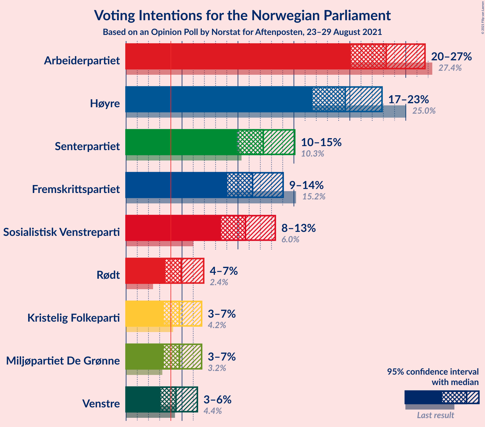

### Confidence Intervals

| Party | Last Result | Poll Result | 80% Confidence Interval | 90% Confidence Interval | 95% Confidence Interval | 99% Confidence Interval |
|:-----:|:-----------:|:-----------:|:-----------------------:|:-----------------------:|:-----------------------:|:-----------------------:|
| Arbeiderpartiet | 27.4% | 23.2% | 21.2–25.5% |20.6–26.2% |20.1–26.7% |19.2–27.8% |
| Høyre | 25.0% | 19.6% | 17.7–21.7% |17.1–22.3% |16.7–22.9% |15.8–23.9% |
| Senterpartiet | 10.3% | 12.3% | 10.7–14.1% |10.3–14.6% |9.9–15.1% |9.2–16.0% |
| Fremskrittspartiet | 15.2% | 11.3% | 9.8–13.1% |9.4–13.6% |9.1–14.0% |8.4–14.9% |
| Sosialistisk Venstreparti | 6.0% | 10.7% | 9.2–12.4% |8.8–12.9% |8.5–13.3% |7.8–14.2% |
| Rødt | 2.4% | 4.9% | 4.0–6.2% |3.7–6.6% |3.5–6.9% |3.1–7.6% |
| Miljøpartiet De Grønne | 3.2% | 4.8% | 3.8–6.1% |3.6–6.4% |3.4–6.8% |3.0–7.4% |
| Kristelig Folkeparti | 4.2% | 4.8% | 3.8–6.1% |3.6–6.4% |3.4–6.8% |3.0–7.4% |
| Venstre | 4.4% | 4.5% | 3.6–5.7% |3.3–6.1% |3.1–6.4% |2.7–7.0% |

*Note:* The poll result column reflects the actual value used in the calculations. Published results may vary slightly, and in addition be rounded to fewer digits.

## Seats

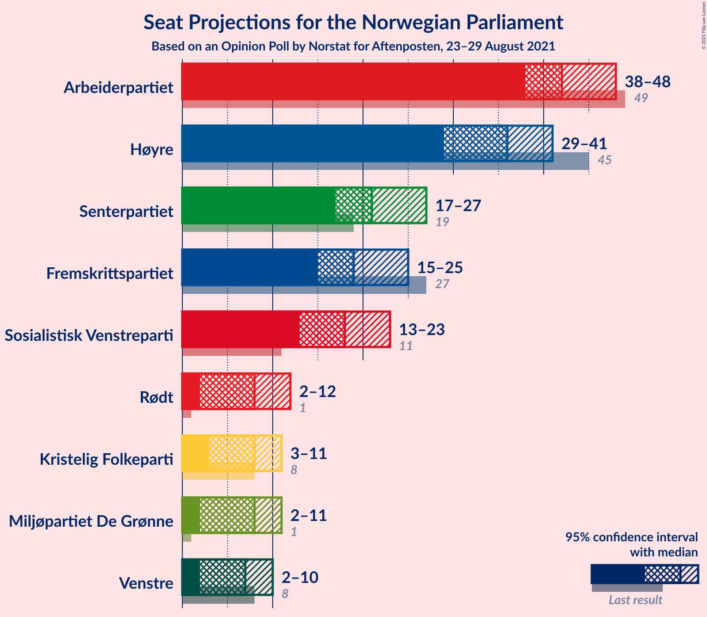

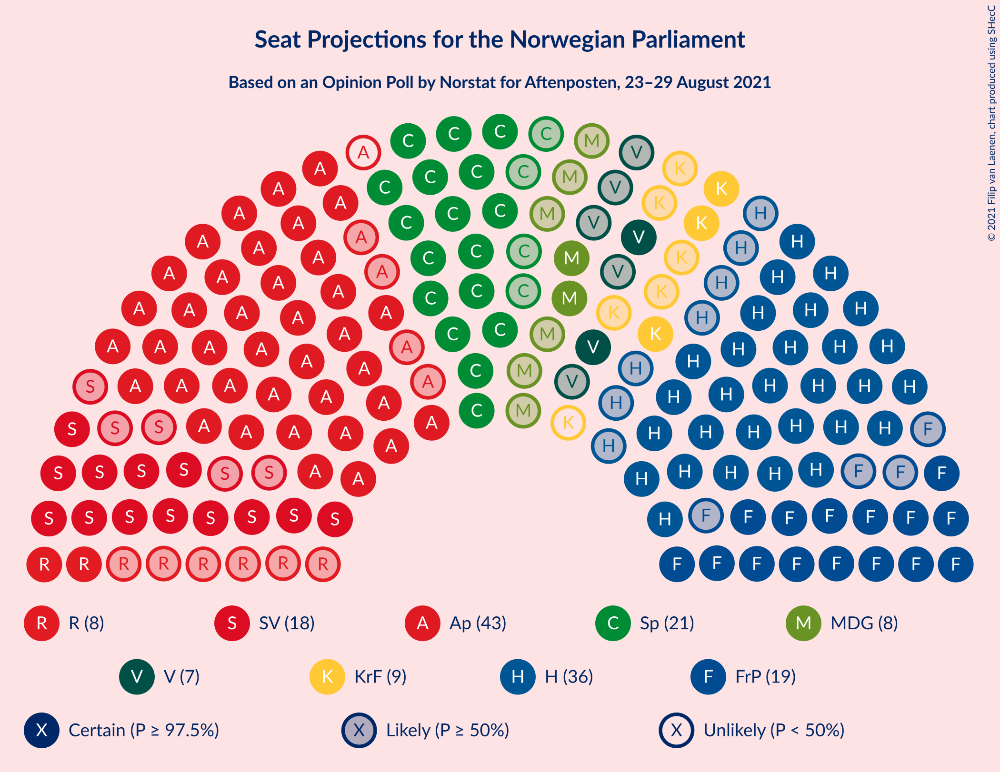

### Confidence Intervals

| Party | Last Result | Median | 80% Confidence Interval | 90% Confidence Interval | 95% Confidence Interval | 99% Confidence Interval |
|:-----:|:-----------:|:------:|:-----------------------:|:-----------------------:|:-----------------------:|:-----------------------:|
| <a href="#arbeiderpartiet">Arbeiderpartiet</a> | 49 | 42 | 40–45 |39–46 |38–48 |36–51 |
| <a href="#høyre">Høyre</a> | 45 | 36 | 31–38 |30–39 |29–41 |28–43 |
| <a href="#senterpartiet">Senterpartiet</a> | 19 | 21 | 18–25 |18–27 |17–27 |16–29 |
| <a href="#fremskrittspartiet">Fremskrittspartiet</a> | 27 | 19 | 16–23 |16–24 |15–25 |14–26 |
| <a href="#sosialistisk-venstreparti">Sosialistisk Venstreparti</a> | 11 | 18 | 15–21 |14–22 |13–23 |11–25 |
| <a href="#rødt">Rødt</a> | 1 | 8 | 2–10 |2–11 |2–12 |2–13 |
| <a href="#miljøpartiet-de-grønne">Miljøpartiet De Grønne</a> | 1 | 8 | 2–10 |2–11 |2–11 |1–12 |
| <a href="#kristelig-folkeparti">Kristelig Folkeparti</a> | 8 | 8 | 3–10 |3–11 |3–11 |1–13 |
| <a href="#venstre">Venstre</a> | 8 | 7 | 2–9 |2–10 |2–10 |2–11 |

### Arbeiderpartiet

*For a full overview of the results for this party, see the [Arbeiderpartiet](party-arbeiderpartiet.html) page.*

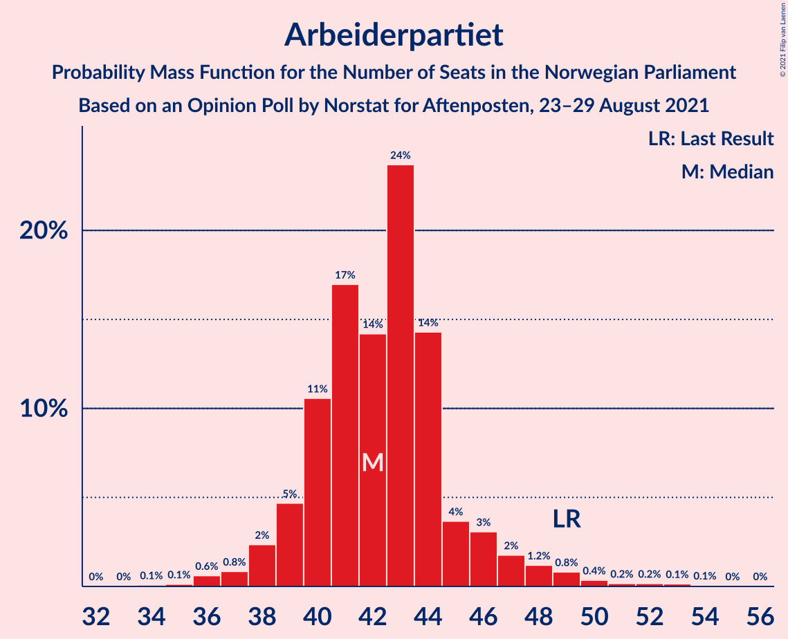

| Number of Seats | Probability | Accumulated | Special Marks |
|:---------------:|:-----------:|:-----------:|:-------------:|
| 33 | 0% | 100% |  |
| 34 | 0.1% | 99.9% |  |
| 35 | 0.1% | 99.9% |  |
| 36 | 0.6% | 99.7% |  |
| 37 | 0.8% | 99.1% |  |
| 38 | 2% | 98% |  |
| 39 | 5% | 96% |  |
| 40 | 11% | 91% |  |
| 41 | 17% | 81% |  |
| 42 | 14% | 64% | Median |
| 43 | 24% | 49% |  |
| 44 | 14% | 26% |  |
| 45 | 4% | 11% |  |
| 46 | 3% | 8% |  |
| 47 | 2% | 5% |  |
| 48 | 1.2% | 3% |  |
| 49 | 0.8% | 2% | Last Result |
| 50 | 0.4% | 1.0% |  |
| 51 | 0.2% | 0.6% |  |
| 52 | 0.2% | 0.4% |  |
| 53 | 0.1% | 0.3% |  |
| 54 | 0.1% | 0.1% |  |
| 55 | 0% | 0.1% |  |
| 56 | 0% | 0% |  |

### Høyre

*For a full overview of the results for this party, see the [Høyre](party-høyre.html) page.*

| Number of Seats | Probability | Accumulated | Special Marks |
|:---------------:|:-----------:|:-----------:|:-------------:|
| 25 | 0.1% | 100% |  |
| 26 | 0.1% | 99.8% |  |
| 27 | 0.2% | 99.7% |  |
| 28 | 2% | 99.5% |  |
| 29 | 2% | 98% |  |
| 30 | 2% | 96% |  |
| 31 | 7% | 93% |  |
| 32 | 5% | 87% |  |
| 33 | 4% | 81% |  |
| 34 | 5% | 77% |  |
| 35 | 20% | 72% |  |
| 36 | 24% | 52% | Median |
| 37 | 9% | 28% |  |
| 38 | 11% | 19% |  |
| 39 | 4% | 8% |  |
| 40 | 1.3% | 4% |  |
| 41 | 1.4% | 3% |  |
| 42 | 0.5% | 1.4% |  |
| 43 | 0.6% | 0.9% |  |
| 44 | 0.1% | 0.3% |  |
| 45 | 0.1% | 0.1% | Last Result |
| 46 | 0% | 0% |  |

### Senterpartiet

*For a full overview of the results for this party, see the [Senterpartiet](party-senterpartiet.html) page.*

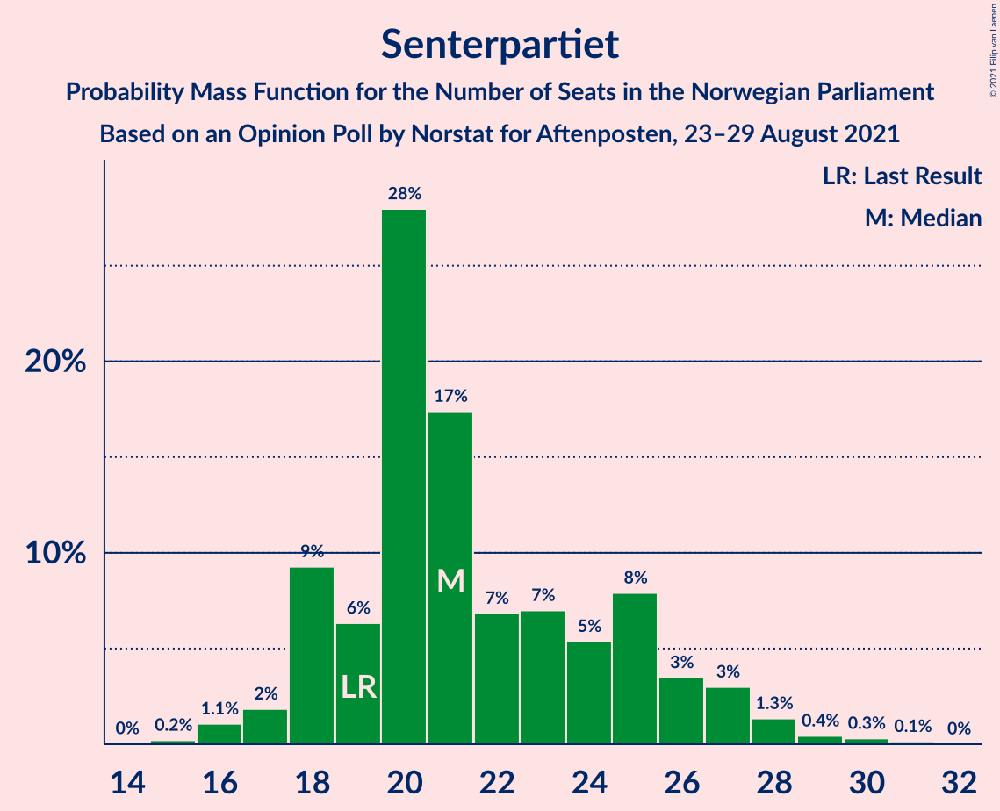

| Number of Seats | Probability | Accumulated | Special Marks |
|:---------------:|:-----------:|:-----------:|:-------------:|
| 15 | 0.2% | 100% |  |
| 16 | 1.1% | 99.7% |  |
| 17 | 2% | 98.7% |  |
| 18 | 9% | 97% |  |
| 19 | 6% | 88% | Last Result |
| 20 | 28% | 81% |  |
| 21 | 17% | 53% | Median |
| 22 | 7% | 36% |  |
| 23 | 7% | 29% |  |
| 24 | 5% | 22% |  |
| 25 | 8% | 17% |  |
| 26 | 3% | 9% |  |
| 27 | 3% | 5% |  |
| 28 | 1.3% | 2% |  |
| 29 | 0.4% | 0.9% |  |
| 30 | 0.3% | 0.5% |  |
| 31 | 0.1% | 0.2% |  |
| 32 | 0% | 0% |  |

### Fremskrittspartiet

*For a full overview of the results for this party, see the [Fremskrittspartiet](party-fremskrittspartiet.html) page.*

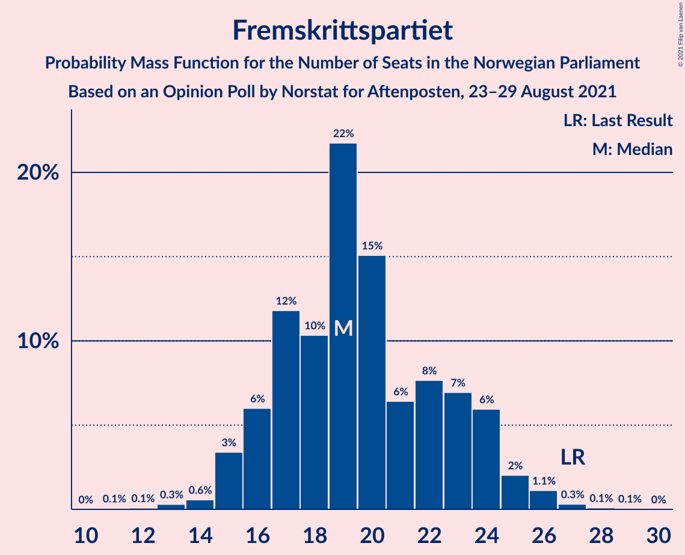

| Number of Seats | Probability | Accumulated | Special Marks |
|:---------------:|:-----------:|:-----------:|:-------------:|
| 11 | 0.1% | 100% |  |
| 12 | 0.1% | 99.9% |  |
| 13 | 0.3% | 99.9% |  |
| 14 | 0.6% | 99.5% |  |
| 15 | 3% | 99.0% |  |
| 16 | 6% | 96% |  |
| 17 | 12% | 90% |  |
| 18 | 10% | 78% |  |
| 19 | 22% | 67% | Median |
| 20 | 15% | 46% |  |
| 21 | 6% | 31% |  |
| 22 | 8% | 24% |  |
| 23 | 7% | 17% |  |
| 24 | 6% | 10% |  |
| 25 | 2% | 4% |  |
| 26 | 1.1% | 2% |  |
| 27 | 0.3% | 0.5% | Last Result |
| 28 | 0.1% | 0.2% |  |
| 29 | 0.1% | 0.1% |  |
| 30 | 0% | 0% |  |

### Sosialistisk Venstreparti

*For a full overview of the results for this party, see the [Sosialistisk Venstreparti](party-sosialistiskvenstreparti.html) page.*

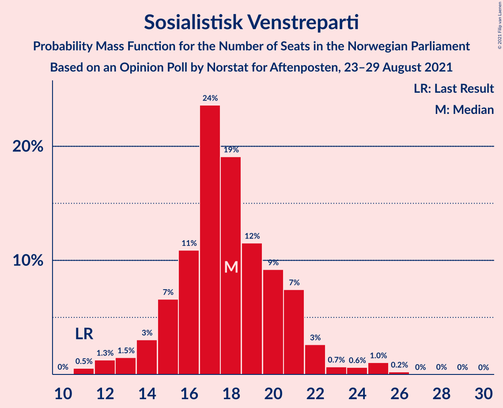

| Number of Seats | Probability | Accumulated | Special Marks |
|:---------------:|:-----------:|:-----------:|:-------------:|
| 10 | 0% | 100% |  |
| 11 | 0.5% | 99.9% | Last Result |
| 12 | 1.3% | 99.4% |  |
| 13 | 1.5% | 98% |  |
| 14 | 3% | 97% |  |
| 15 | 7% | 94% |  |
| 16 | 11% | 87% |  |
| 17 | 24% | 76% |  |
| 18 | 19% | 53% | Median |
| 19 | 12% | 33% |  |
| 20 | 9% | 22% |  |
| 21 | 7% | 13% |  |
| 22 | 3% | 5% |  |
| 23 | 0.7% | 3% |  |
| 24 | 0.6% | 2% |  |
| 25 | 1.0% | 1.3% |  |
| 26 | 0.2% | 0.3% |  |
| 27 | 0% | 0.1% |  |
| 28 | 0% | 0.1% |  |
| 29 | 0% | 0% |  |

### Rødt

*For a full overview of the results for this party, see the [Rødt](party-rødt.html) page.*

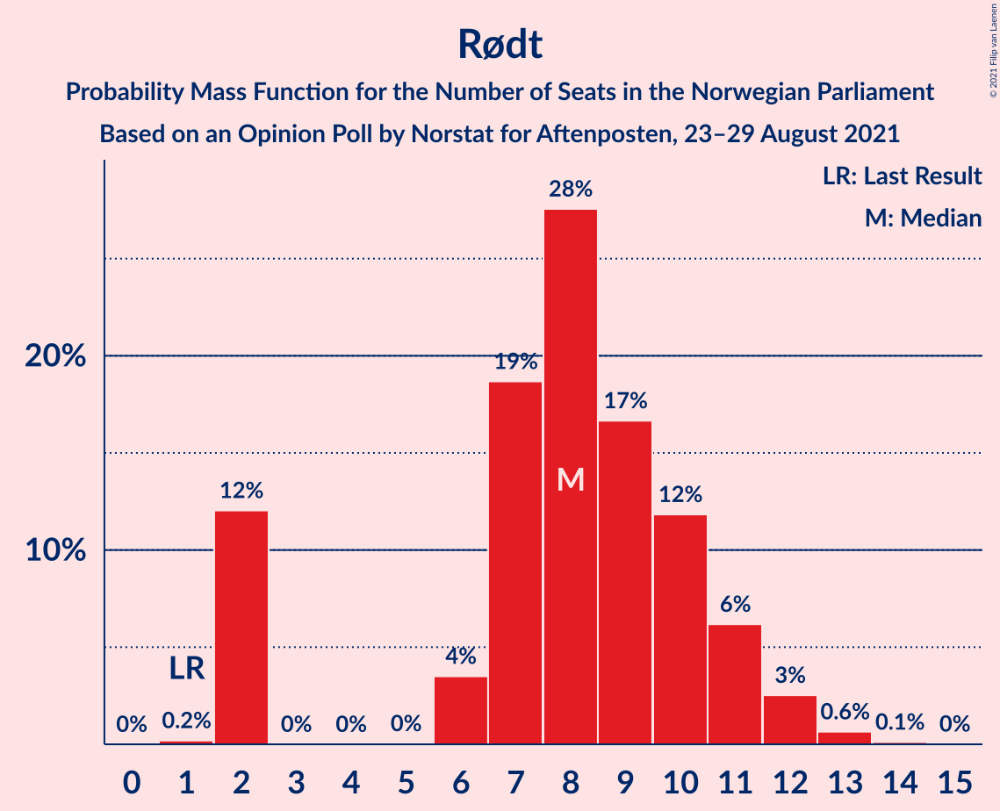

| Number of Seats | Probability | Accumulated | Special Marks |
|:---------------:|:-----------:|:-----------:|:-------------:|
| 1 | 0.2% | 100% | Last Result |
| 2 | 12% | 99.8% |  |
| 3 | 0% | 88% |  |
| 4 | 0% | 88% |  |
| 5 | 0% | 88% |  |
| 6 | 4% | 88% |  |
| 7 | 19% | 84% |  |
| 8 | 28% | 66% | Median |
| 9 | 17% | 38% |  |
| 10 | 12% | 21% |  |
| 11 | 6% | 9% |  |
| 12 | 3% | 3% |  |
| 13 | 0.6% | 0.8% |  |
| 14 | 0.1% | 0.1% |  |
| 15 | 0% | 0% |  |

### Miljøpartiet De Grønne

*For a full overview of the results for this party, see the [Miljøpartiet De Grønne](party-miljøpartietdegrønne.html) page.*

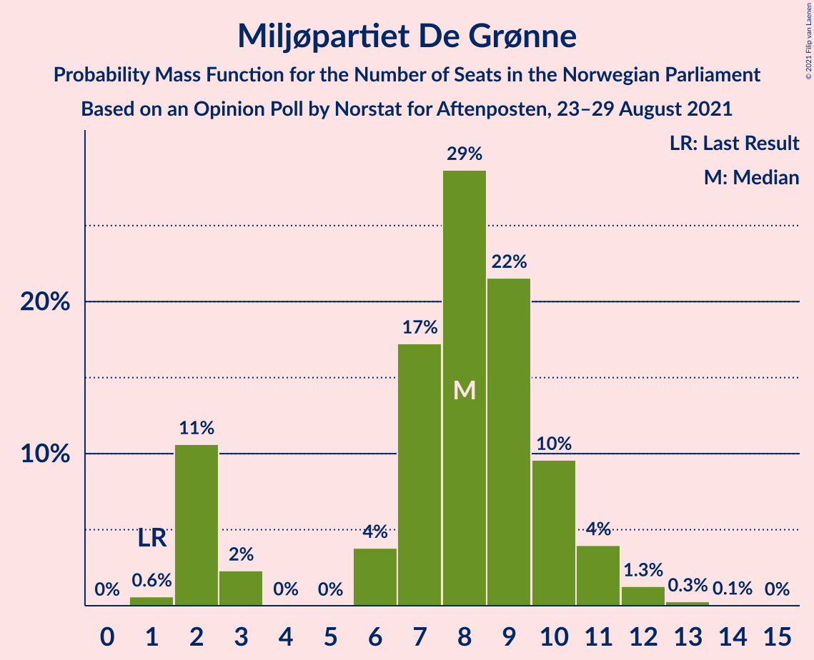

| Number of Seats | Probability | Accumulated | Special Marks |
|:---------------:|:-----------:|:-----------:|:-------------:|
| 1 | 0.6% | 100% | Last Result |
| 2 | 11% | 99.4% |  |
| 3 | 2% | 89% |  |
| 4 | 0% | 86% |  |
| 5 | 0% | 86% |  |
| 6 | 4% | 86% |  |
| 7 | 17% | 83% |  |
| 8 | 29% | 65% | Median |
| 9 | 22% | 37% |  |
| 10 | 10% | 15% |  |
| 11 | 4% | 6% |  |
| 12 | 1.3% | 2% |  |
| 13 | 0.3% | 0.4% |  |
| 14 | 0.1% | 0.1% |  |
| 15 | 0% | 0% |  |

### Kristelig Folkeparti

*For a full overview of the results for this party, see the [Kristelig Folkeparti](party-kristeligfolkeparti.html) page.*

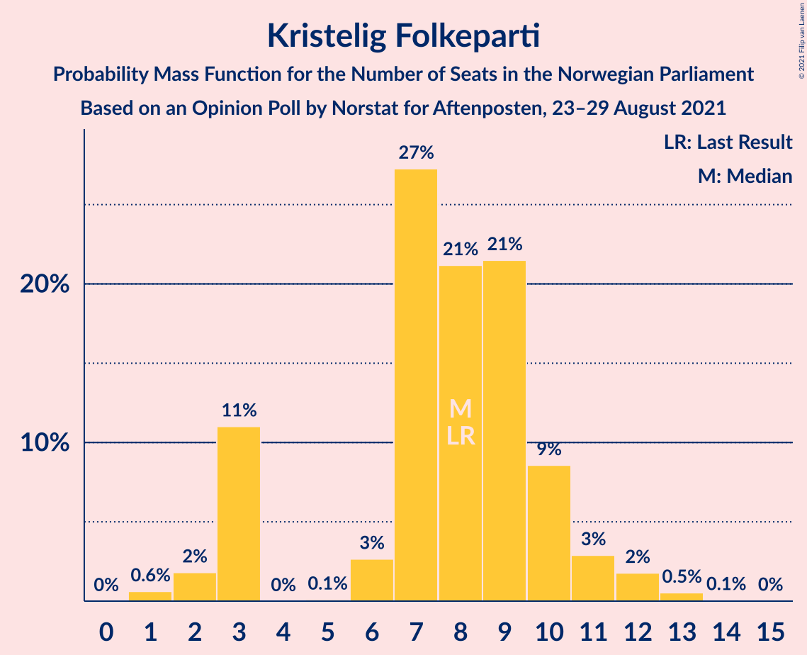

| Number of Seats | Probability | Accumulated | Special Marks |
|:---------------:|:-----------:|:-----------:|:-------------:|
| 1 | 0.6% | 100% |  |
| 2 | 2% | 99.4% |  |
| 3 | 11% | 98% |  |
| 4 | 0% | 87% |  |
| 5 | 0.1% | 87% |  |
| 6 | 3% | 86% |  |
| 7 | 27% | 84% |  |
| 8 | 21% | 57% | Last Result, Median |
| 9 | 21% | 35% |  |
| 10 | 9% | 14% |  |
| 11 | 3% | 5% |  |
| 12 | 2% | 2% |  |
| 13 | 0.5% | 0.6% |  |
| 14 | 0.1% | 0.1% |  |
| 15 | 0% | 0% |  |

### Venstre

*For a full overview of the results for this party, see the [Venstre](party-venstre.html) page.*

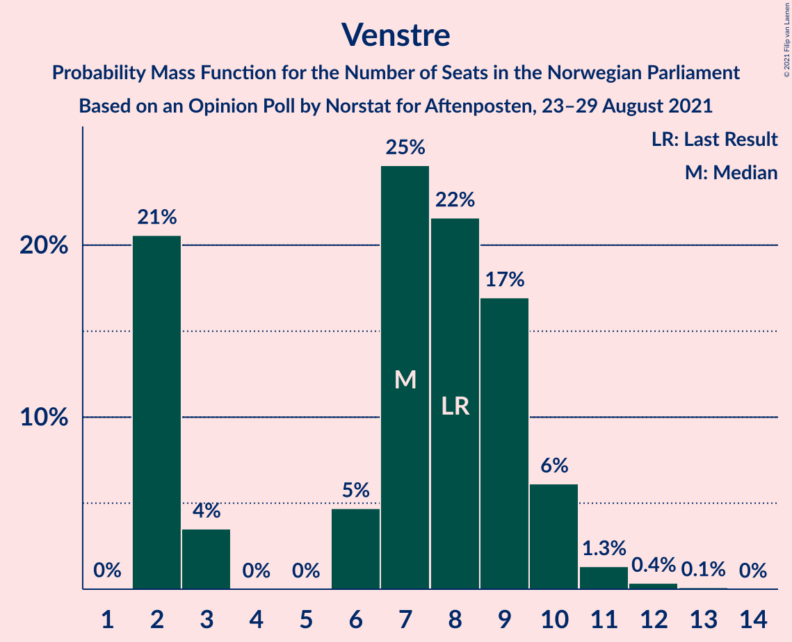

| Number of Seats | Probability | Accumulated | Special Marks |
|:---------------:|:-----------:|:-----------:|:-------------:|
| 2 | 21% | 100% |  |
| 3 | 4% | 79% |  |
| 4 | 0% | 76% |  |
| 5 | 0% | 76% |  |
| 6 | 5% | 76% |  |
| 7 | 25% | 71% | Median |
| 8 | 22% | 46% | Last Result |
| 9 | 17% | 25% |  |
| 10 | 6% | 8% |  |
| 11 | 1.3% | 2% |  |
| 12 | 0.4% | 0.5% |  |
| 13 | 0.1% | 0.1% |  |
| 14 | 0% | 0% |  |

## Coalitions

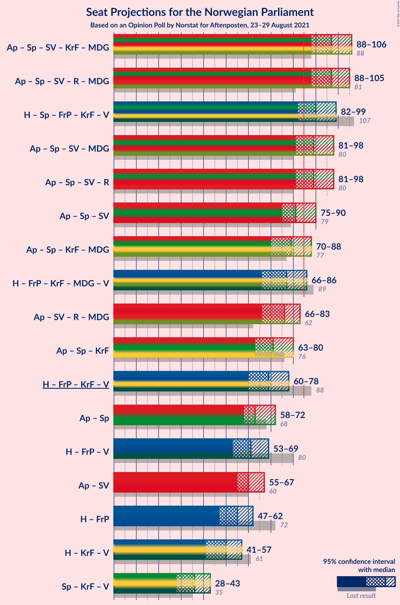

### Confidence Intervals

| Coalition | Last Result | Median | Majority? | 80% Confidence Interval | 90% Confidence Interval | 95% Confidence Interval | 99% Confidence Interval |
|:---------:|:-----------:|:------:|:---------:|:-----------------------:|:-----------------------:|:-----------------------:|:-----------------------:|
| Arbeiderpartiet – Senterpartiet – Sosialistisk Venstreparti – Kristelig Folkeparti – Miljøpartiet De Grønne | 88 | 97 | 99.5% | 90–102 | 89–104 | 88–106 | 85–109 |
| Arbeiderpartiet – Senterpartiet – Sosialistisk Venstreparti – Rødt – Miljøpartiet De Grønne | 81 | 97 | 99.7% | 91–103 | 89–105 | 88–105 | 86–109 |
| Høyre – Senterpartiet – Fremskrittspartiet – Kristelig Folkeparti – Venstre | 107 | 90 | 92% | 85–96 | 83–98 | 82–99 | 78–103 |
| Arbeiderpartiet – Senterpartiet – Sosialistisk Venstreparti – Miljøpartiet De Grønne | 80 | 89 | 86% | 83–95 | 82–96 | 81–98 | 78–101 |
| Arbeiderpartiet – Senterpartiet – Sosialistisk Venstreparti – Rødt | 80 | 89 | 87% | 83–95 | 82–97 | 81–98 | 78–103 |
| Arbeiderpartiet – Senterpartiet – Sosialistisk Venstreparti | 79 | 81 | 18% | 77–87 | 76–89 | 75–90 | 72–93 |
| Arbeiderpartiet – Senterpartiet – Kristelig Folkeparti – Miljøpartiet De Grønne | 77 | 79 | 9% | 74–84 | 72–86 | 70–88 | 67–91 |
| Høyre – Fremskrittspartiet – Kristelig Folkeparti – Miljøpartiet De Grønne – Venstre | 89 | 77 | 5% | 71–82 | 68–84 | 66–86 | 64–87 |
| Arbeiderpartiet – Sosialistisk Venstreparti – Rødt – Miljøpartiet De Grønne | 62 | 76 | 1.2% | 70–81 | 68–83 | 66–83 | 64–86 |
| Arbeiderpartiet – Senterpartiet – Kristelig Folkeparti | 76 | 71 | 0.1% | 67–77 | 65–78 | 63–80 | 62–82 |
| Høyre – Fremskrittspartiet – Kristelig Folkeparti – Venstre | 88 | 69 | 0% | 64–74 | 61–77 | 60–78 | 56–80 |
| Arbeiderpartiet – Senterpartiet | 68 | 63 | 0% | 60–68 | 59–70 | 58–72 | 56–75 |
| Høyre – Fremskrittspartiet – Venstre | 80 | 61 | 0% | 56–67 | 55–69 | 53–69 | 49–71 |
| Arbeiderpartiet – Sosialistisk Venstreparti | 60 | 60 | 0% | 57–64 | 55–65 | 55–67 | 52–70 |
| Høyre – Fremskrittspartiet | 72 | 55 | 0% | 51–59 | 48–61 | 47–62 | 45–64 |
| Høyre – Kristelig Folkeparti – Venstre | 61 | 50 | 0% | 45–54 | 43–55 | 41–57 | 36–59 |
| Senterpartiet – Kristelig Folkeparti – Venstre | 35 | 36 | 0% | 30–41 | 29–42 | 28–43 | 25–46 |

### Arbeiderpartiet – Senterpartiet – Sosialistisk Venstreparti – Kristelig Folkeparti – Miljøpartiet De Grønne

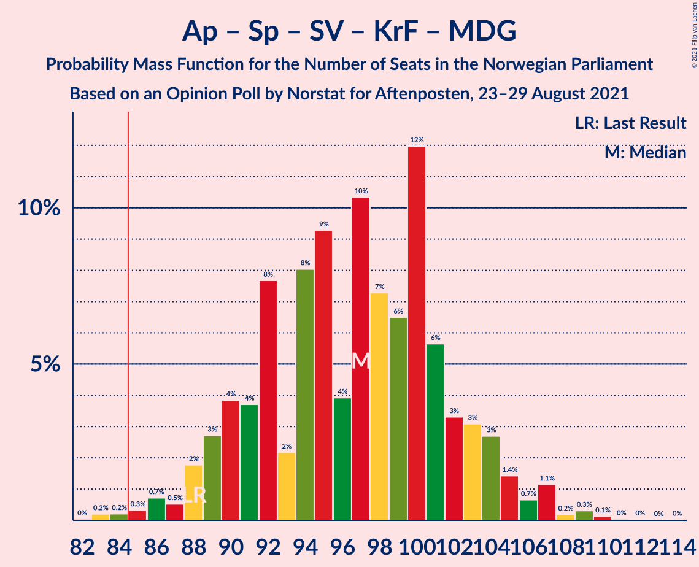

| Number of Seats | Probability | Accumulated | Special Marks |
|:---------------:|:-----------:|:-----------:|:-------------:|
| 82 | 0% | 100% |  |
| 83 | 0.2% | 99.9% |  |
| 84 | 0.2% | 99.7% |  |
| 85 | 0.3% | 99.5% | Majority |
| 86 | 0.7% | 99.2% |  |
| 87 | 0.5% | 98% |  |
| 88 | 2% | 98% | Last Result |
| 89 | 3% | 96% |  |
| 90 | 4% | 93% |  |
| 91 | 4% | 90% |  |
| 92 | 8% | 86% |  |
| 93 | 2% | 78% |  |
| 94 | 8% | 76% |  |
| 95 | 9% | 68% |  |
| 96 | 4% | 59% |  |
| 97 | 10% | 55% | Median |
| 98 | 7% | 44% |  |
| 99 | 6% | 37% |  |
| 100 | 12% | 31% |  |
| 101 | 6% | 19% |  |
| 102 | 3% | 13% |  |
| 103 | 3% | 10% |  |
| 104 | 3% | 7% |  |
| 105 | 1.4% | 4% |  |
| 106 | 0.7% | 3% |  |
| 107 | 1.1% | 2% |  |
| 108 | 0.2% | 0.7% |  |
| 109 | 0.3% | 0.6% |  |
| 110 | 0.1% | 0.2% |  |
| 111 | 0% | 0.1% |  |
| 112 | 0% | 0.1% |  |
| 113 | 0% | 0% |  |

### Arbeiderpartiet – Senterpartiet – Sosialistisk Venstreparti – Rødt – Miljøpartiet De Grønne

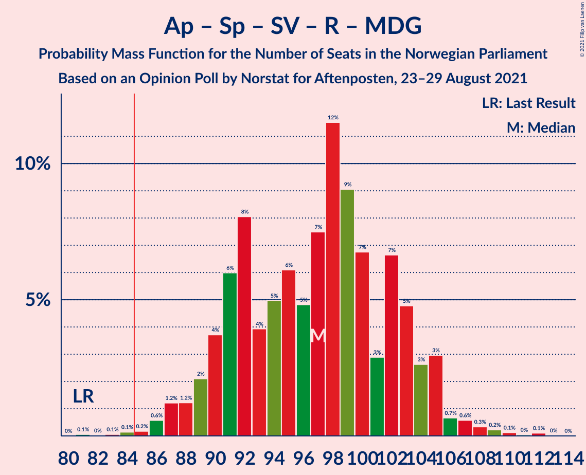

| Number of Seats | Probability | Accumulated | Special Marks |
|:---------------:|:-----------:|:-----------:|:-------------:|
| 81 | 0.1% | 100% | Last Result |
| 82 | 0% | 99.9% |  |
| 83 | 0.1% | 99.9% |  |
| 84 | 0.1% | 99.8% |  |
| 85 | 0.2% | 99.7% | Majority |
| 86 | 0.6% | 99.5% |  |
| 87 | 1.2% | 99.0% |  |
| 88 | 1.2% | 98% |  |
| 89 | 2% | 97% |  |
| 90 | 4% | 94% |  |
| 91 | 6% | 91% |  |
| 92 | 8% | 85% |  |
| 93 | 4% | 77% |  |
| 94 | 5% | 73% |  |
| 95 | 6% | 68% |  |
| 96 | 5% | 62% |  |
| 97 | 7% | 57% | Median |
| 98 | 12% | 49% |  |
| 99 | 9% | 38% |  |
| 100 | 7% | 29% |  |
| 101 | 3% | 22% |  |
| 102 | 7% | 19% |  |
| 103 | 5% | 12% |  |
| 104 | 3% | 8% |  |
| 105 | 3% | 5% |  |
| 106 | 0.7% | 2% |  |
| 107 | 0.6% | 1.5% |  |
| 108 | 0.3% | 0.9% |  |
| 109 | 0.2% | 0.5% |  |
| 110 | 0.1% | 0.3% |  |
| 111 | 0% | 0.2% |  |
| 112 | 0.1% | 0.2% |  |
| 113 | 0% | 0% |  |

### Høyre – Senterpartiet – Fremskrittspartiet – Kristelig Folkeparti – Venstre

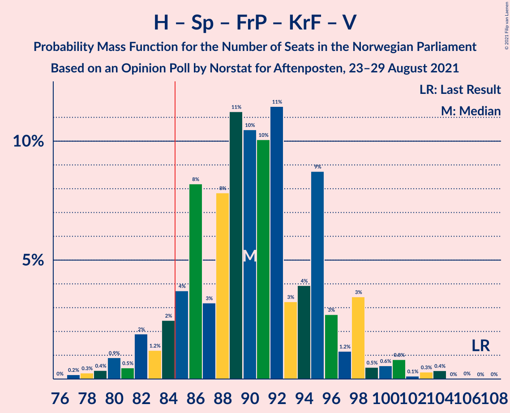

| Number of Seats | Probability | Accumulated | Special Marks |
|:---------------:|:-----------:|:-----------:|:-------------:|
| 76 | 0% | 100% |  |
| 77 | 0.2% | 99.9% |  |
| 78 | 0.3% | 99.7% |  |
| 79 | 0.4% | 99.5% |  |
| 80 | 0.9% | 99.1% |  |
| 81 | 0.5% | 98% |  |
| 82 | 2% | 98% |  |
| 83 | 1.2% | 96% |  |
| 84 | 2% | 95% |  |
| 85 | 4% | 92% | Majority |
| 86 | 8% | 88% |  |
| 87 | 3% | 80% |  |
| 88 | 8% | 77% |  |
| 89 | 11% | 69% |  |
| 90 | 10% | 58% |  |
| 91 | 10% | 48% | Median |
| 92 | 11% | 37% |  |
| 93 | 3% | 26% |  |
| 94 | 4% | 23% |  |
| 95 | 9% | 19% |  |
| 96 | 3% | 10% |  |
| 97 | 1.2% | 7% |  |
| 98 | 3% | 6% |  |
| 99 | 0.5% | 3% |  |
| 100 | 0.6% | 2% |  |
| 101 | 0.8% | 2% |  |
| 102 | 0.1% | 0.8% |  |
| 103 | 0.3% | 0.7% |  |
| 104 | 0.4% | 0.4% |  |
| 105 | 0% | 0.1% |  |
| 106 | 0% | 0.1% |  |
| 107 | 0% | 0% | Last Result |

### Arbeiderpartiet – Senterpartiet – Sosialistisk Venstreparti – Miljøpartiet De Grønne

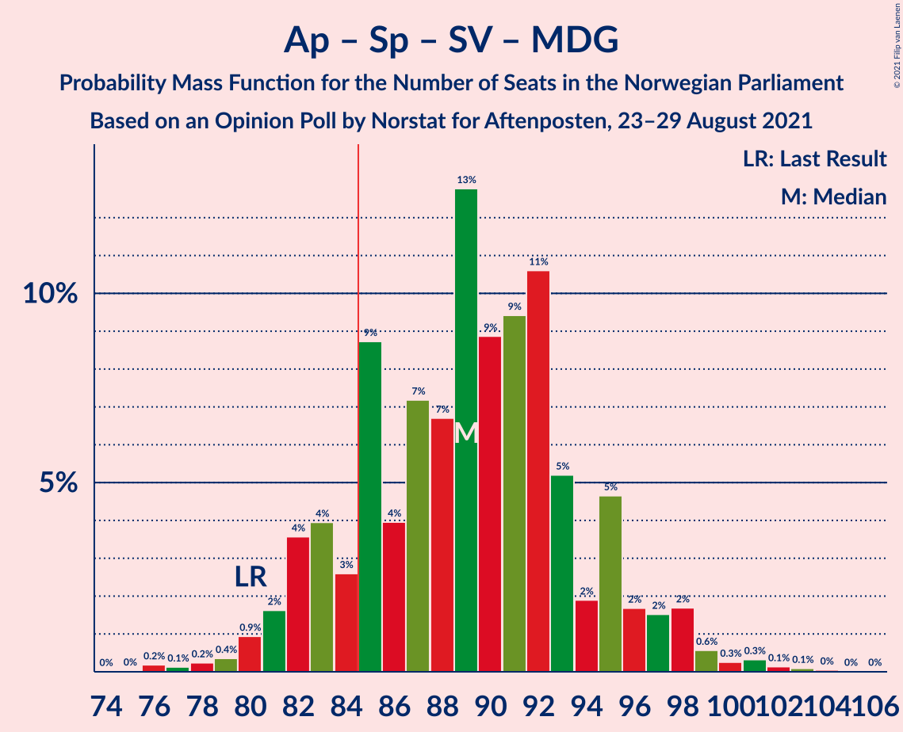

| Number of Seats | Probability | Accumulated | Special Marks |
|:---------------:|:-----------:|:-----------:|:-------------:|
| 76 | 0.2% | 100% |  |
| 77 | 0.1% | 99.8% |  |
| 78 | 0.2% | 99.6% |  |
| 79 | 0.4% | 99.4% |  |
| 80 | 0.9% | 99.1% | Last Result |
| 81 | 2% | 98% |  |
| 82 | 4% | 96% |  |
| 83 | 4% | 93% |  |
| 84 | 3% | 89% |  |
| 85 | 9% | 86% | Majority |
| 86 | 4% | 78% |  |
| 87 | 7% | 74% |  |
| 88 | 7% | 66% |  |
| 89 | 13% | 60% | Median |
| 90 | 9% | 47% |  |
| 91 | 9% | 38% |  |
| 92 | 11% | 29% |  |
| 93 | 5% | 18% |  |
| 94 | 2% | 13% |  |
| 95 | 5% | 11% |  |
| 96 | 2% | 6% |  |
| 97 | 2% | 5% |  |
| 98 | 2% | 3% |  |
| 99 | 0.6% | 1.5% |  |
| 100 | 0.3% | 0.9% |  |
| 101 | 0.3% | 0.6% |  |
| 102 | 0.1% | 0.3% |  |
| 103 | 0.1% | 0.2% |  |
| 104 | 0% | 0.1% |  |
| 105 | 0% | 0% |  |

### Arbeiderpartiet – Senterpartiet – Sosialistisk Venstreparti – Rødt

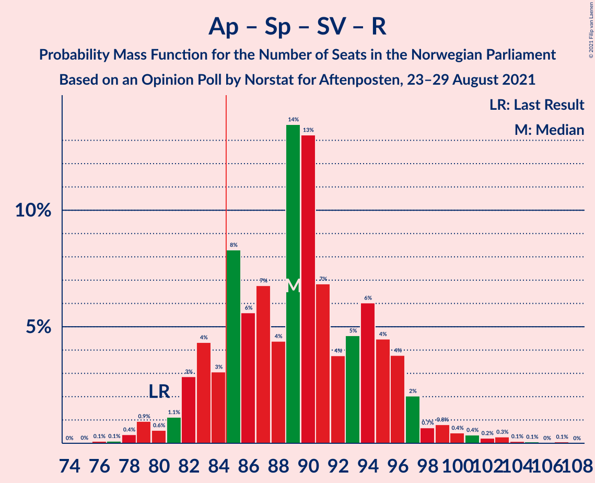

| Number of Seats | Probability | Accumulated | Special Marks |
|:---------------:|:-----------:|:-----------:|:-------------:|
| 76 | 0.1% | 100% |  |
| 77 | 0.1% | 99.9% |  |
| 78 | 0.4% | 99.8% |  |
| 79 | 0.9% | 99.4% |  |
| 80 | 0.6% | 98% | Last Result |
| 81 | 1.1% | 98% |  |
| 82 | 3% | 97% |  |
| 83 | 4% | 94% |  |
| 84 | 3% | 90% |  |
| 85 | 8% | 87% | Majority |
| 86 | 6% | 78% |  |
| 87 | 7% | 73% |  |
| 88 | 4% | 66% |  |
| 89 | 14% | 61% | Median |
| 90 | 13% | 48% |  |
| 91 | 7% | 35% |  |
| 92 | 4% | 28% |  |
| 93 | 5% | 24% |  |
| 94 | 6% | 19% |  |
| 95 | 4% | 13% |  |
| 96 | 4% | 9% |  |
| 97 | 2% | 5% |  |
| 98 | 0.7% | 3% |  |
| 99 | 0.8% | 2% |  |
| 100 | 0.4% | 2% |  |
| 101 | 0.4% | 1.1% |  |
| 102 | 0.2% | 0.7% |  |
| 103 | 0.3% | 0.5% |  |
| 104 | 0.1% | 0.2% |  |
| 105 | 0.1% | 0.1% |  |
| 106 | 0% | 0.1% |  |
| 107 | 0.1% | 0.1% |  |
| 108 | 0% | 0% |  |

### Arbeiderpartiet – Senterpartiet – Sosialistisk Venstreparti

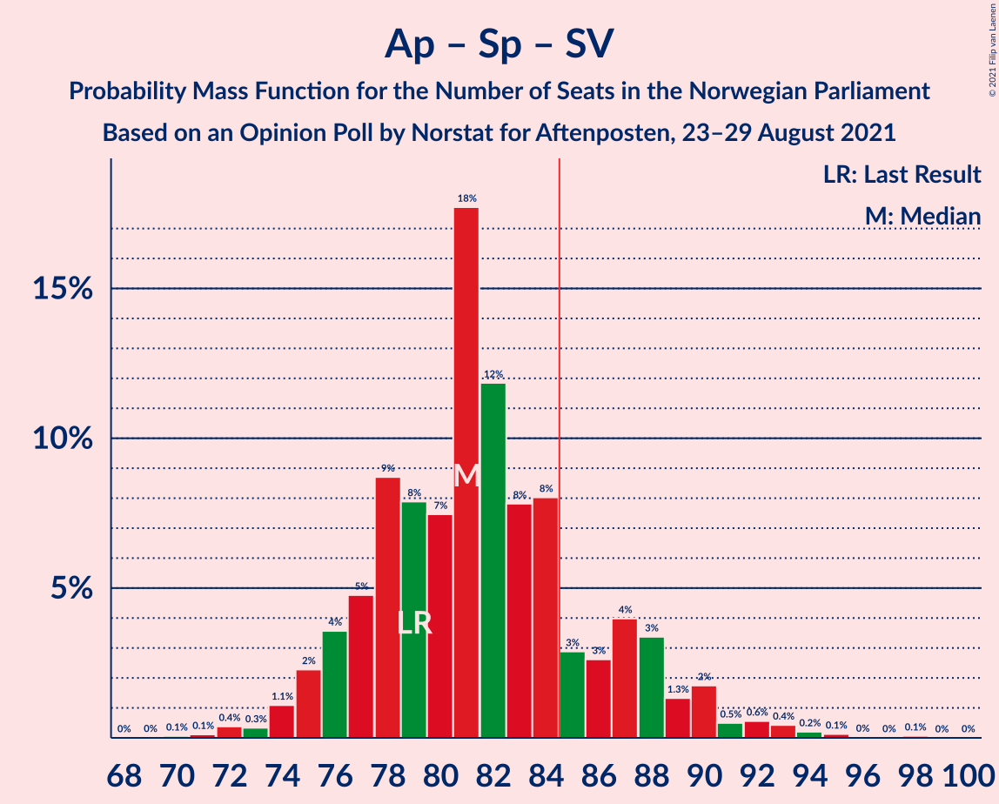

| Number of Seats | Probability | Accumulated | Special Marks |
|:---------------:|:-----------:|:-----------:|:-------------:|
| 70 | 0.1% | 100% |  |
| 71 | 0.1% | 99.9% |  |
| 72 | 0.4% | 99.8% |  |
| 73 | 0.3% | 99.4% |  |
| 74 | 1.1% | 99.1% |  |
| 75 | 2% | 98% |  |
| 76 | 4% | 96% |  |
| 77 | 5% | 92% |  |
| 78 | 9% | 87% |  |
| 79 | 8% | 79% | Last Result |
| 80 | 7% | 71% |  |
| 81 | 18% | 63% | Median |
| 82 | 12% | 46% |  |
| 83 | 8% | 34% |  |
| 84 | 8% | 26% |  |
| 85 | 3% | 18% | Majority |
| 86 | 3% | 15% |  |
| 87 | 4% | 12% |  |
| 88 | 3% | 8% |  |
| 89 | 1.3% | 5% |  |
| 90 | 2% | 4% |  |
| 91 | 0.5% | 2% |  |
| 92 | 0.6% | 1.4% |  |
| 93 | 0.4% | 0.9% |  |
| 94 | 0.2% | 0.5% |  |
| 95 | 0.1% | 0.2% |  |
| 96 | 0% | 0.1% |  |
| 97 | 0% | 0.1% |  |
| 98 | 0.1% | 0.1% |  |
| 99 | 0% | 0% |  |

### Arbeiderpartiet – Senterpartiet – Kristelig Folkeparti – Miljøpartiet De Grønne

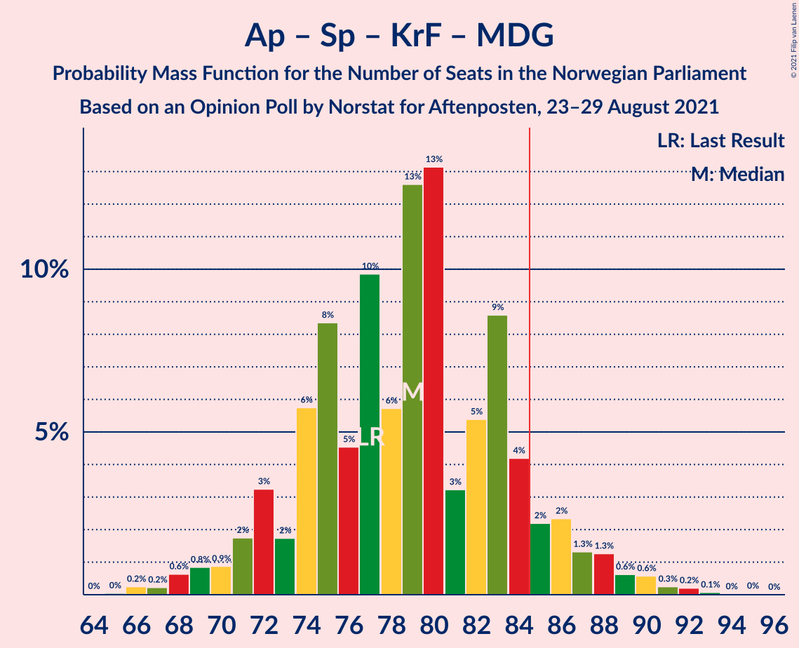

| Number of Seats | Probability | Accumulated | Special Marks |
|:---------------:|:-----------:|:-----------:|:-------------:|
| 64 | 0% | 100% |  |
| 65 | 0% | 99.9% |  |
| 66 | 0.2% | 99.9% |  |
| 67 | 0.2% | 99.6% |  |
| 68 | 0.6% | 99.4% |  |
| 69 | 0.8% | 98.8% |  |
| 70 | 0.9% | 98% |  |
| 71 | 2% | 97% |  |
| 72 | 3% | 95% |  |
| 73 | 2% | 92% |  |
| 74 | 6% | 90% |  |
| 75 | 8% | 85% |  |
| 76 | 5% | 76% |  |
| 77 | 10% | 72% | Last Result |
| 78 | 6% | 62% |  |
| 79 | 13% | 56% | Median |
| 80 | 13% | 43% |  |
| 81 | 3% | 30% |  |
| 82 | 5% | 27% |  |
| 83 | 9% | 22% |  |
| 84 | 4% | 13% |  |
| 85 | 2% | 9% | Majority |
| 86 | 2% | 7% |  |
| 87 | 1.3% | 4% |  |
| 88 | 1.3% | 3% |  |
| 89 | 0.6% | 2% |  |
| 90 | 0.6% | 1.2% |  |
| 91 | 0.3% | 0.6% |  |
| 92 | 0.2% | 0.3% |  |
| 93 | 0.1% | 0.1% |  |
| 94 | 0% | 0.1% |  |
| 95 | 0% | 0% |  |

### Høyre – Fremskrittspartiet – Kristelig Folkeparti – Miljøpartiet De Grønne – Venstre

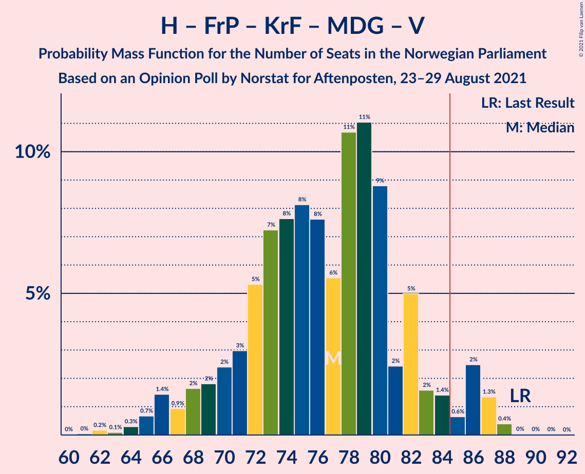

| Number of Seats | Probability | Accumulated | Special Marks |
|:---------------:|:-----------:|:-----------:|:-------------:|
| 61 | 0% | 100% |  |
| 62 | 0.2% | 99.9% |  |
| 63 | 0.1% | 99.7% |  |
| 64 | 0.3% | 99.6% |  |
| 65 | 0.7% | 99.3% |  |
| 66 | 1.4% | 98.7% |  |
| 67 | 0.9% | 97% |  |
| 68 | 2% | 96% |  |
| 69 | 2% | 95% |  |
| 70 | 2% | 93% |  |
| 71 | 3% | 90% |  |
| 72 | 5% | 87% |  |
| 73 | 7% | 82% |  |
| 74 | 8% | 75% |  |
| 75 | 8% | 67% |  |
| 76 | 8% | 59% |  |
| 77 | 6% | 51% |  |
| 78 | 11% | 46% | Median |
| 79 | 11% | 35% |  |
| 80 | 9% | 24% |  |
| 81 | 2% | 15% |  |
| 82 | 5% | 13% |  |
| 83 | 2% | 8% |  |
| 84 | 1.4% | 6% |  |
| 85 | 0.6% | 5% | Majority |
| 86 | 2% | 4% |  |
| 87 | 1.3% | 2% |  |
| 88 | 0.4% | 0.5% |  |
| 89 | 0% | 0.1% | Last Result |
| 90 | 0% | 0.1% |  |
| 91 | 0% | 0% |  |

### Arbeiderpartiet – Sosialistisk Venstreparti – Rødt – Miljøpartiet De Grønne

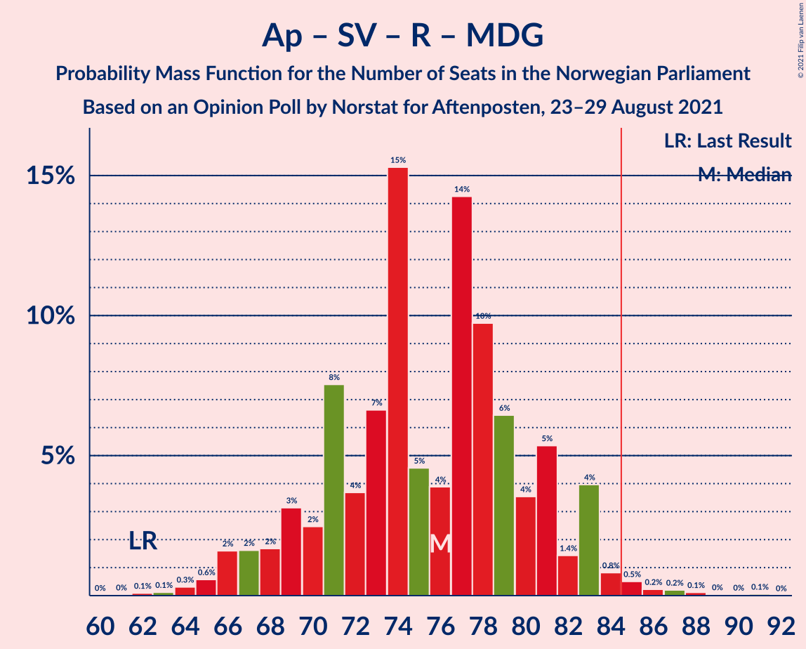

| Number of Seats | Probability | Accumulated | Special Marks |
|:---------------:|:-----------:|:-----------:|:-------------:|
| 61 | 0% | 100% |  |
| 62 | 0.1% | 99.9% | Last Result |
| 63 | 0.1% | 99.8% |  |
| 64 | 0.3% | 99.7% |  |
| 65 | 0.6% | 99.4% |  |
| 66 | 2% | 98.8% |  |
| 67 | 2% | 97% |  |
| 68 | 2% | 96% |  |
| 69 | 3% | 94% |  |
| 70 | 2% | 91% |  |
| 71 | 8% | 88% |  |
| 72 | 4% | 81% |  |
| 73 | 7% | 77% |  |
| 74 | 15% | 70% |  |
| 75 | 5% | 55% |  |
| 76 | 4% | 51% | Median |
| 77 | 14% | 47% |  |
| 78 | 10% | 32% |  |
| 79 | 6% | 23% |  |
| 80 | 4% | 16% |  |
| 81 | 5% | 13% |  |
| 82 | 1.4% | 7% |  |
| 83 | 4% | 6% |  |
| 84 | 0.8% | 2% |  |
| 85 | 0.5% | 1.2% | Majority |
| 86 | 0.2% | 0.7% |  |
| 87 | 0.2% | 0.4% |  |
| 88 | 0.1% | 0.2% |  |
| 89 | 0% | 0.1% |  |
| 90 | 0% | 0.1% |  |
| 91 | 0.1% | 0.1% |  |
| 92 | 0% | 0% |  |

### Arbeiderpartiet – Senterpartiet – Kristelig Folkeparti

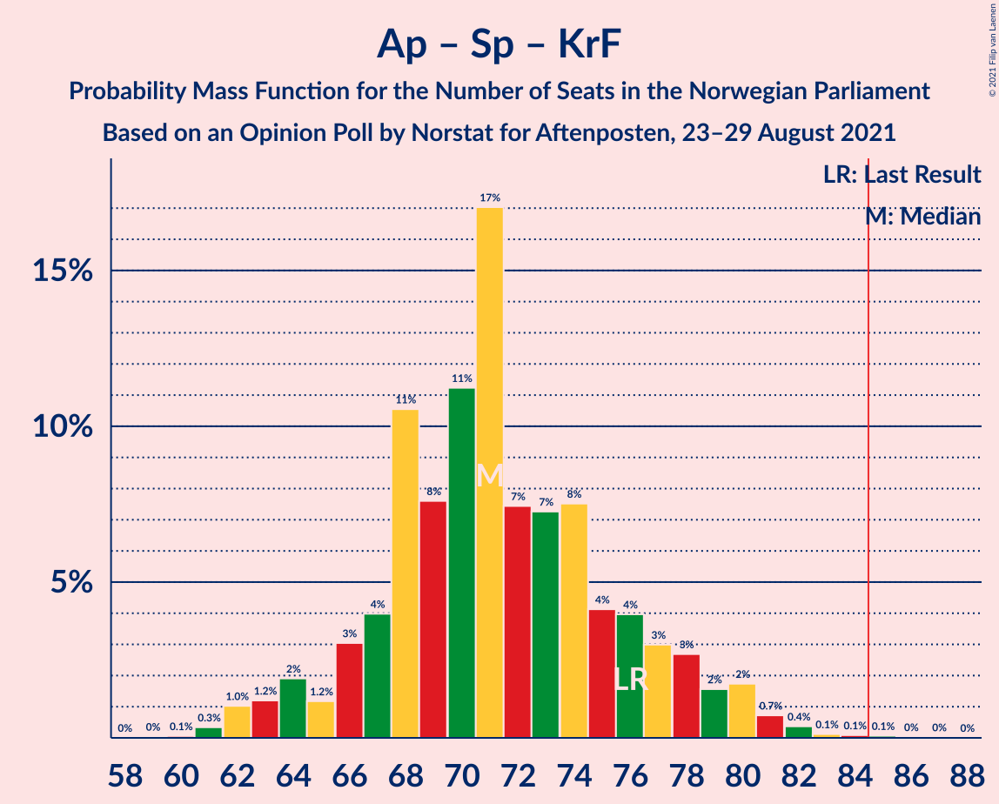

| Number of Seats | Probability | Accumulated | Special Marks |
|:---------------:|:-----------:|:-----------:|:-------------:|
| 59 | 0% | 100% |  |
| 60 | 0.1% | 99.9% |  |
| 61 | 0.3% | 99.9% |  |
| 62 | 1.0% | 99.5% |  |
| 63 | 1.2% | 98.5% |  |
| 64 | 2% | 97% |  |
| 65 | 1.2% | 95% |  |
| 66 | 3% | 94% |  |
| 67 | 4% | 91% |  |
| 68 | 11% | 87% |  |
| 69 | 8% | 77% |  |
| 70 | 11% | 69% |  |
| 71 | 17% | 58% | Median |
| 72 | 7% | 41% |  |
| 73 | 7% | 33% |  |
| 74 | 8% | 26% |  |
| 75 | 4% | 19% |  |
| 76 | 4% | 14% | Last Result |
| 77 | 3% | 10% |  |
| 78 | 3% | 7% |  |
| 79 | 2% | 5% |  |
| 80 | 2% | 3% |  |
| 81 | 0.7% | 1.4% |  |
| 82 | 0.4% | 0.7% |  |
| 83 | 0.1% | 0.4% |  |
| 84 | 0.1% | 0.2% |  |
| 85 | 0.1% | 0.1% | Majority |
| 86 | 0% | 0.1% |  |
| 87 | 0% | 0% |  |

### Høyre – Fremskrittspartiet – Kristelig Folkeparti – Venstre

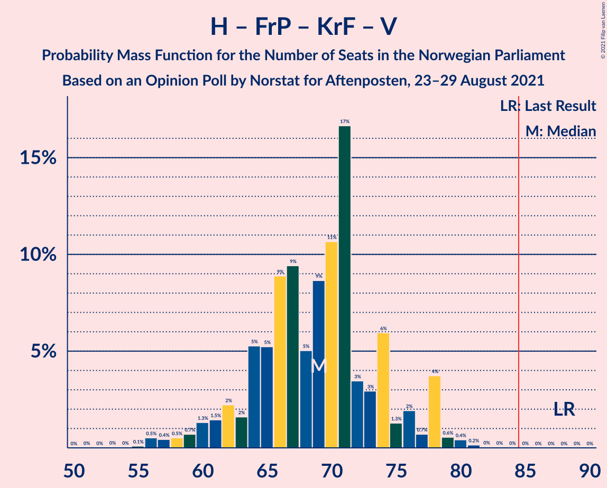

| Number of Seats | Probability | Accumulated | Special Marks |
|:---------------:|:-----------:|:-----------:|:-------------:|
| 53 | 0% | 100% |  |
| 54 | 0% | 99.9% |  |
| 55 | 0.1% | 99.9% |  |
| 56 | 0.5% | 99.8% |  |
| 57 | 0.4% | 99.3% |  |
| 58 | 0.5% | 98.9% |  |
| 59 | 0.7% | 98% |  |
| 60 | 1.3% | 98% |  |
| 61 | 1.5% | 96% |  |
| 62 | 2% | 95% |  |
| 63 | 2% | 93% |  |
| 64 | 5% | 91% |  |
| 65 | 5% | 86% |  |
| 66 | 9% | 81% |  |
| 67 | 9% | 72% |  |
| 68 | 5% | 62% |  |
| 69 | 9% | 57% |  |
| 70 | 11% | 49% | Median |
| 71 | 17% | 38% |  |
| 72 | 3% | 21% |  |
| 73 | 3% | 18% |  |
| 74 | 6% | 15% |  |
| 75 | 1.3% | 9% |  |
| 76 | 2% | 8% |  |
| 77 | 0.7% | 6% |  |
| 78 | 4% | 5% |  |
| 79 | 0.6% | 1.2% |  |
| 80 | 0.4% | 0.7% |  |
| 81 | 0.2% | 0.3% |  |
| 82 | 0% | 0.1% |  |
| 83 | 0% | 0.1% |  |
| 84 | 0% | 0% |  |
| 85 | 0% | 0% | Majority |
| 86 | 0% | 0% |  |
| 87 | 0% | 0% |  |
| 88 | 0% | 0% | Last Result |

### Arbeiderpartiet – Senterpartiet

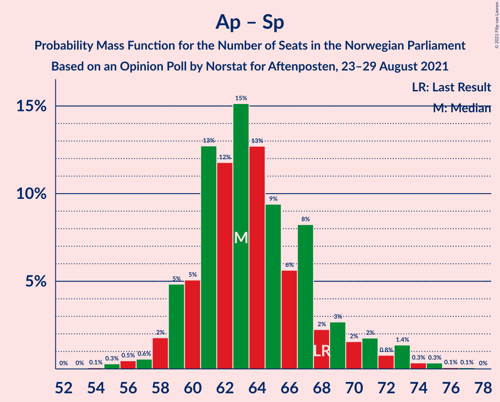

| Number of Seats | Probability | Accumulated | Special Marks |
|:---------------:|:-----------:|:-----------:|:-------------:|
| 53 | 0% | 100% |  |
| 54 | 0.1% | 99.9% |  |
| 55 | 0.3% | 99.9% |  |
| 56 | 0.5% | 99.6% |  |
| 57 | 0.6% | 99.1% |  |
| 58 | 2% | 98.6% |  |
| 59 | 5% | 97% |  |
| 60 | 5% | 92% |  |
| 61 | 13% | 87% |  |
| 62 | 12% | 74% |  |
| 63 | 15% | 62% | Median |
| 64 | 13% | 47% |  |
| 65 | 9% | 35% |  |
| 66 | 6% | 25% |  |
| 67 | 8% | 19% |  |
| 68 | 2% | 11% | Last Result |
| 69 | 3% | 9% |  |
| 70 | 2% | 6% |  |
| 71 | 2% | 5% |  |
| 72 | 0.8% | 3% |  |
| 73 | 1.4% | 2% |  |
| 74 | 0.3% | 0.9% |  |
| 75 | 0.3% | 0.5% |  |
| 76 | 0.1% | 0.2% |  |
| 77 | 0.1% | 0.1% |  |
| 78 | 0% | 0% |  |

### Høyre – Fremskrittspartiet – Venstre

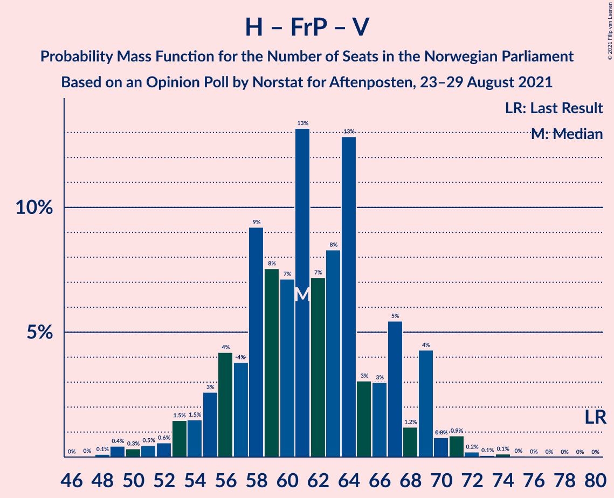

| Number of Seats | Probability | Accumulated | Special Marks |
|:---------------:|:-----------:|:-----------:|:-------------:|
| 47 | 0% | 100% |  |
| 48 | 0.1% | 99.9% |  |
| 49 | 0.4% | 99.8% |  |
| 50 | 0.3% | 99.4% |  |
| 51 | 0.5% | 99.0% |  |
| 52 | 0.6% | 98.6% |  |
| 53 | 1.5% | 98% |  |
| 54 | 1.5% | 97% |  |
| 55 | 3% | 95% |  |
| 56 | 4% | 92% |  |
| 57 | 4% | 88% |  |
| 58 | 9% | 84% |  |
| 59 | 8% | 75% |  |
| 60 | 7% | 68% |  |
| 61 | 13% | 61% |  |
| 62 | 7% | 47% | Median |
| 63 | 8% | 40% |  |
| 64 | 13% | 32% |  |
| 65 | 3% | 19% |  |
| 66 | 3% | 16% |  |
| 67 | 5% | 13% |  |
| 68 | 1.2% | 8% |  |
| 69 | 4% | 6% |  |
| 70 | 0.8% | 2% |  |
| 71 | 0.9% | 1.3% |  |
| 72 | 0.2% | 0.5% |  |
| 73 | 0.1% | 0.3% |  |
| 74 | 0.1% | 0.2% |  |
| 75 | 0% | 0.1% |  |
| 76 | 0% | 0% |  |
| 77 | 0% | 0% |  |
| 78 | 0% | 0% |  |
| 79 | 0% | 0% |  |
| 80 | 0% | 0% | Last Result |

### Arbeiderpartiet – Sosialistisk Venstreparti

| Number of Seats | Probability | Accumulated | Special Marks |
|:---------------:|:-----------:|:-----------:|:-------------:|
| 49 | 0% | 100% |  |
| 50 | 0.1% | 99.9% |  |
| 51 | 0.2% | 99.8% |  |
| 52 | 0.5% | 99.6% |  |
| 53 | 0.6% | 99.1% |  |
| 54 | 1.0% | 98.6% |  |
| 55 | 3% | 98% |  |
| 56 | 4% | 95% |  |
| 57 | 13% | 91% |  |
| 58 | 8% | 79% |  |
| 59 | 10% | 70% |  |
| 60 | 17% | 61% | Last Result, Median |
| 61 | 17% | 44% |  |
| 62 | 6% | 27% |  |
| 63 | 6% | 21% |  |
| 64 | 7% | 15% |  |
| 65 | 3% | 7% |  |
| 66 | 1.2% | 5% |  |
| 67 | 2% | 3% |  |
| 68 | 0.7% | 2% |  |
| 69 | 0.4% | 1.1% |  |
| 70 | 0.3% | 0.7% |  |
| 71 | 0.1% | 0.4% |  |
| 72 | 0.1% | 0.2% |  |
| 73 | 0% | 0.1% |  |
| 74 | 0% | 0.1% |  |
| 75 | 0% | 0.1% |  |
| 76 | 0.1% | 0.1% |  |
| 77 | 0% | 0% |  |

### Høyre – Fremskrittspartiet

| Number of Seats | Probability | Accumulated | Special Marks |
|:---------------:|:-----------:|:-----------:|:-------------:|
| 43 | 0.1% | 100% |  |
| 44 | 0.2% | 99.9% |  |
| 45 | 0.4% | 99.7% |  |
| 46 | 0.8% | 99.2% |  |
| 47 | 1.4% | 98% |  |
| 48 | 2% | 97% |  |
| 49 | 2% | 95% |  |
| 50 | 3% | 93% |  |
| 51 | 6% | 90% |  |
| 52 | 7% | 84% |  |
| 53 | 11% | 77% |  |
| 54 | 10% | 66% |  |
| 55 | 14% | 55% | Median |
| 56 | 11% | 42% |  |
| 57 | 12% | 31% |  |
| 58 | 4% | 19% |  |
| 59 | 5% | 14% |  |
| 60 | 5% | 10% |  |
| 61 | 2% | 5% |  |
| 62 | 0.9% | 3% |  |
| 63 | 1.1% | 2% |  |
| 64 | 0.4% | 0.9% |  |
| 65 | 0.3% | 0.5% |  |
| 66 | 0.1% | 0.2% |  |
| 67 | 0.1% | 0.1% |  |
| 68 | 0% | 0% |  |
| 69 | 0% | 0% |  |
| 70 | 0% | 0% |  |
| 71 | 0% | 0% |  |
| 72 | 0% | 0% | Last Result |

### Høyre – Kristelig Folkeparti – Venstre

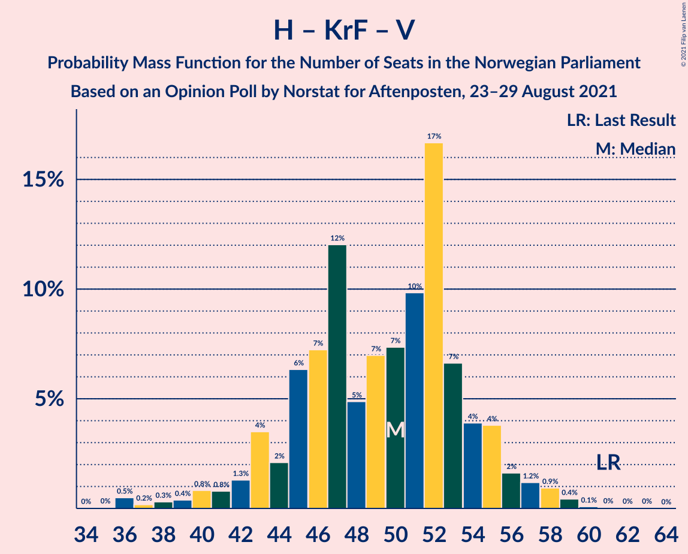

| Number of Seats | Probability | Accumulated | Special Marks |
|:---------------:|:-----------:|:-----------:|:-------------:|
| 34 | 0% | 100% |  |
| 35 | 0% | 99.9% |  |
| 36 | 0.5% | 99.9% |  |
| 37 | 0.2% | 99.4% |  |
| 38 | 0.3% | 99.2% |  |
| 39 | 0.4% | 98.9% |  |
| 40 | 0.8% | 98.5% |  |
| 41 | 0.8% | 98% |  |
| 42 | 1.3% | 97% |  |
| 43 | 4% | 96% |  |
| 44 | 2% | 92% |  |
| 45 | 6% | 90% |  |
| 46 | 7% | 84% |  |
| 47 | 12% | 76% |  |
| 48 | 5% | 64% |  |
| 49 | 7% | 60% |  |
| 50 | 7% | 53% |  |
| 51 | 10% | 45% | Median |
| 52 | 17% | 35% |  |
| 53 | 7% | 19% |  |
| 54 | 4% | 12% |  |
| 55 | 4% | 8% |  |
| 56 | 2% | 4% |  |
| 57 | 1.2% | 3% |  |
| 58 | 0.9% | 2% |  |
| 59 | 0.4% | 0.6% |  |
| 60 | 0.1% | 0.2% |  |
| 61 | 0% | 0.1% | Last Result |
| 62 | 0% | 0.1% |  |
| 63 | 0% | 0% |  |

### Senterpartiet – Kristelig Folkeparti – Venstre

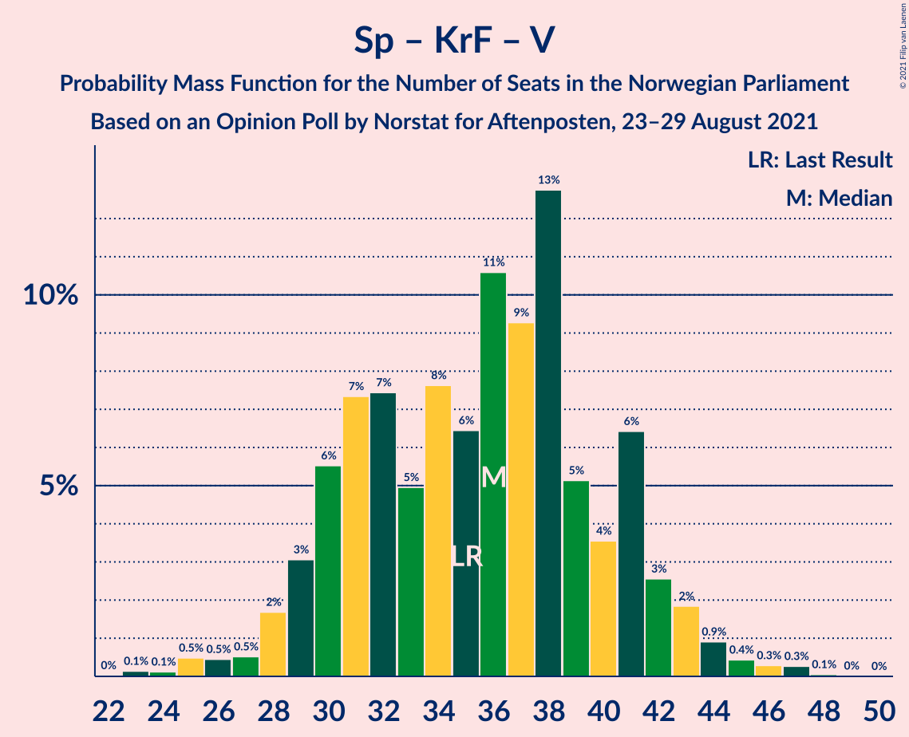

| Number of Seats | Probability | Accumulated | Special Marks |
|:---------------:|:-----------:|:-----------:|:-------------:|
| 22 | 0% | 100% |  |
| 23 | 0.1% | 99.9% |  |
| 24 | 0.1% | 99.8% |  |
| 25 | 0.5% | 99.7% |  |
| 26 | 0.5% | 99.2% |  |
| 27 | 0.5% | 98.7% |  |
| 28 | 2% | 98% |  |
| 29 | 3% | 97% |  |
| 30 | 6% | 93% |  |
| 31 | 7% | 88% |  |
| 32 | 7% | 81% |  |
| 33 | 5% | 73% |  |
| 34 | 8% | 68% |  |
| 35 | 6% | 61% | Last Result |
| 36 | 11% | 54% | Median |
| 37 | 9% | 44% |  |
| 38 | 13% | 34% |  |
| 39 | 5% | 22% |  |
| 40 | 4% | 16% |  |
| 41 | 6% | 13% |  |
| 42 | 3% | 6% |  |
| 43 | 2% | 4% |  |
| 44 | 0.9% | 2% |  |
| 45 | 0.4% | 1.1% |  |
| 46 | 0.3% | 0.6% |  |
| 47 | 0.3% | 0.3% |  |
| 48 | 0.1% | 0.1% |  |
| 49 | 0% | 0% |  |

## Technical Information

### Opinion Poll

+ **Polling firm:** Norstat
+ **Commissioner(s):** Aftenposten
+ **Fieldwork period:** 23–29 August 2021

### Calculations

+ **Sample size:** 628
+ **Simulations done:** 1,048,576
+ **Error estimate:** 3.03%

