# Opinion Poll by Kantar TNS for TV2, 25–31 August 2021

<a href="#voting-intentions">Voting Intentions</a> | <a href="#seats">Seats</a> | <a href="#coalitions">Coalitions</a> | <a href="#technical-information">Technical Information</a>

## Voting Intentions

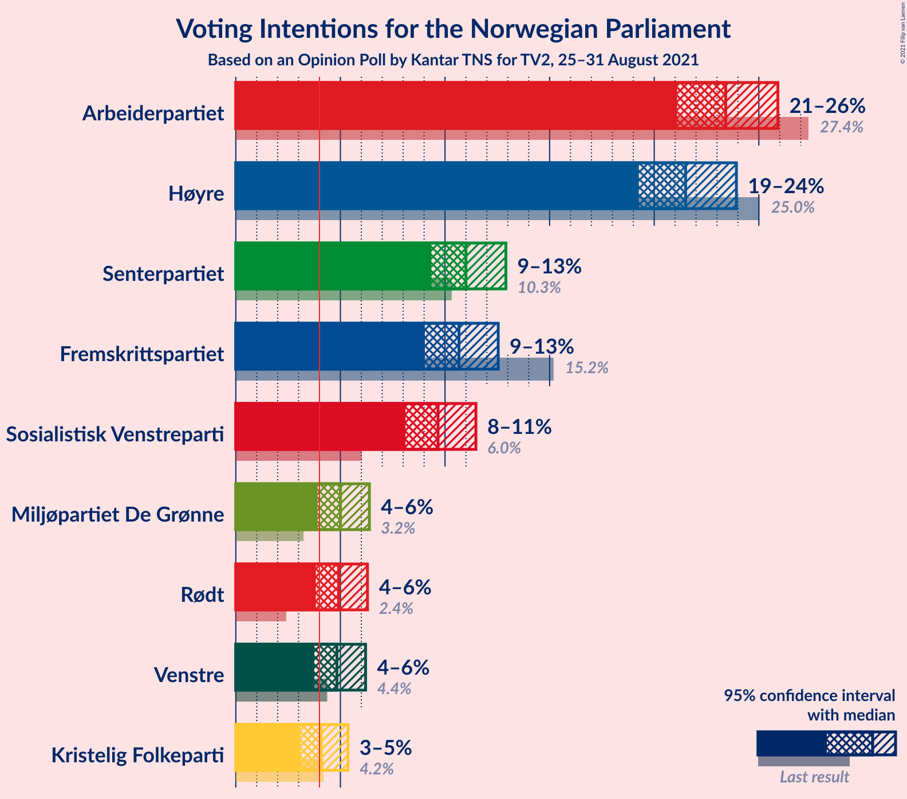

### Confidence Intervals

| Party | Last Result | Poll Result | 80% Confidence Interval | 90% Confidence Interval | 95% Confidence Interval | 99% Confidence Interval |
|:-----:|:-----------:|:-----------:|:-----------------------:|:-----------------------:|:-----------------------:|:-----------------------:|
| Arbeiderpartiet | 27.4% | 23.4% | 21.9–25.0% |21.5–25.5% |21.1–25.9% |20.4–26.7% |
| Høyre | 25.0% | 21.5% | 20.0–23.1% |19.6–23.5% |19.3–23.9% |18.6–24.7% |
| Senterpartiet | 10.3% | 11.0% | 9.9–12.2% |9.6–12.6% |9.3–12.9% |8.9–13.5% |
| Fremskrittspartiet | 15.2% | 10.7% | 9.6–11.9% |9.3–12.2% |9.0–12.5% |8.6–13.2% |
| Sosialistisk Venstreparti | 6.0% | 9.7% | 8.6–10.9% |8.4–11.2% |8.1–11.5% |7.7–12.1% |
| Miljøpartiet De Grønne | 3.2% | 5.0% | 4.3–5.9% |4.1–6.2% |3.9–6.4% |3.6–6.8% |
| Rødt | 2.4% | 4.9% | 4.2–5.8% |4.0–6.1% |3.8–6.3% |3.5–6.8% |
| Venstre | 4.4% | 4.8% | 4.1–5.7% |3.9–6.0% |3.7–6.2% |3.4–6.7% |
| Kristelig Folkeparti | 4.2% | 4.1% | 3.4–4.9% |3.2–5.2% |3.1–5.4% |2.8–5.8% |

*Note:* The poll result column reflects the actual value used in the calculations. Published results may vary slightly, and in addition be rounded to fewer digits.

## Seats

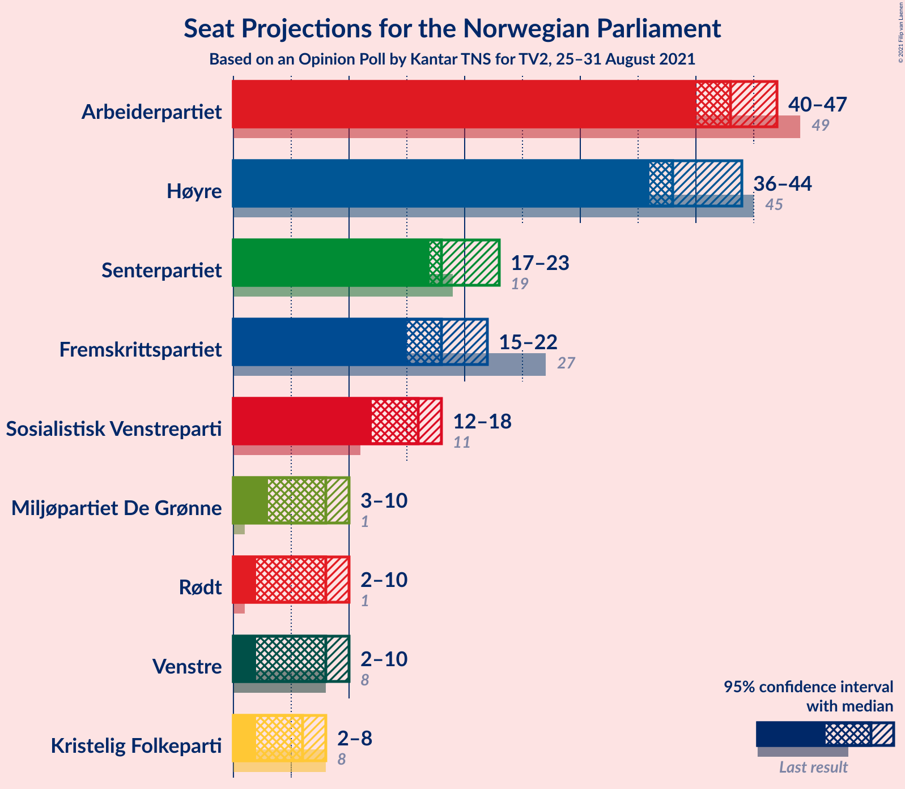

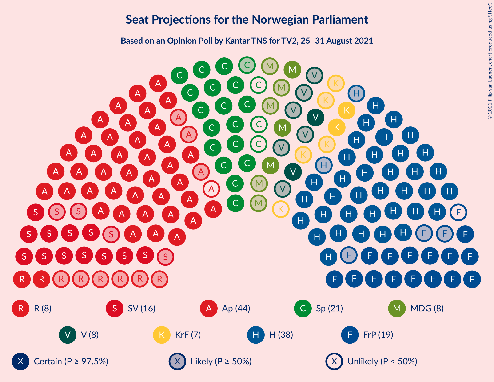

### Confidence Intervals

| Party | Last Result | Median | 80% Confidence Interval | 90% Confidence Interval | 95% Confidence Interval | 99% Confidence Interval |
|:-----:|:-----------:|:------:|:-----------------------:|:-----------------------:|:-----------------------:|:-----------------------:|
| <a href="#arbeiderpartiet">Arbeiderpartiet</a> | 49 | 43 | 41–46 |41–46 |40–47 |40–50 |
| <a href="#høyre">Høyre</a> | 45 | 38 | 36–42 |36–43 |36–44 |35–45 |
| <a href="#senterpartiet">Senterpartiet</a> | 19 | 18 | 18–21 |17–22 |17–23 |16–25 |
| <a href="#fremskrittspartiet">Fremskrittspartiet</a> | 27 | 18 | 16–21 |15–21 |15–22 |14–24 |
| <a href="#sosialistisk-venstreparti">Sosialistisk Venstreparti</a> | 11 | 16 | 14–18 |13–18 |12–18 |11–20 |
| <a href="#miljøpartiet-de-grønne">Miljøpartiet De Grønne</a> | 1 | 8 | 7–9 |6–10 |3–10 |2–11 |
| <a href="#rødt">Rødt</a> | 1 | 8 | 6–9 |6–9 |2–10 |2–11 |
| <a href="#venstre">Venstre</a> | 8 | 8 | 6–9 |2–9 |2–10 |2–10 |
| <a href="#kristelig-folkeparti">Kristelig Folkeparti</a> | 8 | 6 | 3–7 |2–8 |2–8 |2–9 |

### Arbeiderpartiet

*For a full overview of the results for this party, see the [Arbeiderpartiet](party-arbeiderpartiet.html) page.*

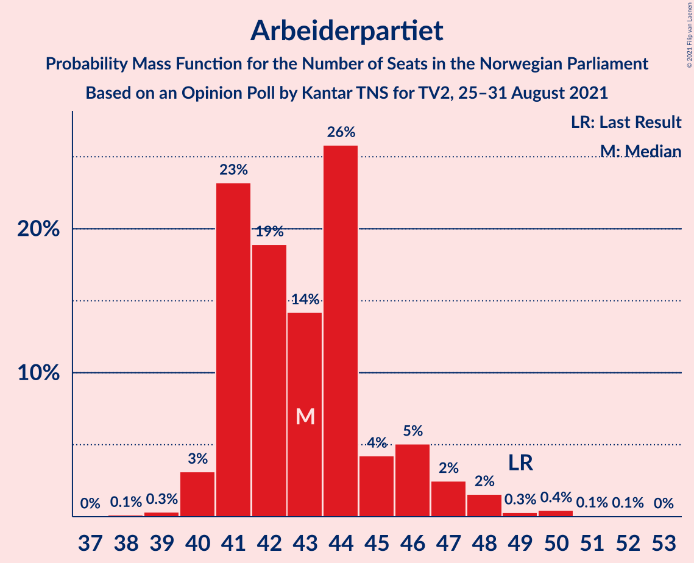

| Number of Seats | Probability | Accumulated | Special Marks |
|:---------------:|:-----------:|:-----------:|:-------------:|
| 38 | 0.1% | 100% |  |
| 39 | 0.3% | 99.8% |  |
| 40 | 3% | 99.5% |  |
| 41 | 23% | 96% |  |
| 42 | 19% | 73% |  |
| 43 | 14% | 54% | Median |
| 44 | 26% | 40% |  |
| 45 | 4% | 14% |  |
| 46 | 5% | 10% |  |
| 47 | 2% | 5% |  |
| 48 | 2% | 2% |  |
| 49 | 0.3% | 0.9% | Last Result |
| 50 | 0.4% | 0.6% |  |
| 51 | 0.1% | 0.2% |  |
| 52 | 0.1% | 0.1% |  |
| 53 | 0% | 0% |  |

### Høyre

*For a full overview of the results for this party, see the [Høyre](party-høyre.html) page.*

| Number of Seats | Probability | Accumulated | Special Marks |
|:---------------:|:-----------:|:-----------:|:-------------:|
| 32 | 0.1% | 100% |  |
| 33 | 0.1% | 99.9% |  |
| 34 | 0.3% | 99.8% |  |
| 35 | 2% | 99.5% |  |
| 36 | 24% | 98% |  |
| 37 | 12% | 74% |  |
| 38 | 29% | 62% | Median |
| 39 | 6% | 33% |  |
| 40 | 5% | 27% |  |
| 41 | 10% | 22% |  |
| 42 | 3% | 11% |  |
| 43 | 5% | 8% |  |
| 44 | 3% | 3% |  |
| 45 | 0.5% | 1.0% | Last Result |
| 46 | 0.3% | 0.5% |  |
| 47 | 0.1% | 0.2% |  |
| 48 | 0% | 0% |  |

### Senterpartiet

*For a full overview of the results for this party, see the [Senterpartiet](party-senterpartiet.html) page.*

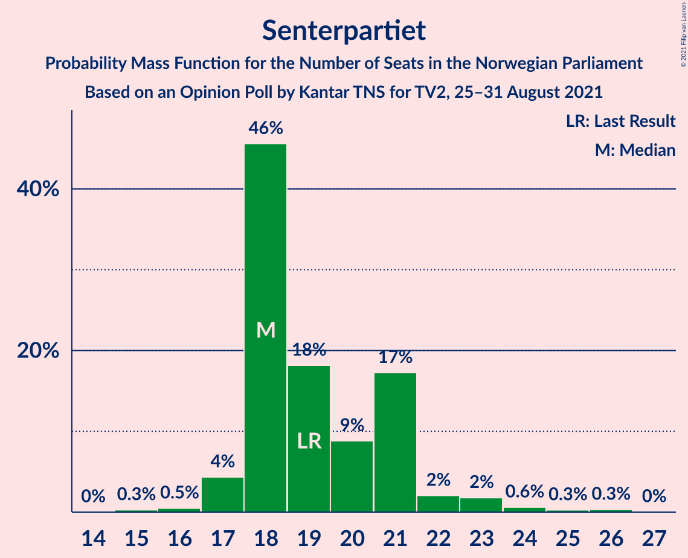

| Number of Seats | Probability | Accumulated | Special Marks |
|:---------------:|:-----------:|:-----------:|:-------------:|
| 15 | 0.3% | 100% |  |
| 16 | 0.5% | 99.7% |  |
| 17 | 4% | 99.2% |  |
| 18 | 46% | 95% | Median |
| 19 | 18% | 49% | Last Result |
| 20 | 9% | 31% |  |
| 21 | 17% | 22% |  |
| 22 | 2% | 5% |  |
| 23 | 2% | 3% |  |
| 24 | 0.6% | 1.2% |  |
| 25 | 0.3% | 0.6% |  |
| 26 | 0.3% | 0.4% |  |
| 27 | 0% | 0% |  |

### Fremskrittspartiet

*For a full overview of the results for this party, see the [Fremskrittspartiet](party-fremskrittspartiet.html) page.*

| Number of Seats | Probability | Accumulated | Special Marks |
|:---------------:|:-----------:|:-----------:|:-------------:|
| 13 | 0.1% | 100% |  |
| 14 | 0.5% | 99.9% |  |
| 15 | 5% | 99.4% |  |
| 16 | 5% | 95% |  |
| 17 | 10% | 90% |  |
| 18 | 38% | 79% | Median |
| 19 | 21% | 41% |  |
| 20 | 10% | 21% |  |
| 21 | 7% | 11% |  |
| 22 | 2% | 4% |  |
| 23 | 1.0% | 2% |  |
| 24 | 0.6% | 0.9% |  |
| 25 | 0.3% | 0.3% |  |
| 26 | 0% | 0% |  |
| 27 | 0% | 0% | Last Result |

### Sosialistisk Venstreparti

*For a full overview of the results for this party, see the [Sosialistisk Venstreparti](party-sosialistiskvenstreparti.html) page.*

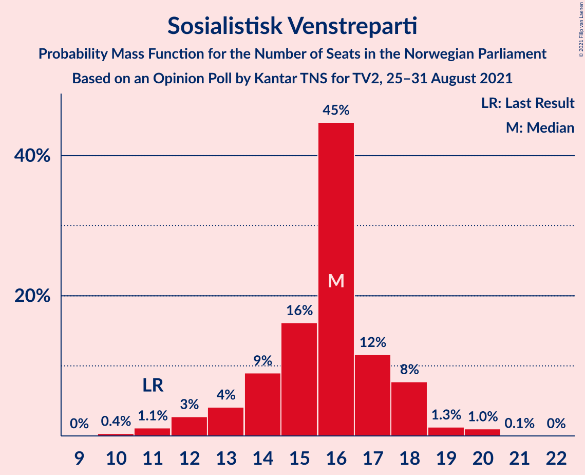

| Number of Seats | Probability | Accumulated | Special Marks |
|:---------------:|:-----------:|:-----------:|:-------------:|
| 10 | 0.4% | 100% |  |
| 11 | 1.1% | 99.6% | Last Result |
| 12 | 3% | 98% |  |
| 13 | 4% | 96% |  |
| 14 | 9% | 92% |  |
| 15 | 16% | 83% |  |
| 16 | 45% | 66% | Median |
| 17 | 12% | 22% |  |
| 18 | 8% | 10% |  |
| 19 | 1.3% | 2% |  |
| 20 | 1.0% | 1.1% |  |
| 21 | 0.1% | 0.1% |  |
| 22 | 0% | 0% |  |

### Miljøpartiet De Grønne

*For a full overview of the results for this party, see the [Miljøpartiet De Grønne](party-miljøpartietdegrønne.html) page.*

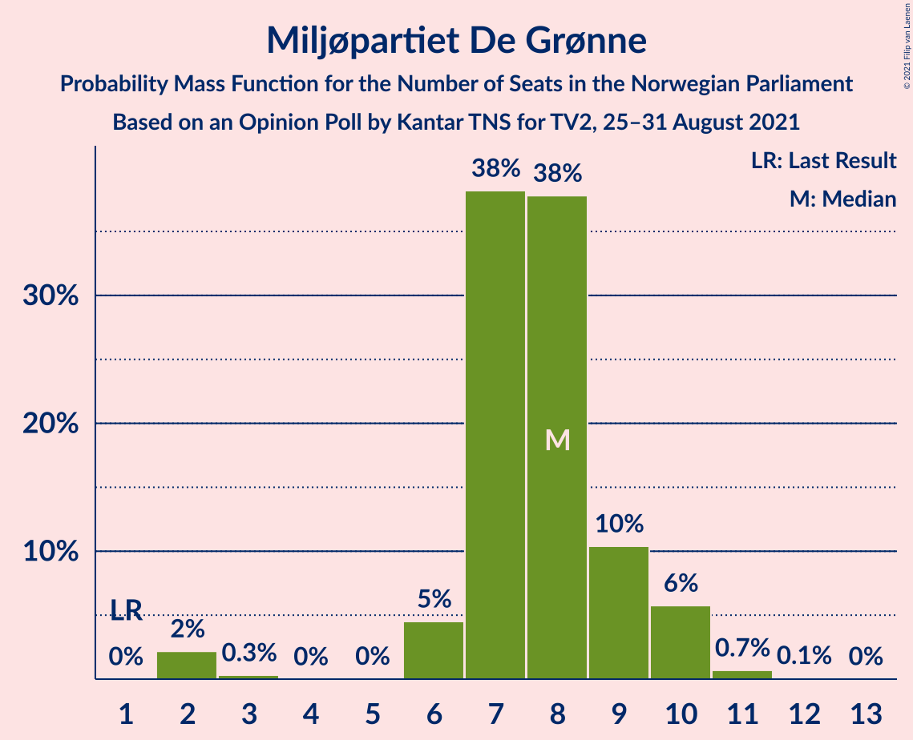

| Number of Seats | Probability | Accumulated | Special Marks |
|:---------------:|:-----------:|:-----------:|:-------------:|
| 1 | 0% | 100% | Last Result |
| 2 | 2% | 100% |  |
| 3 | 0.3% | 98% |  |
| 4 | 0% | 97% |  |
| 5 | 0% | 97% |  |
| 6 | 5% | 97% |  |
| 7 | 38% | 93% |  |
| 8 | 38% | 55% | Median |
| 9 | 10% | 17% |  |
| 10 | 6% | 7% |  |
| 11 | 0.7% | 0.8% |  |
| 12 | 0.1% | 0.1% |  |
| 13 | 0% | 0% |  |

### Rødt

*For a full overview of the results for this party, see the [Rødt](party-rødt.html) page.*

| Number of Seats | Probability | Accumulated | Special Marks |
|:---------------:|:-----------:|:-----------:|:-------------:|
| 1 | 0% | 100% | Last Result |
| 2 | 3% | 100% |  |
| 3 | 0% | 97% |  |
| 4 | 0% | 97% |  |
| 5 | 0% | 97% |  |
| 6 | 7% | 97% |  |
| 7 | 30% | 90% |  |
| 8 | 43% | 60% | Median |
| 9 | 13% | 17% |  |
| 10 | 3% | 4% |  |
| 11 | 0.4% | 0.5% |  |
| 12 | 0.1% | 0.1% |  |
| 13 | 0% | 0% |  |

### Venstre

*For a full overview of the results for this party, see the [Venstre](party-venstre.html) page.*

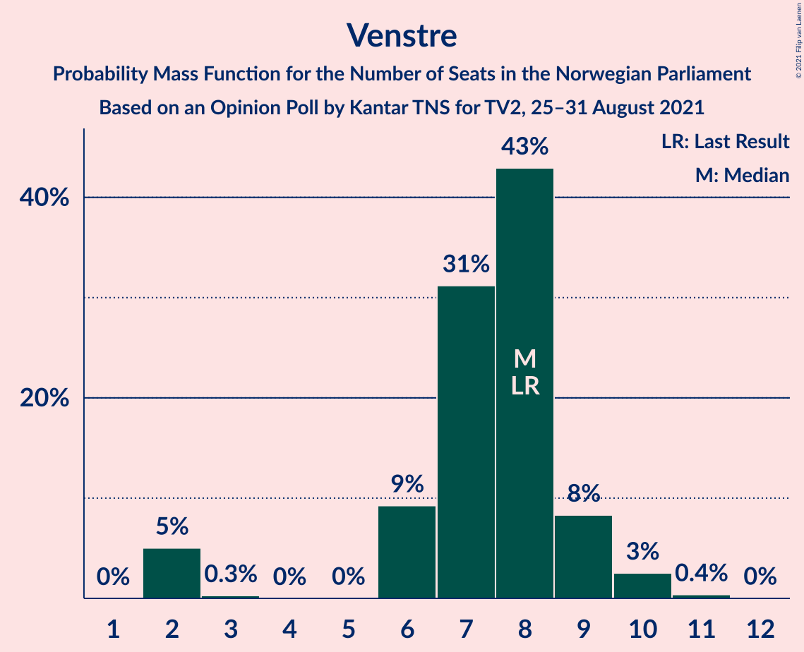

| Number of Seats | Probability | Accumulated | Special Marks |
|:---------------:|:-----------:|:-----------:|:-------------:|
| 2 | 5% | 100% |  |
| 3 | 0.3% | 95% |  |
| 4 | 0% | 95% |  |
| 5 | 0% | 95% |  |
| 6 | 9% | 95% |  |
| 7 | 31% | 85% |  |
| 8 | 43% | 54% | Last Result, Median |
| 9 | 8% | 11% |  |
| 10 | 3% | 3% |  |
| 11 | 0.4% | 0.4% |  |
| 12 | 0% | 0% |  |

### Kristelig Folkeparti

*For a full overview of the results for this party, see the [Kristelig Folkeparti](party-kristeligfolkeparti.html) page.*

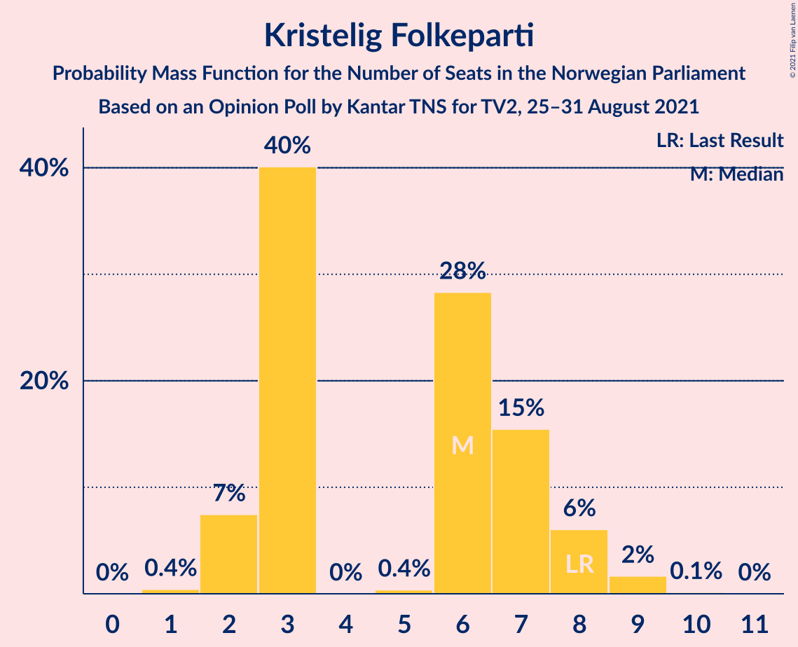

| Number of Seats | Probability | Accumulated | Special Marks |
|:---------------:|:-----------:|:-----------:|:-------------:|
| 1 | 0.4% | 100% |  |
| 2 | 7% | 99.6% |  |
| 3 | 40% | 92% |  |
| 4 | 0% | 52% |  |
| 5 | 0.4% | 52% |  |
| 6 | 28% | 52% | Median |
| 7 | 15% | 23% |  |
| 8 | 6% | 8% | Last Result |
| 9 | 2% | 2% |  |
| 10 | 0.1% | 0.1% |  |
| 11 | 0% | 0% |  |

## Coalitions

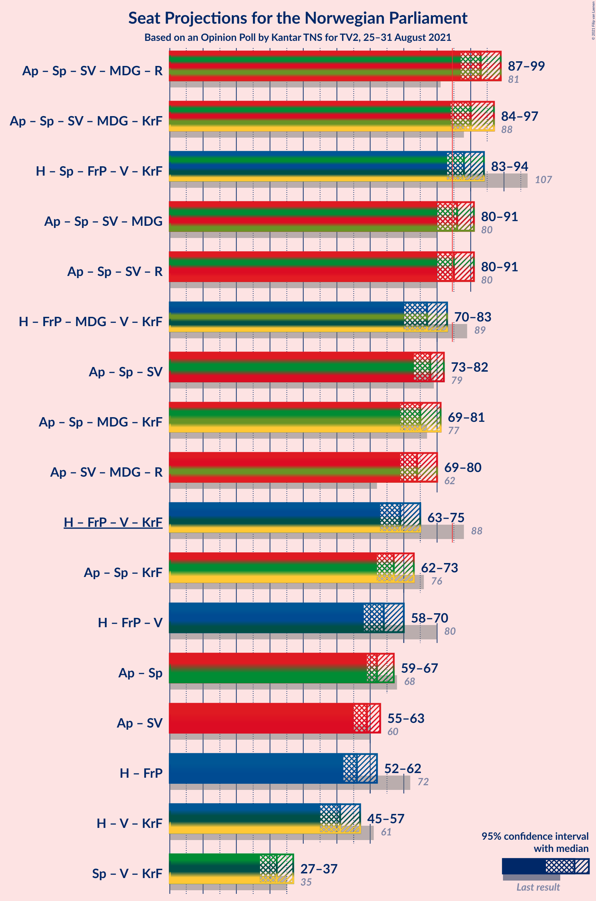

### Confidence Intervals

| Coalition | Last Result | Median | Majority? | 80% Confidence Interval | 90% Confidence Interval | 95% Confidence Interval | 99% Confidence Interval |
|:---------:|:-----------:|:------:|:---------:|:-----------------------:|:-----------------------:|:-----------------------:|:-----------------------:|
| Arbeiderpartiet – Senterpartiet – Sosialistisk Venstreparti – Miljøpartiet De Grønne – Rødt | 81 | 93 | 99.5% | 88–96 | 88–98 | 87–99 | 84–101 |
| Arbeiderpartiet – Senterpartiet – Sosialistisk Venstreparti – Miljøpartiet De Grønne – Kristelig Folkeparti | 88 | 90 | 97% | 86–94 | 85–96 | 84–97 | 82–99 |
| Høyre – Senterpartiet – Fremskrittspartiet – Venstre – Kristelig Folkeparti | 107 | 88 | 90% | 85–92 | 84–93 | 83–94 | 80–96 |
| Arbeiderpartiet – Senterpartiet – Sosialistisk Venstreparti – Miljøpartiet De Grønne | 80 | 86 | 60% | 81–89 | 80–90 | 80–91 | 78–93 |
| Arbeiderpartiet – Senterpartiet – Sosialistisk Venstreparti – Rødt | 80 | 85 | 60% | 81–89 | 81–90 | 80–91 | 77–93 |
| Høyre – Fremskrittspartiet – Miljøpartiet De Grønne – Venstre – Kristelig Folkeparti | 89 | 77 | 0.8% | 72–81 | 72–82 | 70–83 | 68–85 |
| Arbeiderpartiet – Senterpartiet – Sosialistisk Venstreparti | 79 | 78 | 0.6% | 74–81 | 73–82 | 73–82 | 71–85 |
| Arbeiderpartiet – Senterpartiet – Miljøpartiet De Grønne – Kristelig Folkeparti | 77 | 75 | 0.2% | 70–78 | 70–80 | 69–81 | 67–83 |
| Arbeiderpartiet – Sosialistisk Venstreparti – Miljøpartiet De Grønne – Rødt | 62 | 74 | 0% | 70–77 | 69–78 | 69–80 | 66–82 |
| Høyre – Fremskrittspartiet – Venstre – Kristelig Folkeparti | 88 | 69 | 0% | 65–74 | 64–75 | 63–75 | 60–78 |
| Arbeiderpartiet – Senterpartiet – Kristelig Folkeparti | 76 | 67 | 0% | 62–70 | 62–72 | 62–73 | 61–76 |
| Høyre – Fremskrittspartiet – Venstre | 80 | 64 | 0% | 61–68 | 60–69 | 58–70 | 56–72 |
| Arbeiderpartiet – Senterpartiet | 68 | 62 | 0% | 59–65 | 59–66 | 59–67 | 58–70 |
| Arbeiderpartiet – Sosialistisk Venstreparti | 60 | 59 | 0% | 56–61 | 55–62 | 55–63 | 53–65 |
| Høyre – Fremskrittspartiet | 72 | 56 | 0% | 54–61 | 53–62 | 52–62 | 50–64 |
| Høyre – Venstre – Kristelig Folkeparti | 61 | 51 | 0% | 47–54 | 46–56 | 45–57 | 41–59 |
| Senterpartiet – Venstre – Kristelig Folkeparti | 35 | 32 | 0% | 28–34 | 28–35 | 27–37 | 23–38 |

### Arbeiderpartiet – Senterpartiet – Sosialistisk Venstreparti – Miljøpartiet De Grønne – Rødt

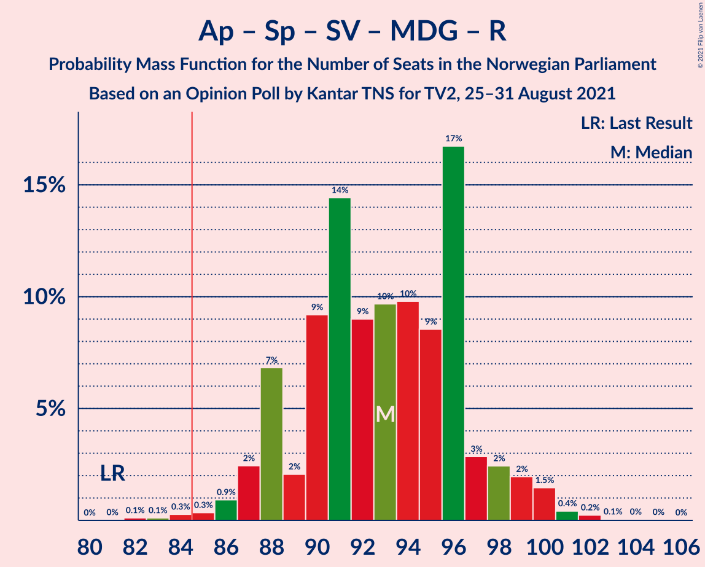

| Number of Seats | Probability | Accumulated | Special Marks |
|:---------------:|:-----------:|:-----------:|:-------------:|
| 81 | 0% | 100% | Last Result |
| 82 | 0.1% | 100% |  |
| 83 | 0.1% | 99.9% |  |
| 84 | 0.3% | 99.7% |  |
| 85 | 0.3% | 99.5% | Majority |
| 86 | 0.9% | 99.1% |  |
| 87 | 2% | 98% |  |
| 88 | 7% | 96% |  |
| 89 | 2% | 89% |  |
| 90 | 9% | 87% |  |
| 91 | 14% | 78% |  |
| 92 | 9% | 63% |  |
| 93 | 10% | 54% | Median |
| 94 | 10% | 45% |  |
| 95 | 9% | 35% |  |
| 96 | 17% | 26% |  |
| 97 | 3% | 10% |  |
| 98 | 2% | 7% |  |
| 99 | 2% | 4% |  |
| 100 | 1.5% | 2% |  |
| 101 | 0.4% | 0.8% |  |
| 102 | 0.2% | 0.4% |  |
| 103 | 0.1% | 0.1% |  |
| 104 | 0% | 0.1% |  |
| 105 | 0% | 0% |  |

### Arbeiderpartiet – Senterpartiet – Sosialistisk Venstreparti – Miljøpartiet De Grønne – Kristelig Folkeparti

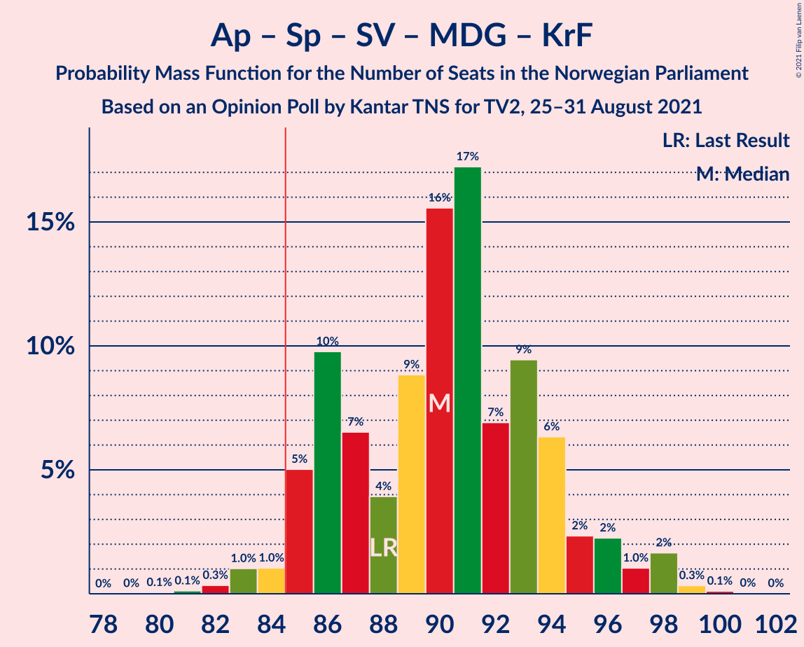

| Number of Seats | Probability | Accumulated | Special Marks |
|:---------------:|:-----------:|:-----------:|:-------------:|
| 80 | 0.1% | 100% |  |
| 81 | 0.1% | 99.9% |  |
| 82 | 0.3% | 99.8% |  |
| 83 | 1.0% | 99.5% |  |
| 84 | 1.0% | 98% |  |
| 85 | 5% | 97% | Majority |
| 86 | 10% | 92% |  |
| 87 | 7% | 83% |  |
| 88 | 4% | 76% | Last Result |
| 89 | 9% | 72% |  |
| 90 | 16% | 63% |  |
| 91 | 17% | 48% | Median |
| 92 | 7% | 30% |  |
| 93 | 9% | 24% |  |
| 94 | 6% | 14% |  |
| 95 | 2% | 8% |  |
| 96 | 2% | 5% |  |
| 97 | 1.0% | 3% |  |
| 98 | 2% | 2% |  |
| 99 | 0.3% | 0.5% |  |
| 100 | 0.1% | 0.2% |  |
| 101 | 0% | 0.1% |  |
| 102 | 0% | 0% |  |

### Høyre – Senterpartiet – Fremskrittspartiet – Venstre – Kristelig Folkeparti

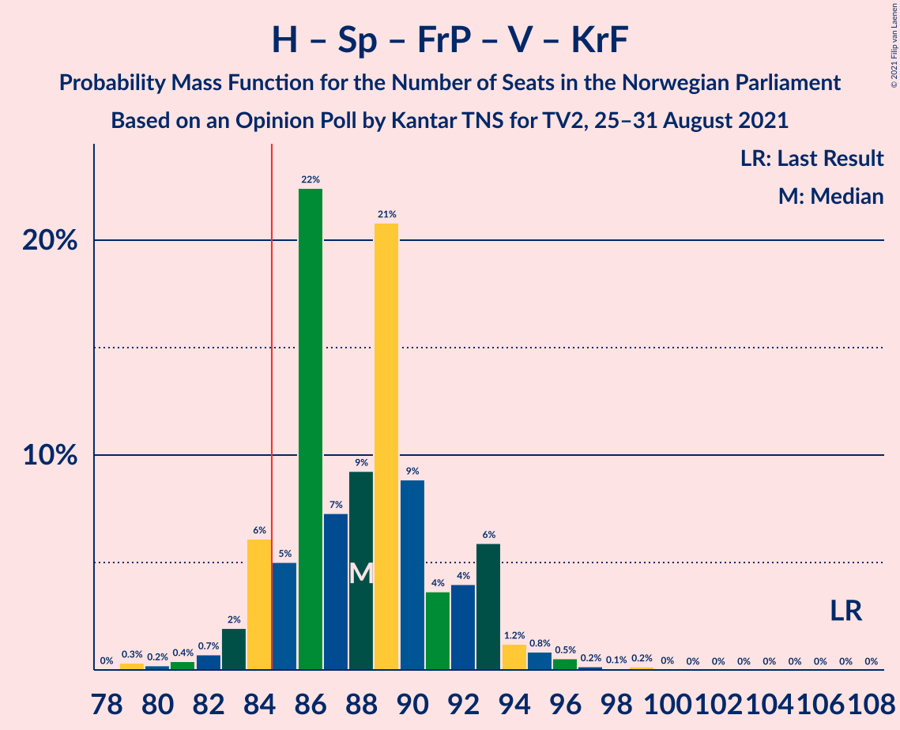

| Number of Seats | Probability | Accumulated | Special Marks |
|:---------------:|:-----------:|:-----------:|:-------------:|
| 78 | 0% | 100% |  |
| 79 | 0.3% | 99.9% |  |
| 80 | 0.2% | 99.6% |  |
| 81 | 0.4% | 99.4% |  |
| 82 | 0.7% | 99.0% |  |
| 83 | 2% | 98% |  |
| 84 | 6% | 96% |  |
| 85 | 5% | 90% | Majority |
| 86 | 22% | 85% |  |
| 87 | 7% | 63% |  |
| 88 | 9% | 55% | Median |
| 89 | 21% | 46% |  |
| 90 | 9% | 25% |  |
| 91 | 4% | 17% |  |
| 92 | 4% | 13% |  |
| 93 | 6% | 9% |  |
| 94 | 1.2% | 3% |  |
| 95 | 0.8% | 2% |  |
| 96 | 0.5% | 1.0% |  |
| 97 | 0.2% | 0.4% |  |
| 98 | 0.1% | 0.3% |  |
| 99 | 0.2% | 0.2% |  |
| 100 | 0% | 0% |  |
| 101 | 0% | 0% |  |
| 102 | 0% | 0% |  |
| 103 | 0% | 0% |  |
| 104 | 0% | 0% |  |
| 105 | 0% | 0% |  |
| 106 | 0% | 0% |  |
| 107 | 0% | 0% | Last Result |

### Arbeiderpartiet – Senterpartiet – Sosialistisk Venstreparti – Miljøpartiet De Grønne

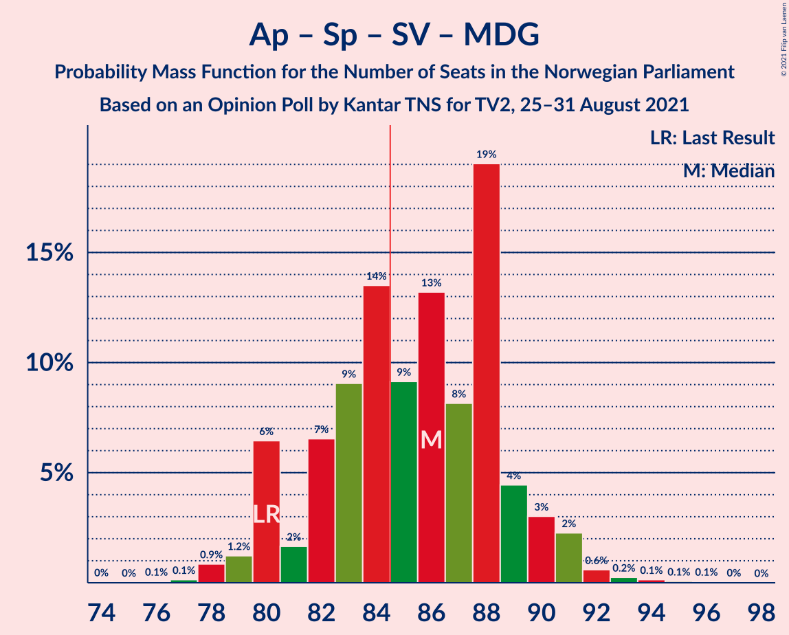

| Number of Seats | Probability | Accumulated | Special Marks |
|:---------------:|:-----------:|:-----------:|:-------------:|
| 74 | 0% | 100% |  |
| 75 | 0% | 99.9% |  |
| 76 | 0.1% | 99.9% |  |
| 77 | 0.1% | 99.9% |  |
| 78 | 0.9% | 99.7% |  |
| 79 | 1.2% | 98.9% |  |
| 80 | 6% | 98% | Last Result |
| 81 | 2% | 91% |  |
| 82 | 7% | 90% |  |
| 83 | 9% | 83% |  |
| 84 | 14% | 74% |  |
| 85 | 9% | 60% | Median, Majority |
| 86 | 13% | 51% |  |
| 87 | 8% | 38% |  |
| 88 | 19% | 30% |  |
| 89 | 4% | 11% |  |
| 90 | 3% | 6% |  |
| 91 | 2% | 3% |  |
| 92 | 0.6% | 1.2% |  |
| 93 | 0.2% | 0.6% |  |
| 94 | 0.1% | 0.3% |  |
| 95 | 0.1% | 0.2% |  |
| 96 | 0.1% | 0.1% |  |
| 97 | 0% | 0% |  |

### Arbeiderpartiet – Senterpartiet – Sosialistisk Venstreparti – Rødt

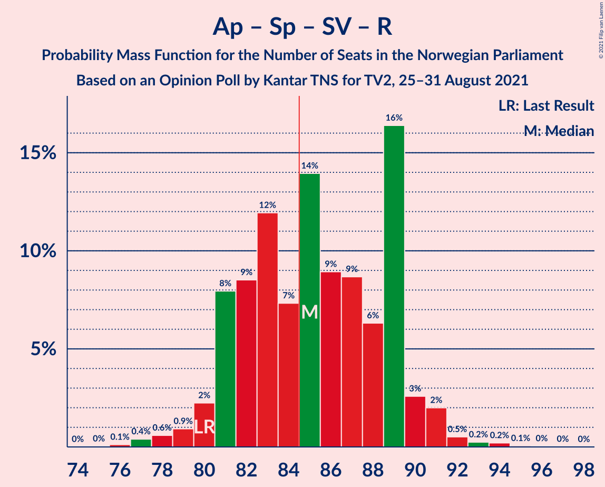

| Number of Seats | Probability | Accumulated | Special Marks |
|:---------------:|:-----------:|:-----------:|:-------------:|
| 76 | 0.1% | 100% |  |
| 77 | 0.4% | 99.8% |  |
| 78 | 0.6% | 99.4% |  |
| 79 | 0.9% | 98.8% |  |
| 80 | 2% | 98% | Last Result |
| 81 | 8% | 96% |  |
| 82 | 9% | 88% |  |
| 83 | 12% | 79% |  |
| 84 | 7% | 67% |  |
| 85 | 14% | 60% | Median, Majority |
| 86 | 9% | 46% |  |
| 87 | 9% | 37% |  |
| 88 | 6% | 28% |  |
| 89 | 16% | 22% |  |
| 90 | 3% | 6% |  |
| 91 | 2% | 3% |  |
| 92 | 0.5% | 1.1% |  |
| 93 | 0.2% | 0.6% |  |
| 94 | 0.2% | 0.3% |  |
| 95 | 0.1% | 0.1% |  |
| 96 | 0% | 0.1% |  |
| 97 | 0% | 0% |  |

### Høyre – Fremskrittspartiet – Miljøpartiet De Grønne – Venstre – Kristelig Folkeparti

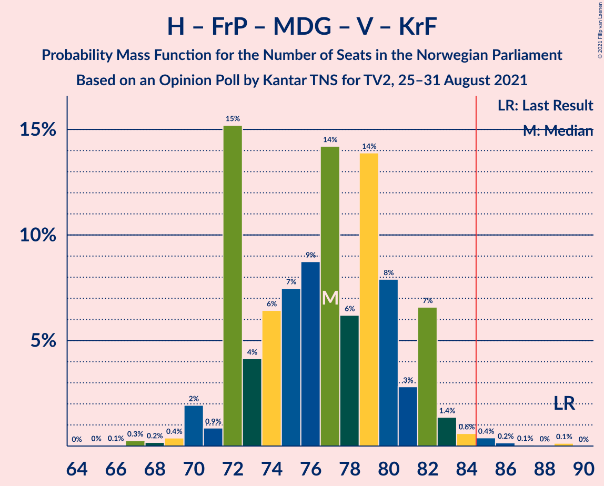

| Number of Seats | Probability | Accumulated | Special Marks |
|:---------------:|:-----------:|:-----------:|:-------------:|
| 65 | 0% | 100% |  |
| 66 | 0.1% | 99.9% |  |
| 67 | 0.3% | 99.9% |  |
| 68 | 0.2% | 99.6% |  |
| 69 | 0.4% | 99.5% |  |
| 70 | 2% | 99.1% |  |
| 71 | 0.9% | 97% |  |
| 72 | 15% | 96% |  |
| 73 | 4% | 81% |  |
| 74 | 6% | 77% |  |
| 75 | 7% | 71% |  |
| 76 | 9% | 63% |  |
| 77 | 14% | 54% |  |
| 78 | 6% | 40% | Median |
| 79 | 14% | 34% |  |
| 80 | 8% | 20% |  |
| 81 | 3% | 12% |  |
| 82 | 7% | 9% |  |
| 83 | 1.4% | 3% |  |
| 84 | 0.6% | 1.4% |  |
| 85 | 0.4% | 0.8% | Majority |
| 86 | 0.2% | 0.4% |  |
| 87 | 0.1% | 0.2% |  |
| 88 | 0% | 0.2% |  |
| 89 | 0.1% | 0.1% | Last Result |
| 90 | 0% | 0% |  |

### Arbeiderpartiet – Senterpartiet – Sosialistisk Venstreparti

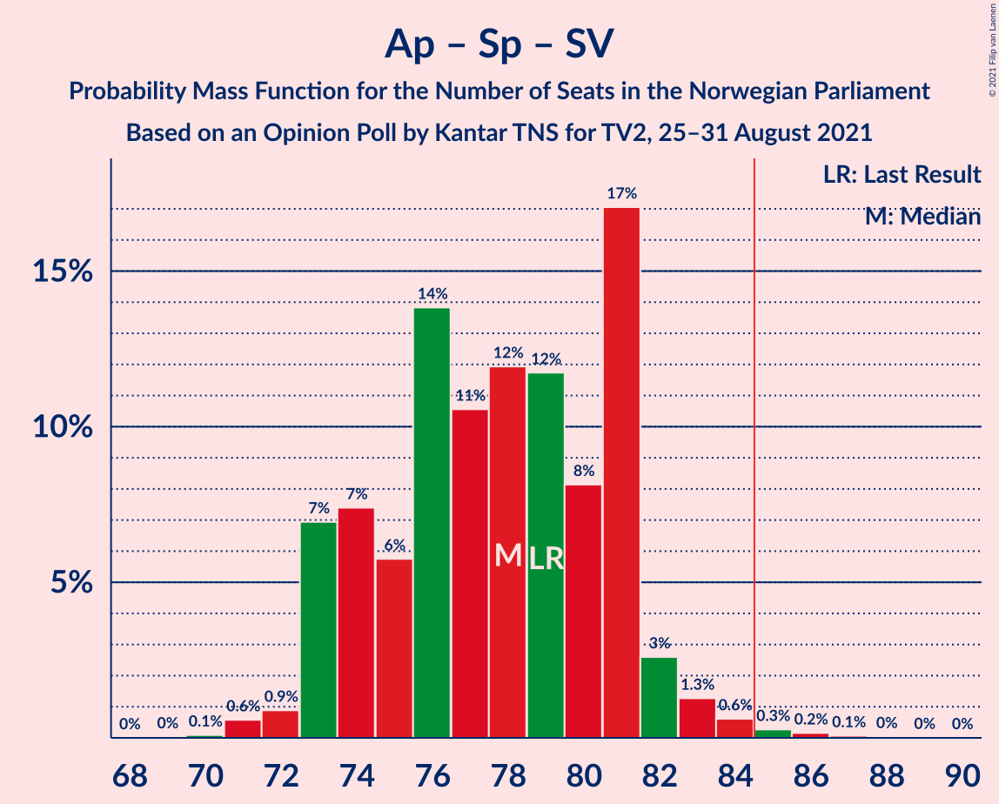

| Number of Seats | Probability | Accumulated | Special Marks |
|:---------------:|:-----------:|:-----------:|:-------------:|
| 70 | 0.1% | 100% |  |
| 71 | 0.6% | 99.9% |  |
| 72 | 0.9% | 99.3% |  |
| 73 | 7% | 98% |  |
| 74 | 7% | 91% |  |
| 75 | 6% | 84% |  |
| 76 | 14% | 78% |  |
| 77 | 11% | 64% | Median |
| 78 | 12% | 54% |  |
| 79 | 12% | 42% | Last Result |
| 80 | 8% | 30% |  |
| 81 | 17% | 22% |  |
| 82 | 3% | 5% |  |
| 83 | 1.3% | 2% |  |
| 84 | 0.6% | 1.2% |  |
| 85 | 0.3% | 0.6% | Majority |
| 86 | 0.2% | 0.3% |  |
| 87 | 0.1% | 0.1% |  |
| 88 | 0% | 0.1% |  |
| 89 | 0% | 0% |  |

### Arbeiderpartiet – Senterpartiet – Miljøpartiet De Grønne – Kristelig Folkeparti

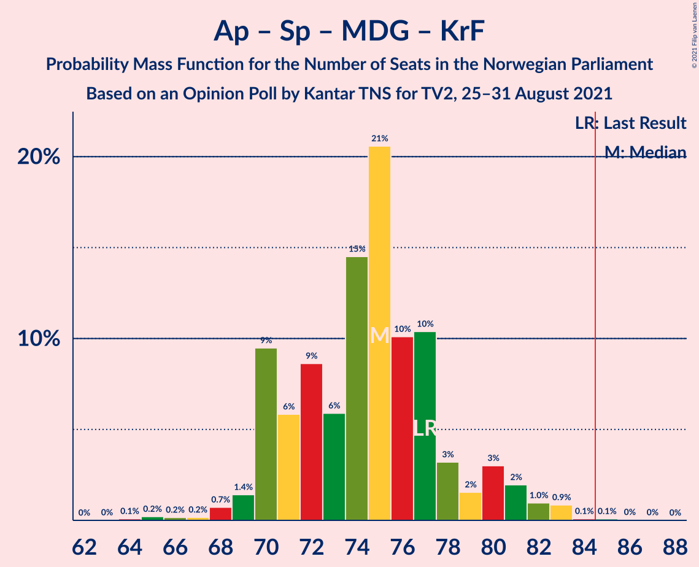

| Number of Seats | Probability | Accumulated | Special Marks |
|:---------------:|:-----------:|:-----------:|:-------------:|
| 64 | 0.1% | 100% |  |
| 65 | 0.2% | 99.9% |  |
| 66 | 0.2% | 99.7% |  |
| 67 | 0.2% | 99.5% |  |
| 68 | 0.7% | 99.3% |  |
| 69 | 1.4% | 98.6% |  |
| 70 | 9% | 97% |  |
| 71 | 6% | 88% |  |
| 72 | 9% | 82% |  |
| 73 | 6% | 73% |  |
| 74 | 15% | 67% |  |
| 75 | 21% | 53% | Median |
| 76 | 10% | 32% |  |
| 77 | 10% | 22% | Last Result |
| 78 | 3% | 12% |  |
| 79 | 2% | 9% |  |
| 80 | 3% | 7% |  |
| 81 | 2% | 4% |  |
| 82 | 1.0% | 2% |  |
| 83 | 0.9% | 1.1% |  |
| 84 | 0.1% | 0.2% |  |
| 85 | 0.1% | 0.2% | Majority |
| 86 | 0% | 0.1% |  |
| 87 | 0% | 0% |  |

### Arbeiderpartiet – Sosialistisk Venstreparti – Miljøpartiet De Grønne – Rødt

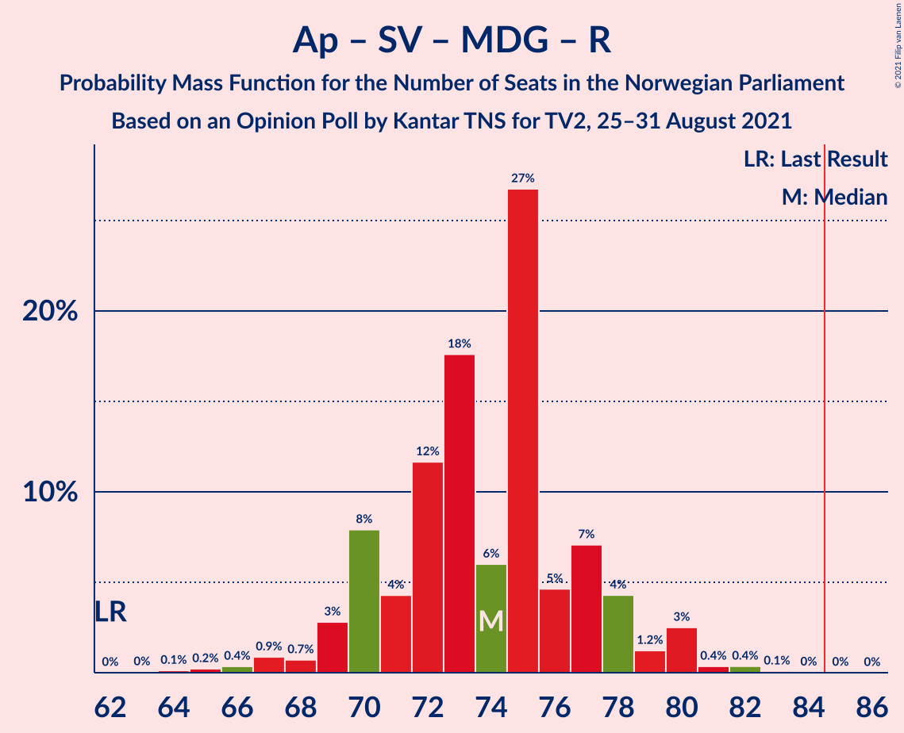

| Number of Seats | Probability | Accumulated | Special Marks |
|:---------------:|:-----------:|:-----------:|:-------------:|
| 62 | 0% | 100% | Last Result |
| 63 | 0% | 100% |  |
| 64 | 0.1% | 99.9% |  |
| 65 | 0.2% | 99.8% |  |
| 66 | 0.4% | 99.6% |  |
| 67 | 0.9% | 99.2% |  |
| 68 | 0.7% | 98% |  |
| 69 | 3% | 98% |  |
| 70 | 8% | 95% |  |
| 71 | 4% | 87% |  |
| 72 | 12% | 83% |  |
| 73 | 18% | 71% |  |
| 74 | 6% | 53% |  |
| 75 | 27% | 47% | Median |
| 76 | 5% | 21% |  |
| 77 | 7% | 16% |  |
| 78 | 4% | 9% |  |
| 79 | 1.2% | 5% |  |
| 80 | 3% | 3% |  |
| 81 | 0.4% | 0.9% |  |
| 82 | 0.4% | 0.5% |  |
| 83 | 0.1% | 0.2% |  |
| 84 | 0% | 0.1% |  |
| 85 | 0% | 0% | Majority |

### Høyre – Fremskrittspartiet – Venstre – Kristelig Folkeparti

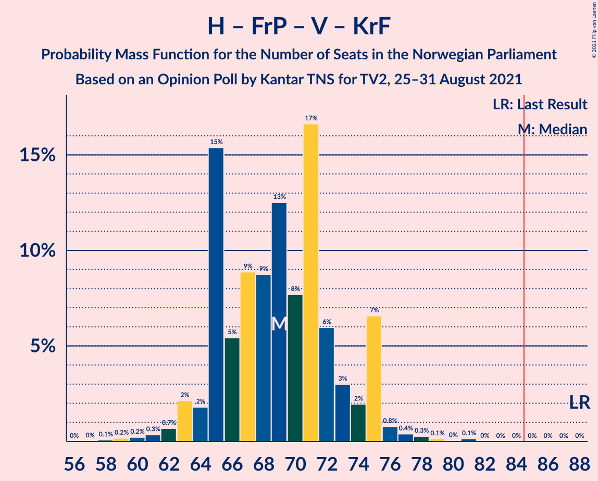

| Number of Seats | Probability | Accumulated | Special Marks |
|:---------------:|:-----------:|:-----------:|:-------------:|
| 58 | 0.1% | 100% |  |
| 59 | 0.2% | 99.9% |  |
| 60 | 0.2% | 99.7% |  |
| 61 | 0.3% | 99.5% |  |
| 62 | 0.7% | 99.1% |  |
| 63 | 2% | 98% |  |
| 64 | 2% | 96% |  |
| 65 | 15% | 95% |  |
| 66 | 5% | 79% |  |
| 67 | 9% | 74% |  |
| 68 | 9% | 65% |  |
| 69 | 13% | 56% |  |
| 70 | 8% | 44% | Median |
| 71 | 17% | 36% |  |
| 72 | 6% | 19% |  |
| 73 | 3% | 13% |  |
| 74 | 2% | 10% |  |
| 75 | 7% | 8% |  |
| 76 | 0.8% | 2% |  |
| 77 | 0.4% | 1.0% |  |
| 78 | 0.3% | 0.6% |  |
| 79 | 0.1% | 0.3% |  |
| 80 | 0% | 0.2% |  |
| 81 | 0.1% | 0.2% |  |
| 82 | 0% | 0% |  |
| 83 | 0% | 0% |  |
| 84 | 0% | 0% |  |
| 85 | 0% | 0% | Majority |
| 86 | 0% | 0% |  |
| 87 | 0% | 0% |  |
| 88 | 0% | 0% | Last Result |

### Arbeiderpartiet – Senterpartiet – Kristelig Folkeparti

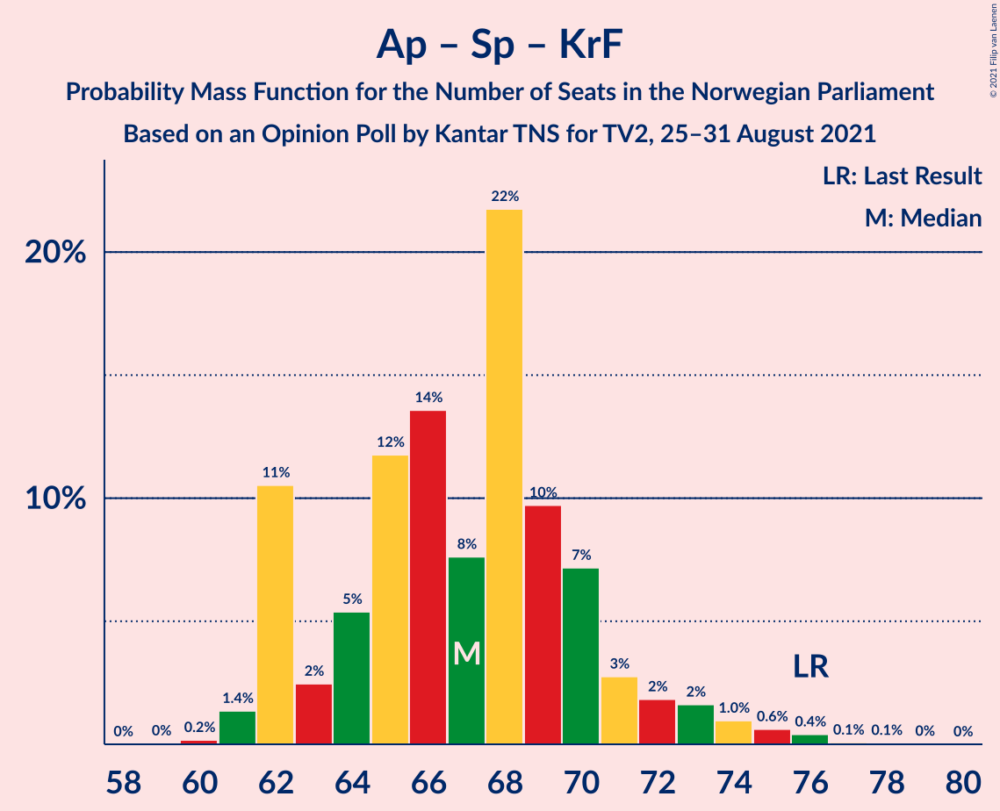

| Number of Seats | Probability | Accumulated | Special Marks |
|:---------------:|:-----------:|:-----------:|:-------------:|
| 59 | 0% | 100% |  |
| 60 | 0.2% | 99.9% |  |
| 61 | 1.4% | 99.8% |  |
| 62 | 11% | 98% |  |
| 63 | 2% | 88% |  |
| 64 | 5% | 85% |  |
| 65 | 12% | 80% |  |
| 66 | 14% | 68% |  |
| 67 | 8% | 55% | Median |
| 68 | 22% | 47% |  |
| 69 | 10% | 25% |  |
| 70 | 7% | 16% |  |
| 71 | 3% | 8% |  |
| 72 | 2% | 6% |  |
| 73 | 2% | 4% |  |
| 74 | 1.0% | 2% |  |
| 75 | 0.6% | 1.2% |  |
| 76 | 0.4% | 0.6% | Last Result |
| 77 | 0.1% | 0.2% |  |
| 78 | 0.1% | 0.1% |  |
| 79 | 0% | 0% |  |

### Høyre – Fremskrittspartiet – Venstre

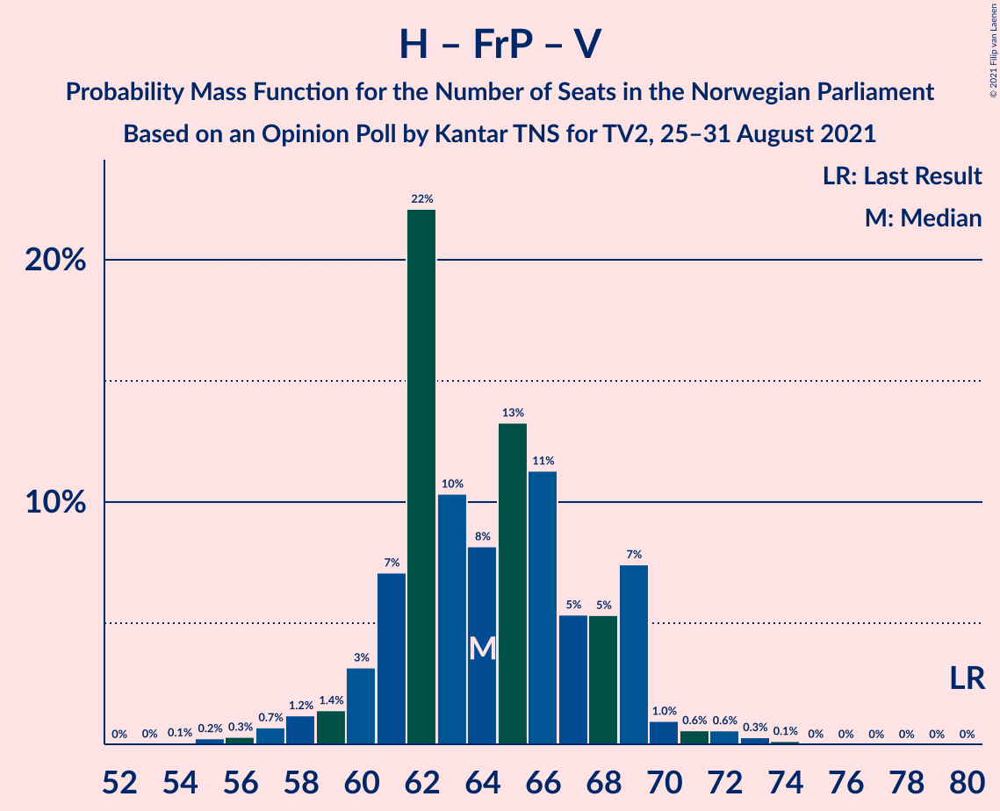

| Number of Seats | Probability | Accumulated | Special Marks |
|:---------------:|:-----------:|:-----------:|:-------------:|
| 54 | 0.1% | 100% |  |
| 55 | 0.2% | 99.9% |  |
| 56 | 0.3% | 99.7% |  |
| 57 | 0.7% | 99.4% |  |
| 58 | 1.2% | 98.7% |  |
| 59 | 1.4% | 97% |  |
| 60 | 3% | 96% |  |
| 61 | 7% | 93% |  |
| 62 | 22% | 86% |  |
| 63 | 10% | 64% |  |
| 64 | 8% | 53% | Median |
| 65 | 13% | 45% |  |
| 66 | 11% | 32% |  |
| 67 | 5% | 21% |  |
| 68 | 5% | 15% |  |
| 69 | 7% | 10% |  |
| 70 | 1.0% | 3% |  |
| 71 | 0.6% | 2% |  |
| 72 | 0.6% | 1.0% |  |
| 73 | 0.3% | 0.4% |  |
| 74 | 0.1% | 0.2% |  |
| 75 | 0% | 0% |  |
| 76 | 0% | 0% |  |
| 77 | 0% | 0% |  |
| 78 | 0% | 0% |  |
| 79 | 0% | 0% |  |
| 80 | 0% | 0% | Last Result |

### Arbeiderpartiet – Senterpartiet

| Number of Seats | Probability | Accumulated | Special Marks |
|:---------------:|:-----------:|:-----------:|:-------------:|
| 56 | 0.1% | 100% |  |
| 57 | 0.3% | 99.9% |  |
| 58 | 2% | 99.6% |  |
| 59 | 19% | 98% |  |
| 60 | 15% | 79% |  |
| 61 | 9% | 64% | Median |
| 62 | 15% | 54% |  |
| 63 | 10% | 39% |  |
| 64 | 6% | 30% |  |
| 65 | 15% | 24% |  |
| 66 | 5% | 9% |  |
| 67 | 2% | 4% |  |
| 68 | 0.7% | 2% | Last Result |
| 69 | 0.7% | 1.4% |  |
| 70 | 0.3% | 0.7% |  |
| 71 | 0.2% | 0.3% |  |
| 72 | 0.1% | 0.1% |  |
| 73 | 0% | 0% |  |

### Arbeiderpartiet – Sosialistisk Venstreparti

| Number of Seats | Probability | Accumulated | Special Marks |
|:---------------:|:-----------:|:-----------:|:-------------:|
| 51 | 0% | 100% |  |
| 52 | 0.1% | 99.9% |  |
| 53 | 1.0% | 99.8% |  |
| 54 | 0.6% | 98.9% |  |
| 55 | 8% | 98% |  |
| 56 | 10% | 90% |  |
| 57 | 9% | 81% |  |
| 58 | 15% | 72% |  |
| 59 | 17% | 57% | Median |
| 60 | 24% | 40% | Last Result |
| 61 | 9% | 17% |  |
| 62 | 5% | 8% |  |
| 63 | 1.2% | 3% |  |
| 64 | 0.9% | 2% |  |
| 65 | 0.2% | 0.6% |  |
| 66 | 0.2% | 0.3% |  |
| 67 | 0.1% | 0.1% |  |
| 68 | 0% | 0% |  |

### Høyre – Fremskrittspartiet

| Number of Seats | Probability | Accumulated | Special Marks |
|:---------------:|:-----------:|:-----------:|:-------------:|
| 49 | 0.1% | 100% |  |
| 50 | 0.4% | 99.9% |  |
| 51 | 1.0% | 99.4% |  |
| 52 | 2% | 98% |  |
| 53 | 3% | 96% |  |
| 54 | 18% | 93% |  |
| 55 | 15% | 76% |  |
| 56 | 11% | 61% | Median |
| 57 | 13% | 49% |  |
| 58 | 8% | 36% |  |
| 59 | 8% | 28% |  |
| 60 | 5% | 20% |  |
| 61 | 6% | 14% |  |
| 62 | 6% | 8% |  |
| 63 | 0.8% | 2% |  |
| 64 | 0.9% | 1.4% |  |
| 65 | 0.2% | 0.4% |  |
| 66 | 0.2% | 0.2% |  |
| 67 | 0% | 0.1% |  |
| 68 | 0% | 0% |  |
| 69 | 0% | 0% |  |
| 70 | 0% | 0% |  |
| 71 | 0% | 0% |  |
| 72 | 0% | 0% | Last Result |

### Høyre – Venstre – Kristelig Folkeparti

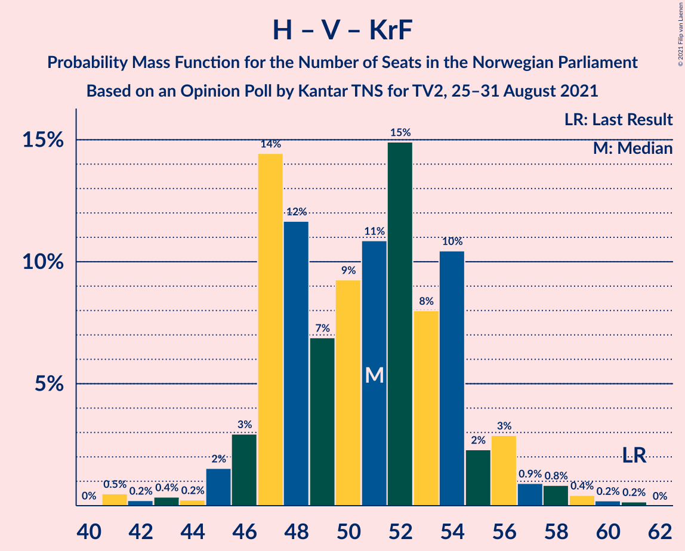

| Number of Seats | Probability | Accumulated | Special Marks |
|:---------------:|:-----------:|:-----------:|:-------------:|
| 41 | 0.5% | 100% |  |
| 42 | 0.2% | 99.5% |  |
| 43 | 0.4% | 99.3% |  |
| 44 | 0.2% | 98.9% |  |
| 45 | 2% | 98.7% |  |
| 46 | 3% | 97% |  |
| 47 | 14% | 94% |  |
| 48 | 12% | 80% |  |
| 49 | 7% | 68% |  |
| 50 | 9% | 61% |  |
| 51 | 11% | 52% |  |
| 52 | 15% | 41% | Median |
| 53 | 8% | 26% |  |
| 54 | 10% | 18% |  |
| 55 | 2% | 8% |  |
| 56 | 3% | 5% |  |
| 57 | 0.9% | 3% |  |
| 58 | 0.8% | 2% |  |
| 59 | 0.4% | 0.8% |  |
| 60 | 0.2% | 0.4% |  |
| 61 | 0.2% | 0.2% | Last Result |
| 62 | 0% | 0% |  |

### Senterpartiet – Venstre – Kristelig Folkeparti

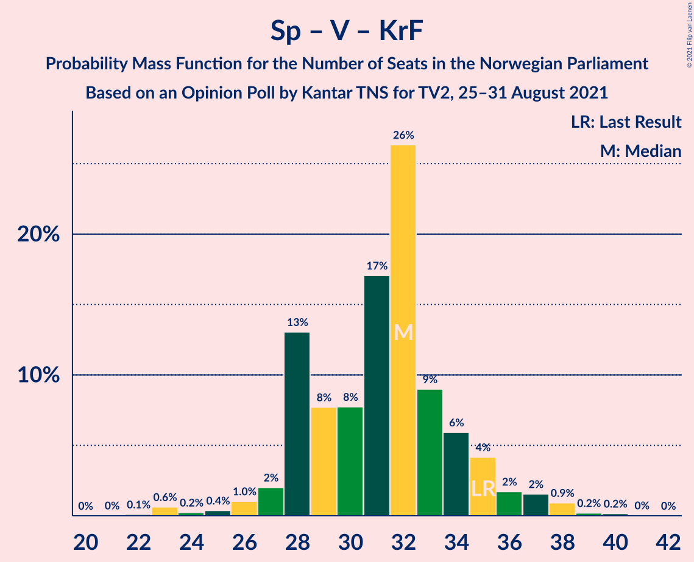

| Number of Seats | Probability | Accumulated | Special Marks |
|:---------------:|:-----------:|:-----------:|:-------------:|
| 22 | 0.1% | 100% |  |
| 23 | 0.6% | 99.9% |  |
| 24 | 0.2% | 99.2% |  |
| 25 | 0.4% | 99.0% |  |
| 26 | 1.0% | 98.6% |  |
| 27 | 2% | 98% |  |
| 28 | 13% | 96% |  |
| 29 | 8% | 83% |  |
| 30 | 8% | 75% |  |
| 31 | 17% | 67% |  |
| 32 | 26% | 50% | Median |
| 33 | 9% | 24% |  |
| 34 | 6% | 15% |  |
| 35 | 4% | 9% | Last Result |
| 36 | 2% | 5% |  |
| 37 | 2% | 3% |  |
| 38 | 0.9% | 1.3% |  |
| 39 | 0.2% | 0.4% |  |
| 40 | 0.2% | 0.2% |  |
| 41 | 0% | 0% |  |

## Technical Information

### Opinion Poll

+ **Polling firm:** Kantar TNS
+ **Commissioner(s):** TV2
+ **Fieldwork period:** 25–31 August 2021

### Calculations

+ **Sample size:** 1200
+ **Simulations done:** 1,048,576
+ **Error estimate:** 1.28%

