# Opinion Poll by Kantar TNS for TV2, 25 August–3 September 2021

<a href="#voting-intentions">Voting Intentions</a> | <a href="#seats">Seats</a> | <a href="#coalitions">Coalitions</a> | <a href="#technical-information">Technical Information</a>

## Voting Intentions

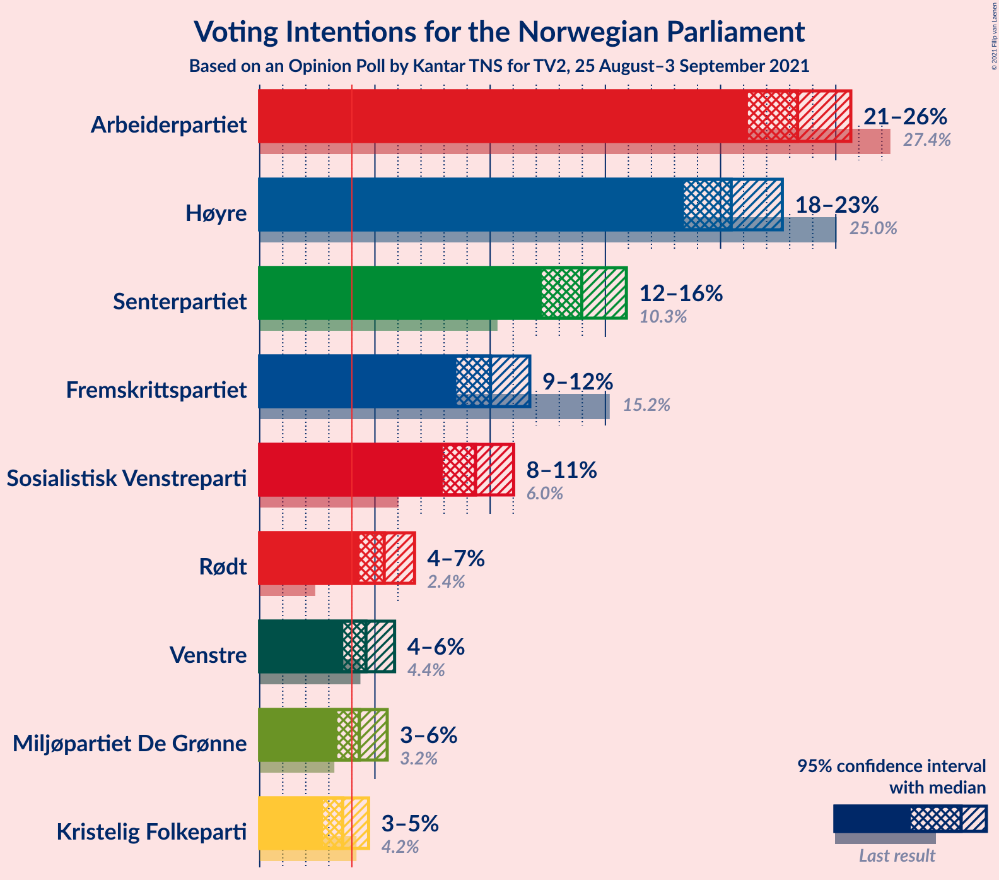

### Confidence Intervals

| Party | Last Result | Poll Result | 80% Confidence Interval | 90% Confidence Interval | 95% Confidence Interval | 99% Confidence Interval |
|:-----:|:-----------:|:-----------:|:-----------------------:|:-----------------------:|:-----------------------:|:-----------------------:|
| Arbeiderpartiet | 27.4% | 23.3% | 21.9–24.8% |21.5–25.3% |21.2–25.7% |20.5–26.4% |
| Høyre | 25.0% | 20.5% | 19.1–21.9% |18.7–22.3% |18.4–22.7% |17.8–23.4% |
| Senterpartiet | 10.3% | 14.0% | 12.8–15.2% |12.5–15.6% |12.2–15.9% |11.7–16.5% |
| Fremskrittspartiet | 15.2% | 10.0% | 9.0–11.1% |8.8–11.4% |8.5–11.7% |8.1–12.3% |
| Sosialistisk Venstreparti | 6.0% | 9.4% | 8.4–10.4% |8.2–10.7% |7.9–11.0% |7.5–11.6% |
| Rødt | 2.4% | 5.4% | 4.7–6.3% |4.5–6.5% |4.3–6.7% |4.0–7.2% |
| Venstre | 4.4% | 4.6% | 4.0–5.4% |3.8–5.7% |3.6–5.9% |3.3–6.3% |
| Miljøpartiet De Grønne | 3.2% | 4.3% | 3.7–5.1% |3.5–5.3% |3.4–5.5% |3.1–5.9% |
| Kristelig Folkeparti | 4.2% | 3.6% | 3.0–4.3% |2.9–4.5% |2.7–4.7% |2.5–5.1% |

*Note:* The poll result column reflects the actual value used in the calculations. Published results may vary slightly, and in addition be rounded to fewer digits.

## Seats

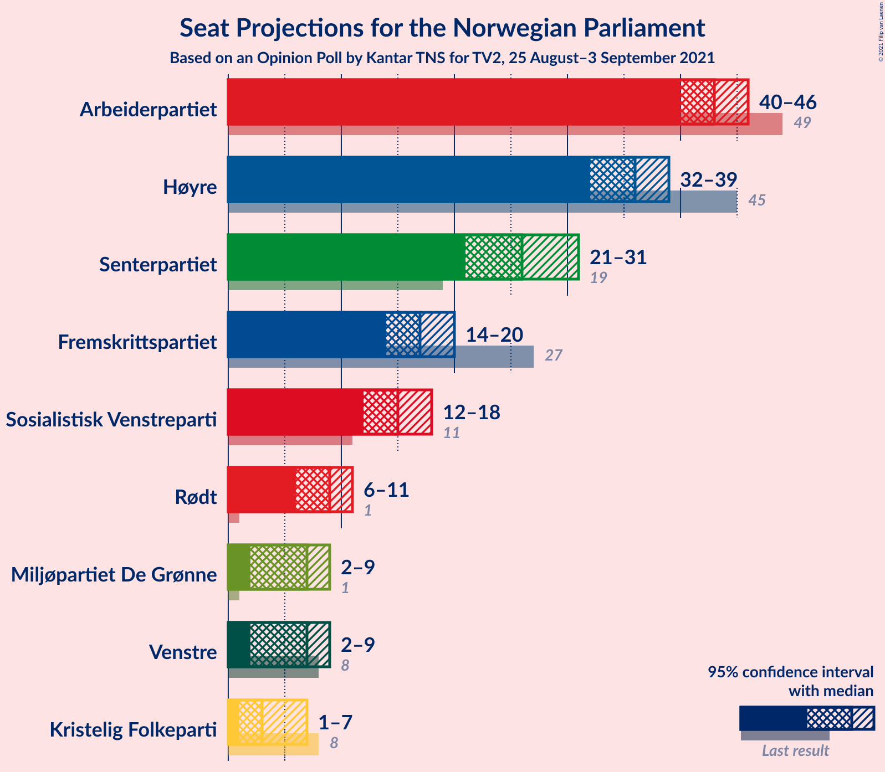

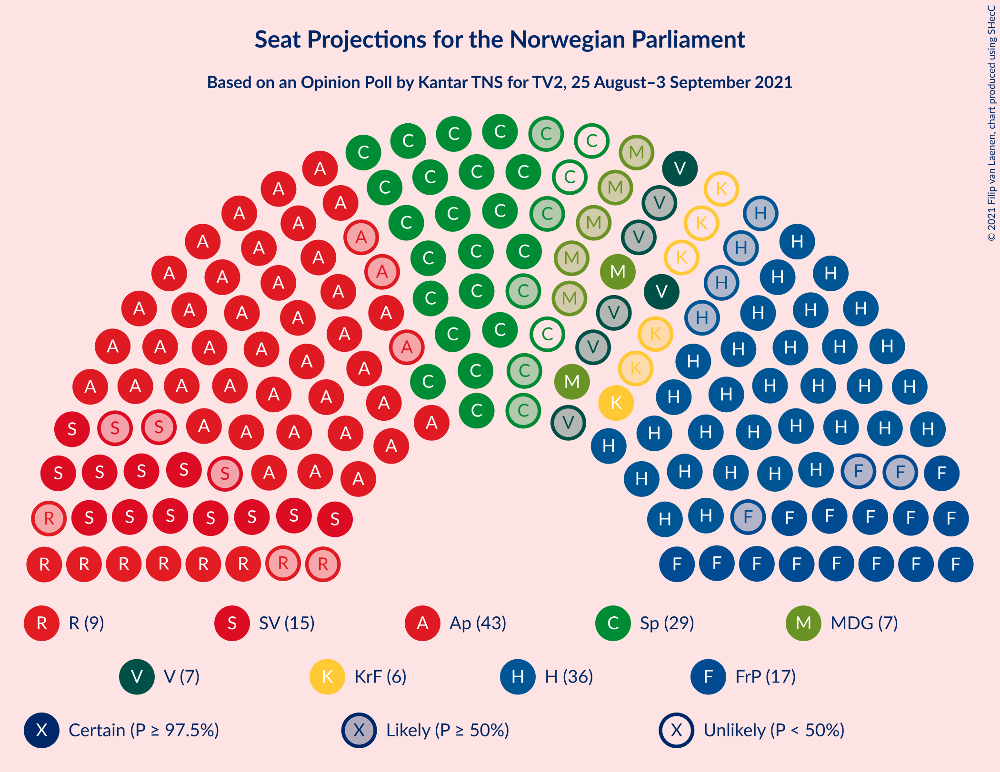

### Confidence Intervals

| Party | Last Result | Median | 80% Confidence Interval | 90% Confidence Interval | 95% Confidence Interval | 99% Confidence Interval |
|:-----:|:-----------:|:------:|:-----------------------:|:-----------------------:|:-----------------------:|:-----------------------:|
| <a href="#arbeiderpartiet">Arbeiderpartiet</a> | 49 | 43 | 41–45 |40–45 |40–46 |39–48 |
| <a href="#høyre">Høyre</a> | 45 | 36 | 34–37 |34–38 |32–39 |32–41 |
| <a href="#senterpartiet">Senterpartiet</a> | 19 | 26 | 23–29 |22–30 |21–31 |20–32 |
| <a href="#fremskrittspartiet">Fremskrittspartiet</a> | 27 | 17 | 15–19 |15–19 |14–20 |13–22 |
| <a href="#sosialistisk-venstreparti">Sosialistisk Venstreparti</a> | 11 | 15 | 14–17 |12–18 |12–18 |11–20 |
| <a href="#rødt">Rødt</a> | 1 | 9 | 7–10 |7–11 |6–11 |2–12 |
| <a href="#venstre">Venstre</a> | 8 | 7 | 6–9 |6–9 |2–9 |2–10 |
| <a href="#miljøpartiet-de-grønne">Miljøpartiet De Grønne</a> | 1 | 7 | 2–8 |2–8 |2–9 |1–9 |
| <a href="#kristelig-folkeparti">Kristelig Folkeparti</a> | 8 | 3 | 2–7 |1–7 |1–7 |1–8 |

### Arbeiderpartiet

*For a full overview of the results for this party, see the [Arbeiderpartiet](party-arbeiderpartiet.html) page.*

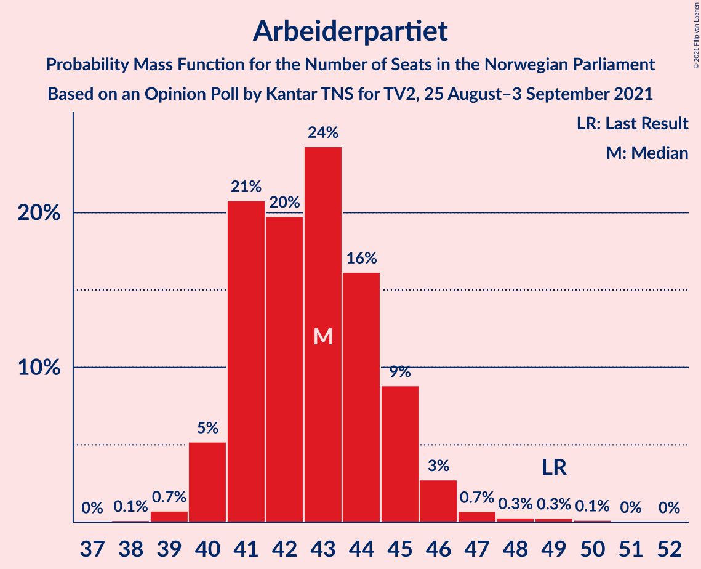

| Number of Seats | Probability | Accumulated | Special Marks |
|:---------------:|:-----------:|:-----------:|:-------------:|
| 38 | 0.1% | 100% |  |
| 39 | 0.7% | 99.9% |  |
| 40 | 5% | 99.1% |  |
| 41 | 21% | 94% |  |
| 42 | 20% | 73% |  |
| 43 | 24% | 53% | Median |
| 44 | 16% | 29% |  |
| 45 | 9% | 13% |  |
| 46 | 3% | 4% |  |
| 47 | 0.7% | 1.4% |  |
| 48 | 0.3% | 0.7% |  |
| 49 | 0.3% | 0.5% | Last Result |
| 50 | 0.1% | 0.2% |  |
| 51 | 0% | 0.1% |  |
| 52 | 0% | 0% |  |

### Høyre

*For a full overview of the results for this party, see the [Høyre](party-høyre.html) page.*

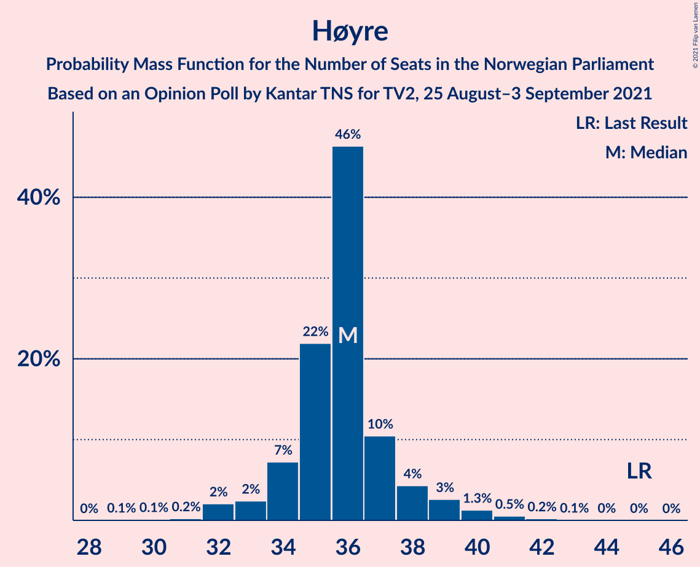

| Number of Seats | Probability | Accumulated | Special Marks |
|:---------------:|:-----------:|:-----------:|:-------------:|
| 29 | 0.1% | 100% |  |
| 30 | 0.1% | 99.9% |  |
| 31 | 0.2% | 99.8% |  |
| 32 | 2% | 99.6% |  |
| 33 | 2% | 97% |  |
| 34 | 7% | 95% |  |
| 35 | 22% | 88% |  |
| 36 | 46% | 66% | Median |
| 37 | 10% | 20% |  |
| 38 | 4% | 9% |  |
| 39 | 3% | 5% |  |
| 40 | 1.3% | 2% |  |
| 41 | 0.5% | 0.9% |  |
| 42 | 0.2% | 0.4% |  |
| 43 | 0.1% | 0.2% |  |
| 44 | 0% | 0.1% |  |
| 45 | 0% | 0% | Last Result |

### Senterpartiet

*For a full overview of the results for this party, see the [Senterpartiet](party-senterpartiet.html) page.*

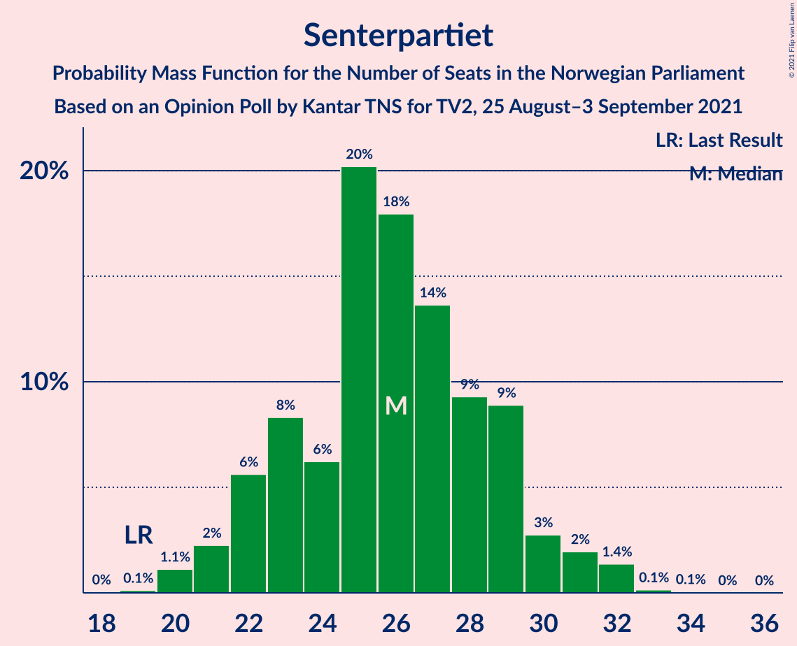

| Number of Seats | Probability | Accumulated | Special Marks |
|:---------------:|:-----------:|:-----------:|:-------------:|
| 19 | 0.1% | 100% | Last Result |
| 20 | 1.1% | 99.8% |  |
| 21 | 2% | 98.7% |  |
| 22 | 6% | 96% |  |
| 23 | 8% | 91% |  |
| 24 | 6% | 83% |  |
| 25 | 20% | 76% |  |
| 26 | 18% | 56% | Median |
| 27 | 14% | 38% |  |
| 28 | 9% | 24% |  |
| 29 | 9% | 15% |  |
| 30 | 3% | 6% |  |
| 31 | 2% | 4% |  |
| 32 | 1.4% | 2% |  |
| 33 | 0.1% | 0.2% |  |
| 34 | 0.1% | 0.1% |  |
| 35 | 0% | 0% |  |

### Fremskrittspartiet

*For a full overview of the results for this party, see the [Fremskrittspartiet](party-fremskrittspartiet.html) page.*

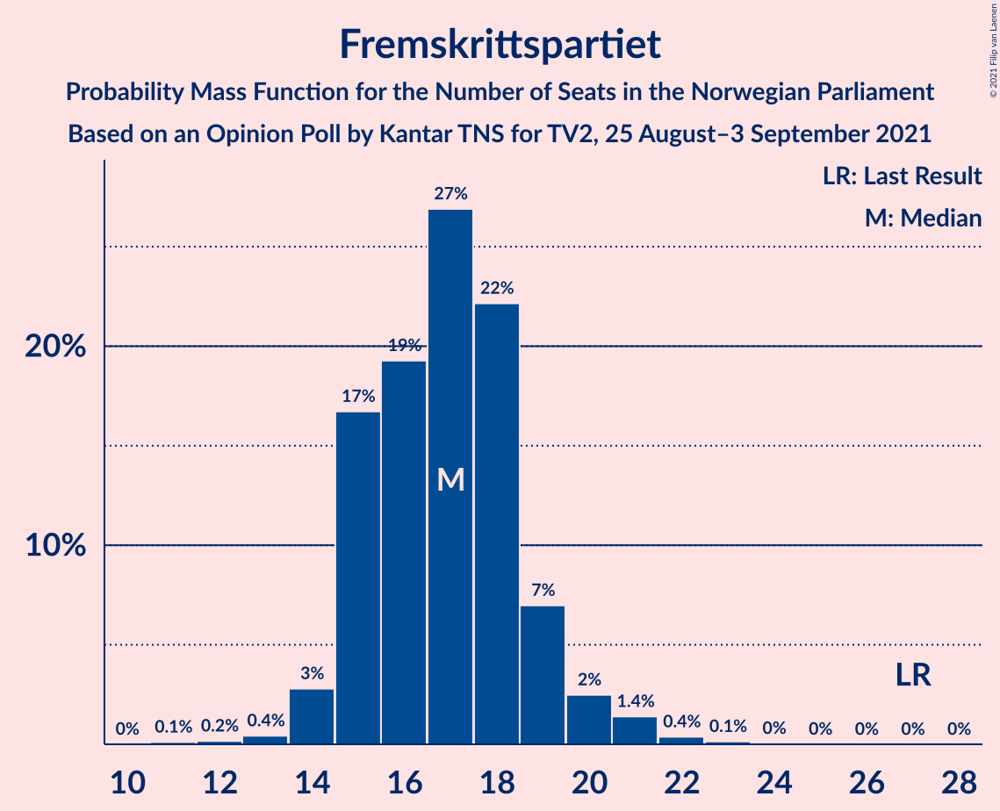

| Number of Seats | Probability | Accumulated | Special Marks |
|:---------------:|:-----------:|:-----------:|:-------------:|
| 11 | 0.1% | 100% |  |
| 12 | 0.2% | 99.9% |  |
| 13 | 0.4% | 99.7% |  |
| 14 | 3% | 99.3% |  |
| 15 | 17% | 96% |  |
| 16 | 19% | 80% |  |
| 17 | 27% | 60% | Median |
| 18 | 22% | 34% |  |
| 19 | 7% | 11% |  |
| 20 | 2% | 4% |  |
| 21 | 1.4% | 2% |  |
| 22 | 0.4% | 0.6% |  |
| 23 | 0.1% | 0.2% |  |
| 24 | 0% | 0.1% |  |
| 25 | 0% | 0% |  |
| 26 | 0% | 0% |  |
| 27 | 0% | 0% | Last Result |

### Sosialistisk Venstreparti

*For a full overview of the results for this party, see the [Sosialistisk Venstreparti](party-sosialistiskvenstreparti.html) page.*

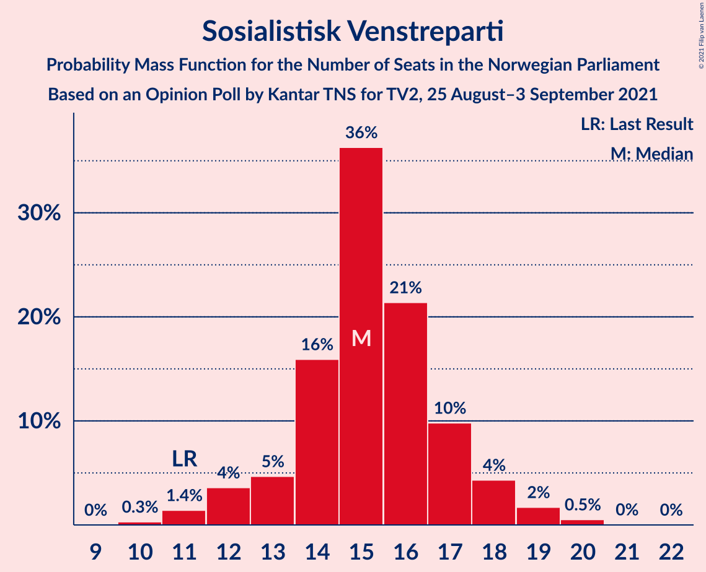

| Number of Seats | Probability | Accumulated | Special Marks |
|:---------------:|:-----------:|:-----------:|:-------------:|
| 10 | 0.3% | 100% |  |
| 11 | 1.4% | 99.7% | Last Result |
| 12 | 4% | 98% |  |
| 13 | 5% | 95% |  |
| 14 | 16% | 90% |  |
| 15 | 36% | 74% | Median |
| 16 | 21% | 38% |  |
| 17 | 10% | 16% |  |
| 18 | 4% | 7% |  |
| 19 | 2% | 2% |  |
| 20 | 0.5% | 0.6% |  |
| 21 | 0% | 0.1% |  |
| 22 | 0% | 0% |  |

### Rødt

*For a full overview of the results for this party, see the [Rødt](party-rødt.html) page.*

| Number of Seats | Probability | Accumulated | Special Marks |
|:---------------:|:-----------:|:-----------:|:-------------:|
| 1 | 0% | 100% | Last Result |
| 2 | 0.5% | 100% |  |
| 3 | 0% | 99.5% |  |
| 4 | 0% | 99.5% |  |
| 5 | 0% | 99.5% |  |
| 6 | 2% | 99.5% |  |
| 7 | 15% | 97% |  |
| 8 | 32% | 82% |  |
| 9 | 31% | 50% | Median |
| 10 | 13% | 19% |  |
| 11 | 4% | 5% |  |
| 12 | 0.8% | 0.9% |  |
| 13 | 0.1% | 0.1% |  |
| 14 | 0% | 0% |  |

### Venstre

*For a full overview of the results for this party, see the [Venstre](party-venstre.html) page.*

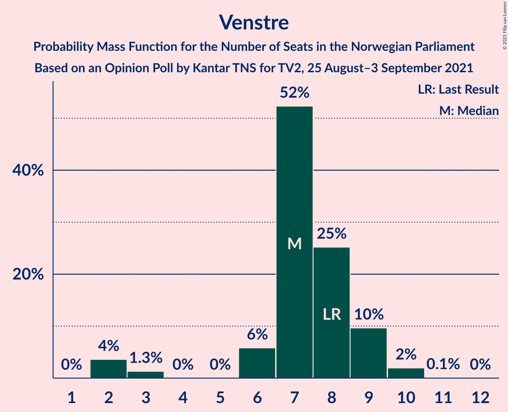

| Number of Seats | Probability | Accumulated | Special Marks |
|:---------------:|:-----------:|:-----------:|:-------------:|
| 2 | 4% | 100% |  |
| 3 | 1.3% | 96% |  |
| 4 | 0% | 95% |  |
| 5 | 0% | 95% |  |
| 6 | 6% | 95% |  |
| 7 | 52% | 89% | Median |
| 8 | 25% | 37% | Last Result |
| 9 | 10% | 12% |  |
| 10 | 2% | 2% |  |
| 11 | 0.1% | 0.1% |  |
| 12 | 0% | 0% |  |

### Miljøpartiet De Grønne

*For a full overview of the results for this party, see the [Miljøpartiet De Grønne](party-miljøpartietdegrønne.html) page.*

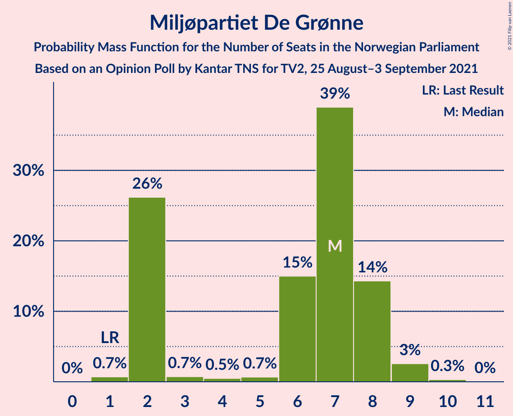

| Number of Seats | Probability | Accumulated | Special Marks |
|:---------------:|:-----------:|:-----------:|:-------------:|
| 1 | 0.7% | 100% | Last Result |
| 2 | 26% | 99.3% |  |
| 3 | 0.7% | 73% |  |
| 4 | 0.5% | 72% |  |
| 5 | 0.7% | 72% |  |
| 6 | 15% | 71% |  |
| 7 | 39% | 56% | Median |
| 8 | 14% | 17% |  |
| 9 | 3% | 3% |  |
| 10 | 0.3% | 0.3% |  |
| 11 | 0% | 0% |  |

### Kristelig Folkeparti

*For a full overview of the results for this party, see the [Kristelig Folkeparti](party-kristeligfolkeparti.html) page.*

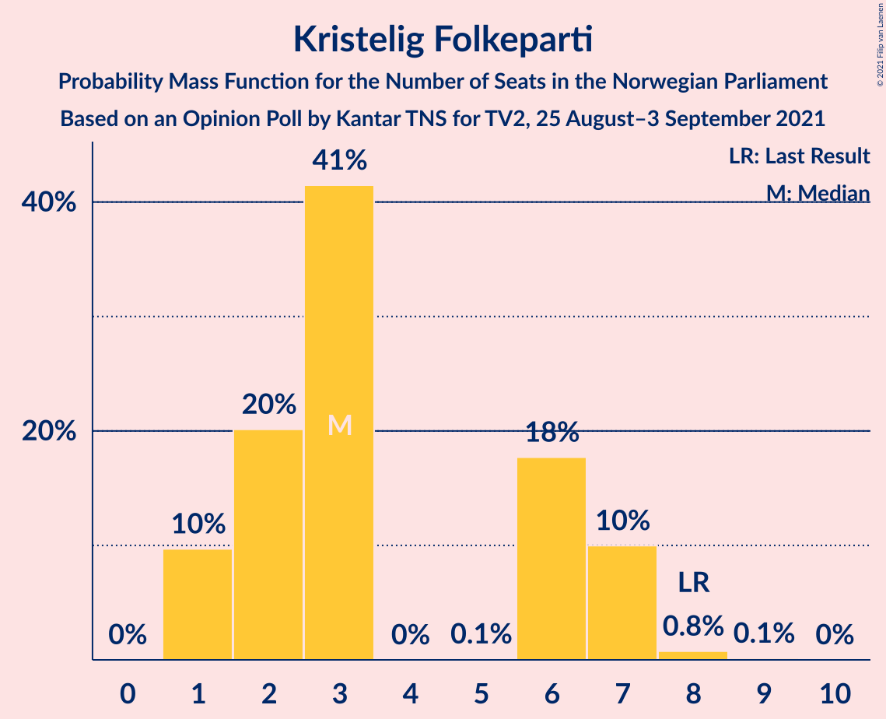

| Number of Seats | Probability | Accumulated | Special Marks |
|:---------------:|:-----------:|:-----------:|:-------------:|
| 1 | 10% | 100% |  |
| 2 | 20% | 90% |  |
| 3 | 41% | 70% | Median |
| 4 | 0% | 29% |  |
| 5 | 0.1% | 29% |  |
| 6 | 18% | 29% |  |
| 7 | 10% | 11% |  |
| 8 | 0.8% | 0.9% | Last Result |
| 9 | 0.1% | 0.1% |  |
| 10 | 0% | 0% |  |

## Coalitions

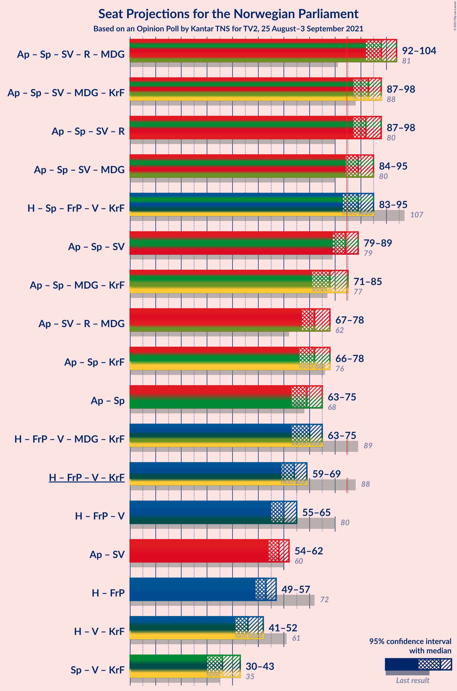

### Confidence Intervals

| Coalition | Last Result | Median | Majority? | 80% Confidence Interval | 90% Confidence Interval | 95% Confidence Interval | 99% Confidence Interval |
|:---------:|:-----------:|:------:|:---------:|:-----------------------:|:-----------------------:|:-----------------------:|:-----------------------:|
| Arbeiderpartiet – Senterpartiet – Sosialistisk Venstreparti – Rødt – Miljøpartiet De Grønne | 81 | 98 | 100% | 94–102 | 94–103 | 92–104 | 91–106 |
| Arbeiderpartiet – Senterpartiet – Sosialistisk Venstreparti – Miljøpartiet De Grønne – Kristelig Folkeparti | 88 | 93 | 99.5% | 90–97 | 88–98 | 87–98 | 85–101 |
| Arbeiderpartiet – Senterpartiet – Sosialistisk Venstreparti – Rødt | 80 | 92 | 99.7% | 89–96 | 88–97 | 87–98 | 85–100 |
| Arbeiderpartiet – Senterpartiet – Sosialistisk Venstreparti – Miljøpartiet De Grønne | 80 | 89 | 97% | 86–93 | 85–94 | 84–95 | 82–97 |
| Høyre – Senterpartiet – Fremskrittspartiet – Venstre – Kristelig Folkeparti | 107 | 89 | 96% | 86–93 | 85–94 | 83–95 | 82–97 |
| Arbeiderpartiet – Senterpartiet – Sosialistisk Venstreparti | 79 | 84 | 41% | 81–87 | 79–88 | 79–89 | 77–91 |
| Arbeiderpartiet – Senterpartiet – Miljøpartiet De Grønne – Kristelig Folkeparti | 77 | 78 | 3% | 73–83 | 72–83 | 71–85 | 69–86 |
| Arbeiderpartiet – Sosialistisk Venstreparti – Rødt – Miljøpartiet De Grønne | 62 | 72 | 0% | 68–75 | 68–77 | 67–78 | 65–80 |
| Arbeiderpartiet – Senterpartiet – Kristelig Folkeparti | 76 | 72 | 0% | 68–76 | 67–78 | 66–78 | 64–80 |
| Arbeiderpartiet – Senterpartiet | 68 | 69 | 0% | 65–72 | 64–73 | 63–75 | 62–76 |
| Høyre – Fremskrittspartiet – Venstre – Miljøpartiet De Grønne – Kristelig Folkeparti | 89 | 70 | 0% | 65–73 | 64–74 | 63–75 | 61–78 |
| Høyre – Fremskrittspartiet – Venstre – Kristelig Folkeparti | 88 | 64 | 0% | 60–68 | 59–68 | 59–69 | 56–72 |
| Høyre – Fremskrittspartiet – Venstre | 80 | 60 | 0% | 57–63 | 56–64 | 55–65 | 53–68 |
| Arbeiderpartiet – Sosialistisk Venstreparti | 60 | 58 | 0% | 56–61 | 55–61 | 54–62 | 53–64 |
| Høyre – Fremskrittspartiet | 72 | 53 | 0% | 50–55 | 50–56 | 49–57 | 47–60 |
| Høyre – Venstre – Kristelig Folkeparti | 61 | 46 | 0% | 44–50 | 42–51 | 41–52 | 40–53 |
| Senterpartiet – Venstre – Kristelig Folkeparti | 35 | 36 | 0% | 33–40 | 32–42 | 30–43 | 28–44 |

### Arbeiderpartiet – Senterpartiet – Sosialistisk Venstreparti – Rødt – Miljøpartiet De Grønne

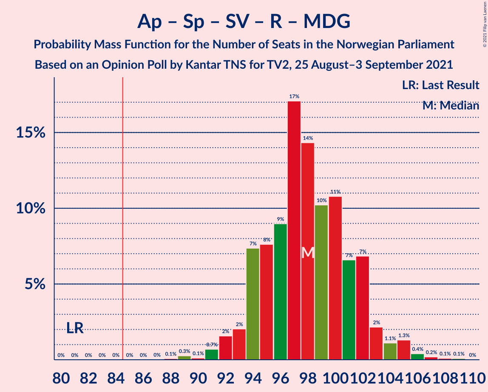

| Number of Seats | Probability | Accumulated | Special Marks |
|:---------------:|:-----------:|:-----------:|:-------------:|
| 81 | 0% | 100% | Last Result |
| 82 | 0% | 100% |  |
| 83 | 0% | 100% |  |
| 84 | 0% | 100% |  |
| 85 | 0% | 100% | Majority |
| 86 | 0% | 100% |  |
| 87 | 0% | 100% |  |
| 88 | 0.1% | 100% |  |
| 89 | 0.3% | 99.9% |  |
| 90 | 0.1% | 99.6% |  |
| 91 | 0.7% | 99.5% |  |
| 92 | 2% | 98.8% |  |
| 93 | 2% | 97% |  |
| 94 | 7% | 95% |  |
| 95 | 8% | 88% |  |
| 96 | 9% | 80% |  |
| 97 | 17% | 71% |  |
| 98 | 14% | 54% |  |
| 99 | 10% | 40% |  |
| 100 | 11% | 30% | Median |
| 101 | 7% | 19% |  |
| 102 | 7% | 12% |  |
| 103 | 2% | 5% |  |
| 104 | 1.1% | 3% |  |
| 105 | 1.3% | 2% |  |
| 106 | 0.4% | 0.8% |  |
| 107 | 0.2% | 0.4% |  |
| 108 | 0.1% | 0.2% |  |
| 109 | 0.1% | 0.1% |  |
| 110 | 0% | 0% |  |

### Arbeiderpartiet – Senterpartiet – Sosialistisk Venstreparti – Miljøpartiet De Grønne – Kristelig Folkeparti

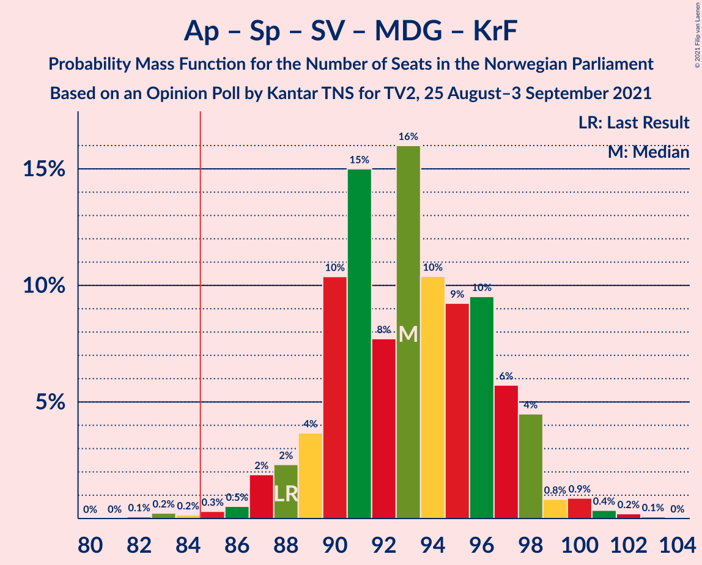

| Number of Seats | Probability | Accumulated | Special Marks |
|:---------------:|:-----------:|:-----------:|:-------------:|
| 82 | 0.1% | 100% |  |
| 83 | 0.2% | 99.9% |  |
| 84 | 0.2% | 99.7% |  |
| 85 | 0.3% | 99.5% | Majority |
| 86 | 0.5% | 99.2% |  |
| 87 | 2% | 98.7% |  |
| 88 | 2% | 97% | Last Result |
| 89 | 4% | 94% |  |
| 90 | 10% | 91% |  |
| 91 | 15% | 80% |  |
| 92 | 8% | 65% |  |
| 93 | 16% | 58% |  |
| 94 | 10% | 42% | Median |
| 95 | 9% | 31% |  |
| 96 | 10% | 22% |  |
| 97 | 6% | 13% |  |
| 98 | 4% | 7% |  |
| 99 | 0.8% | 2% |  |
| 100 | 0.9% | 2% |  |
| 101 | 0.4% | 0.7% |  |
| 102 | 0.2% | 0.3% |  |
| 103 | 0.1% | 0.1% |  |
| 104 | 0% | 0% |  |

### Arbeiderpartiet – Senterpartiet – Sosialistisk Venstreparti – Rødt

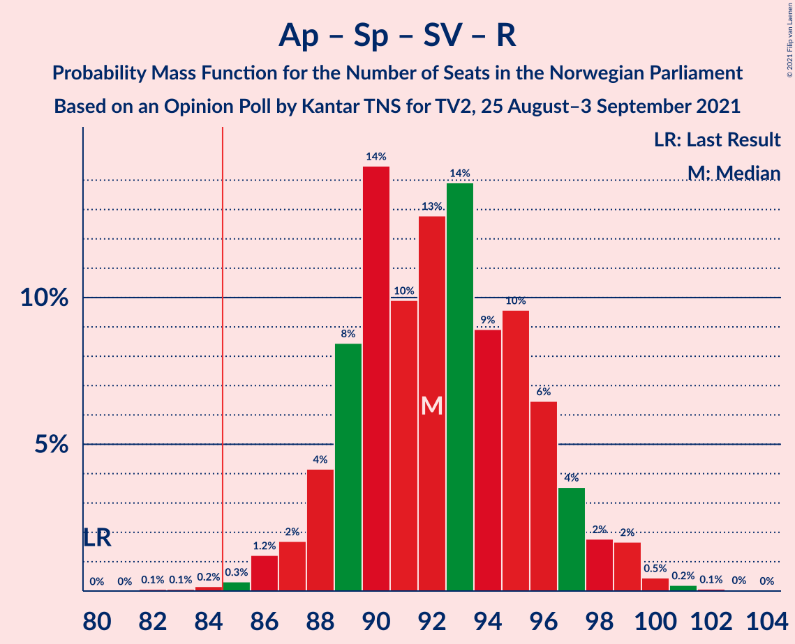

| Number of Seats | Probability | Accumulated | Special Marks |
|:---------------:|:-----------:|:-----------:|:-------------:|
| 80 | 0% | 100% | Last Result |
| 81 | 0% | 100% |  |
| 82 | 0.1% | 100% |  |
| 83 | 0.1% | 99.9% |  |
| 84 | 0.2% | 99.9% |  |
| 85 | 0.3% | 99.7% | Majority |
| 86 | 1.2% | 99.4% |  |
| 87 | 2% | 98% |  |
| 88 | 4% | 96% |  |
| 89 | 8% | 92% |  |
| 90 | 14% | 84% |  |
| 91 | 10% | 69% |  |
| 92 | 13% | 59% |  |
| 93 | 14% | 47% | Median |
| 94 | 9% | 33% |  |
| 95 | 10% | 24% |  |
| 96 | 6% | 14% |  |
| 97 | 4% | 8% |  |
| 98 | 2% | 4% |  |
| 99 | 2% | 2% |  |
| 100 | 0.5% | 0.8% |  |
| 101 | 0.2% | 0.3% |  |
| 102 | 0.1% | 0.1% |  |
| 103 | 0% | 0.1% |  |
| 104 | 0% | 0% |  |

### Arbeiderpartiet – Senterpartiet – Sosialistisk Venstreparti – Miljøpartiet De Grønne

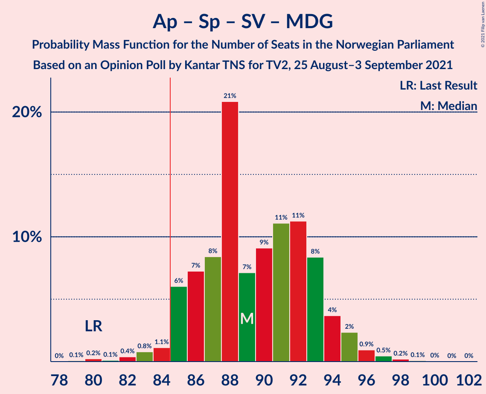

| Number of Seats | Probability | Accumulated | Special Marks |
|:---------------:|:-----------:|:-----------:|:-------------:|
| 79 | 0.1% | 100% |  |
| 80 | 0.2% | 99.9% | Last Result |
| 81 | 0.1% | 99.7% |  |
| 82 | 0.4% | 99.6% |  |
| 83 | 0.8% | 99.2% |  |
| 84 | 1.1% | 98% |  |
| 85 | 6% | 97% | Majority |
| 86 | 7% | 91% |  |
| 87 | 8% | 84% |  |
| 88 | 21% | 76% |  |
| 89 | 7% | 55% |  |
| 90 | 9% | 48% |  |
| 91 | 11% | 39% | Median |
| 92 | 11% | 27% |  |
| 93 | 8% | 16% |  |
| 94 | 4% | 8% |  |
| 95 | 2% | 4% |  |
| 96 | 0.9% | 2% |  |
| 97 | 0.5% | 0.8% |  |
| 98 | 0.2% | 0.3% |  |
| 99 | 0.1% | 0.1% |  |
| 100 | 0% | 0.1% |  |
| 101 | 0% | 0% |  |

### Høyre – Senterpartiet – Fremskrittspartiet – Venstre – Kristelig Folkeparti

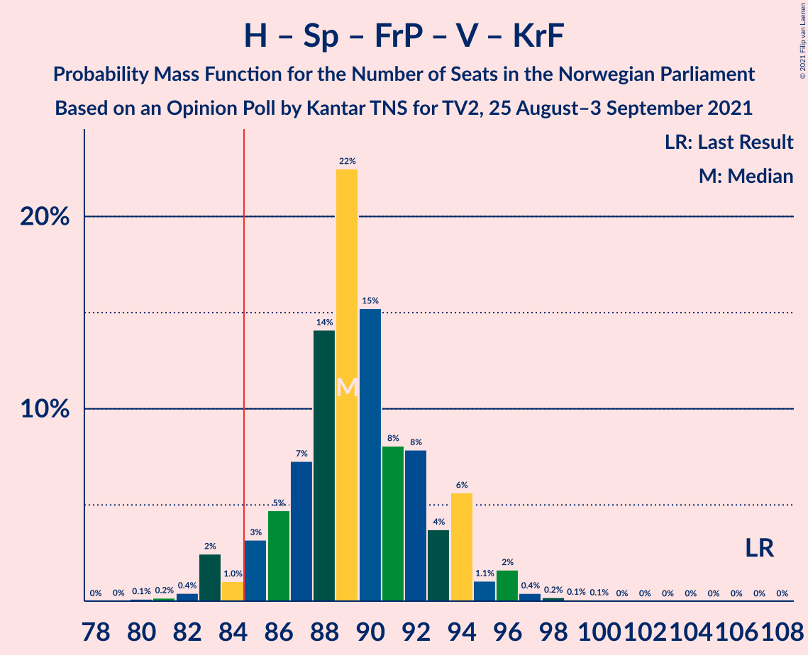

| Number of Seats | Probability | Accumulated | Special Marks |
|:---------------:|:-----------:|:-----------:|:-------------:|
| 79 | 0% | 100% |  |
| 80 | 0.1% | 99.9% |  |
| 81 | 0.2% | 99.8% |  |
| 82 | 0.4% | 99.7% |  |
| 83 | 2% | 99.2% |  |
| 84 | 1.0% | 97% |  |
| 85 | 3% | 96% | Majority |
| 86 | 5% | 93% |  |
| 87 | 7% | 88% |  |
| 88 | 14% | 81% |  |
| 89 | 22% | 66% | Median |
| 90 | 15% | 44% |  |
| 91 | 8% | 29% |  |
| 92 | 8% | 21% |  |
| 93 | 4% | 13% |  |
| 94 | 6% | 9% |  |
| 95 | 1.1% | 3% |  |
| 96 | 2% | 2% |  |
| 97 | 0.4% | 0.8% |  |
| 98 | 0.2% | 0.3% |  |
| 99 | 0.1% | 0.2% |  |
| 100 | 0.1% | 0.1% |  |
| 101 | 0% | 0% |  |
| 102 | 0% | 0% |  |
| 103 | 0% | 0% |  |
| 104 | 0% | 0% |  |
| 105 | 0% | 0% |  |
| 106 | 0% | 0% |  |
| 107 | 0% | 0% | Last Result |

### Arbeiderpartiet – Senterpartiet – Sosialistisk Venstreparti

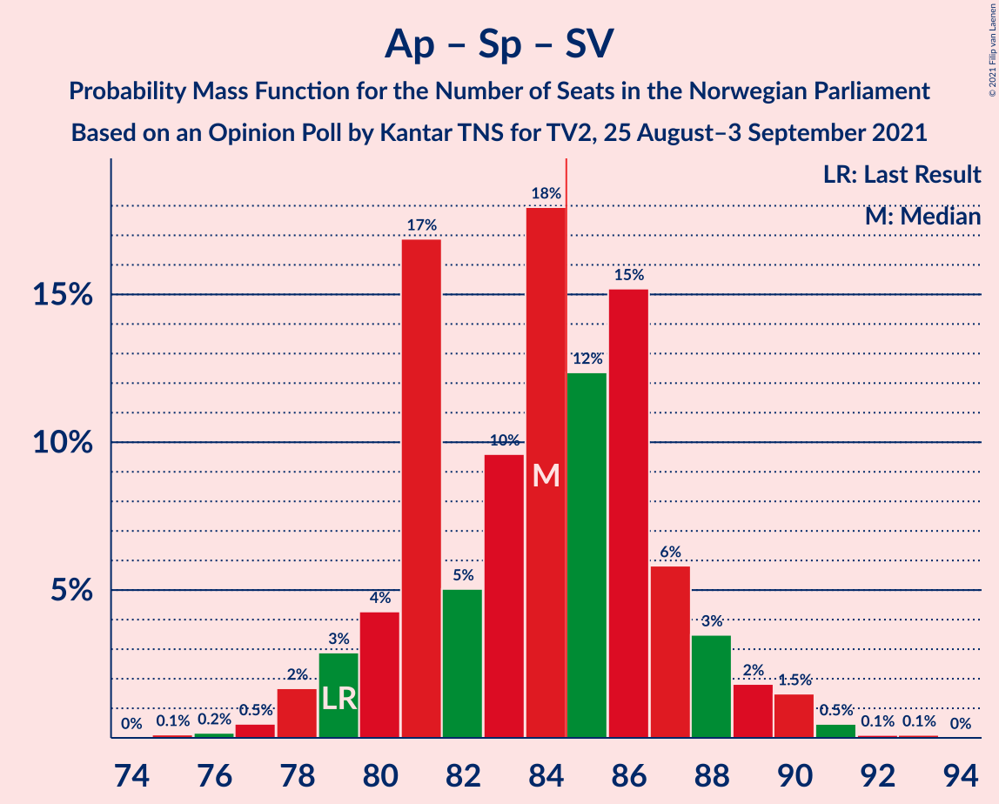

| Number of Seats | Probability | Accumulated | Special Marks |
|:---------------:|:-----------:|:-----------:|:-------------:|
| 75 | 0.1% | 100% |  |
| 76 | 0.2% | 99.9% |  |
| 77 | 0.5% | 99.7% |  |
| 78 | 2% | 99.2% |  |
| 79 | 3% | 98% | Last Result |
| 80 | 4% | 95% |  |
| 81 | 17% | 90% |  |
| 82 | 5% | 73% |  |
| 83 | 10% | 68% |  |
| 84 | 18% | 59% | Median |
| 85 | 12% | 41% | Majority |
| 86 | 15% | 29% |  |
| 87 | 6% | 13% |  |
| 88 | 3% | 8% |  |
| 89 | 2% | 4% |  |
| 90 | 1.5% | 2% |  |
| 91 | 0.5% | 0.7% |  |
| 92 | 0.1% | 0.2% |  |
| 93 | 0.1% | 0.1% |  |
| 94 | 0% | 0% |  |

### Arbeiderpartiet – Senterpartiet – Miljøpartiet De Grønne – Kristelig Folkeparti

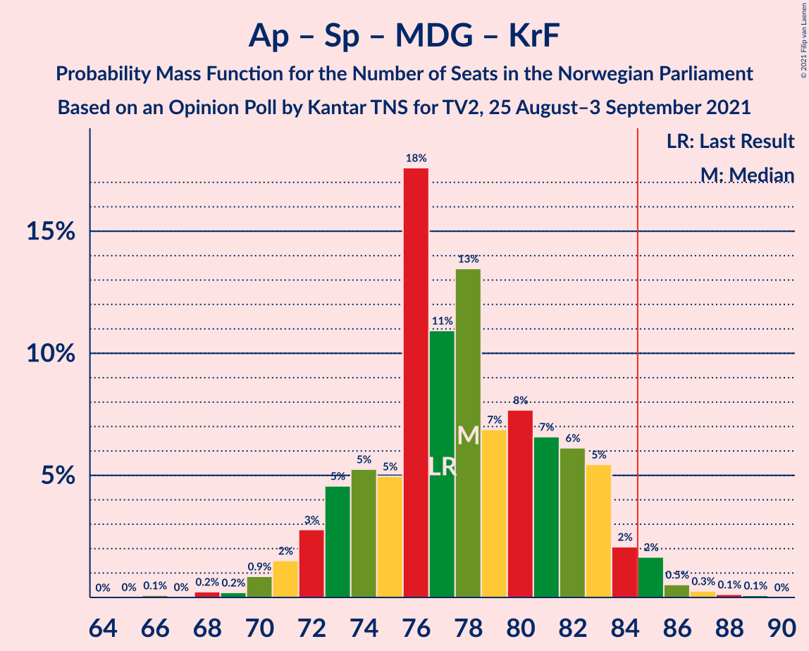

| Number of Seats | Probability | Accumulated | Special Marks |
|:---------------:|:-----------:|:-----------:|:-------------:|
| 66 | 0.1% | 100% |  |
| 67 | 0% | 99.9% |  |
| 68 | 0.2% | 99.9% |  |
| 69 | 0.2% | 99.6% |  |
| 70 | 0.9% | 99.4% |  |
| 71 | 2% | 98.6% |  |
| 72 | 3% | 97% |  |
| 73 | 5% | 94% |  |
| 74 | 5% | 90% |  |
| 75 | 5% | 84% |  |
| 76 | 18% | 79% |  |
| 77 | 11% | 62% | Last Result |
| 78 | 13% | 51% |  |
| 79 | 7% | 37% | Median |
| 80 | 8% | 31% |  |
| 81 | 7% | 23% |  |
| 82 | 6% | 16% |  |
| 83 | 5% | 10% |  |
| 84 | 2% | 5% |  |
| 85 | 2% | 3% | Majority |
| 86 | 0.5% | 1.0% |  |
| 87 | 0.3% | 0.5% |  |
| 88 | 0.1% | 0.2% |  |
| 89 | 0.1% | 0.1% |  |
| 90 | 0% | 0% |  |

### Arbeiderpartiet – Sosialistisk Venstreparti – Rødt – Miljøpartiet De Grønne

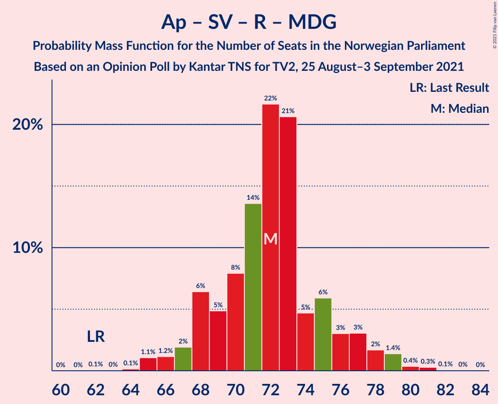

| Number of Seats | Probability | Accumulated | Special Marks |
|:---------------:|:-----------:|:-----------:|:-------------:|
| 62 | 0.1% | 100% | Last Result |
| 63 | 0% | 99.9% |  |
| 64 | 0.1% | 99.9% |  |
| 65 | 1.1% | 99.8% |  |
| 66 | 1.2% | 98.7% |  |
| 67 | 2% | 98% |  |
| 68 | 6% | 96% |  |
| 69 | 5% | 89% |  |
| 70 | 8% | 84% |  |
| 71 | 14% | 76% |  |
| 72 | 22% | 63% |  |
| 73 | 21% | 41% |  |
| 74 | 5% | 21% | Median |
| 75 | 6% | 16% |  |
| 76 | 3% | 10% |  |
| 77 | 3% | 7% |  |
| 78 | 2% | 4% |  |
| 79 | 1.4% | 2% |  |
| 80 | 0.4% | 0.8% |  |
| 81 | 0.3% | 0.4% |  |
| 82 | 0.1% | 0.1% |  |
| 83 | 0% | 0.1% |  |
| 84 | 0% | 0% |  |

### Arbeiderpartiet – Senterpartiet – Kristelig Folkeparti

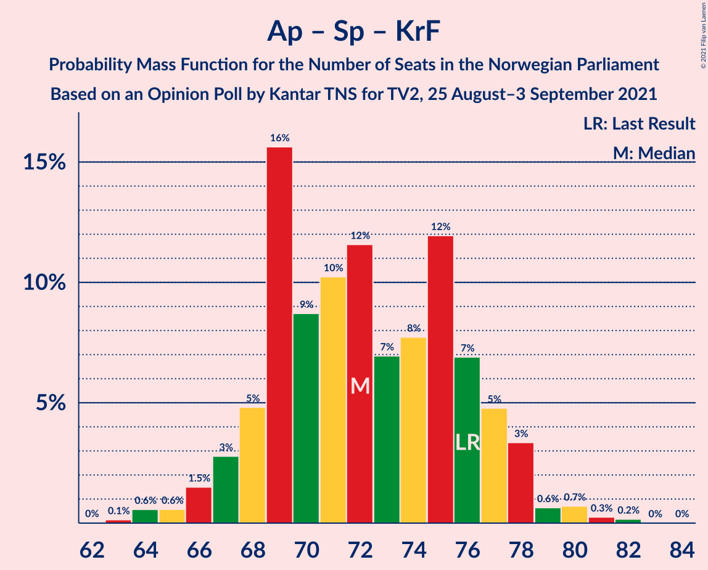

| Number of Seats | Probability | Accumulated | Special Marks |
|:---------------:|:-----------:|:-----------:|:-------------:|
| 63 | 0.1% | 100% |  |
| 64 | 0.6% | 99.8% |  |
| 65 | 0.6% | 99.3% |  |
| 66 | 1.5% | 98.7% |  |
| 67 | 3% | 97% |  |
| 68 | 5% | 94% |  |
| 69 | 16% | 90% |  |
| 70 | 9% | 74% |  |
| 71 | 10% | 65% |  |
| 72 | 12% | 55% | Median |
| 73 | 7% | 43% |  |
| 74 | 8% | 36% |  |
| 75 | 12% | 29% |  |
| 76 | 7% | 17% | Last Result |
| 77 | 5% | 10% |  |
| 78 | 3% | 5% |  |
| 79 | 0.6% | 2% |  |
| 80 | 0.7% | 1.2% |  |
| 81 | 0.3% | 0.5% |  |
| 82 | 0.2% | 0.2% |  |
| 83 | 0% | 0% |  |

### Arbeiderpartiet – Senterpartiet

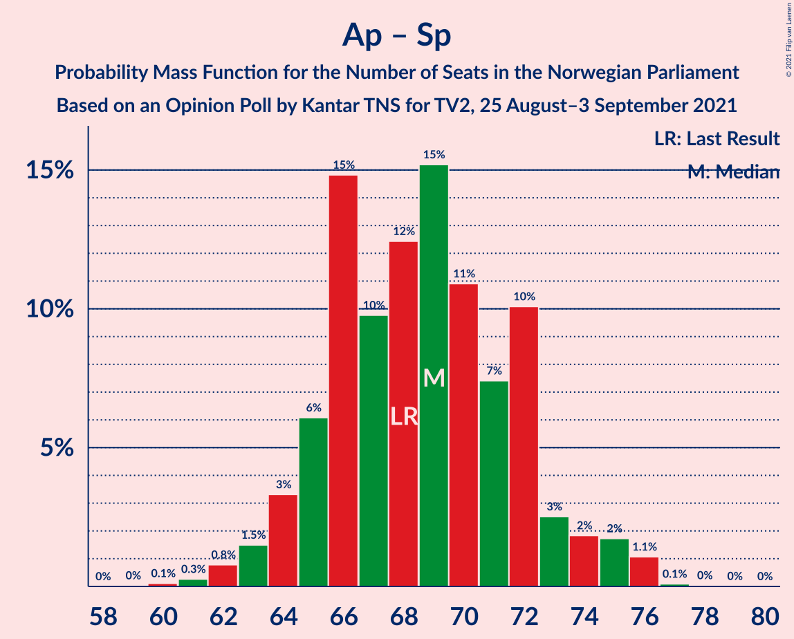

| Number of Seats | Probability | Accumulated | Special Marks |
|:---------------:|:-----------:|:-----------:|:-------------:|
| 60 | 0.1% | 100% |  |
| 61 | 0.3% | 99.9% |  |
| 62 | 0.8% | 99.6% |  |
| 63 | 1.5% | 98.8% |  |
| 64 | 3% | 97% |  |
| 65 | 6% | 94% |  |
| 66 | 15% | 88% |  |
| 67 | 10% | 73% |  |
| 68 | 12% | 63% | Last Result |
| 69 | 15% | 51% | Median |
| 70 | 11% | 36% |  |
| 71 | 7% | 25% |  |
| 72 | 10% | 17% |  |
| 73 | 3% | 7% |  |
| 74 | 2% | 5% |  |
| 75 | 2% | 3% |  |
| 76 | 1.1% | 1.2% |  |
| 77 | 0.1% | 0.1% |  |
| 78 | 0% | 0.1% |  |
| 79 | 0% | 0% |  |

### Høyre – Fremskrittspartiet – Venstre – Miljøpartiet De Grønne – Kristelig Folkeparti

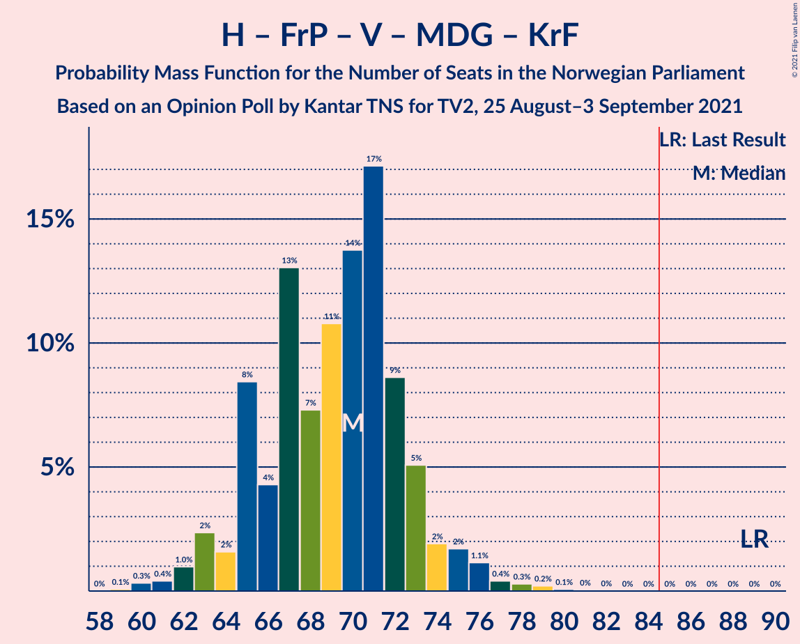

| Number of Seats | Probability | Accumulated | Special Marks |
|:---------------:|:-----------:|:-----------:|:-------------:|
| 59 | 0.1% | 100% |  |
| 60 | 0.3% | 99.9% |  |
| 61 | 0.4% | 99.6% |  |
| 62 | 1.0% | 99.2% |  |
| 63 | 2% | 98% |  |
| 64 | 2% | 96% |  |
| 65 | 8% | 94% |  |
| 66 | 4% | 86% |  |
| 67 | 13% | 82% |  |
| 68 | 7% | 68% |  |
| 69 | 11% | 61% |  |
| 70 | 14% | 50% | Median |
| 71 | 17% | 37% |  |
| 72 | 9% | 20% |  |
| 73 | 5% | 11% |  |
| 74 | 2% | 6% |  |
| 75 | 2% | 4% |  |
| 76 | 1.1% | 2% |  |
| 77 | 0.4% | 1.0% |  |
| 78 | 0.3% | 0.6% |  |
| 79 | 0.2% | 0.3% |  |
| 80 | 0.1% | 0.1% |  |
| 81 | 0% | 0.1% |  |
| 82 | 0% | 0% |  |
| 83 | 0% | 0% |  |
| 84 | 0% | 0% |  |
| 85 | 0% | 0% | Majority |
| 86 | 0% | 0% |  |
| 87 | 0% | 0% |  |
| 88 | 0% | 0% |  |
| 89 | 0% | 0% | Last Result |

### Høyre – Fremskrittspartiet – Venstre – Kristelig Folkeparti

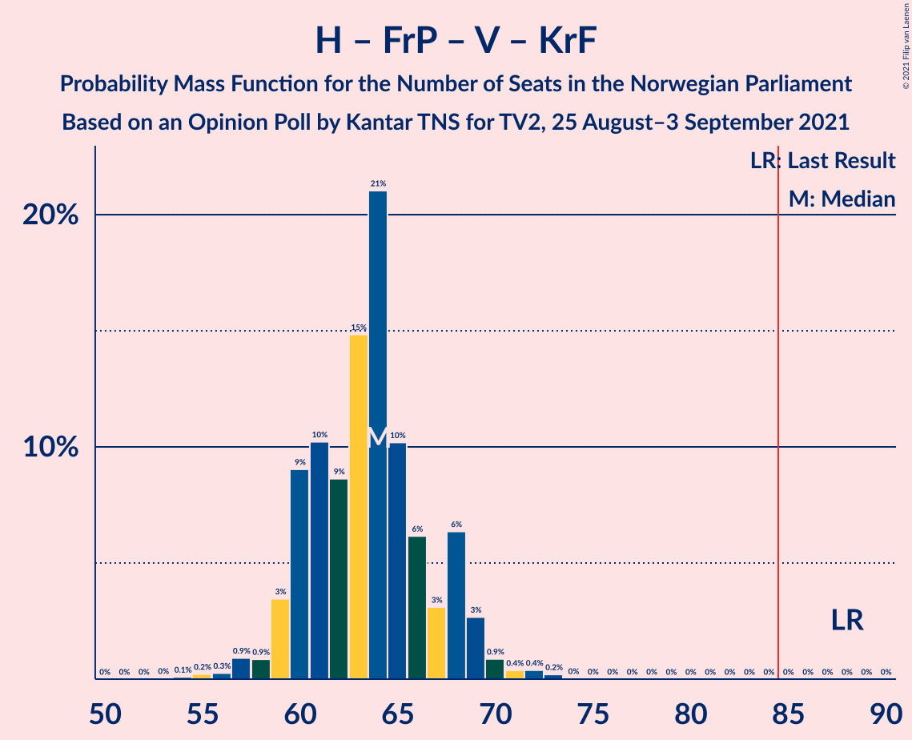

| Number of Seats | Probability | Accumulated | Special Marks |
|:---------------:|:-----------:|:-----------:|:-------------:|
| 54 | 0.1% | 100% |  |
| 55 | 0.2% | 99.9% |  |
| 56 | 0.3% | 99.6% |  |
| 57 | 0.9% | 99.4% |  |
| 58 | 0.9% | 98% |  |
| 59 | 3% | 98% |  |
| 60 | 9% | 94% |  |
| 61 | 10% | 85% |  |
| 62 | 9% | 75% |  |
| 63 | 15% | 66% | Median |
| 64 | 21% | 51% |  |
| 65 | 10% | 30% |  |
| 66 | 6% | 20% |  |
| 67 | 3% | 14% |  |
| 68 | 6% | 11% |  |
| 69 | 3% | 5% |  |
| 70 | 0.9% | 2% |  |
| 71 | 0.4% | 1.0% |  |
| 72 | 0.4% | 0.6% |  |
| 73 | 0.2% | 0.3% |  |
| 74 | 0% | 0.1% |  |
| 75 | 0% | 0% |  |
| 76 | 0% | 0% |  |
| 77 | 0% | 0% |  |
| 78 | 0% | 0% |  |
| 79 | 0% | 0% |  |
| 80 | 0% | 0% |  |
| 81 | 0% | 0% |  |
| 82 | 0% | 0% |  |
| 83 | 0% | 0% |  |
| 84 | 0% | 0% |  |
| 85 | 0% | 0% | Majority |
| 86 | 0% | 0% |  |
| 87 | 0% | 0% |  |
| 88 | 0% | 0% | Last Result |

### Høyre – Fremskrittspartiet – Venstre

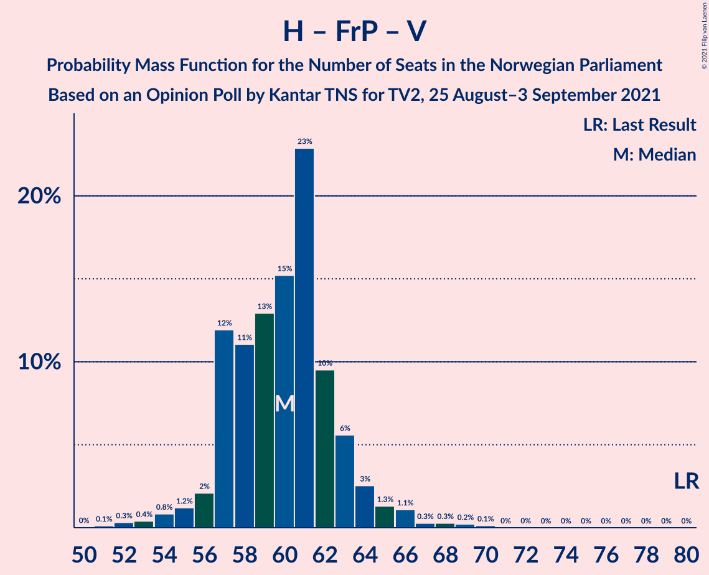

| Number of Seats | Probability | Accumulated | Special Marks |
|:---------------:|:-----------:|:-----------:|:-------------:|
| 51 | 0.1% | 100% |  |
| 52 | 0.3% | 99.8% |  |
| 53 | 0.4% | 99.5% |  |
| 54 | 0.8% | 99.1% |  |
| 55 | 1.2% | 98% |  |
| 56 | 2% | 97% |  |
| 57 | 12% | 95% |  |
| 58 | 11% | 83% |  |
| 59 | 13% | 72% |  |
| 60 | 15% | 59% | Median |
| 61 | 23% | 44% |  |
| 62 | 10% | 21% |  |
| 63 | 6% | 11% |  |
| 64 | 3% | 6% |  |
| 65 | 1.3% | 3% |  |
| 66 | 1.1% | 2% |  |
| 67 | 0.3% | 0.9% |  |
| 68 | 0.3% | 0.7% |  |
| 69 | 0.2% | 0.4% |  |
| 70 | 0.1% | 0.2% |  |
| 71 | 0% | 0% |  |
| 72 | 0% | 0% |  |
| 73 | 0% | 0% |  |
| 74 | 0% | 0% |  |
| 75 | 0% | 0% |  |
| 76 | 0% | 0% |  |
| 77 | 0% | 0% |  |
| 78 | 0% | 0% |  |
| 79 | 0% | 0% |  |
| 80 | 0% | 0% | Last Result |

### Arbeiderpartiet – Sosialistisk Venstreparti

| Number of Seats | Probability | Accumulated | Special Marks |
|:---------------:|:-----------:|:-----------:|:-------------:|
| 51 | 0.2% | 100% |  |
| 52 | 0.3% | 99.8% |  |
| 53 | 0.8% | 99.5% |  |
| 54 | 2% | 98.7% |  |
| 55 | 5% | 97% |  |
| 56 | 21% | 92% |  |
| 57 | 15% | 71% |  |
| 58 | 22% | 55% | Median |
| 59 | 9% | 33% |  |
| 60 | 12% | 24% | Last Result |
| 61 | 8% | 12% |  |
| 62 | 2% | 4% |  |
| 63 | 0.9% | 2% |  |
| 64 | 0.4% | 0.8% |  |
| 65 | 0.2% | 0.4% |  |
| 66 | 0.1% | 0.1% |  |
| 67 | 0% | 0.1% |  |
| 68 | 0% | 0% |  |

### Høyre – Fremskrittspartiet

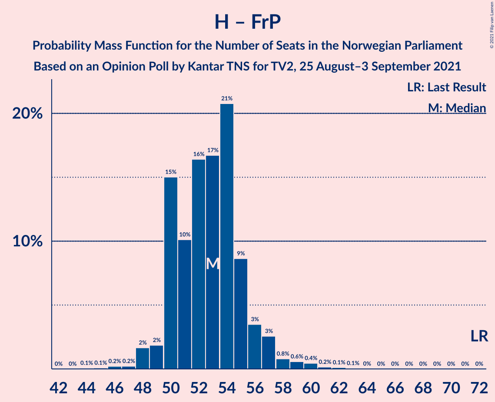

| Number of Seats | Probability | Accumulated | Special Marks |
|:---------------:|:-----------:|:-----------:|:-------------:|
| 44 | 0.1% | 100% |  |
| 45 | 0.1% | 99.9% |  |
| 46 | 0.2% | 99.8% |  |
| 47 | 0.2% | 99.6% |  |
| 48 | 2% | 99.4% |  |
| 49 | 2% | 98% |  |
| 50 | 15% | 96% |  |
| 51 | 10% | 81% |  |
| 52 | 16% | 71% |  |
| 53 | 17% | 54% | Median |
| 54 | 21% | 38% |  |
| 55 | 9% | 17% |  |
| 56 | 3% | 8% |  |
| 57 | 3% | 5% |  |
| 58 | 0.8% | 2% |  |
| 59 | 0.6% | 1.4% |  |
| 60 | 0.4% | 0.8% |  |
| 61 | 0.2% | 0.3% |  |
| 62 | 0.1% | 0.2% |  |
| 63 | 0.1% | 0.1% |  |
| 64 | 0% | 0% |  |
| 65 | 0% | 0% |  |
| 66 | 0% | 0% |  |
| 67 | 0% | 0% |  |
| 68 | 0% | 0% |  |
| 69 | 0% | 0% |  |
| 70 | 0% | 0% |  |
| 71 | 0% | 0% |  |
| 72 | 0% | 0% | Last Result |

### Høyre – Venstre – Kristelig Folkeparti

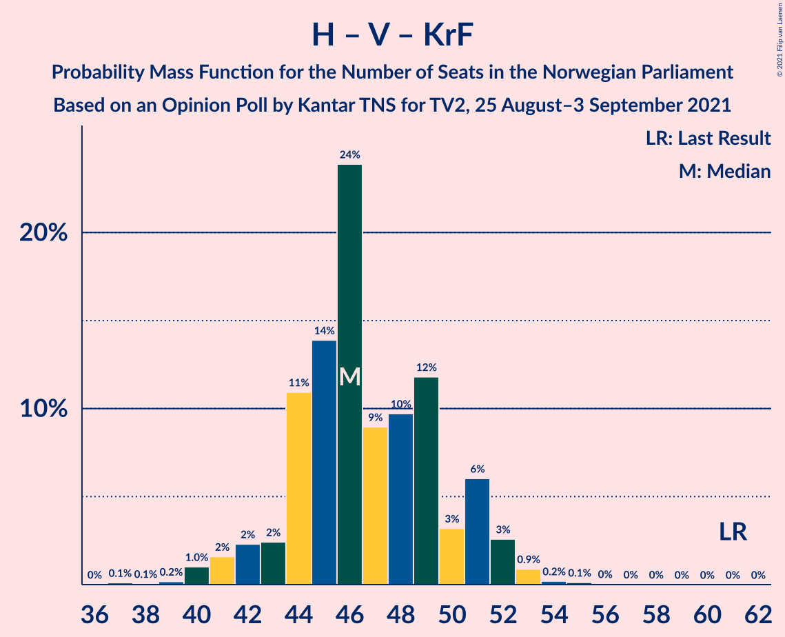

| Number of Seats | Probability | Accumulated | Special Marks |
|:---------------:|:-----------:|:-----------:|:-------------:|
| 37 | 0.1% | 100% |  |
| 38 | 0.1% | 99.9% |  |
| 39 | 0.2% | 99.8% |  |
| 40 | 1.0% | 99.6% |  |
| 41 | 2% | 98.6% |  |
| 42 | 2% | 97% |  |
| 43 | 2% | 95% |  |
| 44 | 11% | 92% |  |
| 45 | 14% | 81% |  |
| 46 | 24% | 67% | Median |
| 47 | 9% | 44% |  |
| 48 | 10% | 35% |  |
| 49 | 12% | 25% |  |
| 50 | 3% | 13% |  |
| 51 | 6% | 10% |  |
| 52 | 3% | 4% |  |
| 53 | 0.9% | 1.3% |  |
| 54 | 0.2% | 0.4% |  |
| 55 | 0.1% | 0.2% |  |
| 56 | 0% | 0.1% |  |
| 57 | 0% | 0% |  |
| 58 | 0% | 0% |  |
| 59 | 0% | 0% |  |
| 60 | 0% | 0% |  |
| 61 | 0% | 0% | Last Result |

### Senterpartiet – Venstre – Kristelig Folkeparti

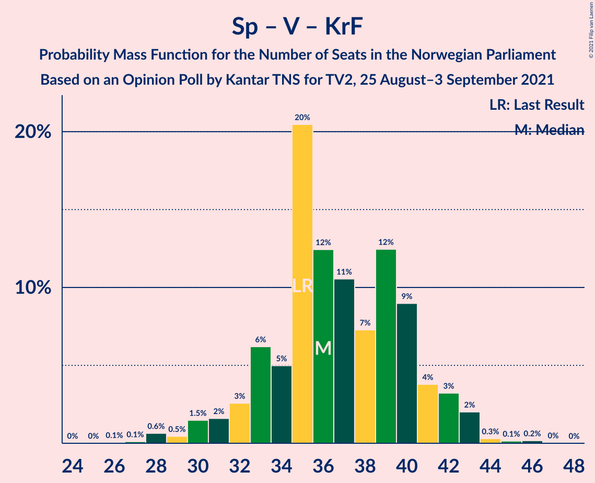

| Number of Seats | Probability | Accumulated | Special Marks |
|:---------------:|:-----------:|:-----------:|:-------------:|
| 26 | 0.1% | 100% |  |
| 27 | 0.1% | 99.9% |  |
| 28 | 0.6% | 99.8% |  |
| 29 | 0.5% | 99.2% |  |
| 30 | 1.5% | 98.7% |  |
| 31 | 2% | 97% |  |
| 32 | 3% | 96% |  |
| 33 | 6% | 93% |  |
| 34 | 5% | 87% |  |
| 35 | 20% | 82% | Last Result |
| 36 | 12% | 61% | Median |
| 37 | 11% | 49% |  |
| 38 | 7% | 38% |  |
| 39 | 12% | 31% |  |
| 40 | 9% | 19% |  |
| 41 | 4% | 10% |  |
| 42 | 3% | 6% |  |
| 43 | 2% | 3% |  |
| 44 | 0.3% | 0.7% |  |
| 45 | 0.1% | 0.4% |  |
| 46 | 0.2% | 0.2% |  |
| 47 | 0% | 0% |  |

## Technical Information

### Opinion Poll

+ **Polling firm:** Kantar TNS
+ **Commissioner(s):** TV2
+ **Fieldwork period:** 25 August–3 September 2021

### Calculations

+ **Sample size:** 1388
+ **Simulations done:** 1,048,576
+ **Error estimate:** 1.66%

