# Opinion Poll by Norstat for Aftenposten, 30 August–6 September 2021

<a href="#voting-intentions">Voting Intentions</a> | <a href="#seats">Seats</a> | <a href="#coalitions">Coalitions</a> | <a href="#technical-information">Technical Information</a>

## Voting Intentions

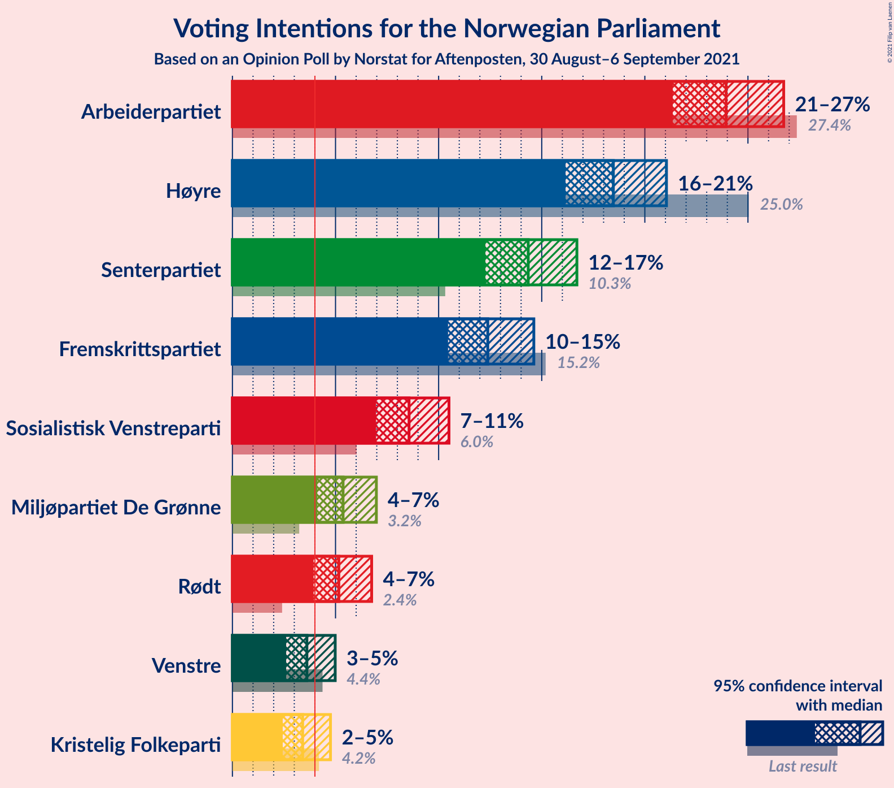

### Confidence Intervals

| Party | Last Result | Poll Result | 80% Confidence Interval | 90% Confidence Interval | 95% Confidence Interval | 99% Confidence Interval |
|:-----:|:-----------:|:-----------:|:-----------------------:|:-----------------------:|:-----------------------:|:-----------------------:|
| Arbeiderpartiet | 27.4% | 23.9% | 22.2–25.8% |21.8–26.3% |21.4–26.7% |20.6–27.6% |
| Høyre | 25.0% | 18.5% | 16.9–20.1% |16.5–20.6% |16.2–21.0% |15.4–21.9% |
| Senterpartiet | 10.3% | 14.3% | 13.0–15.9% |12.6–16.3% |12.3–16.7% |11.6–17.5% |
| Fremskrittspartiet | 15.2% | 12.4% | 11.1–13.8% |10.8–14.3% |10.5–14.6% |9.9–15.3% |
| Sosialistisk Venstreparti | 6.0% | 8.6% | 7.5–9.8% |7.2–10.2% |7.0–10.5% |6.5–11.1% |
| Miljøpartiet De Grønne | 3.2% | 5.4% | 4.5–6.4% |4.3–6.7% |4.1–7.0% |3.7–7.5% |
| Rødt | 2.4% | 5.2% | 4.3–6.2% |4.1–6.5% |3.9–6.8% |3.6–7.3% |
| Venstre | 4.4% | 3.6% | 2.9–4.5% |2.8–4.8% |2.6–5.0% |2.3–5.5% |
| Kristelig Folkeparti | 4.2% | 3.4% | 2.8–4.3% |2.6–4.5% |2.4–4.8% |2.1–5.2% |

*Note:* The poll result column reflects the actual value used in the calculations. Published results may vary slightly, and in addition be rounded to fewer digits.

## Seats

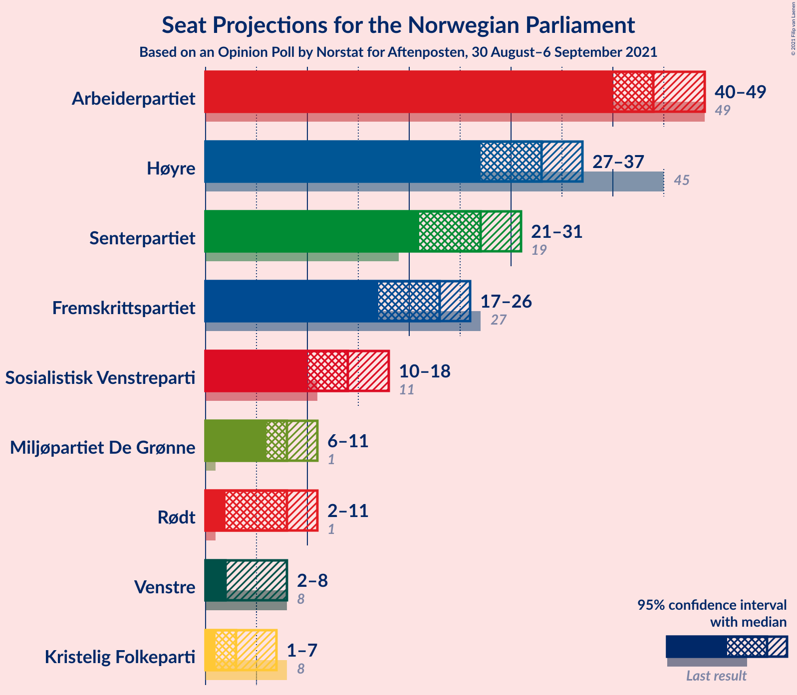

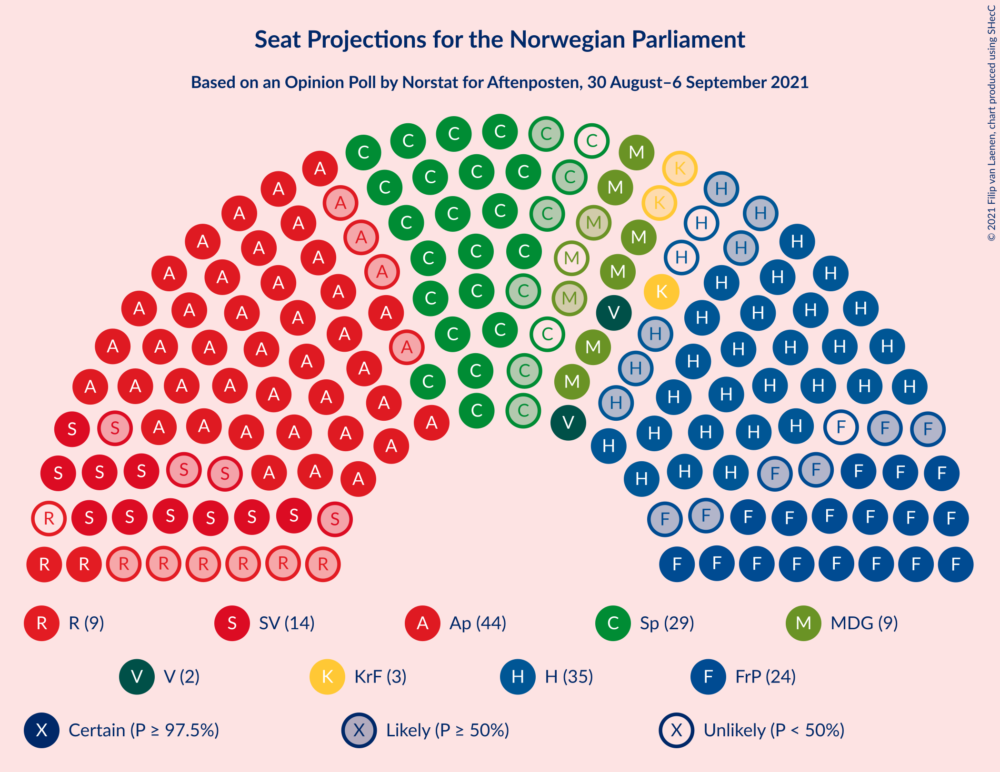

### Confidence Intervals

| Party | Last Result | Median | 80% Confidence Interval | 90% Confidence Interval | 95% Confidence Interval | 99% Confidence Interval |
|:-----:|:-----------:|:------:|:-----------------------:|:-----------------------:|:-----------------------:|:-----------------------:|
| <a href="#arbeiderpartiet">Arbeiderpartiet</a> | 49 | 44 | 41–47 |40–47 |40–49 |39–52 |
| <a href="#høyre">Høyre</a> | 45 | 33 | 29–36 |28–36 |27–37 |26–39 |
| <a href="#senterpartiet">Senterpartiet</a> | 19 | 27 | 23–29 |22–30 |21–31 |20–33 |
| <a href="#fremskrittspartiet">Fremskrittspartiet</a> | 27 | 23 | 18–25 |17–25 |17–26 |16–27 |
| <a href="#sosialistisk-venstreparti">Sosialistisk Venstreparti</a> | 11 | 14 | 11–16 |11–17 |10–18 |10–19 |
| <a href="#miljøpartiet-de-grønne">Miljøpartiet De Grønne</a> | 1 | 8 | 7–10 |7–11 |6–11 |2–13 |
| <a href="#rødt">Rødt</a> | 1 | 8 | 7–10 |6–11 |2–11 |2–12 |
| <a href="#venstre">Venstre</a> | 8 | 2 | 2–7 |2–7 |2–8 |1–9 |
| <a href="#kristelig-folkeparti">Kristelig Folkeparti</a> | 8 | 3 | 1–6 |1–7 |1–7 |0–8 |

### Arbeiderpartiet

*For a full overview of the results for this party, see the [Arbeiderpartiet](party-arbeiderpartiet.html) page.*

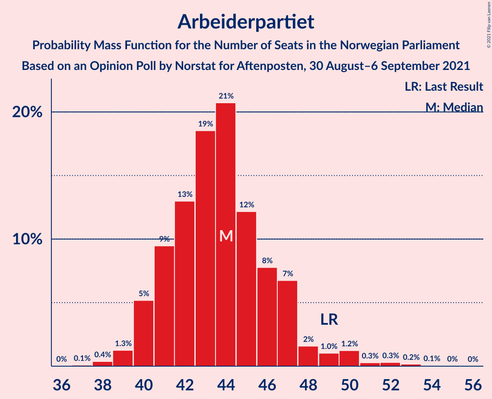

| Number of Seats | Probability | Accumulated | Special Marks |
|:---------------:|:-----------:|:-----------:|:-------------:|
| 37 | 0.1% | 100% |  |
| 38 | 0.4% | 99.9% |  |
| 39 | 1.3% | 99.5% |  |
| 40 | 5% | 98% |  |
| 41 | 9% | 93% |  |
| 42 | 13% | 84% |  |
| 43 | 19% | 71% |  |
| 44 | 21% | 52% | Median |
| 45 | 12% | 31% |  |
| 46 | 8% | 19% |  |
| 47 | 7% | 11% |  |
| 48 | 2% | 5% |  |
| 49 | 1.0% | 3% | Last Result |
| 50 | 1.2% | 2% |  |
| 51 | 0.3% | 0.9% |  |
| 52 | 0.3% | 0.6% |  |
| 53 | 0.2% | 0.3% |  |
| 54 | 0.1% | 0.1% |  |
| 55 | 0% | 0% |  |

### Høyre

*For a full overview of the results for this party, see the [Høyre](party-høyre.html) page.*

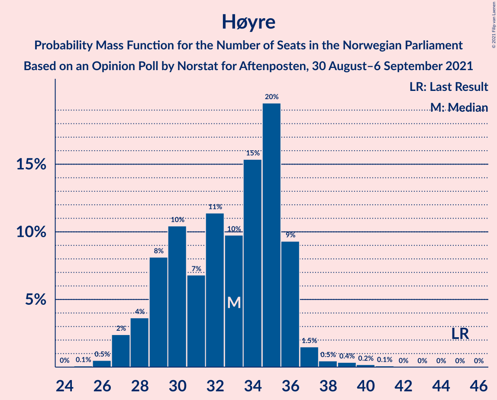

| Number of Seats | Probability | Accumulated | Special Marks |
|:---------------:|:-----------:|:-----------:|:-------------:|
| 25 | 0.1% | 100% |  |
| 26 | 0.5% | 99.9% |  |
| 27 | 2% | 99.4% |  |
| 28 | 4% | 97% |  |
| 29 | 8% | 93% |  |
| 30 | 10% | 85% |  |
| 31 | 7% | 75% |  |
| 32 | 11% | 68% |  |
| 33 | 10% | 57% | Median |
| 34 | 15% | 47% |  |
| 35 | 20% | 31% |  |
| 36 | 9% | 12% |  |
| 37 | 1.5% | 3% |  |
| 38 | 0.5% | 1.1% |  |
| 39 | 0.4% | 0.7% |  |
| 40 | 0.2% | 0.3% |  |
| 41 | 0.1% | 0.1% |  |
| 42 | 0% | 0% |  |
| 43 | 0% | 0% |  |
| 44 | 0% | 0% |  |
| 45 | 0% | 0% | Last Result |

### Senterpartiet

*For a full overview of the results for this party, see the [Senterpartiet](party-senterpartiet.html) page.*

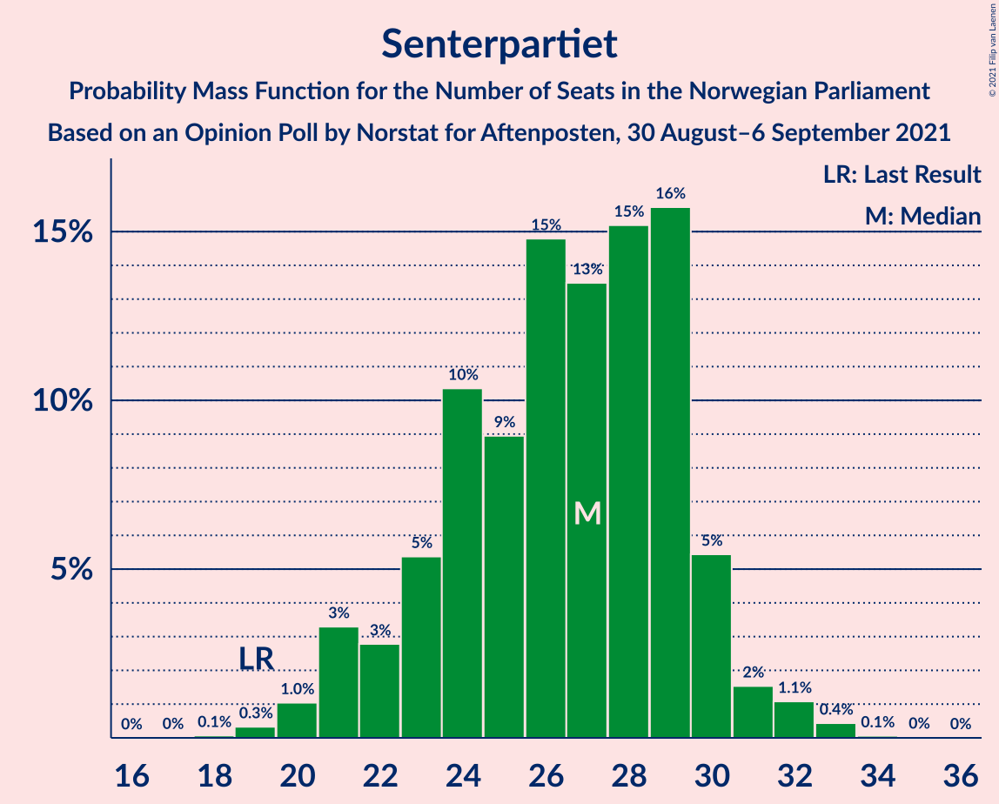

| Number of Seats | Probability | Accumulated | Special Marks |
|:---------------:|:-----------:|:-----------:|:-------------:|
| 18 | 0.1% | 100% |  |
| 19 | 0.3% | 99.9% | Last Result |
| 20 | 1.0% | 99.6% |  |
| 21 | 3% | 98.5% |  |
| 22 | 3% | 95% |  |
| 23 | 5% | 92% |  |
| 24 | 10% | 87% |  |
| 25 | 9% | 77% |  |
| 26 | 15% | 68% |  |
| 27 | 13% | 53% | Median |
| 28 | 15% | 40% |  |
| 29 | 16% | 24% |  |
| 30 | 5% | 9% |  |
| 31 | 2% | 3% |  |
| 32 | 1.1% | 2% |  |
| 33 | 0.4% | 0.5% |  |
| 34 | 0.1% | 0.1% |  |
| 35 | 0% | 0% |  |

### Fremskrittspartiet

*For a full overview of the results for this party, see the [Fremskrittspartiet](party-fremskrittspartiet.html) page.*

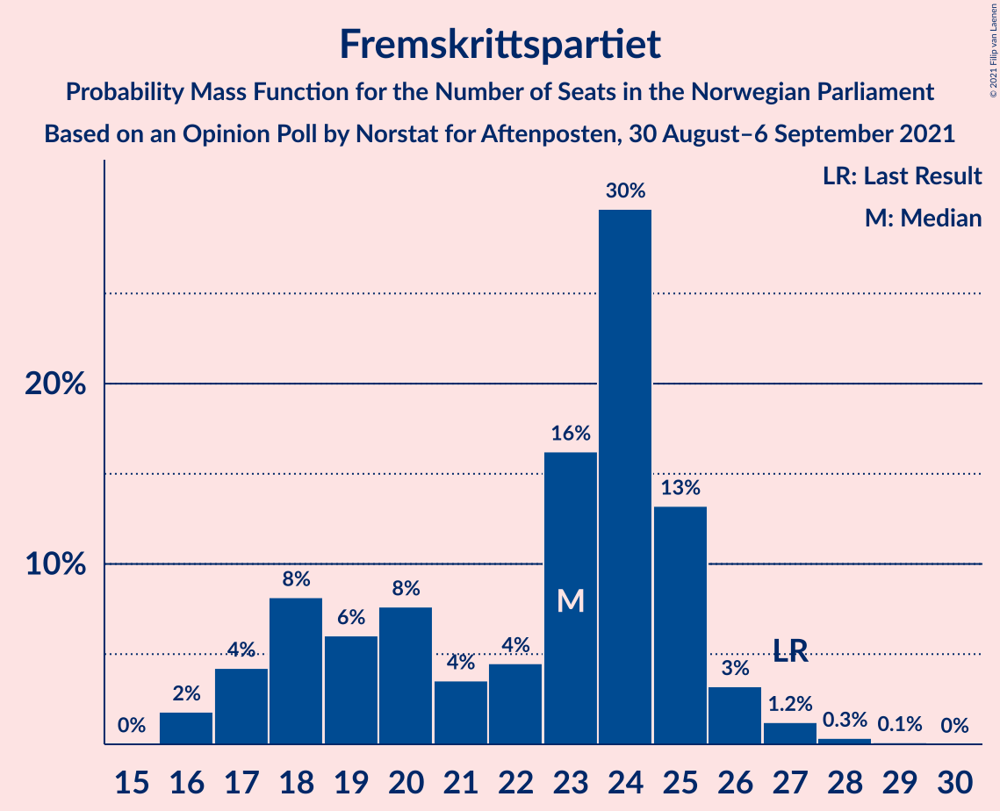

| Number of Seats | Probability | Accumulated | Special Marks |
|:---------------:|:-----------:|:-----------:|:-------------:|
| 15 | 0% | 100% |  |
| 16 | 2% | 99.9% |  |
| 17 | 4% | 98% |  |
| 18 | 8% | 94% |  |
| 19 | 6% | 86% |  |
| 20 | 8% | 80% |  |
| 21 | 4% | 72% |  |
| 22 | 4% | 69% |  |
| 23 | 16% | 64% | Median |
| 24 | 30% | 48% |  |
| 25 | 13% | 18% |  |
| 26 | 3% | 5% |  |
| 27 | 1.2% | 2% | Last Result |
| 28 | 0.3% | 0.5% |  |
| 29 | 0.1% | 0.1% |  |
| 30 | 0% | 0% |  |

### Sosialistisk Venstreparti

*For a full overview of the results for this party, see the [Sosialistisk Venstreparti](party-sosialistiskvenstreparti.html) page.*

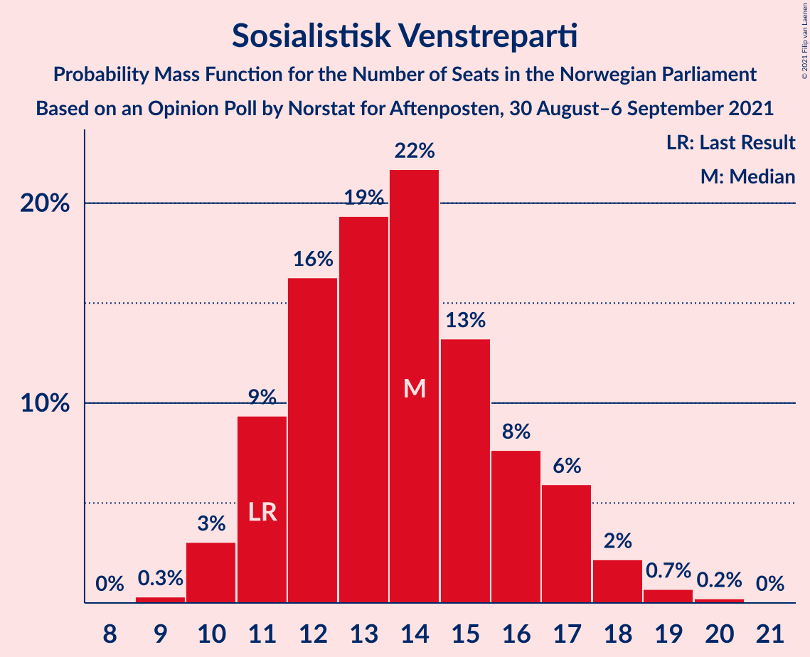

| Number of Seats | Probability | Accumulated | Special Marks |
|:---------------:|:-----------:|:-----------:|:-------------:|
| 9 | 0.3% | 100% |  |
| 10 | 3% | 99.7% |  |
| 11 | 9% | 97% | Last Result |
| 12 | 16% | 87% |  |
| 13 | 19% | 71% |  |
| 14 | 22% | 52% | Median |
| 15 | 13% | 30% |  |
| 16 | 8% | 17% |  |
| 17 | 6% | 9% |  |
| 18 | 2% | 3% |  |
| 19 | 0.7% | 1.0% |  |
| 20 | 0.2% | 0.3% |  |
| 21 | 0% | 0% |  |

### Miljøpartiet De Grønne

*For a full overview of the results for this party, see the [Miljøpartiet De Grønne](party-miljøpartietdegrønne.html) page.*

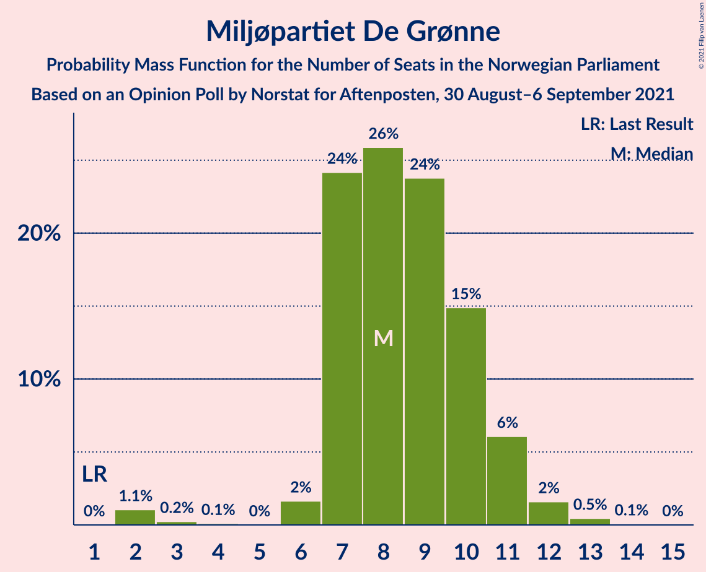

| Number of Seats | Probability | Accumulated | Special Marks |
|:---------------:|:-----------:|:-----------:|:-------------:|
| 1 | 0% | 100% | Last Result |
| 2 | 1.1% | 100% |  |
| 3 | 0.2% | 98.9% |  |
| 4 | 0.1% | 98.7% |  |
| 5 | 0% | 98.6% |  |
| 6 | 2% | 98.6% |  |
| 7 | 24% | 97% |  |
| 8 | 26% | 73% | Median |
| 9 | 24% | 47% |  |
| 10 | 15% | 23% |  |
| 11 | 6% | 8% |  |
| 12 | 2% | 2% |  |
| 13 | 0.5% | 0.5% |  |
| 14 | 0.1% | 0.1% |  |
| 15 | 0% | 0% |  |

### Rødt

*For a full overview of the results for this party, see the [Rødt](party-rødt.html) page.*

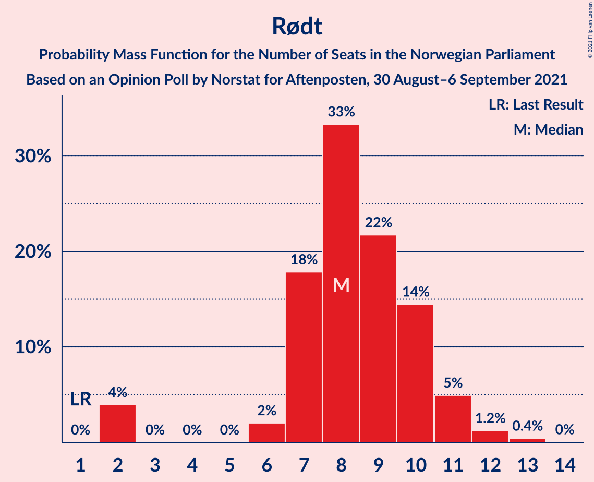

| Number of Seats | Probability | Accumulated | Special Marks |
|:---------------:|:-----------:|:-----------:|:-------------:|
| 1 | 0% | 100% | Last Result |
| 2 | 4% | 100% |  |
| 3 | 0% | 96% |  |
| 4 | 0% | 96% |  |
| 5 | 0% | 96% |  |
| 6 | 2% | 96% |  |
| 7 | 18% | 94% |  |
| 8 | 33% | 76% | Median |
| 9 | 22% | 43% |  |
| 10 | 14% | 21% |  |
| 11 | 5% | 7% |  |
| 12 | 1.2% | 2% |  |
| 13 | 0.4% | 0.5% |  |
| 14 | 0% | 0% |  |

### Venstre

*For a full overview of the results for this party, see the [Venstre](party-venstre.html) page.*

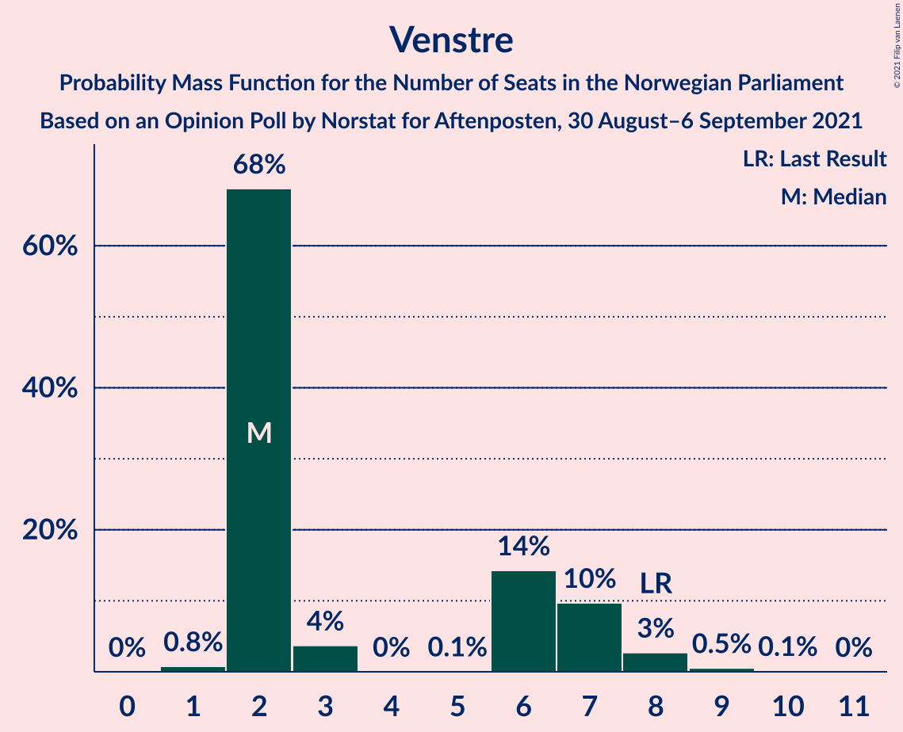

| Number of Seats | Probability | Accumulated | Special Marks |
|:---------------:|:-----------:|:-----------:|:-------------:|
| 1 | 0.8% | 100% |  |
| 2 | 68% | 99.2% | Median |
| 3 | 4% | 31% |  |
| 4 | 0% | 27% |  |
| 5 | 0.1% | 27% |  |
| 6 | 14% | 27% |  |
| 7 | 10% | 13% |  |
| 8 | 3% | 3% | Last Result |
| 9 | 0.5% | 0.7% |  |
| 10 | 0.1% | 0.1% |  |
| 11 | 0% | 0% |  |

### Kristelig Folkeparti

*For a full overview of the results for this party, see the [Kristelig Folkeparti](party-kristeligfolkeparti.html) page.*

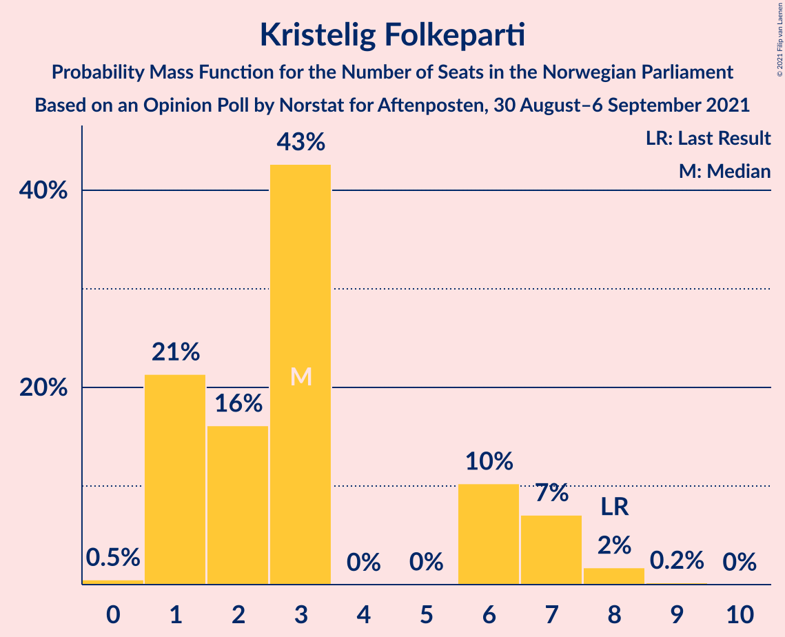

| Number of Seats | Probability | Accumulated | Special Marks |
|:---------------:|:-----------:|:-----------:|:-------------:|
| 0 | 0.5% | 100% |  |
| 1 | 21% | 99.5% |  |
| 2 | 16% | 78% |  |
| 3 | 43% | 62% | Median |
| 4 | 0% | 19% |  |
| 5 | 0% | 19% |  |
| 6 | 10% | 19% |  |
| 7 | 7% | 9% |  |
| 8 | 2% | 2% | Last Result |
| 9 | 0.2% | 0.2% |  |
| 10 | 0% | 0% |  |

## Coalitions

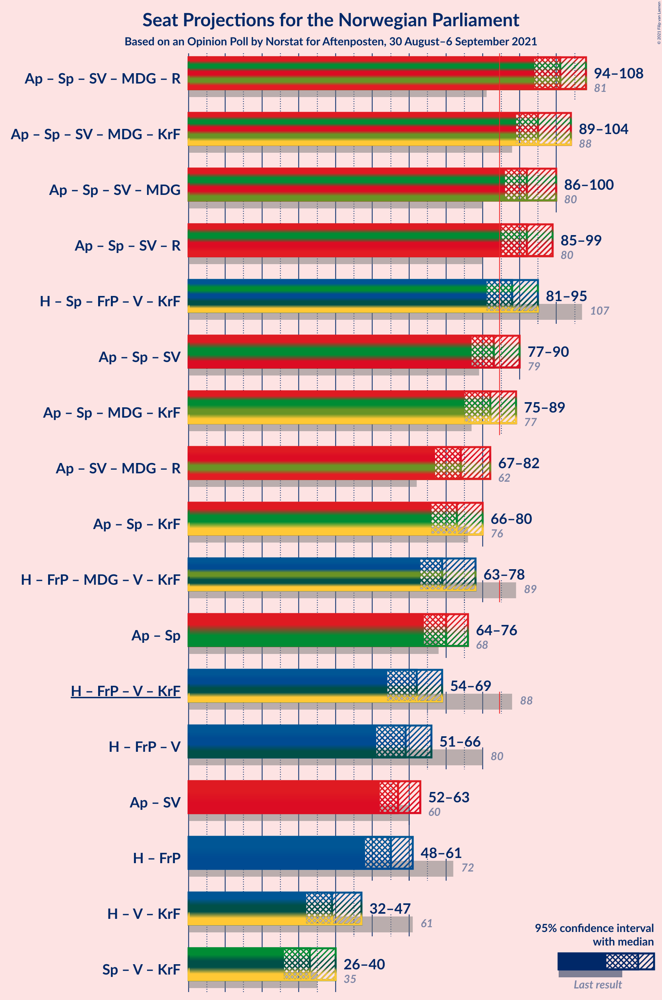

### Confidence Intervals

| Coalition | Last Result | Median | Majority? | 80% Confidence Interval | 90% Confidence Interval | 95% Confidence Interval | 99% Confidence Interval |
|:---------:|:-----------:|:------:|:---------:|:-----------------------:|:-----------------------:|:-----------------------:|:-----------------------:|
| Arbeiderpartiet – Senterpartiet – Sosialistisk Venstreparti – Miljøpartiet De Grønne – Rødt | 81 | 101 | 100% | 95–106 | 94–107 | 94–108 | 91–111 |
| Arbeiderpartiet – Senterpartiet – Sosialistisk Venstreparti – Miljøpartiet De Grønne – Kristelig Folkeparti | 88 | 95 | 99.9% | 91–100 | 90–102 | 89–104 | 87–106 |
| Arbeiderpartiet – Senterpartiet – Sosialistisk Venstreparti – Miljøpartiet De Grønne | 80 | 92 | 98.8% | 87–97 | 86–99 | 86–100 | 84–103 |
| Arbeiderpartiet – Senterpartiet – Sosialistisk Venstreparti – Rødt | 80 | 92 | 98% | 87–97 | 86–98 | 85–99 | 83–102 |
| Høyre – Senterpartiet – Fremskrittspartiet – Venstre – Kristelig Folkeparti | 107 | 88 | 87% | 83–93 | 82–94 | 81–95 | 78–97 |
| Arbeiderpartiet – Senterpartiet – Sosialistisk Venstreparti | 79 | 83 | 44% | 80–88 | 78–89 | 77–90 | 76–94 |
| Arbeiderpartiet – Senterpartiet – Miljøpartiet De Grønne – Kristelig Folkeparti | 77 | 82 | 20% | 77–86 | 76–88 | 75–89 | 73–91 |
| Arbeiderpartiet – Sosialistisk Venstreparti – Miljøpartiet De Grønne – Rødt | 62 | 74 | 0.5% | 69–79 | 68–81 | 67–82 | 66–85 |
| Arbeiderpartiet – Senterpartiet – Kristelig Folkeparti | 76 | 73 | 0.1% | 69–78 | 67–79 | 66–80 | 65–82 |
| Høyre – Fremskrittspartiet – Miljøpartiet De Grønne – Venstre – Kristelig Folkeparti | 89 | 69 | 0% | 65–75 | 63–77 | 63–78 | 61–81 |
| Arbeiderpartiet – Senterpartiet | 68 | 70 | 0% | 66–74 | 64–75 | 64–76 | 62–78 |
| Høyre – Fremskrittspartiet – Venstre – Kristelig Folkeparti | 88 | 62 | 0% | 57–66 | 55–68 | 54–69 | 52–71 |
| Høyre – Fremskrittspartiet – Venstre | 80 | 59 | 0% | 54–63 | 52–65 | 51–66 | 49–67 |
| Arbeiderpartiet – Sosialistisk Venstreparti | 60 | 57 | 0% | 54–61 | 53–63 | 52–63 | 51–66 |
| Høyre – Fremskrittspartiet | 72 | 55 | 0% | 50–59 | 48–60 | 48–61 | 47–63 |
| Høyre – Venstre – Kristelig Folkeparti | 61 | 39 | 0% | 35–44 | 33–46 | 32–47 | 31–49 |
| Senterpartiet – Venstre – Kristelig Folkeparti | 35 | 33 | 0% | 28–38 | 27–39 | 26–40 | 24–43 |

### Arbeiderpartiet – Senterpartiet – Sosialistisk Venstreparti – Miljøpartiet De Grønne – Rødt

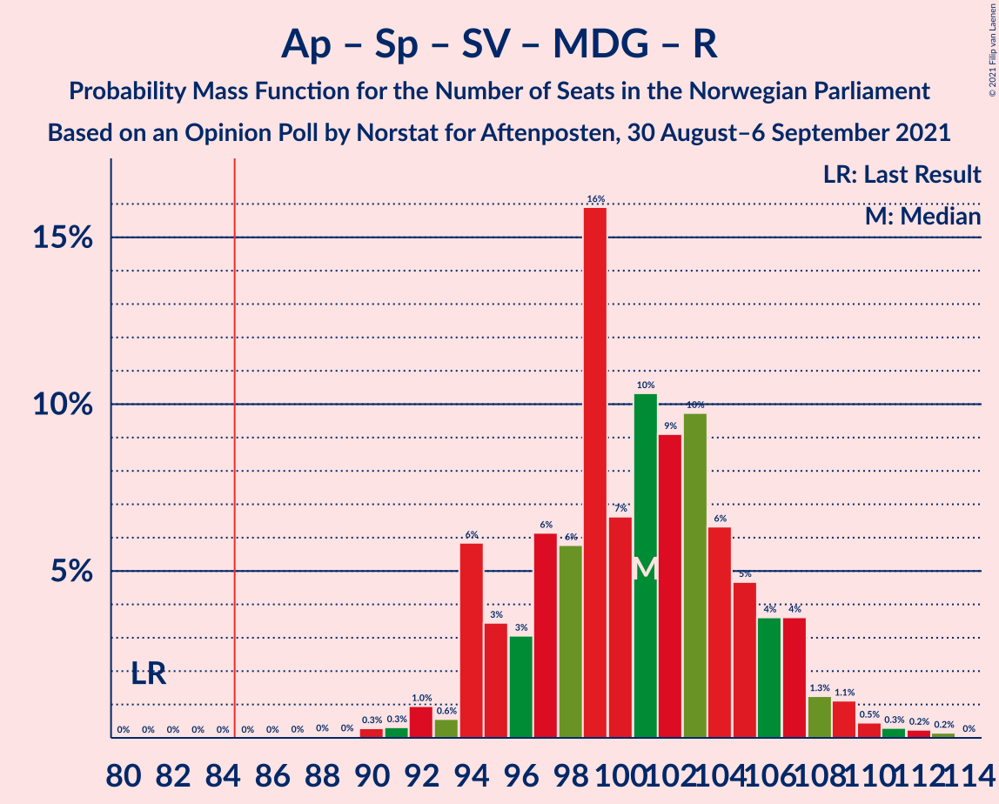

| Number of Seats | Probability | Accumulated | Special Marks |
|:---------------:|:-----------:|:-----------:|:-------------:|
| 81 | 0% | 100% | Last Result |
| 82 | 0% | 100% |  |
| 83 | 0% | 100% |  |
| 84 | 0% | 100% |  |
| 85 | 0% | 100% | Majority |
| 86 | 0% | 100% |  |
| 87 | 0% | 100% |  |
| 88 | 0% | 100% |  |
| 89 | 0% | 99.9% |  |
| 90 | 0.3% | 99.9% |  |
| 91 | 0.3% | 99.6% |  |
| 92 | 1.0% | 99.3% |  |
| 93 | 0.6% | 98% |  |
| 94 | 6% | 98% |  |
| 95 | 3% | 92% |  |
| 96 | 3% | 88% |  |
| 97 | 6% | 85% |  |
| 98 | 6% | 79% |  |
| 99 | 16% | 73% |  |
| 100 | 7% | 58% |  |
| 101 | 10% | 51% | Median |
| 102 | 9% | 41% |  |
| 103 | 10% | 32% |  |
| 104 | 6% | 22% |  |
| 105 | 5% | 15% |  |
| 106 | 4% | 11% |  |
| 107 | 4% | 7% |  |
| 108 | 1.3% | 4% |  |
| 109 | 1.1% | 2% |  |
| 110 | 0.5% | 1.2% |  |
| 111 | 0.3% | 0.7% |  |
| 112 | 0.2% | 0.4% |  |
| 113 | 0.2% | 0.2% |  |
| 114 | 0% | 0% |  |

### Arbeiderpartiet – Senterpartiet – Sosialistisk Venstreparti – Miljøpartiet De Grønne – Kristelig Folkeparti

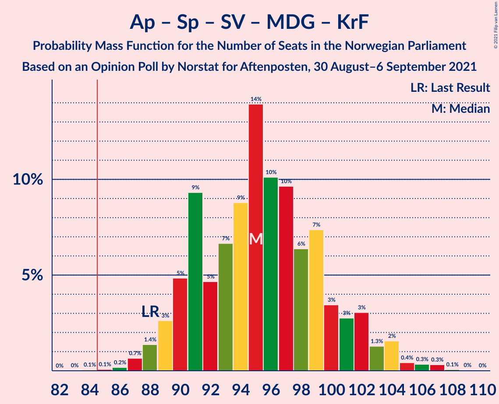

| Number of Seats | Probability | Accumulated | Special Marks |
|:---------------:|:-----------:|:-----------:|:-------------:|
| 84 | 0.1% | 100% |  |
| 85 | 0.1% | 99.9% | Majority |
| 86 | 0.2% | 99.8% |  |
| 87 | 0.7% | 99.7% |  |
| 88 | 1.4% | 99.0% | Last Result |
| 89 | 3% | 98% |  |
| 90 | 5% | 95% |  |
| 91 | 9% | 90% |  |
| 92 | 5% | 81% |  |
| 93 | 7% | 76% |  |
| 94 | 9% | 70% |  |
| 95 | 14% | 61% |  |
| 96 | 10% | 47% | Median |
| 97 | 10% | 37% |  |
| 98 | 6% | 27% |  |
| 99 | 7% | 21% |  |
| 100 | 3% | 13% |  |
| 101 | 3% | 10% |  |
| 102 | 3% | 7% |  |
| 103 | 1.3% | 4% |  |
| 104 | 2% | 3% |  |
| 105 | 0.4% | 1.2% |  |
| 106 | 0.3% | 0.8% |  |
| 107 | 0.3% | 0.4% |  |
| 108 | 0.1% | 0.1% |  |
| 109 | 0% | 0.1% |  |
| 110 | 0% | 0% |  |

### Arbeiderpartiet – Senterpartiet – Sosialistisk Venstreparti – Miljøpartiet De Grønne

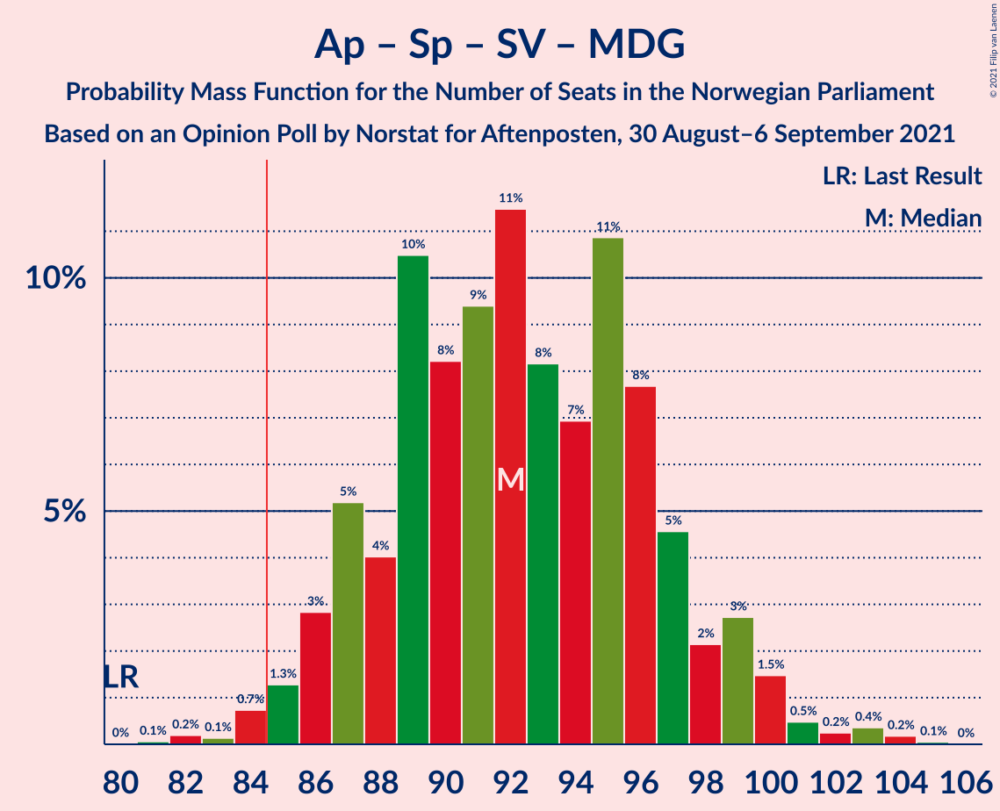

| Number of Seats | Probability | Accumulated | Special Marks |
|:---------------:|:-----------:|:-----------:|:-------------:|
| 80 | 0% | 100% | Last Result |
| 81 | 0.1% | 100% |  |
| 82 | 0.2% | 99.9% |  |
| 83 | 0.1% | 99.7% |  |
| 84 | 0.7% | 99.6% |  |
| 85 | 1.3% | 98.8% | Majority |
| 86 | 3% | 98% |  |
| 87 | 5% | 95% |  |
| 88 | 4% | 90% |  |
| 89 | 10% | 86% |  |
| 90 | 8% | 75% |  |
| 91 | 9% | 67% |  |
| 92 | 11% | 57% |  |
| 93 | 8% | 46% | Median |
| 94 | 7% | 38% |  |
| 95 | 11% | 31% |  |
| 96 | 8% | 20% |  |
| 97 | 5% | 12% |  |
| 98 | 2% | 8% |  |
| 99 | 3% | 6% |  |
| 100 | 1.5% | 3% |  |
| 101 | 0.5% | 1.4% |  |
| 102 | 0.2% | 0.9% |  |
| 103 | 0.4% | 0.6% |  |
| 104 | 0.2% | 0.3% |  |
| 105 | 0.1% | 0.1% |  |
| 106 | 0% | 0% |  |

### Arbeiderpartiet – Senterpartiet – Sosialistisk Venstreparti – Rødt

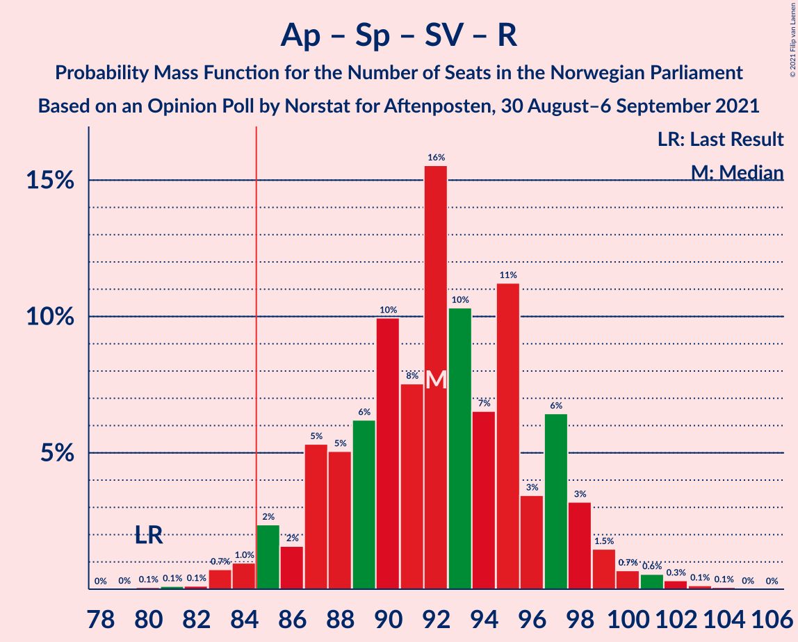

| Number of Seats | Probability | Accumulated | Special Marks |
|:---------------:|:-----------:|:-----------:|:-------------:|
| 80 | 0.1% | 100% | Last Result |
| 81 | 0.1% | 99.9% |  |
| 82 | 0.1% | 99.8% |  |
| 83 | 0.7% | 99.7% |  |
| 84 | 1.0% | 99.0% |  |
| 85 | 2% | 98% | Majority |
| 86 | 2% | 96% |  |
| 87 | 5% | 94% |  |
| 88 | 5% | 89% |  |
| 89 | 6% | 84% |  |
| 90 | 10% | 77% |  |
| 91 | 8% | 68% |  |
| 92 | 16% | 60% |  |
| 93 | 10% | 44% | Median |
| 94 | 7% | 34% |  |
| 95 | 11% | 28% |  |
| 96 | 3% | 16% |  |
| 97 | 6% | 13% |  |
| 98 | 3% | 6% |  |
| 99 | 1.5% | 3% |  |
| 100 | 0.7% | 2% |  |
| 101 | 0.6% | 1.1% |  |
| 102 | 0.3% | 0.6% |  |
| 103 | 0.1% | 0.2% |  |
| 104 | 0.1% | 0.1% |  |
| 105 | 0% | 0% |  |

### Høyre – Senterpartiet – Fremskrittspartiet – Venstre – Kristelig Folkeparti

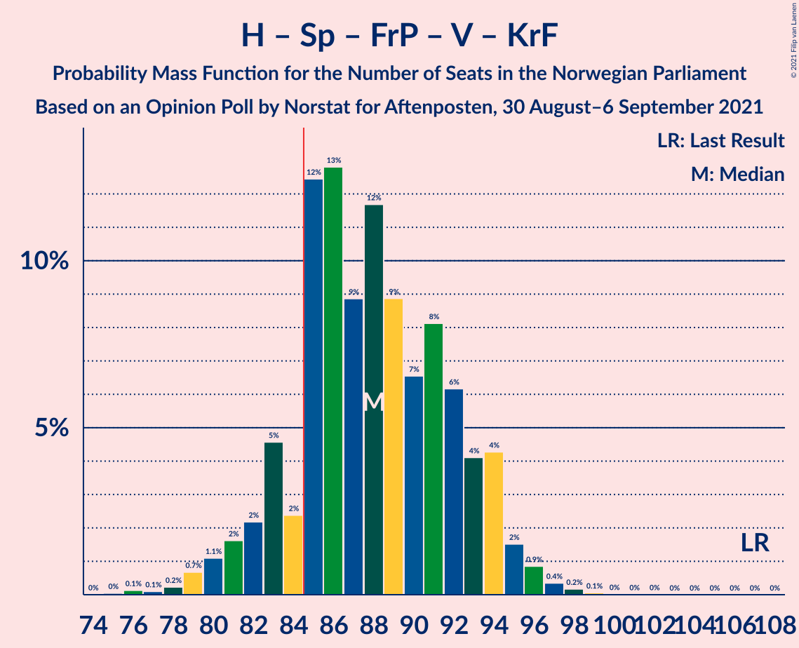

| Number of Seats | Probability | Accumulated | Special Marks |
|:---------------:|:-----------:|:-----------:|:-------------:|
| 75 | 0% | 100% |  |
| 76 | 0.1% | 99.9% |  |
| 77 | 0.1% | 99.8% |  |
| 78 | 0.2% | 99.7% |  |
| 79 | 0.7% | 99.5% |  |
| 80 | 1.1% | 98.8% |  |
| 81 | 2% | 98% |  |
| 82 | 2% | 96% |  |
| 83 | 5% | 94% |  |
| 84 | 2% | 89% |  |
| 85 | 12% | 87% | Majority |
| 86 | 13% | 74% |  |
| 87 | 9% | 62% |  |
| 88 | 12% | 53% | Median |
| 89 | 9% | 41% |  |
| 90 | 7% | 32% |  |
| 91 | 8% | 26% |  |
| 92 | 6% | 18% |  |
| 93 | 4% | 11% |  |
| 94 | 4% | 7% |  |
| 95 | 2% | 3% |  |
| 96 | 0.9% | 1.5% |  |
| 97 | 0.4% | 0.6% |  |
| 98 | 0.2% | 0.3% |  |
| 99 | 0.1% | 0.1% |  |
| 100 | 0% | 0% |  |
| 101 | 0% | 0% |  |
| 102 | 0% | 0% |  |
| 103 | 0% | 0% |  |
| 104 | 0% | 0% |  |
| 105 | 0% | 0% |  |
| 106 | 0% | 0% |  |
| 107 | 0% | 0% | Last Result |

### Arbeiderpartiet – Senterpartiet – Sosialistisk Venstreparti

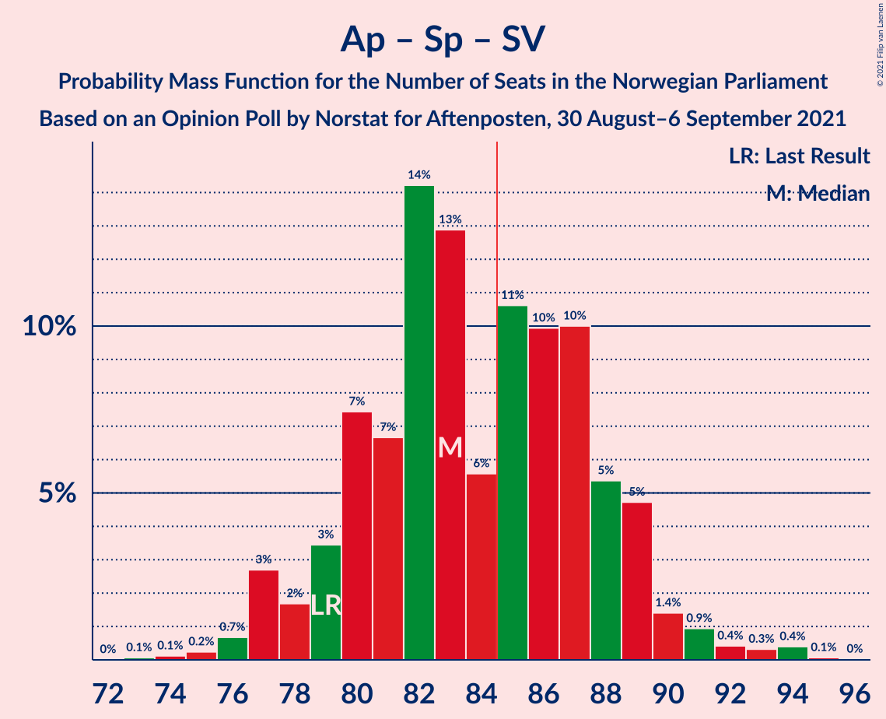

| Number of Seats | Probability | Accumulated | Special Marks |
|:---------------:|:-----------:|:-----------:|:-------------:|
| 73 | 0.1% | 100% |  |
| 74 | 0.1% | 99.9% |  |
| 75 | 0.2% | 99.8% |  |
| 76 | 0.7% | 99.6% |  |
| 77 | 3% | 98.9% |  |
| 78 | 2% | 96% |  |
| 79 | 3% | 94% | Last Result |
| 80 | 7% | 91% |  |
| 81 | 7% | 84% |  |
| 82 | 14% | 77% |  |
| 83 | 13% | 63% |  |
| 84 | 6% | 50% |  |
| 85 | 11% | 44% | Median, Majority |
| 86 | 10% | 34% |  |
| 87 | 10% | 24% |  |
| 88 | 5% | 14% |  |
| 89 | 5% | 8% |  |
| 90 | 1.4% | 4% |  |
| 91 | 0.9% | 2% |  |
| 92 | 0.4% | 1.2% |  |
| 93 | 0.3% | 0.8% |  |
| 94 | 0.4% | 0.5% |  |
| 95 | 0.1% | 0.1% |  |
| 96 | 0% | 0% |  |

### Arbeiderpartiet – Senterpartiet – Miljøpartiet De Grønne – Kristelig Folkeparti

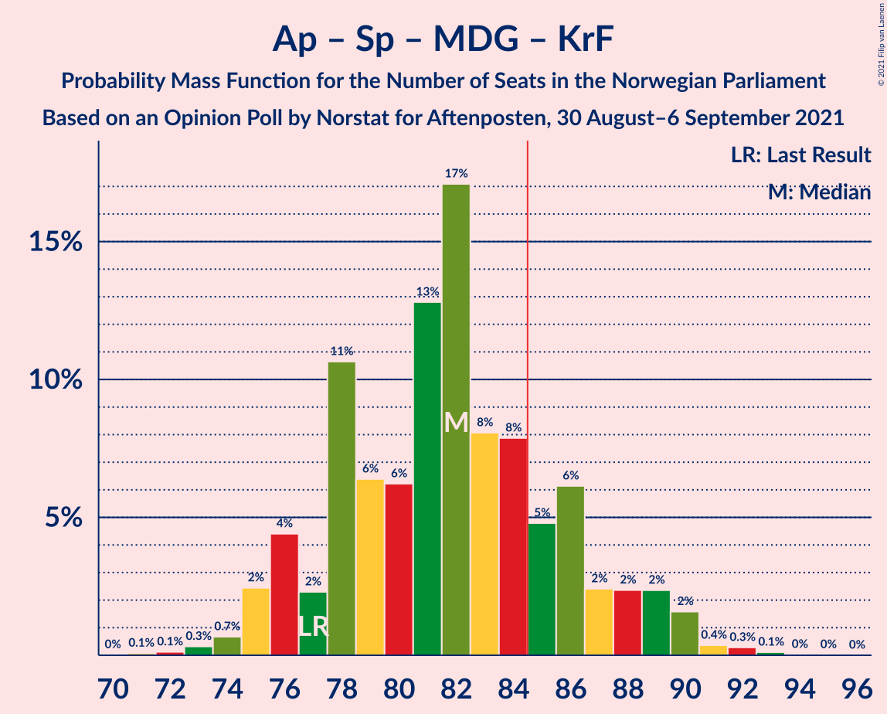

| Number of Seats | Probability | Accumulated | Special Marks |
|:---------------:|:-----------:|:-----------:|:-------------:|
| 71 | 0.1% | 100% |  |
| 72 | 0.1% | 99.9% |  |
| 73 | 0.3% | 99.7% |  |
| 74 | 0.7% | 99.4% |  |
| 75 | 2% | 98.8% |  |
| 76 | 4% | 96% |  |
| 77 | 2% | 92% | Last Result |
| 78 | 11% | 90% |  |
| 79 | 6% | 79% |  |
| 80 | 6% | 73% |  |
| 81 | 13% | 66% |  |
| 82 | 17% | 54% | Median |
| 83 | 8% | 36% |  |
| 84 | 8% | 28% |  |
| 85 | 5% | 20% | Majority |
| 86 | 6% | 16% |  |
| 87 | 2% | 10% |  |
| 88 | 2% | 7% |  |
| 89 | 2% | 5% |  |
| 90 | 2% | 2% |  |
| 91 | 0.4% | 0.8% |  |
| 92 | 0.3% | 0.5% |  |
| 93 | 0.1% | 0.2% |  |
| 94 | 0% | 0.1% |  |
| 95 | 0% | 0% |  |

### Arbeiderpartiet – Sosialistisk Venstreparti – Miljøpartiet De Grønne – Rødt

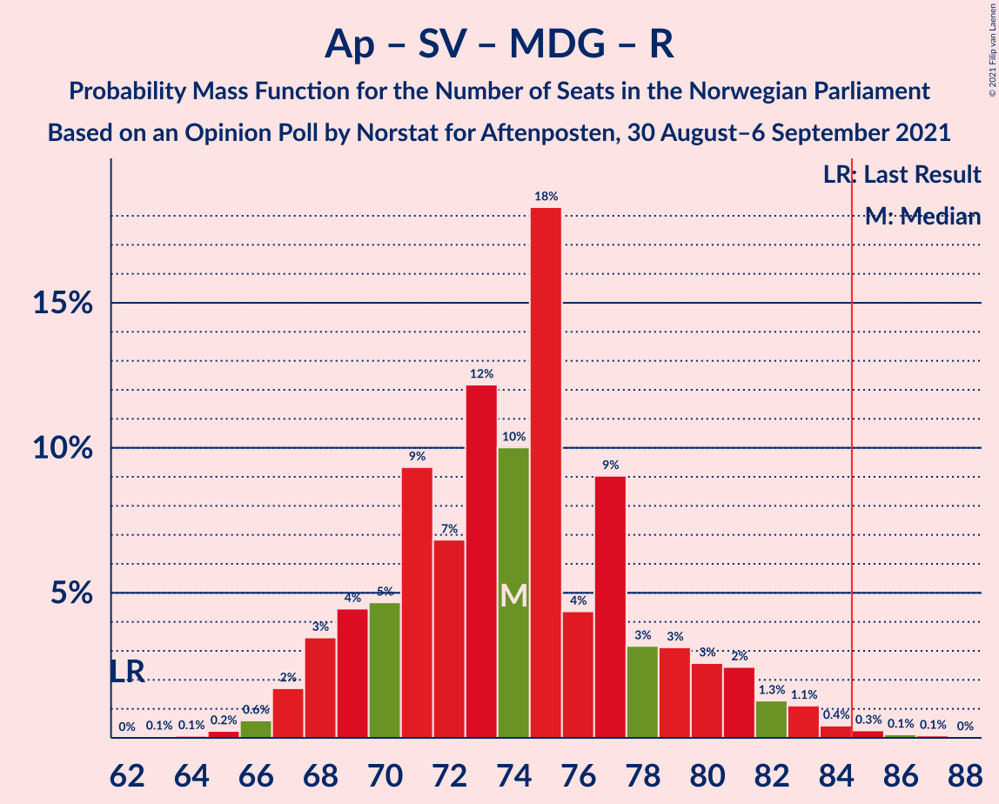

| Number of Seats | Probability | Accumulated | Special Marks |
|:---------------:|:-----------:|:-----------:|:-------------:|
| 62 | 0% | 100% | Last Result |
| 63 | 0.1% | 100% |  |
| 64 | 0.1% | 99.9% |  |
| 65 | 0.2% | 99.9% |  |
| 66 | 0.6% | 99.6% |  |
| 67 | 2% | 99.0% |  |
| 68 | 3% | 97% |  |
| 69 | 4% | 94% |  |
| 70 | 5% | 89% |  |
| 71 | 9% | 85% |  |
| 72 | 7% | 75% |  |
| 73 | 12% | 69% |  |
| 74 | 10% | 56% | Median |
| 75 | 18% | 46% |  |
| 76 | 4% | 28% |  |
| 77 | 9% | 24% |  |
| 78 | 3% | 15% |  |
| 79 | 3% | 11% |  |
| 80 | 3% | 8% |  |
| 81 | 2% | 6% |  |
| 82 | 1.3% | 3% |  |
| 83 | 1.1% | 2% |  |
| 84 | 0.4% | 0.9% |  |
| 85 | 0.3% | 0.5% | Majority |
| 86 | 0.1% | 0.2% |  |
| 87 | 0.1% | 0.1% |  |
| 88 | 0% | 0% |  |

### Arbeiderpartiet – Senterpartiet – Kristelig Folkeparti

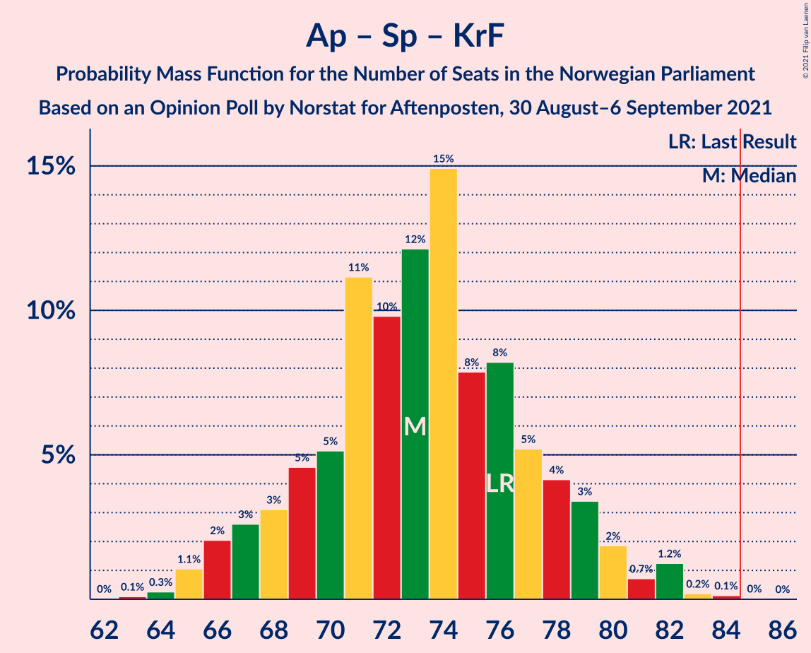

| Number of Seats | Probability | Accumulated | Special Marks |
|:---------------:|:-----------:|:-----------:|:-------------:|
| 63 | 0.1% | 100% |  |
| 64 | 0.3% | 99.9% |  |
| 65 | 1.1% | 99.6% |  |
| 66 | 2% | 98.5% |  |
| 67 | 3% | 96% |  |
| 68 | 3% | 94% |  |
| 69 | 5% | 91% |  |
| 70 | 5% | 86% |  |
| 71 | 11% | 81% |  |
| 72 | 10% | 70% |  |
| 73 | 12% | 60% |  |
| 74 | 15% | 48% | Median |
| 75 | 8% | 33% |  |
| 76 | 8% | 25% | Last Result |
| 77 | 5% | 17% |  |
| 78 | 4% | 12% |  |
| 79 | 3% | 8% |  |
| 80 | 2% | 4% |  |
| 81 | 0.7% | 2% |  |
| 82 | 1.2% | 2% |  |
| 83 | 0.2% | 0.4% |  |
| 84 | 0.1% | 0.2% |  |
| 85 | 0% | 0.1% | Majority |
| 86 | 0% | 0% |  |

### Høyre – Fremskrittspartiet – Miljøpartiet De Grønne – Venstre – Kristelig Folkeparti

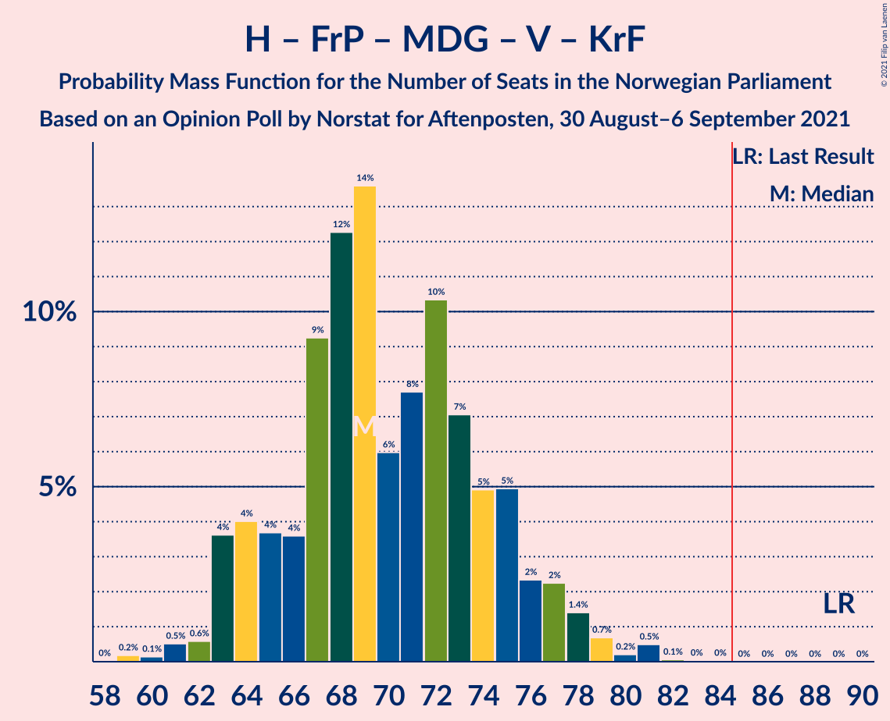

| Number of Seats | Probability | Accumulated | Special Marks |
|:---------------:|:-----------:|:-----------:|:-------------:|
| 58 | 0% | 100% |  |
| 59 | 0.2% | 99.9% |  |
| 60 | 0.1% | 99.8% |  |
| 61 | 0.5% | 99.6% |  |
| 62 | 0.6% | 99.1% |  |
| 63 | 4% | 98.5% |  |
| 64 | 4% | 95% |  |
| 65 | 4% | 91% |  |
| 66 | 4% | 87% |  |
| 67 | 9% | 84% |  |
| 68 | 12% | 74% |  |
| 69 | 14% | 62% | Median |
| 70 | 6% | 48% |  |
| 71 | 8% | 42% |  |
| 72 | 10% | 35% |  |
| 73 | 7% | 24% |  |
| 74 | 5% | 17% |  |
| 75 | 5% | 12% |  |
| 76 | 2% | 8% |  |
| 77 | 2% | 5% |  |
| 78 | 1.4% | 3% |  |
| 79 | 0.7% | 2% |  |
| 80 | 0.2% | 0.8% |  |
| 81 | 0.5% | 0.6% |  |
| 82 | 0.1% | 0.1% |  |
| 83 | 0% | 0.1% |  |
| 84 | 0% | 0% |  |
| 85 | 0% | 0% | Majority |
| 86 | 0% | 0% |  |
| 87 | 0% | 0% |  |
| 88 | 0% | 0% |  |
| 89 | 0% | 0% | Last Result |

### Arbeiderpartiet – Senterpartiet

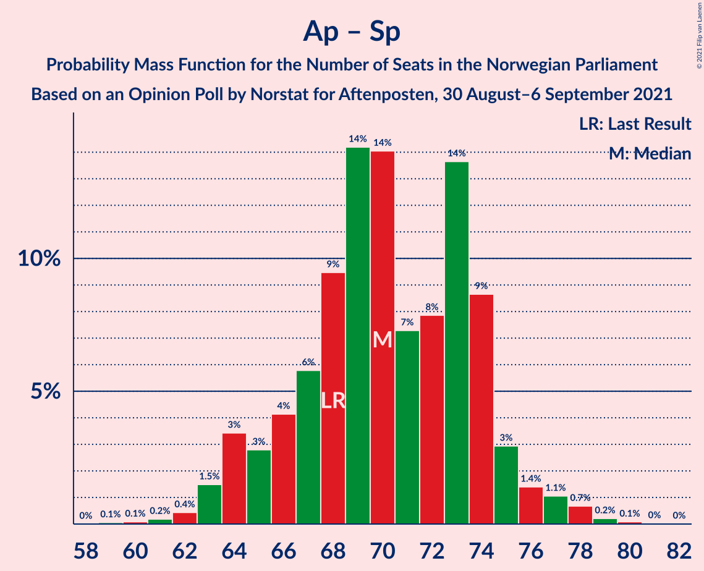

| Number of Seats | Probability | Accumulated | Special Marks |
|:---------------:|:-----------:|:-----------:|:-------------:|
| 59 | 0.1% | 100% |  |
| 60 | 0.1% | 99.9% |  |
| 61 | 0.2% | 99.9% |  |
| 62 | 0.4% | 99.7% |  |
| 63 | 1.5% | 99.2% |  |
| 64 | 3% | 98% |  |
| 65 | 3% | 94% |  |
| 66 | 4% | 92% |  |
| 67 | 6% | 87% |  |
| 68 | 9% | 82% | Last Result |
| 69 | 14% | 72% |  |
| 70 | 14% | 58% |  |
| 71 | 7% | 44% | Median |
| 72 | 8% | 37% |  |
| 73 | 14% | 29% |  |
| 74 | 9% | 15% |  |
| 75 | 3% | 6% |  |
| 76 | 1.4% | 3% |  |
| 77 | 1.1% | 2% |  |
| 78 | 0.7% | 1.0% |  |
| 79 | 0.2% | 0.3% |  |
| 80 | 0.1% | 0.1% |  |
| 81 | 0% | 0% |  |

### Høyre – Fremskrittspartiet – Venstre – Kristelig Folkeparti

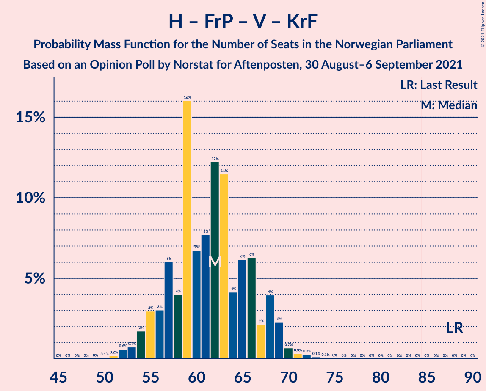

| Number of Seats | Probability | Accumulated | Special Marks |
|:---------------:|:-----------:|:-----------:|:-------------:|
| 50 | 0.1% | 100% |  |
| 51 | 0.2% | 99.9% |  |
| 52 | 0.6% | 99.7% |  |
| 53 | 0.7% | 99.1% |  |
| 54 | 2% | 98% |  |
| 55 | 3% | 97% |  |
| 56 | 3% | 94% |  |
| 57 | 6% | 91% |  |
| 58 | 4% | 85% |  |
| 59 | 16% | 81% |  |
| 60 | 7% | 65% |  |
| 61 | 8% | 58% | Median |
| 62 | 12% | 50% |  |
| 63 | 11% | 38% |  |
| 64 | 4% | 26% |  |
| 65 | 6% | 22% |  |
| 66 | 6% | 16% |  |
| 67 | 2% | 10% |  |
| 68 | 4% | 8% |  |
| 69 | 2% | 4% |  |
| 70 | 0.7% | 2% |  |
| 71 | 0.3% | 0.8% |  |
| 72 | 0.3% | 0.5% |  |
| 73 | 0.1% | 0.2% |  |
| 74 | 0.1% | 0.1% |  |
| 75 | 0% | 0% |  |
| 76 | 0% | 0% |  |
| 77 | 0% | 0% |  |
| 78 | 0% | 0% |  |
| 79 | 0% | 0% |  |
| 80 | 0% | 0% |  |
| 81 | 0% | 0% |  |
| 82 | 0% | 0% |  |
| 83 | 0% | 0% |  |
| 84 | 0% | 0% |  |
| 85 | 0% | 0% | Majority |
| 86 | 0% | 0% |  |
| 87 | 0% | 0% |  |
| 88 | 0% | 0% | Last Result |

### Høyre – Fremskrittspartiet – Venstre

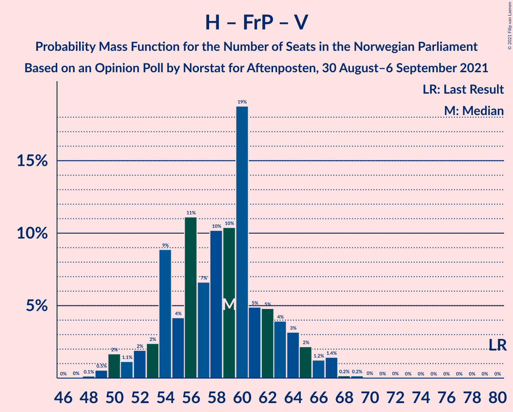

| Number of Seats | Probability | Accumulated | Special Marks |
|:---------------:|:-----------:|:-----------:|:-------------:|
| 47 | 0% | 100% |  |
| 48 | 0.1% | 99.9% |  |
| 49 | 0.5% | 99.8% |  |
| 50 | 2% | 99.3% |  |
| 51 | 1.1% | 98% |  |
| 52 | 2% | 96% |  |
| 53 | 2% | 95% |  |
| 54 | 9% | 92% |  |
| 55 | 4% | 83% |  |
| 56 | 11% | 79% |  |
| 57 | 7% | 68% |  |
| 58 | 10% | 61% | Median |
| 59 | 10% | 51% |  |
| 60 | 19% | 41% |  |
| 61 | 5% | 22% |  |
| 62 | 5% | 17% |  |
| 63 | 4% | 12% |  |
| 64 | 3% | 8% |  |
| 65 | 2% | 5% |  |
| 66 | 1.2% | 3% |  |
| 67 | 1.4% | 2% |  |
| 68 | 0.2% | 0.4% |  |
| 69 | 0.2% | 0.2% |  |
| 70 | 0% | 0.1% |  |
| 71 | 0% | 0% |  |
| 72 | 0% | 0% |  |
| 73 | 0% | 0% |  |
| 74 | 0% | 0% |  |
| 75 | 0% | 0% |  |
| 76 | 0% | 0% |  |
| 77 | 0% | 0% |  |
| 78 | 0% | 0% |  |
| 79 | 0% | 0% |  |
| 80 | 0% | 0% | Last Result |

### Arbeiderpartiet – Sosialistisk Venstreparti

| Number of Seats | Probability | Accumulated | Special Marks |
|:---------------:|:-----------:|:-----------:|:-------------:|
| 49 | 0.1% | 100% |  |
| 50 | 0.1% | 99.9% |  |
| 51 | 0.6% | 99.8% |  |
| 52 | 3% | 99.2% |  |
| 53 | 2% | 96% |  |
| 54 | 11% | 94% |  |
| 55 | 7% | 83% |  |
| 56 | 13% | 76% |  |
| 57 | 15% | 63% |  |
| 58 | 18% | 48% | Median |
| 59 | 10% | 30% |  |
| 60 | 7% | 19% | Last Result |
| 61 | 5% | 12% |  |
| 62 | 2% | 7% |  |
| 63 | 3% | 5% |  |
| 64 | 0.9% | 2% |  |
| 65 | 0.4% | 1.2% |  |
| 66 | 0.4% | 0.8% |  |
| 67 | 0.2% | 0.4% |  |
| 68 | 0.1% | 0.2% |  |
| 69 | 0.1% | 0.1% |  |
| 70 | 0% | 0% |  |

### Høyre – Fremskrittspartiet

| Number of Seats | Probability | Accumulated | Special Marks |
|:---------------:|:-----------:|:-----------:|:-------------:|
| 45 | 0.1% | 100% |  |
| 46 | 0.3% | 99.9% |  |
| 47 | 1.2% | 99.6% |  |
| 48 | 3% | 98% |  |
| 49 | 3% | 95% |  |
| 50 | 3% | 92% |  |
| 51 | 3% | 89% |  |
| 52 | 9% | 86% |  |
| 53 | 10% | 77% |  |
| 54 | 12% | 67% |  |
| 55 | 6% | 55% |  |
| 56 | 11% | 49% | Median |
| 57 | 5% | 37% |  |
| 58 | 19% | 32% |  |
| 59 | 5% | 13% |  |
| 60 | 5% | 9% |  |
| 61 | 2% | 3% |  |
| 62 | 0.8% | 1.3% |  |
| 63 | 0.2% | 0.5% |  |
| 64 | 0.1% | 0.3% |  |
| 65 | 0.1% | 0.1% |  |
| 66 | 0% | 0% |  |
| 67 | 0% | 0% |  |
| 68 | 0% | 0% |  |
| 69 | 0% | 0% |  |
| 70 | 0% | 0% |  |
| 71 | 0% | 0% |  |
| 72 | 0% | 0% | Last Result |

### Høyre – Venstre – Kristelig Folkeparti

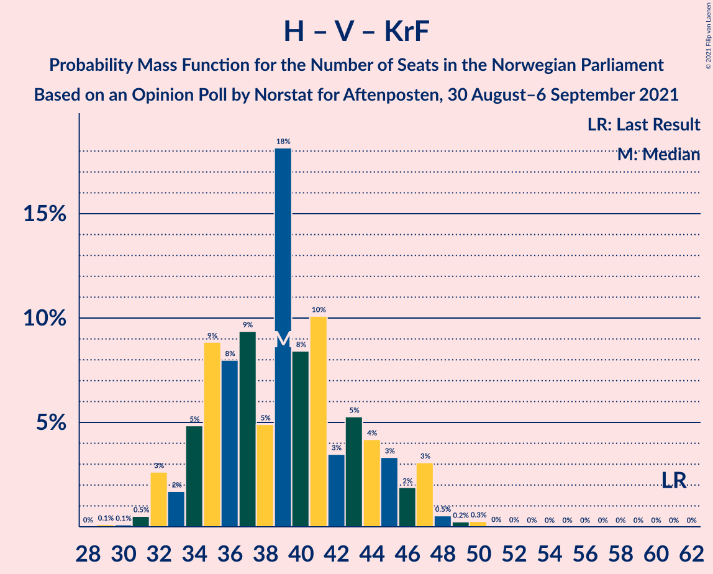

| Number of Seats | Probability | Accumulated | Special Marks |
|:---------------:|:-----------:|:-----------:|:-------------:|
| 29 | 0.1% | 100% |  |
| 30 | 0.1% | 99.9% |  |
| 31 | 0.5% | 99.8% |  |
| 32 | 3% | 99.3% |  |
| 33 | 2% | 97% |  |
| 34 | 5% | 95% |  |
| 35 | 9% | 90% |  |
| 36 | 8% | 81% |  |
| 37 | 9% | 73% |  |
| 38 | 5% | 64% | Median |
| 39 | 18% | 59% |  |
| 40 | 8% | 41% |  |
| 41 | 10% | 32% |  |
| 42 | 3% | 22% |  |
| 43 | 5% | 19% |  |
| 44 | 4% | 14% |  |
| 45 | 3% | 9% |  |
| 46 | 2% | 6% |  |
| 47 | 3% | 4% |  |
| 48 | 0.5% | 1.1% |  |
| 49 | 0.2% | 0.6% |  |
| 50 | 0.3% | 0.3% |  |
| 51 | 0% | 0.1% |  |
| 52 | 0% | 0% |  |
| 53 | 0% | 0% |  |
| 54 | 0% | 0% |  |
| 55 | 0% | 0% |  |
| 56 | 0% | 0% |  |
| 57 | 0% | 0% |  |
| 58 | 0% | 0% |  |
| 59 | 0% | 0% |  |
| 60 | 0% | 0% |  |
| 61 | 0% | 0% | Last Result |

### Senterpartiet – Venstre – Kristelig Folkeparti

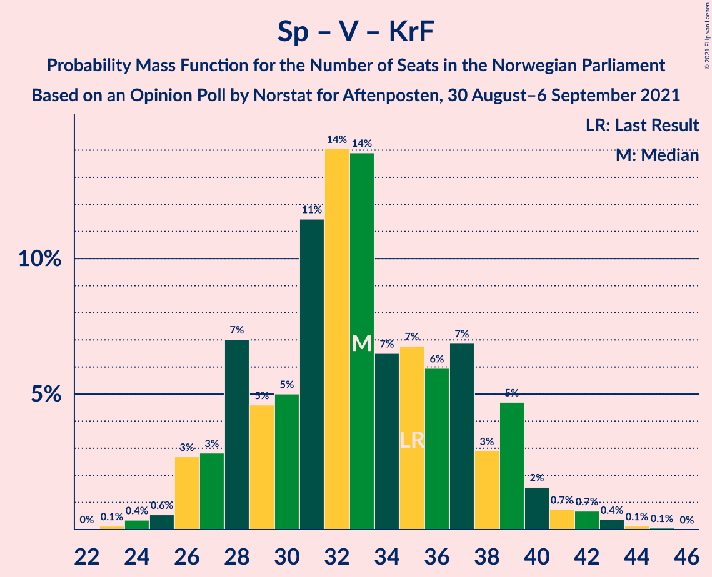

| Number of Seats | Probability | Accumulated | Special Marks |
|:---------------:|:-----------:|:-----------:|:-------------:|
| 23 | 0.1% | 100% |  |
| 24 | 0.4% | 99.8% |  |
| 25 | 0.6% | 99.5% |  |
| 26 | 3% | 98.9% |  |
| 27 | 3% | 96% |  |
| 28 | 7% | 93% |  |
| 29 | 5% | 86% |  |
| 30 | 5% | 82% |  |
| 31 | 11% | 77% |  |
| 32 | 14% | 65% | Median |
| 33 | 14% | 51% |  |
| 34 | 7% | 37% |  |
| 35 | 7% | 31% | Last Result |
| 36 | 6% | 24% |  |
| 37 | 7% | 18% |  |
| 38 | 3% | 11% |  |
| 39 | 5% | 8% |  |
| 40 | 2% | 4% |  |
| 41 | 0.7% | 2% |  |
| 42 | 0.7% | 1.3% |  |
| 43 | 0.4% | 0.6% |  |
| 44 | 0.1% | 0.2% |  |
| 45 | 0.1% | 0.1% |  |
| 46 | 0% | 0% |  |

## Technical Information

### Opinion Poll

+ **Polling firm:** Norstat
+ **Commissioner(s):** Aftenposten
+ **Fieldwork period:** 30 August–6 September 2021

### Calculations

+ **Sample size:** 969
+ **Simulations done:** 1,048,576
+ **Error estimate:** 1.25%

