# Opinion Poll by Kantar TNS for TV2, 9–11 September 2021

<a href="#voting-intentions">Voting Intentions</a> | <a href="#seats">Seats</a> | <a href="#coalitions">Coalitions</a> | <a href="#technical-information">Technical Information</a>

## Voting Intentions

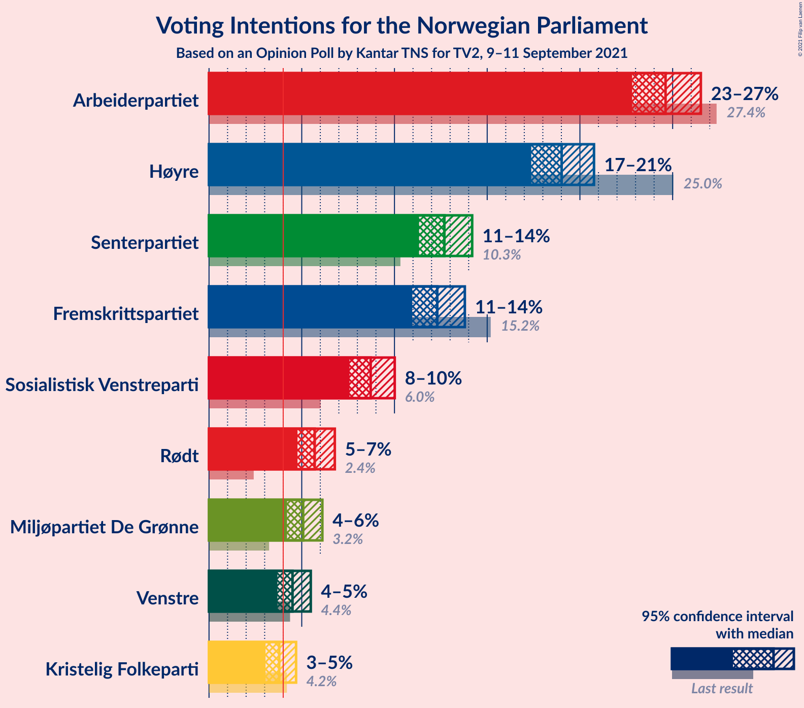

### Confidence Intervals

| Party | Last Result | Poll Result | 80% Confidence Interval | 90% Confidence Interval | 95% Confidence Interval | 99% Confidence Interval |
|:-----:|:-----------:|:-----------:|:-----------------------:|:-----------------------:|:-----------------------:|:-----------------------:|
| Arbeiderpartiet | 27.4% | 24.6% | 23.4–25.9% |23.1–26.2% |22.8–26.5% |22.3–27.1% |
| Høyre | 25.0% | 19.0% | 17.9–20.2% |17.6–20.5% |17.4–20.8% |16.9–21.3% |
| Senterpartiet | 10.3% | 12.7% | 11.8–13.7% |11.5–13.9% |11.3–14.2% |10.9–14.7% |
| Fremskrittspartiet | 15.2% | 12.3% | 11.4–13.3% |11.2–13.5% |11.0–13.8% |10.5–14.3% |
| Sosialistisk Venstreparti | 6.0% | 8.7% | 8.0–9.6% |7.8–9.8% |7.6–10.0% |7.2–10.4% |
| Rødt | 2.4% | 5.7% | 5.1–6.4% |4.9–6.6% |4.8–6.8% |4.5–7.1% |
| Miljøpartiet De Grønne | 3.2% | 5.1% | 4.5–5.7% |4.3–5.9% |4.2–6.1% |3.9–6.4% |
| Venstre | 4.4% | 4.5% | 4.0–5.2% |3.8–5.3% |3.7–5.5% |3.4–5.8% |
| Kristelig Folkeparti | 4.2% | 3.8% | 3.3–4.4% |3.2–4.5% |3.0–4.7% |2.8–5.0% |

*Note:* The poll result column reflects the actual value used in the calculations. Published results may vary slightly, and in addition be rounded to fewer digits.

## Seats

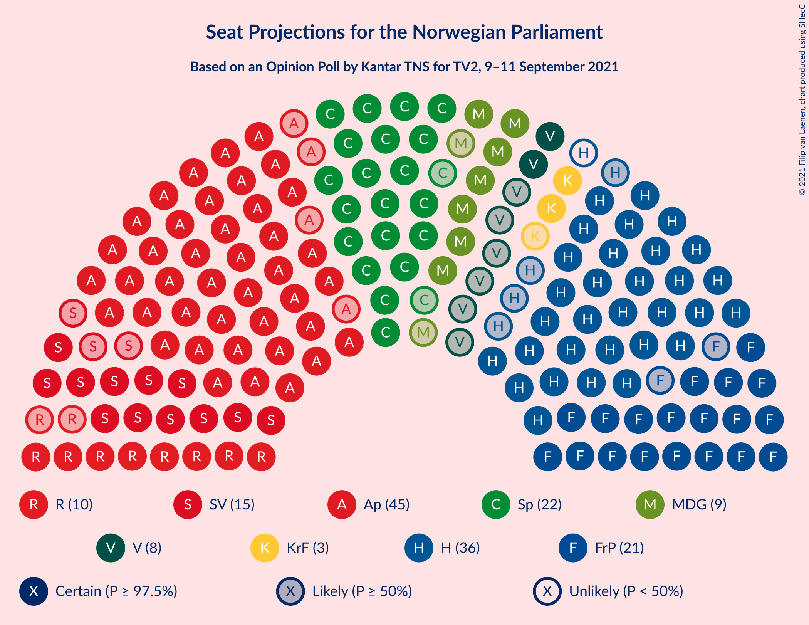

### Confidence Intervals

| Party | Last Result | Median | 80% Confidence Interval | 90% Confidence Interval | 95% Confidence Interval | 99% Confidence Interval |
|:-----:|:-----------:|:------:|:-----------------------:|:-----------------------:|:-----------------------:|:-----------------------:|
| <a href="#arbeiderpartiet">Arbeiderpartiet</a> | 49 | 45 | 43–46 |42–48 |41–48 |41–51 |
| <a href="#høyre">Høyre</a> | 45 | 35 | 33–36 |31–37 |31–37 |30–38 |
| <a href="#senterpartiet">Senterpartiet</a> | 19 | 22 | 21–25 |20–25 |20–27 |19–27 |
| <a href="#fremskrittspartiet">Fremskrittspartiet</a> | 27 | 21 | 20–23 |19–25 |19–26 |18–27 |
| <a href="#sosialistisk-venstreparti">Sosialistisk Venstreparti</a> | 11 | 15 | 13–17 |12–17 |12–18 |11–18 |
| <a href="#rødt">Rødt</a> | 1 | 10 | 8–11 |8–11 |8–12 |7–12 |
| <a href="#miljøpartiet-de-grønne">Miljøpartiet De Grønne</a> | 1 | 9 | 7–10 |7–10 |7–11 |2–11 |
| <a href="#venstre">Venstre</a> | 8 | 8 | 2–9 |2–9 |2–9 |2–10 |
| <a href="#kristelig-folkeparti">Kristelig Folkeparti</a> | 8 | 3 | 2–7 |2–7 |2–8 |1–8 |

### Arbeiderpartiet

*For a full overview of the results for this party, see the [Arbeiderpartiet](party-arbeiderpartiet.html) page.*

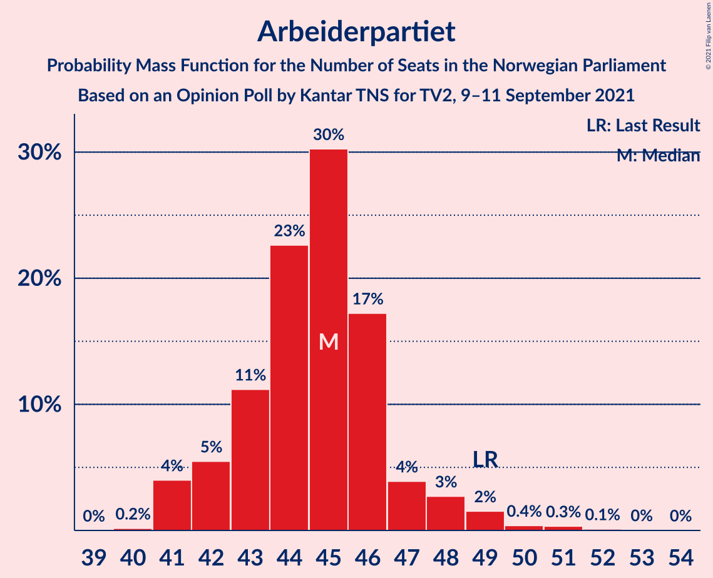

| Number of Seats | Probability | Accumulated | Special Marks |
|:---------------:|:-----------:|:-----------:|:-------------:|
| 40 | 0.2% | 100% |  |
| 41 | 4% | 99.8% |  |
| 42 | 5% | 96% |  |
| 43 | 11% | 90% |  |
| 44 | 23% | 79% |  |
| 45 | 30% | 57% | Median |
| 46 | 17% | 26% |  |
| 47 | 4% | 9% |  |
| 48 | 3% | 5% |  |
| 49 | 2% | 2% | Last Result |
| 50 | 0.4% | 0.9% |  |
| 51 | 0.3% | 0.5% |  |
| 52 | 0.1% | 0.2% |  |
| 53 | 0% | 0.1% |  |
| 54 | 0% | 0% |  |

### Høyre

*For a full overview of the results for this party, see the [Høyre](party-høyre.html) page.*

| Number of Seats | Probability | Accumulated | Special Marks |
|:---------------:|:-----------:|:-----------:|:-------------:|
| 28 | 0.1% | 100% |  |
| 29 | 0.3% | 99.9% |  |
| 30 | 0.9% | 99.6% |  |
| 31 | 4% | 98.7% |  |
| 32 | 4% | 95% |  |
| 33 | 8% | 91% |  |
| 34 | 8% | 83% |  |
| 35 | 27% | 75% | Median |
| 36 | 42% | 48% |  |
| 37 | 5% | 6% |  |
| 38 | 0.8% | 1.2% |  |
| 39 | 0.3% | 0.3% |  |
| 40 | 0% | 0.1% |  |
| 41 | 0% | 0% |  |
| 42 | 0% | 0% |  |
| 43 | 0% | 0% |  |
| 44 | 0% | 0% |  |
| 45 | 0% | 0% | Last Result |

### Senterpartiet

*For a full overview of the results for this party, see the [Senterpartiet](party-senterpartiet.html) page.*

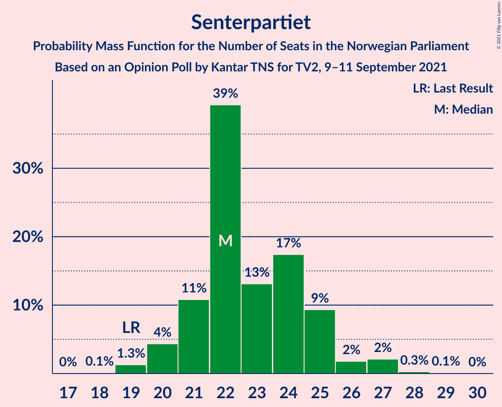

| Number of Seats | Probability | Accumulated | Special Marks |
|:---------------:|:-----------:|:-----------:|:-------------:|
| 18 | 0.1% | 100% |  |
| 19 | 1.3% | 99.9% | Last Result |
| 20 | 4% | 98.6% |  |
| 21 | 11% | 94% |  |
| 22 | 39% | 83% | Median |
| 23 | 13% | 44% |  |
| 24 | 17% | 31% |  |
| 25 | 9% | 14% |  |
| 26 | 2% | 4% |  |
| 27 | 2% | 3% |  |
| 28 | 0.3% | 0.4% |  |
| 29 | 0.1% | 0.1% |  |
| 30 | 0% | 0% |  |

### Fremskrittspartiet

*For a full overview of the results for this party, see the [Fremskrittspartiet](party-fremskrittspartiet.html) page.*

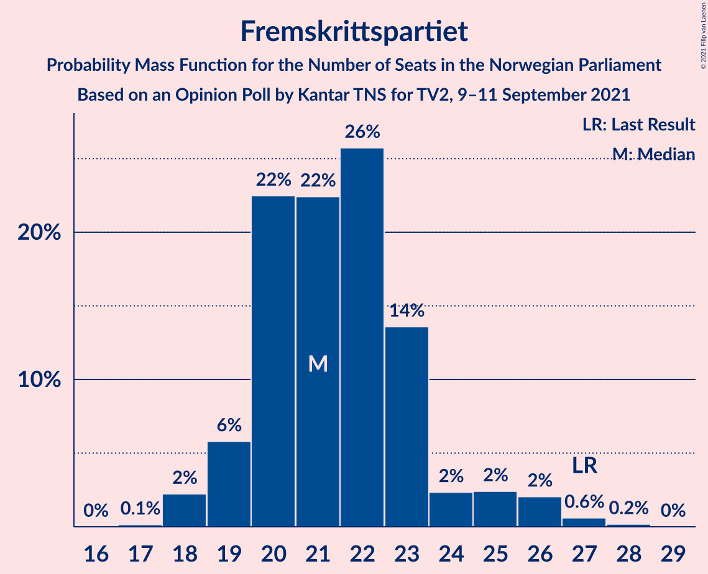

| Number of Seats | Probability | Accumulated | Special Marks |
|:---------------:|:-----------:|:-----------:|:-------------:|
| 17 | 0.1% | 100% |  |
| 18 | 2% | 99.8% |  |
| 19 | 6% | 98% |  |
| 20 | 22% | 92% |  |
| 21 | 22% | 69% | Median |
| 22 | 26% | 47% |  |
| 23 | 14% | 21% |  |
| 24 | 2% | 8% |  |
| 25 | 2% | 5% |  |
| 26 | 2% | 3% |  |
| 27 | 0.6% | 0.8% | Last Result |
| 28 | 0.2% | 0.2% |  |
| 29 | 0% | 0% |  |

### Sosialistisk Venstreparti

*For a full overview of the results for this party, see the [Sosialistisk Venstreparti](party-sosialistiskvenstreparti.html) page.*

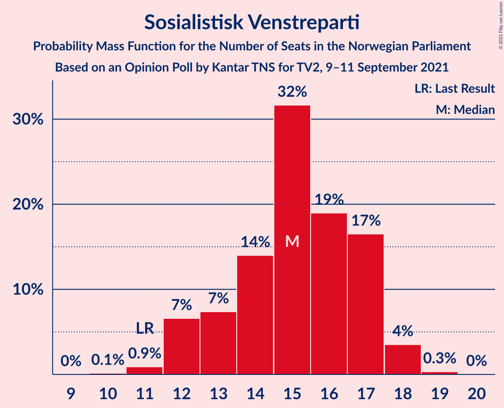

| Number of Seats | Probability | Accumulated | Special Marks |
|:---------------:|:-----------:|:-----------:|:-------------:|
| 10 | 0.1% | 100% |  |
| 11 | 0.9% | 99.9% | Last Result |
| 12 | 7% | 99.0% |  |
| 13 | 7% | 92% |  |
| 14 | 14% | 85% |  |
| 15 | 32% | 71% | Median |
| 16 | 19% | 39% |  |
| 17 | 17% | 20% |  |
| 18 | 4% | 4% |  |
| 19 | 0.3% | 0.4% |  |
| 20 | 0% | 0% |  |

### Rødt

*For a full overview of the results for this party, see the [Rødt](party-rødt.html) page.*

| Number of Seats | Probability | Accumulated | Special Marks |
|:---------------:|:-----------:|:-----------:|:-------------:|
| 1 | 0% | 100% | Last Result |
| 2 | 0% | 100% |  |
| 3 | 0% | 100% |  |
| 4 | 0% | 100% |  |
| 5 | 0% | 100% |  |
| 6 | 0% | 100% |  |
| 7 | 2% | 100% |  |
| 8 | 9% | 98% |  |
| 9 | 18% | 88% |  |
| 10 | 48% | 70% | Median |
| 11 | 20% | 23% |  |
| 12 | 2% | 3% |  |
| 13 | 0.4% | 0.5% |  |
| 14 | 0% | 0% |  |

### Miljøpartiet De Grønne

*For a full overview of the results for this party, see the [Miljøpartiet De Grønne](party-miljøpartietdegrønne.html) page.*

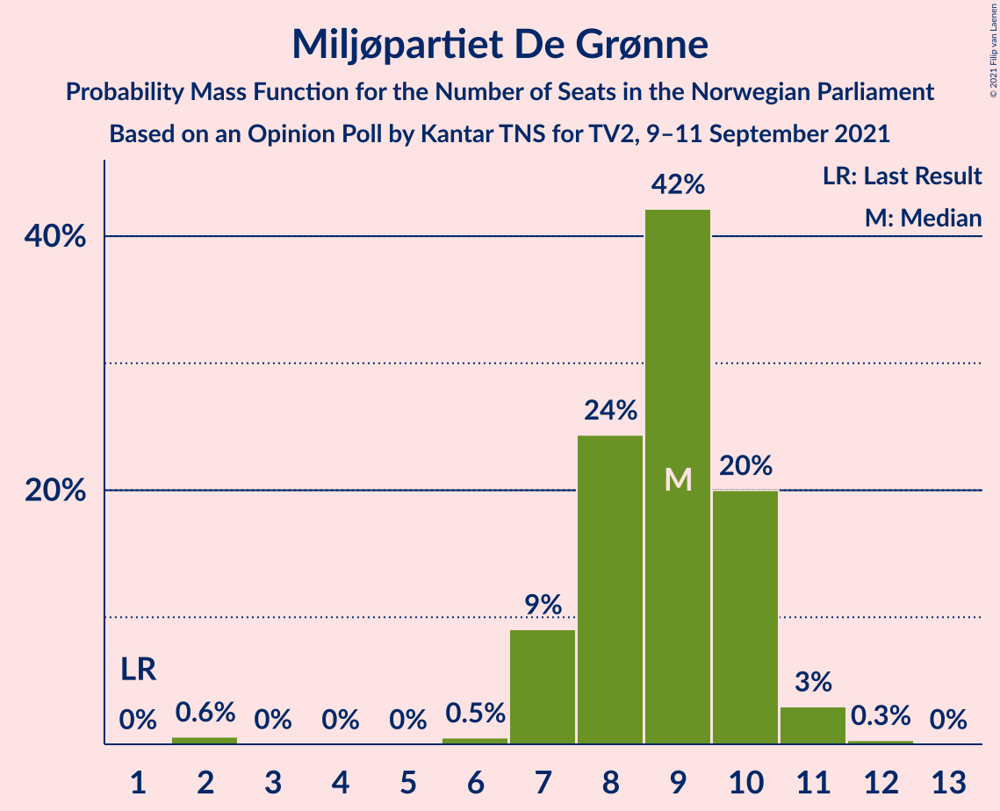

| Number of Seats | Probability | Accumulated | Special Marks |
|:---------------:|:-----------:|:-----------:|:-------------:|
| 1 | 0% | 100% | Last Result |
| 2 | 0.6% | 100% |  |
| 3 | 0% | 99.4% |  |
| 4 | 0% | 99.4% |  |
| 5 | 0% | 99.4% |  |
| 6 | 0.5% | 99.4% |  |
| 7 | 9% | 98.9% |  |
| 8 | 24% | 90% |  |
| 9 | 42% | 65% | Median |
| 10 | 20% | 23% |  |
| 11 | 3% | 3% |  |
| 12 | 0.3% | 0.3% |  |
| 13 | 0% | 0% |  |

### Venstre

*For a full overview of the results for this party, see the [Venstre](party-venstre.html) page.*

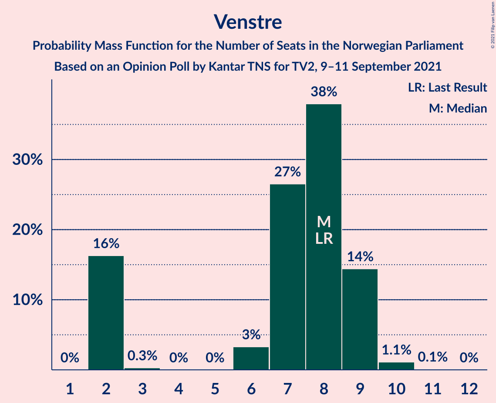

| Number of Seats | Probability | Accumulated | Special Marks |
|:---------------:|:-----------:|:-----------:|:-------------:|
| 2 | 16% | 100% |  |
| 3 | 0.3% | 84% |  |
| 4 | 0% | 83% |  |
| 5 | 0% | 83% |  |
| 6 | 3% | 83% |  |
| 7 | 27% | 80% |  |
| 8 | 38% | 54% | Last Result, Median |
| 9 | 14% | 16% |  |
| 10 | 1.1% | 1.2% |  |
| 11 | 0.1% | 0.1% |  |
| 12 | 0% | 0% |  |

### Kristelig Folkeparti

*For a full overview of the results for this party, see the [Kristelig Folkeparti](party-kristeligfolkeparti.html) page.*

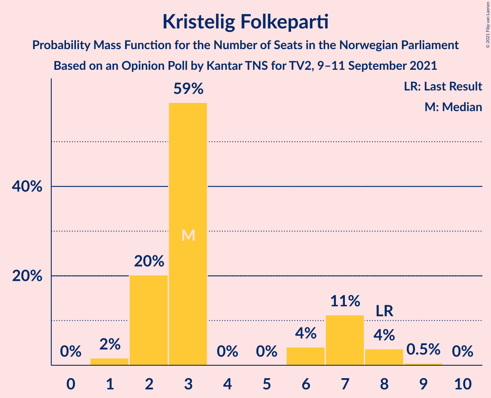

| Number of Seats | Probability | Accumulated | Special Marks |
|:---------------:|:-----------:|:-----------:|:-------------:|
| 1 | 2% | 100% |  |
| 2 | 20% | 98% |  |
| 3 | 59% | 78% | Median |
| 4 | 0% | 19% |  |
| 5 | 0% | 19% |  |
| 6 | 4% | 19% |  |
| 7 | 11% | 15% |  |
| 8 | 4% | 4% | Last Result |
| 9 | 0.5% | 0.5% |  |
| 10 | 0% | 0% |  |

## Coalitions

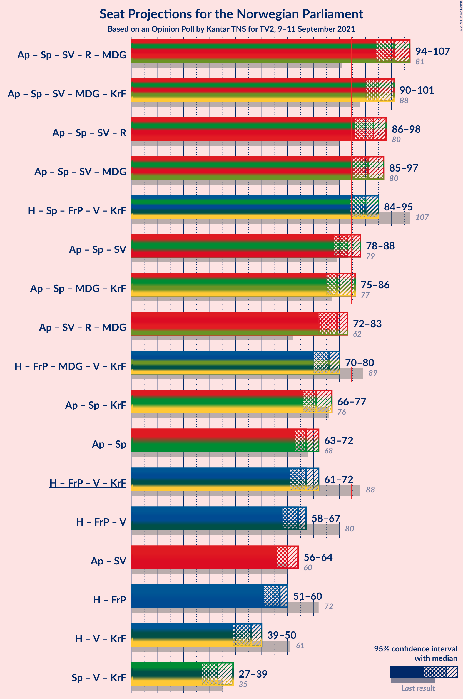

### Confidence Intervals

| Coalition | Last Result | Median | Majority? | 80% Confidence Interval | 90% Confidence Interval | 95% Confidence Interval | 99% Confidence Interval |
|:---------:|:-----------:|:------:|:---------:|:-----------------------:|:-----------------------:|:-----------------------:|:-----------------------:|
| Arbeiderpartiet – Senterpartiet – Sosialistisk Venstreparti – Rødt – Miljøpartiet De Grønne | 81 | 101 | 100% | 97–105 | 96–106 | 94–107 | 92–109 |
| Arbeiderpartiet – Senterpartiet – Sosialistisk Venstreparti – Miljøpartiet De Grønne – Kristelig Folkeparti | 88 | 95 | 100% | 92–98 | 90–100 | 90–101 | 87–102 |
| Arbeiderpartiet – Senterpartiet – Sosialistisk Venstreparti – Rødt | 80 | 93 | 99.6% | 89–96 | 87–97 | 86–98 | 85–100 |
| Arbeiderpartiet – Senterpartiet – Sosialistisk Venstreparti – Miljøpartiet De Grønne | 80 | 91 | 98.9% | 88–94 | 87–96 | 85–97 | 84–99 |
| Høyre – Senterpartiet – Fremskrittspartiet – Venstre – Kristelig Folkeparti | 107 | 90 | 97% | 86–92 | 86–93 | 84–95 | 81–96 |
| Arbeiderpartiet – Senterpartiet – Sosialistisk Venstreparti | 79 | 83 | 19% | 80–85 | 79–86 | 78–88 | 76–89 |
| Arbeiderpartiet – Senterpartiet – Miljøpartiet De Grønne – Kristelig Folkeparti | 77 | 79 | 5% | 77–83 | 76–85 | 75–86 | 73–88 |
| Arbeiderpartiet – Sosialistisk Venstreparti – Rødt – Miljøpartiet De Grønne | 62 | 79 | 0.8% | 74–82 | 73–83 | 72–83 | 70–85 |
| Høyre – Fremskrittspartiet – Miljøpartiet De Grønne – Venstre – Kristelig Folkeparti | 89 | 76 | 0.1% | 72–78 | 71–79 | 70–80 | 66–83 |
| Arbeiderpartiet – Senterpartiet – Kristelig Folkeparti | 76 | 71 | 0% | 68–75 | 67–76 | 66–77 | 65–79 |
| Arbeiderpartiet – Senterpartiet | 68 | 67 | 0% | 65–70 | 64–71 | 63–72 | 62–74 |
| Høyre – Fremskrittspartiet – Venstre – Kristelig Folkeparti | 88 | 67 | 0% | 64–70 | 62–71 | 61–72 | 58–75 |
| Høyre – Fremskrittspartiet – Venstre | 80 | 64 | 0% | 60–66 | 58–66 | 58–67 | 54–70 |
| Arbeiderpartiet – Sosialistisk Venstreparti | 60 | 60 | 0% | 57–63 | 57–63 | 56–64 | 55–66 |
| Høyre – Fremskrittspartiet | 72 | 57 | 0% | 54–59 | 53–59 | 51–60 | 50–62 |
| Høyre – Venstre – Kristelig Folkeparti | 61 | 46 | 0% | 41–48 | 41–50 | 39–50 | 36–52 |
| Senterpartiet – Venstre – Kristelig Folkeparti | 35 | 33 | 0% | 29–37 | 27–38 | 27–39 | 26–41 |

### Arbeiderpartiet – Senterpartiet – Sosialistisk Venstreparti – Rødt – Miljøpartiet De Grønne

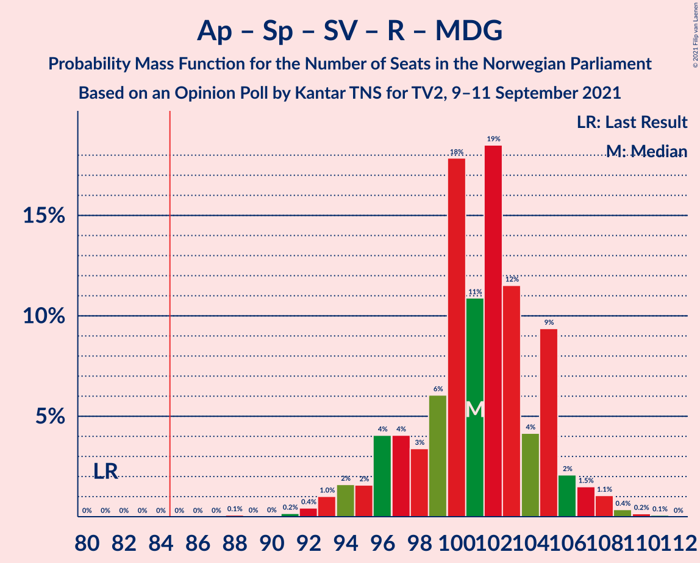

| Number of Seats | Probability | Accumulated | Special Marks |
|:---------------:|:-----------:|:-----------:|:-------------:|
| 81 | 0% | 100% | Last Result |
| 82 | 0% | 100% |  |
| 83 | 0% | 100% |  |
| 84 | 0% | 100% |  |
| 85 | 0% | 100% | Majority |
| 86 | 0% | 100% |  |
| 87 | 0% | 100% |  |
| 88 | 0.1% | 100% |  |
| 89 | 0% | 99.9% |  |
| 90 | 0% | 99.9% |  |
| 91 | 0.2% | 99.9% |  |
| 92 | 0.4% | 99.7% |  |
| 93 | 1.0% | 99.3% |  |
| 94 | 2% | 98% |  |
| 95 | 2% | 97% |  |
| 96 | 4% | 95% |  |
| 97 | 4% | 91% |  |
| 98 | 3% | 87% |  |
| 99 | 6% | 84% |  |
| 100 | 18% | 78% |  |
| 101 | 11% | 60% | Median |
| 102 | 19% | 49% |  |
| 103 | 12% | 30% |  |
| 104 | 4% | 19% |  |
| 105 | 9% | 15% |  |
| 106 | 2% | 5% |  |
| 107 | 1.5% | 3% |  |
| 108 | 1.1% | 2% |  |
| 109 | 0.4% | 0.6% |  |
| 110 | 0.2% | 0.2% |  |
| 111 | 0.1% | 0.1% |  |
| 112 | 0% | 0% |  |

### Arbeiderpartiet – Senterpartiet – Sosialistisk Venstreparti – Miljøpartiet De Grønne – Kristelig Folkeparti

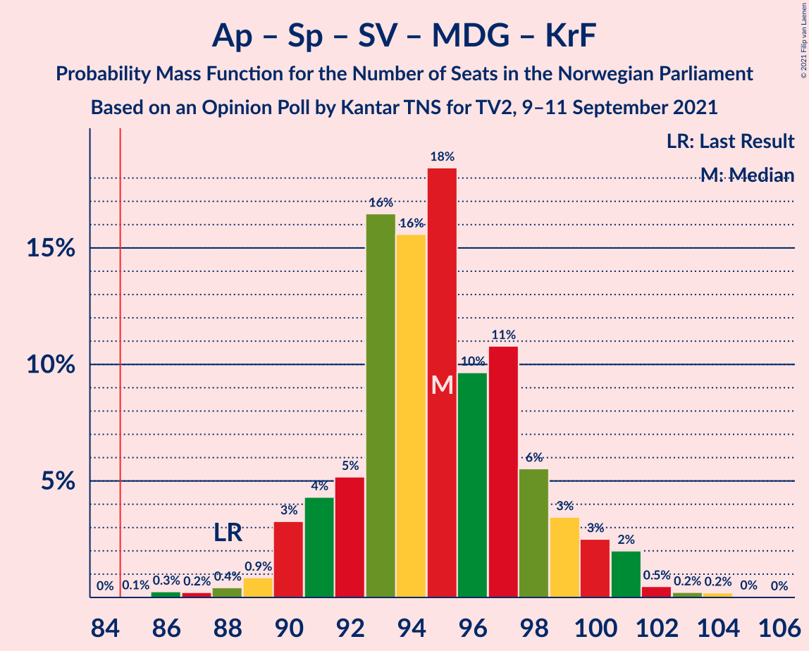

| Number of Seats | Probability | Accumulated | Special Marks |
|:---------------:|:-----------:|:-----------:|:-------------:|
| 85 | 0.1% | 100% | Majority |
| 86 | 0.3% | 99.9% |  |
| 87 | 0.2% | 99.7% |  |
| 88 | 0.4% | 99.4% | Last Result |
| 89 | 0.9% | 99.0% |  |
| 90 | 3% | 98% |  |
| 91 | 4% | 95% |  |
| 92 | 5% | 91% |  |
| 93 | 16% | 85% |  |
| 94 | 16% | 69% | Median |
| 95 | 18% | 53% |  |
| 96 | 10% | 35% |  |
| 97 | 11% | 25% |  |
| 98 | 6% | 14% |  |
| 99 | 3% | 9% |  |
| 100 | 3% | 5% |  |
| 101 | 2% | 3% |  |
| 102 | 0.5% | 1.0% |  |
| 103 | 0.2% | 0.5% |  |
| 104 | 0.2% | 0.3% |  |
| 105 | 0% | 0.1% |  |
| 106 | 0% | 0% |  |

### Arbeiderpartiet – Senterpartiet – Sosialistisk Venstreparti – Rødt

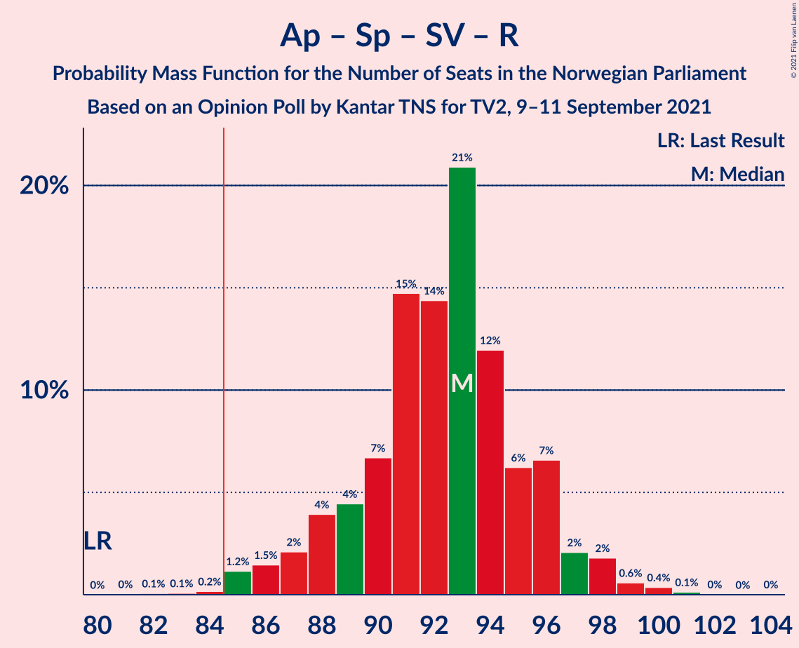

| Number of Seats | Probability | Accumulated | Special Marks |
|:---------------:|:-----------:|:-----------:|:-------------:|
| 80 | 0% | 100% | Last Result |
| 81 | 0% | 100% |  |
| 82 | 0.1% | 100% |  |
| 83 | 0.1% | 99.9% |  |
| 84 | 0.2% | 99.8% |  |
| 85 | 1.2% | 99.6% | Majority |
| 86 | 1.5% | 98% |  |
| 87 | 2% | 97% |  |
| 88 | 4% | 95% |  |
| 89 | 4% | 91% |  |
| 90 | 7% | 87% |  |
| 91 | 15% | 80% |  |
| 92 | 14% | 65% | Median |
| 93 | 21% | 51% |  |
| 94 | 12% | 30% |  |
| 95 | 6% | 18% |  |
| 96 | 7% | 12% |  |
| 97 | 2% | 5% |  |
| 98 | 2% | 3% |  |
| 99 | 0.6% | 1.1% |  |
| 100 | 0.4% | 0.6% |  |
| 101 | 0.1% | 0.2% |  |
| 102 | 0% | 0.1% |  |
| 103 | 0% | 0% |  |

### Arbeiderpartiet – Senterpartiet – Sosialistisk Venstreparti – Miljøpartiet De Grønne

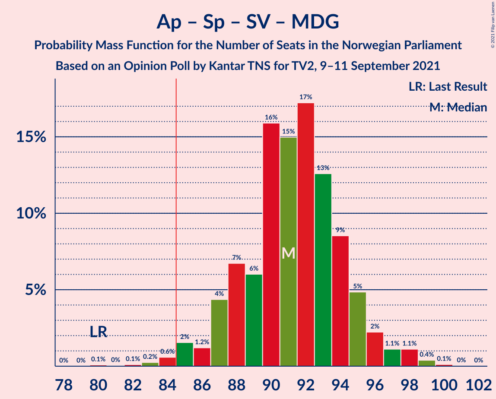

| Number of Seats | Probability | Accumulated | Special Marks |
|:---------------:|:-----------:|:-----------:|:-------------:|
| 80 | 0.1% | 100% | Last Result |
| 81 | 0% | 99.9% |  |
| 82 | 0.1% | 99.9% |  |
| 83 | 0.2% | 99.8% |  |
| 84 | 0.6% | 99.5% |  |
| 85 | 2% | 98.9% | Majority |
| 86 | 1.2% | 97% |  |
| 87 | 4% | 96% |  |
| 88 | 7% | 92% |  |
| 89 | 6% | 85% |  |
| 90 | 16% | 79% |  |
| 91 | 15% | 63% | Median |
| 92 | 17% | 48% |  |
| 93 | 13% | 31% |  |
| 94 | 9% | 18% |  |
| 95 | 5% | 10% |  |
| 96 | 2% | 5% |  |
| 97 | 1.1% | 3% |  |
| 98 | 1.1% | 2% |  |
| 99 | 0.4% | 0.5% |  |
| 100 | 0.1% | 0.2% |  |
| 101 | 0% | 0% |  |

### Høyre – Senterpartiet – Fremskrittspartiet – Venstre – Kristelig Folkeparti

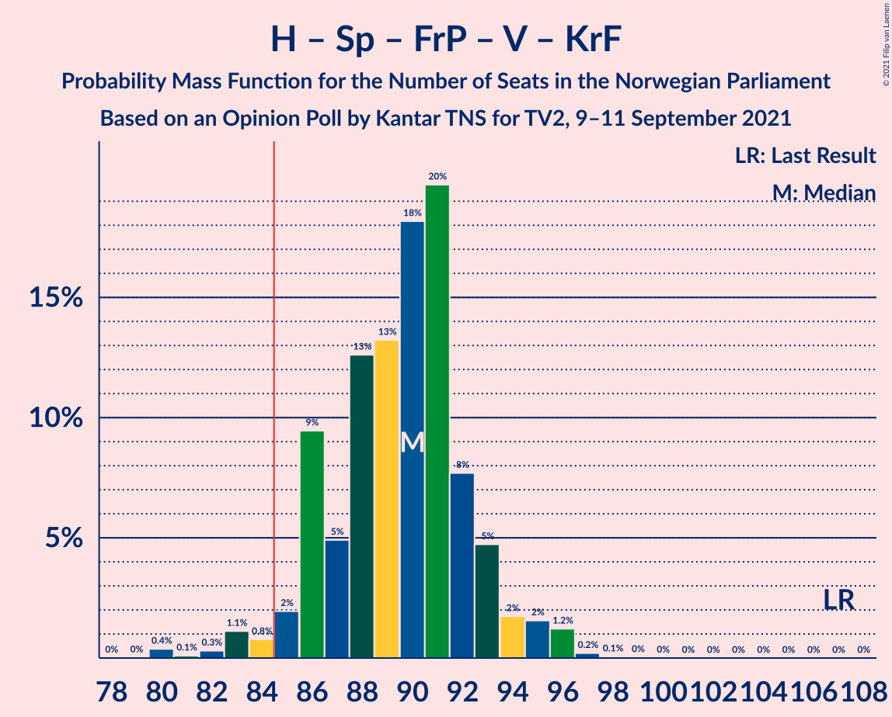

| Number of Seats | Probability | Accumulated | Special Marks |
|:---------------:|:-----------:|:-----------:|:-------------:|
| 80 | 0.4% | 100% |  |
| 81 | 0.1% | 99.6% |  |
| 82 | 0.3% | 99.5% |  |
| 83 | 1.1% | 99.2% |  |
| 84 | 0.8% | 98% |  |
| 85 | 2% | 97% | Majority |
| 86 | 9% | 95% |  |
| 87 | 5% | 86% |  |
| 88 | 13% | 81% |  |
| 89 | 13% | 68% | Median |
| 90 | 18% | 55% |  |
| 91 | 20% | 37% |  |
| 92 | 8% | 17% |  |
| 93 | 5% | 10% |  |
| 94 | 2% | 5% |  |
| 95 | 2% | 3% |  |
| 96 | 1.2% | 2% |  |
| 97 | 0.2% | 0.3% |  |
| 98 | 0.1% | 0.1% |  |
| 99 | 0% | 0% |  |
| 100 | 0% | 0% |  |
| 101 | 0% | 0% |  |
| 102 | 0% | 0% |  |
| 103 | 0% | 0% |  |
| 104 | 0% | 0% |  |
| 105 | 0% | 0% |  |
| 106 | 0% | 0% |  |
| 107 | 0% | 0% | Last Result |

### Arbeiderpartiet – Senterpartiet – Sosialistisk Venstreparti

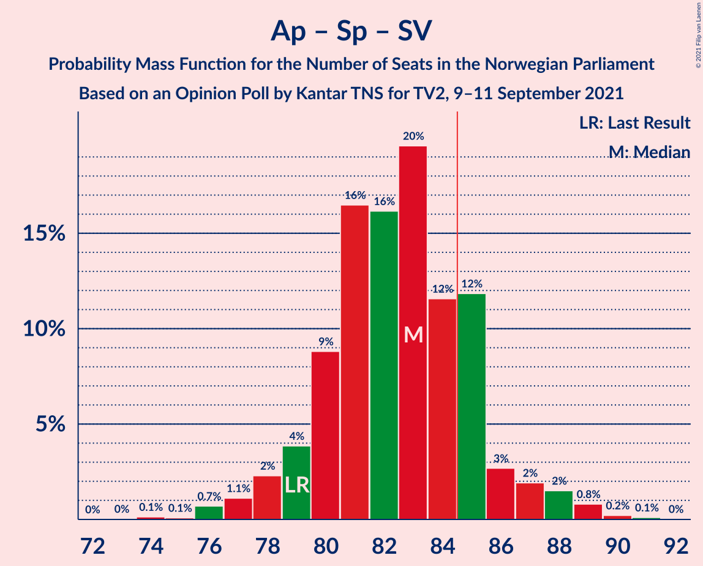

| Number of Seats | Probability | Accumulated | Special Marks |
|:---------------:|:-----------:|:-----------:|:-------------:|
| 74 | 0.1% | 100% |  |
| 75 | 0.1% | 99.8% |  |
| 76 | 0.7% | 99.7% |  |
| 77 | 1.1% | 99.0% |  |
| 78 | 2% | 98% |  |
| 79 | 4% | 96% | Last Result |
| 80 | 9% | 92% |  |
| 81 | 16% | 83% |  |
| 82 | 16% | 66% | Median |
| 83 | 20% | 50% |  |
| 84 | 12% | 31% |  |
| 85 | 12% | 19% | Majority |
| 86 | 3% | 7% |  |
| 87 | 2% | 5% |  |
| 88 | 2% | 3% |  |
| 89 | 0.8% | 1.2% |  |
| 90 | 0.2% | 0.4% |  |
| 91 | 0.1% | 0.2% |  |
| 92 | 0% | 0% |  |

### Arbeiderpartiet – Senterpartiet – Miljøpartiet De Grønne – Kristelig Folkeparti

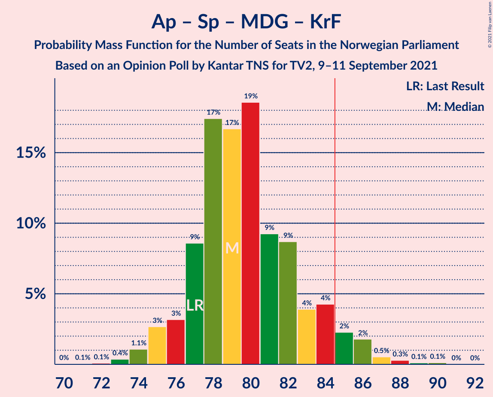

| Number of Seats | Probability | Accumulated | Special Marks |
|:---------------:|:-----------:|:-----------:|:-------------:|
| 71 | 0.1% | 100% |  |
| 72 | 0.1% | 99.9% |  |
| 73 | 0.4% | 99.8% |  |
| 74 | 1.1% | 99.4% |  |
| 75 | 3% | 98% |  |
| 76 | 3% | 96% |  |
| 77 | 9% | 93% | Last Result |
| 78 | 17% | 84% |  |
| 79 | 17% | 67% | Median |
| 80 | 19% | 50% |  |
| 81 | 9% | 31% |  |
| 82 | 9% | 22% |  |
| 83 | 4% | 13% |  |
| 84 | 4% | 9% |  |
| 85 | 2% | 5% | Majority |
| 86 | 2% | 3% |  |
| 87 | 0.5% | 1.1% |  |
| 88 | 0.3% | 0.5% |  |
| 89 | 0.1% | 0.3% |  |
| 90 | 0.1% | 0.2% |  |
| 91 | 0% | 0% |  |

### Arbeiderpartiet – Sosialistisk Venstreparti – Rødt – Miljøpartiet De Grønne

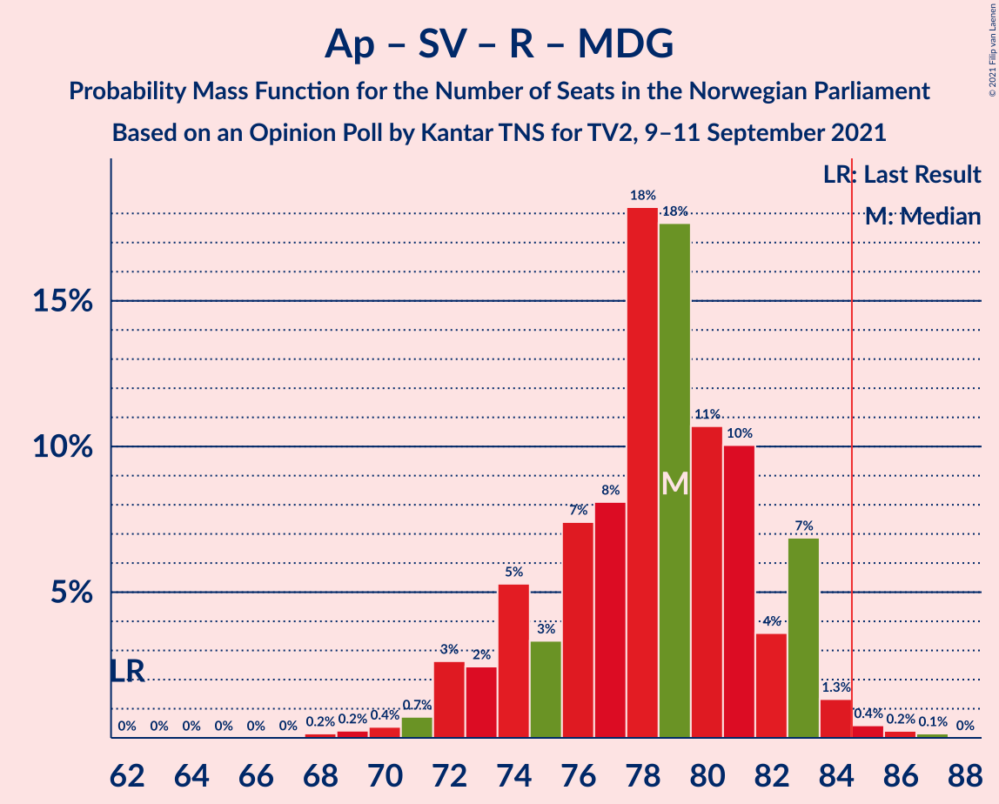

| Number of Seats | Probability | Accumulated | Special Marks |
|:---------------:|:-----------:|:-----------:|:-------------:|
| 62 | 0% | 100% | Last Result |
| 63 | 0% | 100% |  |
| 64 | 0% | 100% |  |
| 65 | 0% | 100% |  |
| 66 | 0% | 100% |  |
| 67 | 0% | 100% |  |
| 68 | 0.2% | 100% |  |
| 69 | 0.2% | 99.8% |  |
| 70 | 0.4% | 99.6% |  |
| 71 | 0.7% | 99.2% |  |
| 72 | 3% | 98% |  |
| 73 | 2% | 96% |  |
| 74 | 5% | 93% |  |
| 75 | 3% | 88% |  |
| 76 | 7% | 85% |  |
| 77 | 8% | 77% |  |
| 78 | 18% | 69% |  |
| 79 | 18% | 51% | Median |
| 80 | 11% | 33% |  |
| 81 | 10% | 23% |  |
| 82 | 4% | 13% |  |
| 83 | 7% | 9% |  |
| 84 | 1.3% | 2% |  |
| 85 | 0.4% | 0.8% | Majority |
| 86 | 0.2% | 0.4% |  |
| 87 | 0.1% | 0.2% |  |
| 88 | 0% | 0% |  |

### Høyre – Fremskrittspartiet – Miljøpartiet De Grønne – Venstre – Kristelig Folkeparti

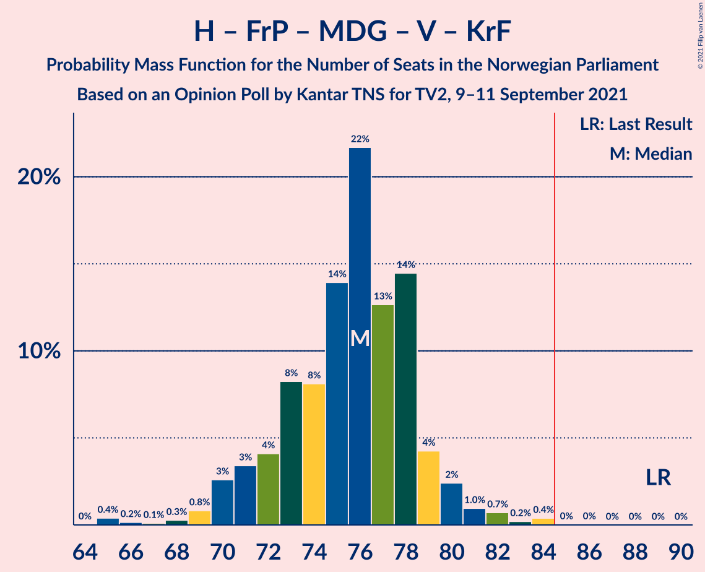

| Number of Seats | Probability | Accumulated | Special Marks |
|:---------------:|:-----------:|:-----------:|:-------------:|
| 65 | 0.4% | 100% |  |
| 66 | 0.2% | 99.6% |  |
| 67 | 0.1% | 99.4% |  |
| 68 | 0.3% | 99.3% |  |
| 69 | 0.8% | 99.0% |  |
| 70 | 3% | 98% |  |
| 71 | 3% | 96% |  |
| 72 | 4% | 92% |  |
| 73 | 8% | 88% |  |
| 74 | 8% | 80% |  |
| 75 | 14% | 72% |  |
| 76 | 22% | 58% | Median |
| 77 | 13% | 36% |  |
| 78 | 14% | 23% |  |
| 79 | 4% | 9% |  |
| 80 | 2% | 5% |  |
| 81 | 1.0% | 2% |  |
| 82 | 0.7% | 1.4% |  |
| 83 | 0.2% | 0.7% |  |
| 84 | 0.4% | 0.5% |  |
| 85 | 0% | 0.1% | Majority |
| 86 | 0% | 0% |  |
| 87 | 0% | 0% |  |
| 88 | 0% | 0% |  |
| 89 | 0% | 0% | Last Result |

### Arbeiderpartiet – Senterpartiet – Kristelig Folkeparti

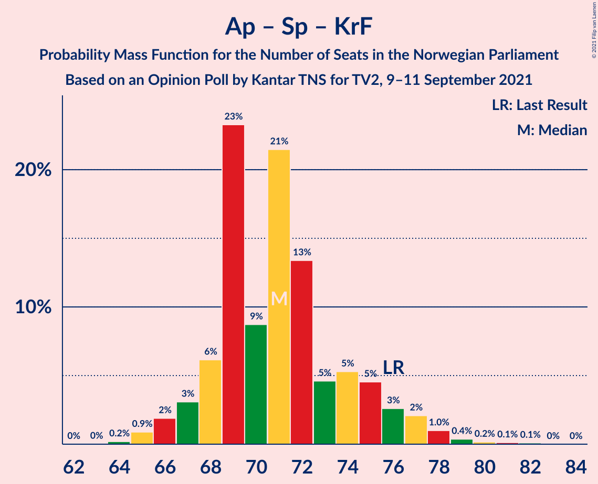

| Number of Seats | Probability | Accumulated | Special Marks |
|:---------------:|:-----------:|:-----------:|:-------------:|
| 64 | 0.2% | 100% |  |
| 65 | 0.9% | 99.8% |  |
| 66 | 2% | 98.9% |  |
| 67 | 3% | 97% |  |
| 68 | 6% | 94% |  |
| 69 | 23% | 88% |  |
| 70 | 9% | 64% | Median |
| 71 | 21% | 56% |  |
| 72 | 13% | 34% |  |
| 73 | 5% | 21% |  |
| 74 | 5% | 16% |  |
| 75 | 5% | 11% |  |
| 76 | 3% | 6% | Last Result |
| 77 | 2% | 4% |  |
| 78 | 1.0% | 2% |  |
| 79 | 0.4% | 0.8% |  |
| 80 | 0.2% | 0.4% |  |
| 81 | 0.1% | 0.2% |  |
| 82 | 0.1% | 0.1% |  |
| 83 | 0% | 0% |  |

### Arbeiderpartiet – Senterpartiet

| Number of Seats | Probability | Accumulated | Special Marks |
|:---------------:|:-----------:|:-----------:|:-------------:|
| 60 | 0.1% | 100% |  |
| 61 | 0.2% | 99.8% |  |
| 62 | 0.7% | 99.7% |  |
| 63 | 3% | 98.9% |  |
| 64 | 5% | 96% |  |
| 65 | 6% | 91% |  |
| 66 | 26% | 85% |  |
| 67 | 13% | 60% | Median |
| 68 | 15% | 47% | Last Result |
| 69 | 19% | 32% |  |
| 70 | 6% | 13% |  |
| 71 | 3% | 7% |  |
| 72 | 2% | 4% |  |
| 73 | 0.9% | 2% |  |
| 74 | 0.6% | 0.9% |  |
| 75 | 0.2% | 0.3% |  |
| 76 | 0.1% | 0.1% |  |
| 77 | 0% | 0% |  |

### Høyre – Fremskrittspartiet – Venstre – Kristelig Folkeparti

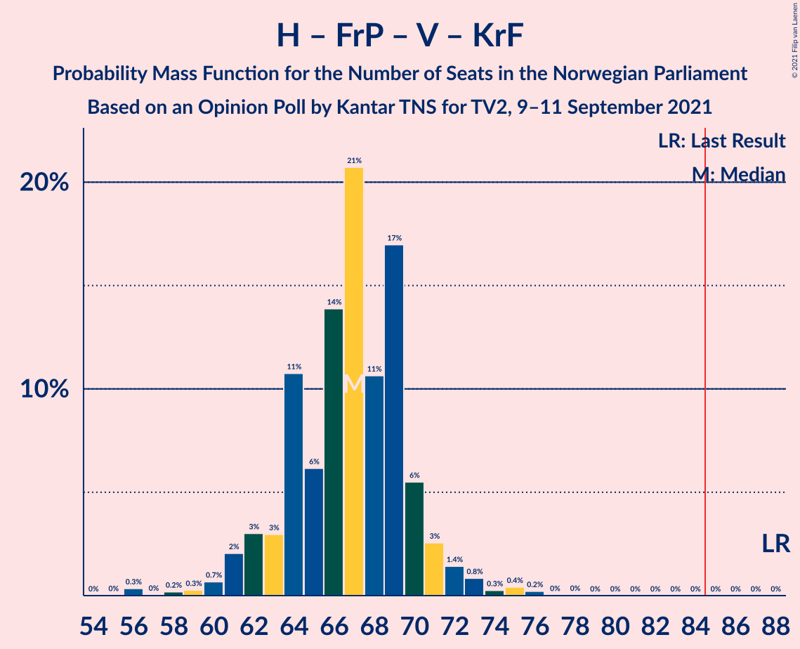

| Number of Seats | Probability | Accumulated | Special Marks |
|:---------------:|:-----------:|:-----------:|:-------------:|
| 56 | 0.3% | 100% |  |
| 57 | 0% | 99.6% |  |
| 58 | 0.2% | 99.6% |  |
| 59 | 0.3% | 99.4% |  |
| 60 | 0.7% | 99.1% |  |
| 61 | 2% | 98% |  |
| 62 | 3% | 96% |  |
| 63 | 3% | 93% |  |
| 64 | 11% | 90% |  |
| 65 | 6% | 80% |  |
| 66 | 14% | 74% |  |
| 67 | 21% | 60% | Median |
| 68 | 11% | 39% |  |
| 69 | 17% | 28% |  |
| 70 | 6% | 11% |  |
| 71 | 3% | 6% |  |
| 72 | 1.4% | 3% |  |
| 73 | 0.8% | 2% |  |
| 74 | 0.3% | 0.9% |  |
| 75 | 0.4% | 0.7% |  |
| 76 | 0.2% | 0.3% |  |
| 77 | 0% | 0.1% |  |
| 78 | 0% | 0% |  |
| 79 | 0% | 0% |  |
| 80 | 0% | 0% |  |
| 81 | 0% | 0% |  |
| 82 | 0% | 0% |  |
| 83 | 0% | 0% |  |
| 84 | 0% | 0% |  |
| 85 | 0% | 0% | Majority |
| 86 | 0% | 0% |  |
| 87 | 0% | 0% |  |
| 88 | 0% | 0% | Last Result |

### Høyre – Fremskrittspartiet – Venstre

| Number of Seats | Probability | Accumulated | Special Marks |
|:---------------:|:-----------:|:-----------:|:-------------:|
| 53 | 0.4% | 100% |  |
| 54 | 0.1% | 99.6% |  |
| 55 | 0.2% | 99.5% |  |
| 56 | 0.3% | 99.2% |  |
| 57 | 1.2% | 98.9% |  |
| 58 | 3% | 98% |  |
| 59 | 4% | 94% |  |
| 60 | 5% | 91% |  |
| 61 | 11% | 86% |  |
| 62 | 8% | 75% |  |
| 63 | 12% | 67% |  |
| 64 | 23% | 55% | Median |
| 65 | 11% | 32% |  |
| 66 | 17% | 21% |  |
| 67 | 2% | 5% |  |
| 68 | 1.3% | 2% |  |
| 69 | 0.5% | 1.0% |  |
| 70 | 0.4% | 0.5% |  |
| 71 | 0.1% | 0.1% |  |
| 72 | 0% | 0% |  |
| 73 | 0% | 0% |  |
| 74 | 0% | 0% |  |
| 75 | 0% | 0% |  |
| 76 | 0% | 0% |  |
| 77 | 0% | 0% |  |
| 78 | 0% | 0% |  |
| 79 | 0% | 0% |  |
| 80 | 0% | 0% | Last Result |

### Arbeiderpartiet – Sosialistisk Venstreparti

| Number of Seats | Probability | Accumulated | Special Marks |
|:---------------:|:-----------:|:-----------:|:-------------:|
| 53 | 0.1% | 100% |  |
| 54 | 0.2% | 99.8% |  |
| 55 | 0.9% | 99.6% |  |
| 56 | 3% | 98.8% |  |
| 57 | 7% | 96% |  |
| 58 | 11% | 89% |  |
| 59 | 27% | 78% |  |
| 60 | 17% | 51% | Last Result, Median |
| 61 | 18% | 33% |  |
| 62 | 4% | 15% |  |
| 63 | 8% | 11% |  |
| 64 | 2% | 3% |  |
| 65 | 0.7% | 1.3% |  |
| 66 | 0.4% | 0.6% |  |
| 67 | 0.2% | 0.2% |  |
| 68 | 0% | 0% |  |

### Høyre – Fremskrittspartiet

| Number of Seats | Probability | Accumulated | Special Marks |
|:---------------:|:-----------:|:-----------:|:-------------:|
| 47 | 0.1% | 100% |  |
| 48 | 0.1% | 99.9% |  |
| 49 | 0.2% | 99.9% |  |
| 50 | 1.1% | 99.6% |  |
| 51 | 1.3% | 98% |  |
| 52 | 2% | 97% |  |
| 53 | 5% | 95% |  |
| 54 | 8% | 90% |  |
| 55 | 10% | 83% |  |
| 56 | 21% | 73% | Median |
| 57 | 21% | 52% |  |
| 58 | 18% | 31% |  |
| 59 | 9% | 14% |  |
| 60 | 3% | 5% |  |
| 61 | 1.0% | 2% |  |
| 62 | 0.5% | 0.8% |  |
| 63 | 0.3% | 0.3% |  |
| 64 | 0% | 0.1% |  |
| 65 | 0% | 0% |  |
| 66 | 0% | 0% |  |
| 67 | 0% | 0% |  |
| 68 | 0% | 0% |  |
| 69 | 0% | 0% |  |
| 70 | 0% | 0% |  |
| 71 | 0% | 0% |  |
| 72 | 0% | 0% | Last Result |

### Høyre – Venstre – Kristelig Folkeparti

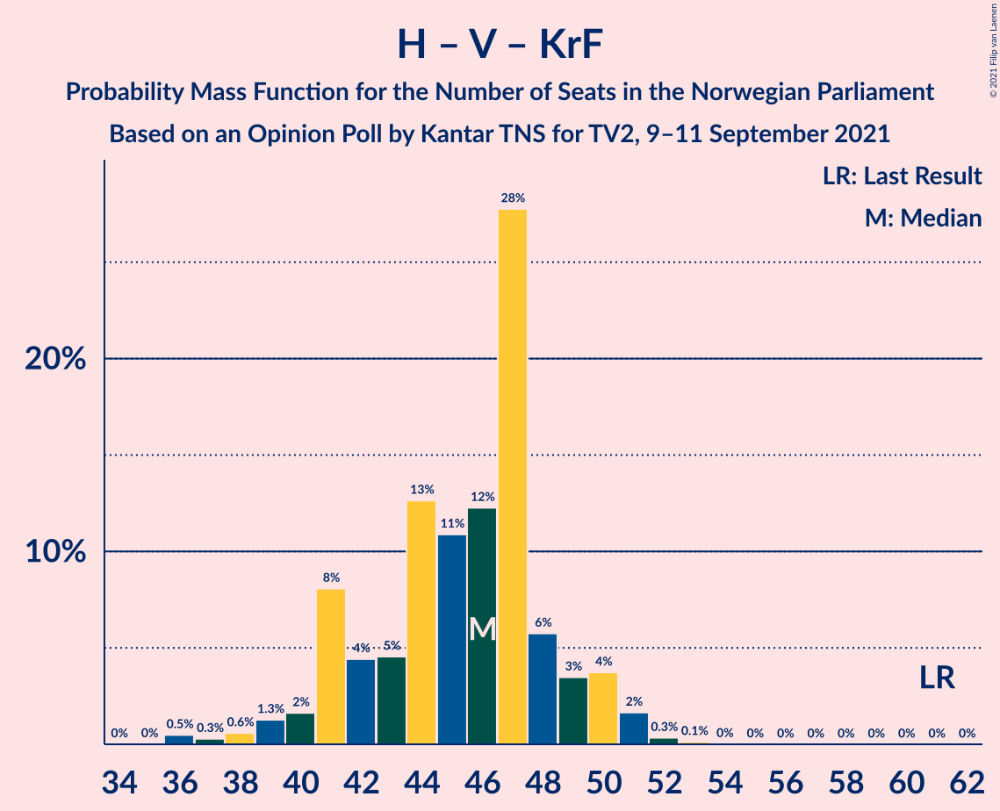

| Number of Seats | Probability | Accumulated | Special Marks |
|:---------------:|:-----------:|:-----------:|:-------------:|
| 36 | 0.5% | 100% |  |
| 37 | 0.3% | 99.5% |  |
| 38 | 0.6% | 99.2% |  |
| 39 | 1.3% | 98.6% |  |
| 40 | 2% | 97% |  |
| 41 | 8% | 96% |  |
| 42 | 4% | 88% |  |
| 43 | 5% | 83% |  |
| 44 | 13% | 79% |  |
| 45 | 11% | 66% |  |
| 46 | 12% | 55% | Median |
| 47 | 28% | 43% |  |
| 48 | 6% | 15% |  |
| 49 | 3% | 9% |  |
| 50 | 4% | 6% |  |
| 51 | 2% | 2% |  |
| 52 | 0.3% | 0.5% |  |
| 53 | 0.1% | 0.2% |  |
| 54 | 0% | 0% |  |
| 55 | 0% | 0% |  |
| 56 | 0% | 0% |  |
| 57 | 0% | 0% |  |
| 58 | 0% | 0% |  |
| 59 | 0% | 0% |  |
| 60 | 0% | 0% |  |
| 61 | 0% | 0% | Last Result |

### Senterpartiet – Venstre – Kristelig Folkeparti

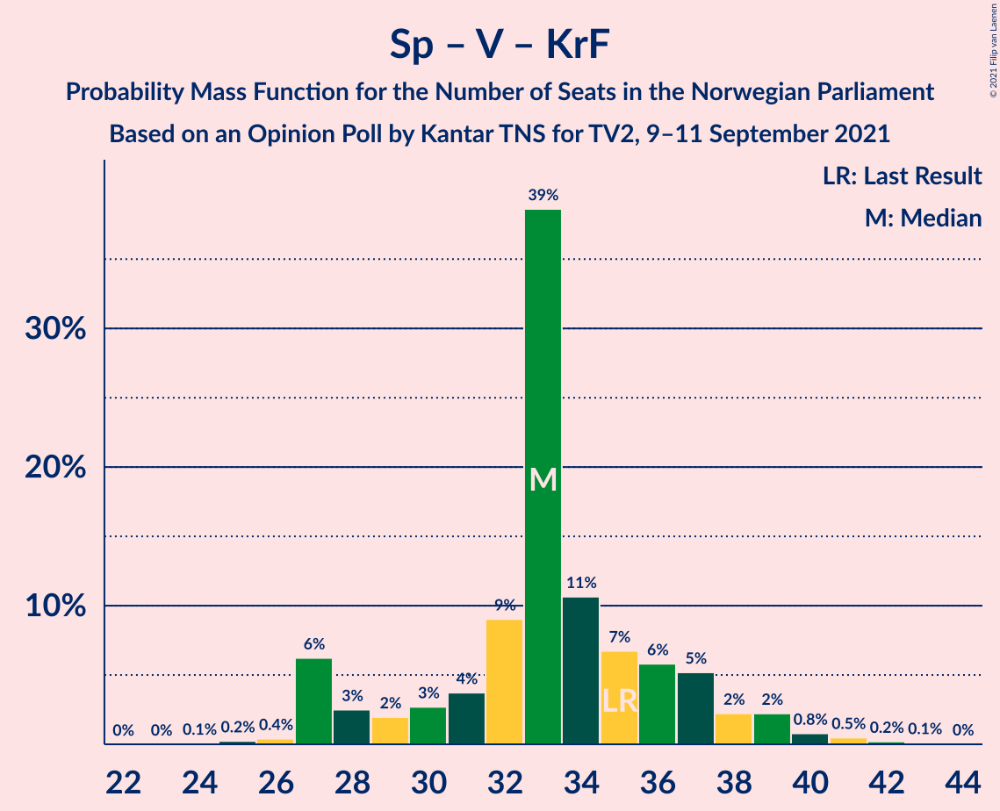

| Number of Seats | Probability | Accumulated | Special Marks |
|:---------------:|:-----------:|:-----------:|:-------------:|
| 24 | 0.1% | 100% |  |
| 25 | 0.2% | 99.9% |  |
| 26 | 0.4% | 99.7% |  |
| 27 | 6% | 99.3% |  |
| 28 | 3% | 93% |  |
| 29 | 2% | 91% |  |
| 30 | 3% | 89% |  |
| 31 | 4% | 86% |  |
| 32 | 9% | 82% |  |
| 33 | 39% | 73% | Median |
| 34 | 11% | 34% |  |
| 35 | 7% | 24% | Last Result |
| 36 | 6% | 17% |  |
| 37 | 5% | 11% |  |
| 38 | 2% | 6% |  |
| 39 | 2% | 4% |  |
| 40 | 0.8% | 2% |  |
| 41 | 0.5% | 0.8% |  |
| 42 | 0.2% | 0.3% |  |
| 43 | 0.1% | 0.1% |  |
| 44 | 0% | 0% |  |

## Technical Information

### Opinion Poll

+ **Polling firm:** Kantar TNS
+ **Commissioner(s):** TV2
+ **Fieldwork period:** 9–11 September 2021

### Calculations

+ **Sample size:** 2088
+ **Simulations done:** 1,048,576
+ **Error estimate:** 1.36%

