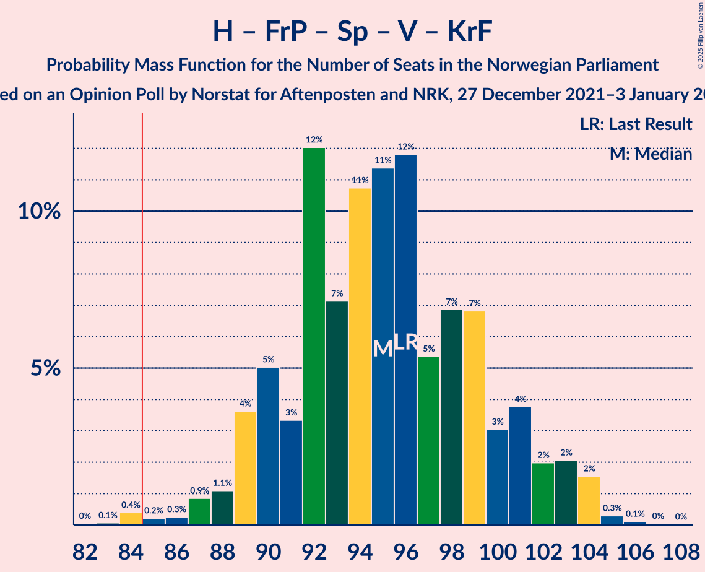
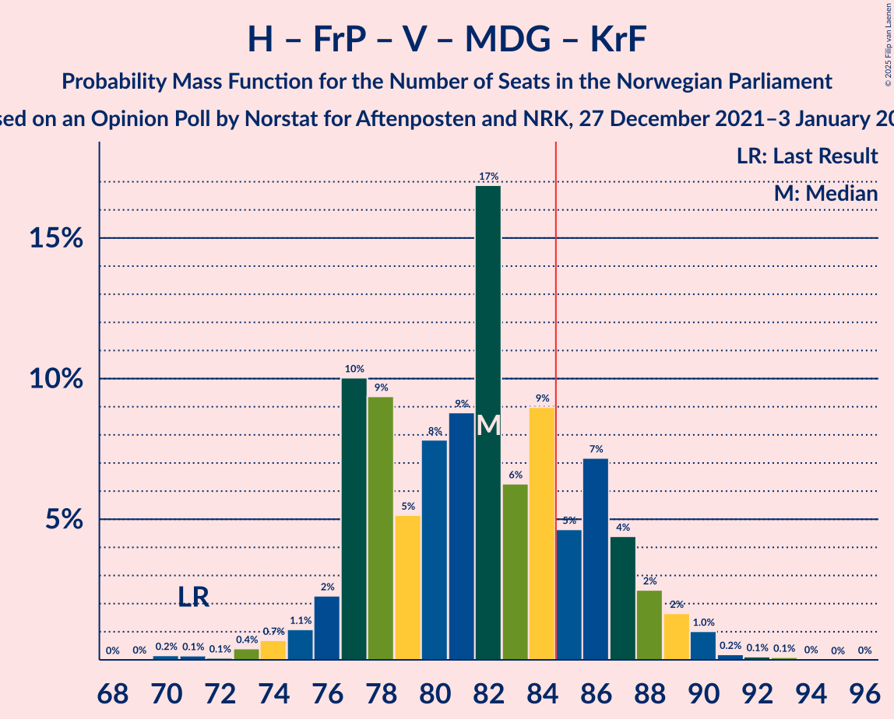

# Opinion Poll by Norstat for Aftenposten and NRK, 27 December 2021–3 January 2022

<a href="#voting-intentions">Voting Intentions</a> | <a href="#seats">Seats</a> | <a href="#coalitions">Coalitions</a> | <a href="#technical-information">Technical Information</a>

## Voting Intentions

### Confidence Intervals

| Party | Last Result | Poll Result | 80% Confidence Interval | 90% Confidence Interval | 95% Confidence Interval | 99% Confidence Interval |
|:-----:|:-----------:|:-----------:|:-----------------------:|:-----------------------:|:-----------------------:|:-----------------------:|
| Høyre | 20.4% | 24.7% | 23.0–26.6% |22.5–27.1% |22.1–27.6% |21.2–28.5% |
| Arbeiderpartiet | 26.2% | 21.1% | 19.5–22.9% |19.0–23.4% |18.6–23.8% |17.8–24.7% |
| Fremskrittspartiet | 11.6% | 13.9% | 12.5–15.4% |12.1–15.9% |11.8–16.3% |11.2–17.0% |
| Sosialistisk Venstreparti | 7.6% | 9.2% | 8.1–10.5% |7.8–10.9% |7.5–11.2% |7.0–11.9% |
| Senterpartiet | 13.5% | 9.2% | 8.1–10.5% |7.8–10.9% |7.5–11.2% |7.0–11.9% |
| Rødt | 4.7% | 6.2% | 5.2–7.3% |5.0–7.6% |4.8–7.9% |4.4–8.4% |
| Venstre | 4.6% | 4.9% | 4.1–5.9% |3.9–6.2% |3.7–6.4% |3.3–7.0% |
| Miljøpartiet De Grønne | 3.9% | 3.3% | 2.7–4.2% |2.5–4.4% |2.3–4.6% |2.1–5.1% |
| Kristelig Folkeparti | 3.8% | 3.2% | 2.6–4.1% |2.4–4.3% |2.2–4.5% |2.0–5.0% |

*Note:* The poll result column reflects the actual value used in the calculations. Published results may vary slightly, and in addition be rounded to fewer digits.

## Seats

### Confidence Intervals

| Party | Last Result | Median | 80% Confidence Interval | 90% Confidence Interval | 95% Confidence Interval | 99% Confidence Interval |
|:-----:|:-----------:|:------:|:-----------------------:|:-----------------------:|:-----------------------:|:-----------------------:|
| <a href="#høyre">Høyre</a> | 36 | 44 | 41–47 |40–48 |40–49 |38–50 |
| <a href="#arbeiderpartiet">Arbeiderpartiet</a> | 48 | 38 | 37–43 |36–44 |36–45 |34–47 |
| <a href="#fremskrittspartiet">Fremskrittspartiet</a> | 21 | 25 | 21–28 |21–29 |20–30 |19–31 |
| <a href="#sosialistisk-venstreparti">Sosialistisk Venstreparti</a> | 13 | 16 | 13–19 |12–19 |11–20 |10–21 |
| <a href="#senterpartiet">Senterpartiet</a> | 28 | 16 | 14–18 |14–19 |13–20 |12–21 |
| <a href="#rødt">Rødt</a> | 8 | 11 | 9–13 |8–13 |8–14 |7–15 |
| <a href="#venstre">Venstre</a> | 8 | 8 | 6–10 |3–11 |3–11 |2–12 |
| <a href="#miljøpartiet-de-grønne">Miljøpartiet De Grønne</a> | 3 | 2 | 1–6 |1–7 |1–8 |1–8 |
| <a href="#kristelig-folkeparti">Kristelig Folkeparti</a> | 3 | 2 | 2–3 |2–7 |1–7 |0–8 |

### Høyre

*For a full overview of the results for this party, see the [Høyre](party-høyre.html) page.*

| Number of Seats | Probability | Accumulated | Special Marks |
|:---------------:|:-----------:|:-----------:|:-------------:|
| 35 | 0% | 100% |  |
| 36 | 0.1% | 99.9% | Last Result |
| 37 | 0.2% | 99.8% |  |
| 38 | 0.5% | 99.7% |  |
| 39 | 1.2% | 99.2% |  |
| 40 | 6% | 98% |  |
| 41 | 12% | 92% |  |
| 42 | 11% | 80% |  |
| 43 | 12% | 69% |  |
| 44 | 21% | 58% | Median |
| 45 | 16% | 37% |  |
| 46 | 9% | 21% |  |
| 47 | 6% | 12% |  |
| 48 | 2% | 5% |  |
| 49 | 2% | 3% |  |
| 50 | 0.7% | 1.1% |  |
| 51 | 0.2% | 0.4% |  |
| 52 | 0.1% | 0.2% |  |
| 53 | 0.1% | 0.1% |  |
| 54 | 0% | 0% |  |

### Arbeiderpartiet

*For a full overview of the results for this party, see the [Arbeiderpartiet](party-arbeiderpartiet.html) page.*

| Number of Seats | Probability | Accumulated | Special Marks |
|:---------------:|:-----------:|:-----------:|:-------------:|
| 32 | 0.1% | 100% |  |
| 33 | 0.3% | 99.8% |  |
| 34 | 0.7% | 99.6% |  |
| 35 | 1.4% | 98.9% |  |
| 36 | 4% | 98% |  |
| 37 | 24% | 93% |  |
| 38 | 23% | 69% | Median |
| 39 | 13% | 46% |  |
| 40 | 8% | 33% |  |
| 41 | 11% | 25% |  |
| 42 | 4% | 14% |  |
| 43 | 4% | 10% |  |
| 44 | 3% | 6% |  |
| 45 | 1.3% | 3% |  |
| 46 | 0.7% | 2% |  |
| 47 | 0.8% | 1.0% |  |
| 48 | 0.1% | 0.2% | Last Result |
| 49 | 0.1% | 0.1% |  |
| 50 | 0% | 0% |  |

### Fremskrittspartiet

*For a full overview of the results for this party, see the [Fremskrittspartiet](party-fremskrittspartiet.html) page.*

| Number of Seats | Probability | Accumulated | Special Marks |
|:---------------:|:-----------:|:-----------:|:-------------:|
| 18 | 0.3% | 100% |  |
| 19 | 1.1% | 99.6% |  |
| 20 | 3% | 98.5% |  |
| 21 | 10% | 95% | Last Result |
| 22 | 6% | 85% |  |
| 23 | 17% | 79% |  |
| 24 | 11% | 63% |  |
| 25 | 15% | 51% | Median |
| 26 | 14% | 37% |  |
| 27 | 8% | 23% |  |
| 28 | 8% | 15% |  |
| 29 | 4% | 7% |  |
| 30 | 2% | 3% |  |
| 31 | 1.4% | 2% |  |
| 32 | 0.1% | 0.2% |  |
| 33 | 0.1% | 0.1% |  |
| 34 | 0% | 0% |  |

### Sosialistisk Venstreparti

*For a full overview of the results for this party, see the [Sosialistisk Venstreparti](party-sosialistiskvenstreparti.html) page.*

| Number of Seats | Probability | Accumulated | Special Marks |
|:---------------:|:-----------:|:-----------:|:-------------:|
| 9 | 0.1% | 100% |  |
| 10 | 0.5% | 99.9% |  |
| 11 | 3% | 99.4% |  |
| 12 | 4% | 97% |  |
| 13 | 9% | 93% | Last Result |
| 14 | 15% | 85% |  |
| 15 | 10% | 70% |  |
| 16 | 22% | 60% | Median |
| 17 | 12% | 38% |  |
| 18 | 13% | 26% |  |
| 19 | 9% | 13% |  |
| 20 | 2% | 3% |  |
| 21 | 0.9% | 1.0% |  |
| 22 | 0.1% | 0.2% |  |
| 23 | 0% | 0% |  |

### Senterpartiet

*For a full overview of the results for this party, see the [Senterpartiet](party-senterpartiet.html) page.*

| Number of Seats | Probability | Accumulated | Special Marks |
|:---------------:|:-----------:|:-----------:|:-------------:|
| 11 | 0.1% | 100% |  |
| 12 | 0.6% | 99.9% |  |
| 13 | 2% | 99.3% |  |
| 14 | 13% | 97% |  |
| 15 | 27% | 84% |  |
| 16 | 16% | 57% | Median |
| 17 | 24% | 41% |  |
| 18 | 9% | 17% |  |
| 19 | 4% | 8% |  |
| 20 | 3% | 5% |  |
| 21 | 0.8% | 1.3% |  |
| 22 | 0.4% | 0.5% |  |
| 23 | 0% | 0.1% |  |
| 24 | 0% | 0% |  |
| 25 | 0% | 0% |  |
| 26 | 0% | 0% |  |
| 27 | 0% | 0% |  |
| 28 | 0% | 0% | Last Result |

### Rødt

*For a full overview of the results for this party, see the [Rødt](party-rødt.html) page.*

| Number of Seats | Probability | Accumulated | Special Marks |
|:---------------:|:-----------:|:-----------:|:-------------:|
| 1 | 0.1% | 100% |  |
| 2 | 0% | 99.9% |  |
| 3 | 0% | 99.9% |  |
| 4 | 0% | 99.9% |  |
| 5 | 0% | 99.9% |  |
| 6 | 0.2% | 99.9% |  |
| 7 | 1.3% | 99.8% |  |
| 8 | 7% | 98% | Last Result |
| 9 | 17% | 92% |  |
| 10 | 20% | 75% |  |
| 11 | 24% | 56% | Median |
| 12 | 21% | 32% |  |
| 13 | 8% | 11% |  |
| 14 | 3% | 3% |  |
| 15 | 0.8% | 0.9% |  |
| 16 | 0.1% | 0.1% |  |
| 17 | 0% | 0% |  |

### Venstre

*For a full overview of the results for this party, see the [Venstre](party-venstre.html) page.*

| Number of Seats | Probability | Accumulated | Special Marks |
|:---------------:|:-----------:|:-----------:|:-------------:|
| 2 | 1.1% | 100% |  |
| 3 | 7% | 98.9% |  |
| 4 | 0% | 92% |  |
| 5 | 0% | 92% |  |
| 6 | 3% | 92% |  |
| 7 | 16% | 89% |  |
| 8 | 29% | 73% | Last Result, Median |
| 9 | 26% | 45% |  |
| 10 | 13% | 18% |  |
| 11 | 3% | 5% |  |
| 12 | 2% | 2% |  |
| 13 | 0.2% | 0.3% |  |
| 14 | 0.1% | 0.1% |  |
| 15 | 0% | 0% |  |

### Miljøpartiet De Grønne

*For a full overview of the results for this party, see the [Miljøpartiet De Grønne](party-miljøpartietdegrønne.html) page.*

| Number of Seats | Probability | Accumulated | Special Marks |
|:---------------:|:-----------:|:-----------:|:-------------:|
| 1 | 25% | 100% |  |
| 2 | 43% | 75% | Median |
| 3 | 18% | 32% | Last Result |
| 4 | 0% | 15% |  |
| 5 | 0% | 15% |  |
| 6 | 5% | 15% |  |
| 7 | 6% | 9% |  |
| 8 | 3% | 3% |  |
| 9 | 0.3% | 0.3% |  |
| 10 | 0.1% | 0.1% |  |
| 11 | 0% | 0% |  |

### Kristelig Folkeparti

*For a full overview of the results for this party, see the [Kristelig Folkeparti](party-kristeligfolkeparti.html) page.*

| Number of Seats | Probability | Accumulated | Special Marks |
|:---------------:|:-----------:|:-----------:|:-------------:|
| 0 | 2% | 100% |  |
| 1 | 1.2% | 98% |  |
| 2 | 68% | 97% | Median |
| 3 | 19% | 28% | Last Result |
| 4 | 0% | 9% |  |
| 5 | 0% | 9% |  |
| 6 | 4% | 9% |  |
| 7 | 4% | 6% |  |
| 8 | 1.5% | 2% |  |
| 9 | 0.2% | 0.2% |  |
| 10 | 0% | 0% |  |

## Coalitions

### Confidence Intervals

| Coalition | Last Result | Median | Majority? | 80% Confidence Interval | 90% Confidence Interval | 95% Confidence Interval | 99% Confidence Interval |
|:---------:|:-----------:|:------:|:---------:|:-----------------------:|:-----------------------:|:-----------------------:|:-----------------------:|
| Høyre – Fremskrittspartiet – Senterpartiet – Venstre – Kristelig Folkeparti | 96 | 95 | 99.5% | 90–100 | 89–102 | 88–103 | 84–104 |
| Arbeiderpartiet – Senterpartiet – Sosialistisk Venstreparti – Rødt – Miljøpartiet De Grønne | 100 | 84 | 45% | 80–89 | 79–91 | 77–92 | 75–94 |
| Høyre – Fremskrittspartiet – Venstre – Miljøpartiet De Grønne – Kristelig Folkeparti | 71 | 82 | 22% | 77–87 | 77–88 | 75–89 | 73–90 |
| Arbeiderpartiet – Senterpartiet – Sosialistisk Venstreparti – Rødt | 97 | 82 | 19% | 77–86 | 75–88 | 74–89 | 73–91 |
| Høyre – Fremskrittspartiet – Venstre – Kristelig Folkeparti | 68 | 79 | 9% | 75–84 | 74–85 | 73–86 | 69–89 |
| Arbeiderpartiet – Senterpartiet – Sosialistisk Venstreparti – Miljøpartiet De Grønne – Kristelig Folkeparti | 95 | 76 | 1.3% | 72–81 | 71–83 | 70–84 | 68–87 |
| Høyre – Fremskrittspartiet – Venstre | 65 | 77 | 2% | 72–81 | 71–83 | 70–83 | 67–86 |
| Arbeiderpartiet – Senterpartiet – Sosialistisk Venstreparti – Miljøpartiet De Grønne | 92 | 74 | 0.2% | 70–78 | 69–80 | 67–81 | 66–83 |
| Arbeiderpartiet – Senterpartiet – Sosialistisk Venstreparti | 89 | 71 | 0% | 67–75 | 66–76 | 65–77 | 63–80 |
| Arbeiderpartiet – Sosialistisk Venstreparti – Rødt – Miljøpartiet De Grønne | 72 | 68 | 0% | 64–72 | 62–74 | 62–76 | 60–77 |
| Høyre – Fremskrittspartiet | 57 | 69 | 0% | 64–73 | 64–74 | 62–75 | 61–76 |
| Arbeiderpartiet – Senterpartiet – Miljøpartiet De Grønne – Kristelig Folkeparti | 82 | 60 | 0% | 56–65 | 55–67 | 55–68 | 53–70 |
| Arbeiderpartiet – Senterpartiet – Kristelig Folkeparti | 79 | 57 | 0% | 54–62 | 53–63 | 53–65 | 51–67 |
| Arbeiderpartiet – Senterpartiet | 76 | 55 | 0% | 52–59 | 51–60 | 50–61 | 49–63 |
| Arbeiderpartiet – Sosialistisk Venstreparti | 61 | 55 | 0% | 52–58 | 51–60 | 50–61 | 48–63 |
| Høyre – Venstre – Kristelig Folkeparti | 47 | 54 | 0% | 51–58 | 50–59 | 48–61 | 46–62 |
| Senterpartiet – Venstre – Kristelig Folkeparti | 39 | 27 | 0% | 24–30 | 22–32 | 21–32 | 20–34 |

### Høyre – Fremskrittspartiet – Senterpartiet – Venstre – Kristelig Folkeparti

| Number of Seats | Probability | Accumulated | Special Marks |
|:---------------:|:-----------:|:-----------:|:-------------:|
| 82 | 0% | 100% |  |
| 83 | 0.1% | 99.9% |  |
| 84 | 0.4% | 99.9% |  |
| 85 | 0.2% | 99.5% | Majority |
| 86 | 0.3% | 99.3% |  |
| 87 | 0.9% | 99.0% |  |
| 88 | 1.1% | 98% |  |
| 89 | 4% | 97% |  |
| 90 | 5% | 93% |  |
| 91 | 3% | 88% |  |
| 92 | 12% | 85% |  |
| 93 | 7% | 73% |  |
| 94 | 11% | 66% |  |
| 95 | 11% | 55% | Median |
| 96 | 12% | 44% | Last Result |
| 97 | 5% | 32% |  |
| 98 | 7% | 27% |  |
| 99 | 7% | 20% |  |
| 100 | 3% | 13% |  |
| 101 | 4% | 10% |  |
| 102 | 2% | 6% |  |
| 103 | 2% | 4% |  |
| 104 | 2% | 2% |  |
| 105 | 0.3% | 0.5% |  |
| 106 | 0.1% | 0.2% |  |
| 107 | 0% | 0.1% |  |
| 108 | 0% | 0% |  |

### Arbeiderpartiet – Senterpartiet – Sosialistisk Venstreparti – Rødt – Miljøpartiet De Grønne

| Number of Seats | Probability | Accumulated | Special Marks |
|:---------------:|:-----------:|:-----------:|:-------------:|
| 72 | 0.1% | 100% |  |
| 73 | 0% | 99.9% |  |
| 74 | 0.1% | 99.9% |  |
| 75 | 0.9% | 99.8% |  |
| 76 | 0.8% | 98.9% |  |
| 77 | 1.3% | 98% |  |
| 78 | 1.3% | 97% |  |
| 79 | 3% | 96% |  |
| 80 | 5% | 92% |  |
| 81 | 13% | 87% |  |
| 82 | 8% | 75% |  |
| 83 | 11% | 67% | Median |
| 84 | 11% | 56% |  |
| 85 | 8% | 45% | Majority |
| 86 | 12% | 37% |  |
| 87 | 6% | 25% |  |
| 88 | 6% | 19% |  |
| 89 | 5% | 13% |  |
| 90 | 3% | 9% |  |
| 91 | 3% | 6% |  |
| 92 | 2% | 3% |  |
| 93 | 0.6% | 1.5% |  |
| 94 | 0.4% | 0.9% |  |
| 95 | 0.3% | 0.5% |  |
| 96 | 0% | 0.2% |  |
| 97 | 0.1% | 0.1% |  |
| 98 | 0% | 0% |  |
| 99 | 0% | 0% |  |
| 100 | 0% | 0% | Last Result |

### Høyre – Fremskrittspartiet – Venstre – Miljøpartiet De Grønne – Kristelig Folkeparti

| Number of Seats | Probability | Accumulated | Special Marks |
|:---------------:|:-----------:|:-----------:|:-------------:|
| 70 | 0.2% | 100% |  |
| 71 | 0.1% | 99.8% | Last Result |
| 72 | 0.1% | 99.7% |  |
| 73 | 0.4% | 99.6% |  |
| 74 | 0.7% | 99.2% |  |
| 75 | 1.1% | 98% |  |
| 76 | 2% | 97% |  |
| 77 | 10% | 95% |  |
| 78 | 9% | 85% |  |
| 79 | 5% | 76% |  |
| 80 | 8% | 71% |  |
| 81 | 9% | 63% | Median |
| 82 | 17% | 54% |  |
| 83 | 6% | 37% |  |
| 84 | 9% | 31% |  |
| 85 | 5% | 22% | Majority |
| 86 | 7% | 17% |  |
| 87 | 4% | 10% |  |
| 88 | 2% | 6% |  |
| 89 | 2% | 3% |  |
| 90 | 1.0% | 1.5% |  |
| 91 | 0.2% | 0.5% |  |
| 92 | 0.1% | 0.3% |  |
| 93 | 0.1% | 0.2% |  |
| 94 | 0% | 0.1% |  |
| 95 | 0% | 0% |  |

### Arbeiderpartiet – Senterpartiet – Sosialistisk Venstreparti – Rødt

| Number of Seats | Probability | Accumulated | Special Marks |
|:---------------:|:-----------:|:-----------:|:-------------:|
| 70 | 0% | 100% |  |
| 71 | 0.2% | 99.9% |  |
| 72 | 0.2% | 99.7% |  |
| 73 | 1.1% | 99.5% |  |
| 74 | 2% | 98% |  |
| 75 | 2% | 96% |  |
| 76 | 3% | 94% |  |
| 77 | 4% | 91% |  |
| 78 | 4% | 87% |  |
| 79 | 12% | 82% |  |
| 80 | 9% | 70% |  |
| 81 | 9% | 62% | Median |
| 82 | 12% | 53% |  |
| 83 | 7% | 40% |  |
| 84 | 14% | 33% |  |
| 85 | 4% | 19% | Majority |
| 86 | 8% | 16% |  |
| 87 | 2% | 8% |  |
| 88 | 1.5% | 6% |  |
| 89 | 3% | 4% |  |
| 90 | 1.0% | 2% |  |
| 91 | 0.4% | 0.9% |  |
| 92 | 0.3% | 0.4% |  |
| 93 | 0.1% | 0.1% |  |
| 94 | 0% | 0.1% |  |
| 95 | 0% | 0% |  |
| 96 | 0% | 0% |  |
| 97 | 0% | 0% | Last Result |

### Høyre – Fremskrittspartiet – Venstre – Kristelig Folkeparti

| Number of Seats | Probability | Accumulated | Special Marks |
|:---------------:|:-----------:|:-----------:|:-------------:|
| 67 | 0.1% | 100% |  |
| 68 | 0.1% | 99.9% | Last Result |
| 69 | 0.6% | 99.8% |  |
| 70 | 0.2% | 99.2% |  |
| 71 | 0.7% | 99.0% |  |
| 72 | 0.8% | 98% |  |
| 73 | 2% | 98% |  |
| 74 | 3% | 96% |  |
| 75 | 11% | 93% |  |
| 76 | 8% | 82% |  |
| 77 | 8% | 74% |  |
| 78 | 7% | 65% |  |
| 79 | 15% | 58% | Median |
| 80 | 13% | 44% |  |
| 81 | 9% | 31% |  |
| 82 | 6% | 22% |  |
| 83 | 5% | 16% |  |
| 84 | 3% | 11% |  |
| 85 | 5% | 9% | Majority |
| 86 | 1.2% | 4% |  |
| 87 | 1.5% | 2% |  |
| 88 | 0.4% | 0.9% |  |
| 89 | 0.4% | 0.5% |  |
| 90 | 0.1% | 0.1% |  |
| 91 | 0% | 0.1% |  |
| 92 | 0% | 0% |  |

### Arbeiderpartiet – Senterpartiet – Sosialistisk Venstreparti – Miljøpartiet De Grønne – Kristelig Folkeparti

| Number of Seats | Probability | Accumulated | Special Marks |
|:---------------:|:-----------:|:-----------:|:-------------:|
| 66 | 0.1% | 100% |  |
| 67 | 0.1% | 99.9% |  |
| 68 | 0.7% | 99.8% |  |
| 69 | 1.0% | 99.1% |  |
| 70 | 1.3% | 98% |  |
| 71 | 3% | 97% |  |
| 72 | 12% | 94% |  |
| 73 | 8% | 82% |  |
| 74 | 6% | 74% | Median |
| 75 | 10% | 68% |  |
| 76 | 16% | 58% |  |
| 77 | 10% | 42% |  |
| 78 | 5% | 32% |  |
| 79 | 9% | 27% |  |
| 80 | 8% | 18% |  |
| 81 | 2% | 10% |  |
| 82 | 3% | 8% |  |
| 83 | 2% | 5% |  |
| 84 | 1.4% | 3% |  |
| 85 | 0.5% | 1.3% | Majority |
| 86 | 0.3% | 0.8% |  |
| 87 | 0.3% | 0.5% |  |
| 88 | 0.1% | 0.2% |  |
| 89 | 0% | 0.1% |  |
| 90 | 0.1% | 0.1% |  |
| 91 | 0% | 0% |  |
| 92 | 0% | 0% |  |
| 93 | 0% | 0% |  |
| 94 | 0% | 0% |  |
| 95 | 0% | 0% | Last Result |

### Høyre – Fremskrittspartiet – Venstre

| Number of Seats | Probability | Accumulated | Special Marks |
|:---------------:|:-----------:|:-----------:|:-------------:|
| 65 | 0.1% | 100% | Last Result |
| 66 | 0.1% | 99.8% |  |
| 67 | 0.7% | 99.7% |  |
| 68 | 0.3% | 99.0% |  |
| 69 | 1.1% | 98.7% |  |
| 70 | 2% | 98% |  |
| 71 | 2% | 96% |  |
| 72 | 5% | 93% |  |
| 73 | 12% | 89% |  |
| 74 | 7% | 76% |  |
| 75 | 10% | 70% |  |
| 76 | 9% | 59% |  |
| 77 | 12% | 50% | Median |
| 78 | 13% | 38% |  |
| 79 | 8% | 25% |  |
| 80 | 4% | 17% |  |
| 81 | 4% | 13% |  |
| 82 | 2% | 9% |  |
| 83 | 4% | 7% |  |
| 84 | 0.7% | 2% |  |
| 85 | 1.0% | 2% | Majority |
| 86 | 0.3% | 0.6% |  |
| 87 | 0.3% | 0.4% |  |
| 88 | 0.1% | 0.1% |  |
| 89 | 0% | 0% |  |

### Arbeiderpartiet – Senterpartiet – Sosialistisk Venstreparti – Miljøpartiet De Grønne

| Number of Seats | Probability | Accumulated | Special Marks |
|:---------------:|:-----------:|:-----------:|:-------------:|
| 63 | 0.1% | 100% |  |
| 64 | 0.1% | 99.9% |  |
| 65 | 0.1% | 99.8% |  |
| 66 | 1.0% | 99.7% |  |
| 67 | 1.2% | 98.6% |  |
| 68 | 2% | 97% |  |
| 69 | 3% | 95% |  |
| 70 | 15% | 92% |  |
| 71 | 7% | 77% |  |
| 72 | 7% | 70% | Median |
| 73 | 12% | 64% |  |
| 74 | 16% | 51% |  |
| 75 | 10% | 35% |  |
| 76 | 6% | 25% |  |
| 77 | 7% | 20% |  |
| 78 | 5% | 13% |  |
| 79 | 2% | 8% |  |
| 80 | 3% | 6% |  |
| 81 | 1.2% | 3% |  |
| 82 | 1.0% | 2% |  |
| 83 | 0.3% | 0.8% |  |
| 84 | 0.3% | 0.5% |  |
| 85 | 0.1% | 0.2% | Majority |
| 86 | 0% | 0% |  |
| 87 | 0% | 0% |  |
| 88 | 0% | 0% |  |
| 89 | 0% | 0% |  |
| 90 | 0% | 0% |  |
| 91 | 0% | 0% |  |
| 92 | 0% | 0% | Last Result |

### Arbeiderpartiet – Senterpartiet – Sosialistisk Venstreparti

| Number of Seats | Probability | Accumulated | Special Marks |
|:---------------:|:-----------:|:-----------:|:-------------:|
| 61 | 0% | 100% |  |
| 62 | 0.1% | 99.9% |  |
| 63 | 0.5% | 99.8% |  |
| 64 | 1.0% | 99.3% |  |
| 65 | 3% | 98% |  |
| 66 | 3% | 96% |  |
| 67 | 5% | 93% |  |
| 68 | 14% | 88% |  |
| 69 | 9% | 74% |  |
| 70 | 10% | 65% | Median |
| 71 | 8% | 55% |  |
| 72 | 18% | 46% |  |
| 73 | 8% | 28% |  |
| 74 | 7% | 21% |  |
| 75 | 4% | 13% |  |
| 76 | 5% | 10% |  |
| 77 | 2% | 4% |  |
| 78 | 0.7% | 2% |  |
| 79 | 0.9% | 2% |  |
| 80 | 0.2% | 0.7% |  |
| 81 | 0.3% | 0.4% |  |
| 82 | 0.1% | 0.1% |  |
| 83 | 0% | 0% |  |
| 84 | 0% | 0% |  |
| 85 | 0% | 0% | Majority |
| 86 | 0% | 0% |  |
| 87 | 0% | 0% |  |
| 88 | 0% | 0% |  |
| 89 | 0% | 0% | Last Result |

### Arbeiderpartiet – Sosialistisk Venstreparti – Rødt – Miljøpartiet De Grønne

| Number of Seats | Probability | Accumulated | Special Marks |
|:---------------:|:-----------:|:-----------:|:-------------:|
| 57 | 0.1% | 100% |  |
| 58 | 0.1% | 99.9% |  |
| 59 | 0.1% | 99.8% |  |
| 60 | 0.6% | 99.7% |  |
| 61 | 1.3% | 99.1% |  |
| 62 | 3% | 98% |  |
| 63 | 3% | 95% |  |
| 64 | 3% | 92% |  |
| 65 | 6% | 89% |  |
| 66 | 17% | 83% |  |
| 67 | 11% | 66% | Median |
| 68 | 9% | 55% |  |
| 69 | 14% | 46% |  |
| 70 | 9% | 32% |  |
| 71 | 6% | 23% |  |
| 72 | 8% | 17% | Last Result |
| 73 | 2% | 9% |  |
| 74 | 3% | 6% |  |
| 75 | 0.7% | 3% |  |
| 76 | 2% | 3% |  |
| 77 | 0.7% | 1.2% |  |
| 78 | 0.3% | 0.5% |  |
| 79 | 0.1% | 0.2% |  |
| 80 | 0% | 0.1% |  |
| 81 | 0% | 0% |  |

### Høyre – Fremskrittspartiet

| Number of Seats | Probability | Accumulated | Special Marks |
|:---------------:|:-----------:|:-----------:|:-------------:|
| 57 | 0% | 100% | Last Result |
| 58 | 0.1% | 100% |  |
| 59 | 0.1% | 99.9% |  |
| 60 | 0.3% | 99.8% |  |
| 61 | 0.9% | 99.5% |  |
| 62 | 2% | 98.6% |  |
| 63 | 2% | 97% |  |
| 64 | 8% | 95% |  |
| 65 | 10% | 87% |  |
| 66 | 6% | 76% |  |
| 67 | 7% | 70% |  |
| 68 | 13% | 63% |  |
| 69 | 13% | 50% | Median |
| 70 | 14% | 37% |  |
| 71 | 8% | 24% |  |
| 72 | 5% | 16% |  |
| 73 | 5% | 11% |  |
| 74 | 2% | 5% |  |
| 75 | 1.0% | 3% |  |
| 76 | 1.4% | 2% |  |
| 77 | 0.2% | 0.4% |  |
| 78 | 0.2% | 0.3% |  |
| 79 | 0% | 0.1% |  |
| 80 | 0% | 0.1% |  |
| 81 | 0% | 0% |  |

### Arbeiderpartiet – Senterpartiet – Miljøpartiet De Grønne – Kristelig Folkeparti

| Number of Seats | Probability | Accumulated | Special Marks |
|:---------------:|:-----------:|:-----------:|:-------------:|
| 51 | 0.1% | 100% |  |
| 52 | 0.2% | 99.9% |  |
| 53 | 0.5% | 99.8% |  |
| 54 | 2% | 99.3% |  |
| 55 | 3% | 98% |  |
| 56 | 12% | 95% |  |
| 57 | 6% | 82% |  |
| 58 | 9% | 76% | Median |
| 59 | 14% | 68% |  |
| 60 | 11% | 54% |  |
| 61 | 8% | 43% |  |
| 62 | 9% | 35% |  |
| 63 | 7% | 26% |  |
| 64 | 5% | 19% |  |
| 65 | 4% | 14% |  |
| 66 | 4% | 10% |  |
| 67 | 1.4% | 6% |  |
| 68 | 3% | 4% |  |
| 69 | 0.6% | 2% |  |
| 70 | 0.7% | 1.2% |  |
| 71 | 0.3% | 0.5% |  |
| 72 | 0.1% | 0.2% |  |
| 73 | 0% | 0.1% |  |
| 74 | 0% | 0.1% |  |
| 75 | 0% | 0% |  |
| 76 | 0% | 0% |  |
| 77 | 0% | 0% |  |
| 78 | 0% | 0% |  |
| 79 | 0% | 0% |  |
| 80 | 0% | 0% |  |
| 81 | 0% | 0% |  |
| 82 | 0% | 0% | Last Result |

### Arbeiderpartiet – Senterpartiet – Kristelig Folkeparti

| Number of Seats | Probability | Accumulated | Special Marks |
|:---------------:|:-----------:|:-----------:|:-------------:|
| 49 | 0.1% | 100% |  |
| 50 | 0.1% | 99.9% |  |
| 51 | 0.4% | 99.8% |  |
| 52 | 1.3% | 99.4% |  |
| 53 | 4% | 98% |  |
| 54 | 11% | 94% |  |
| 55 | 10% | 83% |  |
| 56 | 9% | 73% | Median |
| 57 | 18% | 63% |  |
| 58 | 11% | 46% |  |
| 59 | 7% | 35% |  |
| 60 | 9% | 28% |  |
| 61 | 7% | 19% |  |
| 62 | 5% | 12% |  |
| 63 | 3% | 8% |  |
| 64 | 2% | 5% |  |
| 65 | 1.5% | 3% |  |
| 66 | 0.6% | 1.4% |  |
| 67 | 0.4% | 0.8% |  |
| 68 | 0.4% | 0.5% |  |
| 69 | 0% | 0.1% |  |
| 70 | 0% | 0% |  |
| 71 | 0% | 0% |  |
| 72 | 0% | 0% |  |
| 73 | 0% | 0% |  |
| 74 | 0% | 0% |  |
| 75 | 0% | 0% |  |
| 76 | 0% | 0% |  |
| 77 | 0% | 0% |  |
| 78 | 0% | 0% |  |
| 79 | 0% | 0% | Last Result |

### Arbeiderpartiet – Senterpartiet

| Number of Seats | Probability | Accumulated | Special Marks |
|:---------------:|:-----------:|:-----------:|:-------------:|
| 47 | 0.1% | 100% |  |
| 48 | 0.2% | 99.9% |  |
| 49 | 0.5% | 99.7% |  |
| 50 | 2% | 99.2% |  |
| 51 | 5% | 97% |  |
| 52 | 13% | 93% |  |
| 53 | 9% | 80% |  |
| 54 | 12% | 70% | Median |
| 55 | 17% | 58% |  |
| 56 | 14% | 41% |  |
| 57 | 6% | 27% |  |
| 58 | 9% | 21% |  |
| 59 | 7% | 12% |  |
| 60 | 2% | 5% |  |
| 61 | 1.5% | 3% |  |
| 62 | 1.1% | 2% |  |
| 63 | 0.6% | 0.9% |  |
| 64 | 0.2% | 0.3% |  |
| 65 | 0.1% | 0.1% |  |
| 66 | 0% | 0.1% |  |
| 67 | 0% | 0% |  |
| 68 | 0% | 0% |  |
| 69 | 0% | 0% |  |
| 70 | 0% | 0% |  |
| 71 | 0% | 0% |  |
| 72 | 0% | 0% |  |
| 73 | 0% | 0% |  |
| 74 | 0% | 0% |  |
| 75 | 0% | 0% |  |
| 76 | 0% | 0% | Last Result |

### Arbeiderpartiet – Sosialistisk Venstreparti

| Number of Seats | Probability | Accumulated | Special Marks |
|:---------------:|:-----------:|:-----------:|:-------------:|
| 46 | 0.1% | 100% |  |
| 47 | 0.1% | 99.9% |  |
| 48 | 0.6% | 99.8% |  |
| 49 | 1.3% | 99.2% |  |
| 50 | 2% | 98% |  |
| 51 | 5% | 96% |  |
| 52 | 8% | 90% |  |
| 53 | 17% | 82% |  |
| 54 | 11% | 65% | Median |
| 55 | 15% | 54% |  |
| 56 | 12% | 38% |  |
| 57 | 12% | 26% |  |
| 58 | 5% | 14% |  |
| 59 | 4% | 10% |  |
| 60 | 2% | 6% |  |
| 61 | 2% | 4% | Last Result |
| 62 | 1.0% | 2% |  |
| 63 | 0.4% | 0.7% |  |
| 64 | 0.2% | 0.2% |  |
| 65 | 0% | 0.1% |  |
| 66 | 0% | 0% |  |

### Høyre – Venstre – Kristelig Folkeparti

| Number of Seats | Probability | Accumulated | Special Marks |
|:---------------:|:-----------:|:-----------:|:-------------:|
| 44 | 0.1% | 100% |  |
| 45 | 0.2% | 99.9% |  |
| 46 | 0.5% | 99.7% |  |
| 47 | 1.5% | 99.2% | Last Result |
| 48 | 0.8% | 98% |  |
| 49 | 0.9% | 97% |  |
| 50 | 4% | 96% |  |
| 51 | 6% | 92% |  |
| 52 | 13% | 87% |  |
| 53 | 9% | 74% |  |
| 54 | 20% | 65% | Median |
| 55 | 12% | 45% |  |
| 56 | 10% | 33% |  |
| 57 | 6% | 23% |  |
| 58 | 8% | 17% |  |
| 59 | 5% | 9% |  |
| 60 | 1.3% | 4% |  |
| 61 | 2% | 3% |  |
| 62 | 0.9% | 1.2% |  |
| 63 | 0.2% | 0.3% |  |
| 64 | 0.1% | 0.2% |  |
| 65 | 0% | 0.1% |  |
| 66 | 0% | 0% |  |

### Senterpartiet – Venstre – Kristelig Folkeparti

| Number of Seats | Probability | Accumulated | Special Marks |
|:---------------:|:-----------:|:-----------:|:-------------:|
| 17 | 0% | 100% |  |
| 18 | 0.1% | 99.9% |  |
| 19 | 0.3% | 99.8% |  |
| 20 | 2% | 99.5% |  |
| 21 | 1.4% | 98% |  |
| 22 | 2% | 97% |  |
| 23 | 3% | 95% |  |
| 24 | 8% | 92% |  |
| 25 | 20% | 84% |  |
| 26 | 8% | 64% | Median |
| 27 | 15% | 55% |  |
| 28 | 19% | 40% |  |
| 29 | 7% | 21% |  |
| 30 | 4% | 14% |  |
| 31 | 4% | 10% |  |
| 32 | 4% | 6% |  |
| 33 | 1.1% | 2% |  |
| 34 | 0.3% | 0.8% |  |
| 35 | 0.3% | 0.5% |  |
| 36 | 0.1% | 0.2% |  |
| 37 | 0.1% | 0.1% |  |
| 38 | 0% | 0% |  |
| 39 | 0% | 0% | Last Result |

## Technical Information

### Opinion Poll

+ **Polling firm:** Norstat
+ **Commissioner(s):** Aftenposten and NRK
+ **Fieldwork period:** 27 December 2021–3 January 2022

### Calculations

+ **Sample size:** 943
+ **Simulations done:** 1,048,576
+ **Error estimate:** 1.54%

