# Opinion Poll by Norfakta for Klassekampen and Nationen, 4–5 January 2022

<a href="#voting-intentions">Voting Intentions</a> | <a href="#seats">Seats</a> | <a href="#coalitions">Coalitions</a> | <a href="#technical-information">Technical Information</a>

## Voting Intentions

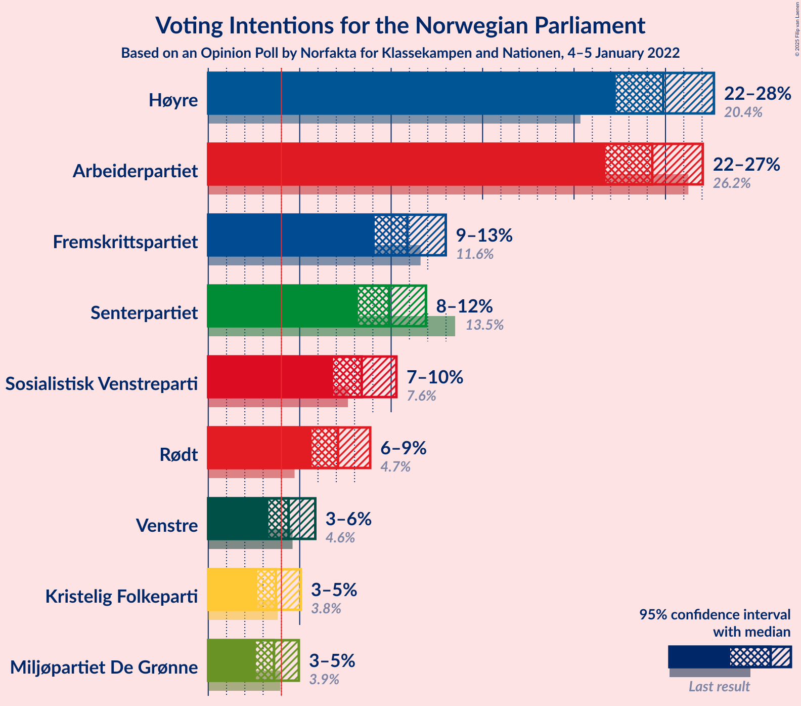

### Confidence Intervals

| Party | Last Result | Poll Result | 80% Confidence Interval | 90% Confidence Interval | 95% Confidence Interval | 99% Confidence Interval |
|:-----:|:-----------:|:-----------:|:-----------------------:|:-----------------------:|:-----------------------:|:-----------------------:|
| Høyre | 20.4% | 24.9% | 23.2–26.7% |22.7–27.2% |22.3–27.6% |21.5–28.5% |
| Arbeiderpartiet | 26.2% | 24.3% | 22.6–26.1% |22.1–26.6% |21.7–27.0% |20.9–27.9% |
| Fremskrittspartiet | 11.6% | 10.9% | 9.7–12.3% |9.4–12.6% |9.1–13.0% |8.6–13.7% |
| Senterpartiet | 13.5% | 9.9% | 8.8–11.2% |8.5–11.6% |8.2–11.9% |7.7–12.6% |
| Sosialistisk Venstreparti | 7.6% | 8.4% | 7.4–9.6% |7.1–10.0% |6.8–10.3% |6.4–10.9% |
| Rødt | 4.7% | 7.1% | 6.1–8.2% |5.9–8.6% |5.7–8.9% |5.2–9.4% |
| Venstre | 4.6% | 4.4% | 3.7–5.3% |3.5–5.6% |3.3–5.9% |3.0–6.3% |
| Kristelig Folkeparti | 3.8% | 3.7% | 3.0–4.6% |2.9–4.8% |2.7–5.1% |2.4–5.5% |
| Miljøpartiet De Grønne | 3.9% | 3.6% | 2.9–4.5% |2.8–4.7% |2.6–5.0% |2.3–5.4% |

*Note:* The poll result column reflects the actual value used in the calculations. Published results may vary slightly, and in addition be rounded to fewer digits.

## Seats

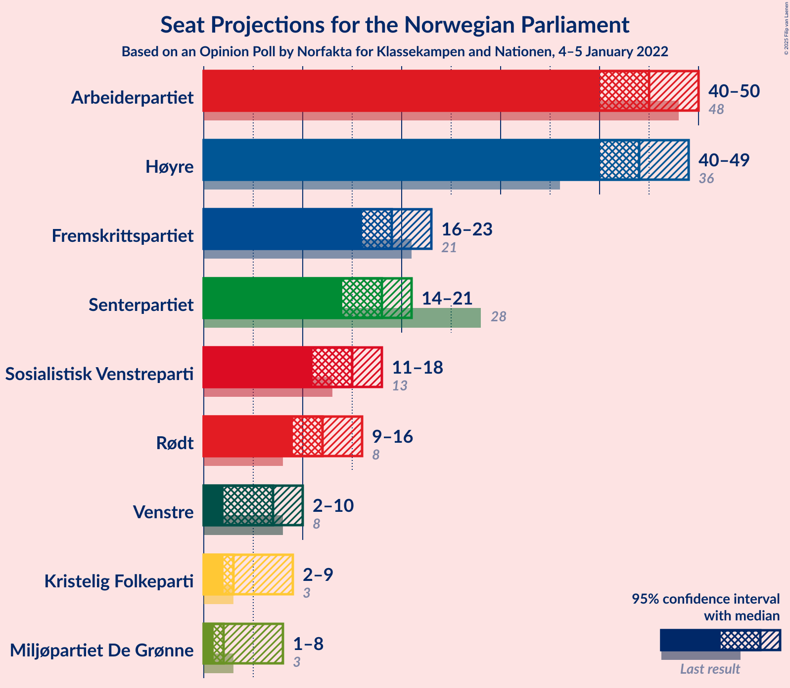

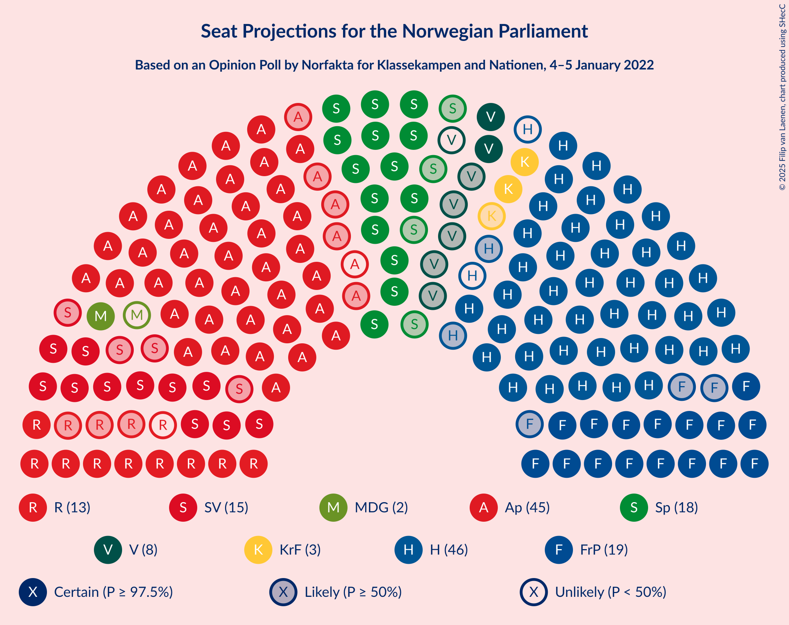

### Confidence Intervals

| Party | Last Result | Median | 80% Confidence Interval | 90% Confidence Interval | 95% Confidence Interval | 99% Confidence Interval |
|:-----:|:-----------:|:------:|:-----------------------:|:-----------------------:|:-----------------------:|:-----------------------:|
| <a href="#høyre">Høyre</a> | 36 | 44 | 41–47 |41–49 |40–49 |38–51 |
| <a href="#arbeiderpartiet">Arbeiderpartiet</a> | 48 | 45 | 42–49 |41–49 |40–50 |38–52 |
| <a href="#fremskrittspartiet">Fremskrittspartiet</a> | 21 | 19 | 17–22 |17–22 |16–23 |15–24 |
| <a href="#senterpartiet">Senterpartiet</a> | 28 | 18 | 15–20 |15–21 |14–21 |13–23 |
| <a href="#sosialistisk-venstreparti">Sosialistisk Venstreparti</a> | 13 | 15 | 12–17 |12–18 |11–18 |10–20 |
| <a href="#rødt">Rødt</a> | 8 | 12 | 11–15 |10–15 |9–16 |9–17 |
| <a href="#venstre">Venstre</a> | 8 | 7 | 2–9 |2–10 |2–10 |2–11 |
| <a href="#kristelig-folkeparti">Kristelig Folkeparti</a> | 3 | 3 | 2–8 |2–9 |2–9 |1–9 |
| <a href="#miljøpartiet-de-grønne">Miljøpartiet De Grønne</a> | 3 | 2 | 1–8 |1–8 |1–8 |1–9 |

### Høyre

*For a full overview of the results for this party, see the [Høyre](party-høyre.html) page.*

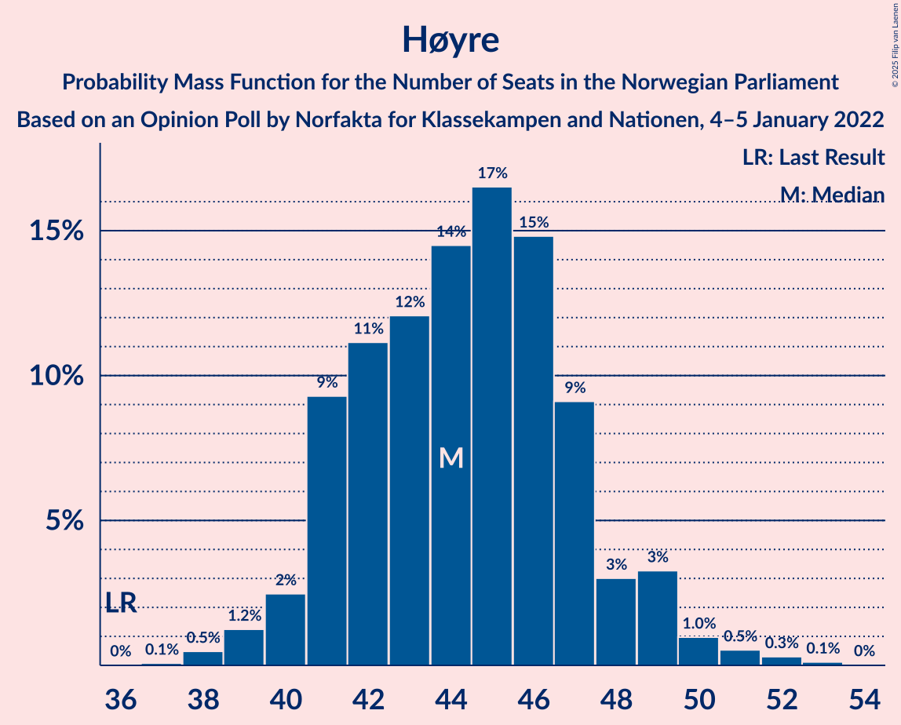

| Number of Seats | Probability | Accumulated | Special Marks |
|:---------------:|:-----------:|:-----------:|:-------------:|
| 36 | 0% | 100% | Last Result |
| 37 | 0.1% | 100% |  |
| 38 | 0.5% | 99.9% |  |
| 39 | 1.2% | 99.4% |  |
| 40 | 2% | 98% |  |
| 41 | 9% | 96% |  |
| 42 | 11% | 86% |  |
| 43 | 12% | 75% |  |
| 44 | 14% | 63% | Median |
| 45 | 17% | 49% |  |
| 46 | 15% | 32% |  |
| 47 | 9% | 17% |  |
| 48 | 3% | 8% |  |
| 49 | 3% | 5% |  |
| 50 | 1.0% | 2% |  |
| 51 | 0.5% | 1.0% |  |
| 52 | 0.3% | 0.5% |  |
| 53 | 0.1% | 0.2% |  |
| 54 | 0% | 0% |  |

### Arbeiderpartiet

*For a full overview of the results for this party, see the [Arbeiderpartiet](party-arbeiderpartiet.html) page.*

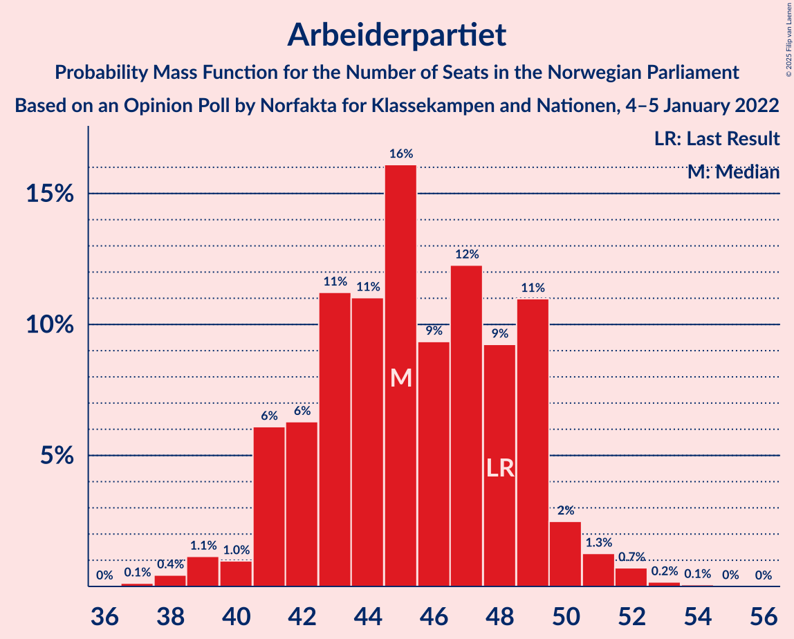

| Number of Seats | Probability | Accumulated | Special Marks |
|:---------------:|:-----------:|:-----------:|:-------------:|
| 37 | 0.1% | 100% |  |
| 38 | 0.4% | 99.9% |  |
| 39 | 1.1% | 99.4% |  |
| 40 | 1.0% | 98% |  |
| 41 | 6% | 97% |  |
| 42 | 6% | 91% |  |
| 43 | 11% | 85% |  |
| 44 | 11% | 74% |  |
| 45 | 16% | 63% | Median |
| 46 | 9% | 47% |  |
| 47 | 12% | 37% |  |
| 48 | 9% | 25% | Last Result |
| 49 | 11% | 16% |  |
| 50 | 2% | 5% |  |
| 51 | 1.3% | 2% |  |
| 52 | 0.7% | 1.0% |  |
| 53 | 0.2% | 0.3% |  |
| 54 | 0.1% | 0.1% |  |
| 55 | 0% | 0% |  |

### Fremskrittspartiet

*For a full overview of the results for this party, see the [Fremskrittspartiet](party-fremskrittspartiet.html) page.*

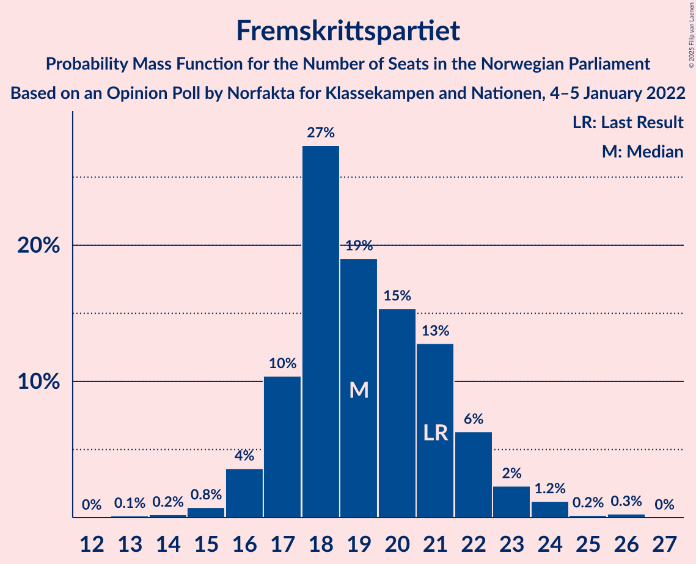

| Number of Seats | Probability | Accumulated | Special Marks |
|:---------------:|:-----------:|:-----------:|:-------------:|
| 13 | 0.1% | 100% |  |
| 14 | 0.2% | 99.9% |  |
| 15 | 0.8% | 99.6% |  |
| 16 | 4% | 98.9% |  |
| 17 | 10% | 95% |  |
| 18 | 27% | 85% |  |
| 19 | 19% | 58% | Median |
| 20 | 15% | 38% |  |
| 21 | 13% | 23% | Last Result |
| 22 | 6% | 10% |  |
| 23 | 2% | 4% |  |
| 24 | 1.2% | 2% |  |
| 25 | 0.2% | 0.5% |  |
| 26 | 0.3% | 0.3% |  |
| 27 | 0% | 0% |  |

### Senterpartiet

*For a full overview of the results for this party, see the [Senterpartiet](party-senterpartiet.html) page.*

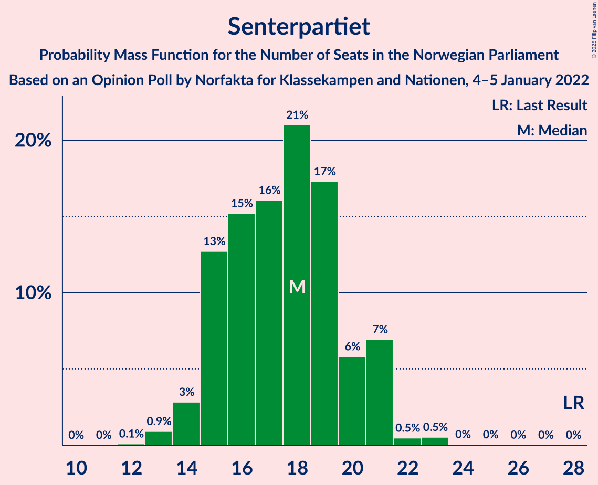

| Number of Seats | Probability | Accumulated | Special Marks |
|:---------------:|:-----------:|:-----------:|:-------------:|
| 12 | 0.1% | 100% |  |
| 13 | 0.9% | 99.9% |  |
| 14 | 3% | 99.0% |  |
| 15 | 13% | 96% |  |
| 16 | 15% | 83% |  |
| 17 | 16% | 68% |  |
| 18 | 21% | 52% | Median |
| 19 | 17% | 31% |  |
| 20 | 6% | 14% |  |
| 21 | 7% | 8% |  |
| 22 | 0.5% | 1.1% |  |
| 23 | 0.5% | 0.6% |  |
| 24 | 0% | 0.1% |  |
| 25 | 0% | 0.1% |  |
| 26 | 0% | 0% |  |
| 27 | 0% | 0% |  |
| 28 | 0% | 0% | Last Result |

### Sosialistisk Venstreparti

*For a full overview of the results for this party, see the [Sosialistisk Venstreparti](party-sosialistiskvenstreparti.html) page.*

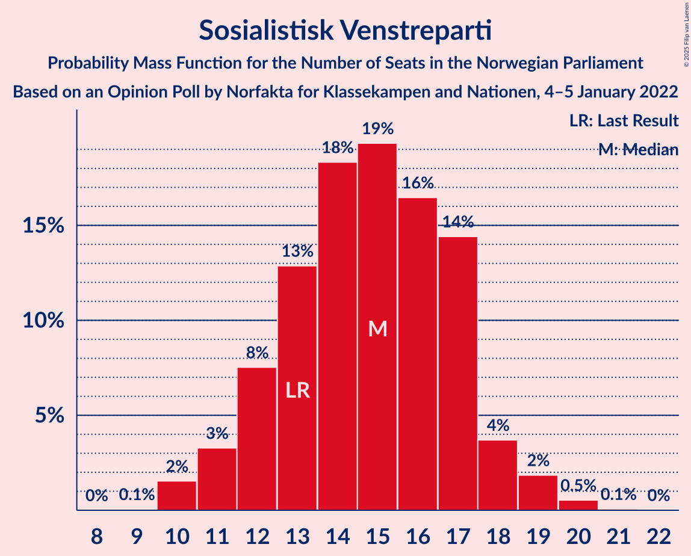

| Number of Seats | Probability | Accumulated | Special Marks |
|:---------------:|:-----------:|:-----------:|:-------------:|
| 9 | 0.1% | 100% |  |
| 10 | 2% | 99.9% |  |
| 11 | 3% | 98% |  |
| 12 | 8% | 95% |  |
| 13 | 13% | 88% | Last Result |
| 14 | 18% | 75% |  |
| 15 | 19% | 56% | Median |
| 16 | 16% | 37% |  |
| 17 | 14% | 21% |  |
| 18 | 4% | 6% |  |
| 19 | 2% | 2% |  |
| 20 | 0.5% | 0.6% |  |
| 21 | 0.1% | 0.1% |  |
| 22 | 0% | 0% |  |

### Rødt

*For a full overview of the results for this party, see the [Rødt](party-rødt.html) page.*

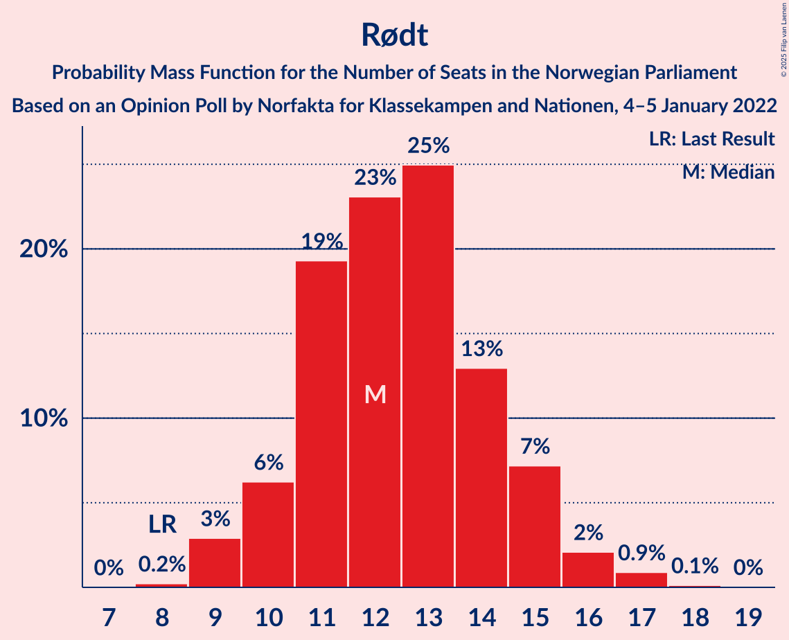

| Number of Seats | Probability | Accumulated | Special Marks |
|:---------------:|:-----------:|:-----------:|:-------------:|
| 8 | 0.2% | 100% | Last Result |
| 9 | 3% | 99.8% |  |
| 10 | 6% | 97% |  |
| 11 | 19% | 91% |  |
| 12 | 23% | 71% | Median |
| 13 | 25% | 48% |  |
| 14 | 13% | 23% |  |
| 15 | 7% | 10% |  |
| 16 | 2% | 3% |  |
| 17 | 0.9% | 1.0% |  |
| 18 | 0.1% | 0.1% |  |
| 19 | 0% | 0% |  |

### Venstre

*For a full overview of the results for this party, see the [Venstre](party-venstre.html) page.*

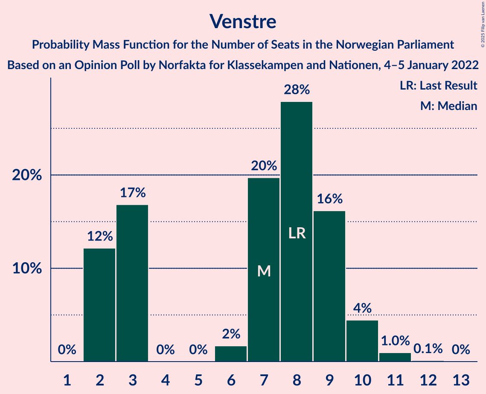

| Number of Seats | Probability | Accumulated | Special Marks |
|:---------------:|:-----------:|:-----------:|:-------------:|
| 2 | 12% | 100% |  |
| 3 | 17% | 88% |  |
| 4 | 0% | 71% |  |
| 5 | 0% | 71% |  |
| 6 | 2% | 71% |  |
| 7 | 20% | 69% | Median |
| 8 | 28% | 50% | Last Result |
| 9 | 16% | 22% |  |
| 10 | 4% | 6% |  |
| 11 | 1.0% | 1.1% |  |
| 12 | 0.1% | 0.1% |  |
| 13 | 0% | 0% |  |

### Kristelig Folkeparti

*For a full overview of the results for this party, see the [Kristelig Folkeparti](party-kristeligfolkeparti.html) page.*

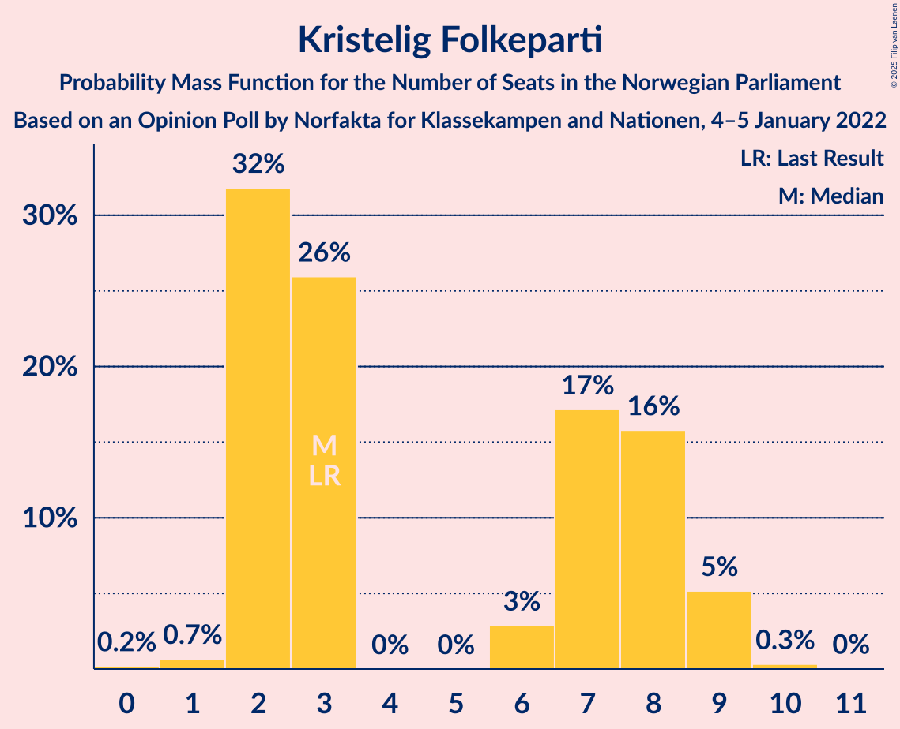

| Number of Seats | Probability | Accumulated | Special Marks |
|:---------------:|:-----------:|:-----------:|:-------------:|
| 0 | 0.2% | 100% |  |
| 1 | 0.7% | 99.8% |  |
| 2 | 32% | 99.1% |  |
| 3 | 26% | 67% | Last Result, Median |
| 4 | 0% | 41% |  |
| 5 | 0% | 41% |  |
| 6 | 3% | 41% |  |
| 7 | 17% | 38% |  |
| 8 | 16% | 21% |  |
| 9 | 5% | 6% |  |
| 10 | 0.3% | 0.4% |  |
| 11 | 0% | 0% |  |

### Miljøpartiet De Grønne

*For a full overview of the results for this party, see the [Miljøpartiet De Grønne](party-miljøpartietdegrønne.html) page.*

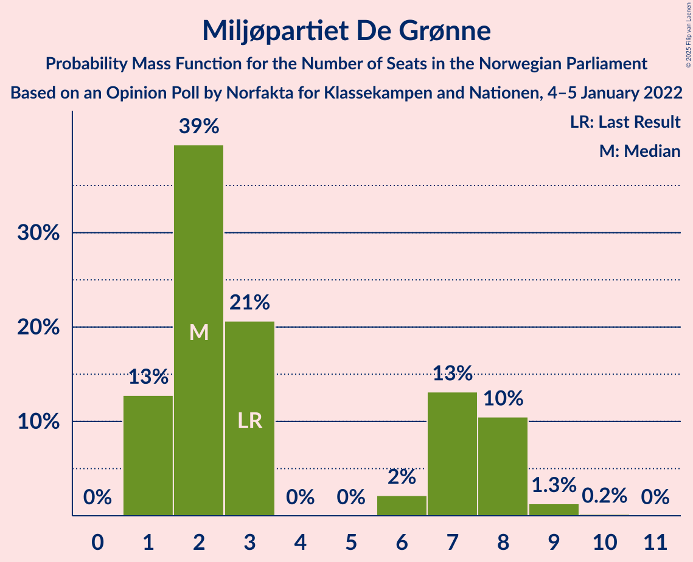

| Number of Seats | Probability | Accumulated | Special Marks |
|:---------------:|:-----------:|:-----------:|:-------------:|
| 1 | 13% | 100% |  |
| 2 | 39% | 87% | Median |
| 3 | 21% | 48% | Last Result |
| 4 | 0% | 27% |  |
| 5 | 0% | 27% |  |
| 6 | 2% | 27% |  |
| 7 | 13% | 25% |  |
| 8 | 10% | 12% |  |
| 9 | 1.3% | 1.5% |  |
| 10 | 0.2% | 0.2% |  |
| 11 | 0% | 0% |  |

## Coalitions

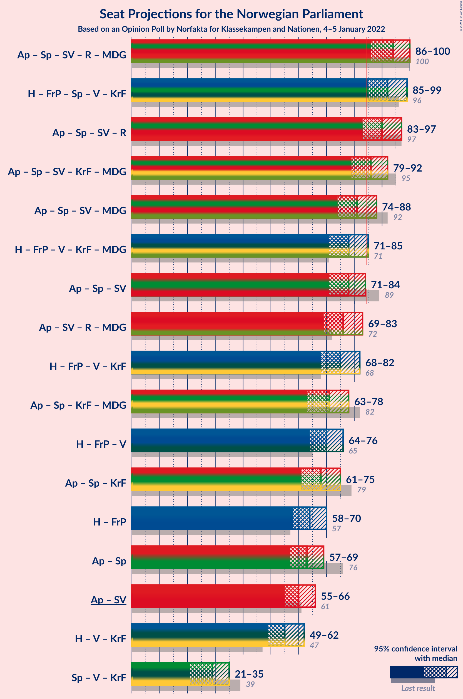

### Confidence Intervals

| Coalition | Last Result | Median | Majority? | 80% Confidence Interval | 90% Confidence Interval | 95% Confidence Interval | 99% Confidence Interval |
|:---------:|:-----------:|:------:|:---------:|:-----------------------:|:-----------------------:|:-----------------------:|:-----------------------:|
| Arbeiderpartiet – Senterpartiet – Sosialistisk Venstreparti – Rødt – Miljøpartiet De Grønne | 100 | 94 | 99.7% | 89–99 | 88–100 | 86–100 | 85–103 |
| Høyre – Fremskrittspartiet – Senterpartiet – Venstre – Kristelig Folkeparti | 96 | 92 | 98.5% | 87–97 | 86–98 | 85–99 | 82–100 |
| Arbeiderpartiet – Senterpartiet – Sosialistisk Venstreparti – Rødt | 97 | 90 | 94% | 85–95 | 84–97 | 83–97 | 82–99 |
| Arbeiderpartiet – Senterpartiet – Sosialistisk Venstreparti – Kristelig Folkeparti – Miljøpartiet De Grønne | 95 | 86 | 63% | 81–91 | 80–92 | 79–92 | 77–94 |
| Arbeiderpartiet – Senterpartiet – Sosialistisk Venstreparti – Miljøpartiet De Grønne | 92 | 81 | 19% | 77–86 | 76–87 | 74–88 | 73–90 |
| Høyre – Fremskrittspartiet – Venstre – Kristelig Folkeparti – Miljøpartiet De Grønne | 71 | 78 | 3% | 73–83 | 72–84 | 71–85 | 70–86 |
| Arbeiderpartiet – Senterpartiet – Sosialistisk Venstreparti | 89 | 78 | 1.1% | 74–82 | 72–83 | 71–84 | 70–86 |
| Arbeiderpartiet – Sosialistisk Venstreparti – Rødt – Miljøpartiet De Grønne | 72 | 76 | 1.0% | 71–80 | 71–82 | 69–83 | 68–86 |
| Høyre – Fremskrittspartiet – Venstre – Kristelig Folkeparti | 68 | 75 | 0% | 70–79 | 69–81 | 68–82 | 66–83 |
| Arbeiderpartiet – Senterpartiet – Kristelig Folkeparti – Miljøpartiet De Grønne | 82 | 71 | 0% | 66–77 | 64–78 | 63–78 | 61–80 |
| Høyre – Fremskrittspartiet – Venstre | 65 | 70 | 0% | 65–74 | 64–75 | 64–76 | 62–79 |
| Arbeiderpartiet – Senterpartiet – Kristelig Folkeparti | 79 | 68 | 0% | 63–73 | 62–74 | 61–75 | 59–75 |
| Høyre – Fremskrittspartiet | 57 | 64 | 0% | 60–67 | 59–69 | 58–70 | 56–72 |
| Arbeiderpartiet – Senterpartiet | 76 | 63 | 0% | 59–67 | 58–68 | 57–69 | 55–70 |
| Arbeiderpartiet – Sosialistisk Venstreparti | 61 | 60 | 0% | 56–64 | 56–65 | 55–66 | 53–67 |
| Høyre – Venstre – Kristelig Folkeparti | 47 | 55 | 0% | 51–60 | 50–61 | 49–62 | 46–63 |
| Senterpartiet – Venstre – Kristelig Folkeparti | 39 | 29 | 0% | 23–33 | 22–34 | 21–35 | 20–36 |

### Arbeiderpartiet – Senterpartiet – Sosialistisk Venstreparti – Rødt – Miljøpartiet De Grønne

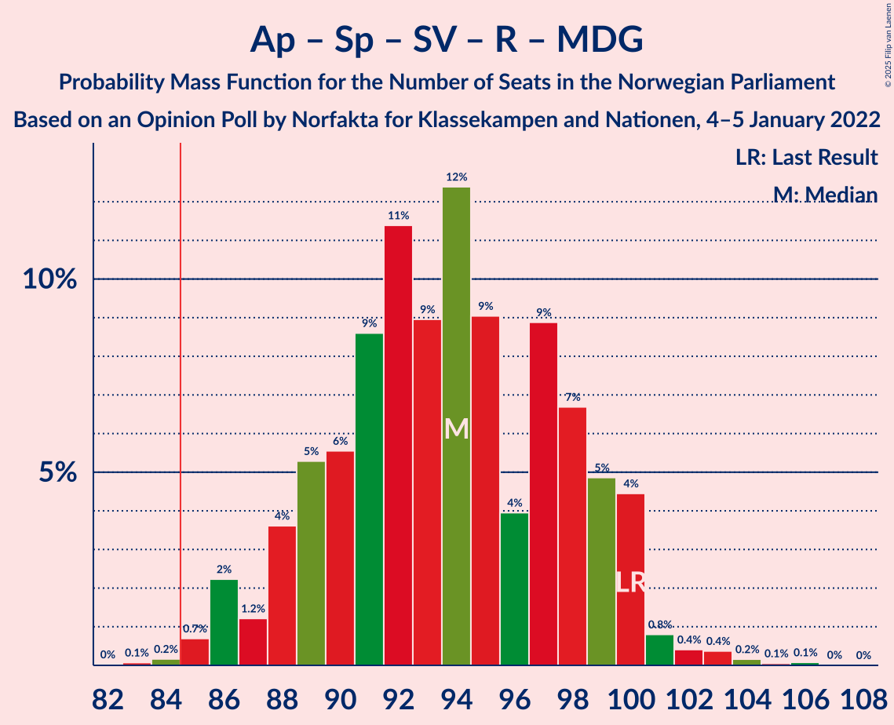

| Number of Seats | Probability | Accumulated | Special Marks |
|:---------------:|:-----------:|:-----------:|:-------------:|
| 83 | 0.1% | 100% |  |
| 84 | 0.2% | 99.9% |  |
| 85 | 0.7% | 99.7% | Majority |
| 86 | 2% | 99.0% |  |
| 87 | 1.2% | 97% |  |
| 88 | 4% | 96% |  |
| 89 | 5% | 92% |  |
| 90 | 6% | 87% |  |
| 91 | 9% | 81% |  |
| 92 | 11% | 73% | Median |
| 93 | 9% | 61% |  |
| 94 | 12% | 52% |  |
| 95 | 9% | 40% |  |
| 96 | 4% | 31% |  |
| 97 | 9% | 27% |  |
| 98 | 7% | 18% |  |
| 99 | 5% | 11% |  |
| 100 | 4% | 6% | Last Result |
| 101 | 0.8% | 2% |  |
| 102 | 0.4% | 1.1% |  |
| 103 | 0.4% | 0.7% |  |
| 104 | 0.2% | 0.3% |  |
| 105 | 0.1% | 0.2% |  |
| 106 | 0.1% | 0.1% |  |
| 107 | 0% | 0% |  |

### Høyre – Fremskrittspartiet – Senterpartiet – Venstre – Kristelig Folkeparti

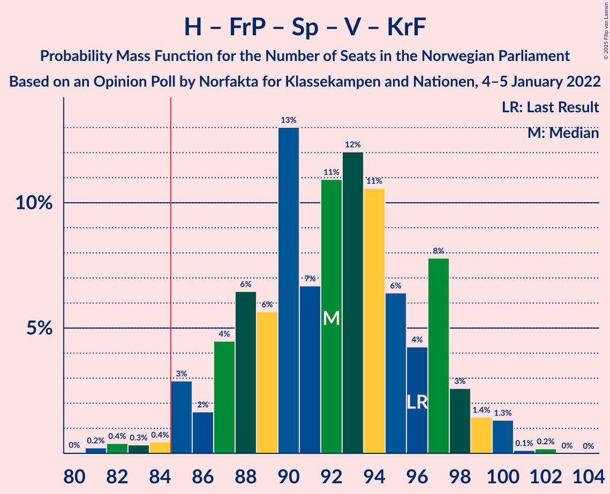

| Number of Seats | Probability | Accumulated | Special Marks |
|:---------------:|:-----------:|:-----------:|:-------------:|
| 80 | 0% | 100% |  |
| 81 | 0.2% | 99.9% |  |
| 82 | 0.4% | 99.7% |  |
| 83 | 0.3% | 99.3% |  |
| 84 | 0.4% | 99.0% |  |
| 85 | 3% | 98.5% | Majority |
| 86 | 2% | 96% |  |
| 87 | 4% | 94% |  |
| 88 | 6% | 89% |  |
| 89 | 6% | 83% |  |
| 90 | 13% | 77% |  |
| 91 | 7% | 64% | Median |
| 92 | 11% | 58% |  |
| 93 | 12% | 47% |  |
| 94 | 11% | 35% |  |
| 95 | 6% | 24% |  |
| 96 | 4% | 18% | Last Result |
| 97 | 8% | 13% |  |
| 98 | 3% | 6% |  |
| 99 | 1.4% | 3% |  |
| 100 | 1.3% | 2% |  |
| 101 | 0.1% | 0.3% |  |
| 102 | 0.2% | 0.2% |  |
| 103 | 0% | 0% |  |

### Arbeiderpartiet – Senterpartiet – Sosialistisk Venstreparti – Rødt

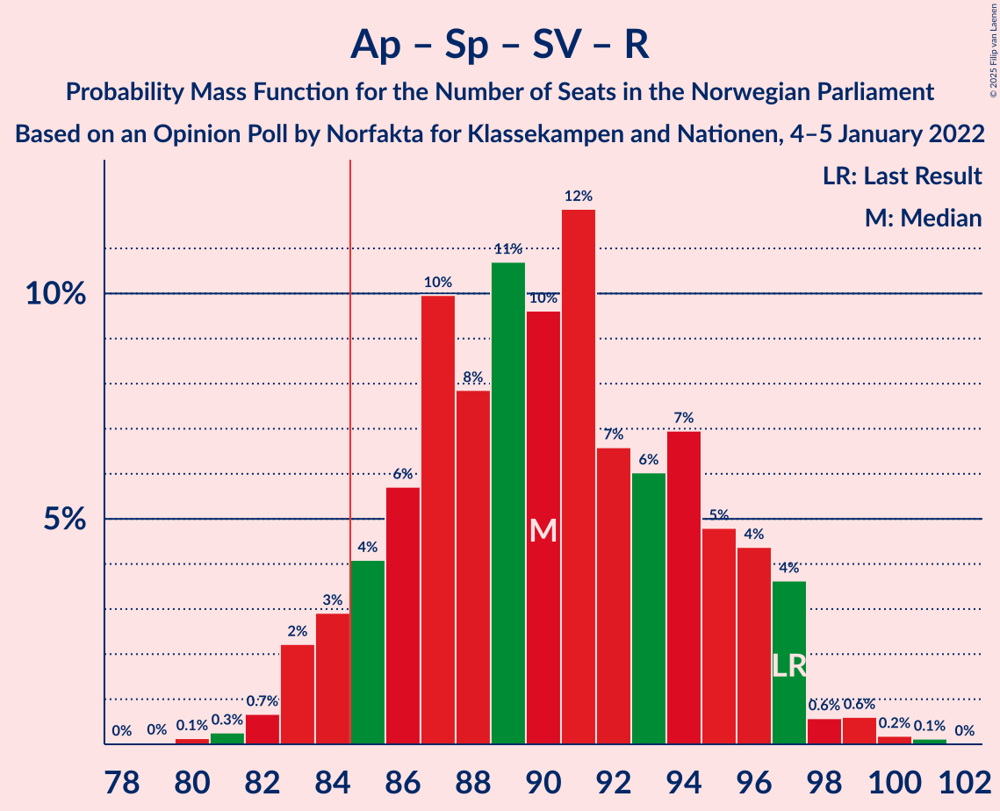

| Number of Seats | Probability | Accumulated | Special Marks |
|:---------------:|:-----------:|:-----------:|:-------------:|
| 79 | 0% | 100% |  |
| 80 | 0.1% | 99.9% |  |
| 81 | 0.3% | 99.8% |  |
| 82 | 0.7% | 99.5% |  |
| 83 | 2% | 98.9% |  |
| 84 | 3% | 97% |  |
| 85 | 4% | 94% | Majority |
| 86 | 6% | 90% |  |
| 87 | 10% | 84% |  |
| 88 | 8% | 74% |  |
| 89 | 11% | 66% |  |
| 90 | 10% | 55% | Median |
| 91 | 12% | 46% |  |
| 92 | 7% | 34% |  |
| 93 | 6% | 27% |  |
| 94 | 7% | 21% |  |
| 95 | 5% | 14% |  |
| 96 | 4% | 10% |  |
| 97 | 4% | 5% | Last Result |
| 98 | 0.6% | 2% |  |
| 99 | 0.6% | 1.0% |  |
| 100 | 0.2% | 0.3% |  |
| 101 | 0.1% | 0.2% |  |
| 102 | 0% | 0% |  |

### Arbeiderpartiet – Senterpartiet – Sosialistisk Venstreparti – Kristelig Folkeparti – Miljøpartiet De Grønne

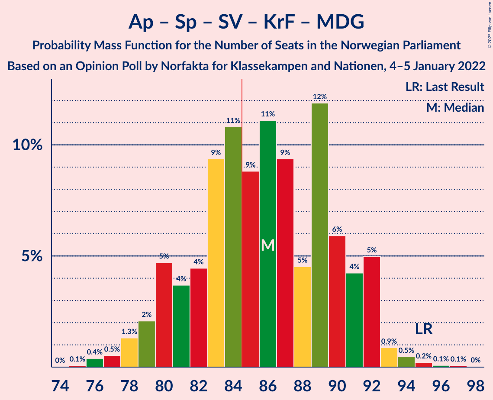

| Number of Seats | Probability | Accumulated | Special Marks |
|:---------------:|:-----------:|:-----------:|:-------------:|
| 75 | 0.1% | 100% |  |
| 76 | 0.4% | 99.9% |  |
| 77 | 0.5% | 99.5% |  |
| 78 | 1.3% | 99.0% |  |
| 79 | 2% | 98% |  |
| 80 | 5% | 96% |  |
| 81 | 4% | 91% |  |
| 82 | 4% | 87% |  |
| 83 | 9% | 83% | Median |
| 84 | 11% | 73% |  |
| 85 | 9% | 63% | Majority |
| 86 | 11% | 54% |  |
| 87 | 9% | 43% |  |
| 88 | 5% | 33% |  |
| 89 | 12% | 29% |  |
| 90 | 6% | 17% |  |
| 91 | 4% | 11% |  |
| 92 | 5% | 7% |  |
| 93 | 0.9% | 2% |  |
| 94 | 0.5% | 0.9% |  |
| 95 | 0.2% | 0.4% | Last Result |
| 96 | 0.1% | 0.2% |  |
| 97 | 0.1% | 0.1% |  |
| 98 | 0% | 0% |  |

### Arbeiderpartiet – Senterpartiet – Sosialistisk Venstreparti – Miljøpartiet De Grønne

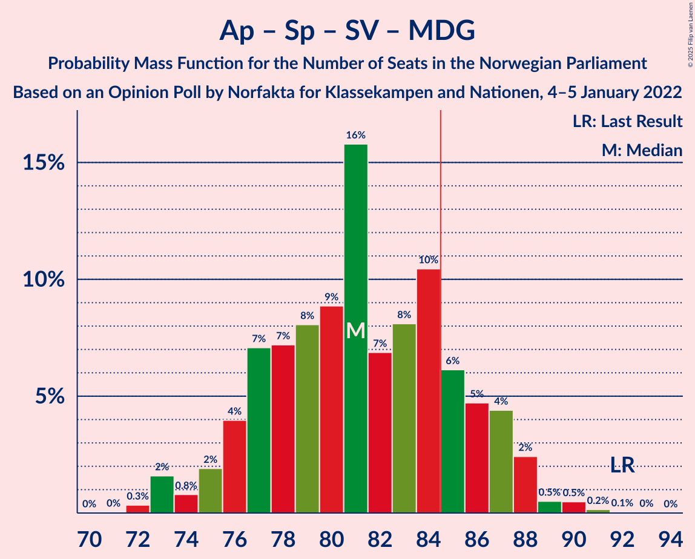

| Number of Seats | Probability | Accumulated | Special Marks |
|:---------------:|:-----------:|:-----------:|:-------------:|
| 71 | 0% | 100% |  |
| 72 | 0.3% | 99.9% |  |
| 73 | 2% | 99.6% |  |
| 74 | 0.8% | 98% |  |
| 75 | 2% | 97% |  |
| 76 | 4% | 95% |  |
| 77 | 7% | 91% |  |
| 78 | 7% | 84% |  |
| 79 | 8% | 77% |  |
| 80 | 9% | 69% | Median |
| 81 | 16% | 60% |  |
| 82 | 7% | 44% |  |
| 83 | 8% | 37% |  |
| 84 | 10% | 29% |  |
| 85 | 6% | 19% | Majority |
| 86 | 5% | 13% |  |
| 87 | 4% | 8% |  |
| 88 | 2% | 4% |  |
| 89 | 0.5% | 1.2% |  |
| 90 | 0.5% | 0.7% |  |
| 91 | 0.2% | 0.3% |  |
| 92 | 0.1% | 0.1% | Last Result |
| 93 | 0% | 0.1% |  |
| 94 | 0% | 0% |  |

### Høyre – Fremskrittspartiet – Venstre – Kristelig Folkeparti – Miljøpartiet De Grønne

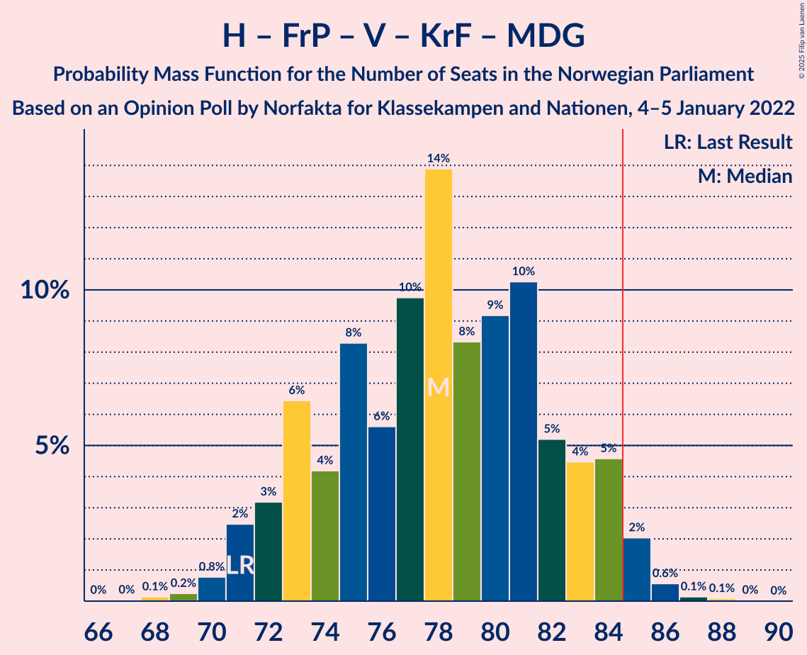

| Number of Seats | Probability | Accumulated | Special Marks |
|:---------------:|:-----------:|:-----------:|:-------------:|
| 67 | 0% | 100% |  |
| 68 | 0.1% | 99.9% |  |
| 69 | 0.2% | 99.8% |  |
| 70 | 0.8% | 99.5% |  |
| 71 | 2% | 98.8% | Last Result |
| 72 | 3% | 96% |  |
| 73 | 6% | 93% |  |
| 74 | 4% | 87% |  |
| 75 | 8% | 82% | Median |
| 76 | 6% | 74% |  |
| 77 | 10% | 69% |  |
| 78 | 14% | 59% |  |
| 79 | 8% | 45% |  |
| 80 | 9% | 37% |  |
| 81 | 10% | 27% |  |
| 82 | 5% | 17% |  |
| 83 | 4% | 12% |  |
| 84 | 5% | 7% |  |
| 85 | 2% | 3% | Majority |
| 86 | 0.6% | 0.8% |  |
| 87 | 0.1% | 0.3% |  |
| 88 | 0.1% | 0.1% |  |
| 89 | 0% | 0% |  |

### Arbeiderpartiet – Senterpartiet – Sosialistisk Venstreparti

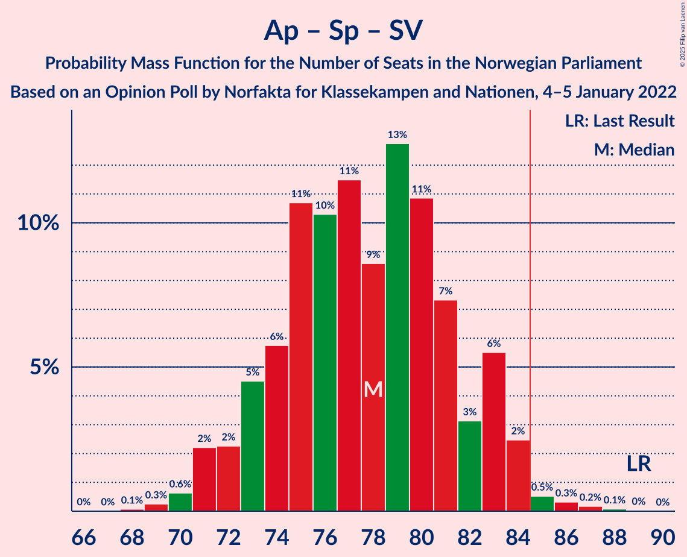

| Number of Seats | Probability | Accumulated | Special Marks |
|:---------------:|:-----------:|:-----------:|:-------------:|
| 68 | 0.1% | 100% |  |
| 69 | 0.3% | 99.9% |  |
| 70 | 0.6% | 99.6% |  |
| 71 | 2% | 99.0% |  |
| 72 | 2% | 97% |  |
| 73 | 5% | 95% |  |
| 74 | 6% | 90% |  |
| 75 | 11% | 84% |  |
| 76 | 10% | 74% |  |
| 77 | 11% | 63% |  |
| 78 | 9% | 52% | Median |
| 79 | 13% | 43% |  |
| 80 | 11% | 30% |  |
| 81 | 7% | 20% |  |
| 82 | 3% | 12% |  |
| 83 | 6% | 9% |  |
| 84 | 2% | 4% |  |
| 85 | 0.5% | 1.1% | Majority |
| 86 | 0.3% | 0.6% |  |
| 87 | 0.2% | 0.3% |  |
| 88 | 0.1% | 0.1% |  |
| 89 | 0% | 0% | Last Result |

### Arbeiderpartiet – Sosialistisk Venstreparti – Rødt – Miljøpartiet De Grønne

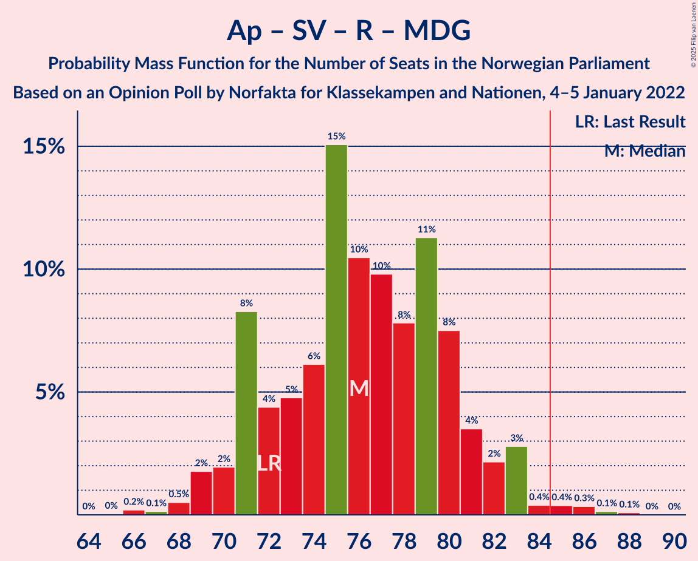

| Number of Seats | Probability | Accumulated | Special Marks |
|:---------------:|:-----------:|:-----------:|:-------------:|
| 65 | 0% | 100% |  |
| 66 | 0.2% | 99.9% |  |
| 67 | 0.1% | 99.7% |  |
| 68 | 0.5% | 99.6% |  |
| 69 | 2% | 99.1% |  |
| 70 | 2% | 97% |  |
| 71 | 8% | 95% |  |
| 72 | 4% | 87% | Last Result |
| 73 | 5% | 83% |  |
| 74 | 6% | 78% | Median |
| 75 | 15% | 72% |  |
| 76 | 10% | 57% |  |
| 77 | 10% | 46% |  |
| 78 | 8% | 36% |  |
| 79 | 11% | 29% |  |
| 80 | 8% | 17% |  |
| 81 | 4% | 10% |  |
| 82 | 2% | 6% |  |
| 83 | 3% | 4% |  |
| 84 | 0.4% | 1.4% |  |
| 85 | 0.4% | 1.0% | Majority |
| 86 | 0.3% | 0.6% |  |
| 87 | 0.1% | 0.3% |  |
| 88 | 0.1% | 0.1% |  |
| 89 | 0% | 0% |  |

### Høyre – Fremskrittspartiet – Venstre – Kristelig Folkeparti

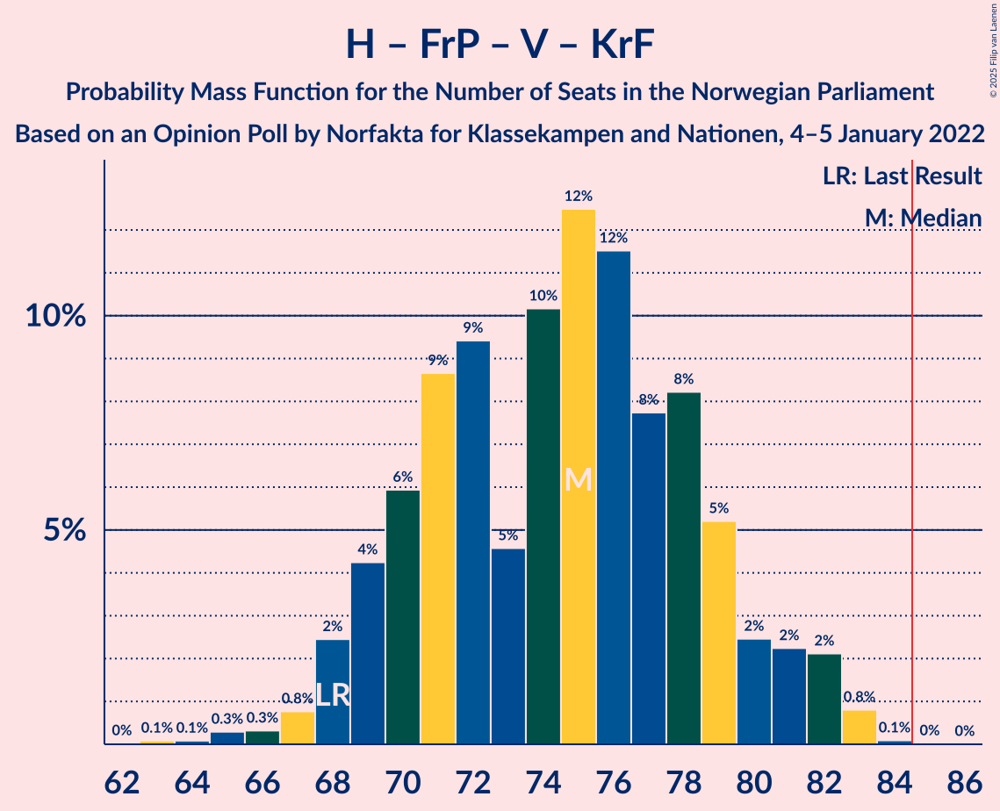

| Number of Seats | Probability | Accumulated | Special Marks |
|:---------------:|:-----------:|:-----------:|:-------------:|
| 63 | 0.1% | 100% |  |
| 64 | 0.1% | 99.9% |  |
| 65 | 0.3% | 99.8% |  |
| 66 | 0.3% | 99.5% |  |
| 67 | 0.8% | 99.2% |  |
| 68 | 2% | 98% | Last Result |
| 69 | 4% | 96% |  |
| 70 | 6% | 92% |  |
| 71 | 9% | 86% |  |
| 72 | 9% | 77% |  |
| 73 | 5% | 68% | Median |
| 74 | 10% | 63% |  |
| 75 | 12% | 53% |  |
| 76 | 12% | 40% |  |
| 77 | 8% | 29% |  |
| 78 | 8% | 21% |  |
| 79 | 5% | 13% |  |
| 80 | 2% | 8% |  |
| 81 | 2% | 5% |  |
| 82 | 2% | 3% |  |
| 83 | 0.8% | 0.9% |  |
| 84 | 0.1% | 0.1% |  |
| 85 | 0% | 0% | Majority |

### Arbeiderpartiet – Senterpartiet – Kristelig Folkeparti – Miljøpartiet De Grønne

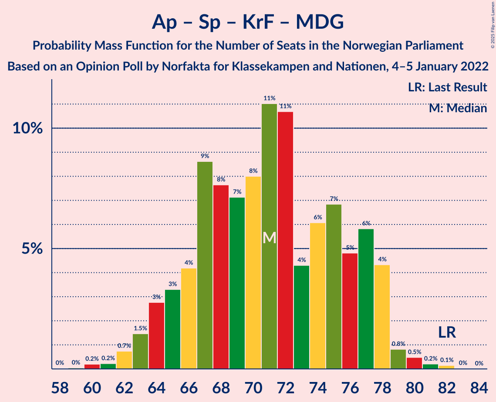

| Number of Seats | Probability | Accumulated | Special Marks |
|:---------------:|:-----------:|:-----------:|:-------------:|
| 59 | 0% | 100% |  |
| 60 | 0.2% | 99.9% |  |
| 61 | 0.2% | 99.7% |  |
| 62 | 0.7% | 99.5% |  |
| 63 | 1.5% | 98.8% |  |
| 64 | 3% | 97% |  |
| 65 | 3% | 95% |  |
| 66 | 4% | 91% |  |
| 67 | 9% | 87% |  |
| 68 | 8% | 78% | Median |
| 69 | 7% | 71% |  |
| 70 | 8% | 64% |  |
| 71 | 11% | 56% |  |
| 72 | 11% | 45% |  |
| 73 | 4% | 34% |  |
| 74 | 6% | 30% |  |
| 75 | 7% | 24% |  |
| 76 | 5% | 17% |  |
| 77 | 6% | 12% |  |
| 78 | 4% | 6% |  |
| 79 | 0.8% | 2% |  |
| 80 | 0.5% | 0.9% |  |
| 81 | 0.2% | 0.4% |  |
| 82 | 0.1% | 0.2% | Last Result |
| 83 | 0% | 0.1% |  |
| 84 | 0% | 0% |  |

### Høyre – Fremskrittspartiet – Venstre

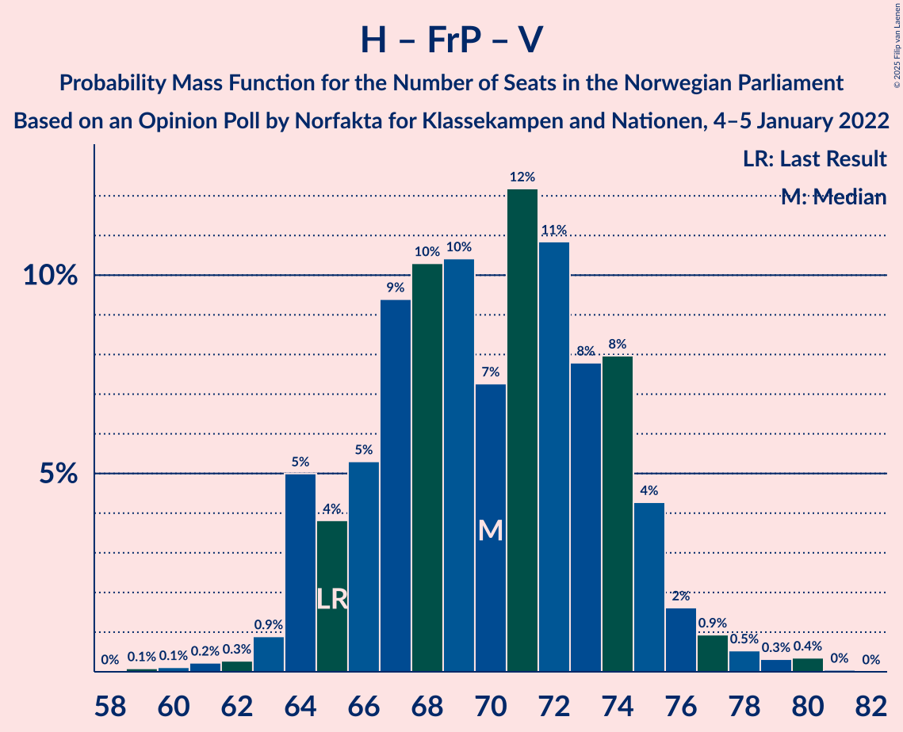

| Number of Seats | Probability | Accumulated | Special Marks |
|:---------------:|:-----------:|:-----------:|:-------------:|
| 59 | 0.1% | 100% |  |
| 60 | 0.1% | 99.9% |  |
| 61 | 0.2% | 99.8% |  |
| 62 | 0.3% | 99.6% |  |
| 63 | 0.9% | 99.3% |  |
| 64 | 5% | 98% |  |
| 65 | 4% | 93% | Last Result |
| 66 | 5% | 90% |  |
| 67 | 9% | 84% |  |
| 68 | 10% | 75% |  |
| 69 | 10% | 65% |  |
| 70 | 7% | 54% | Median |
| 71 | 12% | 47% |  |
| 72 | 11% | 35% |  |
| 73 | 8% | 24% |  |
| 74 | 8% | 16% |  |
| 75 | 4% | 8% |  |
| 76 | 2% | 4% |  |
| 77 | 0.9% | 2% |  |
| 78 | 0.5% | 1.3% |  |
| 79 | 0.3% | 0.7% |  |
| 80 | 0.4% | 0.4% |  |
| 81 | 0% | 0.1% |  |
| 82 | 0% | 0% |  |

### Arbeiderpartiet – Senterpartiet – Kristelig Folkeparti

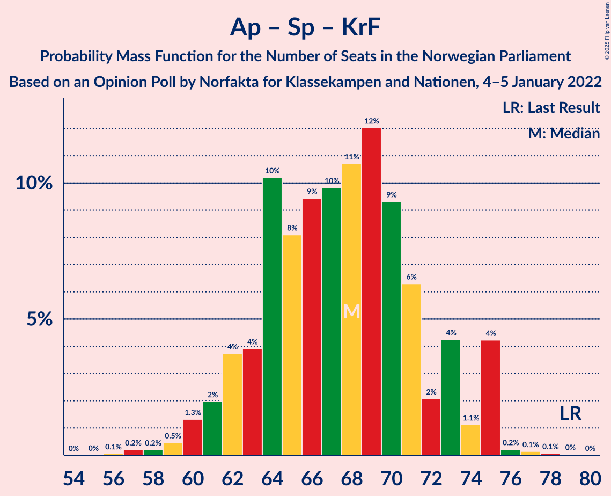

| Number of Seats | Probability | Accumulated | Special Marks |
|:---------------:|:-----------:|:-----------:|:-------------:|
| 56 | 0.1% | 100% |  |
| 57 | 0.2% | 99.9% |  |
| 58 | 0.2% | 99.7% |  |
| 59 | 0.5% | 99.5% |  |
| 60 | 1.3% | 99.1% |  |
| 61 | 2% | 98% |  |
| 62 | 4% | 96% |  |
| 63 | 4% | 92% |  |
| 64 | 10% | 88% |  |
| 65 | 8% | 78% |  |
| 66 | 9% | 70% | Median |
| 67 | 10% | 60% |  |
| 68 | 11% | 51% |  |
| 69 | 12% | 40% |  |
| 70 | 9% | 28% |  |
| 71 | 6% | 18% |  |
| 72 | 2% | 12% |  |
| 73 | 4% | 10% |  |
| 74 | 1.1% | 6% |  |
| 75 | 4% | 5% |  |
| 76 | 0.2% | 0.5% |  |
| 77 | 0.1% | 0.3% |  |
| 78 | 0.1% | 0.1% |  |
| 79 | 0% | 0% | Last Result |

### Høyre – Fremskrittspartiet

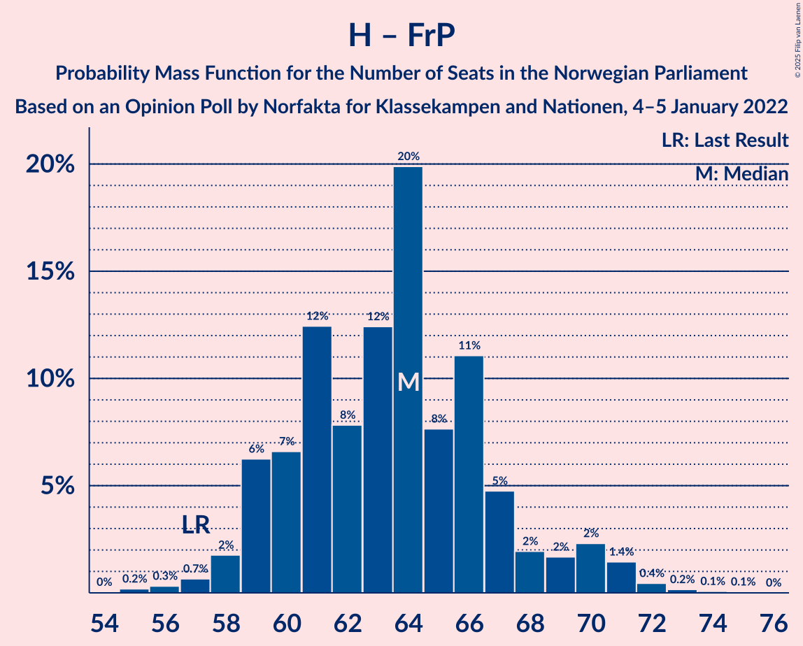

| Number of Seats | Probability | Accumulated | Special Marks |
|:---------------:|:-----------:|:-----------:|:-------------:|
| 54 | 0% | 100% |  |
| 55 | 0.2% | 99.9% |  |
| 56 | 0.3% | 99.8% |  |
| 57 | 0.7% | 99.4% | Last Result |
| 58 | 2% | 98.8% |  |
| 59 | 6% | 97% |  |
| 60 | 7% | 91% |  |
| 61 | 12% | 84% |  |
| 62 | 8% | 72% |  |
| 63 | 12% | 64% | Median |
| 64 | 20% | 51% |  |
| 65 | 8% | 32% |  |
| 66 | 11% | 24% |  |
| 67 | 5% | 13% |  |
| 68 | 2% | 8% |  |
| 69 | 2% | 6% |  |
| 70 | 2% | 4% |  |
| 71 | 1.4% | 2% |  |
| 72 | 0.4% | 0.7% |  |
| 73 | 0.2% | 0.3% |  |
| 74 | 0.1% | 0.1% |  |
| 75 | 0.1% | 0.1% |  |
| 76 | 0% | 0% |  |

### Arbeiderpartiet – Senterpartiet

| Number of Seats | Probability | Accumulated | Special Marks |
|:---------------:|:-----------:|:-----------:|:-------------:|
| 53 | 0% | 100% |  |
| 54 | 0.2% | 99.9% |  |
| 55 | 0.6% | 99.8% |  |
| 56 | 0.6% | 99.2% |  |
| 57 | 1.3% | 98.6% |  |
| 58 | 5% | 97% |  |
| 59 | 5% | 92% |  |
| 60 | 8% | 87% |  |
| 61 | 10% | 80% |  |
| 62 | 15% | 69% |  |
| 63 | 13% | 54% | Median |
| 64 | 11% | 41% |  |
| 65 | 8% | 30% |  |
| 66 | 7% | 21% |  |
| 67 | 9% | 15% |  |
| 68 | 3% | 6% |  |
| 69 | 2% | 3% |  |
| 70 | 0.7% | 1.1% |  |
| 71 | 0.3% | 0.4% |  |
| 72 | 0.1% | 0.1% |  |
| 73 | 0% | 0% |  |
| 74 | 0% | 0% |  |
| 75 | 0% | 0% |  |
| 76 | 0% | 0% | Last Result |

### Arbeiderpartiet – Sosialistisk Venstreparti

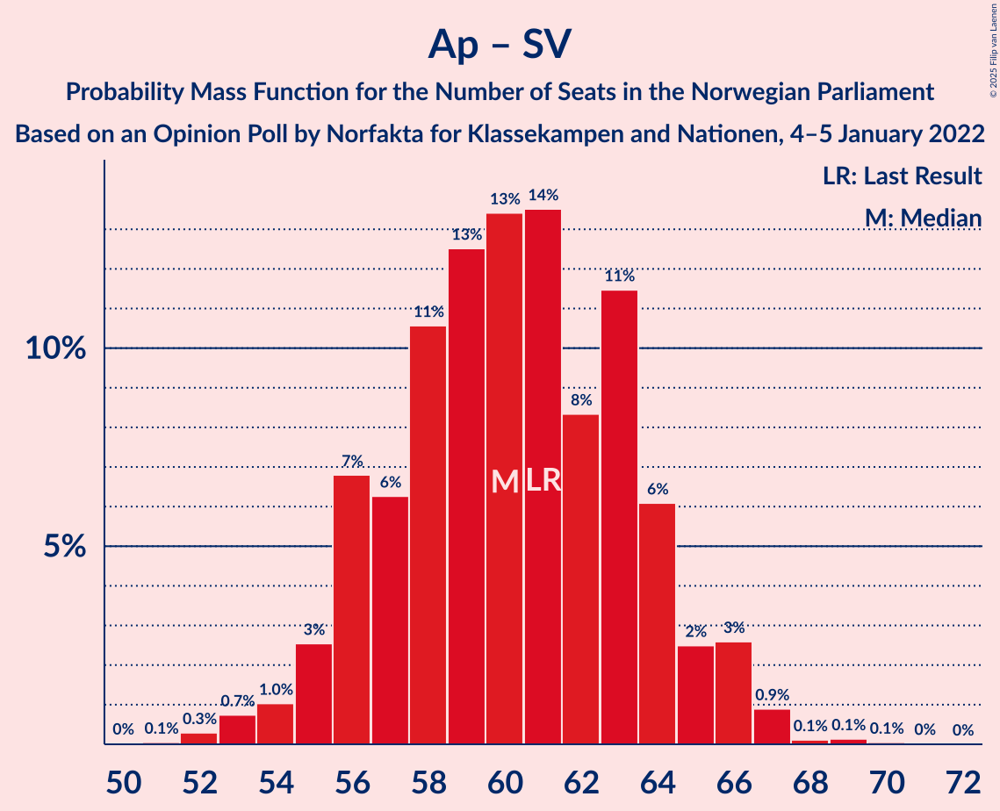

| Number of Seats | Probability | Accumulated | Special Marks |
|:---------------:|:-----------:|:-----------:|:-------------:|
| 51 | 0.1% | 100% |  |
| 52 | 0.3% | 99.9% |  |
| 53 | 0.7% | 99.6% |  |
| 54 | 1.0% | 98.9% |  |
| 55 | 3% | 98% |  |
| 56 | 7% | 95% |  |
| 57 | 6% | 88% |  |
| 58 | 11% | 82% |  |
| 59 | 13% | 72% |  |
| 60 | 13% | 59% | Median |
| 61 | 14% | 46% | Last Result |
| 62 | 8% | 32% |  |
| 63 | 11% | 24% |  |
| 64 | 6% | 12% |  |
| 65 | 2% | 6% |  |
| 66 | 3% | 4% |  |
| 67 | 0.9% | 1.2% |  |
| 68 | 0.1% | 0.3% |  |
| 69 | 0.1% | 0.2% |  |
| 70 | 0.1% | 0.1% |  |
| 71 | 0% | 0% |  |

### Høyre – Venstre – Kristelig Folkeparti

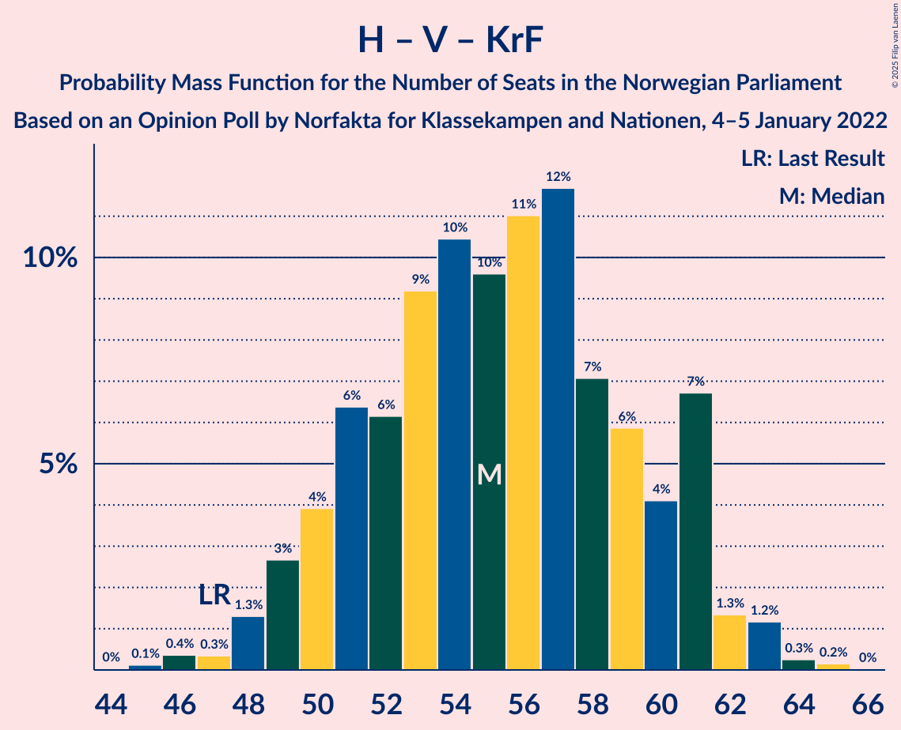

| Number of Seats | Probability | Accumulated | Special Marks |
|:---------------:|:-----------:|:-----------:|:-------------:|
| 44 | 0% | 100% |  |
| 45 | 0.1% | 99.9% |  |
| 46 | 0.4% | 99.8% |  |
| 47 | 0.3% | 99.5% | Last Result |
| 48 | 1.3% | 99.1% |  |
| 49 | 3% | 98% |  |
| 50 | 4% | 95% |  |
| 51 | 6% | 91% |  |
| 52 | 6% | 85% |  |
| 53 | 9% | 79% |  |
| 54 | 10% | 69% | Median |
| 55 | 10% | 59% |  |
| 56 | 11% | 49% |  |
| 57 | 12% | 38% |  |
| 58 | 7% | 27% |  |
| 59 | 6% | 20% |  |
| 60 | 4% | 14% |  |
| 61 | 7% | 10% |  |
| 62 | 1.3% | 3% |  |
| 63 | 1.2% | 2% |  |
| 64 | 0.3% | 0.4% |  |
| 65 | 0.2% | 0.2% |  |
| 66 | 0% | 0% |  |

### Senterpartiet – Venstre – Kristelig Folkeparti

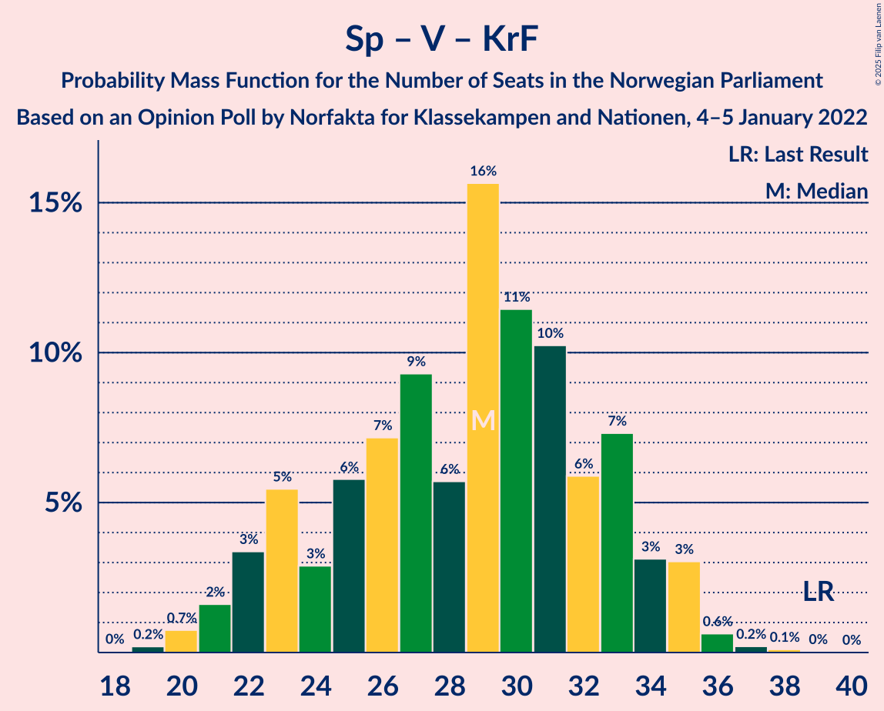

| Number of Seats | Probability | Accumulated | Special Marks |
|:---------------:|:-----------:|:-----------:|:-------------:|
| 18 | 0% | 100% |  |
| 19 | 0.2% | 99.9% |  |
| 20 | 0.7% | 99.7% |  |
| 21 | 2% | 99.0% |  |
| 22 | 3% | 97% |  |
| 23 | 5% | 94% |  |
| 24 | 3% | 89% |  |
| 25 | 6% | 86% |  |
| 26 | 7% | 80% |  |
| 27 | 9% | 73% |  |
| 28 | 6% | 63% | Median |
| 29 | 16% | 58% |  |
| 30 | 11% | 42% |  |
| 31 | 10% | 31% |  |
| 32 | 6% | 20% |  |
| 33 | 7% | 14% |  |
| 34 | 3% | 7% |  |
| 35 | 3% | 4% |  |
| 36 | 0.6% | 1.0% |  |
| 37 | 0.2% | 0.4% |  |
| 38 | 0.1% | 0.2% |  |
| 39 | 0% | 0.1% | Last Result |
| 40 | 0% | 0% |  |

## Technical Information

### Opinion Poll

+ **Polling firm:** Norfakta
+ **Commissioner(s):** Klassekampen and Nationen
+ **Fieldwork period:** 4–5 January 2022

### Calculations

+ **Sample size:** 1001
+ **Simulations done:** 1,048,576
+ **Error estimate:** 2.41%

