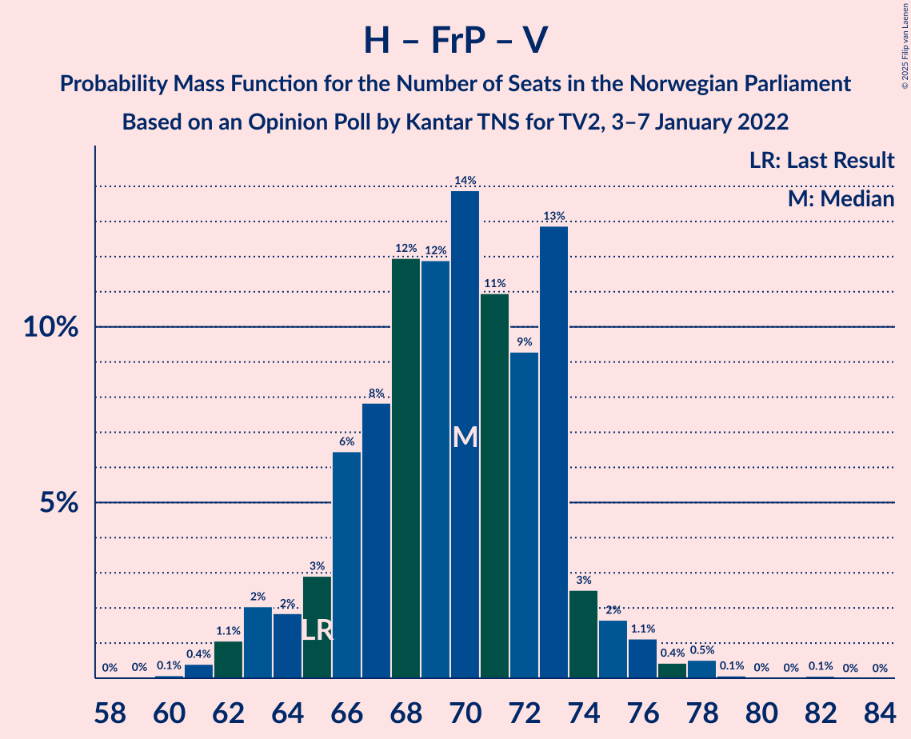

# Opinion Poll by Kantar TNS for TV2, 3–7 January 2022

<a href="#voting-intentions">Voting Intentions</a> | <a href="#seats">Seats</a> | <a href="#coalitions">Coalitions</a> | <a href="#technical-information">Technical Information</a>

## Voting Intentions

### Confidence Intervals

| Party | Last Result | Poll Result | 80% Confidence Interval | 90% Confidence Interval | 95% Confidence Interval | 99% Confidence Interval |
|:-----:|:-----------:|:-----------:|:-----------------------:|:-----------------------:|:-----------------------:|:-----------------------:|
| Høyre | 20.4% | 23.7% | 22.0–25.5% |21.5–26.0% |21.1–26.4% |20.3–27.3% |
| Arbeiderpartiet | 26.2% | 21.7% | 20.1–23.5% |19.6–24.0% |19.2–24.4% |18.5–25.3% |
| Fremskrittspartiet | 11.6% | 11.4% | 10.2–12.8% |9.9–13.2% |9.6–13.6% |9.0–14.3% |
| Senterpartiet | 13.5% | 10.7% | 9.5–12.1% |9.2–12.5% |8.9–12.8% |8.4–13.5% |
| Sosialistisk Venstreparti | 7.6% | 9.1% | 8.0–10.3% |7.7–10.7% |7.4–11.0% |6.9–11.7% |
| Rødt | 4.7% | 6.2% | 5.3–7.3% |5.0–7.6% |4.8–7.9% |4.4–8.4% |
| Venstre | 4.6% | 5.1% | 4.3–6.2% |4.1–6.5% |3.9–6.7% |3.6–7.3% |
| Miljøpartiet De Grønne | 3.9% | 4.3% | 3.6–5.3% |3.4–5.5% |3.2–5.8% |2.9–6.3% |
| Kristelig Folkeparti | 3.8% | 2.9% | 2.3–3.7% |2.1–3.9% |2.0–4.1% |1.8–4.6% |

*Note:* The poll result column reflects the actual value used in the calculations. Published results may vary slightly, and in addition be rounded to fewer digits.

## Seats

### Confidence Intervals

| Party | Last Result | Median | 80% Confidence Interval | 90% Confidence Interval | 95% Confidence Interval | 99% Confidence Interval |
|:-----:|:-----------:|:------:|:-----------------------:|:-----------------------:|:-----------------------:|:-----------------------:|
| <a href="#høyre">Høyre</a> | 36 | 42 | 39–45 |39–46 |38–47 |36–48 |
| <a href="#arbeiderpartiet">Arbeiderpartiet</a> | 48 | 41 | 38–44 |37–46 |36–47 |35–48 |
| <a href="#fremskrittspartiet">Fremskrittspartiet</a> | 21 | 19 | 17–21 |17–22 |17–23 |16–26 |
| <a href="#senterpartiet">Senterpartiet</a> | 28 | 18 | 16–22 |16–23 |15–24 |14–27 |
| <a href="#sosialistisk-venstreparti">Sosialistisk Venstreparti</a> | 13 | 14 | 12–17 |11–18 |11–18 |10–20 |
| <a href="#rødt">Rødt</a> | 8 | 10 | 8–11 |8–12 |7–13 |7–14 |
| <a href="#venstre">Venstre</a> | 8 | 8 | 7–10 |6–10 |3–11 |2–12 |
| <a href="#miljøpartiet-de-grønne">Miljøpartiet De Grønne</a> | 3 | 7 | 3–8 |2–9 |2–9 |1–10 |
| <a href="#kristelig-folkeparti">Kristelig Folkeparti</a> | 3 | 2 | 1–3 |0–3 |0–6 |0–7 |

### Høyre

*For a full overview of the results for this party, see the [Høyre](party-høyre.html) page.*

| Number of Seats | Probability | Accumulated | Special Marks |
|:---------------:|:-----------:|:-----------:|:-------------:|
| 34 | 0.2% | 100% |  |
| 35 | 0.2% | 99.8% |  |
| 36 | 0.3% | 99.6% | Last Result |
| 37 | 1.1% | 99.3% |  |
| 38 | 2% | 98% |  |
| 39 | 8% | 96% |  |
| 40 | 10% | 88% |  |
| 41 | 15% | 78% |  |
| 42 | 20% | 63% | Median |
| 43 | 9% | 42% |  |
| 44 | 16% | 34% |  |
| 45 | 9% | 18% |  |
| 46 | 5% | 9% |  |
| 47 | 2% | 4% |  |
| 48 | 1.0% | 1.3% |  |
| 49 | 0.3% | 0.4% |  |
| 50 | 0.1% | 0.1% |  |
| 51 | 0% | 0% |  |

### Arbeiderpartiet

*For a full overview of the results for this party, see the [Arbeiderpartiet](party-arbeiderpartiet.html) page.*

| Number of Seats | Probability | Accumulated | Special Marks |
|:---------------:|:-----------:|:-----------:|:-------------:|
| 33 | 0.1% | 100% |  |
| 34 | 0.3% | 99.9% |  |
| 35 | 1.2% | 99.6% |  |
| 36 | 2% | 98% |  |
| 37 | 3% | 97% |  |
| 38 | 5% | 93% |  |
| 39 | 14% | 89% |  |
| 40 | 23% | 75% |  |
| 41 | 25% | 52% | Median |
| 42 | 12% | 27% |  |
| 43 | 5% | 15% |  |
| 44 | 4% | 10% |  |
| 45 | 1.4% | 7% |  |
| 46 | 2% | 5% |  |
| 47 | 2% | 3% |  |
| 48 | 0.7% | 1.1% | Last Result |
| 49 | 0.2% | 0.4% |  |
| 50 | 0.1% | 0.1% |  |
| 51 | 0% | 0% |  |

### Fremskrittspartiet

*For a full overview of the results for this party, see the [Fremskrittspartiet](party-fremskrittspartiet.html) page.*

| Number of Seats | Probability | Accumulated | Special Marks |
|:---------------:|:-----------:|:-----------:|:-------------:|
| 13 | 0.1% | 100% |  |
| 14 | 0.1% | 99.9% |  |
| 15 | 0.1% | 99.8% |  |
| 16 | 0.7% | 99.7% |  |
| 17 | 9% | 99.0% |  |
| 18 | 26% | 90% |  |
| 19 | 21% | 64% | Median |
| 20 | 21% | 43% |  |
| 21 | 16% | 22% | Last Result |
| 22 | 3% | 6% |  |
| 23 | 1.3% | 3% |  |
| 24 | 0.8% | 2% |  |
| 25 | 0.3% | 1.1% |  |
| 26 | 0.6% | 0.7% |  |
| 27 | 0.1% | 0.2% |  |
| 28 | 0.1% | 0.1% |  |
| 29 | 0% | 0% |  |

### Senterpartiet

*For a full overview of the results for this party, see the [Senterpartiet](party-senterpartiet.html) page.*

| Number of Seats | Probability | Accumulated | Special Marks |
|:---------------:|:-----------:|:-----------:|:-------------:|
| 13 | 0.1% | 100% |  |
| 14 | 0.7% | 99.9% |  |
| 15 | 4% | 99.2% |  |
| 16 | 16% | 96% |  |
| 17 | 12% | 80% |  |
| 18 | 30% | 68% | Median |
| 19 | 12% | 38% |  |
| 20 | 11% | 26% |  |
| 21 | 4% | 14% |  |
| 22 | 5% | 10% |  |
| 23 | 2% | 6% |  |
| 24 | 1.0% | 3% |  |
| 25 | 1.3% | 2% |  |
| 26 | 0.4% | 1.0% |  |
| 27 | 0.2% | 0.6% |  |
| 28 | 0.3% | 0.4% | Last Result |
| 29 | 0.1% | 0.1% |  |
| 30 | 0% | 0% |  |

### Sosialistisk Venstreparti

*For a full overview of the results for this party, see the [Sosialistisk Venstreparti](party-sosialistiskvenstreparti.html) page.*

| Number of Seats | Probability | Accumulated | Special Marks |
|:---------------:|:-----------:|:-----------:|:-------------:|
| 9 | 0.3% | 100% |  |
| 10 | 2% | 99.7% |  |
| 11 | 5% | 98% |  |
| 12 | 8% | 93% |  |
| 13 | 18% | 85% | Last Result |
| 14 | 24% | 67% | Median |
| 15 | 18% | 43% |  |
| 16 | 12% | 26% |  |
| 17 | 7% | 14% |  |
| 18 | 4% | 6% |  |
| 19 | 1.3% | 2% |  |
| 20 | 0.5% | 0.5% |  |
| 21 | 0% | 0.1% |  |
| 22 | 0% | 0% |  |

### Rødt

*For a full overview of the results for this party, see the [Rødt](party-rødt.html) page.*

| Number of Seats | Probability | Accumulated | Special Marks |
|:---------------:|:-----------:|:-----------:|:-------------:|
| 1 | 0.1% | 100% |  |
| 2 | 0% | 99.9% |  |
| 3 | 0% | 99.9% |  |
| 4 | 0% | 99.9% |  |
| 5 | 0% | 99.9% |  |
| 6 | 0.4% | 99.9% |  |
| 7 | 4% | 99.5% |  |
| 8 | 14% | 96% | Last Result |
| 9 | 22% | 82% |  |
| 10 | 33% | 60% | Median |
| 11 | 18% | 27% |  |
| 12 | 7% | 10% |  |
| 13 | 2% | 3% |  |
| 14 | 0.5% | 0.6% |  |
| 15 | 0.1% | 0.1% |  |
| 16 | 0% | 0% |  |

### Venstre

*For a full overview of the results for this party, see the [Venstre](party-venstre.html) page.*

| Number of Seats | Probability | Accumulated | Special Marks |
|:---------------:|:-----------:|:-----------:|:-------------:|
| 2 | 0.5% | 100% |  |
| 3 | 4% | 99.5% |  |
| 4 | 0% | 96% |  |
| 5 | 0% | 96% |  |
| 6 | 5% | 96% |  |
| 7 | 22% | 91% |  |
| 8 | 33% | 69% | Last Result, Median |
| 9 | 21% | 36% |  |
| 10 | 11% | 15% |  |
| 11 | 3% | 4% |  |
| 12 | 0.7% | 0.8% |  |
| 13 | 0.1% | 0.1% |  |
| 14 | 0% | 0% |  |

### Miljøpartiet De Grønne

*For a full overview of the results for this party, see the [Miljøpartiet De Grønne](party-miljøpartietdegrønne.html) page.*

| Number of Seats | Probability | Accumulated | Special Marks |
|:---------------:|:-----------:|:-----------:|:-------------:|
| 1 | 0.8% | 100% |  |
| 2 | 9% | 99.2% |  |
| 3 | 24% | 90% | Last Result |
| 4 | 0.1% | 67% |  |
| 5 | 0% | 67% |  |
| 6 | 16% | 67% |  |
| 7 | 26% | 51% | Median |
| 8 | 19% | 25% |  |
| 9 | 5% | 6% |  |
| 10 | 0.6% | 0.8% |  |
| 11 | 0.1% | 0.1% |  |
| 12 | 0% | 0% |  |

### Kristelig Folkeparti

*For a full overview of the results for this party, see the [Kristelig Folkeparti](party-kristeligfolkeparti.html) page.*

| Number of Seats | Probability | Accumulated | Special Marks |
|:---------------:|:-----------:|:-----------:|:-------------:|
| 0 | 6% | 100% |  |
| 1 | 8% | 94% |  |
| 2 | 66% | 86% | Median |
| 3 | 17% | 20% | Last Result |
| 4 | 0% | 3% |  |
| 5 | 0.1% | 3% |  |
| 6 | 2% | 3% |  |
| 7 | 1.0% | 1.1% |  |
| 8 | 0.1% | 0.1% |  |
| 9 | 0% | 0% |  |

## Coalitions

### Confidence Intervals

| Coalition | Last Result | Median | Majority? | 80% Confidence Interval | 90% Confidence Interval | 95% Confidence Interval | 99% Confidence Interval |
|:---------:|:-----------:|:------:|:---------:|:-----------------------:|:-----------------------:|:-----------------------:|:-----------------------:|
| Høyre – Fremskrittspartiet – Senterpartiet – Venstre – Kristelig Folkeparti | 96 | 90 | 97% | 86–94 | 85–95 | 84–97 | 83–99 |
| Arbeiderpartiet – Senterpartiet – Sosialistisk Venstreparti – Rødt – Miljøpartiet De Grønne | 100 | 89 | 88% | 84–94 | 84–95 | 83–96 | 81–100 |
| Arbeiderpartiet – Senterpartiet – Sosialistisk Venstreparti – Rødt | 97 | 83 | 35% | 80–87 | 79–89 | 78–91 | 75–93 |
| Arbeiderpartiet – Senterpartiet – Sosialistisk Venstreparti – Miljøpartiet De Grønne – Kristelig Folkeparti | 95 | 81 | 17% | 76–86 | 76–87 | 75–88 | 74–91 |
| Arbeiderpartiet – Senterpartiet – Sosialistisk Venstreparti – Miljøpartiet De Grønne | 92 | 79 | 7% | 74–84 | 74–85 | 73–86 | 71–89 |
| Høyre – Fremskrittspartiet – Venstre – Miljøpartiet De Grønne – Kristelig Folkeparti | 71 | 78 | 2% | 73–81 | 72–83 | 70–84 | 68–86 |
| Arbeiderpartiet – Senterpartiet – Sosialistisk Venstreparti | 89 | 73 | 0.1% | 70–77 | 69–79 | 68–80 | 66–82 |
| Høyre – Fremskrittspartiet – Venstre – Kristelig Folkeparti | 68 | 72 | 0% | 68–75 | 66–76 | 65–78 | 63–80 |
| Arbeiderpartiet – Sosialistisk Venstreparti – Rødt – Miljøpartiet De Grønne | 72 | 70 | 0% | 67–75 | 66–76 | 64–77 | 62–80 |
| Høyre – Fremskrittspartiet – Venstre | 65 | 70 | 0% | 66–73 | 64–74 | 63–75 | 61–78 |
| Arbeiderpartiet – Senterpartiet – Miljøpartiet De Grønne – Kristelig Folkeparti | 82 | 67 | 0% | 62–71 | 62–73 | 60–75 | 58–77 |
| Arbeiderpartiet – Senterpartiet – Kristelig Folkeparti | 79 | 61 | 0% | 58–65 | 57–67 | 56–68 | 54–70 |
| Høyre – Fremskrittspartiet | 57 | 62 | 0% | 58–65 | 57–66 | 56–67 | 54–69 |
| Arbeiderpartiet – Senterpartiet | 76 | 59 | 0% | 56–63 | 55–64 | 54–66 | 52–68 |
| Arbeiderpartiet – Sosialistisk Venstreparti | 61 | 55 | 0% | 52–58 | 51–60 | 50–60 | 48–63 |
| Høyre – Venstre – Kristelig Folkeparti | 47 | 53 | 0% | 49–55 | 48–57 | 46–58 | 45–59 |
| Senterpartiet – Venstre – Kristelig Folkeparti | 39 | 28 | 0% | 26–32 | 25–33 | 23–34 | 21–38 |

### Høyre – Fremskrittspartiet – Senterpartiet – Venstre – Kristelig Folkeparti

| Number of Seats | Probability | Accumulated | Special Marks |
|:---------------:|:-----------:|:-----------:|:-------------:|
| 80 | 0% | 100% |  |
| 81 | 0.1% | 99.9% |  |
| 82 | 0.2% | 99.8% |  |
| 83 | 0.9% | 99.6% |  |
| 84 | 2% | 98.7% |  |
| 85 | 4% | 97% | Majority |
| 86 | 5% | 94% |  |
| 87 | 5% | 89% |  |
| 88 | 12% | 83% |  |
| 89 | 9% | 71% | Median |
| 90 | 15% | 62% |  |
| 91 | 20% | 48% |  |
| 92 | 6% | 28% |  |
| 93 | 11% | 22% |  |
| 94 | 4% | 11% |  |
| 95 | 2% | 7% |  |
| 96 | 2% | 4% | Last Result |
| 97 | 2% | 3% |  |
| 98 | 0.4% | 0.9% |  |
| 99 | 0.3% | 0.6% |  |
| 100 | 0.1% | 0.3% |  |
| 101 | 0.1% | 0.2% |  |
| 102 | 0.1% | 0.1% |  |
| 103 | 0% | 0% |  |

### Arbeiderpartiet – Senterpartiet – Sosialistisk Venstreparti – Rødt – Miljøpartiet De Grønne

| Number of Seats | Probability | Accumulated | Special Marks |
|:---------------:|:-----------:|:-----------:|:-------------:|
| 79 | 0.1% | 100% |  |
| 80 | 0.1% | 99.9% |  |
| 81 | 0.5% | 99.8% |  |
| 82 | 1.0% | 99.3% |  |
| 83 | 2% | 98% |  |
| 84 | 9% | 97% |  |
| 85 | 3% | 88% | Majority |
| 86 | 6% | 85% |  |
| 87 | 14% | 78% |  |
| 88 | 11% | 64% |  |
| 89 | 14% | 53% |  |
| 90 | 8% | 39% | Median |
| 91 | 7% | 32% |  |
| 92 | 8% | 25% |  |
| 93 | 6% | 16% |  |
| 94 | 4% | 11% |  |
| 95 | 2% | 6% |  |
| 96 | 2% | 4% |  |
| 97 | 0.7% | 2% |  |
| 98 | 0.5% | 2% |  |
| 99 | 0.4% | 1.1% |  |
| 100 | 0.4% | 0.7% | Last Result |
| 101 | 0.2% | 0.3% |  |
| 102 | 0.1% | 0.1% |  |
| 103 | 0% | 0% |  |

### Arbeiderpartiet – Senterpartiet – Sosialistisk Venstreparti – Rødt

| Number of Seats | Probability | Accumulated | Special Marks |
|:---------------:|:-----------:|:-----------:|:-------------:|
| 74 | 0.2% | 100% |  |
| 75 | 0.4% | 99.8% |  |
| 76 | 0.3% | 99.4% |  |
| 77 | 0.8% | 99.1% |  |
| 78 | 2% | 98% |  |
| 79 | 6% | 96% |  |
| 80 | 8% | 90% |  |
| 81 | 18% | 82% |  |
| 82 | 12% | 64% |  |
| 83 | 5% | 52% | Median |
| 84 | 12% | 47% |  |
| 85 | 8% | 35% | Majority |
| 86 | 12% | 27% |  |
| 87 | 5% | 14% |  |
| 88 | 3% | 9% |  |
| 89 | 2% | 7% |  |
| 90 | 1.3% | 4% |  |
| 91 | 2% | 3% |  |
| 92 | 0.5% | 1.2% |  |
| 93 | 0.3% | 0.7% |  |
| 94 | 0.3% | 0.5% |  |
| 95 | 0.1% | 0.2% |  |
| 96 | 0% | 0% |  |
| 97 | 0% | 0% | Last Result |

### Arbeiderpartiet – Senterpartiet – Sosialistisk Venstreparti – Miljøpartiet De Grønne – Kristelig Folkeparti

| Number of Seats | Probability | Accumulated | Special Marks |
|:---------------:|:-----------:|:-----------:|:-------------:|
| 71 | 0% | 100% |  |
| 72 | 0.1% | 99.9% |  |
| 73 | 0.3% | 99.9% |  |
| 74 | 1.1% | 99.6% |  |
| 75 | 2% | 98.5% |  |
| 76 | 8% | 97% |  |
| 77 | 3% | 88% |  |
| 78 | 5% | 85% |  |
| 79 | 9% | 80% |  |
| 80 | 12% | 71% |  |
| 81 | 11% | 59% |  |
| 82 | 10% | 47% | Median |
| 83 | 12% | 37% |  |
| 84 | 9% | 26% |  |
| 85 | 5% | 17% | Majority |
| 86 | 4% | 12% |  |
| 87 | 4% | 8% |  |
| 88 | 2% | 4% |  |
| 89 | 0.7% | 2% |  |
| 90 | 1.0% | 2% |  |
| 91 | 0.3% | 0.7% |  |
| 92 | 0.1% | 0.4% |  |
| 93 | 0.2% | 0.3% |  |
| 94 | 0% | 0% |  |
| 95 | 0% | 0% | Last Result |

### Arbeiderpartiet – Senterpartiet – Sosialistisk Venstreparti – Miljøpartiet De Grønne

| Number of Seats | Probability | Accumulated | Special Marks |
|:---------------:|:-----------:|:-----------:|:-------------:|
| 69 | 0% | 100% |  |
| 70 | 0.2% | 99.9% |  |
| 71 | 0.2% | 99.7% |  |
| 72 | 0.8% | 99.5% |  |
| 73 | 2% | 98.7% |  |
| 74 | 9% | 97% |  |
| 75 | 3% | 88% |  |
| 76 | 4% | 85% |  |
| 77 | 13% | 81% |  |
| 78 | 10% | 68% |  |
| 79 | 15% | 58% |  |
| 80 | 6% | 43% | Median |
| 81 | 10% | 36% |  |
| 82 | 9% | 27% |  |
| 83 | 7% | 18% |  |
| 84 | 4% | 11% |  |
| 85 | 3% | 7% | Majority |
| 86 | 2% | 4% |  |
| 87 | 0.9% | 2% |  |
| 88 | 0.9% | 2% |  |
| 89 | 0.4% | 0.8% |  |
| 90 | 0.3% | 0.4% |  |
| 91 | 0.1% | 0.1% |  |
| 92 | 0% | 0.1% | Last Result |
| 93 | 0% | 0% |  |

### Høyre – Fremskrittspartiet – Venstre – Miljøpartiet De Grønne – Kristelig Folkeparti

| Number of Seats | Probability | Accumulated | Special Marks |
|:---------------:|:-----------:|:-----------:|:-------------:|
| 66 | 0.2% | 100% |  |
| 67 | 0.1% | 99.7% |  |
| 68 | 0.2% | 99.7% |  |
| 69 | 0.5% | 99.5% |  |
| 70 | 2% | 99.0% |  |
| 71 | 1.2% | 97% | Last Result |
| 72 | 3% | 96% |  |
| 73 | 3% | 93% |  |
| 74 | 7% | 90% |  |
| 75 | 13% | 82% |  |
| 76 | 8% | 70% |  |
| 77 | 8% | 62% |  |
| 78 | 17% | 54% | Median |
| 79 | 10% | 37% |  |
| 80 | 9% | 27% |  |
| 81 | 9% | 19% |  |
| 82 | 4% | 10% |  |
| 83 | 4% | 6% |  |
| 84 | 0.9% | 3% |  |
| 85 | 0.7% | 2% | Majority |
| 86 | 0.5% | 0.9% |  |
| 87 | 0.3% | 0.4% |  |
| 88 | 0.1% | 0.1% |  |
| 89 | 0% | 0% |  |

### Arbeiderpartiet – Senterpartiet – Sosialistisk Venstreparti

| Number of Seats | Probability | Accumulated | Special Marks |
|:---------------:|:-----------:|:-----------:|:-------------:|
| 65 | 0.2% | 100% |  |
| 66 | 0.3% | 99.7% |  |
| 67 | 1.1% | 99.4% |  |
| 68 | 1.4% | 98% |  |
| 69 | 4% | 97% |  |
| 70 | 6% | 93% |  |
| 71 | 18% | 87% |  |
| 72 | 8% | 69% |  |
| 73 | 12% | 61% | Median |
| 74 | 13% | 49% |  |
| 75 | 10% | 36% |  |
| 76 | 11% | 26% |  |
| 77 | 5% | 15% |  |
| 78 | 3% | 9% |  |
| 79 | 2% | 6% |  |
| 80 | 2% | 4% |  |
| 81 | 0.6% | 2% |  |
| 82 | 0.7% | 1.1% |  |
| 83 | 0.2% | 0.4% |  |
| 84 | 0.1% | 0.2% |  |
| 85 | 0% | 0.1% | Majority |
| 86 | 0% | 0% |  |
| 87 | 0% | 0% |  |
| 88 | 0% | 0% |  |
| 89 | 0% | 0% | Last Result |

### Høyre – Fremskrittspartiet – Venstre – Kristelig Folkeparti

| Number of Seats | Probability | Accumulated | Special Marks |
|:---------------:|:-----------:|:-----------:|:-------------:|
| 61 | 0% | 100% |  |
| 62 | 0.1% | 99.9% |  |
| 63 | 0.7% | 99.8% |  |
| 64 | 0.7% | 99.2% |  |
| 65 | 1.5% | 98% |  |
| 66 | 2% | 97% |  |
| 67 | 4% | 95% |  |
| 68 | 7% | 91% | Last Result |
| 69 | 8% | 84% |  |
| 70 | 9% | 76% |  |
| 71 | 9% | 67% | Median |
| 72 | 16% | 59% |  |
| 73 | 14% | 42% |  |
| 74 | 8% | 28% |  |
| 75 | 14% | 20% |  |
| 76 | 2% | 7% |  |
| 77 | 2% | 5% |  |
| 78 | 1.3% | 3% |  |
| 79 | 0.6% | 2% |  |
| 80 | 0.7% | 1.0% |  |
| 81 | 0.1% | 0.2% |  |
| 82 | 0.1% | 0.2% |  |
| 83 | 0% | 0.1% |  |
| 84 | 0.1% | 0.1% |  |
| 85 | 0% | 0% | Majority |

### Arbeiderpartiet – Sosialistisk Venstreparti – Rødt – Miljøpartiet De Grønne

| Number of Seats | Probability | Accumulated | Special Marks |
|:---------------:|:-----------:|:-----------:|:-------------:|
| 61 | 0.1% | 100% |  |
| 62 | 0.4% | 99.8% |  |
| 63 | 0.5% | 99.4% |  |
| 64 | 2% | 98.9% |  |
| 65 | 1.0% | 97% |  |
| 66 | 4% | 96% |  |
| 67 | 6% | 93% |  |
| 68 | 17% | 87% |  |
| 69 | 8% | 70% |  |
| 70 | 12% | 62% |  |
| 71 | 14% | 50% |  |
| 72 | 11% | 36% | Last Result, Median |
| 73 | 7% | 25% |  |
| 74 | 5% | 18% |  |
| 75 | 7% | 13% |  |
| 76 | 2% | 6% |  |
| 77 | 1.0% | 3% |  |
| 78 | 1.1% | 2% |  |
| 79 | 0.7% | 1.3% |  |
| 80 | 0.2% | 0.6% |  |
| 81 | 0.2% | 0.4% |  |
| 82 | 0.1% | 0.2% |  |
| 83 | 0.1% | 0.1% |  |
| 84 | 0% | 0.1% |  |
| 85 | 0% | 0% | Majority |

### Høyre – Fremskrittspartiet – Venstre

| Number of Seats | Probability | Accumulated | Special Marks |
|:---------------:|:-----------:|:-----------:|:-------------:|
| 59 | 0% | 100% |  |
| 60 | 0.1% | 99.9% |  |
| 61 | 0.4% | 99.9% |  |
| 62 | 1.1% | 99.5% |  |
| 63 | 2% | 98% |  |
| 64 | 2% | 96% |  |
| 65 | 3% | 94% | Last Result |
| 66 | 6% | 92% |  |
| 67 | 8% | 85% |  |
| 68 | 12% | 77% |  |
| 69 | 12% | 65% | Median |
| 70 | 14% | 53% |  |
| 71 | 11% | 40% |  |
| 72 | 9% | 29% |  |
| 73 | 13% | 19% |  |
| 74 | 3% | 6% |  |
| 75 | 2% | 4% |  |
| 76 | 1.1% | 2% |  |
| 77 | 0.4% | 1.1% |  |
| 78 | 0.5% | 0.7% |  |
| 79 | 0.1% | 0.2% |  |
| 80 | 0% | 0.1% |  |
| 81 | 0% | 0.1% |  |
| 82 | 0.1% | 0.1% |  |
| 83 | 0% | 0% |  |

### Arbeiderpartiet – Senterpartiet – Miljøpartiet De Grønne – Kristelig Folkeparti

| Number of Seats | Probability | Accumulated | Special Marks |
|:---------------:|:-----------:|:-----------:|:-------------:|
| 56 | 0% | 100% |  |
| 57 | 0.1% | 99.9% |  |
| 58 | 0.5% | 99.8% |  |
| 59 | 1.0% | 99.3% |  |
| 60 | 2% | 98% |  |
| 61 | 1.2% | 97% |  |
| 62 | 10% | 95% |  |
| 63 | 4% | 86% |  |
| 64 | 7% | 82% |  |
| 65 | 6% | 75% |  |
| 66 | 13% | 70% |  |
| 67 | 16% | 57% |  |
| 68 | 8% | 41% | Median |
| 69 | 8% | 33% |  |
| 70 | 9% | 25% |  |
| 71 | 6% | 16% |  |
| 72 | 3% | 10% |  |
| 73 | 2% | 7% |  |
| 74 | 1.4% | 4% |  |
| 75 | 2% | 3% |  |
| 76 | 0.7% | 1.4% |  |
| 77 | 0.4% | 0.7% |  |
| 78 | 0.2% | 0.3% |  |
| 79 | 0% | 0.1% |  |
| 80 | 0% | 0.1% |  |
| 81 | 0% | 0% |  |
| 82 | 0% | 0% | Last Result |

### Arbeiderpartiet – Senterpartiet – Kristelig Folkeparti

| Number of Seats | Probability | Accumulated | Special Marks |
|:---------------:|:-----------:|:-----------:|:-------------:|
| 53 | 0.2% | 100% |  |
| 54 | 0.3% | 99.7% |  |
| 55 | 2% | 99.5% |  |
| 56 | 2% | 98% |  |
| 57 | 3% | 96% |  |
| 58 | 3% | 93% |  |
| 59 | 21% | 90% |  |
| 60 | 13% | 69% |  |
| 61 | 16% | 56% | Median |
| 62 | 10% | 40% |  |
| 63 | 8% | 30% |  |
| 64 | 7% | 22% |  |
| 65 | 7% | 15% |  |
| 66 | 2% | 8% |  |
| 67 | 2% | 6% |  |
| 68 | 2% | 4% |  |
| 69 | 0.9% | 2% |  |
| 70 | 0.5% | 0.9% |  |
| 71 | 0.2% | 0.4% |  |
| 72 | 0.1% | 0.2% |  |
| 73 | 0% | 0.1% |  |
| 74 | 0% | 0% |  |
| 75 | 0% | 0% |  |
| 76 | 0% | 0% |  |
| 77 | 0% | 0% |  |
| 78 | 0% | 0% |  |
| 79 | 0% | 0% | Last Result |

### Høyre – Fremskrittspartiet

| Number of Seats | Probability | Accumulated | Special Marks |
|:---------------:|:-----------:|:-----------:|:-------------:|
| 52 | 0.1% | 100% |  |
| 53 | 0.2% | 99.9% |  |
| 54 | 0.2% | 99.7% |  |
| 55 | 1.0% | 99.5% |  |
| 56 | 3% | 98% |  |
| 57 | 5% | 96% | Last Result |
| 58 | 3% | 91% |  |
| 59 | 12% | 88% |  |
| 60 | 12% | 75% |  |
| 61 | 13% | 63% | Median |
| 62 | 12% | 50% |  |
| 63 | 9% | 39% |  |
| 64 | 10% | 30% |  |
| 65 | 14% | 20% |  |
| 66 | 2% | 6% |  |
| 67 | 2% | 4% |  |
| 68 | 0.8% | 1.3% |  |
| 69 | 0.3% | 0.5% |  |
| 70 | 0.1% | 0.2% |  |
| 71 | 0.1% | 0.1% |  |
| 72 | 0% | 0% |  |

### Arbeiderpartiet – Senterpartiet

| Number of Seats | Probability | Accumulated | Special Marks |
|:---------------:|:-----------:|:-----------:|:-------------:|
| 51 | 0.3% | 100% |  |
| 52 | 0.3% | 99.7% |  |
| 53 | 2% | 99.4% |  |
| 54 | 2% | 98% |  |
| 55 | 3% | 96% |  |
| 56 | 3% | 93% |  |
| 57 | 19% | 90% |  |
| 58 | 19% | 71% |  |
| 59 | 12% | 52% | Median |
| 60 | 12% | 40% |  |
| 61 | 6% | 28% |  |
| 62 | 9% | 21% |  |
| 63 | 5% | 13% |  |
| 64 | 3% | 8% |  |
| 65 | 1.3% | 4% |  |
| 66 | 2% | 3% |  |
| 67 | 0.5% | 1.5% |  |
| 68 | 0.5% | 0.9% |  |
| 69 | 0.2% | 0.4% |  |
| 70 | 0.1% | 0.2% |  |
| 71 | 0% | 0.1% |  |
| 72 | 0% | 0% |  |
| 73 | 0% | 0% |  |
| 74 | 0% | 0% |  |
| 75 | 0% | 0% |  |
| 76 | 0% | 0% | Last Result |

### Arbeiderpartiet – Sosialistisk Venstreparti

| Number of Seats | Probability | Accumulated | Special Marks |
|:---------------:|:-----------:|:-----------:|:-------------:|
| 46 | 0.1% | 100% |  |
| 47 | 0.3% | 99.9% |  |
| 48 | 0.4% | 99.6% |  |
| 49 | 1.3% | 99.2% |  |
| 50 | 1.4% | 98% |  |
| 51 | 5% | 97% |  |
| 52 | 8% | 92% |  |
| 53 | 8% | 84% |  |
| 54 | 16% | 77% |  |
| 55 | 22% | 61% | Median |
| 56 | 11% | 39% |  |
| 57 | 11% | 28% |  |
| 58 | 7% | 16% |  |
| 59 | 4% | 9% |  |
| 60 | 3% | 5% |  |
| 61 | 1.1% | 2% | Last Result |
| 62 | 0.8% | 1.4% |  |
| 63 | 0.2% | 0.5% |  |
| 64 | 0.1% | 0.3% |  |
| 65 | 0.1% | 0.1% |  |
| 66 | 0.1% | 0.1% |  |
| 67 | 0% | 0% |  |

### Høyre – Venstre – Kristelig Folkeparti

| Number of Seats | Probability | Accumulated | Special Marks |
|:---------------:|:-----------:|:-----------:|:-------------:|
| 43 | 0% | 100% |  |
| 44 | 0.2% | 99.9% |  |
| 45 | 0.8% | 99.7% |  |
| 46 | 2% | 98.8% |  |
| 47 | 2% | 97% | Last Result |
| 48 | 4% | 95% |  |
| 49 | 6% | 92% |  |
| 50 | 7% | 85% |  |
| 51 | 10% | 78% |  |
| 52 | 13% | 68% | Median |
| 53 | 17% | 55% |  |
| 54 | 21% | 38% |  |
| 55 | 8% | 17% |  |
| 56 | 4% | 9% |  |
| 57 | 2% | 5% |  |
| 58 | 2% | 3% |  |
| 59 | 1.0% | 1.4% |  |
| 60 | 0.2% | 0.4% |  |
| 61 | 0.2% | 0.2% |  |
| 62 | 0.1% | 0.1% |  |
| 63 | 0% | 0% |  |

### Senterpartiet – Venstre – Kristelig Folkeparti

| Number of Seats | Probability | Accumulated | Special Marks |
|:---------------:|:-----------:|:-----------:|:-------------:|
| 20 | 0.2% | 100% |  |
| 21 | 0.3% | 99.8% |  |
| 22 | 1.2% | 99.4% |  |
| 23 | 1.2% | 98% |  |
| 24 | 2% | 97% |  |
| 25 | 4% | 95% |  |
| 26 | 13% | 92% |  |
| 27 | 19% | 79% |  |
| 28 | 15% | 60% | Median |
| 29 | 7% | 45% |  |
| 30 | 12% | 38% |  |
| 31 | 12% | 26% |  |
| 32 | 6% | 14% |  |
| 33 | 5% | 8% |  |
| 34 | 1.1% | 3% |  |
| 35 | 0.4% | 2% |  |
| 36 | 0.5% | 1.3% |  |
| 37 | 0.3% | 0.9% |  |
| 38 | 0.3% | 0.5% |  |
| 39 | 0.2% | 0.3% | Last Result |
| 40 | 0.1% | 0.1% |  |
| 41 | 0% | 0% |  |

## Technical Information

### Opinion Poll

+ **Polling firm:** Kantar TNS
+ **Commissioner(s):** TV2
+ **Fieldwork period:** 3–7 January 2022

### Calculations

+ **Sample size:** 972
+ **Simulations done:** 1,048,576
+ **Error estimate:** 1.98%

