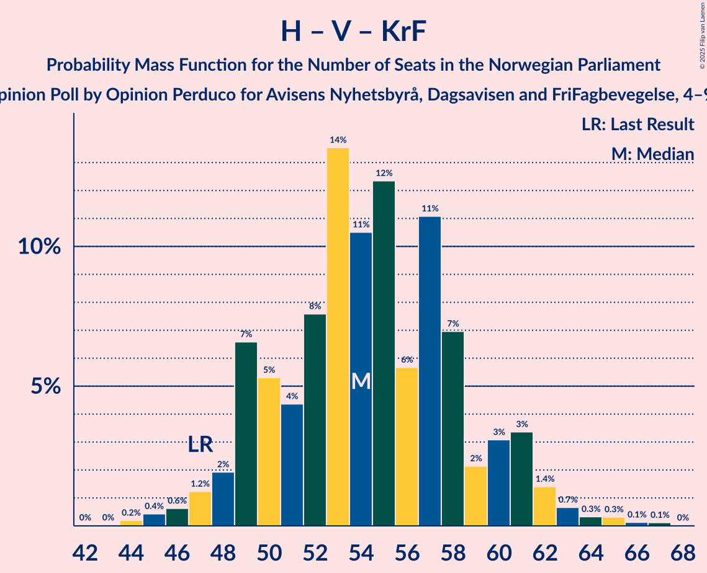
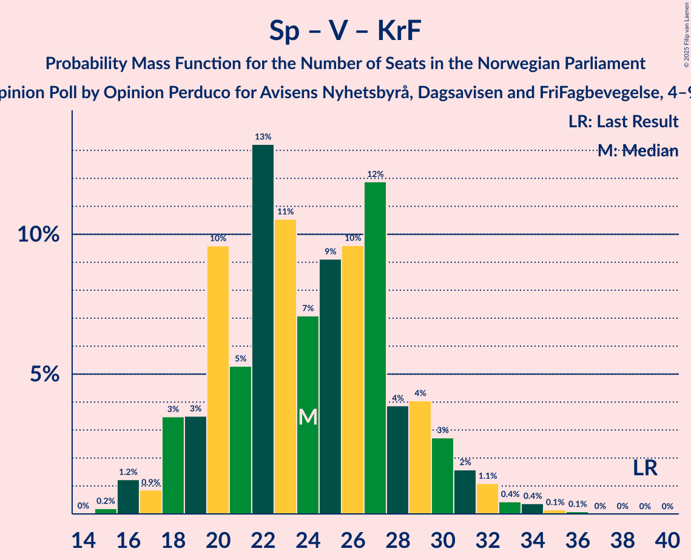

# Opinion Poll by Opinion Perduco for Avisens Nyhetsbyrå, Dagsavisen and FriFagbevegelse, 4–9 January 2022

<a href="#voting-intentions">Voting Intentions</a> | <a href="#seats">Seats</a> | <a href="#coalitions">Coalitions</a> | <a href="#technical-information">Technical Information</a>

## Voting Intentions

### Confidence Intervals

| Party | Last Result | Poll Result | 80% Confidence Interval | 90% Confidence Interval | 95% Confidence Interval | 99% Confidence Interval |
|:-----:|:-----------:|:-----------:|:-----------------------:|:-----------------------:|:-----------------------:|:-----------------------:|
| Høyre | 20.4% | 26.6% | 24.6–28.8% |24.1–29.4% |23.6–30.0% |22.6–31.0% |
| Arbeiderpartiet | 26.2% | 19.0% | 17.2–20.9% |16.7–21.5% |16.3–22.0% |15.5–22.9% |
| Fremskrittspartiet | 11.6% | 12.8% | 11.3–14.5% |10.9–15.0% |10.5–15.4% |9.9–16.3% |
| Sosialistisk Venstreparti | 7.6% | 9.8% | 8.5–11.3% |8.1–11.8% |7.8–12.1% |7.2–12.9% |
| Senterpartiet | 13.5% | 9.3% | 8.1–10.9% |7.7–11.3% |7.4–11.7% |6.9–12.5% |
| Rødt | 4.7% | 7.8% | 6.7–9.3% |6.4–9.7% |6.1–10.0% |5.6–10.7% |
| Miljøpartiet De Grønne | 3.9% | 4.8% | 3.9–6.0% |3.7–6.3% |3.5–6.6% |3.1–7.2% |
| Venstre | 4.6% | 4.3% | 3.4–5.4% |3.2–5.7% |3.0–6.0% |2.7–6.6% |
| Kristelig Folkeparti | 3.8% | 2.7% | 2.1–3.7% |1.9–4.0% |1.8–4.2% |1.5–4.7% |

*Note:* The poll result column reflects the actual value used in the calculations. Published results may vary slightly, and in addition be rounded to fewer digits.

## Seats

### Confidence Intervals

| Party | Last Result | Median | 80% Confidence Interval | 90% Confidence Interval | 95% Confidence Interval | 99% Confidence Interval |
|:-----:|:-----------:|:------:|:-----------------------:|:-----------------------:|:-----------------------:|:-----------------------:|
| <a href="#høyre">Høyre</a> | 36 | 47 | 43–51 |42–52 |41–53 |40–55 |
| <a href="#arbeiderpartiet">Arbeiderpartiet</a> | 48 | 36 | 32–38 |31–39 |31–40 |29–42 |
| <a href="#fremskrittspartiet">Fremskrittspartiet</a> | 21 | 22 | 19–26 |18–26 |18–27 |17–29 |
| <a href="#sosialistisk-venstreparti">Sosialistisk Venstreparti</a> | 13 | 17 | 14–20 |13–20 |13–21 |11–22 |
| <a href="#senterpartiet">Senterpartiet</a> | 28 | 16 | 14–19 |13–20 |13–21 |12–23 |
| <a href="#rødt">Rødt</a> | 8 | 13 | 12–16 |11–17 |10–17 |9–19 |
| <a href="#miljøpartiet-de-grønne">Miljøpartiet De Grønne</a> | 3 | 8 | 3–10 |2–11 |2–11 |2–13 |
| <a href="#venstre">Venstre</a> | 8 | 7 | 2–9 |2–10 |2–11 |2–11 |
| <a href="#kristelig-folkeparti">Kristelig Folkeparti</a> | 3 | 2 | 0–3 |0–3 |0–7 |0–8 |

### Høyre

*For a full overview of the results for this party, see the [Høyre](party-høyre.html) page.*

| Number of Seats | Probability | Accumulated | Special Marks |
|:---------------:|:-----------:|:-----------:|:-------------:|
| 36 | 0% | 100% | Last Result |
| 37 | 0% | 100% |  |
| 38 | 0% | 100% |  |
| 39 | 0.2% | 100% |  |
| 40 | 1.4% | 99.7% |  |
| 41 | 2% | 98% |  |
| 42 | 3% | 96% |  |
| 43 | 7% | 93% |  |
| 44 | 8% | 86% |  |
| 45 | 9% | 78% |  |
| 46 | 14% | 69% |  |
| 47 | 15% | 54% | Median |
| 48 | 6% | 39% |  |
| 49 | 14% | 33% |  |
| 50 | 8% | 19% |  |
| 51 | 3% | 11% |  |
| 52 | 3% | 8% |  |
| 53 | 4% | 5% |  |
| 54 | 0.4% | 1.2% |  |
| 55 | 0.4% | 0.8% |  |
| 56 | 0.2% | 0.4% |  |
| 57 | 0.2% | 0.2% |  |
| 58 | 0% | 0% |  |

### Arbeiderpartiet

*For a full overview of the results for this party, see the [Arbeiderpartiet](party-arbeiderpartiet.html) page.*

| Number of Seats | Probability | Accumulated | Special Marks |
|:---------------:|:-----------:|:-----------:|:-------------:|
| 27 | 0% | 100% |  |
| 28 | 0.2% | 99.9% |  |
| 29 | 0.6% | 99.7% |  |
| 30 | 0.9% | 99.1% |  |
| 31 | 4% | 98% |  |
| 32 | 5% | 94% |  |
| 33 | 9% | 89% |  |
| 34 | 10% | 80% |  |
| 35 | 11% | 70% |  |
| 36 | 29% | 59% | Median |
| 37 | 15% | 30% |  |
| 38 | 8% | 15% |  |
| 39 | 3% | 7% |  |
| 40 | 2% | 4% |  |
| 41 | 0.8% | 2% |  |
| 42 | 1.1% | 2% |  |
| 43 | 0.3% | 0.5% |  |
| 44 | 0.1% | 0.2% |  |
| 45 | 0.1% | 0.1% |  |
| 46 | 0% | 0% |  |
| 47 | 0% | 0% |  |
| 48 | 0% | 0% | Last Result |

### Fremskrittspartiet

*For a full overview of the results for this party, see the [Fremskrittspartiet](party-fremskrittspartiet.html) page.*

| Number of Seats | Probability | Accumulated | Special Marks |
|:---------------:|:-----------:|:-----------:|:-------------:|
| 16 | 0.1% | 100% |  |
| 17 | 0.9% | 99.9% |  |
| 18 | 5% | 99.0% |  |
| 19 | 5% | 94% |  |
| 20 | 12% | 88% |  |
| 21 | 13% | 76% | Last Result |
| 22 | 20% | 64% | Median |
| 23 | 16% | 43% |  |
| 24 | 12% | 27% |  |
| 25 | 6% | 16% |  |
| 26 | 6% | 10% |  |
| 27 | 3% | 4% |  |
| 28 | 1.0% | 2% |  |
| 29 | 0.4% | 0.8% |  |
| 30 | 0.2% | 0.4% |  |
| 31 | 0.1% | 0.2% |  |
| 32 | 0% | 0% |  |

### Sosialistisk Venstreparti

*For a full overview of the results for this party, see the [Sosialistisk Venstreparti](party-sosialistiskvenstreparti.html) page.*

| Number of Seats | Probability | Accumulated | Special Marks |
|:---------------:|:-----------:|:-----------:|:-------------:|
| 10 | 0.1% | 100% |  |
| 11 | 0.5% | 99.9% |  |
| 12 | 1.0% | 99.4% |  |
| 13 | 4% | 98% | Last Result |
| 14 | 4% | 94% |  |
| 15 | 12% | 90% |  |
| 16 | 10% | 77% |  |
| 17 | 20% | 67% | Median |
| 18 | 19% | 47% |  |
| 19 | 12% | 28% |  |
| 20 | 12% | 17% |  |
| 21 | 3% | 5% |  |
| 22 | 1.0% | 1.4% |  |
| 23 | 0.2% | 0.3% |  |
| 24 | 0% | 0.1% |  |
| 25 | 0% | 0% |  |

### Senterpartiet

*For a full overview of the results for this party, see the [Senterpartiet](party-senterpartiet.html) page.*

| Number of Seats | Probability | Accumulated | Special Marks |
|:---------------:|:-----------:|:-----------:|:-------------:|
| 10 | 0.1% | 100% |  |
| 11 | 0.1% | 99.9% |  |
| 12 | 0.5% | 99.8% |  |
| 13 | 5% | 99.3% |  |
| 14 | 10% | 95% |  |
| 15 | 15% | 85% |  |
| 16 | 24% | 70% | Median |
| 17 | 14% | 47% |  |
| 18 | 19% | 33% |  |
| 19 | 8% | 14% |  |
| 20 | 3% | 6% |  |
| 21 | 2% | 3% |  |
| 22 | 0.6% | 1.1% |  |
| 23 | 0.3% | 0.5% |  |
| 24 | 0.1% | 0.2% |  |
| 25 | 0.1% | 0.1% |  |
| 26 | 0% | 0% |  |
| 27 | 0% | 0% |  |
| 28 | 0% | 0% | Last Result |

### Rødt

*For a full overview of the results for this party, see the [Rødt](party-rødt.html) page.*

| Number of Seats | Probability | Accumulated | Special Marks |
|:---------------:|:-----------:|:-----------:|:-------------:|
| 8 | 0.1% | 100% | Last Result |
| 9 | 0.6% | 99.9% |  |
| 10 | 2% | 99.4% |  |
| 11 | 7% | 97% |  |
| 12 | 13% | 90% |  |
| 13 | 29% | 78% | Median |
| 14 | 17% | 48% |  |
| 15 | 13% | 31% |  |
| 16 | 10% | 18% |  |
| 17 | 6% | 8% |  |
| 18 | 1.4% | 2% |  |
| 19 | 0.3% | 0.6% |  |
| 20 | 0.2% | 0.2% |  |
| 21 | 0% | 0% |  |

### Miljøpartiet De Grønne

*For a full overview of the results for this party, see the [Miljøpartiet De Grønne](party-miljøpartietdegrønne.html) page.*

| Number of Seats | Probability | Accumulated | Special Marks |
|:---------------:|:-----------:|:-----------:|:-------------:|
| 1 | 0.3% | 100% |  |
| 2 | 8% | 99.7% |  |
| 3 | 6% | 91% | Last Result |
| 4 | 0% | 86% |  |
| 5 | 0% | 86% |  |
| 6 | 0.3% | 86% |  |
| 7 | 9% | 86% |  |
| 8 | 30% | 76% | Median |
| 9 | 25% | 46% |  |
| 10 | 14% | 22% |  |
| 11 | 5% | 8% |  |
| 12 | 2% | 2% |  |
| 13 | 0.5% | 0.6% |  |
| 14 | 0.1% | 0.1% |  |
| 15 | 0% | 0% |  |

### Venstre

*For a full overview of the results for this party, see the [Venstre](party-venstre.html) page.*

| Number of Seats | Probability | Accumulated | Special Marks |
|:---------------:|:-----------:|:-----------:|:-------------:|
| 1 | 0.1% | 100% |  |
| 2 | 32% | 99.9% |  |
| 3 | 14% | 68% |  |
| 4 | 0% | 54% |  |
| 5 | 0% | 54% |  |
| 6 | 1.4% | 54% |  |
| 7 | 16% | 53% | Median |
| 8 | 19% | 37% | Last Result |
| 9 | 11% | 18% |  |
| 10 | 4% | 7% |  |
| 11 | 3% | 3% |  |
| 12 | 0.4% | 0.4% |  |
| 13 | 0% | 0% |  |

### Kristelig Folkeparti

*For a full overview of the results for this party, see the [Kristelig Folkeparti](party-kristeligfolkeparti.html) page.*

| Number of Seats | Probability | Accumulated | Special Marks |
|:---------------:|:-----------:|:-----------:|:-------------:|
| 0 | 16% | 100% |  |
| 1 | 5% | 84% |  |
| 2 | 64% | 80% | Median |
| 3 | 12% | 16% | Last Result |
| 4 | 0% | 4% |  |
| 5 | 0% | 4% |  |
| 6 | 0.3% | 4% |  |
| 7 | 3% | 4% |  |
| 8 | 0.8% | 1.0% |  |
| 9 | 0.2% | 0.2% |  |
| 10 | 0% | 0% |  |

## Coalitions

### Confidence Intervals

| Coalition | Last Result | Median | Majority? | 80% Confidence Interval | 90% Confidence Interval | 95% Confidence Interval | 99% Confidence Interval |
|:---------:|:-----------:|:------:|:---------:|:-----------------------:|:-----------------------:|:-----------------------:|:-----------------------:|
| Høyre – Fremskrittspartiet – Senterpartiet – Venstre – Kristelig Folkeparti | 96 | 93 | 99.2% | 88–98 | 87–100 | 86–101 | 84–104 |
| Arbeiderpartiet – Sosialistisk Venstreparti – Senterpartiet – Rødt – Miljøpartiet De Grønne | 100 | 91 | 93% | 86–95 | 84–97 | 83–99 | 81–100 |
| Høyre – Fremskrittspartiet – Miljøpartiet De Grønne – Venstre – Kristelig Folkeparti | 71 | 85 | 50% | 79–89 | 78–91 | 77–92 | 74–94 |
| Arbeiderpartiet – Sosialistisk Venstreparti – Senterpartiet – Rødt | 97 | 83 | 32% | 78–88 | 76–90 | 76–90 | 73–92 |
| Arbeiderpartiet – Sosialistisk Venstreparti – Senterpartiet – Miljøpartiet De Grønne – Kristelig Folkeparti | 95 | 79 | 7% | 74–84 | 73–85 | 71–86 | 69–88 |
| Høyre – Fremskrittspartiet – Venstre – Kristelig Folkeparti | 68 | 77 | 3% | 72–82 | 70–83 | 69–85 | 67–87 |
| Arbeiderpartiet – Sosialistisk Venstreparti – Senterpartiet – Miljøpartiet De Grønne | 92 | 77 | 2% | 72–82 | 71–83 | 69–84 | 67–86 |
| Høyre – Fremskrittspartiet – Venstre | 65 | 74 | 0.6% | 70–80 | 69–81 | 67–83 | 65–85 |
| Arbeiderpartiet – Sosialistisk Venstreparti – Rødt – Miljøpartiet De Grønne | 72 | 75 | 0.2% | 70–79 | 68–80 | 67–82 | 64–83 |
| Høyre – Fremskrittspartiet | 57 | 69 | 0% | 65–74 | 63–76 | 62–76 | 60–79 |
| Arbeiderpartiet – Sosialistisk Venstreparti – Senterpartiet | 89 | 69 | 0% | 65–74 | 63–75 | 62–75 | 61–78 |
| Arbeiderpartiet – Senterpartiet – Miljøpartiet De Grønne – Kristelig Folkeparti | 82 | 62 | 0% | 57–66 | 56–68 | 55–69 | 52–71 |
| Høyre – Venstre – Kristelig Folkeparti | 47 | 54 | 0% | 49–59 | 49–61 | 47–62 | 45–65 |
| Arbeiderpartiet – Senterpartiet – Kristelig Folkeparti | 79 | 54 | 0% | 50–58 | 49–59 | 48–60 | 46–62 |
| Arbeiderpartiet – Senterpartiet | 76 | 52 | 0% | 48–55 | 47–57 | 47–58 | 45–60 |
| Arbeiderpartiet – Sosialistisk Venstreparti | 61 | 53 | 0% | 49–56 | 47–57 | 47–58 | 44–60 |
| Senterpartiet – Venstre – Kristelig Folkeparti | 39 | 24 | 0% | 20–29 | 18–30 | 18–31 | 16–34 |

### Høyre – Fremskrittspartiet – Senterpartiet – Venstre – Kristelig Folkeparti

| Number of Seats | Probability | Accumulated | Special Marks |
|:---------------:|:-----------:|:-----------:|:-------------:|
| 81 | 0.1% | 100% |  |
| 82 | 0.1% | 99.9% |  |
| 83 | 0.2% | 99.9% |  |
| 84 | 0.5% | 99.7% |  |
| 85 | 1.1% | 99.2% | Majority |
| 86 | 2% | 98% |  |
| 87 | 4% | 96% |  |
| 88 | 4% | 93% |  |
| 89 | 6% | 89% |  |
| 90 | 8% | 83% |  |
| 91 | 4% | 75% |  |
| 92 | 11% | 70% |  |
| 93 | 16% | 59% |  |
| 94 | 11% | 43% | Median |
| 95 | 5% | 32% |  |
| 96 | 9% | 27% | Last Result |
| 97 | 5% | 18% |  |
| 98 | 4% | 12% |  |
| 99 | 3% | 9% |  |
| 100 | 2% | 6% |  |
| 101 | 2% | 4% |  |
| 102 | 0.6% | 2% |  |
| 103 | 0.6% | 1.2% |  |
| 104 | 0.4% | 0.7% |  |
| 105 | 0.1% | 0.3% |  |
| 106 | 0.1% | 0.2% |  |
| 107 | 0% | 0.1% |  |
| 108 | 0% | 0% |  |

### Arbeiderpartiet – Sosialistisk Venstreparti – Senterpartiet – Rødt – Miljøpartiet De Grønne

| Number of Seats | Probability | Accumulated | Special Marks |
|:---------------:|:-----------:|:-----------:|:-------------:|
| 77 | 0% | 100% |  |
| 78 | 0.1% | 99.9% |  |
| 79 | 0.2% | 99.9% |  |
| 80 | 0.2% | 99.7% |  |
| 81 | 0.5% | 99.5% |  |
| 82 | 1.0% | 99.0% |  |
| 83 | 2% | 98% |  |
| 84 | 3% | 96% |  |
| 85 | 3% | 93% | Majority |
| 86 | 3% | 90% |  |
| 87 | 5% | 87% |  |
| 88 | 8% | 82% |  |
| 89 | 8% | 75% |  |
| 90 | 12% | 66% | Median |
| 91 | 9% | 54% |  |
| 92 | 10% | 45% |  |
| 93 | 12% | 35% |  |
| 94 | 5% | 23% |  |
| 95 | 9% | 19% |  |
| 96 | 2% | 10% |  |
| 97 | 3% | 7% |  |
| 98 | 1.2% | 4% |  |
| 99 | 3% | 3% |  |
| 100 | 0.3% | 0.5% | Last Result |
| 101 | 0.1% | 0.2% |  |
| 102 | 0.1% | 0.1% |  |
| 103 | 0% | 0% |  |

### Høyre – Fremskrittspartiet – Miljøpartiet De Grønne – Venstre – Kristelig Folkeparti

| Number of Seats | Probability | Accumulated | Special Marks |
|:---------------:|:-----------:|:-----------:|:-------------:|
| 71 | 0% | 100% | Last Result |
| 72 | 0% | 100% |  |
| 73 | 0% | 99.9% |  |
| 74 | 0.5% | 99.9% |  |
| 75 | 0.4% | 99.4% |  |
| 76 | 0.8% | 99.0% |  |
| 77 | 1.5% | 98% |  |
| 78 | 5% | 97% |  |
| 79 | 3% | 92% |  |
| 80 | 7% | 89% |  |
| 81 | 4% | 82% |  |
| 82 | 9% | 78% |  |
| 83 | 6% | 69% |  |
| 84 | 13% | 63% |  |
| 85 | 6% | 50% | Majority |
| 86 | 12% | 44% | Median |
| 87 | 10% | 32% |  |
| 88 | 9% | 22% |  |
| 89 | 4% | 13% |  |
| 90 | 3% | 10% |  |
| 91 | 3% | 7% |  |
| 92 | 3% | 4% |  |
| 93 | 0.7% | 1.5% |  |
| 94 | 0.3% | 0.7% |  |
| 95 | 0.3% | 0.4% |  |
| 96 | 0.1% | 0.1% |  |
| 97 | 0% | 0% |  |

### Arbeiderpartiet – Sosialistisk Venstreparti – Senterpartiet – Rødt

| Number of Seats | Probability | Accumulated | Special Marks |
|:---------------:|:-----------:|:-----------:|:-------------:|
| 70 | 0% | 100% |  |
| 71 | 0% | 99.9% |  |
| 72 | 0.1% | 99.9% |  |
| 73 | 0.4% | 99.8% |  |
| 74 | 0.6% | 99.4% |  |
| 75 | 1.0% | 98.8% |  |
| 76 | 3% | 98% |  |
| 77 | 3% | 95% |  |
| 78 | 4% | 92% |  |
| 79 | 3% | 88% |  |
| 80 | 9% | 85% |  |
| 81 | 12% | 76% |  |
| 82 | 13% | 64% | Median |
| 83 | 6% | 51% |  |
| 84 | 12% | 45% |  |
| 85 | 6% | 32% | Majority |
| 86 | 8% | 26% |  |
| 87 | 5% | 18% |  |
| 88 | 5% | 13% |  |
| 89 | 2% | 8% |  |
| 90 | 4% | 6% |  |
| 91 | 1.2% | 2% |  |
| 92 | 0.6% | 0.9% |  |
| 93 | 0.2% | 0.3% |  |
| 94 | 0.1% | 0.1% |  |
| 95 | 0% | 0% |  |
| 96 | 0% | 0% |  |
| 97 | 0% | 0% | Last Result |

### Arbeiderpartiet – Sosialistisk Venstreparti – Senterpartiet – Miljøpartiet De Grønne – Kristelig Folkeparti

| Number of Seats | Probability | Accumulated | Special Marks |
|:---------------:|:-----------:|:-----------:|:-------------:|
| 66 | 0% | 100% |  |
| 67 | 0.1% | 99.9% |  |
| 68 | 0.1% | 99.8% |  |
| 69 | 0.7% | 99.7% |  |
| 70 | 0.5% | 99.1% |  |
| 71 | 1.2% | 98.5% |  |
| 72 | 2% | 97% |  |
| 73 | 3% | 96% |  |
| 74 | 4% | 92% |  |
| 75 | 5% | 88% |  |
| 76 | 6% | 82% |  |
| 77 | 7% | 77% |  |
| 78 | 8% | 70% |  |
| 79 | 15% | 62% | Median |
| 80 | 8% | 46% |  |
| 81 | 9% | 39% |  |
| 82 | 13% | 30% |  |
| 83 | 6% | 16% |  |
| 84 | 3% | 10% |  |
| 85 | 3% | 7% | Majority |
| 86 | 2% | 4% |  |
| 87 | 1.2% | 2% |  |
| 88 | 0.4% | 0.7% |  |
| 89 | 0.2% | 0.3% |  |
| 90 | 0.1% | 0.1% |  |
| 91 | 0% | 0% |  |
| 92 | 0% | 0% |  |
| 93 | 0% | 0% |  |
| 94 | 0% | 0% |  |
| 95 | 0% | 0% | Last Result |

### Høyre – Fremskrittspartiet – Venstre – Kristelig Folkeparti

| Number of Seats | Probability | Accumulated | Special Marks |
|:---------------:|:-----------:|:-----------:|:-------------:|
| 65 | 0% | 100% |  |
| 66 | 0.1% | 99.9% |  |
| 67 | 0.4% | 99.9% |  |
| 68 | 0.4% | 99.5% | Last Result |
| 69 | 3% | 99.1% |  |
| 70 | 2% | 96% |  |
| 71 | 4% | 95% |  |
| 72 | 5% | 91% |  |
| 73 | 9% | 86% |  |
| 74 | 5% | 77% |  |
| 75 | 12% | 72% |  |
| 76 | 9% | 60% |  |
| 77 | 10% | 50% |  |
| 78 | 12% | 41% | Median |
| 79 | 6% | 29% |  |
| 80 | 7% | 23% |  |
| 81 | 5% | 16% |  |
| 82 | 2% | 11% |  |
| 83 | 3% | 8% |  |
| 84 | 2% | 5% |  |
| 85 | 2% | 3% | Majority |
| 86 | 0.8% | 1.4% |  |
| 87 | 0.3% | 0.6% |  |
| 88 | 0.1% | 0.3% |  |
| 89 | 0.1% | 0.2% |  |
| 90 | 0% | 0.1% |  |
| 91 | 0% | 0% |  |

### Arbeiderpartiet – Sosialistisk Venstreparti – Senterpartiet – Miljøpartiet De Grønne

| Number of Seats | Probability | Accumulated | Special Marks |
|:---------------:|:-----------:|:-----------:|:-------------:|
| 64 | 0% | 100% |  |
| 65 | 0.1% | 99.9% |  |
| 66 | 0.1% | 99.9% |  |
| 67 | 0.7% | 99.7% |  |
| 68 | 0.8% | 99.1% |  |
| 69 | 0.9% | 98% |  |
| 70 | 2% | 97% |  |
| 71 | 4% | 96% |  |
| 72 | 4% | 92% |  |
| 73 | 4% | 87% |  |
| 74 | 6% | 84% |  |
| 75 | 8% | 77% |  |
| 76 | 13% | 70% |  |
| 77 | 10% | 57% | Median |
| 78 | 6% | 47% |  |
| 79 | 11% | 41% |  |
| 80 | 13% | 31% |  |
| 81 | 7% | 18% |  |
| 82 | 4% | 11% |  |
| 83 | 3% | 7% |  |
| 84 | 2% | 3% |  |
| 85 | 1.2% | 2% | Majority |
| 86 | 0.5% | 0.7% |  |
| 87 | 0.1% | 0.2% |  |
| 88 | 0.1% | 0.1% |  |
| 89 | 0% | 0% |  |
| 90 | 0% | 0% |  |
| 91 | 0% | 0% |  |
| 92 | 0% | 0% | Last Result |

### Høyre – Fremskrittspartiet – Venstre

| Number of Seats | Probability | Accumulated | Special Marks |
|:---------------:|:-----------:|:-----------:|:-------------:|
| 63 | 0% | 100% |  |
| 64 | 0.1% | 99.9% |  |
| 65 | 0.4% | 99.9% | Last Result |
| 66 | 0.5% | 99.5% |  |
| 67 | 2% | 98.9% |  |
| 68 | 2% | 97% |  |
| 69 | 4% | 95% |  |
| 70 | 4% | 91% |  |
| 71 | 8% | 87% |  |
| 72 | 5% | 79% |  |
| 73 | 15% | 75% |  |
| 74 | 10% | 60% |  |
| 75 | 12% | 50% |  |
| 76 | 9% | 38% | Median |
| 77 | 5% | 28% |  |
| 78 | 7% | 23% |  |
| 79 | 5% | 16% |  |
| 80 | 3% | 11% |  |
| 81 | 4% | 8% |  |
| 82 | 0.9% | 3% |  |
| 83 | 1.3% | 3% |  |
| 84 | 0.6% | 1.2% |  |
| 85 | 0.3% | 0.6% | Majority |
| 86 | 0.1% | 0.3% |  |
| 87 | 0.1% | 0.2% |  |
| 88 | 0% | 0.1% |  |
| 89 | 0% | 0% |  |

### Arbeiderpartiet – Sosialistisk Venstreparti – Rødt – Miljøpartiet De Grønne

| Number of Seats | Probability | Accumulated | Special Marks |
|:---------------:|:-----------:|:-----------:|:-------------:|
| 61 | 0.1% | 100% |  |
| 62 | 0.2% | 99.9% |  |
| 63 | 0.1% | 99.7% |  |
| 64 | 0.4% | 99.6% |  |
| 65 | 0.6% | 99.2% |  |
| 66 | 0.9% | 98.6% |  |
| 67 | 2% | 98% |  |
| 68 | 2% | 96% |  |
| 69 | 3% | 94% |  |
| 70 | 5% | 90% |  |
| 71 | 6% | 86% |  |
| 72 | 9% | 80% | Last Result |
| 73 | 6% | 71% |  |
| 74 | 13% | 64% | Median |
| 75 | 15% | 51% |  |
| 76 | 12% | 36% |  |
| 77 | 4% | 24% |  |
| 78 | 7% | 20% |  |
| 79 | 6% | 13% |  |
| 80 | 2% | 7% |  |
| 81 | 1.3% | 4% |  |
| 82 | 1.5% | 3% |  |
| 83 | 1.0% | 1.4% |  |
| 84 | 0.2% | 0.4% |  |
| 85 | 0.1% | 0.2% | Majority |
| 86 | 0% | 0.1% |  |
| 87 | 0% | 0% |  |

### Høyre – Fremskrittspartiet

| Number of Seats | Probability | Accumulated | Special Marks |
|:---------------:|:-----------:|:-----------:|:-------------:|
| 57 | 0% | 100% | Last Result |
| 58 | 0% | 100% |  |
| 59 | 0.3% | 100% |  |
| 60 | 0.3% | 99.7% |  |
| 61 | 1.0% | 99.4% |  |
| 62 | 2% | 98% |  |
| 63 | 3% | 97% |  |
| 64 | 4% | 94% |  |
| 65 | 6% | 90% |  |
| 66 | 7% | 84% |  |
| 67 | 12% | 78% |  |
| 68 | 8% | 66% |  |
| 69 | 13% | 58% | Median |
| 70 | 5% | 45% |  |
| 71 | 17% | 40% |  |
| 72 | 6% | 22% |  |
| 73 | 6% | 17% |  |
| 74 | 2% | 10% |  |
| 75 | 2% | 8% |  |
| 76 | 5% | 6% |  |
| 77 | 1.0% | 2% |  |
| 78 | 0.3% | 0.8% |  |
| 79 | 0.2% | 0.5% |  |
| 80 | 0.2% | 0.3% |  |
| 81 | 0.1% | 0.2% |  |
| 82 | 0.1% | 0.1% |  |
| 83 | 0% | 0% |  |

### Arbeiderpartiet – Sosialistisk Venstreparti – Senterpartiet

| Number of Seats | Probability | Accumulated | Special Marks |
|:---------------:|:-----------:|:-----------:|:-------------:|
| 58 | 0% | 100% |  |
| 59 | 0.1% | 99.9% |  |
| 60 | 0.2% | 99.8% |  |
| 61 | 0.5% | 99.6% |  |
| 62 | 2% | 99.1% |  |
| 63 | 2% | 97% |  |
| 64 | 3% | 95% |  |
| 65 | 5% | 91% |  |
| 66 | 7% | 86% |  |
| 67 | 10% | 79% |  |
| 68 | 11% | 70% |  |
| 69 | 9% | 59% | Median |
| 70 | 10% | 50% |  |
| 71 | 16% | 40% |  |
| 72 | 6% | 24% |  |
| 73 | 5% | 18% |  |
| 74 | 7% | 12% |  |
| 75 | 3% | 5% |  |
| 76 | 0.9% | 2% |  |
| 77 | 0.8% | 1.3% |  |
| 78 | 0.3% | 0.5% |  |
| 79 | 0.1% | 0.2% |  |
| 80 | 0.1% | 0.1% |  |
| 81 | 0% | 0% |  |
| 82 | 0% | 0% |  |
| 83 | 0% | 0% |  |
| 84 | 0% | 0% |  |
| 85 | 0% | 0% | Majority |
| 86 | 0% | 0% |  |
| 87 | 0% | 0% |  |
| 88 | 0% | 0% |  |
| 89 | 0% | 0% | Last Result |

### Arbeiderpartiet – Senterpartiet – Miljøpartiet De Grønne – Kristelig Folkeparti

| Number of Seats | Probability | Accumulated | Special Marks |
|:---------------:|:-----------:|:-----------:|:-------------:|
| 49 | 0% | 100% |  |
| 50 | 0.1% | 99.9% |  |
| 51 | 0.2% | 99.9% |  |
| 52 | 0.3% | 99.7% |  |
| 53 | 0.6% | 99.3% |  |
| 54 | 1.1% | 98.7% |  |
| 55 | 2% | 98% |  |
| 56 | 2% | 95% |  |
| 57 | 4% | 93% |  |
| 58 | 8% | 89% |  |
| 59 | 7% | 81% |  |
| 60 | 8% | 74% |  |
| 61 | 15% | 67% |  |
| 62 | 6% | 52% | Median |
| 63 | 8% | 46% |  |
| 64 | 13% | 38% |  |
| 65 | 12% | 26% |  |
| 66 | 5% | 13% |  |
| 67 | 3% | 8% |  |
| 68 | 2% | 6% |  |
| 69 | 2% | 3% |  |
| 70 | 0.9% | 1.4% |  |
| 71 | 0.3% | 0.6% |  |
| 72 | 0.2% | 0.3% |  |
| 73 | 0.1% | 0.1% |  |
| 74 | 0% | 0% |  |
| 75 | 0% | 0% |  |
| 76 | 0% | 0% |  |
| 77 | 0% | 0% |  |
| 78 | 0% | 0% |  |
| 79 | 0% | 0% |  |
| 80 | 0% | 0% |  |
| 81 | 0% | 0% |  |
| 82 | 0% | 0% | Last Result |

### Høyre – Venstre – Kristelig Folkeparti

| Number of Seats | Probability | Accumulated | Special Marks |
|:---------------:|:-----------:|:-----------:|:-------------:|
| 44 | 0.2% | 100% |  |
| 45 | 0.4% | 99.8% |  |
| 46 | 0.6% | 99.3% |  |
| 47 | 1.2% | 98.7% | Last Result |
| 48 | 2% | 97% |  |
| 49 | 7% | 96% |  |
| 50 | 5% | 89% |  |
| 51 | 4% | 84% |  |
| 52 | 8% | 79% |  |
| 53 | 14% | 72% |  |
| 54 | 11% | 58% |  |
| 55 | 12% | 48% |  |
| 56 | 6% | 35% | Median |
| 57 | 11% | 30% |  |
| 58 | 7% | 19% |  |
| 59 | 2% | 12% |  |
| 60 | 3% | 9% |  |
| 61 | 3% | 6% |  |
| 62 | 1.4% | 3% |  |
| 63 | 0.7% | 2% |  |
| 64 | 0.3% | 0.9% |  |
| 65 | 0.3% | 0.6% |  |
| 66 | 0.1% | 0.3% |  |
| 67 | 0.1% | 0.1% |  |
| 68 | 0% | 0% |  |

### Arbeiderpartiet – Senterpartiet – Kristelig Folkeparti

| Number of Seats | Probability | Accumulated | Special Marks |
|:---------------:|:-----------:|:-----------:|:-------------:|
| 44 | 0% | 100% |  |
| 45 | 0.2% | 99.9% |  |
| 46 | 0.3% | 99.7% |  |
| 47 | 0.8% | 99.4% |  |
| 48 | 2% | 98.6% |  |
| 49 | 4% | 97% |  |
| 50 | 6% | 93% |  |
| 51 | 8% | 87% |  |
| 52 | 12% | 79% |  |
| 53 | 11% | 67% |  |
| 54 | 11% | 56% | Median |
| 55 | 10% | 46% |  |
| 56 | 19% | 36% |  |
| 57 | 6% | 16% |  |
| 58 | 3% | 10% |  |
| 59 | 3% | 7% |  |
| 60 | 2% | 5% |  |
| 61 | 1.1% | 2% |  |
| 62 | 0.6% | 1.0% |  |
| 63 | 0.2% | 0.4% |  |
| 64 | 0.1% | 0.2% |  |
| 65 | 0% | 0.1% |  |
| 66 | 0% | 0% |  |
| 67 | 0% | 0% |  |
| 68 | 0% | 0% |  |
| 69 | 0% | 0% |  |
| 70 | 0% | 0% |  |
| 71 | 0% | 0% |  |
| 72 | 0% | 0% |  |
| 73 | 0% | 0% |  |
| 74 | 0% | 0% |  |
| 75 | 0% | 0% |  |
| 76 | 0% | 0% |  |
| 77 | 0% | 0% |  |
| 78 | 0% | 0% |  |
| 79 | 0% | 0% | Last Result |

### Arbeiderpartiet – Senterpartiet

| Number of Seats | Probability | Accumulated | Special Marks |
|:---------------:|:-----------:|:-----------:|:-------------:|
| 43 | 0.1% | 100% |  |
| 44 | 0.1% | 99.9% |  |
| 45 | 0.5% | 99.7% |  |
| 46 | 2% | 99.3% |  |
| 47 | 4% | 98% |  |
| 48 | 6% | 94% |  |
| 49 | 8% | 88% |  |
| 50 | 10% | 79% |  |
| 51 | 10% | 70% |  |
| 52 | 12% | 59% | Median |
| 53 | 14% | 47% |  |
| 54 | 19% | 33% |  |
| 55 | 5% | 14% |  |
| 56 | 4% | 10% |  |
| 57 | 3% | 6% |  |
| 58 | 1.3% | 3% |  |
| 59 | 0.7% | 1.4% |  |
| 60 | 0.4% | 0.7% |  |
| 61 | 0.1% | 0.3% |  |
| 62 | 0.2% | 0.2% |  |
| 63 | 0% | 0% |  |
| 64 | 0% | 0% |  |
| 65 | 0% | 0% |  |
| 66 | 0% | 0% |  |
| 67 | 0% | 0% |  |
| 68 | 0% | 0% |  |
| 69 | 0% | 0% |  |
| 70 | 0% | 0% |  |
| 71 | 0% | 0% |  |
| 72 | 0% | 0% |  |
| 73 | 0% | 0% |  |
| 74 | 0% | 0% |  |
| 75 | 0% | 0% |  |
| 76 | 0% | 0% | Last Result |

### Arbeiderpartiet – Sosialistisk Venstreparti

| Number of Seats | Probability | Accumulated | Special Marks |
|:---------------:|:-----------:|:-----------:|:-------------:|
| 42 | 0% | 100% |  |
| 43 | 0.2% | 99.9% |  |
| 44 | 0.4% | 99.8% |  |
| 45 | 0.5% | 99.4% |  |
| 46 | 0.9% | 98.9% |  |
| 47 | 3% | 98% |  |
| 48 | 5% | 95% |  |
| 49 | 6% | 90% |  |
| 50 | 6% | 85% |  |
| 51 | 9% | 79% |  |
| 52 | 12% | 69% |  |
| 53 | 16% | 57% | Median |
| 54 | 16% | 42% |  |
| 55 | 7% | 26% |  |
| 56 | 10% | 19% |  |
| 57 | 5% | 9% |  |
| 58 | 2% | 5% |  |
| 59 | 1.0% | 2% |  |
| 60 | 0.8% | 1.1% |  |
| 61 | 0.2% | 0.4% | Last Result |
| 62 | 0.1% | 0.2% |  |
| 63 | 0% | 0% |  |

### Senterpartiet – Venstre – Kristelig Folkeparti

| Number of Seats | Probability | Accumulated | Special Marks |
|:---------------:|:-----------:|:-----------:|:-------------:|
| 15 | 0.2% | 100% |  |
| 16 | 1.2% | 99.8% |  |
| 17 | 0.9% | 98.5% |  |
| 18 | 3% | 98% |  |
| 19 | 3% | 94% |  |
| 20 | 10% | 91% |  |
| 21 | 5% | 81% |  |
| 22 | 13% | 76% |  |
| 23 | 11% | 63% |  |
| 24 | 7% | 52% |  |
| 25 | 9% | 45% | Median |
| 26 | 10% | 36% |  |
| 27 | 12% | 26% |  |
| 28 | 4% | 14% |  |
| 29 | 4% | 11% |  |
| 30 | 3% | 6% |  |
| 31 | 2% | 4% |  |
| 32 | 1.1% | 2% |  |
| 33 | 0.4% | 1.1% |  |
| 34 | 0.4% | 0.6% |  |
| 35 | 0.1% | 0.3% |  |
| 36 | 0.1% | 0.1% |  |
| 37 | 0% | 0% |  |
| 38 | 0% | 0% |  |
| 39 | 0% | 0% | Last Result |

## Technical Information

### Opinion Poll

+ **Polling firm:** Opinion Perduco
+ **Commissioner(s):** Avisens Nyhetsbyrå, Dagsavisen and FriFagbevegelse
+ **Fieldwork period:** 4–9 January 2022

### Calculations

+ **Sample size:** 728
+ **Simulations done:** 1,048,576
+ **Error estimate:** 1.40%

