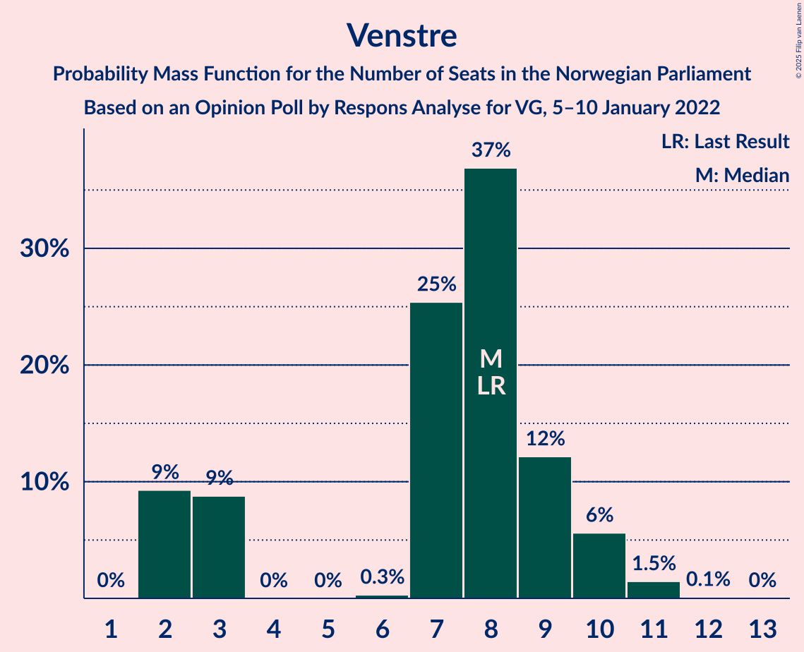

# Opinion Poll by Respons Analyse for VG, 5–10 January 2022

<a href="#voting-intentions">Voting Intentions</a> | <a href="#seats">Seats</a> | <a href="#coalitions">Coalitions</a> | <a href="#technical-information">Technical Information</a>

## Voting Intentions

### Confidence Intervals

| Party | Last Result | Poll Result | 80% Confidence Interval | 90% Confidence Interval | 95% Confidence Interval | 99% Confidence Interval |
|:-----:|:-----------:|:-----------:|:-----------------------:|:-----------------------:|:-----------------------:|:-----------------------:|
| Høyre | 20.4% | 25.6% | 23.9–27.4% |23.4–28.0% |23.0–28.4% |22.2–29.3% |
| Arbeiderpartiet | 26.2% | 23.5% | 21.8–25.3% |21.4–25.8% |21.0–26.2% |20.2–27.1% |
| Fremskrittspartiet | 11.6% | 10.6% | 9.4–11.9% |9.1–12.3% |8.8–12.7% |8.3–13.3% |
| Senterpartiet | 13.5% | 9.8% | 8.7–11.1% |8.4–11.5% |8.1–11.8% |7.6–12.5% |
| Sosialistisk Venstreparti | 7.6% | 9.4% | 8.3–10.7% |8.0–11.1% |7.7–11.4% |7.2–12.0% |
| Rødt | 4.7% | 6.6% | 5.7–7.7% |5.4–8.0% |5.2–8.3% |4.8–8.9% |
| Venstre | 4.6% | 4.4% | 3.7–5.3% |3.5–5.6% |3.3–5.9% |3.0–6.4% |
| Miljøpartiet De Grønne | 3.9% | 4.3% | 3.6–5.2% |3.4–5.5% |3.2–5.7% |2.9–6.2% |
| Kristelig Folkeparti | 3.8% | 2.7% | 2.1–3.5% |2.0–3.7% |1.9–3.9% |1.6–4.3% |

*Note:* The poll result column reflects the actual value used in the calculations. Published results may vary slightly, and in addition be rounded to fewer digits.

## Seats

### Confidence Intervals

| Party | Last Result | Median | 80% Confidence Interval | 90% Confidence Interval | 95% Confidence Interval | 99% Confidence Interval |
|:-----:|:-----------:|:------:|:-----------------------:|:-----------------------:|:-----------------------:|:-----------------------:|
| <a href="#høyre">Høyre</a> | 36 | 45 | 42–49 |42–50 |41–50 |39–53 |
| <a href="#arbeiderpartiet">Arbeiderpartiet</a> | 48 | 44 | 40–47 |39–48 |38–49 |37–50 |
| <a href="#fremskrittspartiet">Fremskrittspartiet</a> | 21 | 19 | 17–21 |16–21 |16–22 |14–23 |
| <a href="#senterpartiet">Senterpartiet</a> | 28 | 17 | 15–20 |15–20 |14–21 |13–22 |
| <a href="#sosialistisk-venstreparti">Sosialistisk Venstreparti</a> | 13 | 16 | 14–19 |14–20 |13–20 |12–21 |
| <a href="#rødt">Rødt</a> | 8 | 11 | 10–13 |9–14 |9–14 |8–16 |
| <a href="#venstre">Venstre</a> | 8 | 8 | 3–9 |2–10 |2–10 |2–11 |
| <a href="#miljøpartiet-de-grønne">Miljøpartiet De Grønne</a> | 3 | 7 | 2–9 |2–9 |2–10 |1–11 |
| <a href="#kristelig-folkeparti">Kristelig Folkeparti</a> | 3 | 2 | 0–3 |0–3 |0–3 |0–7 |

### Høyre

*For a full overview of the results for this party, see the [Høyre](party-høyre.html) page.*

| Number of Seats | Probability | Accumulated | Special Marks |
|:---------------:|:-----------:|:-----------:|:-------------:|
| 36 | 0% | 100% | Last Result |
| 37 | 0% | 100% |  |
| 38 | 0.1% | 100% |  |
| 39 | 0.4% | 99.9% |  |
| 40 | 1.3% | 99.5% |  |
| 41 | 3% | 98% |  |
| 42 | 7% | 95% |  |
| 43 | 9% | 88% |  |
| 44 | 20% | 79% |  |
| 45 | 16% | 59% | Median |
| 46 | 11% | 42% |  |
| 47 | 8% | 31% |  |
| 48 | 13% | 23% |  |
| 49 | 5% | 10% |  |
| 50 | 3% | 5% |  |
| 51 | 1.0% | 2% |  |
| 52 | 0.6% | 1.4% |  |
| 53 | 0.4% | 0.8% |  |
| 54 | 0.3% | 0.4% |  |
| 55 | 0.1% | 0.1% |  |
| 56 | 0% | 0% |  |

### Arbeiderpartiet

*For a full overview of the results for this party, see the [Arbeiderpartiet](party-arbeiderpartiet.html) page.*

| Number of Seats | Probability | Accumulated | Special Marks |
|:---------------:|:-----------:|:-----------:|:-------------:|
| 36 | 0.1% | 100% |  |
| 37 | 0.9% | 99.8% |  |
| 38 | 2% | 98.9% |  |
| 39 | 4% | 97% |  |
| 40 | 9% | 92% |  |
| 41 | 14% | 83% |  |
| 42 | 4% | 69% |  |
| 43 | 14% | 65% |  |
| 44 | 15% | 51% | Median |
| 45 | 13% | 36% |  |
| 46 | 8% | 23% |  |
| 47 | 8% | 15% |  |
| 48 | 3% | 7% | Last Result |
| 49 | 2% | 4% |  |
| 50 | 2% | 2% |  |
| 51 | 0.2% | 0.4% |  |
| 52 | 0.1% | 0.2% |  |
| 53 | 0% | 0.1% |  |
| 54 | 0% | 0% |  |

### Fremskrittspartiet

*For a full overview of the results for this party, see the [Fremskrittspartiet](party-fremskrittspartiet.html) page.*

| Number of Seats | Probability | Accumulated | Special Marks |
|:---------------:|:-----------:|:-----------:|:-------------:|
| 13 | 0.1% | 100% |  |
| 14 | 0.7% | 99.8% |  |
| 15 | 1.4% | 99.1% |  |
| 16 | 6% | 98% |  |
| 17 | 14% | 92% |  |
| 18 | 18% | 78% |  |
| 19 | 27% | 60% | Median |
| 20 | 21% | 33% |  |
| 21 | 9% | 12% | Last Result |
| 22 | 2% | 4% |  |
| 23 | 1.2% | 2% |  |
| 24 | 0.3% | 0.5% |  |
| 25 | 0.1% | 0.2% |  |
| 26 | 0% | 0% |  |

### Senterpartiet

*For a full overview of the results for this party, see the [Senterpartiet](party-senterpartiet.html) page.*

| Number of Seats | Probability | Accumulated | Special Marks |
|:---------------:|:-----------:|:-----------:|:-------------:|
| 12 | 0.1% | 100% |  |
| 13 | 1.0% | 99.9% |  |
| 14 | 3% | 98.9% |  |
| 15 | 16% | 96% |  |
| 16 | 13% | 79% |  |
| 17 | 17% | 66% | Median |
| 18 | 26% | 49% |  |
| 19 | 10% | 22% |  |
| 20 | 9% | 12% |  |
| 21 | 3% | 4% |  |
| 22 | 0.6% | 0.9% |  |
| 23 | 0.2% | 0.4% |  |
| 24 | 0.1% | 0.2% |  |
| 25 | 0% | 0.1% |  |
| 26 | 0% | 0% |  |
| 27 | 0% | 0% |  |
| 28 | 0% | 0% | Last Result |

### Sosialistisk Venstreparti

*For a full overview of the results for this party, see the [Sosialistisk Venstreparti](party-sosialistiskvenstreparti.html) page.*

| Number of Seats | Probability | Accumulated | Special Marks |
|:---------------:|:-----------:|:-----------:|:-------------:|
| 11 | 0.2% | 100% |  |
| 12 | 0.8% | 99.7% |  |
| 13 | 3% | 99.0% | Last Result |
| 14 | 10% | 96% |  |
| 15 | 13% | 86% |  |
| 16 | 25% | 73% | Median |
| 17 | 16% | 47% |  |
| 18 | 16% | 31% |  |
| 19 | 8% | 15% |  |
| 20 | 5% | 7% |  |
| 21 | 1.1% | 2% |  |
| 22 | 0.3% | 0.4% |  |
| 23 | 0% | 0.1% |  |
| 24 | 0% | 0% |  |

### Rødt

*For a full overview of the results for this party, see the [Rødt](party-rødt.html) page.*

| Number of Seats | Probability | Accumulated | Special Marks |
|:---------------:|:-----------:|:-----------:|:-------------:|
| 7 | 0.1% | 100% |  |
| 8 | 0.8% | 99.9% | Last Result |
| 9 | 6% | 99.1% |  |
| 10 | 15% | 94% |  |
| 11 | 31% | 78% | Median |
| 12 | 32% | 47% |  |
| 13 | 8% | 16% |  |
| 14 | 6% | 8% |  |
| 15 | 1.4% | 2% |  |
| 16 | 0.4% | 0.6% |  |
| 17 | 0.1% | 0.1% |  |
| 18 | 0% | 0% |  |

### Venstre

*For a full overview of the results for this party, see the [Venstre](party-venstre.html) page.*

| Number of Seats | Probability | Accumulated | Special Marks |
|:---------------:|:-----------:|:-----------:|:-------------:|
| 2 | 9% | 100% |  |
| 3 | 9% | 91% |  |
| 4 | 0% | 82% |  |
| 5 | 0% | 82% |  |
| 6 | 0.3% | 82% |  |
| 7 | 25% | 82% |  |
| 8 | 37% | 56% | Last Result, Median |
| 9 | 12% | 19% |  |
| 10 | 6% | 7% |  |
| 11 | 1.5% | 2% |  |
| 12 | 0.1% | 0.1% |  |
| 13 | 0% | 0% |  |

### Miljøpartiet De Grønne

*For a full overview of the results for this party, see the [Miljøpartiet De Grønne](party-miljøpartietdegrønne.html) page.*

| Number of Seats | Probability | Accumulated | Special Marks |
|:---------------:|:-----------:|:-----------:|:-------------:|
| 1 | 1.1% | 100% |  |
| 2 | 21% | 98.9% |  |
| 3 | 11% | 78% | Last Result |
| 4 | 0% | 68% |  |
| 5 | 0% | 68% |  |
| 6 | 0.4% | 68% |  |
| 7 | 18% | 67% | Median |
| 8 | 32% | 50% |  |
| 9 | 13% | 17% |  |
| 10 | 3% | 5% |  |
| 11 | 1.4% | 1.5% |  |
| 12 | 0.1% | 0.1% |  |
| 13 | 0% | 0% |  |

### Kristelig Folkeparti

*For a full overview of the results for this party, see the [Kristelig Folkeparti](party-kristeligfolkeparti.html) page.*

| Number of Seats | Probability | Accumulated | Special Marks |
|:---------------:|:-----------:|:-----------:|:-------------:|
| 0 | 11% | 100% |  |
| 1 | 12% | 89% |  |
| 2 | 64% | 77% | Median |
| 3 | 11% | 13% | Last Result |
| 4 | 0% | 1.3% |  |
| 5 | 0% | 1.3% |  |
| 6 | 0.1% | 1.3% |  |
| 7 | 0.9% | 1.2% |  |
| 8 | 0.3% | 0.3% |  |
| 9 | 0% | 0% |  |

## Coalitions

### Confidence Intervals

| Coalition | Last Result | Median | Majority? | 80% Confidence Interval | 90% Confidence Interval | 95% Confidence Interval | 99% Confidence Interval |
|:---------:|:-----------:|:------:|:---------:|:-----------------------:|:-----------------------:|:-----------------------:|:-----------------------:|
| Arbeiderpartiet – Senterpartiet – Sosialistisk Venstreparti – Rødt – Miljøpartiet De Grønne | 100 | 95 | 99.9% | 90–99 | 89–100 | 89–102 | 86–104 |
| Høyre – Fremskrittspartiet – Senterpartiet – Venstre – Kristelig Folkeparti | 96 | 90 | 95% | 86–96 | 85–97 | 83–98 | 81–98 |
| Arbeiderpartiet – Senterpartiet – Sosialistisk Venstreparti – Rødt | 97 | 88 | 88% | 84–93 | 83–94 | 83–96 | 81–98 |
| Arbeiderpartiet – Senterpartiet – Sosialistisk Venstreparti – Miljøpartiet De Grønne – Kristelig Folkeparti | 95 | 86 | 62% | 81–89 | 80–91 | 79–92 | 76–94 |
| Arbeiderpartiet – Senterpartiet – Sosialistisk Venstreparti – Miljøpartiet De Grønne | 92 | 84 | 43% | 79–88 | 78–89 | 77–90 | 75–92 |
| Arbeiderpartiet – Sosialistisk Venstreparti – Rødt – Miljøpartiet De Grønne | 72 | 78 | 3% | 72–82 | 71–83 | 70–85 | 69–87 |
| Høyre – Fremskrittspartiet – Venstre – Miljøpartiet De Grønne – Kristelig Folkeparti | 71 | 80 | 2% | 75–83 | 74–84 | 72–84 | 70–87 |
| Arbeiderpartiet – Senterpartiet – Sosialistisk Venstreparti | 89 | 77 | 1.5% | 73–81 | 72–82 | 72–83 | 70–86 |
| Høyre – Fremskrittspartiet – Venstre – Kristelig Folkeparti | 68 | 73 | 0% | 69–78 | 68–78 | 66–79 | 64–81 |
| Høyre – Fremskrittspartiet – Venstre | 65 | 71 | 0% | 67–76 | 66–76 | 64–77 | 62–79 |
| Arbeiderpartiet – Senterpartiet – Miljøpartiet De Grønne – Kristelig Folkeparti | 82 | 69 | 0% | 64–73 | 63–74 | 62–75 | 59–78 |
| Høyre – Fremskrittspartiet | 57 | 64 | 0% | 61–68 | 60–69 | 59–70 | 57–73 |
| Arbeiderpartiet – Senterpartiet – Kristelig Folkeparti | 79 | 63 | 0% | 59–66 | 58–68 | 57–68 | 55–70 |
| Arbeiderpartiet – Senterpartiet | 76 | 61 | 0% | 57–65 | 56–65 | 55–66 | 53–68 |
| Arbeiderpartiet – Sosialistisk Venstreparti | 61 | 60 | 0% | 57–64 | 55–65 | 55–66 | 53–68 |
| Høyre – Venstre – Kristelig Folkeparti | 47 | 54 | 0% | 51–58 | 49–59 | 48–60 | 46–62 |
| Senterpartiet – Venstre – Kristelig Folkeparti | 39 | 27 | 0% | 22–30 | 21–30 | 19–31 | 18–33 |

### Arbeiderpartiet – Senterpartiet – Sosialistisk Venstreparti – Rødt – Miljøpartiet De Grønne

| Number of Seats | Probability | Accumulated | Special Marks |
|:---------------:|:-----------:|:-----------:|:-------------:|
| 84 | 0.1% | 100% |  |
| 85 | 0.2% | 99.9% | Majority |
| 86 | 0.3% | 99.7% |  |
| 87 | 0.4% | 99.5% |  |
| 88 | 0.9% | 99.0% |  |
| 89 | 3% | 98% |  |
| 90 | 10% | 95% |  |
| 91 | 3% | 85% |  |
| 92 | 7% | 82% |  |
| 93 | 9% | 74% |  |
| 94 | 6% | 66% |  |
| 95 | 13% | 60% | Median |
| 96 | 15% | 47% |  |
| 97 | 12% | 32% |  |
| 98 | 6% | 20% |  |
| 99 | 4% | 14% |  |
| 100 | 5% | 10% | Last Result |
| 101 | 1.1% | 4% |  |
| 102 | 1.2% | 3% |  |
| 103 | 0.8% | 2% |  |
| 104 | 0.8% | 1.2% |  |
| 105 | 0.2% | 0.4% |  |
| 106 | 0.1% | 0.2% |  |
| 107 | 0% | 0.1% |  |
| 108 | 0.1% | 0.1% |  |
| 109 | 0% | 0% |  |

### Høyre – Fremskrittspartiet – Senterpartiet – Venstre – Kristelig Folkeparti

| Number of Seats | Probability | Accumulated | Special Marks |
|:---------------:|:-----------:|:-----------:|:-------------:|
| 78 | 0.1% | 100% |  |
| 79 | 0.1% | 99.9% |  |
| 80 | 0.2% | 99.8% |  |
| 81 | 0.3% | 99.6% |  |
| 82 | 1.1% | 99.2% |  |
| 83 | 2% | 98% |  |
| 84 | 2% | 97% |  |
| 85 | 3% | 95% | Majority |
| 86 | 9% | 92% |  |
| 87 | 6% | 83% |  |
| 88 | 12% | 77% |  |
| 89 | 9% | 66% |  |
| 90 | 8% | 57% |  |
| 91 | 14% | 49% | Median |
| 92 | 9% | 35% |  |
| 93 | 7% | 26% |  |
| 94 | 6% | 19% |  |
| 95 | 2% | 13% |  |
| 96 | 4% | 11% | Last Result |
| 97 | 3% | 7% |  |
| 98 | 4% | 4% |  |
| 99 | 0.3% | 0.5% |  |
| 100 | 0.1% | 0.2% |  |
| 101 | 0% | 0.1% |  |
| 102 | 0% | 0% |  |

### Arbeiderpartiet – Senterpartiet – Sosialistisk Venstreparti – Rødt

| Number of Seats | Probability | Accumulated | Special Marks |
|:---------------:|:-----------:|:-----------:|:-------------:|
| 78 | 0.1% | 100% |  |
| 79 | 0.1% | 99.9% |  |
| 80 | 0.3% | 99.8% |  |
| 81 | 0.7% | 99.5% |  |
| 82 | 0.7% | 98.8% |  |
| 83 | 3% | 98% |  |
| 84 | 6% | 95% |  |
| 85 | 4% | 88% | Majority |
| 86 | 7% | 84% |  |
| 87 | 10% | 78% |  |
| 88 | 18% | 67% | Median |
| 89 | 15% | 50% |  |
| 90 | 8% | 34% |  |
| 91 | 5% | 26% |  |
| 92 | 7% | 21% |  |
| 93 | 5% | 14% |  |
| 94 | 5% | 9% |  |
| 95 | 1.4% | 4% |  |
| 96 | 0.9% | 3% |  |
| 97 | 1.1% | 2% | Last Result |
| 98 | 0.4% | 0.6% |  |
| 99 | 0.1% | 0.2% |  |
| 100 | 0% | 0.1% |  |
| 101 | 0.1% | 0.1% |  |
| 102 | 0% | 0% |  |

### Arbeiderpartiet – Senterpartiet – Sosialistisk Venstreparti – Miljøpartiet De Grønne – Kristelig Folkeparti

| Number of Seats | Probability | Accumulated | Special Marks |
|:---------------:|:-----------:|:-----------:|:-------------:|
| 74 | 0% | 100% |  |
| 75 | 0% | 99.9% |  |
| 76 | 0.5% | 99.9% |  |
| 77 | 0.6% | 99.4% |  |
| 78 | 0.7% | 98.8% |  |
| 79 | 1.4% | 98% |  |
| 80 | 5% | 97% |  |
| 81 | 7% | 92% |  |
| 82 | 7% | 85% |  |
| 83 | 7% | 79% |  |
| 84 | 10% | 72% |  |
| 85 | 11% | 62% | Majority |
| 86 | 11% | 50% | Median |
| 87 | 17% | 39% |  |
| 88 | 6% | 23% |  |
| 89 | 7% | 17% |  |
| 90 | 4% | 9% |  |
| 91 | 2% | 5% |  |
| 92 | 1.0% | 3% |  |
| 93 | 1.1% | 2% |  |
| 94 | 0.6% | 1.0% |  |
| 95 | 0.2% | 0.4% | Last Result |
| 96 | 0.2% | 0.2% |  |
| 97 | 0% | 0% |  |

### Arbeiderpartiet – Senterpartiet – Sosialistisk Venstreparti – Miljøpartiet De Grønne

| Number of Seats | Probability | Accumulated | Special Marks |
|:---------------:|:-----------:|:-----------:|:-------------:|
| 73 | 0.1% | 100% |  |
| 74 | 0.3% | 99.9% |  |
| 75 | 0.5% | 99.6% |  |
| 76 | 0.6% | 99.0% |  |
| 77 | 2% | 98% |  |
| 78 | 6% | 97% |  |
| 79 | 6% | 91% |  |
| 80 | 8% | 85% |  |
| 81 | 5% | 77% |  |
| 82 | 6% | 72% |  |
| 83 | 11% | 66% |  |
| 84 | 12% | 55% | Median |
| 85 | 20% | 43% | Majority |
| 86 | 5% | 23% |  |
| 87 | 7% | 18% |  |
| 88 | 5% | 11% |  |
| 89 | 2% | 6% |  |
| 90 | 2% | 4% |  |
| 91 | 0.8% | 2% |  |
| 92 | 0.9% | 1.4% | Last Result |
| 93 | 0.2% | 0.5% |  |
| 94 | 0.1% | 0.3% |  |
| 95 | 0.1% | 0.1% |  |
| 96 | 0% | 0% |  |

### Arbeiderpartiet – Sosialistisk Venstreparti – Rødt – Miljøpartiet De Grønne

| Number of Seats | Probability | Accumulated | Special Marks |
|:---------------:|:-----------:|:-----------:|:-------------:|
| 66 | 0% | 100% |  |
| 67 | 0.1% | 99.9% |  |
| 68 | 0.2% | 99.9% |  |
| 69 | 0.4% | 99.6% |  |
| 70 | 4% | 99.2% |  |
| 71 | 3% | 95% |  |
| 72 | 4% | 92% | Last Result |
| 73 | 2% | 89% |  |
| 74 | 4% | 86% |  |
| 75 | 10% | 82% |  |
| 76 | 8% | 72% |  |
| 77 | 8% | 64% |  |
| 78 | 15% | 57% | Median |
| 79 | 8% | 41% |  |
| 80 | 13% | 33% |  |
| 81 | 6% | 21% |  |
| 82 | 7% | 15% |  |
| 83 | 3% | 7% |  |
| 84 | 2% | 5% |  |
| 85 | 2% | 3% | Majority |
| 86 | 0.4% | 1.1% |  |
| 87 | 0.3% | 0.6% |  |
| 88 | 0.1% | 0.3% |  |
| 89 | 0.1% | 0.2% |  |
| 90 | 0% | 0% |  |

### Høyre – Fremskrittspartiet – Venstre – Miljøpartiet De Grønne – Kristelig Folkeparti

| Number of Seats | Probability | Accumulated | Special Marks |
|:---------------:|:-----------:|:-----------:|:-------------:|
| 68 | 0.1% | 100% |  |
| 69 | 0.1% | 99.9% |  |
| 70 | 0.4% | 99.8% |  |
| 71 | 0.5% | 99.4% | Last Result |
| 72 | 2% | 98.9% |  |
| 73 | 1.2% | 97% |  |
| 74 | 5% | 96% |  |
| 75 | 3% | 91% |  |
| 76 | 7% | 88% |  |
| 77 | 6% | 81% |  |
| 78 | 9% | 74% |  |
| 79 | 15% | 66% |  |
| 80 | 17% | 50% |  |
| 81 | 11% | 33% | Median |
| 82 | 10% | 22% |  |
| 83 | 3% | 12% |  |
| 84 | 6% | 9% |  |
| 85 | 1.1% | 2% | Majority |
| 86 | 0.5% | 1.2% |  |
| 87 | 0.6% | 0.7% |  |
| 88 | 0.1% | 0.1% |  |
| 89 | 0% | 0% |  |

### Arbeiderpartiet – Senterpartiet – Sosialistisk Venstreparti

| Number of Seats | Probability | Accumulated | Special Marks |
|:---------------:|:-----------:|:-----------:|:-------------:|
| 68 | 0.1% | 100% |  |
| 69 | 0.3% | 99.8% |  |
| 70 | 0.5% | 99.5% |  |
| 71 | 1.3% | 99.1% |  |
| 72 | 3% | 98% |  |
| 73 | 7% | 95% |  |
| 74 | 5% | 88% |  |
| 75 | 5% | 83% |  |
| 76 | 16% | 77% |  |
| 77 | 22% | 61% | Median |
| 78 | 10% | 40% |  |
| 79 | 6% | 30% |  |
| 80 | 6% | 23% |  |
| 81 | 7% | 17% |  |
| 82 | 6% | 10% |  |
| 83 | 2% | 4% |  |
| 84 | 1.0% | 2% |  |
| 85 | 0.8% | 1.5% | Majority |
| 86 | 0.4% | 0.6% |  |
| 87 | 0.2% | 0.2% |  |
| 88 | 0% | 0.1% |  |
| 89 | 0% | 0% | Last Result |

### Høyre – Fremskrittspartiet – Venstre – Kristelig Folkeparti

| Number of Seats | Probability | Accumulated | Special Marks |
|:---------------:|:-----------:|:-----------:|:-------------:|
| 61 | 0.1% | 100% |  |
| 62 | 0.1% | 99.9% |  |
| 63 | 0.2% | 99.9% |  |
| 64 | 0.4% | 99.7% |  |
| 65 | 0.9% | 99.3% |  |
| 66 | 1.4% | 98% |  |
| 67 | 1.5% | 97% |  |
| 68 | 3% | 96% | Last Result |
| 69 | 5% | 92% |  |
| 70 | 5% | 87% |  |
| 71 | 16% | 82% |  |
| 72 | 10% | 65% |  |
| 73 | 14% | 56% |  |
| 74 | 11% | 42% | Median |
| 75 | 8% | 31% |  |
| 76 | 9% | 23% |  |
| 77 | 3% | 14% |  |
| 78 | 7% | 12% |  |
| 79 | 3% | 4% |  |
| 80 | 0.8% | 1.3% |  |
| 81 | 0.3% | 0.5% |  |
| 82 | 0.1% | 0.2% |  |
| 83 | 0.1% | 0.1% |  |
| 84 | 0% | 0% |  |

### Høyre – Fremskrittspartiet – Venstre

| Number of Seats | Probability | Accumulated | Special Marks |
|:---------------:|:-----------:|:-----------:|:-------------:|
| 60 | 0.1% | 100% |  |
| 61 | 0.2% | 99.9% |  |
| 62 | 0.3% | 99.7% |  |
| 63 | 0.9% | 99.4% |  |
| 64 | 1.0% | 98.5% |  |
| 65 | 1.2% | 97% | Last Result |
| 66 | 3% | 96% |  |
| 67 | 5% | 93% |  |
| 68 | 4% | 88% |  |
| 69 | 16% | 84% |  |
| 70 | 9% | 68% |  |
| 71 | 15% | 60% |  |
| 72 | 11% | 45% | Median |
| 73 | 11% | 33% |  |
| 74 | 7% | 22% |  |
| 75 | 3% | 14% |  |
| 76 | 9% | 12% |  |
| 77 | 1.4% | 3% |  |
| 78 | 0.8% | 2% |  |
| 79 | 0.6% | 0.8% |  |
| 80 | 0.2% | 0.3% |  |
| 81 | 0.1% | 0.1% |  |
| 82 | 0% | 0% |  |

### Arbeiderpartiet – Senterpartiet – Miljøpartiet De Grønne – Kristelig Folkeparti

| Number of Seats | Probability | Accumulated | Special Marks |
|:---------------:|:-----------:|:-----------:|:-------------:|
| 57 | 0% | 100% |  |
| 58 | 0.1% | 99.9% |  |
| 59 | 0.4% | 99.8% |  |
| 60 | 0.5% | 99.4% |  |
| 61 | 0.5% | 99.0% |  |
| 62 | 1.2% | 98.5% |  |
| 63 | 6% | 97% |  |
| 64 | 5% | 91% |  |
| 65 | 6% | 86% |  |
| 66 | 5% | 81% |  |
| 67 | 8% | 76% |  |
| 68 | 17% | 67% |  |
| 69 | 7% | 51% |  |
| 70 | 9% | 43% | Median |
| 71 | 12% | 35% |  |
| 72 | 10% | 23% |  |
| 73 | 5% | 13% |  |
| 74 | 4% | 8% |  |
| 75 | 2% | 4% |  |
| 76 | 1.1% | 2% |  |
| 77 | 0.7% | 1.2% |  |
| 78 | 0.2% | 0.6% |  |
| 79 | 0.2% | 0.4% |  |
| 80 | 0.1% | 0.2% |  |
| 81 | 0% | 0% |  |
| 82 | 0% | 0% | Last Result |

### Høyre – Fremskrittspartiet

| Number of Seats | Probability | Accumulated | Special Marks |
|:---------------:|:-----------:|:-----------:|:-------------:|
| 55 | 0.1% | 100% |  |
| 56 | 0.3% | 99.9% |  |
| 57 | 0.6% | 99.6% | Last Result |
| 58 | 0.9% | 99.0% |  |
| 59 | 3% | 98% |  |
| 60 | 3% | 95% |  |
| 61 | 11% | 92% |  |
| 62 | 13% | 81% |  |
| 63 | 11% | 68% |  |
| 64 | 14% | 57% | Median |
| 65 | 16% | 43% |  |
| 66 | 4% | 27% |  |
| 67 | 6% | 22% |  |
| 68 | 7% | 16% |  |
| 69 | 6% | 9% |  |
| 70 | 1.0% | 3% |  |
| 71 | 1.2% | 2% |  |
| 72 | 0.6% | 1.2% |  |
| 73 | 0.1% | 0.5% |  |
| 74 | 0.3% | 0.4% |  |
| 75 | 0% | 0.1% |  |
| 76 | 0% | 0% |  |

### Arbeiderpartiet – Senterpartiet – Kristelig Folkeparti

| Number of Seats | Probability | Accumulated | Special Marks |
|:---------------:|:-----------:|:-----------:|:-------------:|
| 53 | 0% | 100% |  |
| 54 | 0.2% | 99.9% |  |
| 55 | 0.5% | 99.8% |  |
| 56 | 0.9% | 99.2% |  |
| 57 | 2% | 98% |  |
| 58 | 4% | 96% |  |
| 59 | 5% | 92% |  |
| 60 | 6% | 87% |  |
| 61 | 20% | 81% |  |
| 62 | 11% | 61% |  |
| 63 | 16% | 50% | Median |
| 64 | 10% | 35% |  |
| 65 | 10% | 24% |  |
| 66 | 7% | 14% |  |
| 67 | 3% | 8% |  |
| 68 | 3% | 5% |  |
| 69 | 1.0% | 2% |  |
| 70 | 0.6% | 1.1% |  |
| 71 | 0.2% | 0.5% |  |
| 72 | 0.2% | 0.3% |  |
| 73 | 0% | 0.1% |  |
| 74 | 0% | 0% |  |
| 75 | 0% | 0% |  |
| 76 | 0% | 0% |  |
| 77 | 0% | 0% |  |
| 78 | 0% | 0% |  |
| 79 | 0% | 0% | Last Result |

### Arbeiderpartiet – Senterpartiet

| Number of Seats | Probability | Accumulated | Special Marks |
|:---------------:|:-----------:|:-----------:|:-------------:|
| 52 | 0.1% | 100% |  |
| 53 | 0.5% | 99.9% |  |
| 54 | 0.6% | 99.3% |  |
| 55 | 2% | 98.7% |  |
| 56 | 4% | 97% |  |
| 57 | 4% | 93% |  |
| 58 | 8% | 89% |  |
| 59 | 18% | 81% |  |
| 60 | 10% | 63% |  |
| 61 | 17% | 53% | Median |
| 62 | 10% | 36% |  |
| 63 | 9% | 27% |  |
| 64 | 7% | 17% |  |
| 65 | 6% | 10% |  |
| 66 | 2% | 4% |  |
| 67 | 1.2% | 2% |  |
| 68 | 0.7% | 1.1% |  |
| 69 | 0.2% | 0.4% |  |
| 70 | 0.1% | 0.2% |  |
| 71 | 0.1% | 0.1% |  |
| 72 | 0% | 0% |  |
| 73 | 0% | 0% |  |
| 74 | 0% | 0% |  |
| 75 | 0% | 0% |  |
| 76 | 0% | 0% | Last Result |

### Arbeiderpartiet – Sosialistisk Venstreparti

| Number of Seats | Probability | Accumulated | Special Marks |
|:---------------:|:-----------:|:-----------:|:-------------:|
| 51 | 0.1% | 100% |  |
| 52 | 0.2% | 99.9% |  |
| 53 | 0.8% | 99.7% |  |
| 54 | 1.0% | 98.9% |  |
| 55 | 3% | 98% |  |
| 56 | 4% | 94% |  |
| 57 | 11% | 90% |  |
| 58 | 12% | 79% |  |
| 59 | 11% | 67% |  |
| 60 | 11% | 56% | Median |
| 61 | 16% | 44% | Last Result |
| 62 | 11% | 28% |  |
| 63 | 5% | 17% |  |
| 64 | 3% | 12% |  |
| 65 | 5% | 9% |  |
| 66 | 2% | 3% |  |
| 67 | 0.7% | 2% |  |
| 68 | 0.7% | 1.0% |  |
| 69 | 0.2% | 0.3% |  |
| 70 | 0.1% | 0.1% |  |
| 71 | 0% | 0% |  |

### Høyre – Venstre – Kristelig Folkeparti

| Number of Seats | Probability | Accumulated | Special Marks |
|:---------------:|:-----------:|:-----------:|:-------------:|
| 43 | 0% | 100% |  |
| 44 | 0.2% | 99.9% |  |
| 45 | 0.3% | 99.8% |  |
| 46 | 0.9% | 99.5% |  |
| 47 | 1.1% | 98.6% | Last Result |
| 48 | 2% | 98% |  |
| 49 | 2% | 96% |  |
| 50 | 4% | 94% |  |
| 51 | 5% | 90% |  |
| 52 | 12% | 86% |  |
| 53 | 13% | 73% |  |
| 54 | 15% | 60% |  |
| 55 | 11% | 45% | Median |
| 56 | 12% | 34% |  |
| 57 | 7% | 22% |  |
| 58 | 10% | 16% |  |
| 59 | 3% | 6% |  |
| 60 | 2% | 3% |  |
| 61 | 0.5% | 1.0% |  |
| 62 | 0.4% | 0.5% |  |
| 63 | 0.1% | 0.2% |  |
| 64 | 0% | 0.1% |  |
| 65 | 0% | 0% |  |

### Senterpartiet – Venstre – Kristelig Folkeparti

| Number of Seats | Probability | Accumulated | Special Marks |
|:---------------:|:-----------:|:-----------:|:-------------:|
| 15 | 0.1% | 100% |  |
| 16 | 0.1% | 99.9% |  |
| 17 | 0.1% | 99.8% |  |
| 18 | 0.4% | 99.7% |  |
| 19 | 3% | 99.3% |  |
| 20 | 1.3% | 97% |  |
| 21 | 3% | 95% |  |
| 22 | 3% | 92% |  |
| 23 | 9% | 89% |  |
| 24 | 7% | 81% |  |
| 25 | 12% | 74% |  |
| 26 | 11% | 62% |  |
| 27 | 16% | 51% | Median |
| 28 | 15% | 35% |  |
| 29 | 7% | 20% |  |
| 30 | 10% | 13% |  |
| 31 | 2% | 4% |  |
| 32 | 1.0% | 2% |  |
| 33 | 0.3% | 0.5% |  |
| 34 | 0.2% | 0.3% |  |
| 35 | 0.1% | 0.1% |  |
| 36 | 0% | 0.1% |  |
| 37 | 0% | 0% |  |
| 38 | 0% | 0% |  |
| 39 | 0% | 0% | Last Result |

## Technical Information

### Opinion Poll

+ **Polling firm:** Respons Analyse
+ **Commissioner(s):** VG
+ **Fieldwork period:** 5–10 January 2022

### Calculations

+ **Sample size:** 1000
+ **Simulations done:** 1,048,576
+ **Error estimate:** 1.22%

