# Opinion Poll by Sentio for Amedia and Nettavisen, 10–15 January 2022

<a href="#voting-intentions">Voting Intentions</a> | <a href="#seats">Seats</a> | <a href="#coalitions">Coalitions</a> | <a href="#technical-information">Technical Information</a>

## Voting Intentions

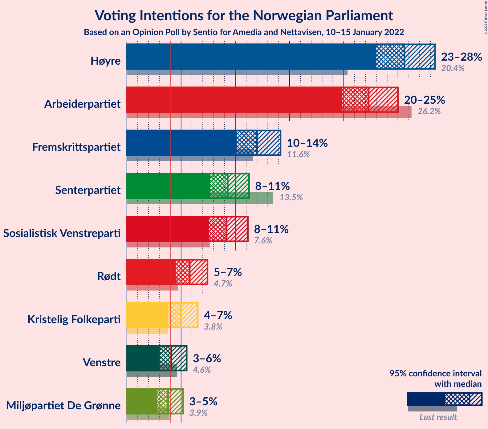

### Confidence Intervals

| Party | Last Result | Poll Result | 80% Confidence Interval | 90% Confidence Interval | 95% Confidence Interval | 99% Confidence Interval |
|:-----:|:-----------:|:-----------:|:-----------------------:|:-----------------------:|:-----------------------:|:-----------------------:|
| Høyre | 20.4% | 25.6% | 23.9–27.4% |23.4–28.0% |23.0–28.4% |22.2–29.3% |
| Arbeiderpartiet | 26.2% | 22.3% | 20.7–24.1% |20.2–24.6% |19.8–25.0% |19.1–25.8% |
| Fremskrittspartiet | 11.6% | 12.0% | 10.8–13.4% |10.4–13.8% |10.1–14.2% |9.6–14.9% |
| Senterpartiet | 13.5% | 9.3% | 8.2–10.6% |7.9–10.9% |7.7–11.3% |7.2–11.9% |
| Sosialistisk Venstreparti | 7.6% | 9.2% | 8.1–10.5% |7.8–10.8% |7.6–11.2% |7.1–11.8% |
| Rødt | 4.7% | 5.8% | 5.0–6.9% |4.7–7.2% |4.5–7.4% |4.1–8.0% |
| Kristelig Folkeparti | 3.8% | 5.0% | 4.2–6.0% |4.0–6.3% |3.8–6.5% |3.5–7.1% |
| Venstre | 4.6% | 4.1% | 3.4–5.0% |3.2–5.3% |3.0–5.5% |2.7–6.0% |
| Miljøpartiet De Grønne | 3.9% | 3.8% | 3.1–4.7% |2.9–5.0% |2.8–5.2% |2.5–5.6% |

*Note:* The poll result column reflects the actual value used in the calculations. Published results may vary slightly, and in addition be rounded to fewer digits.

## Seats

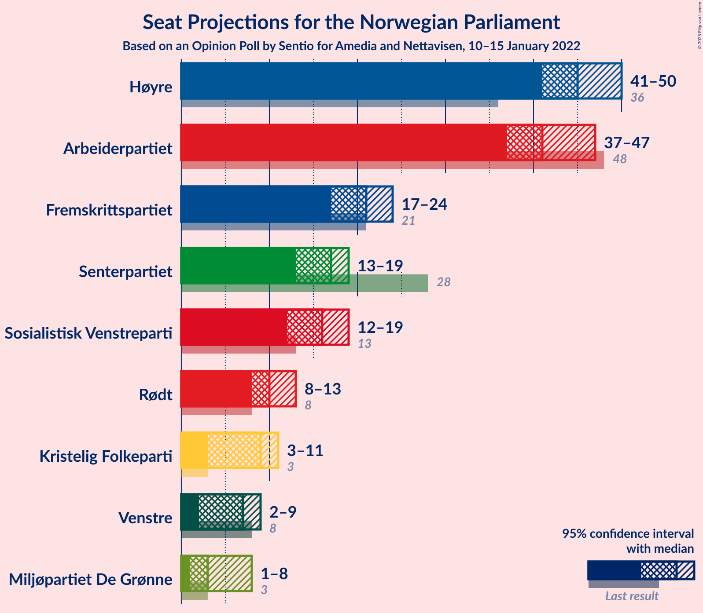

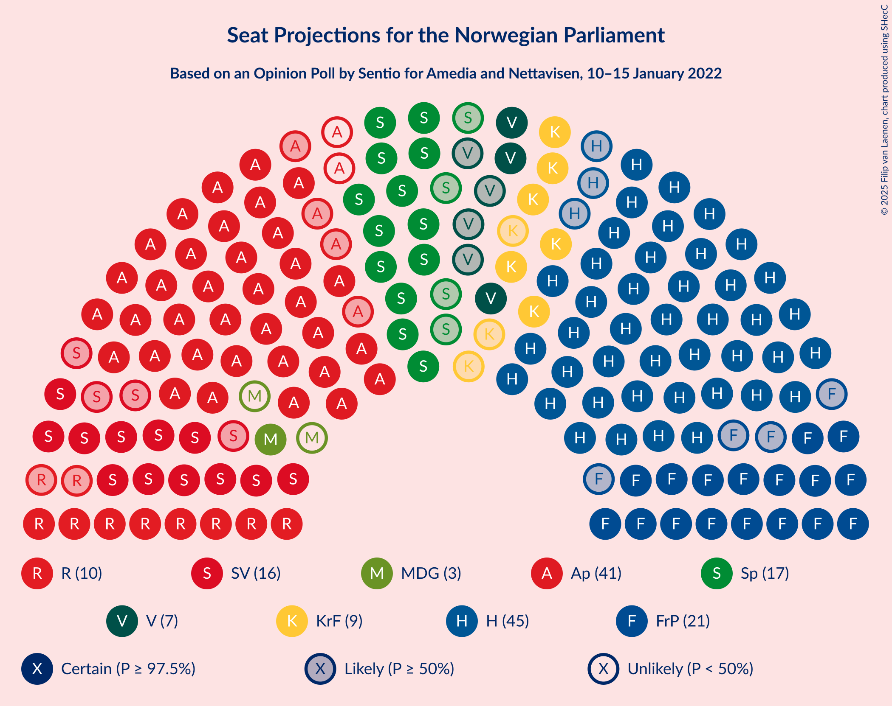

### Confidence Intervals

| Party | Last Result | Median | 80% Confidence Interval | 90% Confidence Interval | 95% Confidence Interval | 99% Confidence Interval |
|:-----:|:-----------:|:------:|:-----------------------:|:-----------------------:|:-----------------------:|:-----------------------:|
| <a href="#høyre">Høyre</a> | 36 | 45 | 43–48 |42–49 |41–50 |40–51 |
| <a href="#arbeiderpartiet">Arbeiderpartiet</a> | 48 | 41 | 38–45 |37–46 |37–47 |36–48 |
| <a href="#fremskrittspartiet">Fremskrittspartiet</a> | 21 | 21 | 18–23 |17–24 |17–24 |17–26 |
| <a href="#senterpartiet">Senterpartiet</a> | 28 | 17 | 14–18 |14–19 |13–19 |12–21 |
| <a href="#sosialistisk-venstreparti">Sosialistisk Venstreparti</a> | 13 | 16 | 13–18 |13–19 |12–19 |11–20 |
| <a href="#rødt">Rødt</a> | 8 | 10 | 9–11 |8–12 |8–13 |7–14 |
| <a href="#kristelig-folkeparti">Kristelig Folkeparti</a> | 3 | 9 | 7–10 |3–11 |3–11 |2–12 |
| <a href="#venstre">Venstre</a> | 8 | 7 | 2–8 |2–9 |2–9 |2–10 |
| <a href="#miljøpartiet-de-grønne">Miljøpartiet De Grønne</a> | 3 | 3 | 2–8 |2–8 |1–8 |1–9 |

### Høyre

*For a full overview of the results for this party, see the [Høyre](party-høyre.html) page.*

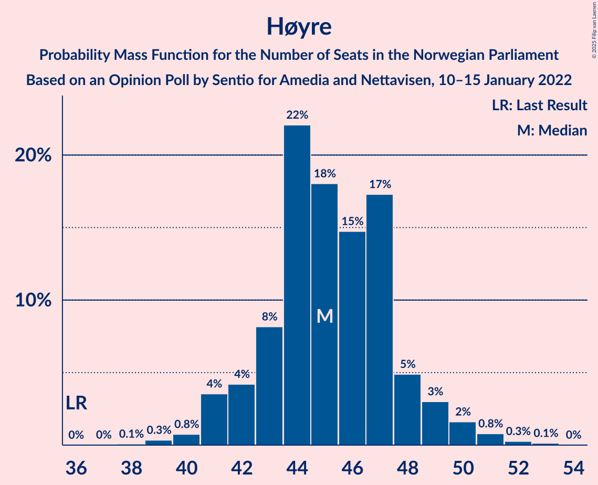

| Number of Seats | Probability | Accumulated | Special Marks |
|:---------------:|:-----------:|:-----------:|:-------------:|
| 36 | 0% | 100% | Last Result |
| 37 | 0% | 100% |  |
| 38 | 0.1% | 100% |  |
| 39 | 0.3% | 99.9% |  |
| 40 | 0.8% | 99.5% |  |
| 41 | 4% | 98.8% |  |
| 42 | 4% | 95% |  |
| 43 | 8% | 91% |  |
| 44 | 22% | 83% |  |
| 45 | 18% | 61% | Median |
| 46 | 15% | 43% |  |
| 47 | 17% | 28% |  |
| 48 | 5% | 11% |  |
| 49 | 3% | 6% |  |
| 50 | 2% | 3% |  |
| 51 | 0.8% | 1.2% |  |
| 52 | 0.3% | 0.4% |  |
| 53 | 0.1% | 0.2% |  |
| 54 | 0% | 0% |  |

### Arbeiderpartiet

*For a full overview of the results for this party, see the [Arbeiderpartiet](party-arbeiderpartiet.html) page.*

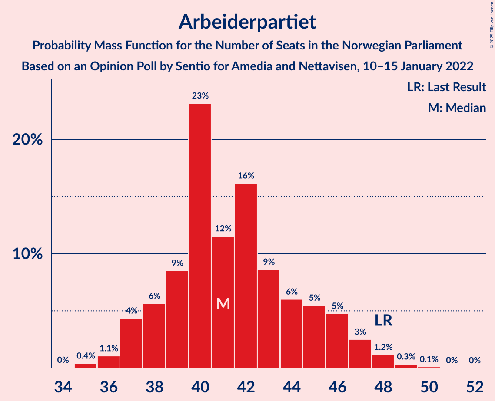

| Number of Seats | Probability | Accumulated | Special Marks |
|:---------------:|:-----------:|:-----------:|:-------------:|
| 34 | 0% | 100% |  |
| 35 | 0.4% | 99.9% |  |
| 36 | 1.1% | 99.5% |  |
| 37 | 4% | 98% |  |
| 38 | 6% | 94% |  |
| 39 | 9% | 88% |  |
| 40 | 23% | 80% |  |
| 41 | 12% | 57% | Median |
| 42 | 16% | 45% |  |
| 43 | 9% | 29% |  |
| 44 | 6% | 20% |  |
| 45 | 5% | 14% |  |
| 46 | 5% | 9% |  |
| 47 | 3% | 4% |  |
| 48 | 1.2% | 2% | Last Result |
| 49 | 0.3% | 0.5% |  |
| 50 | 0.1% | 0.1% |  |
| 51 | 0% | 0% |  |

### Fremskrittspartiet

*For a full overview of the results for this party, see the [Fremskrittspartiet](party-fremskrittspartiet.html) page.*

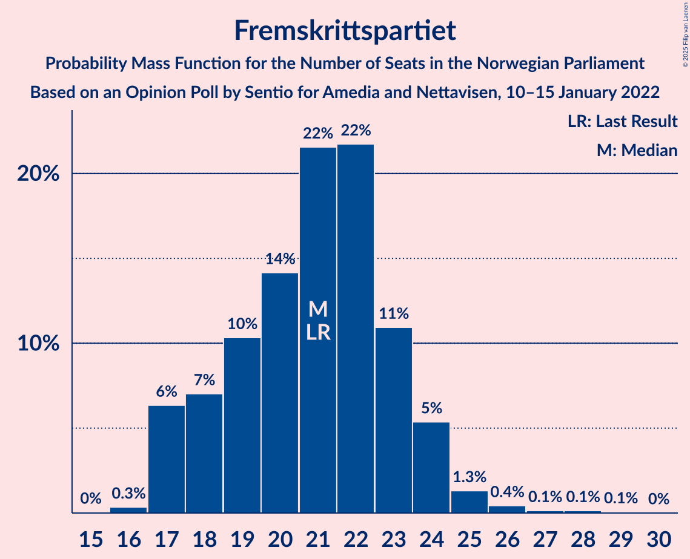

| Number of Seats | Probability | Accumulated | Special Marks |
|:---------------:|:-----------:|:-----------:|:-------------:|
| 15 | 0% | 100% |  |
| 16 | 0.3% | 99.9% |  |
| 17 | 6% | 99.6% |  |
| 18 | 7% | 93% |  |
| 19 | 10% | 86% |  |
| 20 | 14% | 76% |  |
| 21 | 22% | 62% | Last Result, Median |
| 22 | 22% | 40% |  |
| 23 | 11% | 18% |  |
| 24 | 5% | 7% |  |
| 25 | 1.3% | 2% |  |
| 26 | 0.4% | 0.8% |  |
| 27 | 0.1% | 0.4% |  |
| 28 | 0.1% | 0.2% |  |
| 29 | 0.1% | 0.1% |  |
| 30 | 0% | 0% |  |

### Senterpartiet

*For a full overview of the results for this party, see the [Senterpartiet](party-senterpartiet.html) page.*

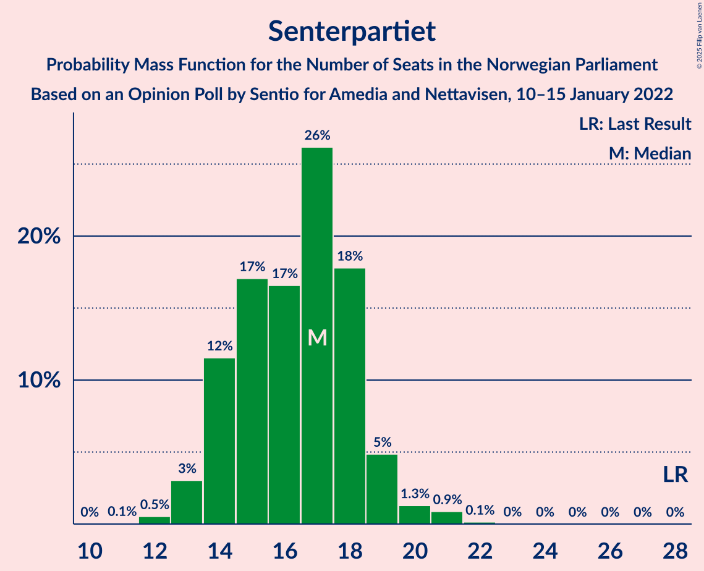

| Number of Seats | Probability | Accumulated | Special Marks |
|:---------------:|:-----------:|:-----------:|:-------------:|
| 11 | 0.1% | 100% |  |
| 12 | 0.5% | 99.9% |  |
| 13 | 3% | 99.4% |  |
| 14 | 12% | 96% |  |
| 15 | 17% | 85% |  |
| 16 | 17% | 68% |  |
| 17 | 26% | 51% | Median |
| 18 | 18% | 25% |  |
| 19 | 5% | 7% |  |
| 20 | 1.3% | 2% |  |
| 21 | 0.9% | 1.1% |  |
| 22 | 0.1% | 0.2% |  |
| 23 | 0% | 0% |  |
| 24 | 0% | 0% |  |
| 25 | 0% | 0% |  |
| 26 | 0% | 0% |  |
| 27 | 0% | 0% |  |
| 28 | 0% | 0% | Last Result |

### Sosialistisk Venstreparti

*For a full overview of the results for this party, see the [Sosialistisk Venstreparti](party-sosialistiskvenstreparti.html) page.*

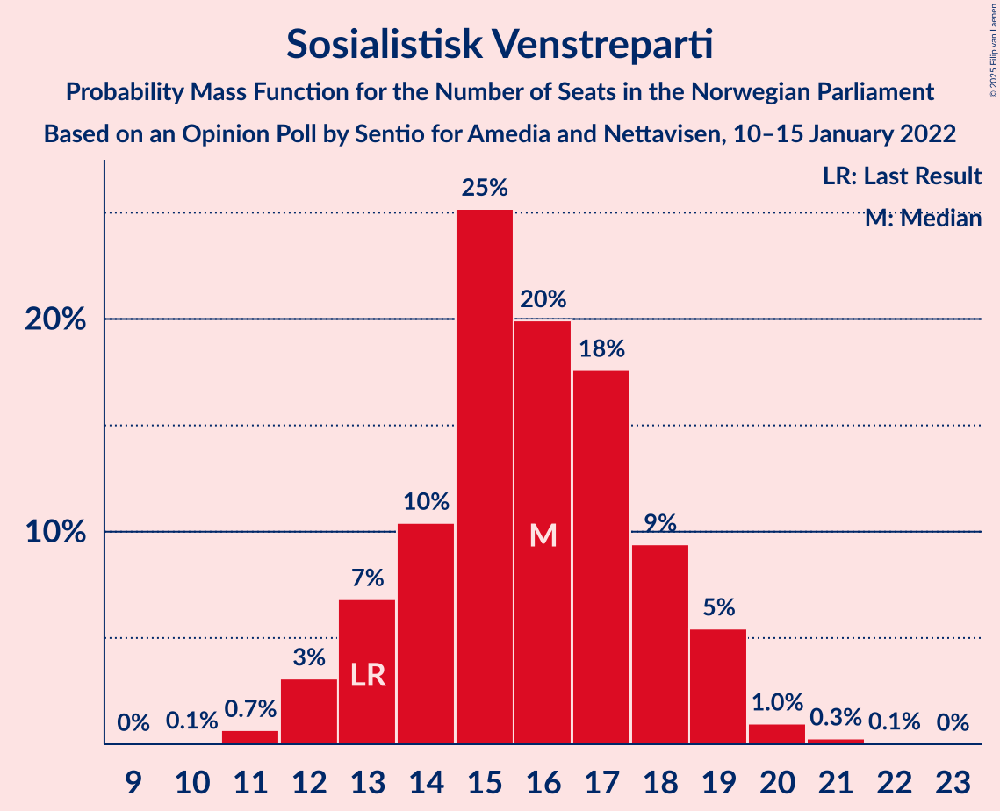

| Number of Seats | Probability | Accumulated | Special Marks |
|:---------------:|:-----------:|:-----------:|:-------------:|
| 10 | 0.1% | 100% |  |
| 11 | 0.7% | 99.9% |  |
| 12 | 3% | 99.2% |  |
| 13 | 7% | 96% | Last Result |
| 14 | 10% | 89% |  |
| 15 | 25% | 79% |  |
| 16 | 20% | 54% | Median |
| 17 | 18% | 34% |  |
| 18 | 9% | 16% |  |
| 19 | 5% | 7% |  |
| 20 | 1.0% | 1.3% |  |
| 21 | 0.3% | 0.4% |  |
| 22 | 0.1% | 0.1% |  |
| 23 | 0% | 0% |  |

### Rødt

*For a full overview of the results for this party, see the [Rødt](party-rødt.html) page.*

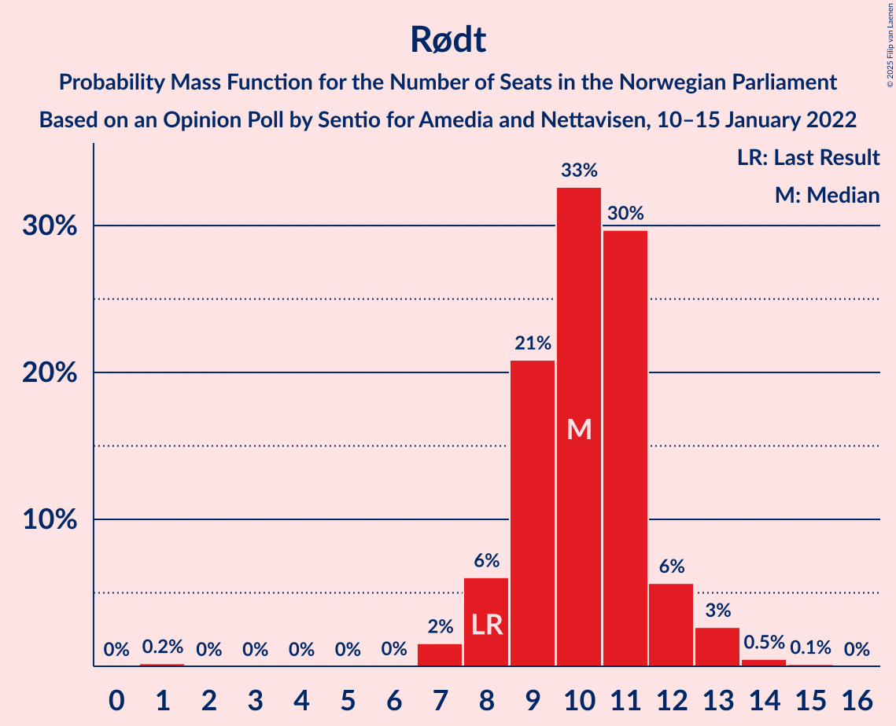

| Number of Seats | Probability | Accumulated | Special Marks |
|:---------------:|:-----------:|:-----------:|:-------------:|
| 1 | 0.2% | 100% |  |
| 2 | 0% | 99.8% |  |
| 3 | 0% | 99.8% |  |
| 4 | 0% | 99.8% |  |
| 5 | 0% | 99.8% |  |
| 6 | 0% | 99.8% |  |
| 7 | 2% | 99.8% |  |
| 8 | 6% | 98% | Last Result |
| 9 | 21% | 92% |  |
| 10 | 33% | 71% | Median |
| 11 | 30% | 39% |  |
| 12 | 6% | 9% |  |
| 13 | 3% | 3% |  |
| 14 | 0.5% | 0.6% |  |
| 15 | 0.1% | 0.1% |  |
| 16 | 0% | 0% |  |

### Kristelig Folkeparti

*For a full overview of the results for this party, see the [Kristelig Folkeparti](party-kristeligfolkeparti.html) page.*

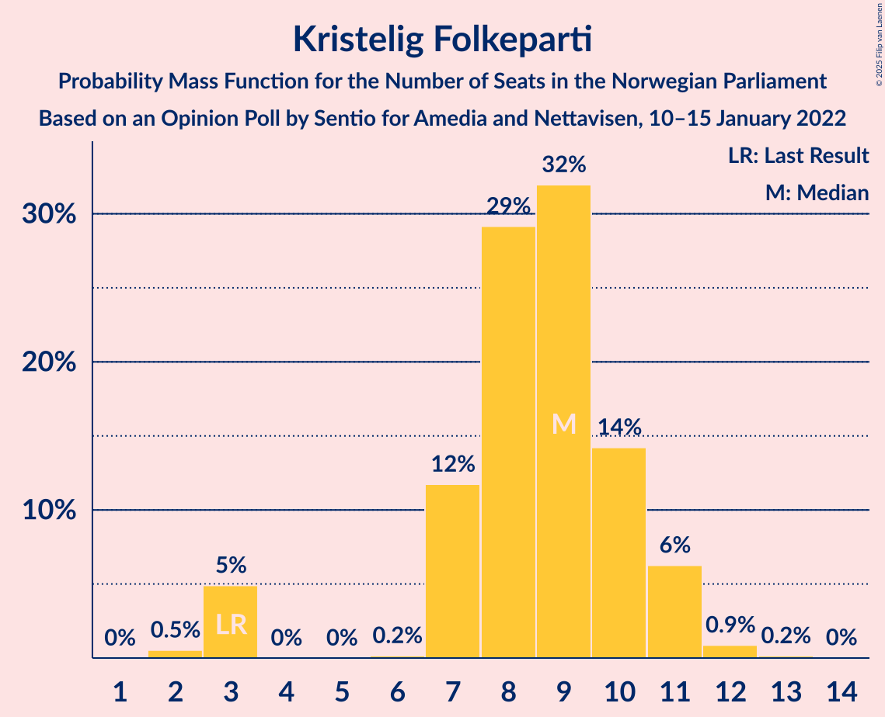

| Number of Seats | Probability | Accumulated | Special Marks |
|:---------------:|:-----------:|:-----------:|:-------------:|
| 2 | 0.5% | 100% |  |
| 3 | 5% | 99.5% | Last Result |
| 4 | 0% | 95% |  |
| 5 | 0% | 95% |  |
| 6 | 0.2% | 95% |  |
| 7 | 12% | 94% |  |
| 8 | 29% | 83% |  |
| 9 | 32% | 54% | Median |
| 10 | 14% | 22% |  |
| 11 | 6% | 7% |  |
| 12 | 0.9% | 1.0% |  |
| 13 | 0.2% | 0.2% |  |
| 14 | 0% | 0% |  |

### Venstre

*For a full overview of the results for this party, see the [Venstre](party-venstre.html) page.*

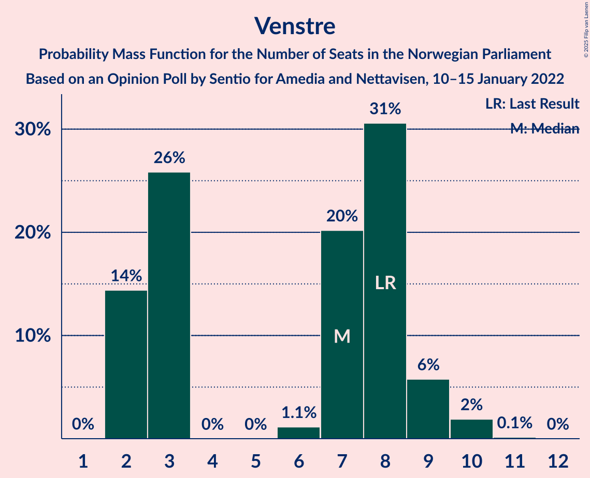

| Number of Seats | Probability | Accumulated | Special Marks |
|:---------------:|:-----------:|:-----------:|:-------------:|
| 2 | 14% | 100% |  |
| 3 | 26% | 86% |  |
| 4 | 0% | 60% |  |
| 5 | 0% | 60% |  |
| 6 | 1.1% | 60% |  |
| 7 | 20% | 59% | Median |
| 8 | 31% | 38% | Last Result |
| 9 | 6% | 8% |  |
| 10 | 2% | 2% |  |
| 11 | 0.1% | 0.2% |  |
| 12 | 0% | 0% |  |

### Miljøpartiet De Grønne

*For a full overview of the results for this party, see the [Miljøpartiet De Grønne](party-miljøpartietdegrønne.html) page.*

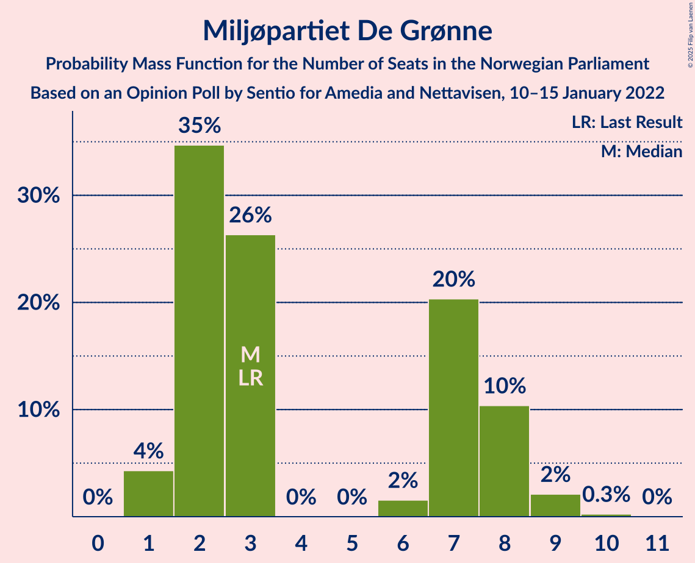

| Number of Seats | Probability | Accumulated | Special Marks |
|:---------------:|:-----------:|:-----------:|:-------------:|
| 1 | 4% | 100% |  |
| 2 | 35% | 96% |  |
| 3 | 26% | 61% | Last Result, Median |
| 4 | 0% | 35% |  |
| 5 | 0% | 35% |  |
| 6 | 2% | 35% |  |
| 7 | 20% | 33% |  |
| 8 | 10% | 13% |  |
| 9 | 2% | 2% |  |
| 10 | 0.3% | 0.3% |  |
| 11 | 0% | 0% |  |

## Coalitions

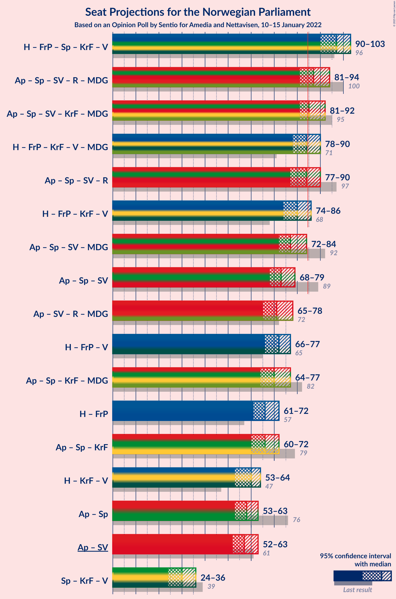

### Confidence Intervals

| Coalition | Last Result | Median | Majority? | 80% Confidence Interval | 90% Confidence Interval | 95% Confidence Interval | 99% Confidence Interval |
|:---------:|:-----------:|:------:|:---------:|:-----------------------:|:-----------------------:|:-----------------------:|:-----------------------:|
| Høyre – Fremskrittspartiet – Senterpartiet – Kristelig Folkeparti – Venstre | 96 | 97 | 99.9% | 92–100 | 91–101 | 90–103 | 87–104 |
| Arbeiderpartiet – Senterpartiet – Sosialistisk Venstreparti – Rødt – Miljøpartiet De Grønne | 100 | 87 | 85% | 84–92 | 83–94 | 81–94 | 80–97 |
| Arbeiderpartiet – Senterpartiet – Sosialistisk Venstreparti – Kristelig Folkeparti – Miljøpartiet De Grønne | 95 | 85 | 72% | 83–90 | 81–92 | 81–92 | 79–95 |
| Høyre – Fremskrittspartiet – Kristelig Folkeparti – Venstre – Miljøpartiet De Grønne | 71 | 84 | 46% | 80–87 | 79–89 | 78–90 | 76–92 |
| Arbeiderpartiet – Senterpartiet – Sosialistisk Venstreparti – Rødt | 97 | 84 | 37% | 80–88 | 79–89 | 77–90 | 76–92 |
| Høyre – Fremskrittspartiet – Kristelig Folkeparti – Venstre | 68 | 80 | 7% | 76–84 | 75–85 | 74–86 | 72–88 |
| Arbeiderpartiet – Senterpartiet – Sosialistisk Venstreparti – Miljøpartiet De Grønne | 92 | 77 | 2% | 74–82 | 73–83 | 72–84 | 70–86 |
| Arbeiderpartiet – Senterpartiet – Sosialistisk Venstreparti | 89 | 73 | 0% | 70–77 | 69–79 | 68–79 | 66–81 |
| Arbeiderpartiet – Sosialistisk Venstreparti – Rødt – Miljøpartiet De Grønne | 72 | 71 | 0% | 67–76 | 66–77 | 65–78 | 63–80 |
| Høyre – Fremskrittspartiet – Venstre | 65 | 72 | 0% | 67–75 | 67–77 | 66–77 | 64–80 |
| Arbeiderpartiet – Senterpartiet – Kristelig Folkeparti – Miljøpartiet De Grønne | 82 | 70 | 0% | 66–75 | 65–76 | 64–77 | 62–80 |
| Høyre – Fremskrittspartiet | 57 | 66 | 0% | 62–70 | 61–70 | 61–72 | 59–74 |
| Arbeiderpartiet – Senterpartiet – Kristelig Folkeparti | 79 | 66 | 0% | 62–70 | 62–71 | 60–72 | 58–74 |
| Høyre – Kristelig Folkeparti – Venstre | 47 | 60 | 0% | 55–63 | 54–64 | 53–64 | 51–66 |
| Arbeiderpartiet – Senterpartiet | 76 | 58 | 0% | 54–61 | 53–63 | 53–63 | 51–65 |
| Arbeiderpartiet – Sosialistisk Venstreparti | 61 | 57 | 0% | 54–61 | 52–62 | 52–63 | 50–65 |
| Senterpartiet – Kristelig Folkeparti – Venstre | 39 | 30 | 0% | 26–34 | 25–35 | 24–36 | 22–37 |

### Høyre – Fremskrittspartiet – Senterpartiet – Kristelig Folkeparti – Venstre

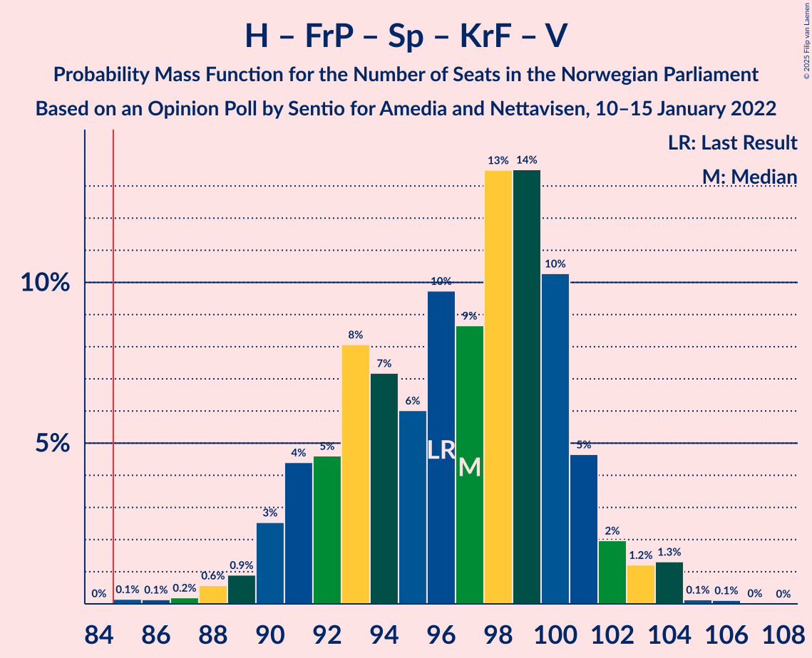

| Number of Seats | Probability | Accumulated | Special Marks |
|:---------------:|:-----------:|:-----------:|:-------------:|
| 84 | 0% | 100% |  |
| 85 | 0.1% | 99.9% | Majority |
| 86 | 0.1% | 99.8% |  |
| 87 | 0.2% | 99.6% |  |
| 88 | 0.6% | 99.4% |  |
| 89 | 0.9% | 98.9% |  |
| 90 | 3% | 98% |  |
| 91 | 4% | 95% |  |
| 92 | 5% | 91% |  |
| 93 | 8% | 86% |  |
| 94 | 7% | 78% |  |
| 95 | 6% | 71% |  |
| 96 | 10% | 65% | Last Result |
| 97 | 9% | 55% |  |
| 98 | 13% | 47% |  |
| 99 | 14% | 33% | Median |
| 100 | 10% | 20% |  |
| 101 | 5% | 9% |  |
| 102 | 2% | 5% |  |
| 103 | 1.2% | 3% |  |
| 104 | 1.3% | 2% |  |
| 105 | 0.1% | 0.3% |  |
| 106 | 0.1% | 0.2% |  |
| 107 | 0% | 0.1% |  |
| 108 | 0% | 0% |  |

### Arbeiderpartiet – Senterpartiet – Sosialistisk Venstreparti – Rødt – Miljøpartiet De Grønne

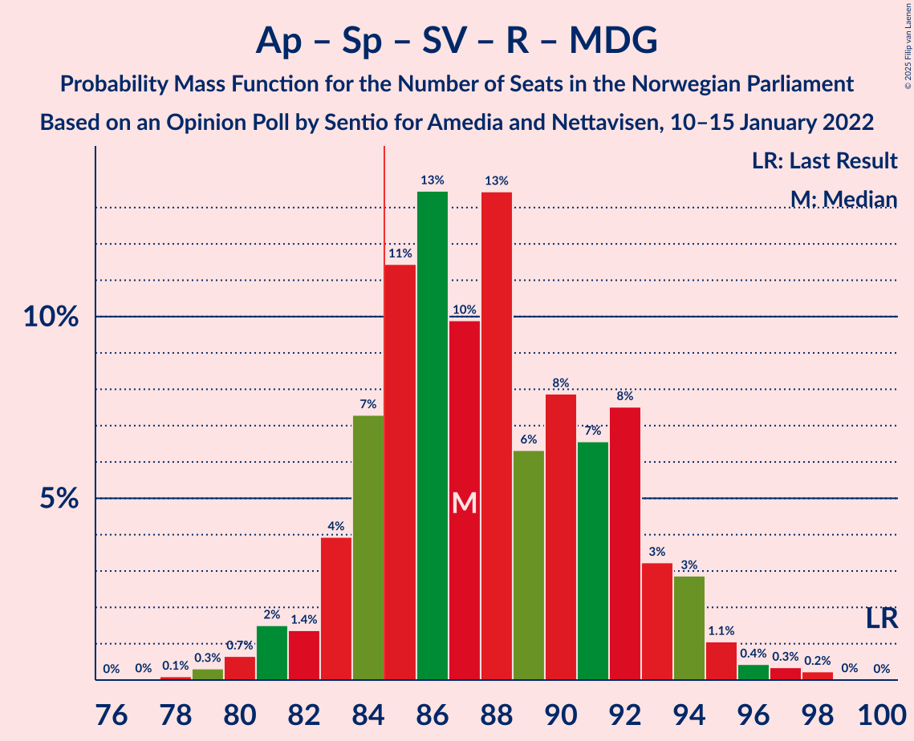

| Number of Seats | Probability | Accumulated | Special Marks |
|:---------------:|:-----------:|:-----------:|:-------------:|
| 78 | 0.1% | 100% |  |
| 79 | 0.3% | 99.9% |  |
| 80 | 0.7% | 99.5% |  |
| 81 | 2% | 98.9% |  |
| 82 | 1.4% | 97% |  |
| 83 | 4% | 96% |  |
| 84 | 7% | 92% |  |
| 85 | 11% | 85% | Majority |
| 86 | 13% | 73% |  |
| 87 | 10% | 60% | Median |
| 88 | 13% | 50% |  |
| 89 | 6% | 37% |  |
| 90 | 8% | 30% |  |
| 91 | 7% | 22% |  |
| 92 | 8% | 16% |  |
| 93 | 3% | 8% |  |
| 94 | 3% | 5% |  |
| 95 | 1.1% | 2% |  |
| 96 | 0.4% | 1.1% |  |
| 97 | 0.3% | 0.6% |  |
| 98 | 0.2% | 0.3% |  |
| 99 | 0% | 0.1% |  |
| 100 | 0% | 0% | Last Result |

### Arbeiderpartiet – Senterpartiet – Sosialistisk Venstreparti – Kristelig Folkeparti – Miljøpartiet De Grønne

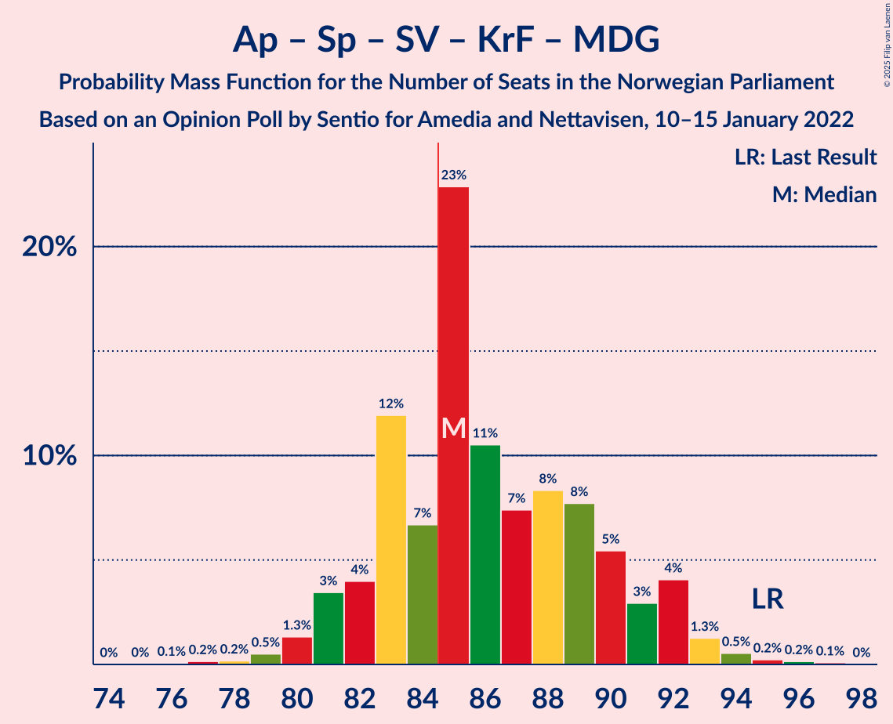

| Number of Seats | Probability | Accumulated | Special Marks |
|:---------------:|:-----------:|:-----------:|:-------------:|
| 75 | 0% | 100% |  |
| 76 | 0.1% | 99.9% |  |
| 77 | 0.2% | 99.9% |  |
| 78 | 0.2% | 99.7% |  |
| 79 | 0.5% | 99.5% |  |
| 80 | 1.3% | 99.0% |  |
| 81 | 3% | 98% |  |
| 82 | 4% | 94% |  |
| 83 | 12% | 90% |  |
| 84 | 7% | 78% |  |
| 85 | 23% | 72% | Majority |
| 86 | 11% | 49% | Median |
| 87 | 7% | 38% |  |
| 88 | 8% | 31% |  |
| 89 | 8% | 22% |  |
| 90 | 5% | 15% |  |
| 91 | 3% | 9% |  |
| 92 | 4% | 6% |  |
| 93 | 1.3% | 2% |  |
| 94 | 0.5% | 1.1% |  |
| 95 | 0.2% | 0.5% | Last Result |
| 96 | 0.2% | 0.3% |  |
| 97 | 0.1% | 0.1% |  |
| 98 | 0% | 0% |  |

### Høyre – Fremskrittspartiet – Kristelig Folkeparti – Venstre – Miljøpartiet De Grønne

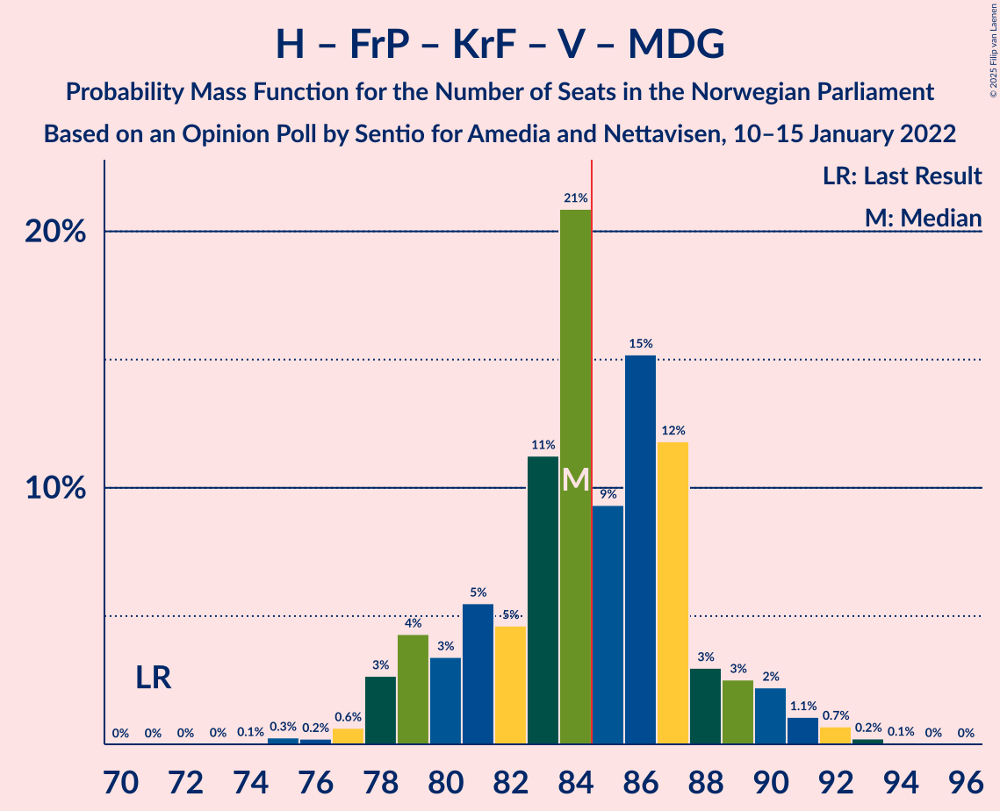

| Number of Seats | Probability | Accumulated | Special Marks |
|:---------------:|:-----------:|:-----------:|:-------------:|
| 71 | 0% | 100% | Last Result |
| 72 | 0% | 100% |  |
| 73 | 0% | 100% |  |
| 74 | 0.1% | 100% |  |
| 75 | 0.3% | 99.9% |  |
| 76 | 0.2% | 99.6% |  |
| 77 | 0.6% | 99.4% |  |
| 78 | 3% | 98.8% |  |
| 79 | 4% | 96% |  |
| 80 | 3% | 92% |  |
| 81 | 5% | 88% |  |
| 82 | 5% | 83% |  |
| 83 | 11% | 78% |  |
| 84 | 21% | 67% |  |
| 85 | 9% | 46% | Median, Majority |
| 86 | 15% | 37% |  |
| 87 | 12% | 22% |  |
| 88 | 3% | 10% |  |
| 89 | 3% | 7% |  |
| 90 | 2% | 4% |  |
| 91 | 1.1% | 2% |  |
| 92 | 0.7% | 1.0% |  |
| 93 | 0.2% | 0.3% |  |
| 94 | 0.1% | 0.1% |  |
| 95 | 0% | 0% |  |

### Arbeiderpartiet – Senterpartiet – Sosialistisk Venstreparti – Rødt

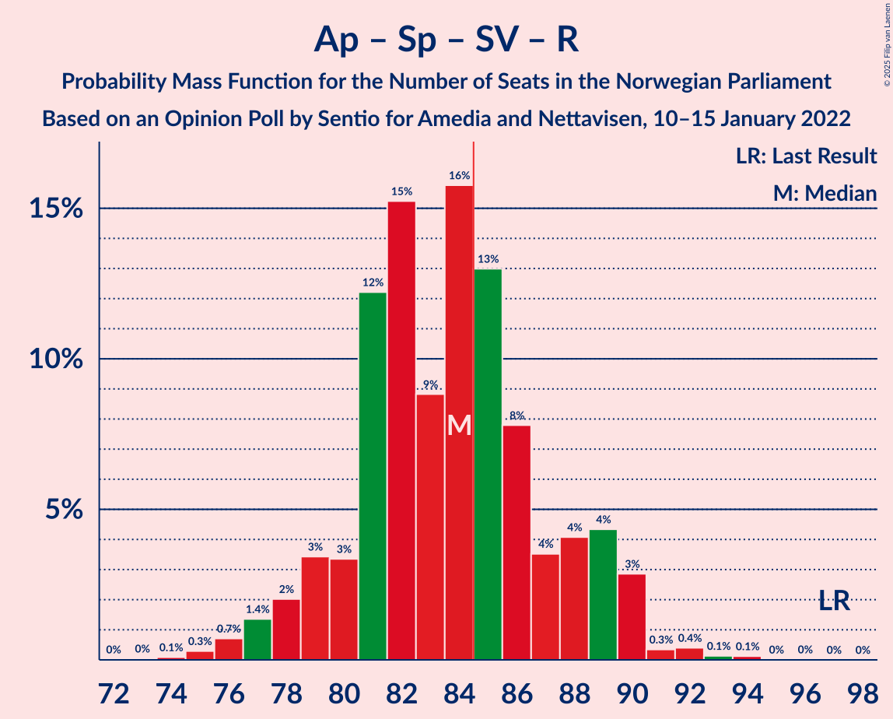

| Number of Seats | Probability | Accumulated | Special Marks |
|:---------------:|:-----------:|:-----------:|:-------------:|
| 73 | 0% | 100% |  |
| 74 | 0.1% | 99.9% |  |
| 75 | 0.3% | 99.8% |  |
| 76 | 0.7% | 99.5% |  |
| 77 | 1.4% | 98.8% |  |
| 78 | 2% | 97% |  |
| 79 | 3% | 95% |  |
| 80 | 3% | 92% |  |
| 81 | 12% | 89% |  |
| 82 | 15% | 76% |  |
| 83 | 9% | 61% |  |
| 84 | 16% | 52% | Median |
| 85 | 13% | 37% | Majority |
| 86 | 8% | 24% |  |
| 87 | 4% | 16% |  |
| 88 | 4% | 12% |  |
| 89 | 4% | 8% |  |
| 90 | 3% | 4% |  |
| 91 | 0.3% | 1.0% |  |
| 92 | 0.4% | 0.7% |  |
| 93 | 0.1% | 0.3% |  |
| 94 | 0.1% | 0.2% |  |
| 95 | 0% | 0% |  |
| 96 | 0% | 0% |  |
| 97 | 0% | 0% | Last Result |

### Høyre – Fremskrittspartiet – Kristelig Folkeparti – Venstre

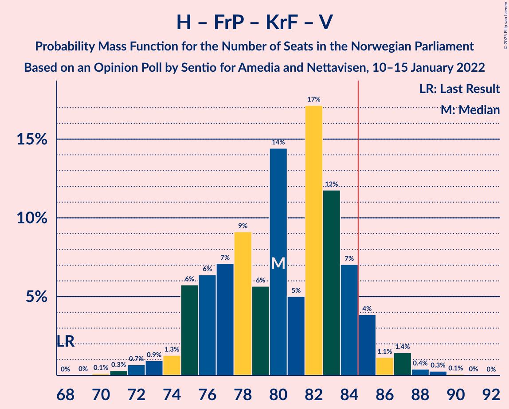

| Number of Seats | Probability | Accumulated | Special Marks |
|:---------------:|:-----------:|:-----------:|:-------------:|
| 68 | 0% | 100% | Last Result |
| 69 | 0% | 100% |  |
| 70 | 0.1% | 99.9% |  |
| 71 | 0.3% | 99.8% |  |
| 72 | 0.7% | 99.5% |  |
| 73 | 0.9% | 98.8% |  |
| 74 | 1.3% | 98% |  |
| 75 | 6% | 97% |  |
| 76 | 6% | 91% |  |
| 77 | 7% | 85% |  |
| 78 | 9% | 77% |  |
| 79 | 6% | 68% |  |
| 80 | 14% | 63% |  |
| 81 | 5% | 48% |  |
| 82 | 17% | 43% | Median |
| 83 | 12% | 26% |  |
| 84 | 7% | 14% |  |
| 85 | 4% | 7% | Majority |
| 86 | 1.1% | 3% |  |
| 87 | 1.4% | 2% |  |
| 88 | 0.4% | 0.8% |  |
| 89 | 0.3% | 0.4% |  |
| 90 | 0.1% | 0.1% |  |
| 91 | 0% | 0% |  |

### Arbeiderpartiet – Senterpartiet – Sosialistisk Venstreparti – Miljøpartiet De Grønne

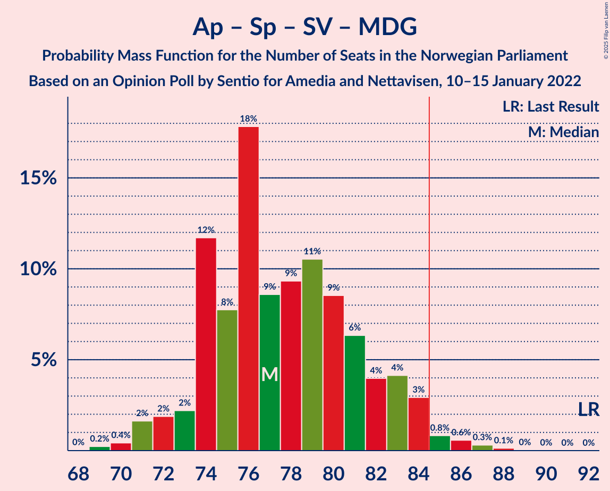

| Number of Seats | Probability | Accumulated | Special Marks |
|:---------------:|:-----------:|:-----------:|:-------------:|
| 68 | 0% | 100% |  |
| 69 | 0.2% | 99.9% |  |
| 70 | 0.4% | 99.7% |  |
| 71 | 2% | 99.3% |  |
| 72 | 2% | 98% |  |
| 73 | 2% | 96% |  |
| 74 | 12% | 94% |  |
| 75 | 8% | 82% |  |
| 76 | 18% | 74% |  |
| 77 | 9% | 56% | Median |
| 78 | 9% | 48% |  |
| 79 | 11% | 38% |  |
| 80 | 9% | 28% |  |
| 81 | 6% | 19% |  |
| 82 | 4% | 13% |  |
| 83 | 4% | 9% |  |
| 84 | 3% | 5% |  |
| 85 | 0.8% | 2% | Majority |
| 86 | 0.6% | 1.1% |  |
| 87 | 0.3% | 0.5% |  |
| 88 | 0.1% | 0.2% |  |
| 89 | 0% | 0.1% |  |
| 90 | 0% | 0% |  |
| 91 | 0% | 0% |  |
| 92 | 0% | 0% | Last Result |

### Arbeiderpartiet – Senterpartiet – Sosialistisk Venstreparti

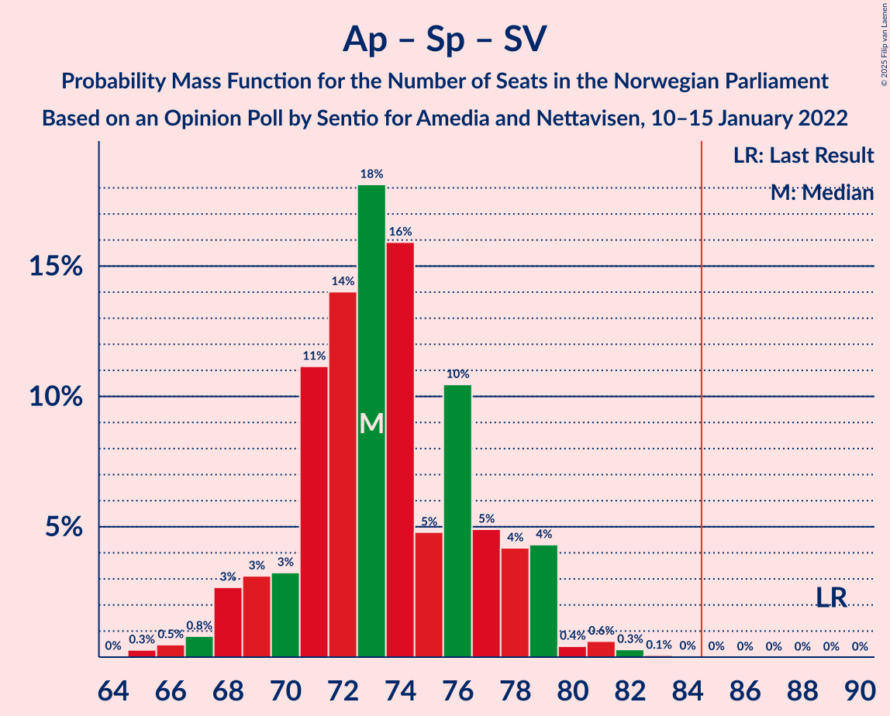

| Number of Seats | Probability | Accumulated | Special Marks |
|:---------------:|:-----------:|:-----------:|:-------------:|
| 64 | 0% | 100% |  |
| 65 | 0.3% | 99.9% |  |
| 66 | 0.5% | 99.7% |  |
| 67 | 0.8% | 99.2% |  |
| 68 | 3% | 98% |  |
| 69 | 3% | 96% |  |
| 70 | 3% | 93% |  |
| 71 | 11% | 89% |  |
| 72 | 14% | 78% |  |
| 73 | 18% | 64% |  |
| 74 | 16% | 46% | Median |
| 75 | 5% | 30% |  |
| 76 | 10% | 25% |  |
| 77 | 5% | 15% |  |
| 78 | 4% | 10% |  |
| 79 | 4% | 6% |  |
| 80 | 0.4% | 1.5% |  |
| 81 | 0.6% | 1.0% |  |
| 82 | 0.3% | 0.4% |  |
| 83 | 0.1% | 0.1% |  |
| 84 | 0% | 0.1% |  |
| 85 | 0% | 0% | Majority |
| 86 | 0% | 0% |  |
| 87 | 0% | 0% |  |
| 88 | 0% | 0% |  |
| 89 | 0% | 0% | Last Result |

### Arbeiderpartiet – Sosialistisk Venstreparti – Rødt – Miljøpartiet De Grønne

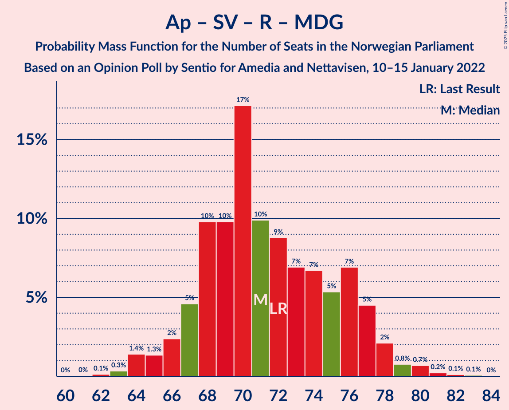

| Number of Seats | Probability | Accumulated | Special Marks |
|:---------------:|:-----------:|:-----------:|:-------------:|
| 61 | 0% | 100% |  |
| 62 | 0.1% | 99.9% |  |
| 63 | 0.3% | 99.8% |  |
| 64 | 1.4% | 99.5% |  |
| 65 | 1.3% | 98% |  |
| 66 | 2% | 97% |  |
| 67 | 5% | 94% |  |
| 68 | 10% | 90% |  |
| 69 | 10% | 80% |  |
| 70 | 17% | 70% | Median |
| 71 | 10% | 53% |  |
| 72 | 9% | 43% | Last Result |
| 73 | 7% | 34% |  |
| 74 | 7% | 27% |  |
| 75 | 5% | 21% |  |
| 76 | 7% | 15% |  |
| 77 | 5% | 8% |  |
| 78 | 2% | 4% |  |
| 79 | 0.8% | 2% |  |
| 80 | 0.7% | 1.1% |  |
| 81 | 0.2% | 0.4% |  |
| 82 | 0.1% | 0.2% |  |
| 83 | 0.1% | 0.1% |  |
| 84 | 0% | 0% |  |

### Høyre – Fremskrittspartiet – Venstre

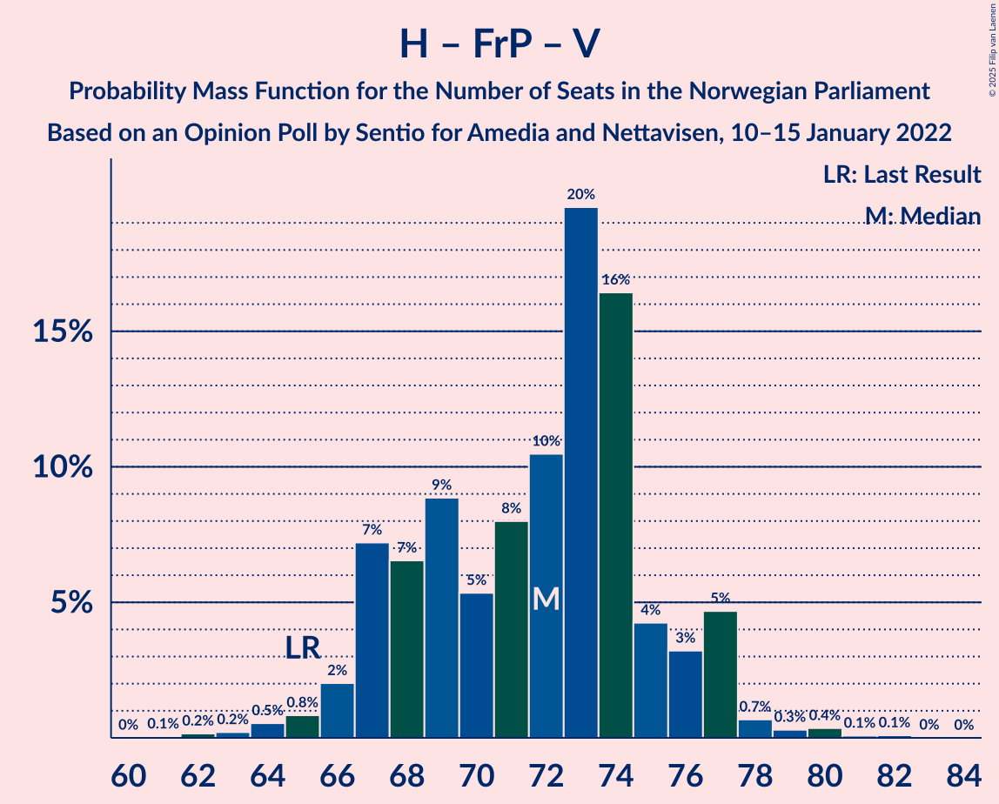

| Number of Seats | Probability | Accumulated | Special Marks |
|:---------------:|:-----------:|:-----------:|:-------------:|
| 61 | 0.1% | 100% |  |
| 62 | 0.2% | 99.9% |  |
| 63 | 0.2% | 99.8% |  |
| 64 | 0.5% | 99.6% |  |
| 65 | 0.8% | 99.0% | Last Result |
| 66 | 2% | 98% |  |
| 67 | 7% | 96% |  |
| 68 | 7% | 89% |  |
| 69 | 9% | 82% |  |
| 70 | 5% | 74% |  |
| 71 | 8% | 68% |  |
| 72 | 10% | 60% |  |
| 73 | 20% | 50% | Median |
| 74 | 16% | 30% |  |
| 75 | 4% | 14% |  |
| 76 | 3% | 9% |  |
| 77 | 5% | 6% |  |
| 78 | 0.7% | 2% |  |
| 79 | 0.3% | 0.9% |  |
| 80 | 0.4% | 0.6% |  |
| 81 | 0.1% | 0.2% |  |
| 82 | 0.1% | 0.1% |  |
| 83 | 0% | 0% |  |

### Arbeiderpartiet – Senterpartiet – Kristelig Folkeparti – Miljøpartiet De Grønne

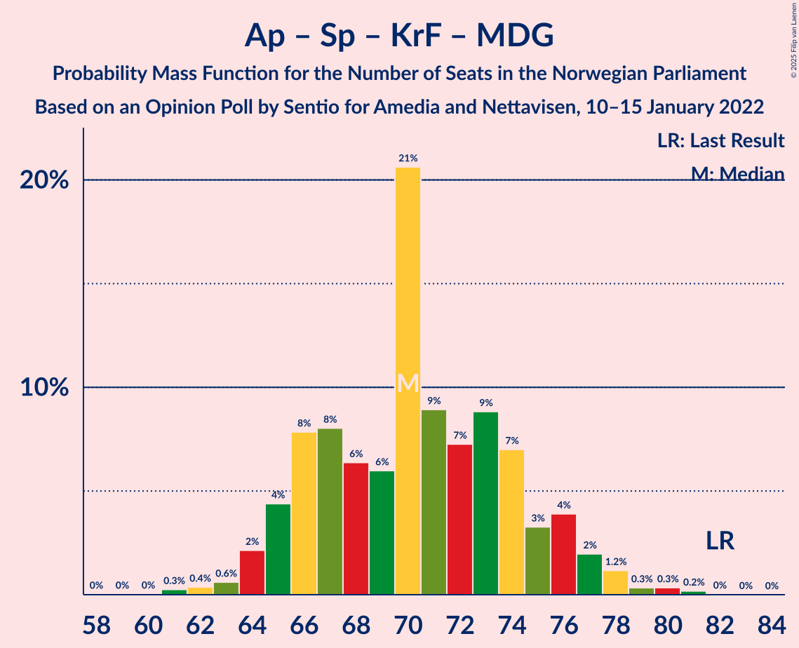

| Number of Seats | Probability | Accumulated | Special Marks |
|:---------------:|:-----------:|:-----------:|:-------------:|
| 58 | 0% | 100% |  |
| 59 | 0% | 99.9% |  |
| 60 | 0% | 99.9% |  |
| 61 | 0.3% | 99.9% |  |
| 62 | 0.4% | 99.6% |  |
| 63 | 0.6% | 99.3% |  |
| 64 | 2% | 98.6% |  |
| 65 | 4% | 97% |  |
| 66 | 8% | 92% |  |
| 67 | 8% | 84% |  |
| 68 | 6% | 76% |  |
| 69 | 6% | 70% |  |
| 70 | 21% | 64% | Median |
| 71 | 9% | 43% |  |
| 72 | 7% | 34% |  |
| 73 | 9% | 27% |  |
| 74 | 7% | 18% |  |
| 75 | 3% | 11% |  |
| 76 | 4% | 8% |  |
| 77 | 2% | 4% |  |
| 78 | 1.2% | 2% |  |
| 79 | 0.3% | 0.9% |  |
| 80 | 0.3% | 0.6% |  |
| 81 | 0.2% | 0.2% |  |
| 82 | 0% | 0.1% | Last Result |
| 83 | 0% | 0% |  |

### Høyre – Fremskrittspartiet

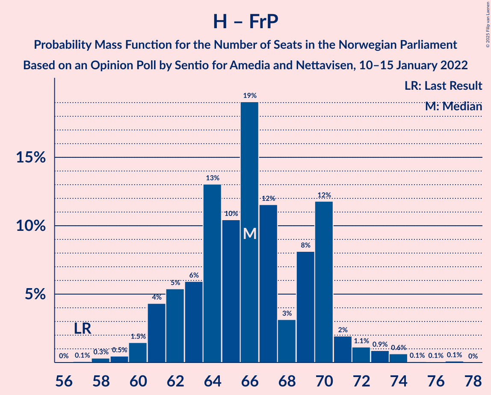

| Number of Seats | Probability | Accumulated | Special Marks |
|:---------------:|:-----------:|:-----------:|:-------------:|
| 57 | 0.1% | 100% | Last Result |
| 58 | 0.3% | 99.9% |  |
| 59 | 0.5% | 99.6% |  |
| 60 | 1.5% | 99.1% |  |
| 61 | 4% | 98% |  |
| 62 | 5% | 93% |  |
| 63 | 6% | 88% |  |
| 64 | 13% | 82% |  |
| 65 | 10% | 69% |  |
| 66 | 19% | 59% | Median |
| 67 | 12% | 39% |  |
| 68 | 3% | 28% |  |
| 69 | 8% | 25% |  |
| 70 | 12% | 17% |  |
| 71 | 2% | 5% |  |
| 72 | 1.1% | 3% |  |
| 73 | 0.9% | 2% |  |
| 74 | 0.6% | 0.9% |  |
| 75 | 0.1% | 0.3% |  |
| 76 | 0.1% | 0.2% |  |
| 77 | 0.1% | 0.1% |  |
| 78 | 0% | 0% |  |

### Arbeiderpartiet – Senterpartiet – Kristelig Folkeparti

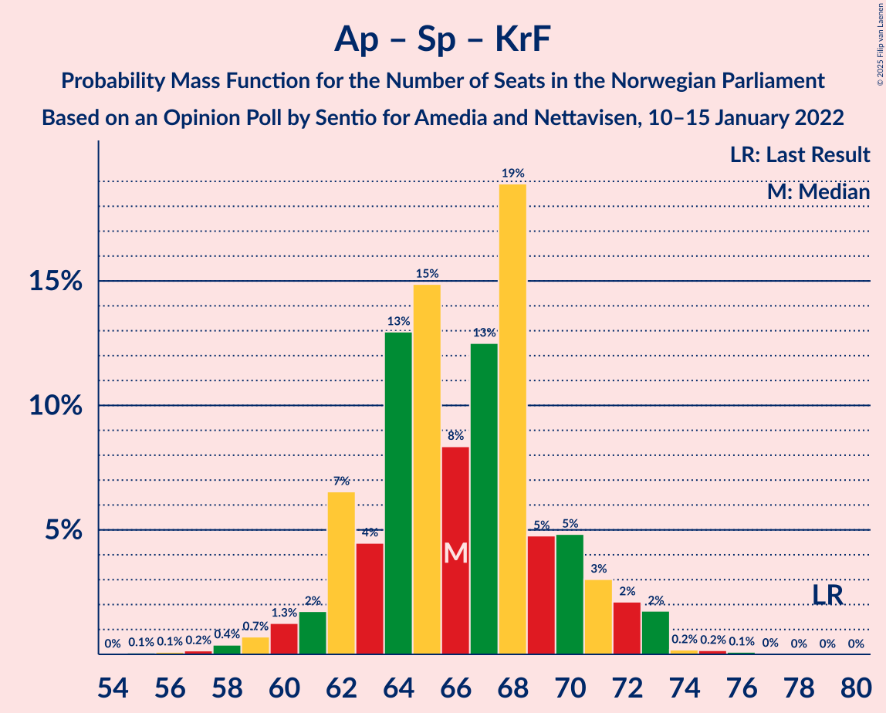

| Number of Seats | Probability | Accumulated | Special Marks |
|:---------------:|:-----------:|:-----------:|:-------------:|
| 55 | 0.1% | 100% |  |
| 56 | 0.1% | 99.9% |  |
| 57 | 0.2% | 99.8% |  |
| 58 | 0.4% | 99.7% |  |
| 59 | 0.7% | 99.3% |  |
| 60 | 1.3% | 98.6% |  |
| 61 | 2% | 97% |  |
| 62 | 7% | 96% |  |
| 63 | 4% | 89% |  |
| 64 | 13% | 85% |  |
| 65 | 15% | 72% |  |
| 66 | 8% | 57% |  |
| 67 | 13% | 48% | Median |
| 68 | 19% | 36% |  |
| 69 | 5% | 17% |  |
| 70 | 5% | 12% |  |
| 71 | 3% | 7% |  |
| 72 | 2% | 4% |  |
| 73 | 2% | 2% |  |
| 74 | 0.2% | 0.5% |  |
| 75 | 0.2% | 0.3% |  |
| 76 | 0.1% | 0.2% |  |
| 77 | 0% | 0.1% |  |
| 78 | 0% | 0% |  |
| 79 | 0% | 0% | Last Result |

### Høyre – Kristelig Folkeparti – Venstre

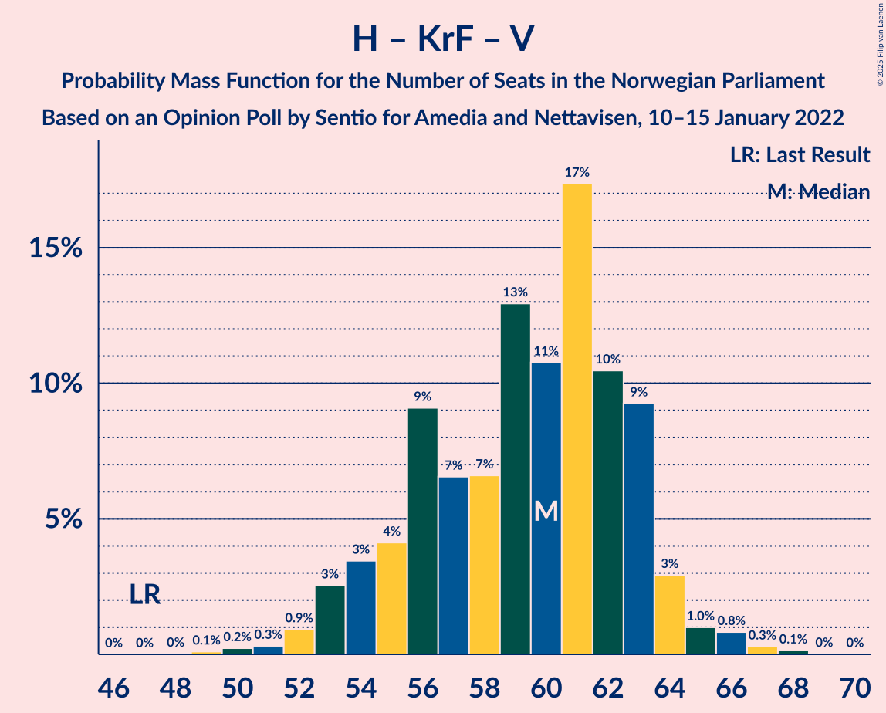

| Number of Seats | Probability | Accumulated | Special Marks |
|:---------------:|:-----------:|:-----------:|:-------------:|
| 47 | 0% | 100% | Last Result |
| 48 | 0% | 100% |  |
| 49 | 0.1% | 100% |  |
| 50 | 0.2% | 99.9% |  |
| 51 | 0.3% | 99.6% |  |
| 52 | 0.9% | 99.3% |  |
| 53 | 3% | 98% |  |
| 54 | 3% | 96% |  |
| 55 | 4% | 92% |  |
| 56 | 9% | 88% |  |
| 57 | 7% | 79% |  |
| 58 | 7% | 73% |  |
| 59 | 13% | 66% |  |
| 60 | 11% | 53% |  |
| 61 | 17% | 42% | Median |
| 62 | 10% | 25% |  |
| 63 | 9% | 14% |  |
| 64 | 3% | 5% |  |
| 65 | 1.0% | 2% |  |
| 66 | 0.8% | 1.3% |  |
| 67 | 0.3% | 0.5% |  |
| 68 | 0.1% | 0.2% |  |
| 69 | 0% | 0% |  |

### Arbeiderpartiet – Senterpartiet

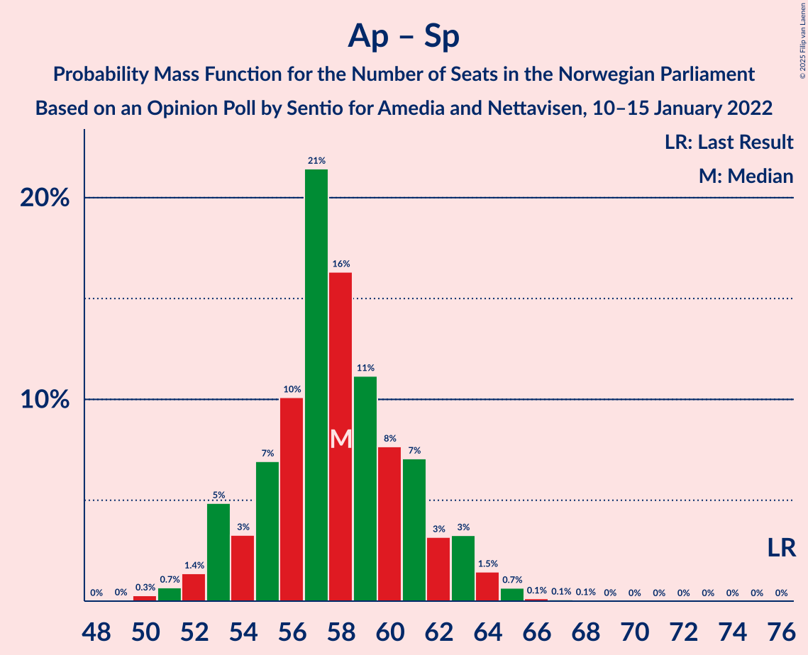

| Number of Seats | Probability | Accumulated | Special Marks |
|:---------------:|:-----------:|:-----------:|:-------------:|
| 49 | 0% | 100% |  |
| 50 | 0.3% | 99.9% |  |
| 51 | 0.7% | 99.7% |  |
| 52 | 1.4% | 99.0% |  |
| 53 | 5% | 98% |  |
| 54 | 3% | 93% |  |
| 55 | 7% | 89% |  |
| 56 | 10% | 83% |  |
| 57 | 21% | 72% |  |
| 58 | 16% | 51% | Median |
| 59 | 11% | 35% |  |
| 60 | 8% | 24% |  |
| 61 | 7% | 16% |  |
| 62 | 3% | 9% |  |
| 63 | 3% | 6% |  |
| 64 | 1.5% | 2% |  |
| 65 | 0.7% | 0.9% |  |
| 66 | 0.1% | 0.3% |  |
| 67 | 0.1% | 0.1% |  |
| 68 | 0.1% | 0.1% |  |
| 69 | 0% | 0% |  |
| 70 | 0% | 0% |  |
| 71 | 0% | 0% |  |
| 72 | 0% | 0% |  |
| 73 | 0% | 0% |  |
| 74 | 0% | 0% |  |
| 75 | 0% | 0% |  |
| 76 | 0% | 0% | Last Result |

### Arbeiderpartiet – Sosialistisk Venstreparti

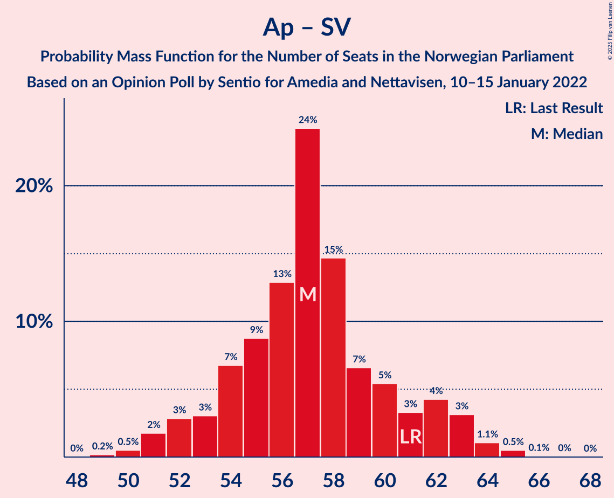

| Number of Seats | Probability | Accumulated | Special Marks |
|:---------------:|:-----------:|:-----------:|:-------------:|
| 49 | 0.2% | 100% |  |
| 50 | 0.5% | 99.8% |  |
| 51 | 2% | 99.3% |  |
| 52 | 3% | 98% |  |
| 53 | 3% | 95% |  |
| 54 | 7% | 92% |  |
| 55 | 9% | 85% |  |
| 56 | 13% | 76% |  |
| 57 | 24% | 63% | Median |
| 58 | 15% | 39% |  |
| 59 | 7% | 24% |  |
| 60 | 5% | 18% |  |
| 61 | 3% | 12% | Last Result |
| 62 | 4% | 9% |  |
| 63 | 3% | 5% |  |
| 64 | 1.1% | 2% |  |
| 65 | 0.5% | 0.6% |  |
| 66 | 0.1% | 0.1% |  |
| 67 | 0% | 0.1% |  |
| 68 | 0% | 0% |  |

### Senterpartiet – Kristelig Folkeparti – Venstre

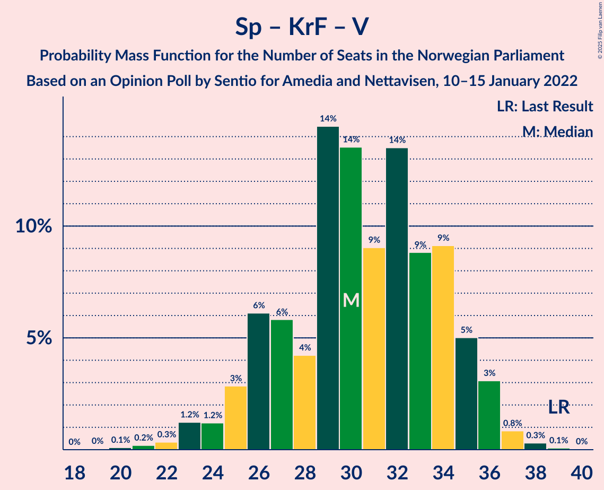

| Number of Seats | Probability | Accumulated | Special Marks |
|:---------------:|:-----------:|:-----------:|:-------------:|
| 19 | 0% | 100% |  |
| 20 | 0.1% | 99.9% |  |
| 21 | 0.2% | 99.8% |  |
| 22 | 0.3% | 99.6% |  |
| 23 | 1.2% | 99.3% |  |
| 24 | 1.2% | 98% |  |
| 25 | 3% | 97% |  |
| 26 | 6% | 94% |  |
| 27 | 6% | 88% |  |
| 28 | 4% | 82% |  |
| 29 | 14% | 78% |  |
| 30 | 14% | 63% |  |
| 31 | 9% | 50% |  |
| 32 | 14% | 41% |  |
| 33 | 9% | 27% | Median |
| 34 | 9% | 18% |  |
| 35 | 5% | 9% |  |
| 36 | 3% | 4% |  |
| 37 | 0.8% | 1.3% |  |
| 38 | 0.3% | 0.4% |  |
| 39 | 0.1% | 0.1% | Last Result |
| 40 | 0% | 0% |  |

## Technical Information

### Opinion Poll

+ **Polling firm:** Sentio
+ **Commissioner(s):** Amedia and Nettavisen
+ **Fieldwork period:** 10–15 January 2022

### Calculations

+ **Sample size:** 1000
+ **Simulations done:** 1,048,576
+ **Error estimate:** 1.28%

