# Opinion Poll by Norstat for Vårt Land, 18–24 January 2022

<a href="#voting-intentions">Voting Intentions</a> | <a href="#seats">Seats</a> | <a href="#coalitions">Coalitions</a> | <a href="#technical-information">Technical Information</a>

## Voting Intentions

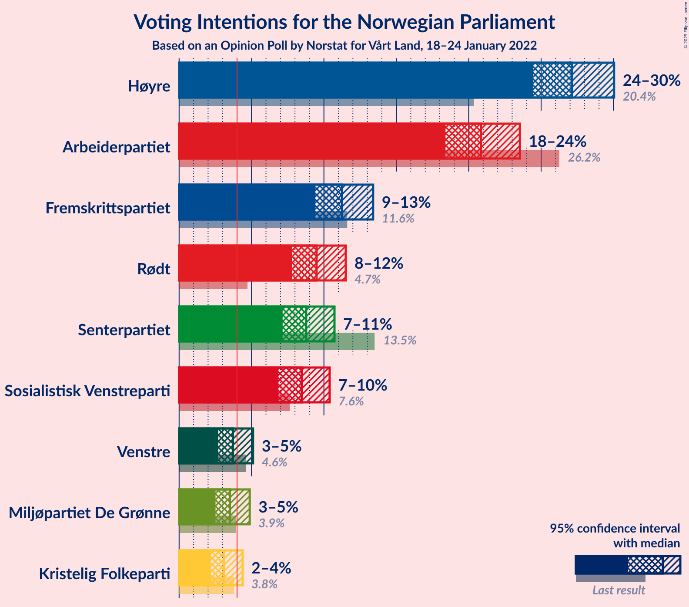

### Confidence Intervals

| Party | Last Result | Poll Result | 80% Confidence Interval | 90% Confidence Interval | 95% Confidence Interval | 99% Confidence Interval |
|:-----:|:-----------:|:-----------:|:-----------------------:|:-----------------------:|:-----------------------:|:-----------------------:|
| Høyre | 20.4% | 27.1% | 25.4–29.0% |24.9–29.6% |24.4–30.0% |23.6–31.0% |
| Arbeiderpartiet | 26.2% | 20.8% | 19.2–22.6% |18.8–23.1% |18.4–23.5% |17.6–24.4% |
| Fremskrittspartiet | 11.6% | 11.2% | 10.0–12.7% |9.7–13.0% |9.4–13.4% |8.9–14.1% |
| Rødt | 4.7% | 9.5% | 8.4–10.8% |8.1–11.2% |7.8–11.5% |7.3–12.2% |
| Senterpartiet | 13.5% | 8.8% | 7.7–10.0% |7.4–10.4% |7.1–10.7% |6.7–11.4% |
| Sosialistisk Venstreparti | 7.6% | 8.5% | 7.4–9.7% |7.1–10.1% |6.9–10.4% |6.4–11.0% |
| Venstre | 4.6% | 3.7% | 3.0–4.6% |2.9–4.9% |2.7–5.1% |2.4–5.6% |
| Miljøpartiet De Grønne | 3.9% | 3.5% | 2.9–4.4% |2.7–4.6% |2.5–4.9% |2.2–5.3% |
| Kristelig Folkeparti | 3.8% | 3.1% | 2.5–3.9% |2.3–4.2% |2.2–4.4% |1.9–4.8% |

*Note:* The poll result column reflects the actual value used in the calculations. Published results may vary slightly, and in addition be rounded to fewer digits.

## Seats

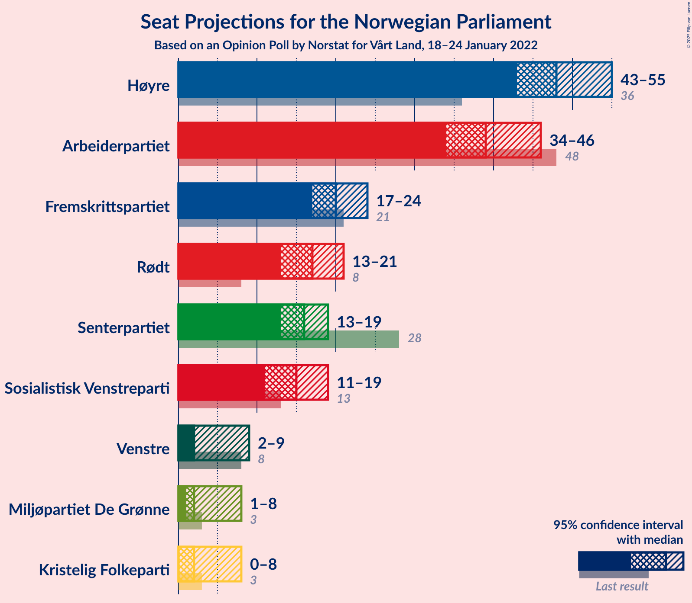

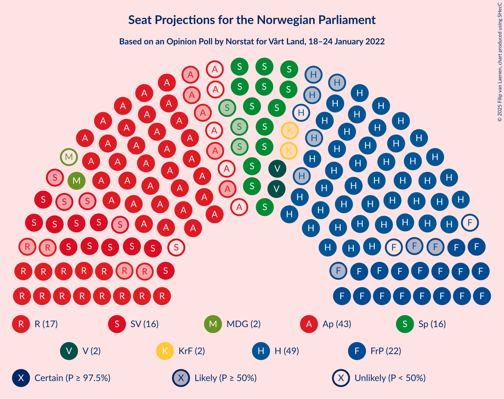

### Confidence Intervals

| Party | Last Result | Median | 80% Confidence Interval | 90% Confidence Interval | 95% Confidence Interval | 99% Confidence Interval |
|:-----:|:-----------:|:------:|:-----------------------:|:-----------------------:|:-----------------------:|:-----------------------:|
| <a href="#høyre">Høyre</a> | 36 | 48 | 44–52 |44–54 |43–55 |41–57 |
| <a href="#arbeiderpartiet">Arbeiderpartiet</a> | 48 | 39 | 36–44 |35–45 |34–46 |32–47 |
| <a href="#fremskrittspartiet">Fremskrittspartiet</a> | 21 | 20 | 18–23 |17–23 |17–24 |15–26 |
| <a href="#rødt">Rødt</a> | 8 | 17 | 14–19 |14–20 |13–21 |12–22 |
| <a href="#senterpartiet">Senterpartiet</a> | 28 | 16 | 14–18 |13–19 |13–19 |12–20 |
| <a href="#sosialistisk-venstreparti">Sosialistisk Venstreparti</a> | 13 | 15 | 13–17 |12–18 |11–19 |10–20 |
| <a href="#venstre">Venstre</a> | 8 | 2 | 2–8 |2–9 |2–9 |1–10 |
| <a href="#miljøpartiet-de-grønne">Miljøpartiet De Grønne</a> | 3 | 2 | 1–8 |1–8 |1–8 |1–9 |
| <a href="#kristelig-folkeparti">Kristelig Folkeparti</a> | 3 | 2 | 2–3 |1–7 |0–8 |0–8 |

### Høyre

*For a full overview of the results for this party, see the [Høyre](party-høyre.html) page.*

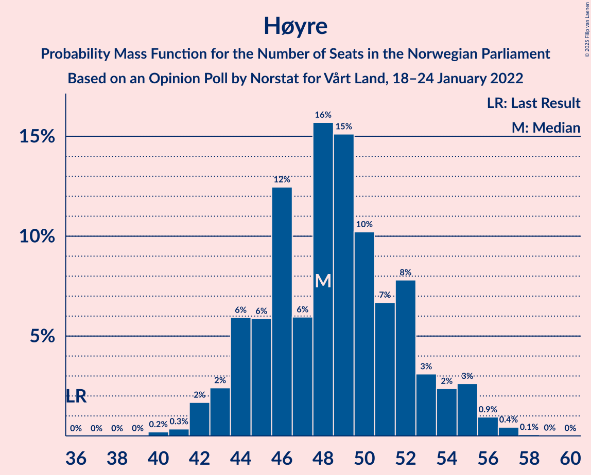

| Number of Seats | Probability | Accumulated | Special Marks |
|:---------------:|:-----------:|:-----------:|:-------------:|
| 36 | 0% | 100% | Last Result |
| 37 | 0% | 100% |  |
| 38 | 0% | 100% |  |
| 39 | 0% | 100% |  |
| 40 | 0.2% | 100% |  |
| 41 | 0.3% | 99.8% |  |
| 42 | 2% | 99.4% |  |
| 43 | 2% | 98% |  |
| 44 | 6% | 95% |  |
| 45 | 6% | 89% |  |
| 46 | 12% | 84% |  |
| 47 | 6% | 71% |  |
| 48 | 16% | 65% | Median |
| 49 | 15% | 49% |  |
| 50 | 10% | 34% |  |
| 51 | 7% | 24% |  |
| 52 | 8% | 17% |  |
| 53 | 3% | 10% |  |
| 54 | 2% | 7% |  |
| 55 | 3% | 4% |  |
| 56 | 0.9% | 2% |  |
| 57 | 0.4% | 0.6% |  |
| 58 | 0.1% | 0.1% |  |
| 59 | 0% | 0.1% |  |
| 60 | 0% | 0% |  |

### Arbeiderpartiet

*For a full overview of the results for this party, see the [Arbeiderpartiet](party-arbeiderpartiet.html) page.*

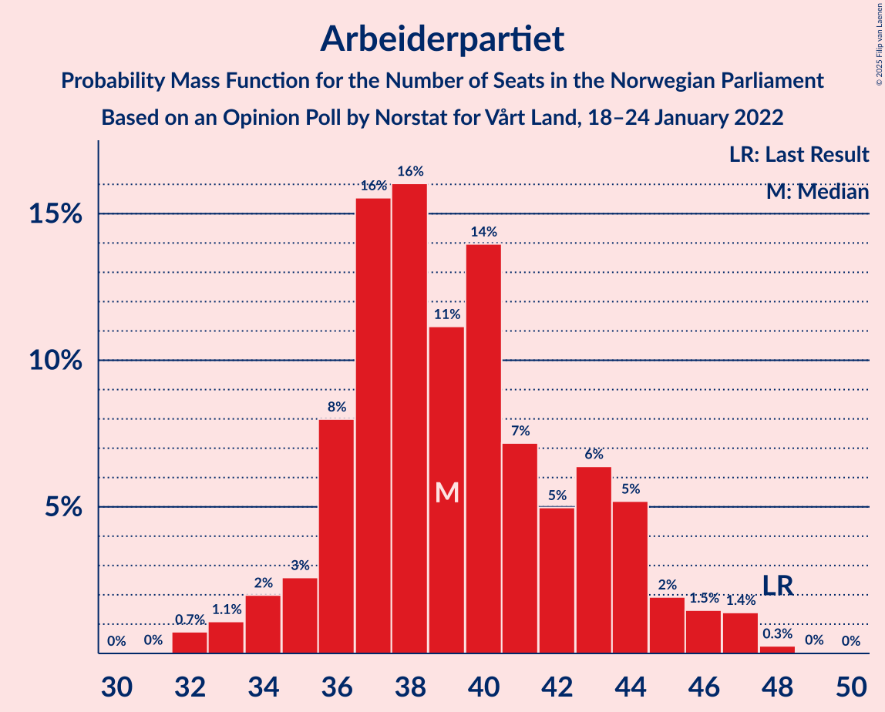

| Number of Seats | Probability | Accumulated | Special Marks |
|:---------------:|:-----------:|:-----------:|:-------------:|
| 32 | 0.7% | 100% |  |
| 33 | 1.1% | 99.2% |  |
| 34 | 2% | 98% |  |
| 35 | 3% | 96% |  |
| 36 | 8% | 94% |  |
| 37 | 16% | 86% |  |
| 38 | 16% | 70% |  |
| 39 | 11% | 54% | Median |
| 40 | 14% | 43% |  |
| 41 | 7% | 29% |  |
| 42 | 5% | 22% |  |
| 43 | 6% | 17% |  |
| 44 | 5% | 10% |  |
| 45 | 2% | 5% |  |
| 46 | 1.5% | 3% |  |
| 47 | 1.4% | 2% |  |
| 48 | 0.3% | 0.3% | Last Result |
| 49 | 0% | 0.1% |  |
| 50 | 0% | 0% |  |

### Fremskrittspartiet

*For a full overview of the results for this party, see the [Fremskrittspartiet](party-fremskrittspartiet.html) page.*

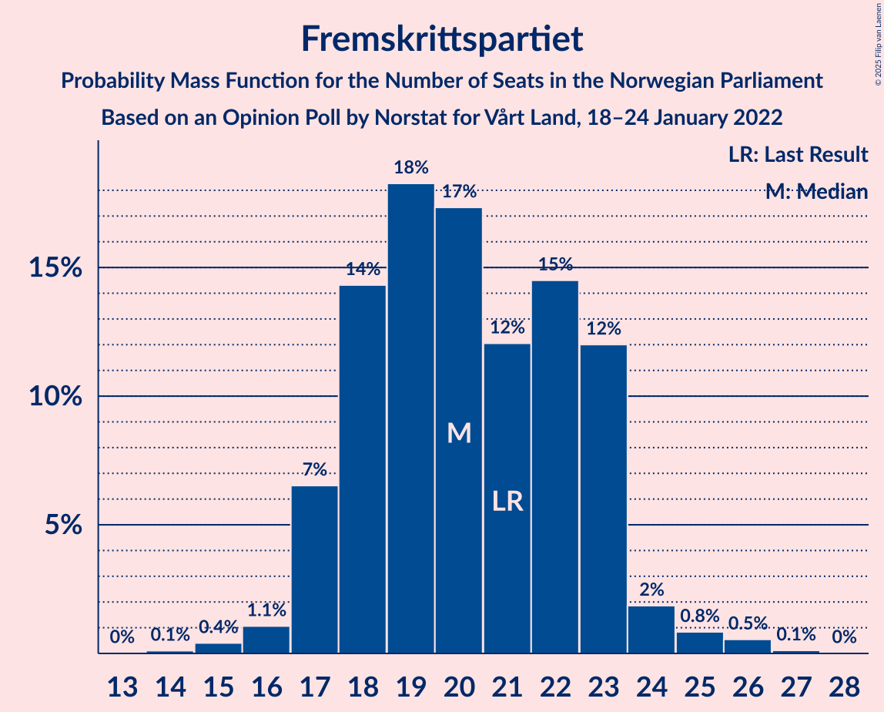

| Number of Seats | Probability | Accumulated | Special Marks |
|:---------------:|:-----------:|:-----------:|:-------------:|
| 14 | 0.1% | 100% |  |
| 15 | 0.4% | 99.9% |  |
| 16 | 1.1% | 99.5% |  |
| 17 | 7% | 98% |  |
| 18 | 14% | 92% |  |
| 19 | 18% | 78% |  |
| 20 | 17% | 59% | Median |
| 21 | 12% | 42% | Last Result |
| 22 | 15% | 30% |  |
| 23 | 12% | 15% |  |
| 24 | 2% | 3% |  |
| 25 | 0.8% | 2% |  |
| 26 | 0.5% | 0.7% |  |
| 27 | 0.1% | 0.1% |  |
| 28 | 0% | 0% |  |

### Rødt

*For a full overview of the results for this party, see the [Rødt](party-rødt.html) page.*

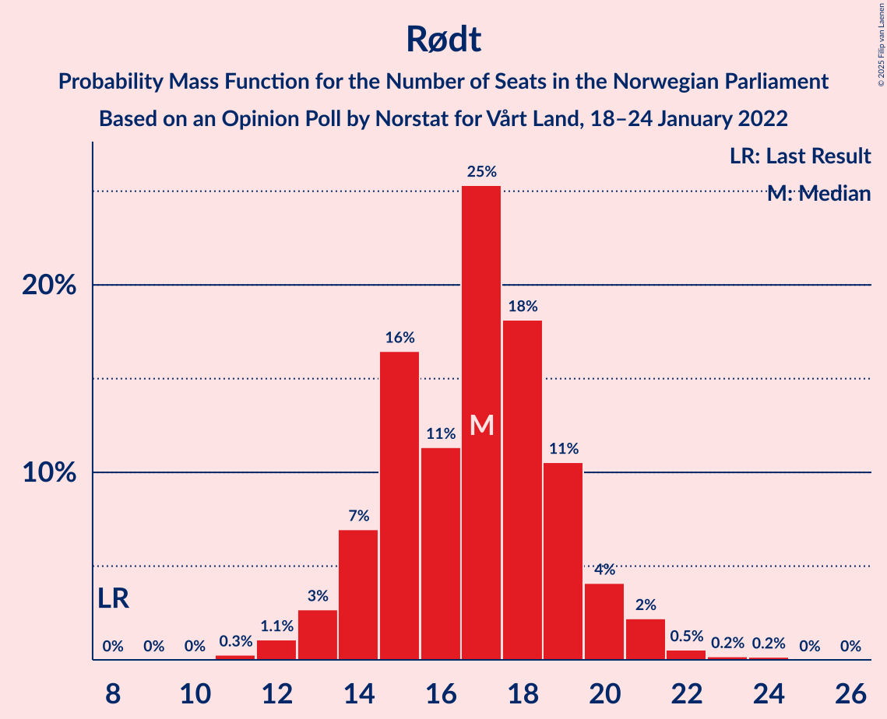

| Number of Seats | Probability | Accumulated | Special Marks |
|:---------------:|:-----------:|:-----------:|:-------------:|
| 8 | 0% | 100% | Last Result |
| 9 | 0% | 100% |  |
| 10 | 0% | 100% |  |
| 11 | 0.3% | 100% |  |
| 12 | 1.1% | 99.7% |  |
| 13 | 3% | 98.6% |  |
| 14 | 7% | 96% |  |
| 15 | 16% | 89% |  |
| 16 | 11% | 73% |  |
| 17 | 25% | 61% | Median |
| 18 | 18% | 36% |  |
| 19 | 11% | 18% |  |
| 20 | 4% | 7% |  |
| 21 | 2% | 3% |  |
| 22 | 0.5% | 0.9% |  |
| 23 | 0.2% | 0.3% |  |
| 24 | 0.2% | 0.2% |  |
| 25 | 0% | 0% |  |

### Senterpartiet

*For a full overview of the results for this party, see the [Senterpartiet](party-senterpartiet.html) page.*

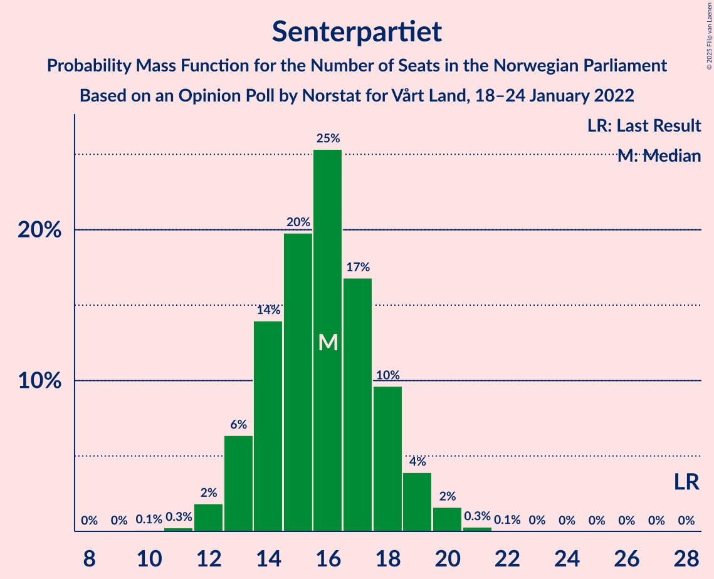

| Number of Seats | Probability | Accumulated | Special Marks |
|:---------------:|:-----------:|:-----------:|:-------------:|
| 10 | 0.1% | 100% |  |
| 11 | 0.3% | 99.9% |  |
| 12 | 2% | 99.7% |  |
| 13 | 6% | 98% |  |
| 14 | 14% | 91% |  |
| 15 | 20% | 77% |  |
| 16 | 25% | 58% | Median |
| 17 | 17% | 32% |  |
| 18 | 10% | 16% |  |
| 19 | 4% | 6% |  |
| 20 | 2% | 2% |  |
| 21 | 0.3% | 0.4% |  |
| 22 | 0.1% | 0.1% |  |
| 23 | 0% | 0% |  |
| 24 | 0% | 0% |  |
| 25 | 0% | 0% |  |
| 26 | 0% | 0% |  |
| 27 | 0% | 0% |  |
| 28 | 0% | 0% | Last Result |

### Sosialistisk Venstreparti

*For a full overview of the results for this party, see the [Sosialistisk Venstreparti](party-sosialistiskvenstreparti.html) page.*

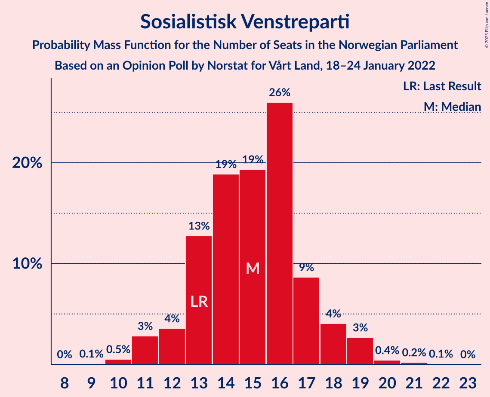

| Number of Seats | Probability | Accumulated | Special Marks |
|:---------------:|:-----------:|:-----------:|:-------------:|
| 9 | 0.1% | 100% |  |
| 10 | 0.5% | 99.9% |  |
| 11 | 3% | 99.4% |  |
| 12 | 4% | 97% |  |
| 13 | 13% | 93% | Last Result |
| 14 | 19% | 80% |  |
| 15 | 19% | 61% | Median |
| 16 | 26% | 42% |  |
| 17 | 9% | 16% |  |
| 18 | 4% | 7% |  |
| 19 | 3% | 3% |  |
| 20 | 0.4% | 0.7% |  |
| 21 | 0.2% | 0.3% |  |
| 22 | 0.1% | 0.1% |  |
| 23 | 0% | 0% |  |

### Venstre

*For a full overview of the results for this party, see the [Venstre](party-venstre.html) page.*

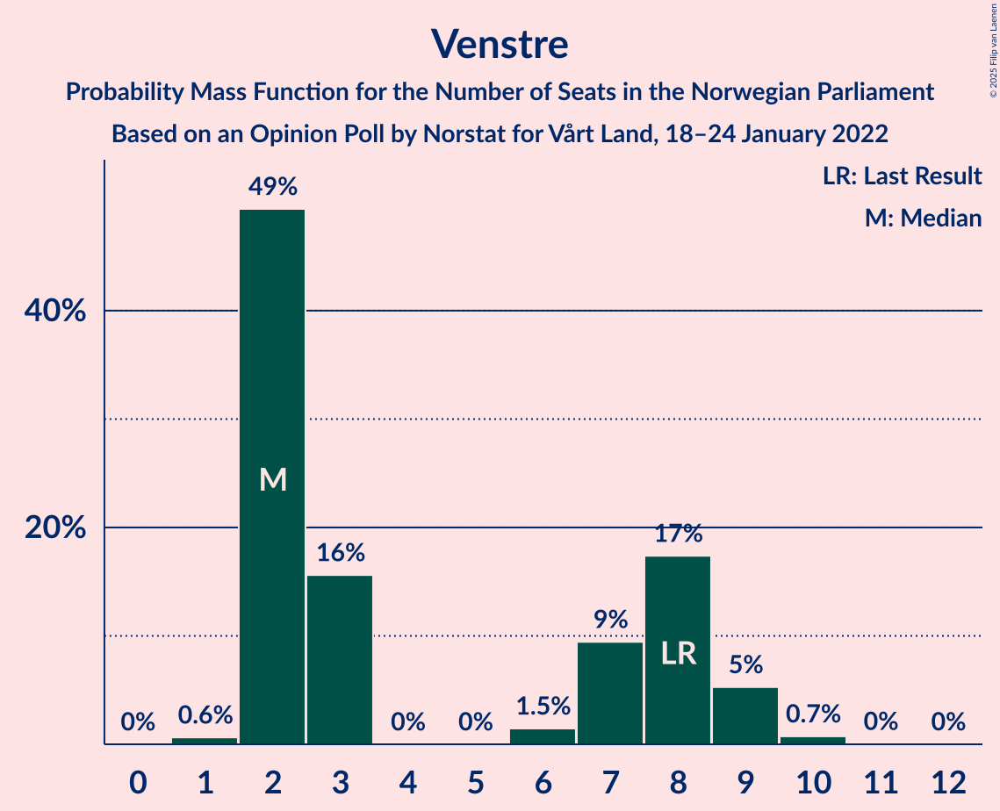

| Number of Seats | Probability | Accumulated | Special Marks |
|:---------------:|:-----------:|:-----------:|:-------------:|
| 1 | 0.6% | 100% |  |
| 2 | 49% | 99.4% | Median |
| 3 | 16% | 50% |  |
| 4 | 0% | 34% |  |
| 5 | 0% | 34% |  |
| 6 | 1.5% | 34% |  |
| 7 | 9% | 33% |  |
| 8 | 17% | 23% | Last Result |
| 9 | 5% | 6% |  |
| 10 | 0.7% | 0.8% |  |
| 11 | 0% | 0.1% |  |
| 12 | 0% | 0% |  |

### Miljøpartiet De Grønne

*For a full overview of the results for this party, see the [Miljøpartiet De Grønne](party-miljøpartietdegrønne.html) page.*

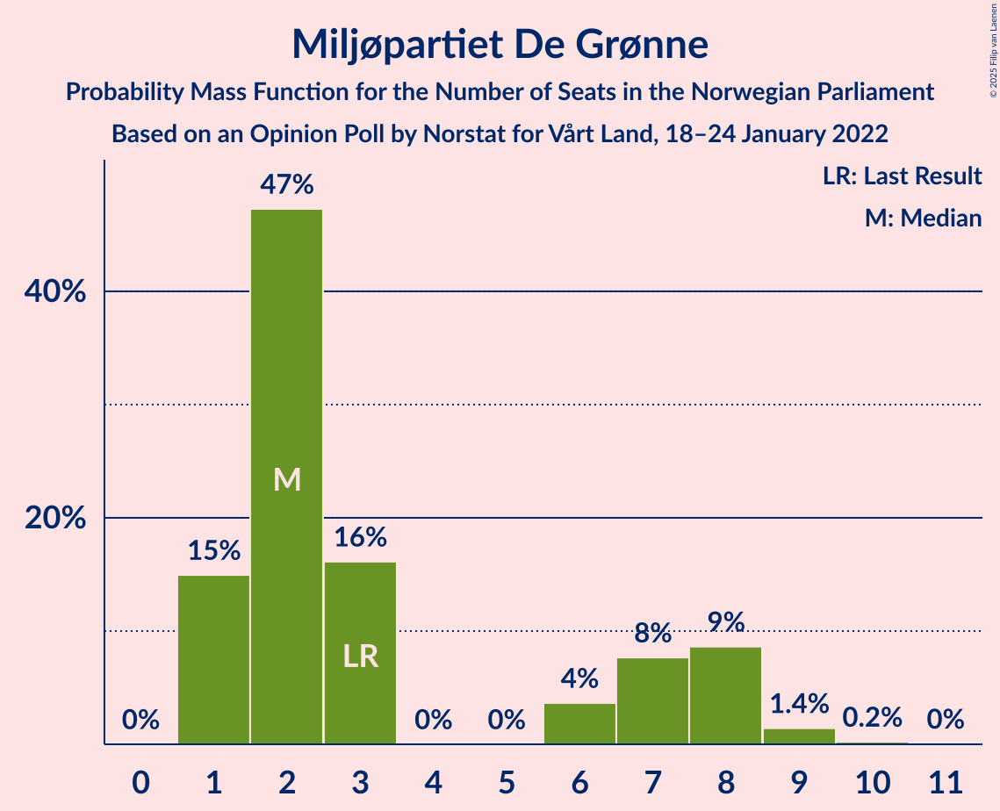

| Number of Seats | Probability | Accumulated | Special Marks |
|:---------------:|:-----------:|:-----------:|:-------------:|
| 1 | 15% | 100% |  |
| 2 | 47% | 85% | Median |
| 3 | 16% | 38% | Last Result |
| 4 | 0% | 22% |  |
| 5 | 0% | 22% |  |
| 6 | 4% | 22% |  |
| 7 | 8% | 18% |  |
| 8 | 9% | 10% |  |
| 9 | 1.4% | 2% |  |
| 10 | 0.2% | 0.3% |  |
| 11 | 0% | 0% |  |

### Kristelig Folkeparti

*For a full overview of the results for this party, see the [Kristelig Folkeparti](party-kristeligfolkeparti.html) page.*

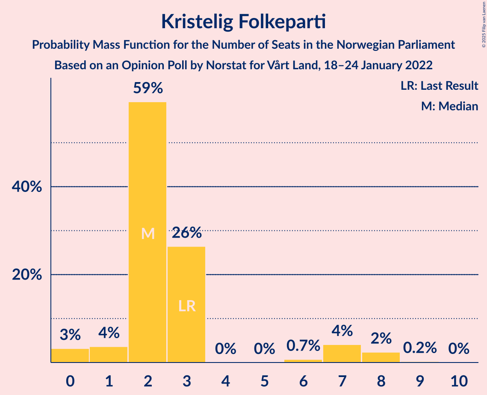

| Number of Seats | Probability | Accumulated | Special Marks |
|:---------------:|:-----------:|:-----------:|:-------------:|
| 0 | 3% | 100% |  |
| 1 | 4% | 97% |  |
| 2 | 59% | 93% | Median |
| 3 | 26% | 34% | Last Result |
| 4 | 0% | 7% |  |
| 5 | 0% | 7% |  |
| 6 | 0.7% | 7% |  |
| 7 | 4% | 7% |  |
| 8 | 2% | 3% |  |
| 9 | 0.2% | 0.3% |  |
| 10 | 0% | 0% |  |

## Coalitions

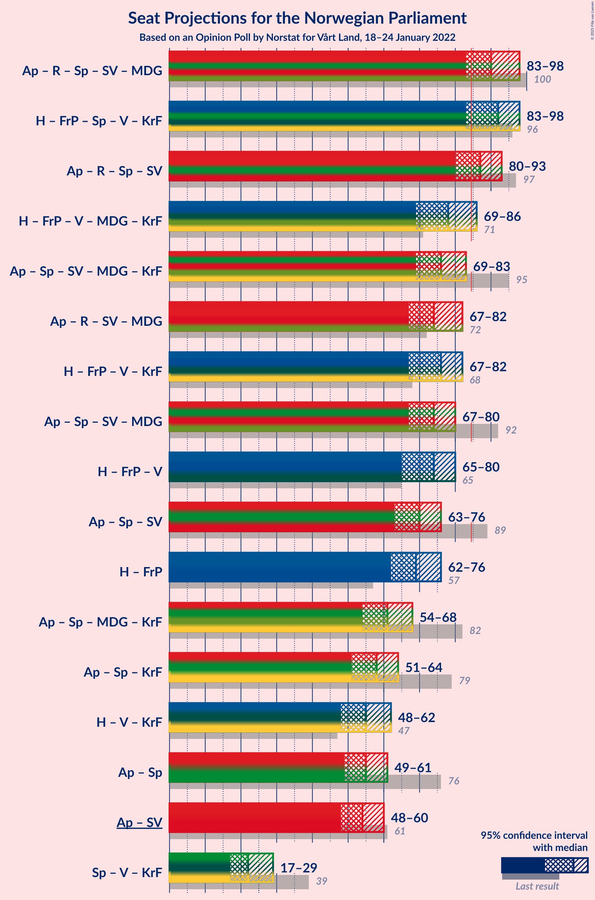

### Confidence Intervals

| Coalition | Last Result | Median | Majority? | 80% Confidence Interval | 90% Confidence Interval | 95% Confidence Interval | 99% Confidence Interval |
|:---------:|:-----------:|:------:|:---------:|:-----------------------:|:-----------------------:|:-----------------------:|:-----------------------:|
| Arbeiderpartiet – Rødt – Senterpartiet – Sosialistisk Venstreparti – Miljøpartiet De Grønne | 100 | 90 | 94% | 86–94 | 84–96 | 83–98 | 81–100 |
| Høyre – Fremskrittspartiet – Senterpartiet – Venstre – Kristelig Folkeparti | 96 | 92 | 93% | 86–96 | 84–98 | 83–98 | 81–101 |
| Arbeiderpartiet – Rødt – Senterpartiet – Sosialistisk Venstreparti | 97 | 87 | 75% | 82–91 | 81–92 | 80–93 | 77–96 |
| Høyre – Fremskrittspartiet – Venstre – Miljøpartiet De Grønne – Kristelig Folkeparti | 71 | 78 | 6% | 73–84 | 71–85 | 69–86 | 68–89 |
| Arbeiderpartiet – Senterpartiet – Sosialistisk Venstreparti – Miljøpartiet De Grønne – Kristelig Folkeparti | 95 | 76 | 1.2% | 71–80 | 70–82 | 69–83 | 67–85 |
| Arbeiderpartiet – Rødt – Sosialistisk Venstreparti – Miljøpartiet De Grønne | 72 | 74 | 0.3% | 70–79 | 68–80 | 67–82 | 65–84 |
| Høyre – Fremskrittspartiet – Venstre – Kristelig Folkeparti | 68 | 76 | 0.9% | 70–81 | 68–81 | 67–82 | 65–85 |
| Arbeiderpartiet – Senterpartiet – Sosialistisk Venstreparti – Miljøpartiet De Grønne | 92 | 74 | 0% | 69–78 | 68–79 | 67–80 | 64–82 |
| Høyre – Fremskrittspartiet – Venstre | 65 | 74 | 0.1% | 68–78 | 65–79 | 65–80 | 63–82 |
| Arbeiderpartiet – Senterpartiet – Sosialistisk Venstreparti | 89 | 70 | 0% | 66–74 | 65–75 | 63–76 | 61–79 |
| Høyre – Fremskrittspartiet | 57 | 69 | 0% | 63–73 | 63–75 | 62–76 | 60–77 |
| Arbeiderpartiet – Senterpartiet – Miljøpartiet De Grønne – Kristelig Folkeparti | 82 | 61 | 0% | 57–66 | 55–67 | 54–68 | 52–71 |
| Arbeiderpartiet – Senterpartiet – Kristelig Folkeparti | 79 | 58 | 0% | 54–62 | 52–63 | 51–64 | 50–67 |
| Høyre – Venstre – Kristelig Folkeparti | 47 | 55 | 0% | 51–59 | 49–61 | 48–62 | 46–64 |
| Arbeiderpartiet – Senterpartiet | 76 | 55 | 0% | 51–59 | 50–60 | 49–61 | 48–63 |
| Arbeiderpartiet – Sosialistisk Venstreparti | 61 | 54 | 0% | 50–58 | 49–60 | 48–60 | 47–62 |
| Senterpartiet – Venstre – Kristelig Folkeparti | 39 | 22 | 0% | 19–27 | 18–28 | 17–29 | 16–31 |

### Arbeiderpartiet – Rødt – Senterpartiet – Sosialistisk Venstreparti – Miljøpartiet De Grønne

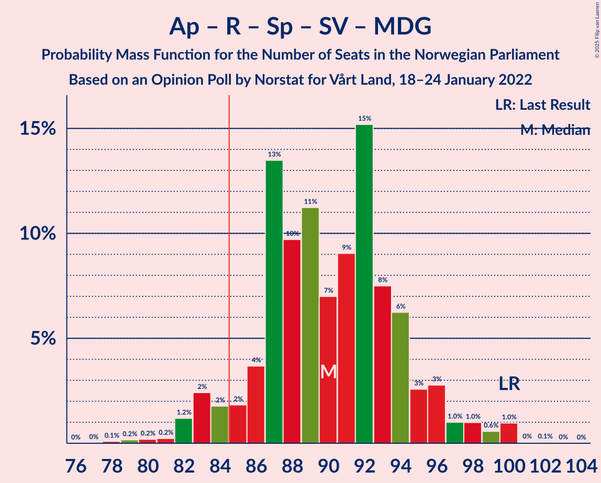

| Number of Seats | Probability | Accumulated | Special Marks |
|:---------------:|:-----------:|:-----------:|:-------------:|
| 78 | 0.1% | 100% |  |
| 79 | 0.2% | 99.9% |  |
| 80 | 0.2% | 99.7% |  |
| 81 | 0.2% | 99.5% |  |
| 82 | 1.2% | 99.3% |  |
| 83 | 2% | 98% |  |
| 84 | 2% | 96% |  |
| 85 | 2% | 94% | Majority |
| 86 | 4% | 92% |  |
| 87 | 13% | 88% |  |
| 88 | 10% | 75% |  |
| 89 | 11% | 65% | Median |
| 90 | 7% | 54% |  |
| 91 | 9% | 47% |  |
| 92 | 15% | 38% |  |
| 93 | 8% | 23% |  |
| 94 | 6% | 15% |  |
| 95 | 3% | 9% |  |
| 96 | 3% | 6% |  |
| 97 | 1.0% | 4% |  |
| 98 | 1.0% | 3% |  |
| 99 | 0.6% | 2% |  |
| 100 | 1.0% | 1.1% | Last Result |
| 101 | 0% | 0.1% |  |
| 102 | 0.1% | 0.1% |  |
| 103 | 0% | 0% |  |

### Høyre – Fremskrittspartiet – Senterpartiet – Venstre – Kristelig Folkeparti

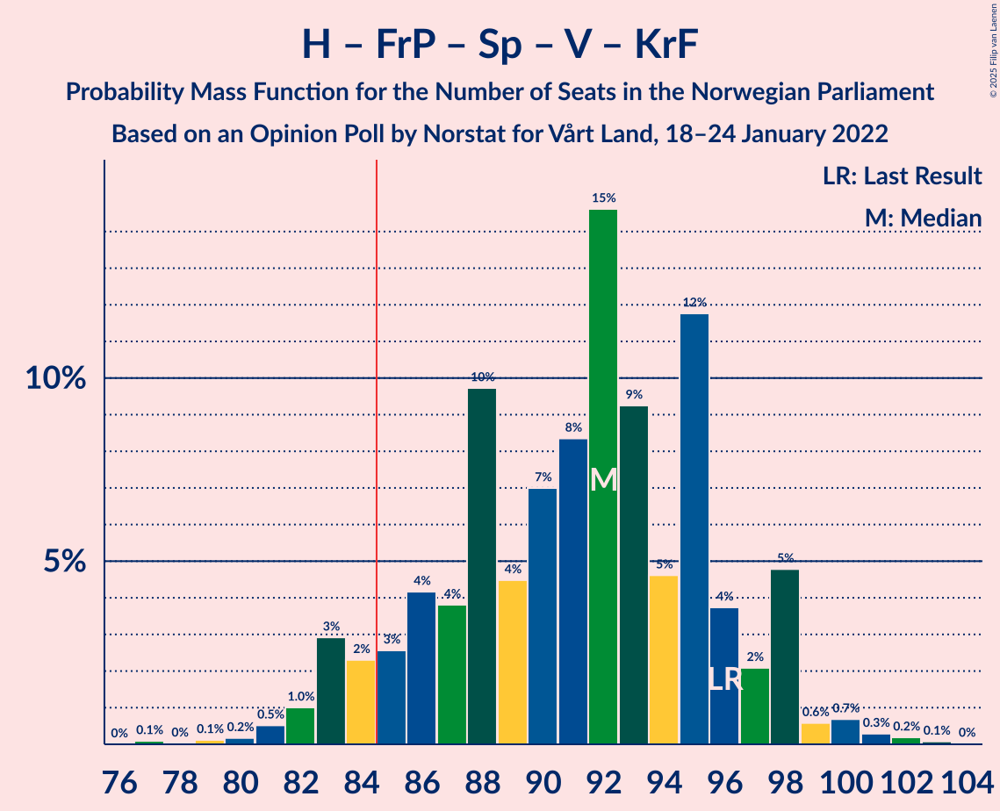

| Number of Seats | Probability | Accumulated | Special Marks |
|:---------------:|:-----------:|:-----------:|:-------------:|
| 77 | 0.1% | 100% |  |
| 78 | 0% | 99.9% |  |
| 79 | 0.1% | 99.9% |  |
| 80 | 0.2% | 99.8% |  |
| 81 | 0.5% | 99.6% |  |
| 82 | 1.0% | 99.1% |  |
| 83 | 3% | 98% |  |
| 84 | 2% | 95% |  |
| 85 | 3% | 93% | Majority |
| 86 | 4% | 90% |  |
| 87 | 4% | 86% |  |
| 88 | 10% | 82% | Median |
| 89 | 4% | 73% |  |
| 90 | 7% | 68% |  |
| 91 | 8% | 61% |  |
| 92 | 15% | 53% |  |
| 93 | 9% | 38% |  |
| 94 | 5% | 29% |  |
| 95 | 12% | 24% |  |
| 96 | 4% | 12% | Last Result |
| 97 | 2% | 9% |  |
| 98 | 5% | 7% |  |
| 99 | 0.6% | 2% |  |
| 100 | 0.7% | 1.3% |  |
| 101 | 0.3% | 0.6% |  |
| 102 | 0.2% | 0.3% |  |
| 103 | 0.1% | 0.1% |  |
| 104 | 0% | 0% |  |

### Arbeiderpartiet – Rødt – Senterpartiet – Sosialistisk Venstreparti

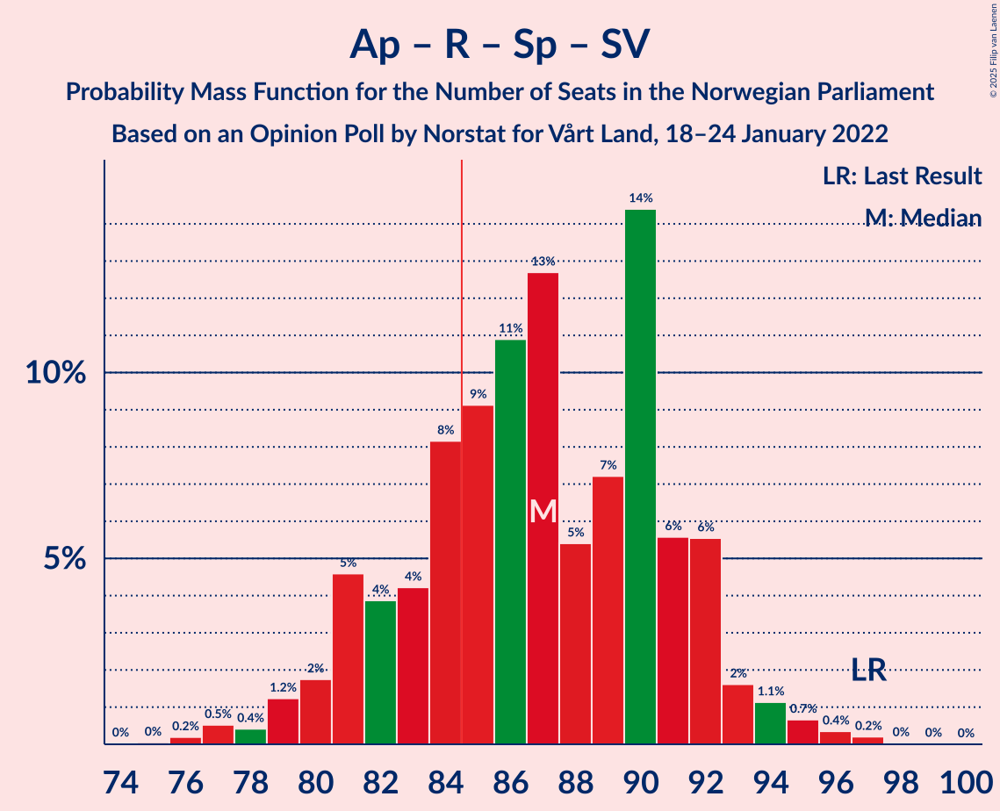

| Number of Seats | Probability | Accumulated | Special Marks |
|:---------------:|:-----------:|:-----------:|:-------------:|
| 75 | 0% | 100% |  |
| 76 | 0.2% | 99.9% |  |
| 77 | 0.5% | 99.7% |  |
| 78 | 0.4% | 99.2% |  |
| 79 | 1.2% | 98.8% |  |
| 80 | 2% | 98% |  |
| 81 | 5% | 96% |  |
| 82 | 4% | 91% |  |
| 83 | 4% | 87% |  |
| 84 | 8% | 83% |  |
| 85 | 9% | 75% | Majority |
| 86 | 11% | 66% |  |
| 87 | 13% | 55% | Median |
| 88 | 5% | 42% |  |
| 89 | 7% | 37% |  |
| 90 | 14% | 30% |  |
| 91 | 6% | 15% |  |
| 92 | 6% | 10% |  |
| 93 | 2% | 4% |  |
| 94 | 1.1% | 2% |  |
| 95 | 0.7% | 1.3% |  |
| 96 | 0.4% | 0.6% |  |
| 97 | 0.2% | 0.3% | Last Result |
| 98 | 0% | 0.1% |  |
| 99 | 0% | 0% |  |

### Høyre – Fremskrittspartiet – Venstre – Miljøpartiet De Grønne – Kristelig Folkeparti

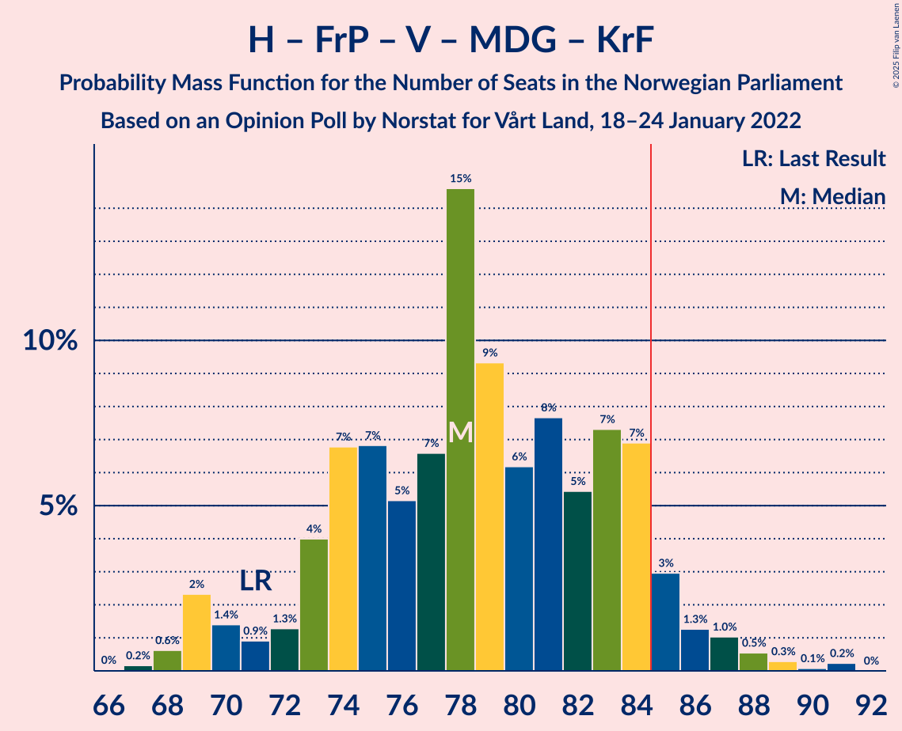

| Number of Seats | Probability | Accumulated | Special Marks |
|:---------------:|:-----------:|:-----------:|:-------------:|
| 67 | 0.2% | 100% |  |
| 68 | 0.6% | 99.8% |  |
| 69 | 2% | 99.2% |  |
| 70 | 1.4% | 97% |  |
| 71 | 0.9% | 95% | Last Result |
| 72 | 1.3% | 95% |  |
| 73 | 4% | 93% |  |
| 74 | 7% | 89% | Median |
| 75 | 7% | 82% |  |
| 76 | 5% | 76% |  |
| 77 | 7% | 70% |  |
| 78 | 15% | 64% |  |
| 79 | 9% | 49% |  |
| 80 | 6% | 40% |  |
| 81 | 8% | 34% |  |
| 82 | 5% | 26% |  |
| 83 | 7% | 21% |  |
| 84 | 7% | 13% |  |
| 85 | 3% | 6% | Majority |
| 86 | 1.3% | 3% |  |
| 87 | 1.0% | 2% |  |
| 88 | 0.5% | 1.2% |  |
| 89 | 0.3% | 0.6% |  |
| 90 | 0.1% | 0.3% |  |
| 91 | 0.2% | 0.2% |  |
| 92 | 0% | 0% |  |

### Arbeiderpartiet – Senterpartiet – Sosialistisk Venstreparti – Miljøpartiet De Grønne – Kristelig Folkeparti

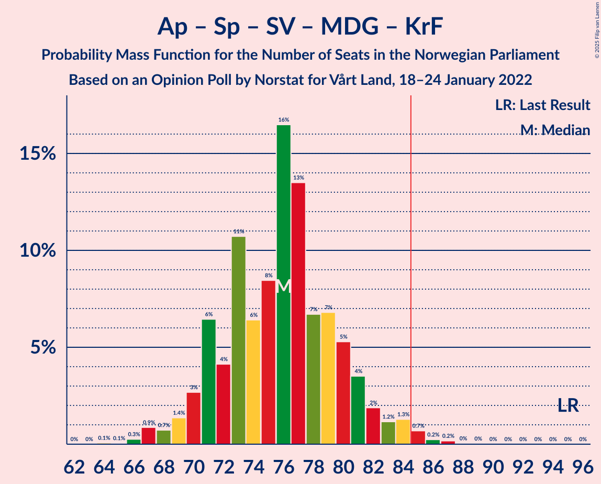

| Number of Seats | Probability | Accumulated | Special Marks |
|:---------------:|:-----------:|:-----------:|:-------------:|
| 64 | 0.1% | 100% |  |
| 65 | 0.1% | 99.9% |  |
| 66 | 0.3% | 99.9% |  |
| 67 | 0.9% | 99.6% |  |
| 68 | 0.7% | 98.7% |  |
| 69 | 1.4% | 98% |  |
| 70 | 3% | 97% |  |
| 71 | 6% | 94% |  |
| 72 | 4% | 88% |  |
| 73 | 11% | 83% |  |
| 74 | 6% | 73% | Median |
| 75 | 8% | 66% |  |
| 76 | 16% | 58% |  |
| 77 | 13% | 41% |  |
| 78 | 7% | 28% |  |
| 79 | 7% | 21% |  |
| 80 | 5% | 14% |  |
| 81 | 4% | 9% |  |
| 82 | 2% | 6% |  |
| 83 | 1.2% | 4% |  |
| 84 | 1.3% | 2% |  |
| 85 | 0.7% | 1.2% | Majority |
| 86 | 0.2% | 0.5% |  |
| 87 | 0.2% | 0.3% |  |
| 88 | 0% | 0.1% |  |
| 89 | 0% | 0% |  |
| 90 | 0% | 0% |  |
| 91 | 0% | 0% |  |
| 92 | 0% | 0% |  |
| 93 | 0% | 0% |  |
| 94 | 0% | 0% |  |
| 95 | 0% | 0% | Last Result |

### Arbeiderpartiet – Rødt – Sosialistisk Venstreparti – Miljøpartiet De Grønne

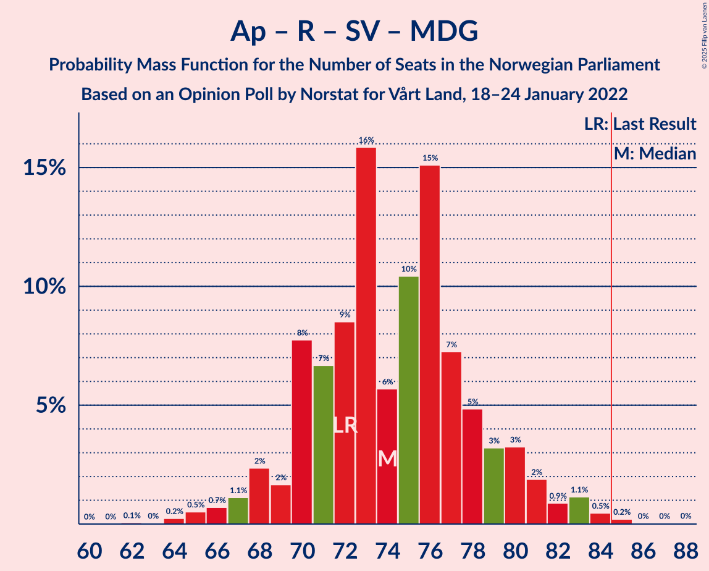

| Number of Seats | Probability | Accumulated | Special Marks |
|:---------------:|:-----------:|:-----------:|:-------------:|
| 62 | 0.1% | 100% |  |
| 63 | 0% | 99.9% |  |
| 64 | 0.2% | 99.9% |  |
| 65 | 0.5% | 99.6% |  |
| 66 | 0.7% | 99.1% |  |
| 67 | 1.1% | 98% |  |
| 68 | 2% | 97% |  |
| 69 | 2% | 95% |  |
| 70 | 8% | 93% |  |
| 71 | 7% | 86% |  |
| 72 | 9% | 79% | Last Result |
| 73 | 16% | 70% | Median |
| 74 | 6% | 54% |  |
| 75 | 10% | 49% |  |
| 76 | 15% | 38% |  |
| 77 | 7% | 23% |  |
| 78 | 5% | 16% |  |
| 79 | 3% | 11% |  |
| 80 | 3% | 8% |  |
| 81 | 2% | 5% |  |
| 82 | 0.9% | 3% |  |
| 83 | 1.1% | 2% |  |
| 84 | 0.5% | 0.8% |  |
| 85 | 0.2% | 0.3% | Majority |
| 86 | 0% | 0.1% |  |
| 87 | 0% | 0.1% |  |
| 88 | 0% | 0% |  |

### Høyre – Fremskrittspartiet – Venstre – Kristelig Folkeparti

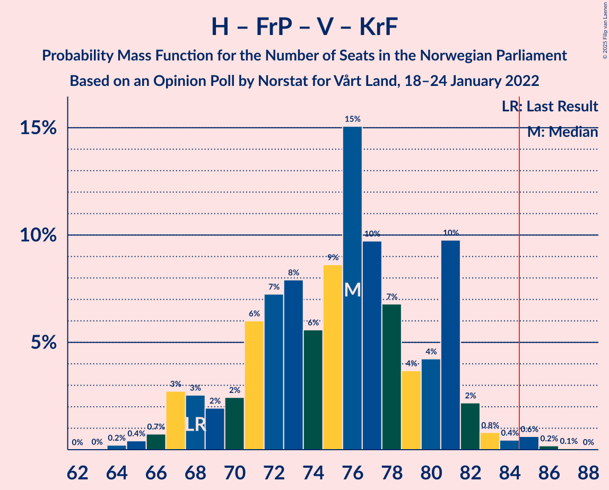

| Number of Seats | Probability | Accumulated | Special Marks |
|:---------------:|:-----------:|:-----------:|:-------------:|
| 64 | 0.2% | 100% |  |
| 65 | 0.4% | 99.8% |  |
| 66 | 0.7% | 99.3% |  |
| 67 | 3% | 98.6% |  |
| 68 | 3% | 96% | Last Result |
| 69 | 2% | 93% |  |
| 70 | 2% | 91% |  |
| 71 | 6% | 89% |  |
| 72 | 7% | 83% | Median |
| 73 | 8% | 76% |  |
| 74 | 6% | 68% |  |
| 75 | 9% | 62% |  |
| 76 | 15% | 54% |  |
| 77 | 10% | 39% |  |
| 78 | 7% | 29% |  |
| 79 | 4% | 22% |  |
| 80 | 4% | 18% |  |
| 81 | 10% | 14% |  |
| 82 | 2% | 4% |  |
| 83 | 0.8% | 2% |  |
| 84 | 0.4% | 1.3% |  |
| 85 | 0.6% | 0.9% | Majority |
| 86 | 0.2% | 0.3% |  |
| 87 | 0.1% | 0.1% |  |
| 88 | 0% | 0% |  |

### Arbeiderpartiet – Senterpartiet – Sosialistisk Venstreparti – Miljøpartiet De Grønne

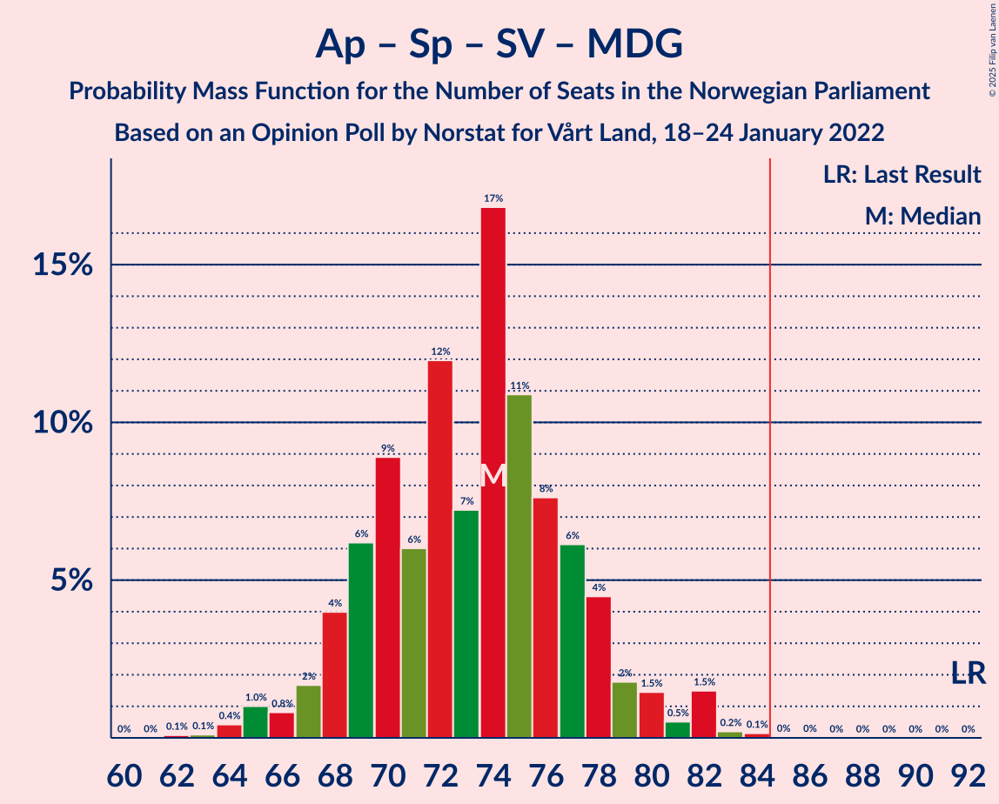

| Number of Seats | Probability | Accumulated | Special Marks |
|:---------------:|:-----------:|:-----------:|:-------------:|
| 62 | 0.1% | 100% |  |
| 63 | 0.1% | 99.9% |  |
| 64 | 0.4% | 99.8% |  |
| 65 | 1.0% | 99.4% |  |
| 66 | 0.8% | 98% |  |
| 67 | 2% | 98% |  |
| 68 | 4% | 96% |  |
| 69 | 6% | 92% |  |
| 70 | 9% | 86% |  |
| 71 | 6% | 77% |  |
| 72 | 12% | 71% | Median |
| 73 | 7% | 59% |  |
| 74 | 17% | 52% |  |
| 75 | 11% | 35% |  |
| 76 | 8% | 24% |  |
| 77 | 6% | 16% |  |
| 78 | 4% | 10% |  |
| 79 | 2% | 6% |  |
| 80 | 1.5% | 4% |  |
| 81 | 0.5% | 2% |  |
| 82 | 1.5% | 2% |  |
| 83 | 0.2% | 0.4% |  |
| 84 | 0.1% | 0.2% |  |
| 85 | 0% | 0% | Majority |
| 86 | 0% | 0% |  |
| 87 | 0% | 0% |  |
| 88 | 0% | 0% |  |
| 89 | 0% | 0% |  |
| 90 | 0% | 0% |  |
| 91 | 0% | 0% |  |
| 92 | 0% | 0% | Last Result |

### Høyre – Fremskrittspartiet – Venstre

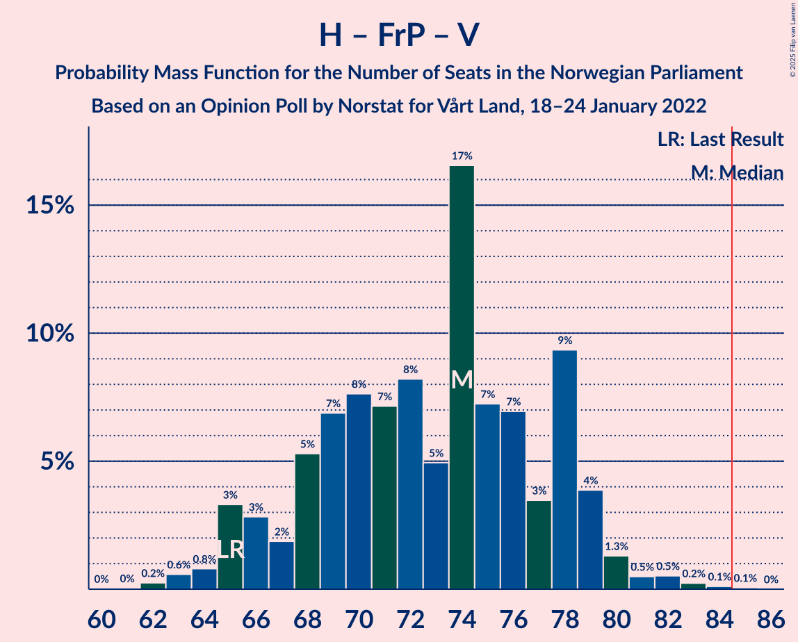

| Number of Seats | Probability | Accumulated | Special Marks |
|:---------------:|:-----------:|:-----------:|:-------------:|
| 61 | 0% | 100% |  |
| 62 | 0.2% | 99.9% |  |
| 63 | 0.6% | 99.7% |  |
| 64 | 0.8% | 99.1% |  |
| 65 | 3% | 98% | Last Result |
| 66 | 3% | 95% |  |
| 67 | 2% | 92% |  |
| 68 | 5% | 90% |  |
| 69 | 7% | 85% |  |
| 70 | 8% | 78% | Median |
| 71 | 7% | 70% |  |
| 72 | 8% | 63% |  |
| 73 | 5% | 55% |  |
| 74 | 17% | 50% |  |
| 75 | 7% | 34% |  |
| 76 | 7% | 26% |  |
| 77 | 3% | 19% |  |
| 78 | 9% | 16% |  |
| 79 | 4% | 7% |  |
| 80 | 1.3% | 3% |  |
| 81 | 0.5% | 1.4% |  |
| 82 | 0.5% | 0.9% |  |
| 83 | 0.2% | 0.4% |  |
| 84 | 0.1% | 0.2% |  |
| 85 | 0.1% | 0.1% | Majority |
| 86 | 0% | 0% |  |

### Arbeiderpartiet – Senterpartiet – Sosialistisk Venstreparti

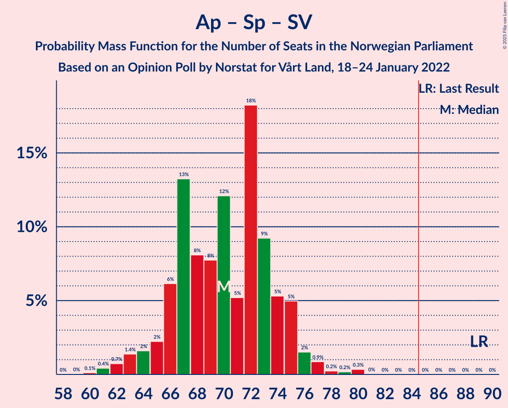

| Number of Seats | Probability | Accumulated | Special Marks |
|:---------------:|:-----------:|:-----------:|:-------------:|
| 60 | 0.1% | 100% |  |
| 61 | 0.4% | 99.8% |  |
| 62 | 0.7% | 99.4% |  |
| 63 | 1.4% | 98.7% |  |
| 64 | 2% | 97% |  |
| 65 | 2% | 96% |  |
| 66 | 6% | 93% |  |
| 67 | 13% | 87% |  |
| 68 | 8% | 74% |  |
| 69 | 8% | 66% |  |
| 70 | 12% | 58% | Median |
| 71 | 5% | 46% |  |
| 72 | 18% | 41% |  |
| 73 | 9% | 23% |  |
| 74 | 5% | 13% |  |
| 75 | 5% | 8% |  |
| 76 | 2% | 3% |  |
| 77 | 0.9% | 2% |  |
| 78 | 0.2% | 0.8% |  |
| 79 | 0.2% | 0.6% |  |
| 80 | 0.3% | 0.4% |  |
| 81 | 0% | 0% |  |
| 82 | 0% | 0% |  |
| 83 | 0% | 0% |  |
| 84 | 0% | 0% |  |
| 85 | 0% | 0% | Majority |
| 86 | 0% | 0% |  |
| 87 | 0% | 0% |  |
| 88 | 0% | 0% |  |
| 89 | 0% | 0% | Last Result |

### Høyre – Fremskrittspartiet

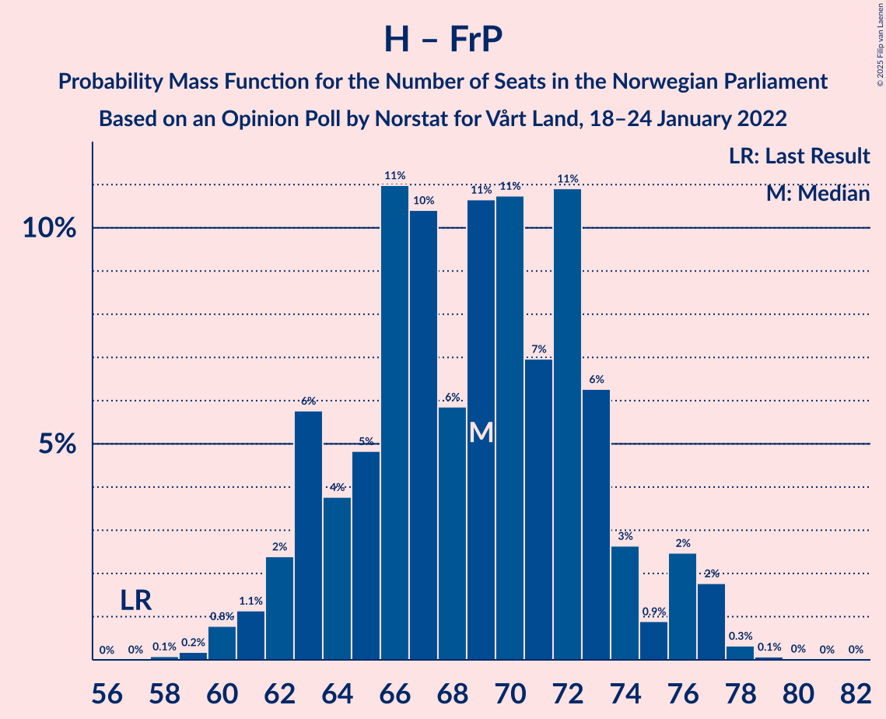

| Number of Seats | Probability | Accumulated | Special Marks |
|:---------------:|:-----------:|:-----------:|:-------------:|
| 57 | 0% | 100% | Last Result |
| 58 | 0.1% | 100% |  |
| 59 | 0.2% | 99.9% |  |
| 60 | 0.8% | 99.7% |  |
| 61 | 1.1% | 98.9% |  |
| 62 | 2% | 98% |  |
| 63 | 6% | 95% |  |
| 64 | 4% | 90% |  |
| 65 | 5% | 86% |  |
| 66 | 11% | 81% |  |
| 67 | 10% | 70% |  |
| 68 | 6% | 60% | Median |
| 69 | 11% | 54% |  |
| 70 | 11% | 43% |  |
| 71 | 7% | 32% |  |
| 72 | 11% | 25% |  |
| 73 | 6% | 15% |  |
| 74 | 3% | 8% |  |
| 75 | 0.9% | 6% |  |
| 76 | 2% | 5% |  |
| 77 | 2% | 2% |  |
| 78 | 0.3% | 0.5% |  |
| 79 | 0.1% | 0.1% |  |
| 80 | 0% | 0.1% |  |
| 81 | 0% | 0% |  |

### Arbeiderpartiet – Senterpartiet – Miljøpartiet De Grønne – Kristelig Folkeparti

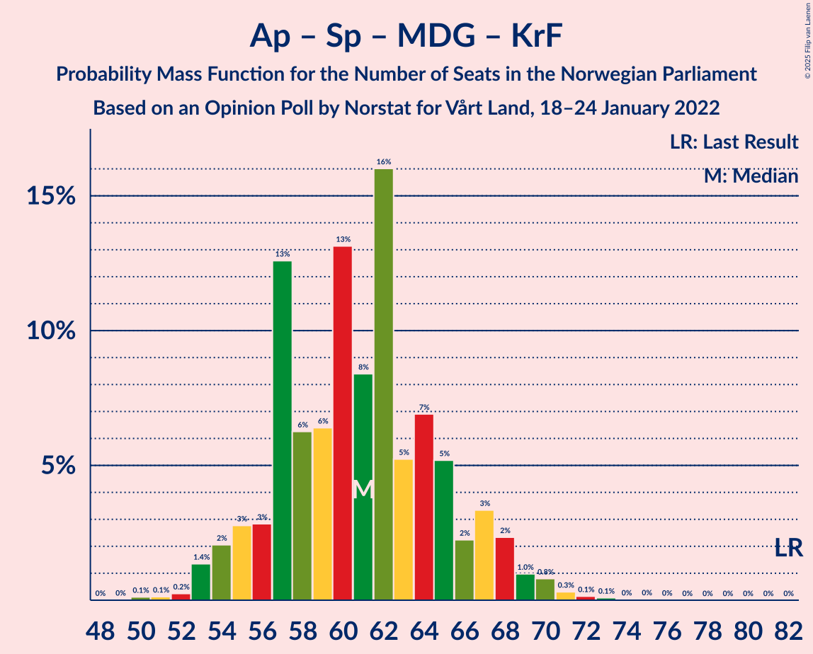

| Number of Seats | Probability | Accumulated | Special Marks |
|:---------------:|:-----------:|:-----------:|:-------------:|
| 50 | 0.1% | 100% |  |
| 51 | 0.1% | 99.9% |  |
| 52 | 0.2% | 99.7% |  |
| 53 | 1.4% | 99.5% |  |
| 54 | 2% | 98% |  |
| 55 | 3% | 96% |  |
| 56 | 3% | 93% |  |
| 57 | 13% | 90% |  |
| 58 | 6% | 78% |  |
| 59 | 6% | 72% | Median |
| 60 | 13% | 65% |  |
| 61 | 8% | 52% |  |
| 62 | 16% | 44% |  |
| 63 | 5% | 28% |  |
| 64 | 7% | 22% |  |
| 65 | 5% | 16% |  |
| 66 | 2% | 10% |  |
| 67 | 3% | 8% |  |
| 68 | 2% | 5% |  |
| 69 | 1.0% | 2% |  |
| 70 | 0.8% | 1.4% |  |
| 71 | 0.3% | 0.6% |  |
| 72 | 0.1% | 0.3% |  |
| 73 | 0.1% | 0.2% |  |
| 74 | 0% | 0.1% |  |
| 75 | 0% | 0% |  |
| 76 | 0% | 0% |  |
| 77 | 0% | 0% |  |
| 78 | 0% | 0% |  |
| 79 | 0% | 0% |  |
| 80 | 0% | 0% |  |
| 81 | 0% | 0% |  |
| 82 | 0% | 0% | Last Result |

### Arbeiderpartiet – Senterpartiet – Kristelig Folkeparti

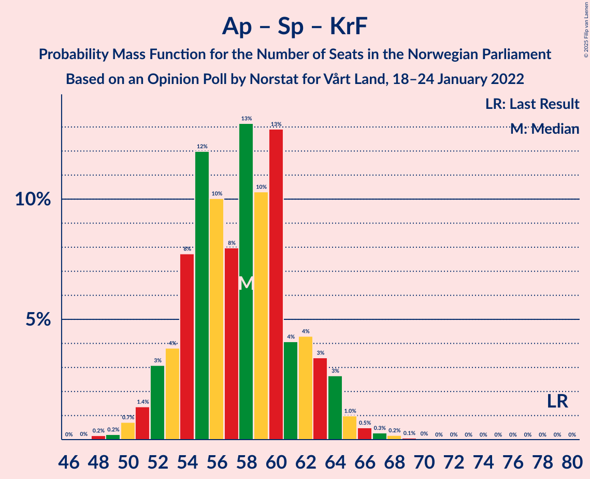

| Number of Seats | Probability | Accumulated | Special Marks |
|:---------------:|:-----------:|:-----------:|:-------------:|
| 48 | 0.2% | 100% |  |
| 49 | 0.2% | 99.8% |  |
| 50 | 0.7% | 99.6% |  |
| 51 | 1.4% | 98.9% |  |
| 52 | 3% | 97% |  |
| 53 | 4% | 94% |  |
| 54 | 8% | 91% |  |
| 55 | 12% | 83% |  |
| 56 | 10% | 71% |  |
| 57 | 8% | 61% | Median |
| 58 | 13% | 53% |  |
| 59 | 10% | 40% |  |
| 60 | 13% | 29% |  |
| 61 | 4% | 16% |  |
| 62 | 4% | 12% |  |
| 63 | 3% | 8% |  |
| 64 | 3% | 5% |  |
| 65 | 1.0% | 2% |  |
| 66 | 0.5% | 1.1% |  |
| 67 | 0.3% | 0.6% |  |
| 68 | 0.2% | 0.3% |  |
| 69 | 0.1% | 0.1% |  |
| 70 | 0% | 0.1% |  |
| 71 | 0% | 0% |  |
| 72 | 0% | 0% |  |
| 73 | 0% | 0% |  |
| 74 | 0% | 0% |  |
| 75 | 0% | 0% |  |
| 76 | 0% | 0% |  |
| 77 | 0% | 0% |  |
| 78 | 0% | 0% |  |
| 79 | 0% | 0% | Last Result |

### Høyre – Venstre – Kristelig Folkeparti

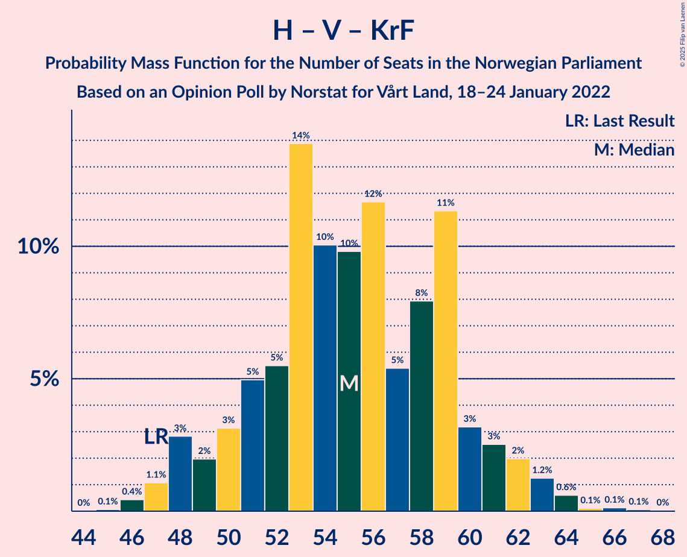

| Number of Seats | Probability | Accumulated | Special Marks |
|:---------------:|:-----------:|:-----------:|:-------------:|
| 45 | 0.1% | 100% |  |
| 46 | 0.4% | 99.9% |  |
| 47 | 1.1% | 99.5% | Last Result |
| 48 | 3% | 98% |  |
| 49 | 2% | 96% |  |
| 50 | 3% | 94% |  |
| 51 | 5% | 90% |  |
| 52 | 5% | 85% | Median |
| 53 | 14% | 80% |  |
| 54 | 10% | 66% |  |
| 55 | 10% | 56% |  |
| 56 | 12% | 46% |  |
| 57 | 5% | 35% |  |
| 58 | 8% | 29% |  |
| 59 | 11% | 21% |  |
| 60 | 3% | 10% |  |
| 61 | 3% | 7% |  |
| 62 | 2% | 4% |  |
| 63 | 1.2% | 2% |  |
| 64 | 0.6% | 0.9% |  |
| 65 | 0.1% | 0.3% |  |
| 66 | 0.1% | 0.2% |  |
| 67 | 0.1% | 0.1% |  |
| 68 | 0% | 0% |  |

### Arbeiderpartiet – Senterpartiet

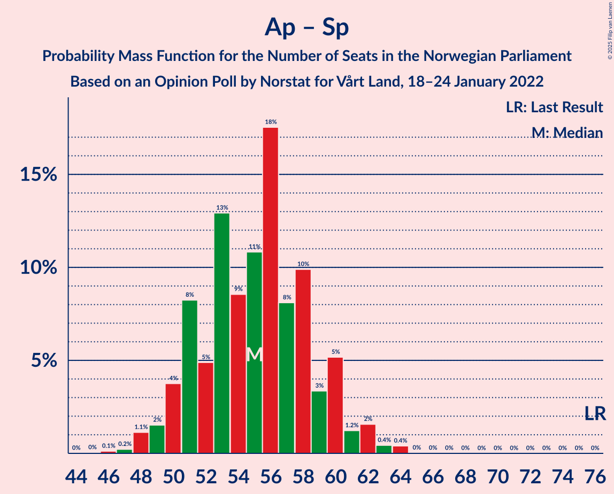

| Number of Seats | Probability | Accumulated | Special Marks |
|:---------------:|:-----------:|:-----------:|:-------------:|
| 45 | 0% | 100% |  |
| 46 | 0.1% | 99.9% |  |
| 47 | 0.2% | 99.8% |  |
| 48 | 1.1% | 99.6% |  |
| 49 | 2% | 98% |  |
| 50 | 4% | 97% |  |
| 51 | 8% | 93% |  |
| 52 | 5% | 85% |  |
| 53 | 13% | 80% |  |
| 54 | 9% | 67% |  |
| 55 | 11% | 59% | Median |
| 56 | 18% | 48% |  |
| 57 | 8% | 30% |  |
| 58 | 10% | 22% |  |
| 59 | 3% | 12% |  |
| 60 | 5% | 9% |  |
| 61 | 1.2% | 4% |  |
| 62 | 2% | 2% |  |
| 63 | 0.4% | 0.9% |  |
| 64 | 0.4% | 0.5% |  |
| 65 | 0% | 0.1% |  |
| 66 | 0% | 0% |  |
| 67 | 0% | 0% |  |
| 68 | 0% | 0% |  |
| 69 | 0% | 0% |  |
| 70 | 0% | 0% |  |
| 71 | 0% | 0% |  |
| 72 | 0% | 0% |  |
| 73 | 0% | 0% |  |
| 74 | 0% | 0% |  |
| 75 | 0% | 0% |  |
| 76 | 0% | 0% | Last Result |

### Arbeiderpartiet – Sosialistisk Venstreparti

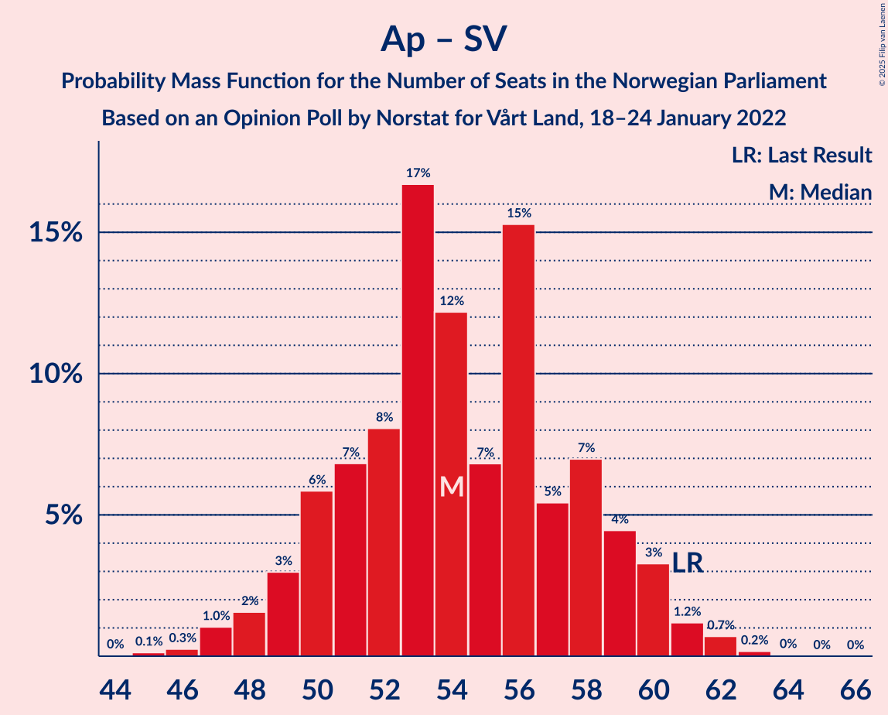

| Number of Seats | Probability | Accumulated | Special Marks |
|:---------------:|:-----------:|:-----------:|:-------------:|
| 45 | 0.1% | 100% |  |
| 46 | 0.3% | 99.8% |  |
| 47 | 1.0% | 99.6% |  |
| 48 | 2% | 98.5% |  |
| 49 | 3% | 97% |  |
| 50 | 6% | 94% |  |
| 51 | 7% | 88% |  |
| 52 | 8% | 81% |  |
| 53 | 17% | 73% |  |
| 54 | 12% | 57% | Median |
| 55 | 7% | 44% |  |
| 56 | 15% | 38% |  |
| 57 | 5% | 22% |  |
| 58 | 7% | 17% |  |
| 59 | 4% | 10% |  |
| 60 | 3% | 5% |  |
| 61 | 1.2% | 2% | Last Result |
| 62 | 0.7% | 0.9% |  |
| 63 | 0.2% | 0.2% |  |
| 64 | 0% | 0.1% |  |
| 65 | 0% | 0% |  |

### Senterpartiet – Venstre – Kristelig Folkeparti

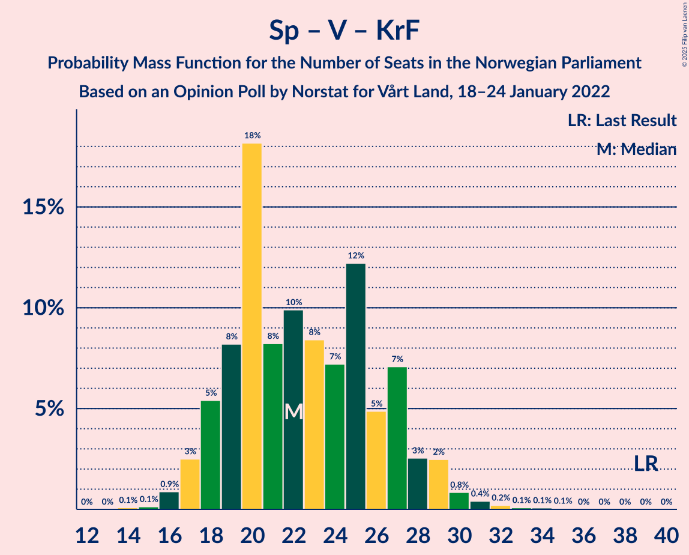

| Number of Seats | Probability | Accumulated | Special Marks |
|:---------------:|:-----------:|:-----------:|:-------------:|
| 14 | 0.1% | 100% |  |
| 15 | 0.1% | 99.9% |  |
| 16 | 0.9% | 99.8% |  |
| 17 | 3% | 98.9% |  |
| 18 | 5% | 96% |  |
| 19 | 8% | 91% |  |
| 20 | 18% | 83% | Median |
| 21 | 8% | 65% |  |
| 22 | 10% | 56% |  |
| 23 | 8% | 46% |  |
| 24 | 7% | 38% |  |
| 25 | 12% | 31% |  |
| 26 | 5% | 19% |  |
| 27 | 7% | 14% |  |
| 28 | 3% | 7% |  |
| 29 | 2% | 4% |  |
| 30 | 0.8% | 2% |  |
| 31 | 0.4% | 0.8% |  |
| 32 | 0.2% | 0.4% |  |
| 33 | 0.1% | 0.2% |  |
| 34 | 0.1% | 0.1% |  |
| 35 | 0.1% | 0.1% |  |
| 36 | 0% | 0% |  |
| 37 | 0% | 0% |  |
| 38 | 0% | 0% |  |
| 39 | 0% | 0% | Last Result |

## Technical Information

### Opinion Poll

+ **Polling firm:** Norstat
+ **Commissioner(s):** Vårt Land
+ **Fieldwork period:** 18–24 January 2022

### Calculations

+ **Sample size:** 969
+ **Simulations done:** 1,048,576
+ **Error estimate:** 1.30%

