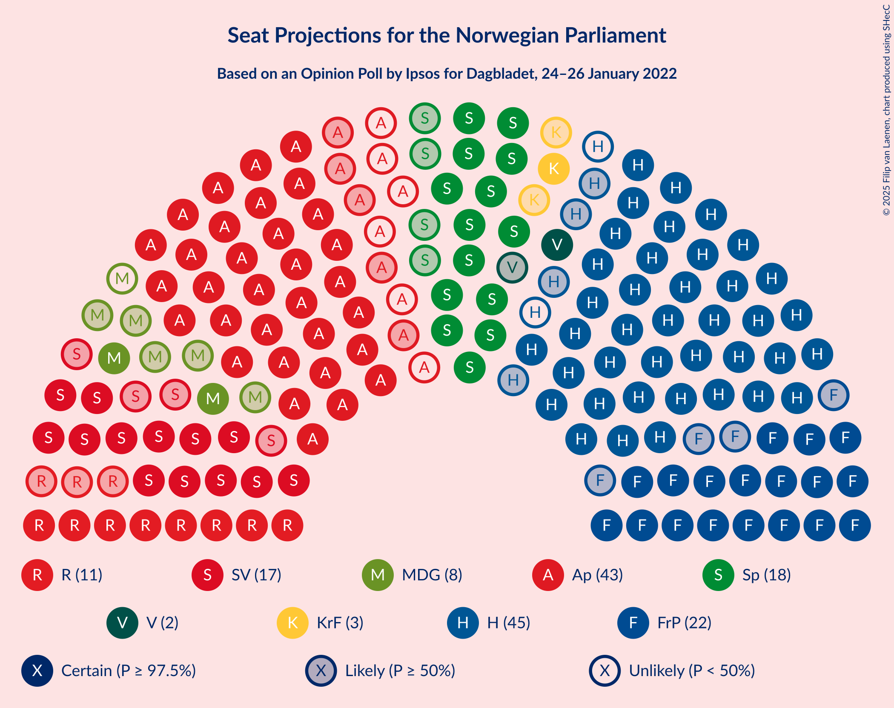

# Opinion Poll by Ipsos for Dagbladet, 24–26 January 2022

<a href="#voting-intentions">Voting Intentions</a> | <a href="#seats">Seats</a> | <a href="#coalitions">Coalitions</a> | <a href="#technical-information">Technical Information</a>

## Voting Intentions

### Confidence Intervals

| Party | Last Result | Poll Result | 80% Confidence Interval | 90% Confidence Interval | 95% Confidence Interval | 99% Confidence Interval |
|:-----:|:-----------:|:-----------:|:-----------------------:|:-----------------------:|:-----------------------:|:-----------------------:|
| Høyre | 20.4% | 24.3% | 22.4–26.4% |21.8–27.0% |21.3–27.6% |20.4–28.6% |
| Arbeiderpartiet | 26.2% | 22.4% | 20.5–24.5% |20.0–25.1% |19.5–25.6% |18.7–26.6% |
| Fremskrittspartiet | 11.6% | 12.6% | 11.1–14.3% |10.7–14.8% |10.3–15.2% |9.7–16.0% |
| Senterpartiet | 13.5% | 10.2% | 8.9–11.8% |8.6–12.3% |8.2–12.7% |7.7–13.5% |
| Sosialistisk Venstreparti | 7.6% | 9.8% | 8.6–11.4% |8.2–11.8% |7.9–12.2% |7.3–13.0% |
| Rødt | 4.7% | 6.1% | 5.1–7.4% |4.9–7.8% |4.6–8.1% |4.2–8.8% |
| Miljøpartiet De Grønne | 3.9% | 4.2% | 3.4–5.3% |3.2–5.7% |3.0–6.0% |2.7–6.5% |
| Venstre | 4.6% | 3.4% | 2.7–4.5% |2.5–4.7% |2.3–5.0% |2.0–5.5% |
| Kristelig Folkeparti | 3.8% | 3.3% | 2.6–4.3% |2.4–4.6% |2.2–4.8% |1.9–5.4% |

*Note:* The poll result column reflects the actual value used in the calculations. Published results may vary slightly, and in addition be rounded to fewer digits.

## Seats

### Confidence Intervals

| Party | Last Result | Median | 80% Confidence Interval | 90% Confidence Interval | 95% Confidence Interval | 99% Confidence Interval |
|:-----:|:-----------:|:------:|:-----------------------:|:-----------------------:|:-----------------------:|:-----------------------:|
| <a href="#høyre">Høyre</a> | 36 | 43 | 40–47 |39–48 |39–49 |36–51 |
| <a href="#arbeiderpartiet">Arbeiderpartiet</a> | 48 | 41 | 38–45 |37–46 |36–47 |35–50 |
| <a href="#fremskrittspartiet">Fremskrittspartiet</a> | 21 | 22 | 19–25 |18–27 |18–27 |17–29 |
| <a href="#senterpartiet">Senterpartiet</a> | 28 | 18 | 16–21 |15–22 |14–23 |13–25 |
| <a href="#sosialistisk-venstreparti">Sosialistisk Venstreparti</a> | 13 | 17 | 15–20 |14–21 |13–22 |12–23 |
| <a href="#rødt">Rødt</a> | 8 | 11 | 9–14 |8–14 |8–15 |7–16 |
| <a href="#miljøpartiet-de-grønne">Miljøpartiet De Grønne</a> | 3 | 8 | 2–9 |2–10 |2–10 |1–12 |
| <a href="#venstre">Venstre</a> | 8 | 2 | 2–7 |2–8 |1–8 |1–9 |
| <a href="#kristelig-folkeparti">Kristelig Folkeparti</a> | 3 | 3 | 2–7 |1–8 |1–8 |0–9 |

### Høyre

*For a full overview of the results for this party, see the [Høyre](party-høyre.html) page.*

| Number of Seats | Probability | Accumulated | Special Marks |
|:---------------:|:-----------:|:-----------:|:-------------:|
| 34 | 0.1% | 100% |  |
| 35 | 0.1% | 99.9% |  |
| 36 | 0.5% | 99.8% | Last Result |
| 37 | 0.6% | 99.4% |  |
| 38 | 1.0% | 98.7% |  |
| 39 | 3% | 98% |  |
| 40 | 8% | 95% |  |
| 41 | 14% | 87% |  |
| 42 | 14% | 73% |  |
| 43 | 10% | 59% | Median |
| 44 | 15% | 49% |  |
| 45 | 15% | 34% |  |
| 46 | 6% | 19% |  |
| 47 | 4% | 13% |  |
| 48 | 6% | 10% |  |
| 49 | 2% | 4% |  |
| 50 | 1.2% | 2% |  |
| 51 | 0.3% | 0.8% |  |
| 52 | 0.2% | 0.5% |  |
| 53 | 0.2% | 0.3% |  |
| 54 | 0% | 0.1% |  |
| 55 | 0% | 0.1% |  |
| 56 | 0.1% | 0.1% |  |
| 57 | 0% | 0% |  |

### Arbeiderpartiet

*For a full overview of the results for this party, see the [Arbeiderpartiet](party-arbeiderpartiet.html) page.*

| Number of Seats | Probability | Accumulated | Special Marks |
|:---------------:|:-----------:|:-----------:|:-------------:|
| 33 | 0.1% | 100% |  |
| 34 | 0.2% | 99.8% |  |
| 35 | 0.9% | 99.6% |  |
| 36 | 2% | 98.7% |  |
| 37 | 4% | 97% |  |
| 38 | 7% | 93% |  |
| 39 | 12% | 86% |  |
| 40 | 13% | 74% |  |
| 41 | 12% | 62% | Median |
| 42 | 8% | 49% |  |
| 43 | 15% | 42% |  |
| 44 | 11% | 27% |  |
| 45 | 9% | 16% |  |
| 46 | 4% | 7% |  |
| 47 | 1.3% | 3% |  |
| 48 | 1.0% | 2% | Last Result |
| 49 | 0.4% | 0.9% |  |
| 50 | 0.4% | 0.6% |  |
| 51 | 0.2% | 0.2% |  |
| 52 | 0% | 0.1% |  |
| 53 | 0% | 0% |  |

### Fremskrittspartiet

*For a full overview of the results for this party, see the [Fremskrittspartiet](party-fremskrittspartiet.html) page.*

| Number of Seats | Probability | Accumulated | Special Marks |
|:---------------:|:-----------:|:-----------:|:-------------:|
| 15 | 0% | 100% |  |
| 16 | 0.2% | 99.9% |  |
| 17 | 0.9% | 99.7% |  |
| 18 | 5% | 98.9% |  |
| 19 | 6% | 94% |  |
| 20 | 10% | 88% |  |
| 21 | 15% | 77% | Last Result |
| 22 | 20% | 62% | Median |
| 23 | 16% | 42% |  |
| 24 | 7% | 26% |  |
| 25 | 11% | 19% |  |
| 26 | 2% | 8% |  |
| 27 | 4% | 6% |  |
| 28 | 1.0% | 2% |  |
| 29 | 0.8% | 1.2% |  |
| 30 | 0.3% | 0.4% |  |
| 31 | 0.1% | 0.1% |  |
| 32 | 0% | 0% |  |

### Senterpartiet

*For a full overview of the results for this party, see the [Senterpartiet](party-senterpartiet.html) page.*

| Number of Seats | Probability | Accumulated | Special Marks |
|:---------------:|:-----------:|:-----------:|:-------------:|
| 12 | 0.1% | 100% |  |
| 13 | 0.4% | 99.9% |  |
| 14 | 3% | 99.5% |  |
| 15 | 6% | 97% |  |
| 16 | 8% | 91% |  |
| 17 | 18% | 83% |  |
| 18 | 24% | 65% | Median |
| 19 | 13% | 42% |  |
| 20 | 16% | 28% |  |
| 21 | 6% | 12% |  |
| 22 | 4% | 7% |  |
| 23 | 2% | 3% |  |
| 24 | 0.5% | 1.3% |  |
| 25 | 0.4% | 0.7% |  |
| 26 | 0.1% | 0.3% |  |
| 27 | 0.1% | 0.2% |  |
| 28 | 0% | 0.1% | Last Result |
| 29 | 0% | 0% |  |

### Sosialistisk Venstreparti

*For a full overview of the results for this party, see the [Sosialistisk Venstreparti](party-sosialistiskvenstreparti.html) page.*

| Number of Seats | Probability | Accumulated | Special Marks |
|:---------------:|:-----------:|:-----------:|:-------------:|
| 10 | 0.1% | 100% |  |
| 11 | 0.4% | 99.9% |  |
| 12 | 1.0% | 99.5% |  |
| 13 | 2% | 98.5% | Last Result |
| 14 | 6% | 97% |  |
| 15 | 11% | 91% |  |
| 16 | 14% | 79% |  |
| 17 | 23% | 65% | Median |
| 18 | 19% | 43% |  |
| 19 | 10% | 24% |  |
| 20 | 9% | 14% |  |
| 21 | 3% | 5% |  |
| 22 | 2% | 3% |  |
| 23 | 0.6% | 0.8% |  |
| 24 | 0.1% | 0.2% |  |
| 25 | 0.1% | 0.1% |  |
| 26 | 0% | 0% |  |

### Rødt

*For a full overview of the results for this party, see the [Rødt](party-rødt.html) page.*

| Number of Seats | Probability | Accumulated | Special Marks |
|:---------------:|:-----------:|:-----------:|:-------------:|
| 1 | 0.2% | 100% |  |
| 2 | 0% | 99.8% |  |
| 3 | 0% | 99.8% |  |
| 4 | 0% | 99.8% |  |
| 5 | 0% | 99.8% |  |
| 6 | 0.1% | 99.8% |  |
| 7 | 1.3% | 99.7% |  |
| 8 | 6% | 98% | Last Result |
| 9 | 12% | 92% |  |
| 10 | 25% | 80% |  |
| 11 | 22% | 56% | Median |
| 12 | 16% | 34% |  |
| 13 | 7% | 17% |  |
| 14 | 8% | 10% |  |
| 15 | 2% | 3% |  |
| 16 | 0.5% | 0.6% |  |
| 17 | 0.1% | 0.1% |  |
| 18 | 0% | 0% |  |

### Miljøpartiet De Grønne

*For a full overview of the results for this party, see the [Miljøpartiet De Grønne](party-miljøpartietdegrønne.html) page.*

| Number of Seats | Probability | Accumulated | Special Marks |
|:---------------:|:-----------:|:-----------:|:-------------:|
| 1 | 2% | 100% |  |
| 2 | 16% | 98% |  |
| 3 | 15% | 82% | Last Result |
| 4 | 0.1% | 67% |  |
| 5 | 0% | 67% |  |
| 6 | 0.7% | 67% |  |
| 7 | 12% | 67% |  |
| 8 | 28% | 55% | Median |
| 9 | 21% | 27% |  |
| 10 | 4% | 6% |  |
| 11 | 1.4% | 2% |  |
| 12 | 0.5% | 0.6% |  |
| 13 | 0.1% | 0.1% |  |
| 14 | 0% | 0% |  |

### Venstre

*For a full overview of the results for this party, see the [Venstre](party-venstre.html) page.*

| Number of Seats | Probability | Accumulated | Special Marks |
|:---------------:|:-----------:|:-----------:|:-------------:|
| 1 | 3% | 100% |  |
| 2 | 50% | 97% | Median |
| 3 | 30% | 47% |  |
| 4 | 0% | 18% |  |
| 5 | 0% | 18% |  |
| 6 | 0.8% | 18% |  |
| 7 | 7% | 17% |  |
| 8 | 8% | 10% | Last Result |
| 9 | 2% | 2% |  |
| 10 | 0.4% | 0.4% |  |
| 11 | 0.1% | 0.1% |  |
| 12 | 0% | 0% |  |

### Kristelig Folkeparti

*For a full overview of the results for this party, see the [Kristelig Folkeparti](party-kristeligfolkeparti.html) page.*

| Number of Seats | Probability | Accumulated | Special Marks |
|:---------------:|:-----------:|:-----------:|:-------------:|
| 0 | 2% | 100% |  |
| 1 | 3% | 98% |  |
| 2 | 43% | 95% |  |
| 3 | 36% | 52% | Last Result, Median |
| 4 | 0% | 17% |  |
| 5 | 0% | 17% |  |
| 6 | 1.1% | 17% |  |
| 7 | 6% | 16% |  |
| 8 | 8% | 10% |  |
| 9 | 2% | 2% |  |
| 10 | 0.1% | 0.2% |  |
| 11 | 0% | 0% |  |

## Coalitions

### Confidence Intervals

| Coalition | Last Result | Median | Majority? | 80% Confidence Interval | 90% Confidence Interval | 95% Confidence Interval | 99% Confidence Interval |
|:---------:|:-----------:|:------:|:---------:|:-----------------------:|:-----------------------:|:-----------------------:|:-----------------------:|
| Arbeiderpartiet – Senterpartiet – Sosialistisk Venstreparti – Rødt – Miljøpartiet De Grønne | 100 | 95 | 98.6% | 89–99 | 87–101 | 86–102 | 83–104 |
| Høyre – Fremskrittspartiet – Senterpartiet – Venstre – Kristelig Folkeparti | 96 | 90 | 93% | 86–96 | 84–98 | 83–99 | 80–101 |
| Arbeiderpartiet – Senterpartiet – Sosialistisk Venstreparti – Rødt | 97 | 88 | 79% | 83–94 | 81–95 | 80–96 | 77–99 |
| Arbeiderpartiet – Senterpartiet – Sosialistisk Venstreparti – Miljøpartiet De Grønne – Kristelig Folkeparti | 95 | 87 | 69% | 81–91 | 79–94 | 78–95 | 75–96 |
| Arbeiderpartiet – Senterpartiet – Sosialistisk Venstreparti – Miljøpartiet De Grønne | 92 | 83 | 38% | 78–88 | 76–90 | 75–92 | 73–92 |
| Høyre – Fremskrittspartiet – Miljøpartiet De Grønne – Venstre – Kristelig Folkeparti | 71 | 79 | 7% | 74–84 | 72–85 | 71–86 | 68–89 |
| Arbeiderpartiet – Senterpartiet – Sosialistisk Venstreparti | 89 | 77 | 2% | 72–82 | 71–83 | 70–84 | 67–87 |
| Arbeiderpartiet – Sosialistisk Venstreparti – Rødt – Miljøpartiet De Grønne | 72 | 76 | 0.9% | 71–82 | 69–82 | 68–83 | 66–86 |
| Høyre – Fremskrittspartiet – Venstre – Kristelig Folkeparti | 68 | 72 | 0.1% | 67–78 | 66–79 | 65–80 | 62–83 |
| Arbeiderpartiet – Senterpartiet – Miljøpartiet De Grønne – Kristelig Folkeparti | 82 | 70 | 0% | 64–74 | 62–76 | 61–78 | 59–80 |
| Høyre – Fremskrittspartiet – Venstre | 65 | 69 | 0% | 64–74 | 63–76 | 62–77 | 59–79 |
| Høyre – Fremskrittspartiet | 57 | 66 | 0% | 61–70 | 60–71 | 59–74 | 57–76 |
| Arbeiderpartiet – Senterpartiet – Kristelig Folkeparti | 79 | 64 | 0% | 58–67 | 57–69 | 56–70 | 54–73 |
| Arbeiderpartiet – Senterpartiet | 76 | 60 | 0% | 56–64 | 54–65 | 53–66 | 52–69 |
| Arbeiderpartiet – Sosialistisk Venstreparti | 61 | 59 | 0% | 54–63 | 53–64 | 52–65 | 50–67 |
| Høyre – Venstre – Kristelig Folkeparti | 47 | 50 | 0% | 45–55 | 45–56 | 44–57 | 42–60 |
| Senterpartiet – Venstre – Kristelig Folkeparti | 39 | 24 | 0% | 21–29 | 20–31 | 19–32 | 18–34 |

### Arbeiderpartiet – Senterpartiet – Sosialistisk Venstreparti – Rødt – Miljøpartiet De Grønne

| Number of Seats | Probability | Accumulated | Special Marks |
|:---------------:|:-----------:|:-----------:|:-------------:|
| 80 | 0% | 100% |  |
| 81 | 0.1% | 99.9% |  |
| 82 | 0.1% | 99.8% |  |
| 83 | 0.5% | 99.7% |  |
| 84 | 0.6% | 99.2% |  |
| 85 | 0.8% | 98.6% | Majority |
| 86 | 1.3% | 98% |  |
| 87 | 3% | 96% |  |
| 88 | 3% | 94% |  |
| 89 | 4% | 91% |  |
| 90 | 8% | 87% |  |
| 91 | 8% | 79% |  |
| 92 | 6% | 71% |  |
| 93 | 8% | 66% |  |
| 94 | 7% | 57% |  |
| 95 | 8% | 50% | Median |
| 96 | 4% | 42% |  |
| 97 | 10% | 38% |  |
| 98 | 6% | 28% |  |
| 99 | 14% | 22% |  |
| 100 | 1.2% | 8% | Last Result |
| 101 | 3% | 7% |  |
| 102 | 1.4% | 3% |  |
| 103 | 1.3% | 2% |  |
| 104 | 0.4% | 0.7% |  |
| 105 | 0.1% | 0.3% |  |
| 106 | 0.1% | 0.2% |  |
| 107 | 0% | 0.1% |  |
| 108 | 0% | 0% |  |

### Høyre – Fremskrittspartiet – Senterpartiet – Venstre – Kristelig Folkeparti

| Number of Seats | Probability | Accumulated | Special Marks |
|:---------------:|:-----------:|:-----------:|:-------------:|
| 77 | 0% | 100% |  |
| 78 | 0.1% | 99.9% |  |
| 79 | 0.2% | 99.8% |  |
| 80 | 0.4% | 99.7% |  |
| 81 | 0.6% | 99.3% |  |
| 82 | 1.2% | 98.7% |  |
| 83 | 2% | 98% |  |
| 84 | 3% | 96% |  |
| 85 | 3% | 93% | Majority |
| 86 | 8% | 90% |  |
| 87 | 7% | 82% |  |
| 88 | 11% | 75% | Median |
| 89 | 5% | 64% |  |
| 90 | 12% | 59% |  |
| 91 | 7% | 48% |  |
| 92 | 10% | 41% |  |
| 93 | 5% | 30% |  |
| 94 | 11% | 26% |  |
| 95 | 2% | 15% |  |
| 96 | 4% | 12% | Last Result |
| 97 | 3% | 8% |  |
| 98 | 3% | 5% |  |
| 99 | 0.8% | 3% |  |
| 100 | 1.3% | 2% |  |
| 101 | 0.4% | 0.8% |  |
| 102 | 0.2% | 0.4% |  |
| 103 | 0.1% | 0.2% |  |
| 104 | 0.1% | 0.1% |  |
| 105 | 0% | 0.1% |  |
| 106 | 0% | 0% |  |

### Arbeiderpartiet – Senterpartiet – Sosialistisk Venstreparti – Rødt

| Number of Seats | Probability | Accumulated | Special Marks |
|:---------------:|:-----------:|:-----------:|:-------------:|
| 75 | 0.1% | 100% |  |
| 76 | 0.3% | 99.9% |  |
| 77 | 0.3% | 99.5% |  |
| 78 | 0.3% | 99.2% |  |
| 79 | 0.8% | 98.9% |  |
| 80 | 1.3% | 98% |  |
| 81 | 3% | 97% |  |
| 82 | 3% | 94% |  |
| 83 | 5% | 91% |  |
| 84 | 7% | 86% |  |
| 85 | 7% | 79% | Majority |
| 86 | 11% | 72% |  |
| 87 | 5% | 61% | Median |
| 88 | 8% | 55% |  |
| 89 | 12% | 48% |  |
| 90 | 10% | 36% |  |
| 91 | 8% | 26% |  |
| 92 | 5% | 18% |  |
| 93 | 2% | 13% |  |
| 94 | 4% | 11% |  |
| 95 | 3% | 7% |  |
| 96 | 3% | 4% |  |
| 97 | 0.3% | 1.3% | Last Result |
| 98 | 0.4% | 1.0% |  |
| 99 | 0.4% | 0.6% |  |
| 100 | 0.1% | 0.2% |  |
| 101 | 0.1% | 0.1% |  |
| 102 | 0% | 0% |  |

### Arbeiderpartiet – Senterpartiet – Sosialistisk Venstreparti – Miljøpartiet De Grønne – Kristelig Folkeparti

| Number of Seats | Probability | Accumulated | Special Marks |
|:---------------:|:-----------:|:-----------:|:-------------:|
| 73 | 0.1% | 100% |  |
| 74 | 0.2% | 99.9% |  |
| 75 | 0.2% | 99.7% |  |
| 76 | 0.4% | 99.5% |  |
| 77 | 0.9% | 99.1% |  |
| 78 | 0.9% | 98% |  |
| 79 | 3% | 97% |  |
| 80 | 1.1% | 94% |  |
| 81 | 7% | 93% |  |
| 82 | 5% | 86% |  |
| 83 | 4% | 81% |  |
| 84 | 8% | 77% |  |
| 85 | 7% | 69% | Majority |
| 86 | 12% | 63% |  |
| 87 | 7% | 50% | Median |
| 88 | 6% | 44% |  |
| 89 | 6% | 38% |  |
| 90 | 11% | 32% |  |
| 91 | 13% | 21% |  |
| 92 | 2% | 9% |  |
| 93 | 1.2% | 7% |  |
| 94 | 3% | 6% |  |
| 95 | 2% | 3% | Last Result |
| 96 | 0.3% | 0.7% |  |
| 97 | 0.1% | 0.4% |  |
| 98 | 0.2% | 0.3% |  |
| 99 | 0% | 0.1% |  |
| 100 | 0% | 0% |  |

### Arbeiderpartiet – Senterpartiet – Sosialistisk Venstreparti – Miljøpartiet De Grønne

| Number of Seats | Probability | Accumulated | Special Marks |
|:---------------:|:-----------:|:-----------:|:-------------:|
| 70 | 0% | 100% |  |
| 71 | 0.2% | 99.9% |  |
| 72 | 0.2% | 99.7% |  |
| 73 | 0.3% | 99.5% |  |
| 74 | 0.9% | 99.2% |  |
| 75 | 1.5% | 98% |  |
| 76 | 2% | 97% |  |
| 77 | 3% | 95% |  |
| 78 | 4% | 92% |  |
| 79 | 8% | 88% |  |
| 80 | 6% | 80% |  |
| 81 | 7% | 74% |  |
| 82 | 6% | 67% |  |
| 83 | 12% | 60% |  |
| 84 | 11% | 48% | Median |
| 85 | 4% | 38% | Majority |
| 86 | 4% | 34% |  |
| 87 | 8% | 30% |  |
| 88 | 14% | 22% |  |
| 89 | 3% | 9% |  |
| 90 | 0.8% | 6% |  |
| 91 | 1.4% | 5% |  |
| 92 | 3% | 4% | Last Result |
| 93 | 0.3% | 0.5% |  |
| 94 | 0.1% | 0.2% |  |
| 95 | 0% | 0.1% |  |
| 96 | 0.1% | 0.1% |  |
| 97 | 0% | 0% |  |

### Høyre – Fremskrittspartiet – Miljøpartiet De Grønne – Venstre – Kristelig Folkeparti

| Number of Seats | Probability | Accumulated | Special Marks |
|:---------------:|:-----------:|:-----------:|:-------------:|
| 64 | 0% | 100% |  |
| 65 | 0.1% | 99.9% |  |
| 66 | 0.1% | 99.9% |  |
| 67 | 0.1% | 99.8% |  |
| 68 | 0.3% | 99.7% |  |
| 69 | 0.4% | 99.4% |  |
| 70 | 1.1% | 99.0% |  |
| 71 | 2% | 98% | Last Result |
| 72 | 2% | 96% |  |
| 73 | 3% | 94% |  |
| 74 | 10% | 91% |  |
| 75 | 5% | 81% |  |
| 76 | 5% | 76% |  |
| 77 | 13% | 71% |  |
| 78 | 4% | 58% | Median |
| 79 | 12% | 54% |  |
| 80 | 13% | 41% |  |
| 81 | 5% | 28% |  |
| 82 | 5% | 23% |  |
| 83 | 5% | 18% |  |
| 84 | 6% | 13% |  |
| 85 | 3% | 7% | Majority |
| 86 | 1.2% | 4% |  |
| 87 | 2% | 2% |  |
| 88 | 0.4% | 0.9% |  |
| 89 | 0.3% | 0.5% |  |
| 90 | 0.1% | 0.2% |  |
| 91 | 0.1% | 0.1% |  |
| 92 | 0% | 0% |  |

### Arbeiderpartiet – Senterpartiet – Sosialistisk Venstreparti

| Number of Seats | Probability | Accumulated | Special Marks |
|:---------------:|:-----------:|:-----------:|:-------------:|
| 65 | 0.1% | 100% |  |
| 66 | 0.1% | 99.9% |  |
| 67 | 0.3% | 99.8% |  |
| 68 | 0.5% | 99.5% |  |
| 69 | 1.2% | 99.0% |  |
| 70 | 2% | 98% |  |
| 71 | 4% | 96% |  |
| 72 | 3% | 92% |  |
| 73 | 4% | 89% |  |
| 74 | 12% | 85% |  |
| 75 | 10% | 73% |  |
| 76 | 6% | 63% | Median |
| 77 | 7% | 57% |  |
| 78 | 11% | 49% |  |
| 79 | 13% | 38% |  |
| 80 | 9% | 25% |  |
| 81 | 5% | 17% |  |
| 82 | 5% | 12% |  |
| 83 | 4% | 7% |  |
| 84 | 2% | 3% |  |
| 85 | 0.6% | 2% | Majority |
| 86 | 0.6% | 1.1% |  |
| 87 | 0.4% | 0.5% |  |
| 88 | 0.1% | 0.2% |  |
| 89 | 0.1% | 0.1% | Last Result |
| 90 | 0% | 0% |  |

### Arbeiderpartiet – Sosialistisk Venstreparti – Rødt – Miljøpartiet De Grønne

| Number of Seats | Probability | Accumulated | Special Marks |
|:---------------:|:-----------:|:-----------:|:-------------:|
| 62 | 0% | 100% |  |
| 63 | 0.1% | 99.9% |  |
| 64 | 0.2% | 99.9% |  |
| 65 | 0.2% | 99.7% |  |
| 66 | 0.5% | 99.5% |  |
| 67 | 0.8% | 99.0% |  |
| 68 | 2% | 98% |  |
| 69 | 2% | 96% |  |
| 70 | 4% | 94% |  |
| 71 | 5% | 91% |  |
| 72 | 6% | 85% | Last Result |
| 73 | 6% | 79% |  |
| 74 | 9% | 73% |  |
| 75 | 8% | 63% |  |
| 76 | 8% | 55% |  |
| 77 | 11% | 47% | Median |
| 78 | 5% | 36% |  |
| 79 | 9% | 32% |  |
| 80 | 5% | 22% |  |
| 81 | 7% | 18% |  |
| 82 | 7% | 11% |  |
| 83 | 0.9% | 3% |  |
| 84 | 1.2% | 2% |  |
| 85 | 0.4% | 0.9% | Majority |
| 86 | 0.1% | 0.5% |  |
| 87 | 0.3% | 0.4% |  |
| 88 | 0.1% | 0.1% |  |
| 89 | 0% | 0% |  |

### Høyre – Fremskrittspartiet – Venstre – Kristelig Folkeparti

| Number of Seats | Probability | Accumulated | Special Marks |
|:---------------:|:-----------:|:-----------:|:-------------:|
| 60 | 0% | 100% |  |
| 61 | 0.1% | 99.9% |  |
| 62 | 0.4% | 99.8% |  |
| 63 | 0.9% | 99.4% |  |
| 64 | 0.5% | 98% |  |
| 65 | 1.0% | 98% |  |
| 66 | 5% | 97% |  |
| 67 | 2% | 92% |  |
| 68 | 5% | 89% | Last Result |
| 69 | 10% | 85% |  |
| 70 | 11% | 75% | Median |
| 71 | 12% | 64% |  |
| 72 | 11% | 53% |  |
| 73 | 7% | 42% |  |
| 74 | 7% | 35% |  |
| 75 | 6% | 28% |  |
| 76 | 7% | 22% |  |
| 77 | 2% | 14% |  |
| 78 | 6% | 12% |  |
| 79 | 3% | 6% |  |
| 80 | 1.4% | 3% |  |
| 81 | 0.9% | 2% |  |
| 82 | 0.4% | 1.0% |  |
| 83 | 0.3% | 0.6% |  |
| 84 | 0.2% | 0.3% |  |
| 85 | 0.1% | 0.1% | Majority |
| 86 | 0% | 0% |  |

### Arbeiderpartiet – Senterpartiet – Miljøpartiet De Grønne – Kristelig Folkeparti

| Number of Seats | Probability | Accumulated | Special Marks |
|:---------------:|:-----------:|:-----------:|:-------------:|
| 55 | 0.1% | 100% |  |
| 56 | 0% | 99.9% |  |
| 57 | 0.2% | 99.9% |  |
| 58 | 0.2% | 99.7% |  |
| 59 | 0.3% | 99.5% |  |
| 60 | 2% | 99.2% |  |
| 61 | 1.2% | 98% |  |
| 62 | 2% | 97% |  |
| 63 | 3% | 94% |  |
| 64 | 4% | 91% |  |
| 65 | 4% | 87% |  |
| 66 | 7% | 82% |  |
| 67 | 8% | 75% |  |
| 68 | 10% | 67% |  |
| 69 | 7% | 58% |  |
| 70 | 6% | 51% | Median |
| 71 | 8% | 45% |  |
| 72 | 7% | 37% |  |
| 73 | 11% | 30% |  |
| 74 | 10% | 18% |  |
| 75 | 2% | 8% |  |
| 76 | 2% | 6% |  |
| 77 | 1.2% | 4% |  |
| 78 | 2% | 3% |  |
| 79 | 0.5% | 1.0% |  |
| 80 | 0.3% | 0.6% |  |
| 81 | 0.1% | 0.3% |  |
| 82 | 0.1% | 0.2% | Last Result |
| 83 | 0% | 0.1% |  |
| 84 | 0.1% | 0.1% |  |
| 85 | 0% | 0% | Majority |

### Høyre – Fremskrittspartiet – Venstre

| Number of Seats | Probability | Accumulated | Special Marks |
|:---------------:|:-----------:|:-----------:|:-------------:|
| 57 | 0% | 100% |  |
| 58 | 0.1% | 99.9% |  |
| 59 | 0.4% | 99.9% |  |
| 60 | 0.4% | 99.5% |  |
| 61 | 1.2% | 99.1% |  |
| 62 | 1.1% | 98% |  |
| 63 | 2% | 97% |  |
| 64 | 5% | 95% |  |
| 65 | 6% | 89% | Last Result |
| 66 | 8% | 83% |  |
| 67 | 11% | 75% | Median |
| 68 | 11% | 64% |  |
| 69 | 14% | 54% |  |
| 70 | 11% | 40% |  |
| 71 | 5% | 29% |  |
| 72 | 6% | 23% |  |
| 73 | 5% | 17% |  |
| 74 | 4% | 12% |  |
| 75 | 2% | 8% |  |
| 76 | 3% | 6% |  |
| 77 | 1.2% | 3% |  |
| 78 | 0.6% | 1.4% |  |
| 79 | 0.4% | 0.8% |  |
| 80 | 0.2% | 0.4% |  |
| 81 | 0.2% | 0.3% |  |
| 82 | 0% | 0.1% |  |
| 83 | 0% | 0% |  |

### Høyre – Fremskrittspartiet

| Number of Seats | Probability | Accumulated | Special Marks |
|:---------------:|:-----------:|:-----------:|:-------------:|
| 55 | 0.1% | 100% |  |
| 56 | 0.3% | 99.9% |  |
| 57 | 0.6% | 99.6% | Last Result |
| 58 | 0.8% | 99.0% |  |
| 59 | 2% | 98% |  |
| 60 | 3% | 97% |  |
| 61 | 6% | 93% |  |
| 62 | 4% | 87% |  |
| 63 | 10% | 82% |  |
| 64 | 11% | 72% |  |
| 65 | 7% | 61% | Median |
| 66 | 10% | 54% |  |
| 67 | 19% | 44% |  |
| 68 | 6% | 26% |  |
| 69 | 8% | 19% |  |
| 70 | 3% | 12% |  |
| 71 | 4% | 8% |  |
| 72 | 1.3% | 5% |  |
| 73 | 1.0% | 4% |  |
| 74 | 0.8% | 3% |  |
| 75 | 1.3% | 2% |  |
| 76 | 0.3% | 0.6% |  |
| 77 | 0.1% | 0.3% |  |
| 78 | 0.1% | 0.2% |  |
| 79 | 0.1% | 0.1% |  |
| 80 | 0% | 0% |  |

### Arbeiderpartiet – Senterpartiet – Kristelig Folkeparti

| Number of Seats | Probability | Accumulated | Special Marks |
|:---------------:|:-----------:|:-----------:|:-------------:|
| 52 | 0.1% | 100% |  |
| 53 | 0.2% | 99.9% |  |
| 54 | 0.4% | 99.7% |  |
| 55 | 1.5% | 99.4% |  |
| 56 | 2% | 98% |  |
| 57 | 2% | 96% |  |
| 58 | 5% | 94% |  |
| 59 | 7% | 89% |  |
| 60 | 7% | 82% |  |
| 61 | 8% | 75% |  |
| 62 | 10% | 67% | Median |
| 63 | 7% | 57% |  |
| 64 | 12% | 51% |  |
| 65 | 14% | 38% |  |
| 66 | 11% | 25% |  |
| 67 | 4% | 14% |  |
| 68 | 2% | 10% |  |
| 69 | 5% | 8% |  |
| 70 | 1.1% | 3% |  |
| 71 | 1.0% | 2% |  |
| 72 | 0.5% | 1.1% |  |
| 73 | 0.3% | 0.5% |  |
| 74 | 0.1% | 0.3% |  |
| 75 | 0% | 0.1% |  |
| 76 | 0.1% | 0.1% |  |
| 77 | 0% | 0% |  |
| 78 | 0% | 0% |  |
| 79 | 0% | 0% | Last Result |

### Arbeiderpartiet – Senterpartiet

| Number of Seats | Probability | Accumulated | Special Marks |
|:---------------:|:-----------:|:-----------:|:-------------:|
| 50 | 0.1% | 100% |  |
| 51 | 0.3% | 99.8% |  |
| 52 | 0.7% | 99.5% |  |
| 53 | 2% | 98.8% |  |
| 54 | 2% | 97% |  |
| 55 | 4% | 95% |  |
| 56 | 7% | 90% |  |
| 57 | 10% | 83% |  |
| 58 | 9% | 74% |  |
| 59 | 11% | 65% | Median |
| 60 | 7% | 54% |  |
| 61 | 9% | 47% |  |
| 62 | 16% | 37% |  |
| 63 | 11% | 21% |  |
| 64 | 4% | 10% |  |
| 65 | 2% | 6% |  |
| 66 | 3% | 5% |  |
| 67 | 1.1% | 2% |  |
| 68 | 0.5% | 1.0% |  |
| 69 | 0.3% | 0.5% |  |
| 70 | 0.1% | 0.2% |  |
| 71 | 0.1% | 0.1% |  |
| 72 | 0% | 0% |  |
| 73 | 0% | 0% |  |
| 74 | 0% | 0% |  |
| 75 | 0% | 0% |  |
| 76 | 0% | 0% | Last Result |

### Arbeiderpartiet – Sosialistisk Venstreparti

| Number of Seats | Probability | Accumulated | Special Marks |
|:---------------:|:-----------:|:-----------:|:-------------:|
| 48 | 0% | 100% |  |
| 49 | 0.1% | 99.9% |  |
| 50 | 0.3% | 99.8% |  |
| 51 | 0.6% | 99.5% |  |
| 52 | 1.4% | 98.9% |  |
| 53 | 4% | 97% |  |
| 54 | 5% | 94% |  |
| 55 | 5% | 89% |  |
| 56 | 9% | 84% |  |
| 57 | 9% | 74% |  |
| 58 | 12% | 65% | Median |
| 59 | 11% | 53% |  |
| 60 | 11% | 42% |  |
| 61 | 10% | 31% | Last Result |
| 62 | 4% | 20% |  |
| 63 | 10% | 16% |  |
| 64 | 3% | 6% |  |
| 65 | 1.2% | 3% |  |
| 66 | 0.9% | 2% |  |
| 67 | 0.6% | 1.1% |  |
| 68 | 0.3% | 0.5% |  |
| 69 | 0.1% | 0.1% |  |
| 70 | 0.1% | 0.1% |  |
| 71 | 0% | 0% |  |

### Høyre – Venstre – Kristelig Folkeparti

| Number of Seats | Probability | Accumulated | Special Marks |
|:---------------:|:-----------:|:-----------:|:-------------:|
| 40 | 0.2% | 100% |  |
| 41 | 0.1% | 99.8% |  |
| 42 | 0.7% | 99.6% |  |
| 43 | 1.2% | 99.0% |  |
| 44 | 2% | 98% |  |
| 45 | 6% | 96% |  |
| 46 | 5% | 90% |  |
| 47 | 12% | 85% | Last Result |
| 48 | 13% | 73% | Median |
| 49 | 8% | 60% |  |
| 50 | 14% | 52% |  |
| 51 | 9% | 38% |  |
| 52 | 5% | 29% |  |
| 53 | 7% | 24% |  |
| 54 | 5% | 17% |  |
| 55 | 5% | 12% |  |
| 56 | 2% | 7% |  |
| 57 | 2% | 4% |  |
| 58 | 1.3% | 2% |  |
| 59 | 0.5% | 1.1% |  |
| 60 | 0.3% | 0.6% |  |
| 61 | 0.1% | 0.4% |  |
| 62 | 0.1% | 0.2% |  |
| 63 | 0.1% | 0.1% |  |
| 64 | 0% | 0% |  |

### Senterpartiet – Venstre – Kristelig Folkeparti

| Number of Seats | Probability | Accumulated | Special Marks |
|:---------------:|:-----------:|:-----------:|:-------------:|
| 16 | 0.1% | 100% |  |
| 17 | 0.4% | 99.9% |  |
| 18 | 0.8% | 99.5% |  |
| 19 | 2% | 98.7% |  |
| 20 | 4% | 96% |  |
| 21 | 7% | 92% |  |
| 22 | 10% | 85% |  |
| 23 | 15% | 75% | Median |
| 24 | 11% | 60% |  |
| 25 | 15% | 49% |  |
| 26 | 6% | 34% |  |
| 27 | 5% | 28% |  |
| 28 | 8% | 23% |  |
| 29 | 7% | 15% |  |
| 30 | 2% | 8% |  |
| 31 | 3% | 6% |  |
| 32 | 0.8% | 3% |  |
| 33 | 0.9% | 2% |  |
| 34 | 0.4% | 0.9% |  |
| 35 | 0.2% | 0.5% |  |
| 36 | 0.1% | 0.3% |  |
| 37 | 0.1% | 0.2% |  |
| 38 | 0% | 0.1% |  |
| 39 | 0% | 0% | Last Result |

## Technical Information

### Opinion Poll

+ **Polling firm:** Ipsos
+ **Commissioner(s):** Dagbladet
+ **Fieldwork period:** 24–26 January 2022

### Calculations

+ **Sample size:** 732
+ **Simulations done:** 1,048,576
+ **Error estimate:** 1.39%

