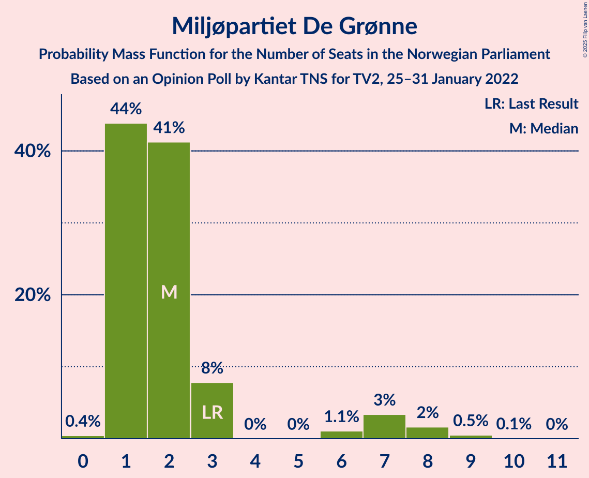

# Opinion Poll by Kantar TNS for TV2, 25–31 January 2022

<a href="#voting-intentions">Voting Intentions</a> | <a href="#seats">Seats</a> | <a href="#coalitions">Coalitions</a> | <a href="#technical-information">Technical Information</a>

## Voting Intentions

### Confidence Intervals

| Party | Last Result | Poll Result | 80% Confidence Interval | 90% Confidence Interval | 95% Confidence Interval | 99% Confidence Interval |
|:-----:|:-----------:|:-----------:|:-----------------------:|:-----------------------:|:-----------------------:|:-----------------------:|
| Høyre | 20.4% | 25.4% | 23.5–27.4% |23.0–28.0% |22.5–28.5% |21.6–29.4% |
| Arbeiderpartiet | 26.2% | 21.2% | 19.5–23.1% |19.0–23.7% |18.5–24.2% |17.7–25.1% |
| Fremskrittspartiet | 11.6% | 11.3% | 10.0–12.9% |9.7–13.3% |9.3–13.7% |8.7–14.5% |
| Sosialistisk Venstreparti | 7.6% | 9.8% | 8.5–11.2% |8.2–11.6% |7.9–12.0% |7.4–12.7% |
| Senterpartiet | 13.5% | 9.0% | 7.8–10.4% |7.5–10.8% |7.2–11.2% |6.7–11.9% |
| Rødt | 4.7% | 8.4% | 7.3–9.8% |7.0–10.2% |6.7–10.5% |6.2–11.2% |
| Venstre | 4.6% | 4.8% | 3.9–5.9% |3.7–6.2% |3.5–6.4% |3.1–7.0% |
| Kristelig Folkeparti | 3.8% | 3.3% | 2.6–4.3% |2.4–4.5% |2.3–4.8% |2.0–5.3% |
| Miljøpartiet De Grønne | 3.9% | 3.0% | 2.4–4.0% |2.2–4.2% |2.1–4.5% |1.8–5.0% |

*Note:* The poll result column reflects the actual value used in the calculations. Published results may vary slightly, and in addition be rounded to fewer digits.

## Seats

### Confidence Intervals

| Party | Last Result | Median | 80% Confidence Interval | 90% Confidence Interval | 95% Confidence Interval | 99% Confidence Interval |
|:-----:|:-----------:|:------:|:-----------------------:|:-----------------------:|:-----------------------:|:-----------------------:|
| <a href="#høyre">Høyre</a> | 36 | 45 | 41–49 |40–50 |40–51 |39–53 |
| <a href="#arbeiderpartiet">Arbeiderpartiet</a> | 48 | 39 | 37–44 |36–45 |35–45 |33–47 |
| <a href="#fremskrittspartiet">Fremskrittspartiet</a> | 21 | 20 | 17–23 |17–24 |17–25 |15–26 |
| <a href="#sosialistisk-venstreparti">Sosialistisk Venstreparti</a> | 13 | 17 | 14–20 |13–20 |13–21 |12–23 |
| <a href="#senterpartiet">Senterpartiet</a> | 28 | 16 | 14–18 |13–19 |13–20 |12–21 |
| <a href="#rødt">Rødt</a> | 8 | 15 | 12–17 |12–18 |11–18 |10–20 |
| <a href="#venstre">Venstre</a> | 8 | 8 | 3–10 |2–11 |2–11 |2–12 |
| <a href="#kristelig-folkeparti">Kristelig Folkeparti</a> | 3 | 2 | 2–7 |2–8 |1–8 |0–9 |
| <a href="#miljøpartiet-de-grønne">Miljøpartiet De Grønne</a> | 3 | 2 | 1–3 |1–7 |1–7 |1–9 |

### Høyre

*For a full overview of the results for this party, see the [Høyre](party-høyre.html) page.*

| Number of Seats | Probability | Accumulated | Special Marks |
|:---------------:|:-----------:|:-----------:|:-------------:|
| 36 | 0% | 100% | Last Result |
| 37 | 0.1% | 100% |  |
| 38 | 0.3% | 99.9% |  |
| 39 | 0.5% | 99.6% |  |
| 40 | 5% | 99.0% |  |
| 41 | 5% | 94% |  |
| 42 | 11% | 89% |  |
| 43 | 10% | 79% |  |
| 44 | 14% | 68% |  |
| 45 | 17% | 54% | Median |
| 46 | 11% | 37% |  |
| 47 | 9% | 26% |  |
| 48 | 3% | 17% |  |
| 49 | 8% | 14% |  |
| 50 | 3% | 6% |  |
| 51 | 2% | 3% |  |
| 52 | 0.6% | 1.5% |  |
| 53 | 0.6% | 0.9% |  |
| 54 | 0.2% | 0.3% |  |
| 55 | 0% | 0.1% |  |
| 56 | 0% | 0% |  |

### Arbeiderpartiet

*For a full overview of the results for this party, see the [Arbeiderpartiet](party-arbeiderpartiet.html) page.*

| Number of Seats | Probability | Accumulated | Special Marks |
|:---------------:|:-----------:|:-----------:|:-------------:|
| 32 | 0.2% | 100% |  |
| 33 | 0.5% | 99.8% |  |
| 34 | 2% | 99.2% |  |
| 35 | 2% | 98% |  |
| 36 | 5% | 96% |  |
| 37 | 20% | 91% |  |
| 38 | 17% | 71% |  |
| 39 | 10% | 54% | Median |
| 40 | 13% | 44% |  |
| 41 | 7% | 31% |  |
| 42 | 10% | 24% |  |
| 43 | 3% | 14% |  |
| 44 | 6% | 11% |  |
| 45 | 3% | 5% |  |
| 46 | 1.5% | 2% |  |
| 47 | 0.6% | 1.0% |  |
| 48 | 0.2% | 0.4% | Last Result |
| 49 | 0.2% | 0.2% |  |
| 50 | 0% | 0% |  |

### Fremskrittspartiet

*For a full overview of the results for this party, see the [Fremskrittspartiet](party-fremskrittspartiet.html) page.*

| Number of Seats | Probability | Accumulated | Special Marks |
|:---------------:|:-----------:|:-----------:|:-------------:|
| 13 | 0.1% | 100% |  |
| 14 | 0.1% | 99.9% |  |
| 15 | 0.3% | 99.8% |  |
| 16 | 1.0% | 99.5% |  |
| 17 | 12% | 98% |  |
| 18 | 14% | 87% |  |
| 19 | 14% | 73% |  |
| 20 | 17% | 59% | Median |
| 21 | 17% | 42% | Last Result |
| 22 | 15% | 25% |  |
| 23 | 5% | 10% |  |
| 24 | 2% | 6% |  |
| 25 | 3% | 4% |  |
| 26 | 0.4% | 0.7% |  |
| 27 | 0.2% | 0.3% |  |
| 28 | 0% | 0.1% |  |
| 29 | 0% | 0% |  |

### Sosialistisk Venstreparti

*For a full overview of the results for this party, see the [Sosialistisk Venstreparti](party-sosialistiskvenstreparti.html) page.*

| Number of Seats | Probability | Accumulated | Special Marks |
|:---------------:|:-----------:|:-----------:|:-------------:|
| 11 | 0.3% | 100% |  |
| 12 | 1.3% | 99.6% |  |
| 13 | 3% | 98% | Last Result |
| 14 | 7% | 95% |  |
| 15 | 13% | 88% |  |
| 16 | 16% | 75% |  |
| 17 | 19% | 59% | Median |
| 18 | 17% | 41% |  |
| 19 | 7% | 23% |  |
| 20 | 12% | 16% |  |
| 21 | 2% | 4% |  |
| 22 | 2% | 2% |  |
| 23 | 0.4% | 0.6% |  |
| 24 | 0.1% | 0.2% |  |
| 25 | 0% | 0% |  |

### Senterpartiet

*For a full overview of the results for this party, see the [Senterpartiet](party-senterpartiet.html) page.*

| Number of Seats | Probability | Accumulated | Special Marks |
|:---------------:|:-----------:|:-----------:|:-------------:|
| 10 | 0% | 100% |  |
| 11 | 0.3% | 99.9% |  |
| 12 | 2% | 99.6% |  |
| 13 | 5% | 98% |  |
| 14 | 10% | 93% |  |
| 15 | 17% | 83% |  |
| 16 | 21% | 66% | Median |
| 17 | 26% | 45% |  |
| 18 | 9% | 19% |  |
| 19 | 6% | 10% |  |
| 20 | 2% | 4% |  |
| 21 | 0.6% | 1.0% |  |
| 22 | 0.3% | 0.4% |  |
| 23 | 0.1% | 0.1% |  |
| 24 | 0% | 0.1% |  |
| 25 | 0% | 0% |  |
| 26 | 0% | 0% |  |
| 27 | 0% | 0% |  |
| 28 | 0% | 0% | Last Result |

### Rødt

*For a full overview of the results for this party, see the [Rødt](party-rødt.html) page.*

| Number of Seats | Probability | Accumulated | Special Marks |
|:---------------:|:-----------:|:-----------:|:-------------:|
| 8 | 0% | 100% | Last Result |
| 9 | 0.1% | 100% |  |
| 10 | 0.7% | 99.9% |  |
| 11 | 3% | 99.2% |  |
| 12 | 10% | 96% |  |
| 13 | 16% | 87% |  |
| 14 | 16% | 71% |  |
| 15 | 21% | 54% | Median |
| 16 | 17% | 33% |  |
| 17 | 11% | 16% |  |
| 18 | 4% | 6% |  |
| 19 | 1.4% | 2% |  |
| 20 | 0.4% | 0.6% |  |
| 21 | 0.2% | 0.2% |  |
| 22 | 0% | 0.1% |  |
| 23 | 0% | 0% |  |

### Venstre

*For a full overview of the results for this party, see the [Venstre](party-venstre.html) page.*

| Number of Seats | Probability | Accumulated | Special Marks |
|:---------------:|:-----------:|:-----------:|:-------------:|
| 2 | 7% | 100% |  |
| 3 | 9% | 93% |  |
| 4 | 0% | 84% |  |
| 5 | 0% | 84% |  |
| 6 | 0.3% | 84% |  |
| 7 | 15% | 84% |  |
| 8 | 22% | 69% | Last Result, Median |
| 9 | 31% | 47% |  |
| 10 | 9% | 16% |  |
| 11 | 6% | 7% |  |
| 12 | 1.3% | 2% |  |
| 13 | 0.2% | 0.3% |  |
| 14 | 0.1% | 0.1% |  |
| 15 | 0% | 0% |  |

### Kristelig Folkeparti

*For a full overview of the results for this party, see the [Kristelig Folkeparti](party-kristeligfolkeparti.html) page.*

| Number of Seats | Probability | Accumulated | Special Marks |
|:---------------:|:-----------:|:-----------:|:-------------:|
| 0 | 2% | 100% |  |
| 1 | 0.9% | 98% |  |
| 2 | 51% | 97% | Median |
| 3 | 29% | 46% | Last Result |
| 4 | 0% | 17% |  |
| 5 | 0% | 17% |  |
| 6 | 0.8% | 17% |  |
| 7 | 11% | 16% |  |
| 8 | 4% | 5% |  |
| 9 | 1.0% | 1.2% |  |
| 10 | 0.1% | 0.1% |  |
| 11 | 0% | 0% |  |

### Miljøpartiet De Grønne

*For a full overview of the results for this party, see the [Miljøpartiet De Grønne](party-miljøpartietdegrønne.html) page.*

| Number of Seats | Probability | Accumulated | Special Marks |
|:---------------:|:-----------:|:-----------:|:-------------:|
| 0 | 0.4% | 100% |  |
| 1 | 44% | 99.6% |  |
| 2 | 41% | 56% | Median |
| 3 | 8% | 14% | Last Result |
| 4 | 0% | 7% |  |
| 5 | 0% | 7% |  |
| 6 | 1.1% | 7% |  |
| 7 | 3% | 6% |  |
| 8 | 2% | 2% |  |
| 9 | 0.5% | 0.6% |  |
| 10 | 0.1% | 0.1% |  |
| 11 | 0% | 0% |  |

## Coalitions

### Confidence Intervals

| Coalition | Last Result | Median | Majority? | 80% Confidence Interval | 90% Confidence Interval | 95% Confidence Interval | 99% Confidence Interval |
|:---------:|:-----------:|:------:|:---------:|:-----------------------:|:-----------------------:|:-----------------------:|:-----------------------:|
| Høyre – Fremskrittspartiet – Senterpartiet – Venstre – Kristelig Folkeparti | 96 | 92 | 97% | 86–97 | 86–98 | 84–100 | 82–102 |
| Arbeiderpartiet – Sosialistisk Venstreparti – Senterpartiet – Rødt – Miljøpartiet De Grønne | 100 | 89 | 90% | 85–94 | 83–95 | 82–97 | 80–99 |
| Arbeiderpartiet – Sosialistisk Venstreparti – Senterpartiet – Rødt | 97 | 87 | 78% | 82–92 | 81–94 | 80–94 | 78–96 |
| Arbeiderpartiet – Sosialistisk Venstreparti – Senterpartiet – Kristelig Folkeparti – Miljøpartiet De Grønne | 95 | 78 | 4% | 73–82 | 72–84 | 71–85 | 68–87 |
| Høyre – Fremskrittspartiet – Venstre – Kristelig Folkeparti – Miljøpartiet De Grønne | 71 | 78 | 3% | 73–83 | 72–84 | 71–85 | 69–88 |
| Høyre – Fremskrittspartiet – Venstre – Kristelig Folkeparti | 68 | 76 | 1.1% | 71–81 | 70–82 | 69–83 | 66–86 |
| Arbeiderpartiet – Sosialistisk Venstreparti – Senterpartiet – Miljøpartiet De Grønne | 92 | 75 | 0.3% | 70–79 | 69–80 | 68–82 | 66–84 |
| Arbeiderpartiet – Sosialistisk Venstreparti – Rødt – Miljøpartiet De Grønne | 72 | 73 | 0.1% | 68–78 | 68–79 | 66–80 | 64–83 |
| Høyre – Fremskrittspartiet – Venstre | 65 | 72 | 0% | 68–78 | 66–80 | 66–80 | 63–82 |
| Arbeiderpartiet – Sosialistisk Venstreparti – Senterpartiet | 89 | 73 | 0.1% | 68–76 | 67–78 | 66–79 | 65–81 |
| Høyre – Fremskrittspartiet | 57 | 64 | 0% | 61–70 | 60–71 | 59–71 | 57–74 |
| Arbeiderpartiet – Senterpartiet – Kristelig Folkeparti – Miljøpartiet De Grønne | 82 | 60 | 0% | 56–66 | 55–67 | 54–69 | 52–71 |
| Arbeiderpartiet – Senterpartiet – Kristelig Folkeparti | 79 | 59 | 0% | 54–63 | 53–65 | 53–66 | 51–68 |
| Arbeiderpartiet – Sosialistisk Venstreparti | 61 | 56 | 0% | 53–61 | 52–62 | 51–63 | 49–65 |
| Høyre – Venstre – Kristelig Folkeparti | 47 | 56 | 0% | 52–60 | 50–61 | 49–63 | 47–65 |
| Arbeiderpartiet – Senterpartiet | 76 | 56 | 0% | 52–59 | 51–61 | 50–62 | 48–64 |
| Senterpartiet – Venstre – Kristelig Folkeparti | 39 | 27 | 0% | 23–31 | 21–32 | 20–33 | 18–35 |

### Høyre – Fremskrittspartiet – Senterpartiet – Venstre – Kristelig Folkeparti

| Number of Seats | Probability | Accumulated | Special Marks |
|:---------------:|:-----------:|:-----------:|:-------------:|
| 79 | 0% | 100% |  |
| 80 | 0.1% | 99.9% |  |
| 81 | 0.2% | 99.8% |  |
| 82 | 0.4% | 99.6% |  |
| 83 | 0.4% | 99.2% |  |
| 84 | 2% | 98.8% |  |
| 85 | 2% | 97% | Majority |
| 86 | 5% | 95% |  |
| 87 | 4% | 90% |  |
| 88 | 4% | 86% |  |
| 89 | 7% | 81% |  |
| 90 | 12% | 74% |  |
| 91 | 9% | 62% | Median |
| 92 | 9% | 53% |  |
| 93 | 4% | 44% |  |
| 94 | 11% | 40% |  |
| 95 | 9% | 29% |  |
| 96 | 5% | 20% | Last Result |
| 97 | 6% | 15% |  |
| 98 | 5% | 9% |  |
| 99 | 1.3% | 4% |  |
| 100 | 2% | 3% |  |
| 101 | 0.6% | 1.1% |  |
| 102 | 0.4% | 0.6% |  |
| 103 | 0.1% | 0.2% |  |
| 104 | 0.1% | 0.1% |  |
| 105 | 0% | 0% |  |

### Arbeiderpartiet – Sosialistisk Venstreparti – Senterpartiet – Rødt – Miljøpartiet De Grønne

| Number of Seats | Probability | Accumulated | Special Marks |
|:---------------:|:-----------:|:-----------:|:-------------:|
| 78 | 0.1% | 100% |  |
| 79 | 0.2% | 99.8% |  |
| 80 | 0.4% | 99.6% |  |
| 81 | 1.0% | 99.3% |  |
| 82 | 1.0% | 98% |  |
| 83 | 4% | 97% |  |
| 84 | 3% | 94% |  |
| 85 | 4% | 90% | Majority |
| 86 | 11% | 86% |  |
| 87 | 9% | 76% |  |
| 88 | 11% | 67% |  |
| 89 | 11% | 56% | Median |
| 90 | 8% | 45% |  |
| 91 | 10% | 37% |  |
| 92 | 7% | 27% |  |
| 93 | 6% | 19% |  |
| 94 | 4% | 13% |  |
| 95 | 5% | 10% |  |
| 96 | 2% | 4% |  |
| 97 | 0.7% | 3% |  |
| 98 | 1.3% | 2% |  |
| 99 | 0.3% | 0.6% |  |
| 100 | 0.2% | 0.4% | Last Result |
| 101 | 0.1% | 0.2% |  |
| 102 | 0% | 0.1% |  |
| 103 | 0% | 0% |  |

### Arbeiderpartiet – Sosialistisk Venstreparti – Senterpartiet – Rødt

| Number of Seats | Probability | Accumulated | Special Marks |
|:---------------:|:-----------:|:-----------:|:-------------:|
| 75 | 0% | 100% |  |
| 76 | 0.1% | 99.9% |  |
| 77 | 0.2% | 99.8% |  |
| 78 | 0.3% | 99.6% |  |
| 79 | 0.7% | 99.3% |  |
| 80 | 3% | 98.6% |  |
| 81 | 1.5% | 96% |  |
| 82 | 5% | 95% |  |
| 83 | 4% | 90% |  |
| 84 | 8% | 86% |  |
| 85 | 9% | 78% | Majority |
| 86 | 13% | 68% |  |
| 87 | 12% | 56% | Median |
| 88 | 8% | 44% |  |
| 89 | 7% | 36% |  |
| 90 | 9% | 29% |  |
| 91 | 8% | 20% |  |
| 92 | 4% | 12% |  |
| 93 | 2% | 9% |  |
| 94 | 4% | 6% |  |
| 95 | 0.8% | 2% |  |
| 96 | 1.2% | 2% |  |
| 97 | 0.2% | 0.5% | Last Result |
| 98 | 0.1% | 0.3% |  |
| 99 | 0.1% | 0.1% |  |
| 100 | 0% | 0% |  |

### Arbeiderpartiet – Sosialistisk Venstreparti – Senterpartiet – Kristelig Folkeparti – Miljøpartiet De Grønne

| Number of Seats | Probability | Accumulated | Special Marks |
|:---------------:|:-----------:|:-----------:|:-------------:|
| 66 | 0% | 100% |  |
| 67 | 0.1% | 99.9% |  |
| 68 | 0.4% | 99.9% |  |
| 69 | 0.2% | 99.5% |  |
| 70 | 1.0% | 99.3% |  |
| 71 | 2% | 98% |  |
| 72 | 4% | 97% |  |
| 73 | 6% | 93% |  |
| 74 | 8% | 87% |  |
| 75 | 7% | 79% |  |
| 76 | 10% | 72% | Median |
| 77 | 10% | 63% |  |
| 78 | 9% | 52% |  |
| 79 | 12% | 43% |  |
| 80 | 9% | 31% |  |
| 81 | 6% | 22% |  |
| 82 | 6% | 16% |  |
| 83 | 3% | 9% |  |
| 84 | 2% | 6% |  |
| 85 | 3% | 4% | Majority |
| 86 | 0.7% | 2% |  |
| 87 | 0.5% | 1.0% |  |
| 88 | 0.2% | 0.4% |  |
| 89 | 0.2% | 0.3% |  |
| 90 | 0% | 0.1% |  |
| 91 | 0.1% | 0.1% |  |
| 92 | 0% | 0% |  |
| 93 | 0% | 0% |  |
| 94 | 0% | 0% |  |
| 95 | 0% | 0% | Last Result |

### Høyre – Fremskrittspartiet – Venstre – Kristelig Folkeparti – Miljøpartiet De Grønne

| Number of Seats | Probability | Accumulated | Special Marks |
|:---------------:|:-----------:|:-----------:|:-------------:|
| 66 | 0% | 100% |  |
| 67 | 0.1% | 99.9% |  |
| 68 | 0.2% | 99.8% |  |
| 69 | 0.4% | 99.6% |  |
| 70 | 0.7% | 99.2% |  |
| 71 | 2% | 98% | Last Result |
| 72 | 5% | 97% |  |
| 73 | 6% | 92% |  |
| 74 | 7% | 86% |  |
| 75 | 7% | 79% |  |
| 76 | 10% | 72% |  |
| 77 | 11% | 62% | Median |
| 78 | 12% | 51% |  |
| 79 | 6% | 39% |  |
| 80 | 6% | 34% |  |
| 81 | 10% | 28% |  |
| 82 | 6% | 18% |  |
| 83 | 5% | 12% |  |
| 84 | 3% | 6% |  |
| 85 | 0.8% | 3% | Majority |
| 86 | 1.0% | 2% |  |
| 87 | 0.5% | 1.1% |  |
| 88 | 0.3% | 0.5% |  |
| 89 | 0.1% | 0.2% |  |
| 90 | 0% | 0.1% |  |
| 91 | 0% | 0% |  |

### Høyre – Fremskrittspartiet – Venstre – Kristelig Folkeparti

| Number of Seats | Probability | Accumulated | Special Marks |
|:---------------:|:-----------:|:-----------:|:-------------:|
| 64 | 0% | 100% |  |
| 65 | 0.1% | 99.9% |  |
| 66 | 0.3% | 99.8% |  |
| 67 | 0.4% | 99.5% |  |
| 68 | 0.7% | 99.1% | Last Result |
| 69 | 2% | 98% |  |
| 70 | 3% | 96% |  |
| 71 | 7% | 94% |  |
| 72 | 5% | 86% |  |
| 73 | 10% | 81% |  |
| 74 | 10% | 71% |  |
| 75 | 9% | 61% | Median |
| 76 | 9% | 52% |  |
| 77 | 11% | 43% |  |
| 78 | 6% | 32% |  |
| 79 | 9% | 26% |  |
| 80 | 6% | 17% |  |
| 81 | 3% | 11% |  |
| 82 | 5% | 8% |  |
| 83 | 1.0% | 3% |  |
| 84 | 0.9% | 2% |  |
| 85 | 0.6% | 1.1% | Majority |
| 86 | 0.2% | 0.5% |  |
| 87 | 0.2% | 0.3% |  |
| 88 | 0.1% | 0.1% |  |
| 89 | 0% | 0% |  |

### Arbeiderpartiet – Sosialistisk Venstreparti – Senterpartiet – Miljøpartiet De Grønne

| Number of Seats | Probability | Accumulated | Special Marks |
|:---------------:|:-----------:|:-----------:|:-------------:|
| 64 | 0.1% | 100% |  |
| 65 | 0.2% | 99.9% |  |
| 66 | 0.6% | 99.7% |  |
| 67 | 0.8% | 99.1% |  |
| 68 | 2% | 98% |  |
| 69 | 2% | 97% |  |
| 70 | 5% | 95% |  |
| 71 | 8% | 90% |  |
| 72 | 9% | 82% |  |
| 73 | 10% | 73% |  |
| 74 | 10% | 63% | Median |
| 75 | 14% | 53% |  |
| 76 | 15% | 39% |  |
| 77 | 6% | 24% |  |
| 78 | 6% | 18% |  |
| 79 | 4% | 12% |  |
| 80 | 3% | 7% |  |
| 81 | 2% | 5% |  |
| 82 | 1.0% | 3% |  |
| 83 | 1.1% | 2% |  |
| 84 | 0.3% | 0.6% |  |
| 85 | 0.1% | 0.3% | Majority |
| 86 | 0.1% | 0.2% |  |
| 87 | 0.1% | 0.1% |  |
| 88 | 0% | 0% |  |
| 89 | 0% | 0% |  |
| 90 | 0% | 0% |  |
| 91 | 0% | 0% |  |
| 92 | 0% | 0% | Last Result |

### Arbeiderpartiet – Sosialistisk Venstreparti – Rødt – Miljøpartiet De Grønne

| Number of Seats | Probability | Accumulated | Special Marks |
|:---------------:|:-----------:|:-----------:|:-------------:|
| 62 | 0.1% | 100% |  |
| 63 | 0.2% | 99.9% |  |
| 64 | 0.4% | 99.7% |  |
| 65 | 0.4% | 99.3% |  |
| 66 | 2% | 98.9% |  |
| 67 | 1.5% | 97% |  |
| 68 | 6% | 96% |  |
| 69 | 3% | 90% |  |
| 70 | 12% | 86% |  |
| 71 | 10% | 74% |  |
| 72 | 9% | 64% | Last Result |
| 73 | 11% | 55% | Median |
| 74 | 13% | 44% |  |
| 75 | 6% | 31% |  |
| 76 | 6% | 25% |  |
| 77 | 7% | 19% |  |
| 78 | 5% | 12% |  |
| 79 | 4% | 8% |  |
| 80 | 1.0% | 3% |  |
| 81 | 1.2% | 2% |  |
| 82 | 0.5% | 1.0% |  |
| 83 | 0.2% | 0.5% |  |
| 84 | 0.2% | 0.3% |  |
| 85 | 0% | 0.1% | Majority |
| 86 | 0% | 0.1% |  |
| 87 | 0% | 0% |  |

### Høyre – Fremskrittspartiet – Venstre

| Number of Seats | Probability | Accumulated | Special Marks |
|:---------------:|:-----------:|:-----------:|:-------------:|
| 61 | 0% | 100% |  |
| 62 | 0.1% | 99.9% |  |
| 63 | 0.4% | 99.8% |  |
| 64 | 0.4% | 99.4% |  |
| 65 | 1.2% | 99.1% | Last Result |
| 66 | 3% | 98% |  |
| 67 | 2% | 95% |  |
| 68 | 7% | 93% |  |
| 69 | 7% | 86% |  |
| 70 | 6% | 79% |  |
| 71 | 12% | 73% |  |
| 72 | 13% | 61% |  |
| 73 | 9% | 48% | Median |
| 74 | 10% | 39% |  |
| 75 | 7% | 30% |  |
| 76 | 5% | 22% |  |
| 77 | 5% | 17% |  |
| 78 | 4% | 12% |  |
| 79 | 2% | 8% |  |
| 80 | 4% | 6% |  |
| 81 | 0.7% | 2% |  |
| 82 | 0.6% | 1.1% |  |
| 83 | 0.3% | 0.4% |  |
| 84 | 0.1% | 0.1% |  |
| 85 | 0% | 0% | Majority |

### Arbeiderpartiet – Sosialistisk Venstreparti – Senterpartiet

| Number of Seats | Probability | Accumulated | Special Marks |
|:---------------:|:-----------:|:-----------:|:-------------:|
| 62 | 0.1% | 100% |  |
| 63 | 0.1% | 99.9% |  |
| 64 | 0.2% | 99.8% |  |
| 65 | 1.0% | 99.6% |  |
| 66 | 2% | 98.6% |  |
| 67 | 2% | 97% |  |
| 68 | 5% | 95% |  |
| 69 | 7% | 89% |  |
| 70 | 10% | 83% |  |
| 71 | 9% | 73% |  |
| 72 | 10% | 65% | Median |
| 73 | 16% | 55% |  |
| 74 | 13% | 38% |  |
| 75 | 7% | 25% |  |
| 76 | 8% | 18% |  |
| 77 | 2% | 10% |  |
| 78 | 4% | 8% |  |
| 79 | 2% | 4% |  |
| 80 | 0.6% | 2% |  |
| 81 | 1.2% | 1.5% |  |
| 82 | 0.1% | 0.3% |  |
| 83 | 0% | 0.2% |  |
| 84 | 0.1% | 0.1% |  |
| 85 | 0.1% | 0.1% | Majority |
| 86 | 0% | 0% |  |
| 87 | 0% | 0% |  |
| 88 | 0% | 0% |  |
| 89 | 0% | 0% | Last Result |

### Høyre – Fremskrittspartiet

| Number of Seats | Probability | Accumulated | Special Marks |
|:---------------:|:-----------:|:-----------:|:-------------:|
| 55 | 0% | 100% |  |
| 56 | 0.2% | 99.9% |  |
| 57 | 0.4% | 99.8% | Last Result |
| 58 | 0.8% | 99.3% |  |
| 59 | 2% | 98.6% |  |
| 60 | 6% | 96% |  |
| 61 | 8% | 91% |  |
| 62 | 7% | 83% |  |
| 63 | 15% | 75% |  |
| 64 | 10% | 60% |  |
| 65 | 8% | 50% | Median |
| 66 | 8% | 42% |  |
| 67 | 9% | 34% |  |
| 68 | 7% | 25% |  |
| 69 | 8% | 18% |  |
| 70 | 3% | 10% |  |
| 71 | 5% | 8% |  |
| 72 | 1.1% | 2% |  |
| 73 | 0.5% | 1.1% |  |
| 74 | 0.5% | 0.7% |  |
| 75 | 0.1% | 0.2% |  |
| 76 | 0% | 0.1% |  |
| 77 | 0% | 0% |  |

### Arbeiderpartiet – Senterpartiet – Kristelig Folkeparti – Miljøpartiet De Grønne

| Number of Seats | Probability | Accumulated | Special Marks |
|:---------------:|:-----------:|:-----------:|:-------------:|
| 50 | 0.1% | 100% |  |
| 51 | 0.2% | 99.9% |  |
| 52 | 0.5% | 99.7% |  |
| 53 | 0.5% | 99.2% |  |
| 54 | 1.4% | 98.7% |  |
| 55 | 4% | 97% |  |
| 56 | 4% | 93% |  |
| 57 | 6% | 90% |  |
| 58 | 10% | 83% |  |
| 59 | 16% | 73% | Median |
| 60 | 9% | 58% |  |
| 61 | 10% | 49% |  |
| 62 | 10% | 39% |  |
| 63 | 8% | 29% |  |
| 64 | 5% | 21% |  |
| 65 | 5% | 16% |  |
| 66 | 3% | 11% |  |
| 67 | 3% | 7% |  |
| 68 | 2% | 4% |  |
| 69 | 0.5% | 3% |  |
| 70 | 1.4% | 2% |  |
| 71 | 0.3% | 0.7% |  |
| 72 | 0.2% | 0.3% |  |
| 73 | 0.1% | 0.2% |  |
| 74 | 0% | 0.1% |  |
| 75 | 0% | 0% |  |
| 76 | 0% | 0% |  |
| 77 | 0% | 0% |  |
| 78 | 0% | 0% |  |
| 79 | 0% | 0% |  |
| 80 | 0% | 0% |  |
| 81 | 0% | 0% |  |
| 82 | 0% | 0% | Last Result |

### Arbeiderpartiet – Senterpartiet – Kristelig Folkeparti

| Number of Seats | Probability | Accumulated | Special Marks |
|:---------------:|:-----------:|:-----------:|:-------------:|
| 49 | 0.1% | 100% |  |
| 50 | 0.3% | 99.9% |  |
| 51 | 0.7% | 99.6% |  |
| 52 | 1.1% | 98.9% |  |
| 53 | 3% | 98% |  |
| 54 | 5% | 95% |  |
| 55 | 7% | 90% |  |
| 56 | 6% | 82% |  |
| 57 | 13% | 76% | Median |
| 58 | 13% | 64% |  |
| 59 | 9% | 50% |  |
| 60 | 16% | 41% |  |
| 61 | 5% | 25% |  |
| 62 | 8% | 20% |  |
| 63 | 3% | 12% |  |
| 64 | 3% | 9% |  |
| 65 | 2% | 6% |  |
| 66 | 2% | 4% |  |
| 67 | 0.5% | 2% |  |
| 68 | 1.0% | 1.3% |  |
| 69 | 0.2% | 0.3% |  |
| 70 | 0.1% | 0.1% |  |
| 71 | 0% | 0.1% |  |
| 72 | 0% | 0% |  |
| 73 | 0% | 0% |  |
| 74 | 0% | 0% |  |
| 75 | 0% | 0% |  |
| 76 | 0% | 0% |  |
| 77 | 0% | 0% |  |
| 78 | 0% | 0% |  |
| 79 | 0% | 0% | Last Result |

### Arbeiderpartiet – Sosialistisk Venstreparti

| Number of Seats | Probability | Accumulated | Special Marks |
|:---------------:|:-----------:|:-----------:|:-------------:|
| 46 | 0.1% | 100% |  |
| 47 | 0.1% | 99.9% |  |
| 48 | 0.2% | 99.8% |  |
| 49 | 0.4% | 99.6% |  |
| 50 | 1.1% | 99.2% |  |
| 51 | 2% | 98% |  |
| 52 | 6% | 97% |  |
| 53 | 8% | 91% |  |
| 54 | 10% | 82% |  |
| 55 | 15% | 72% |  |
| 56 | 11% | 58% | Median |
| 57 | 12% | 46% |  |
| 58 | 8% | 34% |  |
| 59 | 6% | 25% |  |
| 60 | 8% | 19% |  |
| 61 | 5% | 11% | Last Result |
| 62 | 3% | 6% |  |
| 63 | 1.1% | 3% |  |
| 64 | 0.5% | 1.5% |  |
| 65 | 0.7% | 1.0% |  |
| 66 | 0.1% | 0.2% |  |
| 67 | 0.1% | 0.1% |  |
| 68 | 0% | 0% |  |

### Høyre – Venstre – Kristelig Folkeparti

| Number of Seats | Probability | Accumulated | Special Marks |
|:---------------:|:-----------:|:-----------:|:-------------:|
| 45 | 0.1% | 100% |  |
| 46 | 0.2% | 99.9% |  |
| 47 | 0.6% | 99.7% | Last Result |
| 48 | 0.8% | 99.1% |  |
| 49 | 1.1% | 98% |  |
| 50 | 2% | 97% |  |
| 51 | 4% | 95% |  |
| 52 | 6% | 90% |  |
| 53 | 10% | 84% |  |
| 54 | 9% | 74% |  |
| 55 | 14% | 66% | Median |
| 56 | 15% | 52% |  |
| 57 | 7% | 37% |  |
| 58 | 10% | 30% |  |
| 59 | 4% | 20% |  |
| 60 | 7% | 16% |  |
| 61 | 4% | 9% |  |
| 62 | 2% | 5% |  |
| 63 | 2% | 3% |  |
| 64 | 0.5% | 1.3% |  |
| 65 | 0.3% | 0.7% |  |
| 66 | 0.1% | 0.4% |  |
| 67 | 0.3% | 0.3% |  |
| 68 | 0% | 0% |  |

### Arbeiderpartiet – Senterpartiet

| Number of Seats | Probability | Accumulated | Special Marks |
|:---------------:|:-----------:|:-----------:|:-------------:|
| 46 | 0% | 100% |  |
| 47 | 0.1% | 99.9% |  |
| 48 | 0.5% | 99.8% |  |
| 49 | 1.1% | 99.4% |  |
| 50 | 2% | 98% |  |
| 51 | 4% | 97% |  |
| 52 | 8% | 93% |  |
| 53 | 8% | 85% |  |
| 54 | 14% | 77% |  |
| 55 | 11% | 63% | Median |
| 56 | 13% | 51% |  |
| 57 | 17% | 39% |  |
| 58 | 7% | 22% |  |
| 59 | 6% | 14% |  |
| 60 | 3% | 8% |  |
| 61 | 2% | 5% |  |
| 62 | 1.3% | 3% |  |
| 63 | 0.8% | 2% |  |
| 64 | 1.0% | 1.3% |  |
| 65 | 0.2% | 0.3% |  |
| 66 | 0.1% | 0.1% |  |
| 67 | 0% | 0% |  |
| 68 | 0% | 0% |  |
| 69 | 0% | 0% |  |
| 70 | 0% | 0% |  |
| 71 | 0% | 0% |  |
| 72 | 0% | 0% |  |
| 73 | 0% | 0% |  |
| 74 | 0% | 0% |  |
| 75 | 0% | 0% |  |
| 76 | 0% | 0% | Last Result |

### Senterpartiet – Venstre – Kristelig Folkeparti

| Number of Seats | Probability | Accumulated | Special Marks |
|:---------------:|:-----------:|:-----------:|:-------------:|
| 16 | 0.1% | 100% |  |
| 17 | 0.1% | 99.9% |  |
| 18 | 1.0% | 99.8% |  |
| 19 | 0.7% | 98.8% |  |
| 20 | 3% | 98% |  |
| 21 | 2% | 95% |  |
| 22 | 3% | 94% |  |
| 23 | 4% | 90% |  |
| 24 | 3% | 86% |  |
| 25 | 13% | 84% |  |
| 26 | 10% | 70% | Median |
| 27 | 16% | 60% |  |
| 28 | 14% | 44% |  |
| 29 | 8% | 30% |  |
| 30 | 6% | 23% |  |
| 31 | 8% | 17% |  |
| 32 | 5% | 9% |  |
| 33 | 3% | 5% |  |
| 34 | 0.8% | 2% |  |
| 35 | 0.4% | 0.8% |  |
| 36 | 0.2% | 0.4% |  |
| 37 | 0.1% | 0.2% |  |
| 38 | 0.1% | 0.1% |  |
| 39 | 0% | 0% | Last Result |

## Technical Information

### Opinion Poll

+ **Polling firm:** Kantar TNS
+ **Commissioner(s):** TV2
+ **Fieldwork period:** 25–31 January 2022

### Calculations

+ **Sample size:** 820
+ **Simulations done:** 1,048,576
+ **Error estimate:** 2.19%

