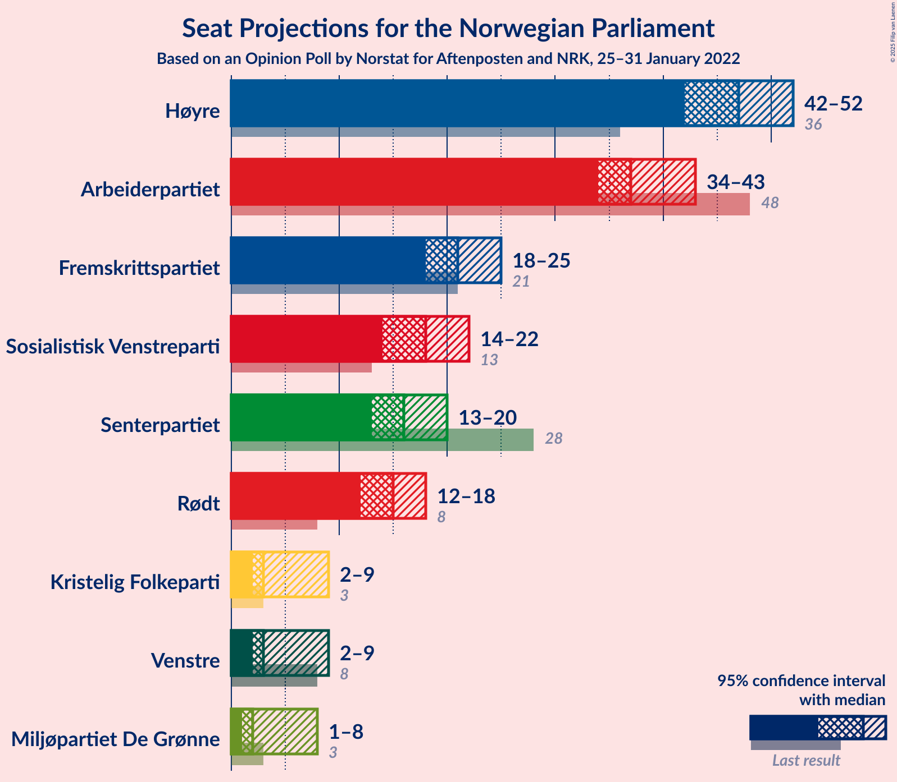
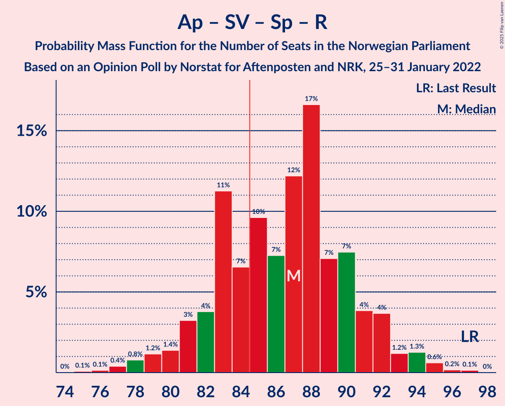
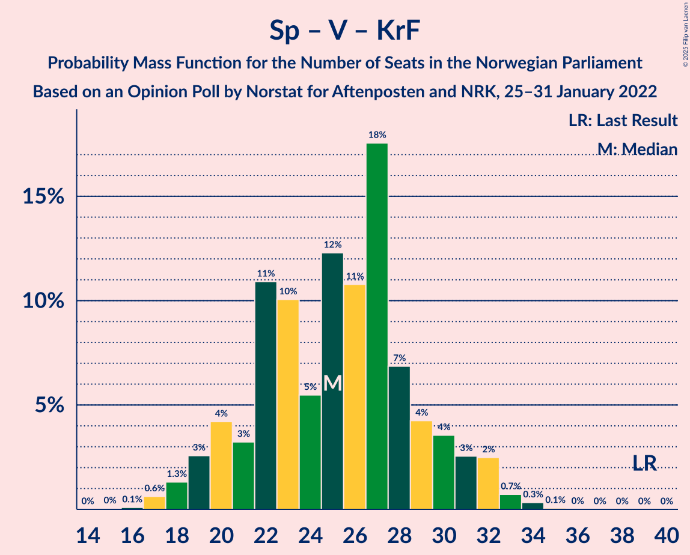

# Opinion Poll by Norstat for Aftenposten and NRK, 25–31 January 2022

<a href="#voting-intentions">Voting Intentions</a> | <a href="#seats">Seats</a> | <a href="#coalitions">Coalitions</a> | <a href="#technical-information">Technical Information</a>

## Voting Intentions

### Confidence Intervals

| Party | Last Result | Poll Result | 80% Confidence Interval | 90% Confidence Interval | 95% Confidence Interval | 99% Confidence Interval |
|:-----:|:-----------:|:-----------:|:-----------------------:|:-----------------------:|:-----------------------:|:-----------------------:|
| Høyre | 20.4% | 26.2% | 24.5–28.1% |24.0–28.7% |23.5–29.1% |22.7–30.0% |
| Arbeiderpartiet | 26.2% | 20.0% | 18.4–21.8% |18.0–22.3% |17.6–22.7% |16.9–23.6% |
| Fremskrittspartiet | 11.6% | 12.2% | 10.9–13.6% |10.5–14.1% |10.2–14.4% |9.7–15.1% |
| Sosialistisk Venstreparti | 7.6% | 10.4% | 9.2–11.8% |8.9–12.1% |8.6–12.5% |8.1–13.2% |
| Senterpartiet | 13.5% | 8.7% | 7.6–10.0% |7.3–10.4% |7.1–10.7% |6.6–11.3% |
| Rødt | 4.7% | 8.3% | 7.2–9.6% |7.0–9.9% |6.7–10.2% |6.2–10.9% |
| Venstre | 4.6% | 3.8% | 3.1–4.7% |2.9–5.0% |2.7–5.2% |2.4–5.7% |
| Kristelig Folkeparti | 3.8% | 3.6% | 2.9–4.5% |2.7–4.7% |2.6–5.0% |2.3–5.4% |
| Miljøpartiet De Grønne | 3.9% | 3.3% | 2.6–4.1% |2.4–4.4% |2.3–4.6% |2.0–5.0% |

*Note:* The poll result column reflects the actual value used in the calculations. Published results may vary slightly, and in addition be rounded to fewer digits.

## Seats

### Confidence Intervals

| Party | Last Result | Median | 80% Confidence Interval | 90% Confidence Interval | 95% Confidence Interval | 99% Confidence Interval |
|:-----:|:-----------:|:------:|:-----------------------:|:-----------------------:|:-----------------------:|:-----------------------:|
| <a href="#høyre">Høyre</a> | 36 | 47 | 43–51 |42–52 |42–52 |41–54 |
| <a href="#arbeiderpartiet">Arbeiderpartiet</a> | 48 | 37 | 36–40 |35–42 |34–43 |32–44 |
| <a href="#fremskrittspartiet">Fremskrittspartiet</a> | 21 | 21 | 19–24 |18–24 |18–25 |17–27 |
| <a href="#sosialistisk-venstreparti">Sosialistisk Venstreparti</a> | 13 | 18 | 16–20 |15–21 |14–22 |14–23 |
| <a href="#senterpartiet">Senterpartiet</a> | 28 | 16 | 14–18 |13–19 |13–20 |12–21 |
| <a href="#rødt">Rødt</a> | 8 | 15 | 12–17 |12–18 |12–18 |10–19 |
| <a href="#venstre">Venstre</a> | 8 | 3 | 2–8 |2–9 |2–9 |2–10 |
| <a href="#kristelig-folkeparti">Kristelig Folkeparti</a> | 3 | 3 | 2–8 |2–8 |2–9 |0–10 |
| <a href="#miljøpartiet-de-grønne">Miljøpartiet De Grønne</a> | 3 | 2 | 1–3 |1–7 |1–8 |1–9 |

### Høyre

*For a full overview of the results for this party, see the [Høyre](party-høyre.html) page.*

| Number of Seats | Probability | Accumulated | Special Marks |
|:---------------:|:-----------:|:-----------:|:-------------:|
| 36 | 0% | 100% | Last Result |
| 37 | 0% | 100% |  |
| 38 | 0% | 100% |  |
| 39 | 0.1% | 100% |  |
| 40 | 0.3% | 99.9% |  |
| 41 | 1.2% | 99.6% |  |
| 42 | 5% | 98% |  |
| 43 | 5% | 94% |  |
| 44 | 8% | 89% |  |
| 45 | 11% | 81% |  |
| 46 | 16% | 70% |  |
| 47 | 13% | 54% | Median |
| 48 | 16% | 41% |  |
| 49 | 6% | 25% |  |
| 50 | 6% | 20% |  |
| 51 | 7% | 14% |  |
| 52 | 5% | 7% |  |
| 53 | 1.2% | 2% |  |
| 54 | 0.6% | 0.9% |  |
| 55 | 0.1% | 0.3% |  |
| 56 | 0.1% | 0.2% |  |
| 57 | 0.1% | 0.1% |  |
| 58 | 0% | 0% |  |

### Arbeiderpartiet

*For a full overview of the results for this party, see the [Arbeiderpartiet](party-arbeiderpartiet.html) page.*

| Number of Seats | Probability | Accumulated | Special Marks |
|:---------------:|:-----------:|:-----------:|:-------------:|
| 30 | 0% | 100% |  |
| 31 | 0.2% | 99.9% |  |
| 32 | 0.7% | 99.8% |  |
| 33 | 1.0% | 99.0% |  |
| 34 | 2% | 98% |  |
| 35 | 5% | 96% |  |
| 36 | 12% | 92% |  |
| 37 | 30% | 79% | Median |
| 38 | 15% | 50% |  |
| 39 | 12% | 35% |  |
| 40 | 13% | 23% |  |
| 41 | 4% | 10% |  |
| 42 | 4% | 6% |  |
| 43 | 2% | 3% |  |
| 44 | 0.7% | 1.0% |  |
| 45 | 0.2% | 0.3% |  |
| 46 | 0.1% | 0.1% |  |
| 47 | 0% | 0% |  |
| 48 | 0% | 0% | Last Result |

### Fremskrittspartiet

*For a full overview of the results for this party, see the [Fremskrittspartiet](party-fremskrittspartiet.html) page.*

| Number of Seats | Probability | Accumulated | Special Marks |
|:---------------:|:-----------:|:-----------:|:-------------:|
| 16 | 0.1% | 100% |  |
| 17 | 2% | 99.9% |  |
| 18 | 5% | 98% |  |
| 19 | 13% | 93% |  |
| 20 | 21% | 81% |  |
| 21 | 18% | 59% | Last Result, Median |
| 22 | 15% | 42% |  |
| 23 | 13% | 27% |  |
| 24 | 10% | 14% |  |
| 25 | 2% | 4% |  |
| 26 | 1.4% | 2% |  |
| 27 | 0.7% | 0.9% |  |
| 28 | 0.1% | 0.2% |  |
| 29 | 0% | 0.1% |  |
| 30 | 0% | 0% |  |

### Sosialistisk Venstreparti

*For a full overview of the results for this party, see the [Sosialistisk Venstreparti](party-sosialistiskvenstreparti.html) page.*

| Number of Seats | Probability | Accumulated | Special Marks |
|:---------------:|:-----------:|:-----------:|:-------------:|
| 12 | 0.1% | 100% |  |
| 13 | 0.3% | 99.9% | Last Result |
| 14 | 3% | 99.5% |  |
| 15 | 6% | 97% |  |
| 16 | 12% | 91% |  |
| 17 | 19% | 79% |  |
| 18 | 23% | 59% | Median |
| 19 | 14% | 36% |  |
| 20 | 14% | 22% |  |
| 21 | 5% | 8% |  |
| 22 | 2% | 3% |  |
| 23 | 1.1% | 1.3% |  |
| 24 | 0.2% | 0.3% |  |
| 25 | 0.1% | 0.1% |  |
| 26 | 0% | 0% |  |

### Senterpartiet

*For a full overview of the results for this party, see the [Senterpartiet](party-senterpartiet.html) page.*

| Number of Seats | Probability | Accumulated | Special Marks |
|:---------------:|:-----------:|:-----------:|:-------------:|
| 11 | 0.2% | 100% |  |
| 12 | 1.1% | 99.8% |  |
| 13 | 5% | 98.7% |  |
| 14 | 11% | 94% |  |
| 15 | 15% | 82% |  |
| 16 | 26% | 67% | Median |
| 17 | 21% | 41% |  |
| 18 | 12% | 20% |  |
| 19 | 4% | 8% |  |
| 20 | 3% | 4% |  |
| 21 | 0.4% | 0.5% |  |
| 22 | 0.1% | 0.2% |  |
| 23 | 0% | 0% |  |
| 24 | 0% | 0% |  |
| 25 | 0% | 0% |  |
| 26 | 0% | 0% |  |
| 27 | 0% | 0% |  |
| 28 | 0% | 0% | Last Result |

### Rødt

*For a full overview of the results for this party, see the [Rødt](party-rødt.html) page.*

| Number of Seats | Probability | Accumulated | Special Marks |
|:---------------:|:-----------:|:-----------:|:-------------:|
| 8 | 0% | 100% | Last Result |
| 9 | 0.1% | 100% |  |
| 10 | 0.5% | 99.9% |  |
| 11 | 2% | 99.4% |  |
| 12 | 9% | 98% |  |
| 13 | 19% | 88% |  |
| 14 | 14% | 70% |  |
| 15 | 38% | 55% | Median |
| 16 | 6% | 18% |  |
| 17 | 6% | 11% |  |
| 18 | 5% | 6% |  |
| 19 | 0.8% | 1.1% |  |
| 20 | 0.2% | 0.3% |  |
| 21 | 0.1% | 0.1% |  |
| 22 | 0% | 0% |  |

### Venstre

*For a full overview of the results for this party, see the [Venstre](party-venstre.html) page.*

| Number of Seats | Probability | Accumulated | Special Marks |
|:---------------:|:-----------:|:-----------:|:-------------:|
| 1 | 0.2% | 100% |  |
| 2 | 24% | 99.8% |  |
| 3 | 30% | 76% | Median |
| 4 | 0% | 46% |  |
| 5 | 0% | 46% |  |
| 6 | 0.5% | 46% |  |
| 7 | 21% | 46% |  |
| 8 | 17% | 24% | Last Result |
| 9 | 6% | 7% |  |
| 10 | 1.4% | 2% |  |
| 11 | 0.2% | 0.2% |  |
| 12 | 0% | 0% |  |

### Kristelig Folkeparti

*For a full overview of the results for this party, see the [Kristelig Folkeparti](party-kristeligfolkeparti.html) page.*

| Number of Seats | Probability | Accumulated | Special Marks |
|:---------------:|:-----------:|:-----------:|:-------------:|
| 0 | 0.5% | 100% |  |
| 1 | 0.3% | 99.5% |  |
| 2 | 31% | 99.2% |  |
| 3 | 37% | 68% | Last Result, Median |
| 4 | 0% | 31% |  |
| 5 | 0% | 31% |  |
| 6 | 2% | 31% |  |
| 7 | 9% | 29% |  |
| 8 | 16% | 20% |  |
| 9 | 3% | 4% |  |
| 10 | 0.5% | 0.5% |  |
| 11 | 0% | 0% |  |

### Miljøpartiet De Grønne

*For a full overview of the results for this party, see the [Miljøpartiet De Grønne](party-miljøpartietdegrønne.html) page.*

| Number of Seats | Probability | Accumulated | Special Marks |
|:---------------:|:-----------:|:-----------:|:-------------:|
| 0 | 0.1% | 100% |  |
| 1 | 28% | 99.9% |  |
| 2 | 54% | 72% | Median |
| 3 | 9% | 18% | Last Result |
| 4 | 0.3% | 9% |  |
| 5 | 0% | 9% |  |
| 6 | 0.6% | 9% |  |
| 7 | 5% | 8% |  |
| 8 | 2% | 3% |  |
| 9 | 0.6% | 0.6% |  |
| 10 | 0% | 0.1% |  |
| 11 | 0% | 0% |  |

## Coalitions

### Confidence Intervals

| Coalition | Last Result | Median | Majority? | 80% Confidence Interval | 90% Confidence Interval | 95% Confidence Interval | 99% Confidence Interval |
|:---------:|:-----------:|:------:|:---------:|:-----------------------:|:-----------------------:|:-----------------------:|:-----------------------:|
| Høyre – Fremskrittspartiet – Senterpartiet – Venstre – Kristelig Folkeparti | 96 | 94 | 98% | 89–99 | 87–99 | 85–100 | 84–102 |
| Arbeiderpartiet – Sosialistisk Venstreparti – Senterpartiet – Rødt – Miljøpartiet De Grønne | 100 | 89 | 86% | 84–93 | 83–94 | 82–96 | 79–98 |
| Arbeiderpartiet – Sosialistisk Venstreparti – Senterpartiet – Rødt | 97 | 87 | 71% | 82–91 | 81–92 | 79–93 | 77–95 |
| Høyre – Fremskrittspartiet – Venstre – Kristelig Folkeparti – Miljøpartiet De Grønne | 71 | 80 | 13% | 74–85 | 73–85 | 72–86 | 70–89 |
| Arbeiderpartiet – Sosialistisk Venstreparti – Senterpartiet – Kristelig Folkeparti – Miljøpartiet De Grønne | 95 | 78 | 6% | 74–83 | 72–85 | 71–86 | 70–89 |
| Høyre – Fremskrittspartiet – Venstre – Kristelig Folkeparti | 68 | 78 | 2% | 72–83 | 71–84 | 70–84 | 67–86 |
| Arbeiderpartiet – Sosialistisk Venstreparti – Senterpartiet – Miljøpartiet De Grønne | 92 | 74 | 0.2% | 70–79 | 69–80 | 68–81 | 66–83 |
| Høyre – Fremskrittspartiet – Venstre | 65 | 73 | 0.1% | 69–78 | 67–79 | 66–81 | 64–82 |
| Arbeiderpartiet – Sosialistisk Venstreparti – Rødt – Miljøpartiet De Grønne | 72 | 73 | 0.1% | 68–76 | 68–78 | 67–79 | 64–82 |
| Arbeiderpartiet – Sosialistisk Venstreparti – Senterpartiet | 89 | 72 | 0% | 68–76 | 67–77 | 66–78 | 64–80 |
| Høyre – Fremskrittspartiet | 57 | 68 | 0% | 64–73 | 62–74 | 62–75 | 60–78 |
| Arbeiderpartiet – Senterpartiet – Kristelig Folkeparti – Miljøpartiet De Grønne | 82 | 60 | 0% | 56–65 | 55–67 | 54–68 | 52–70 |
| Arbeiderpartiet – Senterpartiet – Kristelig Folkeparti | 79 | 58 | 0% | 54–63 | 53–63 | 52–64 | 50–65 |
| Høyre – Venstre – Kristelig Folkeparti | 47 | 56 | 0% | 52–61 | 50–62 | 48–63 | 47–65 |
| Arbeiderpartiet – Sosialistisk Venstreparti | 61 | 56 | 0% | 53–59 | 52–60 | 51–61 | 49–63 |
| Arbeiderpartiet – Senterpartiet | 76 | 54 | 0% | 51–57 | 50–58 | 49–58 | 46–60 |
| Senterpartiet – Venstre – Kristelig Folkeparti | 39 | 25 | 0% | 21–29 | 20–31 | 19–32 | 17–33 |

### Høyre – Fremskrittspartiet – Senterpartiet – Venstre – Kristelig Folkeparti

| Number of Seats | Probability | Accumulated | Special Marks |
|:---------------:|:-----------:|:-----------:|:-------------:|
| 81 | 0.1% | 100% |  |
| 82 | 0.1% | 99.9% |  |
| 83 | 0.2% | 99.8% |  |
| 84 | 1.3% | 99.5% |  |
| 85 | 0.9% | 98% | Majority |
| 86 | 2% | 97% |  |
| 87 | 1.5% | 96% |  |
| 88 | 4% | 94% |  |
| 89 | 9% | 90% |  |
| 90 | 5% | 82% | Median |
| 91 | 5% | 77% |  |
| 92 | 8% | 72% |  |
| 93 | 13% | 64% |  |
| 94 | 15% | 51% |  |
| 95 | 9% | 37% |  |
| 96 | 9% | 28% | Last Result |
| 97 | 5% | 19% |  |
| 98 | 4% | 15% |  |
| 99 | 7% | 11% |  |
| 100 | 2% | 4% |  |
| 101 | 0.9% | 2% |  |
| 102 | 0.7% | 0.8% |  |
| 103 | 0.1% | 0.2% |  |
| 104 | 0.1% | 0.1% |  |
| 105 | 0% | 0% |  |

### Arbeiderpartiet – Sosialistisk Venstreparti – Senterpartiet – Rødt – Miljøpartiet De Grønne

| Number of Seats | Probability | Accumulated | Special Marks |
|:---------------:|:-----------:|:-----------:|:-------------:|
| 77 | 0% | 100% |  |
| 78 | 0.2% | 99.9% |  |
| 79 | 0.4% | 99.8% |  |
| 80 | 0.7% | 99.4% |  |
| 81 | 0.9% | 98.7% |  |
| 82 | 1.2% | 98% |  |
| 83 | 3% | 97% |  |
| 84 | 8% | 94% |  |
| 85 | 8% | 86% | Majority |
| 86 | 6% | 78% |  |
| 87 | 6% | 73% |  |
| 88 | 7% | 66% | Median |
| 89 | 16% | 60% |  |
| 90 | 15% | 44% |  |
| 91 | 7% | 28% |  |
| 92 | 8% | 21% |  |
| 93 | 4% | 13% |  |
| 94 | 4% | 9% |  |
| 95 | 2% | 5% |  |
| 96 | 2% | 3% |  |
| 97 | 0.6% | 1.3% |  |
| 98 | 0.3% | 0.7% |  |
| 99 | 0.2% | 0.3% |  |
| 100 | 0.1% | 0.2% | Last Result |
| 101 | 0% | 0% |  |

### Arbeiderpartiet – Sosialistisk Venstreparti – Senterpartiet – Rødt

| Number of Seats | Probability | Accumulated | Special Marks |
|:---------------:|:-----------:|:-----------:|:-------------:|
| 75 | 0.1% | 100% |  |
| 76 | 0.1% | 99.9% |  |
| 77 | 0.4% | 99.7% |  |
| 78 | 0.8% | 99.3% |  |
| 79 | 1.2% | 98.6% |  |
| 80 | 1.4% | 97% |  |
| 81 | 3% | 96% |  |
| 82 | 4% | 93% |  |
| 83 | 11% | 89% |  |
| 84 | 7% | 78% |  |
| 85 | 10% | 71% | Majority |
| 86 | 7% | 62% | Median |
| 87 | 12% | 54% |  |
| 88 | 17% | 42% |  |
| 89 | 7% | 25% |  |
| 90 | 7% | 18% |  |
| 91 | 4% | 11% |  |
| 92 | 4% | 7% |  |
| 93 | 1.2% | 3% |  |
| 94 | 1.3% | 2% |  |
| 95 | 0.6% | 1.0% |  |
| 96 | 0.2% | 0.4% |  |
| 97 | 0.1% | 0.2% | Last Result |
| 98 | 0% | 0% |  |

### Høyre – Fremskrittspartiet – Venstre – Kristelig Folkeparti – Miljøpartiet De Grønne

| Number of Seats | Probability | Accumulated | Special Marks |
|:---------------:|:-----------:|:-----------:|:-------------:|
| 68 | 0% | 100% |  |
| 69 | 0.3% | 99.9% |  |
| 70 | 0.3% | 99.6% |  |
| 71 | 1.1% | 99.2% | Last Result |
| 72 | 0.9% | 98% |  |
| 73 | 3% | 97% |  |
| 74 | 7% | 94% |  |
| 75 | 2% | 87% |  |
| 76 | 8% | 85% | Median |
| 77 | 7% | 77% |  |
| 78 | 9% | 71% |  |
| 79 | 8% | 61% |  |
| 80 | 16% | 54% |  |
| 81 | 8% | 38% |  |
| 82 | 6% | 30% |  |
| 83 | 6% | 23% |  |
| 84 | 4% | 17% |  |
| 85 | 10% | 13% | Majority |
| 86 | 2% | 3% |  |
| 87 | 0.9% | 2% |  |
| 88 | 0.3% | 0.9% |  |
| 89 | 0.3% | 0.6% |  |
| 90 | 0.2% | 0.3% |  |
| 91 | 0.1% | 0.1% |  |
| 92 | 0% | 0% |  |

### Arbeiderpartiet – Sosialistisk Venstreparti – Senterpartiet – Kristelig Folkeparti – Miljøpartiet De Grønne

| Number of Seats | Probability | Accumulated | Special Marks |
|:---------------:|:-----------:|:-----------:|:-------------:|
| 67 | 0% | 100% |  |
| 68 | 0.1% | 99.9% |  |
| 69 | 0.3% | 99.9% |  |
| 70 | 0.5% | 99.5% |  |
| 71 | 2% | 99.0% |  |
| 72 | 3% | 97% |  |
| 73 | 2% | 94% |  |
| 74 | 5% | 92% |  |
| 75 | 5% | 87% |  |
| 76 | 7% | 82% | Median |
| 77 | 17% | 74% |  |
| 78 | 15% | 57% |  |
| 79 | 7% | 42% |  |
| 80 | 9% | 35% |  |
| 81 | 5% | 26% |  |
| 82 | 7% | 21% |  |
| 83 | 5% | 14% |  |
| 84 | 3% | 9% |  |
| 85 | 2% | 6% | Majority |
| 86 | 2% | 3% |  |
| 87 | 0.4% | 1.2% |  |
| 88 | 0.2% | 0.7% |  |
| 89 | 0.1% | 0.5% |  |
| 90 | 0.4% | 0.4% |  |
| 91 | 0% | 0% |  |
| 92 | 0% | 0% |  |
| 93 | 0% | 0% |  |
| 94 | 0% | 0% |  |
| 95 | 0% | 0% | Last Result |

### Høyre – Fremskrittspartiet – Venstre – Kristelig Folkeparti

| Number of Seats | Probability | Accumulated | Special Marks |
|:---------------:|:-----------:|:-----------:|:-------------:|
| 65 | 0.1% | 100% |  |
| 66 | 0.1% | 99.8% |  |
| 67 | 0.4% | 99.8% |  |
| 68 | 0.6% | 99.3% | Last Result |
| 69 | 0.9% | 98.7% |  |
| 70 | 1.2% | 98% |  |
| 71 | 3% | 97% |  |
| 72 | 8% | 94% |  |
| 73 | 4% | 86% |  |
| 74 | 7% | 82% | Median |
| 75 | 5% | 75% |  |
| 76 | 11% | 70% |  |
| 77 | 9% | 59% |  |
| 78 | 16% | 50% |  |
| 79 | 9% | 35% |  |
| 80 | 6% | 26% |  |
| 81 | 5% | 20% |  |
| 82 | 3% | 15% |  |
| 83 | 6% | 12% |  |
| 84 | 4% | 6% |  |
| 85 | 0.9% | 2% | Majority |
| 86 | 0.2% | 0.7% |  |
| 87 | 0.2% | 0.5% |  |
| 88 | 0.2% | 0.3% |  |
| 89 | 0.1% | 0.1% |  |
| 90 | 0% | 0% |  |

### Arbeiderpartiet – Sosialistisk Venstreparti – Senterpartiet – Miljøpartiet De Grønne

| Number of Seats | Probability | Accumulated | Special Marks |
|:---------------:|:-----------:|:-----------:|:-------------:|
| 64 | 0% | 100% |  |
| 65 | 0.1% | 99.9% |  |
| 66 | 0.4% | 99.8% |  |
| 67 | 0.7% | 99.4% |  |
| 68 | 2% | 98.7% |  |
| 69 | 5% | 97% |  |
| 70 | 5% | 92% |  |
| 71 | 6% | 86% |  |
| 72 | 10% | 80% |  |
| 73 | 6% | 71% | Median |
| 74 | 17% | 64% |  |
| 75 | 17% | 47% |  |
| 76 | 7% | 30% |  |
| 77 | 9% | 24% |  |
| 78 | 4% | 15% |  |
| 79 | 5% | 11% |  |
| 80 | 3% | 7% |  |
| 81 | 3% | 4% |  |
| 82 | 0.6% | 1.4% |  |
| 83 | 0.5% | 0.7% |  |
| 84 | 0.1% | 0.3% |  |
| 85 | 0.1% | 0.2% | Majority |
| 86 | 0% | 0.1% |  |
| 87 | 0.1% | 0.1% |  |
| 88 | 0% | 0% |  |
| 89 | 0% | 0% |  |
| 90 | 0% | 0% |  |
| 91 | 0% | 0% |  |
| 92 | 0% | 0% | Last Result |

### Høyre – Fremskrittspartiet – Venstre

| Number of Seats | Probability | Accumulated | Special Marks |
|:---------------:|:-----------:|:-----------:|:-------------:|
| 62 | 0.2% | 100% |  |
| 63 | 0.2% | 99.8% |  |
| 64 | 0.3% | 99.6% |  |
| 65 | 1.2% | 99.3% | Last Result |
| 66 | 1.3% | 98% |  |
| 67 | 2% | 97% |  |
| 68 | 3% | 95% |  |
| 69 | 12% | 92% |  |
| 70 | 8% | 80% |  |
| 71 | 9% | 71% | Median |
| 72 | 7% | 63% |  |
| 73 | 8% | 56% |  |
| 74 | 8% | 48% |  |
| 75 | 13% | 40% |  |
| 76 | 9% | 27% |  |
| 77 | 6% | 18% |  |
| 78 | 4% | 11% |  |
| 79 | 2% | 7% |  |
| 80 | 2% | 5% |  |
| 81 | 2% | 3% |  |
| 82 | 0.4% | 0.7% |  |
| 83 | 0.2% | 0.3% |  |
| 84 | 0% | 0.1% |  |
| 85 | 0% | 0.1% | Majority |
| 86 | 0% | 0% |  |

### Arbeiderpartiet – Sosialistisk Venstreparti – Rødt – Miljøpartiet De Grønne

| Number of Seats | Probability | Accumulated | Special Marks |
|:---------------:|:-----------:|:-----------:|:-------------:|
| 62 | 0% | 100% |  |
| 63 | 0.2% | 99.9% |  |
| 64 | 0.4% | 99.8% |  |
| 65 | 0.4% | 99.4% |  |
| 66 | 1.4% | 99.0% |  |
| 67 | 2% | 98% |  |
| 68 | 6% | 95% |  |
| 69 | 9% | 90% |  |
| 70 | 5% | 80% |  |
| 71 | 7% | 75% |  |
| 72 | 17% | 67% | Last Result, Median |
| 73 | 9% | 51% |  |
| 74 | 15% | 41% |  |
| 75 | 10% | 26% |  |
| 76 | 7% | 16% |  |
| 77 | 4% | 10% |  |
| 78 | 2% | 6% |  |
| 79 | 2% | 4% |  |
| 80 | 0.9% | 2% |  |
| 81 | 0.5% | 1.1% |  |
| 82 | 0.3% | 0.6% |  |
| 83 | 0.1% | 0.2% |  |
| 84 | 0.1% | 0.1% |  |
| 85 | 0% | 0.1% | Majority |
| 86 | 0% | 0% |  |

### Arbeiderpartiet – Sosialistisk Venstreparti – Senterpartiet

| Number of Seats | Probability | Accumulated | Special Marks |
|:---------------:|:-----------:|:-----------:|:-------------:|
| 61 | 0.1% | 100% |  |
| 62 | 0% | 99.9% |  |
| 63 | 0.2% | 99.9% |  |
| 64 | 0.3% | 99.7% |  |
| 65 | 0.6% | 99.4% |  |
| 66 | 2% | 98.8% |  |
| 67 | 4% | 97% |  |
| 68 | 9% | 93% |  |
| 69 | 4% | 85% |  |
| 70 | 7% | 80% |  |
| 71 | 12% | 73% | Median |
| 72 | 16% | 62% |  |
| 73 | 20% | 45% |  |
| 74 | 7% | 25% |  |
| 75 | 7% | 18% |  |
| 76 | 4% | 11% |  |
| 77 | 3% | 7% |  |
| 78 | 3% | 4% |  |
| 79 | 1.2% | 2% |  |
| 80 | 0.3% | 0.5% |  |
| 81 | 0.2% | 0.2% |  |
| 82 | 0% | 0.1% |  |
| 83 | 0% | 0% |  |
| 84 | 0% | 0% |  |
| 85 | 0% | 0% | Majority |
| 86 | 0% | 0% |  |
| 87 | 0% | 0% |  |
| 88 | 0% | 0% |  |
| 89 | 0% | 0% | Last Result |

### Høyre – Fremskrittspartiet

| Number of Seats | Probability | Accumulated | Special Marks |
|:---------------:|:-----------:|:-----------:|:-------------:|
| 57 | 0% | 100% | Last Result |
| 58 | 0% | 100% |  |
| 59 | 0.1% | 100% |  |
| 60 | 1.0% | 99.8% |  |
| 61 | 1.2% | 98.8% |  |
| 62 | 4% | 98% |  |
| 63 | 3% | 94% |  |
| 64 | 5% | 91% |  |
| 65 | 6% | 86% |  |
| 66 | 11% | 80% |  |
| 67 | 12% | 69% |  |
| 68 | 17% | 57% | Median |
| 69 | 7% | 40% |  |
| 70 | 7% | 33% |  |
| 71 | 5% | 26% |  |
| 72 | 9% | 21% |  |
| 73 | 6% | 12% |  |
| 74 | 3% | 6% |  |
| 75 | 2% | 3% |  |
| 76 | 0.3% | 2% |  |
| 77 | 0.7% | 1.2% |  |
| 78 | 0.3% | 0.5% |  |
| 79 | 0.2% | 0.2% |  |
| 80 | 0% | 0% |  |

### Arbeiderpartiet – Senterpartiet – Kristelig Folkeparti – Miljøpartiet De Grønne

| Number of Seats | Probability | Accumulated | Special Marks |
|:---------------:|:-----------:|:-----------:|:-------------:|
| 49 | 0% | 100% |  |
| 50 | 0.1% | 99.9% |  |
| 51 | 0.2% | 99.9% |  |
| 52 | 0.3% | 99.6% |  |
| 53 | 1.0% | 99.3% |  |
| 54 | 1.5% | 98% |  |
| 55 | 3% | 97% |  |
| 56 | 5% | 94% |  |
| 57 | 9% | 89% |  |
| 58 | 11% | 80% | Median |
| 59 | 10% | 68% |  |
| 60 | 12% | 58% |  |
| 61 | 12% | 46% |  |
| 62 | 7% | 34% |  |
| 63 | 7% | 28% |  |
| 64 | 6% | 21% |  |
| 65 | 6% | 14% |  |
| 66 | 3% | 9% |  |
| 67 | 3% | 6% |  |
| 68 | 2% | 3% |  |
| 69 | 0.4% | 1.1% |  |
| 70 | 0.5% | 0.7% |  |
| 71 | 0.1% | 0.2% |  |
| 72 | 0% | 0.1% |  |
| 73 | 0% | 0.1% |  |
| 74 | 0% | 0% |  |
| 75 | 0% | 0% |  |
| 76 | 0% | 0% |  |
| 77 | 0% | 0% |  |
| 78 | 0% | 0% |  |
| 79 | 0% | 0% |  |
| 80 | 0% | 0% |  |
| 81 | 0% | 0% |  |
| 82 | 0% | 0% | Last Result |

### Arbeiderpartiet – Senterpartiet – Kristelig Folkeparti

| Number of Seats | Probability | Accumulated | Special Marks |
|:---------------:|:-----------:|:-----------:|:-------------:|
| 47 | 0.1% | 100% |  |
| 48 | 0.1% | 99.9% |  |
| 49 | 0.3% | 99.8% |  |
| 50 | 0.4% | 99.5% |  |
| 51 | 1.5% | 99.1% |  |
| 52 | 1.5% | 98% |  |
| 53 | 3% | 96% |  |
| 54 | 4% | 94% |  |
| 55 | 9% | 89% |  |
| 56 | 12% | 80% | Median |
| 57 | 12% | 68% |  |
| 58 | 8% | 56% |  |
| 59 | 15% | 47% |  |
| 60 | 8% | 33% |  |
| 61 | 8% | 24% |  |
| 62 | 4% | 16% |  |
| 63 | 7% | 12% |  |
| 64 | 3% | 5% |  |
| 65 | 1.3% | 2% |  |
| 66 | 0.2% | 0.5% |  |
| 67 | 0.2% | 0.3% |  |
| 68 | 0% | 0% |  |
| 69 | 0% | 0% |  |
| 70 | 0% | 0% |  |
| 71 | 0% | 0% |  |
| 72 | 0% | 0% |  |
| 73 | 0% | 0% |  |
| 74 | 0% | 0% |  |
| 75 | 0% | 0% |  |
| 76 | 0% | 0% |  |
| 77 | 0% | 0% |  |
| 78 | 0% | 0% |  |
| 79 | 0% | 0% | Last Result |

### Høyre – Venstre – Kristelig Folkeparti

| Number of Seats | Probability | Accumulated | Special Marks |
|:---------------:|:-----------:|:-----------:|:-------------:|
| 45 | 0.1% | 100% |  |
| 46 | 0.2% | 99.9% |  |
| 47 | 0.7% | 99.7% | Last Result |
| 48 | 2% | 99.1% |  |
| 49 | 1.4% | 97% |  |
| 50 | 3% | 96% |  |
| 51 | 2% | 93% |  |
| 52 | 9% | 90% |  |
| 53 | 6% | 81% | Median |
| 54 | 10% | 75% |  |
| 55 | 11% | 65% |  |
| 56 | 10% | 54% |  |
| 57 | 10% | 44% |  |
| 58 | 9% | 34% |  |
| 59 | 5% | 24% |  |
| 60 | 5% | 19% |  |
| 61 | 4% | 13% |  |
| 62 | 5% | 9% |  |
| 63 | 3% | 5% |  |
| 64 | 0.6% | 1.2% |  |
| 65 | 0.2% | 0.6% |  |
| 66 | 0.2% | 0.4% |  |
| 67 | 0.1% | 0.2% |  |
| 68 | 0% | 0% |  |

### Arbeiderpartiet – Sosialistisk Venstreparti

| Number of Seats | Probability | Accumulated | Special Marks |
|:---------------:|:-----------:|:-----------:|:-------------:|
| 47 | 0.1% | 100% |  |
| 48 | 0.1% | 99.9% |  |
| 49 | 0.3% | 99.7% |  |
| 50 | 0.9% | 99.4% |  |
| 51 | 3% | 98.5% |  |
| 52 | 5% | 96% |  |
| 53 | 9% | 91% |  |
| 54 | 8% | 82% |  |
| 55 | 19% | 73% | Median |
| 56 | 11% | 54% |  |
| 57 | 22% | 43% |  |
| 58 | 9% | 21% |  |
| 59 | 4% | 12% |  |
| 60 | 4% | 9% |  |
| 61 | 3% | 5% | Last Result |
| 62 | 1.0% | 2% |  |
| 63 | 0.8% | 1.3% |  |
| 64 | 0.3% | 0.5% |  |
| 65 | 0.2% | 0.2% |  |
| 66 | 0% | 0% |  |

### Arbeiderpartiet – Senterpartiet

| Number of Seats | Probability | Accumulated | Special Marks |
|:---------------:|:-----------:|:-----------:|:-------------:|
| 45 | 0.2% | 100% |  |
| 46 | 0.4% | 99.8% |  |
| 47 | 0.4% | 99.4% |  |
| 48 | 1.2% | 99.0% |  |
| 49 | 2% | 98% |  |
| 50 | 2% | 96% |  |
| 51 | 7% | 94% |  |
| 52 | 8% | 86% |  |
| 53 | 18% | 79% | Median |
| 54 | 17% | 60% |  |
| 55 | 14% | 43% |  |
| 56 | 14% | 29% |  |
| 57 | 9% | 14% |  |
| 58 | 4% | 6% |  |
| 59 | 2% | 2% |  |
| 60 | 0.5% | 0.6% |  |
| 61 | 0.1% | 0.1% |  |
| 62 | 0% | 0% |  |
| 63 | 0% | 0% |  |
| 64 | 0% | 0% |  |
| 65 | 0% | 0% |  |
| 66 | 0% | 0% |  |
| 67 | 0% | 0% |  |
| 68 | 0% | 0% |  |
| 69 | 0% | 0% |  |
| 70 | 0% | 0% |  |
| 71 | 0% | 0% |  |
| 72 | 0% | 0% |  |
| 73 | 0% | 0% |  |
| 74 | 0% | 0% |  |
| 75 | 0% | 0% |  |
| 76 | 0% | 0% | Last Result |

### Senterpartiet – Venstre – Kristelig Folkeparti

| Number of Seats | Probability | Accumulated | Special Marks |
|:---------------:|:-----------:|:-----------:|:-------------:|
| 16 | 0.1% | 100% |  |
| 17 | 0.6% | 99.9% |  |
| 18 | 1.3% | 99.2% |  |
| 19 | 3% | 98% |  |
| 20 | 4% | 95% |  |
| 21 | 3% | 91% |  |
| 22 | 11% | 88% | Median |
| 23 | 10% | 77% |  |
| 24 | 5% | 67% |  |
| 25 | 12% | 61% |  |
| 26 | 11% | 49% |  |
| 27 | 18% | 38% |  |
| 28 | 7% | 21% |  |
| 29 | 4% | 14% |  |
| 30 | 4% | 10% |  |
| 31 | 3% | 6% |  |
| 32 | 2% | 4% |  |
| 33 | 0.7% | 1.1% |  |
| 34 | 0.3% | 0.4% |  |
| 35 | 0.1% | 0.1% |  |
| 36 | 0% | 0% |  |
| 37 | 0% | 0% |  |
| 38 | 0% | 0% |  |
| 39 | 0% | 0% | Last Result |

## Technical Information

### Opinion Poll

+ **Polling firm:** Norstat
+ **Commissioner(s):** Aftenposten and NRK
+ **Fieldwork period:** 25–31 January 2022

### Calculations

+ **Sample size:** 953
+ **Simulations done:** 1,048,576
+ **Error estimate:** 2.33%

