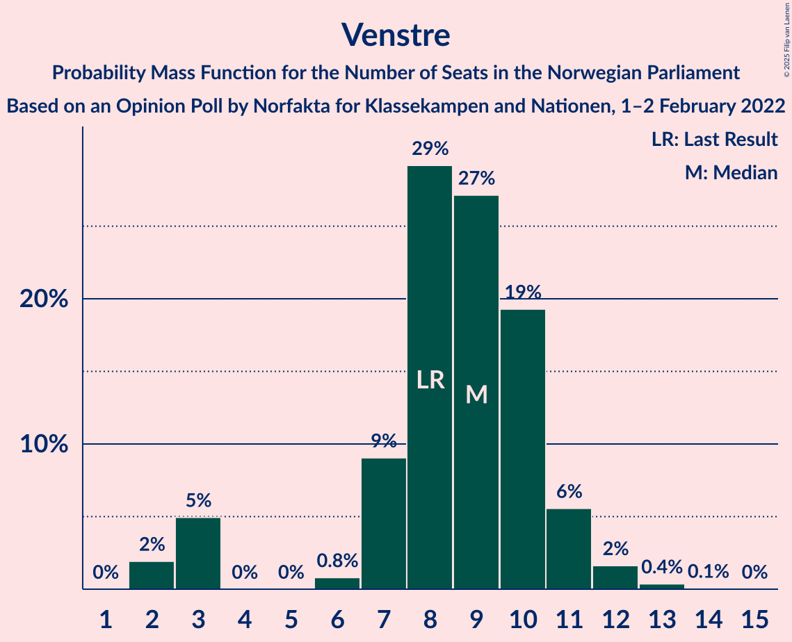

# Opinion Poll by Norfakta for Klassekampen and Nationen, 1–2 February 2022

<a href="#voting-intentions">Voting Intentions</a> | <a href="#seats">Seats</a> | <a href="#coalitions">Coalitions</a> | <a href="#technical-information">Technical Information</a>

## Voting Intentions

### Confidence Intervals

| Party | Last Result | Poll Result | 80% Confidence Interval | 90% Confidence Interval | 95% Confidence Interval | 99% Confidence Interval |
|:-----:|:-----------:|:-----------:|:-----------------------:|:-----------------------:|:-----------------------:|:-----------------------:|
| Høyre | 20.4% | 25.7% | 23.8–27.8% |23.3–28.3% |22.8–28.8% |22.0–29.8% |
| Arbeiderpartiet | 26.2% | 23.4% | 21.6–25.4% |21.1–26.0% |20.6–26.4% |19.8–27.4% |
| Fremskrittspartiet | 11.6% | 12.2% | 10.8–13.8% |10.5–14.2% |10.1–14.6% |9.5–15.4% |
| Sosialistisk Venstreparti | 7.6% | 8.5% | 7.4–9.9% |7.1–10.3% |6.8–10.7% |6.3–11.4% |
| Rødt | 4.7% | 8.4% | 7.3–9.8% |7.0–10.2% |6.7–10.5% |6.2–11.2% |
| Senterpartiet | 13.5% | 7.2% | 6.2–8.5% |5.9–8.9% |5.6–9.2% |5.2–9.8% |
| Venstre | 4.6% | 5.0% | 4.1–6.1% |3.9–6.4% |3.7–6.7% |3.3–7.3% |
| Kristelig Folkeparti | 3.8% | 3.7% | 2.9–4.6% |2.7–4.9% |2.6–5.2% |2.3–5.7% |
| Miljøpartiet De Grønne | 3.9% | 2.6% | 2.0–3.4% |1.8–3.7% |1.7–3.9% |1.4–4.3% |

*Note:* The poll result column reflects the actual value used in the calculations. Published results may vary slightly, and in addition be rounded to fewer digits.

## Seats

### Confidence Intervals

| Party | Last Result | Median | 80% Confidence Interval | 90% Confidence Interval | 95% Confidence Interval | 99% Confidence Interval |
|:-----:|:-----------:|:------:|:-----------------------:|:-----------------------:|:-----------------------:|:-----------------------:|
| <a href="#høyre">Høyre</a> | 36 | 45 | 43–48 |42–49 |40–50 |39–53 |
| <a href="#arbeiderpartiet">Arbeiderpartiet</a> | 48 | 45 | 40–48 |39–49 |38–49 |37–51 |
| <a href="#fremskrittspartiet">Fremskrittspartiet</a> | 21 | 21 | 19–24 |18–25 |18–26 |17–28 |
| <a href="#sosialistisk-venstreparti">Sosialistisk Venstreparti</a> | 13 | 15 | 12–17 |12–18 |11–19 |10–20 |
| <a href="#rødt">Rødt</a> | 8 | 15 | 12–17 |12–18 |11–18 |10–19 |
| <a href="#senterpartiet">Senterpartiet</a> | 28 | 13 | 11–15 |10–15 |10–16 |9–17 |
| <a href="#venstre">Venstre</a> | 8 | 9 | 7–10 |3–11 |3–11 |2–12 |
| <a href="#kristelig-folkeparti">Kristelig Folkeparti</a> | 3 | 3 | 2–8 |2–8 |2–9 |0–9 |
| <a href="#miljøpartiet-de-grønne">Miljøpartiet De Grønne</a> | 3 | 1 | 1–2 |1–2 |0–3 |0–7 |

### Høyre

*For a full overview of the results for this party, see the [Høyre](party-høyre.html) page.*

| Number of Seats | Probability | Accumulated | Special Marks |
|:---------------:|:-----------:|:-----------:|:-------------:|
| 36 | 0% | 100% | Last Result |
| 37 | 0% | 100% |  |
| 38 | 0.2% | 99.9% |  |
| 39 | 0.7% | 99.8% |  |
| 40 | 2% | 99.1% |  |
| 41 | 2% | 97% |  |
| 42 | 4% | 95% |  |
| 43 | 14% | 91% |  |
| 44 | 14% | 77% |  |
| 45 | 17% | 63% | Median |
| 46 | 8% | 46% |  |
| 47 | 15% | 37% |  |
| 48 | 13% | 22% |  |
| 49 | 5% | 9% |  |
| 50 | 3% | 5% |  |
| 51 | 0.8% | 2% |  |
| 52 | 0.6% | 1.1% |  |
| 53 | 0.2% | 0.6% |  |
| 54 | 0.2% | 0.3% |  |
| 55 | 0.1% | 0.1% |  |
| 56 | 0% | 0% |  |

### Arbeiderpartiet

*For a full overview of the results for this party, see the [Arbeiderpartiet](party-arbeiderpartiet.html) page.*

| Number of Seats | Probability | Accumulated | Special Marks |
|:---------------:|:-----------:|:-----------:|:-------------:|
| 35 | 0.1% | 100% |  |
| 36 | 0.3% | 99.9% |  |
| 37 | 0.9% | 99.6% |  |
| 38 | 2% | 98.7% |  |
| 39 | 6% | 96% |  |
| 40 | 2% | 91% |  |
| 41 | 4% | 88% |  |
| 42 | 8% | 84% |  |
| 43 | 7% | 76% |  |
| 44 | 12% | 69% |  |
| 45 | 26% | 57% | Median |
| 46 | 12% | 31% |  |
| 47 | 8% | 19% |  |
| 48 | 5% | 11% | Last Result |
| 49 | 4% | 5% |  |
| 50 | 0.7% | 2% |  |
| 51 | 0.7% | 0.9% |  |
| 52 | 0.1% | 0.2% |  |
| 53 | 0.1% | 0.1% |  |
| 54 | 0% | 0% |  |

### Fremskrittspartiet

*For a full overview of the results for this party, see the [Fremskrittspartiet](party-fremskrittspartiet.html) page.*

| Number of Seats | Probability | Accumulated | Special Marks |
|:---------------:|:-----------:|:-----------:|:-------------:|
| 16 | 0.2% | 100% |  |
| 17 | 2% | 99.8% |  |
| 18 | 5% | 98% |  |
| 19 | 13% | 93% |  |
| 20 | 23% | 80% |  |
| 21 | 16% | 57% | Last Result, Median |
| 22 | 15% | 42% |  |
| 23 | 11% | 26% |  |
| 24 | 7% | 15% |  |
| 25 | 6% | 8% |  |
| 26 | 1.3% | 3% |  |
| 27 | 0.4% | 1.2% |  |
| 28 | 0.6% | 0.8% |  |
| 29 | 0.2% | 0.2% |  |
| 30 | 0% | 0.1% |  |
| 31 | 0% | 0% |  |

### Sosialistisk Venstreparti

*For a full overview of the results for this party, see the [Sosialistisk Venstreparti](party-sosialistiskvenstreparti.html) page.*

| Number of Seats | Probability | Accumulated | Special Marks |
|:---------------:|:-----------:|:-----------:|:-------------:|
| 9 | 0.2% | 100% |  |
| 10 | 0.6% | 99.8% |  |
| 11 | 3% | 99.2% |  |
| 12 | 7% | 96% |  |
| 13 | 8% | 89% | Last Result |
| 14 | 23% | 81% |  |
| 15 | 25% | 57% | Median |
| 16 | 17% | 32% |  |
| 17 | 8% | 15% |  |
| 18 | 4% | 7% |  |
| 19 | 3% | 4% |  |
| 20 | 0.4% | 0.6% |  |
| 21 | 0.2% | 0.2% |  |
| 22 | 0% | 0% |  |

### Rødt

*For a full overview of the results for this party, see the [Rødt](party-rødt.html) page.*

| Number of Seats | Probability | Accumulated | Special Marks |
|:---------------:|:-----------:|:-----------:|:-------------:|
| 8 | 0% | 100% | Last Result |
| 9 | 0.1% | 100% |  |
| 10 | 0.6% | 99.9% |  |
| 11 | 2% | 99.3% |  |
| 12 | 10% | 97% |  |
| 13 | 11% | 87% |  |
| 14 | 27% | 77% |  |
| 15 | 25% | 50% | Median |
| 16 | 13% | 25% |  |
| 17 | 7% | 12% |  |
| 18 | 4% | 6% |  |
| 19 | 2% | 2% |  |
| 20 | 0.3% | 0.5% |  |
| 21 | 0.1% | 0.2% |  |
| 22 | 0% | 0% |  |

### Senterpartiet

*For a full overview of the results for this party, see the [Senterpartiet](party-senterpartiet.html) page.*

| Number of Seats | Probability | Accumulated | Special Marks |
|:---------------:|:-----------:|:-----------:|:-------------:|
| 7 | 0.1% | 100% |  |
| 8 | 0.4% | 99.9% |  |
| 9 | 2% | 99.5% |  |
| 10 | 8% | 98% |  |
| 11 | 10% | 90% |  |
| 12 | 24% | 80% |  |
| 13 | 25% | 56% | Median |
| 14 | 18% | 30% |  |
| 15 | 8% | 12% |  |
| 16 | 3% | 5% |  |
| 17 | 1.0% | 1.4% |  |
| 18 | 0.3% | 0.4% |  |
| 19 | 0% | 0.1% |  |
| 20 | 0% | 0% |  |
| 21 | 0% | 0% |  |
| 22 | 0% | 0% |  |
| 23 | 0% | 0% |  |
| 24 | 0% | 0% |  |
| 25 | 0% | 0% |  |
| 26 | 0% | 0% |  |
| 27 | 0% | 0% |  |
| 28 | 0% | 0% | Last Result |

### Venstre

*For a full overview of the results for this party, see the [Venstre](party-venstre.html) page.*

| Number of Seats | Probability | Accumulated | Special Marks |
|:---------------:|:-----------:|:-----------:|:-------------:|
| 2 | 2% | 100% |  |
| 3 | 5% | 98% |  |
| 4 | 0% | 93% |  |
| 5 | 0% | 93% |  |
| 6 | 0.8% | 93% |  |
| 7 | 9% | 92% |  |
| 8 | 29% | 83% | Last Result |
| 9 | 27% | 54% | Median |
| 10 | 19% | 27% |  |
| 11 | 6% | 8% |  |
| 12 | 2% | 2% |  |
| 13 | 0.4% | 0.4% |  |
| 14 | 0.1% | 0.1% |  |
| 15 | 0% | 0% |  |

### Kristelig Folkeparti

*For a full overview of the results for this party, see the [Kristelig Folkeparti](party-kristeligfolkeparti.html) page.*

| Number of Seats | Probability | Accumulated | Special Marks |
|:---------------:|:-----------:|:-----------:|:-------------:|
| 0 | 0.8% | 100% |  |
| 1 | 0.7% | 99.2% |  |
| 2 | 31% | 98.5% |  |
| 3 | 32% | 68% | Last Result, Median |
| 4 | 0% | 36% |  |
| 5 | 0% | 36% |  |
| 6 | 2% | 36% |  |
| 7 | 22% | 34% |  |
| 8 | 9% | 12% |  |
| 9 | 2% | 3% |  |
| 10 | 0.4% | 0.5% |  |
| 11 | 0.1% | 0.1% |  |
| 12 | 0% | 0% |  |

### Miljøpartiet De Grønne

*For a full overview of the results for this party, see the [Miljøpartiet De Grønne](party-miljøpartietdegrønne.html) page.*

| Number of Seats | Probability | Accumulated | Special Marks |
|:---------------:|:-----------:|:-----------:|:-------------:|
| 0 | 3% | 100% |  |
| 1 | 71% | 97% | Median |
| 2 | 23% | 26% |  |
| 3 | 1.5% | 3% | Last Result |
| 4 | 0% | 1.4% |  |
| 5 | 0% | 1.4% |  |
| 6 | 0.2% | 1.4% |  |
| 7 | 0.9% | 1.2% |  |
| 8 | 0.2% | 0.3% |  |
| 9 | 0% | 0% |  |

## Coalitions

### Confidence Intervals

| Coalition | Last Result | Median | Majority? | 80% Confidence Interval | 90% Confidence Interval | 95% Confidence Interval | 99% Confidence Interval |
|:---------:|:-----------:|:------:|:---------:|:-----------------------:|:-----------------------:|:-----------------------:|:-----------------------:|
| Høyre – Fremskrittspartiet – Senterpartiet – Venstre – Kristelig Folkeparti | 96 | 92 | 97% | 87–96 | 86–97 | 84–99 | 83–101 |
| Arbeiderpartiet – Sosialistisk Venstreparti – Rødt – Senterpartiet – Miljøpartiet De Grønne | 100 | 88 | 82% | 83–92 | 82–94 | 81–94 | 78–97 |
| Arbeiderpartiet – Sosialistisk Venstreparti – Rødt – Senterpartiet | 97 | 87 | 72% | 81–90 | 80–92 | 80–93 | 76–95 |
| Høyre – Fremskrittspartiet – Venstre – Kristelig Folkeparti – Miljøpartiet De Grønne | 71 | 81 | 12% | 76–85 | 75–87 | 74–88 | 71–89 |
| Høyre – Fremskrittspartiet – Venstre – Kristelig Folkeparti | 68 | 80 | 7% | 75–84 | 73–85 | 72–86 | 70–88 |
| Arbeiderpartiet – Sosialistisk Venstreparti – Senterpartiet – Kristelig Folkeparti – Miljøpartiet De Grønne | 95 | 77 | 2% | 74–81 | 71–83 | 70–84 | 68–86 |
| Høyre – Fremskrittspartiet – Venstre | 65 | 75 | 0.3% | 71–80 | 70–80 | 69–82 | 66–84 |
| Arbeiderpartiet – Sosialistisk Venstreparti – Rødt – Miljøpartiet De Grønne | 72 | 75 | 0.2% | 71–79 | 69–81 | 68–81 | 66–84 |
| Arbeiderpartiet – Sosialistisk Venstreparti – Senterpartiet – Miljøpartiet De Grønne | 92 | 74 | 0% | 69–77 | 68–78 | 66–79 | 65–82 |
| Arbeiderpartiet – Sosialistisk Venstreparti – Senterpartiet | 89 | 72 | 0% | 68–75 | 67–77 | 65–77 | 64–80 |
| Høyre – Fremskrittspartiet | 57 | 67 | 0% | 63–71 | 62–72 | 61–73 | 59–76 |
| Arbeiderpartiet – Senterpartiet – Kristelig Folkeparti – Miljøpartiet De Grønne | 82 | 63 | 0% | 58–67 | 57–68 | 56–69 | 53–72 |
| Arbeiderpartiet – Senterpartiet – Kristelig Folkeparti | 79 | 62 | 0% | 56–65 | 55–67 | 54–68 | 52–70 |
| Arbeiderpartiet – Sosialistisk Venstreparti | 61 | 59 | 0% | 55–62 | 54–64 | 53–65 | 51–66 |
| Høyre – Venstre – Kristelig Folkeparti | 47 | 58 | 0% | 54–62 | 53–63 | 52–65 | 49–66 |
| Arbeiderpartiet – Senterpartiet | 76 | 57 | 0% | 53–60 | 52–61 | 51–62 | 49–64 |
| Senterpartiet – Venstre – Kristelig Folkeparti | 39 | 25 | 0% | 22–29 | 20–30 | 19–31 | 17–33 |

### Høyre – Fremskrittspartiet – Senterpartiet – Venstre – Kristelig Folkeparti

| Number of Seats | Probability | Accumulated | Special Marks |
|:---------------:|:-----------:|:-----------:|:-------------:|
| 80 | 0.1% | 100% |  |
| 81 | 0.1% | 99.9% |  |
| 82 | 0.3% | 99.8% |  |
| 83 | 0.7% | 99.5% |  |
| 84 | 1.4% | 98.8% |  |
| 85 | 1.1% | 97% | Majority |
| 86 | 2% | 96% |  |
| 87 | 5% | 94% |  |
| 88 | 4% | 89% |  |
| 89 | 6% | 85% |  |
| 90 | 6% | 79% |  |
| 91 | 9% | 73% | Median |
| 92 | 22% | 64% |  |
| 93 | 7% | 42% |  |
| 94 | 16% | 36% |  |
| 95 | 7% | 20% |  |
| 96 | 4% | 13% | Last Result |
| 97 | 4% | 9% |  |
| 98 | 2% | 5% |  |
| 99 | 1.4% | 3% |  |
| 100 | 0.7% | 1.4% |  |
| 101 | 0.4% | 0.7% |  |
| 102 | 0.1% | 0.2% |  |
| 103 | 0.1% | 0.1% |  |
| 104 | 0.1% | 0.1% |  |
| 105 | 0% | 0% |  |

### Arbeiderpartiet – Sosialistisk Venstreparti – Rødt – Senterpartiet – Miljøpartiet De Grønne

| Number of Seats | Probability | Accumulated | Special Marks |
|:---------------:|:-----------:|:-----------:|:-------------:|
| 76 | 0.1% | 100% |  |
| 77 | 0.3% | 99.9% |  |
| 78 | 0.2% | 99.6% |  |
| 79 | 0.3% | 99.4% |  |
| 80 | 0.8% | 99.1% |  |
| 81 | 3% | 98% |  |
| 82 | 4% | 95% |  |
| 83 | 3% | 92% |  |
| 84 | 6% | 88% |  |
| 85 | 5% | 82% | Majority |
| 86 | 7% | 77% |  |
| 87 | 8% | 70% |  |
| 88 | 25% | 62% |  |
| 89 | 14% | 37% | Median |
| 90 | 6% | 23% |  |
| 91 | 5% | 17% |  |
| 92 | 4% | 12% |  |
| 93 | 2% | 8% |  |
| 94 | 3% | 5% |  |
| 95 | 1.2% | 2% |  |
| 96 | 0.6% | 1.2% |  |
| 97 | 0.2% | 0.6% |  |
| 98 | 0.3% | 0.4% |  |
| 99 | 0% | 0.1% |  |
| 100 | 0% | 0% | Last Result |

### Arbeiderpartiet – Sosialistisk Venstreparti – Rødt – Senterpartiet

| Number of Seats | Probability | Accumulated | Special Marks |
|:---------------:|:-----------:|:-----------:|:-------------:|
| 74 | 0% | 100% |  |
| 75 | 0% | 99.9% |  |
| 76 | 0.4% | 99.9% |  |
| 77 | 0.2% | 99.5% |  |
| 78 | 0.4% | 99.3% |  |
| 79 | 0.9% | 98.9% |  |
| 80 | 3% | 98% |  |
| 81 | 5% | 95% |  |
| 82 | 3% | 90% |  |
| 83 | 6% | 87% |  |
| 84 | 9% | 80% |  |
| 85 | 5% | 72% | Majority |
| 86 | 6% | 67% |  |
| 87 | 28% | 61% |  |
| 88 | 13% | 33% | Median |
| 89 | 5% | 20% |  |
| 90 | 7% | 16% |  |
| 91 | 2% | 9% |  |
| 92 | 3% | 7% |  |
| 93 | 2% | 4% |  |
| 94 | 0.9% | 2% |  |
| 95 | 0.4% | 0.9% |  |
| 96 | 0.2% | 0.5% |  |
| 97 | 0.3% | 0.3% | Last Result |
| 98 | 0% | 0% |  |

### Høyre – Fremskrittspartiet – Venstre – Kristelig Folkeparti – Miljøpartiet De Grønne

| Number of Seats | Probability | Accumulated | Special Marks |
|:---------------:|:-----------:|:-----------:|:-------------:|
| 69 | 0% | 100% |  |
| 70 | 0.1% | 99.9% |  |
| 71 | 0.4% | 99.8% | Last Result |
| 72 | 0.6% | 99.4% |  |
| 73 | 1.1% | 98.8% |  |
| 74 | 2% | 98% |  |
| 75 | 4% | 96% |  |
| 76 | 3% | 92% |  |
| 77 | 3% | 89% |  |
| 78 | 9% | 86% |  |
| 79 | 5% | 77% | Median |
| 80 | 14% | 71% |  |
| 81 | 28% | 57% |  |
| 82 | 6% | 30% |  |
| 83 | 5% | 24% |  |
| 84 | 8% | 19% |  |
| 85 | 4% | 12% | Majority |
| 86 | 2% | 8% |  |
| 87 | 3% | 6% |  |
| 88 | 2% | 3% |  |
| 89 | 0.4% | 0.8% |  |
| 90 | 0.2% | 0.4% |  |
| 91 | 0.1% | 0.1% |  |
| 92 | 0% | 0% |  |

### Høyre – Fremskrittspartiet – Venstre – Kristelig Folkeparti

| Number of Seats | Probability | Accumulated | Special Marks |
|:---------------:|:-----------:|:-----------:|:-------------:|
| 67 | 0% | 100% |  |
| 68 | 0.1% | 99.9% | Last Result |
| 69 | 0.1% | 99.9% |  |
| 70 | 0.5% | 99.8% |  |
| 71 | 0.9% | 99.2% |  |
| 72 | 2% | 98% |  |
| 73 | 2% | 97% |  |
| 74 | 4% | 95% |  |
| 75 | 3% | 90% |  |
| 76 | 5% | 88% |  |
| 77 | 8% | 83% |  |
| 78 | 6% | 75% | Median |
| 79 | 15% | 68% |  |
| 80 | 25% | 53% |  |
| 81 | 7% | 29% |  |
| 82 | 7% | 21% |  |
| 83 | 4% | 14% |  |
| 84 | 4% | 10% |  |
| 85 | 2% | 7% | Majority |
| 86 | 2% | 4% |  |
| 87 | 2% | 2% |  |
| 88 | 0.3% | 0.6% |  |
| 89 | 0.2% | 0.3% |  |
| 90 | 0.1% | 0.1% |  |
| 91 | 0% | 0% |  |

### Arbeiderpartiet – Sosialistisk Venstreparti – Senterpartiet – Kristelig Folkeparti – Miljøpartiet De Grønne

| Number of Seats | Probability | Accumulated | Special Marks |
|:---------------:|:-----------:|:-----------:|:-------------:|
| 66 | 0% | 100% |  |
| 67 | 0.1% | 99.9% |  |
| 68 | 0.8% | 99.9% |  |
| 69 | 0.5% | 99.0% |  |
| 70 | 1.0% | 98% |  |
| 71 | 3% | 97% |  |
| 72 | 2% | 95% |  |
| 73 | 2% | 92% |  |
| 74 | 9% | 90% |  |
| 75 | 16% | 81% |  |
| 76 | 7% | 65% |  |
| 77 | 13% | 58% | Median |
| 78 | 9% | 45% |  |
| 79 | 6% | 37% |  |
| 80 | 6% | 31% |  |
| 81 | 16% | 25% |  |
| 82 | 3% | 9% |  |
| 83 | 3% | 6% |  |
| 84 | 1.2% | 3% |  |
| 85 | 1.2% | 2% | Majority |
| 86 | 0.5% | 0.7% |  |
| 87 | 0.1% | 0.2% |  |
| 88 | 0% | 0.1% |  |
| 89 | 0.1% | 0.1% |  |
| 90 | 0% | 0% |  |
| 91 | 0% | 0% |  |
| 92 | 0% | 0% |  |
| 93 | 0% | 0% |  |
| 94 | 0% | 0% |  |
| 95 | 0% | 0% | Last Result |

### Høyre – Fremskrittspartiet – Venstre

| Number of Seats | Probability | Accumulated | Special Marks |
|:---------------:|:-----------:|:-----------:|:-------------:|
| 64 | 0.1% | 100% |  |
| 65 | 0.2% | 99.9% | Last Result |
| 66 | 0.2% | 99.6% |  |
| 67 | 0.5% | 99.4% |  |
| 68 | 1.2% | 98.9% |  |
| 69 | 2% | 98% |  |
| 70 | 4% | 95% |  |
| 71 | 5% | 92% |  |
| 72 | 11% | 87% |  |
| 73 | 13% | 76% |  |
| 74 | 9% | 63% |  |
| 75 | 6% | 54% | Median |
| 76 | 6% | 48% |  |
| 77 | 15% | 41% |  |
| 78 | 12% | 26% |  |
| 79 | 3% | 14% |  |
| 80 | 7% | 11% |  |
| 81 | 2% | 5% |  |
| 82 | 2% | 3% |  |
| 83 | 0.8% | 1.4% |  |
| 84 | 0.4% | 0.6% |  |
| 85 | 0.2% | 0.3% | Majority |
| 86 | 0% | 0.1% |  |
| 87 | 0% | 0.1% |  |
| 88 | 0% | 0% |  |

### Arbeiderpartiet – Sosialistisk Venstreparti – Rødt – Miljøpartiet De Grønne

| Number of Seats | Probability | Accumulated | Special Marks |
|:---------------:|:-----------:|:-----------:|:-------------:|
| 63 | 0.1% | 100% |  |
| 64 | 0.1% | 99.9% |  |
| 65 | 0.3% | 99.8% |  |
| 66 | 0.2% | 99.5% |  |
| 67 | 1.3% | 99.3% |  |
| 68 | 1.4% | 98% |  |
| 69 | 2% | 97% |  |
| 70 | 4% | 95% |  |
| 71 | 6% | 91% |  |
| 72 | 6% | 86% | Last Result |
| 73 | 7% | 79% |  |
| 74 | 15% | 72% |  |
| 75 | 9% | 57% |  |
| 76 | 21% | 48% | Median |
| 77 | 8% | 27% |  |
| 78 | 6% | 18% |  |
| 79 | 3% | 13% |  |
| 80 | 3% | 9% |  |
| 81 | 4% | 6% |  |
| 82 | 0.7% | 2% |  |
| 83 | 0.4% | 1.1% |  |
| 84 | 0.5% | 0.7% |  |
| 85 | 0.1% | 0.2% | Majority |
| 86 | 0% | 0% |  |

### Arbeiderpartiet – Sosialistisk Venstreparti – Senterpartiet – Miljøpartiet De Grønne

| Number of Seats | Probability | Accumulated | Special Marks |
|:---------------:|:-----------:|:-----------:|:-------------:|
| 62 | 0.1% | 100% |  |
| 63 | 0.1% | 99.9% |  |
| 64 | 0.1% | 99.9% |  |
| 65 | 0.8% | 99.7% |  |
| 66 | 2% | 99.0% |  |
| 67 | 1.1% | 97% |  |
| 68 | 4% | 96% |  |
| 69 | 5% | 92% |  |
| 70 | 5% | 87% |  |
| 71 | 6% | 83% |  |
| 72 | 13% | 76% |  |
| 73 | 13% | 63% |  |
| 74 | 24% | 50% | Median |
| 75 | 9% | 26% |  |
| 76 | 5% | 17% |  |
| 77 | 4% | 12% |  |
| 78 | 4% | 8% |  |
| 79 | 2% | 4% |  |
| 80 | 0.8% | 2% |  |
| 81 | 0.3% | 0.8% |  |
| 82 | 0.4% | 0.6% |  |
| 83 | 0.1% | 0.1% |  |
| 84 | 0% | 0% |  |
| 85 | 0% | 0% | Majority |
| 86 | 0% | 0% |  |
| 87 | 0% | 0% |  |
| 88 | 0% | 0% |  |
| 89 | 0% | 0% |  |
| 90 | 0% | 0% |  |
| 91 | 0% | 0% |  |
| 92 | 0% | 0% | Last Result |

### Arbeiderpartiet – Sosialistisk Venstreparti – Senterpartiet

| Number of Seats | Probability | Accumulated | Special Marks |
|:---------------:|:-----------:|:-----------:|:-------------:|
| 61 | 0.1% | 100% |  |
| 62 | 0.1% | 99.9% |  |
| 63 | 0.2% | 99.8% |  |
| 64 | 0.9% | 99.7% |  |
| 65 | 2% | 98.8% |  |
| 66 | 1.4% | 97% |  |
| 67 | 5% | 96% |  |
| 68 | 5% | 91% |  |
| 69 | 6% | 86% |  |
| 70 | 9% | 79% |  |
| 71 | 10% | 71% |  |
| 72 | 15% | 61% |  |
| 73 | 23% | 46% | Median |
| 74 | 10% | 23% |  |
| 75 | 4% | 14% |  |
| 76 | 4% | 10% |  |
| 77 | 4% | 6% |  |
| 78 | 1.3% | 2% |  |
| 79 | 0.4% | 1.1% |  |
| 80 | 0.3% | 0.6% |  |
| 81 | 0.3% | 0.4% |  |
| 82 | 0% | 0% |  |
| 83 | 0% | 0% |  |
| 84 | 0% | 0% |  |
| 85 | 0% | 0% | Majority |
| 86 | 0% | 0% |  |
| 87 | 0% | 0% |  |
| 88 | 0% | 0% |  |
| 89 | 0% | 0% | Last Result |

### Høyre – Fremskrittspartiet

| Number of Seats | Probability | Accumulated | Special Marks |
|:---------------:|:-----------:|:-----------:|:-------------:|
| 57 | 0.1% | 100% | Last Result |
| 58 | 0.3% | 99.9% |  |
| 59 | 0.5% | 99.6% |  |
| 60 | 1.2% | 99.1% |  |
| 61 | 2% | 98% |  |
| 62 | 4% | 96% |  |
| 63 | 10% | 92% |  |
| 64 | 8% | 82% |  |
| 65 | 13% | 73% |  |
| 66 | 9% | 61% | Median |
| 67 | 12% | 51% |  |
| 68 | 6% | 39% |  |
| 69 | 14% | 32% |  |
| 70 | 7% | 18% |  |
| 71 | 3% | 11% |  |
| 72 | 5% | 9% |  |
| 73 | 3% | 4% |  |
| 74 | 0.5% | 2% |  |
| 75 | 0.6% | 1.1% |  |
| 76 | 0.4% | 0.5% |  |
| 77 | 0.1% | 0.2% |  |
| 78 | 0% | 0.1% |  |
| 79 | 0% | 0% |  |

### Arbeiderpartiet – Senterpartiet – Kristelig Folkeparti – Miljøpartiet De Grønne

| Number of Seats | Probability | Accumulated | Special Marks |
|:---------------:|:-----------:|:-----------:|:-------------:|
| 51 | 0% | 100% |  |
| 52 | 0.2% | 99.9% |  |
| 53 | 0.7% | 99.8% |  |
| 54 | 0.8% | 99.1% |  |
| 55 | 0.7% | 98% |  |
| 56 | 2% | 98% |  |
| 57 | 5% | 96% |  |
| 58 | 3% | 91% |  |
| 59 | 8% | 87% |  |
| 60 | 4% | 80% |  |
| 61 | 16% | 75% |  |
| 62 | 6% | 60% | Median |
| 63 | 15% | 54% |  |
| 64 | 7% | 38% |  |
| 65 | 11% | 31% |  |
| 66 | 10% | 20% |  |
| 67 | 3% | 10% |  |
| 68 | 4% | 7% |  |
| 69 | 1.2% | 4% |  |
| 70 | 0.9% | 2% |  |
| 71 | 0.8% | 1.5% |  |
| 72 | 0.3% | 0.6% |  |
| 73 | 0.2% | 0.3% |  |
| 74 | 0.1% | 0.1% |  |
| 75 | 0% | 0% |  |
| 76 | 0% | 0% |  |
| 77 | 0% | 0% |  |
| 78 | 0% | 0% |  |
| 79 | 0% | 0% |  |
| 80 | 0% | 0% |  |
| 81 | 0% | 0% |  |
| 82 | 0% | 0% | Last Result |

### Arbeiderpartiet – Senterpartiet – Kristelig Folkeparti

| Number of Seats | Probability | Accumulated | Special Marks |
|:---------------:|:-----------:|:-----------:|:-------------:|
| 50 | 0% | 100% |  |
| 51 | 0.2% | 99.9% |  |
| 52 | 0.7% | 99.8% |  |
| 53 | 1.0% | 99.0% |  |
| 54 | 1.1% | 98% |  |
| 55 | 4% | 97% |  |
| 56 | 4% | 93% |  |
| 57 | 7% | 90% |  |
| 58 | 5% | 83% |  |
| 59 | 7% | 78% |  |
| 60 | 15% | 71% |  |
| 61 | 6% | 56% | Median |
| 62 | 15% | 51% |  |
| 63 | 7% | 36% |  |
| 64 | 10% | 29% |  |
| 65 | 10% | 19% |  |
| 66 | 3% | 9% |  |
| 67 | 3% | 5% |  |
| 68 | 1.2% | 3% |  |
| 69 | 0.5% | 2% |  |
| 70 | 0.7% | 1.1% |  |
| 71 | 0.3% | 0.4% |  |
| 72 | 0.1% | 0.1% |  |
| 73 | 0% | 0.1% |  |
| 74 | 0% | 0% |  |
| 75 | 0% | 0% |  |
| 76 | 0% | 0% |  |
| 77 | 0% | 0% |  |
| 78 | 0% | 0% |  |
| 79 | 0% | 0% | Last Result |

### Arbeiderpartiet – Sosialistisk Venstreparti

| Number of Seats | Probability | Accumulated | Special Marks |
|:---------------:|:-----------:|:-----------:|:-------------:|
| 49 | 0.1% | 100% |  |
| 50 | 0.3% | 99.9% |  |
| 51 | 0.4% | 99.6% |  |
| 52 | 0.9% | 99.2% |  |
| 53 | 3% | 98% |  |
| 54 | 2% | 95% |  |
| 55 | 4% | 93% |  |
| 56 | 6% | 89% |  |
| 57 | 11% | 83% |  |
| 58 | 11% | 73% |  |
| 59 | 16% | 61% |  |
| 60 | 12% | 46% | Median |
| 61 | 16% | 33% | Last Result |
| 62 | 7% | 17% |  |
| 63 | 3% | 10% |  |
| 64 | 3% | 6% |  |
| 65 | 2% | 3% |  |
| 66 | 0.4% | 0.9% |  |
| 67 | 0.3% | 0.4% |  |
| 68 | 0.1% | 0.2% |  |
| 69 | 0.1% | 0.1% |  |
| 70 | 0% | 0% |  |

### Høyre – Venstre – Kristelig Folkeparti

| Number of Seats | Probability | Accumulated | Special Marks |
|:---------------:|:-----------:|:-----------:|:-------------:|
| 46 | 0.1% | 100% |  |
| 47 | 0.1% | 99.9% | Last Result |
| 48 | 0.2% | 99.9% |  |
| 49 | 0.4% | 99.7% |  |
| 50 | 1.0% | 99.3% |  |
| 51 | 0.8% | 98% |  |
| 52 | 2% | 98% |  |
| 53 | 4% | 95% |  |
| 54 | 4% | 91% |  |
| 55 | 7% | 86% |  |
| 56 | 6% | 80% |  |
| 57 | 12% | 74% | Median |
| 58 | 14% | 62% |  |
| 59 | 17% | 48% |  |
| 60 | 13% | 31% |  |
| 61 | 5% | 18% |  |
| 62 | 4% | 13% |  |
| 63 | 4% | 9% |  |
| 64 | 2% | 5% |  |
| 65 | 2% | 3% |  |
| 66 | 0.9% | 1.2% |  |
| 67 | 0.2% | 0.3% |  |
| 68 | 0.1% | 0.1% |  |
| 69 | 0% | 0.1% |  |
| 70 | 0% | 0% |  |

### Arbeiderpartiet – Senterpartiet

| Number of Seats | Probability | Accumulated | Special Marks |
|:---------------:|:-----------:|:-----------:|:-------------:|
| 48 | 0.1% | 100% |  |
| 49 | 0.4% | 99.8% |  |
| 50 | 2% | 99.5% |  |
| 51 | 1.3% | 98% |  |
| 52 | 5% | 96% |  |
| 53 | 4% | 92% |  |
| 54 | 5% | 87% |  |
| 55 | 10% | 82% |  |
| 56 | 7% | 72% |  |
| 57 | 17% | 65% |  |
| 58 | 18% | 48% | Median |
| 59 | 16% | 29% |  |
| 60 | 4% | 14% |  |
| 61 | 4% | 9% |  |
| 62 | 3% | 5% |  |
| 63 | 1.1% | 2% |  |
| 64 | 0.8% | 1.2% |  |
| 65 | 0.3% | 0.4% |  |
| 66 | 0% | 0.1% |  |
| 67 | 0% | 0% |  |
| 68 | 0% | 0% |  |
| 69 | 0% | 0% |  |
| 70 | 0% | 0% |  |
| 71 | 0% | 0% |  |
| 72 | 0% | 0% |  |
| 73 | 0% | 0% |  |
| 74 | 0% | 0% |  |
| 75 | 0% | 0% |  |
| 76 | 0% | 0% | Last Result |

### Senterpartiet – Venstre – Kristelig Folkeparti

| Number of Seats | Probability | Accumulated | Special Marks |
|:---------------:|:-----------:|:-----------:|:-------------:|
| 15 | 0.1% | 100% |  |
| 16 | 0.2% | 99.9% |  |
| 17 | 0.4% | 99.6% |  |
| 18 | 1.2% | 99.2% |  |
| 19 | 2% | 98% |  |
| 20 | 2% | 96% |  |
| 21 | 3% | 94% |  |
| 22 | 6% | 91% |  |
| 23 | 11% | 84% |  |
| 24 | 9% | 73% |  |
| 25 | 19% | 64% | Median |
| 26 | 8% | 46% |  |
| 27 | 15% | 38% |  |
| 28 | 6% | 23% |  |
| 29 | 10% | 17% |  |
| 30 | 4% | 7% |  |
| 31 | 1.3% | 4% |  |
| 32 | 1.0% | 2% |  |
| 33 | 0.9% | 1.2% |  |
| 34 | 0.2% | 0.3% |  |
| 35 | 0.1% | 0.2% |  |
| 36 | 0% | 0% |  |
| 37 | 0% | 0% |  |
| 38 | 0% | 0% |  |
| 39 | 0% | 0% | Last Result |

## Technical Information

### Opinion Poll

+ **Polling firm:** Norfakta
+ **Commissioner(s):** Klassekampen and Nationen
+ **Fieldwork period:** 1–2 February 2022

### Calculations

+ **Sample size:** 820
+ **Simulations done:** 1,048,576
+ **Error estimate:** 0.94%

