# Opinion Poll by Opinion Perduco for Avisens Nyhetsbyrå, Dagsavisen and FriFagbevegelse, 1–7 February 2022

<a href="#voting-intentions">Voting Intentions</a> | <a href="#seats">Seats</a> | <a href="#coalitions">Coalitions</a> | <a href="#technical-information">Technical Information</a>

## Voting Intentions

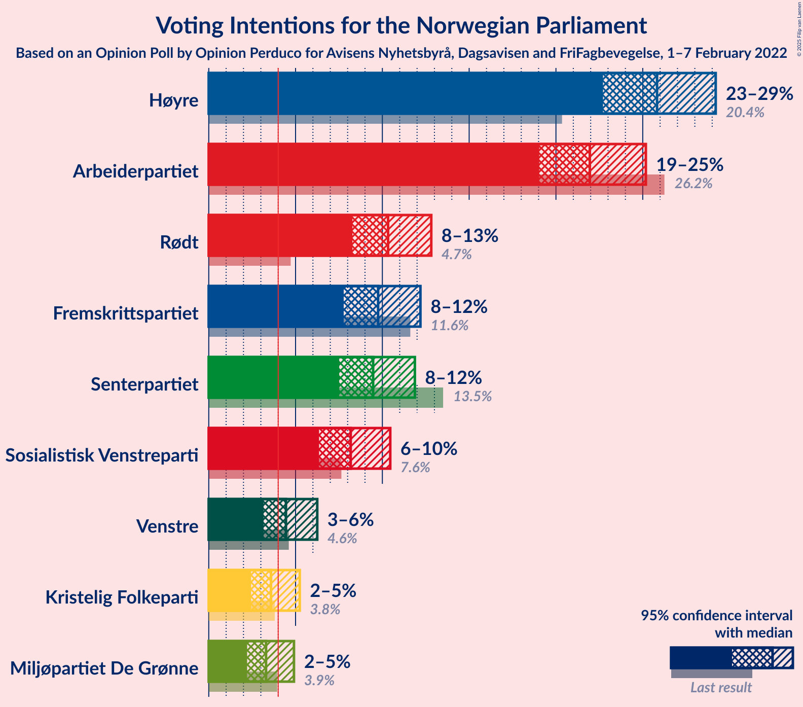

### Confidence Intervals

| Party | Last Result | Poll Result | 80% Confidence Interval | 90% Confidence Interval | 95% Confidence Interval | 99% Confidence Interval |
|:-----:|:-----------:|:-----------:|:-----------------------:|:-----------------------:|:-----------------------:|:-----------------------:|
| Høyre | 20.4% | 25.8% | 23.8–28.0% |23.2–28.7% |22.7–29.2% |21.7–30.3% |
| Arbeiderpartiet | 26.2% | 22.0% | 20.0–24.1% |19.5–24.7% |19.0–25.2% |18.1–26.2% |
| Rødt | 4.7% | 10.3% | 9.0–11.9% |8.6–12.4% |8.3–12.8% |7.7–13.6% |
| Fremskrittspartiet | 11.6% | 9.8% | 8.4–11.3% |8.1–11.8% |7.8–12.2% |7.2–13.0% |
| Senterpartiet | 13.5% | 9.5% | 8.2–11.0% |7.8–11.5% |7.5–11.9% |6.9–12.7% |
| Sosialistisk Venstreparti | 7.6% | 8.2% | 7.0–9.7% |6.6–10.1% |6.4–10.5% |5.8–11.2% |
| Venstre | 4.6% | 4.4% | 3.6–5.6% |3.4–6.0% |3.2–6.2% |2.8–6.9% |
| Kristelig Folkeparti | 3.8% | 3.6% | 2.8–4.7% |2.6–5.0% |2.4–5.2% |2.1–5.8% |
| Miljøpartiet De Grønne | 3.9% | 3.3% | 2.6–4.3% |2.4–4.6% |2.2–4.9% |1.9–5.5% |

*Note:* The poll result column reflects the actual value used in the calculations. Published results may vary slightly, and in addition be rounded to fewer digits.

## Seats

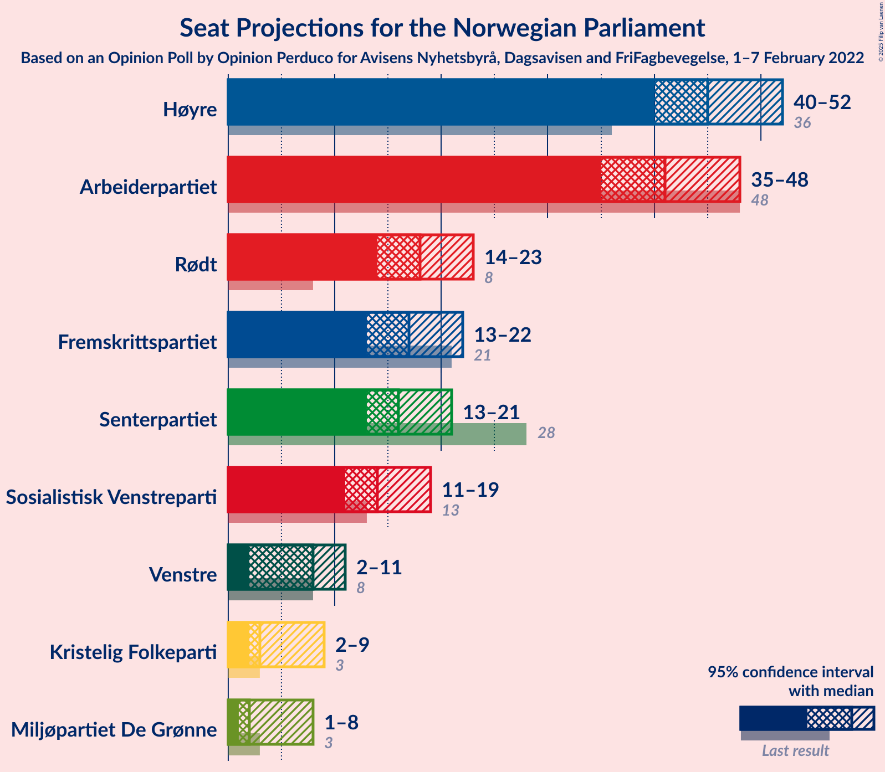

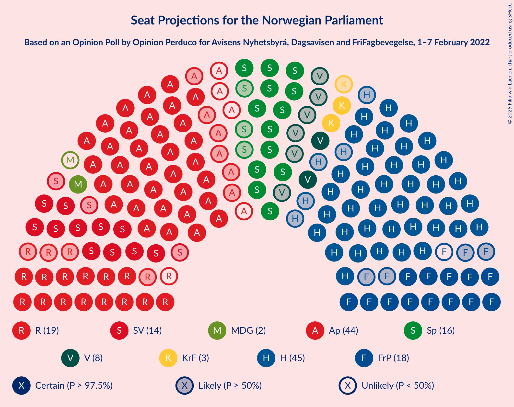

### Confidence Intervals

| Party | Last Result | Median | 80% Confidence Interval | 90% Confidence Interval | 95% Confidence Interval | 99% Confidence Interval |
|:-----:|:-----------:|:------:|:-----------------------:|:-----------------------:|:-----------------------:|:-----------------------:|
| <a href="#høyre">Høyre</a> | 36 | 45 | 42–50 |41–51 |40–52 |39–55 |
| <a href="#arbeiderpartiet">Arbeiderpartiet</a> | 48 | 41 | 37–46 |36–47 |35–48 |32–49 |
| <a href="#rødt">Rødt</a> | 8 | 18 | 15–21 |14–22 |14–23 |12–24 |
| <a href="#fremskrittspartiet">Fremskrittspartiet</a> | 21 | 17 | 15–20 |14–21 |13–22 |12–23 |
| <a href="#senterpartiet">Senterpartiet</a> | 28 | 16 | 14–20 |14–20 |13–21 |12–23 |
| <a href="#sosialistisk-venstreparti">Sosialistisk Venstreparti</a> | 13 | 14 | 12–17 |11–18 |11–19 |10–20 |
| <a href="#venstre">Venstre</a> | 8 | 8 | 2–10 |2–10 |2–11 |2–12 |
| <a href="#kristelig-folkeparti">Kristelig Folkeparti</a> | 3 | 3 | 2–8 |2–8 |2–9 |0–10 |
| <a href="#miljøpartiet-de-grønne">Miljøpartiet De Grønne</a> | 3 | 2 | 1–7 |1–8 |1–8 |1–9 |

### Høyre

*For a full overview of the results for this party, see the [Høyre](party-høyre.html) page.*

| Number of Seats | Probability | Accumulated | Special Marks |
|:---------------:|:-----------:|:-----------:|:-------------:|
| 36 | 0% | 100% | Last Result |
| 37 | 0.1% | 100% |  |
| 38 | 0.2% | 99.9% |  |
| 39 | 0.7% | 99.7% |  |
| 40 | 3% | 99.0% |  |
| 41 | 5% | 96% |  |
| 42 | 6% | 90% |  |
| 43 | 11% | 85% |  |
| 44 | 15% | 74% |  |
| 45 | 13% | 59% | Median |
| 46 | 8% | 46% |  |
| 47 | 11% | 38% |  |
| 48 | 8% | 27% |  |
| 49 | 8% | 18% |  |
| 50 | 3% | 11% |  |
| 51 | 4% | 8% |  |
| 52 | 3% | 5% |  |
| 53 | 0.6% | 2% |  |
| 54 | 0.1% | 1.0% |  |
| 55 | 0.7% | 0.8% |  |
| 56 | 0.1% | 0.1% |  |
| 57 | 0% | 0.1% |  |
| 58 | 0% | 0% |  |

### Arbeiderpartiet

*For a full overview of the results for this party, see the [Arbeiderpartiet](party-arbeiderpartiet.html) page.*

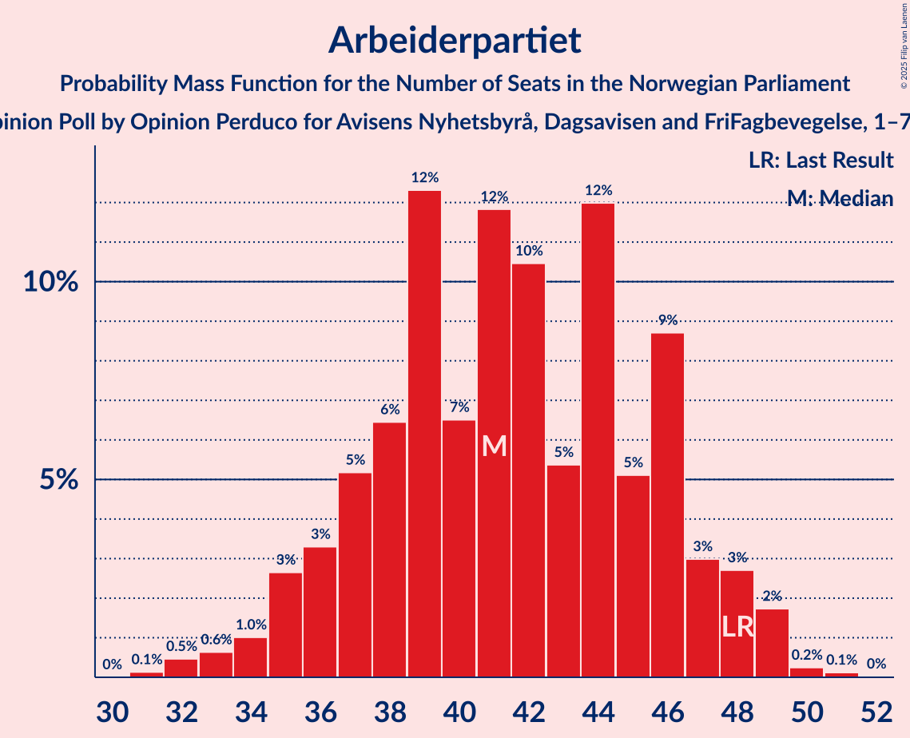

| Number of Seats | Probability | Accumulated | Special Marks |
|:---------------:|:-----------:|:-----------:|:-------------:|
| 31 | 0.1% | 100% |  |
| 32 | 0.5% | 99.9% |  |
| 33 | 0.6% | 99.4% |  |
| 34 | 1.0% | 98.8% |  |
| 35 | 3% | 98% |  |
| 36 | 3% | 95% |  |
| 37 | 5% | 92% |  |
| 38 | 6% | 87% |  |
| 39 | 12% | 80% |  |
| 40 | 7% | 68% |  |
| 41 | 12% | 61% | Median |
| 42 | 10% | 49% |  |
| 43 | 5% | 39% |  |
| 44 | 12% | 34% |  |
| 45 | 5% | 22% |  |
| 46 | 9% | 17% |  |
| 47 | 3% | 8% |  |
| 48 | 3% | 5% | Last Result |
| 49 | 2% | 2% |  |
| 50 | 0.2% | 0.4% |  |
| 51 | 0.1% | 0.2% |  |
| 52 | 0% | 0% |  |

### Rødt

*For a full overview of the results for this party, see the [Rødt](party-rødt.html) page.*

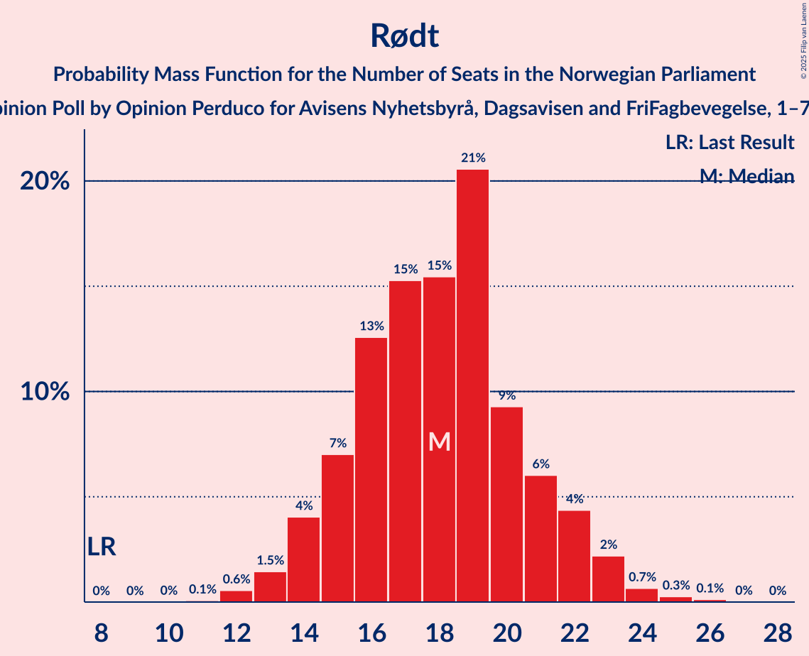

| Number of Seats | Probability | Accumulated | Special Marks |
|:---------------:|:-----------:|:-----------:|:-------------:|
| 8 | 0% | 100% | Last Result |
| 9 | 0% | 100% |  |
| 10 | 0% | 100% |  |
| 11 | 0.1% | 100% |  |
| 12 | 0.6% | 99.9% |  |
| 13 | 1.5% | 99.3% |  |
| 14 | 4% | 98% |  |
| 15 | 7% | 94% |  |
| 16 | 13% | 87% |  |
| 17 | 15% | 74% |  |
| 18 | 15% | 59% | Median |
| 19 | 21% | 44% |  |
| 20 | 9% | 23% |  |
| 21 | 6% | 14% |  |
| 22 | 4% | 8% |  |
| 23 | 2% | 3% |  |
| 24 | 0.7% | 1.1% |  |
| 25 | 0.3% | 0.4% |  |
| 26 | 0.1% | 0.2% |  |
| 27 | 0% | 0% |  |

### Fremskrittspartiet

*For a full overview of the results for this party, see the [Fremskrittspartiet](party-fremskrittspartiet.html) page.*

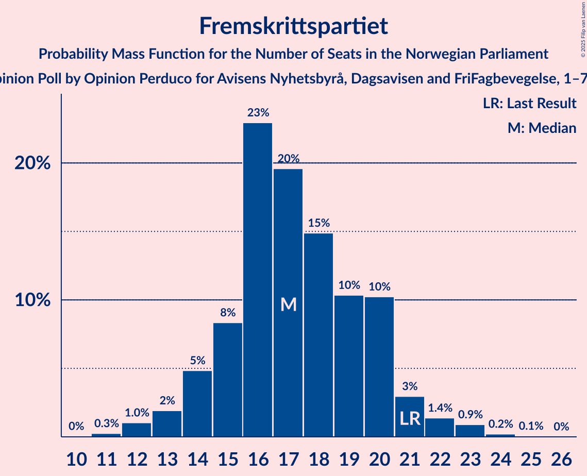

| Number of Seats | Probability | Accumulated | Special Marks |
|:---------------:|:-----------:|:-----------:|:-------------:|
| 10 | 0% | 100% |  |
| 11 | 0.3% | 99.9% |  |
| 12 | 1.0% | 99.7% |  |
| 13 | 2% | 98.7% |  |
| 14 | 5% | 97% |  |
| 15 | 8% | 92% |  |
| 16 | 23% | 84% |  |
| 17 | 20% | 61% | Median |
| 18 | 15% | 41% |  |
| 19 | 10% | 26% |  |
| 20 | 10% | 16% |  |
| 21 | 3% | 6% | Last Result |
| 22 | 1.4% | 3% |  |
| 23 | 0.9% | 1.2% |  |
| 24 | 0.2% | 0.3% |  |
| 25 | 0.1% | 0.1% |  |
| 26 | 0% | 0% |  |

### Senterpartiet

*For a full overview of the results for this party, see the [Senterpartiet](party-senterpartiet.html) page.*

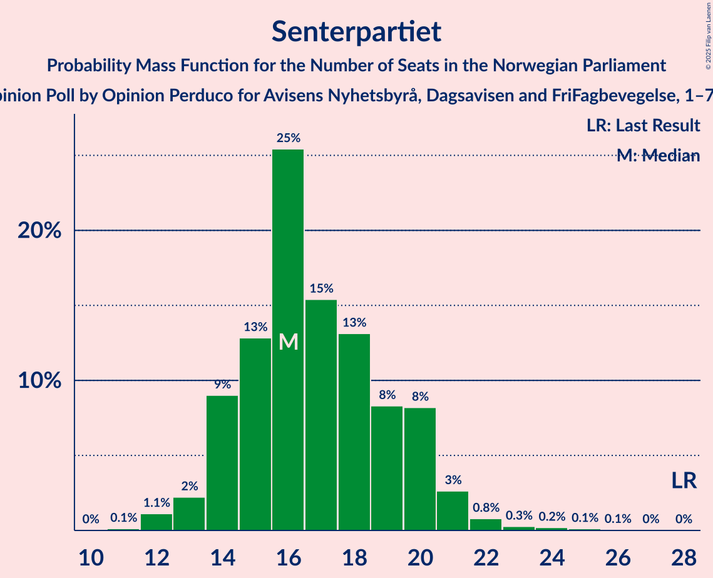

| Number of Seats | Probability | Accumulated | Special Marks |
|:---------------:|:-----------:|:-----------:|:-------------:|
| 11 | 0.1% | 100% |  |
| 12 | 1.1% | 99.8% |  |
| 13 | 2% | 98.7% |  |
| 14 | 9% | 96% |  |
| 15 | 13% | 87% |  |
| 16 | 25% | 75% | Median |
| 17 | 15% | 49% |  |
| 18 | 13% | 34% |  |
| 19 | 8% | 21% |  |
| 20 | 8% | 12% |  |
| 21 | 3% | 4% |  |
| 22 | 0.8% | 2% |  |
| 23 | 0.3% | 0.7% |  |
| 24 | 0.2% | 0.5% |  |
| 25 | 0.1% | 0.3% |  |
| 26 | 0.1% | 0.1% |  |
| 27 | 0% | 0.1% |  |
| 28 | 0% | 0% | Last Result |

### Sosialistisk Venstreparti

*For a full overview of the results for this party, see the [Sosialistisk Venstreparti](party-sosialistiskvenstreparti.html) page.*

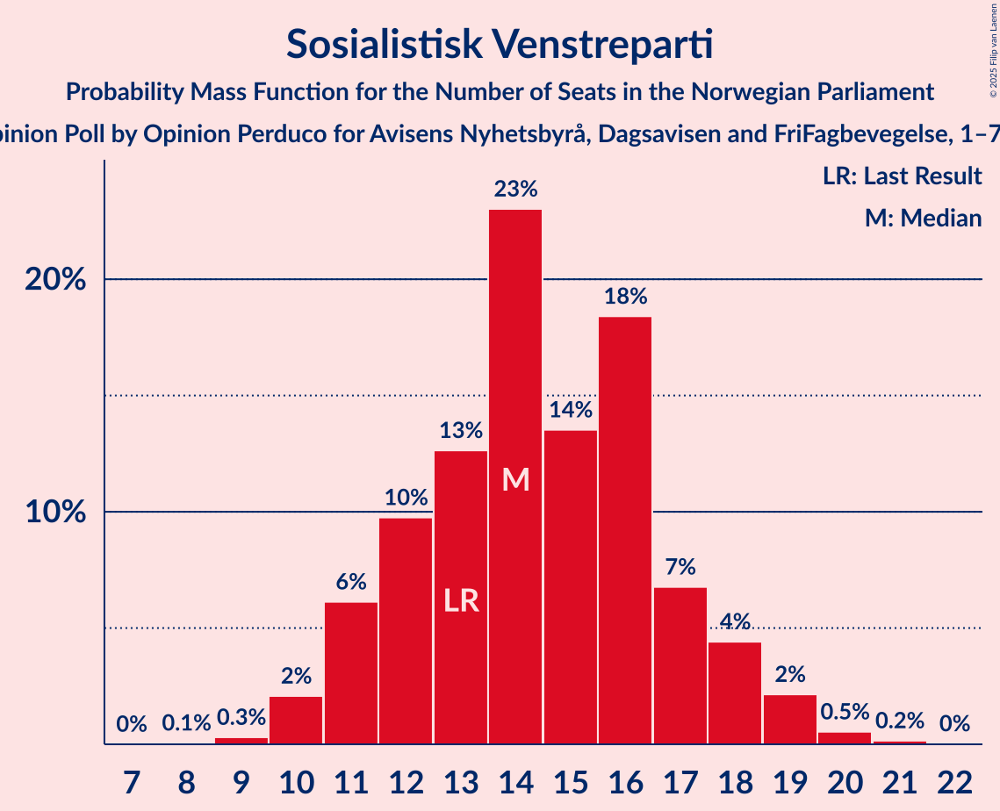

| Number of Seats | Probability | Accumulated | Special Marks |
|:---------------:|:-----------:|:-----------:|:-------------:|
| 8 | 0.1% | 100% |  |
| 9 | 0.3% | 99.9% |  |
| 10 | 2% | 99.6% |  |
| 11 | 6% | 98% |  |
| 12 | 10% | 91% |  |
| 13 | 13% | 82% | Last Result |
| 14 | 23% | 69% | Median |
| 15 | 14% | 46% |  |
| 16 | 18% | 32% |  |
| 17 | 7% | 14% |  |
| 18 | 4% | 7% |  |
| 19 | 2% | 3% |  |
| 20 | 0.5% | 0.7% |  |
| 21 | 0.2% | 0.2% |  |
| 22 | 0% | 0% |  |

### Venstre

*For a full overview of the results for this party, see the [Venstre](party-venstre.html) page.*

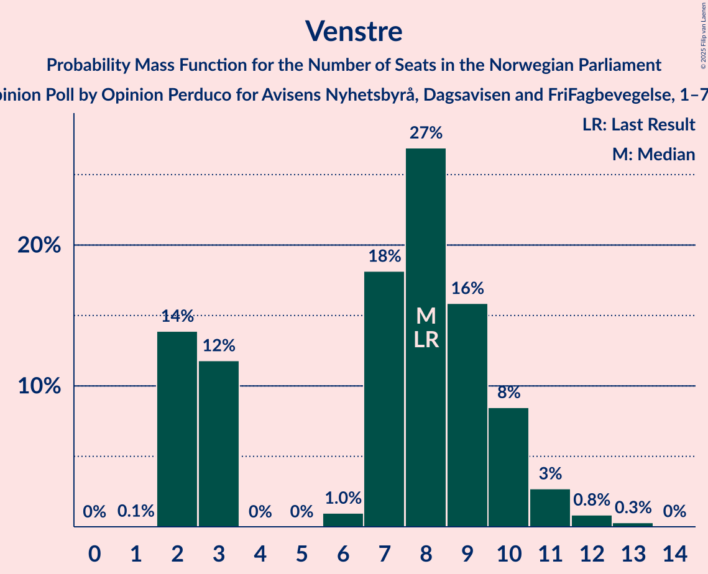

| Number of Seats | Probability | Accumulated | Special Marks |
|:---------------:|:-----------:|:-----------:|:-------------:|
| 1 | 0.1% | 100% |  |
| 2 | 14% | 99.9% |  |
| 3 | 12% | 86% |  |
| 4 | 0% | 74% |  |
| 5 | 0% | 74% |  |
| 6 | 1.0% | 74% |  |
| 7 | 18% | 73% |  |
| 8 | 27% | 55% | Last Result, Median |
| 9 | 16% | 28% |  |
| 10 | 8% | 12% |  |
| 11 | 3% | 4% |  |
| 12 | 0.8% | 1.2% |  |
| 13 | 0.3% | 0.3% |  |
| 14 | 0% | 0% |  |

### Kristelig Folkeparti

*For a full overview of the results for this party, see the [Kristelig Folkeparti](party-kristeligfolkeparti.html) page.*

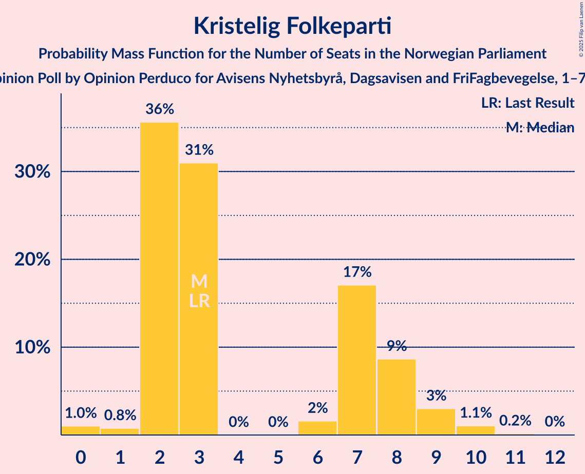

| Number of Seats | Probability | Accumulated | Special Marks |
|:---------------:|:-----------:|:-----------:|:-------------:|
| 0 | 1.0% | 100% |  |
| 1 | 0.8% | 99.0% |  |
| 2 | 36% | 98% |  |
| 3 | 31% | 63% | Last Result, Median |
| 4 | 0% | 32% |  |
| 5 | 0% | 32% |  |
| 6 | 2% | 32% |  |
| 7 | 17% | 30% |  |
| 8 | 9% | 13% |  |
| 9 | 3% | 4% |  |
| 10 | 1.1% | 1.3% |  |
| 11 | 0.2% | 0.2% |  |
| 12 | 0% | 0% |  |

### Miljøpartiet De Grønne

*For a full overview of the results for this party, see the [Miljøpartiet De Grønne](party-miljøpartietdegrønne.html) page.*

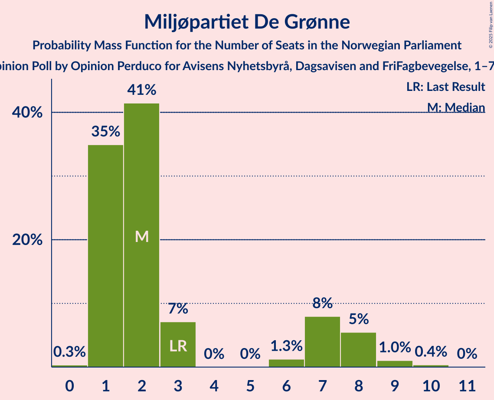

| Number of Seats | Probability | Accumulated | Special Marks |
|:---------------:|:-----------:|:-----------:|:-------------:|
| 0 | 0.3% | 100% |  |
| 1 | 35% | 99.7% |  |
| 2 | 41% | 65% | Median |
| 3 | 7% | 23% | Last Result |
| 4 | 0% | 16% |  |
| 5 | 0% | 16% |  |
| 6 | 1.3% | 16% |  |
| 7 | 8% | 15% |  |
| 8 | 5% | 7% |  |
| 9 | 1.0% | 1.4% |  |
| 10 | 0.4% | 0.4% |  |
| 11 | 0% | 0% |  |

## Coalitions

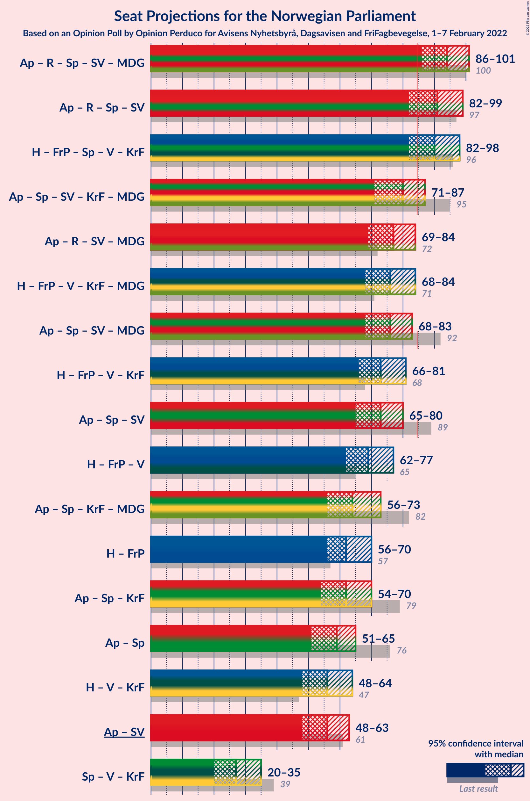

### Confidence Intervals

| Coalition | Last Result | Median | Majority? | 80% Confidence Interval | 90% Confidence Interval | 95% Confidence Interval | 99% Confidence Interval |
|:---------:|:-----------:|:------:|:---------:|:-----------------------:|:-----------------------:|:-----------------------:|:-----------------------:|
| Arbeiderpartiet – Rødt – Senterpartiet – Sosialistisk Venstreparti – Miljøpartiet De Grønne | 100 | 94 | 98% | 88–98 | 87–100 | 86–101 | 83–104 |
| Arbeiderpartiet – Rødt – Senterpartiet – Sosialistisk Venstreparti | 97 | 91 | 93% | 85–95 | 84–97 | 82–99 | 80–102 |
| Høyre – Fremskrittspartiet – Senterpartiet – Venstre – Kristelig Folkeparti | 96 | 90 | 93% | 85–95 | 83–97 | 82–98 | 80–101 |
| Arbeiderpartiet – Senterpartiet – Sosialistisk Venstreparti – Kristelig Folkeparti – Miljøpartiet De Grønne | 95 | 80 | 8% | 74–84 | 73–86 | 71–87 | 68–90 |
| Arbeiderpartiet – Rødt – Sosialistisk Venstreparti – Miljøpartiet De Grønne | 72 | 77 | 2% | 71–81 | 70–82 | 69–84 | 66–87 |
| Høyre – Fremskrittspartiet – Venstre – Kristelig Folkeparti – Miljøpartiet De Grønne | 71 | 76 | 2% | 72–82 | 70–83 | 68–84 | 66–87 |
| Arbeiderpartiet – Senterpartiet – Sosialistisk Venstreparti – Miljøpartiet De Grønne | 92 | 76 | 1.4% | 71–80 | 69–82 | 68–83 | 65–86 |
| Høyre – Fremskrittspartiet – Venstre – Kristelig Folkeparti | 68 | 73 | 0.3% | 69–79 | 67–80 | 66–81 | 63–84 |
| Arbeiderpartiet – Senterpartiet – Sosialistisk Venstreparti | 89 | 73 | 0% | 68–77 | 66–78 | 65–80 | 62–84 |
| Høyre – Fremskrittspartiet – Venstre | 65 | 69 | 0% | 65–75 | 64–76 | 62–77 | 59–79 |
| Arbeiderpartiet – Senterpartiet – Kristelig Folkeparti – Miljøpartiet De Grønne | 82 | 64 | 0% | 60–70 | 58–72 | 56–73 | 54–77 |
| Høyre – Fremskrittspartiet | 57 | 62 | 0% | 59–68 | 58–69 | 56–70 | 54–72 |
| Arbeiderpartiet – Senterpartiet – Kristelig Folkeparti | 79 | 62 | 0% | 57–69 | 55–69 | 54–70 | 52–73 |
| Arbeiderpartiet – Senterpartiet | 76 | 59 | 0% | 53–63 | 52–64 | 51–65 | 49–67 |
| Høyre – Venstre – Kristelig Folkeparti | 47 | 56 | 0% | 51–61 | 50–63 | 48–64 | 46–67 |
| Arbeiderpartiet – Sosialistisk Venstreparti | 61 | 56 | 0% | 51–60 | 49–61 | 48–63 | 46–64 |
| Senterpartiet – Venstre – Kristelig Folkeparti | 39 | 27 | 0% | 23–33 | 20–34 | 20–35 | 18–37 |

### Arbeiderpartiet – Rødt – Senterpartiet – Sosialistisk Venstreparti – Miljøpartiet De Grønne

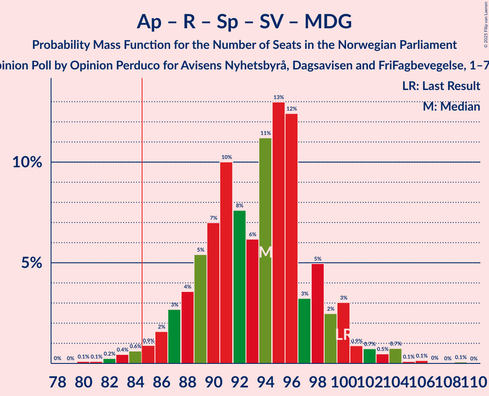

| Number of Seats | Probability | Accumulated | Special Marks |
|:---------------:|:-----------:|:-----------:|:-------------:|
| 80 | 0.1% | 100% |  |
| 81 | 0.1% | 99.9% |  |
| 82 | 0.2% | 99.8% |  |
| 83 | 0.4% | 99.5% |  |
| 84 | 0.6% | 99.1% |  |
| 85 | 0.9% | 98% | Majority |
| 86 | 2% | 98% |  |
| 87 | 3% | 96% |  |
| 88 | 4% | 93% |  |
| 89 | 5% | 90% |  |
| 90 | 7% | 84% |  |
| 91 | 10% | 77% | Median |
| 92 | 8% | 67% |  |
| 93 | 6% | 60% |  |
| 94 | 11% | 54% |  |
| 95 | 13% | 42% |  |
| 96 | 12% | 29% |  |
| 97 | 3% | 17% |  |
| 98 | 5% | 14% |  |
| 99 | 2% | 9% |  |
| 100 | 3% | 6% | Last Result |
| 101 | 0.9% | 3% |  |
| 102 | 0.7% | 2% |  |
| 103 | 0.5% | 2% |  |
| 104 | 0.7% | 1.1% |  |
| 105 | 0.1% | 0.4% |  |
| 106 | 0.1% | 0.3% |  |
| 107 | 0% | 0.1% |  |
| 108 | 0% | 0.1% |  |
| 109 | 0.1% | 0.1% |  |
| 110 | 0% | 0% |  |

### Arbeiderpartiet – Rødt – Senterpartiet – Sosialistisk Venstreparti

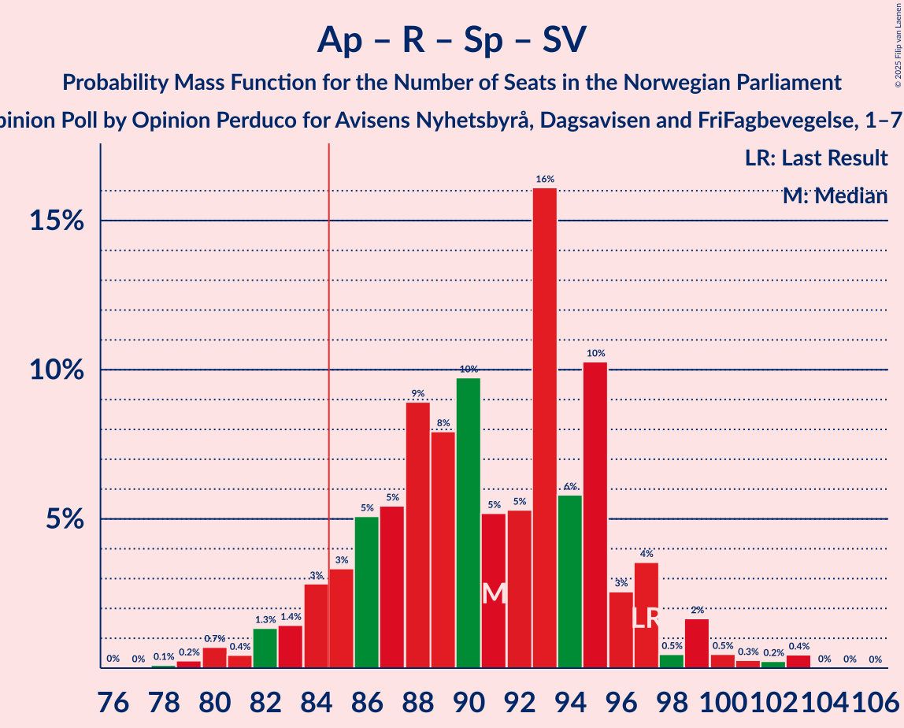

| Number of Seats | Probability | Accumulated | Special Marks |
|:---------------:|:-----------:|:-----------:|:-------------:|
| 77 | 0% | 100% |  |
| 78 | 0.1% | 99.9% |  |
| 79 | 0.2% | 99.8% |  |
| 80 | 0.7% | 99.6% |  |
| 81 | 0.4% | 98.9% |  |
| 82 | 1.3% | 98% |  |
| 83 | 1.4% | 97% |  |
| 84 | 3% | 96% |  |
| 85 | 3% | 93% | Majority |
| 86 | 5% | 89% |  |
| 87 | 5% | 84% |  |
| 88 | 9% | 79% |  |
| 89 | 8% | 70% | Median |
| 90 | 10% | 62% |  |
| 91 | 5% | 52% |  |
| 92 | 5% | 47% |  |
| 93 | 16% | 42% |  |
| 94 | 6% | 26% |  |
| 95 | 10% | 20% |  |
| 96 | 3% | 10% |  |
| 97 | 4% | 7% | Last Result |
| 98 | 0.5% | 4% |  |
| 99 | 2% | 3% |  |
| 100 | 0.5% | 1.5% |  |
| 101 | 0.3% | 1.0% |  |
| 102 | 0.2% | 0.7% |  |
| 103 | 0.4% | 0.5% |  |
| 104 | 0% | 0.1% |  |
| 105 | 0% | 0% |  |

### Høyre – Fremskrittspartiet – Senterpartiet – Venstre – Kristelig Folkeparti

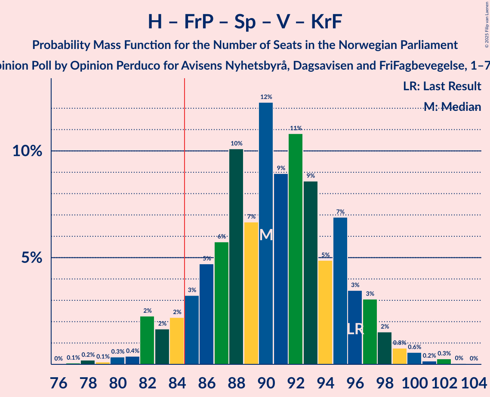

| Number of Seats | Probability | Accumulated | Special Marks |
|:---------------:|:-----------:|:-----------:|:-------------:|
| 77 | 0.1% | 100% |  |
| 78 | 0.2% | 99.9% |  |
| 79 | 0.1% | 99.7% |  |
| 80 | 0.3% | 99.6% |  |
| 81 | 0.4% | 99.2% |  |
| 82 | 2% | 98.9% |  |
| 83 | 2% | 97% |  |
| 84 | 2% | 95% |  |
| 85 | 3% | 93% | Majority |
| 86 | 5% | 90% |  |
| 87 | 6% | 85% |  |
| 88 | 10% | 79% |  |
| 89 | 7% | 69% | Median |
| 90 | 12% | 62% |  |
| 91 | 9% | 50% |  |
| 92 | 11% | 41% |  |
| 93 | 9% | 30% |  |
| 94 | 5% | 22% |  |
| 95 | 7% | 17% |  |
| 96 | 3% | 10% | Last Result |
| 97 | 3% | 6% |  |
| 98 | 2% | 3% |  |
| 99 | 0.8% | 2% |  |
| 100 | 0.6% | 1.1% |  |
| 101 | 0.2% | 0.5% |  |
| 102 | 0.3% | 0.3% |  |
| 103 | 0% | 0.1% |  |
| 104 | 0% | 0% |  |

### Arbeiderpartiet – Senterpartiet – Sosialistisk Venstreparti – Kristelig Folkeparti – Miljøpartiet De Grønne

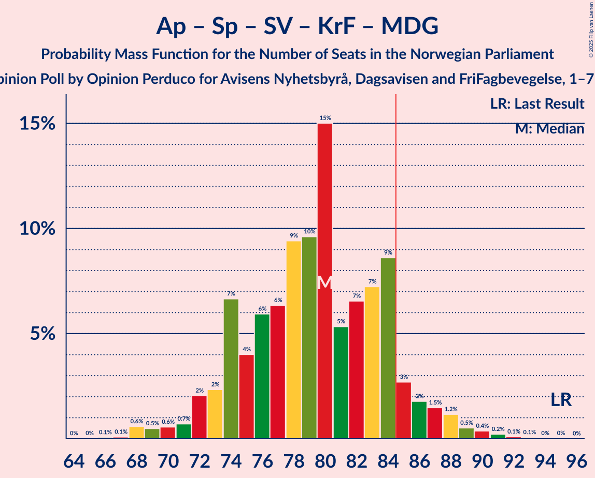

| Number of Seats | Probability | Accumulated | Special Marks |
|:---------------:|:-----------:|:-----------:|:-------------:|
| 66 | 0.1% | 100% |  |
| 67 | 0.1% | 99.9% |  |
| 68 | 0.6% | 99.8% |  |
| 69 | 0.5% | 99.2% |  |
| 70 | 0.6% | 98.8% |  |
| 71 | 0.7% | 98% |  |
| 72 | 2% | 97% |  |
| 73 | 2% | 95% |  |
| 74 | 7% | 93% |  |
| 75 | 4% | 86% |  |
| 76 | 6% | 82% | Median |
| 77 | 6% | 77% |  |
| 78 | 9% | 70% |  |
| 79 | 10% | 61% |  |
| 80 | 15% | 51% |  |
| 81 | 5% | 36% |  |
| 82 | 7% | 31% |  |
| 83 | 7% | 24% |  |
| 84 | 9% | 17% |  |
| 85 | 3% | 8% | Majority |
| 86 | 2% | 6% |  |
| 87 | 1.5% | 4% |  |
| 88 | 1.2% | 2% |  |
| 89 | 0.5% | 1.3% |  |
| 90 | 0.4% | 0.8% |  |
| 91 | 0.2% | 0.4% |  |
| 92 | 0.1% | 0.2% |  |
| 93 | 0.1% | 0.1% |  |
| 94 | 0% | 0% |  |
| 95 | 0% | 0% | Last Result |

### Arbeiderpartiet – Rødt – Sosialistisk Venstreparti – Miljøpartiet De Grønne

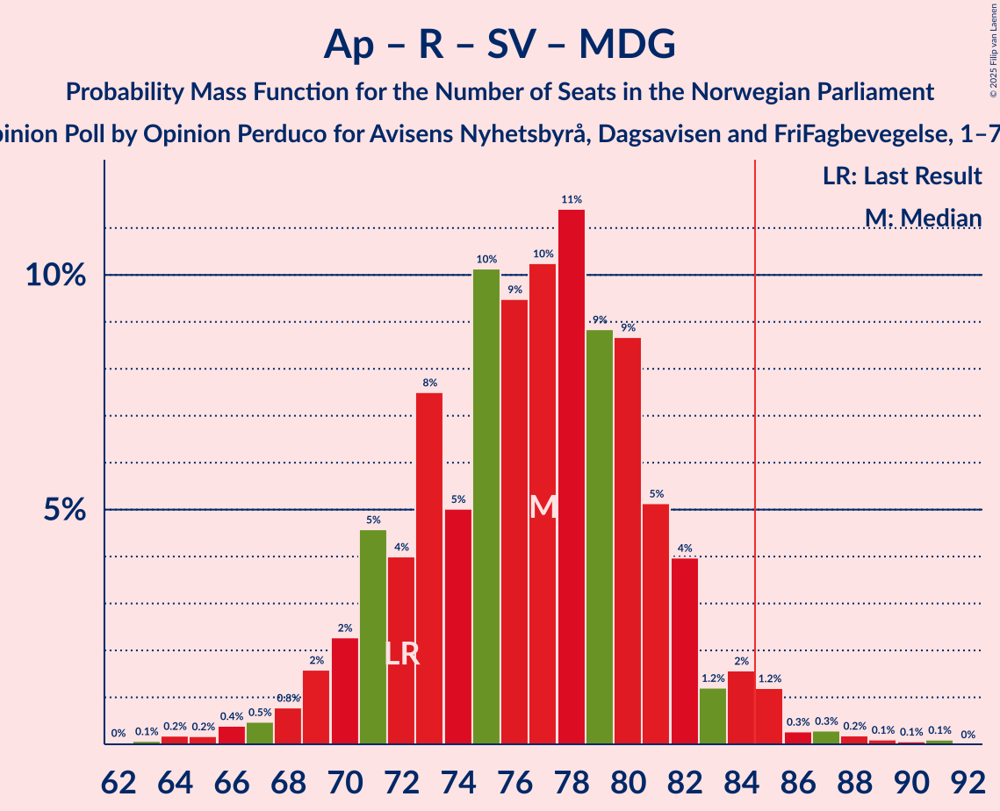

| Number of Seats | Probability | Accumulated | Special Marks |
|:---------------:|:-----------:|:-----------:|:-------------:|
| 62 | 0% | 100% |  |
| 63 | 0.1% | 99.9% |  |
| 64 | 0.2% | 99.9% |  |
| 65 | 0.2% | 99.7% |  |
| 66 | 0.4% | 99.5% |  |
| 67 | 0.5% | 99.1% |  |
| 68 | 0.8% | 98.7% |  |
| 69 | 2% | 98% |  |
| 70 | 2% | 96% |  |
| 71 | 5% | 94% |  |
| 72 | 4% | 89% | Last Result |
| 73 | 8% | 85% |  |
| 74 | 5% | 78% |  |
| 75 | 10% | 73% | Median |
| 76 | 9% | 63% |  |
| 77 | 10% | 53% |  |
| 78 | 11% | 43% |  |
| 79 | 9% | 32% |  |
| 80 | 9% | 23% |  |
| 81 | 5% | 14% |  |
| 82 | 4% | 9% |  |
| 83 | 1.2% | 5% |  |
| 84 | 2% | 4% |  |
| 85 | 1.2% | 2% | Majority |
| 86 | 0.3% | 1.0% |  |
| 87 | 0.3% | 0.7% |  |
| 88 | 0.2% | 0.5% |  |
| 89 | 0.1% | 0.3% |  |
| 90 | 0.1% | 0.2% |  |
| 91 | 0.1% | 0.1% |  |
| 92 | 0% | 0% |  |

### Høyre – Fremskrittspartiet – Venstre – Kristelig Folkeparti – Miljøpartiet De Grønne

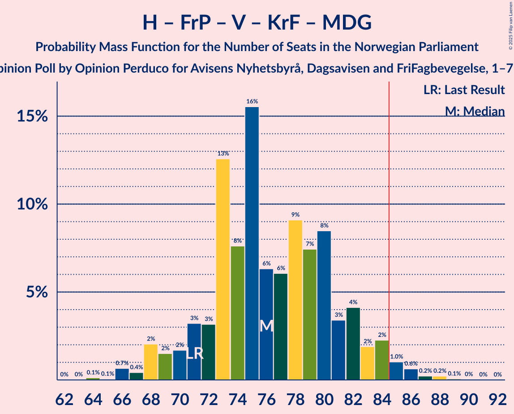

| Number of Seats | Probability | Accumulated | Special Marks |
|:---------------:|:-----------:|:-----------:|:-------------:|
| 64 | 0.1% | 100% |  |
| 65 | 0.1% | 99.8% |  |
| 66 | 0.7% | 99.8% |  |
| 67 | 0.4% | 99.1% |  |
| 68 | 2% | 98.7% |  |
| 69 | 2% | 97% |  |
| 70 | 2% | 95% |  |
| 71 | 3% | 93% | Last Result |
| 72 | 3% | 90% |  |
| 73 | 13% | 87% |  |
| 74 | 8% | 74% |  |
| 75 | 16% | 67% | Median |
| 76 | 6% | 51% |  |
| 77 | 6% | 45% |  |
| 78 | 9% | 39% |  |
| 79 | 7% | 30% |  |
| 80 | 8% | 22% |  |
| 81 | 3% | 14% |  |
| 82 | 4% | 11% |  |
| 83 | 2% | 6% |  |
| 84 | 2% | 4% |  |
| 85 | 1.0% | 2% | Majority |
| 86 | 0.6% | 1.2% |  |
| 87 | 0.2% | 0.6% |  |
| 88 | 0.2% | 0.3% |  |
| 89 | 0.1% | 0.1% |  |
| 90 | 0% | 0.1% |  |
| 91 | 0% | 0% |  |

### Arbeiderpartiet – Senterpartiet – Sosialistisk Venstreparti – Miljøpartiet De Grønne

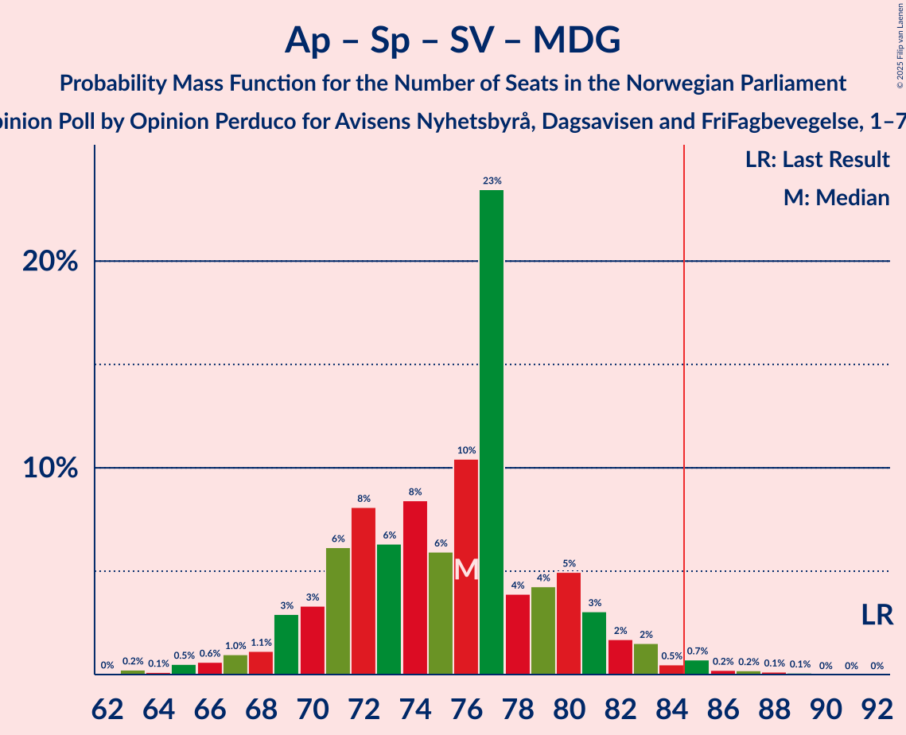

| Number of Seats | Probability | Accumulated | Special Marks |
|:---------------:|:-----------:|:-----------:|:-------------:|
| 62 | 0% | 100% |  |
| 63 | 0.2% | 99.9% |  |
| 64 | 0.1% | 99.7% |  |
| 65 | 0.5% | 99.6% |  |
| 66 | 0.6% | 99.1% |  |
| 67 | 1.0% | 98% |  |
| 68 | 1.1% | 98% |  |
| 69 | 3% | 96% |  |
| 70 | 3% | 93% |  |
| 71 | 6% | 90% |  |
| 72 | 8% | 84% |  |
| 73 | 6% | 76% | Median |
| 74 | 8% | 70% |  |
| 75 | 6% | 61% |  |
| 76 | 10% | 55% |  |
| 77 | 23% | 45% |  |
| 78 | 4% | 21% |  |
| 79 | 4% | 17% |  |
| 80 | 5% | 13% |  |
| 81 | 3% | 8% |  |
| 82 | 2% | 5% |  |
| 83 | 2% | 3% |  |
| 84 | 0.5% | 2% |  |
| 85 | 0.7% | 1.4% | Majority |
| 86 | 0.2% | 0.7% |  |
| 87 | 0.2% | 0.4% |  |
| 88 | 0.1% | 0.2% |  |
| 89 | 0.1% | 0.1% |  |
| 90 | 0% | 0% |  |
| 91 | 0% | 0% |  |
| 92 | 0% | 0% | Last Result |

### Høyre – Fremskrittspartiet – Venstre – Kristelig Folkeparti

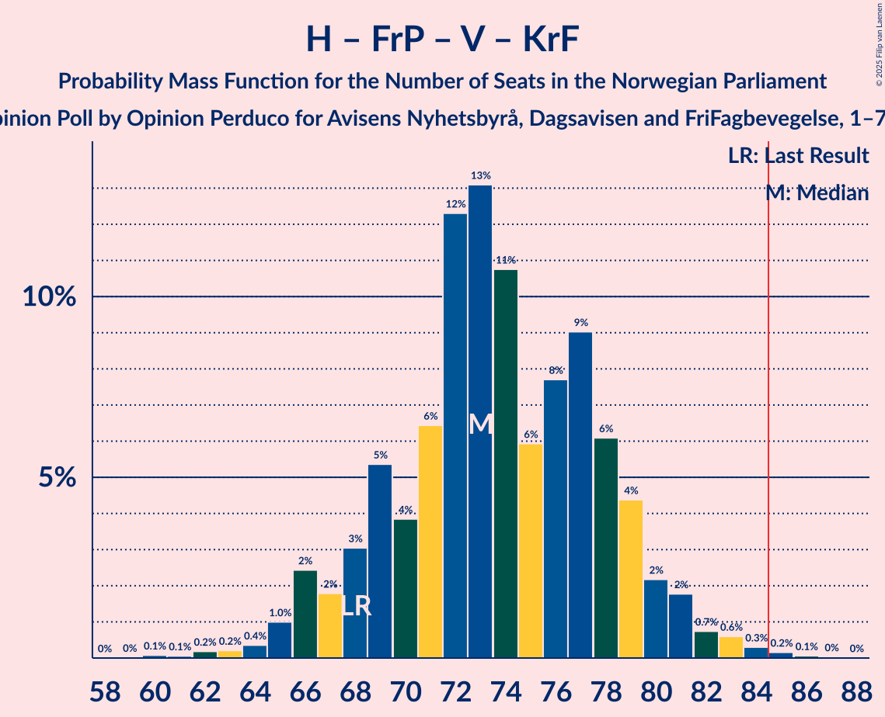

| Number of Seats | Probability | Accumulated | Special Marks |
|:---------------:|:-----------:|:-----------:|:-------------:|
| 60 | 0.1% | 100% |  |
| 61 | 0.1% | 99.9% |  |
| 62 | 0.2% | 99.8% |  |
| 63 | 0.2% | 99.7% |  |
| 64 | 0.4% | 99.4% |  |
| 65 | 1.0% | 99.1% |  |
| 66 | 2% | 98% |  |
| 67 | 2% | 96% |  |
| 68 | 3% | 94% | Last Result |
| 69 | 5% | 91% |  |
| 70 | 4% | 85% |  |
| 71 | 6% | 82% |  |
| 72 | 12% | 75% |  |
| 73 | 13% | 63% | Median |
| 74 | 11% | 50% |  |
| 75 | 6% | 39% |  |
| 76 | 8% | 33% |  |
| 77 | 9% | 25% |  |
| 78 | 6% | 16% |  |
| 79 | 4% | 10% |  |
| 80 | 2% | 6% |  |
| 81 | 2% | 4% |  |
| 82 | 0.7% | 2% |  |
| 83 | 0.6% | 1.2% |  |
| 84 | 0.3% | 0.6% |  |
| 85 | 0.2% | 0.3% | Majority |
| 86 | 0.1% | 0.1% |  |
| 87 | 0% | 0% |  |

### Arbeiderpartiet – Senterpartiet – Sosialistisk Venstreparti

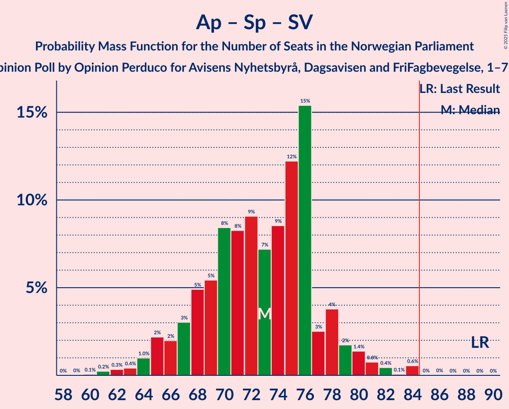

| Number of Seats | Probability | Accumulated | Special Marks |
|:---------------:|:-----------:|:-----------:|:-------------:|
| 60 | 0.1% | 100% |  |
| 61 | 0.2% | 99.9% |  |
| 62 | 0.3% | 99.7% |  |
| 63 | 0.4% | 99.3% |  |
| 64 | 1.0% | 98.9% |  |
| 65 | 2% | 98% |  |
| 66 | 2% | 96% |  |
| 67 | 3% | 94% |  |
| 68 | 5% | 91% |  |
| 69 | 5% | 86% |  |
| 70 | 8% | 80% |  |
| 71 | 8% | 72% | Median |
| 72 | 9% | 64% |  |
| 73 | 7% | 55% |  |
| 74 | 9% | 47% |  |
| 75 | 12% | 39% |  |
| 76 | 15% | 27% |  |
| 77 | 3% | 11% |  |
| 78 | 4% | 9% |  |
| 79 | 2% | 5% |  |
| 80 | 1.4% | 3% |  |
| 81 | 0.8% | 2% |  |
| 82 | 0.4% | 1.1% |  |
| 83 | 0.1% | 0.7% |  |
| 84 | 0.6% | 0.6% |  |
| 85 | 0% | 0% | Majority |
| 86 | 0% | 0% |  |
| 87 | 0% | 0% |  |
| 88 | 0% | 0% |  |
| 89 | 0% | 0% | Last Result |

### Høyre – Fremskrittspartiet – Venstre

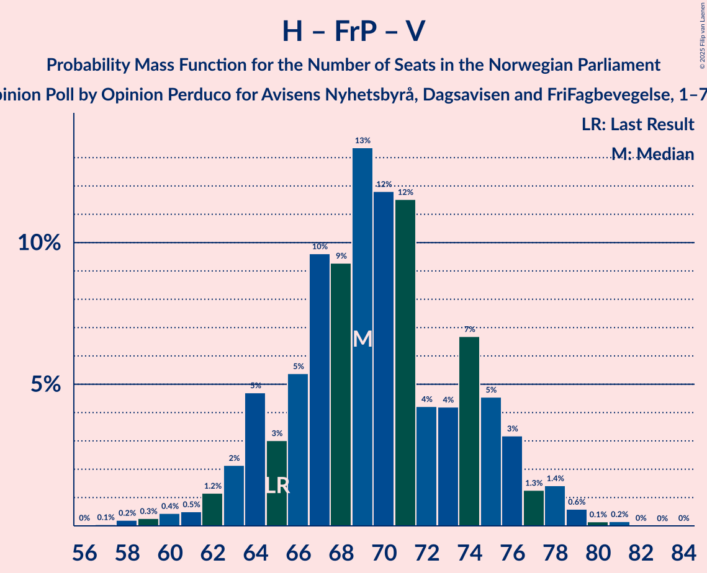

| Number of Seats | Probability | Accumulated | Special Marks |
|:---------------:|:-----------:|:-----------:|:-------------:|
| 57 | 0.1% | 100% |  |
| 58 | 0.2% | 99.9% |  |
| 59 | 0.3% | 99.7% |  |
| 60 | 0.4% | 99.4% |  |
| 61 | 0.5% | 99.0% |  |
| 62 | 1.2% | 98% |  |
| 63 | 2% | 97% |  |
| 64 | 5% | 95% |  |
| 65 | 3% | 90% | Last Result |
| 66 | 5% | 87% |  |
| 67 | 10% | 82% |  |
| 68 | 9% | 72% |  |
| 69 | 13% | 63% |  |
| 70 | 12% | 50% | Median |
| 71 | 12% | 38% |  |
| 72 | 4% | 27% |  |
| 73 | 4% | 22% |  |
| 74 | 7% | 18% |  |
| 75 | 5% | 11% |  |
| 76 | 3% | 7% |  |
| 77 | 1.3% | 4% |  |
| 78 | 1.4% | 2% |  |
| 79 | 0.6% | 1.0% |  |
| 80 | 0.1% | 0.4% |  |
| 81 | 0.2% | 0.2% |  |
| 82 | 0% | 0.1% |  |
| 83 | 0% | 0.1% |  |
| 84 | 0% | 0% |  |

### Arbeiderpartiet – Senterpartiet – Kristelig Folkeparti – Miljøpartiet De Grønne

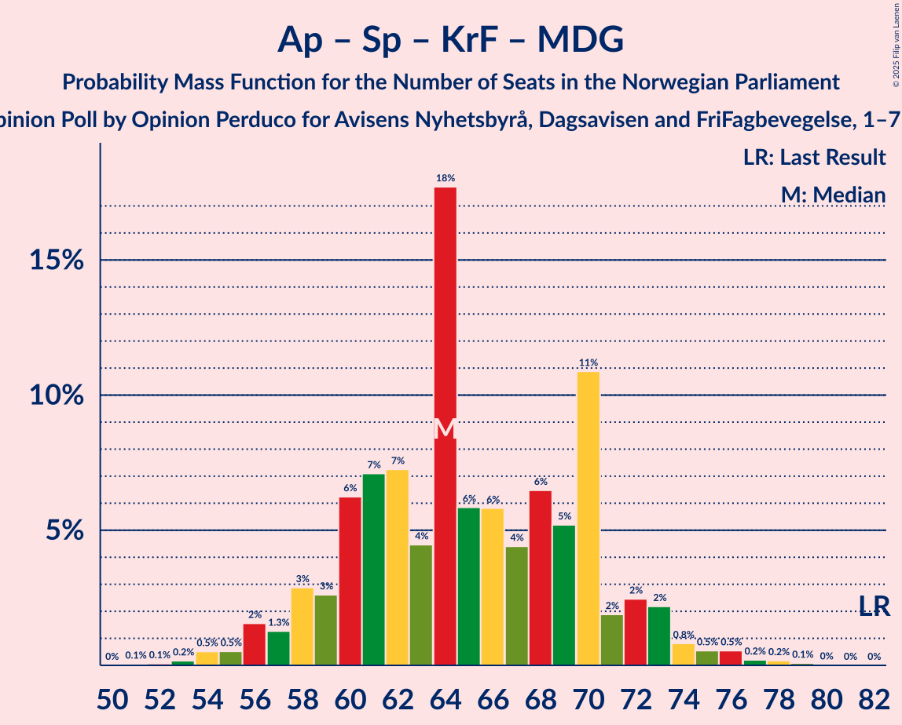

| Number of Seats | Probability | Accumulated | Special Marks |
|:---------------:|:-----------:|:-----------:|:-------------:|
| 51 | 0.1% | 100% |  |
| 52 | 0.1% | 99.9% |  |
| 53 | 0.2% | 99.9% |  |
| 54 | 0.5% | 99.7% |  |
| 55 | 0.5% | 99.2% |  |
| 56 | 2% | 98.7% |  |
| 57 | 1.3% | 97% |  |
| 58 | 3% | 96% |  |
| 59 | 3% | 93% |  |
| 60 | 6% | 90% |  |
| 61 | 7% | 84% |  |
| 62 | 7% | 77% | Median |
| 63 | 4% | 70% |  |
| 64 | 18% | 65% |  |
| 65 | 6% | 48% |  |
| 66 | 6% | 42% |  |
| 67 | 4% | 36% |  |
| 68 | 6% | 32% |  |
| 69 | 5% | 25% |  |
| 70 | 11% | 20% |  |
| 71 | 2% | 9% |  |
| 72 | 2% | 7% |  |
| 73 | 2% | 5% |  |
| 74 | 0.8% | 2% |  |
| 75 | 0.5% | 2% |  |
| 76 | 0.5% | 1.1% |  |
| 77 | 0.2% | 0.5% |  |
| 78 | 0.2% | 0.3% |  |
| 79 | 0.1% | 0.1% |  |
| 80 | 0% | 0% |  |
| 81 | 0% | 0% |  |
| 82 | 0% | 0% | Last Result |

### Høyre – Fremskrittspartiet

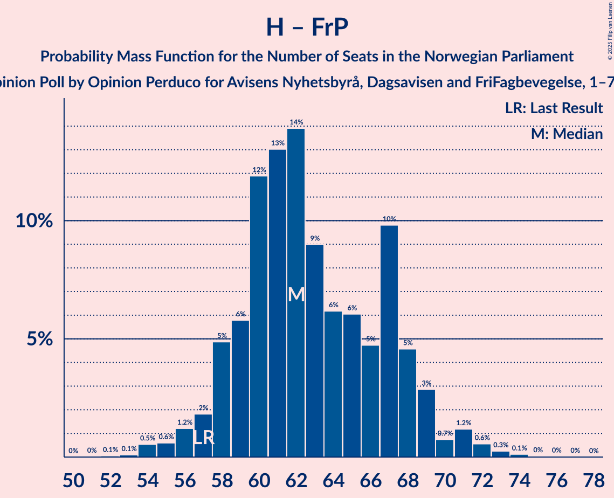

| Number of Seats | Probability | Accumulated | Special Marks |
|:---------------:|:-----------:|:-----------:|:-------------:|
| 52 | 0.1% | 100% |  |
| 53 | 0.1% | 99.9% |  |
| 54 | 0.5% | 99.8% |  |
| 55 | 0.6% | 99.3% |  |
| 56 | 1.2% | 98.7% |  |
| 57 | 2% | 97% | Last Result |
| 58 | 5% | 96% |  |
| 59 | 6% | 91% |  |
| 60 | 12% | 85% |  |
| 61 | 13% | 73% |  |
| 62 | 14% | 60% | Median |
| 63 | 9% | 46% |  |
| 64 | 6% | 37% |  |
| 65 | 6% | 31% |  |
| 66 | 5% | 25% |  |
| 67 | 10% | 20% |  |
| 68 | 5% | 10% |  |
| 69 | 3% | 6% |  |
| 70 | 0.7% | 3% |  |
| 71 | 1.2% | 2% |  |
| 72 | 0.6% | 1.0% |  |
| 73 | 0.3% | 0.5% |  |
| 74 | 0.1% | 0.2% |  |
| 75 | 0% | 0.1% |  |
| 76 | 0% | 0.1% |  |
| 77 | 0% | 0% |  |

### Arbeiderpartiet – Senterpartiet – Kristelig Folkeparti

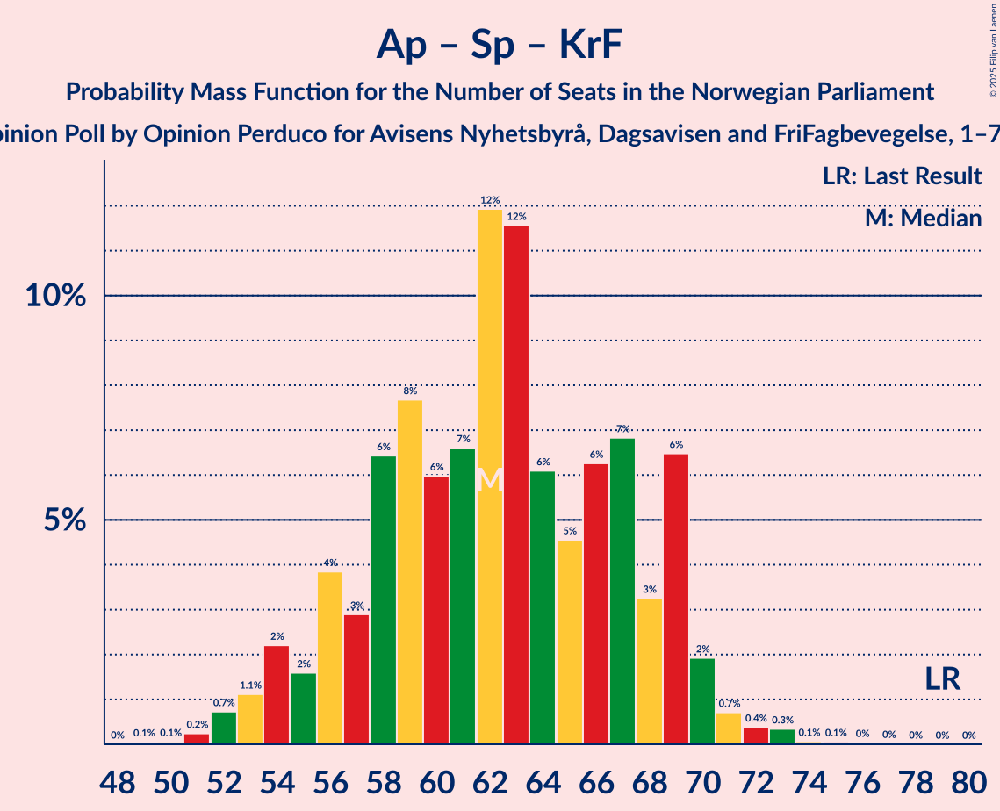

| Number of Seats | Probability | Accumulated | Special Marks |
|:---------------:|:-----------:|:-----------:|:-------------:|
| 49 | 0.1% | 100% |  |
| 50 | 0.1% | 99.9% |  |
| 51 | 0.2% | 99.9% |  |
| 52 | 0.7% | 99.6% |  |
| 53 | 1.1% | 98.9% |  |
| 54 | 2% | 98% |  |
| 55 | 2% | 96% |  |
| 56 | 4% | 94% |  |
| 57 | 3% | 90% |  |
| 58 | 6% | 87% |  |
| 59 | 8% | 81% |  |
| 60 | 6% | 73% | Median |
| 61 | 7% | 67% |  |
| 62 | 12% | 61% |  |
| 63 | 12% | 49% |  |
| 64 | 6% | 37% |  |
| 65 | 5% | 31% |  |
| 66 | 6% | 26% |  |
| 67 | 7% | 20% |  |
| 68 | 3% | 13% |  |
| 69 | 6% | 10% |  |
| 70 | 2% | 4% |  |
| 71 | 0.7% | 2% |  |
| 72 | 0.4% | 0.9% |  |
| 73 | 0.3% | 0.5% |  |
| 74 | 0.1% | 0.2% |  |
| 75 | 0.1% | 0.1% |  |
| 76 | 0% | 0.1% |  |
| 77 | 0% | 0% |  |
| 78 | 0% | 0% |  |
| 79 | 0% | 0% | Last Result |

### Arbeiderpartiet – Senterpartiet

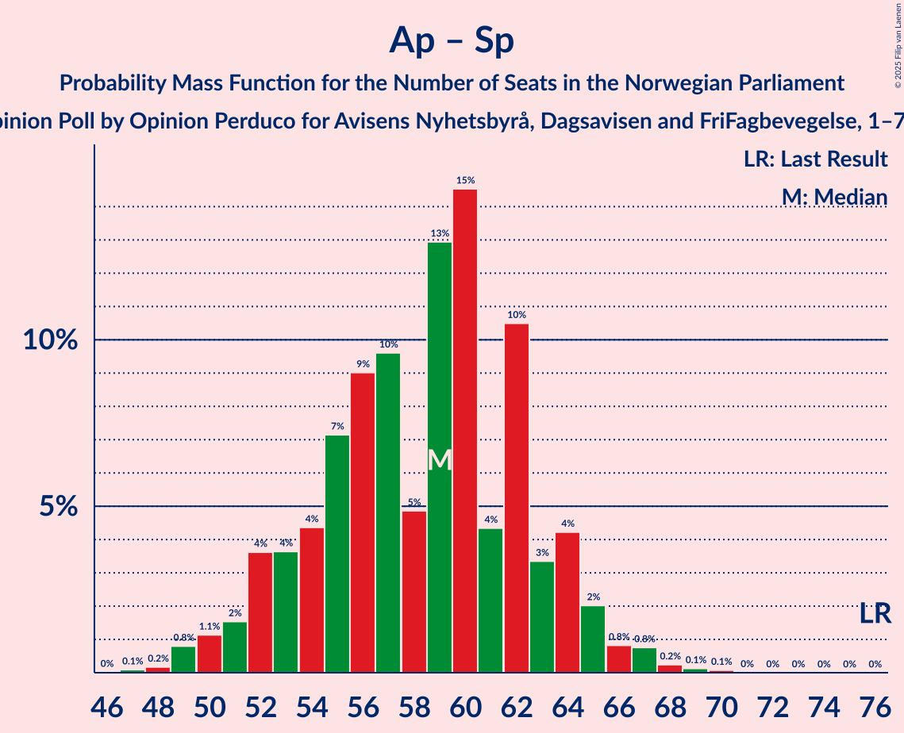

| Number of Seats | Probability | Accumulated | Special Marks |
|:---------------:|:-----------:|:-----------:|:-------------:|
| 47 | 0.1% | 100% |  |
| 48 | 0.2% | 99.9% |  |
| 49 | 0.8% | 99.7% |  |
| 50 | 1.1% | 98.9% |  |
| 51 | 2% | 98% |  |
| 52 | 4% | 96% |  |
| 53 | 4% | 93% |  |
| 54 | 4% | 89% |  |
| 55 | 7% | 85% |  |
| 56 | 9% | 77% |  |
| 57 | 10% | 68% | Median |
| 58 | 5% | 59% |  |
| 59 | 13% | 54% |  |
| 60 | 15% | 41% |  |
| 61 | 4% | 26% |  |
| 62 | 10% | 22% |  |
| 63 | 3% | 12% |  |
| 64 | 4% | 8% |  |
| 65 | 2% | 4% |  |
| 66 | 0.8% | 2% |  |
| 67 | 0.8% | 1.2% |  |
| 68 | 0.2% | 0.5% |  |
| 69 | 0.1% | 0.2% |  |
| 70 | 0.1% | 0.1% |  |
| 71 | 0% | 0% |  |
| 72 | 0% | 0% |  |
| 73 | 0% | 0% |  |
| 74 | 0% | 0% |  |
| 75 | 0% | 0% |  |
| 76 | 0% | 0% | Last Result |

### Høyre – Venstre – Kristelig Folkeparti

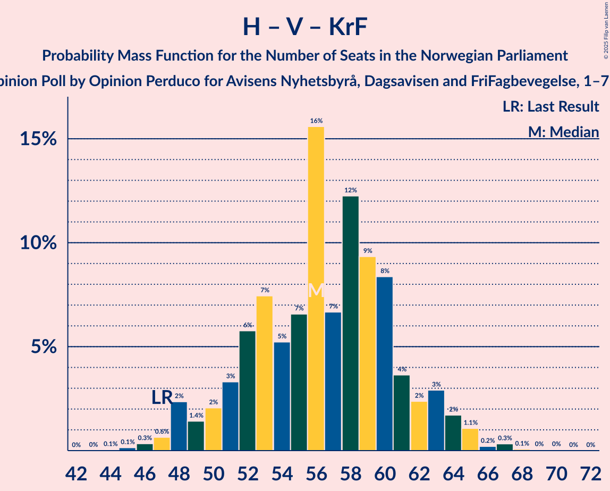

| Number of Seats | Probability | Accumulated | Special Marks |
|:---------------:|:-----------:|:-----------:|:-------------:|
| 44 | 0.1% | 100% |  |
| 45 | 0.1% | 99.9% |  |
| 46 | 0.3% | 99.8% |  |
| 47 | 0.6% | 99.4% | Last Result |
| 48 | 2% | 98.8% |  |
| 49 | 1.4% | 96% |  |
| 50 | 2% | 95% |  |
| 51 | 3% | 93% |  |
| 52 | 6% | 90% |  |
| 53 | 7% | 84% |  |
| 54 | 5% | 76% |  |
| 55 | 7% | 71% |  |
| 56 | 16% | 65% | Median |
| 57 | 7% | 49% |  |
| 58 | 12% | 42% |  |
| 59 | 9% | 30% |  |
| 60 | 8% | 21% |  |
| 61 | 4% | 12% |  |
| 62 | 2% | 9% |  |
| 63 | 3% | 6% |  |
| 64 | 2% | 3% |  |
| 65 | 1.1% | 2% |  |
| 66 | 0.2% | 0.7% |  |
| 67 | 0.3% | 0.5% |  |
| 68 | 0.1% | 0.2% |  |
| 69 | 0% | 0.1% |  |
| 70 | 0% | 0.1% |  |
| 71 | 0% | 0% |  |

### Arbeiderpartiet – Sosialistisk Venstreparti

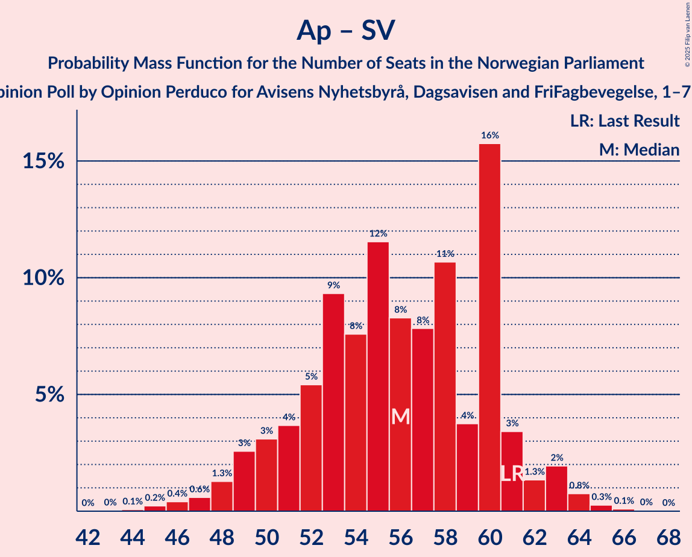

| Number of Seats | Probability | Accumulated | Special Marks |
|:---------------:|:-----------:|:-----------:|:-------------:|
| 44 | 0.1% | 100% |  |
| 45 | 0.2% | 99.9% |  |
| 46 | 0.4% | 99.7% |  |
| 47 | 0.6% | 99.3% |  |
| 48 | 1.3% | 98.7% |  |
| 49 | 3% | 97% |  |
| 50 | 3% | 95% |  |
| 51 | 4% | 92% |  |
| 52 | 5% | 88% |  |
| 53 | 9% | 83% |  |
| 54 | 8% | 73% |  |
| 55 | 12% | 66% | Median |
| 56 | 8% | 54% |  |
| 57 | 8% | 46% |  |
| 58 | 11% | 38% |  |
| 59 | 4% | 27% |  |
| 60 | 16% | 24% |  |
| 61 | 3% | 8% | Last Result |
| 62 | 1.3% | 4% |  |
| 63 | 2% | 3% |  |
| 64 | 0.8% | 1.2% |  |
| 65 | 0.3% | 0.4% |  |
| 66 | 0.1% | 0.2% |  |
| 67 | 0% | 0.1% |  |
| 68 | 0% | 0% |  |

### Senterpartiet – Venstre – Kristelig Folkeparti

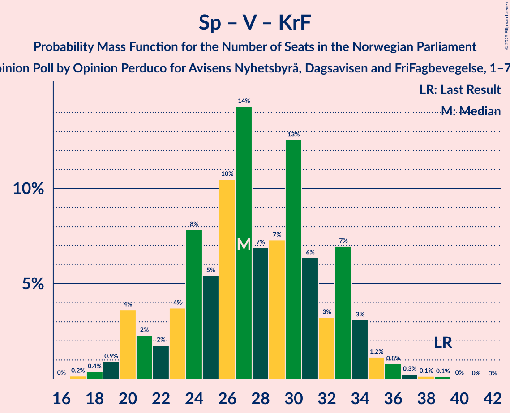

| Number of Seats | Probability | Accumulated | Special Marks |
|:---------------:|:-----------:|:-----------:|:-------------:|
| 16 | 0% | 100% |  |
| 17 | 0.2% | 99.9% |  |
| 18 | 0.4% | 99.8% |  |
| 19 | 0.9% | 99.4% |  |
| 20 | 4% | 98% |  |
| 21 | 2% | 95% |  |
| 22 | 2% | 93% |  |
| 23 | 4% | 91% |  |
| 24 | 8% | 87% |  |
| 25 | 5% | 79% |  |
| 26 | 10% | 74% |  |
| 27 | 14% | 63% | Median |
| 28 | 7% | 49% |  |
| 29 | 7% | 42% |  |
| 30 | 13% | 35% |  |
| 31 | 6% | 22% |  |
| 32 | 3% | 16% |  |
| 33 | 7% | 13% |  |
| 34 | 3% | 6% |  |
| 35 | 1.2% | 3% |  |
| 36 | 0.8% | 1.4% |  |
| 37 | 0.3% | 0.6% |  |
| 38 | 0.1% | 0.4% |  |
| 39 | 0.1% | 0.2% | Last Result |
| 40 | 0% | 0.1% |  |
| 41 | 0% | 0% |  |

## Technical Information

### Opinion Poll

+ **Polling firm:** Opinion Perduco
+ **Commissioner(s):** Avisens Nyhetsbyrå, Dagsavisen and FriFagbevegelse
+ **Fieldwork period:** 1–7 February 2022

### Calculations

+ **Sample size:** 697
+ **Simulations done:** 1,048,576
+ **Error estimate:** 2.62%

